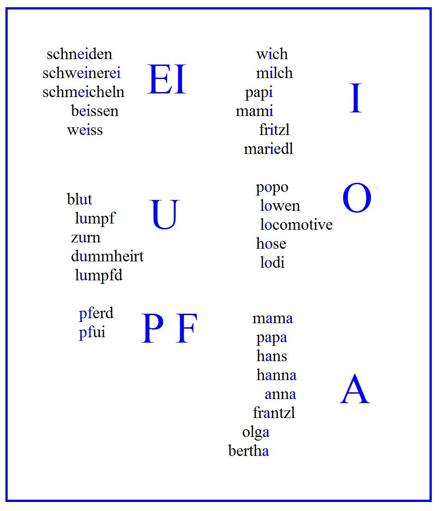

# Leçon 16 | 28 Avril l965

<!-- source-url: http://staferla.free.fr/S12/S12 PROBLEMES.docx -->
<!-- seminar: s12 -->
<!-- lesson: 16 -->

<!-- id: s12-16-0001 -->

[DURAND DE BOUSINGEN](#DURANDDEBOUSINGEN) [Piera AULAGNIER](#PieraAULAGNER2804)

<!-- id: s12-16-0002 -->

LACAN

<!-- id: s12-16-0003 -->

Aujourd’hui nous allons être un peu serrés par le temps. Je me dispense donc du préambule que je fais généralement à ce séminaire fermé, pour donner tout de suite la parole au Docteur DURAND DE BOUSINGEN qui a une communication intéressante à vous faire, dans la même ligne que l’ouvrage de LECLAIRE sur ce qui s’appelle maintenant d’une façon décisive, ce qui est passé dans notre conscience sous le titre de « *POOR (d) J’e-LI* ».

<!-- id: s12-16-0004 -->

[Robert DURAND DE BOUSINGEN](#Avril_28)

<!-- id: s12-16-0005 -->

J’intitulerais volontiers l’essai que je vous présente aujourd’hui : « *De l’intervention de l’association phonématique dans la structuration du fantasme primitif* ».

<!-- id: s12-16-0006 -->

Serge LECLAIRE, dans son propos, a essayé de pointer dans sa forme la plus condensée, la formule où s’origine l’imaginaire de Philippe. La séquence « *POOR (d) J’e-LI* » semble effectivement au plus près du fantasme fondamental, constellation où se rappelle dans le vécu régressif de Philippe, son rapport de l’être au langage, la « culbute » dans la perception éternellement refusée et reprise dans la problématique de l’obsessionnel, du manque à être du langage.

<!-- id: s12-16-0007 -->

*Il est rare*, dit LECLAIRE, *qu’en analyse on arrive à l’aveu de ces formules les plus secrètes*. Bien souvent, c’est à la phrase « *Lili, j’ai soif* » que s’arrête l’investigation analytique. Cette phrase construite avec les défenses de la grammaire, n’est qu’à un niveau secondaire déjà fort élaboré, aboutissement d’un travail de constitution fantasmatique profond, qui, pour rester souvent dans l’ombre de la verbalisation analytique n’implique pas qu’il soit préverbal, en effet, c’est FREUD qui nous dit dans la *Lettre à Fliess* N°79 [^120] : « *En ce qui concerne la névrose obsessionnelle, il se confirme que c’est par la représentation verbale* *et non par le concept lié à celle-ci que le refoulé fait irruption.* »

<!-- id: s12-16-0008 -->

Nous savons par ce qu’il a dit plus tard, que ce fait n’est pas limité à la névrose obsessionnelle.

<!-- id: s12-16-0009 -->

Si l’on examine l’œuvre de FREUD, en particulier dans sa dimension auto–analytique, où s’origine son expérience, l’on est frappé du fait que le déchiffrage freudien s’applique pratiquement toujours à des *structures linguistiques* déjà très élaborées : *mots*, *phrases*.

<!-- id: s12-16-0010 -->

C’est précisément *au niveau de* *la structuration obsessionnelle du discours* qu’intervient l’analyse freudienne. On en trouverait de nombreux exemples dans l’interprétation onirique, dans l’interprétation si « *construite* » du discours de *L’homme aux rats* où interviennent non pas des phonèmes mais des *Wortbrücke*, *ponts de mots*, montrant ainsi combien sa recherche se place fréquemment au niveau nominal.

<!-- id: s12-16-0011 -->

C’est cette perception de la distorsion du discours au niveau du mot, qui donne à l’œuvre de FREUD cette marque d’un génie du jeu de mots, où se trouve pourtant déjà oblitérée l’incarnation du désir dans le phonème originel.

<!-- id: s12-16-0012 -->

Le travail de LECLAIRE m’a ainsi engagé à essayer d’articuler dans cette voie, cherchant à lier *au plus profond du discours du sujet*, *sous l’aspect proprement phonématique du formulé originel,* le destin de celui-ci. Il devrait être ainsi possible d’approcher le langage fondamental du sujet au plus près du niveau primaire, où règne l’identité des perceptions et où joue le pur matériel sonore, dans son opposition phonématique, succession discontinue, alternée et scandée, d’une chaîne sur laquelle *assonance, contiguïté* *et continuité* vont constituer *le discours du sujet*, en l’introduisant dans le monde du *signifiant*, de *la demande* et *du désir*.

<!-- id: s12-16-0013 -->

À ce point je poserais volontiers une première question introductive : est-il possible de pointer dans l’auto-analyse de FREUD, et en particulier dans la *Traumdeutung,* quelque chose qui puisse être au plus près de son fantasme fonda­mental ?

<!-- id: s12-16-0014 -->

Ce me semble une entreprise difficile, bien que brillamment tentée par certains auteurs.

<!-- id: s12-16-0015 -->

Il faut se rappeler ici que la découverte freudienne s’est faite dans le mouvement même de la résistance à celle-ci, et que le discours articulé sur lequel FREUD s’appuie constamment, métaphorise précisément chez lui la dimension même du refoulement.

<!-- id: s12-16-0016 -->

Il est néanmoins possible de retrouver une référence phonématique dans son œuvre, dans un court article intitulé

<!-- id: s12-16-0017 -->

*La signification de la succession des voyelles* [^121] (G.W. VIII 349).

<!-- id: s12-16-0018 -->

FREUD pointe ici un mécanisme de distorsion, conduisant à remplacer un nom par un autre, dont la succession des différentes voyelles est similaire, rappelant ainsi le formulé originel, tabou ou refoulé. Si « trésor chéri » constitue pour Philippe la réminiscence secondairement sacralisée de la parole maternelle, elle va pouvoir se manifester dans le « *POOR (d) J’e-LI* » permis par une succession de voyelles identiques : trés/o /rch /E/r/i

<!-- id: s12-16-0019 -->

P /oo/rdj /E/l/i

<!-- id: s12-16-0020 -->

FREUD, dans cette courte note, privilégie ainsi la voyelle et sa succession sonore. Il serait intéressant d’interroger LECLAIRE sur le rapport possible entre la succession des voyelles du « *POOR (d) J’e-LI* » et celle du nom de Philippe.

<!-- id: s12-16-0021 -->

Mais l’observation du petit Hans n’est-elle pas l’un des seuls textes freudiens, ou l’un des plus remarquables, où l’on puisse tenter de rechercher dans son procès génétique, la structuration du fantasme primitif par association phonématique, au lieu même de la formulation œdipienne transmuée par FREUD[^122], dans le matériel verbal originel de l’enfant.

<!-- id: s12-16-0022 -->

FREUD note d’ailleurs au début de l’observation, l’intérêt de la possibilité de remarquer directement chez l’enfant : « …*ces formations édifiées par le désir que nous défouissons chez l’adulte avec tant de peine de leurs propres décombres.* »

<!-- id: s12-16-0023 -->

Il pointe également dans cette observation (G. W, 256) la structure de type auditif pur [^123], du jeu de gages, et privilégie ainsi une fois de plus « *l’entendu* » par rapport au « *vu* », dans *la structuration du fantasme* chez l’enfant. C’est donc à un essai de pointage des associations phonématiques du petit Hans tout au long de son observation et à travers son évolution, que nous allons nous livrer.

<!-- id: s12-16-0024 -->

Ceci nécessiterait, bien entendu, l’élaboration sur le texte allemand et cet essai nous a montré une fois de plus la catastrophique approximation de la traduction française, rendant toute approche linguistique impossible sur le texte français.

<!-- id: s12-16-0025 -->

Ce travail spéculatif sur un texte essaiera de compléter l’analyse concrète et régressive de *la construction de la fantasmatique* de Philippe.

<!-- id: s12-16-0026 -->

Le texte introduit la question inaugurale de Hans par la phrase :

<!-- id: s12-16-0027 -->

> « *Mama, hast du auch einen Wiwimacher ?* » « *Maman, as-tu également un  Wiwimacher ?* » …suivie, à propos du pis de la vache : 

<!-- id: s12-16-0028 -->

> « *Aus dem Wiwimacher kommt Milch. *» « *Il sort du lait de son Wiwimacher.* » …qui précède immédiatement la menace de la castration de la mère :

<!-- id: s12-16-0029 -->

> « *der schneidet dir den Wiwimacher ab.* » « *on te coupera le* *WiWimacher.* » …amenant la réponse de HANS :

<!-- id: s12-16-0030 -->

« *Je ferai pipi avec mon popo.* » (pourquoi traduire « *tutu* » et perdre ainsi toute possibilité d’analyse linguistique ?).

<!-- id: s12-16-0031 -->

Dans cette séquence très dense, pointons les *mots-clefs* :

<!-- id: s12-16-0032 -->

- *Mama-wiwi-milch*.

<!-- id: s12-16-0033 -->

- *Wiwi-Popo *: assimilation de Hans en réponse à la menace de la castration de la mère.

<!-- id: s12-16-0034 -->

Hans remarque d’ailleurs, articulant autour de *Wiwi-Popo* que ce sont les *L<u>ö</u>wen* (lions) et les *L<u>o</u>k<u>o</u>motive* qui ont des *wiwimacher*.

<!-- id: s12-16-0035 -->

Hans complète son investigation :

<!-- id: s12-16-0036 -->

> « *Papa, hast du auch einen wiwimacher ?* » « *Papa, as-tu également un fais-pipi ?* »

<!-- id: s12-16-0037 -->

Bien sûr, répond le père, introduisant ainsi Hans dans un monde humain caractérisé par l’attribution d’un pénis également revendiqué par la mère. D’où : *Papa - Mama* = possédant un *wiwimacher*. Il est très remarquable qu’à partir de cet instant, *Papa* et *Mama* vont se transformer définitivement, et cela jusqu’à la fin de l’observation, en *Papi*, *Mami* et plus tard *Gross-mami*.

<!-- id: s12-16-0038 -->

L’appropriation du pénis par les parents, se marque ainsi par la contamination du « *i* » de *wiwi* au niveau de la dénomination des figures parentales. Seuls vont rester aliénés à la prédominance du « *A* » les enfants Hans et Hanna. Parmi tous ses amis, (G.W. 25l-252 ) Franzl, Fritzl, Olga, Berta, et Mariedl, c’est Fritzl - une fille, dit-il - et Mariedl qu’il préférera d’ailleurs par la suite.

<!-- id: s12-16-0039 -->

La naissance de Hanna complète les associations de Hans secondairement à la menace de castration de la mère :

<!-- id: s12-16-0040 -->

> « *Aus meinem Wiwimacher kommt kein Blut.* » « *Mon Wiwimacher ne saigne pas.* »

<!-- id: s12-16-0041 -->

Cette association fortement anxiogène, liée à l’accouchement de la mère et fortement réprimée, va se manifester plus tard par l’introduction des séries dominées par le phonème « u », sur lesquelles nous reviendrons.

<!-- id: s12-16-0042 -->

Intéressons-nous maintenant au mot-clef de la phobie : *Pferd*.

<!-- id: s12-16-0043 -->

Celui-ci apparaît tout d’abord, consécutivement à l’affirmation de la mère qu’elle a un *Wiwimacher*, noyé dans un ensemble d’autres objets animés et inanimés. *L’objet phobogène choisi n’est pas la Girafe ou l’Eléphant mais bien le* *Pferd*, s’ordonnant *autour du phonème* « P ».

<!-- id: s12-16-0044 -->

Hans retrouve ainsi, par associations phonématiques avec *Papi*, le signifiant de la fonction paternelle et le simple choix phonématique permet d’appuyer l’interprétation de FREUD du rapport du cheval avec la figure paternelle.

<!-- id: s12-16-0045 -->

Le refus de la mère de toucher le pénis de Hans, va structurer - appelant la menace de castration, « *Schneiden* » - une autre série phonématique, qui tirera sa particularité d’être directement en réponse à *l’expression maternelle* concernant la demande de Hans :

<!-- id: s12-16-0046 -->

> « *Es ist eine Schweinerei* », « *c’est une cochonnerie* ».

<!-- id: s12-16-0047 -->

Le premier rêve d’angoisse précédant la phobie (G.W. 259) connote la peur que la mère ne parte, privant Hans du *Schmeicheln*, *faire câlin*, expression originale de Hans, puisque expliquée dans le texte. On voit ici l’association par assonance qui pointe le même contenu fantasmatique que « *Schneiden* », association constituant une réponse phonématique à la menace de castration.

<!-- id: s12-16-0048 -->

La peur de la perte du *Schmeicheln* précède immédiatement la phobie proprement dite : « *das mich ein Pferd beissen wird* ».

<!-- id: s12-16-0049 -->

Toute cette série, s’articulant autour de la menace maternelle, est pointée par la série phonématique : *Schneiden*, *Schweinerei* (paroles de la mère) *Schmeicheln*, *beissen* (paroles de Hans), série s’organisant sur le mode phobique (G.W. 260).

<!-- id: s12-16-0050 -->

L’angoisse se traduit ainsi littéralement par les mots : *Schmeicheln* va provoquer *Beissen*. Par ailleurs, ce sont les chevaux *weiss* (*blancs*) qui mordent, complétant ainsi cette série (G.W. 265).

<!-- id: s12-16-0051 -->

La castration symbolique n’est à aucun moment signifiée à Hans par son père : celui-ci n’ose que lui dire que les femmes n’ont pas de *Wiwimacher* (ce que Hans ne peut pas croire), et que ce sont les femmes qui font les enfants, laissant ainsi celui-ci en suspension dans sa crainte imaginaire de la castration. Toute l’observation montrera combien cette recherche restera anxieuse et relativement vaine, au niveau de la parole du père, qui signifiera finalement à l’enfant : « *Toi et moi nous avons un pénis, mais ce sont les femmes qui font les enfants* ».

<!-- id: s12-16-0052 -->

N’est-ce pas là, ce qui constituera le manque définitif de Hans ?

<!-- id: s12-16-0053 -->

C’est après l’insistance du père dans son interprétation forcée du cheval-père castrateur (G.W. 287-88), que va intervenir la séquence phonématique dominée par les « U », et qui ponctue la régression anale de Hans. C’est quand il est en colère (*Zurn*) qu’il retient son *Lumpf* (G.W. 288). Ce *Lumpf* va apparaître dans le discours à propos des *Hose,* *culottes* de la mère, reprenant l’association antérieure *Wiwi = Popo*, fortement réprimée de la première menace maternelle, le dégoût de HANS va s’exprimer par une condensation entre le « P » et le « U » : *<u>P</u>f<u>u</u>i*.

<!-- id: s12-16-0054 -->

Peut-on à ce niveau phonématique, rapprocher cette série régressive d’une autre méconnaissance du père - et de FREUD d’ailleurs - quand il propose la nomination de la phobie de Hans comme une *Dummheit *? Rappelons-nous que le *Blut*(*sang*), violemment refoulé du début de l’observation vient ainsi ponctuer le vécu de l’accouchement d’Anna. Ce rappel se confirme(G.W. 293) quand Hans reprend l’histoire de Fritzl, qui a *geblutet* (*saigné*) quelques lignes plus loin, révélant que c’est là qu’il a attrapé la *Dummheit*, la bêtise.

<!-- id: s12-16-0055 -->

Une extraordinaire constellation signifiante apparaît ainsi à ce point autour du « U » que nous rappelons brièvement :

<!-- id: s12-16-0056 -->

- le « U » de *Dummheit* pointe la méconnaissance du père et de FREUD,

<!-- id: s12-16-0057 -->

- le « U » de *Lumpf* pointe la méconnaissance du père avec la régression anale corrélative,

<!-- id: s12-16-0058 -->

- le « U » de *Blut* pointe la castration imaginaire vécue dans la parole de la mère. 

<!-- id: s12-16-0059 -->

On peut extraire un nouveau fil associatif dans la structure phonématique, au moment où (G.W. 302) le père assimile le *Lumpf* aux poils pubiens de la mère, à son *wiwimacher* : le père de Hans va noter alors la transformation définitive du *Lumpf* en *Lumpfi* rétablissant ainsi dans l’organisation phonématique du signifiant anal, le pénis maternel exprimant la persistance de Hans dans la méconnaissance de la différence des sexes. Ce même registre va sous-entendre le nom imaginaire de son enfant préféré : *L<u>o</u>d<u>i</u>*, introduisant vraisemblablement la série des *Saffalodi*, *schokolodi*, etc., où se signifie par l’association des *<u>0</u>*, *<u>I</u>*, *<u>A</u>*, l’appréhension de *la théorie anale de la naissance* révélée par le père de Hans, qui va constituer l’extrême pointe du dévoilement de la parole.

<!-- id: s12-16-0060 -->

Chaque lettre semble ainsi ponctuer par sa dominante phonématique un secteur de l’imaginaire du sujet et en constituer l’élément vectoriel et dynamique dans l’élaboration du discours de celui-ci :

<!-- id: s12-16-0061 -->

- la lettre « I » ponctue ce que l’on pourrait appeler l’attribut du pénis, où Hans manifeste son effort à l’attribuer « aux parents », essayant ainsi de surmonter dans l’imaginaire la forclusion de son rapport au phallus dans la parole du père.

<!-- id: s12-16-0062 -->

- Le « 0 » place la régression anale de Hans combinée avec le « U » de *Blut* castrateur qui va promouvoir le *Lumpf*.

<!-- id: s12-16-0063 -->

- C’est autour du « P » que va tourner la problématique paternelle de l’observation.

<!-- id: s12-16-0064 -->

- Le « A » *attirera les humains sans pénis* : *Hanna*, *Hans*, en regard de ceux qui le possèdent : *Vatti*, *Mammi*.

<!-- id: s12-16-0065 -->

Ces éléments phonématiques, artificiellement isolés à ce point de notre investigation, vont suivre dans l’élaboration du mot les mécanismes fondamentaux des processus primaires. La fixité de leur structure va se rappeler dans les dédoublements phonématiques, signifiants répétitifs du refoulé dans le discours. Ce dédoublement d’une extrême importance ne peut être qu’indiqué ici : *Schw<u>ei</u>ner<u>ei</u>*, *P<u>a</u>p<u>a</u>*, *M<u>a</u>m<u>a</u>*, *<u>A</u>nn<u>a</u>*, *P<u>o</u>p<u>o</u>*, etc.

<!-- id: s12-16-0066 -->

Il pourrait constituer à notre niveau, une forme spécifique de la fonction de redondance décrite par Roman JAKOBSON[^124].

<!-- id: s12-16-0067 -->

En même temps, le déplacement-substitution et la condensation, témoins de l’interchangeabilité des éléments, vont aboutir à une organisation de plus en plus complexe.

<!-- id: s12-16-0068 -->

<!-- id: s12-16-0069 -->

La métaphore majeure semble ici l’assimilation du I et du 0 sur laquelle nous avons déjà insisté. La condensation produira les figures complexes des mots clefs de l’observation :

<!-- id: s12-16-0070 -->

- *Lumpf* condense le U et le PF,

<!-- id: s12-16-0071 -->

- *Pferd* donne *Pfui* en ajoutant le I dans la négation du désir, etc.

<!-- id: s12-16-0072 -->

C’est au moment où le discours aboutit à sa forme élaborée adulte que sera définitivement figée dans le mot et la phrase, la structure inconsciente, trace perdue de la communication, qui passe sous la loi aliénante essentiellement diachronique du discours commun.

<!-- id: s12-16-0073 -->

Mais la *constante poussée* du désir primaire va conduire à réitérer la demande et étendra son champ d’appel. Ainsi les chaînes métonymiques qui vont aboutir aux articulations pré–conscientes des demandes, vont désormais porter en elles ces signifiants phonématiques électifs et primitifs qui ont connoté le passage du sujet par les stades classiques des pulsions orales et anales.

<!-- id: s12-16-0074 -->

En regard de cet essai d’appréhension du discours, *au niveau phonématique*, se place le type d’interprétation signifiante de FREUD, s’adressant essentiellement *aux connections des mots*. C’est l’assonance du mot qui introduit un signifiant nominal, le *Wort* nouveau :

<!-- id: s12-16-0075 -->

- « *Wegen dem Pferd* » devient « *wägen* » expliquant ainsi la phobie des voitures (G.W. 293),

<!-- id: s12-16-0076 -->

- *Bohrer* réfère à *geboren*.

<!-- id: s12-16-0077 -->

FREUD remarque même en note (G.W. 294), à propos de l’insistance du père sur l’explicitation du « *Wegen dem Pferd* » qu’il n’y a rien d’autre à découvrir que la connexion de mots, *Wortanknüpfung*, qui échappe au père.

<!-- id: s12-16-0078 -->

Il me faut maintenant m’arrêter pour - si possible - vous interroger.

<!-- id: s12-16-0079 -->

Vous n’aurez pas été sans remarquer qu’une telle position méthodologique réfère plus à *l’alogisme du processus primaire* qu’à la logique du conscient, encore que les nécessités de la communication orale et ma tendance rationalisante aient pu voiler le *chatoiement ubiquitaire* et la scintillante et éphémère combinatoire de l’inconsciente résonance phonématique.

<!-- id: s12-16-0080 -->

Une telle approche peut-elle apporter un jour nouveau à la compréhension de la constitution du discours, chez l’enfant, ou de sa régression structurale, chez le psychotique en particulier ?

<!-- id: s12-16-0081 -->

Les travaux de WINNICOT[^125] chez l’enfant, qui s’incarne dans le phonème (*La psychanalyse* n° 5, pp. 2l-4l), ou ceux de PERRIER[^126] 

<!-- id: s12-16-0082 -->

(*L’évolution psychiatrique*, l958, 11, 421-444), où la régression schizophrénique du langage de son patient rejoint la dimension phonématique à travers ses exercices de solfège, pétrification sonore ou mécanique de son désir, seraient à cet égard éclairants.

<!-- id: s12-16-0083 -->

Revenant au petit Hans, on pourrait montrer sur de nombreux exemples, comment l’appréhension de cette dimension phonématique permet de retrouver les interprétations de FREUD.

<!-- id: s12-16-0084 -->

Celui-ci interprète la figure du cheval qui fait « *charivari* » comme une peur et un souhait de la castration du père.

<!-- id: s12-16-0085 -->

En allemand, cette séquence répond au *Pferd* qui *Beisst* - punition de la morsure référant à la culpabilité des « *Schweinereien *» (*cochonneries*) de Hans - et au *Pferd* qui fait *Krawal* (*charivari*) manifestant ainsi son passage dans la dimension des « A » : individus sans pénis et sans puissance. Le *Krawal* - terme inventé par Hans - est donc marqué de la castration imaginaire.

<!-- id: s12-16-0086 -->

Le « A » rejoint ici le « EI » de *Beissen*. Le discours de HANS répond ici - non pas à la lettre mais au phonème - à ce que FREUD nous dit de sa peur du père et pour son père. Beaucoup plus imprudemment encore - l’audace ne sourit qu’à l’inconscient – approchons-nous avec notre bien fragile clef de la *Traumdeutung*. Nous allons pointer tout d’abord quelques lignes fondamentales, bien que dissimulées dans le début du chapitre VII (G.W., II–III, 530) traitant de *L’oubli dans les rêves* : « *Dans les rêves les mieux interprétés, il faut souvent laisser une place dans l’obscurité ; on approche alors d’un nœud de pensées … : c’est le nombril du rêve, le lieu qui se rattache au non reconnu (die Stelle, an der er dem Unerkannten aufsitzt) Les pensées du rêve se ramifient de tous côtés dans l’entrelacs de nos pensées. De la place la plus dense (aus einer dichteren Stelle) de ce réseau, surgit le désir du rêve comme le champignon de son mycélium.* »

<!-- id: s12-16-0087 -->

\[*In den bestgedeuteten Träumen muß man oft eine Stelle im Dunkel lassen, weil man bei der Deutung merkt, daß dort ein Knäuel von Traumgedanken anhebt, der sich nicht entwirren will, aber auch zum Trauminhalt keine weiteren Beiträge geliefert hat. Dies ist dann der Nabel des Traums, die Stelle, an der er dem Unerkannten aufsitzt. Die Traumgedanken, auf die man bei der Deutung gerät, müssen ja ganz allgemein ohne Abschluß bleiben und nach allen Seiten hin in die netzartige Verstrickung unserer Gedankenwelt auslaufen. Aus einer dichteren Stelle dieses Geflechts erhebt sich dann der Traumwunsch wie der Pilz aus seinem Mycelium.* (*Traumdeutung,* VII, A) \]

<!-- id: s12-16-0088 -->

Ce véritable *lieu de l’inconscient*, lieu du refoulement primaire, d’où surgit le désir, ne pourrait-il être « lié » à une prédominance, phonématique ? Proposition que nous voudrions soutenir par une référence au *rêve Marburg-Hollthurn* (G.W. II–III 438–523).

<!-- id: s12-16-0089 -->

Toute la dynamique de ce rêve s’exprime par le passage du « A » de : *M<u>a</u>rburg, m<u>a</u>lade, M<u>a</u>tter, m<u>a</u>tière*, au « 0 » de : *H<u>o</u>llthurn, H<u>o</u>lothurien, M<u>o</u>lière, M<u>o</u>tion of the b<u>o</u>wels*. Sa signification est si grossièrement injurieuse et scatologique que FREUD ne peut qu’en indiquer le sens, relevant de la psychologie anale.

<!-- id: s12-16-0090 -->

C’est dans ce même rêve, que d’avoir mis un *RE* (*R*) anglais là où il ne convenait pas, amène les pensées de FREUD à la scène infantile de caractère incestueux où il fut chassé par un mot énergique du père, *ein Machtwort* : littéralement un mot de pouvoir ou d’autorité, qui fut peut-être simplement « *fort* *!* »

<!-- id: s12-16-0091 -->

Ce que nous dira FREUD concernant l’assimilation de l’incorrection grammaticale de *from* à *fromm* - *pieux* en allemand - et de son rapport à l’impiété devant la personne sacrée du père, ne se trouve-t-il pas déjà contenu dans la dynamique qu’introduit le phonème « 0 » dans ces deux mots ? Ici remarquons-le, le signifiant littéral majeur pointé par FREUD : passage du A au O, se confond très exactement avec sa dimension phonématique.

<!-- id: s12-16-0092 -->

Allant maintenant jusqu’à l’extrême :

<!-- id: s12-16-0093 -->

- Serait-il possible d’isoler des structures phonématiques signifiantes, au niveau même de la constitution de la parole, appelant ainsi à des références phonétiques ?

<!-- id: s12-16-0094 -->

- Ne pourrait-il y avoir des affinités structurales élémentaires entre certains phonèmes - atomes symboliques a dit SAPIR[^127] - \[[E. Sapir, Le langage](http://classiques.uqac.ca/classiques/Sapir_edward/langage/le_langage.pdf)\] et l’expression rémanente et répétitive du niveau primaire, ceci par exemple à partir de la remarque que la négation s’exprime dans un très grand nombre de langues par des éléments le plus souvent monosyllabiques à articulation nasale ?

<!-- id: s12-16-0095 -->

La théorie de JESPERSEN[^128] indique par exemple la tendance des sons à se grouper selon leur degré de sonorité, (*degré d’aperture dans la constitution des syllabes* de Ferdinand de SAUSSURE) \[F. de Saussure : *Cours de linguistique générale*, Op. cit.\].

<!-- id: s12-16-0096 -->

Les nombreuses exceptions au schéma de JESPERSEN ne seraient–elles pas hautement significatives du point de vue de la structuration sémantique du fantasme original, constituant une *singularité exquise* du sujet ? Il conviendrait en ce point \- vous le sentez bien - de reprendre cet essai à la lumière des travaux de la linguistique structurale, cherchant là aussi, comme le dit Roman JAKOBSON[^129] : « …*à analyser systématiquement les sons de la parole à la lumière du sens, et le sens lui-même en se référant à sa forme phonique.* »

<!-- id: s12-16-0097 -->

C’est sur cette arête existentielle, liant indissolublement la phonétique et la sémantique - reprenant à ce niveau le dernier exposé de LECLAIRE - que s’incarne le désir dans l’intersection de deux champs, à l’articulation du son et du sens. Si les phonèmes ne sont que pure altérité, ils sont également le produit d’un sujet en mouvement moteur, acoustique ou auditif, émettant ou recevant des traits distinctifs à partir de *la matière sonore brute*. *La corporéité du signifiant, n’est-ce pas alors précisément le son reçu dans sa modulation matérielle*, émis dans un fonctionnement dynamique de l’organe vocal, reçu par une masse corporelle plus ou moins sécurisée ?

<!-- id: s12-16-0098 -->

La recherche de la maîtrise gestuelle de l’obsessionnel, n’est–ce pas au niveau du langage, cet effort dramatique de relier celui-ci à sa corporéité fondamentale que lui dissimule constamment la fuite métonymique de son désir, d’autant moins supportable qu’il ne peut s’incarner nulle part ? LECLAIRE a très finement noté ce moment où le fantasme primitif de Philippe réalise cette approche de la corporéité originaire dans cette jubilation du type « *s’enrouler – se déplier* » éternellement recommencée, moment existentiel ponctiforme où vraiment le verbe s’incarne au plus profond de l’expérience corporelle.

<!-- id: s12-16-0099 -->

Langage *du corps*, certes, mais surtout langage *avec* *un corps*, statique et kinétique, récepteur et émetteur d’une ligne temporelle et mélodique, à travers le plaisir jaculatoire d’un corps enfin signifiant. Philippe semble être ici au plus près d’un représentant de cette répétition circulaire des chaînes inconscientes primitives, forme originelle de la demande, mais où la retrouvaille de la dimension de l’être va le mettre sur le chemin d’un « *pouvoir assumer la perte* », effet de la mise en place du signifiant.

<!-- id: s12-16-0100 -->

Je verrais volontiers alors dans la perception de la barre qui sépare *la loi phonétique* de *la loi sémantique* en même temps qu’elle les lie indissolublement, un moment privilégié où s’introduit pour le sujet, dans l’expérience auditive vécue, la perception du fondement même de la découverte analytique : le *sens du sens*, plus clairement de *la structure du signifiant*.

<!-- id: s12-16-0101 -->

L’on serait ici au plus près de la rupture vécue entre le *phonétique* et le *sémantique*, expérience se constituant dans une mystérieuse déhiscence du champ auditif et vocal, qui introduit le sujet à l’approche de la signifiance de son discours, le conduisant ainsi dans son expérience subjective même de l’acte de la parole, à cette « *connotation de l’antinomie* » dont parlait LECLAIRE.

<!-- id: s12-16-0102 -->

L’avènement au sens, du son, va conduire le sujet à pouvoir placer son discours au niveau de son image spéculaire enfin placée et reconnue. Le sens, creux de la demande, béance radicale jusque là angoissante, va pouvoir s’ancrer au corps du sujet enfin reconnu, et lui permettre de passer de la parole vide à la parole pleine. C’est de là que la communication d’un fantasme primitif tel que celui de Philippe en analyse, me paraît tirer sa valeur inaugurale pour le sujet. Le fait que l’appréhension d’un tel niveau est rare dans *l’analyse de l’obsessionnel*, ne fait que nous rappeler ce que nous savons sur les difficultés de sa cure.

<!-- id: s12-16-0103 -->

Cette dimension phonématique toujours résiduelle, ne va-t-elle pas constituer pour le sujet, le rappel de l’inconscient même, référence à l’identité des perceptions du niveau primaire, perçant au niveau d’une « *différence exquise* », rompant le fil du discours et que percevra parfois le patient ou le psychanalyste.

<!-- id: s12-16-0104 -->

Enfin la question se pose de savoir comment éviter, à ce niveau d’étude phonématique, une *distorsion jungienne*, en précisant bien la structure d’une éventuelle prématuration phonétique dans l’articulation du *signifiant* au premier discours du sujet. Comme vous le voyez j’ai réintroduit - mais ne faut-il pas toujours la réintroduire - la question du statut topologique de la dimension phonématique dans le champ de l’analyse. Le phonème ne nous mène-t-il pas, comme le dit Jacques LACAN[^130] :

<!-- id: s12-16-0105 -->

> « *au plus près des sources subjectives de la fonction symbolique.* »

<!-- id: s12-16-0106 -->

C’est dans le « *Fort-Da, oh !* » de l’absence, « *ah !* » de la présence, dans un couple symbolique de deux *jaculations* élémentaires, que l’objet s’enferre et se piège.

<!-- id: s12-16-0107 -->

« *C’est ainsi que le symbole se manifeste d’abord comme meurtre de la chose et cette mort constitue pour le sujet l’éternisation de son désir »* 

<!-- id: s12-16-0108 -->

\[*La psychanalyse* n° 1 p. 123, *Écrits* p. 319\]

<!-- id: s12-16-0109 -->

Pourquoi ne pas conclure maintenant comme le faisait Jacques LACAN dans son *Rapport de Rome* en appelant sur nous la parole des dieux hindous : « *Da*... *Da*... *Da*... »

<!-- id: s12-16-0110 -->

LACAN

<!-- id: s12-16-0111 -->

Le désir que j’ai, que notre réunion d’aujourd’hui remplisse le programme que je m’étais donné…

<!-- id: s12-16-0112 -->

> à savoir d’introduire un nouvel aiguillage
>
> dans notre travail du séminaire fermé par le texte que Madame AULAGNIER va vous communiquer …ce désir fera que je ne pourrai répondre que brièvement à ce travail dont je pense que l’intérêt ne vous a point échappé.

<!-- id: s12-16-0113 -->

Je veux dire que c’est un travail, en fin de compte, assez inaugural, quoiqu’il succède à celui de LECLAIRE dans un certain champ d’exploration où il s’avère au moins une recherche possible, si elle n’est pas encore peut-être tout à fait suffisamment située.

<!-- id: s12-16-0114 -->

Je pense pourtant - dans mon dernier cours - avoir marqué moi-même le point précis de la topologie où il faut concevoir que s’inscrit la formule du type « *POOR (d) J’e-LI* ». Je ne n’avancerai donc, pour l’instant dans aucune articulation poussée au point de vue dogmatique, sur la situation à proprement parler de cette veine de recherche que vient de vous illustrer brillamment DURAND DE BOUSINGEN.

<!-- id: s12-16-0115 -->

Je ne peux même pas pointer, si ce n’est de la façon la plus courte et la plus allusive, les points où il apparaît que cette recherche montre une direction à développer. Je veux simplement lui faire remarquer au moment où il introduit la diphtongue « *ei* » de « *schn<u>ei</u>den*, *schw<u>ei</u>ner<u>ei</u>*, *w<u>ei</u>ss* et *b<u>ei</u>ssen* » : quelle est cette chuintante étroitement associée à toutes les formes de sifflantes, c’est-à-dire de consonnes nommément sous leurs deux espèces : chuintantes et sifflantes *<u>sch</u>neiden*, *<u>sch</u>weinerei*, *bei<u>ss</u>en*, et *wei<u>ss</u>*, et j’en passe ?

<!-- id: s12-16-0116 -->

Ce qui est important. Je ne fais ici que le pointer pour la suite.

<!-- id: s12-16-0117 -->

De même associée à la vocalise « ou » \[U\] au moment où elle apparaît vous pourrez - « ou » \[U\] qui est une labiale - vous y voyez également associées les consonnes labiales nommément le « L » de *<u>Lumpf</u>* lui–même, le « PF » de *<u>Pferd</u>* et la labiale \[...\].

<!-- id: s12-16-0118 -->

Ceci est également important à relever, j’en souligne l’intérêt. Quoique je le discuterais volontiers, je ne lui donnerais peut-être pas exactement la même interprétation qu’il lui donne, à savoir de représentant en somme de l’objet phallique, si j’ai bien compris qu’il donne à l’intrusion du « I » dans les successions phonématiques qu’il a relevées, mais ceci ferait l’objet d’une discussion particulière.

<!-- id: s12-16-0119 -->

Là encore, peut-être à des fins de mettre en garde ceux qui ne seraient qu’à demi avertis...

<!-- id: s12-16-0120 -->

je ne sais pas si là-dessus DURAND DE BOUSINGEN se fait des illusions, il aurait pu l’engendrer ...je voudrais lui faire remarquer que l’interprétation de l’affinité phonétique des voyelles, dans JESPERSEN, et dans JAKOBSON se font strictement à l’opposé l’une de l’autre. À savoir que là où il y a chez JESPERSEN échelle de sonorité, l’analyse de JAKOBSON procède - comme il l’a, une fois pour toutes, admirablement fondé dans sa méthode, \[...\] *Preliminaries* [^131] que vous connaissez certainement - procède par *distinctive features*, traits distinctifs, et nommément que le « a » s’opposerait ici aux autres voyelles comme le compact au diffus, d’autres traits distinctifs intervenant en cette occasion.

<!-- id: s12-16-0121 -->

Ceci, je pense, a fourni à ceux qui ont su prendre des notes, matière à question. Ces questions pourront m’être adressées dans divers contextes, mais pour ceux qui ne peuvent m’atteindre qu’ici, je prie les personnes qui auront quelque chose à ajouter dans la ligne d’un pareil travail, de le faire à moi-même directement parvenir. Car *la ligne de départ*, la veine ouverte par ce travail de LECLAIRE, je ne la considère pas pour autant comme fermée, on a le temps d’ici la fin de l’année d’y revenir.

<!-- id: s12-16-0122 -->

Ceci aussi me donne l’occasion de m’excuser auprès de personnes qui m’ont communiqué deux textes fort intéressants l’un : celui de René MAJOR qui tenait à répondre *très spécialement peut-être* au fait de la torsion ou de l’objection qu’a pu lui faire, la dernière fois, SAFOUAN. Je regrette de ne pas pouvoir faire passer aujourd’hui ce travail de René MAJOR, je n’en ai pas non plus un très grand remords puisque, aussi bien, je pense que nous aurons l’occasion de le faire revenir ici par un autre biais.

<!-- id: s12-16-0123 -->

Il nous donne en effet, dans sa réponse, un résumé très élégant, de ce que STEIN a mis en évidence au niveau de son séminaire sur *Totem et Tabou* nommément concernant la parenté, l’affinité, voire la superposition, de la barrière de l’inceste à la barrière qui sépare l’inconscient du préconscient. C’est une question immense dont il ne faut pas regretter qu’elle soit aujourd’hui laissée ouverte sans que nous puissions très précisément en débattre.

<!-- id: s12-16-0124 -->

Je veux tout de même dès maintenant prendre une position strictement identique à celle que j’ai prise la dernière fois au moment de l’intervention de SAFOUAN : c’est la pertinence de la remarque…

<!-- id: s12-16-0125 -->

> à laquelle je ne crois pas que, à la lecture première que j’ai faite du texte de MAJOR, MAJOR réponde …la remarque que je crois très pertinente de SAFOUAN, qui est que c’est dans la mesure où nous approchons de cette barrière de l’inceste, que l’autre barrière, celle qui est entre l’inconscient et le préconscient, se trouve régulièrement - enfin dans l’expérience - se trouve franchie, et que se produit *le retour du refoulé*. Ce qui indique tout au moins que si les barrières peuvent se voisiner ou se croiser quelque part elles ne fonctionnent pas dans le même sens.

<!-- id: s12-16-0126 -->

Mais ceci, je le répète, est simplement quelque chose que nous pointons, un repère pour l’avenir.

<!-- id: s12-16-0127 -->

La deuxième personne envers laquelle je veux m’excuser est Béatrice MARKOWITCH, qui nous a fait une très remarquable note qui se trouve ainsi nous confirmer - après celle de Francine MARKOWITCH - que ce ne sont pas forcément les techniciens qui manifestent, dans ce champ qui est le nôtre ici et que j’essaie de faire appréhender, la plus grande sensibilité.

<!-- id: s12-16-0128 -->

À cet égard bien sûr, je ne veux pas manquer de mentionner que le travail de LECLAIRE qui nous a intéressés de la façon la plus brûlante *est un travail déjà ancien* et que, si je peux me réjouir de quelque chose, à savoir de voir qu’en somme, surgissant d’un certain point de mon enseignement, il peut s’en produire d’autres, d’autres travaux, je ne peux évidemment que déplorer le temps de latence que peut-être *une organisation*, pendant quelques années, qui n’est autre que celle de *la société* à laquelle nous appartenons tous, doit bien avoir quelque part, dans ce retard du surgissement de travaux - que puisqu’ici le terme en est employé - *de travaux lacaniens*.

<!-- id: s12-16-0129 -->

Je donne donc la parole, sur un sujet qui marque un temps, à savoir que ce n’est pas à des travaux datant de huit ans que nous devons nous en tenir, qu’il conviendrait ici…

<!-- id: s12-16-0130 -->

> c’était un peu l’objet du propos de SAFOUAN sous sa forme d’appel un peu agressif …qu’il y a des choses qui ne sont pas encore *dix mille fois remâchées* et qui sont aussi très intéressantes.

<!-- id: s12-16-0131 -->

C’est dans ce genre que va s’avancer Madame AULAGNIER à qui je donne maintenant la parole.

<!-- id: s12-16-0132 -->

[Piera AULAGNIER](#Avril_28)

<!-- id: s12-16-0133 -->

La spécificité d’une demande ou la première séance.

<!-- id: s12-16-0134 -->

« *Celui qui tente d’apprendre dans les livres le noble jeu des échecs ne tarde pas à découvrir que seules les manœuvres du début et de la fin per­mettent de donner de ce jeu une description schématique complète, tan­dis que son immense complexité, dès après le début de la partie, s’oppo­se à toute description.* »

<!-- id: s12-16-0135 -->

(S. FREUD* : La Technique Psychanalytique,* « *Le début du traitement* ».)

<!-- id: s12-16-0136 -->

« *Je l’interroge sur les raisons qui l’amènent à mettre au premier plan des données relatives à sa vie sexuelle. Il répond que c’est là ce qu’il connaît de ma doctrine. Il n’aurait, du reste, rien lu de mes écrits mais naguère, en feuilletant un de mes livres, il aurait trouvé l’explication d’enchaîne­ment de mots absurdes qui lui rappelèrent tellement ses « élucubrations cogitatives » avec ses propres idées qu’il résolut de se confier à moi… Il avait l’intention de demander au médecin un certificat comme quoi la cérémonie avec A, qu’il avait inventée était nécessaire à son rétablisse­ment. Le hasard qui fit tomber un livre entre ses mains dirigea son choix sur moi, mais il ne fut plus question chez moi de ce certificat.* »

<!-- id: s12-16-0137 -->

(S. FREUD* : L’Homme aux rats*)*.*

<!-- id: s12-16-0138 -->

Entre le moment où *L’Homme aux rats* décide d’aller voir un médecin pour lui demander un certificat…

<!-- id: s12-16-0139 -->

> mais il aurait pu aussi bien aller lui demander un médicament ou un conseil, peu importe …et celui où il se présente chez FREUD, quelque chose est venu changer radicalement l’objet de sa demande : le hasard le fit tomber sur un livre de FREUD et ce livre va décider de son choix. Ce qu’il vient demander à FREUD, c’est que celui-ci mette son savoir en œuvre afin qu’au *non-sens* du *symptôme* se substitue une parole qui retrans­forme ses *élucubrations cogitatives* en discours, ce qu’il connaît de ce savoir c’est qu’il a trait à la vie sexuelle, soit au désir.

<!-- id: s12-16-0140 -->

C’est en ce moment précis où le sujet accepte ce que j’appellerais l’hypothèse - et l’hypothèque - de l’in­conscient, qu’il y a permutation de l’objet de la demande et que s’inaugure le transfert.

<!-- id: s12-16-0141 -->

Ce que je voudrais démontrer par cet exposé, c’est qu’il y a dès la première séance une mise en place originelle de ce que j’appellerai « *le discours transfé­rentiel et l’économie qui le régit* ». Pour ce faire, je tenterai de dégager les points suivants :

<!-- id: s12-16-0142 -->

1)  Les manœuvres du début trouvent leur origine dans un préalable de la rencontre. Ce premier temps a façonné de manière privilégiée le désir de l’analyste mais aussi la demande du sujet. On ne peut concevoir la rela­tion analytique comme se déroulant entre un sujet vierge de tout savoir et un autre seul supposé savoir.

<!-- id: s12-16-0143 -->

2)  Dans la cure, le sujet, quoiqu’il dise, ou ne dise pas, est toujours présent comme seul discours, sujet-objet de la parole, qu’il parle ou que ça parle, c’est la parole prise comme objet qui devient objet d’analyse. L’analyste, qu’il interprète ou qu’il ne soit qu’écoute, fait partie intégrante de ce dis­cours. C’est dans *ce registre*, et seulement dans celui-ci, que s’actualise ce qu’on appelle communément un phantasme de fusion.

<!-- id: s12-16-0144 -->

3)  S’il est vrai que la technique analytique n’est possible qu’à partir d’une notion articulée du sujet, cette articulation nous le désigne comme être de parole venant par son dire se faire charnière et dévoilement entre registre de la demande et registre du désir.

<!-- id: s12-16-0145 -->

4)  Si, au niveau de la demande, nous sommes en droit de parler d’évolution historique ou temporelle et, pour ce qui est de *la dynamique de la cure*, de régression, régression de la demande, au niveau du désir nous ne pouvons que reconnaître l’irréductibilité et la pérennité de sa visée comme du fantasme qui le supporte.

<!-- id: s12-16-0146 -->

Ceci introduit le statut que je donnerai du *fantasme*. Il vient substituer à un *manque de sens* apparu dans le dire, le sens fantasmé donné après-coup à un *malentendu premier*, tentant ainsi de *relier* l’irréductible d’un non-su à la demande de savoir qui soutient tout discours.

<!-- id: s12-16-0147 -->

Postuler que la spécificité de la rencontre analytique en fait, pour le sujet, une expérience inaugurale qui ne peut se laisser réduire à une pure répétition, implique une remise en question des concepts de *transfert* et de *fantasme* dans leurs acceptions les plus classiques.

<!-- id: s12-16-0148 -->

Il ne peut s’agir, dans les limites de cet expo­sé, de donner une illustration exhaustive du sens de ces termes mais de démon­trer que l’origine du transfert est avant tout transfert de l’objet de la demande et que c’est cette première permutation qui entraînera à sa suite l’apanage trans­férentiel au sens large. Précédant l’évolution dynamique existe une mise en place topique et économique qui, seule, peut nous en expliquer le mécanisme.

<!-- id: s12-16-0149 -->

Pour ce qui est du fantasme, je voudrais mettre en évidence quelle est *la visée du désir* qu’il met en scène comme toile de fond de tout le devenir de la cure, écran sur lequel viendront se projeter les *objets-pièges* du désir. Parmi ces objets, qu’on les nomme *objet de pulsion*, *objet de la demande* ou *objet de plaisir*, peu importe, *il y en a deux* qui ont un rôle privilégié et *qui se main­tiendront* tout au long de l’existence du sujet comme support de sa demande et de son fantasme, ce sont *le regard* et *la voix* :

<!-- id: s12-16-0150 -->

- voix par laquelle s’est for­mulé le premier appel et le premier entendu qui s’est fait réponse,

<!-- id: s12-16-0151 -->

- regard qui le premier a donné au sujet son statut d’*objet de regard* et d’*objet de désir*, soit ce qui soutient et échappe à tout discours mais dont l’omniprésence se retrou­ve au centre du mythe infantile.

<!-- id: s12-16-0152 -->

La captation de l’objet est, à son origine, tout autant sonore que visuelle.

<!-- id: s12-16-0153 -->

*L’angoisse* qui pour l’enfant surgit dans le noir, rappelle l’apologue que nous avait proposé, il y a quelques années, LACAN sur la mante religieuse : *ce n’est pas l’absence du regard qui la crée mais le fait que le sujet tout à coup ne voit plus* *ce qui est regardé, disparaissant en tant qu’objet de son propre regard, référence aliénante, sans doute, mais nécessai­re pour fixer le désir de l’autre*.

<!-- id: s12-16-0154 -->

C’est alors *ce désir* qui lui apparaît dans toute *son énigme*. \[Cf. Séminaires *L’angoisse* : 22-03-1963 et *L’identification* : 04-04, 02-05, 27-06-1962.\]

<!-- id: s12-16-0155 -->

Parole et écoute, regard et objet de regard, nous avons là l’origine de ce qui, dans toute relation, pour autant qu’elle mette en cause deux désirs, se fait leur­re d’une *unité mythique* visant à rendre l’objet de la demande apte au désir.

<!-- id: s12-16-0156 -->

Cette première relation mère-enfant, bouche-sein que nous retrouvons à l’orée de toute théorisation analytique, *mythe d’une fusion* entre le sujet et l’Autre d’où prendrait origine l’angoisse de castration et la blessure narcissique, est, je dirais, ce que la réalité vient répondre à un appel et un regard qui ont été depuis toujours demande d’autre chose.

<!-- id: s12-16-0157 -->

Ce qui est fantasmé, ce n’est pas cette réponse en tant que telle mais l’écart qu’elle dévoile entre toute réponse et l’informulé de l’appel comme l’informu­lable du regard. Cet écart se maintiendra *du premier au dernier jour de l’exis­tence :*

<!-- id: s12-16-0158 -->

- c’est ce vide que vient remplir le fantasme,

<!-- id: s12-16-0159 -->

- ce qu’il tente de souder c’est *un signifié* à *un signifiant*, l’appellation, la nomination qu’est le sujet dans le discours de l’Autre à l’image qui vient faire du sujet l’objet de désir.

<!-- id: s12-16-0160 -->

Si l’on peut dire que le sujet est dans chaque séquence, en chaque place de son fantasme, comme dans le rêve, c’est bien pour autant que dans le fantasme il se fait conjointement regard et objet du regard, énoncé et sujet de l’énoncé. S’il y a un fantasme fondamental soutenant la dynamique de la cure, c’est pour autant que dans tout fantasme est présente la dimension de l’écoute et du regard, celle qu’effectivement désigne, dans la réalité analytique, en cette autre scène où se déroule l’analyse, le lieu de l’analyste.

<!-- id: s12-16-0161 -->

*Fantasme de retour au ventre maternel, de retour au sein, fantasme de naissance ou fantasme de séduction*, qu’importe ! Quelle qu’en soit la texture *le fantasme est toujours mise en scène d’une réponse qui relie le « que veut-il ? » de celui qui parle au « qui suis-je ? »* de celui à qui il s’adresse.

<!-- id: s12-16-0162 -->

Ce qui change, ce n’est pas la réponse qu’en donne le fantasme mais le temps de surgissement de la demande qui en modifie l’objet, ce fragment de réalité qui, en se faisant objet de plaisir, vient dévoiler au sujet ce qui est au-delà de son principe.

<!-- id: s12-16-0163 -->

Si on est en droit de dire que le propre de la cure est de mettre en jeu *la régression topique*, c’est pour autant que l’analysé viendra toujours opposer, à ce que j’appellerais la réalité de la cure, une réponse phantasmatique identique et que l’analyste vient se situer en ce lieu de l’écoute et du regard qui fait partie de la texture propre au fantasme.

<!-- id: s12-16-0164 -->

Si l’on veut parler de régression narcissique, il faut alors repenser quelle est *la relation du narcissisme au manque dont il se veut négation*. *L’objet narcissique, c’est soi regardé par l’Autre*. Ce que le nar­cissisme vient nier, c’est qu’au désir de l’autre puisse exister une réponse diffé­rente que celle qui fait du sujet l’objet unique de ce désir. C’est de l’irréductible de ce désir, comme de ce manque qui le soutient, qu’il se veut négation. Tout ce qui est de l’ordre d’une mise en place de la situation analytique, *qui est du reste la seule dont nous soyons autorisés à parler,* nous renvoie ainsi à ce double registre de la demande et du désir.

<!-- id: s12-16-0165 -->

Le propre de l’analyse est de faire coïncider ce qui s’en fait l’objet avec ce qui est au centre de notre praxis, l’objet analytique.

<!-- id: s12-16-0166 -->

Toute analyse débute par une demande d’analyse s’adressant à celui qui a effectivement le pouvoir d’y répondre, l’analyste.

<!-- id: s12-16-0167 -->

L’objet de cette demande fait de la rencontre analytique une relation qui n’est superposable à aucune autre.

<!-- id: s12-16-0168 -->

Ce que visait, à l’origine, la demande de *L’Homme aux rats*, c’était un certificat - c’est cela qu’il voulait obtenir du médecin - certificat qui serait venu, peut-on dire, donner au symptôme statut d’objet médical, moyen de guérison sans doute illusoire mais dont rien ne nous affirme qu’il aurait été inefficace : nous savons tous combien parfois la prescription la plus inattendue ou la plus anodi­ne peut suffire à mettre en sourdine ce qui est de l’ordre de la symptomatolo­gie.

<!-- id: s12-16-0169 -->

*L’Homme aux rats* n’ignorait nullement le côté absurde, illogique de ses obsessions, la demande de certificat ne pouvait être qu’un marché de dupes conclu entre lui et l’autre. « *Prenez mon symptôme à votre compte, authenti­fiez–le de votre sceau et moi je pourrai ainsi vous le laisser comme objet d’ota­ge* », c’était là le sens de sa démarche comme de toute démarche médicale de ce type. C’est en cela que l’objet de la demande était, dès l’origine, faussé. Mais quand, effectivement, il vient voir FREUD il mettra au premier plan les données relatives à sa vie sexuelle puisque c’est là ce qu’il connaît de la doc­trine.

<!-- id: s12-16-0170 -->

Ce qu’il va demander, ce n’est plus un certificat qui annulerait le symp­tôme, mais le sens de ses « *élucubrations cogitatives* ».

<!-- id: s12-16-0171 -->

Se fait jour ainsi la demande qui s’adresse spécifiquement à FREUD-analyste. C’est à elle que FREUD vient répondre.

<!-- id: s12-16-0172 -->

Je pense que *toute demande d’analyse prend racine en ce point précis* du dis­cours où dans cette histoire parlée qui est la sienne apparaît au sujet *un manque de sens* : tant que le sujet ne bute pas sur le *non-sens* et le *non-su*, il ne peut y avoir de demande recevable par nous.

<!-- id: s12-16-0173 -->

Par contre, dès ce moment, je ne pense pas que nous soyons en droit de parler de *fausse demande* puisque ce qui est demandé, c’est ce recours à un autre sens qui serait, et est effectivement, *l’objet de notre savoir*. Par cette permutation se fait, pour le sujet, une sorte d’adéqua­tion entre l’objet de la demande et l’objet de la réponse. C’est, je dirais, cette adéquation même qui se fera *dévoilement* de l’inadéquation fondamentale de tout *objet* par rapport à celui du *désir*.

<!-- id: s12-16-0174 -->

À partir du moment où le désir de gué­rir s’énonce comme désir de savoir, nous sommes dans le registre du transfert, la relation analytique y est impliquée dès son début par cette demande transfé­rentielle première qui se maintiendra tout au long de la cure.

<!-- id: s12-16-0175 -->

Le « *je ne sais pas* » renvoie à *la dimension de l’inconscient*, dont le sujet a accepté, a priori, de pos­tuler l’existence, postulat lourd de conséquences et dont on sous-estime le plus souvent l’importance qu’il prend dans l’être du sujet.

<!-- id: s12-16-0176 -->

L’analyste, dès ce moment, est supposé être le seul à posséder le non-su, le manque de sens du discours. Le « *Je ne sais pas* » se reformulera comme : « *Dites-­moi ce que vous savez* ». La demande du sujet devient, dès ce moment, support de son transfert. L’objet manquant visé par la demande est définitivement loca­lisé dans l’Autre : c’est la parole de l’analyste qui viendra présentifier pour le sujet, le *(a)*, signe algébrique qui, comme nous le rappelait dernièrement LACAN , vient indiquer non pas une nature particulière qui serait propre à l’objet partiel mais l’homologie de position qu’a tout objet partiel dans ses rapports à la demande et au désir.

<!-- id: s12-16-0177 -->

Cette première manœuvre du jeu est la conséquence de ce qui préexiste à l’entrée en analyse. Son fruit en sera la spécificité et l’originalité du rapport qui se créera entre *le sujet de la parole* et *la parole* *prise comme objet*. Ce qui pré­existe, je l’ai défini comme l’hypothèque de l’inconscient : il fait des deux sujets en cause les garants d’une autre dimension du discours, les partenaires d’une partie dont l’enjeu se situe sur une « *autre scène* ». C’est sur cette « *autre scène* » que l’analyste posera son échiquier, alors que le sujet posera le sien sur celle sup­portée par ce qu’on appelle le réel, aucun des deux partenaires n’ignorant le double jeu qui s’instaure. Mais alors que l’analyste est *supposé savoir* que sa victoire implique qu’il s’accepte perdant sur le plan de la réalité, l’analysé, lui, trouve son plaisir en se faisant trompeur, même si pour cela il doit se recon­naître trompé.

<!-- id: s12-16-0178 -->

En essayant *d’entraîner* l’analyste là où il l’appelle, au niveau de la tromperie de ce qu’il nomme *sa réalité*, il tente un « *échec et mat !* » qui vise celui que pourtant il fantasmera toujours comme l’éternel gagnant.

<!-- id: s12-16-0179 -->

J’en arrive ainsi à la deuxième manœuvre du début, celle que j’appellerais *la mise en place du plaisir :* « *Depuis que je viens vous voir, je suis toujours aussi obsédé. Je continue à douter de tout et j’attends que vous veuilliez bien me dire* *le sens de tout cela. Je m’étends, je parle, vous m’écoutez et me regardez. C’est tout ce que j’obtiens et je continue à venir* *alors que j’ai l’impression que je ne sais plus ce que j’y cherche et que je me demande ce que j’y trouve.* »

<!-- id: s12-16-0180 -->

Au moment même où le sujet s’interroge sur ce qu’il y trouve, il ne sait pas qu’il vient d’en apporter lui-même la seule réponse valable. Au doute de sa réalité s’op­pose dans la séance la certitude de mon écoute : c’est là *l’objet de son plaisir*.

<!-- id: s12-16-0181 -->

J’ai dit que l’analyse débute par une demande particulière, qui faisait de la parole de notre savoir l’objet de la demande du sujet.

<!-- id: s12-16-0182 -->

J’aurais pu ajouter que parallèlement, sa parole se fait pour lui *objet supposé de la demande* qu’il pro­jette sur notre silence :

<!-- id: s12-16-0183 -->

- *par sa parole*, l’analysé tente de nous situer dans le registre de la demande,

<!-- id: s12-16-0184 -->

- *par son silence* l’analyste se situe hors de la prévision de la demande.

<!-- id: s12-16-0185 -->

*Son silence est témoin d’un <u>reste</u>, de ce <u>qui choit</u> de tout discours*, en se faisant écoute, il vient le compléter, y apporter le dévoilement d’une dimension autre :

<!-- id: s12-16-0186 -->

- toute demande se situe, implique dans sa structure même l’écoute, elle sur­git sur un fond de silence,

<!-- id: s12-16-0187 -->

- toute parole a comme envers indissociable l’écoute de l’autre, que cet autre soit projeté sur l’interlocuteur réel, ou qu’il soit fantasmé dans l’absence, peu importe.

<!-- id: s12-16-0188 -->

Il n’y a que le discours délirant, et lui seul, qui surgisse sur un fond sonore. Dans tous les autres cas, le silence, dans sa fonction d’écoute, est ce qui vient témoigner du désir ignoré du discours. Il est support de ce que j’appellerais le fantasme de langage, soutenant tout discours pour en faire l’appel de ce qui pourrait venir répondre, non pas à la demande mais au désir.

<!-- id: s12-16-0189 -->

Mais cette dimension de notre silence n’apparaîtra au sujet qu’au moment même où il en est privé, soit lors de l’irruption de notre parole, parole attendue, sans doute, mais dont nous verrons qu’elle est toujours dévoilement du manque.

<!-- id: s12-16-0190 -->

Tant que notre silence n’est présent que comme écoute, il est ce qui devient, pour le sujet, demande de parole.

<!-- id: s12-16-0191 -->

Dire à l’analysé qu’il doit tout dire implique qu’il peut tout dire, y compris ce qui ne peut, de lui, être entendu.

<!-- id: s12-16-0192 -->

Nous assumons la responsabilité de l’écoute.

<!-- id: s12-16-0193 -->

Nous venons lui garantir la pré­sence d’un autre sens, et avant tout que dans ce qui est du dire, rien ne se fera objet de *rejet*.

<!-- id: s12-16-0194 -->

Notre écoute est le support de cette croyance qui est la sienne, celle d’avoir en son pouvoir l’objet par nous demandé.

<!-- id: s12-16-0195 -->

> « *Comment faites-vous pour vous souvenir de tout ce que je dis ?* »

<!-- id: s12-16-0196 -->

S’il ne sait pas comment je fais, ce dont il est sûr c’est que mon écoute est un réceptacle sans faille. En ce sens, nous sommes véritablement appel au transfert et à la tromperie :

<!-- id: s12-16-0197 -->

- au transfert, grâce au fait que c’est notre écoute qui investit toute parole des emblèmes qui en font l’objet analytique, elle devient ainsi l’objet privilégié et unique de la demande.

<!-- id: s12-16-0198 -->

- Tromperie parce que, en réalité, l’analyste, garant du désir, ne peut jamais être le sujet d’une demande quelle qu’elle soit, pas même de ce qu’on appelle la guéri­son.

<!-- id: s12-16-0199 -->

*Objet de pulsion, objet de demande, objet de plaisir,* ce sont là *trois entités* à situer dans le même registre, celui de *l’objet-leurre* qui, remodelé par le fantasme, viendra soutenir le désir en se projetant en cette place où l’objet ne peut être présent que comme manque.

<!-- id: s12-16-0200 -->

Ce que démontre la relation analytique, grâce à cette identité qu’elle crée entre parole et objet de plaisir, c’est bien que le plai­sir ne peut jamais se laisser réduire à la seule dimension de ce qui serait de l’ordre d’une expérience corporelle. Toute réponse érogène n’est source de plai­sir que pour autant qu’elle se fait preuve de la réussite d’une rencontre qui se passe ailleurs, elle est effet du plaisir et non pas cause. C’est bien pour cela que « n’importe quoi » peut devenir objet de plaisir, ce que nous rappelle FREUD quand il écrit que l’objet de la pulsion est ce qui ne lui est jamais primitivement attaché, ce qui peut être échangé à volonté.

<!-- id: s12-16-0201 -->

Le fétiche nous fournit, en ce domaine, une preuve éclatante.

<!-- id: s12-16-0202 -->

Or, qu’est le fétiche sinon ce qui vient recouvrir, au niveau du miroir qu’est le corps de l’autre, ce qui manque à se nommer ?

<!-- id: s12-16-0203 -->

La rencontre entre le sujet et le fétiche se situe entre une demande d’identification et l’Autre en tant que fournisseur d’emblèmes. Mais cet Autre est dans la situation la plus ambiguë :

<!-- id: s12-16-0204 -->

- d’une part, paré du fétiche, il vient doter le pénis du sujet de ce pouvoir de jouissance qui le lui fait reconnaître comme emblème phallique, il se présente ainsi comme celui qui a l’objet de la demande et du plaisir,

<!-- id: s12-16-0205 -->

- mais d’autre part, ce pouvoir il ne le détient que du bon vouloir du demandeur lui-même, c’est ce dernier qui, par sa demande, investit l’Autre du pouvoir de la réponse et il ne tient qu’à lui de le déposséder.

<!-- id: s12-16-0206 -->

Si toute demande nous renvoie, en dernière analyse, à la dimension *imagi­naire* où se joue l’identification, c’est bien parce que cette dernière est suppor­tée par cet objet–leurre grâce auquel le sujet tente de se nommer face au désir. Le plaisir vient se faire preuve du bon fonctionnement du leurre.

<!-- id: s12-16-0207 -->

« *Le plaisir, me disait un pervers, c’est ma réponse au plaisir de l’autre, c’est la preuve de ma réussite.*

<!-- id: s12-16-0208 -->

*C’est elle qui aime souffrir, je ne fais que ce qu’elle attend, le fouet c’est ce qu’elle aime de moi.* »

<!-- id: s12-16-0209 -->

Et dans une autre séance, à propos de ce qu’il appelait la duperie du silence : « *Je sais bien que vous voudriez me faire croire que c’est la règle analy­tique qui vous oblige à vous taire. En réalité, vous avez besoin* *de mes paroles, ce n’est pas pour mon bien que vous me demandez de parler, c’est pour le vôtre. Si je me taisais, si tout-à-coup tout le monde* *se taisait, que feriez-vous ? Vous n’existeriez plus, de ne plus entendre.* »

<!-- id: s12-16-0210 -->

Il est une sorte de parallélisme entre les deux objets que ce sujet met en cause par ces deux formules, le fouet et la parole, les deux objets du plaisir de l’Autre et pour lesquels le plaisir du sujet devient signe de réussite. Je ne veux pas dire par là qu’objet d’analyse et objet pervers soient similaires mais que tout objet de demande, quel qu’il soit, tout objet partiel, puisque c’est de ça qu’il s’agit, préfigure la fonction du fétiche.

<!-- id: s12-16-0211 -->

Il vient en réponse à *la première demande*, au « *que veut-il ?* » que pose au sujet l’énonciation de son nom. À cet énoncé, l’ob­jet-fétiche \- ou comme je l’ai dit ailleurs, *l’objet pré-fétiche -* vient répondre en donnant un nom à l’énigme du désir de celui qui le nomme.

<!-- id: s12-16-0212 -->

« *Je suis celui qui parle* », c’est ainsi qu’en analyse viendra se nommer le sujet. La parole, dans *sa fonction d’objet*, se fait emblème, support du jeu identifica­toire mis ainsi en place dès la première séance. Parole et écoute, chaque terme se faisant pour l’Autre l’emblème grâce auquel l’on peut, ou l’on croit, se recon­naître, c’est par là que s’ouvre la partie et que l’analyse y trouve son plaisir.

<!-- id: s12-16-0213 -->

J’en arrive ainsi à la troisième manœuvre, la mise en place du fantasme de désir. À titre d’exergue, je vous citerai la définition que, dans son texte « *Kant avec Sade »,* LACAN donne de la fonction du *fantasme* :

<!-- id: s12-16-0214 -->

> « *Le fantasme est ce qui rend le plaisir apte au désir.* »

<!-- id: s12-16-0215 -->

Cette brève formulation résume mieux que je n’aurais pu le faire, ce que représente pour moi ce que, dans mon introduction, j’ai défini comme l’irré­ductibilité et la pérennité du désir et donc du fantasme.

<!-- id: s12-16-0216 -->

Le sujet qui vient nous voir n’a pas ce qu’il désire mais ce que, par contre, il possède, c’est l’illusion d’en connaître l’objet.

<!-- id: s12-16-0217 -->

Affronté à l’imprévu de son discours, c’est bien cette illusion qui se trouve mise en question. Pour la préserver, il la transformera en la certitude du fantasme, c’est elle qui, dans le temps mort entre deux plaisirs, vient soutenir la quête et relancer la demande.

<!-- id: s12-16-0218 -->

Il n’y a pas d’objet de désir. C’est cette *absence* que nous appelons *le manque*, mais il y a, par contre, une visée, celle de *la négation* *du manque*. C’est pour autant que l’objet du plaisir, repris et remodelé par le fantasme, se fait incar­nation de cette négation, qu’il devient le leurre du désir.

<!-- id: s12-16-0219 -->

L’objet fantasmé suit l’évolution temporelle et historique de la demande, la visée du fantasme reste, elle, immuable : rendre tout objet de plaisir apte au désir en phantasmant, dans l’incomplétude propre à toute satisfaction, la certitude de l’existence de l’objet de la quête. Tout fantasme surgit dans « *l’après* » du plaisir. C’est au moment où la demande rencontre l’objet de la réponse, où le plaisir meurt d’avoir été satis­fait que le désir viendra se faire support de la possibilité d’une nouvelle deman­de en fantasmant la certitude d’une ultime rencontre.

<!-- id: s12-16-0220 -->

Cette certitude, ce fantasme, est celui qui, en analyse, viendra soutenir le plaisir du sujet dans le temps vide séparant les séances comme dans le temps mort de son propre plaisir. Au moment où se rejoignent sa demande, demande de notre parole, et l’objet de la réponse, notre interprétation, en cet affronte­ment où finit son plaisir et où la satisfaction lui dévoile l’inadéquation propre à tout objet de réponse, surgira le fantasme de la certitude des retrouvailles d’une dernière parole, d’une dernière interprétation qui viendrait clore défini­tivement le cycle de la demande, mythe qui, dès la première séance, fixe le désir de l’analysé, se fait support et relance de son discours.

<!-- id: s12-16-0221 -->

Le fantasme est toujours interprétation rétroactive d’un vécu dont le sens est resté pour le sujet : cette « *jouissance de lui-même ignorée* » qui fonde le fantasme de *L’Homme aux rats*. De « *ce sens à jamais perdu* », le fantasme vient donner, *a posteriori*, une mise en scène, projection en images *d’un vu, d’un entendu ou d’un ressenti* dont le propre était d’être à l’origine, pour le sujet, *un manque de sens*.

<!-- id: s12-16-0222 -->

Cette *mise en scène du manque originel* d’une première parole va faire fonc­tion de toile de fond permettant au discours de se soutenir.

<!-- id: s12-16-0223 -->

Le fantasme vient ainsi relier un « *avant* » à jamais perdu à un « *après* » toujours hypothétique, le *déjà dit* d’un premier appel à *un encore non-dit* pour lequel il se veut préfiguration de la réponse. Le sujet fait - dans la séance - de la parole l’objet de la demande, c’est cet objet même qui sera repris par le fantasme.

<!-- id: s12-16-0224 -->

Ce que, dans la cure, le fantasme devra rendre apte au désir, c’est la parole prise comme objet. Cette parole fantasmée, c’est la nôtre, ce que j’ai défini comme *mythe* d’une « *derniè­re interprétation* ». La demande transférentielle nous montre ainsi en contrepoint, le transfert de désir. Parallèlement à cette mise en place du plaisir et du fantasme de désir qui forment l’un des *pôles* de l’économie de la cure, se fera jour le déplaisir et *la frustration* qui le régit et qui en formeront l’autre. Citer un auteur est souvent preuve de l’estime que nous avons pour son tra­vail, mais ce n’est pas toujours un service à lui rendre.

<!-- id: s12-16-0225 -->

En effet, à moins de se livrer à une étude complète de son texte, on ne peut donner qu’une vue fragmentaire, et donc insatisfaisante, de sa pensée. Je veux néanmoins vous citer un passage d’un texte de Conrad STEIN qui fait partie d’une conférence faite par ce dernier, intitulée : *Transfert et contre-transfert ou le masochisme dans l’économie de la situation analytique* [^132].

<!-- id: s12-16-0226 -->

Ce que je voudrais mettre en avant, dans ce texte, c’est la définition que STEIN nous donne de la frustration en analyse.

<!-- id: s12-16-0227 -->

Ce qui selon lui, introduit cette dimension dans la cure, c’est la parole de l’analyste qui par *son irruption*, vient frustrer le sujet de cette *expansion narcissique* qui est ce qui, pour l’auteur, représente la toile de fond que j’ai décrite sous le terme de fantasme : c’est dans l’expansion narcissique, à la faveur de la régression topique, retour au principe de plaisir, dans la situation analytique, que le patient y éprouve du plaisir. L’origine de la frustration, il nous l’indique clairement :

<!-- id: s12-16-0228 -->

> « *Dans l’unité de la parole du patient et de l’écoute de l’analyste, toute action liant des représentations des personnes se déroule au sein de l’unique personne qui occupe non seulement le cabinet de l’analyste mais le monde entier et qui ne saurait avoir ni intérieur ni extérieur…*
>
> *Mais l’analyste qui écoute pourrait aussi bien se prononcer… dans l’accom­plissement de l’expansion narcissique, cette seule éventualité constitue une faille par où s’introduit un pouvoir hétérogène; cette faille se mani­feste dans l’attente, phénomène qui est à l’opposé de celui de l’expansion narcissique et qui a la qualité du déplaisir; le déplaisir affecte l’attente de l’intervention de l’analyste, indépendamment du contenu de l’action attendue… La possibilité de l’intervention de l’analyste est réelle.* »

<!-- id: s12-16-0229 -->

Ce qui lui permet de conclure que ce serait la réalité de cette éventualité qui investit l’analyste, pour le patient, du pouvoir de la frustration. Si je vous ai cité ce passage, c’est :

<!-- id: s12-16-0230 -->

- d’une part parce qu’il est toujours agréable de trouver au–dehors une sorte de confirmation de notre pensée,

<!-- id: s12-16-0231 -->

- de l’autre parce que ce qui me parait se dégager de ce texte, c’est que la frustration y est présentée comme ayant un rapport direct avec la parole et non pas, comme cela a souvent été dit, avec ce qui serait de l’ordre de la mise hors circuit du plaisir pulsionnel conçu dans la seule dimension de l’agir.

<!-- id: s12-16-0232 -->

Le névrosé...

<!-- id: s12-16-0233 -->

> je me permets à ce propos, de rappeler que tout ce qui, ici, est dit se rapporte de façon spécifique à l’analyse du névrosé. La spécificité de la demande psychotique, comme de la demande perverse, demanderait la mise en place d’une topique relationnelle différente …le névrosé dans la séance se passe au fond fort bien d’agir.

<!-- id: s12-16-0234 -->

C’est au niveau de l’objet de sa demande, soit la paro­le, qu’il trouve son plaisir. La frustration, en analyse, doit donc, comme le fait STEIN, être conçue dans sa relation au dire et à l’écoute. Par contre, je ne pense pas que ce soit cette éven­tualité de l’irruption de notre parole qui soit le lieu de la frustration. Il me semble plus que ce qu’introduit la frustration, c’est l’irruption dans l’intempo­ralité de l’inconscient, dans l’intemporalité du temps de la séance, de la finitude du temps.

<!-- id: s12-16-0235 -->

Pour l’analysé, la fin de la séance, comme ce qu’elle préfigure, soit la fin de l’analyse, dépend du seul bon vouloir de l’analyste.

<!-- id: s12-16-0236 -->

Sur ce fond de certi­tude où se déroule son discours, *certitude de l’écoute* et *certitude du regard*, se dessine à l’horizon ce qui s’y oppose parce qu’incompatible avec toute certitu­de, soit le temps, rappel constant du manque, puisque tout sujet, parce que mortel, peut toujours se révéler à l’Autre comme le manquant.

<!-- id: s12-16-0237 -->

La mort, pré­sentifiée comme mort possible de l’analyste, vient signifier au sujet ce qui, parce que temps passé, est à jamais perdu et ce qui fait de tout temps futur, parce que temps possible de la mort, celui d’une frustration toujours pendante ! La possi­bilité de la mort de l’analyste se traduit souvent, dans le discours de l’analysé, comme cette crainte de l’annulation de son discours, crainte contre laquelle il se préserve par cette conviction, si souvent exprimée, de la présence de notes que nous prendrions sur lui.

<!-- id: s12-16-0238 -->

Ainsi, quelque part, il s’assure de l’existence d’une ins­cription, d’un signe transmissible qui lui garantit la pérennité de son discours.

<!-- id: s12-16-0239 -->

La frustration en analyse me paraît toujours liée à *la frustration d’une paro­le*, et cette dimension se fait jour dans la séance par la voie de la *temporalité*. C’est parce que vu comme *Maître du temps* que l’analyste, pour le sujet, devient l’agent de la frustration. Bien qu’elle apparaisse rarement *dans la première séance*, il y a un temps pour l’interprétation, il ne me paraît pas possible, dans la perspective écono­mique choisie, de ne pas aborder le problème de notre parole. Par son silence - j’ai dit - l’analyste se fait témoin de la persistance d’un *reste*, de *ce qui tombe* *hors du discours*, il vient le compléter, y introduire le dévoilement d’une dimension autre.

<!-- id: s12-16-0240 -->

Quant à sa parole, si elle se différencie de toute autre, c’est bien parce qu’elle se fait preuve de cette coupure entre demande et désir.

<!-- id: s12-16-0241 -->

Quant à ce qu’il en est du mécanisme mis ainsi en cause, ce n’est certainement pas le cadre de la première séance qui est le plus apte à *en rendre compte*. En effet, on ne peut oublier qu’*il y a un temps de l’interprétation* et que ce qu’on interprète ce n’est pas le matériel \- en tant que *matériel brut*, il y en a tout autant, sinon plus, dès la première séance - *mais l’effet de sens de son inser­tion dans le temps du sujet*.

<!-- id: s12-16-0242 -->

On pourrait dire que ce que nous interprétons, c’est *la ponctuation du discours*. Or, il n’est pas possible de parler de cette *ponctua­tion* sans passer de cette analyse qui est la mienne, soit celle de « *la première ren­contre* », à ce qui en sera son devenir et son évolution.

<!-- id: s12-16-0243 -->

Néanmoins, parce que la parole de l’analyste est ce que j’ai mis au centre de cette rencontre, il ne me paraît pas possible de ne pas décrire, fût–ce sommaire­ment, ce qui en est le rôle. Ce rôle, je l’ai déjà défini plus haut comme celui du dévoilement de ce qui tombe « *hors de la prévision de la demande* », c’est-à-dire le désir. En effet, si la demande de l’analysé est demande de la parole de notre savoir, donc de l’interprétation, le désir, lui, est désir d’une *dernière interprétation*, et pour autant qu’il n’y a pas de *dernière interprétation*, sinon dans le mythe de l’analysé, parallèlement à sa conception mythique de la dernière séance, la « *dernière interprétation* » ne pouvant être que *la reconnaissance* justement de la pérennité de l’inconscient, toute interprétation devient dévoilement d’un *reste*.

<!-- id: s12-16-0244 -->

Elle est ce qui indique au sujet ce qu’il devra assumer au bout de son parcours, soit sa castration.

<!-- id: s12-16-0245 -->

S’il est vrai qu’en s’insérant dans la continuité du discours elle vient relier un *dire actuel* à un *déjà-dit* et un *non-encore-dit*, il ne faut pas oublier que parallèlement à cette fonction de pont entre deux demandes, elle vient aussi rappeler au sujet que le désir ne peut se soutenir que grâce justement à l’incomplétude inhérente à toute interprétation par rapport à cette « *dernière* » qui en est son *objet*.

<!-- id: s12-16-0246 -->

Elle vient relancer le désir, par opposition au *statu quo* du plaisir visé par l’analysé. Plus que coupure du discours, elle se veut dévoilement de l’effet de sens de toute coupure. J’espère ainsi avoir pu illustrer ce que sont, selon moi, les manœuvres du début qui pourraient se définir dans leur ensemble comme une mise en place spécifique du discours.

<!-- id: s12-16-0247 -->

Il me resterait à dire en quoi elles vont infléchir celles de la fin, soit ce qui se fait visée de notre praxis. Je ne suis pas tellement sûre que, comme le dit FREUD, on puisse en donner facilement une description schématique. De cette fin, j’en ai néanmoins touché un mot en disant que toute interpré­tation ne pouvait aboutir qu’au *dévoilement d’un reste*, d’un irréductible du désir et que c’était là ce que le sujet avait à assumer au bout de son parcours. Ce point final est conjointement le point théorique sur lequel se fonde toute praxis. Pour *chaque analyste*, ce que viennent dévoiler les manœuvres de la fin, c’est le fondement même de sa théorie.

<!-- id: s12-16-0248 -->

Au bout du parcours, si l’analysé y trou­ve le dévoilement de ce que LACAN a appelé *le fantasme fondamental*, l’analys­te lui y cherche cette référence première, ce point d’origine qui viendra phantasmatiquement compléter un savoir dont le propre est, selon moi, d’avoir à buter éternellement sur un dernier non-su. La visée de la praxis est indissolublement liée au désir de l’analyste, quel que soit l’objet qui, selon son optique théorique, se fera leurre de ce désir.

<!-- id: s12-16-0249 -->

Si le fantasme de désir de l’analysé dans la cure repose sur la certitude de cette « *der­nière interprétation* » qui viendrait clore le cercle répétitif où s’inscrit sa deman­de, le fantasme de l’analyste est peut–être, lui, la découverte d’un dernier savoir qui viendrait clore le cercle où s’inscrit la demande de son désir en tant qu’analyste.

<!-- id: s12-16-0250 -->

Assumer que tout désir, y compris celui de l’analyste, ne se sou­tient que du manque qui en est l’objet, est ce qui me paraît *la principale réfé­rence* qu’offre, pour notre conceptualisation de l’analyse, la théorie de LACAN .Elle se différencie de tout ce qui serait de l’ordre d’une référence biologique, d’une expérience corporelle comprise non pas comme objet de fantasme mais comme inscription véridique d’une histoire face à laquelle la parole viendrait, pourrait-on dire, par surcroît.

<!-- id: s12-16-0251 -->

Mais avancer sur ce sujet me ferait déborder le cadre de cet exposé. Ce que j’espère avoir pu montrer, parallèlement à la spécificité que je postule comme propre à *la rencontre analytique*, c’est que ce qui est au centre de notre recherche, ce qui en est l’objet privilégié, c’est la parole du désir, ce qui surgit au moment même où se clôt le cycle du biologique et du besoin pour laisser apparaître une béance face à laquelle tout objet se dévoile comme manquant à la combler :

<!-- id: s12-16-0252 -->

- c’est cet objet toujours manquant qui est repris par le fantasme,

<!-- id: s12-16-0253 -->

- c’est à son image qu’est remodelé tout objet de plaisir quel qu’il soit, du sein au pénis en passant par tout cet éventail de choix qu’offrent les objets partiels.

<!-- id: s12-16-0254 -->

La réalité biologique de l’existence vient se superposer à une chaîne signifiante, préexis­tante, où la place du sujet, comme de tout objet, se signifie par un *nom*. C’est au sens de ce *nom*, sens de lui ignoré, que vient répondre l’Autre et non pas au signifié de la demande, c’est face au *désir* dont ce *nom* est investi, double énig­matique de lui–même, que le sujet se découvre comme manquant.

<!-- id: s12-16-0255 -->

Au « *que veut-il ?* » auquel résonne *en écho* le « *qui* *suis-je ?* », le fantasme vient répondre « *je suis* *celui qu’il veut* ». Cette certitude de l’existence de *l’objet du désir* vient supporter et relancer l’ambiguïté de la demande.

<!-- id: s12-16-0256 -->

« *Je ne suis pas impuissant et pourtant dès que j’aime ce que je désire, je fuis.*

<!-- id: s12-16-0257 -->

*Rien ne manque à mon corps et tout me paraît échapper à mon désir, c’est pour cela que je viens vous voir.* »

<!-- id: s12-16-0258 -->

Ce fort joli préambule, par lequel un sujet formulait sa *demande d’analyse*, me paraît pouvoir clore ce débat.

<!-- id: s12-16-0259 -->

Il démontre la singularité de *la rencontre analytique*. Il préfigure ce qui en sera l’aboutissement, la découverte que le désir ne se soutient que grâce au manque de son objet, que le corps auquel il ne manque rien est le lieu où vient s’incarner un moi qui préexiste en tant qu’objet de désir à cette incarnation et qui, face à la mortalité de ce support, ne pourra se survivre que par la persistance d’un nom.

<!-- id: s12-16-0260 -->

Assumer l’au-delà du plaisir, c’est faire d’un nom le support symbolique du manque. C’est là la spécificité, non plus de la demande, mais de la réponse que vient donner l’analyse.

<!-- id: s12-16-0261 -->

LACAN

<!-- id: s12-16-0262 -->

Il n’est pas obligé que nous gardions toujours la même formule qui a été adoptée aujourd’hui, étant donné ce dont nous disposions, la formule de communications longues et qui laisseront peu de temps pour un débat.

<!-- id: s12-16-0263 -->

Néanmoins je ne saurais, quant à moi, trop me féliciter que Piera AULAGNIER nous ait apporté un texte dont vous avez pu, au passage, apprécier la richesse, la densité, le martèlement peut-être un peu précipité pour ceux qui ne sont pas déjà formés, forgés, à tout ces détours, mais qui, assurément est un texte de référence, c’est pourquoi je vous avertis qu’il sera ronéotypé et tenu à votre disposition, ne serait-ce que pour la raison que ce texte étant émis, j’aurais dans la suite, à y faire référence pour, à l’occasion, le compléter, le corriger, montrer sur quels points je trouve que ses affirmations, peut-être ne s’appliquent qu’à un champ qu’il convient de limiter, dont il convient de marquer le caractère réduit, mais qui, de toute façon, en chacune des affirmations, propositions, qu’a avancées aujourd’hui Piera AULAGNIER mérite considération parce qu’il est toujours sur quelque point assuré dans l’expérience et confirmé.

<!-- id: s12-16-0264 -->

Je ferai donc dans la suite référence à ce texte et justement pour ceci, que ce texte vient exactement en son temps.

<!-- id: s12-16-0265 -->

Comme vous avez pu le remarquer, c’est facile à repérer par exemple sur le sujet de ce que Piera AULAGNIER a dit du silence, qui vient prolonger exactement ce que j’avais pu, dans un de ces cours derniers, en avancer en référence à un certain article.

<!-- id: s12-16-0266 -->

Sur bien d’autres points, sur le plan de la technique, il anticipe sur certaines des choses qu’on peut s’attendre à me voir aborder.

<!-- id: s12-16-0267 -->

Peut-être pour la première fois, il ouvre la porte, sans que je le lui aie en rien suggéré, il ouvre la porte à une question si délicate : le maniement du temps dans la séance analytique et son caractère standard ou réglable à la volonté de l’analyste.

<!-- id: s12-16-0268 -->

Peut-être si j’avais un mot à dire discuterais-je le titre. Cette *Première séance* est une désignation d’une limite symbolique.

<!-- id: s12-16-0269 -->

Nous dirons que ce sont plutôt les abords, le cadre, le seuil, certes, de la pratique analytique qui est ici désignée, le terme de première séance n’étant là en quelque sorte que pour l’imager.

<!-- id: s12-16-0270 -->

Il y a en effet, dans la plus grande part de cet exposé qui concerne ce qu’on pourrait appeler très justement enfin *l’ouverture de partie*, il y a quelque chose qui participe de ce que j’appellerai le statut pré-analytique de l’analyse et aussi bien la référence que vous avez faite à des termes, porte-t-elle en elle-même cette référence, ce caractère d’indice pré-analytique. C’est là la visée sans doute *nachträglich* comme nous disons, celle que nous pouvons réaliser *après coup* à partir de l’expérience. Et c’est bien de cela dont il s’agit : que l’expérience analytique seule nous permet d’instaurer le statut de ce qui la précède et de ce sur quoi elle opère.

<!-- id: s12-16-0271 -->

Nous aurons, dans le cadre de l’école qui est la mienne, nous aurons le 20 juin de cette année (c’est un dimanche) une réunion sur ce thème que j’ai ici dans mon cours annoncé, et c’est à partir de là d’ailleurs que j’y conjoins cette communication sur le thème : *Introduction à la clinique psychanalytique*. Il ne s’agit de rien moins que de commencer, avec cette *clinique psychanalytique* dont on parle depuis longtemps, à voir ce que - à partir des fonctions de mon enseignement - on peut lui donner comme statut.

<!-- id: s12-16-0272 -->

J’y apporterai comme introduction accompagnant l’invitation, si je puis dire, un petit texte où je me permettrai de mettre moins d’ironie. Je veux dire que pour montrer la voie, pour donner l’indication où nous sommes sur la direction dans laquelle il me semble qu’une contribution pourrait être faite, je ferai remarquer à quel point ce que j’ai appelé à l’instant les fonctions…

<!-- id: s12-16-0273 -->

> que depuis le temps que dure mon enseignement j’essaie, pour ceux qui m’écoutent et qui sont avant tout des praticiens,
>
> de leur faire passer dans les veines, concernant leur objet et la façon dont il convient qu’ils opèrent …à quel point ces catégories n’ont même pas besoin d’être modifiées d’une ligne, simplement répétées textuellement.

<!-- id: s12-16-0274 -->

Combien c’est de la déduction la plus immédiate que peut surgir une direction indiquée du côté de la phénoménologie, à quel point, à partir de ces notions un *quelque chose* qui n’est jamais cherché au niveau du *symptôme* et qui pourtant constitue proprement l’originalité du *symptôme* au sens analytique du terme. Ceci je le montrerai en quelques lignes, me permettant d’y ajouter que personne ne l’ait fait jusqu’ici - je parle : parmi mes auditeurs - suggère, démontre, un certain degré d’irréflexion, à considérer ce terme, malgré son aspect négatif comme étant, lui, ce qui a valeur positive. Car le seul fait de le formuler ainsi prouve que nous ne pouvons pas faire appel là-dessus à la réflexion de ceux qui m’écoutent, car par définition cette irréflexion ne peut pas en être atteinte, y apporter la réflexion c’est la dissoudre. Qu’est-ce que c’est que cette irréflexion fondamentale, qui empêche que ce très simple pas - vous verrez l’articulation dans ces quelques lignes - ne se soit pas opéré.

<!-- id: s12-16-0275 -->

À ce titre, je peux vous dire que sur bien des points, ce que nous a apporté Piera AULAGNIER aujourd’hui en est en quelque sorte, l’amorce, le début, la tendance, et littéralement prépare ce que je peux avoir à introduire de décisif dont je considère qu’il doit inaugurer une étape dans ce champ de l’exploration de *la clinique psychanalytique*.

<!-- id: s12-16-0276 -->

Je vous laisserai là-dessus pour aujourd’hui puisque, aussi bien, s’il reste quelque énigme, vous en aurez bientôt le cœur net.

<!-- id: s12-16-0277 -->

Je veux simplement demander, avant que nous nous séparions si…

<!-- id: s12-16-0278 -->

- sur le sujet des points qu’a évoqués Madame Piera AULAGNIER,

<!-- id: s12-16-0279 -->

- sur ce que j’appellerai la théorie de STEIN,

<!-- id: s12-16-0280 -->

- sur la dynamique de la situation analytique, précisément concernant le narcissisme et la frustration qui en résulte, …s’il a là-dessus quelques remarques à faire, soit qu’il s’agisse de la façon dont Piera AULAGNIER l’a résumé, soit qu’il s’agisse de la façon dont - vous l’avez vu - elle l’a critiquée, n’est-ce pas, en en modifiant légèrement le sens, le point, le biais, l’impact, la morsure d’impact, où le narcissisme serait affecté. Avez-vous là-dessus quelques remarques à ajouter ?

<!-- id: s12-16-0281 -->

STEIN - Pas tout de suite.

<!-- id: s12-16-0282 -->

LACAN - Bon, nous le réservons pour le prochain séminaire fermé.

<!-- id: s12-16-0283 -->

<!-- id: s12-16-0284 -->

[Die Bedeutung der Vokalfolge](#Retor_Die_Bedeutung_der_Vokalfolge).

<!-- id: s12-16-0285 -->

Es ist sicherlich oft beanstandet worden, dass, wie Stekel behauptet, in Träumen und Einfällen Namen, die sich verbergen, durch andere ersetzt werden sollen, welche nur die Vokalfolge mit ihnen gemein haben. Doch liefert die Religionsgeschichte dazu eine frappante Analogie. Bei den alten Hebräern war der Name Gottes « tabu »; er sollte weder ausgesprochen, noch niedergeschrieben werden; ein keineswegs vereinzeltes Beispiel von der besonderen Bedeutung der Namen in archaischen Kulturen.

<!-- id: s12-16-0286 -->

Dies Verbot wurde so gut eingehalten, dass die Vokalisation der vier Buchstaben des Gottes­namens יהוה auch heute unbekannt ist.

<!-- id: s12-16-0287 -->

Der Name wird Jehovah ausgesprochen, indem man ihm die Vokalzeichen des nicht verbotenen Wortes Adonai (Herr) verleiht.

<!-- id: s12-16-0288 -->

(S. Reinach: *Cultes, Mythes et Religions* T. I, p.1, 1908.)

<!-- id: s12-16-0289 -->

> FREUD.

## Notes

[^120]: S. Freud : *Lettres à Wilhelm Fliess*, in *La naissance de la psychanalyse*, op. cit.

[^121]: S. Freud : [*Die Be**deutung der Vokalfolge*](#Die_Bedeutung_der_Vokalfolge) (1911), *La signification de l'ordre des voyelles*, in *Résultats, idées, problèmes*, Paris, PUF, 1998, p.169.

[^122]: S. Freud : Analyse d'une phobie chez un petit garçon de cinq ans, Le petit Hans, Cinq psychanalyses, Paris, PUF, 1970.

[^123]: « Hans (4 ans 1/2) *Rêve.* Ce matin, Hans, en se levant, raconte : « Tu sais, cette nuit j'ai pensé : *Quelqu'un dit : Qui veut venir avec* « *moi ? Alors quelqu'un dit*

    : *Moi. Alors il doit lui faire faire pipi.* » D'autres questions montrent clairement que tout élément visuel manque à ce rêve, qu'il appartient au pur « type

    auditif » (en Français dans le texte). Hans joue depuis quelques jours à des jeux de société et aux *gages* avec les enfants du propriétaire, parmi lesquels

    se trouvent ses amies Olga (7 ans) et Berta (5 ans). Le jeu des gages se joue ainsi : 1) « À qui ap­partient le gage qui est dans ma main ? »,

    2\) « À moi. » Alors on décide ce que B doit faire.

[^124]: Roman Jakobson : *Essais de linguistique générale*, volume I, 1963, éd. de minuit, p. 109.

[^125]: Donald Woods Winnicott : *Jeu et réalité*, Paris, Gallimard, 1975.

[^126]: François Perrier : *Fondements théoriques d'une psychothérapie de la schizophrénie*, in La chaussée d'Antin, Paris, UGE 10-18, Paris, 1978, t. 1 p. 247 .

[^127]: Edward Sapir, Le langage, Paris, Payot, 1967, : « Chaque langage, donc, est caractérisé aussi bien par son système phonétique idéal et par son système sonore qui le double (système d'atomes symboliques, si l'on peut dire) que par une structure grammaticale déterminée. Les deux structures, phonétique et conceptuelle, montrent l'inclination instinctive du langage vers la forme (1). Note 1 : La conception d'un système phonétique idéal, d'une phonétique type du langage, n'est pas aussi clairement saisie par les linguistes qu'elle devrait l'être. A ce point de vue, l'observateur profane, pourvu qu'il ait l'oreille juste et le goût instinctif des langues, est souvent très avantagé par rapport au phonéticien méticuleux qui a tendance à s'enliser dans la masse de sa documentation. J'ai déjà appris à des Indiens à écrire leur langue afin d'en tirer certaines conclusions dans un autre ordre d'idées. Cette expérience nous a fourni un document intéressant aussi notre présente recherche. Je découvris qu'il était difficile ou impossible d'apprendre à un Indien à établir des distinctions phonétiques qui ne correspondaient à rien dans le système de son langage, même si ces distinctions frappaient nettement notre oreille objective, mais que des variations phonétiques subtiles, à peine perceptibles, étaient aisément et rapidement traduites en écriture, à condition qu'elles puissent se rapporter exactement aux caractéristiques de son système indien. En regardant mon interprète nootka transcrire son langage, j'ai eu souvent la sensation bizarre qu'il transcrivait le flot idéal d'éléments phonétiques qui lui parvenait, assez peu exactement d'un point de vue objectif,

    comme étant pour lui l'esprit même des bruits tangibles de la parole.

[^128]: Jespersen : *Nature, évolution et origines du langage*. Payot, 1936.

[^129]: Roman Jakobson : *Six leçons sur le son et le sens*, Paris, Éd. de Minuit, 1976.

[^130]: « *Fonction et champ de la parole et du langage en psychanalyse* » in *La Psychanalyse* N°I, p. l29 ; et *Écrits*, p. 285.

[^131]: Roman Jakobson : *Preliminaries to Speech Analysis : The Distinctive Features and Their Correlates*, M.I.T. Press, 1963.

[^132]: Conrad Stein : *L'enfant imaginaire,* Denoël, 1987.
