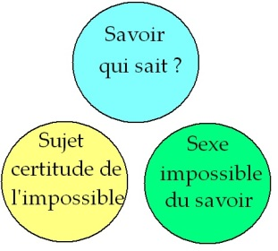
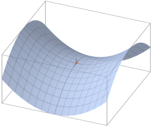
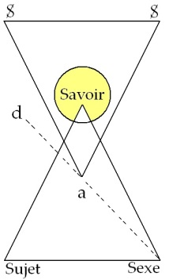
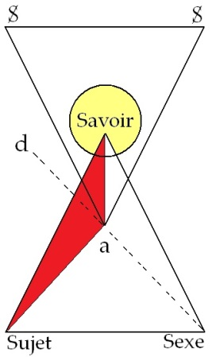

# Leçon 19 | 19 Mai l965

<!-- source-url: http://staferla.free.fr/S12/S12 PROBLEMES.docx -->
<!-- seminar: s12 -->
<!-- lesson: 19 -->

<!-- id: s12-19-0001 -->

Comme aux jeux de la « [*mourre*](http://fr.wikipedia.org/wiki/Mourre) », de la *morra*, ou de « [*ciseaux, pierre et papiers*](http://fr.wikipedia.org/wiki/Pierre-feuille-ciseaux) » qui se gagnent en rond, indéfiniment : *pierre* brisant *ciseaux* , *papier* enveloppant *pierre* , *ciseaux* coupant *papier -* vous pouvez énoncer, en une analogie qui recèle assurément quelque chose de plus complexe, que les trois termes de mes derniers discours - et tout spécialement celui de la dernière fois - ont dressé devant vous, sous les rubriques :

<!-- id: s12-19-0002 -->

<!-- id: s12-19-0003 -->

- *du sujet* : celui que j’ai mis le plus de soin à aiguiser, pour votre entente, 

<!-- id: s12-19-0004 -->

- *du savoir* qui aussi bien a été là le second terme auquel j’ai essayé de donner, concernant ce dont il s’agit sous le nom d’*inconscient*, tout son poids. *L’inconscient est un savoir, dont le sujet reste indéterminé*. Dans l’inconscient : *Qui* sait-il ?

<!-- id: s12-19-0005 -->

- *Le sexe* enfin, dont ce n’est pas non plus hasard ni hâte, si n’ayant marqué la dernière fois dans tout son relief, que le sens de la doctrine freudienne est que le sexe est une des butées, autour duquel… autour de laquelle tourne ce rapport triple.

<!-- id: s12-19-0006 -->

Cette économie, où chacun de ces termes se renvoie de l’un à l’autre selon un rapport qui, de première approche, peut sembler être celui par lequel je vous l’introduis, d’*un rapport de dominance circulaire * :

<!-- id: s12-19-0007 -->

- le sujet s’indétermine dans *le savoir*,

<!-- id: s12-19-0008 -->

- lequel s’arrête devant *le sexe*,

<!-- id: s12-19-0009 -->

- lequel confère *au sujet* cette nouvelle sorte de certitude par où - sa place de sujet étant déterminé et ne pouvant l’être que de l’expérience du *cogito*, avec la découverte de l’inconscient, de la nature *radicalement, fondamentalement* sexuelle de tout le désir humain - le sujet prend sa nouvelle certitude, celle de prendre son gîte dans le pur défaut du sexe.

<!-- id: s12-19-0010 -->

*Ce rapport de dominance tournant* est essentiel à fonder ce dont il s’agit dans mon discours depuis son départ : de quel statut du sujet il s’agit dans ce qui, par l’opération analytique, pour lui, se réengendre.

<!-- id: s12-19-0011 -->

Et aussi bien, puisque seule cette opération analytique lui donne son statut, ce dont il s’agira aujourd’hui après cette introduction, n’est pas de constater, comme un fait du monde, *cette dominance* qui se rejette à travers chacun des trois termes, mais de la reformuler, d’en faire sentir les effets, en terme de cette forme sous laquelle, pour nous, elle s’exerce, qui est proprement la forme du jeu.

<!-- id: s12-19-0012 -->

Je pense que même pour ceux qui viendraient ici m’entendre aujourd’hui pour la première fois, ils en savent assez de FREUD pour reconnaître quel terme essentiel constitue dans son enseignement le rapport entre savoir et sexe.

<!-- id: s12-19-0013 -->

Qu’il s’agisse de son approche, de sa découverte de la dynamique psychanalytique, c’est en terme de ce que le sujet :

<!-- id: s12-19-0014 -->

- *en sait plus qu’il ne croit,*

<!-- id: s12-19-0015 -->

- *en dit plus qu’il ne veut,*

<!-- id: s12-19-0016 -->

- *et démontre sur ses propres ressorts cette forme de savoir ambigu qui, en quelque sorte, se renonce à lui-même au moment même qu’il s’avoue* ...que FREUD introduit la dynamique de l’inconscient.

<!-- id: s12-19-0017 -->

Et quand il théorise, c’est autour de ce point oscillant de la question sur le sexe, de *la pulsion épistémologique*, du besoin de *savoir* *ce qu’il en est du sexe*, que s’introduit, génétiquement dans l’histoire de l’enfant, tout ce qui pour la suite s’épanouira dans les formes, tant de sa personne, que de son *caractère*, que de ses *symptômes*, de toute cette matière qui est la nôtre et qui nous intéresse.

<!-- id: s12-19-0018 -->

Mais c’est ici que prend son incidence ce que j’ai tenu, pour vous, à articuler dans sa différence dialectique, quand je vous ai parlé de vérité à propos du savoir .

<!-- id: s12-19-0019 -->

*Où est-il ce savoir là ?* Où il a son statut :

<!-- id: s12-19-0020 -->

- là où nous l’avons constitué,

<!-- id: s12-19-0021 -->

- là où non pas inconscient, mais à nous *externe*, il se fonde dans la science.

<!-- id: s12-19-0022 -->

*Où était la vérité avant l’établissement du savoir ?*

<!-- id: s12-19-0023 -->

Question dont, je vous l’ai rappelé, la date n’est pas d’hier, elle est exactement contemporaine des premières articulations logiciennes, elle est dans ARISTOTE : c’est *le statut de la contingence de la vérité avant qu’elle s’avère en savoir*.

<!-- id: s12-19-0024 -->

Mais ce que l’articulation freudienne nous démontre, c’est un rapport divergent de cette *vérité* au *savoir*, si le savoir se fait attendre, si la vérité est en suspens tant que ne s’est pas constitué le savoir. Il est bien clair que quiconque aurait formulé trois cents ans avant la formule même - newtonienne - n’aurait rien dit, faute que cette vérité puisse s’insérer dans son savoir.

<!-- id: s12-19-0025 -->

C’est la structure freudienne qui nous révèle et lève le sceau de ce mystère : l’orientation de la vérité, ce qui se *découvre* \[*se dévoile*\] n’est pas vers *un savoir*, même à venir, qui est toujours, par rapport à un point x dans une position latérale. Foncièrement ce que nous avons *à amener au jour comme* *vérité*, comme ἀλήθεια \[aléthèia\], comme *révélation heideggerienne*, c’est quelque chose qui donne pour nous un sens plus plein, sinon plus pur, à cette question sur l’être, qui dans HEIDEGGER s’articule, et qui s’appelle, pour nous, pour notre expérience d’analyste : *le sexe*.

<!-- id: s12-19-0026 -->

Ou notre expérience est dans l’erreur et nous ne faisons rien de bon, ou c’est comme cela que cela se formule, c’est comme cela que cela doit se formuler ici : *la vérité est à dire sur le sexe*.

<!-- id: s12-19-0027 -->

Et c’est parce qu’il est impossible - ceci est dans le texte de FREUD : que la position de l’analyste soit impossible - c’est pour cela, *c’est parce qu’il est impossible de la dire en son entier*, qu’il en découle cette sorte de suspens, de faiblesse, d’incohérence séculaire dans le savoir, qui est proprement celle que dénonce et articule DESCARTES pour en détacher sa certitude du sujet :

<!-- id: s12-19-0028 -->

- *en quoi le sujet se manifeste, comme étant justement le signal, le reste, le résidu de ce manque de savoir,*

<!-- id: s12-19-0029 -->

- *par où il rejoint ce qui le lie à ce qui se refuse au savoir dans le sexe,*

<!-- id: s12-19-0030 -->

- *à quoi le sujet se trouve suspendu sous la pure forme de ce manque, à savoir comme entité désexuée.*

<!-- id: s12-19-0031 -->

*Un savoir donc se réfugie quelque part,* dans cet endroit que nous pouvons appeler - et pourquoi pas, car nous ne retrouvons là que les voies anciennes - *dans un endroit de pudeur originelle, par rapport à quoi tout savoir s’institue dans une horreur indépassable,* *au regard de ce lieu où gît le secret du sexe.*

<!-- id: s12-19-0032 -->

Et c’est pourquoi il est important de rappeler - ce que chacun peut savoir, mais il est frappant qu’on l’oublie - que nous connaissons beaucoup d’effets en cascades de ce qu’il en est du sexe, ne serait-ce que la multiplicité des êtres existants, mais que c’est voiler la question, que c’est l’escamoter, que de faire du sexe l’instrument où ses effets se trouveraient justifiés par leur teléologie.

<!-- id: s12-19-0033 -->

Le sexe, dans son essence de différence radicale, reste intouché et se refuse au savoir.

<!-- id: s12-19-0034 -->

L’introduction de l’inconscient change totalement le statut du savoir - et doublement ! - le « *doublement* » devant se répéter à chaque niveau où nous avons à reprendre *les trois pôles où se constitue notre ordre subjectif* [^152].

<!-- id: s12-19-0035 -->

*Le savoir de l’inconscient* est inconscient en ceci que du côté du sujet, *il se pose comme* *indétermination du sujet* : *nous ne savons pas en quel point du signifiant se loge ce sujet présumé savoir*. Mais d’un autre côté, ce savoir, même inconscient, est dans une référence *d’interdit fondamental* au regard de ce pôle qui le détermine dans sa fonction de savoir : *Il y a quelque chose que ce sujet, de ce savoir ne doit point savoir.*

<!-- id: s12-19-0036 -->

C’est là constitution radicale, non pas accidentelle, encore que toutes *les chaînes* où se lie cette *concaténation subjective* ne soient jamais que singulières et fondées, sur cette prise, cette inclusion première[^153], qui en fait toute la *logique*. *Logique* qu’il s’agit pour nous de fonder, afin de saisir comment elle se parcourt, et où nous sommes quand, nous analystes, prétendons en jouer.

<!-- id: s12-19-0037 -->

Il est une question qui vient d’être posée à un concours - un de ces concours qui dans un milieu comme ici est quelque chose qui représente quelque illustration : une question qu’on y pose, on peut bien la dire à l’ordre du jour - on a demandé à ceux qui doivent franchir cette barrière, ce *steeple-chase* de ce qu’on appelle *l’« agrégation »* : « *L’homme peut-il se représenter un monde sans l’homme ?* »

<!-- id: s12-19-0038 -->

Je dirai ici, non point la façon dont j’aurais conseillé à aucun candidat de traiter cette question, mais le sens dans lequel je l’aurais traité moi-même. Que « *le monde* » dont il s’agit n’ait jamais été saisissable que comme faisant partie d’un savoir, il est clair que depuis toujours - il est facile à nous de nous en apercevoir - que *la représentation* n’est qu’un terme qui sert de caution au *leurre* de ce savoir.

<!-- id: s12-19-0039 -->

*L’homme* lui-même a été fabriqué, tout au cours de ses traditions, à la mesure de ces leurres. Il est donc bien clair qu’il ne saurait être exclu de cette représentation, si nous continuons de faire de cette représentation la caution de ce monde.

<!-- id: s12-19-0040 -->

Mais il s’agit du sujet et *pour nous le sujet*, dans la mesure justement où il peut être inconscient, *n’est pas représentation, il est le représentant, Repräsentanz, de la Vorstellung : il est là à la place de la Vorstellung qui manque*. C’est le sens du terme freudien de *Vorstellungrepresentanz*.

<!-- id: s12-19-0041 -->

Il ne s’agit pas de nous opposer que depuis toujours, cet *homme* dont nous couvrions le monde, ce *macranthropos* [^154] qu’était le macrocosme, on l’a fait, bien sûr, sexué. Mais justement, il n’est que trop clair que faute de pouvoir dire de quel sexe il était, il avait les deux et c’est bien là toute la question. Le fait de dire qu’on trouve une petite touche de l’un et de l’autre, un mélange des caractères chez les vertébrés supérieurs, n’y ajoute rien.

<!-- id: s12-19-0042 -->

*Le sujet* d’où nous avons à partir, *est la pièce qui* *manque à un savoir conditionné par l’ignorance*, et ce dont il s’agit quant à lui, si c’est par lui que nous avons à trouver l’homme, *est toujours en* *position de déchet par rapport à sa représentation.* Et dans cette mesure on peut dire que jusqu’à la psychanalyse, on s’est toujours représenté le monde sans l’homme véritable, sans tenir compte de la place où il est comme sujet, *place sans laquelle il n’y aurait pas de représentation* très précisément *parce que la représentation n’aurait pas dans le monde, de représentant.*

<!-- id: s12-19-0043 -->

C’est ainsi que j’ai marqué au tableau, avec leurs caractéristiques, celles mêmes que je viens d’énoncer, ces trois pôles :

<!-- id: s12-19-0044 -->

<!-- id: s12-19-0045 -->

- du *savoir* en tant qu’inconscient qui sait tout peut-être, sauf ce qui le motive,

<!-- id: s12-19-0046 -->

- du *sujet* qui s’institue dans sa certitude d’être manque à savoir,

<!-- id: s12-19-0047 -->

- et de *ce troisième terme* qui est précisément *le sexe*, dans la mesure où dans cette sphère \[celle du sujet\], il est rejeté au départ, dans la mesure d’où ressort de ce *qu’on ne veut rien en savoir*.

<!-- id: s12-19-0048 -->

C’est ici que je vais vous demander : « *Voulez-vous qu’aujourd’hui on joue ?* ».

<!-- id: s12-19-0049 -->

Je n’en dis pas plus, je ne vous dis pas : « *Voulez-vous jouer avec moi ?* »

<!-- id: s12-19-0050 -->

Parce qu’après tout, d’où je parle - à savoir comme analyste - jouer avec moi ne dit pas avec *qui* l’on joue. Je ne vous dis pas non plus *que se joue quelque chose*. Tout analyste que nous soyons, nous sommes dans l’histoire, et si la physique se fonde sur les termes de « *Rien ne se perd, rien ne se crée.* », je demande à quiconque ici a réfléchi sur l’histoire, si le fondement de cette idée de l’histoire n’est pas très proprement : « *Rien ne se joue.* »

<!-- id: s12-19-0051 -->

Pour tous ceux qui ont eu le temps d’éprouver quelque chose de ce qui, de notre temps, a paru se jouer dans ce qui peut s’écrire d’histoire, pour ceux qui ont eu le temps de voir s’effondrer quelque *pur jeu* dans l’histoire, n’est-il point évident que la marche des choses, donne sa vérité à ce que je viens d’énoncer sous cette forme « *rien ne se joue* » ?

<!-- id: s12-19-0052 -->

S’il est une vérité de l’histoire, la vérité marxiste par exemple - c’est précisément ce que d’un certain point de vue on peut être amené à lui reprocher, c’est que tout est joué d’avance si le sujet de l’histoire est bien là où on nous le dit : dans ses fondements économiques. Mais c’est bien ce qui est démontré à chaque détour : il suffit simplement que nous mettions à sa place ce dont il s’agit, là où on croit mener le jeu. Il n’en reste pas moins que ce jeu a son statut et qu’il est quelque part.

<!-- id: s12-19-0053 -->

Entre les trois termes que je viens de dessiner pour vous, c’est là-dedans que nous allons entrer maintenant et que je poursuis mon discours pour les analystes, même s’il s’avère que, quelque jeu que je mène à leur compte, c’est toujours là où il y a *le moindre risque* qu’ils mettront le plus gros paquet, et le petit là où il y a *le plus grand risque*.

<!-- id: s12-19-0054 -->

Mais il s’agit pour cela de savoir ce que veulent dire ces termes : qu’est-ce que veut dire le jeu lui-même à quelque niveau que nous employions cette catégorie ?

<!-- id: s12-19-0055 -->

Le jeu est un terme d’une extension large, depuis le jeu de l’enfant, jusqu’au jeu qu’on appelle de hasard, et jusqu’à ce qu’on a appelé, de façon qui déroute, « *la théorie des jeux* », j’entends *celle qui a l’air de dater du livre de* M. [Von NEUMAN](http://fr.wikipedia.org/wiki/John_von_Neumann)[^155] et de son collaborateur. J’essaierai aujourd’hui de vous dire comment du point de vue de l’analyse, qui a tous les caractères d’un jeu, nous pouvons *approcher* ce qu’il en est de *ce registre*.

<!-- id: s12-19-0056 -->

Le jeu est quelque chose qui, de ses formes les plus simples, jusqu’à ses plus élaborées, se présente comme la substitution à la dialectique de ces trois termes \[*Savoir, Sujet, Sexe*\], *d’une simplification* qui d’abord l’institue *en système clos*. Le propre du jeu c’est toujours *- même quand elle est masquée -* une règle. Une règle qui en *exclut* comme interdit, *ce point* qui est justement celui qu’au niveau *du sexe* je vous désigne comme le point d’accès impossible, autrement dit, le point où *le réel* se définit comme *l’impossible*.

<!-- id: s12-19-0057 -->

*Le jeu réduit ce cercle au rapport du <u>sujet</u> au <u>savoir</u>*.

<!-- id: s12-19-0058 -->

Ce rapport a un sens et ne peut en avoir qu’un seul, c’est celui de *l’attente* : le *sujet* attend sa place dans le *savoir*, le jeu est toujours du rapport, d’une tension, d’un éloignement, par où le *sujet* s’institue à distance de ce qui existe déjà quelque part comme *savoir*.

<!-- id: s12-19-0059 -->

Si, dans le temps où je croyais encore que quelque chose se jouait, j’ai fait s’exercer pendant au moins un trimestre le petit troupeau dont je tenais alors la houlette au jeu de *pair et impair*, c’était pour tâcher de leur faire passer cette vérité dans les veines \[Cf. 30-05-55 \].

<!-- id: s12-19-0060 -->

Celui qui tient les billes sait si leur nombre est pair ou impair. Peu importe qu’il le sache ou non d’ailleurs : il y a dans sa main *savoir*, et la passion du jeu surgit de ce que, en face, je m’institue comme *sujet qui va savoir*.

<!-- id: s12-19-0061 -->

Sous quelque forme que ce soit - d’un enjeu ou des billes elles-mêmes - la réalité qui prend sa place, perd ce qui dans ce triangle, dans ce tripôle, est *l’impossible à savoir* mais qui, rabattu dans le jeu - parce qu’est exclu cet impossible - devient la pure et simple réalité de *l’enjeu*. *L’enjeu c’est* en quelque sorte *ce qui masque le risque*. Rien, en fin de compte, n’est plus contraire au risque que le jeu.

<!-- id: s12-19-0062 -->

Le jeu encapuchonne le risque, et la preuve c’est que les premiers pas de la théorie des jeux…

<!-- id: s12-19-0063 -->

> qui se sont faits, non pas au niveau de VON NEUMAN mais au niveau de PASCAL[^156] …commencent par *la théorie du partage* \[[Lettres de <u>Pascal à Fermat</u>](#LettrePASCAL)\], ce qui veut dire qu’à chaque moment d’un jeu, un *partage équitable* est concevable de ce qui est en jeu : un calcul des *espérances* est possible, qui fait que d’arrêter un jeu dans le milieu, ce n’est pas simplement que chacun des joueurs retire sa mise - ce qui serait injuste - c’est que la mise soit partagée en fonction de…

<!-- id: s12-19-0064 -->

> ce qui est énorme à énoncer, et qui pourtant, donne la structure même de ce dont il s’agit …en fonction du calcul des *espérances* des joueurs. Je n’entrerai pas dans le détail de ce dont il s’agit ici, me contentant de vous renvoyer aux *opuscules fondamentaux* qui en la matière, de PASCAL et d’ailleurs, ont fait loi, et pour les meilleures raisons, depuis.

<!-- id: s12-19-0065 -->

Qu’est-ce à dire, sinon que pour nous dont les voies sont frayées par cette « *théorie des jeux* » où se démontre que ce qu’on appelle « *stratégie* » est quelque chose qui nous montre que…

<!-- id: s12-19-0066 -->

> ce qui est parfaitement calculable, ce qui, dans un nombre de cas assez étendus pour que ceci fasse départ à toute élaboration concernant l’exercice des jeux dans un nombre assez grand de cas, \[étant\] connue la connotation des coups possibles pour un joueur avec l’ensemble *des* coups possibles pour l’autre …il y a un point, nommé « *point de selle* », comme on dit « selle d’un cheval » :

<!-- id: s12-19-0067 -->

<!-- id: s12-19-0068 -->

où se recoupe comme étant strictement identiques, ce que doivent jouer les deux joueurs pour avoir ensemble et en tous cas, le minimum de perte, montrant que la nature du jeu est loin d’être de pure et simple opposition entre les joueurs mais, au départ dans sa compréhensibilité même, possibilité au contraire d’accord.

<!-- id: s12-19-0069 -->

Ce qu’en tout jeu cherche le joueur - le joueur comme personne - est toujours quelque chose qui comporte cette conjonction comme telle de deux sujets, et le véritable enjeu de l’affaire, c’est ce joueur, sujet divisé, en tant qu’il y intervient lui-même comme enjeu au titre de ce *petit objet*, de ce *résidu* que nous connaissons bien nous autres analystes, sous la forme de cet objet auquel j’ai donné le nom d’une petite lettre, de la première.

<!-- id: s12-19-0070 -->

S’il est *quelque chose* qui *supporte* toute activité de jeu, c’est ce quelque chose qui se produit de la rencontre du sujet divisé, en tant qu’il est sujet, avec ce quelque chose par quoi le joueur se sait lui-même *le déchet de quelque chose* qui s’est joué *ailleurs*.

<!-- id: s12-19-0071 -->

Le « *ailleurs à tout risque* », le « *ailleurs* » d’où il est tombé du désir de ses parents, est là précisément le point dont il se détourne en allant chercher à l’opposé ce *rapport d’un sujet à un savoir*.

<!-- id: s12-19-0072 -->

Et pour vous imager, sous la forme la plus rudimentaire, le caractère fondé que je vous indique comme étant, dans le jeu, radicalement le *rapport d’un sujet à un savoir*, je vous évoquerai *une image*, pour moi particulièrement frappante : celle d’une petite fille qui vers l’âge de trois ans, avait trouvé ce jeu, dans un exercice dont ce n’était point par hasard, que ce fût celui de venir embrasser son père, qui consistait à aller à l’autre bout de la pièce, et à s’approcher à pas lents, à mesure plus précipités, en scandant cette avancée de *ces trois mots* : « *Ça va arriver, ça va arriver, ça va arriver !* »

<!-- id: s12-19-0073 -->

Telle est l’image fondamentale où est inclue tout ce qu’on appelle, dans sa diversité, « *activité ludique* » jusqu’à ses formes les plus complexes, et les plus ordonnées :

<!-- id: s12-19-0074 -->

- isolement du système au moyen d’une règle où se détermine l’entrée et la sortie du jeu,

<!-- id: s12-19-0075 -->

- à l’intérieur du jeu lui-même : *le sujet dans ce qu’il a de réel, et de réel impossible à atteindre*, matérialisé si je puis dire, dans l’enjeu.

<!-- id: s12-19-0076 -->

Et c’est en quoi le jeu est la forme propice, exemplaire, isolante, isolable, de la spécification du désir, le désir n’étant rien d’autre que *l’apparition* de cet enjeu, *de ce (a)* qu’est l’être du joueur, *dans* *l’intervalle d’un sujet divisé entre son* *manque et son savoir*.

<!-- id: s12-19-0077 -->

Observez que dans ce jeu, si la réalité est réduite à sa forme de *déchet du sexe*, à sa forme insexuée, l’autre bénéfice du jeu est que *le rapport de* *vérité* y est, qu’en raison même de la suppression de ce pôle de réalité comme impossible, *la relation de* *vérité* est supprimée.

<!-- id: s12-19-0078 -->

On peut se demander en tout sens *ce qu’il en est de la vérité de la science avant qu’elle s’affirme*. On peut se demander ce qu’il en est de l’inconscient avant que je ne l’interprète, et *le propre du jeu, c’est que, avant qu’on joue, personne ne sait ce qu’il en va sortir.*

<!-- id: s12-19-0079 -->

*C’est là le rapport du jeu au fantasme. Le jeu est un fantasme rendu inoffensif et conservé dans sa structure.*

<!-- id: s12-19-0080 -->

Ces remarques sont essentielles, à introduire ce que je désire articuler pour vous aujourd’hui, à savoir ce qu’il en est du *jeu de l’analyse*, si tant est que, comme elle en a tous les caractères, l’analyse est un jeu parce qu’elle se poursuit à l’intérieur d’une règle, et dont il s’agit de savoir comment l’analyste a à mener ce jeu, pour savoir aussi quelles sont les propriétés exigibles de sa position, pour qu’il la mène à cette opération, d’une façon correcte. Disons d’abord à quoi nous sert ce schéma :

<!-- id: s12-19-0081 -->

<!-- id: s12-19-0082 -->

À nous dire, ce que sans doute nous savons, mais que nous sommes loin d’articuler dans tous les cas, et ceci même s’en explique, ce schéma, c’est que dans une analyse il y a en apparence deux joueurs : ces joueurs, dont j’ai essayé d’articuler pour vous le rapport comme un rapport de malentendu, puisque, de la place qu’occupe un des joueurs, l’autre qui est le sujet, est le *sujet supposé savoir*, alors que si vous faites confiance à mon articulation schématique, le sujet - si nous pouvons parler de ce pôle dans sa constitution pure - *le sujet ne s’isole, que de se retirer de tout soupçon de savoir* [^157].

<!-- id: s12-19-0083 -->

Le rapport d’un de ces pôles au pôle du sujet est un rapport de *fallace*, mais c’est aussi en cela qu’il s’approche du jeu : le *sujet supposé savoir* fait la conjonction de ce *pôle du* *sujet* au *pôle du savoir*, dont le sujet a d’abord à savoir qu’au niveau du *savoir* il n’a pas à supposer de *sujet*, puisque c’est l’inconscient. Qu’est-ce qu’il résulte de cela ?

<!-- id: s12-19-0084 -->

À nous en tenir à ces deux pôles, c’est que du point de vue du jeu, ça fait peut-être deux joueurs - au sens où dans *la théorie des jeux* de M. VON NEUMANN, ce qu’on appelle joueurs ce sont de simples agents, lesquels agents se distinguent l’un de l’autre simplement par un ordre de préférence - mais le fait même que ces agents, dans les cas que j’évoquais tout à l’heure, puissent s’accorder, sans même se connaître, sur la simple feuille de papier qu’utilise M. VON NEUMAN, pour démontrer qu’ils n’ont *tous les deux* qu’un seul et même coup à jouer, prouve qu’ils sont parfaitement compatibles à indiquer la même personne.

<!-- id: s12-19-0085 -->

Et d’un certain point de vue et jusqu’à une certaine limite…

<!-- id: s12-19-0086 -->

> si l’analyste, dans sa position pure, originelle, n’en a pas d’autre que celle du sujet telle que je la définis cartésiennement, mettant celui qui, en tout cas, s’affirme que même s’il ne sait rien, il est celui qui pense qu’il ne sait rien \[l’analyste\] et que ceci suffit parfaitement à assurer sa position en face de l’autre joueur, qui sait sans doute, mais ne sait pas qu’il sait …il est bien clair que ces deux pôles peuvent très valablement constituer, jusqu’à un certain point une même personne, si nous définissons la personne non pas par cette référence mais par l’intérêt commun, et l’intérêt commun c’est ce qu’on appelle la guérison. *La guérison* qu’est-ce que ça veut dire ?

<!-- id: s12-19-0087 -->

Exactement ce qui arrive à quelque point possible où PASCAL arrête le jeu, et peut faire à ce moment la répartition des mises d’une façon, pour les deux, satisfaisante. *La guérison n’a absolument pas d’autre sens que cette répartition des enjeux* à un point quelconque du processus, si nous partons de l’idée que jusqu’à un certain point, sujet et savoir sont parfaitement faits pour s’entendre.

<!-- id: s12-19-0088 -->

C’est ce que tous les analystes de l’école de « *La psychanalyse d’aujourd’hui »* appellent, dans *ce faux langage* emprunté à la psychologie « *l’alliance avec la partie saine du moi* », autrement dit : trompons-nous ensemble !

<!-- id: s12-19-0089 -->

S’il y a quelque chose que j’essaie de réintroduire, qui permette à l’analyste d’aboutir à autre chose qu’à une identification du sujet indéterminé au *sujet supposé savoir*, c’est-à-dire au sujet de la tromperie, c’est dans la mesure, où je rappelle ce que même ceux qui ont cette théorie savent en pratique : c’est qu’il y a un *troisième joueur*, et que le *troisième joueur* s’appelle la réalité de la différence sexuelle.

<!-- id: s12-19-0090 -->

C’est parce que, devant cette réalité de la différence sexuelle, le sujet qui sait - qui n’est pas l’analyste mais l’analysé - s’est depuis longtemps *constitué* dans son propre jeu, celui qui a duré, commencé et culminé, jusqu’à l’analyse \[...\] nécessaire de deux sujets :

<!-- id: s12-19-0091 -->

- du sujet divisé : d’un côté *sujet,* et de l’autre côté : *savoir*, mais pas ensemble,

<!-- id: s12-19-0092 -->

- et *de ce quelque chose par quoi il ne peut s’appréhender que comme chu et déchu de la réalité*, dont il ne *veut* ni ne *peut* rien savoir,

<!-- id: s12-19-0093 -->

- dans ce qui fait que toujours l’homme a à fuir l’impossible de la réalité sexuelle,

<!-- id: s12-19-0094 -->

- dans *ce quelque chose* qui en est le supplément ludique et en même temps la défense,

<!-- id: s12-19-0095 -->

- *ce quelque chose* que nous connaissons sous la forme de ce qui se révèle dans le fantasme,

<!-- id: s12-19-0096 -->

- *ce quelque chose* en tant que la cause en est la mise en jeu du sujet sous la forme de *cet objet* de la relation d’objet, mise en jeu *<u>entre</u>* les deux termes subjectifs opposés du *sujet* et du *savoir inconscient*.

<!-- id: s12-19-0097 -->

*Cette substitution du (a), de l’objet de déchet, de l’objet de chute* - à ce dont il s’agit : *la réalité de la relation sexuelle - c’est là ce qui donne sa loi* *à ce rapport de l’analyste à l’analysé*, en ce sens que loin qu’il ait à se contenter de quelque « *répartition équitable des enjeux* », il a affaire à quelque chose, où il se trouve bien dans une position d’opposition à son partenaire.

<!-- id: s12-19-0098 -->

Comme dans tous les cas où il n’y a pas dans le jeu de solution d’accord, il a affaire à un partenaire sur la défensive mais dont la défensive est dangereuse et prévalente en ceci que, contrairement à ce que beaucoup s’imaginent, cette défensive n’est pas dirigée contre lui, l’analyste : ce qui fait sa force, c’est qu’elle est dirigée contre l’autre pôle, celui de la réalité sexuelle.

<!-- id: s12-19-0099 -->

Elle est imbattable justement en ceci : que n’y ayant de ce fait pas de solution, *la ruse du meneur du jeu, si l’analyste peut mériter ce nom*, ne peut être que de ceci : d’en faire aboutir, d’en dégager, de cette défensive, une forme toujours plus pure. Et c’est cela qui est le désir de l’analyste dansl’opération. Amener le patient à son fantasme originel, ce n’est rien lui apprendre : c’est apprendre de lui comment faire. L’*objet(a)* et son rapport dans un cas déterminé à la division du sujet, c’est le patient qui sait y faire, et nous sommes à la place du résultat dans la mesure où nous le favorisons.

<!-- id: s12-19-0100 -->

L’analyse est le lieu où se *vérifie d’une façon radicale*, parce qu’elle en montre la superposition stricte, que le désir est le désir de l’Autre.

<!-- id: s12-19-0101 -->

Non pas parce qu’au patient est dicté le désir de l’analyste, mais parce que l’analyste se fait le désir du patient.

<!-- id: s12-19-0102 -->

<!-- id: s12-19-0103 -->

C’est ce qui vous est exprimé par le petit triangle en rouge, qui vous montre dans quel espace virtuel du côté de l’Autre - lieu occupé par l’analyste - se situe le point de désir, c’est-à-dire au pôle strictement opposé au lieu où gît l’impossible de la réalité du sexe.

<!-- id: s12-19-0104 -->

Or, c’est là, que gît le suprême de *la ruse analytique*, et c’est seulement là qu’elle peut être rejointe. C’est seulement dans cette visée et dans la mesure où l’analyste y est absolument assoupli, que peut passer quelque chose de ce qui constitue, à proprement parler, le seul gain concevable. C’est seulement au point où va au maximum ce qui fait que le savoir se constitue comme le *garde* \- mais entendez-le au sens de *servant -* de ce refus de la réalité sexuelle, de cette plus intime αἰδώς \[aïdos\], de cette *pudeur radicale*, c’est justement en ce point que cette pudeur peut se trahir.

<!-- id: s12-19-0105 -->

C’est que cette *garde* soit portée à son point le plus parfait, qui peut laisser passer quelque chose d’un *manque de garde*, car cette réalité du sexe, elle, elle n’est pas supposée savoir. Et c’est là que je laisserai oscillante la question des dernières positions subjectives : « *<u>Sait-elle</u> ou <u>ne sait-elle pas</u>, cette suprême pudeur ?* »

<!-- id: s12-19-0106 -->

Il y a ceux qui y croient, qu’elle sait. Mais comment savoir ce qu’elle sait ?

<!-- id: s12-19-0107 -->

Sinon à ce niveau de l’Autre, où va surgir l’ombre de ce signifiant tout puissant, de ce nom suprême, de l’omniscient qui a toujours été le piège, le lieu élu de la capture, pour ceux qui ont besoin de *croire*.

<!-- id: s12-19-0108 -->

Comme chacun sait ce que cela veut dire « *y croire* » : ça peut vouloir dire, ça veut toujours dire - les gens mêmes qui croient l’affirment et le disent, c’est la théorie fidéiste - on ne peut « *croire* » que ce dont on n’est pas sûr.

<!-- id: s12-19-0109 -->

Ceux qui sont sûrs, eh bien justement n’y *croient pas*, *ils ne croient pas à l’Autre, ils sont sûrs de La Chose*, ceux-là ce sont *les psychotiques*.

<!-- id: s12-19-0110 -->

Et c’est pourquoi il est parfaitement possible…

<!-- id: s12-19-0111 -->

> contrairement à ce que quelqu’un de cette École a écrit à propos de *L’histoire de la folie* de Michel FOUCAULT,
>
> auquel on ne peut reprocher qu’une chose, c’est de ne pas donner de *la psychose* cette formulation, faute d’avoir assisté
>
> à mon séminaire sur le Président SCHREBER \[Séminaire 1955-56 : « *Les psychoses*... » Seuil, Paris, 1981\] …il y a un discours parfaitement cohérent de *la folie*, il se distingue en ceci : *qu’il est sûr que La Chose sait*.

<!-- id: s12-19-0112 -->

Je vous laisserai en ce point - il est deux heures - où je vous ai menés aujourd’hui.

<!-- id: s12-19-0113 -->

Que doit être, que peut-il être ce désir de l’analyste, pour se tenir à la fois en ce point de suprême complicité, complicité ouverte. Ouverte à quoi ? À la surprise ! L’opposé de cette attente où se constitue le jeu en soi, le jeu comme tel, c’est l’inattendu.

<!-- id: s12-19-0114 -->

L’inattendu n’est pas le risque. On se prépare à l’inattendu. L’inattendu même, si vous me permettez un instant de revenir sur cette ébauche de structuration para-eulérienne que j’ai essayé de vous donner comme nécessaire au moins à certains concepts, à savoir le *huit inversé*, *portioncule* dont le champ externe est cette *bande de Mœbius* qui doit nécessairement la traverser.

<!-- id: s12-19-0115 -->

La portioncule, vous verrez que l’inattendu y trouve son application admirable.

<!-- id: s12-19-0116 -->

Car qu’est-ce que l’inattendu sinon ce qui se révèle comme étant *déjà attendu* mais seulement quand il arrive ?

<!-- id: s12-19-0117 -->

L’inattendu, en fait, traverse le champ de l’attendu.

<!-- id: s12-19-0118 -->

Autour de ce jeu de l’attente, et faisant face à l’angoisse, comme FREUD lui-même, dans des textes fondamentaux sur ce thème l’a formulé, autour de ce champ de l’attente, nous devons décrire le statut de ce qu’il en est du désir de l’analyste.

<!-- id: s12-19-0119 -->

C’est ce que je reprendrai dans quinze jours puisque la prochaine fois, nous aurons un séminaire fermé.

## Notes

[^152]: *i. e.* : *Le sujet, le savoir, le sexe*. Cf. le titre prévu originellement pour ce séminaire : « *Les positions subjectives de l’être* » .

[^153]: Geste des doigts autour d’une demi-sphère.

[^154]: Cf. Alexandre Koyré : Paracelse, Paris, éd. Allia, 1997, p23 : «...l’homme microcosme, centre, image et représentant du monde, livre dans lequel

    sont contenus, et où l’on peut lire, les secrets et les merveilles du macrocosme, ou macranthropos. »

[^155]:
    ###  J. Von Neumann, O. Morgenstern : *Theory of Games and Economic Behavior*, Princeton, 1944. *Théorie des jeux et comportement économique*, 

    ###  Université des Sciences Sociales de Toulouse, 1977.

[^156]: Blaise Pascal : *Œuvres complètes*, Paris, Gallimard, Pléiade, I et II, 1998 et 2000.

[^157]: Le S de gauche représente l'analyste : *sujet supposé savoir*, qui - même s'il ne sait rien - sait qu'il ne sait rien.

    Le S de droite représente l'analysant : qui se retire de tout soupçon de savoir, qui sait sans doute, mais ne sait pas qu'il sait.
