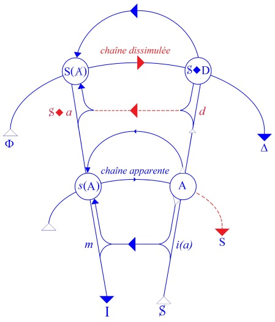
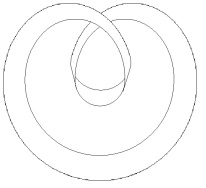
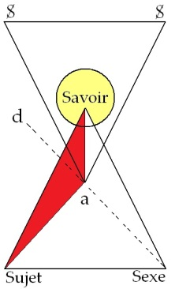

# Leçon 21 | 02 Juin 1965

<!-- source-url: http://staferla.free.fr/S12/S12 PROBLEMES.docx -->
<!-- seminar: s12 -->
<!-- lesson: 21 -->

<!-- id: s12-21-0001 -->

[MILLER](#Miller) [MILNER](#Milner)

<!-- id: s12-21-0002 -->

LACAN

<!-- id: s12-21-0003 -->

Dans des lieux où je ne mets guère les pieds, on a à la bouche - enfin c’est par phases - le mot « *dialogue* ».

<!-- id: s12-21-0004 -->

On fait « *dialoguer* » ensemble des gens qu’on peut bien dire, au sens le plus rigoureux du terme, « *de bords différents* », et on en attend je ne sais pas quoi. Tant qu’il n’y aura pas de dialogue plus sûr entre l’homme et la femme, je veux dire sur le terrain où ils sont respectivement homme et femme, sur le terrain de leur rapport sexuel, on me permettra d’être sceptique sur les vertus du dialogue.

<!-- id: s12-21-0005 -->

Cette position est la position analytique. C’est pour cela que la psychanalyse *n’est pas un dialogue*.

<!-- id: s12-21-0006 -->

Sur le champ où l’analyse a à s’appliquer - on s’est aperçu parce que là « *ça crevait les yeux* » - que le dialogue, ça ne donne rien !

<!-- id: s12-21-0007 -->

Cette vérité première, cette *porte ouverte que j’enfonce*, elle est connue depuis toujours et elle n’est pas du tout *sans rapport* avec le fait que ce qu’on appelle « *les dialogues de Platon* » : je ne sais pas si vous l’avez remarqué, mais c’est jamais des dialogues, je veux dire que ce n’est jamais l’échange de propos entre deux personnages dont l’un serait vraiment le tenant d’une des thèses dont il s’agit, et l’autre de l’autre.

<!-- id: s12-21-0008 -->

Il y en a toujours un qui représente une des deux thèses qui, pour une raison quelconque, *se récuse, se dérobe, se déclare insuffisant*, et alors on prend *une tierce personne* qui va consentir à faire quelque chose, qui au premier abord apparaît le rôle de l’idiot, mais est un truchement sans doute bien utile, puisque c’est par là qu’on va essayer de faire passer quelque chose qui n’est pas toujours un dialogue, bien plus souvent une opposition.

<!-- id: s12-21-0009 -->

*Le Sophiste*, ça commence comme ça. Ça se déroule comme ça. Ça se passe entre *l’Étranger d’Élée* et celui dont il s’agit, qui a amorcé la chose, c’est-à-dire SOCRATE. Mais comble d’astuce, ça se termine avec un autre SOCRATE, un petit SOCRATE errant, SOCRATE le jeune.

<!-- id: s12-21-0010 -->

Il y a peut–être quelque chose comme ça aussi dans le fait que cette année j’ai éprouvé le besoin, à un moment, de faire le geste de fermer le séminaire pour pouvoir, peut-être… pour parler un peu plus avec les gens et aussi qu’ils me parlent.

<!-- id: s12-21-0011 -->

Il y a là une fonction tierce, mais le propre des fonctions tierces c’est que, tout de même, elles doivent revenir dans le rond.

<!-- id: s12-21-0012 -->

Et c’est pour ça qu’aujourd’hui - *bien que ce soit un des jours réservés à mon cours -* je pense, qu’il n’est pas inopportun que quelque chose vienne ici surgir d’une réponse de ce qui s’est fomenté à mon séminaire fermé, auquel d’ailleurs c’est une part très large de cette assemblée qui fonctionne.

<!-- id: s12-21-0013 -->

Donc, à mon dernier séminaire fermé quelque chose s’est énoncé qui était de la bouche de Serge LECLAIRE, s’adressant au travail qu’avait fait Jacques-Alain MILLER sur la théorie du nombre dans FREGE. Serge LECLAIRE avait beaucoup insisté pour que ceci ne restât pas, en quelque sorte, en panne ou en suspens et il lui a proposé quelques observations. MILLER va donner aujourd’hui la réponse à ce qu’avait dit LECLAIRE, et vous le verrez je pense, c’est une réponse qui aura sa place dans ce que je vais ensuite enchaîner, soit aujourd’hui, soit la prochaine fois. D’autre part, vous pouvez voir que notre programme de cette année nous a mené en somme… a voulu être essentiellement une prise de *la fonction du psychanalyste* à partir de ce qui fonde sa logique propre.

<!-- id: s12-21-0014 -->

Quel est le moyen par quoi nous essayons d’accéder par cette voie à ce qui est notre fin, de définir la position du psychanalyste ?

<!-- id: s12-21-0015 -->

Ce n’est pas, ce ne peut pas être seulement ceci \[...\], sorte de malentendu d’être seulement défini \[...\] définir ce qu’est, pour le psychanalyste, sa relation à deux termes par exemple comme ceux de *la vérité et du savoir*.

<!-- id: s12-21-0016 -->

Il est impossible - encore que ce soit là, si je puis dire, ce qui est le plus sensible à l’expérience du psychanalyste : il peut tout de suite là-dessus se spécifier, interroger, donner des réponses, être repris s’il les donne à côté - il est impossible de situer exactement la relation du psychanalyste efficace à ces deux termes, si essentiels pour spécifier la position de savant sans se rapporter, d’une façon plus radicale, à ce en quoi nous pouvons nous approcher de toute une expérience qui est celle qui a précédé l’analyse.

<!-- id: s12-21-0017 -->

Les relations entre *la vérité* et *le savoir* : c’est là que nous sommes portés sur le terrain de la logique, et que la logique, qu’elle soit saisie là où elle s’est articulée au dernier terme, en cet auteur si important - plus important peut-être qu’il n’est généralement reçu - qu’est FREGE, mais aussi bien à l’origine, au moment où commence, s’articule, ce qu’il est peut-être trop général d’appeler « *dialectique* » dans telles ou telles des articulations de PLATON et précisément dans les PLATON qu’on appelle *de la dernière période*.

<!-- id: s12-21-0018 -->

Eh bien, des premiers pas de cette logique, avant qu’elle se cristallise sous la forme qui se véhicule à travers les siècles, empaquetée sous le nom de logique formelle, qui n’est d’ailleurs qu’une caractéristique des plus externes au niveau du *Sophiste*, je l’ai signalé, et à mon séminaire quelqu’un a bien voulu en frayer les premiers passages au niveau du *Sophiste* où s’articulent les questions les plus brûlantes, autour de ces deux termes : *vérité* et *savoir*.

<!-- id: s12-21-0019 -->

C’est pourquoi quelqu’un de ceux qui sur ce point suivent le mieux ce que j’ai pu commencer d’articuler cette année, tout de suite après MILLER, prendra la parole pour vous apporter quelques observations sur *Le Sophiste,* et que j’ai considéré comme indispensable de prendre ce relais avant de faire ce qui sera, les deux mercredis suivants, les deux cours par où j’espère, cette année, boucler suffisamment ce que j’avais commencé d’aborder, cette année, si vous vous en souvenez, déjà à l’ouverture de mon premier séminaire autour de la question du *sens* et du *non-sens*, à proprement parler en me centrant de deux chaînes signifiantes, prétendues sans aucune espèce de sens, dont je vous indiquai qu’elles étaient pourtant porteuses de sens, si opaques fussent-elles, pour la seule raison qu’elles étaient grammaticales.

<!-- id: s12-21-0020 -->

Que ceux qui étaient à ce premier cours s’y reportent, avant que je reprenne la suite de mon cours, c’est-à-dire à la fin de notre réunion d’aujourd’hui et les prochaines fois.

<!-- id: s12-21-0021 -->

Je donne la parole à MILLER.

<!-- id: s12-21-0022 -->

[Jacques-Alain MILLER](#Juin_02)

<!-- id: s12-21-0023 -->

Je m’excuse d’abord de tenir ce discours à peine en forme, elliptique. Je m’en excuse auprès de vous et tout particulièrement auprès de Serge LECLAIRE.

<!-- id: s12-21-0024 -->

Quelqu’un d’entre vous ici, se souvient peut-être de quelque chose *comme « une lettre »*, par moi insérée au cours d’une prise de parole dédiée à la cinquième saison d’une *Logique du signifiant* - nommément à l’adresse d’une dame, analyste exceptionnellement douée[^163] - quelque chose, certes, comme une lettre de demande de réponse. Mais cette lettre, en chemin - il faut le croire - elle s’est perdue, et si elle s’est perdue c’est que *les lettres ne vont pas où nous voulons mais où elles veulent*. Peut-être, on l’a volée : c’est encore la lettre qui veut qu’on la vole pour aller où elle veut.

<!-- id: s12-21-0025 -->

Et si c’est entre les mains de Serge LECLAIRE qu’elle est parvenue, c’est donc que c’était là *son terme final*, puisque la lettre a voulu qu’il le soit, puisque aussi il a voulu l’être, et je l’en remercie de justifier ainsi l’*injustifiable* que je parle devant vous.

<!-- id: s12-21-0026 -->

Voilà donc l’occasion d’en dater une correspondance dont il ne déplaît pas au Dr LACAN de se faire la poste.

<!-- id: s12-21-0027 -->

Un échange sans doute mais certes pas un dialogue. D’un dialogue, ni Serge LECLAIRE ni moi, ne voulons :

<!-- id: s12-21-0028 -->

- nous ne parlons que pour refuser que nous soyons dans des positions réciproques,

<!-- id: s12-21-0029 -->

- nous ne prêtons l’oreille que pour écouter dans le discours sa part à soi-même secrète.

<!-- id: s12-21-0030 -->

Au gré de Serge LECLAIRE, ce que je prononce comme mon discours est nécessairement pour ce que la réalité sexuelle ne nous paraît pas suturer, alors que l’analyste, lui, d’être analyste dans sa parole... car, dit LECLAIRE :

<!-- id: s12-21-0031 -->

> « *l’analyste ne construit pas de discours, dans sa parole l’analyste ne suture pas. L’analyste se refuse à suturer, vous ai-je dit. En fait, il ne construit pas un discours même quand il parle. Fondamentalement - et c’est en cela que la position est irréductible - l’analyste est à l’écoute.*
>
> *Et tout ce qu’on dit à l’analyste là-dessus - moi y compris - les discours qu’on entend, peuvent l’éclairer. Il est à l’écoute de quoi ?*
>
> *Du discours de son patient et dans le discours de son patient, ce qui l’intéresse, c’est précisément comment s’est ficelé pour lui ce point de suture* \[...\] *en ce sens, tout ce que nous apporte Miller nous est extrêmement précieux.* »

<!-- id: s12-21-0032 -->

J’espère que vous appréciez comme moi la délicatesse avec laquelle Serge LECLAIRE introduit son propos.

<!-- id: s12-21-0033 -->

Précieux pour lui mon discours ? Merci bien ! Mais précieux comme la parole d’un analysé sur son divan ? Non merci !

<!-- id: s12-21-0034 -->

Et le droit de dire ici ce « *non merci !* », c’est ce que je vais défendre et comme je l’ai dit trop brièvement et d’une façon inachevée, la méconnaissance produite par Serge LECLAIRE dans la lecture qu’il a faite de mon texte, lecture qu’il a si exactement dirigée vers le concept pivotal de ce que j’articulais, à savoir le concept de *la suture*.

<!-- id: s12-21-0035 -->

En tout cas, j’espère que ma réponse ne fera pas s’évanouir \[...\] et dont l’inédit, assurément ne me laisse pas indifférent que de mon discours il a eu, en tant qu’analyste, l’usage. J’espère que c’est d’un autre usage, à mon sens, que celui d’une parole d’analysé qu’il est susceptible \[...\] qu’il ne s’est pas gardé de distinguer le discours que je démontais de la logique du logicien : de FREGE, et le discours que j’articulais à partir de Jacques LACAN : de *la logique du signifiant*.

<!-- id: s12-21-0036 -->

Il a négligé que c’est à partir de cette *logique du* *signifiant* assumée comme mon discours, que la suite des nombres engendrés dans le discours de FREGE pouvait être dite suturée, que cette logique était assez générale pour être dite à bon droit *du signifiant*.

<!-- id: s12-21-0037 -->

J’entends par là découvrir à Serge LECLAIRE que le discours qu’il tient au nom de l’analyste - et qu’il oppose au mien - qu’il était déjà *anticipé* et même contenu par avance.

<!-- id: s12-21-0038 -->

En fait nous ne sommes pas dans une situation de réciprocité mais pas de la façon qu’il croit. J’en suis maintenant à lire des notes tout à fait rapides et vous m’en excuserez. Il est manifeste que l’intérêt pour mon texte ne prend son origine que de l’occasion de faire valoir par différence, *deux positions*. Je résume son analyse :

<!-- id: s12-21-0039 -->

> « *Tandis que le logicien suture, l’analyste ne suture pas, parce que le second diffère la suture que la vérité demande. Tandis que le concept logique*
>
> *prend dans sa parenté des objets identiques à eux-mêmes, le concept inconscient rassemble des choses non-identiques à elles-mêmes.* »

<!-- id: s12-21-0040 -->

Prenons le premier point. Qu’est-ce que *la suture* chez Jacques LACAN ? C’est un concept non thématique qui lui sert dans le champ de l’analyse.

<!-- id: s12-21-0041 -->

Que suppose l’importation que j’en fais ? En importer l’usage suppose que *le fonctionnement des catégories* - dont la valeur est assurée dans le champ de la parole libre - demeure adéquat au champ de cette parole contrainte que nous nommons un discours.

<!-- id: s12-21-0042 -->

Mais, important « *la suture* », qu’importons-nous ? Je dis que nous importons ceci : une structure qui met en place *une scène*, *une chaîne* où le sujet se produit en première personne, qui est *la chaîne* ou *la scène* de *sa parole* dans son rapport à « *l’autre scène* », à *l’autre chaîne*, où il n’y a pas pour le sujet de *réflexion* qui soit concevable, en ce qu’il n’y est qu’un élément.

<!-- id: s12-21-0043 -->

Je dirai donc qu’*un discours suturé* se répartit entre :

<!-- id: s12-21-0044 -->

- *une chaîne apparente,*

<!-- id: s12-21-0045 -->

- et *une chaîne dissimulée* qui se manifeste en un point \[*s*(A)\], point dont l’occultation cruciale, à la fois *a-pathétique* et *thématique*, est la condition pour l’ouverture du discours.

<!-- id: s12-21-0046 -->

<!-- id: s12-21-0047 -->

Mais ceci implique que toute suture ne soit pas suture de la réalité sexuelle, c’est-à-dire que « *l’autre scène* » ne soit pas \- et c’est en tout cas l’usage que j’en fais - ne soit pas la seule.

<!-- id: s12-21-0048 -->

En ceci *formelle,* pour ce qu’elle est *structure de la suture*, ce que je voulais articuler d’une théorie du discours, ouvre la possibilité d’une généralisation de la cause *inconsciente* ou *absente* au dehors du champ de l’analyse.

<!-- id: s12-21-0049 -->

Qu’en est-il de l’analyste par rapport à *la suture* ? Considérez la formulation de LECLAIRE : « *L’analyste ne suture pas ou tout au moins, il devrait s’efforcer, comment dire, de se garder de cette passion.* »

<!-- id: s12-21-0050 -->

Soit : le champ de l’analyse comme champ de *la parole libre*. Le sujet analysé suture son manque à être, effet métonymique du désir, cause métaphorique. L’analyste, lui, ne suture pas. C’est vrai parce qu’il est *sujet supposé savoir* et qu’il se tient dans cette position et qu’il parle de ce lieu.

<!-- id: s12-21-0051 -->

Et s’il devient - et LECLAIRE est, bien sûr, là tout à fait d’accord là-dessus *-* disons un sujet se supposant savoir, c’est-à-dire s’il type sa position de *point de la certitude*, pour donner à son savoir un contenu, il se fait, par là, soi-disant adéquat au réel, modèle de *l’identification* de l’analysé, et par là, il suture, c’est-à-dire : il suture le manque par quoi il est sujet désirant.

<!-- id: s12-21-0052 -->

C’est donc le désir de l’analyste qui fait sa parole non suturée. Et avec ce désir, il couvre la dimension de l’éthique du psychanalyste, qui se marque au devoir que LECLAIRE lui fait de ne pas suturer.

<!-- id: s12-21-0053 -->

Mais il me parait certain que, quand il tente de discourir *sur* l’analyse, l’analyste n’est pas dans la position du *sujet supposé savoir*.

<!-- id: s12-21-0054 -->

Quant à moi, suturant mon désir, pour discourir sur la théorie, mon discours théorique est-il suturé ?

<!-- id: s12-21-0055 -->

La suture, ici nécessite donc que mon discours peut être rapporté à la loi de mon désir, de manière qu’il apparaisse qu’elle le règle selon un ordre qui ne recouvre pas l’ordre que je lui donne. Je dirai à LECLAIRE que cela reste à prouver.

<!-- id: s12-21-0056 -->

Mais n’est-il pas évident par contre que LECLAIRE, d’une certaine façon veut, désire, que mon discours soit suturé ?

<!-- id: s12-21-0057 -->

Peut-être est-ce qu’il désire n’avoir en face de lui que les paroles de ses patients ? Et c’est pourquoi il s’aveugle sur ce que j’articule de *la logique du signifiant* où s’il le faut, il reconnaîtrait qu’il marque lui-même être bien comme tout à fait nécessaire, c’est-à-dire une logique du *non identique à soi*.

<!-- id: s12-21-0058 -->

J’en reviens donc au second point, tout ceci, je m’en excuse, allant rapidement. Je cite LECLAIRE : « *La réalité, pour l’analyste, c’est d’envisager la chose en tant qu’elle n’est pas une* \[...\]*.*

<!-- id: s12-21-0059 -->

*Je ne dis pas que Miller ne le fasse pas, mais il le fait en bloquant tout de suite le non-identique à soi par le nombre zéro.* »

<!-- id: s12-21-0060 -->

Je me demande si, maintenant que je pointe ce texte devant lui, Serge LECLAIRE ne se rend pas lui-même compte de ce saisissant *lapsus* par lequel il m’impute ce que moi-même j’énonçais de FREGE. Pourquoi faut-il qu’à la place où le nom de FREGE est requis, ce soit le mien qui vienne se ranger ?

<!-- id: s12-21-0061 -->

Alors que mon souci précisément a été de manifester chez FREGE, l’apparition du *non-identique à soi*, en quoi j’ai dit que consistait *le point de suture* du discours de FREGE. Pourquoi donc *cette confusion* et pourquoi Serge LECLAIRE veut-il que l’archéo-logicien soit un logicien, que mon souci ait été de *sauver la vérité* et non pas, d’une certaine façon - *et celle de l’analyste* - de défaire, d’une certaine façon, moi aussi, une suture.

<!-- id: s12-21-0062 -->

Ainsi LECLAIRE nous explique ce qu’il en est du *concept inconscient* que très justement il oppose au *concept logique* :

<!-- id: s12-21-0063 -->

> « *Dans L’homme aux loups, Freud nous propose un concept inconscient. Il s’agit certes d’une unité qui est le concept mais qui recouvre des choses non-identiques à elles-mêmes* \[...\] *pourquoi pas d’ailleurs le doigt coupé ou le petit bouton sur le nez. Nous avons l’introduction d’un concept inconscient. Dans le premier exemple de Freud qui lui vient, précisément une petite chose indifférente qui n’est pas en elle-même singulière.* »

<!-- id: s12-21-0064 -->

Ce que je trouve singulier dans ce texte, c’est que je ne crois pas qu’à un seul moment que soient qualifiées de *signifiants* ces petites choses. Or ce sont des *signifiants* en bonne orthodoxie lacanienne.

<!-- id: s12-21-0065 -->

Comme tels ce sont des représentants\[1\] du sujet, et comme tels ces signifiants sont le signifiant « *est identique à soi* » \[1\] en tant qu’il est constitué en sa racine par le « *non-identique à soi* » qui est *le manque* \[0\].

<!-- id: s12-21-0066 -->

Ainsi voit-on dans la suite du texte de LECLAIRE, *L’homme aux loups* avec ce *bouton sur le nez*, d’abord occupé de ce *bouton sur le nez* et ensuite, une fois que ce *bouton* est enlevé, *pareillement occupé par le trou que lui seul voit à sa place*. Qu’est-ce à dire sinon que *le signifiant* est constitué comme un *manque*… n’est jamais que *représentant* \[1\] du *phallus* barré \[0\] comme tel, représentant du sujet barré.

<!-- id: s12-21-0067 -->

*Le signifiant « est identique à soi »* \[1\] *c’est celui du « non-identique à soi » qui se nomme sujet ou manque* \[0\]*.*

<!-- id: s12-21-0068 -->

Encore une fois :

<!-- id: s12-21-0069 -->

- le signifiant « *est identique à soi* » étant insécable et irréductible,

<!-- id: s12-21-0070 -->

- il est « *non-identique à soi* » en tant qu’il est l’indéfinissable, et il ne serait que de faire référence à *la définition saussurienne*

<!-- id: s12-21-0071 -->

> *du signifiant qui le définit toujours par ce qu’il n’est pas,* pour le manifester.

<!-- id: s12-21-0072 -->

Il me semble que le Docteur LACAN l’a fait dans un séminaire sur L’identification. \[Séminaire 1961-62\]

<!-- id: s12-21-0073 -->

Donc *je vois*, pour le moment, *mal* - pas du tout, même - ce que cette logique du signifiant avait de souci de « *sauver la vérité* ».

<!-- id: s12-21-0074 -->

J’attends encore de voir sur quoi elle suture en tant qu’elle n’est pas la parole d’un analysé.

<!-- id: s12-21-0075 -->

Il me semble que la conclusion - ce n’en est pas tout à fait une - serait d’accepter la souveraineté réciproque et les paranomies \[παράνομος, *paranomos : contraire à la loi*\] entre quatre champs :

<!-- id: s12-21-0076 -->

- le champ de l’énoncé : *le champ logique*,

<!-- id: s12-21-0077 -->

- le champ du message  : *le champ linguistique*,

<!-- id: s12-21-0078 -->

- le champ de la parole libre : *le champ psychanalytique*,

<!-- id: s12-21-0079 -->

- enfin *le champ de la parole* pour lequel est à venir une théorie du discours.

<!-- id: s12-21-0080 -->

Je peux même dire que l’élément, peut-être plus radical encore, d’une *logique du signifiant* serait peut-être *une doctrine du point*. Je vais terminer, puisque ce texte est inachevé, pour vous laisser quelque chose de bien fini, sur une citation qui me semble faire penser.

<!-- id: s12-21-0081 -->

Dans *Point, ligne, surface* [^164] :

<!-- id: s12-21-0082 -->

> « *Le point géométrique est un être invisible. Le point ressemble à un zéro. Dans ce zéro, cependant, sont cachées plusieurs qualités qui sont*
>
> *humaines. Au fur et à mesure qu’on dégage le point du cercle étroit de son rôle habituel, ainsi il devient entre le silence et la parole,*
>
> *l’ultime et unique union et c’est pourquoi il a trouvé sa première forme matérielle dans l’écriture. Il appartient au langage et signifie le silence.* »

<!-- id: s12-21-0083 -->

LACAN

<!-- id: s12-21-0084 -->

Je demanderai que ce texte puisse être mis - tel quel ou révisé, comme il l’entend, mais assez rapidement - à la disposition des auditeurs avant que j’aie fini mon cours cette année. Je crois que des choses très importantes, là sont dites sur *la fonction de la suture*, fonction non thématique - comme l’a dit très justement MILLER - dans mon enseignement, en ce sens que si elle est toujours en question, elle n’a pas été désignée expressément par moi comme telle.

<!-- id: s12-21-0085 -->

Par contre, j’indique à MILLER - *qui peut-être n’était pas présent ce jour là* \[16-12-1964\] - que le point, j’en ai, si je puis dire, ponctué le point de passage en un de mes séminaires, de ces cours du début de cette année : très précisément sous ce nom, dont je ne me contente pas puisque j’essaie de mettre en valeur les fonctions d’un autre point, qui n’est pas la réduction d’un cercle, mais *ce petit huit intérieur.*

<!-- id: s12-21-0086 -->

<!-- id: s12-21-0087 -->

Je ne veux pas plus m’étendre aujourd’hui. Ceux qui ont bien entendu, auront mis des points d’interrogation aux endroits qui les comportent, par eux-mêmes. Et j’espère que je ne laisserai, dans la suite, aucun de ces points d’interrogation en suspens.

<!-- id: s12-21-0088 -->

Je donne la parole à MILNER.

<!-- id: s12-21-0089 -->

[Jean-Claude MILNER](#Juin_02)

<!-- id: s12-21-0090 -->

Le point du signifiant

<!-- id: s12-21-0091 -->

Qu’il y ait eu - entre l’être et une computation - un lien hérité, la doxographie antique suffirait à le manifester, qui, rapportant les opinions sur l’être ne sait les énoncer que comme des dénombrements, et ne peut, pour en dresser la liste, que se conformer à la suite des nombres :

<!-- id: s12-21-0092 -->

- Pour l’un des anciens sophistes - relate par exemple ISOCRATE - il y a une infinité d’êtres,

<!-- id: s12-21-0093 -->

- pour EMPÉDOCLE, quatre,

<!-- id: s12-21-0094 -->

- pour ION, seulement trois,

<!-- id: s12-21-0095 -->

- pour ALCMÉON, rien que deux,

<!-- id: s12-21-0096 -->

- pour PARMÉNIDE, un,

<!-- id: s12-21-0097 -->

- pour GORGIAS, absolument aucun. (ISOCRATE, Or. XV, 268; cité à la page 345 de l’édition Diès).

<!-- id: s12-21-0098 -->

Ce lien, que l’anecdote ici décrit, cerne bien cependant l’hypothèse qui supporte le mouvement de PLATON, désireux dans *Le Sophiste* d’établir ce qu’il en est du *non-être* : se plaçant dans la succession des opinions - puisqu’il entend la clore - entre :

<!-- id: s12-21-0099 -->

- le « un » de PARMÉNIDE, qui résume tous les comptes positifs,

<!-- id: s12-21-0100 -->

- et l’« absolument aucun » de GORGIAS, qui les efface tous, …il ne peut faire qu’*énumérer* le *non-être*, en susciter l’émergence par une *computation*.

<!-- id: s12-21-0101 -->

Soit donc les genres, les éléments de la collection à *décompter* d’où le *non-être* devra surgir par énumération :

<!-- id: s12-21-0102 -->

> « ...*parmi les genres,* \[...\] *les uns se prêtent à une communauté mutuelle et les autres, non ; certains l’acceptent avec quelques-uns,*
>
> *d’autres enfin, péné­trant partout, ne trouvent rien qui les empêche d’entrer en communauté avec tous*... » \[254b-c\]

<!-- id: s12-21-0103 -->

Par cette opposition entre le mélange et non-mélange, entre ce qui peut se prêter à communauté et ce qui ne le peut pas, un trait distinctif est défini, qui permet d’intro­duire parmi les genres, un ordre et des classes : une hiérarchie.

<!-- id: s12-21-0104 -->

Puisque, est à présent connu le procédé par lequel dénombrer la collection, en assignant un *genre* donné à une *classe* et en le situant dans l’ordre, PLATON est en mesure d’y déli­miter arbitrairement une série, en prélevant sur la collection des *genres* un certain nombre d’entre eux, les trois plus grands : « *l’être, le repos, le mouvement* », comme si, au lieu de chercher le *non-être* dans une collection donnée - assuré sans doute de ne l’y pas trouver - PLATON entendait, par un mouvement inverse, le *produire* dans *la succession* *des états d’une collection construite*.

<!-- id: s12-21-0105 -->

Apparemment arbitraire, la collection choisie se soutient en fait de propriétés for­melles : si des trois *genres* prélevés, « *le repos* » et « *le mouvement* » ne peuvent se mêler l’un à l’autre, tandis que « *l’être* » se mêle à tous deux, PLATON se trouve ainsi avoir constitué *la série minimale* propre à supporter *l’opposition binaire* entre « *le mélange* » et « *le non-mélange* », qui est la loi même de la collection entière.

<!-- id: s12-21-0106 -->

De fait, le départ est de deux : « *mélange* » et « *non-mélange* ». Mais s’il suffit *d’un seul terme* pour *représenter le* « *mélange* », il en faut *deux* pour *supporter* le « *non-mélange* ». Supposons en effet que seuls soient donnés : « *le mouvement* » et « *l’être* », « *l’être* » alors, qui par définition se mêle à tout, se *mêlerait* au « *mouvement* », et le trait distinctif du « *mouvement* » de se dérober au « *mélange* », dans son ordre se trouverait aboli. Seul le mélange apparaîtrait dans la série.

<!-- id: s12-21-0107 -->

Pour manifester le « *non-mélange* », il faut donc - en sus de « *l’être* » - deux termes qui s’excluent « *le repos* » et « *le mouvement* », soit une série minimale de trois termes \[254d\]. À peine trois termes sont-ils posés que leur trinité appelle, pour se soutenir comme série où « *chacun d’eux est autre que les deux qui restent et même que soi* », deux termes supplémentaires : « *le même* » et « *l’autre* ».

<!-- id: s12-21-0108 -->

Pour articuler les positions binaires du « *mélange* » et du « *non-mélange* », doit être constituée une série minimale de cinq termes : « *Il est bien impossible que nous consentions à réduire ce nombre.* » \[256d\] Mais cette série minimale ne saurait se reclore en un cycle saturé, puisque, régie par la loi binaire du « *mélange* », elle laisse apparaître en soi - dans le jeu même de cette loi - une dis­symétrie : sauf un, tous les termes tombent à la fois sous la loi du « *mélange* » et sous celle du « *non-mélange* ».

<!-- id: s12-21-0109 -->

À chacun d’eux, s’oppose un terme avec lequel il entre dans une relation spécifique de « *non–mélange* », « *repos* » contre « *mouvement* », « *autre* » contre « *même* ». « *L’être* » seul se mêle à tous sans point de *résistance*, échappant au couplage avec un terme qui le borne. Dans cette dissymétrie, doit se repérer la place du *non-être*.

<!-- id: s12-21-0110 -->

Seul de tous les termes, « *l’être* » doit supporter, par une alternante dualité de fonctions, la binarité de l’opposition fondatrice : se mêlant à tous, il effectue le trait qui le définit comme terme assignable à la classe du « *mélange* », et cependant cesse, du même mouvement, de subsister comme le terme cerné que ce trait effectué devait définir.

<!-- id: s12-21-0111 -->

« *L’être* » se répand sur toute la série, il est l’élément même de son développement, puisque *tous les termes*, comme *termes*, sont de l’être. Mais par cette expansion, il ne fait que manifester le trait distinctif qui le situe dans une opposition binaire entre « *ce qui se mêle* » et « *ce qui ne se* *mêle pas* » : en bref, par la modalité de son expansion, « *l’être* » devient un terme cernable dans sa concentration singulière.

<!-- id: s12-21-0112 -->

S’épandant, « *l’être* » se pose comme être. Or si « *l’être* » se pose, de ce fait seul, il tombe dans le registre de « *l’autre* » : devenant, à se poser, terme de la série, il pose comme ses *autres* tous les termes qu’il n’est pas : « *Ainsi, nous le voyons, autant sont les autres, autant de fois l’être n’est pas. Lui, en effet, n’est pas eux, mais il est son unique soi,* *et dans toute l’infi­nité de leur nombre, à leur tour, les autres ne sont pas.* ». \[257a\]

<!-- id: s12-21-0113 -->

Il est vrai sans doute que tout terme de la série participe du « *même* » et de « *l’autre* » :

<!-- id: s12-21-0114 -->

- du « *même* », en tant qu’il se rassemble sur soi,

<!-- id: s12-21-0115 -->

- de « *l’autre* », en tant que se rassemblant, il se pose comme « *autre* ». \[256b\]

<!-- id: s12-21-0116 -->

Mais « *l’être* » seul, qui de par son expansion sans borne, voit sa fonc­tion se dédoubler, peut susciter dans sa double participation, comme son autre auquel pourtant il ne saurait se refuser, un terme nouveau : le *non-être*. Par la vacillation de « *l’être* » comme expansion et de « *l’être* » comme terme, par le jeu de « *l’être* » et de « *l’autre* », le *non-être* est désormais généré : « *Une fois démontré... et qu’il y a une nature de l’autre, et qu’elle se détaille à tous les êtres en leurs relations mutuelles,* *de chaque fraction de l’autre qui s’oppose à l’être, nous avons dit audacieusement : c’est ceci même qu’est réellement le non-être.* » \[258e\]

<!-- id: s12-21-0117 -->

Et pourtant, ayant établi le *non-être* au rang de nouvelle unité, PLATON n’en fait pas l’addition et ne dit aucunement qu’il faille élever de cinq à six le nombre minimal, néces­saire *à supporter l’opposition binaire d’origine*. C’est qu’il faut soutenir à la fois que les *genres* sont des points où « *l’être* » se noue - où le discours sur « *l’être* » est contraint de faire pas­ser son articulation - mais aussi des points où « *l’être* » disparaît. Par cette opération de *pas­sage*, dénommée par « *l’autre* », et de *nouage*, dénommée par « *le même* », le *non-être* surgit dans la suite des *genres* sous un mode singulier : dans la série qu’il faut dérouler pour sou­tenir l’opposition du « *mélange* » au « *non–mélange* », il n’a pas de place assigné, sinon les points de fléchissement, où le cerne se révèle *passage*.

<!-- id: s12-21-0118 -->

La série ne parvenant pas à se poursuivre sans vacillation, se confirme dès lors comme une chaîne dont les éléments entretiennent des relations irréductibles à la simple suite. *Des dépendances s’y révèlent*, qui, à partir de la linéarité séquentielle de la série, dessinent un espace profond où jouent les cycles posant et supprimant par alternances réglées « *le* *même* », « *l’autre* », « *l’être* » et *le non-être*.

<!-- id: s12-21-0119 -->

À chaque fois que « *l’être* » passant de terme en terme - « *autant sont les autres*... » - confir­me sa fonction d’expansion, il se dénie comme terme cernable : à chaque passage, il fait émerger le *le non-être* sous forme de répétition : « *autant de fois l’être n’est pas...* ».

<!-- id: s12-21-0120 -->

Lorsqu’en retour, défini par cette même capacité d’expansion, l’être se rassemble sur soi comme terme, unité computable \- il est son unique « soi » - il dénie son expansion, se refuse aux autres termes, et les rejette dans *le non-être* comme en un gouffre où toute chaîne et tout décompte s’évanouissent : « *les autres ne sont pas* ».

<!-- id: s12-21-0121 -->

Par un mouvement corrélatif - que voile l’énoncé lisse, le posant comme « *unité inté­grante dans le nombre... des formes* » - *le non-être* se refend, il est le gouffre qui efface tous les termes : « *les autres ne sont pas* », et aussi bien le terme répété, à chaque fois que l’on décompte les *genres*, comme le cerne isolant le terme décompté : « *autant de fois, l’être n’est pas* ».

<!-- id: s12-21-0122 -->

En tant qu’il est terme de la chaîne, il est cerne répété sans place fixe, déplacement d’une chute de l’être.

<!-- id: s12-21-0123 -->

En retour, le fixer à une place, est renoncer à le faire terme cernable, puisqu’il ne peut être fixé sans devenir le gouffre où s’abolit toute série de termes. Compter le non-être comme unité « *dans le nombre des formes* », c’est donc devoir le compter dans la chaîne comme ce qui efface tout décompte.

<!-- id: s12-21-0124 -->

Il est possible à présent de scander le cycle où le non-être s’énumère :

<!-- id: s12-21-0125 -->

- « *L’être* » comme terme est défini de pouvoir se mêler par expansion à tout terme quel qu’il soit.

<!-- id: s12-21-0126 -->

- « *L’être* », fonctionnant comme *expansion*, s’attribue à tous les termes, qui viennent ainsi à être.

<!-- id: s12-21-0127 -->

- Les termes venant à être, dénient « *l’être* » comme terme (moment de « *l’autre* »), le *non–être* apparaît sous tous les termes, comme terme sans place fixée, comme cerne répété.

<!-- id: s12-21-0128 -->

- « *L’être* » comme terme se refuse à tous les termes (moment du « *même* »), le *non-être* se fixe comme gouffre absorbant tous les termes.

<!-- id: s12-21-0129 -->

À ce point, le cycle peut reprendre, « *l’être* » n’étant terme distinct que par sa propriété d’expansion.

<!-- id: s12-21-0130 -->

Le *non-être* est alors développé par un jeu de vacillations entre l’expansion et le terme, entre la place et la répétition, entre la fonction de gouffre et la fonction de cerne :

<!-- id: s12-21-0131 -->

- comme *terme*, il est répétition, sans place assignée, puisqu’il est déterminé par « *l’être* » s’épandant,

<!-- id: s12-21-0132 -->

- comme *place*, il devient absorption, effacement, puisqu’il est déterminé par l’être se posant comme terme et se refusant.

<!-- id: s12-21-0133 -->

Ainsi le *non-être* est à chaque fois la reprise inversée d’une propriété de « *l’être* », la double portée qu’il lui faut reconnaître :

<!-- id: s12-21-0134 -->

- à la fois *terme de la chaîne*, et comme *terme* - effondrement de toute chaîne - n’est que le revers de l’écartèlement de « *l’être* »,

<!-- id: s12-21-0135 -->

- à la fois *terme et expansion*, qui, comme *terme de la chaîne*, désigne dans la chaîne la possibilité de toute chaîne.

<!-- id: s12-21-0136 -->

Peut-être faut-il ici, après Jacques-Alain MILLER, reconnaître les pouvoirs de la chaîne, seul espa­ce propre à supporter les jeux de la vacillation, mais aussi bien à les induire. Tout mouve­ment en effet qui replace dans la linéarité d’une suite un élément qui, comme élément, la transgresse…

<!-- id: s12-21-0137 -->

- soit qu’il en doive situer l’instance fondatrice,

<!-- id: s12-21-0138 -->

- soit qu’il en dessine le lieu d’effacement …y induit cette *double dépendance formelle* que nous nommons « *vacilla­tion* », définissant rétroactivement cette suite comme une chaîne.

<!-- id: s12-21-0139 -->

Mais à quoi référer ce mouvement de linéarisation, sinon à une prégnance de l’ordre ignoré du signifiant, dont « *l’être* » et le *non-être* reprendraient les traits, eux qui, par leur couplage même, assurent la vérité et autorisent le discours ? L’ordre signifiant se développe comme une chaîne, et toute chaîne porte les marques spécifiques de sa formalité :

<!-- id: s12-21-0140 -->

- *Vacillation de l’élément*, effet d’une propriété singulière du signifiant, qui, tout à la fois élément et ordre, ne peut être l’un que par l’autre, et réclame pour se développer un espa­ce, supporté par la chaîne, dont les lois sont *production* et *répétition* : relation que, par leur symétrie inverse, l’être et le non-être reprennent, se partageant entre le terme et l’expansion, entre *le cerne* et *le gouffre*.

<!-- id: s12-21-0141 -->

- *Vacillation de la cause*, où « *l’être* » et le *non-être* ne cessent de déborder l’un sur l’autre, chacun ne pouvant se poser comme cause qu’à se révéler effet de l’autre.

<!-- id: s12-21-0142 -->

- *Vacillation* enfin *de la transgression*, qui les résume toutes, où le terme qui situe comme terme - transgressant la séquence - l’instance fondatrice de tous les termes, appelle celui qui reprendra comme terme la transgression elle-même, instance qui annule toute chaîne.

<!-- id: s12-21-0143 -->

Un système formel est constitué, dont les interprétations pourraient à présent se pré­ciser.

<!-- id: s12-21-0144 -->

Comment ne pas lire dans leur double dépendance :

<!-- id: s12-21-0145 -->

- *« l’être » comme ordre du signi­fiant*, registre radical de tous les *computs*, ensemble de toutes les chaînes, et aussi « *Un* » du signifiant, *unité* de la computation, *élément* de la chaîne ?

<!-- id: s12-21-0146 -->

- *Le non-être comme le signi­fiant du sujet*, réapparaissant chaque fois que le discours, se perpétuant, surmonte un flé­chissement ou se confirme son caractère *discret*, et reprise du pouvoir spécifique du sujet d’annuler toute chaîne signifiante ?

<!-- id: s12-21-0147 -->

Mais n’est-il pas permis de formaliser également sur ce mode *l’objet(a)*, qui se décrit d’être comme stase, *la répétition cyclique d’une chute* ?

<!-- id: s12-21-0148 -->

Tout se passant comme si l’on détenait ici une logique capable de situer les propriétés formelles de tout terme soumis à une opération de *fissions* - qu’il soit permis de rassembler sous ce terme unitaire, qui voudrait introduire leur homologie formelle, la refente du sujet, *la déjection du (a)*, les partages de *l’être* et du *non-être* - mais non pas de marquer des spécificités.

<!-- id: s12-21-0149 -->

À la différence de l’articulation de FREGE qui ramène la chaîne à son couple minimal, l’interprétation d’un formalisme moins résumé n’est peut-être pas *univoque* [^165].*On touche­rait ici* - sous la forme d’un *système de la fission*, mais sans pouvoir les préciser davantage - *aux linéaments de la logique du signifiant* et à la source de tous les effets de mirage que sa méconnaissance induit.

<!-- id: s12-21-0150 -->

Il est possible même d’apercevoir la nécessité que cette méconnaissance appelle pour ses effets la symétrie du *mirage*, et que cette nécessité autorise à conférer à tout balance­ment la portée d’un indice : la relation de « *l’être* » au *non-être* en portait tous les traits, elle était en droit le point critique où le signifiant pouvait être localisé.

<!-- id: s12-21-0151 -->

Reconnaître la déduction du *non-être* comme un système formel n’a rien qui doive répugner, si l’on observe que PLATON lui-même paraît y prendre appui pour mener le dia­logue à son terme : d’autres chaînes, comme superposées à la chaîne des *genres,* se dérou­lent, où il peut articuler :

<!-- id: s12-21-0152 -->

- *le statut du sophiste*, qui doit être cerné par le discours, au point précisément où il dénie au discours le pouvoir de rien cerner,

<!-- id: s12-21-0153 -->

- et *le statut du discours* lui-même en tant que, pour cerner le sophiste et se confirmer par là son pouvoir de véri­té, il doit s’ouvrir à l’énoncé du *non-être*, au « *mentir* » du sophiste.

<!-- id: s12-21-0154 -->

Un double rapport s’institue ainsi :

<!-- id: s12-21-0155 -->

- *rapport thématique* par lequel PLATON relie le thème du *non-être* à celui du sophiste *par les médiations du mensonge et de l’erreur,*

<!-- id: s12-21-0156 -->

- *rapport d’homologie* où, dans son registre, chaque thème requiert une vacillation pour se poser, le sophiste et son « *mentir* » ne semblant - homologiques du non-être - ne pouvoir se pla­cer que comme effaçant toute place, mais il faut pour dessiner cette homologie constituer comme telles les chaînes où elle jouera.

<!-- id: s12-21-0157 -->

L’objet du dialogue est l’ὄνομα \[onoma\] du sophiste, or *l’indice* infaillible que celui–ci aura été découvert, c’est que *le sophiste* devra cesser de faire *le sophiste*, en s’échappant du cercle tracé par sa définition, qu’il *cesse d’être* au moment où l’ὄνομα \[onoma\] le saisit.

<!-- id: s12-21-0158 -->

Dans la suite du dialogue, le sophiste apparaît dès lors aux points où il se poursuit, poussé de définition en définition, et surmontant ses fléchissements. S’il est celui dont on parle, sa présence doit sans doute, par les règles mêmes de l’échange dialogué, être celle d’un « *il* », en face du « *je* » et « *tu* » - pronoms qui spécifiquement désignent les partenaires de paro­le - mais ce n’est pas assez encore pour situer sa place dans le dialogue. Il faut souligner en effet combien une langue doit être sur ce point analysée de près, qui en face du « *je* » et « *tu* », représente par un unique signe celui dont on parle :

<!-- id: s12-21-0159 -->

- qu’il puisse, par un montage, entrer comme partenaire dans le dialogue,

<!-- id: s12-21-0160 -->

- ou qu’il ne le puisse pas.

<!-- id: s12-21-0161 -->

Non per­tinente au niveau linguistique, l’insertion possible dans le jeu des partenaires est essen­tielle ici à détacher du « *il* » du partenaire, un autre « *il* » aux propriétés différentes. Or, qu’il opère la distinction, PLATON nous en donne un indice lorsqu’en [246e](http://remacle.org/bloodwolf/philosophes/platon/cousin/sophiste2.htm) : abordant la réfutation de deux écoles philosophiques opposées, il demande à THÉÉTÈTE de procéder à un montage qui les rendra présentes : « *Demande-leur de te répondre... et de ce qu’ils diront, fais-toi l’interprète.* - ... τὸ λεχθὲν παρ’ αὐτῶν ἀϕερμήνευε*.* »

<!-- id: s12-21-0162 -->

L’ἑρμηνεύειν \[ermenein\], cette position d’HERMÈS, de héraut, de truchement prêtant sa bouche à une autre voix, voilà ce qui doit signaler que cet « *il* », cet absent dont on parle, est de ceux qui peuvent à l’occasion s’insérer dans le dialogue et y prendre leur place.

<!-- id: s12-21-0163 -->

Or le sophiste est exclu de cet ἑρμηνεύειν. Nul ne lui prêtant sa bouche, il est exclu de la réplique, et pourtant il est présent à chaque articulation, puisqu’à chaque niveau l’É­tranger l’institue comme juge de la définition : le sophiste est bien cet autre « *il* », celui qui, prétexte du discours, en est aussi la pesée.

<!-- id: s12-21-0164 -->

Dans le dialogue, sa place est dans l’horizontalité d’une chaîne aux points de passage, et sa fonction n’est que de forme, sans qu’elles doivent se soutenir d’aucun tour de parole. Mais si le sophiste est figure formelle du dialogue, c’est qu’il a fait sa τέχνη d’une pro­priété du discours, qui doit le définir.

<!-- id: s12-21-0165 -->

Toute définition du sophiste s’ouvre dès lors sur une définition du discours qui y situera une possible communauté de « *l’être* » et du *non-être*. La relation thématique pourtant ne peut se soutenir que d’une homologie :

<!-- id: s12-21-0166 -->

- comme le *non-être* parmi les genres,

<!-- id: s12-21-0167 -->

- comme le sophiste dans le dialogue, …l’énoncé du *non-être* ne peut venir dans le discours que par la possibilité d’un fléchissement.

<!-- id: s12-21-0168 -->

L’itinéraire est inverse du premier, et peut valoir comme une confirmation :

<!-- id: s12-21-0169 -->

- de « *l’autre* », nous étions menés au *non-être*,

<!-- id: s12-21-0170 -->

- du *non-être*, à présent donné, nous sommes menés à ins­taller l’altérité au sein du discours, en le définissant comme un *assemblage* (σύνθεσις \[synthèsis\] 263d) de classes de mots incommensurables.

<!-- id: s12-21-0171 -->

Sans doute la suite établie à cette fin, ne connaîtra pas les développements de la suite des *genres*. C’est que PLATON, ici encore, s’attache au minimal : puisque par définition le dis­cours doit être l’entrelacement d’éléments qui y seront distingués, l’altérité qui y surgira sera soumise au mélange, deux termes dès lors suffisent à la soutenir : « *le nom* » et « *le verbe* » \[262a\] :

<!-- id: s12-21-0172 -->

- sans qu’il soit besoin de trois, comme précédemment,

<!-- id: s12-21-0173 -->

- sans surtout qu’il faille donner une analyse exhaustive du discours.

<!-- id: s12-21-0174 -->

On voit alors qu’il serait absurde de chercher ici l’enseignement de PLATON sur *Les par­ties du discours* et de s’imaginer qu’au niveau du *Sophiste*, il en poserait deux. *Par ce nombre, tout ce qu’il nous dit est que le discours est partageable, mais il se garde bien de faire le décompte*.

<!-- id: s12-21-0175 -->

En effet, si la *théorie des parties du discours* est exemplaire pour la linguistique, c’est justement en tant qu’elle est une commutation oublieuse de son départ, en tant que dans cette liste close et déclinable, un décompte des éléments du discours est possible, où le sujet, méconnu, devient terme (soit nommément : le pronom).

<!-- id: s12-21-0176 -->

Chez PLATON, nous nous trouvons à l’origine de ce décompte, et le départ en est enco­re sensible : le *non-être*, on le sait, n’est pas encore un élément comme les autres, mais bien tel :

<!-- id: s12-21-0177 -->

- que si on *le* fait surgir, *le discours* disparaît,

<!-- id: s12-21-0178 -->

- que si l’on fait surgir *le discours*, *il* ne sub­siste plus que comme fléchissement, tout à la fois cerne et passage d’un terme à l’autre, soit la dimension de l’altérité par quoi le discours se définit comme *assemblage* \[σύνθεσις\].

<!-- id: s12-21-0179 -->

C’est peut-être en tant qu’une méconnaissance n’est pas achevée que le sujet ne saurait être ici représenté par un terme énumérable dans une liste : le *non-être* où nous avons lu son apparition ne peut prendre place dans cette suite, dès lors impossible à conclure : il faut le faire tomber dans les dessous.

<!-- id: s12-21-0180 -->

Mais une opération nouvelle alors se développe, où la séquence du dialogue semble rencontrer un point de régression.

<!-- id: s12-21-0181 -->

S’il s’agit en effet de pouvoir énoncer un discours faux, de pouvoir dire « *ce qui n’est pas* », cela n’est possible qu’à le dire sur « *ce qui est* », le discours portant toujours sur un « *être* » :

<!-- id: s12-21-0182 -->

> « ...*ne discourant sur personne*... *le discours ne serait même pas du tout discours.*
>
> *Nous l’avons démontré en effet : impossible qu’il y ait discours qui ne soit discours sur aucun sujet.* ». \[263c\]

<!-- id: s12-21-0183 -->

Et c’est ici peut-être que se révèle la véritable implication de ce qui pourrait sembler un choix arbitraire de PLATON : *est-ce un hasard* *si l’exemple* où celui-ci entend manifester la possibilité du discours faux, *est un énoncé portant sur un nom propre* : « *Théétète vole* » ? \[[263a](http://remacle.org/bloodwolf/philosophes/platon/cousin/sophiste3.htm)\]

<!-- id: s12-21-0184 -->

Il semble que, relié au verbe désignant *l’action qui n’est pas*, venant à cette place où « *l’être* » doit donner au *non-être* un support de prédication, le nom se doive fixer en *nom propre*. Car enfin il était possible à l’Étranger de parler à la première personne : *pétonai*, « *je vole* », version inversée du *Cogito*. \[*Théétète vole* : Θεαίτητος ... πέτεται → Je vole : πέτοναι\]

<!-- id: s12-21-0185 -->

Il faudrait, dans cet évitement de la personne gram­maticale, reconnaître la prégnance du *nom propre* comme tel : s’il peut marquer la place où le *non-être* disparaît, c’est que désignant le sujet comme irremplaçable, *comme pou­vant dès lors* - selon les termes de Jacques LACAN - venir à *manquer,* il le repère précisément aussi *comme ne manquant pas*.

<!-- id: s12-21-0186 -->

Dans la suite des mots, le *non-être*, tournant autour du nom propre, semble refluer sur soi et se condenser : le sujet, fixé, prend les caractères d’une plénitude, la suite des mots, sitôt posée comme chaîne, redevient *série sans vacilla­tion*, le nom, partie du discours, étant aussitôt absorbé dans le nom propre. Dans l’évitement de la personne grammaticale, avant sans doute qu’historiquement, *la catégorie* ait été définie comme telle, et puisse venir à fixer le sujet dans une méconnais­sance, on assiste pourtant au recouvrement de la vacillation. Avec l’énoncé « *Théétète vole* » \[Θεαίτητος ... πέτεται\], grâce à la plénitude du *nom propre*, *non-être* du *non-être*, le *discours* s’installe comme règne d’un savoir imperturbable.

<!-- id: s12-21-0187 -->

Tout se passe comme si, à la fin du *Sophiste,* il fallait rebrousser chemin, effacer le *non-être* lui-même dans le discours, alors qu’il avait été nécessaire de l’y présentifier pour en fonder *les propriétés de vérité*. Les cycles de « *l’être* » et du *non-être* acquièrent dès lors le rang d’« *hypothèses* » vouées au silence des énoncés qu’elles supportent.

<!-- id: s12-21-0188 -->

À la superposition des interprétations d’un même système formel, il faut substituer l’image d’un itinéraire de recouvrement, les homologies n’ayant pu se développer que pour se briser : la *chaîne* est redevenue *série*, à peine entrouvert *le registre du signifiant* *se refer­me*, et *le terme porteur de la cause* de tous les effets de défaut, vient lui-même à faire défaut.

<!-- id: s12-21-0189 -->

Tandis que « *l’être* » restauré révèle sa relation au *discours* en tant qu’il en concentre les propriétés en une vérité désormais assurée, le *non-être*, sous les espèces du faux, fixe autour du *nom propre* les vacillations où il avait pu recevoir sa définition.

<!-- id: s12-21-0190 -->

Il devient à la fois le point où situer le registre à reconnaître comme ancrage d’une *logique du signifiant*, et de ce fait même, le point où il faut en marquer la méconnaissance. Mais le mouvement effectif est inverse : le signifiant et sa logique ont pu être une clé, mais c’était au prix d’accepter que notre commentaire se jouât dans un cercle, et pour situer ses appuis, discernât dans un texte lisse des *indices de fermeture* que l’on pût faire valoir comme *méconnaissances* et *suturations*.

<!-- id: s12-21-0191 -->

Il fallait ici, non pas *lire une suture*, mais l’inventer pour rendre un énoncé lisible. La figure de la chaîne a servi de recours :

<!-- id: s12-21-0192 -->

- chaîne des genres,

<!-- id: s12-21-0193 -->

- chaîne du dialogue,

<!-- id: s12-21-0194 -->

- chaîne évanouissante des classes de mots, …à chaque fois, un point a pu être visé où se lisait la logique du signifiant, jusqu’à recon­naître la limite où il faut éprouver que l’introduire réclame qu’on s’en retourne, jusqu’à rétablir dans la suite du *Sophiste*, la péripétie recouverte d’une éclipse du signifiant.

<!-- id: s12-21-0195 -->

Dès le point de départ sans doute, c’était tout se donner que d’introduire par l’anec­dote la computation de l’être, où l’arithmétique des anciens sophistes offrait un soutien immédiat au modèle de la chaîne. C’était tout inventer, surtout s’agissant de PLATON qui a, non pas méconnu, mais ignoré la structure du zéro. Mais ce n’est rien faire, sinon mettre au jour que quand PLATON parle de *l’être*, il vise son propre discours dans sa possibilité même, en tant que *la vérité* peut en contraindre l’articulation discrète.

<!-- id: s12-21-0196 -->

Si dans sa déduction de *l’être*, celui-ci relie, par la médiation de *la vérité*, le sort de l’as­sertion et celui de la chose qui en est l’objet, l’enjeu de *l’être*, détaille en un discours qui réclame *la vérité*, les lois d’un lieu où le discours soit possible assertion de vérité.

<!-- id: s12-21-0197 -->

Faire apparaître que ce soit là le reflet diffracté du signifiant, demande que l’on figure PLATON dirigeant un regard aveugle vers un point dont l’unicité, la position et la validité ne sauraient subsister que d’être étrangères au regard même : en deçà d’une méconnaissance.

<!-- id: s12-21-0198 -->

« *Pour situer le point qui rend l’objet vivant, il faut –* nous dit BRETON *– bien placer la bougie.* »

<!-- id: s12-21-0199 -->

LACAN

<!-- id: s12-21-0200 -->

Est-ce que quelqu’un veut, ici, poser une question et du même coup essayer de *donner le témoignage que ceci*, de quelque façon, *a passé* ?

<!-- id: s12-21-0201 -->

J’espère que tout de même ce défi va être relevé… KAUFMANN

<!-- id: s12-21-0202 -->

En ce qui concerne le platonisme, où est-ce que tu situes le « *bien* » ?

<!-- id: s12-21-0203 -->

Il y a le problème du sophiste d’une part, et d’autre part le problème du platonisme.

<!-- id: s12-21-0204 -->

MILNER - Je l’ai forclos de mon discours.

<!-- id: s12-21-0205 -->

KAUFMANN

<!-- id: s12-21-0206 -->

À propos du *logos*, comment est-ce que tu comprends le rapport du nom au verbe ?

<!-- id: s12-21-0207 -->

Lorsque j’ai repris *Le sophiste*, je m’étais préoccupé de cette question du rapport entre ὄνομα \[onoma\] et δύναμις \[dynamis\].

<!-- id: s12-21-0208 -->

D’autre part, ce que tu as dit en ce qui concerne le nom commun et le nom propre, est-ce que tu ne penses pas que ça intéresse *le rapport du* « *nom* » au « *verbe* » ?

<!-- id: s12-21-0209 -->

MILNER

<!-- id: s12-21-0210 -->

Le problème du rapport du « *nom* » au « *verbe* », il faudra bien marquer qu’il ne s’agit pas d’une théorie des *parties du discours*.

<!-- id: s12-21-0211 -->

Il faudra le chercher ailleurs. Dans les *Lettres*.

<!-- id: s12-21-0212 -->

KAUFMANN

<!-- id: s12-21-0213 -->

Je me suis fait une petite idée à propos du problème *nom*-*verbe* et du problème du *fantasme*. J’attache une grande importance à un terme qui se trouve, je ne sais trop où, dans le texte, c’est παραϕέρειν \[paraferein\].

<!-- id: s12-21-0214 -->

À propos du *fantasme*, la manière pour relier à ce qu’a dit AUDOUARD c’est une \[...\]. Ça peut se présenter d’une manière très simple à propos du fantasme chez les stoïciens. Tu sais comment ça se passe chez les stoïciens ? J’avance, je trébuche, c’est « *l’ascenseur* *de Bergson* ». Il y a un « *sur place* » et alors, dans le fait que je vais trop loin il y a un creux qui se forme : c’est le creux de la vague.

<!-- id: s12-21-0215 -->

Chez les stoïciens, le fantasme surgit là-dedans. On n’a qu’à remplacer \[...\] par *Trieb*. On est sur une certaine ligne.

<!-- id: s12-21-0216 -->

À ce moment-là, on aurait donc l’équivalent du problème qu’AUDOUARD avait posé. La différence avec PLATON c’est que chez les stoïciens, *ça se passe comme ça* et le *fantasme* arrive ici. On va trop loin et dans le creux, il y a le démon de l’ascenseur qui surgit là dans le fait \[...\]. Au lieu que ce soit linéaire, chez PLATON, c’est παραϕέρειν \[paraferein\]. Ça va à côté, c’est-à-dire qu’il y a une gerbe de *non-êtres* autour de cet axe. Tu es d’accord ?

<!-- id: s12-21-0217 -->

MILNER \[...\]

<!-- id: s12-21-0218 -->

KAUFMANN

<!-- id: s12-21-0219 -->

Ici je rejoins un propos du docteur LACAN. Le passage à l’acte à l’intérieur du verbe lorsque je manque la prédication, \[...\] et j’obtiens ici le fantasme. C’est pourquoi je crois que *Le sophiste* renferme plus d’unité.

<!-- id: s12-21-0220 -->

LACAN

<!-- id: s12-21-0221 -->

Je crois qu’il a dit beaucoup sur *Le sophiste*. Ce que nous a dit MILNER était tout de même très marqué de sa spécification de Grammairien. C’est dans un tout autre registre que se pose la différence ὄνομα \[onoma\], δύναμις \[dynamis\] chez PLATON.

<!-- id: s12-21-0222 -->

Vous êtes bien d’accord ?

<!-- id: s12-21-0223 -->

Je ne sais pas s’il y a lieu que je fasse, après ceci, quelque chose qui, de toute façon, ne pourrait s’engrener que d’une façon superflue, faute de pouvoir être poussée assez loin.

<!-- id: s12-21-0224 -->

Est-ce que je vais, à dessein de préparer à la suite de mon discours, rappeler autour de quoi je le centre actuellement : les trois pôles, les trois termes : *du sujet, du savoir, et du sexe,* qui sont bien entendu la tripolarité qui est essentiellement extraite de notre expérience d’analyste et comme telle questionnable.

<!-- id: s12-21-0225 -->

Bien sûr, tout ceci est une étape, et une étape majeure, de quelque chose qui, inauguralement s’est fondé sur ma terminologie opposant à la façon de catégories primaires *le symbolique, l’imaginaire et le réel*…

<!-- id: s12-21-0226 -->

> depuis le temps où je les ai introduits, je dirai, un peu comme les termes d’une philosophie vraiment à coup de marteaux,
>
> je veux dire, ce dont il me semble que nous pouvions nous contenter à l’intérieur au moins de notre position d’analyste, d’une sorte de résidu irréductible concernant les horizons de notre expérience …on ferait volontiers, donc, la correspondance, la superposition de trois termes : *savoir*, *sujet*, et *sexe*.

<!-- id: s12-21-0227 -->

<!-- id: s12-21-0228 -->

À ces trois termes je n’ai pas besoin, je pense, de pointer de façon biunivoque - sauf si on me le demande expressément : il est certain qu’il y a là, pourtant, un chemin parcouru et même un fort grand chemin - et que l’un ne saurait d’aucune façon prendre posture d’être le contenu de l’autre, que les trois bords de la seconde triade ne sauraient aucunement être le remplissage des trois bords de la première.

<!-- id: s12-21-0229 -->

À ce propos, je voudrais marquer - puisque, aussi bien, c’est dans la mesure même du progrès de l’élaboration que s’instaure ce contenu qui n’est identifiable *ni à l’un ni à l’autre -* que le *réel*, par exemple, dont on a dit pendant longtemps que j’en faisais presque un terme exclus… Pourquoi en ai-je fait, apparemment, un terme exclus, si ce n’est par un effet de mirage qui est à proprement parler ceci : que le psychanalyste par sa position - et c’est là que vous le voyez rejoindre ce qu’a si bien dessiné aujourd’hui MILNER à propos du *Sophiste* - le psychanalyste, très singulièrement, par position est exclus du *réel*, il s’interdit par *sa technique* même, tout moyen de l’aborder. Être exclus est une relation et c’est bien cette exclusion qui fait toute sa difficulté à tenir sa place, à la tenir aussi bien comme théoricien qu’à la tenir dans sa pratique.

<!-- id: s12-21-0230 -->

Le *réel*, jusqu’à un certain point peut même… peut même être considéré par lui comme le danger, la fascination offerte à sa pensée, et à quoi trop facilement - d’une façon trop facile - il succombe quand il va dans ce champ du *réel* qui est sa référence majeure \- à savoir du *réel du sexe -* quand il va à s’avancer à la place où il y a ce quelque chose qu’il se refuse et dont il est exclus.

<!-- id: s12-21-0231 -->

Il va construire un *réel* qui sera forcément le *réel* du psychologue ou du sociologue ou de tels autres, qui ont leur validité dans ce registre non seulement ambigu mais bâtard qui s’appelle « *sciences humaines* », et qui est proprement ce dont - s’il veut rester psychanalyste - il a à se préserver. Qu’est-ce que c’est alors que cette place de *réel* pour l’analyste et que signifie la façon dont justement, nous tentons, nous indiquons, les possibilités de construction de sa place par cette voie paradoxale qui est de prendre le chemin de la logique.

<!-- id: s12-21-0232 -->

Il est très frappant de voir que, à mesure qu’historiquement la logique progresse et au point où elle aboutit dans la théorie qui s’appelle fregéenne - celle qui distingue le *sens,* de la *Bedeutung*, de la *signification,* dans FREGE - nous arrivons à cette sorte d’exténuation de la référence, qui fait que FREGE formule que si nous devons trouver à ce quelque chose qui s’appelle un jugement - une référence quelconque - ce ne peut être, au dernier terme, que la double valeur du faux ou du vrai : *la valeur est à proprement parler le référent*. Entendez bien qu’il n’y a pas d’autre *objet* du jugement - à la pointe d’une pensée logique mais qui est pour nous exemplaire de ce qu’une certaine voie poursuivie engendre comme paradoxe - *qu’il n’y a, en fin de compte,* *pas référence, si ce n’est la valeur : ou il est vrai, ou il est faux*.

<!-- id: s12-21-0233 -->

Il est clair que cette exténuation pour nous est litté­ralement à prendre à la manière d’une sorte de *symptôme* et que ce que nous sommes en train de chercher, en suivant les choses sur cette voie, sur cette trace, c’est ce qui a bien pu conditionner l’évolution de la pensée logique, c’est ce qui a bien pu manquer pour la désignation de la place du *réel*.

<!-- id: s12-21-0234 -->

Dans ce sens, il est pour nous sensible que ce qui est ainsi cerné sous la forme d’un *manque* est *quelque chose* qui a quelque rapport avec la façon dont, pour nous analystes, le *réel* se présente. Il est très frappant qu’il aboutisse pour nous, et d’une façon sensible, à la même distinction que celle où accède FREGE, par sa voie : la distinction du *signe* et du *sens*.

<!-- id: s12-21-0235 -->

C’est par là que j’ai essayé cette année de vous rendre sensible sa distinction de *la signification*.

<!-- id: s12-21-0236 -->

Le *sens* existe au niveau du *non-sens* et d’un poids aussi manifeste *qu’en tout autre lieu où il peut se développer* - qui s’appelle signification - *un apparent réel*.

<!-- id: s12-21-0237 -->

<!-- id: s12-21-0238 -->

Le rapport du sens avec, si l’on peut dire, ce point aveugle du *réel*, ce point d’achoppement, ce point terme, ce point d’impact et d’aporie dans la réalité sexuelle, c’est ce point qui nécessite pour nous l’organisation d’une logique où les trois pôles distincts : du *savoir*, du *sujet* et du *sexe*, nous permettent de situer, dans leur relation, à leur place, ce quelque chose qui va nous faire apparaître certain paradoxe, et principalement la place du *Sinn,* du *sens*, comme tel, en une relation du *savoir* au *sexe* d’où le *sujet* est en quelque sorte extrait, auquel, à proprement parler, cette double aliénation des termes entre lesquels s’établit la dimension du sens est ce qui l’ouvre lui–même dans cette très singulière \[dimension\] qui se place ici - dans l’expérience analytique - entre le sujet et le sexe : la dimension de la *Bedeutung*, la dimension aussi de ce qui est pour lui le point d’interrogation, le point sensible de la vérité.

<!-- id: s12-21-0239 -->

Ce qui se situe du côté du savoir est à proprement parler le plus opaque, ce que j’ai introduit au début de mon discours de cette année, ce quelque chose d’à proprement parler béant que nous pourrons incarner dans la notion du *Zwang*. C’est du côté du savoir que le sujet se trouve recevoir cette marque de division qui s’inscrit dans le symptôme et que je symbolise dans ce terme que j’annonce ici, repris de FREUD sous le terme de *Zwang*.

<!-- id: s12-21-0240 -->

L’heure est assez avancée. Je vous ai donné un échafaudage pour ce qui sera la fin de mon discours de cette année.

<!-- id: s12-21-0241 -->

Je tenais à vous l’annoncer pour que vous en soyez moins surpris au moment où j’aurai à les articuler plus profondément.

## Notes

[^163]: Cf. supra : Questions à Piera Aulagnier, séance du 24-02.

[^164]: Vassily Kandinsky : Point, ligne, plan, Paris, Denoël, 1970 .

[^165]: Cf. Jacques-Alain Miller : « *La suture* ». Cahiers pour l'Analyse N° 1, S.E.R., Janvier 1966 p.43 ou N° 1-2, Seuil, 1969, p.37.
