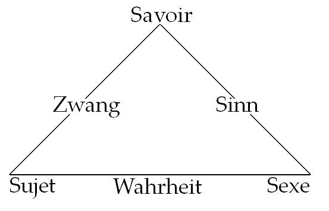
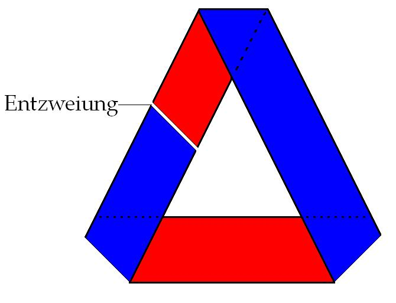
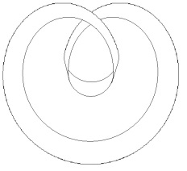
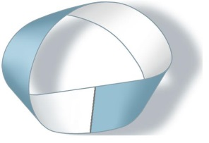
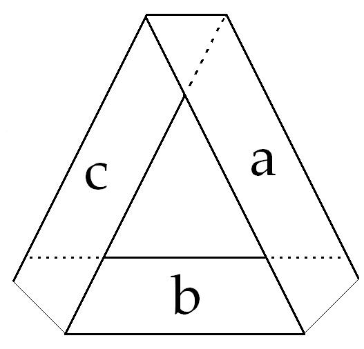
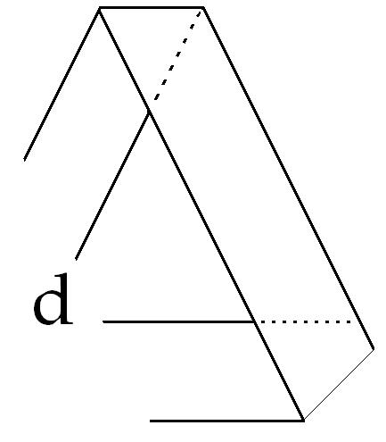
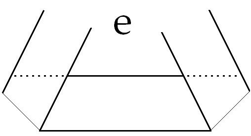
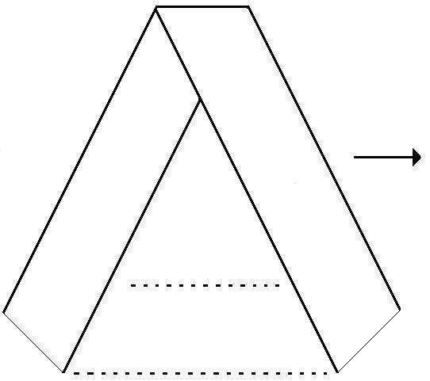
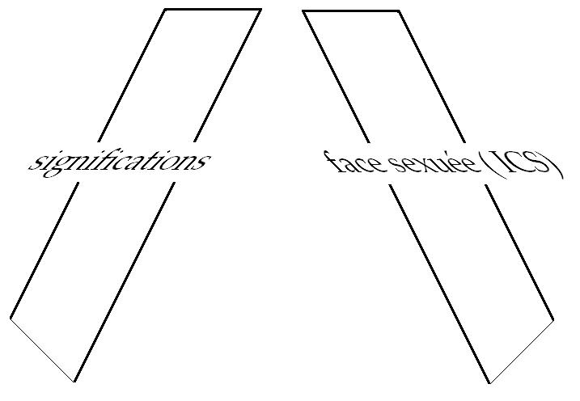
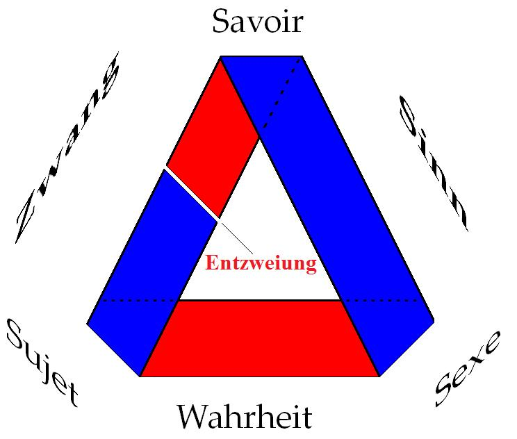

# Leçon 22 | 09 Juin 1965

<!-- source-url: http://staferla.free.fr/S12/S12 PROBLEMES.docx -->
<!-- seminar: s12 -->
<!-- lesson: 22 -->

<!-- id: s12-22-0001 -->

Nous poursuivons notre propos sur le point que je vous amène pour clore mon *discours* de cette année : *Problèmes cruciaux pour la psychanalyse*, ce point que structure *la triade* que j’ai introduite depuis trois ou quatre cours.

<!-- id: s12-22-0002 -->

J’espère que ce que j’ai indiqué la dernière fois, en clôture des apports des éléments d’un certain « *dialogue* », ce terme étant appuyé de toutes les réserves par lesquelles précisément j’avais introduit la séance de la dernière fois, que ce que j’ai apporté en conclusion, introduisant d’une certaine façon le pôle du *réel* en tant qu’il est constitutif d’une certaine difficulté qui est, à proprement parler, celle du psychanalyste, j’espère que vous vous en souvenez, ceci est l’introduction d’un thème, d’un thème que, sans aucun doute, je n’épuiserai pas cette année, mais qui, si le sort le veut, se poursuivra l’année prochaine.

<!-- id: s12-22-0003 -->

Dans cette introduction, peut-être trop rapide et peut-être même, jusqu’à un certain point, catapultée, j’ai signalé la place où nous devons concevoir le rapport de *ces trois termes*, dont je vais réarticuler aujourd’hui la fonction.

<!-- id: s12-22-0004 -->

Rassemblant en quelque sorte, le sens de tout notre discours de cette année, j’ai placé les trois termes que j’ai inscrits là en allemand, pour des raisons qui sont liées à l’élaboration historique de ces trois termes, pour autant que deux d’entre eux se réfèrent à *la pensée*, au travail d’auteurs qui ont écrit en allemand.

<!-- id: s12-22-0005 -->

<!-- id: s12-22-0006 -->

*Sinn* c’est une référence à proprement parler *fregienne* : c’est pour autant que FREGE[^166] oppose *Sinn* à *Bedeutung*, dans son élaboration conceptuelle de ce qu’il en est pour lui de *l’être du nombre*.

<!-- id: s12-22-0007 -->

*Zwang  *: que c’est pour autant que c’est là qu’il convient de situer cette fonction :

<!-- id: s12-22-0008 -->

- qui est à proprement parler la découverte freudienne,

<!-- id: s12-22-0009 -->

- qui donne un sens nouveau, un sens renouvelé à ce qui se présente dans la phénoménologie de ce qui a été élaboré tout au long du XIXème siècle comme *clinique mentale,*

<!-- id: s12-22-0010 -->

- et qui lui donne un statut, un statut que j’ai l’intention aujourd’hui de vous faire repérer comme étant ce qui justifie, à proprement parler, l’accent que nous avons mis, avec *notre commentaire* de DESCARTES sur les rapports fondamentaux *du sujet*, au sens moderne du terme, et *du savoir*.

<!-- id: s12-22-0011 -->

S’il y a *Zwang*… S’il y a quelque chose qui se manifeste d’une façon opaque dans le symptôme, qui *littéralement* contraint \- en même temps qu’il divise - le sujet, c’est là qu’il est important d’user du mot *Zwang*, parce que *Zwang* se rapporte à *zvei* et que, comme vous le voyez, sur la petite figure d’à côté : dont je ne vous ai pas encore révélé l’énigme, c’est bien d’un *Entzweiung*, c’est de ce que FREUD a poursuivi, découvert, tracé jusqu’à ce que son dernier écrit y culmine, dans l’idée de *Spaltung* du sujet essentiellement une *Entzweiung*.

<!-- id: s12-22-0012 -->

<!-- id: s12-22-0013 -->

Voici donc justification de ce que vous voyez là écrit au tableau.

<!-- id: s12-22-0014 -->

Le terme *Wahrheit*, *vérité*, est écrit lui aussi en allemand tout simplement pour rester homogène avec les deux autres termes.

<!-- id: s12-22-0015 -->

C’est celui-là, ce troisième terme, *Wahrheit*, la façon dont la *Wahrheit*, la *vérité*, se présente dans l’expérience psychanalytique ou plus exactement dans la structure fondamentale qui permet cette expérience, c’est de là qu’aujourd’hui j’entendrai, avec vous, repartir.

<!-- id: s12-22-0016 -->

Non sans avoir tiré, de notre discours commun de la dernière fois, un fil, un fil que nous allons retrouver tout à l’heure qui est celui de la question posée par KAUFMANN à MILNER. MILNER nous a donné un compte-rendu *extraordinairement* bien structuré, certes très riche, texte de travail, commentaire en somme, en même temps que résumé du *Sophiste* et à quoi, dès aujourd’hui, je croirai pouvoir, sans abus, me référer.

<!-- id: s12-22-0017 -->

Dans l’ensemble, pour ce que j’ai pu en recueillir, ce discours n’est pas tombé dans l’oreille de sourds et a été reconnu, au moins, pour *la dimension* qu’il offre - cette dimension n’était d’ailleurs pas forcément celle qui, à chacun des auditeurs, est ni la plus familière ni celle qui l’intéresse le plus - dimension qui peut causer, à celui qui est habitué à *la pensée médicale*, certains moments de flottement.

<!-- id: s12-22-0018 -->

Et je crois quand même qu’elle est suffisamment faite pour nous permettre aujourd’hui la référence que je vais dire maintenant.

<!-- id: s12-22-0019 -->

KAUFMANN, interrogeant MILNER, lui a dit, posé cette question : « *Et alors, qu’est-ce que vous faites dans tout cela, du « Bien » chez Platon, de l’Idée pure du « Bien » ?* »

<!-- id: s12-22-0020 -->

Je vous rappelle que MILNER avait mis l’accent dans cette dialectique où culmine le *Sophiste* qui tient essentiellement à démontrer, et c’est là le *culmen* de la pensée platonicienne : PLATON a tout au long de ses discours par où il s’adresse à nous...

<!-- id: s12-22-0021 -->

> un discours en fin de compte toujours essentiellement *énigmatique*, énigmatiques au point de se faire à l’occasion *déroutant*, *humoristique : il est tout à fait clair qu’il faut être vraiment sourd pour ne pas voir qu’à tel ou tel détour, il va jusqu’à se moquer de nous*.

<!-- id: s12-22-0022 -->

...PLATON, après avoir distingué le monde des *Idées*...

<!-- id: s12-22-0023 -->

> en tant qu’elles sont immuables, qu’elles ne sont pas soumises au changement comme ce qui, dans le monde sensible, qui en quelque sorte, les reçoit, mais ne peut en être affecté, ne peut les refléter que d’une façon approximative

<!-- id: s12-22-0024 -->

...PLATON, au niveau du *Sophiste* est conduit *et nous conduit*, à la démonstration que si l’action des *Idées,* dirais-je, ne peut se concevoir que sous le mode de *la participation*, cette participation n’est point à concevoir comme un effet qui se produit dans *la pensée*, dans ce par quoi, nous qui nous élevons par la dialectique jusqu’à la conception des *Idées* les plus originelles, nous faisons, par notre dialectique, jouer ce *tressage*, cette \[...\] par quoi nous reconnaissons ce qui - dans le monde du mouvement, du changement - se soutient d’une participation à l’*Idée*.

<!-- id: s12-22-0025 -->

Les *Idées* fondamentales, elles-mêmes ne se soutiennent que pour autant qu’entre elles, s’exerce ce mouvement de participation.

<!-- id: s12-22-0026 -->

Et MILNER vous a rappelé :

<!-- id: s12-22-0027 -->

- comment nous trouvons, participant à *l’être*, à la fois *le mouvement* et *le repos*,

<!-- id: s12-22-0028 -->

- comment pourtant, *mouvement* et *repos* diffèrent et ne peuvent différer que pour autant qu’ils participent aussi l’un à l’autre,

<!-- id: s12-22-0029 -->

- comment donc est nécessité ce quelque chose qui aux trois termes choisis par PLATON, pour nous montrer ce quelque chose qu’il faut que nous admettions, que nous concevions comme s’exerçant dans un mouvement, dans une action, dans une passion, au niveau même des *Idées,* comment au-delà de ces trois termes, deux autres nous seront nécessaires qui sont « *le même et l’autre* », et le terme d’une quintéité, une *Fünfheit* primitive assez ici avancée.

<!-- id: s12-22-0030 -->

Je ne me souviens pas ce que MILNER a répondu à la question de KAUFMANN. Je souhaite qu’il lui ait répondu *que du Bien* \- du *Bien* au sens de PLATON - *il n’avait parlé que de cela*, *car ce qu’est le Bien pour* PLATON, *c’est à proprement parler ce jeu de nombre*.

<!-- id: s12-22-0031 -->

Ceci n’est pas *un commentaire* si je puis dire *de mon cru*. Je l’avance aujourd’hui, avec d’autant plus *d’aisance*, qu’une certaine bonne fortune dans une recherche - comme cela, inspirée par la réflexion sur le *Sophiste -* m’a conduit à tomber sur quelque chose \- qui peut-être est loin d’être ignorée, mais dont j’ai été content de trouver la confirmation historique - c’est à savoir qu’il y a une leçon de PLATON sur *le Bien conçu comme l’Idée de l’Idée*.

<!-- id: s12-22-0032 -->

C’est SIMPLICIUS[^167] - commentateur d’ARISTOTE[^168], donc non seulement 3ème mais 4ème génération - c’est SIMPLICIUS qui nous en témoigne, dans ce qui reste d’attesté, qui nous témoigne qu’[ARISTOXÈNE](http://remacle.org/bloodwolf/erudits/aristoxene/livre2.htm#I) a allégué aux générations le fait d’avoir assisté à cette leçon et qu’ARISTOTE *y assistait bien*, qu’ARISTOTE *en a tenu un relevé*, des notes, une ronéotypie, et que ce qu’a eu de surprenant - pour ceux qui y ont assisté - cette leçon, c’est très précisément que PLATON n’y a parlé que du *nombre*.

<!-- id: s12-22-0033 -->

Tout le monde s’attendait à ce qu’on discute ce qu’il en était du *Bien* : si c’était la richesse, ou la bonne santé, la bonne humeur ou la bonne science. Une partie de l’assistance prit même congé au milieu, fort déçue[^169].

<!-- id: s12-22-0034 -->

Qu’à la vérité ce soit ainsi qu’il nous faille situer ce qu’était pour PLATON, cette référence à ce que nous pouvons appeler, jouer chez lui le rôle de l’*Idée absolue*, du fondement inébranlable de toute sa réflexion sur le monde, c’est là quelque chose qui pour nous est précieux, car comme vous allez le voir c’est ce qui va nous permettre de contrôler le sens :

<!-- id: s12-22-0035 -->

- de ce qui dans l’histoire de notre pensée est apporté par FREUD,

<!-- -->

<!-- id: s12-22-0036 -->

- et ce qui, d’être apporté par FREUD, nous ouvre une vue qui coordonne d’une façon supérieure à tout ce qui a pu être appréhendé jusque-là, les écueils, les apories, les difficultés, à quoi s’est heurtée en fait ce que j’appellerai la définition de la vérité.

<!-- id: s12-22-0037 -->

Ceci, pour nous psychanalystes, est quelque chose qui est à prendre au niveau le plus crucial de notre expérience.

<!-- id: s12-22-0038 -->

Dans un *ouvrage* à quoi je me consacre depuis plusieurs années[^170] - *et dont je ne vous dirai pas le titre -* je commence dans une première rédaction - *que vous ne verrez pas -* en ces termes : « *Le titre ici choisi - celui que je ne dis pas - en implique un autre qui serait « Voies de la Vraie psychanalyse ». C’est bien de quoi il s’agira.*

<!-- id: s12-22-0039 -->

*Par quelles voies la psychanalyse procède ? L’examen de ces procédés sera notre méthode pour déterminer ce qu’est vraiment la psychanalyse.*

<!-- id: s12-22-0040 -->

*Nous saisirons là que son être tient aux effets de la vérité. S’en tenir là, serait la peindre comme une île, flottant dans son propre déploiement.*

<!-- id: s12-22-0041 -->

*Moyen du juste moyen deviendrait le sous-titre dont le timbre extrême-oriental* \[[Dao De Jing](http://afpc.asso.fr/wengu/wg/wengu.php?l=Daodejing&lang=fr)\] *parodierait, non sans vertu, le succès même d’un tel propos.*

<!-- id: s12-22-0042 -->

*Mais cette Cythère est bien rivée au monde et c’est pourquoi la carte que nous décrirons sera plutôt du style des cartes marines : le contour commenté* *des rivages, laisse en gris les surfaces intérieures.*

<!-- id: s12-22-0043 -->

*Par quelles voies accède-t-on à la psychanalyse ? Voilà l’ancre autour de quoi nous entendons faire tourner profondément l’intérêt du lecteur, ceci dit aussi : le lecteur que nous tenons pour être ici intéressé. Le guide du vrai psychanalyste, tel est le titre, à le situer de sa visée. Il s’adresse évidemment au médecin et, comme au partenaire d’un dialogue qui le redouble, comme témoin dans un public qui attend le vrai psychanalyste. On discernera ici l’écho d’un cliché illustré par une littérature cousine : « The complete angler »*[^171]*, le vrai pêcheur à la ligne. C’est un ouvrage célèbre de la littérature anglaise, et qui est évoqué ici pour la même raison qui fait Platon commencer sa définition du « Sophiste » par la même référence. « The complete angler » n’aura conduit* *qu’un petit nombre de ses lecteurs à devenir des pêcheurs accomplis. Seule la volonté de sélection du lecteur s’y déclare.*

<!-- id: s12-22-0044 -->

*Au reste, ce livre serait-il ouvert par quelqu’un qui y voudrait chercher les voies du parfait psychanalysé, qu’on se rassure : il s’y retrouverait beaucoup moins que dans d’autres ouvrages sollicités, non seulement rien ici ne le bercera de ces implicites promesses qu’une observation familièrement présentée véhicule, mais ne lui sera pas moins refusée l’occasion, de déplacer son angoisse sur le fardeau nouveau d’une norme psychologique. Il n’y trouvera ni la carte du tendre de la psychanalyse, ni matière à s’y dépister lui-même. Ceci n’embarrassera même pas ses premiers pas dans la psychanalyse,et que ce guide ne vise pas à le guider mais bien ses guides éventuels à le lire. Il ne s’y sentira intéressé qu’objectivement ou tout au plus comme celui dont on défend les intérêts* *- partie sans doute mais non pas juge - s’il ne veut pas en retenir, pourtant, que des garanties sont nécessaires et que ce livre les appelle.*

<!-- id: s12-22-0045 -->

*Ou bien plutôt que ce livre en appelle, auprès de ceux pour qui il est écrit, des garanties existantes à d’autres plus sûres. Tel est en effet le troisième thème dont nous l’avons accentué. Par quelles voies la psychanalyse procède ? Voilà ce que l’auteur, dans un enseignement qui touche à la décade - je donne là quelques références qui donnent la date et elles sont déjà bien dépassées - essaiera d’articuler.*

<!-- id: s12-22-0046 -->

*Est–il besoin, pour éclairer cette distinction d’énumérer toutes les sciences où la médecine moderne appuie ses procédés, ni de remarquer qu’à se fonder sur leurs résultats, elle leur fait à chacune crédit de ses principes, leur empruntant, si l’on peut dire des produits fixés. Or, c’est ce qui n’est nullement possible pour la méthode psychanalytique. Et les psychanalystes, là-dessus, feront chorus certes, et nous ferons - on le verra - toujours grand cas de cet accord,* *qui va plus loin que d’être une certaine façon de se faire entendre, s’il n’est pas toujours un mode certain de l’harmonie. Mais ce n’est pas en vain* *que nous avons joué d’abord sur la métaphore de l’île : c’est qu’il nous faut constater aussi bien, c’est l’objet funeste qu’a engendré cette insularité,* *dans sa forme que l’on peut dire réfléchie, extérieure, à savoir : la situation de ségrégation scientifique où la communauté psychanalytique se soutient.*

<!-- id: s12-22-0047 -->

*C’est que la voie de la psychanalyse, elle, ne s’y maintient pas, et fait que nous corroborerons d’un chorus non moins serein à l’avouer chez les psychanalystes pour en explorer l’antinomie. Le paradoxe que nous y relevons en effet, découvre plus de son fond qu’il n’en recèle, car si nous entendons bien dire que seul un formalisme technique préserve encore - entre psychanalystes - la communauté de l’expérience, qu’on ne croit pas que l’égarement que nous dénonçons dans la discipline se place dans un Empyrée* [^172] *idéal. Il touche à la voie même où la cure doit être cherchée, si elle doit être véritable.« Véritable » a d’abord ici le sens simple de cure efficace mais pour autant que ses effets répondent à ses moyens, moyens qui dépassent dans ses termes la référence la plus ordinaire au médecin, celle qui lui fait qualifier de suggestion, les effets dont il dispose sur une marge commune de déplacement psychique offerte à presque toutes ses interventions, ne fussent-elles que de simulacre. Et « véritable » prend ici un sens redoublé de ce que les moyens de la psychanalyse sont des moyens de vérité, par quoi nous revenons à notre débat. Or, l’usage de tels moyens s’altère toujours - l’histoire le prouve - de n’être pas ouvert, ouvert à la critique, ouvert à la question, ouvert à une ambiguïté qui prend ici une forme particulière. Car, la vérité ainsi évoquée, personne à s’offrir à l’épreuve d’une psychanalyse n’hésitera sur ce qu’elle a le sens de sa propre vérité à cette personne.*

<!-- id: s12-22-0048 -->

*Mais comment établir le rapport de cette vérité du sujet, avec ce que la construction de la science nous a appris à reconnaître sous ce nom ?*

<!-- id: s12-22-0049 -->

*Ne renvoyons pas ici notre confraternel partenaire au décevant périple qu’au mieux son cursus secondaire, d’être français, lui a fait parcourir sous le nom de philosophie, voire à l’épistémologie déjà poussiéreuse qu’il en a pu retenir. Et ceci simplement parce que Freud a introduit sous le nom d’inconscient dans notre expérience, l’ordre de faits qui ouvrent à la question ainsi posée, son chemin expérimental. C’est ici que notre audience prend corps avec notre propos, et nous allons dire de qui nous voulons le faire entendre : de ceux-là même à l’endroit de qui, les tenants de l’expérience analytique n’ont su jusqu’alors, faire état que de son caractère incommunicable, pour ceux qui ne l’ont pas partagé sauf, aux dernières nouvelles, à étaler ce mystère - sur ce mystère - la tarte à la crème mal digérée des fonctions de la communication en y joignant quelques mômeries sur la relation médecin-malade.*

<!-- id: s12-22-0050 -->

*Car notre propos est que la psychanalyse soit soumise à une recherche qui porte sur ses procédés et jusque dans ses errances, trouve à articuler ses limites, autrement dit une recherche qui en dégage ce qui s’appelle la structure.*

<!-- id: s12-22-0051 -->

*Pour le contrôle d’un tel travail, nous en appelons à tous ceux pour qui la notion de structure a, dans leur science respective, son emploi. Nous en attendons en outre, qu’avec nous, de ce travail ils déduisent les conditions de formation grâce à quoi un psychanalyste sera propre à conduire une analyse. C’est dans ce moment, que notre dialogue exemplaire avec le médecin trouve son pathétique. Prends garde, toi qui as ouvert ce livre parce que tu rêves de devenir psychanalyste ! Car la psychanalyse ne vaudra que ce que tu vaudras quand tu seras psychanalyste, elle n’ira pas plus loin que là où elle a pu te conduire* ».

<!-- id: s12-22-0052 -->

C’est de cette référence de la psychanalyse comme science avec ce qui, effectivement, peut être réalisé de ce *certain rapport* lié à une *certaine place* de la résurgence de la vérité dans la dialectique moderne du savoir, c’est de là, que dépend - contrairement à ce qu’il en est de l’*Idée* de PLATON - que dépend ce qu’il en est effectivement de ce dont nous pouvons parler sous le nom de psychanalyse.

<!-- id: s12-22-0053 -->

Et c’est très précisément *pour autant* que la psychanalyse - telle qu’elle est vécue, présente et exercée dans notre moment historique - comporte une certaine façon de diriger cette enquête sur le fonds de sa vérité, une certaine résistance, résistance aussi bien prévue, pointée, désignée, à l’avance par FREUD, c’est bien pour autant qu’il en est ainsi, que mon enseignement, proprement, non seulement je me crois en droit, mais je suis obligé - à mesure même de cette résistance - d’infléchir, d’incurver sa suite et de ne pouvoir aller au-delà d’une certaine limite, dans ce qui est de l’exploration d’une *vérité* qui ne peut être définie qu’à suivre l’effectivité de ce qu’elle met en jeu - *hic et nunc,* telle qu’elle est pratiquée - de ce que met en jeu l’ensemble de ses procédés.

<!-- id: s12-22-0054 -->

Qu’à cet égard, la *vérité* entre dans un certain dramatisme, qui est celui dont indique suffisamment la limite, à préciser que *cette vérité*, celui-là même qui peut, en un certain point, la révéler, est en droit de la suspendre, voire de la refuser - c’est là quelque chose qui non seulement n’a rien d’original, mais qui, dans la psychanalyse même, trouve au maximum, sa justification. Je vous dis, ce en quoi le fait qu’au cours des âges, cette position, par maints penseurs, a été effectivement adoptée, adoptée comme *un parti pris* et *un parti pris* avoué : ils l’ont écrit noir sur blanc.  

<!-- id: s12-22-0055 -->

- Quand DESCARTES nous dit qu’il ne donnera pas la solution de tel problème, il en donne le prétexte que sans doute, il ne veut pas trop donner d’occasions à tel ou tel de ses rivaux qui prétendront l’avoir découvert de leur côté, qu’il veut simplement montrer qu’ils n’ont effectivement pas été capable de l’atteindre, ce n’est là que prétexte…

<!-- id: s12-22-0056 -->

- De même que c’est prétexte, quand GAUSS ayant aperçu avant RIEMANN la formulation mathématique moderne de l’espace permettant l’accès *trans-euclidien*, que GAUSS se refuse de le *communiquer*, ayant ses raisons d’articuler qu’aucune *vérité* ne saurait, en quelque sorte, *anticiper* sur ce qu’il est supportable de *savoir*.

<!-- id: s12-22-0057 -->

Cette *dialectique*, j’ai dit, se justifie, prend sa forme pour autant que la psychanalyse est pour la première fois ce qui nous permet de mettre au jour, de poser dans leur radicalité, ses rapports qui sont ceux de la *vérité* et du *savoir*. *On peut poser la question* d’une façon en quelque sorte abstraite - il est facile de le pointer, je l’ai fait au passage - sous la forme paradoxale, et bien sûr *pas sérieuse, comique* : « *qu’est-ce qu’il en serait de la vérité du savoir qui constituerait la formule newtonienne, si elle était sortie par quelqu’un deux cents ans avant ?* »

<!-- id: s12-22-0058 -->

*Est-ce que cette formule*, dont l’introduction dans le savoir représente un moment structural - nous allons encore y revenir - des rapports de la vérité ou du savoir... ET ( *!* ) du savoir , *est-ce que cette formule aurait anticipé* ? A-t-elle ou non quelque *valeur de vérité* ?

<!-- id: s12-22-0059 -->

Ceci n’est que jeu de l’esprit, aporie artificielle. C’est beaucoup plus radicalement que se pose cette question de la vérité et c’est autour de cette question que joue l’expérience freudienne.

<!-- id: s12-22-0060 -->

C’est pourquoi elle n’est pensable, elle ne prend son sens qu’à partir d’un statut du sujet qui est le statut du sujet cartésien.

<!-- id: s12-22-0061 -->

Si j’ai pris tant de soin, au début de cette année, de reprendre la dialectique du *cogito* comme étant celle, fondamentale, qui doit nous permettre de situer ce qu’il en est du sens du freudisme, c’est qu’il appartient au *cogito* cartésien de marquer l’importance d’un certain moment définissant, comme tels, les rapports du sujet au savoir.

<!-- id: s12-22-0062 -->

C’est là peut-être, *ce que n’éclairent pas totalement tous les commentaires* qui ont été faits de ce moment essentiel représenté par le *cogito*.

<!-- id: s12-22-0063 -->

Ce que cherche DESCARTES et ce qu’il trouve dans cette visée d’un fondement inébranlable, d’un *fondamentum inconcussum*, *pouvons-nous dire :*

<!-- id: s12-22-0064 -->

- *qu’avec le cogito il l’obtienne* ?

<!-- id: s12-22-0065 -->

- *Que cet être*, impossible à arracher de l’appréhension du « *Je pense* » *soit un être fondé dans l’être* ?

<!-- id: s12-22-0066 -->

Il est en tout cas tout à fait clair que la façon dont devant vous - au mépris s’il le faut des *commentaires antérieurs*, mais certainement pas au mépris des *textes cartésiens -* je l’ai articulé de façon qui dépasse ce à quoi, au moment où dans le commentaire on est forcé de s’en tenir au temps de l’*ergo sum*, si le commentaire doit reconnaître que là, *ce sur quoi* DESCARTES...

<!-- id: s12-22-0067 -->

au moins quand il est lui-même son propre commentateur ...*s’appuie, c’est sur l’évidence d’une idée claire et simple*.

<!-- id: s12-22-0068 -->

Mais qu’est-ce que - pour nous, au point où nous en sommes de l’efficience de la science - qu’est-ce que vaut cette évidence de l’idée claire et simple, ce *simplex intuitus* dont DESCARTES lui-même fait état ? Assurément, il subit - pour nous - l’effet de contrecoup de tout le développement de la science, de celui qui s’est produit depuis la démarche cartésienne, qui est fait pour nous faire réviser cette prévalence de l’idée simple à \[*?*\] l’intuition.

<!-- id: s12-22-0069 -->

Et la façon que j’ai eu devant vous d’articuler le « *Je pense : « donc je suis »* », avec deux points ouvrez les guillemets, d’où il résulte que la formule complète est à proprement parler : « *Je suis celui qui pense : « donc je suis »* » et que ce que j’ai appelé cette division du

<!-- id: s12-22-0070 -->

«*Je suis *» *de sens*, au «*Je suis *» *d’être* est l’introduction à cette *Entzweiung* où va se placer pour nous, autrement, le problème de la *vérité*.

<!-- id: s12-22-0071 -->

Et c’est ici que prend sa valeur le fait que l’« *ergo* » de DESCARTES, qui indique bien quelque chose qui est *de l’ordre de la nécessité*, et que pourtant DESCARTES accentue, répudie comme devant être interprété *d’aucune façon* par une nécessité *qui tomberait* *sous l’incidence du procès logique de la nécessité,* ceci qui pourrait s’exprimer : « *Tout ce qui pense est, or je pense, donc je suis.* »

<!-- id: s12-22-0072 -->

C’est très précisément ce que DESCARTES prend soin lui-même, en un de ses textes de refuser [^173]. Le « *donc* » est ici une articulation qui marque la place, certes d’une référence causale, mais d’une référence causale qui est celle de la mise en acte de quelque chose qui est présent, pour aboutir à cette disjonction, à cette *Entzweiung,* du «*Je* » *de sens* que DESCARTES, en un autre point, va franchement à articuler non pas même *cogito* mais *dubito* \[*Méditation seconde*\].

<!-- id: s12-22-0073 -->

Le sens vacille, le doute va jusqu’au point le plus radical : *ergo sum*, l’être dont il s’agit est du *dubito* même, séparé.

<!-- id: s12-22-0074 -->

Que serait donc DESCARTES si nous nous en tenions à ce qui s’impose dans cette analyse de son articulation fondamentale ?

<!-- id: s12-22-0075 -->

Rien d’autre qu’un *scepticisme consistant*, un scepticisme qui se mettrait lui-même à l’abri de ce qui lui a été toujours opposé, à savoir qu’au moins est vraie la vérité du scepticisme.

<!-- id: s12-22-0076 -->

Or, c’est justement ce dont il s’agit : *la démarche de* DESCARTES *n’est pas une démarche de vérité* et ce qui le signale, et qui n’a non plus, ce me semble, pas été pleinement articulé comme tel ,c’est que ce qui fait sa fécondité, c’est justement qu’il s’est proposé une visée, une fin qui est celle d’une *certitude*, *mais que pour ce qui est de la vérité, il s’en décharge sur l’Autre, sur le grand Autre, sur Dieu pour tout dire.*

<!-- id: s12-22-0077 -->

*Il n’y a aucune nécessité interne à la vérité* : la vérité même de « *deux et deux font quatre* » est la vérité *parce qu’il plaît à Dieu qu’il en soit ainsi*.

<!-- id: s12-22-0078 -->

C’est *ce rejet de la vérité hors de la dialectique du sujet et du savoir* qui est à proprement parler le nerf de *la fécondité de la démarche cartésienne*.

<!-- id: s12-22-0079 -->

Car DESCARTES peut bien encore un temps conserver, lui penseur, la carcasse de *l’assurance traditionnelle des* « *vérités éternelles* » \- elles sont ainsi parce que Dieu le veut - mais de cette façon, aussi bien, il s’en débarrasse, et par la voie ouverte, la science entre et progresse, qui institue un savoir qui n’a plus à s’embarrasser de ses fondements de vérité.

<!-- id: s12-22-0080 -->

Je répète : *aucune institution essentielle de l’être n’est donnée dans* DESCARTES.

<!-- id: s12-22-0081 -->

Une démarche, un acte, atteint la certitude sur la référence de quoi ? Qu’il y a déjà un savoir. La démarche de DESCARTES ne se soutient pas un instant s’il n’y a pas déjà cette énorme accumulation des débats qui ont suivi le savoir, un savoir toujours lié, pris encore jusque-là, comme par un fil à la patte, sur le fait critique que *son départ, à ce savoir, est lié à la possibilité de constituer la vérité.*

<!-- id: s12-22-0082 -->

J’appellerai ce savoir d’avant DESCARTES un état pré-accumulatif du savoir.

<!-- id: s12-22-0083 -->

À partir de DESCARTES, le savoir, celui de *la science*, se constitue sur le mode de production du savoir :

<!-- id: s12-22-0084 -->

- de même qu’une étape essentielle de notre structure qu’on appelle « sociale » - mais qui est en réalité *métaphysique* et qui s’appelle le capitalisme - c’est *l’accumulation du capital*,

<!-- id: s12-22-0085 -->

- de même le rapport du sujet cartésien à cet être qui s’y affirme, est fondé sur *l’accumulation du savoir*.

<!-- id: s12-22-0086 -->

*Est savoir*, à partir de DESCARTES, *ce qui peut servir à accroître le savoir*. Et ceci, est une toute autre question que celle de *la vérité*.

<!-- id: s12-22-0087 -->

*Le sujet est ce qui fait défaut au savoir*. *Le savoir*, dans sa présence, dans sa masse, *dans son accroissement propre réglé par des lois* qui sont autres que celles de l’intuition, *qui sont celles du jeu symbolique et d’une copulation étroite du nombre avec un réel* qui est avant tout *le réel d’un savoir*.

<!-- id: s12-22-0088 -->

Voilà ce qu’il s’agit d’analyser pour donner le statut - le statut véritable - de ce qu’il en est du sujet au temps historique de la science.

<!-- id: s12-22-0089 -->

De même que toute la psychologie moderne est faite pour expliquer comment un être humain peut se conduire *en structure capitaliste*, de même le vrai nerf de la recherche sur l’identité du sujet est de savoir *comment un sujet se soutient devant l’accumulation du savoir*.

<!-- id: s12-22-0090 -->

C’est précisément cet état, cet état extrême, que la découverte de FREUD bouleverse. Découverte qui veut dire et qui dit :

<!-- id: s12-22-0091 -->

- qu’il y a un « *Je pense* » qui est *savoir sans le savoir*,

<!-- id: s12-22-0092 -->

- que le lien est écartelé mais du même coup bascule de ce rapport du « *Je pense* » au « *Je* *suis* ».

<!-- id: s12-22-0093 -->

L’un de l’autre est *entzweiet *:

<!-- id: s12-22-0094 -->

- *là où je pense, je ne sais pas ce que je sais,*

<!-- id: s12-22-0095 -->

- et ce n’est pas là ou je discoure, là où j’articule, que se produit cette annonce qui est celle de mon être d’être, du « *Je suis* » *d’être,* c’est dans les achoppements, dans les intervalles de ce discours ou je trouve mon statut de sujet.

<!-- id: s12-22-0096 -->

> *Là m’est annoncée la vérité : où je ne prends pas garde à ce qui vient dans ma parole.*

<!-- id: s12-22-0097 -->

Le problème de *la vérité  ressurgit*, *la vérité * fait retour dans l’expérience et *par une autre voie que celle qui est de mon affrontement au savoir*, de *la certitude* que je peux essayer de conquérir dans cet *affrontement* même, justement parce que j’apprends que cet *affrontement* est inefficace et qu’alors que là où je pressens, où je contourne où je devine tel écueil, que j’évite grâce à la construction extraordinairement riche et complexe d’un *symptôme,* que ce que je montre comme un symptôme prouve que je sais à quel obstacle j’ai affaire, à côté de cela, mes pensées, mes fantasmes se construisent non seulement comme si je n’en savais rien mais comme si je ne voulais rien en savoir. Ceci est l’*Entzweiung*. L’intérêt de cette image, celle que j’ai mise sur la droite :

<!-- id: s12-22-0098 -->

<!-- id: s12-22-0099 -->

…qui est, pour vous, facile à reproduire car c’est une de ces constructions qu’on fait très simplement en manipulant une bande de papier. C’est toujours la *bande de Mœbius* mais *une bande de Mœbius en quelque sorte, écrasée, aplatie*. Je pense que vous retrouvez là le profil que je vous ai rendu familier de l’intervalle où dans *le huit intérieur* se noue *la bande de Mœbius*, c’est-à-dire cette bande qui se recolle sur elle-même après seulement un demi-tour, et qui a pour propriété, je vous l’ai dit, cette surface, de n’avoir ni envers ni endroit, c’est exactement la même.

<!-- id: s12-22-0100 -->

 

<!-- id: s12-22-0101 -->

Ici vous la voyez sous la forme où elle est le plus habituellement reproduite quand vous le faites avec une simple bande, une ceinture, c’est-à-dire quand ça ne prend pas cet aspect ici aplati, qui nous est par ailleurs bien utile pour montrer certaines choses, bref, cette *bande de Mœbius*, elle est aussi bien réalisée par une bande de papier plié trois fois d’une certaine façon.

<!-- id: s12-22-0102 -->

  

<!-- id: s12-22-0103 -->

Qu’est-ce que nous montre le mode de le présenter ainsi ?

<!-- id: s12-22-0104 -->

- C’est que, il y a, si vous voulez, sur le côté supérieur droit de cette structure triangulaire \[a\] il y a symétrie. Les deux reploiements du papier \[d\] se font d’une façon symétrique par rapport à celui qui apparaît à la surface.

<!-- id: s12-22-0105 -->

- De même ici \[b\], dans le reploiement suivant \[e\], c’est d’une façon symétrique que vous verrez d’abord se reployer la première bande comme ceci, puis dans la boucle suivante.

<!-- id: s12-22-0106 -->

- Mais de la façon dont ils sont noués, vous voyez qu’ici \[c\], dans le troisième côté, du côté supérieur, c’est d’une façon non symétrique que le reploiement se produit.

<!-- id: s12-22-0107 -->

Autrement dit, si nous concevons ce qu’il en est du rapport de sens, pour autant que, à ce niveau du savoir inconscient, ce qui s’établit est communication d’une certaine structure entre l’articulation signifiante et ce quelque chose d’énigmatique qui représente… qui est l’être sexué, si nous symbolisons la face suivante comme étant celle des significations par où vient, au niveau du sujet ce noyau opaque de l’être sexué, nous avons là deux champs en quelque sorte, non seulement autonomes mais qui peuvent se situer, l’un par rapport à l’autre, comme ils sont effectivement dans cette image, comme l’endroit et l’envers :

<!-- id: s12-22-0108 -->

<!-- id: s12-22-0109 -->

Mais il est un point où ce qui est l’endroit, vient se rejoindre à l’envers, où la jonction ne peut se produire, si ce n’est sous la forme de cette *Entzweiung*, où c’est autre chose qui apparaît d’un bord à l’autre du troisième bord : c’est celui qui lie *le sujet* au *savoir*.

<!-- id: s12-22-0110 -->

<!-- id: s12-22-0111 -->

Et ici, loin que ce soit là *relation de certitude, celle qui ne se fonde que sur le rapport d’évanouissement du sujet par rapport au savoir*, c’est la réalité appelée *symptôme*, celle du conflit qui résulte de ce qui s’annonce du côté de l’inconscient, à l’encontre, d’une façon *hétérogène*, à ce qu’il en est, de ce qui se constitue comme identité du sujet.

<!-- id: s12-22-0112 -->

*La division du sujet et du symptôme*, c’est l’incarnation de ce niveau *où la vérité reprend ses droits et sous la forme de ce réel non su*, de *ce réel* à exhaustion impossible, qui est *ce réel* *du sexe*, auquel jusqu’à présent, nous n’accédons :

<!-- id: s12-22-0113 -->

- que par des travestis,

<!-- id: s12-22-0114 -->

- que par des suppléances,

<!-- id: s12-22-0115 -->

- que par la transposition de *l’opposition masculin-féminin* en *opposition actif-passif* par exemple ou *vu-non vu*, etc., c’est-à-dire à proprement parler, dans *cette fonction qui a donné tant d’embarras au fondateur de la dialectique*, *à savoir la fonction de la dyade*.

<!-- id: s12-22-0116 -->

Il est très frappant que cette fonction de la *dyade*, ils l’ont parfaitement aperçue. Ils l’ont aperçue comme ce qui fait obstacle et butée à l’instauration de *l’être* et de l’*Un* par quelque voie que cette problématique soit abordée. Que ce soit :

<!-- id: s12-22-0117 -->

- au niveau du *Parménide*,

<!-- id: s12-22-0118 -->

- au niveau du *Sophiste* lui-même - je l’ai suffisamment indiqué tout à l’heure,

<!-- id: s12-22-0119 -->

- au niveau du commentaire d’ARISTOTE qui est donné dans SIMPLICIUS, et qui porte le reflet de ce qu’ARISTOTE avait intégré de cette fameuse leçon platonicienne par laquelle j’ai commencé tout à l’heure, nous trouvons que le statut du *nombre*, finalement à ce sommet de *la pensée aristotélicienne* qui porte certainement le reflet de la leçon de PLATON,

<!-- id: s12-22-0120 -->

> le nombre, c’est le nombre **2**. Le **1** n’est pas un nombre.

<!-- id: s12-22-0121 -->

Il est un nombre pour nous, il est un nombre pour autant que la dialectique fregienne nous permet de le faire sortir du **0** par la voie de ce que nous avons appelé tout à l’heure la suture subjective, mais avant que fût constituée, d’aucune façon, cette relation du sujet au savoir, il n’y avait aucun autre moyen d’une pareille déduction que d’instaurer le début du nombre au niveau du **2**, du *zwei*.

<!-- id: s12-22-0122 -->

Or, ce *zwei*, c’est justement celui qui nous rejoint dans la distinction du sexe, distinction qui était tout à fait hors de la portée de *la dialectique platonicienne*. C’est par la voie de ce quelque chose qui est tout de même visé par cette dialectique et qui se trahit, si l’on peut dire, ou se traduit, ou se reflète, dans les formes qu’elle donne, cette dialectique, à la déduction de la dyade.

<!-- id: s12-22-0123 -->

Car bien sûr - reportez–vous au texte et vous le verrez - ils ne prennent pas le *zwei*, la dyade sexuelle comme un donné, précisément justement parce qu’ils n’ont pas la référence sexuelle et que de la prendre comme un donné, n’est pas une solution.

<!-- id: s12-22-0124 -->

Mais cette dyade, ARISTOTE tente de la faire surgir d’un rapport triadique qui est celui : de l’« *Un* », du « *grand* »*,* et du « *petit* ».

<!-- id: s12-22-0125 -->

C’est d’une juste mesure que la naissance du 2 sera concevable, à savoir quand la différence exacte du « *grand* » et du « *petit* » viendra à s’égaler au 1 [^174].

<!-- id: s12-22-0126 -->

- Il est clair que cette déduction est fragile puisqu’elle suppose la proportion et la mesure.

<!-- id: s12-22-0127 -->

- Il est clair qu’elle requiert la même… la même proportion variante pour faire surgir tous les autres nombres.

<!-- id: s12-22-0128 -->

- Il est clair qu’elle trahit une fondamentale dissymétrie dans les deux unités de la dualité et que c’est précisément de cette dissymétrie qu’il s’agit dans ce qu’il en est toujours de toute appréhension véridique de l’être en tant que sexué.

<!-- id: s12-22-0129 -->

Cette même dissymétrie qui est celle où vient à se nouer dans la disparité du savoir au sujet, dans le fait :

<!-- id: s12-22-0130 -->

- que le sujet est manquant,

<!-- id: s12-22-0131 -->

- que le sujet nous force, nous sollicite, de construire une imaginarité plus radicale que celle encore qui nous est donnée dans l’expérience analytique, comme celle où surgit l’image du moi, que cette imaginarité, cette singularité absolue du sujet comme manque est le reflet de la traduction de ceci qu’il ne peut être apparié *de l’opposition duelle d’un sexe à l’autre sexe*.

<!-- id: s12-22-0132 -->

Le rapport **2** qu’il y a dans le sexe est un rapport dissymétrique, et tout ce que notre expérience fait surgir à la place où il s’agirait de saisir cette différence sexuelle, est quelque chose d’une autre structure qui est ce sur quoi j’aborde et autour de quoi va tourner toute notre critique de l’expérience analytique au point où elle en est, *hic et nunc*, dans la psychanalyse réelle, c’est à savoir *l’objet(a)*.

<!-- id: s12-22-0133 -->

Partout où le sujet trouve sa vérité - c’est là qu’en est venue notre expérience - ce qu’il trouve, il le change en *objet(a)* comme le roi MIDAS, dont tout ce qu’il touchait devenait or. Ce que nous rencontrons à la place d’où part cette incidence de l’être et de l’être sexué, refusé au savoir et par rapport à quoi le sujet est ce singulier qui seulement signale *cette dissymétrie de la différence*. Chaque fois que le sujet trouve sa vérité, là, ce qu’il trouve, il le change en *objet(a)*.

<!-- id: s12-22-0134 -->

C’est bien là le dramatisme, absolument *sans antériorité*, à quoi nous pousse l’expérience analytique. Car là, nous nous apercevons que ce n’était pas question mince ni accessoire quand PLATON s’interrogeait s’il y avait aussi une *Idée* de la boue, une *Idée* de la crasse.

<!-- id: s12-22-0135 -->

Ce que *l’expérience analytique* révèle, c’est que c’est en bien d’autres choses que de l’or, que l’homme - dans l’expérience analytique - se trouve changer ce qu’il atteint en son point de vérité.

<!-- id: s12-22-0136 -->

L’introduction du déchet, comme terme essentiel d’une des possibilités de support de *l’objet(a)*, voilà quelque chose qui est ce que j’appelle *une indication sans précédent*. Ce statut de *l’objet(a)* qui est là à la place, à la place du troisième terme voilé, et *en partie indévoilable*, voilà le fait d’expérience qui nous ramène à *la question radicale de ce qui est au-delà du savoir* : il en est, par rapport au sujet, d’une *vérité*.

<!-- id: s12-22-0137 -->

Je poursuivrai et clorai ce que j’ai à en dire la prochaine fois qui sera aussi mon dernier cours.

## Notes

[^166]: G. Frege : *Les fondements de l'arithmétique : Recherche logico-mathématique sur le concept de nombre*, Seuil, 1970.

    *Écrits logiques et philosophiques*, Paris, Seuil, Points n°296 (sens et dénotation p.102).

[^167]: [Simplicius : *Commentaire sur les catégories d'Aristote*](http://remacle.org/bloodwolf/philosophes/plotin/simplicius.htm), Belles Lettres, 2001.

[^168]: [Aristote : *Métaphysique*](http://remacle.org/bloodwolf/philosophes/Aristote/tablemetaphysique.htm),Vrin, Paris, 2000 .

[^169]: [Diogène Laërce : *Vies et doctrines : Platon*](http://ugo.bratelli.free.fr/Laerce/Platon/Platon.htm)

[^170]: Jacques Lacan : *Écrits*, Seuil, Paris, 1966.

[^171]: Thomas Westwood : [*The Chronicle of the Complete Angler*](http://ia700208.us.archive.org/16/items/chronicleofcompl00westuoft/chronicleofcompl00westuoft.pdf), Kessinger Publishing, 2007.

[^172]: La plus élevée des quatre sphères célestes.

[^173]: René Descartes : *Œuvres et Lettres*, op. cit., *Secondes réponses*, p.375-6 :

    « *Mais quand nous aperce­vons que nous sommes des choses qui pensent, c'est une première notion qui n'est tirée d'aucun syllogisme; et lorsque quelqu'un dit : Je pense, donc je suis, ou j'existe, il ne conclut pas son existence de sa pensée comme par la force de quelque syllogisme, mais comme une chose connue de soi; il la voit par une simple inspection de l'esprit. Comme il paraît de ce que, s'il la déduisait par le syllogisme, il aurait dû auparavant connaître cette majeure : Tout ce qui pense, est ou existe. Mais, au con­traire, elle lui est enseignée de ce qu'il sent en lui-même qu'il ne se peut pas faire qu'il pense, s'il n'existe.* » Cf. également : *Entretien avec Burman*, p. 1355-57.

[^174]: [Aristote : *Métaphysique*, op. cit., I, 5.](http://remacle.org/bloodwolf/philosophes/Aristote/metaphysique1.htm)
