# Leçon 23 | 16 Juin 1965

<!-- source-url: http://staferla.free.fr/S12/S12 PROBLEMES.docx -->
<!-- seminar: s12 -->
<!-- lesson: 23 -->

<!-- id: s12-23-0001 -->

Je vous fais aujourd’hui, en principe, le dernier cours de cette année. Néanmoins, ce ne sera pas tout à fait notre dernière rencontre, au contraire le *séminaire fermé* qui aura lieu dans huit jours pourra, à tout un chacun, donner l’occasion de me poser quelques questions sur ce qu’aura pu lui laisser d’obscurité, soit sur son texte, soit sur ses desseins, ce que je vous ai exposé cette année.

<!-- id: s12-23-0002 -->

J’ai arrêté la dernière fois la lecture d’un texte préliminaire à un écrit en cours aux termes suivants \[Lacan : *Écrits*, Seuil, Paris, 1966\] : « *Car la psychanalyse ne vaudra* - dis-je à celui qui demande à être analyste - *que ce que tu vaudras quand tu seras psychanalyste, elle n’ira pas plus loin que là où elle a pu te conduire. Ceci n’est pas pour nous leurrer ensemble d’une méritoire semonce sur ta responsabilité dans la pratique* – continuai-je m’adressant au même - *tu sais bien que tout exercice d’un pouvoir n’est pas seulement sujet à l’erreur mais à ce comble de méprise d’être bienfaisant dans son erreur. Comment accepterions-nous d’être médecin, si nous n’acceptions pas cet incroyable effet de l’humain labyrinthe ?*

<!-- id: s12-23-0003 -->

*Ce qu’il me faut te dire, c’est le risque pour toi de ce mariage au sort de la psychanalyse. Car ce que tu mets ici en jeu n’a rien à faire avec ce qu’il en est pour l’idée d’une psychanalyse ordinaire. Et le terme de « parfaitement analysé » qu’on te fait mirer à l’issue de ta psychanalyse qualifiée de didactique* *est aussi trompeur, qu’insuffisante la définition des fins de cette analyse. Car il ne suffit pas que tu sois, selon la formule classique « parfaitement au clair dans tes relations avec tes patients », il faut aussi que tu puisses supporter tes relations avec la psychanalyse elle-même. Car si la psychanalyse nous l’apprend : la vérité répond à un manquement venu à son endroit, à un refoulement autrement dit, en prenant sur le corps même où gît ton être, sa rançon, ne crois pas qu’elle soit plus clémente à la faute capitale – toujours imminente – en une action qui prétend suivre sa trace sans connaître ses brisées.*

<!-- id: s12-23-0004 -->

*Une action dont le moyen est le verbe, trébuche dans le mensonge, et la vérité en recouvre les traites toujours avec usure.*

<!-- id: s12-23-0005 -->

*Ta position est donc bien liée au sort de tous ceux-ci qui s’appellent les psychanalystes car la psychanalyse n’est point autre part. Si l’on ne peut attendre rien de plus de la psychanalyse que ce qu’on y met, ce que j’exige c’est à savoir, de pénétrer ce qu’il y a derrière une certaine résistance instituée dans le corps même des psychanalystes. Ceci est bien la mise en question essentielle, depuis le temps où mon enseignement s’est posé, purement et simplement,* *comme s’opposant à une certaine sordidité dans la théorisation de la pratique dont le commun dénominateur est donné par la psychologisation :* *cette psychologisation qui s’y dénonce elle-même avec éclat puisqu’elle s’avoue être le but de certains de ses promoteurs.*

<!-- id: s12-23-0006 -->

*Chercher le réel auquel la psychanalyse a affaire dans le psychologique, est le principe d’un dévoiement radical. Toute réduction, toute tentative de retour, comme on dit ou d’exhaustion de la psychanalyse dans quelque psychologisme, de quelque façon constituée qu’on puisse le forger, c’est la négation de la psychanalyse. Depuis le temps que j’ai montré que le psychologisme est tissé de fausses croyances - appelons les choses par leur nom - dont la première est celle de ces identités intuitives qu’on appellerait le « moi », il me semble que j’ai parcouru assez de chemin pour vous montrer où se peut tracer tout autrement la voie. Jamais personne - sauf une certaine forme d’ignorantisme que, dans un thème d’humour, j’attribue (bien gratuitement, encore que sans doute non sans raison) aux dentistes - jamais personne n’a osé encore, imputer à Descartes l’origine de cette erreur intuitive.* »

<!-- id: s12-23-0007 -->

Ce que je vous ai rappelé la dernière fois concernant *le statut instauré du sum dans le cogito*, je ne le rappellerai pas aujourd’hui.

<!-- id: s12-23-0008 -->

C’est de là que je repars. Pour ceux qui n’étaient pas ici la dernière fois, je tiens néanmoins à marquer que ce sur quoi j’ai mis l’accent, c’est que cette fondation du *sum* dans *le cogito*, n’est pas fondation première.

<!-- id: s12-23-0009 -->

Il faut se souvenir que ce surgissement du *cogito,* dans cette division où mon analyse le marque du « *Je suis* » *d’être* au « *Je suis* » *de sens*, du « *je suis* » qui est celui qui pense : « *donc je suis* », que cette démarche ne se conçoit pas sans le repérage de ce par rapport à quoi elle se situe. Elle se situe comme un doute méthodique et plus encore radical, de quelque chose qui est un savoir déjà constitué et que cette relation du sujet au savoir est si essentielle que, partant de là au départ, nous retrouvons dans le résultat *ce quelque chose* \- que je répète ici pour y voir l’amorce d’une réflexion qui peut être reprise et poursuivie - c’est que *le résultat de la démarche* *de Descartes, est de rendre possible* ce quelque chose que j’ai caractérisé après lui, comme *l’accumulation d’un savoir*.

<!-- id: s12-23-0010 -->

*Le fondement, la fin, la marque, le style, du savoir de la science, c’est avant tout d’être un savoir qui se peut être accumulé, et toute la philosophie depuis*…

<!-- id: s12-23-0011 -->

> je parle de celle que nous pouvons retenir comme la meilleure …*n’a été rien d’autre que de définir les conditions de possibilité d’un sujet en face de ce savoir en tant qu’il peut s’accumuler*. *Or c’est ceci qui est position fausse de la philosophie qui met le philosophe dans la même position de valet qui fait que le psychologue est là pour nous donner les conditions de possibilité d’un sujet dans une société dominée par l’accumulation du capital.*

<!-- id: s12-23-0012 -->

Le sujet, en tant qu’il doit se constituer pour rendre possible cette accumulation du savoir, voilà ce en quoi nous pouvons pointer qu’est la marque de la démarche kantienne elle-même, la plus saine en cette matière. Mais l’origine de ce quelque chose auprès de quoi nous devons nous poser comme l’inscrivant en faux - *la condition de possibilité du savoir*, ce n’est pas cela qui nous intéresse - c’est précisément de ce que DESCARTES… de ce qu’avec DESCARTES, la consommation est faite de ce que j’appellerai *l’aliénation du savoir* en ceci que *des vérités éternelles, il se débarrasse sur l’arbitraire divin*.

<!-- id: s12-23-0013 -->

C’est là qu’est le ressort qui a permis ce nouveau départ, cette nouvelle démarche mais où quelque chose est fondamentalement méconnu, dont le retour constitue l’essence de la découverte freudienne.

<!-- id: s12-23-0014 -->

Si DESCARTES libère le char de ces vérités éternelles dont il se débarrasse sur l’arbitraire divin - elles pourraient être autres assurément - le caractère décisif de ce moment : c’est là ce dont je pointe l’importance, mais il convient de lui donner sa suite.

<!-- id: s12-23-0015 -->

- *Donc rien,* *même pas* « *deux et deux font quatre* », *n’est nécessaire*.

<!-- id: s12-23-0016 -->

- Par soi, tout est possible.

<!-- id: s12-23-0017 -->

- Si tout est possible, rien ne l’est.

<!-- id: s12-23-0018 -->

*Et dès lors* - c’est là l’important de ce qui est omis dans notre aperception, l’aperception philosophique de départ de DESCARTES - *dès lors le réel c’est l’impossible*. Tout est possible, sauf ce qui dès lors, ne se fonde que dans son impossibilité.

<!-- id: s12-23-0019 -->

Il est impossible que « *deux et deux fassent quatre* » parce que, simplement, Dieu le veut. Et pourtant c’est cela la seule raison.

<!-- id: s12-23-0020 -->

C’est à prendre ou à laisser : il faut en passer par l’impossible.

<!-- id: s12-23-0021 -->

NEWTON a la voie frayée avec son *action à distance* impossible, avec le nœud jamais encore dénoué du champ gravitationnel, et DESCARTES peut se permettre d’être [*relaps*](http://www.cnrtl.fr/lexicographie/relaps), relaps du côté du possible avec sa [*théorie des tourbillons*](http://www.age-classique.fr/article.php3?id_article=12).

<!-- id: s12-23-0022 -->

Dès lors, il est clair que pour les philosophes, et ceux de la lignée kantienne elle-même - je le dis : la meilleure ! - l’analyse des *conditions de possibilité du savoir*, est une déviation. Comme si on les avait attendus pour cela ! Car c’est justement pendant tout ce qui a précédé, où l’on cherchait la voie par où rendre possible le savoir, qu’il s’était avéré impossible de la trouver, cette voie.

<!-- id: s12-23-0023 -->

Tout d’un coup, il devenait possible de savoir ce qui était impossible à découvrir quand on y cherchait d’abord ce qui était vrai : j’ai nommé la science. Et maintenant voilà que, *quand on ne le cherchait plus* - parce qu’on s’en était débarrassé sur Dieu - eh bien, ce qu’on cherchait tellement à découvrir, ça s’imposait tout seul, mais d’une toute autre façon, qui ne tranchait en rien de la vérité.

<!-- id: s12-23-0024 -->

Voilà pourquoi maintenant les philosophes, en sont réduits à pêcher quelques broutilles pour des commentaires herméneutiques, dans une voie qui passe tout à fait ailleurs !

<!-- id: s12-23-0025 -->

Car ce que j’essaie pour vous de constituer, c’est, non pas les conditions de possibilité de la psychanalyse, mais en quoi sa voie se trace, du *fondement* de ce que FREUD lui-même, depuis toujours, a articulé comme étant son impossibilité.

<!-- id: s12-23-0026 -->

Ce terme de « *l’impossible* » - je l’articule aujourd’hui, sans doute d’une façon qui peut vous paraître hâtive, voire biaisée – mériterait sans doute que nous en disions plus. \[Cf. *L’étourdit* (1972), « *le mur de l’impossible* » : *inconsistance, incomplétude, indémontrable, indécidable*\]

<!-- id: s12-23-0027 -->

Pourrais-je provisoirement vous indiquer que pour nous saisir des deux biais, quant au *réel*, qui nous permettent d’appréhender cette relation au *possible*, si essentielle à bien marquer pour toute notre démarche d’analyste, vous rappeler :

<!-- id: s12-23-0028 -->

- que *le contingent* c’est, du *réel*, « *ce qui peut ne pas être* »,

<!-- id: s12-23-0029 -->

- que *le nécessaire*, si nous faisons l’erreur de le fonder dans le *réel* et non pas là où il se fonde, à savoir dans une relation symbolique, le *réel* c’est ce qui ne peut pas ne pas être, *pardon*… le nécessaire c’est « ce qui *ne peut pas ne pas être* » si nous y voyons le fondement du *réel*. \[Cf. *L’étourdit* (1972), *théorie des 4 discours et logique modale : les 4modalités : impossible, contingent, possible, nécessaire*\]

<!-- id: s12-23-0030 -->

Vous n’avez, si je puis dire, qu’à opérer sur ces deux formules : « *ce qui ne peut pas*... » et « *ce qui peut*... », et faire la soustraction.

<!-- id: s12-23-0031 -->

C’est dans la transformation du « *peut* » en « *ne peut pas* », *dans l’instauration de l’impossible que surgit effectivement la dimension du réel*.

<!-- id: s12-23-0032 -->

Je vous ai… je vous avais l’année dernière annoncé que je vous parlerai cette année des *Positions subjectives de l’être*, et puis par un mouvement de prudence - au reste je me suis laissé conseiller - je me suis contenté de parler dans mon titre de : *« Problèmes cruciaux pour la psychanalyse ».* J’ai eu raison, non pas bien sûr que *mon premier dessein* ait été pour autant abandonné, *les positions subjectives de l’être*, elles sont là au tableau depuis quatre de mes cours, cinq peut-être : sous les trois termes du *sujet*, du *savoir* et du *sexe*.

<!-- id: s12-23-0033 -->

C’est bien de *positions subjectives* :

<!-- id: s12-23-0034 -->

- de *l’être du sujet*, du « *Je suis* » de DESCARTES,

<!-- id: s12-23-0035 -->

- de *l’être du savoir*

<!-- id: s12-23-0036 -->

- et *de l’être sexué*, …qu’il s’agit dans la dialectique psychanalytique et *rien n’y est concevable sans la conjugaison de ces trois termes*.

<!-- id: s12-23-0037 -->

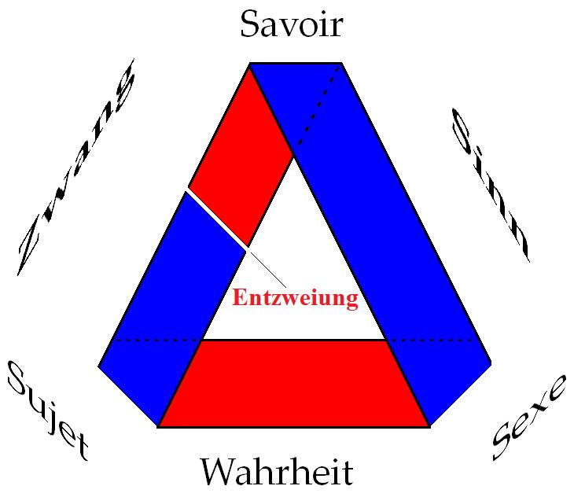

<!-- id: s12-23-0038 -->

La relation de *ces trois termes* est marquée par un rapport qui est celui que...

<!-- id: s12-23-0039 -->

> sous le terme écrit ici en rouge, et qui est en quelque sorte le titre au tableau de l’*Entzweiung* …que j’essaie de vous faire comprendre comme s’instaurant, s’enracinant, dans le mode du rapport de ce qui constitue *le statut du sujet* : *le statut du sujet* en tant que nous avons toute l’année tourné autour de l’espèce d’*un trait* particulier qui est celui qui le constitue, cet 1 dont nous avons été chercher dans FREGE la formule, pour autant qu’il est cet 1 qui s’institue dans le repérage du manque.

<!-- id: s12-23-0040 -->

Cet 1 singulier, nous devons chercher *quelque part* ce *quelque chose* qui le met dans ce rapport de *Zwang* ou *Entzweiung* par rapport au *corps du savoir*. Et c’est du *Zwei* de l’être sexué, en tant qu’il est toujours, pour cet 1 du sujet imaginaire, *non soluble*, ce rapport du 1 au *Zwei* du sexe, c’est ceci dont nous trouvons l’instance à tous les niveaux des rapports entre les trois pôles de cette triade.

<!-- id: s12-23-0041 -->

Car *ce Zwang, cette Entzweiung, ce quelque chose* que la dernière fois - *je n’y reviens pas, ou plutôt j’y reviens car il le faut -* j’ai cru devoir inscrire dans ce schéma topologique - sur l’importance ou l’opportunité duquel j’aurai à revenir tout à l’heure - comme se marquant du fait que la structure de cette topologie étant celle d’*une surface* telle que *son endroit* vienne quelque part, si l’on peut dire à se *conjoindre* à ce qui est tout de même bien son opposé, à savoir *son envers,* bien sûr, dans notre expérience d’analystes, c’est dans *ce rapport* *très particulier d’un sujet à son savoir sur lui-même qui s’appelle symptôme*.

<!-- id: s12-23-0042 -->

Le sujet s’appréhende dans une certaine expérience qui n’est pas une expérience où il soit seul, mais une expérience - jusqu’à un certain point - éduquée et dirigée par un savoir. Le *symptôme*, fut-il le plus caractérisé en apparence, pour nos habitudes de *cliniciens* \- celui de l’obsessionnel par exemple - nous n’avons que trop l’expérience qu’il ne s’achève, qu’il ne prend sa pleine constitution que dans un certain rapport à l’Autre, dont FREUD a bien souligné qu’il peut être quelquefois le premier temps de la psychanalyse.

<!-- id: s12-23-0043 -->

Cette division, ce *Zwang* cette opposition du sujet à ce qui lui vient du côté d’un savoir, c’est le rapport du sujet à son symptôme, c’est le premier pas de la psychanalyse. Je ne rappelle ceci que pour motiver le fait que ce soit là que j’ai marqué la division, le *Zwang*.

<!-- id: s12-23-0044 -->

Mais, si elle est là, et si ce dessin se motive de ce que la feuille symbolique du rapport topologique dont il s’agit, qui est un rapport de triade, a son sens, son importance - et j’y viendrai tout à l’heure - il est clair que *cette bande de Mœbius qui est ainsi*… vous n’avez peut-être pas assez réfléchi : Pourquoi ? Est-ce un hasard ? Ne l’est-ce pas ?

<!-- id: s12-23-0045 -->

…*qui est ainsi figurée* : dans cette bande trois fois repliée sur elle-même :

<!-- id: s12-23-0046 -->

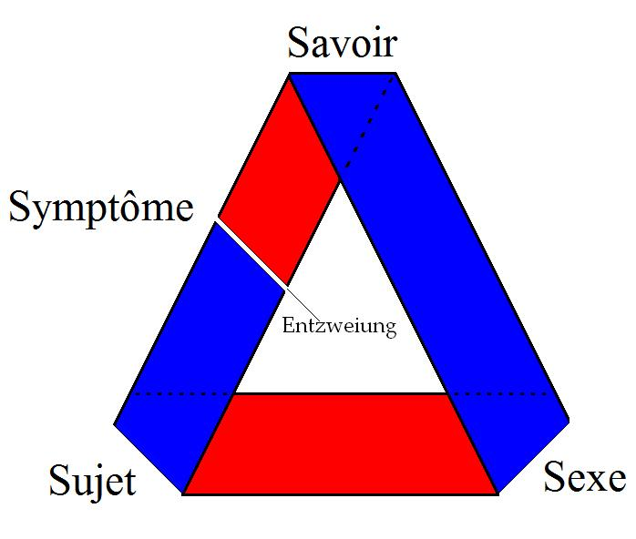

<!-- id: s12-23-0047 -->

Ce *ruban de Mœbius*, je veux dire sa *demi-torsion* fondamentale, constitue sa propriété topologique : ce qu’il recèle d’*Entzweiung*, justement en ceci qu’il n’y a pas deux surfaces, que la même surface venant à se rencontrer elle-même étant son envers, c’est cela qui est le principe de l’*Entzweiung,* bien sûr c’est en tous les points du *ruban de Mœbius* qu’elle peut se manifester.

<!-- id: s12-23-0048 -->

Et c’est bien ce que nous trouvons dans l’expérience quand nous voyons que le *Sinn*, à savoir ce qui fait la puissance de l’expérience analytique, ce qu’elle a introduit dans le monde de ce *quelque chose d’essentiellement ambigu*, où nous reconnaissons que, au niveau le plus opaque d’une chaîne signifiante, *quelque chose*, ce *quelque chose* qui fait sens, c’est toujours plus ou moins pris dans cette bipolarité encore irrésolue, qui est celle qui émane du sexe, et c’est cela qui, en tout cas, y fait sens.

<!-- id: s12-23-0049 -->

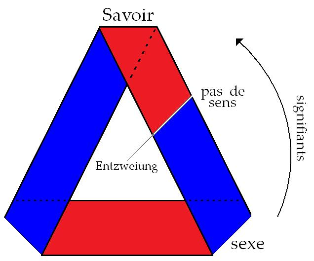

<!-- id: s12-23-0050 -->

Mais n’ai-je pas aussi commencé l’année *en vous montrant *que cette nature du sens est exactement celle du « *pas de sens* », que plus, ce que nous pouvons essayer d’*articuler*, de former, de conjoindre, de signifiants - à la seule condition d’y respecter un minimum de structure grammaticale - fera ce « *pas de sens* » et en manifestera d’autant plus le *relief* et l’*originalité*.

<!-- id: s12-23-0051 -->

Le *Sinn* est foncièrement marqué de la fissure de l’*Unsinn* et c’est là qu’il surgit dans sa plus grande pureté.

<!-- id: s12-23-0052 -->

Et alors, où trouverons nous ce qui y correspond de cette ligne magique, fuyante et idéale qui est *partout* et nulle part, cette ligne de l’*Entzweiung* dans *le lieu de liaison du sujet au sexe* que nous avons appelé la *Wahrheit *? Car c’est cela dont il s’agit dans l’analyse.

<!-- id: s12-23-0053 -->

Si le *Sinn*, si ce qui est sens, est interprétable, vient au sujet du côté du savoir, dans *les achoppements* du discours, dans *le trébuchement* du signifiant, le signifié qui vient ainsi, vient d’ailleurs : il vient ici par en–bas, non pas par le détour du savoir, par ce rapport direct du sujet avec l’être sexué.

<!-- id: s12-23-0054 -->

Où est alors ici la division ? Est-ce que j’ai besoin devant des psychanalystes de l’appeler par son nom ? Quelle est l’expérience à quoi la psychanalyse nous conduit et que définit le rapport du sujet avec le sexe, si ce n’est que, quel que soit le sexe de ce sujet, ce rapport s’exprime de cette façon singulière, qui est celle que nous appelons *la castration*.

<!-- id: s12-23-0055 -->

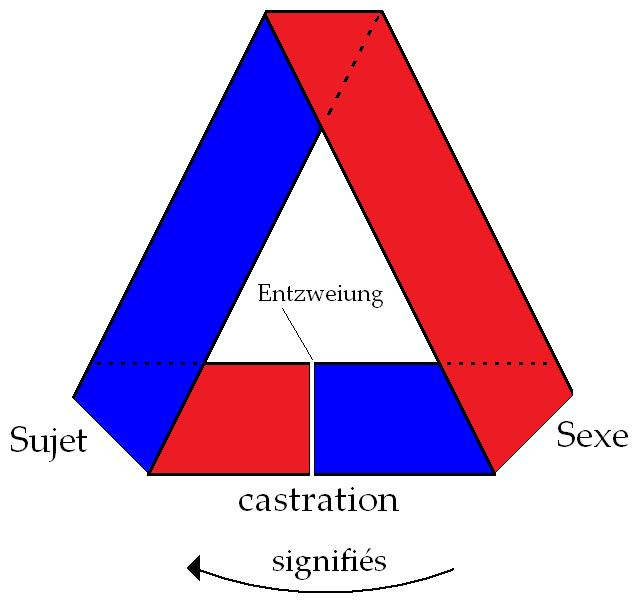

<!-- id: s12-23-0056 -->

C’est dans la mesure où est négativée précisément ce qui est *la copule*, l’instrument de conjonction, que le sujet quel qu’il soit, s’intègre dans la vérité du sexe. Et cette nécessité de la fondation de la castration, voilà ce qui nous montre, là encore, le principe de cette singulière *Entzweiung*, jouant sur l’ambiguïté impossible à résoudre de cet 1 toujours évanoui, toujours contraint de se confronter au 2.

<!-- id: s12-23-0057 -->

Or, je vous l’ai dit, *l’Idée de l’Idée*, la racine de toute institution, de toute instauration du *symbolique* dans le *réel*, le *Bien* de PLATON, pour l’appeler par son nom, n’est rien d’autre que le *nombre*. Et je vous ai indiqué la dernière fois dans SIMPLICIUS \- et son témoignage sur une certaine leçon de PLATON - mes références. J’aimerais que quelqu’un de mes auditeurs y prenne matière, occasion et prétexte à une recherche plus développée.

<!-- id: s12-23-0058 -->

Observez que ce n’est pas parce qu’il m’a plu de dessiner cette bande, que j’ai appelée *bande de Mœbius,* trois fois repliée d’une certaine façon, qui colle avec mes desseins, ce que j’ai souligné la dernière fois, en montrant qu’il y avait ici symétrie :

<!-- id: s12-23-0059 -->

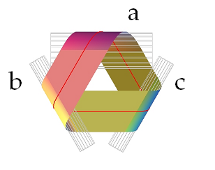

<!-- id: s12-23-0060 -->

de la façon dont par exemple ce rouleau \[a\]  inséré dans la bande s’oppose à cet autre \[b\]  placé à ce niveau de la figure : il y a une symétrie, je veux dire qu’ils sont tous les deux - pour nous qui sommes ici - cachés par la bande, et peuvent se rejoindre *aisément*. De même ici \[a et c\], au niveau de l’autre côté de la jonction \[...\] mais non pas dans le troisième \[b et c\].

<!-- id: s12-23-0061 -->

Drôlerie, curiosité mais dont je vous prie d’observer, de remarquer, en vous y habituant, à cette sorte d’expérience, *experimentum mentis*, qu’il ne peut pas en être autrement, qu’il n’y a aucun moyen d’agencer cette bande dans cet aplatissement triangulaire, sans que quelque part, apparaisse la structure que je viens de souligner, qui veut dire… qui ne se distingue pas de ceci, c’est que c’est forcément une *bande de Mœbius*.

<!-- id: s12-23-0062 -->

Il n’y a qu’une seule possibilité autre, c’est que la chose se produise de même au niveau des trois côtés, ce qui se fait dans le cas où on use de ce qu’on appelle la forme du nœud.

<!-- id: s12-23-0063 -->

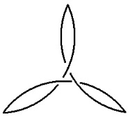

<!-- id: s12-23-0064 -->

C’est à savoir que c’est de la même façon d’inverser les trois points que la bande sera repliée, mais que ce n’en sera pas moins une *bande de Mœbius*. Il n’y a donc à cette topologie aucune échappatoire. La triade - et il est singulier qu’on ne s’en soit pas, jusqu’à une certaine époque, aperçu - la triade implique cette topologie de *bande de Mœbius*.

<!-- id: s12-23-0065 -->

Il peut vous sembler lointain détour, caprice, goût du singulier, que je m’attarde, que je veuille m’attarder autant, à *une structure* dont, à tout le moins, vous pouvez pressentir que…

<!-- id: s12-23-0066 -->

> structure peu familière, puisque je suis sûr que pour certains, sinon pour la plupart de ceux qui sont ici, la remarque que
>
> je viens de faire, que le fait de nous servir d’une surface comme étant le support le plus propice à représenter une certains triade se pose ici pour nous comme instituant à proprement parler la *position subjective*, je précise et j’insiste : j’entends bien que je sais ce que je dis, quand je dis *position subjective de l’être* comme tel …que ce support porte en lui la nécessité d’un certain rapport imagé par la *bande de Mœbius* mais dont je vous ai déjà fait remarquer que la bande n’en est que l’image.

<!-- id: s12-23-0067 -->

Puis-je rappeler que ce n’est pas que cette surface soit surface - qu’elle existe, pour tout dire - qui la fait *surface de Mœbius*.

<!-- id: s12-23-0068 -->

Vous pouvez en enlever autant de morceaux que vous voudrez : si la continuité reste, elle est toujours *surface de Mœbius*, et à la limite, elle n’est plus que cette coupure médiane qui, changeant la surface en une surface bel et bien unique, rappelez-vous : une coupure médiane ne coupe pas en deux *la bande de Mœbius* mais la transforme en *une bande* qui, seulement, fait ce qu’on appelle *une bo**ucle.* \[[cf. VIDEO: experiment 2](#VIDEO)\]

<!-- id: s12-23-0069 -->

Mais le propre de cette bande c’est qu’elle peut…

<!-- id: s12-23-0070 -->

> je vous l’ai montré en son temps, mais je regrette de ne pas pouvoir le remontrer aujourd’hui :
>
> j’ai oublié ma paire de ciseaux et ma colle, et je n’ai pas pu en trouver ici le supplément au secrétariat …mais rappelez-vous que cette bande peut se recouvrir elle-même, d’une façon telle qu’elle reprend la forme exacte d’une *bande de Mœbius* et qu’alors, ce qui sera le double bord de cette bande de nouveau repliée en une *bande de Mœbius*, ce sera un intervalle que vous avez ici, figuré au tableau, dont on peut démontrer qu’il comporte ce demi-tour également, qui est une *bande de Mœbius*.

<!-- id: s12-23-0071 -->

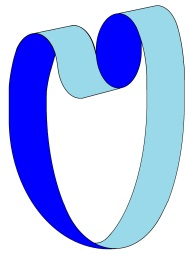 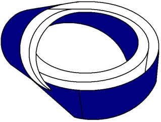

<!-- id: s12-23-0072 -->

Qu’est-ce que ceci veut dire ? C’est que si, conformément à la topologie, nous considérons la surface comme devant être toujours définie par un bord - il n’y a pas d’autre définition topologique de la surface - un bord vectorisé comme ceci :

<!-- id: s12-23-0073 -->

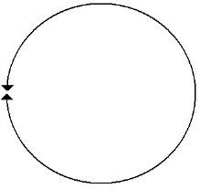

<!-- id: s12-23-0074 -->

voilà le symbole de la surface que nous appellerons *sphérique* :

<!-- id: s12-23-0075 -->

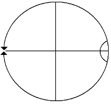

<!-- id: s12-23-0076 -->

Une sphère, c’est là où on peut faire un trou qui s’annulera, comme on dit, bord à bord, à savoir les deux bords du trou y venant à se coudre, disons, dans le même sens. Si vous le voulez, pour ne pas confondre, pour ne pas vous perdre dans des imaginations concernant le volume qui n’est nullement intéressé en la matière, appelez ce que je vous ai appelé cette première surface, un globe et la topologie du globe n’est pas définie autrement que par la duplicité de ce bord.

<!-- id: s12-23-0077 -->

Ce qui est en dedans et au dehors du bord, même si c’est un globe infini, même si de ce fait c’est un plan est strictement équivalent.

<!-- id: s12-23-0078 -->

Je vous l’ai déjà dit, ce qui est hors du cercle de POPILIUS, c’est un cercle, tout comme ce qui est à l’intérieur.

<!-- id: s12-23-0079 -->

Et le propre d’une surface qui s’appelle globe, c’est qu’une coupure fermée en sépare un morceau.

<!-- id: s12-23-0080 -->

Ceci n’est pas vrai de toute surface comme il est facile de le voir sur un tore ou un anneau où, si certaines coupures fermées peuvent avoir le même effet, il en est qui ne font simplement qu’ouvrir la chambre à air du *tore* et le laissent bel et bien en un seul morceau.

<!-- id: s12-23-0081 -->

Il est vrai également qu’une *double coupure*, pourvu qu’elles soient *l’une sur l’autre croisées*, ne fragmente pas en deux morceaux un *tore*.

<!-- id: s12-23-0082 -->

J’ai dit « *pourvu qu’elles se croisent* ». Un peu d’imagination avec la chambre à air évoquée vous suffit à vous en apercevoir.

<!-- id: s12-23-0083 -->

J’ai introduit cette année *la bouteille de Klein* dont la propriété est qu’il peut y avoir sur elle, deux coupures, qui ne se croisent pas, et qu’elle n’en soit pas pour autant divisée. Je l’indique ici par un petit schéma : une coupure ici, l’autre à l’opposé, coupure fermée également. Je vous charge de vous apercevoir par vous-même quel en est le résultat.

<!-- id: s12-23-0084 -->

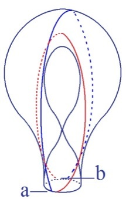 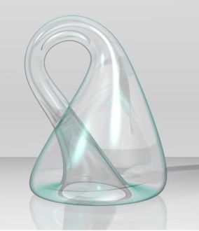

<!-- id: s12-23-0085 -->

Le résultat est une seule bande qui forme sur elle-même une double boucle, à savoir quelque chose qui *ressemble*, sans se confondre, à ce qui se passe quand on coupe, par le milieu une *bande de Mœbius*. Ceci n’est point étonnant puisque *la bouteille de Klein* est faite de deux *bandes de Mœbius* et qu’il y a donc un trait, un trait d’une forme particulière celui, si je puis dire qui fait deux fois le tour de cette façon - très mauvaise façon de s’exprimer - du « *vide central* », de celui dont nous n’avons même pas à parler quand nous spéculons sur les surfaces, c’est pour aller vite que je le dis. Il vous apparaît immédiatement et facilement que cette surface est ainsi divisée en deux *bandes de Mœbius*. Pourquoi ré-évoqué-je ici *la bouteille de Klein*, vous allez le voir.

<!-- id: s12-23-0086 -->

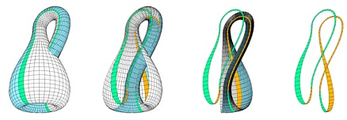

<!-- id: s12-23-0087 -->

Il y a une quatrième forme de surface définissable par son bord. Celle que j’ai appelée - pour aller également rapidement devant vous - le *cross-cap* parce que c’est sous cette forme qu’il s’y marque et qu’on appelle en toute rigueur, théoriquement, *le plan projectif*.

<!-- id: s12-23-0088 -->

je pense n’avoir pas à ré-évoquer - au moins pour la plupart d’entre vous - *le plan projectif*.

<!-- id: s12-23-0089 -->

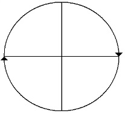 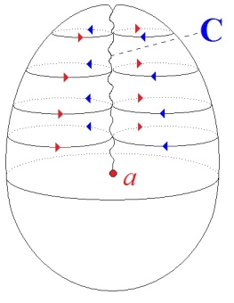

<!-- id: s12-23-0090 -->

Pour les autres, qu’ils veuillent bien un instant s’imaginer qu’ici, cette ligne \[c\] manifeste le croisement qui se produit ici, d’un globe que nous aurions préalablement ouvert - à la façon dont nous le faisions tout à l’heure - les bords et si nous faisions, les bords une fois ouverts, si nous les faisions se rejoindre en s’entrecroisant c’est-à-dire d’une façon telle que, non pas chaque point aille se suturer avec le point symétrique disons par rapport à une ligne qui lui fait face, mais symétrique par rapport à un point.

<!-- id: s12-23-0091 -->

Nous obtenons alors - je le répète, figuré d’une façon qui fasse image - ce qui constitue, ce que j’ai appelé provisoirement *le cross-cap* ou *le plan projectif*. Quelle est ici la propriété d’une coupure fermée, d’un certain type de *coupure fermée* ? Il existe *une coupure fermée* qui a le même effet que sur la sphère, mais à cette différence que, il y a une différence de nature entre l’un et l’autre des lambeaux :

<!-- id: s12-23-0092 -->

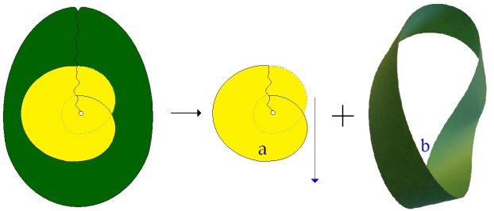

<!-- id: s12-23-0093 -->

- l’un est ce qui ici se figure, se représente sous cette forme dite du *huit intérieur* ou encore de *la portioncule* \[*a*\], et que j’appellerai aujourd’hui autrement, qui est d’une grande importance,

<!-- id: s12-23-0094 -->

- l’autre d’une *bande de Mœbius* \[b\].

<!-- id: s12-23-0095 -->

Je m’excuse de ce long développement. Ce long développement est fait pour poser et introduire ceci : c’est que *cet élément central...*

<!-- id: s12-23-0096 -->

prenons-le comme tel par rapport à ce que vous voyez ici figuré sous la forme d’une *bande de Mœbius* *...cet élément central* qui la complète et qui la ferme, et qui est ce que j’ai appelé à l’instant *la portioncule*, ceci, topologiquement complète ce que nous avons à dire des *positions subjectives de l’être*.

<!-- id: s12-23-0097 -->

Ce qui dans la *bouteille de Klein*, *de la bande de Mœbius se complète d’une bande de Mœbius* symétrique et qui la ferme sous l’aspect de ce *quelque chose* qui ressemble à un tore, a pour équivalence ici autre chose, d’une nature différente de la *bande de Mœbius*.

<!-- id: s12-23-0098 -->

Cette autre chose, c’est ce qui topologiquement correspond à *l’objet(a)*. Cet *objet(a)* est essentiel à la dialectique analytique.

<!-- id: s12-23-0099 -->

J’ai entendu dire… il m’est revenu que quelqu’un parmi mes auditeurs s’est exprimé sur *l’objet(a)* dans des termes thomistes : *l’objet(a)* ce serait, l’*esse* par essence, le ce-en-quoi l’être trouverait son achèvement.

<!-- id: s12-23-0100 -->

Bien sûr, un pareil malentendu est possible, jusqu’au moment où cette image topologique est là pour vous faire sentir que ce dont il s’agit, c’est de la fermeture de l’*Entzweiung*, de l’occultation de l’impossibilité, de la consommation de l’indétermination : cette indétermination dont je vous parlais tout à l’heure qui est celle de la place de l’*Entzweiung* et de cette fausse assurance de la certitude qui s’instaure dans *le masquage de la division*. Telle est la fonction de cet objet, je dirai, si peu conforme à une bonne forme, car vous ne pouvez l’imaginer que comme cette rondelle, dont quelque part le pourtour, mal rejoint, pendant et échancré, viendrait à se recouvrir lui-même comme la figure, tout à fait en bas à droite, le montre :

<!-- id: s12-23-0101 -->

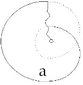

<!-- id: s12-23-0102 -->

Ce n’est pourtant pas quelque chose de différent d’une surface ordinaire, *mais ce côté*, je le répète, *antipathique à la bonne forme*, *ce côté par où je l’appellerai le* *haillon *: ce *haillon* c’est la forme, la forme où se présente *sous les quatre registres où il se repère dans l’instance* *des positions subjectives de l’être*, à savoir ce qu’on appelle dans l’analyse l’objet : *le sein*, *l’objet fécal* ou l’excrément, *le regard*, et *la voix*

<!-- id: s12-23-0103 -->

C’est sous cette forme, sous cette forme topologique que se conçoit la fonction de *l’objet(a)*.

<!-- id: s12-23-0104 -->

Et c’est en ceci, l’équivalence, la substitution possible de *l’objet(a)* à la conjonction à l’Autre, caractéristique d’un certain monde, du monde micro-macrocosmique qui a prévalu jusqu’à une certaine date du monde, où l’homme se reploie et se soude à la réalité d’un Autre préformé, de celui qui l’a fait à son image, en image semblable, à la fois, et inversée. La coupure, la coupure *dans l’histoire* et aussi bien *dans le statut* du sujet comme tel, est au moment où, à ce partenaire se substitue la fonction de *l’objet(a)*.

<!-- id: s12-23-0105 -->

C’est en tant que je suis *(a)* que mon désir est le désir de l’Autre, et c’est pour cela que c’est par là que passe toute la dialectique de ma relation avec l’Autre, le grand A, celle que l’année dernière, je vous ai définie par le rapport de l’aliénation. Le *(a)* s’y substituant, nous permet l’autre mode de la relation, celle de la séparation : *quelque chose où je m’instaure comme déchu, où je m’instaure comme réduit* *au rôle de haillon dans ce qui a été cette structure du désir de l’Autre par lequel le mien a été déterminé.*

<!-- id: s12-23-0106 -->

Le fait que la suture, que la soudure de ma relation subjective… de ma position subjective comme être, puisse être trouvée dans *l’objet(a)*, c’est là ce par quoi passe la véritable nature de la dépendance de l’Autre et spécialement de son désir.

<!-- id: s12-23-0107 -->

Car le fantasme, ce n’est pas autre chose que cette conjonction de l’*Entzweiung* du sujet avec le *(a)*, grâce à quoi *une fallacieuse complétude vient à recouvrir ce qu’il en est de l’impossible du réel*.

<!-- id: s12-23-0108 -->

Le caractère de *couverture* qu’a le fantasme par rapport au *réel* ne peut pas, ne doit pas s’articuler autrement. L’analyse passe par le défilé de *ce repositionnement de soi comme sujet dans ce (a) que j’ai été pour le désir de l’Autre* et aucun dénouement n’est possible dans l’énigme de mon désir, sans ce re-passage par *l’objet(a)*.

<!-- id: s12-23-0109 -->

J’ai entendu il n’y a pas longtemps, dans une de mes analyses, employer le terme, à propos de quelqu’un dont l’analyse ne semblait pas lui avoir beaucoup réussi du point de vue de la qualité personnelle :

<!-- id: s12-23-0110 -->

> « *Il y a donc*… me disait mon analysé, se faisant pour l’occasion objecteur

<!-- id: s12-23-0111 -->

> …*des fausses couches analytiques* ».

<!-- id: s12-23-0112 -->

Ça me plaît assez, cette formule. Je ne l’aurais pas inventée. En effet, il y a un tournant de l’analyse où le sujet reste dangereusement suspendu à ce fait de rencontrer sa vérité dans *l’objet(a)*. Il peut y tenir et ça se voit.

<!-- id: s12-23-0113 -->

Mon cours de l’année prochaine :

<!-- id: s12-23-0114 -->

- je le ferai donc sur *ce qui manque aux positions subjectives de l’être,*

<!-- id: s12-23-0115 -->

- je le ferai sur la nature de *l’objet(a)*.

<!-- id: s12-23-0116 -->

Si je vous parlais en anglais j’aurais dit : *The significance of the object small(a).*

<!-- id: s12-23-0117 -->

Et si je l’avais fait en allemand, j’aurais dit : *Die Bedeutung des Objektes kleines (a)*.

<!-- id: s12-23-0118 -->

Mais comme je vous parle une langue plus près de cette langue - plus verte que toutes les langues - qui s’appelle le latin, je m’inspirerai du *De natura* quelque chose… *rerum* et je vous dirai : *De natura objecti (a)* et j’ajouterai peut-être *et de consequensi*.

<!-- id: s12-23-0119 -->

Je ne peux que déplorer à cette occasion que la Mère Église abandonne cette langue qui a le grand privilège de rendre justement absolument hermétique les explications sur les cérémonies qu’on doit donner pendant qu’elles se passent. Quand elles sont données en latin on a des chances de *comprendre que c’est incompréhensible*, ce qui est l’important. Rassurez-vous, je ne vous ferai pas ce cours de l’année prochaine *en latin*. Quoi que, on ne sait pas ! J’en ferai peut-être un, pour vous apprendre !

<!-- id: s12-23-0120 -->

Je ne voudrais pas vous quitter sans, quand même, avoir illustré un petit peu ce que tout ceci veut dire parce qu’il y en a peut-être qui croient que je suis loin de la clinique en vous racontant cette histoire. Il y a un certain nombre de *positions subjectives* bel et bien concrètes auxquelles nous avons affaire, même si nous ne nous apercevons pas que dans le symptôme, il faut toujours chercher :

<!-- id: s12-23-0121 -->

- où est le *savoir*,

<!-- id: s12-23-0122 -->

- où est le *sujet*,

<!-- id: s12-23-0123 -->

- mais ne pas aller trop vite quant à savoir à quel *sexe* nous avons affaire.

<!-- id: s12-23-0124 -->

Mais dans l’analyse, il y a l’Autre et nous nous apercevons de la façon dont, par rapport à l’Autre, au grand A, se posent les problèmes du désir. Ce n’est pas aujourd’hui que je reviendrai sur la répartition :

<!-- id: s12-23-0125 -->

- de la demande,

<!-- id: s12-23-0126 -->

- de la jouissance de l’Autre,

<!-- id: s12-23-0127 -->

- et de l’angoisse de l’Autre, comme correspondant aux trois visées déterminant les versants respectifs :

<!-- id: s12-23-0128 -->

- de la névrose,

<!-- id: s12-23-0129 -->

- de la perversion,

<!-- id: s12-23-0130 -->

- et de la psychose.

<!-- id: s12-23-0131 -->

Dans la névrose, d’où est partie notre expérience et qui est notre expérience quotidienne aussi, fondamentale, c’est par rapport à la demande de l’Autre que se constitue le désir du sujet. Dire que c’est « *par rapport* » à la demande de l’Autre n’est pas aller contre ce que je dis : « *Le désir du sujet, c’est le désir de l’Autre* », mais sa visée - parce que c’est aussi le principe de son maintien dans la position névrotique - c’est la demande de l’Autre.

<!-- id: s12-23-0132 -->

Ce que l’Autre demande, bien sûr, n’est pas ce qu’il désire. J’ai assez insisté, je pense, sur cette radicale *Entzweiung* pour que je n’ai pas besoin ici de nouveau de l’illustrer. Au reste, reprenez tout ce que j’ai pu laisser comme commentaire de tel ou tel point de la *Traumdeutung* \[Cf. *La relation d’objet*... : 09-01, 16-01, 23-01\] pour le poursuivre jusque dans la structure de l’homosexualité féminine \[cf. *Le moi*... 09-02, 16-02, 02-03, 16-03\], cette *Entzweiung* vous la toucherez du doigt.

<!-- id: s12-23-0133 -->

- Et *l’hystérique* charge un tiers de répondre à la demande de l’Autre. Pour elle, elle se soutient dans son désir comme insatisfait. Et c’est pour cela que c’est par la symptomatologie, l’évolution de *l’hystérique*, que nous avons l’accès le plus rapide - mais du même coup qui le voile en partie - au fait de la castration. La castration est trop instrumentale, trop *moyennante* chez l’hystérique et aussi trop facile à atteindre, puisque la plupart du temps l’hystérique l’est déjà, objet châtré, pour que ça ne nous le voile pas.

<!-- id: s12-23-0134 -->

- *L’obsessionnel*, comme névrotique, est dans le même cas. Il opère autrement avec la demande de l’Autre : il se met à sa place et il lui offre le spectacle, *le spectacle d’un défi en lui montrant que le désir que cette demande provoque chez lui est impossible.* Dans les cas féconds - car il en est - de névrose obsessionnelle, il lui démontre que tout est possible à la place, il multiplie les exploits.

<!-- id: s12-23-0135 -->

Tout cela a aussi un grand rapport avec la castration et s’il rabroue, s’il ravale, s’il bafoue ainsi le désir de l’Autre, eh bien nous le savons, c’est pour protéger son pénis. De la place de l’Autre, à travers tous les risques calculés qu’il court, *il s’éprouve comme phallus sauvegardé*. C’est là que l’oblativité est à son affaire : il offre tout à la place. Il n’y a pas de plus grands oblatifs que les vrais, que les grands obsessionnels. Il offre d’autant plus volontiers tout, que tout ce qu’il offre c’est, comme vous le savez, de la merde.

<!-- id: s12-23-0136 -->

Alors, lui forcer la main :

<!-- id: s12-23-0137 -->

- en interprétant *le fantasme de fellatio* - qui peut venir en effet et qui vient ordinairement dans son analyse - à l’obsessionnel,

<!-- id: s12-23-0138 -->

- en s’imaginant que c’est l’avidité du pénis qui le dirige,

<!-- id: s12-23-0139 -->

- en en faisant l’objet de communion, …eh bien, c’est en réalité une méconnaissance chez l’analyste, qui est le fait chez lui de la confusion du *phallus perdu* avec *l’objet fécal* et qui, à intéresser le sujet en analyse à *une dialectique* du « *toucher* », du « *ne* *pas toucher* », du « *contact* » ou du « *ne pas contact* », témoigne proprement de la vérité de ce que je dis car *cette dialectique de la cure de l’obsessionnel* est proprement, si je puis dire, non pas celle de *la propriété* mais celle de *la propreté  !*

<!-- id: s12-23-0140 -->

Le sujet en analyse, par une telle voie, par une telle méthode, est invité à ce que j’ai défini comme étant la fonction de *l’objet(a)*, à trouver sa vérité dans cet *objet(a)* sous ses espèces fécales, ce qui est proprement, bien sûr, ce qui comble en effet l’obsessionnel, qui ne demande que ça.

<!-- id: s12-23-0141 -->

Vous voyez que cette théorie a des conséquences pratiques, qu’elle permet d’articuler des objections, des objections structurées contre quelque chose qui se présente comme n’étant pas sans effet clinique et même jusqu’à un certain point, bienfaisant, puisque *tout le danger vient justement de satisfaire la demande* que nous voyons se manifester chez le névrotique.

<!-- id: s12-23-0142 -->

Quand je reprendrai cette dialectique du possible et de l’impossible, je vous montrerai qu’elle n’est, après tout, rien d’autre que ce que FREUD nous découvre comme étant l’opposition : *principe de plaisir - principe de réalité*. Mais je ne demande pas : « *Comment est-il possible que la souffrance névrotique soit un plaisir ?* »

<!-- id: s12-23-0143 -->

Encore que ce soit bien évidemment démontré, je ne peux pas démontrer comment c’est possible *si ce n’est par des entourloupettes*, mais je puis le manifester en me mettant à la place où je rends impossible la satisfaction de la demande qui se cache sous cette souffrance.

<!-- id: s12-23-0144 -->

Je n’irai pas plus loin aujourd’hui sur des détails cliniques car il faut que je conclue.

<!-- id: s12-23-0145 -->

Je ne vous dirai pas comment le phobique rentre sous la même rubrique qui est toujours le rapport à la demande de l’Autre.

<!-- id: s12-23-0146 -->

Je vous ai assez parlé du *signifiant manquant* pour clore et terminer ce que j’ai à vous dire aujourd’hui sur ce point où vraiment culmine tout le discernement qu’a eu FREUD du phénomène inconscient quand il parle du désir, dernier à habiter le rêve, qui est le vrai désir de l’Autre : le désir que nous dormions.

<!-- id: s12-23-0147 -->

Ce n’est pas pour rien que ce soit au moment où un rêve vienne à ce point *culmen* de se figer en cette figure immobile où véritablement pour nous s’incarne au plus près la nature du fantasme et sa fonction de couverture de la réalité.

<!-- id: s12-23-0148 -->

Pensez au rêve de *L’Homme aux loups* : si le fantasme nous réveille - et dans l’angoisse - c’est pour que la réalité n’apparaisse pas.

<!-- id: s12-23-0149 -->

Puissiez-vous seulement être assez réveillés pour que le sens de ce mot, à venir dans mon dessein, dès maintenant vous touche.

<!-- id: s12-23-0150 -->

Je ne débarrasserai pas l’Autre, ni de son savoir, ni de sa vérité.

<!-- id: s12-23-0151 -->

Le terme de l’analyse, s’il est ce que j’ai inscrit dans le symbole S(A), ce sont ces termes : *l’Autre sait qu’il n’est rien.*

<!-- id: s12-23-0152 -->

*  *
