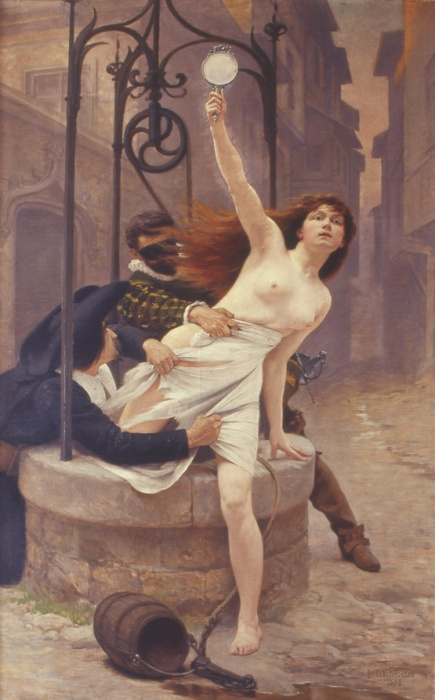
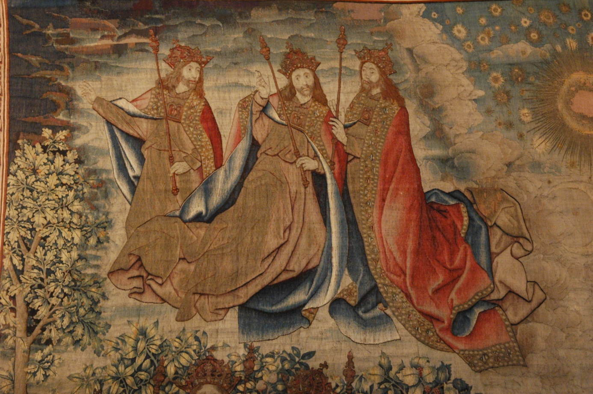
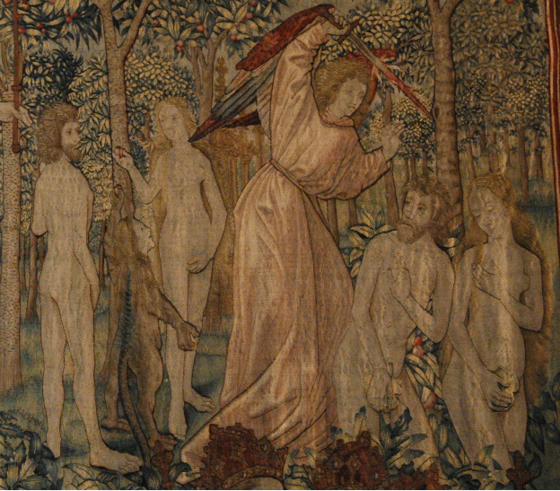

# Leçon 01 | 0l Décembre l965

<!-- source-url: http://staferla.free.fr/S13/S13 L'OBJET.docx -->
<!-- seminar: s13 -->
<!-- lesson: 01 -->

<!-- id: s13-01-0001 -->

Mesdames et Messieurs, Monsieur le Directeur de l’*École Normale Supérieure*, qui avez bien voulu, dans cette enceinte de l’*École* où je ne suis qu’un hôte, me faire l’honneur de votre présence aujourd’hui.

<!-- id: s13-01-0002 -->

Le statut du *sujet* dans la psychanalyse, dirons-nous que l’année dernière nous l’ayons fondé ?

<!-- id: s13-01-0003 -->

Nous avons abouti à établir *une structure qui rende compte de l’état de la refente, de la Spaltung* où le psychanalyste le repère dans sa praxis.

<!-- id: s13-01-0004 -->

La psychanalyse repère cette *refente* de façon *en quelque sorte quotidienne* qui est admise à la base, puisque la seule reconnaissance de l’inconscient suffit à la motiver, et aussi bien qui le submerge si je puis dire, de sa constante manifestation.

<!-- id: s13-01-0005 -->

Mais pour savoir ce qu’il en est de sa praxis ou seulement pouvoir la diriger de façon conforme à ce qui lui est accessible, il ne suffit pas que cette division soit pour lui un fait empirique, ni même que le fait empirique ait pris forme *de paradoxe*, il faut une certaine réduction, parfois longue à accomplir, mais toujours décisive à la naissance d’une science.

<!-- id: s13-01-0006 -->

Réduction qui constitue proprement son objet et où l’épistémologie qui s’efforce à la définir en chaque cas, ou en tous, est loin d’avoir - *à nos yeux au moins* - rempli sa tâche. Car je ne sache pas qu’elle ait *pleinement rendu compte*, par ce moyen de la définition de l’objet, de cette mutation décisive qui, par la voie de la physique, a fondé *La Science* au sens moderne dès lors pris pour sens absolu : position que justifie un changement de style radical dans

<!-- id: s13-01-0007 -->

- le *tempo* de son progrès,

<!-- id: s13-01-0008 -->

- la forme galopante de *son immixtion* dans notre monde,

<!-- id: s13-01-0009 -->

- les réactions en chaîne qui caractérisent ce qu’on peut appeler les expansions de son énergétique.

<!-- id: s13-01-0010 -->

À tout cela, nous paraît être *radicale* une modification dans notre position de *sujet* au double sens : qu’elle y est inaugurale, et que la science la renforce toujours plus. KOYRÉ ici est notre guide et l’on sait qu’il est encore méconnu.

<!-- id: s13-01-0011 -->

Donc, je n’ai pas *franchi* à l’instant le pas concernant la création - comme science - de la psychanalyse. Mais on a pu remarquer que j’ai pris pour *fil conducteur* l’année dernière, un certain moment du sujet que je tiens pour être le corrélat essentiel de *la science* : un moment historiquement défini, dont peut-être nous avons à savoir s’il est strictement répétable dans l’expérience, celui que DESCARTES inaugure et qui s’appelle *le cogito*.

<!-- id: s13-01-0012 -->

Ce corrélat qui, comme moment, est le défilé d’un rejet de tout savoir, prétend laisser au sujet un certain amarrage dans l’être, dont nous tenons qu’il constitue *le sujet de la science* dans sa définition, ce terme à prendre au sens de *porte étroite*.

<!-- id: s13-01-0013 -->

Ce fil ne nous a pas guidé en vain, puisqu’il nous a mené à formuler en fin d’année notre division expérimentée du sujet comme *division entre le savoir et la vérité*, l’accompagnant d’un modèle topologique, *la bande de Mœbius*, qui fait entendre que ce n’est pas d’une distinction d’origine que doit provenir *la division* où ces deux termes viennent se conjoindre.

<!-- id: s13-01-0014 -->

Qui relira, aux lumières que peut apporter à la technique de la lecture, mon enseignement sur FREUD, cet article où FREUD nous lègue le terme de *Spaltung* [^1] - sur quoi la mort lui fait lâcher la plume - et remontera aux articles sur *Le fétichisme* de l927 [^2] et sur *La perte de la réalité* de l924[^3], celui-là appréciera s’il n’appert pas que ce qui motive chez FREUD un remaniement doctrinal, qu’il accentue dans le sens d’une topique, c’est un souci d’élaborer une dimension que l’on peut dire proprement structurale, puisque c’est la relation entre ces termes et sa reprise dialectique dans l’expérience, qui seule donne appui à son progrès.

<!-- id: s13-01-0015 -->

Loin de supposer aucune *entification* [^4] *d’appareil* pour tout dire, que l’*IchSpaltung*, *refente du moi* - *sur quoi s’abat sa main* - c’est bien *le sujet* qu’elle nous pointe comme terme à élaborer.

<!-- id: s13-01-0016 -->

Le *principe de réalité*, dès lors perd toute l’ambiguïté dont il reste marqué si l’ont y inclut *la réalité psychique*.

<!-- id: s13-01-0017 -->

Ce principe n’a pas d’autre fonction définissable que de conduire au *sujet de la science*.

<!-- id: s13-01-0018 -->

Et il suffit d’y penser pour qu’aussitôt *prennent leur champ* ces réflexions qu’on s’interdit comme trop évidentes, par exemple qu’il est impensable :

<!-- id: s13-01-0019 -->

- que *la psychanalyse* comme pratique,

<!-- id: s13-01-0020 -->

- que *l’inconscient* - celui de FREUD - comme découverte, …aient pris leur place *avant la naissance* - au siècle qu’on a appelé *le siècle du génie*, le XVIIème - *de la science* à prendre *au sens absolu*, *au sens à l’instant indiqué*, sens qui n’efface pas sans doute ce qui s’est *institué* sous ce même nom auparavant, mais qui, plutôt qu’il n’y trouve son archaïsme, en tire le fil à lui d’une façon qui montre mieux sa différence de tout autre.

<!-- id: s13-01-0021 -->

Une chose est sûre : si le sujet est bien là au niveau de cette *différence*, toute référence humaniste y devient superflue, car c’est à elle qu’il coupe court.

<!-- id: s13-01-0022 -->

Nous ne visons pas, ce disant - de la psychanalyse et la découverte de FREUD : cet accident - que ce soit parce que ses patients sont venus à lui au nom de la science et du prestige qu’elle confère à la fin du XIXème siècle à ses servants, même de grade inférieur, que FREUD a réussi à fonder *la psychanalyse* en découvrant l’inconscient.

<!-- id: s13-01-0023 -->

Nous disons que contrairement à ce qui se brode d’une prétendue rupture de FREUD avec *le scientisme* de son temps, que c’est ce *scientisme* même…

<!-- id: s13-01-0024 -->

> si on veut bien le désigner dans son allégeance aux idéaux d’un [BRÜCKE](http://fr.wikipedia.org/wiki/Ernst_Wilhelm_von_Br%C3%BCcke), eux-mêmes transmis du pacte
>
> où un [HELMHOLTZ](http://fr.wikipedia.org/wiki/Hermann_Ludwig_von_Helmholtz) et un [DU BOIS REYMOND](http://www.bibmath.net/bios/index.php3?action=affiche&quoi=duboisreymond) s’était voués à faire rentrer la physiologie et les fonctions de la pensée considérées comme y incluses dans les termes mathématiquement déterminés de la thermodynamique parvenue à son presque achèvement de leur temps …qui a conduit FREUD, comme ses écrits nous le démontrent, à ouvrir la voie qui porte à jamais son nom.

<!-- id: s13-01-0025 -->

Nous disons que cette voie ne s’est jamais détachée des idéaux de ce *scientisme*, puisqu’on l’appelle ainsi, et que la marque qu’elle en porte n’est pas *contingente* mais lui reste *essentielle*. Que c’est de cette marque qu’elle conserve *son crédit*, malgré les déviations auxquelles elle a prêté, et ceci en tant que FREUD s’est opposé à ces déviations et toujours avec une sûreté sans retard et une rigueur inflexible.

<!-- id: s13-01-0026 -->

Témoin sa rupture avec son adepte le plus *prestigieux*, JUNG nommément, dès qu’il a glissé dans quelque chose dont *la fonction* ne peut être définie autrement que de tenter d’y restaurer un sujet doué de « *profondeurs* », ce dernier terme au pluriel, ce qui veut dire un sujet composé d’un rapport au savoir, rapport dit « *archétypique* », qui ne fût pas réduit à celui que lui permet la science moderne, *à l’exclusion de toute autre,* lequel n’est rien que le rapport que nous avons défini l’année dernière comme *ponctuel* et *évanouissant*, ce rapport au savoir qui de son moment historiquement inaugural garde le nom de *cogito*.

<!-- id: s13-01-0027 -->

C’est à cette origine indubitable, patente dans tout le travail freudien, à la leçon que FREUD nous laisse comme chef d’école, que l’on doit que le marxisme soit sans portée, et je ne sache pas qu’aucun marxiste y ait montré quelque insistance à mettre en cause sa pensée - la pensée de FREUD - au nom d’appartenances historiques de FREUD.

<!-- id: s13-01-0028 -->

Nous voulons dire nommément à la société de la double monarchie pour les bornes judaïsantes où FREUD reste confiné dans ses aversions spirituelles à l’ordre capitaliste qui conditionne son *agnosticisme politique*…

<!-- id: s13-01-0029 -->

> qui d’entre vous nous écrira un essai digne de LAMENNAIS[^5] sur *L’indifférence en matière de politique* …j’ajouterai : à l’éthique bourgeoise pour laquelle la dignité de sa vie vient à nous inspirer un respect qui fait fonction d’*inhibition* à ce que son œuvre ait - autrement que dans le malentendu et la confusion - réalisé le point de concours des seuls hommes de la vérité qui nous restent :

<!-- id: s13-01-0030 -->

- *l’agitateur révolutionnaire*,

<!-- id: s13-01-0031 -->

- *l’écrivain qui de son style marque la langue* - je sais à qui je pense - et cette pensée rénovant l’être dont nous avons le précurseur.

<!-- id: s13-01-0032 -->

On sent ma hâte d’émerger de tant de précautions prises à reporter les psychanalystes à leurs certitudes les moins discutables.

<!-- id: s13-01-0033 -->

Il me faut pourtant y repasser encore, fut-ce au prix de quelques lourdeurs.

<!-- id: s13-01-0034 -->

Dire que le sujet sur quoi nous opérons en *psychanalyse* ne peut être que le sujet de la science peut passer pour paradoxe.

<!-- id: s13-01-0035 -->

C’est pourtant *là* que doit être prise une démarcation, faute de quoi tout se mêle et commence *une malhonnêteté* qu’on appelle ailleurs pour *objective,* mais c’est *manque d’audace*, et manque d’avoir repéré l’objet qui foire.

<!-- id: s13-01-0036 -->

De notre position de *sujet* nous sommes toujours responsables : qu’on appelle cela, où l’on veut, du terrorisme...

<!-- id: s13-01-0037 -->

J’ai le droit de sourire, car ce n’est pas dans un milieu où la doctrine est ouvertement matière à tractations, que je craindrais d’offusquer personne en formulant ce que je pense : que l’erreur *de bonne foi* est de toute la plus impardonnable.

<!-- id: s13-01-0038 -->

*La position du psychanalyste* ne laisse pas d’échappatoire, puisqu’elle exclut la tendresse de « *la belle âme* », c’est encore un paradoxe que de le dire, c’est peut-être aussi bien le même.

<!-- id: s13-01-0039 -->

Quoiqu’il en soit je pose que toute tentative - *voire tentation où la théorie courante ne cesse d’être relapse -* d’*incarner* plus avant le sujet est *errance*, toujours féconde en *erreur*, et comme telle *fautive* : ainsi de l’*incarner* dans l’homme, lequel y revient à l’enfant,

<!-- id: s13-01-0040 -->

- car cet homme y sera *le primitif*, ce qui faussera tout du *processus primaire*,

<!-- id: s13-01-0041 -->

- de même que *l’enfant* y jouera le *sous-développé,* ce qui masquera *la vérité* de ce qui se passe *lors de l’enfance* d’originel.

<!-- id: s13-01-0042 -->

Bref, ce que Claude LÉVI-STRAUSS[^6] a dénoncé comme *l’illusion archaïque* est inévitable dans la psychanalyse, si l’on ne s’y tient pas ferme en théorie sur le principe que nous avons à l’instant énoncé : *qu’un seul sujet y est reçu comme tel*, celui qui peut la faire *scientifique*.

<!-- id: s13-01-0043 -->

C’est dire assez que nous tenons que la psychanalyse ne démontre ici nul privilège.

<!-- id: s13-01-0044 -->

Il n’y a pas de « *science de l’homme* », ce qu’il faut entendre du même ton qu’« *il n’y a pas de petites économies* ».

<!-- id: s13-01-0045 -->

Il n’y a pas de « *science de l’homme* » parce que « *l’homme* » de la science n’existe pas, mais seulement son sujet.

<!-- id: s13-01-0046 -->

On sait ma répugnance de toujours pour *l’appellation de* « *sciences humaines* » qui me semble être *l’appel même de la servitude*.

<!-- id: s13-01-0047 -->

C’est aussi bien que le terme est faux. La psychologie mise à part...

<!-- id: s13-01-0048 -->

qui a découvert les moyens de se survivre *dans les offices qu’elle offre à la technocratie,* voire - comme conclut, *d’un humour* *vraiment swiftien,* un article sensationnel de Monsieur le Professeur CANGUILHEM[^7], dont je ne sais pas s’il est ici \- voire *dans une glissade de toboggan du Panthéon à la Préfecture de police*. Aussi bien est-ce au niveau de la sélection du créateur de la science, du recrutement, de la recherche et de son entretien, que *la psychologie* rencontrera l’écueil de son emploi.

<!-- id: s13-01-0049 -->

...pour toutes les sciences *de cette classe* on verra facilement qu’elles ne font pas une *anthropologie*.

<!-- id: s13-01-0050 -->

Qu’on examine LÉVY–BRUHL ou PIAGET, leurs concepts - *mentalité* dite *prélogique*, *pensée ou discours* prétendument *égocentrique*  - n’ont de références qu’à la mentalité supposée, à la pensée présumée, au discours effectif du *sujet de la science*, nous ne disons pas de « *l’homme de la science »*. De sorte que trop peuvent s’apercevoir que :

<!-- id: s13-01-0051 -->

- les bornes mentales, certainement,

<!-- id: s13-01-0052 -->

- la faiblesse de pensée, présumable,

<!-- id: s13-01-0053 -->

- le discours effectif un peu coton de « *l’homme de science »*, ce qui n’est pas du tout la même chose \[que « *le sujet de la science* »\], …viennent à lester leurs constructions non dépourvues sans doute d’objectivité mais qui n’intéressent la science que pour autant qu’elles n’apportent rien sur le magicien par exemple, et peu sur la magie, si quelque chose sur leurs traces… Encore ces traces sont-elles *de l’un ou de l’autre* puisque ce n’est pas LÉVY-BRUHL qui les a tracées.

<!-- id: s13-01-0054 -->

Alors que le bilan dans l’autre cas \[Piaget\] est plus sévère, il ne nous apporte *rien sur l’enfant*, *peu sur son développement* puisqu’il y manque l’essentiel, et de la logique qu’il démontre - j’entends l’enfant de PIAGET - dans sa réponse à des énoncés dont la série constitue l’épreuve, rien d’autre que celle qui a présidé à leur énonciation aux fins d’épreuve, c’est-à-dire celle de l’homme de science, où le logicien - je ne le nie pas - garde son prix.

<!-- id: s13-01-0055 -->

Dans les sciences autrement valables - même si leurs titres est à revoir - nous constatons que de s’interdire « *l’illusion archaïque* », que nous pouvons généraliser dans le terme de *psychologisation du sujet,* n’en entrave nullement la fécondité.

<!-- id: s13-01-0056 -->

La *théorie des jeux* - *mieux dite* « *stratégie* » - en est l’exemple où l’on profite du caractère entièrement calculable d’un sujet strictement réduit à la formule d’une matrice de *combinaisons signifiantes*.

<!-- id: s13-01-0057 -->

Le cas de *la linguistique* est plus subtil, puisqu’elle doit intégrer la différence de *l’énoncé* à *l’énonciation*, ce qui est bien l’incidence, cette fois, du sujet qui parle en tant que tel, et non pas du sujet de la science. C’est pourquoi elle va se centrer sur autre chose, à savoir *la batterie du signifiant* dont il s’agit d’assurer la prévalence sur ces effets de signification.

<!-- id: s13-01-0058 -->

C’est bien aussi de ce côté qu’apparaissent les antinomies, à doser selon l’extrémisme de la position adoptée dans la constitution de cet objet. Ce qu’on peut dire c’est qu’on va très loin dans l’élaboration des effets de langages puisqu’on peut y construire une poétique qui ne doit rien à la référence à l’esprit du poète, non plus qu’à son *incarnation*. C’est du côté de la logique qu’apparaissent les indices de réfraction divers de la théorie linguistique par rapport au sujet de la science.

<!-- id: s13-01-0059 -->

Ils sont différents pour *le lexique*, pour *le morphème syntaxique* et pour *la syntaxe de la phrase*. D’où les différences théoriques entre un JAKOBSON, un HJEMSLEV, et un CHOMSKY. C’est la logique qui fait ici office d’*ombilic du sujet*, et la logique en tant qu’elle n’est nullement *logique*, liée aux contingences d’une grammaire. Il faut littéralement que la formalisation de la grammaire contourne cette logique pour s’établir avec succès, mais le mouvement de ce contour est inscrit dans cet établissement.

<!-- id: s13-01-0060 -->

Nous indiquerons plus tard comment se situe la logique moderne : troisième exemple. Elle est incontestablement la conséquence strictement déterminée d’une tentative, comme on l’a vu l’année dernière, de suturer le sujet de la science, et le dernier théorème de GÖDEL montre qu’elle y échoue, ce qui veut dire que le sujet en question reste le corrélat de la science, mais un corrélat antinomique puisque la science s’avère définie par la non-issue de l’effort pour le suturer.

<!-- id: s13-01-0061 -->

Qu’on saisisse là la marque, à ne pas manquer, du structuralisme. Il introduit dans toute *Science humaine* qu’il conquiert, un mode très spécial du sujet, celui pour lequel nous ne trouvons pas d’indice autre que topologique, mettons le signe générateur de la *bande de Mœbius* que nous appelons le huit intérieur. Le sujet est, si l’on peut dire en exclusion interne à son objet.

<!-- id: s13-01-0062 -->

L’allégeance que l’œuvre de Claude LÉVI-STRAUSS manifeste à un tel structuralisme ne sera ici portée au compte de notre thèse qu’à nous contenter pour l’instant de la périphérie. Néanmoins il est clair que l’auteur met d’autant mieux en valeur la portée de la classification naturelle que le sauvage introduit dans le monde…

<!-- id: s13-01-0063 -->

> spécialement pour une connaissance de la faune et de la flore, dont il souligne qu’elle nous dépasse …qu’il peut arguer - Claude LÉVI-STRAUSS, l’auteur - d’une certaine récupération qui s’annonce dans la chimie, d’une physique des qualités sapides et odorantes, autrement dit d’une corrélation des valeurs perceptives à une architecture de molécule à laquelle nous sommes parvenus par *l’analyse combinatoire*, autrement dit par *la mathématique du signifiant*, comme en toute science jusqu’ici.

<!-- id: s13-01-0064 -->

Le savoir est donc bien ici, séparé du sujet selon la ligne correcte qui ne fait nulle hypothèse sur l’insuffisance de son *développement*, laquelle au reste, on serait bien en peine de démontrer.

<!-- id: s13-01-0065 -->

Il y a plus ! Claude LÉVI-STRAUSS…

<!-- id: s13-01-0066 -->

> quand après avoir extrait la combinatoire latente dans *Les structures élémentaires de la parenté*, il nous témoigne que tel « informateur » - *pour emprunter le terme des ethnologues* - est tout à fait capable d’en tracer lui-même le graphe *lévi-straussien* …que nous dit-il sinon qu’il extrait là - aussi bien - le sujet de la combinatoire en question : celui qui sur son graphe n’a pas d’autre existence que la dénotation *ego*.

<!-- id: s13-01-0067 -->

À démontrer la puissance de l’appareil qui constitue le mythème, pour analyser *les transformations mythogènes* qui à cette étape paraissent s’instituer dans une synchronie qui se simplifie de leurs réversibilités, Claude LÉVI-STRAUSS ne prétend pas nous livrer la nature du « *mythant* ». Il sait seulement ici que son informateur, s’il est capable d’écrire *Le cru et le cuit* - au génie près qui y met sa marque - ne peut aussi le faire sans laisser au vestiaire, c’est à dire au Musée de l’Homme, à la fois :

<!-- id: s13-01-0068 -->

- un certain nombre d’*instruments* opératoires, autrement dit *rituels*, qui consacrent son existence de sujet en tant que *mythant*,

<!-- id: s13-01-0069 -->

- et qu’avec ce dépôt soit rejeté hors du champ de la structure ce que *dans une autre grammaire* on appellerait son « *assentiment* », la [*Grammaire de l’assentiment*](http://www.jesusmarie.com/john_henry_newman_grammaire_de_l_assentiment.html) du cardinal NEWMAN[^8] : ça n’est pas sans force, cet écrit, quoique forgé à d’exécrables fins et j’aurai peut-être à en faire à nouveau mention.

<!-- id: s13-01-0070 -->

*L’objet de la mythogénie* n’est donc lié à nul *développement*, non plus qu’arrêt du sujet responsable. Ce n’est pas à ce sujet là qu’il se relate mais au *sujet de la science*, et le relevé s’en fera d’autant plus correctement que l’informateur lui-même sera plus proche d’y *réduire* *sa présence* à celle du *sujet de la science*.

<!-- id: s13-01-0071 -->

Je crois seulement que Claude LÉVI-STRAUSS fera des réserves sur l’introduction, dans le recueil des documents, d’un questionnement inspiré de la psychanalyse, d’une collecte suivie des rêves par exemple, avec tout ce qu’il va entretenir de relations transférentielles.

<!-- id: s13-01-0072 -->

Pourquoi ? Si je lui affirme que notre *praxis*, loin d’altérer le sujet de la science - duquel seulement, il peut et veut connaître - n’apporte en droit nulle intervention qui ne tende à ce que le sujet se réalise de façon satisfaisante et précisément dans le champ qui l’intéresse ?

<!-- id: s13-01-0073 -->

Est-ce donc à dire qu’un sujet, non saturé mais calculable, ferait l’objet subsumant - selon les formes de l’épistémologie classique - *le corps des sciences* qu’on appellerait *conjecturales*, ce que moi-même j’ai opposé au terme de *sciences humaines* ?

<!-- id: s13-01-0074 -->

Je le crois d’autant moins indiqué que ce sujet *fait partie de la conjoncture qui fait la science* dans son ensemble.

<!-- id: s13-01-0075 -->

L’opposition des « *sciences exactes* » aux « *sciences conjecturales* » ne peut plus se soutenir à partir du moment où la conjecture est susceptible d’un calcul exact, probabilité par exemple, et où l’exactitude ne se fonde que dans un formalisme séparant axiomes et lois de groupement de symboles.

<!-- id: s13-01-0076 -->

Nous ne saurions pourtant nous contenter de constater qu’un formalisme réussit plus où moins quand il s’agit au dernier terme d’en motiver l’apprêt qui n’a pas surgi par miracle, mais qui se renouvelle suivant des crises si efficaces depuis qu’un certain *droit fil* me semble y avoir été pris.

<!-- id: s13-01-0077 -->

Répétons qu’il y a quelque chose dans le statut de l’objet de la science qui ne nous paraît pas élucidé depuis que la science est née.

<!-- id: s13-01-0078 -->

Et rappelons que si - certes - poser maintenant la question de *l’objet de la psychanalyse* c’est reprendre la question que nous avons introduite à partir de notre venue à cette tribune : de la position de la psychanalyse *dans* ou *hors de la science*, nous avons indiqué aussi que *cette question* ne saurait être résolue sans que sans doute s’y modifie la question de l’objet dans la science comme telle.

<!-- id: s13-01-0079 -->

*L’objet de la psychanalyse* - *j’annonce la couleur* et vous la voyez venir avec lui - puisqu’il n’est autre que ce que j’ai déjà avancé de la fonction qu’y joue *l’objet(a)* : le savoir sur *l’objet(a)* serait-il alors la science de la psychanalyse ?

<!-- id: s13-01-0080 -->

C’est très précisément la formule qu’il s’agit d’éviter, puisque cet *objet(a)* est à insérer - nous le savons déjà - dans *la division du sujet* par où se structure *très spécialement* - c’est de là qu’aujourd’hui nous sommes repartis - le champ psychanalytique.

<!-- id: s13-01-0081 -->

Et c’est pourquoi *il était important de promouvoir d’abord*…

<!-- id: s13-01-0082 -->

> et comme un fait à distinguer de la question de savoir si la psychanalyse est une science, si son champ est scientifique …*ce fait* : précisément que sa *praxis* n’implique d’autre sujet que celui de la science.

<!-- id: s13-01-0083 -->

Il faut réduire à ce degré, ce que vous me permettrez d’induire par une image comme « *l’ouverture du sujet dans la psychanalyse* », pour saisir ce qu’il y reçoit de la vérité. Cette démarche, on le sent, comporte cette sinuosité que vous me voyez devoir suivre, et qui tient de l’apprivoisement.

<!-- id: s13-01-0084 -->

Cet *objet(a)* n’est pas tranquille ou plutôt faut-il dire, se pourrait-il qu’il ne vous laisse pas tranquille, et au moins ceux qui avec lui ont le plus affaire : les psychanalystes qui seraient alors ceux que d’une façon élective j’essaierai de fixer par mon discours.

<!-- id: s13-01-0085 -->

C’est vrai ! Le point où je vous ai donné aujourd’hui rendez-vous pour être celui où je vous ai laissés l’an passé : celui de *la division du sujet entre vérité et savoir* est pour eux un point familier, c’est celui où FREUD[^9] les convie sous l’appel :

<!-- id: s13-01-0086 -->

> « *Wo es war, soll Ich werden.* » que je retraduis une fois de plus, à l’accentuer encore ici :

<!-- id: s13-01-0087 -->

> « *Là où c’était, là comme sujet dois-je advenir.* »

<!-- id: s13-01-0088 -->

Or ce point, je leur en montre l’étrangeté à le prendre à revers, ce qui consiste ici, plutôt à les ramener à son front :

<!-- id: s13-01-0089 -->

> *Comment ce qui était à m’attendre depuis toujours d’un être obscur,*
>
> *viendrait-il à se totaliser d’un trait qui ne se tire qu’à le diviser plus nettement de ce que j’en peux savoir ?*

<!-- id: s13-01-0090 -->

Ce n’est pas seulement dans la théorie que se pose la question de *la double inscription*, pour avoir provoqué la perplexité où mes élèves LAPLANCHE et LECLAIRE [^10] auraient pu lire dans leur propre scission dans l’abord du problème, sa solution.

<!-- id: s13-01-0091 -->

Elle n’est pas en tout cas du type gestaltiste ni à chercher dans l’assiette où la tête de Napoléon s’inscrit dans l’arbre[^11].

<!-- id: s13-01-0092 -->

*Elle est tout simplement dans le fait que l’inscription ne mord pas du même côté du parchemin, venant de la planche à imprimer de la vérité, ou du savoir*.

<!-- id: s13-01-0093 -->

Que ces inscriptions se mêlent, était simplement à résoudre dans la topologie : une surface où *l’endroit* et *l’envers* sont en état de se rejoindre partout, était à portée de main. C’est bien plus loin pourtant, qu’en *un schème intuitif*, c’est, si je puis dire, d’enserrer l’analyse dans son être, que cette topologie peut le saisir.

<!-- id: s13-01-0094 -->

C’est pourquoi, s’il la déplace ailleurs, ce ne peut être qu’en un morcellement de *puzzle* qui nécessite en tout cas d’être ramené à cette base, c’est pourquoi il n’est pas vain de redire qu’à l’épreuve d’écrire « *Je pense donc je suis.* », cela se lit : *que la pensée ne fonde l’être qu’à se nouer dans la parole, où toute opération touche à l’essence du langage.*

<!-- id: s13-01-0095 -->

Si « *cogito sum* » nous est quelque part, par HEIDEGGER [^12], fourni à ses fins, il faut en remarquer qu’il *algébrise* la phrase et nous sommes en droit d’en faire relief à son *reste* : « *cogito ergo* », où apparaît que *rien ne se parle* qu’à s’appuyer sur *la cause*.

<!-- id: s13-01-0096 -->

Or *cette cause* c’est ce que recouvre le *Soll Ich*, le « *dois-je* » de la formule freudienne, qui *d’en renverser le sens*, fait jaillir le paradoxe d’un impératif qui me presse d’assumer ma propre causalité.

<!-- id: s13-01-0097 -->

*Je ne suis pas -* pourtant - *cause de moi*, et ce, non pas d’être la créature : du Créateur il en est tout autant. Je vous renvoie là-dessus à AUGUSTIN[^13] et à son [*De Trinitate*](http://www.abbaye-saint-benoit.ch/saints/augustin/trinite/index.htm), au *prologue*. La « *cause de soi* » spinozienne peut emprunter le nom de Dieu, elle est Autre Chose. Mais laissons cela à ces deux mots que nous ne ferons jouer qu’à épingler qu’elle est aussi *Chose* autre que le *Tout* , et que ce Dieu d’être autre ainsi, n’est pas pour autant le Dieu du panthéisme.

<!-- id: s13-01-0098 -->

Il faut saisir dans cet *ego* que DESCARTES accentue de la superfluité de sa fonction dans certains de ses textes latins - *sujet d’exégèse que je laisse à ceux qui, ici, peuvent s’y consacrer en spécialistes*. Le point dans cet *ego* est à trouver où *il reste être ce qu’il se donne pour être* : dépendant du Dieu de la religion. Curieuse chute de l’*ergo* : *l’ego est solidaire de ce Dieu*.

<!-- id: s13-01-0099 -->

Singulièrement DESCARTES suit la démarche de le préserver du Dieu trompeur, en quoi c’est son partenaire qui gagne, puisqu’il le préserve au point de le pousser au privilège exorbitant de ne garantir les vérités éternelles qu’à en être le créateur.

<!-- id: s13-01-0100 -->

*Cette communauté de sort entre l’ego* et Dieu, ici masquée, est la même que profère de façon déchirante *le contemporain de* DESCARTES, [Angelus SILESIUS](http://fr.wikipedia.org/wiki/Angelus_Silesius) en ses adjurations mystiques, et qui leur impose - à ses adjurations - la forme du distique.

<!-- id: s13-01-0101 -->

On se souviendrait avec avantage, parmi ceux qui me suivent, de l’appui que j’ai pris sur ces *jaculations*, celles du *Pèlerin chérubinique*[^14], à les rependre dans la trace même de l’*Introduction au narcissisme*[^15] que je poursuivais alors selon son mode, l’année de mon commentaire[^16] sur le Président SCHREBER. C’est qu’on peut boiter en ce joint - c’est le pas de la beauté - mais il faut y boiter juste.

<!-- id: s13-01-0102 -->

Et d’abord se dire que *les deux côtés ne s’y emboîtent pas*.

<!-- id: s13-01-0103 -->

C’est pourquoi je me permettrai de délaisser un moment ce point, pour repartir d’une audace qui fut la mienne et que je ne répéterai qu’à la rappeler, car ce serait la répéter deux fois : *bis repetita*, pourrait-elle être dite, au sens juste ou ce terme ne veut pas dire la simple répétition.

<!-- id: s13-01-0104 -->

Il s’agit de *La Chose freudienne*[^17], discours dont *le texte* est celui d’un discours second, d’être, de la fois où je l’avais répété, prononcé pour la première fois - *puisse cette insistance vous faire sentir en sa trivialité, le contrepied temporel qu’engendre la répétition.*

<!-- id: s13-01-0105 -->

Prononcé la première fois, il le fût pour une Vienne où mon biographe repérera ma première rencontre avec ce qu’il faut bien appeler « *le fond le plus bas du monde psychanalytique* ». Spécialement avec un personnage dont le niveau de culture et de responsabilité répondait à celui qu’on exige d’un garde du corps, mais *peu m’importait*, je parlais en l’air, ayant voulu que ce fût pour le centenaire de la naissance de FREUD que ma voix se fît entendre en hommage.

<!-- id: s13-01-0106 -->

Ceci non pour en marquer la place d’un lieu déserté, mais cette autre que cerne maintenant mon discours : *que la voie ouverte par* FREUD *n’ait pas d’autre sens que celui que je reprends : l’inconscient est langage*. Ce qui en est maintenant acquis *l’était déjà pour moi*, on le sait.

<!-- id: s13-01-0107 -->

Ainsi dans un mouvement, peut-être joueur à se faire écho du défi de SAINT-JUST[^18], haussant au ciel, de l’enchâsser d’un public d’assemblée, l’aveu de n’être rien de plus que « *ce qui va à la poussière* », dit-il « *et qui vous parle* », me vint-il l’inspiration qu’à voir dans la voie de FREUD s’animer étrangement d’une *figure allégorique* et frissonner d’une peau neuve la nudité dont s’habille *celle qui sort du puits* [^19], j’allais lui prêter voix.

<!-- id: s13-01-0108 -->

<!-- id: s13-01-0109 -->

C’est une prosopopée[^20], je vous l’épargne, elle culmine dans ces mots : « *Moi, la Vérité, je parle*...[^21] » et la prosopopée reprend.

<!-- id: s13-01-0110 -->

Pensez à *la Chose innommable*, qui de pouvoir prononcer ces mots, irait à l’être du langage, pour les entendre comme ils doivent être prononcés : dans l’horreur.

<!-- id: s13-01-0111 -->

Mais ce *dévoilement* chacun y met ce qu’il y peut mettre. Mettons à son crédit le dramatique assourdi, quoique pas moins dérisoire pour autant, du *tempo* sur quoi se termine ce texte, que vous trouverez dans *le numéro ad hoc, premier de l’année* l956 *de L’Évolution Psychiatrique*, sous le titre *La Chose freudienne*. \[*L’évolution psychiatrique*, 1956, Janvier-Mars, pp. 225-252\]

<!-- id: s13-01-0112 -->

Je ne crois pas que ce soit à cette *horreur* éprouvée que j’aie dû l’accueil *plutôt frais* que fit mon auditoire *à l’émission répétée de ce discours, laquelle ce texte reproduit.* S’il voulut bien en réaliser la valeur, à son gré oblative, sa surdité s’y avéra particulière.

<!-- id: s13-01-0113 -->

*Ce n’est pas que La Chose* - *La Chose* qui est dans le titre - *l’ai choqué cet auditoire, pas autant que tels de mes compagnons de barre à l’époque*...

<!-- id: s13-01-0114 -->

> j’entends de barre sur un radeau, où par leur truchement j’ai patiemment concubiné dix ans durant pour la pitance narcissique de mes compagnons de naufrage avec *la compréhension jaspersienne* et le *personnalisme* à la manque,
>
> avec toutes les peines du monde à nous épargner à tous d’être peints au *coaltar de l’« âme à âme » libéral* …« *la Chose, ce mot n’est pas joli*… », m’a-t-on dit textuellement !

<!-- id: s13-01-0115 -->

Est-ce qu’il ne nous la gâche \[*sic*\] pas tout simplement cette aventure des fins du fin de « *l’unité de la psychologie* », où bien entendu on ne songe pas à chosifier : Fi ! à qui se fier ? Nous nous croyons « *à l’avant-garde du progrès* », camarade ?

<!-- id: s13-01-0116 -->

On ne se voit pas comme on est, et encore moins à s’aborder sous les masques philosophiques. Mais laissons… Pour mesurer le malentendu là ou il importe, au niveau de mon auditoire d’alors, je prendrai un propos qui s’y fit jour à peu près à ce moment, et qu’on pourrait trouver touchant de l’enthousiasme qu’il suppose : « *Pourquoi* - colporta quelqu’un, et ce terme court encore - *Pourquoi ne dit-il pas le vrai sur le vrai ?* »

<!-- id: s13-01-0117 -->

Ceci prouve combien vains étaient tout ensemble mon apologue et sa prosopopée.

<!-- id: s13-01-0118 -->

Prêter ma voix à supporter ces mots intolérables : « *Moi la vérité je parle*... » passe l’allégorie. Cela veut dire tout simplement tout ce qu’il y a à dire de la vérité, de la seule, à savoir ce que je répète pourtant depuis longtemps : *qu’il n’y a pas de métalangage*, affirmation faite pour situer tout *le logico-positivisme, que nul langage ne saurait dire le vrai sur le vrai puisque la vérité se fonde de ce qu’elle parle* *et qu’elle n’a pas d’autre moyen pour ce faire.*

<!-- id: s13-01-0119 -->

C’est même pourquoi, l’inconscient - qui le dit le « *vrai sur le vrai* » - est structuré comme un langage et pourquoi, moi, quand j’enseigne cela, je dis le vrai sur FREUD qui a su laisser sous le nom d’inconscient *la vérité parler*.

<!-- id: s13-01-0120 -->

Ce manque du « *vrai sur le vrai* » qui nécessite toutes les chutes que constitue le métalangage dans ce qu’il a de faux-semblants et de logique, c’est là proprement la place de l’*Urverdrängung*, du *refoulement originaire* attirant à lui tous les autres, sans compter d’autres effets de rhétorique pour lesquels… pour lesquels reconnaître nous ne disposons que du sujet de la science.

<!-- id: s13-01-0121 -->

C’est bien pour ça que pour en venir à bout, nous employons d’autres moyens.

<!-- id: s13-01-0122 -->

Mais il y est crucial que ces moyens ne sachent pas élargir ce sujet. Leur bénéfice touche sans doute à ce qui lui est *caché.*

<!-- id: s13-01-0123 -->

Mais il n’y a pas d’autre vrai sur le vrai à couvrir ce point vif, que des *noms propres*, celui de FREUD ou bien le mien, ou alors ces *berquinades de nourrice* dont on ravale un témoignage désormais ineffaçable : à savoir *une vérité* dont il est du sort de tous *de refuser l’horrible* si pas plutôt *de l’écraser* quand il est irrefusable, *c’est à dire quand on est psychanalyste*, sous cette *meule de moulin,* dont j’ai pris à l’occasion la métaphore, pour rappeler d’une autre bouche que *les pierres* quand il faut, *savent crier aussi* [^22].

<!-- id: s13-01-0124 -->

Peut-être m’y verrait-on justifier de n’avoir pas trouvée touchante la question me concernant : « *Pourquoi ne dit-il pas... ?* » venant de quelqu’un, dont son emploi à faire les bureaux d’une agence de vérité, rendait la naïveté douteuse, et dès lors d’avoir renoncé aux offices qu’il remplissait dans la mienne d’agence, laquelle n’a pas besoin de chantres à y rêver de sacristie… Faut-il dire que nous avons à connaître *d’autres savoirs que celui de la science*, quand nous avons à traiter de *la pulsion épistémologique* ?

<!-- id: s13-01-0125 -->

Et revenir encore sur *ce dont il s’agit : c’est d’admettre qu’il nous faille renoncer dans la psychanalyse à ce « qu’à chaque vérité réponde son savoir* » ? Cela est le point de rupture par où nous dépendons de l’avènement de la science. Nous n’avons plus pour les conjoindre que ce sujet de la science.

<!-- id: s13-01-0126 -->

Encore nous le permet-il, et j’entre plus avant dans son comment, laissant ma *Chose* s’expliquer toute seule avec le *noumène*, ce qui me semble être bientôt fait : *puisqu’une vérité qui parle a peu de chose en commun avec un noumène qui, de mémoire de Raison pure, la ferme*.

<!-- id: s13-01-0127 -->

Ce rappel n’est pas sans pertinence puisque le médium qui va nous servir sur ce point - vous m’avez vu l’amener tout à l’heure - c’est la cause, *la cause non pas catégorique* de la logique, mais en causant tout l’effet.

<!-- id: s13-01-0128 -->

*La vérité comme cause*, allez-vous - psychanalystes - refuser d’en assumer la question, quand c’est de là que s’est levée votre carrière ?

<!-- id: s13-01-0129 -->

S’il est des praticiens pour qui *la vérité* comme telle est supposée agir, n’est-ce pas vous ? N’en doutez pas !

<!-- id: s13-01-0130 -->

En tout cas, c’est parce que ce point est voilé dans la science, que vous gardez cette place étonnamment préservée dans ce qui fait office d’espoir en cette conscience vagabonde, accompagnée en collectif des révolutions de la pensée. Que LÉNINE ait écrit :

<!-- id: s13-01-0131 -->

> « *La théorie de MARX est toute puissante parce qu’elle est vraie.* »[^23] il laisse vide l’énormité de la question qu’ouvre sa parole : pourquoi - à supposer muette la vérité du matérialisme sous ses deux faces qui n’en sont qu’une : dialectique et histoire - pourquoi d’en faire la théorie accroîtrait-il sa puissance ?

<!-- id: s13-01-0132 -->

Répondre par « *la conscience prolétarienne* » et par « *l’action du politique marxiste* » ne nous paraît pas suffisant.

<!-- id: s13-01-0133 -->

Du moins la séparation de pouvoirs s’y annonce-t-elle *de la vérité* comme *cause* *au savoir* mis en exercice.

<!-- id: s13-01-0134 -->

Une science économique inspirée du *Capital* ne conduit pas nécessairement à en user comme pouvoir de révolution, et l’histoire semble exiger d’autre secours encore qu’une dialectique prédicative.

<!-- id: s13-01-0135 -->

Outre ce point singulier que je ne développerai pas aujourd’hui, c’est que la science, s’y l’on y regarde de près, n’a pas de mémoire. Elle oublie *les péripéties* dont elle est née quand elle est constituée, autrement dit une dimension de la vérité que la psychanalyse met là hautement en exercice.

<!-- id: s13-01-0136 -->

Il me faut préciser : on sait que la théorie physique ou mathématique après chaque crise qui se résout dans la forme ou le terme employé de « *théorie généralisée* » ne saurait nullement être pris pour vouloir dire simplement un passage au général, on sait qu’elle conserve souvent à son rang ce qu’elle généralise de sa structure précédente.

<!-- id: s13-01-0137 -->

Ce n’est donc pas cela que nous disons, ni visons. C’est le drame, le drame subjectif que coûte chacune de ces crises.

<!-- id: s13-01-0138 -->

Ce drame est le drame du savant, il a ses victimes dont rien ne dit que leur destin s’inscrit dans le mythe de l’Œdipe.

<!-- id: s13-01-0139 -->

En tout cas c’est une question pas très étudiée.

<!-- id: s13-01-0140 -->

[J.R.Von MAYER](http://en.wikipedia.org/wiki/Julius_von_Mayer#Later_life)[^24], [CANTOR](http://www.bibmath.net/bios/index.php3?action=affiche&quoi=cantor)... Je ne vais pas dresser un palmarès de ces drames allant parfois à la folie, où des noms de vivants viendraient bientôt s’y inscrire, où je considère que le drame de ce qui se passe dans la psychanalyse est exemplaire.

<!-- id: s13-01-0141 -->

Je pose qu’il ne saurait ici s’inclure lui-même, ce drame, dans l’Œdipe sauf à le mettre en cause.

<!-- id: s13-01-0142 -->

Vous voyez le programme qui ici se dessine, il n’est pas prêt d’être couvert, je le vois même plutôt bloqué.

<!-- id: s13-01-0143 -->

Je m’y engage avec prudence et, pour aujourd’hui, vous prie de vous reconnaître dans les lumières réfléchies d’un tel abord.

<!-- id: s13-01-0144 -->

C’est à dire que nous allons les porter sur *d’autres champs,* que le psychanalytique, à se réclamer de *la vérité *: *magie* et *religion*, les deux positions de cet ordre qui se distinguent de la science au point qu’on a pu les situer par rapport à la science :

<!-- id: s13-01-0145 -->

- comme fausse ou moindre science, pour la magie,

<!-- id: s13-01-0146 -->

- comme outre­passant ses limites, voire en conflit de vérité avec la science, pour la seconde.

<!-- id: s13-01-0147 -->

Il faut le dire, pour *le sujet de la science*, l’une et l’autre ne sont qu’ombres, mais non pour *le sujet souffrant* auquel nous avons affaire.

<!-- id: s13-01-0148 -->

Ah ! Va-t-on dire ici : « *Il y vient ! Qu’est-ce que c’est ce sujet souffrant sinon celui dont nous tirons nos privilèges, et quels droits vous donnent sur lui vos intellectualisations ?* »

<!-- id: s13-01-0149 -->

Je partirai, pour répondre de ce que je rencontre, d’un philosophe[^25] couronné récemment de tous les honneurs facultaires, il écrit : « *La vérité de la douleur est la douleur elle-même.* »

<!-- id: s13-01-0150 -->

Ce propos, que je laisse aujourd’hui au domaine qu’il explore…

<!-- id: s13-01-0151 -->

> *j’y reviendrai pour dire comment la phénoménologie est prétexte à la contre-vérité, et le statut de celle-ci* …je ne m’en empare que pour vous poser la question à vous, analystes : oui ou non, ce que vous faites a-t-il le sens d’affirmer que *la vérité de la souffrance névrotique c’est d’avoir la vérité comme cause* ?

<!-- id: s13-01-0152 -->

Je propose maintenant : sur la magie je pars de cette vue qui ne laisse pas de flou sur *mon obédience scientifique* mais qui se contente d’une définition structuraliste.

<!-- id: s13-01-0153 -->

Elle suppose *le signifiant répondant* comme tel *au signifiant* : *le signifiant dans la nature* est appelé par *le signifiant de l’incantation*, il est mobilisé métaphoriquement. *La Chose* *en tant qu’elle parle* répond à nos objurgations, c’est pourquoi cet ordre de classification naturelle que j’ai invoqué des études de Claude LÉVI-STRAUSS laisse dans sa définition structurale entrevoir le pont de correspondances par lequel l’opération efficace est concevable sous le même mode où elle a été conçue.

<!-- id: s13-01-0154 -->

C’est pourtant là *une réduction* qui y néglige le sujet. Chacun sait que la mise en état du sujet, du sujet chamanisant, y est essentielle.

<!-- id: s13-01-0155 -->

Observons que le *Chaman*, disons en chair et en os, fait partie de *la nature* et que le sujet corrélatif de l’opération a à se recouper dans *ce support corporel*. C’est ce mode de recoupement qui est exclu du sujet de la science. Seuls ses corrélatifs structuraux dans l’opération lui sont repérables mais exactement.

<!-- id: s13-01-0156 -->

C’est bien sous le mode de *signifiants* qu’apparaît ce qui est à mobiliser dans la nature : tonnerre et pluie, météores et miracles.

<!-- id: s13-01-0157 -->

Tout est ici à ordonner selon *les relations antinomiques où se structure le langage*. L’effet de *la demande* dès lors, y est à interroger par nous dans l’idée d’éprouver si l’on y retrouve la relation définie par notre propre *graphe* avec *le désir*.

<!-- id: s13-01-0158 -->

Par cette voie seulement, à plus loin décrire d’un abord qui ne soit pas d’un recours grossier à l’analogie, le psychanalyste peut se qualifier d’une compétence à dire son mot sur la magie. La remarque qu’elle soit toujours magie sexuelle a ici son prix, mais ne suffit pas à l’y autoriser. Je conclus sur deux points à retenir votre *écoute* :

<!-- id: s13-01-0159 -->

- *La magie c’est la vérité comme cause sous son aspect de cause efficiente*.

<!-- id: s13-01-0160 -->

- *Le savoir* s’y caractérise non pas seulement de rester *voilé pour le sujet de la science*, mais de se dissimuler comme tel, tant dans la tradition opératoire que dans son acte. C’est une condition de la magie.

<!-- id: s13-01-0161 -->

Il ne s’agit, sur ce que je vais dire maintenant de *la religion*, que d’indiquer le même abord structural, et aussi sommairement : c’est dans *l’opposition de traits de structure* que cette esquisse prendra fondement.

<!-- id: s13-01-0162 -->

Peut-on espérer que la religion prenne *dans la science* un statut un peu plus franc ?

<!-- id: s13-01-0163 -->

Car depuis quelque temps, il est d’étranges philosophes à y donner de leurs rapports la définition la plus molle, foncièrement à les tenir pour se déployant dans le même monde où la religion, dès lors, a la position enveloppante.

<!-- id: s13-01-0164 -->

Pour nous, sur ce point délicat, où certains entendraient nous prémunir de *la neutralité analytique*, nous faisons prévaloir ce principe : que d’être ami de tout le monde ne suffit pas à préserver la place d’où l’on a à opérer.

<!-- id: s13-01-0165 -->

*Dans la religion* la mise en jeu précédente - celle de *la vérité comme cause -* par le sujet, le sujet religieux s’entend, *est prise dans une opération complètement différente*. L’analyse à partir du *sujet de la science* conduit nécessairement à y faire apparaître les mécanismes que nous connaissons de la névrose obsessionnelle. FREUD les a aperçus dans *une fulgurance* qui leur donne une portée dépassant toute critique traditionnelle. Prétendre *y calibrer la religion* ne saurait être inadéquat.

<!-- id: s13-01-0166 -->

Si l’on ne peut partir de remarque comme celle-ci :

<!-- id: s13-01-0167 -->

> que la fonction que joue la révélation se traduit comme une dénégation de la vérité comme cause, à savoir qu’elle dénie ce qui fonde le sujet à s’y tenir pour partie prenante ...alors il y a peu de chance à donner, à ce qu’on appelle « *l’histoire des religions* », des limites quelconques, c’est-à-dire quelque rigueur.

<!-- id: s13-01-0168 -->

Disons que le religieux laisse à Dieu la charge de la cause, mais qu’il coupe là son propre accès à la vérité, aussi est-il amené à remettre à Dieu la cause de son désir, ce qui est proprement l’objet du sacrifice. Sa demande est soumise au désir supposé d’un Dieu qu’il faut dès lors séduire : le jeu de l’amour entre par là.

<!-- id: s13-01-0169 -->

Le religieux installe ainsi *la vérité* en un statut de culpabilité, il en résulte une méfiance à l’endroit du savoir d’autant plus sensible chez les *Pères de l’Église* dès qu’ils se démontrent plus dominants en matière de raison.

<!-- id: s13-01-0170 -->

La vérité y est renvoyée à des fins qu’on appelle « *eschatologiques* », c’est-à-dire qu’elle n’apparaît que comme *cause finale*, au sens où elle est *rapportée à un jugement de fin du monde*, d’où le relent obscurantiste qui s’en reporte sur tout usage scientifique de la finalité.

<!-- id: s13-01-0171 -->

J’ai marqué au passage combien nous avons à apprendre sur la structure de *la relation du sujet* à *la vérité comme cause*, dans la littérature des *Pères*, voire dans les premières décisions conciliaires. Le rationalisme qui organise la pensée théologique n’est nullement, comme la platitude se l’imagine, affaire de fantaisie. S’il y a *fantasme* c’est au sens le plus rigoureux d’institution d’*un réel qui couvre la vérité*.

<!-- id: s13-01-0172 -->

Il ne nous semble pas du tout inaccessible à un traitement scientifique que la vérité chrétienne ait dû en passer par l’intenable de la formulation d’un Dieu : Trois et UN.

<!-- id: s13-01-0173 -->

La puissance ecclésiale s’accommode ici fort bien d’un certain découragement de *la pensée*. Avant d’accentuer les impasses d’un tel mystère, c’est la nécessité de son articulation qui pour *la pensée* est salubre et à laquelle elle doit se mesurer. Les questions doivent être prises au niveau où le dogme achoppe en hérésie, et *la question du Filioque* [^26] me paraît pouvoir être traitée en termes *topologiques*.

<!-- id: s13-01-0174 -->

L’appréhension structurale doit y être première et permet seule *une appréciation exacte de la fonction des images*.

<!-- id: s13-01-0175 -->

Le *De Trinitate* ici a tous les caractères d’un *ouvrage de* *théorie* et il peut être pris par nous comme *un modèle*.

<!-- id: s13-01-0176 -->

S’il n’en était pas ainsi je conseillerais à mes élèves d’aller s’exposer - distrayons-nous - à *la rencontre d’une tapisserie du* XVIème siècle qu’ils verront s’imposer à leur regard dès leur entrée au Mobilier National[^27] où elle les attend déployée pour encore 1 mois où 2.

<!-- id: s13-01-0177 -->

Les trois personnes représentées dans une identité de forme absolue à s’entretenir entre elles avec une aisance parfaite aux rives fraîches de *La Création* sont tout simplement angoissantes.

<!-- id: s13-01-0178 -->

<!-- id: s13-01-0179 -->

Et ce que recèle une machine aussi bien faite quand elle se trouve affronter le couple d’ADAM et d’ÈVE en la fleur de son péché est bien de nature à être proposée en exercice à une imagination de la relation humaine qui ne dépasse pas en pratique la dualité.

<!-- id: s13-01-0180 -->

Mais que mes auditeurs s’arment d’abord d’AUGUSTIN…

<!-- id: s13-01-0181 -->

<!-- id: s13-01-0182 -->

Ainsi semblé-je n’avoir défini que des *caractéristiques* des religions de la tradition juive. Sans doute sont-elles faites pour nous en démontrer l’intérêt et je ne me console pas d’avoir du renoncer à rapporter à l’étude de *La Bible,* *la fonction du Nom du Père* [^28].

<!-- id: s13-01-0183 -->

Il reste que la clef est d’*une définition de la relation du sujet à la vérité*.

<!-- id: s13-01-0184 -->

Je crois pouvoir dire que c’est dans la mesure où Claude LÉVI-STRAUSS conçoit le bouddhisme comme une religion du sujet généralisé, c’est-à-dire comme comportant *une diaphragmatisation* de *la vérité* comme cause, indéfiniment variable, qu’il flatte cette utopie de la voir s’accorder avec le règne universel du marxisme. Peut-être est-ce là faire trop peu de cas des exigences du *sujet de la science*, et trop confiance à l’émergence dans la théorie d’une doctrine de la transcendance de la matière.

<!-- id: s13-01-0185 -->

Pour ce qui est de la science, ce n’est pas aujourd’hui que je puis dire ce qui me paraît la structure de ses relations à la vérité comme cause, puisque notre progrès cette année doit y contribuer.

<!-- id: s13-01-0186 -->

Je l’aborderai par la remarque étrange que *la fécondité prodigieuse* de notre science est à interroger dans sa relation à cet aspect dont *La science* se soutiendrait : que *la vérité comme cause* elle n’en voudrait rien savoir.

<!-- id: s13-01-0187 -->

On reconnaît la formule de la *Verwerfung* \[*forclusion*\] laquelle viendrait ici s’adjoindre en une série fermée, à la *Verdrängung* \[*refoulement*\], à la *Verneinung* \[*dénégation*\] dont vous avez reconnu, je pense, au passage la fonction dans la magie et la religion.

<!-- id: s13-01-0188 -->

Sans doute ce que nous avons dit des relations de la *Verwerfung* avec la psychose, spécialement comme *Verwerfung* du *Nom du Père* vient-il là, en apparence, s’opposer à cette tentative du repérage structural.

<!-- id: s13-01-0189 -->

Pourtant :

<!-- id: s13-01-0190 -->

- si l’on s’aperçoit qu’une *paranoïa réussie* apparaîtrait aussi bien être la clôture de la science si c’était *la psychanalyse* qui était appelée à représenter cette fonction,

<!-- id: s13-01-0191 -->

- si d’autre part on reconnaît que *la psychanalyse* est essentiellement ce qui introduit, ce qui *réintroduit* dans la considération scientifique le *Nom-du-Père*, …là on n’est pas plus avancé en apparence puisqu’on retrouve la même impasse semble-t-il, mais on a le sentiment que de cette impasse même on progresse et qu’on peut voir se dénouer quelque part le chiasme qui semble y faire obstacle.

<!-- id: s13-01-0192 -->

Peut-être le point actuel où en est le drame de la naissance de la psychanalyse, et la ruse qui s’y cache à se jouer de la ruse consciente, sont-ils ici à prendre en considération car ce n’est pas moi qui ait introduit la forme de *la paranoïa réussie* [^29].

<!-- id: s13-01-0193 -->

Certes me faudra-t-il indiquer que l’incidence de *la vérité comme cause* dans la science est à reconnaître sous l’aspect de la *cause formelle*, mais ce sera pour éclairer que la psychanalyse, par contre, en accentue l’aspect de *cause matérielle*.

<!-- id: s13-01-0194 -->

Telle est proprement son originalité dans la science. Cette *cause matérielle* est proprement la forme d’incidence du *signifiant* que j’y définis. Par la psychanalyse, le *signifiant* se définit comme agissant d’abord comme séparé de sa signification.

<!-- id: s13-01-0195 -->

C’est la figure, le caractère littéral que dessine la configuration copulatoire quand, surgissant hors des limites de la maturation biologique du sujet, elle s’imprime, sans pouvoir être le signe à s’articuler effectivement de la présence du partenaire sexuel, c’est-à-dire son signe biologique. Qu’on se souvienne de *nos formules différenciant le signifiant et le signe* [^30].

<!-- id: s13-01-0196 -->

C’est assez dire au passage que dans la psychanalyse l’histoire est une autre dimension que celle du développement, et que c’est une aberration que d’essayer de l’y résoudre : l’histoire ne se poursuit qu’en contretemps du développement. Point dont l’histoire *comme science* a peut-être à faire son profit si elle veut échapper à l’emprise toujours présente d’une conception providentielle de son cours.

<!-- id: s13-01-0197 -->

Bref *nous retrouvons ici le sujet du signifiant tel que nous l’avons articulé l’année dernière : véhiculé par le signifiant dans son rapport à l’autre signifiant*, il est à distinguer sévèrement, *tant de l’individu biologique que de toute évolution psychologique subsumable comme sujet de la compréhension.*

<!-- id: s13-01-0198 -->

C’est - *dit en terme minimaux* - la fonction que j’accorde au langage dans la théorie.

<!-- id: s13-01-0199 -->

Elle me semble comparable avec un matérialisme historique qui laisse là un vide.

<!-- id: s13-01-0200 -->

Peut-être la théorie de *l’objet(a)* y trouvera-t-elle sa place aussi bien. Cette théorie de *l’objet(a)* est nécessaire, nous le verrons, à une intégration correcte de la fonction de la cause, au regard du sujet du savoir et de la vérité.

<!-- id: s13-01-0201 -->

Vous avez pu reconnaître au passage dans *les quatre modes* de sa réfraction qui viennent ici d’être recensés, le même nombre et une analogie d’épinglage nominale, qui sont à retrouver dans la *Physique* d’ARISTOTE. Ce n’est pas par hasard puisque cette physique ne manque pas d’être marquée d’un logicisme qui garde encore la saveur et la sapience d’un *grammatisme originel*.

<!-- id: s13-01-0202 -->

Τοσαῦτα γὰρ τὸν ἀριθμὸν τὸ διὰ τί περιείληϕεν [^31] *s’interroge-t-il*.

<!-- id: s13-01-0203 -->

Nous restera-t-il valable que la cause soit pour nous exactement autant à se *polymériser* ?

<!-- id: s13-01-0204 -->

Cette exploration n’a pas pour seul but de vous donner l’avantage d’une prise élégante sur les cadres qui échappent en eux-mêmes à votre juridiction - entendez : *magie*, *religion*, voir *science -* mais plutôt pour vous rappeler qu’en tant que *sujet de la science psychanalytique*, c’est à *la sollicitation* de chacun de ces modes de la relation à *la vérité* comme *cause*, que vous avez à résister.

<!-- id: s13-01-0205 -->

Mais ce n’est pas dans le sens où *vous l’entendrez* d’abord : la magie n’est pour nous tentation qu’à ce que vous fassiez de ses caractères la projection sur le sujet à quoi vous avez affaire pour le psychologiser, c’est-à-dire le méconnaître.

<!-- id: s13-01-0206 -->

La prétendue « *pensée magique* » - qui est toujours celle de l’autre - n’est pas *un stigmate* dont vous puissiez épingler *l’autre*.

<!-- id: s13-01-0207 -->

Elle est aussi valable chez votre prochain qu’en vous-même, dans les limites les plus communes : elle est au principe de la moindre *transmission d’ordre*. Pour tout dire *le recours à la pensée magique* n’explique *rien,* ce qu’il s’agit d’expliquer c’est son efficience.

<!-- id: s13-01-0208 -->

Pour la religion, elle doit bien plutôt nous servir de modèle à ne pas suivre dans l’institution d’une hiérarchie sociale où se conserve la tradition d’un certain rapport à la vérité comme cause. La simulation de l’Église catholique qui se reproduit chaque fois que la relation à la vérité comme cause vient au social, est particulièrement grotesque dans une certaine *Internationale psychanalytique* pour la condition qu’elle impose à la communication.

<!-- id: s13-01-0209 -->

Ai-je besoin en effet de dire que dans la science, à l’opposé de la magie et de la religion, le savoir se communique ?

<!-- id: s13-01-0210 -->

Mais il faut insister que ce n’est pas seulement parce que c’est l’usage, mais que la forme logique donnée à ce savoir inclut le mode de la communication comme suturant le sujet qu’il implique.

<!-- id: s13-01-0211 -->

Tel est le problème premier que soulève la communication en psychanalyse : le premier obstacle à sa valeur scientifique est que la relation à *la vérité comme cause* sous ses aspects matériels est resté négligée dans le cercle de son travail.

<!-- id: s13-01-0212 -->

Conclurai-je à rejoindre le point d’où je suis parti aujourd’hui : *division du sujet* ? Ce point est un nœud.

<!-- id: s13-01-0213 -->

Rappelons où FREUD l’ouvre : sur ce manque du pénis de la mère où se révèle au sujet, la nature du *phallus*.

<!-- id: s13-01-0214 -->

Le sujet se divise ici - nous dit FREUD - à l’endroit de la réalité, voyant à la fois s’y ouvrir le gouffre contre lequel il se rempardera d’une phobie, et d’autre part le recouvrant de cette surface où il érigera le fétiche, c’est-à-dire l’existence du pénis comme maintenue, quoique déplacée.

<!-- id: s13-01-0215 -->

- D’un côté extrayant le « *pas de*... » du « *pas de pénis* », à mettre entre parenthèse, pour le transférer au « *pas de savoir* »

<!-- id: s13-01-0216 -->

> qui est le pas-hésitation de la névrose.

<!-- id: s13-01-0217 -->

- De l’autre, reconnaissons l’efficace du sujet dans ce *gnomon* qu’il érige, à lui désigner à toute heure le point de vérité, révélant du *phallus* lui-même qu’il n’est rien d’autre que ce *point de manque* qu’il indique dans le sujet.

<!-- id: s13-01-0218 -->

Cet index est aussi celui qui nous pointe le chemin où nous voulons aller cette année, c’est-à-dire là où vous-même reculez d’être en ce manque - comme psychanalystes - suscités.

## Notes

[^1]: [S. Freud : *Le clivage du moi dans le processus de défense*](http://www.psychanalyse.lu/articles/FreudScission.htm) (1938), in *Résultats, idées, problèmes* II, Paris, PUF, 1998.

    ##  [*Die Ichspaltung im Abwehrvorgang*](http://www.textlog.de/freud-psychoanalyse-ichspaltung-abwehrvorgang.html)

[^2]: [S. Freud : *Le fétichisme*](http://www.megapsy.com/Textes/Freud/biblio028.htm) (1927), in *La vie sexuelle*, Paris, PUF, 1969.

    [*Fetischismus*](http://www.textlog.de/freud-psychoanalyse-fetischismus.html)

[^3]: [S. Freud : *La perte de la réalité dans la névrose et dans la psychose*](http://espace.freud.pagesperso-orange.fr/topos/psycha/psysem/perterea.htm) (1924), in *Névrose, psychose et perversion*, Paris, PUF, 1999.

    [*Der Realitätsverlust bei Neurose und Psychose*](http://www.textlog.de/freud-psychoanalyse-realitaetsverlust-neurose-psychose.html)

[^4]: Enter : greffer.

[^5]: Robert Félicité de Lamennais : [*Essai sur l'indifférence en matière de religion*](http://gallica.bnf.fr/ark:/12148/bpt6k241185k.capture), Paris, Tournachon-Molin, 1817-1823.

[^6]: Claude Lévi-Strauss : *Les structures élémentaires de la parenté*, Paris-La Haye, Mouton, 1947. Walter De Gruyter 2002.

[^7]: Georges Canguilhem : « *Qu'est-ce que la psychologie ?* », conférence du 18 décembre 1956, Cahiers pour l'analyse, 1966, n° 1-2.

[^8]: John Henry Newman : *Grammaire de l'assentiment*, Paris, Desclée de Brouwer, 1986.

[^9]: S. Freud : 31ème des *Nouvelles conférences d'introduction à la psychanalyse*, (1932), Paris, Gallimard 1984.

    [*Neue Folge der Vorlesungen zur Einführung in die Psychoanalyse*](http://gutenberg.spiegel.de/buch/925/3) : « *Wo Es war, soll Ich werden. Es ist Kulturarbeit etwa wie die Trockenlegung der Zuydersee.*  »

[^10]: J. Laplanche et S. Leclaire : « *L'inconscient : Une étude psychanalytique* », VIème colloque de Bonneval, 1960, in *L'inconscient*, Paris, Desclée de Brouwer, 1966.

[^11]: Les « arbres de la Liberté » plantés à la Révolution, étaient appelés « arbres Napoléon » sous le Ier Empire.

[^12]: Martin Heidegger : *Être et temps* (Ière partie), Paris, Gallimard, 1964 (trad. Bœhms & Waelhens);

    *Être et temps*, Paris, Gallimard, 1986 (trad. Vezin, Lauxerois, Roëls) ;

    [*Être et temps*, trad. Emmanuel Martineau, Hors commerce.](http://t.m.p.free.fr/textes/Heidegger_etre_et_temps.pdf)

[^13]: [Saint Augustin : De Trinitate](http://www.abbaye-saint-benoit.ch/saints/augustin/trinite/livre1.htm), Paris, Vrin, 2000.

[^14]:
    ##  Angelus Silesius : [*Cherubinischer Wandersmann*](http://gutenberg.spiegel.de/buch/3776/1), *Le Pèlerin chérubinique*, Michalon 2007.

[^15]: Sigmund Freud : [*Zur Einführung des Narzißmus*](http://www.archive.org/details/Freud_1924_Narzissmus_k) (1914), *Introduction au narcissisme*, in *Œuvres complètes*, tome XII, PUF, 2005.

[^16]: Jacques Lacan : *Le séminaire, Livre III, Les Psychoses* (1955-56), Paris, Seuil, 1981.

[^17]: Jacques Lacan : *Écrits*, Seuil, Paris,1966, p.401. ou t1, Seuil, Coll. Points n°5 p.398.

[^18]: Saint-Just, le 9 Thermidor, devant l’Assemblée : « *Je méprise la poussière qui me compose et qui vous parle. On pourra la persécuter et faire mourir cette poussière !*

    *Mais je défie que l’on m’arrache cette vie indépendante que je me suis donnée dans les siècles et les cieux.* »

[^19]: Cf. Édouard Debat-Ponsan : *La Vérité sortant du puits,* tableau de 1898, Musée d'Amboise.

[^20]: Prosopopée : figure de rhétorique par laquelle l'orateur ou l'écrivain fait parler et agir un être inanimé, un animal, une personne absente ou morte.

[^21]: Jacques Lacan : *La Chose freudienne*, in Écrits, p.401. ou T1, p.398.

[^22]: Cf. Luc 19 : 37-40 : « *S’ils se taisent, les pierres crieront* »

[^23]: Lénine : « *[Les trois sources et les trois parties constitutives du marxisme](https://www.marxists.org/francais/lenin/works/1913/03/19130300.htm) »* : « *La doctrine de Marx est toute-puissante, parce qu'elle est juste. Elle est harmonieuse et complète ;*

    *elle donne aux hommes une conception cohérente du monde, inconciliable avec toute superstition, avec toute réaction, avec toute défense de l'oppression bourgeoise.*

    *Elle est le successeur légitime de tout ce que l'humanité a créé de meilleur au XIXème siècle : la philosophie allemande, l'économie politique anglaise et le socialisme français.*

    *C'est à ces trois sources, à ces trois parties constitutives du marxisme, que nous nous arrêterons brièvement*. »

[^24]: Julius Robert Von Mayer : physicien allemand qui formula en 1845 le premier principe de la thermodynamique.

[^25]: Michel Henry : *L'essence de la manifestation*, Paris, PUF, 1963.

[^26]: En 589, le concile de Tolède III ajoute au symbole de Nicée la clause du *filioque* : « *Credo in Spiritum Sanctum qui ex patre filioque procedit* »

    (« *Je crois en l'Esprit-Saint qui procède du Père et du Fils* ») qui exprime la doctrine selon laquelle le Saint-Esprit procède du Père et du Fils.

[^27]: « *La création du monde* », exposition « Le XVIème siècle européen », Tapisseries, Paris Mobilier National, d'octobre 1965 à janvier 1966.

    Catalogue de l’exposition édité en 1965 à Paris par la Réunion des Musées Nationaux.

[^28]: Lacan : « *Les Noms du Père* ». 20 novembre 1963, Paris, Seuil, 2005.( seule séance du séminaire interrompu.)

[^29]: Cf. S. Freud : « *J’ai réussi là où le paranoïaque échoue*. » lettre à Ferenczi, octobre 1910, in [Le goût de la psychanalyse](http://www.le-gout-de-la-psychanalyse.fr/?p=163).

[^30]: *Écrits* p.875.

[^31]: Aristote : *Physique*, second livre, chapitre VII (ΚΕΦΑΛΑΙΟΝ Ζ'), § 1 :

    « Ὅτι δὲ ἔστιν αἴτια, καὶ ὅτι τοσαῦτα τὸν ἀριθμὸν ὅσα φαμέν, δῆλον· <u>τοσαῦτα γὰρ τὸν ἀριθμὸν τὸ διὰ τί περιείληϕεν·</u> » :

    *Il est manifeste qu'il y a des causes, et que le nombre de ces causes est bien tel que nous l'avons établi, puisque la recherche de la cause embrasse précisément ce nombre de questions*.
