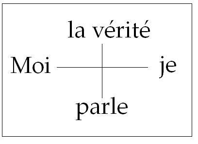

# Leçon 08 | 26 Janvier l966

<!-- source-url: http://staferla.free.fr/S13/S13 L'OBJET.docx -->
<!-- seminar: s13 -->
<!-- lesson: 08 -->

<!-- id: s13-08-0001 -->

[STEIN](#STEI) [CONTÉ](#CONTE2601) [MELMAN](#Melm) [AUDOUARD](#Audou)

<!-- id: s13-08-0002 -->

LACAN

<!-- id: s13-08-0003 -->

Mes chers amis, la question est de l’existence et du fonctionnement de ce séminaire fermé. Ce qui m’a décidé à le faire, c’est que j’entends que s’y produise ce qu’on appelle plus ou moins proprement un dialogue. Ce terme est vague et on en abuse beaucoup. Le dialogue tel qu’il peut se produire dans le cadre que j’essaie de fonder de ce séminaire fermé n’a rien de privilégié au regard de tout dialogue.

<!-- id: s13-08-0004 -->

Tout récemment par exemple quelqu’un est venu me demander quelque chose, ce quelque chose était en soi quelque chose de si exorbitant et impossible à accorder que je n’ai même pas cru un instant que c’était ça qu’on me demandait. Le résultat c’est que, concédant quelque chose que je pouvais tout à fait accorder, la personne qui était en face de moi a été convaincue que je lui accordais ce qui était selon son désir et qui, je vous le répète, était tellement hors des limites de la possibilité que je ne pouvais même pas penser que c’était ça qu’on me demandait.

<!-- id: s13-08-0005 -->

Tel est l’exemple, facile à rapprocher d’une foule de vos expériences de ce que c’est qu’un dialogue. Il est évident que tout dialogue repose sur *un foncier mal­entendu*. Ce n’est tout de même pas *une raison* pour qu’on ne le provoque pas ne serait-ce que pour en faire ensuite le bilan et en démontrer le mécanisme. J’ai assuré, je pense la transition.

<!-- id: s13-08-0006 -->

La dernière fois, vous avez entendu un tra­vail fort sérieux et fort honnête qui a fort plu, à la suite de quoi j’ai fait des déve­loppements, trop brefs sans doute au regard de tout ce que j’aurais pu apporter sur ce sujet énorme, qui revient en somme à dire ce qu’est la fonction du désir dans *La Divine Comédie*.

<!-- id: s13-08-0007 -->

Cette comédie, divine ou pas, je ne la recommencerai pas aujourd’hui. Je veux qu’aujourd’hui la séance soit remplie par les réponses, si courtes soient-elles, que pourra évoquer chez chacun de vous ce que vous allez entendre.

<!-- id: s13-08-0008 -->

Vous allez entendre quelque chose certainement de très soigné. Tous ceux qui sont ici étaient, je pense, déjà le dernier mercredi de Décembre, à ce séminaire. Vous avez entendu un exposé très remarquable de GREEN sur ce qui est actuel­lement issu de ma définition de *l’objet(a)*. Ce travail paraîtra, et à partir de sa parution, c’est-à-dire des textes que vous pourrez tous avoir en main, sera repris à un des futures séminaires fermés. C’est du travail de GREEN que je parle.

<!-- id: s13-08-0009 -->

D’autre part, vous avez eu une présentation de mon élève CONTÉ, un certain nombre de questions posées par mon élève MELMAN. Ces trois travaux qui ont été très préparés, ont suffi à remplir *le quatrième mercredi* auquel je fais allusion, *celui du mois de Décembre*. Il est dans la ligne des choses - *et de ce fait promis* - que vous entendiez aujourd’hui une réponse de STEIN.

<!-- id: s13-08-0010 -->

J’ai appris hier soir de lui, avec plaisir, qu’il me demandait de parler plus d’une demi-heure. *Qu’il parle tout le temps qu’il voudra !*

<!-- id: s13-08-0011 -->

À une seule condition : de manière à laisser la moitié de la séance pour les réponses qui, j’espère, se manifesteront.

<!-- id: s13-08-0012 -->

Je m’excuse donc auprès de lui si je m’engage comme je le fais à ne pas prendre la parole moi-même aujourd’hui.

<!-- id: s13-08-0013 -->

Puisqu’il s’avère pour certains que c’est la présence même de cette parole qui les met dans une position à ne pas vouloir \- je résume, *c’est bien plus complexe* - s’exposer à je ne sais quelle comparaison dont la référence, à une occasion semblable, me paraît absolument à la limite de l’analysable, n’est-ce pas.

<!-- id: s13-08-0014 -->

J’obtiendrai, ou je n’obtiendrai pas…

<!-- id: s13-08-0015 -->

> mais il ne s’agit pas, pour moi du tout, de la valeur du travail que j’ai fait pour vous ici …j’obtiendrai donc ou je n’obtiendrai pas qu’on intervienne.

<!-- id: s13-08-0016 -->

Je vous prie donc maintenant de prêter votre attention à ce que va nous dire STEIN à qui je passe immédiatement la parole.

<!-- id: s13-08-0017 -->

[Conrad STEIN](#janv26)

<!-- id: s13-08-0018 -->

Je prendrai pour point de départ de mes réponses, les remarques très précises et très pertinentes que CONTÉ a faites la dernière fois et du même coup, je serai amené à répondre à un certain nombre de questions de MELMAN pour ensuite relever un problème qui concerne tout particulièrement l’exposé de MELMAN.

<!-- id: s13-08-0019 -->

Je crois qu’au centre de la préoccupation de CONTÉ, à propos des deux articles de moi qu’il a analysés, se trouvait cette notion de situation fusionnelle. C’est sur ce que CONTÉ relève ainsi qu’il insiste au départ et il cite deux phrases de moi, deux phrases qui figurent dans le premier article :

<!-- id: s13-08-0020 -->

- l’une : « *Il y a un unique ça parlant et écoutant*… »

<!-- id: s13-08-0021 -->

- et la deuxième : « *Le patient et l’analyste tendent à être tous deux en un, en lequel est tout.* »

<!-- id: s13-08-0022 -->

À partir de là CONTÉ note que de tels états sont rares. Il est ainsi conduit à me demander :

<!-- id: s13-08-0023 -->

> l\) si je rapporte ces états à une structure névrotique déterminée.
>
> 2\) Comment je situe ces états par rapport à l’ensemble de la cure.

<!-- id: s13-08-0024 -->

Arrêtons-nous donc à cette première question de CONTÉ. La réponse que j’espère pouvoir vous fournir, servira dans une grande mesure de clé pour toutes les autres questions et pour toutes les autres objections qui m’ont été faites.

<!-- id: s13-08-0025 -->

Ma réponse pourrait être la suivante : il est vrai que je rapporte ces états à une structure déterminée, à *une structure névrotique* déterminée, mais cette structure déterminée concerne tous les patients, *l’ensemble de tous les patients capables de transfert*.

<!-- id: s13-08-0026 -->

Je dirai encore : *oui*, je rapporte tous ces états à une structure commune qui définit cette catégorie, et que j’essaierai d’élucider un peu tout à l’heure.

<!-- id: s13-08-0027 -->

Je répondrai : *non*, s’il fallait prendre « structure », structure névrotique au sens strict du terme, c’est à dire ce qui distingue une forme de névrose d’une autre. Je ne pense pas que ces états ne se rencontrent que dans l’une des formes de névroses que l’on peut distinguer.

<!-- id: s13-08-0028 -->

Quant à *l’ensemble de la cure*, je dois dire que la question est un peu plus difficile étant donné que dans ces travaux \- travaux que j’ai donnés jusqu’à maintenant - *l’ensemble de la cure* n’est pas encore pris en considération en ce qui différencie dans ses phases successives.

<!-- id: s13-08-0029 -->

Ce n’est pas de ça que j’ai traité pour l’instant. Par contre il s’agit bien de choses, de phénomènes qui se rencontrent d’un bout à l’autre de la cure, c’est à dire que dans ce premier stade, j’ai pris en considération quelque chose qui est commun, qui concerne non pas la cure mais qui concerne la séance analytique, quelle qu’elle soit, c’est à dire que j’essaie pour mon usage personnel - en premier lieu d’ailleurs - de trouver des repères qui soient valables pour la première séance aussi bien que pour la dernière dune cure.

<!-- id: s13-08-0030 -->

Les réponses que je viens de donner ainsi à CONTÉ sont en contradiction avec la notion, que je privilégie selon CONTÉ, d’états rares. Je pourrais objecter à cela : ou bien peu importe que ces états soient rares s’ils sont exemplaires.

<!-- id: s13-08-0031 -->

Je pourrais aussi objecter à cela : moi je les rencontre très fréquemment. Vous ne manqueriez pas de trouver que l’*une* ou l’*autre* réponse serait trop subjective pour servir de base à une discussion. Ce caractère subjectif de ma réponse serait encore accru si je vous rappelais qu’il s’agit là d’états limites qui ne sauraient être réalisés. Ce qu’on peut percevoir c’est que ce sont seulement des états qui peuvent - c’est ce que j’ai fait - être décrits comme tendant plus ou moins vers cette limite.

<!-- id: s13-08-0032 -->

Pour abandonner ce registre par trop subjectif, nous devons considérer que *les cas limites* en question *ne sauraient être réalisés* et sont, par définition même, *imaginaires*. Nous sommes donc amenés à définir cet état imaginaire, ce qui revient plus précisément à définir le sens de la proposition : « *ça parle* ». C’est à propos de la définition du sens de cette proposition que je vais être amené à vous exposer un argument qui est peut-être un peu nouveau mais qui devrait vous servir de clé pour les principales questions qui ont été soulevées.

<!-- id: s13-08-0033 -->

Je suis donc obligé de vous demander une attention particulièrement soutenue pendant quelques instants, puisque je suis obligé de vous énoncer un certain nombre de propositions sous une forme assez aride.

<!-- id: s13-08-0034 -->

Il s’agit donc d’élucider le sens de la proposition : « *ça parle* ». Nommons *prédication* toute proposition qui désigne un sujet par le moyen de son prédicat.

<!-- id: s13-08-0035 -->

Ce sujet, appelons-le *sujet du prédicat*. Quant à celui qui est à l’origine ou celui qui est l’agent de la prédication, celui qui, réellement, prononce les paroles et qui n’est pas habituellement représenté par un terme de la proposition, celui qui pourrait faire précéder la proposition d’un « *Je dis* », appelons-le *sujet prédicant*. S’il n’est pas *grammatical*, c’est un sujet supposé.

<!-- id: s13-08-0036 -->

Vous noterez qu’il est nécessairement toujours à la première personne. Maintenant, convenons que dans toute proposition, le sujet du prédicat est le terme qui désigne un patient déterminé une fois pour toutes.

<!-- id: s13-08-0037 -->

Dans la situation analytique, il s’agit de celui que l’on appelle habituellement le patient, et si l’on voulait examiner avec cette méthode le contenu d’un dialogue quelconque, celui dont vous parlait LACAN tout à l’heure, eh bien, le patient pourrait être choisi arbitrairement mais il devrait rester toujours le même. Le patient doit rester toujours le même, qu’il soit parlé de lui, qu’il soit parlé à lui, ou qu’il parle lui-même.

<!-- id: s13-08-0038 -->

Je vous donne un exemple pour bien préciser les choses. Le patient…

<!-- id: s13-08-0039 -->

> disons dans la situation analytique puisque en fait, ce n’est que celle-là que nous aurons en vue aujourd’hui
>
> et que je n’irai pas jusqu’à l’extrapolation qui concerne tout dialogue …le patient dit à son psychanalyste :

<!-- id: s13-08-0040 -->

> « *Vous ne répondez pas à mon attente.* »

<!-- id: s13-08-0041 -->

Le sujet du prédicat, contrairement aux apparences, est contenu dans « *mon* ». Ce qui veut dire que cette phrase, pour éclairer les choses, pourrait être transposée :

<!-- id: s13-08-0042 -->

> « *J’attends en vain votre réponse* ».

<!-- id: s13-08-0043 -->

Là le sujet du prédicat serait bien « *Je* » : « *Je* » (prédicat) attends votre réponse. À ceci vous objecterez que les deux phrases n’ont pas le même sens. Je vous répondrai que cela nous montre qu’il n’est pas indifférent que le sujet du prédicat y figure d’une manière ou d’une autre. Notre proposition à nous : « *Ça parle en la séance.* » est une prédication au deuxième degré.

<!-- id: s13-08-0044 -->

Ne l’oublions pas. Nous n’avons pas à étudier spécialement cette prédication au deuxième degré, mais nous avons bien à savoir que lorsque nous parlons, nous parlons de paroles qui se disent dans la séance.

<!-- id: s13-08-0045 -->

Il faut distinguer ce que nous en disons, des paroles qui se sont dites. Je ne veux rien dire d’autre. « *Ça parle en la séance.* », c’est notre discours sur la parole qui, dans la séance était prononcé. *Nous avons donc à nous demander :  Qui parlait ? Qui parle ?*

<!-- id: s13-08-0046 -->

De toute évidence, dans le cas considéré : « *Ça parle en la séance.* », c’était, c’est le patient qui parle. *Cependant nous disons bien* « *ça parle* » *et non pas* « *il parle* », *pourquoi* ?

<!-- id: s13-08-0047 -->

Parce qu’*il ne parle pas, il ne parle pas à son psychanalyste* dans le cas imaginaire que nous avons à considérer. Pour bien éclairer les choses, envisageons d’abord le cas où il parlerait à son psychanalyste, le cas à la limite de loin le plus habituel.

<!-- id: s13-08-0048 -->

Dans le cas où il parle à son psychanalyste, sa parole pourrait être précédée d’un : « *Je dis* ».

<!-- id: s13-08-0049 -->

Ce qui implique que *l’on doit être deux dans l’écoute* :

<!-- id: s13-08-0050 -->

- « *Je* » parlant et écoutant qui désigne le patient,

<!-- id: s13-08-0051 -->

- du même ordre, en tant qu’il est « *Je* », que le « *Je* » de l’autre, le psychanalyste écoutant.

<!-- id: s13-08-0052 -->

Pouvons-nous considérer un autre cas, où c’est le patient qui parle dont nous pouvons dire : « *il parle* ». Le patient peut prononcer des paroles qu’il suppose adressées à lui-même par son double ou par un tiers, par exemple *par son psychanalyste*.

<!-- id: s13-08-0053 -->

Cette supposition qui est la sienne, c’est que sa parole pourrait être encore précédée d’un « *Je dis* », « *Je* » semblable au « *Je* » de celui dont la parole est supposée. Tel n’est toujours pas le cas imaginaire que nous considérons.

<!-- id: s13-08-0054 -->

Faisons d’abord quelques remarques ayant trait à cet ordre formel qui est celui du : « *il parle* » et que nous envisageons pour l’instant.

<!-- id: s13-08-0055 -->

<u>1ère *remarque*</u> : « *Je* », *sujet prédicant*, est toujours du même ordre qu’un autre « *Je* », *sujet prédicant*, <u>2ème *remarque*</u> : Lorsque c’est le patient qui parle, le sujet prédicant est par définition le même que le sujet du prédicat « *je dis* ».

<!-- id: s13-08-0056 -->

<u>3ème remarque</u> : Lorsque le sujet prédicant est le même que le sujet du prédicat, ce dernier est toujours à la 1ère personne. Parlant de moi-même, je ne peux pas me désigner autrement que par « *Je* ». Pour parler de soi, on dit « *Je* ».

<!-- id: s13-08-0057 -->

Mais dans le deuxième cas que nous avons considéré, pour faire parler un autre de soi, on dit à son psychanalyste « *vous me direz bien que*… », pour faire parler un autre que soi, on ne dit pas « *Je* », on dit *moi* : « *vous me dites* ».

<!-- id: s13-08-0058 -->

À propos de cette forme réfléchie de la première personne : « *moi* », nous devons noter - c’est très important - qu’elle implique la référence à une prédication à la deuxième personne « *vous me dites* », « *me* » contient le sujet du prédicat.

<!-- id: s13-08-0059 -->

Il n’en reste pas moins que la référence impliquée à la deuxième personne est celle du *« tu »* : *« vous me dites tu »*.

<!-- id: s13-08-0060 -->

Il y a donc dans la forme réfléchie de la première personne, *moi*, un certain degré de *contamination* du « *Je* », première personne à proprement parler par une référence à la deuxième personne : « *tu* ». Si je vous fais remarquer ce degré de contamination du « *Je* » dans cette forme réfléchie c’est parce qu’il nous amène aisément par transition au *moi imaginaire* que nous avons à considérer où il n’y a plus *contamination* du « *Je* » par la référence à un « *tu* » - « *Je* » et « *tu* » désignant toujours le même sujet, le sujet du prédicat - mais où il y a confusion des deux.

<!-- id: s13-08-0061 -->

Qu’en est-il donc du cas imaginaire que nous devons maintenant considérer, celui à propos duquel notre commentaire est : « *ça parle* » ? Eh bien, nous avons vu que dans *l’ordre formel* où l’on peut dire « *il parle* », « *il* » désigne je sujet prédicant qui s’oppose toujours à un autre « *Je* », sujet prédicant.

<!-- id: s13-08-0062 -->

*L’ordre imaginaire* est celui du « *ça parle* ». « *Ça* », désigne, comme émetteur de la parole une personne unique, il y a toujours deux « *Je* », il n’y a qu’un Ça : une personne unique et une personne innominée au sens qu’elle ne se nomme pas.

<!-- id: s13-08-0063 -->

D’ailleurs, lorsque nous disons « *il parle* » nous nous référons à celui qui dit « *Je* », et lorsque nous disons « *ça parle* » nous n’avons pas de nom pour désigner ce qui est à l’origine de la parole prononcée, nous n’avons pas de nom pour désigner le sujet prédicant pour la bonne raison que ce sujet prédicant perd là, son statut de sujet.

<!-- id: s13-08-0064 -->

Le cas imaginaire est précisément celui où, contrairement à la loi…

<!-- id: s13-08-0065 -->

> que je vous ai présentée sous forme de remarque tout à l’heure …où contrairement à la loi, le sujet du prédicat est à la deuxième personne, alors que le sujet prédicant est le même que le sujet du prédicat. Autrement dit, où *la première* et *la deuxième personne* ne font qu’une.

<!-- id: s13-08-0066 -->

*Exemple* : Comment peut-en donner l’exemple d’un cas imaginaire. On ne peut le faire que d’une manière très approximative évidement. Exemple : le patient parlant par la bouche de son psychanalyste. J’entends bien, non pas au sens figuré de la formule « *parler par la bouche de quelqu’un d’autre* », mais le patient parlant par la bouche de son psychanalyste, disons *réellement*, puisqu’il n’y a rien d’aussi réel - au sens où il s’agit de la réalité psychique - que l’imaginaire. Le patient parlant par la bouche de son psychanalyste c’est quelque chose - si on prend le terme dans son sens propre et non pas figuré - évidemment d’impossible dans tout domaine autre que *celui de la réalité psychique, que* FREUD *assigna à la réalité psychique*.

<!-- id: s13-08-0067 -->

Alors, qu’est–ce qui se passe dans ce cas *imaginaire* ? Dans sa prédication, il se désignerait lui-même comme le sujet à *la deuxième personne* se disant « *tu* ». Si une telle parole était précédée d’un « *je dis* », cela donnerait - *« je » et « tu » étant le même* - « *Je dis tu es je* ». Or, il ne peut pas dire « *tu es je* », c’est pourquoi nous disons « *ça dit tu es je* ». La personne imaginaire qui est à la fois première et deuxième, nous la désignons dans notre discours sur son discours comme étant « *Ça* ». « *Ça* » est une personne imaginaire. « *Ça* » parle et le discours qui se fait entendre, semblable à une prédication, n’en a pas le statut en raison du caractère ubiquitaire du sujet qui s’y désigne(je vous ai dit tout à l’heure qu’il n’avait pas le statut d’un sujet).

<!-- id: s13-08-0068 -->

Maintenant, il est peut-être bon de noter que nous avons distingué deux registres de la parole :

<!-- id: s13-08-0069 -->

- *le registre formel* du « *il parle* »,

<!-- id: s13-08-0070 -->

- et *le registre imaginaire* du « *ça parle* ».

<!-- id: s13-08-0071 -->

Nous devons ajouter que ces registres admettent des *subdivisions*, des *subdivisions* très nombreuses mais cela n’est pas notre propos d’aujourd’hui d’examiner toutes les *subdivisions* possibles de ces registres, ce qui serait d’ailleurs un propos fort intéressant à faire.

<!-- id: s13-08-0072 -->

Je voudrais simplement mentionner trois registres qui constituent des subdivisions du registre formel « il parle », trois registres parce qu’ils nous seront d’une utilité immédiate. Ces registres-là sont d’ailleurs les plus simples : l\) Celui de la désignation du sujet du prédicat à la deuxième personne. La parole dans ce cas est évidemment le fait de l’autre, celui qui dit *« tu »*. Ce registre est, dans une approximation très grossière, dans une toute première approximation, celui qui est privilégiée dans l’interprétation du psychanalyste qui dit à son patient *« tu »*.

<!-- id: s13-08-0073 -->

2\) Désignation du sujet du prédicat à la première personne réfléchie, registre que nous avons déjà rencontré comme exemple. Là c’est bien le patient qui parle de lui-même se désignant au moyen du propos supposé de son psychanalyste qui constitue *le prédicat*. Ce registre de la désignation de sujet à la première personne réfléchie - celui du prédicat - est celui de l’interprétation supposée du psychanalyste, c’est le registre, qui d’une manière encore très *approximative*, est d’une manière privilégiée celui du transfert.

<!-- id: s13-08-0074 -->

Maintenant, me direz-vous, il existe quand même un registre extrêmement simple et dont nous avons déjà parlé tout à l’heure, et dont il faut bien tenir compte, c’est celui de la désignation du sujet du prédicat à *la première personne*, dans le cas de *la psychanalyse*, celui où le patient parle disant « *Je* ». Qu’en est-il de ce registre-là ?

<!-- id: s13-08-0075 -->

Eh bien, je vous demande un instant, nous y reviendrons tout à l’heure. Car je vous propose de préciser tout cela en répondant à un certain nombre de questions de CONTÉ. Je présentais - dit CONTÉ - la parole comme introduisant une coupure. Je présentais encore la parole - dit-il - comme épuisant le flux psychique sans faille ni coupure. L’expression est de CONTÉ. Il y a là un paradoxe apparent qui amène CONTÉ à poser la question : « *Mais à son avis, qu’est-ce qui est primordial ?* »

<!-- id: s13-08-0076 -->

Voici ma réponse : la fonction primordiale de la prédication me parait résider dans le registre que j’ai désigné tout à l’heure comme étant celui de la désignation du sujet du prédicat à la deuxième personne, registre qui, d’une manière privilégiée serait celui de l’interprétation du psychanalyste. Je vous signale que tout ceci, bien entendu, demande à être beaucoup plus fouillé que je ne l’ai fait dans ce premier projet. Voilà donc ce qui est primordial.

<!-- id: s13-08-0077 -->

J’ajouterai que la fonction de cette prédication a quelque rapport, et je dirais même, un rapport très intime, à ce que nous pouvons désigner comme étant la fonction paternelle, qu’elle est constitutive de l’appareil de l’âme, comme l’appelle FREUD ou appareil psychique, dans sa dimension topique aussi bien que dans sa structure, c’est à dire dans sa référence à ces trois personnes néo-grammaticales qui constituent ce qu’on appelle d’un terme propre, la deuxième topique freudienne, par conséquent constitutive du registre imaginaire dont nous disons « *ça parle* ».

<!-- id: s13-08-0078 -->

Autrement dit constitutive de ce que, dans le langage habituel on appelle le « *ça* », tout aussi bien que constitutive du *moi* et du *surmoi*. Ajoutons maintenant que dans ce registre imaginaire, « *ça parle* », la fonction de prédication de la parole est en quelque sorte aliénée.

<!-- id: s13-08-0079 -->

Notons maintenant qu’il y a incompatibilité entre « *ça parle* » et la prédication, que vis à vis du registre narcissique, « *ça parle* », la prédication a :

<!-- id: s13-08-0080 -->

- ou bien un effet de coupure restituant le patient dans l’un des modes de registre où il parle,

<!-- id: s13-08-0081 -->

- ou bien n’a pas d’effet du tout.

<!-- id: s13-08-0082 -->

Dans ce cas-là, cette fonction de prédication, cette prédication est en quelque sorte *forclose* - pour reprendre le terme de LACAN - *dans l’exercice de sa fonction* et je pense que cette manière de voir les choses doit se recouvrir assez exactement avec ce que LACAN appelle *la forclusion du Nom du Père*.

<!-- id: s13-08-0083 -->

Autrement dit lorsque « *ça parle* » et que, en quelque sorte les choses sont fixées dans ce registre, que la prédication reste sans effet, nous devons considérer qu’il n’y a pas de transfert, qu’il n’y a pas de transfert simplement au sens où l’intervention de la prédication, de la prédication qui désigne le sujet du prédicat à la deuxième personne, ne rompt nullement le « *ça parle* » et ne fait pas accéder le patient - en particulier - au registre de *la désignation du sujet à la première personne réfléchie*.

<!-- id: s13-08-0084 -->

C’est à dire que dans ce cas de forclusion nous avons affaire, en pratique à des patients pour qui l’interprétation ne représente rien en tant que telle et qui n’accèdent pas au registre où ils se désignent eux–mêmes au moyen de l’interprétation supposée du psychanalyste. Voilà *la forclusion*, voilà ce qui est de *forclusion du Nom du Père* comme dit LACAN, et voilà très précisément la définition de la névrose narcissique telle que l’a distinguée FREUD.

<!-- id: s13-08-0085 -->

Vous savez - je fais ici une incidente destinée à montrer que tout cela a aussi un intérêt pour la psychanalyse - vous savez que depuis que les psychanalystes ont commencé à s’occuper de gens qui étaient fous, à s’occuper d’aliénés, ils ont noté que ces gens-là éprouvaient vis à vis d’eux des sentiments très vifs, ce qui leur a fait croire que la folie n’excluait pas la possibilité du transfert.

<!-- id: s13-08-0086 -->

Eh bien, c’est une erreur. Si on veut maintenir le cadre des *névroses narcissiques*, ce qui me parait nécessaire, il faut prendre le transfert dans un sens plus restrictif que celui du sentiment attaché à quelqu’un, dans un *sens strict*…

<!-- id: s13-08-0087 -->

> qui est celui que je vous propose par exemple, car il y a *beaucoup d’autres formulations possibles* …comme étant par exemple cette capacité de se désigner au moyen de l’interprétation supposée du psychanalyste.

<!-- id: s13-08-0088 -->

Eh bien *la folie*, dans la mesure où le patient est fou…

<!-- id: s13-08-0089 -->

> car on n’est jamais entièrement fou, et c’est pour ça qu’on peut quand même traiter les fous …dans la mesure où le patient est fou, cette possibilité n’existe pas en raison de la forclusion dont il vient d’être question.

<!-- id: s13-08-0090 -->

Or - toujours dans cette incidente, puisque là je ne réponds plus aux questions de CONTÉ - il faut noter qu’il faut en revenir à ce registre dont je ne vous ai rien dit tout à l’heure, registre de la désignation du sujet à la première personne, le patient parlant de lui-même et disant « *je* ».

<!-- id: s13-08-0091 -->

Eh bien, à cet autre extrême, pourrait-on dire, la fonction de prédication de la parole est, non pas aliénée, comme dans le registre imaginaire du « *ça parle* », mais elle est prétendument entièrement assumée. Ce registre pourrait être défini comme étant celui du narcissisme secondaire. Vis à vis de ce registre, la prédication :

<!-- id: s13-08-0092 -->

- ou bien est remise en question en son effet,

<!-- id: s13-08-0093 -->

- ou bien elle reste sans effet.

<!-- id: s13-08-0094 -->

Là encore, il peut y avoir *forclusion* de cette fonction que LACAN désigne comme essentielle, du *Nom du Père*.

<!-- id: s13-08-0095 -->

Là encore il n’y a pas de transfert possible, il n’y a pas de transfert possible dans la mesure où les choses sont vraiment ainsi.

<!-- id: s13-08-0096 -->

Nous avons affaire ici en pratique non pas à des fous mais bien au contraire, à des gens qui sont parfaitement sains d’esprit ou apparemment sains d’esprit, ces patients sains d’esprit qui ne font pas l’analyse, qui paraissent en quelque sorte *irréductibles* et dont on dit - dans un langage qui me paraît assez inapproprié et assez flou, d’autant plus que la terminologie est multiple - qu’ils présentent des défenses narcissiques rigides ou des défenses de caractère irréductibles, ou tout ce qu’on voudra.

<!-- id: s13-08-0097 -->

Donc ceci, c’était une incidente, une indication très sommaire pour vous montrer que mes formulations un peu arides…

<!-- id: s13-08-0098 -->

> je ne pense pas qu’il soit nécessaire de voir
>
> les choses comme je les vois et je ne pense pas qu’il soit nécessaire de s’intéresser à ce genre de formulations …mais pour vous dire que dans la mesure où on s’y intéresse, cela ne veut pas dire qu’on ne s’occupe pas de psychanalyse.

<!-- id: s13-08-0099 -->

Autre question de CONTÉ : « *Dans l’unique ça parlant et écoutant, le psychanalyste est–il lui aussi soumis à la régression, à la régression topique, ou bien s’agit–il plutôt d’un fantasme de fusion de l’analysé ?* »

<!-- id: s13-08-0100 -->

Eh bien je crois que ce qui précède permet de formuler la réponse très simplement, et implique déjà la réponse.

<!-- id: s13-08-0101 -->

Dans toute la mesure où nous avons justement posé cette convention que le patient restait toujours le même, la convention déterminée prouve que lorsque nous parlons les paroles qui se font entendre au cours de l’analyse, nous ne pouvons pas tout d’un coup prendre le psychanalyste pour patient mais on peut raisonner ainsi, « *l’unique ça parlant et écoutant* » désigne bien évidemment le fantasme du patient, fantasme que trahit, au point de vue phénoménologique, un certain affect, une certaine manière d’être, *temporaire*, *aléatoire*, que j’ai désignée comme étant *l’expansion narcissique*.

<!-- id: s13-08-0102 -->

Il ne s’agit pas du tout que l’on retienne cette terminologie qui n’a pas une importance fondamentale.

<!-- id: s13-08-0103 -->

Ce qui est important c’est de souligner le caractère irréductiblement inconscient du fantasme du patient en énonçant…

<!-- id: s13-08-0104 -->

> plutôt que de parler d’expansion narcissique puisque nous faisons la théorie …en l’énonçant, ce fantasme, de la manière suivante : « *Ça dit tu es Je* ». Vous remarquerez que « *tu es Je* », cette formule n’est pas *spécularisable* et qu’il n’y qu’un « *ça* », ce qui répond, je crois suffisamment à la question de CONTÉ .

<!-- id: s13-08-0105 -->

Autre question : CONTÉ dit que pour moi le narcissisme primaire paraît - il ne l’assure pas - paraît comme un pas primordial, comme un pas anté-verbal ou pré-verbal du développement. Par ailleurs le patient se posant comme l’objet manquant à son psychanalyste, parait dans son travail viser à la restauration du narcissisme de l’autre. Cette restauration du narcissisme de l’autre se présenterait comme le mythe ou le fantasme de la complétude du désir de l’autre.

<!-- id: s13-08-0106 -->

Alors CONTÉ se demande : quel est l’aspect décisif et comment les deux aspects s’articulent-il entre eux ?

<!-- id: s13-08-0107 -->

Eh bien ma réponse : sur le premier point, je crois que j’ai suffisamment répondu pour ne pas avoir à donner des précisions sur le fait qu’il est bien évident que je ne puis considérer le narcissisme primaire comme quelque chose d’anté-verbal ou de pré-verbal, c’est ce que j’ai essayé de vous montrer tout à l’heure.

<!-- id: s13-08-0108 -->

Pour le deuxième point, je dirai à CONTÉ que je crois qu’il faut distinguer le *fantasme narcissique* ou le *mythe narcissique*.

<!-- id: s13-08-0109 -->

Du moins on peut les distinguer. *Le fantasme narcissique* c’est le fantasme du patient : il est inconscient.

<!-- id: s13-08-0110 -->

*Le mythe narcissique*…

<!-- id: s13-08-0111 -->

> voilà une notion, peut-être un peu plus nouvelle que CONTÉ introduit ainsi …*le mythe narcissique*, lui, n’est pas inconscient mais conscient ou préconscient, susceptible de devenir conscient, ce *mythe narcissique* est celui selon lequel l’autre pourrait accomplir ou combler son désir.

<!-- id: s13-08-0112 -->

*Le mythe narcissique* serait par exemple :

<!-- id: s13-08-0113 -->

- le mythe du psychanalyste ordonnateur du destin,

<!-- id: s13-08-0114 -->

- le mythe du psychanalyste érigé dans une fonction qui est à proprement parler celle d’une idole.

<!-- id: s13-08-0115 -->

CONTÉ et MELMAN, par ailleurs ont voulu s’interroger sur le rapport des *repères* fournis par mes deux premiers textes *avec un certain nombre des principales catégories lacaniennes*. Ils se sont alors trouvés gênés de ce que le narcissisme primaire décrit en première approximation comme un état-limite de fusion, pouvait apparaître dans un aspect, en quelque sorte, amorphe.

<!-- id: s13-08-0116 -->

Peut-être les précisions que leurs remarques m’ont amené à formuler quant à la signification de la proposition « *ça parle* », peut-être ces remarques, ces clés que j’ai essayé de fournir en une première approximation contribueront-elles à mieux poser les éléments d’une telle confrontation. Cependant, il reste, ne l’oublions pas que mon premier article introductif conserve et conservera un caractère plus descriptif que théorique à proprement parler, et que le deuxième article que CONTÉ a résumé vise à situer la parole du patient dans un plan défini par deux axes de coordonnées :

<!-- id: s13-08-0117 -->

- celui imaginaire où « *ça parle* »,

<!-- id: s13-08-0118 -->

- et celui formel où « *il parle* », désignant la première personne par le moyen de l’attribution de son objet.

<!-- id: s13-08-0119 -->

La progression asymptotique vers le premier de ces axes je l’ai appelé « *mouvement de régression topique* », et la progression asymptotique vers le second de ces axes je l’ai appelé « *mouvement du refoulement* ». Ceci justifie pleinement l’impression de CONTÉ et de MELMAN qu’il s’agit là - comme ils disent - d’un cadrage de la situation analytique en référence à l’opposition, je ne dirais pas tellement de deux termes, comme ils disent, mais plutôt de deux axes.

<!-- id: s13-08-0120 -->

CONTÉ a très bien senti par ailleurs que dans toute la mesure où un tel repérage conduisait à évoquer la relation sadomasochiste dans le transfert comme je le fais dans le deuxième article, un troisième terme s’y trouvait déjà nécessairement impliqué, troisième terme qui sera introduit dans le troisième de ces articles que MELMAN a commenté, celui de *La fonction de prédication de la parole du psychanalyste*.

<!-- id: s13-08-0121 -->

Mais il reste qu’en ce troisième article le travail est loin d’être achevé. C’est bien cet inachèvement qui rend la confrontation en quelque sorte bancale. La question de la situation de la castration par rapport à la frustration, sur laquelle s’achève le commentaire de CONTÉ , sera abordée corrélativement à celle de la constitution de *l’idéal du moi* en tant qu’héritier du narcissisme primaire. Cela, je ne l’ai pas encore fait, mais c’est seulement alors que je pourrai parler de l’évolution et de *la terminaison de la cure*.

<!-- id: s13-08-0122 -->

À propos de *la terminaison de la cure*, il est peut-être maintenant inutile que je dise… comme le pensent peut-être CONTÉ et MELMAN …que je dise si je puis la subordonner à quelque artifice dit technique.

<!-- id: s13-08-0123 -->

Je crois avoir évoqué - sinon répondu à - toutes les questions et remarques de CONTÉ et à un grand nombre de celles de MELMAN. Pour CONTÉ, il ne reste que la question du rêve pour laquelle la réponse serait d’ailleurs un exercice très instructif mais je n’ai pas le temps. Mais il y a une sorte de reste en ce qui concerne MELMAN, je dois lui répondre séparément sur ce qui parait faire entre lui et moi - ce qui a paru faire, tout au moins l’autre jour, entre lui et moi – le principal malentendu.

<!-- id: s13-08-0124 -->

Voici de quoi il s’agit. Comment - dit MELMAN - l’analyste pourrait-il faire de sa parole la garantie de vérité alors que le patient, dans le transfert, lui attribue un pouvoir qu’il n’a pas. C’est ce que dit MELMAN me faisant parler, ce qu’il me fait dire. Or je n’ai rien dit qui puisse prêter à une telle paraphrase.

<!-- id: s13-08-0125 -->

J’ai écrit - et ici MELMAN me cite correctement et même à deux reprises - dans un article qui au demeurant ne traite pas de la parole prononcé par le psychanalyste, c’est peut-être un artifice de faire un article laissant pour plus tard la question de la parole effectivement prononcée par le psychanalyste, mais cet artifice a été le mien. J’ai écrit dans cet article : « *Il n’y aurait pas de psychanalyse si le psychanalyste prétendait à tout instant se poser en fidèle serviteur de la vérité.* »

<!-- id: s13-08-0126 -->

Voilà ce que j’ai écrit et dans un contexte qui ne laisse - je crois - aucun doute sur le sens de cette phrase.

<!-- id: s13-08-0127 -->

Pour être encore plus explicite, replaçons le terme serviteur, si vous voulez, par le terme champion : « *champion de la vérité* ».

<!-- id: s13-08-0128 -->

Qu’il ne s’en fasse pas *le champion* à tout instant ne signifie point qu’il ne serve point à ce que, tôt ou tard, *cette vérité* éclate.

<!-- id: s13-08-0129 -->

D’une manière générale, cela signifie donc qu’il se tait et qu’il n’empêche pas le patient de parler. Il ne s’oppose pas au développement du transfert en lequel le patient fait de lui un trompeur trompé, cela n’implique point - tout au contraire - qu’il accepte ou qu’il entérine cette position lorsqu’à son tour il vient à parler, c’est-à-dire à interpréter.

<!-- id: s13-08-0130 -->

La place d’où le psychanalyste parle n’est pas la même que celle d’où, dans le transfert, il est supposé parler. C’est essentiel.

<!-- id: s13-08-0131 -->

Une *remarque un peu incidente* quand même, n’est–ce pas ? À ce propos MELMAN parle de la place d’où la parole de l’analyste prendrait cette *brillance* si singulière. C’est une très belle expression. Mais lorsqu’on parle de ce problème :

<!-- id: s13-08-0132 -->

- de la place de l’analyste,

<!-- id: s13-08-0133 -->

- de la place occupée par l’analyste,

<!-- id: s13-08-0134 -->

- de la place où l’analyste parle, …je crois qu’il y a souvent dans le dialogue une certaine confusion entre *un problème de droit* et *un problème de fait*.

<!-- id: s13-08-0135 -->

Je ne pense pas que nous soyons là en premier lieu pour dire de quelle place le psychanalyste doit parler, pour que sa parole prenne cette *brillance* si singulière, mais je crois que nous sommes là pour examiner en premier lieu, de quelle place il s’avère que le psychanalyste parle. Je soutiendrai cette considération d’une remarque qui peut paraître peut-être un peu méchante, mais MELMAN m’accordera bien que la parole de tel de ses collègues analystes - pour l’intelligence de qui il n’a pas la plus grande estime, je ne mentionne personne, c’est un exemple - dont il considère que cet analyste ne comprend pas grand chose à l’analyse et à ce qu’il fait, il m’accordera que même dans ce cas, pour peu qu’il soit en situation d’analyste avec son patient, il arrive bien de temps à autre que sa parole prenne cette *brillance*.

<!-- id: s13-08-0136 -->

En fait, peut-être pas pour nous qui pourrions avoir le compte-rendu de l’analyse, mais pour son patient. Il ne s’agit donc pas tellement de la question de droit mais de la question de fait. MELMAN note que la parole, considérée indépendamment de son contenu qu’il m’accorde, semble évoquer essentiellement la place d’où la parole de l’analyste prendrait, dit-il, cette *brillance* si singulière. Il s’agit, dis-je, bien de la question de la place de celui qui prononce la parole, autrement dit du statut du sujet prédicant. Celui qui prononça l’*interprétation* désigne le patient comme sujet du prédicat à la 2ème personne.

<!-- id: s13-08-0137 -->

Il n’a pas le même statut que celui qui, supposé parler dans le transfert est supposé désigner le patient à la deuxième personne, alors qu’il est en fait désigné par lui-même à la première, dans sa forme réfléchie : moi.

<!-- id: s13-08-0138 -->

Le psychanalyste ainsi supposé parler, occupe la place du sujet du mythe de l’accomplissement narcissique. Il est supposé à l’origine de toute chose. Le psychanalyste donnant l’interprétation occupe la place d’un sujet lui-même désigné à son tour à la deuxième personne par un autre. Au contraire de celui qui est supposé à l’origine de toute chose, il est marqué par sa place dans la succession de la généalogie.

<!-- id: s13-08-0139 -->

Je serais très bref pour terminer, mais il me reste à répondre à la suggestion que M. LACAN nous a faite à l’issue de la dernière réunion, de la réunion où il a été question de ces textes. Il nous a suggéré de reprendre aujourd’hui notre débat à partir de l’idée suivante : si l’analyste est dans une certaine position, ce ne peut être que celle de la *Verneinung* et non celle d’une *Bejahung*.

<!-- id: s13-08-0140 -->

*Bejahung*, c’est en français, tout simplement l’affirmation. Or, chacun sait que la prédication peut prendre une forme affirmative ou négative, la catégorie de la prédication ne saurait donc être ni celle de l’affirmation ni celle de la négation.

<!-- id: s13-08-0141 -->

Voilà qui récuse, je crois, l’argument de M. LACAN selon lequel je situerais, moi, le psychanalyste dans une position d’affirmation, de *Bejahung*.

<!-- id: s13-08-0142 -->

Et pour tenter de situer ce que j’ai tenté de formuler aujourd’hui dans l’optique de la suggestion de M. LACAN, je dirai en très bref, ceci. La parole du psychanalyste désignant le sujet à la deuxième personne est incompatible avec l’imaginaire « *tu es Je* » du narcissisme, je vous le rappelle.

<!-- id: s13-08-0143 -->

Lorsque la parole du psychanalyste est entendue, elle ne peut être reçue :

<!-- id: s13-08-0144 -->

- que comme une coupure,

<!-- id: s13-08-0145 -->

- que comme *la* coupure constitutive du désir,

<!-- id: s13-08-0146 -->

- que comme un déni de narcissisme, répétition du premier déni mythique où le fantasme « *tu es Je* » s’était constitué dans l’aliénation de la *fonction de prédication* ou *fonction de déni*, car c’est une seule et même chose ici, de la parole.

<!-- id: s13-08-0147 -->

Ou selon les termes de FREUD, cette parole ne peut être reçue que comme un déni de toute puissance infantile, première formulation de FREUD, ou disons, comme un déni de toute puissance narcissique, pour s’en référer à la formulation ultérieure de FREUD. Déni qui est par conséquent corrélatif du refoulement.

<!-- id: s13-08-0148 -->

Ce déni de toute puissance est au mieux illustré par la parole suivante, par la parole : « *du fait de votre souhait* », parole que le psychanalyste ajoute au texte du rêve de son patient : « *Il ne savait pas qu’il était mort* » suscitant ainsi la dénégation du patient : « *tel n’est point mon souhait* ».

<!-- id: s13-08-0149 -->

Voilà ce que je voulais vous dire.

<!-- id: s13-08-0150 -->

LACAN

<!-- id: s13-08-0151 -->

STEIN, Je vous remercie beaucoup de ce que vous avez bien voulu apporter comme rassemblement de précisions sur ce que vous nous avez présenté d’ailleurs comme n’étant que les trois premiers temps de quelque chose qui est votre projet et qui, assurément doit en comporter au moins un autre, n’est-ce pas ?

<!-- id: s13-08-0152 -->

Il faut donc que je vous remercie de deux choses :

<!-- id: s13-08-0153 -->

- d’abord d’avoir réussi à en sortir cette première partie,

<!-- id: s13-08-0154 -->

- deuxièmement d’avoir bien voulu nous les situer dans l’ensemble de votre dessein.

<!-- id: s13-08-0155 -->

Je ne vais pas - comme je l’ai annoncé tout à l’heure, conformément à ce que j’ai annoncé - je n’interviendrais pas aujourd’hui ni sur le fond ni sur les détails de l’articulation que vous nous avez apportée, comptant sur les personnes qui vous ont entendu dans l’assistance pour apporter de premières remarques.

<!-- id: s13-08-0156 -->

Je ne puis dire qu’une chose c’est que je me félicite, au-delà de ce qui a été la motivation immédiate pour laquelle j’ai voulu que certains de ces articles, dans l’ensemble et précisément à propos du premier, la discussion fût portée ici dans le cadre de notre séminaire. Assurément, dans ce que vous avez énoncé un certain malentendu a été dissipé concernant l’essence de ce que vous vouliez dire. Il reste néanmoins que ceci ne veut pas dire que je puisse être d’accord sur l’ensemble de votre *situation du problème* puisque c’est de cela qu’il s’agit.

<!-- id: s13-08-0157 -->

Mais c’est assurément une chose assez profondément armaturée pour que cela nous désigne très bien le niveau où se placent certains problèmes essentiels. Je pense que…

<!-- id: s13-08-0158 -->

> car les limites que vous impliquez du développement de cette situation analytique peuvent être dépassées …que c’est ici justement, là, une base, un point d’appui qui peut m’être excessivement précieux pour repérer en quoi ce que j’articule cette année me permet de critiquer cette position. Je le ferai assurément d’autant plus, et d’autant plus aisément, et d’une façon d’autant plus pertinente pour tous, que vous verrez où en sont tels ou tels de mes auditeurs par rapport à l’audition que cette présentation d’aujourd’hui impose.

<!-- id: s13-08-0159 -->

Néanmoins, je ne peux pas, dès maintenant ne pas faire une rectification. Elle est importante. Je suis vraiment tout à fait désolé que le texte que je vous ai communiqué où particulièrement MELMAN avait apporté ses corrections, ait laissé passer dans la dernière page ce qui n’était de ma part, même pas un jalon, une corde lancée de votre côté.

<!-- id: s13-08-0160 -->

J’ai parlé le temps de deux pages et demie.

<!-- id: s13-08-0161 -->

Il y a en effet écrit dans ce texte le mot dont peut-être *l’incorrection* aurait dû vous éveiller, le mot «* Verneunung » qui n’existe pas*.

<!-- id: s13-08-0162 -->

Vous avez traduit *Verneinung* et j’avais dit *Verleugnung*. De sorte que ceci met un peu en porte à faux - sans du tout d’ailleurs en diminuer l’intérêt - ce que vous m’avez, à moi, directement répondu en terminant.

<!-- id: s13-08-0163 -->

STEIN  - Je suis beaucoup plus d’accord avec *Verleugnung*.

<!-- id: s13-08-0164 -->

LACAN

<!-- id: s13-08-0165 -->

Alors, je demande d’abord, ce qui est naturel, à ceux à qui il a été répondu, à savoir nommément CONTÉ et MELMAN s’ils veulent bien maintenant *prendre la parole*. CONTÉ, vous avez pris des notes. Est-ce que vous voulez vous réserver un temps de réflexion ou est-ce que vous pouvez dès maintenant aborder ce que vous avez à dire ? Ne parlez pas de votre place, venez ici.

<!-- id: s13-08-0166 -->

Alors puisqu’il est possible que les choses se passent assez bien à mon gré pour que tout à l’heure le départ se fasse par échelon comme il arrive, à savoir que quelques-uns soient limités par l’heure et s’en aillent, je tiens à vous en annoncer, c’est une des raisons pour lesquelles tout à l’heure je me réjouissais qu’ait pris dans l’ensemble de mon séminaire cette année, cette place qui a été prise par un discours tel que celui que nous venons d’entendre.

<!-- id: s13-08-0167 -->

En effet, peut-être n’en saisissez-vous pas dès maintenant le rapport mais je crois qu’il n’y a pas de meilleur texte… qui nous permette de relancer certaines des affirmations que j’entends discuter, de ce que nous a annoncé STEIN que celui-ci, ce texte, celui que je vous avais annoncé la dernière fois, avant que Mme PARISOT vous parle de l’article de DRAGONETTI sur DANTE. Je ne peux, bien sûr, aucunement aujourd’hui commenter la fonction que j’entends lui réserver.

<!-- id: s13-08-0168 -->

Mais après tout, pour ne pas l’aborder dans un effet de surprise et que quiconque à sa venue ait à tomber de son haut, je vous annonce à toutes fins utiles, c’est-à-dire pour que vous en rafraîchissiez votre connaissance, voire même que vous vous rapportiez *aux commentaires* nombreux et essentiels qu’il a provoqués, ce texte d’où je partirai la prochaine fois, que je prendrai comme relais de la suite topologique qui, cette année, vous apprend à situer la fonction de *l’objet(a)*, n’est autre que *Le pari de Pascal*.

<!-- id: s13-08-0169 -->

Ceux qui veulent - comme il convient - entendre ce qui se dit cette année, ont donc huit jours au moins, pour se référer *aux différentes éditions* qui en ont été données. J’insiste - la plupart d’entre vous, j’espère, le savent - sur le fait qu’il y en a eu, depuis la première édition, celle des Messieurs de Port-Royal, une série de textes qui sont différents, je veux dire qui se rapprochent plus ou moins, qui tendent à se rapprocher de plus en plus *des deux petites feuilles de papier*, écrites d’une façon incroyablement grafouillée, *des deux petites feuilles de papier recto-verso* sur lesquelles ce qu’on a publié sur ce registre du pari de PASCAL se trouve nous avoir été laissé.

<!-- id: s13-08-0170 -->

Donc je ne vous donne pas toute une bibliographie, à moins qu’à la fin quelqu’un me le demande.

<!-- id: s13-08-0171 -->

Vous savez aussi que nombreux sont les philosophes qui se sont attachés à en démontrer la valeur et les incidences.

<!-- id: s13-08-0172 -->

Là aussi ceux qui peuvent avoir à me demander quelque chose, sur les articles les plus gros auxquels il convient qu’ils se réfèrent, pourront venir à l’occasion me le demander à moi-même à moins qu’un temps me soit laissé qui me permette de les indiquer.

<!-- id: s13-08-0173 -->

[Claude CONTÉ](#janv26)

<!-- id: s13-08-0174 -->

J’ai l’intention de me limiter à très peu de choses, et essentiellement de remercier STEIN de ce qu’il nous a apporté aujourd’hui qui, en effet, m’a paru en grande partie nouveau par rapport à ce que j’avais lu et qui nous permet de situer les choses dans une autre perspective.

<!-- id: s13-08-0175 -->

Déjà, certainement, le troisième article sur *Le jugement du psychanalyste*, avec l’introduction de la fonction de prédication aurait certainement pu permettre de mieux comprendre son premier article et en tout cas, ce qu’il a dit ce matin qui est plus précis, plus développé, laisse la plupart de mes remarques sans objet. Je dois dire que les difficultés qui se trouvaient soulevées sont résolues à ce niveau-là, le problème c’est de les reporter à un *autre niveau* de discussion.

<!-- id: s13-08-0176 -->

Je reste tout de même un tout petit peu sur ma faim sur un certain nombre de points notamment sur les rapports entre le registre du narcissisme et le registre du désir par conséquent la dimension de *l’objet(a)*. Je ne vois pas encore très bien comment STEIN articule tous les registres.

<!-- id: s13-08-0177 -->

Deuxième point : le deuxième article, celui sur le masochisme dans la cure insistait sur la référence à la parole prononcée par le psychanalyste comme réelle, ceci s’opposant à la dimension de l’imaginaire et je voulais demander à STEIN à ce propos s’il ne tend pas, dans ce texte, à situer le transfert - à faire basculer le transfert - un petit peu trop du côté de la demande et est-ce qu’il n’y aurait pas là une partialité de sa part au niveau de cette présentation.

<!-- id: s13-08-0178 -->

En fait, je crois que le débat doit maintenant se porter, en effet, sur la fonction de la prédication, et c’est là une référence à laquelle je suis peu préparé pour intervenir. Je me réserverai une plus mûre réflexion à ce sujet. Et je me demande simplement à première écoute, à première audition, si on a à situer la prédication, cette première parole fondatrice originelle comme une prédication fondant le sujet c’est-à-dire attribuant au sujet un prédicat, le sujet devient tel, il est ceci ou cela, ou si la prédication ne serait pas à rapporter plutôt à un jugement porté sur des objets, ce qui pourrait éventuellement développer ce point.

<!-- id: s13-08-0179 -->

Et à propos de ce troisième article sur *Le Jugement du psychanalyste*, il y a là aussi quelque chose que pour l’instant je saisis mal dans la pensée de STEIN où justement l’articulation du niveau du désir est celui de la loi ou encore de l’interdiction, c’est-à-dire le moment où STEIN passe du manque…

<!-- id: s13-08-0180 -->

> et par exemple l’analysé tentant de se poser comme objet manquant à l’analyste …où il passe donc de ce niveau, à celui du *manquement*, où il s’agit là du *manquement* à une loi et où il s’agit donc de l’interdiction, à savoir l’articulation très précise que fait STEIN entre le premier jugement fondateur, en tant qu’il établit le sujet d’une part comme objet du désir et d’autre part comme sujet d’une faute passée.

<!-- id: s13-08-0181 -->

Il y a là une articulation que je n’ai pas bien saisie, mais sans doute faute d’y avoir réfléchi.

<!-- id: s13-08-0182 -->

C’est tout ce que je voulais dire pour aujourd’hui.

<!-- id: s13-08-0183 -->

*  *

<!-- id: s13-08-0184 -->

[Charles MELMAN](#janv26)

<!-- id: s13-08-0185 -->

Il me semble que l’un des grands mérites de ton exposé est en tout cas de l’avoir rendu peut-être à tes auditeurs, beaucoup plus clair que nous n’avons essayé de le faire avec CONTÉ : quelles sont tes positions et ton avis sur la cure, ce qui bien sûr permet d’engager une discussion peut-être plus aisément.

<!-- id: s13-08-0186 -->

Ce que je voudrais tout de même te dire, c’est que j’ai lu tes textes avec beaucoup d’intérêt et certainement d’autant plus grand que comme j’avais essayé de le dire la dernière fois, tout ce qui peut se présenter comme un effort de théorisation générale c’est à dire de ce qui se passe dans l’analyse, ne peut que bien entendu qu’éveiller *toute notre* *attention*, tout notre intérêt et *toute notre sympathie*, bien sûr.

<!-- id: s13-08-0187 -->

Ceci dit, j’ai eu l’impression et le sentiment, en lisant justement ces trois textes - les trois derniers textes récents - qu’il était possible d’articuler les divers termes que tu avances, et qui sont ceux d’expansion narcissique primaire, tu nous as dit aujourd’hui, qu’après tout, ce terme *tu n’y tenais pas trop, tu l’abandonnerais volontiers* , je veux bien.

<!-- id: s13-08-0188 -->

STEIN

<!-- id: s13-08-0189 -->

Je précise qu’il ne s’agit pas là… que ce terme ne se réfère pas à un concept théorique.

<!-- id: s13-08-0190 -->

C’est pour ça que j’ai dit que je le considère comme descriptif donc comme d’une importance effectivement secondaire.

<!-- id: s13-08-0191 -->

LACAN

<!-- id: s13-08-0192 -->

C’est une précision très importante étant donné le caractère généralement essentiellement théorique qu’on donne au terme de narcissisme primaire.

<!-- id: s13-08-0193 -->

MELMAN

<!-- id: s13-08-0194 -->

Essentiellement théorique et très difficile à situer, je veux dire à l’intérieur de ton texte. Je veux dire qu’on a parfois l’impression… je veux dire que par exemple, quand tu situes le narcissisme primaire - ou tout au moins le but du narcissisme primaire - comme la retrouvaille de cet objet mythique perdu, il est bien certain que tu t’engages là dans une certaine voie, un certain *mode d’approche* de ce terme.

<!-- id: s13-08-0195 -->

Mais ce que je voulais te dire c’est que j’ai regroupé en quelque sorte, tes diverses propositions et tes divers termes autour de quelque chose qui me semble être une position. Cette position est celle qui ferait de la parole de l’analyste un *objet(a)*.

<!-- id: s13-08-0196 -->

C’est autour de cela que j’ai essayé de te parler et c’est également, je dis bien autour de cela, qu’il me semble que les divers moments de tes textes semblent très bien s’articuler.

<!-- id: s13-08-0197 -->

Lorsque tu dis que la parole de l’analyste est susceptible de prendre ce que j’appelais - d’ailleurs de manière un peu forcée, enfin - de prendre cette brillance si singulière. Je n’en doute bien sûr absolument pas, la question essentielle me paraissant bien plutôt celle de la position de l’analyste à l’égard de sa propre parole et en tant qu’elle est susceptible de figurer pour le patient cet objet particulier, cet *objet* singulier.

<!-- id: s13-08-0198 -->

Pour reprendre les choses peut–être un petit peu par le commencement, ce qui m’a semblé, je dois dire, coincer, en quelque sorte les développements de ces textes, en quelque sorte les réduire constamment à ce *jeu duel* entre le patient et l’analyste, ou les choses comme cela, oscillent de l’un à l’autre dans un mouvement où, comme tu le dis très clairement : « *on se demande comment ça peut finir* ».

<!-- id: s13-08-0199 -->

Car enfin tu le dis quand même très clairement, tu poses en tout cas la question de façon très claire et tu as une certaine franchise, il me semble que la référence à l’Autre - j’entends ici bien entendu le grand Autre - le défaut de références que tu fais ici au grand Autre est le point où justement les choses viennent dans le texte s’agglutiner, se colmater et on finit par se demander comment elles peuvent se dénouer.

<!-- id: s13-08-0200 -->

Par exemple, j’aurais tendance à interpréter ce que tu définis sous le terme de situation fusionnelle par lequel tu as commencé ton propos, je veux dire la réalisation de cet unique « *ça parlant et écoutant* »…

<!-- id: s13-08-0201 -->

> que CONTÉ a relevé d’ailleurs comme un phénomène bien sûr possible mais rare …j’aurais bien sûr tendance à essayer de l’évoquer dans cette dimension qui serait, peut-être éventuellement celle où le patient pourrait avoir le sentiment que sa parole risquerait de rejoindre un discours, le discours de l’Autre, où toute séparation à partir de ce moment là, où toute rupture, où tout *hiatus*, où toute distance se trouverait abolie.

<!-- id: s13-08-0202 -->

Je me demande aussi, si d’introduire cette référence ne permettrait pas de situer à mesure en tout cas…

<!-- id: s13-08-0203 -->

> je t’en demande pardon s’ils n’ont pas été en t’écoutant là forcément toujours suffisamment attentifs …mais ce que tu introduis au sujet de cette *distinction* des diverses personnes au sujet du « *tu* » et du « *il* » qui sont des catégories grammaticales qui, bien sûr, sont essentielles mais dont je dois dire, je me demande chaque fois en t’écoutant comment tu les utilises.

<!-- id: s13-08-0204 -->

Je veux dire est-ce que tu les prends, est-ce que tu les relèves telles quelles dans le sujet de ton patient, je veux dire, est-ce que quand le patient dit « *je* » par exemple, à partir de là est–ce que tu le fais rentrer dans l’une des trois catégories que tu as isolées : désignation du sujet du prédicat *à la deuxième personne*, ou *à la première personne réfléchie*, ou bien encore, désignation du sujet du prédicat *à la seconde personne*, n’est–ce pas ?

<!-- id: s13-08-0205 -->

Autrement dit, tout ce que tu introduis là dans un effort de distinction et d’analyse, du « *Je* », du « *tu* », et du « *il* », je me demande s’il peut même, je dirais être situé en dehors de cette référence à ce lieu tiers d’où le sujet reçoit sa parole à lui en tant que sujet. Pour ce qui est de cette petite pointe, comme cela, que tu avances concernant la vérité, la question de la vérité, permets-moi de te citer, lorsque tu dis ceci, dans ce texte sur le masochisme : « *Le psychanalyste est appelée à intervenir, il est appelé de deux côtés à la fois. Dans le transfert le patient l’appelle en un lieu où il n’est pas.*

<!-- id: s13-08-0206 -->

*Il le situe au lieu supposé du pouvoir, du fait duquel il éprouve la frustration, c’est-à-dire ce pouvoir de réalité que l’analyste détiendrait* *et dont il pourrait faire usage à son gré pour interrompre l’expansion narcissique du patient. Au nom de la vérité, il serait appelé à se prononcer sur le transfert, l’analyste, à dénoncer l’illusion du patient. Répondant au premier appel d’un lieu où il n’est pas, il tromperait le patient en acceptant de lui servir de leurre et de s’arroger un pouvoir qui n’est pas le sien. Au nom de la vérité, il devrait s’abstenir de répondre à l’appel du patient et intervenir pour se récuser. Mais, dans l’écoute de l’analyste, l’appel du patient est constant. Tolérer le transfert c’est déjà tromper puisque c’est l’écoute qui le suscite. L’analyste devrait donc intervenir constamment pour dénoncer le faux au nom du vrai et ne point entendre l’appel à la tromperie. Son efficacité alors serait celle du prédicateur et non plus celle du psychanalyste.* »

<!-- id: s13-08-0207 -->

*Et c’est là que tu ajoutes : «* *Il n’y aurait pas de psychanalyse si le psychanalyste prétendait se poser à tout instant en fidèle serviteur de la vérité.* »

<!-- id: s13-08-0208 -->

Je crois que c’est certain, je crois que tu as parfaitement raison, mais je ne vois pas comment dans cette articulation là que tu avances, tu ménages – ce qui parait néanmoins essentiel pour tout développement possible de la cure, à moins qu’elle ne devienne… je ne saurais pas trop exactement comment la situer – à moins que tu ne laisses une place pour, néanmoins dans ce mouvement, permettre l’existence de sa dimension qui serait celle de la vérité.

<!-- id: s13-08-0209 -->

STEIN

<!-- id: s13-08-0210 -->

Là je te réponds tout de suite. C’est que, il n’en est pas traité à ce point-là. Quant au terme prédicateur, dans ce texte il est bien évident que les développements ultérieurs vont n’amener à le supprimer. Jusque-là je l’avais simplement pris dans le sens de celui qui fait des sermons. Donc pour qu’il n’y ait pas de confusion, il sera supprimé là. C’est évident

<!-- id: s13-08-0211 -->

MELMAN

<!-- id: s13-08-0212 -->

Bon. Entendu comme cela. Je reprendrai peut–être également, peut–être à mon compte, peut-être en tout dernier lieu, ce que tu dis à l’égard du sujet prédicant qui tient une place importante dans tes derniers développements qui je crois mérite une grande réflexion. C’est là, la fonction éventuellement prédicante que tu assignerais à l’analyste.

<!-- id: s13-08-0213 -->

LACAN

<!-- id: s13-08-0214 -->

Bon. STEIN a évidemment - je m’en suis aperçu seulement après coup, j’étais sous le charme de sa parole – STEIN a sensiblement dépassé son temps, ce qui ne nous laisse pas suffisamment de temps pour la discussion que j’aurai attendue aujourd’hui. Maintenant, il y a place pour encore une personne. Est–ce que vous voulez intervenir GREEN ?

<!-- id: s13-08-0215 -->

GREEN - Moi, je veux bien mais je ne veux pas priver les autres d’intervenir.

<!-- id: s13-08-0216 -->

LACAN

<!-- id: s13-08-0217 -->

Est-ce que MAJOR voudrait intervenir ?

<!-- id: s13-08-0218 -->

Vous avez quelque chose à dire MAJOR ? Il faut que vous partiez. Bon...

<!-- id: s13-08-0219 -->

Alors AUDOUARD ?

<!-- id: s13-08-0220 -->

[Xavier AUDOUARD](#janv26)

<!-- id: s13-08-0221 -->

Il me semble que cette sorte d’univers grammatical où STEIN nous a situé tout à l’heure laisse à tout moment se constituer comme *un reste*. Et c’est sensible dans divers aspects de ses propos, par exemple lorsqu’il dit :

<!-- id: s13-08-0222 -->

- que même si *le psychanalyste* a une activité contestable, ou qu’il occupe une position contestable à notre regard, il reste cependant qu’il y a une certaine brillance dans ses propos,

<!-- id: s13-08-0223 -->

- que même si le psychanalyste n’est pas détenteur de la vérité, il reste cependant qu’il en est le serviteur fidèle,

<!-- id: s13-08-0224 -->

- que s’il est vrai que la prédication est toujours ou positive ou négative, il reste cependant que le champ propre de la prédication tombe hors du positif comme du négatif.

<!-- id: s13-08-0225 -->

Et ce n’est pas peut-être pour rien que justement *Verneinung* ici a été entendu à la place de *Verleugnung*.

<!-- id: s13-08-0226 -->

Car *Verleugnung* justement introduisait la dimension du *mensonge* qui est autre chose que la *dénégation*.

<!-- id: s13-08-0227 -->

Dans cet univers grammatical où STEIN m’a paru situer les rapports de l’analyste avec l’analysé, il y a comme une sorte de fidélité qui apparaît à tout moment, où l’effort de spécularisation qui se ferait par exemple entre le « *Je* » et le « *tu* », *entre la première personne se réfléchissant, où le « tu » venant là réfléchir la première personne*, il y a dans cet effet de *spécularisation* où STEIN essaie d’introduire le rapport de l’analysé avec l’analyste, il y a comme du *non spécularisable* qui apparaît à tout instant. En somme on pourrait dire que cet univers logique d’une réflexion du « *tu* » sur le « *je* » ou « *je* » sur lui-même n’est peut-être pas tout à fait négligeable dans une orientation d’une dialectique et que, même si on introduisait dans une orientation plus dialectique, encore resterait-il que dans cette dialectique on ne trouverait guère de fond ou de vérité qui la fonde.

<!-- id: s13-08-0228 -->

C’est en liaison par exemple avec ce que Mme PARISOT nous a dit l’autre jour qu’on pourrait mettre tout ceci, à savoir qu’après tout le spécularisé n’est pas le spécularisable. Loin d’être le spécularisable il est peut-être simplement ce qui fait croire qu’il y a un spécularisable et que le spéculaire en tant que tel est toujours traversé par un reste qui tomba hors du champ de la réflexion.

<!-- id: s13-08-0229 -->

En somme qu’il y ait une sorte d’abîme entre le sujet prédisant et le sujet du prédicat cela nous indique qu’il y a là entre eux deux, comme un monde, comme un vide, comme un quelque chose qui les éloigne, non certes sans pouvoir les dialectiser mais sans permettre à aucun moment que cela vise « *tu es Je* », sans que se constitue comme autre chose, comme un forçage qui n’appartient ni à la logique ni à la grammaire, mais à ce forçage particulier du désir.

<!-- id: s13-08-0230 -->

La prédication ne me paraît pas être au départ un acte logique comme l’enfant dit que le chien fait « *miaou* » et le chat « *wouh* » - comme le disait LACAN - il ne s’agit pas d’une prédication qui appartient à l’ordre de la logique mais à l’ordre de ce forçage particulier qu’est le désir. Enfin, c’est simplement pour indiquer dans quelle voie on pourrait à mon sens introduire une critique d’une interprétation, peut-être à mon sens, trop satisfaisante parce que trop grammairienne.

<!-- id: s13-08-0231 -->

LACAN – GREEN, dites un mot.

<!-- id: s13-08-0232 -->

GREEN

<!-- id: s13-08-0233 -->

Je m’excuse : j’aurais besoin du tableau. Je m’efforcerai d’être aussi bref que possible. Je pense que je voudrais juste dire quelques mots concernant la formule de LACAN : « *Moi la vérité, je parle*… » avec ce que vient de dire STEIN. Alors, si nous écrivons :

<!-- id: s13-08-0234 -->

<!-- id: s13-08-0235 -->

...nous trouvons une phrase qui est en fait articulée selon deux axes : l’axe *Moi-Je* », et l’axe « *la vérité-parle* ».

<!-- id: s13-08-0236 -->

Je pense que tout ça a un rapport avec ce que nous a dit STEIN des rapports entre le *je*, le *moi* et *la parole*.

<!-- id: s13-08-0237 -->

AUDOUARD vient de faire remarquer que STEIN construit une équivalence des différents pronoms entre le « *Je* », le « *tu* » et éventuellement le « *il* ».

<!-- id: s13-08-0238 -->

De même que le sujet ne peut pas dire « *je dis que tu es Je* » :

<!-- id: s13-08-0239 -->

- du fait même que le « *je dis que tu es je* » est remplacé par « *ça dit que tu es je* »,

<!-- id: s13-08-0240 -->

- de ce fait même je crois que c’est cette équivalence entre les différents pronoms qui me paraît fausser les choses.

<!-- id: s13-08-0241 -->

Pourquoi ? Parce que si à ce moment-là - en connotant sous forme d’index « *ça dit que tu es Je* » - on peut dire en quelque sorte que dans l’énonciation même, dans la succession de l’énonciation, à partir du moment où le « *tu* » parvient au « *je* », le je s’en trouve pour ainsi dire transformé et n’est plus le même Je qu’au départ et il est ramené au tu primitif.

<!-- id: s13-08-0242 -->

Je crois que ce point est très essentiel pour concevoir qu’il y a là quelque chose, qui est une circularité close et que la seule façon de sortir de la circularité, la seule façon que ça ne constitue pas un système qui tourne en rond, est en effet de concevoir qu’il existe une différence entre le « *tu* » et le « *Je* », cette différence étant celle du *grand Autre* et celle du *grand Autre barré* en tant que justement ce qui libère la barre, c’est *un reste*.

<!-- id: s13-08-0243 -->

Il faut qu’il y ait *un reste,* et pour qu’il y ait *un reste* il faut qu’il n’y ait pas d’équivalence entre *les différentes valeurs pronominales*.

<!-- id: s13-08-0244 -->

Sur quoi tombons-nous là ? Nous tombons justement sur le terme, justement dont je parlais en premier : *la vérité*.

<!-- id: s13-08-0245 -->

C’est-à-dire que STEIN a parlé du *moi*, qu’il a parlé du *Je*, qu’il a parlé de *la parole*, mais justement la question, reste pendante en ce qui concerne *la vérité*. L’analyste est-il ou non *le fidèle serviteur de la vérité* ?

<!-- id: s13-08-0246 -->

Eh bien je crois que c’est là qu’il nous faut quand même revenir, à la formule proposée par LACAN comme spécifiant le transfert, à savoir que le transfert s’adresse à un *sujet supposé savoir*, supposé savoir quoi ? C’est toute la question.

<!-- id: s13-08-0247 -->

Qu’est-ce qu’il sait le psychanalyste ? Eh bien ? Qu’est-ce qu’il sait ?

<!-- id: s13-08-0248 -->

Je pense que tout le malentendu de la cure, toute sa *Verleugnung* c’est qu’il est censé savoir tout, sauf *la vérité*, et que c’est dans la mesure où ce malentendu existe au départ, que la cure peut se poursuivre pour arriver finalement à une situation où évidemment, il est bien entendu que le *sujet supposé savoir* n’est plus du côté de l’analyste, et que ce dont il est question, c’est bien une *vérité* qui ne peut être que celle du sujet. Je crois que nous trouvons une problématique tout à fait identique à celle que j’ai essayé d’analyser en ce qui concerne *l’oracle* chez les Grecs.

<!-- id: s13-08-0249 -->

LACAN

<!-- id: s13-08-0250 -->

J’essaierai de donner des formules encore plus précises mais celle-ci me parait vraiment massive et tout à fait fondamentale.

<!-- id: s13-08-0251 -->

Est-ce que vous voulez, STEIN, répondre *tout de suite*, ou bien comme il est concevable…

<!-- id: s13-08-0252 -->

> car je vous annonce déjà que je ferai en Février trois séminaires, deux séminaires ouverts et
>
> je ferai encore un séminaire fermé, le quatrième je serai, en principe, parti aux U.S.A. …il est tout à fait concevable que le quatrième séminaire se passe à poursuivre une discussion si bien engagée.

<!-- id: s13-08-0253 -->

Ce qui vous laisse tout loisir d’attendre pour répondre aux interventions d’aujourd’hui la prochaine fois, à moins que vous ne vouliez tout de suite placer quelques mots.

<!-- id: s13-08-0254 -->

STEIN

<!-- id: s13-08-0255 -->

Je ne pense pas qu’il me soit facile de faire une introduction substantielle la prochaine fois sur la base des remarques qui ont été faites aujourd’hui car ça ne mènerait à rien.

<!-- id: s13-08-0256 -->

LACAN

<!-- id: s13-08-0257 -->

Non, mais la prochaine fois il peut s’inscrire auprès de vous - ce serait plus simple - un certain nombre de personnes qui, ayant laissé mûrir ce qu’ils ont entendu aujourd’hui se proposeraient à venir discuter avec vous le quatrième mercredi.

<!-- id: s13-08-0258 -->

STEIN - Oui, mais je ne pourrais pas m’avancer encore beaucoup plus sur… LACAN - Non, il ne s’agit pas de ça. Il s’agit ou bien que vous disiez un mot auquel vous teniez beaucoup… STEIN

<!-- id: s13-08-0259 -->

Si ! Il y a un mot que je voudrais dire. C’est le suivant : dans toute cette discussion, et cela n’est pas fait pour nous étonner, on en arrive toujours à la tentation de réduire *ce reste* dont parlait AUDOUARD et que reprenait GREEN.

<!-- id: s13-08-0260 -->

Dans l’argument de GREEN, que je ne veux pas reprendre dans son ensemble parce qu’il est très important, intéressant, je voudrais quand même simplement lui faire remarquer que, en me prêtant le propos d’établir une équivalence entre les différents pronoms, il réduit justement ce que je laissais en quelque sorte comme *reste*, car je n’ai pas désigné l’équivalence entre les différents pronoms mais justement, *une confusion* entre les différents pronoms dans le registre imaginaire, ce qui est tout à fait différent.

<!-- id: s13-08-0261 -->

Et ceci m’amène - pour être très bref - à AUDOUARD, qui à mon avis a admirablement défini quelque chose qui se rapporte, qui est dans ce que je vous ai dit aujourd’hui, que le non-spécularisable apparaît à tout instant dans l’effort de spécularisation, dans la tentative de spécularisation, ceci est certain et ceci pourrait même résumer ce que j’ai dit aujourd’hui.

<!-- id: s13-08-0262 -->

Mais alors je ne vois pas pourquoi AUDOUARD en tire argument pour dire que ma grammaticalisation n’est pas satisfaisante dans la mesure où elle réduit ce reste non-spécularisable, puisque justement, pour reprendre les excellents termes d’AUDOUARD, *cela* pourrait être encore formulé autrement.

<!-- id: s13-08-0263 -->

Mais qu’est-ce qui est apparu dans ma démarche comme étant *le reste*, si ce n’est justement *ce registre imaginaire* ?

<!-- id: s13-08-0264 -->

C’est-à-dire qu’il est bien vrai qu’il n’y a pas discours spécularisé qui ne se réfère, qui ne comporte un reste ou, dans les termes où j’ai posé les choses, qui ne se rapporte à un *registre imaginaire*.

<!-- id: s13-08-0265 -->

LACAN

<!-- id: s13-08-0266 -->

Une des choses les plus saillantes et un point clé de votre exposé d’aujourd’hui, c’est quand vous dites que ce « *ça parle* », à savoir ce que j’appellerais la surface topologique unique du sujet et de l’Autre qui est bien là impliquée, cette surface topologique est de l’ordre imaginaire. La clé de tout est là et c’est là je crois qu’est votre erreur de formulation.

<!-- id: s13-08-0267 -->

Nous pouvons aujourd’hui laisser les choses ici suspendues. Petite anecdote : je ne suis pas du tout opposé à cette *grammaticalisation* qui me paraît un point d’appui, si on sait s’en servir, un instrument tout à fait excellent.

<!-- id: s13-08-0268 -->

Je voudrais quand même, comme ça, pour le plaisir de l’histoire, rappeler qu’à un certain congrès d’Amsterdam qui, si je crois bien, se situe en 1950… non, le premier Congrès d’Amsterdam c’est en… ?

<!-- id: s13-08-0269 -->

GREEN - En 1948...

<!-- id: s13-08-0270 -->

LACAN

<!-- id: s13-08-0271 -->

En 1948, j’ai fait le discours que j’avais préparé à ce moment-là. Nous n’en étions pas encore au *commencement* d’un enseignement quelconque de ma part, qui était, qui tournait autour, non pas seulement de n’importe quelle grammaticalisation mais très précisément celle des pronoms personnels, discours au cours duquel j’ai dû crever les interprètes car j’ai été forcé de dire en dix minutes ce que j’avais préparé pour vingt, Mme Anna FREUD ayant cru devoir dépasser largement son temps d’intervention...
