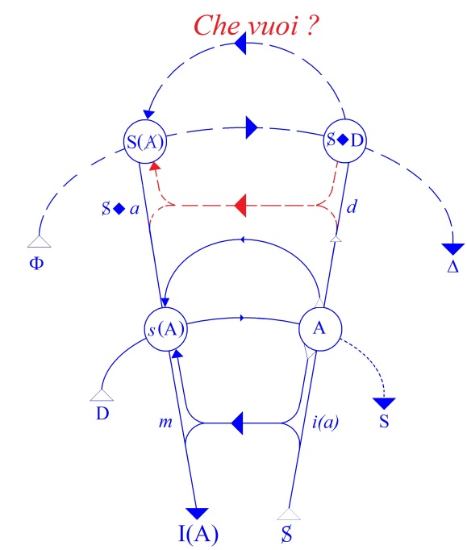
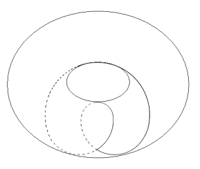
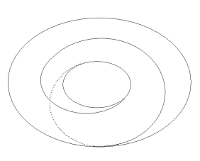
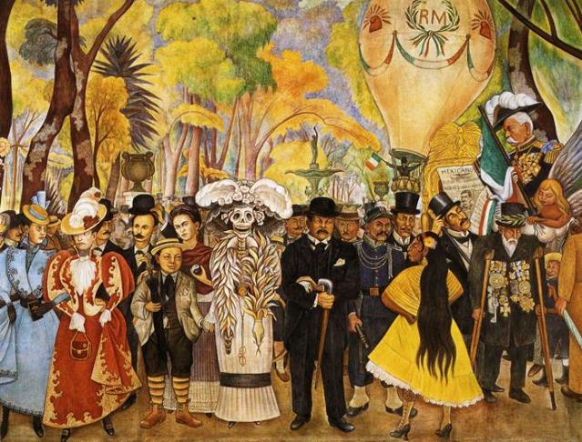

# Leçon 12 | 23 Mars l966

<!-- source-url: http://staferla.free.fr/S13/S13 L'OBJET.docx -->
<!-- seminar: s13 -->
<!-- lesson: 12 -->

<!-- id: s13-12-0001 -->

*J’aimerais que nous ouvrions la fenêtre d’ailleurs, car c’est vrai, je m’aperçois pour la première fois que c’est irrespirable.*

<!-- id: s13-12-0002 -->

*Je vous verrai après Jean-Paul.*

<!-- id: s13-12-0003 -->

Bon, ben je ne sais pas dans quelle ampleur a pu être diffusé ceci, que j’avais fait connaître à qui de droit en posture de le transmettre, à savoir que ce séminaire aujourd’hui était un séminaire ouvert. Peut-être le fait que vous ne remplissez pas pour autant la salle est-il dû autant à la grève qu’à une insuffisante diffusion.

<!-- id: s13-12-0004 -->

J’avais en effet, mon Dieu, assez envie de reprendre contact avec l’ensemble de mon auditoire après cette interruption dont je m’excuse. C’est un manque de ma part, sans doute. Mais enfin, il me fallait bien choisir et faire une fois ce que j’aurai dû faire depuis longtemps, à savoir ce voyage aux U.S.A.

<!-- id: s13-12-0005 -->

Il m’a semblé, et encore tout à l’instant, que vous attendiez, que certains de mes auditeurs attendaient, que je vous en dise quelque chose. J’essaierai donc de satisfaire, au moins en partie, et d’une façon donc improvisée, à ce désir.

<!-- id: s13-12-0006 -->

Avant de le faire, pourtant, je tiendrai à mettre en avant, la *bonne surprise*, qui n’est pas une *entière surprise*, la satisfaction finale que j’ai eue disons, d’une *bonne surprise* que j’avais eue déjà avant mon départ. Pour dire de quoi il s’agit, je vous montrerai tout de suite ce dernier numéro des *Temps Modernes*, l’article de M. Michel TORT[^127], ici présent, paru en deux parties, qui s’appelle : *De l’interprétation ou la machine herméneutique*.

<!-- id: s13-12-0007 -->

Je ne vous en ai pas parlé avant de vous quitter, attendant la fin de cet article, dont je puis dire qu’il m’apporte de grandes satisfactions. Il me semble convenir que porte le nom de TORT celui qui y relève si bien le gant de ma raison.

<!-- id: s13-12-0008 -->

En effet je dirai que, pour qualifier cet article, qui est un véritable ouvrage, je pense qu’il est pour moi d’un grand encouragement de voir de la part de quelqu’un, dont je ne spécifierai pas encore, enfin, la qualité comme telle, de la part de quelqu’un, une mise au point, quelque chose que j’appellerai tout de suite, que je pointerai d’une façon qui pourrait être encore mieux qualifiée, mais enfin je ne trouve pas de meilleur terme que celui de *détournement philosophique*, ou encore, *détournement de pensée*.

<!-- id: s13-12-0009 -->

Quelqu’un[^128] de mon entourage immédiat, avait cru devoir mettre au premier plan - ce n’était pas sans courage - les éléments d’*emprunt*, pas forcément reconnus comme tels, depuis longtemps par l’auteur - des éléments d’*emprunt* à mon enseignement.

<!-- id: s13-12-0010 -->

À quoi il s’était attiré une singulière réponse dont vous pourrez, tout au moins certains, mesurer l’inexactitude en lisant un certain numéro de *Critique*. Le terme de « *plagiat* » - qui n’était pas sous la plume de mon élève - avait été mis en avant dans cette réponse, et non même sans en agiter les arrière-plans juridiques, assurément ce n’est pas là la question.

<!-- id: s13-12-0011 -->

Il y a longtemps que j’ai parlé de cette question de *plagiat* pour souligner qu’à mes yeux, il n’y a pas de propriété intellectuelle.

<!-- id: s13-12-0012 -->

Néanmoins, après avoir été très longtemps non seulement *l’assistant* assidu mais même *le confident* du dessein particulier de mon enseignement à l’endroit de la psychanalyse, s’en servir - et ceci depuis fort longtemps - s’en servir dans des conférences faites en Amérique qui avaient du reste un grand succès, puis dans un ouvrage[^129] à des fins qui sont proprement les fins contraires à celles qui constituent le fondement de la psychanalyse - mon enseignement étant un enseignement qui proprement prétend rétablir l’enseignement de la psychanalyse sur ses bases véritables - c’est cela que je qualifiai à l’instant de « *détournement de pensée* ».

<!-- id: s13-12-0013 -->

Je puis le faire d’autant plus que l’article de M. Michel TORT est précisément la démonstration exacte de cette *opération scandaleuse* qui reflète d’ailleurs le ton général qui à notre époque est celui de ce qu’on appelle plus ou moins vaguement : *philosophie*. C’est bien pour cela que j’hésitais à qualifier M. Michel TORT de philosophe, l’opération à laquelle il se livre n’ayant rien de commun avec ce qui est dans ce domaine et dans ce champ, d’usage.

<!-- id: s13-12-0014 -->

La distinction ferme, rigoureuse, implacable qu’il fait entre ce qu’il en est de l’interprétation psychanalytique et de ce champ vague et mou, que j’ai déjà désigné comme celui proprement de toutes les escroqueries de notre époque, qui s’appelle « *l’herméneutique* », cette distinction une fois fixée, est vraiment le genre d’opération que je puisse le plus souhaiter venant de ceux qui m’écoutent, et qui m’écoutent de façon appropriée, j’entends : en entendant la portée de ce que je dis.

<!-- id: s13-12-0015 -->

L’ouvrage de Monsieur Michel TORT à cet égard, représente une borne, une borne essentielle sur laquelle, vraiment on pourra se fonder pour qualifier ce que j’ai voulu dire concernant ce qu’il en est de l’interprétation psychanalytique.

<!-- id: s13-12-0016 -->

En effet, si vous vous reportez à ce que j’ai avancé à la fin de mon séminaire de l’année dernière, concernant la situation créée par l’avènement de la science, et que cet avènement a été possible dans la mesure où *une position était prise qui usait* *du signifiant, si je puis dire, en lui refusant toute compromission dans les problèmes de la vérité,* si l’on pense :

<!-- id: s13-12-0017 -->

- que par là que cette situation est créée, par quoi *du champ de la vérité* *la question est posée à la science* par chacun de ceux qui se trouvent atteints par cette modification fondamentale : *qu’en est-il de la vérité* ?

<!-- id: s13-12-0018 -->

- Que c’est proprement sur ce *champ de la vérité* effectivement que la religion répond, et qu’est actuellement inéliminable de toute position philosophique de partir de ce fait : de la distinction, de l’opposition radicale de la religion et de la science,

<!-- id: s13-12-0019 -->

- qu’il est impossible qu’il est intenable, comme peut le faire un WHITEHEAD[^130], d’essayer de répartir les domaines de la science et de la religion comme deux domaines distincts d’une *objectivité* qui pourrait avoir quoi que ce soit de commun, que leur différence est très précisément de deux abords essentiellement et radicalement différents de la position du sujet.

<!-- id: s13-12-0020 -->

- Que dès lors il s’avère, que si je dis que *la psychanalyse, c’est proprement l’interprétation des racines signifiantes de ce qui, du destin de l’homme fait la vérité*, il est clair que l’analyse se place sur le même terrain que la religion et est absolument incompatible avec les réponses données dans ce champ par la religion pour la raison propre qu’elle leur apporte une interprétation différente.

<!-- id: s13-12-0021 -->

La psychanalyse, au regard de la religion est dans une position essentiellement démystifiante. Et l’essence de l’interprétation analytique ne peut, d’aucune façon, être mêlée, à quelque niveau que ce soit, de l’interprétation religieuse de ce même *champ de la vérité*. C’est en ce sens que je dirai que M. Michel TORT, en articulant ceci jusqu’au point où ceci rejette dans le même champ à démystifier la presque totalité de la tradition philosophique, dialectique hégélienne comprise, s’est démontré en cette occasion être, ce que je ne peux en fin de compte qualifier que d’un mot, puisqu’il n’y en a pas d’autre à ma portée pour l’instant : *un freudien*. Ceux qui méritent d’être qualifiés de ce terme sont à ma connaissance, proprement à compter sur les doigts.

<!-- id: s13-12-0022 -->

Eh bien, après avoir rendu, cette justice à M. TORT, l’avoir remercié, lui offrir à cette occasion, tout ce qui pourra lui convenir pour adopter son ouvrage dans quoi que ce soit qui puisse être de mon orbe, comme façon de le republier, avoir aussi désigné à l’attention de tous, *et prié chacun de s’y reporter, et je dirai* *ligne par ligne*, eh bien - mon Dieu - j’essaierai de vous dire un peu ce que vous attendez, m’a-t-on dit, à savoir mes impressions de ce court voyage d’Amérique, puisque j’y ai passé vingt-huit jours.

<!-- id: s13-12-0023 -->

Aborder, surtout d’une façon - comme ça - un peu impromptue cette expérience, ce n’est peut-être pas très commode.

<!-- id: s13-12-0024 -->

D’abord parce que, il y a là des conséquences pratiques et des projets dont je ne puis après tout faire état, qu’après en avoir conféré avec mes collaborateurs les plus proches, dont je ne dois la confidence qu’à eux. C’est pourtant bien tout de même sur ce champ de ce que j’ai pu rencontrer là–bas de la réalité, disons, psychiatrique, voire universitaire dans son ensemble, que vous m’attendez. Peut-être même - pourquoi pas ? - m’attendez-vous sur mes… souvenirs de voyage.

<!-- id: s13-12-0025 -->

Prendre contact avec ce qui n’est un nouveau monde après tout que pour moi, puisque j’ai attendu mon âge avancé pour y mettre le pied, ceci suggère peut-être à certains quelque curiosité, je ne vais sûrement pas me mettre à jouer devant vous au KEYSERLING à propos de cette rencontre. Et tout de suite je dirai que la prudence et le respect du réel me commandent, après une traversée aussi courte, surtout de m’abstenir de jugements.

<!-- id: s13-12-0026 -->

Je pense d’ailleurs, foncièrement, et pas de cette date, que le bénéfice à tirer d’un voyage c’est qu’on voit au retour ce qui vous est bien connu, familier, *d’un autre œil*. C’est là, la véritable découverte d’un voyage. Et c’est en ce sens que ce voyage est une grande découverte car je ne sais pas encore jusqu’ou va aller le fait que je vois ici les choses *d’un autre œil*, mais je suis certain qu’à cet endroit, ce voyage ne sera pas sans conséquence. Comment essayer de dire ça ?

<!-- id: s13-12-0027 -->

Mon premier sentiment là-dessus ? Il s’agit dans ce que je vais dire, de *mon* expérience. Vous voyez bien comme je le situe.

<!-- id: s13-12-0028 -->

Il ne s’agit pas *d’un jugement* sur *les États-Unis d’Amérique*. Il s’agit de ce que moi j’y ai vu, et qui tout d’un coup laisse prévoir tout ce que je vais par exemple, à partir de maintenant *laisser tomber dans mon discours*.

<!-- id: s13-12-0029 -->

Tendance, indication… Pas sûr que j’aille aussi loin que je vais le dire. Le départ d’un tel effet, je vais essayer de le résumer en une courte phrase. Il m’a semblé rencontrer *un passé, un passé absolu, compact, un passé à couper au couteau,* *un passé pur, un passé d’autant plus essentiel qu’il n’a jamais existé*, ni à la place où il est pour l’instant installé, ni là d’où il est censé venir, à savoir de chez nous. Évidemment, ceci peut venir peut-être *d’un excès de tourisme*.

<!-- id: s13-12-0030 -->

Le fait qu’à New York j’ai rencontré des églises gothiques et même des cathédrales à tous les coins de rues - je dis à tous les coins de rues, il y a des gens qui y ont été qui peuvent dire que c’est vrai, on ne l’a pas assez souligné et c’est comme ça… Le fait que l’Université de Chicago à laquelle j’ai cru devoir aboutir, mettant ici un terme à la série de six conférences que j’ai faites là-bas… J’y tenais beaucoup parce que Chicago est un endroit qui est élu dans mon histoire. Il s’y est tramé des choses bien intéressantes, celles qui devaient être en principe destinées à me retirer désormais toute possibilité de parole.

<!-- id: s13-12-0031 -->

Je n’étais donc pas du tout mécontent d’aller l’y porter moi-même.

<!-- id: s13-12-0032 -->

À Chicago j’ai vu une Université toute entière - mais une université, là-bas, vous savez, c’est très grand - toute entière construite en *gothique*. Une centaine de bâtiments d’un *gothique*, je dois dire, parfait. Je n’ai jamais vu de plus beau *gothique*, de plus pur gothique. Je peux dire que c’est rudement bien fait. Le faux *gothique* vaut largement le vrai, je vous l’assure !

<!-- id: s13-12-0033 -->

Nous savons que les méthodes universitaires dans tous les pays du monde, restent datées de l’*époque gothique*.

<!-- id: s13-12-0034 -->

La Sorbonne, par exemple, est toujours structurée comme à l’ère de sa naissance qui était à l’*époque gothique.*

<!-- id: s13-12-0035 -->

Elle se distinguait déjà par une *violente, manifeste, opposition* à tout ce qui pouvait se créer de neuf, comme nous le savons à propos de cette condamnation, que je vous ai rappelé récemment, qu’elle a cru devoir porter contre Saint-THOMAS d’AQUIN, qui était un petit audacieux novateur.

<!-- id: s13-12-0036 -->

Quand je parle de la gothicité de l’université, je ne dis pas pour autant qu’elle en soit restée toujours aux mêmes principes, elle a plutôt déchu. À l’époque gothique justement, on maintenait très sévèrement ce principe des *deux vérités* dont je vous parlais tout à l’heure, quand on faisait de la philosophie, c’était pas pour défendre la religion, c’était pour l’en séparer.

<!-- id: s13-12-0037 -->

De nos jours, nous avons procédé à ce *mixin* dont, bien entendu, les résultats s’étendent. Ceci n’est qu’un rappel de ce que je disais tout à l’heure.

<!-- id: s13-12-0038 -->

En tout cas, il y a une chose certaine, c’est que la Sorbonne à l’époque où elle était de *bonne gothicité*, n’était pas construite en gothique, pas tout au moins dans ce gothique parfait de l’université de Chicago. Ceci n’est qu’impressif.

<!-- id: s13-12-0039 -->

Vous avez quand même le même sentiment quand vous voyez entassés dans des musées ces formidables, inimaginables collections d’impressionnistes, qui semblent là comme exilés, comme prisonniers, extraits de cette atmosphère, de cette lumière parisienne de la fin du dernier siècle où ils sont éclos, qui sont visités, dans une sorte d’usage cérémoniel par des hordes de femmes et d’enfants qui défilent, je dois dire à quelque heure de la journée, à quelque jour de la semaine qu’on survienne, devant cette sorte d’éclat incomparable, déchirant, qu’ils prennent de leur accumulation même.

<!-- id: s13-12-0040 -->

Comme si c’était là en effet, le lieu où devait *échouer* le produit, enfin, éclatant, d’un art que nous avons, il faut bien le dire, ici, particulièrement dédaigné - je veux dire au moment où il surgissait - et c’est donc une fois de plus notre passé, là, massif, qui se trouve là-bas, je dirais d’une certaine façon qui a pesé, pesé très lourdement sur quoi que ce soit d’autre qui semblerait après tout, appelé à naître dans une société qui existe depuis assez longtemps pour avoir ses *maîtres propres de culture*.

<!-- id: s13-12-0041 -->

Évidemment, il y a des *petits bourgeons* de temps en temps. Je ne peux pas vous dissimuler la satisfaction que j’ai eue à voir un appartement tout entier meublé de menus échantillons de ces petites poussées comme ça de fièvre créative qui s’est intitulé elle-même de la rubrique du *Pop Art*. C’était un type qui avait fait fortune dans les entreprises de taxi et qui s’était trouvé être effectivement un des premiers à financer, c’est-à-dire à donner par ci par là deux cents dollars à ce groupe jusqu’alors dispersé de gens qui s’étaient lancés dans un certain registre.

<!-- id: s13-12-0042 -->

Je ne veux pas vous décrire ni les principes, ni l’aspect, ni le style, ni… enfin ce qui rayonne de ce *Pop Art*, ce que je veux dire c’est que ce personnage… qui restait là, a entièrement meublé, habillé, son appartement, ses murs, couverts des fruits des œuvres du *Pop Art*, m’a fait un long discours, très boniment, pour m’expliquer comment il avait perçu, aidé, soutenu ce *Pop Art*. J’ai trouvé ça extraordinairement sympathique. Enfin quelque chose me paraissait dans cet art en rapport avec la société qui le soutenait.

<!-- id: s13-12-0043 -->

Malheureusement quand j’ai - sans aucun *sens* particulier *du paradoxe*, car j’avais éprouvé à cette expérience un assez vif plaisir - *j’en ai fait part aux gens très distingués que je rencontrais à New York, j’ai senti une certaine réserve*. On me regardait d’un drôle d’œil.

<!-- id: s13-12-0044 -->

Je veux dire *qu’on se demandait si je ne poussais pas la plaisanterie un peu loin* car le *Pop Art* *pour l’instant*, semble bien - *et déjà* – *rentré dans les dessous*, et même ce qui lui a succédé, à savoir l’*Op* *Art*.

<!-- id: s13-12-0045 -->

Bref, ce que j’appelais tout à l’heure la dominance du passé, je viens de vous l’illustrer - *j’improvise*, je m’excuse, d’être si long - je viens de vous l’illustrer dans *des champs* qui ne sont pas à proprement parler ceux qui nous intéressent mais c’est peut-être que je ne voudrais pas trop en dire, que je voudrais épargner ce qu’après tout, je ne connais qu’imparfaitement et forcément *par des gens qui eux, étaient plutôt aspirants à ce que quelque chose change* de ce que nous appellerons « *le mode d’enseignement de la psychologie* », voire *de la psychologie dans la médecine*, de ce qui était le statut, le mode de vie, les *habitus du psychiatre*.

<!-- id: s13-12-0046 -->

> « *Après tout, c’est extraordinaire* - je prends les termes propres de quelqu’un qui me parlait *- c’est extraordinaire, la facilité de la vie*
>
> *là-bas pour un psychiatre, on n’a vraiment pas besoin,* *me disait-on*, *de se donner de la peine pour avoir de la clientèle*. »

<!-- id: s13-12-0047 -->

Et à partir de là des noms m’ont été cités - qui ne sont pas des moindres - qui sont plutôt capables d’être ceux auxquels je pourrais épingler des propos comme ceux-ci : « *Mon Dieu, pourquoi se poser des questions, et surtout si peu que ce soit «  métaphysiques », alors mon Dieu qu’après tout,* *tout va si bien, qu’on finit son ouvrage à cinq heures et demi, on boit son whisky, on lit un roman, habituellement d’espionnage,* *et qu’on se place devant sa télévision.* »

<!-- id: s13-12-0048 -->

Je ne vois pas pourquoi on *reproche* à ce qui constitue une « *classe sociale* », d’avoir ses commodités, simplement c’est à nous de nous apercevoir de ce que cela peut comporter, bien sûr, d’inertie, d’installation.

<!-- id: s13-12-0049 -->

Eh bien, quelles que soient les apparences, il ne faut pas croire pourtant, que sur ce fond, sur ce fond très particulier qui est peut-être, si je puis dire, *l’envers de ces « gratte-ciels », de cette verticalité monumentale*, qui est d’ailleurs, chose singulière n’est-ce pas, le privilège exclusif des banques. À côté de ça, il y a tout un monde horizontal qui est précisément celui habité par les gens de la classe que j’évoquai à l’instant, à savoir un monde infini, une mer de petites maisons de deux étages, parfaitement imitées du style anglais, dans lesquelles vivent, avec - mon Dieu ! - ce qu’on peut appeler tous les agréments de l’existence, un personnel considérable, qui est précisément celui qui nous intéresse à l’occasion, puisque c’est celui au milieu duquel j’étais appelé à me déplacer en pérégrin ou en pionnier comme vous voudrez.

<!-- id: s13-12-0050 -->

DETROIT où j’ai passé, est une ville de 25 km de large sur l8 km de hauteur ce qui, quand on va chercher un bon restaurant entraîne un temps malgré tout considérable pour la traverser en auto. Encore que le cœur de cette ville soit constitué par un nœud d’autoroutes. À l’intérieur de ce réseau d’auto­routes, vous avez les allées dont je vous parle avec les innombrables petites maisons et toutes celles où j’ai pénétré, bien sûr - étant donné la classe des gens que je voyais - étaient fort bien meublées et plutôt encombrées d’objets d’art empruntés aux pérégrinations à travers le monde qui sont nombreuses, comme vous savez, des personnages intéressés.

<!-- id: s13-12-0051 -->

Tel est pour le style et le complément de ce que j’ai appelé tout à l’heure cette sorte d’inertie passéiste et d’un passé singulier, je reviens là-dessus, car cela m’a suggéré cette forme de question : il y a une dimension du passé qui est à définir comme essentiellement, radicalement, différente de celle qui nous intéresse sous la rubrique de *la répétition*.

<!-- id: s13-12-0052 -->

Le passé dans lequel elle n’intervient à aucun degré - et c’est bien un sentiment de cette sorte que j’ai eu à la rencontre de *cet extraordinaire passé -* c’est que c’est un passé sans aucune sous-jacence - de *répétition*. C’est peut-être ce côté *singulier*, *frappant*, *impressionnant* je vous l’assure, qui m’a donné, tout au moins, disons le sentiment, qui est celui, enfin, d’une pâte absolument impossible à remuer. Car *ce n’est pas dire* pour autant que je n’ai rencontré là-bas de nombreuses occasions de dialogue. Et je dirai que sur les six auditoires que j’ai eus, nommément…

<!-- id: s13-12-0053 -->

- à l’Université de COLUMBIA, dès mon arrivée,

<!-- id: s13-12-0054 -->

- au M.I.T. (Massachusetts Institute of Technology),

<!-- id: s13-12-0055 -->

- à l’Université de HARVARD, (Center for cognitives studies),

<!-- id: s13-12-0056 -->

- à l’Université de DETROIT où j’ai parlé devant le collège des professeurs, après une de ces sortes de cérémonie qui consiste en un déjeuner que l’on prend dans une salle fort confortable - qui se distingue par l’absence de toute boisson vinique dont ce n’est pas le privilège des États-Unis,

<!-- id: s13-12-0057 -->

- à l’Université DAN HARBOUR à quelque 55 km de là, qui est une ville - alors j’ai parlé de l’université de Chicago :

<!-- id: s13-12-0058 -->

> le mot ville était une métaphore pour l’université DAN HARBOUR ce n’en est pas une : la circulation de quelques 30.000 étudiants qui vivent là dans une ville quasiment spécialisée pour les recevoir.

<!-- id: s13-12-0059 -->

- Et enfin à l’Université de CHICAGO, ...le public étant diversement *dosé* selon ces différents endroits :

<!-- id: s13-12-0060 -->

- plus de linguistes et de philosophes,

<!-- id: s13-12-0061 -->

- peu de médecins à COLUMBIA,

<!-- id: s13-12-0062 -->

- mais par contre un public presque entièrement médical à CHICAGO, ceci tenant au fait d’une partie de l’université auxquels s’était adressé mon ami Roman JAKOBSON, à qui je veux maintenant ici rendre hommage pour toute l’entreprise dont il a été à la fois l’initiateur et l’organisateur.

<!-- id: s13-12-0063 -->

Eh bien, je dois dire que sur ces six auditoires, j’ai eu, *en réponse* à ce que j’ai cru devoir articuler, dont je n’aurai peut-être pas le temps de vous donner idée, *en réponse*, les questions - mon Dieu - les plus pertinentes, les plus intéressantes que j’ai eues avec les professeurs de diverses spécialités avec lesquels, grâce a leur accueil, leur charmante hospitalité, j’avais ensuite, tout au long de la journée, ou lors de rencontres, dîners et autres festivités, l’occasion de m’expliquer.

<!-- id: s13-12-0064 -->

J’ai eu le sentiment d’une très grande ouverture à des choses que j’apportai et qui, à leurs oreilles, étaient pourtant, incontestablement, inédites. Je parle ici du milieu universitaire. J’excepte, là comme partout, ce que nous appellerons le milieu « *Highbrow* », la haute *intelligentsia*, localisée, pour moi tout au moins, dans ce que j’ai rencontré à New York.

<!-- id: s13-12-0065 -->

Car à New York mon enseignement est *inédit* peut-être - mais il ne le sera probablement pas toujours - mais il est loin d’être inconnu. Mais comme on vous l’a dit sans doute déjà très souvent, New York n’est pas l’Amérique. À New York on sait parfaitement ce qui se passe ici, et la petite place que j’y tiens n’est pas ignorée.

<!-- id: s13-12-0066 -->

Mais pour revenir à mes contacts avec l’université américaine, mon sentiment - confirmé d’ailleurs par mes interlocuteurs, qui m’ont dit *ce qu’il fallait que j’en attende et que je n’en attende pas* - mon sentiment est que le champ est très large des lieux et des points ou vous pouvez retenir l’attention, nouer des liens, élaborer des contacts qui seront suivis ,enregistrés, publiés.

<!-- id: s13-12-0067 -->

J’ai rapporté quelques échantillons de revues à proprement parler intérieures à des universités et que j’ai même lus en route avec un très vif intérêt car il y a des articles excellents, de toutes sortes et de toutes espèces et on peut dire que *tout est à faire*.

<!-- id: s13-12-0068 -->

On peut dire aussi que *rien n’est à faire* car assurément, avec autant *d’ouverture, d’accueil, voire de succès,* le sentiment, le sentiment au moins actuellement général - je parle parmi mes interlocuteurs, je ne me permettrai pas d’avoir un sentiment moi-même - est qu’en aucun cas on ne changera rien à *l’équilibre* actuellement atteint, qui laisse *très suffisamment de liberté* à chacun *aux entournures* : une personne qui entraîne avec elle un nombre suffisant de collaborateurs, n’est certainement pas empêchée de travailler, et tout s’installe donc dans une juxtaposition de *coexistence vitale* qui semble bien pour l’instant exclure - même si l’on aspire à un renouvellement de style et spécialement dans ce qui nous intéresse, dans ce qui m’intéresse : à savoir le statut de l’enseignement de la psychanalyse - qu’on n’arrivera à rien qui ressemble à un renversement de courant, à un reflux, à un retour de marée, à tout ce que vous voudrez qui ressemble à un changement fondamental.

<!-- id: s13-12-0069 -->

Néanmoins entre ce « *tout à faire* » et ce « *rien à faire* », je crois que mon penchant pour l’instant est assurément - mon Dieu - ne serait-ce qu’à la façon de relever un défi - et puis il y a autre chose dans le monde que les *États-Unis d’Amérique du Nord* - d’y faire quand même au moins quelque chose sous la forme de publication et c’est là ce que je réserverai quant à mon projet, à mes élèves plus proches.

<!-- id: s13-12-0070 -->

Y ajouterais-je en deux mots, le complément, la confidence de ceci : que, au cours de ce petit *travel* qui n’est presque qu’un petit *trip*, je me suis réservé à la fin huit jours, pour mon plaisir personnel et qu’ayant projeté d’abord de le faire dans l’Ouest américain, j’ai changé mon projet, ne pouvant soudain résister à la proximité de ce pays plein de magie, je pense pour certains d’entre vous, qui s’appelle le Mexique, j’y ai été passer *huit jours*.

<!-- id: s13-12-0071 -->

Je ne vous en parlerai pas longuement maintenant. Je n’y ai pas du tout eu là la vie d’un missionnaire.

<!-- id: s13-12-0072 -->

J’ai eu celle d’un touriste, il faut bien le dire, rien de plus. Enfin les choses que j’ai vues m’ont touché, en deux points.

<!-- id: s13-12-0073 -->

C’est qu’on ne peut qu’être très impressionné de voir enfin – quoi ? - quelque chose qui est bien la religion antique, puisque tout à l’heure nous en parlions de religion, de ces *têtes* qui sont toujours là absolument inchangés, le visage, et j’oserai dire le regard de ces Indiens toujours les mêmes - que ce soit ceux qui vous servent à pas discrets dans les couloirs des hôtels ou qui habitent les cabanes encore de chaume au bord des routes - ces Indiens qui ont la même figure exactement, que nous voyons figée dans le basalte ou le granit, ces fragments flottants que nous recueillons de leur art antique, ces Indiens ont là, je ne sais quoi d’un rapport qui persiste avec la seule présence sur les monuments de ce qu’on appelle improprement pictogramme, idéogramme ou autres, désignations impropres de ce que nous pouvons appeler hiéroglyphes, et aussi bien pas toujours déchiffrés, mais dont la reprise par les peintres contemporains ou les architectes…

<!-- id: s13-12-0074 -->

> car à Chicago il y a sur les murs d’une bibliothèque ultra-moderne par exemple,
>
> les quatre façades entières décorées de ce que nous pourrions appeler l’usage d’épaves de ces formes signifiantes …ce qui se véhicule par là me semble quelque chose d’à la fois énigmatique, et en même temps d’aussi impressionnant par cette sorte de lien invisible à travers une cassure irrémédiable qui subsiste, entre les générations qui se lèvent et celles de ces étudiants qui peuplent une université à Mexico - je dirais *la plus énorme* de toutes celles que j’ai vues - avec ces signes, ces signes avec quoi quelque chose est à jamais rompu et qui pourtant sont là, traduisant d’une façon visible, ce que je ne pourrai appeler - parce que je suis devant cet auditoire - qu’un rapport conservé avec ce qu’il y a de si sensible dans tout ce que nous savons de ces cultes antiques, cette chose à quoi n’ont rien compris, sinon par un effet d’horreur, les premiers conquérants, et qui n’est autre…

<!-- id: s13-12-0075 -->

- que partout visible,

<!-- id: s13-12-0076 -->

- partout présente,

<!-- id: s13-12-0077 -->

- partout accrochée, comme en forme de breloque toutes les formes de la divinité qui n’est autre que *l’objet(a)*.

<!-- id: s13-12-0078 -->

Nous aurons sans doute - peut-être ! - à y faire allusion par la suite et peut-être aurais-je l’occasion de vous le donner à titre, enfin, de simple illustration marginale, mais non sans doute, sans portée, à ce que je continuerai de vous en dire.

<!-- id: s13-12-0079 -->

Eh bien, il est inutile au milieu de tout ça de vous signaler ce que je pensais voir s’en esquisser comme conséquence.

<!-- id: s13-12-0080 -->

Je me suis donné un mal énorme, au cours des nombreuses années de mon enseignement, pour faire parvenir à un milieu qui n’était pas spécialement préparé à le recevoir, un certain nombre d’*informations* plus spécialement concernant le champ de *la linguistique*.

<!-- id: s13-12-0081 -->

Vous avez déjà senti depuis longtemps que je peux avoir là-dessus de légères nostalgies, le résultat est que, après quinze ans de cet enseignement, j’ai mis, peut-être un petit peu avant les autres, ce petit milieu qui était celui sur lequel j’opérais, au parfum, au parfum de quelque chose qui maintenant, cavale d’elle-même partout, à tous les carrefours, à tous les coins de rue, voire sous le nom plus ou moins approprié - qu’il sera bientôt absolument, même impossible à nettoyer tellement il va être couvert de ces diverses incrustations de coquillages qui revêtent les épaves - le mot de « *structuralisme* ». C’est que c’est plutôt là qu’il va s’agir de procéder à un *très, très sérieux nettoyage* pour tout de même dire quel est le nôtre de « *structuralisme* ».

<!-- id: s13-12-0082 -->

Cet effort que j’ai pu faire aussi pour rappeler les conditions de naissance et l’évolution de la science dans ce que ça peut avoir pour nous de décisif, de nous concevoir comme déterminés par cela. Il faut bien le dire, j’ai eu *la surprise* aux États-Unis de trouver une grande partie de mon programme, de ce qui est dans mon séminaire, étalé sur des murs d’une dizaine de mètres de long sous forme de petits diagrammes, sur lesquels d’ailleurs personne ne jetait les yeux, qui contenaient absolument d’une façon décisive, les dates, les points tournants et parfaitement bien expliqués dans chaque ligne de la classification des sciences et qui, si je dois le dire… je dois dire que si c’étais là-bas que j’avais à enseigner, m’eussent *épargné bien des peines*. Car en fin de compte, toutes ces choses là sont au niveau du livre de poche.

<!-- id: s13-12-0083 -->

C’est là l’intérêt, l’importance de ce que j’appellerais d’un certain côté, l’évacuation du passé qui est du même coup possible si nous en voyons bien la dimension propre, ce côté d’inertie, on pourrait en laisser la manipulation aux ouvriers de la pelle. Il faut bien le dire, ceci n’est du tout une perspective de *despise*, de mépris. Ce qui apparaît là-dedans au contraire de plus certain, c’est ce que ça dégage concernant notre propre essence. Parce qu’à partir du moment où le passé, à l’état de pur passé, est là-bas existant, local, sous sa forme parfaite, car comme je vous le démontrai tout à l’heure - la peinture de l’université de Chicago - il existe plus parfait qu’il n’a existé.

<!-- id: s13-12-0084 -->

La création impressionniste est là comme une mouche prise dans l’ambre, dans une perfection de statue qu’elle n’a jamais eue ici. Au regard de ce passé *qui est nous* en quelque sorte, dont on nous délivre, il y a tout un côté de nous-mêmes, qui nous en reste, qui est bien *nous* tels que nous sommes actuellement et qui n’en est que le *ratage*. Pour le voir porté à la caricature, c’est encore à Mexico qu’il faut aller et à l’hôtel Del Prado s’installer devant une fresque qui a la taille de cette paroi de notre pièce ici, qui est de Diego RIVERA et qui s’appelle : [*Un rêve de dimanche après-midi sur l’Alameda*](#Rivera).

<!-- id: s13-12-0085 -->

L’*Alameda*, c’est la sorte de *Tuileries* de Mexico et la figure que nous prenons sur ce panneau, je ne vais pas vous le décrire, *procu­rez-vous en des photographies, elle est bien instructive*.

<!-- id: s13-12-0086 -->

<!-- id: s13-12-0087 -->

Voilà donc ce que je crois que nous pouvons apprendre en allant aux États-Unis et aussi bien sur le sol entier de cette noble Amérique, c’est *la figure* de tout ce qui a été manqué, au passé, c’est *la figure* en quelque sorte rétroactive d’une adhérence à quelque chose qui n’a jamais été vécu, et qui comme tel ne peut pas l’être, sous aucune forme, si l’on se laisse aller un peu à quelque mouvement que ce soit qui soit celui de l’espoir, d’une vivacité, d’une création *assurément*.

<!-- id: s13-12-0088 -->

Tout ce qui vous reste d’un pareil contact c’est une impression vraiment écrasante de ce qu’il peut y avoir de lourd à soulever dans notre monde.

<!-- id: s13-12-0089 -->

De quoi leur ai-je parlé ? Il est bien certain que je ne leur ai pas fait à proprement parler un séminaire.

<!-- id: s13-12-0090 -->

Quoique mon enracinement dans un certain style n’étant pas si possible à rompre d’un seul coup, c’est à ce penchant, cette habitude, voire ce besoin que j’ai pris d’une certaine façon de crocher mon audience que je dois - à mon étonnement, je dois dire - de n’avoir pu en aucun cas me résoudre à leur parler en français, et chose curieuse, d’être vraiment arrivé à leur parler en anglais.

<!-- id: s13-12-0091 -->

L’habitude que j’ai de suivre sur vos visages l’effet assez particulier de cette parole, ne m’a pas semblé extrêmement différente de ce que j’éprouvais devant ces auditoires, à savoir que leur visage captif, sinon illuminé me donnait bien le sentiment que quelque chose de cet anglais n’était pas de telle nature qu’ils n’en reçussent pas l’impression d’un langage articulé. Voilà !

<!-- id: s13-12-0092 -->

Alors je leur ai parlé - je vais vous dire ça en deux mots puisqu’on va se quitter dans quelques instants - j’ai un peu centré les choses, parce qu’il fallait bien me faire entendre, sur quelque chose qui m’a paru percutant. Et puis moi, vous comprenez, je suis dans mon *objet(a)*, pour l’instant, j’essaie de vous l’amener comme ça, en route et de vous le faire glisser dans un certain nombre de chaussettes, et d’où il nous doit ressortir de telle ou telle façon. Nous verrons ça, nous reprendrons ça la prochaine fois.

<!-- id: s13-12-0093 -->

Il fallait bien que je retourne aux *bases*. Et après tout, ça m’a permis de les rassembler *ces bases.* Non pas, bien sûr que je les laisse, comme ça, aller à la dérive. Mais enfin pourquoi pas : ça m’a peut-être permis de prendre le module d’un discours plus regroupé, plus simple aussi, plus percutant, encore que *le coup de marteau* ne soit jamais absent de ce que je vous raconte.

<!-- id: s13-12-0094 -->

Peut-être qu’après tout, j’en ferai un petit recueil qui ne sera peut-être pas si mal adapté à des oreilles américaines puisque c’est à des oreilles américaines que je l’ai mesuré.

<!-- id: s13-12-0095 -->

Eh bien, j’ai cru devoir partir de quelque chose qui est tout de même un trait *sensible*, un trait *facile* à faire entendre et qui n’est pas nouveau, bien sûr pour vous, c’est celui de la distinction de *la demande et du désir*. Évidemment en anglais - je me vantais de m’être fait entendre - c’est évidemment avec un vocabulaire et des raffinements syntaxiques plus réduits que j’ai été amené à parler. Il est tout à fait facile de faire entendre à des gens qui vous écoutent, quand on leur demande quelque chose, qu’ils aient à se méfier : *que ce n’est pas toujours ce qu’on vous demande qui est justement ce qu’on désire que vous donniez.*

<!-- id: s13-12-0096 -->

Il suffit d’avoir un petit peu la moindre expérience, il suffit d’avoir une petite amie pour que cette vérité soit immédiatement perceptible et après ça vous pouvez entrer dans *des considérations structurales*. Oui, parce qu’à partir de ce moment-là, bien sûr, vous pouvez montrer que *le désir doit être extrait de la demande*, et qu’il y a ce second temps, que la demande est articulée dans l’inconscient. Il suffit là de faire référence aux vérités que je vous ai *rappelées depuis toujours* et qui consistent simplement à ouvrir les premiers livres de FREUD.

<!-- id: s13-12-0097 -->

<!-- id: s13-12-0098 -->

En fin de compte, il n’est pas impossible, même devant un auditoire américain, d’introduire l’inscription de la formule qui est au coin en haut et à droite de mon graphe à savoir : S◊D (S barré dans son rapport à la demande) à savoir que c’est précisément là que s’accroche la division du sujet.

<!-- id: s13-12-0099 -->

Ce qui est évidemment réintégrer cette *division du sujet* au même plan, au même niveau où FREUD a introduit la division de l’inconscient et du préconscient, supprimer la distance qui sépare ce début de son œuvre, de ce point qui est son point de chute, le *splitting de* ce qu’il appelle *l’ego*, c’est-à-dire le *splitting du sujet,* pour montrer par exemple, à cette occasion, que la remarque que FREUD fait « *que dans l’inconscient ne fonctionne pas le principe de contradiction* », est une remarque qui n’est que de première approche, inadéquate en un sens, si elle va jusqu’à impliquer qu’il n’y ait pas de *signe de négation* dans l’inconscient. Car nous savons tous, et à lire les textes de FREUD lui-même, que la négation a - je ne dis pas dans l’inconscient, ça ne voudrait rien dire, mais dans *les formations de l’inconscient -* des *représentants* tout à fait repérés et clairs.

<!-- id: s13-12-0100 -->

*La prétendue suspension du principe de non contradiction au niveau de l’inconscient, c’est simplement cette fondamentale splitting du sujet.*

<!-- id: s13-12-0101 -->

Il y a quelque chose d’autre que j’ai mis au premier plan de mes discours et qui suit, comme un grain de chapelet suit l’autre, *cet abord par la différence de la demande et du désir, c’est la désignation du point* - qui est le même point de rendez-vous d’où je suis parti tout à l’heure, au reste concernant les rapports du savoir et de la vérité - c’est que ce que FREUD nous apporte, *c’est la désignation du lieu d’incidence d’un désir* particulier et qui est *le point* par où la sexualité entre en jeu comme fondamentale dans le domaine qu’il s’agit de définir et que *ce point* s’appelle *le désir de savoir*.

<!-- id: s13-12-0102 -->

C’est parce que *la sexualité entre en jeu d’abord par le biais du désir de savoir* que le désir dont il s’agit dans la dynamique freudienne est *le désir sexuel*. C’est parce qu’il entre en jeu sous les espèces, que déjà avaient repéré et non sans motif les esprits religieux, c’est parce que la *cupido sciendi* a été située là où il fallait par FREUD que tout est changé dans la dynamique de l’éthique :

<!-- id: s13-12-0103 -->

- que les autres désirs, *le désir de jouissance* et *le désir de domination* s’avèrent n’être pas du même niveau,

<!-- id: s13-12-0104 -->

- que l’un se trouve dans cette position dépendante d’être au niveau du narcissisme,

<!-- id: s13-12-0105 -->

- que l’autre - désir de jouissance - est précisément là pour nous manifester ce que j’appellerai la duplicité du désir.

<!-- id: s13-12-0106 -->

Car loin que *le désir* soit *désir de jouissance*, il est précisément la barrière qui vous maintient à la distance plus ou moins justement calculée de *ce foyer brûlant*, de ce qui est essentiellement à éviter pour le sujet pensant, qui s’appelle *la jouissance*.

<!-- id: s13-12-0107 -->

Irais-je jusqu’à vous dire que j’ai amorcé pour eux ce qui sera le pas suivant de ce que je vais avoir à exposer devant vous.

<!-- id: s13-12-0108 -->

À savoir, tenant compte de ceci dont bien sûr je n’ai pu que parler dès l’abord, à savoir du lieu de l’Autre, point de position de *la vérité*, comme lieu où est mise en question *la vérité de la demande*, comme lieu aussi où apparaît et surgit du même coup la dimension du *désir*, j’ai pu amorcer ce qui - je viens de vous le dire - va être la suite de mon discours et qui consiste à préciser ceci : que le désir, ce désir dont d’abord je vous ai articulé le lieu disant que le désir c’est d’abord le désir de l’Autre, *la topologie* va nous apprendre à mettre en fonction *cette sorte de retournement* qui est proprement celui que j’essaierai de vous manifester au niveau que je vous montrais, tels qu’ils sont, tel qu’il est faisable - *comme on retourne un gant* - au niveau de *la structure du tore *: que si le désir est à repérer, à mesurer en fonction d’une demande de l’Autre, ce que *la structure* va nous permettre de voir, la structure qui est *la structure du tore,* c’est qu’il y a un *fondement structural* parfaitement…

<!-- id: s13-12-0109 -->

> je minimise en disant qu’il est *illustré* par *la structure du tore *: il est soutenu par *la structure du tore*, *le tore est la substance,*
>
> *l’* ὑποχείμενον \[upokeimenon\] *de la structure* dont il s’agit concernant le désir, le *tore* peut apparaître, avec évidence, c’est ce que je vous montrerai à bout de craie la prochaine fois …que s’y inscrit de la façon la plus claire *le rapport* qu’il y a du soutien d’un désir, non pas à la demande mais à la demande répétée ou à *la double demande*. Et le fait que cette figure, qui est proprement celle que je vous dessine ici :

<!-- id: s13-12-0110 -->

<!-- id: s13-12-0111 -->

2 D + d le retournement de la structure du tore peut manifester, matérialiser sous vos yeux ce qui s’en peut obtenir…

<!-- id: s13-12-0112 -->

> et nous verrons ce que signifie retournement en fonction de ce qu’il arrive du retournement
>
> quand il s’agit des autres *structures topologiques* à savoir du *cross-cap* et de *la bouteille* *de Klein* …ce retournement étant opéré, nous avons *deux désirs* en rapport avec *une demande*.

<!-- id: s13-12-0113 -->

<!-- id: s13-12-0114 -->

2d + D

<!-- id: s13-12-0115 -->

Cette duplicité du désir par rapport à la demande est à la racine de tout ce qui, dans le champ analytique s’étend aussi loin que ce qu’on appelle confusément ambivalence et qui peut seule trouver là sa raison. C’est ce que la prochaine fois, j’aurais l’occasion de vous développer d’une façon plus ample. Et vous voyez d’ores et déjà que ce dont il s’agit c’est de la fonction d’une coupure, que dans ces trois formes que j’aurai à reprendre sous cet angle, c’est la même forme de coupure, à savoir ce que j’ai appelé l’S ou *le huit inversé* qui nous en donne la clé et la forme, et qu’il y a des fonctions différentes.

<!-- id: s13-12-0116 -->

Bref, pour conclure et dire ce que j’essayais avant tout de faire passer aux oreilles de mon auditoire aux Amériques, c’est qu’il est un domaine isolable, dans le champ appelé jusqu’ici psychologique, qui est le domaine de ce qui est déterminable comme champ du langage et effet dans ce champ de ce qui est la parole, que ceci est définissable : c’est *la fonction du sujet*. *Fonction du sujet qui n’est pas*, comme j’ai pu le voir écrit récemment, *fonction d’absence* *mais fonction au contraire de la présence intense de* *quelque chose de caché*.

<!-- id: s13-12-0117 -->

Ce qui est ce qui nous ramène au fondement freudien de l’inconscient et ce qui est ce sur quoi je vous quitterai aujourd’hui en vous donnant rendez-vous pour le séminaire ouvert de la semaine prochaine.

<!-- id: s13-12-0118 -->

[Diego RIVERA](#RetourRiveraAlameda)

<!-- id: s13-12-0119 -->

<!-- id: s13-12-0120 -->

## Notes

[^127]: *De l'interprétation ou la machine herméneutique*, Les Temps Modernes, n° 237, fév. 1966 et n° 238, mars 66 .

[^128]: Jean-Paul Valabrega : « *Comment survivre à Freud* ? », Critique, n° 224, janvier 1966, p. 68.

[^129]: Paul Ricœur : *De l'interprétation*, Paris, Seuil, 1965.

[^130]: Alfred North Whitehead : *La science et le monde moderne*, éd. du Rocher, 1994, Coll. L’esprit et la matière.
