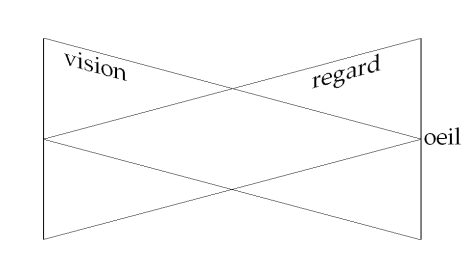
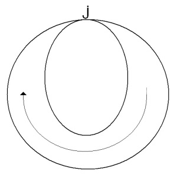
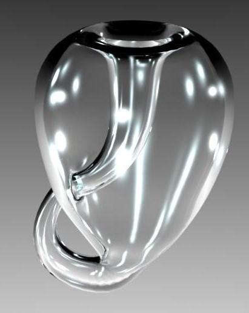

# Leçon 15 | 27 Avril l966

<!-- source-url: http://staferla.free.fr/S13/S13 L'OBJET.docx -->
<!-- seminar: s13 -->
<!-- lesson: 15 -->

<!-- id: s13-15-0001 -->

[DRAZIEN](#Melledrazien) [LACAN](#Lacan3)

<!-- id: s13-15-0002 -->

LACAN

<!-- id: s13-15-0003 -->

Bon. « *Inter*... » comme on dit. « *Inter*... » en latin - c’est Saint AUGUSTIN qui commence comme ça, une sorte d’énoncé qui a fini par s’éroder à force de courir - « *Inter urinas et faeces nascimur* [^146] ». C’était un délicat. Cette remarque qui en elle-même ne semblerait pas comporter de conséquences infinies, puisqu’aussi bien on en est né de ce *périnée*, il faut quand même bien dire que, on court après. Il est certain que si Saint AUGUSTIN avait des raisons de s’en souvenir, c’était pour d’*autres raisons*, pour d’autres raisons qui nous intéressent tous, en ce sens que ce n’est pas à titre de vivant, de corps, que nous naissons « *Inter urinas et faeces*... », mais à titre de *sujet*.

<!-- id: s13-15-0004 -->

C’est bien pour ça, que ça ne se limite pas à être un mauvais souvenir, mais à être quelque chose qui, au moins pour nous qui sommes là, nous sollicite présentement cette année de nous *intéresser vivement* aux *objets(a)* dont il se trouve qu’au moins l’un d’entre eux se trouve en connexion avec ces environs. Au moins l’un d’entre eux et même deux, le deuxième - *à savoir le pénis* - se trouvant occuper, dans cette détermination du sujet, une place tout à fait fondamentale.

<!-- id: s13-15-0005 -->

La façon dont FREUD articule ce nœud a introduit une grande nouveauté quant à la nature du sujet. Il est particulièrement opportun de se le rappeler quand la nécessité de l’avènement de ce sujet nous la fait venir d’un tout autre côté, à savoir du « *Je pense* ». Et vous devez bien sentir que si je prends tellement de soin de l’articuler à partir du « *Je pense* », c’est bien sûr pour vous ramener au terrain freudien qui vous permettra de concevoir pourquoi c’est le sujet que nous saisissons dans sa pureté au niveau du « *Je pense* » à cette connexion étroite avec deux *objets(a)* si incongrûment situés.

<!-- id: s13-15-0006 -->

Il faut dire d’ailleurs, que nous qui ne sommes pas de parti–pris, nous n’avons pas de visée spéciale vers l’humiliation de l’homme, nous nous apercevrons qu’il y a deux autres *objets(a)* – *chose curieuse* – restés, même dans la théorie freudienne, à demi dans l’ombre, encore qu’ils y jouent leur rôle d’instance active, à savoir : *le regard* et *la voix*. Je pense que la prochaine fois, je reviendrai sur le regard. J’ai fait deux, et même trois, célèbres séminaires, comme on dit, dans la première année de mes conférences ici[^147], où j’ai tenté pour vous de vous faire sentir la dimension où s’inscrit cet objet qu’on appelle *le regard*.

<!-- id: s13-15-0007 -->

Certains d’entre vous s’en souviennent sûrement. Ceux qui viennent depuis longtemps à mon séminaire ne peuvent pas en avoir laissé passer l’importance. Et puisque j’aurai l’occasion, je pense, la prochaine fois d’y mettre tout l’accent, je voudrais dès aujourd’hui, à ceux qui représentent le bataillon sacré de mon assistance, à savoir vous autres, de vous recommander d’ici-là - parce que ça rendra beaucoup plus intelligible les références que j’y ferai - ce qui est paru, dans le très brillant bouquin qui vient de sortir de notre ami Michel FOUCAULT , ce qui est paru dans *le premier chapitre* de ce livre, sous le titre : *les suivantes*, chapitre I du livre de Michel FOUCAULT[^148] intitulé, pour ceux qui sont aujourd’hui durs de l’oreille, in-ti-tu-lé : *Les mots et les choses*. C’est un beau titre.

<!-- id: s13-15-0008 -->

De toute façon, ce livre ne vous décevra pas et en vous recommandant la lecture du premier chapitre, je suis en tout cas bien sûr de ne pas le desservir, car il suffira que vous ayez lu ce premier chapitre pour voracement vous jeter sur tous les autres.

<!-- id: s13-15-0009 -->

Néanmoins j’aimerais qu’au moins un certain nombre d’entre vous aient lu ce premier chapitre d’ici la prochaine fois parce qu’il est diffi­cile de n’y pas voir inscrit - en une description extraordinairement élégante - ce qui est précisément cette double dimension que, si vous vous souvenez, j’avais représentée autrefois par deux triangles opposés : celui de la vision avec, ici, cet objet idéal qu’on appelle l’œil et qui est censé constituer le sommet du plan de la vision, et ce qui dans le sens inverse s’inscrit sous la forme du regard.

<!-- id: s13-15-0010 -->

<!-- id: s13-15-0011 -->

Quand vous aurez lu ce chapitre vous pourrez… vous serez beaucoup plus à l’aise pour entendre ce que j’y donnerais la prochaine fois comme suite. Autre petite lecture, genre distraction, pour lire sous la douche, comme on dit, il y a un excellent petit livre qui vient de paraître sous le titre *Paradoxes de la conscience*[^149], rédigé par quelqu’un que nous estimons tous \- j’imagine - parce que nous avons tous ouvert, à quelque moment, quelques-uns de ses livres, nourris de la plus grande érudition scientifique, qui s’appelle Monsieur RUYER…

<!-- id: s13-15-0012 -->

> on prononce Ruyère paraît-il, Raymond RUYER, professeur à la Faculté des lettres de Nancy …Monsieur RUYER, qui dans cette retraite provinciale poursuit depuis de longues années, un travail d’élaboration extraordinairement important du point de vue épistémologique, vous donne là une sorte de recueil d’anecdotes qui, je dirai, a à mes yeux une valeur cathartique tout à fait extraordinaire : celle de réduire en effet ce qu’on peut appeler *les paradoxes de la conscience* à la forme *d’une sorte d’Almanach Vermot* - ce qui est tout de même assez intéressant - je veux dire, les met à leur place, à leur place en somme de « *bonnes histoires* ».

<!-- id: s13-15-0013 -->

Il semblerait que depuis un bon moment les paradoxes qui nous attirent doivent être autre chose que des paradoxes de la conscience. Bref, sous cette rubrique, vous verrez résumés toutes sortes de paradoxes dont certains *extrêmement importants*, justement en ceci qu’ils ne sont pas des paradoxes de la conscience mais quand on les réduit au niveau de la conscience, ils ne signifient plus rien que des futilités. C’est une lecture extrêmement salubre et il semble qu’une bonne part du *programme de philosophie* devrait être mis définitivement hors du champ de l’enseignement après ce livre qui montre l’exacte portée d’un certain nombre de problèmes qui n’en sont pas. Que pourrais-je vous recommander encore ?

<!-- id: s13-15-0014 -->

Il y a dans les deux derniers numéros d’*Esprit* un commentaire par quelqu’un qu’on m’affirme être *un révérend père dominicain* et qui signe Jacques-M. POHIER[^150] et qui se consacre à l’examen d’un livre[^151] auquel on a fait beaucoup d’allusions ici et auquel M. TORT a donné sa sanction définitive. Il reste néanmoins qu’il y a *d’autres points de vue pour l’aborder*, et que le point de vue du religieux n’est pas du tout à négliger, et je vous prie de lire cet article. Vous y verrez la façon dont mon enseignement peut être utilisé à l’occasion, dans une perspective religieuse quand on le fait honnêtement. Ce sera un heureux contraste avec l’usage, qu’on en a fait précisément dans l’autre livre que je ne désigne ici que d’une façon indirecte.

<!-- id: s13-15-0015 -->

Que vous conseiller encore ? Ben, mon Dieu, je crois que c’est là toutes mes petites ressources.

<!-- id: s13-15-0016 -->

Tout de même, vous allez voir qu’aujourd’hui nous allons mettre à l’ordre du jour l’examen d’un article de JONES.

<!-- id: s13-15-0017 -->

Car l’intérêt de *ces séminaires fermés*, c’est de nous livrer à des travaux d’étude et de commentaire pour autant qu’ils peuvent fournir matériau, référence et aussi quelquefois initiation de méthode à notre recherche et cet article de JONES que nous allons voir aujourd’hui, qui s’appelle : *Développement précoce de la sexualité féminine* [^152] et qui est paru en l927, je vous signale, je vous signale parce que JONES a commis deux autres articles[^153], aussi importants que celui-ci, et que le second comme ce premier…

<!-- id: s13-15-0018 -->

> non pas le troisième mais après tout on peut s’en passer …*ont été traduits* - ça m’a été rappelé d’une façon qui m’a paru assez heureuse, car je l’avais complètement oublié - *ont été traduits* dans le *n°* 7 de *La psychanalyse* consacré à la sexualité féminine, numéros qui ne sont peut–être pas épuisés, de sorte que - mon Dieu - pour ceux d’entre vous, qui n’ont pas une trop grande *familiarité* avec la langue anglaise, ceci vous facilitera - rétrospectivement, je pense, pour ceux qui n’ont pas encore lu le premier article - de bien saisir ce que nous arriverons à dire aujourd’hui sur cet article, et lisant l’autre, d’y trouver l’amorce de travaux futurs que j’espère…

<!-- id: s13-15-0019 -->

Puisque j’espère que j’obtiendrai autant de bonne volonté pour les prochains séminaires fermés que j’en ai obtenu pour celui-ci, en m’y prenant d’une façon un peu à court terme qui mérite d’être soulignée ici pour introduire les personnes qui ont bien voulu, sur ma demande, s’y dévouer.

<!-- id: s13-15-0020 -->

Vous y trouverez - en outre - dans ce numéro sur la sexualité féminine \[n°7 de *La psychanalyse*\], sous le titre de

<!-- id: s13-15-0021 -->

« *La féminité en tant que mascarade »* [^154] - qui est exactement la traduction du titre anglais - un *excellent* article, d’une *excellente* psychanalyste, qui s’appelle Madame Joan RIVIÈRE, qui a toujours pris les positions les plus pertinentes sur tous les sujets de la psychanalyse et tout à fait *spécialement*, je vous le dis en passant, sur le sujet de la psychanalyse d’enfant. Vous voyez que vous ne manquez pas d’objet de travail, le plus pressé étant de lire Michel FOUCAULT pour la prochaine fois.

<!-- id: s13-15-0022 -->

Alors, comme je tiens beaucoup à cette collaboration *from the floor*, comme on dit, d’un séminaire fermé, je vais donner la parole tout de suite à Melle Muriel DRAZIEN qui a bien voulu faire à votre usage une sorte de présentation, d’introduction de cet article de JONES qui s’appelle *Développement précoce*, ou *Premier développement*, comme il vous conviendra, *de la sexualité féminine*[^155].

<!-- id: s13-15-0023 -->

Vous allez voir d’abord de quoi il retourne, et j’espère que j’arriverai à vous montrer l’usage que j’entends en faire.

<!-- id: s13-15-0024 -->

[Muriel DRAZIEN](#Avril_27_1966)

<!-- id: s13-15-0025 -->

\[écrit au tableau : *unseen man, unseeing man*\]

<!-- id: s13-15-0026 -->

C’est un terme, *unseen man*, qui est présent dans le texte original de JONES et qui est traduit en français très exactement, mais qui, forcément, manque un petit peu de… piquant.

<!-- id: s13-15-0027 -->

- *Qu’y a-t-il chez la femme, qui corresponde à la crainte de castration chez l’homme ?*

<!-- id: s13-15-0028 -->

- *Qu’est-ce qui différencie le développement de la femme homosexuelle de celui de la femme hétérosexuelle ?* \[*La psychanalyse*, n° 7, p.240\]

<!-- id: s13-15-0029 -->

Voilà les deux questions qu’Ernest JONES se pose, et que son article « *Early development of female sexuality »* paru dans *The International Journal of Psychoanalysis* en l927, vise à élucider.

<!-- id: s13-15-0030 -->

Très vite, dans le fait de cerner la première question, JONES centre le problème autour du concept de castration et c’est en ce point qu’il s’arrête pour essayer d’élaborer un concept plus concret et plus satisfaisant au déroulement d’un certain fil conducteur de cet article qui est annoncé dès le premier paragraphe. C’est là que JONES évoque :

<!-- id: s13-15-0031 -->

- des notions de *mystification* et de préjugés chez les auteurs écrivant au sujet de la sexualité féminine,

<!-- id: s13-15-0032 -->

- que les analystes diminuaient l’importance de l’organe génital féminin et avaient donc adopté une « *position phallo-centrique* », comme il dit à propos de ces questions. \[*La psychanalyse*, n° 7, p.239\]

<!-- id: s13-15-0033 -->

Que ces fils conducteurs soient pour JONES l’occasion de remettre en question tout le concept de *castration*, en faisant jaillir ces points où il est lui-même insatisfait de la formulation donnée alors de ce concept, n’empêchera pas que JONES *s’y prend* lui-même dans ce fil, aux divers moments où il parle de la réalité biologique comme fondamentale :

<!-- id: s13-15-0034 -->

- Quand il souligne « *le rôle primordial de l’organe sexuel mâle* » : « *The all important part normally played in male sexuality by the genital organ*… ». \[p.241\]

<!-- id: s13-15-0035 -->

- Quand il parle de la menace partielle que représente la castration : « *La castration n’est qu’une menace partielle,*

<!-- id: s13-15-0036 -->

> *si importante soit-elle, de la perte de capacité à l’acte sexuel et du plaisir sexuel* ». \[*La psychanalyse*, n° 7, p.241\]

<!-- id: s13-15-0037 -->

- Quand il fait remarquer que la femme est sous une dépendance étroite à l’égard de l’homme en ce qui concerne sa gratification : « *Pour des raisons physiologiques évidentes, la femme est beaucoup plus dépendante à l’égard de son partenaire pour sa gratification que l’homme, à l’égard du sien. Vénus a eu beaucoup plus d’ennui avec Adonis que Pluton n’en a eu avec Perséphone* ».

<!-- id: s13-15-0038 -->

- Enfin quand il précise ce qui est pour lui la condition même de la sexualité normale : « *Pour ces deux cas* (en parlant des inversions) *la situation primordialement difficile, c’est l’union, simple mais fondamentale, entre pénis et vagin.* »

<!-- id: s13-15-0039 -->

Le *parti-pris inconscient*, comme l’appela Karen HORNEY, a contribué, nous dit JONES, à considérer *les questions* touchant la sexualité beaucoup trop *du point de vue masculin* et à donc jeter dans une position de méconnu ce qu’il appelle les « *conflits fondamentaux* » :

<!-- id: s13-15-0040 -->

> « *En essayant de répondre à cette question, c’est-à-dire de rendre compte du fait que les femmes souffrent de cette terreur au moins autant que les hommes - j’en vins à la conclusion que le concept de « castration » a, par certains côtés, entravé notre appréciation des conflits fondamentaux.* » \[*La psychanalyse*, n° 7, p.240\]

<!-- id: s13-15-0041 -->

Le concept, incontestablement plus général et plus abstrait auquel JONES aboutit est celui d’*aphanisis*.

<!-- id: s13-15-0042 -->

Cet *aphanisis* sera la disparition totale, irrévocable, de toute capacité à l’acte sexuel ou au plaisir de cet acte.

<!-- id: s13-15-0043 -->

Ce serait donc la crainte - *dread* en anglais, qui est encore plus - la crainte de cette situation qui est commune aux deux sexes.

<!-- id: s13-15-0044 -->

À propos d’*aphanisis*, nous avons pensé que ce terme ne pouvait correspondre, au niveau clinique à rien d’autre que *la disparition du désir tel que nous l’entendons*. À ce moment-là, *la crainte d’aphanisis se traduirait par la crainte de la disparition du désir* ce qui nous paraît l’envers d’une de ces médailles : ou bien *désir de ne pas perdre le désir*, ou bien *désir de ne pas désirer*.

<!-- id: s13-15-0045 -->

En tout cas JONES *n’ira pas plus loin* dans le développement de ce concept qu’il applique à ces fins utiles, et nous pouvons supposer qu’il ne suffisait pas, ni à lui-même, ni à une formulation plus rigoureuse de ce que représente la castration féminine.

<!-- id: s13-15-0046 -->

Nous suivons JONES jusqu’à la deuxième question maintenant, qu’il aborde par un aperçu du développement normal de la fille, le stade oral, le stade anal, l’identification à la mère, au stade « *bouche-anus-vagin* », suivi bientôt, comme il dit, par l’envie du pénis. En précisant la distinction : d’envie de pénis « *pré* » et *post-œdipienne*, ou *auto* et *allo-érotique*, JONES rappelle la fonction dans la régression comme défense contre une privation à ce dernier stade, privation à ne jamais partager un pénis avec son père dans le coït, ce qui renverrait la petite fille à sa première *envie de pénis*, c’est-à-dire d’avoir son propre pénis à elle.

<!-- id: s13-15-0047 -->

C’est à ce moment que la fillette doit choisir, point de bifurcation entre son attachement incestueux au père et sa propre féminité. Elle doit renoncer :

<!-- id: s13-15-0048 -->

- ou bien à son objet,

<!-- id: s13-15-0049 -->

- ou bien à son sexe, souligne JONES.

<!-- id: s13-15-0050 -->

Il lui est impossible de garder les deux. Je crois que ça mérite à ce moment-là, de vous lire le paragraphe où il précise : « *Il n’existe que deux possibilités d’expression de la libido dans cette situation, et ces deux voies peuvent être empruntées l’une et l’autre.*

<!-- id: s13-15-0051 -->

> *La fille doit choisir, grosso modo, entre abandonner son attachement érotique au père et l’abandon de sa féminité, c’est-à-dire*
>
> *son identification anale à la mère. Elle doit changer d’objet ou de désir ; il lui est impossible de garder les deux. Elle doit renoncer*
>
> *soit au père, soit au vagin (y compris les vagins prégénitaux). Dans le premier cas les désirs féminins s’épanouissent à un niveau adulte - c’est-à-dire charme érotique diffus, (narcissisme), attitude vaginale positive envers le coït, culminant dans la grossesse et l’accouchement -*
>
> *et sont transférés à des objets plus accessibles. Dans le second cas le lien avec le père est conservé, mais cette relation d’objet*
>
> *est transformée en identification - c’est-à-dire en complexe du pénis.* » \[*La psychanalyse*, n° 7, p.247\]

<!-- id: s13-15-0052 -->

Les filles qui « *renoncent à l’objet* » poursuivent un développement normal.

<!-- id: s13-15-0053 -->

Tandis que dans *le deuxième cas* où *le sujet abandonne son sexe*, *le non-abandon de l’objet se transforme en identification* et c’est celui-ci le cas de l’homosexuelle.

<!-- id: s13-15-0054 -->

« *La divergence mentionnée - qui, est-t-il besoin de le dire, est toujours une question de degré - entre celles qui renoncent à leur libido* *d’objet (le père) et celles qui renoncent à leur libido de sujet (le sexe), se retrouve dans le champ de l’homosexualité féminine.* » \[p.249\]

<!-- id: s13-15-0055 -->

Donc JONES opère une division à l’intérieur du groupe homosexuel :

<!-- id: s13-15-0056 -->

> « *On peut y distinguer deux grands groupes*. *Primo : les femmes qui conservent leur intérêt pour les hommes mais qui ont à cœur*
>
> *de se faire accepter par les hommes comme étant des leurs. À ce groupe appartient un certain type de femmes qui se plaignent sans cesse*
>
> *de l’injustice du sort de la femme et du mauvais traitement des hommes à leur égard. Secundo : celles qui n’ont que peu ou pas d’intérêt*
>
> *pour les hommes, mais dont la libido est centrée sur les femmes. L’analyse montre que cet intérêt pour les femmes est un moyen*
>
> *substitutif de jouir de la féminité. Elles utilisent simplement d’autres femmes pour l’exhiber à leur place.* » \[*La psychanalyse*, n° 7, p.249\]

<!-- id: s13-15-0057 -->

C’est nous qui soulignons maintenant que par la première division que JONES opère, ce sont dans ces *deux sous-groupes* d’homosexuelles, toutes des femmes ayant choisi de garder leur objet : le père, et de renoncer à leur sexe.

<!-- id: s13-15-0058 -->

C’est ici qu’il faut suivre attentivement l’exposé de JONES pour voir ce qui se passe : « *Il est facile de voir que le premier groupe ainsi décrit recouvre le mode spécifique des sujets qui avaient préféré abandonner leur sexe,* *tandis que le deuxième groupe correspond aux sujets ayant abandonné l’objet (le père) et se substitue à lui par identification.* » \[p.249\]

<!-- id: s13-15-0059 -->

Alors, je répète : « ...*tandis que le deuxième groupe correspond au sujet ayant abandonné l’objet (le père)... »*

<!-- id: s13-15-0060 -->

> *« Les femmes appartenant au second groupe s’identifient aussi, avec l’objet d’amour, mais cet objet perd alors tout intérêt pour elles ;*
>
> *leur relation d’objet externe à l’autre femme est très imparfaite car elle ne représente dès lors que leur propre féminité au moyen*
>
> *de l’identification et leur but est d’en obtenir par substitution la gratification de la part d’un homme qui leur reste invisible*
>
> *(le père incorporé en elles).* » \[*La psychanalyse*, n° 7, p.249\]

<!-- id: s13-15-0061 -->

Et voilà l’homme qui leur reste invisible : *unseen man*.

<!-- id: s13-15-0062 -->

D’après ces descriptions, on ne peut que remarquer que cet intérêt pour les femmes, en quelque sorte fuyant, semble porter sur un attribut, sans qu’il y ait de véritable relation d’objet.

<!-- id: s13-15-0063 -->

Que pourrait-on y comprendre s’il s’agit là d’une identification double :

<!-- id: s13-15-0064 -->

- d’une part au père,

<!-- id: s13-15-0065 -->

- d’autre part à l’amante ?

<!-- id: s13-15-0066 -->

Nous proposons qu’il s’agit dans cet exemple d’une *opération symbolique *:

<!-- id: s13-15-0067 -->

- *Premièrement* : *que l’amante est le symbole de la féminité perdue* plutôt que la féminité à laquelle le sujet aurait renoncé.

<!-- id: s13-15-0068 -->

- *Deuxièmement* : cet homme qui lui est *invisible*, *the unseen man*...

<!-- id: s13-15-0069 -->

> ce qui ne veut pas dire *the unseeing man*
>
> *...*le père ou plutôt *ce qui de lui voit, ce qui de lui est seeing, l’œil*
>
> symbole déjà évoqué par JONES dans sa *théorie du symbolisme* et précisé par lui en ce lieu *comme phallique*
>
> *…* est le véritable objet car *sa présence* est nécessaire, voire indispensable à l’accomplissement du rite destiné à rendre au père ce qu’il n’a pas donné.

<!-- id: s13-15-0070 -->

Pour vous laisser une image très saisissante de ce type de relation, je voudrais vous lire un épisode qui est vu par *le narrateur : Marcel*, dans *Du côté de chez Swann*, dans un moment où lui, par le hasard si on veut, est aussi *unseen* d’ailleurs, c’est-à-dire il s’est caché, il est caché par les circonstances et la scène se déroule devant lui sans qu’on sache qu’il est là.

<!-- id: s13-15-0071 -->

Évidemment, toute la scène est intéressante. Je vous rapporte simplement quelques lignes :

<!-- id: s13-15-0072 -->

> « *Dans l’échancrure de son corsage de crêpe Melle Vinteuil sentit que son amie piquait un baiser. Elle poussa un petit cri, s’échappa, et elles se poursuivirent en sautant, faisant voleter leurs larges manches comme des ailes et gloussant et piaillant comme des oiseaux amoureux. Puis Melle Vinteuil finit par tomber sur le canapé, couverte par le corps de son amie. Mais celle-ci tournait le dos à la petite table sur laquelle était placé le portrait de l’ancien professeur de piano.* »

<!-- id: s13-15-0073 -->

LACAN - qui est son père...

<!-- id: s13-15-0074 -->

Muriel DRAZIEN

<!-- id: s13-15-0075 -->

> « *Melle Vinteuil comprit que son amie ne le verrait pas si elle n’attirait pas sur lui son attention et elle lui dit, comme si elle venait seulement de le remarquer :*
>
> * – Oh, ce portrait de mon père qui nous regarde. Je ne sais pas qui a pu le mettre là ?*
>
> *J’ai pourtant dit vingt fois que ce n’était pas sa place. »*
>
> *Je me souviens que c’était les mots que M. Vinteuil avait dits à mon père à propos du morceau de musique. Ce portrait leur servait*
>
> *sans doute habituellement pour des profanations rituelles car son amie lui répondit par ces paroles qui devaient faire partie*
>
> *de ses réponses liturgiques :*
>
> *– Mais laisse le donc où il est, il n’est plus là pour nous embêter. Crois-tu qu’il pleurnicherait et qu’il voudrait te mettre ton manteau s’il te voyait là, la fenêtre ouverte, le vilain singe. »*
>
> *Melle Vinteuil répondit par des paroles de doux reproche :  « Voyons, voyons.* » ... \[M. Proust : *Du coté de chez Swann*, Pléiade, 1954, p. 162\]

<!-- id: s13-15-0076 -->

Et plus loin :

<!-- id: s13-15-0077 -->

> « *Mais elle ne put résister à l’attrait du plaisir qu’elle éprouverait à être traitée avec douceur par une personne si implacable envers*
>
> *un mort sans défense ; elle sauta sur les genoux de son amie et lui tendit chastement son front à baiser comme elle aurait pu faire*
>
> *si elle avait été sa fille, sentant avec délices qu’elles allaient ainsi toutes deux au bout de la cruauté en ravissant à M. Vinteuil,*
>
> *jusque dans le tombeau, sa paternité.* » \[p. 162-163\]

<!-- id: s13-15-0078 -->

Et plus loin (c’est le narrateur qui parle) :

<!-- id: s13-15-0079 -->

> « ...*je savais maintenant, pour toutes les souffrances que pendant sa vie M. Vinteuil avait supportées à cause de sa fille,*
>
> *ce qu’après la mort il avait reçu d’elle en salaire.* » \[p. 163\]

<!-- id: s13-15-0080 -->

[LACAN](#Avril_27_1966)

<!-- id: s13-15-0081 -->

Merci Mademoiselle.

<!-- id: s13-15-0082 -->

Bon. Mademoiselle DRAZIEN, en somme, vous a donné une introduction, une introduction ma foi rapide.

<!-- id: s13-15-0083 -->

Elle n’est pas… et après tout, nous n’avons nullement à lui en faire reproche puisque c’est une *introduction*.

<!-- id: s13-15-0084 -->

Elle a mis deux choses très importantes en relief concernant cet article qui, quoique court, comporte certains détours qu’elle a cru devoir élider, sur, par exemple, l’idée de *privation* et celle de *frustration* qui s’ensuit, les rapports de *la privation* à *la castration*, tous termes qui sont pour nous - ceux tout au moins qui se souviennent de ce que j’enseigne - d’une assez grande importance.

<!-- id: s13-15-0085 -->

Mais elle n’a pas *mal fait* néanmoins puisque pour vous, qui êtes dans *la position toujours difficile* de *l’auditeur*, ce qui est mis en relief ce sont deux termes :

<!-- id: s13-15-0086 -->

- d’une part la notion d’*aphanisis*,

<!-- id: s13-15-0087 -->

- et d’autre part, la façon dont FREUD… Non ! …dont JONES, dans le souci qu’il a de chercher ce qu’il en est de la castration chez la femme, se voit reporter sur certaines positions qui comportent des références qu’on peut qualifier, à proprement parler, de « *références de structure* ».

<!-- id: s13-15-0088 -->

Ces *références de structure*, il est clair - vous vous reporterez à cet article - qu’il ne sait pas les organiser.

<!-- id: s13-15-0089 -->

Il ne sait pas les organiser en raison du même souci que celui qui guide son article sur le symbolisme, à savoir de pointer d’une façon qui soit rigoureuse et valable, ce qui constitue les amarres de la théorie freudienne de l’inconscient.

<!-- id: s13-15-0090 -->

Le symbolisme a pris, de toute une série de fils qui se sont détachés du tronc freudien principal, la valeur de quelque chose qui permet *l’utilisation symbolique*, au sens courant du terme, des éléments mis en valeur par le maniement de l’inconscient.

<!-- id: s13-15-0091 -->

Cette *utilisation symbolique*, celle qui fait que JUNG voit dans *le serpent* le symbole de la *libido* par exemple, c’est quelque chose à quoi FREUD s’est opposé de la façon la plus ferme, en disant que *le serpent* est - s’il est le symbole de quelque chose – il est la représentation du *phallus*.

<!-- id: s13-15-0092 -->

Moyennant quoi FREUD… JONES ! - deux fois que je fais le lapsus ! - JONES fait de grands efforts pour nous montrer *la métaphore* - puisqu’en fin de compte, c’est bien à cette référence linguistique qu’il est obligé - pour nous montrer *la métaphore* se développant dans deux sens.

<!-- id: s13-15-0093 -->

Dans un sens de toujours plus grande légèreté de contenu …

<!-- id: s13-15-0094 -->

> on ne peut pas se référer à un autre registre, encore que ce ne soit pas le terme qu’il emploie mais il est forcé
>
> d’en employer tellement d’autres qui sont toutes… qui sont tous du même ordre …à savoir d’une sorte de raréfaction, de vidage ou d’abstraction, ou de généralisation, bref, de respect dans cette sorte d’ordonnance, de hiérarchie concernant *la consistance de l’objet* qui est celle d’une théorie enfin classique de la connaissance.

<!-- id: s13-15-0095 -->

On voit bien que ce dont il s’agit, c’est de nous montrer que le symbole n’a en aucun cas cette fonction, que le symbole tout au contraire, est ce quelque chose qui nous ramène à ce qu’il appelle, dans son langage et comme il peut, « *les idées primaires* ».

<!-- id: s13-15-0096 -->

À savoir quelque chose qui se distingue par un caractère à la fois de *concret*, de *particulier*, d’*unique*, d’*intéressant*, la totalité, si on peut dire, et *la spécificité de l’individu* dans sa vie même dirons-nous, pour ne pas employer le terme que bien entendu il évite, qui n’est autre que le terme d’*être*.

<!-- id: s13-15-0097 -->

Il est bien clair pourtant que quand il fait *référence* à ces « *idées primaires* », et qu’il y inscrit justement, des termes concernant ce qui est l’être, à savoir : la naissance, la mort, les relations avec les proches par exemple, il désigne lui-même quelque chose qui n’est pas un *donné biologique*, mais bien au contraire, une articulation qui transcende, qui transpose, qui transcrit ce donné biologique à l’intérieur de conditions d’existence qui ne se situent que dans des relations d’être.

<!-- id: s13-15-0098 -->

Toute l’ambiguïté de l’article sur le symbolisme de JONES tient là. Néanmoins, ce qu’il vise…

<!-- id: s13-15-0099 -->

> en son effort principalement pour montrer que ce dont il s’agit dans le symbolisme …cerne quelque chose qu’il ne sait pas désigner mais qu’il cerne tout de même, en quelque sorte, du mouvement propre de son élan, de son expérience à lui, concrète, de ce dont il s’agit dans l’analyse.

<!-- id: s13-15-0100 -->

Il arrive à ce résultat de mettre, d’une façon tellement unique, en avant des symboles qui tous sont, à différents degrés, des symboles du *phallus*, qu’il nous force bien à nous poser la question, en fin de compte, de ce que c’est que le *phallus* dans l’ordre symbolique.

<!-- id: s13-15-0101 -->

Il ne nous convainc pas - loin de là - que le *phallus* est purement et simplement le pénis, mais il laisse ouverte la question de la valeur centrale qu’ont un certain nombre d’entités dont le *phallus* est celle qui se présente avec le maximum d’incarnation, quoique ne se présentant que derrière un voile, voile qu’il n’a pas levé. C’est pour ceci que je ferai reprendre cet article par quelqu’un qui l’a préparé pour aujourd’hui mais qui préfère, en somme de lui-même, le remettre à une étape ultérieure, c’est-à-dire disons à notre prochain séminaire fermé.

<!-- id: s13-15-0102 -->

Je reprendrais, à l’occasion, en commentaire, les détails de cet article sur *la théorie du symbolisme*, mais je vous avertis d’ores et déjà qu’il y a un article de moi, qui est paru si mon souvenir est bon, dans *La psychanalyse* numéro 6…

<!-- id: s13-15-0103 -->

> C’est le numéro 6 où c’est paru ?

<!-- id: s13-15-0104 -->

SAFOUAN – 5 !

<!-- id: s13-15-0105 -->

LACAN le numéro 5… sur *La théorie du symbolisme chez Jones* [^156]. Ce que nous faisons aujourd’hui a…

<!-- id: s13-15-0106 -->

> par rapport à ce que j’aurai à développer donc dans les prochains séminaires sur la fonction de *l’objet(a)* …une certaine valeur de… je ne dirai pas d’anticipation, mais d’horizon. Car en fin de compte, il y a un rapport entre la place de *l’objet(a)* en tant qu’elle est fondamentale, qu’elle nous permet, dans *un certain mode de structure* qui n’a pas d’autre nom que celui du *fantasme*, de comprendre *la fonction déterminante* - *déterminante à la manière d’un support ou d’une monture* ai-je dit - qu’a, dans la détermination de *la refente du sujet*, *l’objet(a)*.

<!-- id: s13-15-0107 -->

Cet *objet(a)*, comme je vous l’ai indiqué dans mon discours de tout à l’heure, et bien sûr ce n’est pas une nouveauté, se présente sous, non pas *quatre formes*, mais disons *quatre versants*, en raison de la façon dont il s’insère sur deux versants d’abord, la demande et le désir.

<!-- id: s13-15-0108 -->

Sur *le versant de la demande*, ce sont les objets que nous connaissons sous les espèces :

<!-- id: s13-15-0109 -->

- *du sein*, au sens et dans la fonction qu’on lui donne dans la psychanalyse,

<!-- id: s13-15-0110 -->

- et *de l’excrément* ou encore, comme on s’exprime : *fèces*.

<!-- id: s13-15-0111 -->

L’autre versant est celui qu’a la relation du désir. C’est donc une fonction d’un degré plus élevé. Je le fais remarquer en passant, la lecture tout à l’heure du texte français qu’a faite Melle DRAZIEN y révèle une inexactitude : ce qui était traduit par *le désir* à une certaine place…

<!-- id: s13-15-0112 -->

> à savoir que l’homosexuelle était amenée à renoncer à son désir pour l’objet, pour ne pas renoncer à son sexe …est inexact, en anglais c’est *the wish*, et du moment que c’est *the wish*, ce n’est pas *le désir*, c’est *le vœu* ou *la demande*.

<!-- id: s13-15-0113 -->

*Le désir*, nous en avons ici situé la place topologique suffisamment par rapport à la demande pour que vous conceviez ce que je veux dire quand je dis, je parle, d’un autre versant, à propos de la fonction de deux autres *objets (a)*, à savoir :

<!-- id: s13-15-0114 -->

- du *regard*,

<!-- id: s13-15-0115 -->

- et de *la voix*.

<!-- id: s13-15-0116 -->

Dans les deux couples se fait une opposition qui, du sujet à l’Autre peut se situer ainsi :

<!-- id: s13-15-0117 -->

- *demande <u>de</u>* l’Autre : c’est *l’objet(a) <u>fèces</u>*,

<!-- id: s13-15-0118 -->

- *demande <u>à</u>* l’Autre : c’est *l’objet(a) <u>sein</u>*.

<!-- id: s13-15-0119 -->

Eh bien, la même opposition existe, quoiqu’elle ne puisse que vous paraître encore, puisque je ne vous l’ai pas expliquée, plus obscure, il y a aussi quelques formes, non pas… l’obscurité n’est pas tant :

<!-- id: s13-15-0120 -->

- sur *le désir <u>de</u>* l’Autre, que vous sentirez déjà immédiatement supporté par *la voix*,

<!-- id: s13-15-0121 -->

- que sur *le désir <u>à</u>* l’Autre qui représente une dimension que j’espère, à propos du *regard*, pouvoir vous ouvrir.

<!-- id: s13-15-0122 -->

Mais au cœur de cette fonction de *l’objet(a)*, il est clair que nous devons trouver ce qui est tout à fait *central* à *l’institution*, à *l’instauration* de la fonction du *sujet*.

<!-- id: s13-15-0123 -->

C’est, à très proprement parler, la fonction que vient occuper à la même place *le phallus,* qui précisément n’a absolument pas le même caractère concernant ce qu’on pourrait appeler comme une question commune englobant dans sa parenthèse *l’ensemble des objets en question*. Il n’a pas… il n’entre pas comme organe, puisqu’en fin de compte, dans tous ces cas, et si immatériels que puissent vous paraître deux d’entre eux, il s’agit bel et bien dans tous les cas d’un *représentant organique*.

<!-- id: s13-15-0124 -->

Assurément, il semble déjà moins substantiel, moins saisissable, au niveau du *regard* et de *la voix* mais ça n’est néanmoins pas en raison simplement d’une sorte *de différence d’échelle, de différence scalaire* - comme on dirait - *dans le caractère insaisissable*, que nous trouvons ici *le phallus*.

<!-- id: s13-15-0125 -->

*Le phallus* entre, comme tel, dans une certaine fonction qu’il s’agit maintenant de définir et qui, à proprement parler, *ne peut se définir que dans la référence du signifiant*. La double dimension qui se révèle ici est - vous le verrez - quelque chose qui différencie le caractère *se dérobant*, le caractère *insaisissable* de la substantialité de *l’objet(a)* quand il s’agit du *regard* et de *la voix*.

<!-- id: s13-15-0126 -->

Ce caractère *se dérobant*, caractère *insaisissable* *n’est absolument pas de la même nature quant à ces deux objets et quant au phallus*.

<!-- id: s13-15-0127 -->

Que se passe-t-il quand quelqu’un comme M. JONES, je le dis nourri, inspiré du style même le plus pur de la première recherche analytique, quand la valeur de découverte qu’avaient les réalités de l’expérience, ne pouvait encore d’aucune façon être réduite, n’avait pas pu être peu à peu ré-aspirée dans une série de voies, de traces qui représentent à proprement parler, par rapport à cette expérience, une rationalisation et qui est toute celle qui a fait se développer la psychanalyse dans une voie, qui, à quelque titre mérite d’être située dans quelque parallélisme par rapport à la réduction, si l’on peut dire éducative qu’Anna FREUD a faite de la psychanalyse au niveau des enfants.

<!-- id: s13-15-0128 -->

Toute masquée que puisse être telle inflexion de la psychanalyse au regard de l’adulte, nous pouvons dire que tout ce qui fait intervenir, dans l’état actuel des choses et tel que ceci a été exprimé, quelque référence que ce soit à *la réalité*, ou encore à l’institution d’un *moi meilleur*, moins distendu, plus *fort* comme on dit, tout ceci ne consiste qu’à avoir fait rentrer les voies que l’analyse nous a permis d’imaginer, dans le registre *du développement*, dans le sens *d’une orthopédie*, fondamentalement qui dissipe, à proprement parler, le sens de l’expérience psychanalytique.

<!-- id: s13-15-0129 -->

JONES n’en est certes pas là et le fait que ce qu’il produit devant nous représente bien quelque chose qui tend à retrouver des points d’appui dans un certain nombre de références reçues, c’est à ceci que Mlle DRAZIEN a fait allusion en parlant d’un certain nombre de recours à ce qu’on peut appeler un certain nombre de préjugés scientifiques, primauté par exemple de la référence biologique, pourquoi *primauté* ? Il n’est absolument pas, bien entendu, question de la négliger ni même de ne pas dire qu’en fin de compte, elle est première, mais assurément *la poser premièrement comme première*, c’est là qu’est toute l’erreur, car ce dont il s’agit à l’occasion, c’est de la prouver. Or, elle n’est pas prouvée.

<!-- id: s13-15-0130 -->

Elle n’est pas prouvée au départ, au moins quand nous nous trouvons devant un phénomène aussi *paradoxal* que la généralité du complexe de castration, pour autant que généralité veut dire aussi *incidence* dans les deux sexes, les deux sexes ne se trouvant pas, par rapport à ce quelque chose qui se présente d’abord et d’une façon fondamentale, comme dessinant la structure de ce complexe de castration, comporte *quelque chose* qui se rapporte à une partie, et à une partie seulement de l’appareil génital, dans la partie qui vient s’offrir de façon manifeste et visible, et en quelque sorte prégnante, et d’un point de vue de *gestalt,* qui est chez l’homme, le pénis.

<!-- id: s13-15-0131 -->

Non pas privilège mais privilège qui prend une valeur si l’on peut dire de *phanie*, de *manifestation* et où c’est comme tel, semble-t-il, tout au moins au premier abord, qu’il s’introduit avec une valeur prévalente.

<!-- id: s13-15-0132 -->

Telle est en d’autres termes *la fonction* que va prendre *le complexe de castration* si nous l’examinons *sous un certain biais*.

<!-- id: s13-15-0133 -->

Eh bien, il est excessivement remarquable que la première démarche de JONES, aille dans le sens d’une subjectivation.

<!-- id: s13-15-0134 -->

Je donne à ce mot le poids qu’il peut prendre ici, étant donné ce que j’énonce de la définition du sujet depuis déjà presque deux ans, et depuis beaucoup plus longtemps, bien sûr, pour ceux qui viennent ici depuis plus ou moins toujours.

<!-- id: s13-15-0135 -->

*Nous ne pouvons pas ne pas voir*, si nous sommes déjà un peu rompus à cette perspective, *la relation* qu’a l’introduction par JONES *du terme d’aphanisis*, à propos du complexe de castration *avec ce que je vous ai représenté de l’essence du sujet*, à savoir ce *fading*, ce perpétuel mouvement d’*occultation derrière le signifiant* ou d’*émergence intervallaire*, qui définit comme tel le sujet dans son fondement, dans son statut, dans ce qui constitue l’être du sujet.

<!-- id: s13-15-0136 -->

Il y a quelque chose de tordu qui permet d’aborder d’une façon toute différente la relation *être-non-être*…

<!-- id: s13-15-0137 -->

> non pas d’une façon qui, en quelque sorte, s’en extrait comme si un jugement pouvait quelque part saisir la relation de l’*être* et du *non-être*, mais d’une façon qui y est, en quelque sorte, profondément impliquée …nous fait saisir que nous ne saurions d’aucune façon spéculer, raisonner, structurer tout ce qu’il en est du sujet, sans partir de ceci que nous-mêmes comme sujets soyons impliqués dans cette profonde *duplicité*, qui est la même que le *cogito* cartésien dégage, en se fixant sur un point de plus en plus réduit à l’idéal, jusqu’à être, lui de néant, qui est le « *Je pense* ».

<!-- id: s13-15-0138 -->

« *Je pense* » ne voulant rien dire à lui tout seul, ce qui permet d’écarter, de diviser, de montrer, à quelle *torsion* il faut que nous supposions que soit en quelque sorte soumis cette subsistance du sujet pour qu’il puisse apparaître dans une telle *perspective* *que l’être est dissocié entre l’être antérieur à la pensée, et l’être que la pensée fait surgir, l’être* du « *Je suis* » de celui qui pense, l’être qui est amené à l’émergence, du fait que celui qui pense dit donc « *Je suis* ».

<!-- id: s13-15-0139 -->

L’*aphanisis* de JONES n’est absolument concevable que dans la dimension d’un tel être. Car comment lui-même nous l’articule-t-il ? Quel pourrait être le recul de quoi que ce soit qui ne soit pas de l’ordre du sujet par rapport à une crainte de perdre la capacité de ce qui est dit en anglais : *capacity* de… le terme *sexual enjoyment,* je sais qu’il est très difficile de donner un support qui soit équivalent à notre mot français « *jouissance* », à ce qu’il désigne en anglais. *Enjoyment* n’a pas les mêmes résonances que *jouissance* et il faudrait en quelque sorte le combiner avec le terme de *lust* qui serait, peut-être un peu meilleur.

<!-- id: s13-15-0140 -->

Quoi qu’il en soit, cette dimension de la jouissance, dont je vous ai marqué la dernière fois que nous allions l’introduire, qu’elle est en quelque sorte un terme qui pose par lui-même des problèmes essentiels que nous ne pouvions véritablement introduire qu’après avoir donné son statut au « *je suis* » du « *Je pense* », la jouissance pour nous, ne peut être qu’identique à toute présence de corps, *la jouissance* ne s’appréhende, *ne se conçoit que de ce qui est corps*.

<!-- id: s13-15-0141 -->

Et d’où jamais ne pourrait-il surgir d’un *corps* quelque chose qui serait la crainte de ne plus *jouir* ?

<!-- id: s13-15-0142 -->

S’il y a quelque chose que nous indique *le principe du plaisir*, c’est que s’il y a *une crainte*, c’est *une crainte de jouir*.

<!-- id: s13-15-0143 -->

La jouissance étant à proprement parler une ouverture dont ne se voit pas la limite, et dont ne se voit pas non plus, la définition. De quelque façon qu’il jouisse, bien ou mal, *il n’appartient qu’à un corps de jouir ou de ne pas jouir*.

<!-- id: s13-15-0144 -->

C’est tout au moins la définition que nous allons donner de la jouissance, car pour ce qu’il en est de la jouissance divine, nous reporterons, si vous le voulez bien, cette question à plus tard ! Non pas qu’elle ne se pose pas. Il nous semble qu’il y a un défilé qu’il est important de saisir, c’est ceci : comment peuvent s’établir les rapports de la jouissance et du sujet ?

<!-- id: s13-15-0145 -->

Car le sujet dit « *Je jouis* ». Le centre, que je ne dirais pas implicite, parce qu’aussi bien, il est formulé, *il est dit en clair* dans FREUD, le centre de la pensée analytique, c’est qu’il n’y a rien qui ait plus de valeur pour le sujet que l’*orgasme*. L’orgasme est l’instant où est réalisé un sommet privilégié de bonheur. Ceci mérite réflexion.

<!-- id: s13-15-0146 -->

Car en plus, il n’est pas moins frappant qu’une pareille affirmation comporte en quelque sorte par elle-même une dimension d’accord. Même ceux qui font quelque réserve sur le caractère plus ou moins satisfaisant de l’*orgasme* dans les conditions où il nous est donné d’y atteindre, n’en iront pas pour autant à ne pas penser que si cet *orgasme* est *insuffisant*, il n’y en a pas un *plus vrai, plus substantiel*. Qu’ils l’appellent de quelque nom qu’il s’agisse : union, voie unitive, fusion, totalité, perte de soi - *quoi que vous voudrez* - ce sera toujours de l’*orgasme* qu’il s’agira.

<!-- id: s13-15-0147 -->

Est-ce que, il ne nous est pas possible, même à garder accroché à quelque *point d’interrogation* ce qui est là pris comme *point de départ,* est-ce qu’il ne nous est pas possible dès maintenant de saisir ceci : que nous pouvons considérer l’*orgasme* dans cette fonction, disons même provisoire, comme représentant *un point de croisement, ou encore un point d’émergence, un point où précisément la jouissance, je dirais, fait surface.* Ceci prend pour nous, un sens privilégié de ceci : que *là où elle <u>fait</u> surface*, à la surface par excellence, celle que nous avons définie, que nous essayons de saisir comme structurale, comme celle du sujet.

<!-- id: s13-15-0148 -->

Je vous indique aussitôt les repères que ceci peut prendre dans - pourquoi pas ? - ce que nous appellerons notre système.

<!-- id: s13-15-0149 -->

Je ne refuse pas le mot « *système* » à conditions que vous appeliez système la façon dont je systématise les choses et qui est précisément faite de références topologiques.

<!-- id: s13-15-0150 -->

Nous pouvons bien considérer la jouissance, celle qui est dans l’*orgasme,* comme quelque chose qui s’inscrira par exemple d’une forme particulière qu’en prendrait notre *tore*, si notre *tore* c’est ce cycle du désir qui s’accomplit par la suite des boucles répétées d’une demande. Il est clair qu’en fonction de certaines définitions de l’*orgasme* comme point terminal, comme point de rebroussement comme vous voudrez, ce sera d’un *tore* à peu près fait ainsi qu’il s’agira :

<!-- id: s13-15-0151 -->

<!-- id: s13-15-0152 -->

Mais ici \[J\] il a une valeur punctiforme. En d’autres termes, toute demande s’y réduit à zéro, mais il n’est pas moins clair qu’il blouse le désir. *C’est la fonction*, si l’on peut dire, *idéale et naïve de l’orgasme.* Pour quiconque essaie de la définir à partir de données introspectives, *c’est dans ce court moment d’anéantissement*, moment d’ailleurs punctiforme, fugitif, qui représente la dimension de tout ce qui peut être le sujet, dans son déchirement, dans sa division, *que ce moment de l’orgasme* \- *j’ai dit de l’orgasme* - *se situe*.

<!-- id: s13-15-0153 -->

Il est clair que c’est au titre de jouissance, dont pour nous, il ne suffit pas de constater que dans ce moment d’idéal \- j’insiste sur idéal - il est réalisé dans la conjonction sexuelle, pour que nous disions qu’il est *immanent* en la conjonction sexuelle et la preuve c’est que ce moment d’orgasme est exactement équivalent dans la masturbation, je dis : en tant qu’il représente ce point terme du sujet. Nous n’en retenons donc, dans cette fonction, que le caractère de jouissance, et jouissance qui n’est point encore définie ni motivée.

<!-- id: s13-15-0154 -->

Mais ceci nous permettra de comprendre à condition de nous apercevoir de l’analogie qu’il y a entre la « forme » de la *bouteille de Klein*, si j’ose dire…

<!-- id: s13-15-0155 -->

> si tant est qu’on puisse parler de la forme, mais enfin, puisque je la dessine, elle a une forme …je la représente *sous la forme inversée* par rapport à ce que vous voyez d’habitude, dans le dessin que j’ai appelé *son ouverture, son cercle de réversion,* la *bouteille de Klein* apparaît en haut comme le point \[J\] de tout à l’heure.

<!-- id: s13-15-0156 -->

 

<!-- id: s13-15-0157 -->

Ce *cercle de réversion* où je vous ai déjà appris à trouver *le point nodal* de ces ceux versants du sujet tels qu’ils peuvent se conjoindre *de l’affrontement de la couture de « l’être de savoir » à « l’être de vérité »*, je vous ai aussi dit[^157] que *c’était là la place où nous devons inscrire précisément comme conjonction de l’un à l’autre, ce que nous appelons le symptôme*.

<!-- id: s13-15-0158 -->

Et c’est un des fondements les plus essentiels à ne pas oublier de ce que FREUD a toujours dit de la fonction du *symptôme* : *c’est qu’en lui-même le symptôme est jouissance*.

<!-- id: s13-15-0159 -->

Il y a donc d’autres modes d’émergence, structuralement analogues, de la jouissance au niveau du sujet que l’orgasme.

<!-- id: s13-15-0160 -->

Je n’ai pas besoin - ce serait facile mais le temps m’en empêche - de vous rapporter le nombre de fois où FREUD a mis en valeur l’équivalence de la fonction de l’*orgasme* avec celle du *symptôme*. Qu’il ait tort ou raison est une autre question que de savoir ce qu’il veut dire en cette occasion, ce que nous, nous pouvons là-dessus en construire.

<!-- id: s13-15-0161 -->

Alors, il conviendrait peut-être d’y regarder à deux fois avant de *faire équivaloir l’orgasme* et *la* *jouissance sexuelle*.

<!-- id: s13-15-0162 -->

Que *l’orgasme* soit une manifestation de *la jouissance sexuelle* chez l’homme et singulièrement compliquée de la fonction qu’il vient occuper dans *le sujet*, c’est bien ce à quoi nous avons affaire et nous aurions tout à fait tort de collaber, en quelque sorte, comme une seule et même réalité, *ces trois dimensions*.

<!-- id: s13-15-0163 -->

Car c’est ça qui est à proprement parler *réintroduire*, sous une forme dangereusement masquée, et *par-dessus le marché* ridicule, les vieilles implications du mysticisme auxquelles j’ai fait allusion tout à l’heure, dans le domaine d’une expérience qui ne les nécessitent nullement. Un poète autrefois[^158] qui a dit *post-coïtum animal triste* ajoutait - parce que ça, on l’oublie toujours - *prater mulierem gallumque *: *mis à part la femme et les coqs*. Chose curieuse, depuis que ce que j’appelle *la mystique psychanalytique* existe, on n’est plus triste après le coït. Je ne sais pas si vous avez jamais remarqué ça mais c’est un fait.

<!-- id: s13-15-0164 -->

Les femmes, bien sûr, déjà n’étaient pas tristes mais puisque les hommes l’étaient, c’est curieux qu’ils ne le soient plus.

<!-- id: s13-15-0165 -->

Par contre, quand les femmes ne jouissent pas, elles deviennent extraordinairement déprimées, alors que jusque là elles s’en accommodaient extrêmement bien. Voilà ce que j’appelle l’introduction de la mystique psychanalytique.

<!-- id: s13-15-0166 -->

Personne n’a encore définitivement prouvé qu’il faille à tout prix qu’une femme ait un orgasme pour remplir son rôle de femme. Et la preuve c’est qu’on en est encore à ergoter sur ce qu’il est, ce fameux orgasme chez la femme.

<!-- id: s13-15-0167 -->

Néanmoins, cette *métaphysique* a pris une telle valeur... je connais un très grand nombre de femmes qui sont malades de ne pas être sûres qu’elles jouissent vraiment, alors qu’en somme elles ne sont pas si mécontentes que ça de ce qu’elles ont, et que si on ne leur avait pas dit que *c’était pas ça*, elles ne s’en préoccuperaient pas.

<!-- id: s13-15-0168 -->

Ceci nécessite qu’on mette un petit peu *les points sur les i*  concernant ce qu’il en est de la jouissance sexuelle. Si on pose d’abord que ce qui nous intéresse au premier plan c’est de savoir *ce qu’il en est au niveau du sujet*, c’est une première façon d’assainir la question. Mais on pourrait aussi se poser la question de savoir *ce qu’il en est au niveau de la conjonction sexuelle*.

<!-- id: s13-15-0169 -->

Parce que là il est très remarquable, que c’est un phénomène bien étrange que nous parlons toujours *comme si*, du seul fait que *la différence sexuelle existe* chez le vivant avec ce qu’elle nécessite de conjonction, l’accomplissement de la conjonction s’accompagnait d’une jouissance en quelque sorte univoque, et univoque en ce sens que nous devrions tout simplement l’extrapoler de ce que nous les humains, ou si vous voulez, les primates plus particulièrement évolués, nous en connaissons de cette jouissance. Eh bien, je ne vais pas entrer dans ce chapitre aujourd’hui parce qu’il est très curieux qu’il ne soit jamais traité. Enfin c’est un fait, qu’il ne l’est pas.

<!-- id: s13-15-0170 -->

Mais enfin il est tout à fait clair que tout d’abord, il est impossible de définir, de saisir quelques signes de ce qu’on pourrait appeler « *orgasme* » chez la plupart des femelles dans le domaine animal. Pour une ou deux espèces où on le peut…

<!-- id: s13-15-0171 -->

> qui ne font justement que montrer qu’on pourrait *trouver des signes* s’il y en avait, puisque quelquefois on en trouve …il est tout à fait clair que partout ailleurs on n’en trouve pas, en tout cas de signes objectifs de l’orgasme chez la femelle.

<!-- id: s13-15-0172 -->

Alors, puisqu’on pourrait en trouver et qu’on n’en trouve pas, c’est quand même quelque chose de nature à vous jeter un petit doute sur les modalités de la jouissance dans la conjonction sexuelle.

<!-- id: s13-15-0173 -->

Je ne dis pas, je ne vois pas pourquoi j’excepterai la conjonction sexuelle de la dimension de la jouissance qui me paraît une dimension absolument coextensive à celle du corps. Mais que ce soit celle de l’orgasme, ça ne semble nullement obligé. C’est peut-être d’une nature toute différente et la preuve d’ailleurs, c’est justement *là où elle est la plus impressionnante,* *la conjonction sexuelle, là où elle dure une dizaine de jours, entre les grenouilles par exemple, qu’on voit bien que ce dont il s’agit,* *c’est d’autre chose que de l’orgasme*. C’est quand même très important.

<!-- id: s13-15-0174 -->

Nous sommes ici pleins de métaphores. La *tumescence*, la *détumescence* est une de celles qui me paraissent les plus extravagantes. Il s’agit de manifester dans la suite des comportements ce qu’on pourrait appeler par rapport à la conjonction « un comportement ascendant » ou comportement d’approche, suivi d’« un comportement de résolution des charges » après lequel se produira la séparation.

<!-- id: s13-15-0175 -->

Au mode de l’existence d’un organe érectile qui est très loin d’être universel, il y a des animaux…

<!-- id: s13-15-0176 -->

> *je ne vais pas m’amuser à faire ici pour vous de la biologie mais je vous prie d’ouvrir les gros traités de zoologie* …il y a des animaux qui réalisent la conjonction sexuelle à l’aide d’organes de fixation parfaitement non tumescibles *puisque ce sont* *purement et simplement* *des crochets*. Il parait bien évident que l’orgasme, dans ces cas, s’il existe, doit prendre, même chez le mâle, une toute autre apparence dont rien ne dit par exemple, qu’il serait susceptible de quelque subjectivation.

<!-- id: s13-15-0177 -->

Ces distinctions me paraissent importantes à introduire parce que si JONES au départ, en quelque sorte s’écarte et s’étonne - et c’est ainsi qu’il introduit sa notion de l’*aphanisis*, le caractère distinct en somme qu’il y a entre :

<!-- id: s13-15-0178 -->

- l’idée de *la castration* telle qu’elle se substantifie dans l’expérience, *à savoir la disparition du pénis*,

<!-- id: s13-15-0179 -->

- et de quelque chose qui lui paraisse tout ce qu’il y a de plus important, à savoir une disparition, mais qui n’est pas celle du pénis, qui pour nous ne peut être que celle du sujet, …et qu’il s’imagine pouvoir être la crainte de la disparition du désir, alors que ceci est en quelque sorte une contradiction dans les termes, car le désir précisément se soutient de la crainte de se perdre lui-même, qu’il ne saurait y avoir d’*aphanisis* du désir, il ne saurait y avoir dans un sujet de représentation de cette *aphanisis* pour la raison que *le désir en est soutenu*.

<!-- id: s13-15-0180 -->

Le « *persévérer dans l’être* » spinozien est le même texte et le même thème qui dit : « *Le désir est l’essence de l’homme*. » [^159]

<!-- id: s13-15-0181 -->

L’homme persévère dans l’être comme désir. Et il ne saurait s’évader d’aucune façon de ce soutien du désir.

<!-- id: s13-15-0182 -->

Il y a précisément l’ambiguïté de pouvoir comporter sa propre retenue et sa propre crainte d’être « *face de défense* » en même temps que « *face de suspension* » vers la jouissance.

<!-- id: s13-15-0183 -->

Alors est-ce que ne prend pas ici toute sa valeur l’autre bout de l’arc, de la trajectoire qu’accomplit JONES pour nous, *quand très fermement* et à combien juste titre, puisqu’il s’agit d’introduire les choses au niveau du sujet, *il nous met*, pour ce qui est de la femme, puisque c’est d’elle qu’il s’agit, *au cœur de la façon dont peut se présenter pour elle l’impasse subjective.*

<!-- id: s13-15-0184 -->

Opposé au *couple fils-mère*, d’où est partie, non sans raison, toute l’exploration analytique, il nous parle du *couple père-fille*.

<!-- id: s13-15-0185 -->

Et que nous dit-il ? Tout part ici d’une privation. *L’inceste père-fille*, nous savons, quant à nous, de toute notre expérience, qu’il est par ses conséquences analytiques - je ne peux pas les définir autrement, disons névrosantes, mais le terme n’est pas suffisant puisque ça va jusqu’à avoir des conséquences psychosantes - il *est infiniment moins dangereux*, il l’est même, dangereux au degré zéro, *au regard de l’inceste mère-fils* qui a toujours les conséquences ravageantes auxquelles je fais allusion.

<!-- id: s13-15-0186 -->

Au niveau du couple père-fille, *la fonction de l’interdit*, telle qu’elle s’exerce dans ses conséquences dialectiques, dans ce qu’on appelle *l’interdit fondamental de l’inceste* qui est l’interdit de la mère, prend une forme simplifiée qui met bien en valeur la fonction privilégiée de la femme au regard de la conjonction sexuelle.

<!-- id: s13-15-0187 -->

Car si la spécificité d’une certaine sorte de vivant est qu’un organe à la fois érectile et comme tel privilégié comme support de la jouissance, en soit l’ambocepteur, eh bien, qu’est-ce que ça veut dire ? *C’est que pour elle*, il n’y a pas de problème : *faire l’amour*, si les choses avaient une valeur absolue bien sûr, est forcément alloplastique, si je puis dire, *implique qu’elle aille à celui qui l’a.*

<!-- id: s13-15-0188 -->

Si elle n’avait pas quelques-unes des propriétés du petit bonhomme il n’y aurait aucun problème.

<!-- id: s13-15-0189 -->

Le petit bonhomme en a d’autres précisément en ceci qu’il peut jouir de lui-même exactement comme un petit singe.

<!-- id: s13-15-0190 -->

La question serait donc toute simple mais il ne s’agit pas de ça, précisément parce qu’il y a le langage et la loi \- le père est interdit - et par cette voie entre en fonction le problème.

<!-- id: s13-15-0191 -->

Or qu’est-ce que nous dit JONES ? Qu’est-ce qu’il nous crie à tue-tête en nous rendant compte de son expérience ?

<!-- id: s13-15-0192 -->

Qu’est-ce qu’il nous dit si ce n’est que là encore, la femme va garder son avantage, va être gagnante, mais il faut voir comment, et pour voir comment, il ne faut pas garder en la tête tous ces préjugés.

<!-- id: s13-15-0193 -->

Voyons ce qu’il nous dit : Il faut que la femme choisisse *entre son sexe et son objet,* elle renonce à *l’objet paternel* et elle va garder son sexe. Il n’existe que deux possibilités d’expression de la libido dans cette situation et ces deux voies peuvent être empruntées l’une et l’autre, *grosso modo*, entre :

<!-- id: s13-15-0194 -->

- abandonner son attachement érotique au père,

<!-- id: s13-15-0195 -->

- et l’abandon de sa féminité.

<!-- id: s13-15-0196 -->

Elle doit changer d’objet ou de désir. Et que va-t-il nous dire de ce qu’il en est à ce niveau ? Voyons, décrivez-nous exactement, Melle DRAZIEN, dites-moi exactement la place du paragraphe où il nous décrit… Voilà : « *Dans le premier cas, les désirs féminins s’épanouissent à un niveau adulte, c’est-à-dire, charme érotique diffus -* il souligne *- narcissisme.* »

<!-- id: s13-15-0197 -->

Qu’est-ce à dire ? C’est que JONES[^160], ici, de son expérience, la première chose qu’il a à mettre en avant, quant à ce qui résulte du choix que je ne qualifierai pas de normal mais de légal, celui qui renonce à *l’objet paternel* pour conserver son sexe, en somme c’est de cela qu’il s’agit, eh bien, ceci veut dire *qu’il ne sert à rien de renoncer à l’objet pour conserver quelque chose,* *puisque ce quelque chose qu’on veut conserver au prix d’une renonciation, c’est précisément cela qu’on perd.*

<!-- id: s13-15-0198 -->

Car qu’est-ce qu’a à faire avec l’essence de la féminité le « *charme érotique diffus* » qui consiste dans le maniement de l’attirail narcissique, sinon très précisément ce que Mme Joan RIVIÈRE a épinglé comme la féminité au titre de *mascarade* ?

<!-- id: s13-15-0199 -->

Et ceci doit bien refléter quelque chose, c’est que précisément à partir d’un tel choix, la femme a à prendre la place, pour des raisons qu’il s’agit pour nous de préciser , de *l’objet(a)*.

<!-- id: s13-15-0200 -->

Dans la perspective paternelle, et patriarcalisante, la femme, née d’une côte de l’homme est un *objet(a)*.

<!-- id: s13-15-0201 -->

Se soumettre à la Loi pour conserver son sexe, non seulement ne lui évite pas de le perdre, mais le nécessite.

<!-- id: s13-15-0202 -->

Au contraire - ce n’est pas moi qui le dis, c’est JONES - dans l’autre cas : conservation de l’objet, c’est-à-dire du père, quel va être le résultat. Le résultat c’est le choix homosexuel…

<!-- id: s13-15-0203 -->

> je le répète je ne puis faire plus aujourd’hui que de dire : c’est JONES qui le dit.

<!-- id: s13-15-0204 -->

Et après tout, toute notre expérience derrière, y compris l’épinglage, un petit peu incomplet parce que élidé, de toute la présence de PROUST qui lie ce cas, avec tout le caractère *divinatoire* qu’a son intuition et son art mais qu’importe !

<!-- id: s13-15-0205 -->

C’est dans l’autre cas, à savoir pour autant que l’objet père est conservé, que la femme trouve quoi ?

<!-- id: s13-15-0206 -->

Ce que dit JONES donc, à savoir : sa féminité. Car dans toute attitude ou fonction homosexuelle, ce que la femme trouve, *à la place de l’objet* - et on dit que c’est *à la place de l’objet primordial -* c’est sa féminité.

<!-- id: s13-15-0207 -->

Et alors, deuxième temps de ce qui se passe à l’intérieur de ce second choix. Ici les termes de JONES - malgré lui - ne sont pas équivoques. C’est de l’accentuation de la fonction de ce dont il s’agit, à savoir un certain objet, et cet objet comme perdu, que le choix va se faire :

<!-- id: s13-15-0208 -->

- soit que cet objet devienne objet de *revendication*, et que la prétendue homosexuelle devienne une femme en rivalité avec les hommes et revendiquant d’avoir comme eux le *phallus*,

<!-- id: s13-15-0209 -->

- soit que dans le cas de l’amour homosexuel, ce soit au titre de ne pas l’avoir qu’elle aime, c’est-à-dire de réaliser ce qui est en somme le sommet de l’amour : de donner ce qu’elle n’a pas.

<!-- id: s13-15-0210 -->

De sorte qu’en fin de compte, nous n’aurions - et après tout pourquoi ne pas l’admettre - de jouissance de la féminité comme telle que de ce départ homosexuel qui ne fait simplement qu’illustrer la fonction médiatrice que prend ce *phallus* qui alors nous permet de désigner sa place. Car si ce dont il s’agit quant au statut du sujet c’est de *savoir ce que l’être perd d’être* *à être celui qui parle ou qui pense*, il s’agit aussi de savoir ce qui vient prendre la place de cette perte quand il s’agit de jouir.

<!-- id: s13-15-0211 -->

Et que l’organe privilégié de la jouissance y soit employé, quoi de plus naturel, c’est, si j’ose dire, *ce que l’homme a sous la main*.

<!-- id: s13-15-0212 -->

Mais alors, les choses se passent à deux degrés. Cet organe - comme tout organe - on l’emploie à une fonction.

<!-- id: s13-15-0213 -->

Loin que la fonction crée l’organe, il y a un tas d’animaux qui ont des organes dont ils n’ont certainement pendant longtemps jamais su que faire, jusqu’à ce qu’ils aient trouvé *un truc* pour l’utiliser. Je vous en donnerai de nombreux. Naturellement, ce n’est pas des organes absolument, comme le foie ou le cœur. Il y en a un qui a une petite scie dans l’œsophage. il faut se donner tellement de mal pour comprendre ce qu’il peut en faire, qu’on admire que lui ait réussi à en faire quelque chose.

<!-- id: s13-15-0214 -->

Ben, c’est pareil. C’est avec ce pénis qu’on va faire quelque chose de beaucoup plus intéressant à savoir un signifiant, un signifiant de la perte qui se produit au niveau de la jouissance de par la fonction de la loi. Et ce qui est important, ça n’est pas sa fonction comme signifiant. Quand vous aurez regardé d’un petit peu plus près que la plupart de vous ne le font, ce qu’on appelle dans le langage « les morphèmes », vous saurez la fonction qu’il y a à ce qu’on appelle le cas ou *la forme non marquée*.

<!-- id: s13-15-0215 -->

Il pourrait y avoir là *une désinence* ou *une flexion* qui indiquerait que c’est *le futur, le passé, le substantif, le partitif* [^161] ou *le* [*torsif*](http://www.cnrtl.fr/definition/torsif) \[?\].

<!-- id: s13-15-0216 -->

Et que ça a un sens qu’il n’y ait justement pas à cette place de marque. Là est l’essence de la fonction de signifiance et si la femme garde, conserve, porté à une puissance supérieure ce que lui donne de n’avoir pas le *phallus*, c’est justement de pouvoir faire de cette fonction du *phallus* le parfait accomplissement de ce qu’est au cœur de *la castration :* le mot *phallus*, *c’est-à-dire la castration elle-même*, de pouvoir en porter la fonction de signifiance en ce point d’être *non marquée*.

<!-- id: s13-15-0217 -->

C’est là-dessus que je terminerai aujourd’hui, certainement forcé d’abréger étant donné l’heure.

<!-- id: s13-15-0218 -->

Je pense, tout au moins pour ceux qui sont ici et dont je désire qu’ils *saisissent* tout particulièrement où va nous mener la réémergence de ce « *complexe de castration* » dont plus personne ne parle car il est assez frappant que dans le dernier article auquel je vous ai dit de vous reporter ce soit un *Père Dominicain* - ni analysé, ni analyste lui non plus - qui fasse remarquer que dans un certain livre, on ne parle absolument pas du *complexe de castration*.

<!-- id: s13-15-0219 -->

Ce n’est pas étonnant. Je ne lui ai pas appris ce que c’était. Il ne peut pas le savoir.

<!-- id: s13-15-0220 -->

Mais j’espère qu’avec - je pense - suffisamment de temps, c’est-à-dire pas plus que la fin de l’année, nous y aurons un peu avancé.

## Notes

[^146]: Cette formule de Porphyre de Tyr (233-305), reprise par Saint Augustin dans ses « *Confessions* », Freud la cite dans plusieurs textes :

    « *Malaise dans la culture* », « *Du rabaissement généralisé de la vie amoureuse* », et dans « *Dora* ».

[^147]: Séminaire1964 : *Les fondements*… 26-02, 04-03, 11-03.

[^148]: Michel Foucault : *Les mots et les choses*, Paris, Gallimard, 1966.

[^149]: Raymond Ruyer : *Paradoxes de la conscience et limites de l'automatisme*, Paris, Albin Michel, 1966.

[^150]: [Jacques-M. Pohier : *Au nom du Père*](http://www.persee.fr/web/revues/home/prescript/article/assr_0335-5985_1974_num_38_1_2048_t1_0235_0000_2)..., Esprit, Seuil, (I) Mars1966 : p.480 et (II) Avril 1966 : p.947.

[^151]: Paul Ricœur : *De l’interprétation, Essai sur Freud*, Seuil, 1965.

[^152]: Ernest Jones : *Développement précoce de la sexualité féminine*, in *Théorie et pratique de la psychanalyse*, p.399.

[^153]: Ernest Jones : *Le stade phallique* (1932) p.412 ; *La sexualité féminine primitive* (1935) p.442, in *Théorie et pratique de la psychanalyse*.

[^154]: Joan Rivière : *La féminité en tant que mascarade*, in  « *Féminité mascarade* », études psychanalytiques réunies par M.C. Hamon, Paris, Seuil, 1994, p.197.

[^155]: Ernest Jones : « *Le développement précoce de la sexualité féminine* », in « *Théorie et pratique de la psychanalyse* », Payot 1969, pp. 399-411. La traduction ici utilisée

    par Muriel Drazien est celle du n°7 de la revue « La psychanalyse ».

[^156]: *Écrits* p.697 ou t.2 p.175.

[^157]: Cf. Séminaire 1964-65 : « *Problèmes cruciaux*… » séances des 13-01, 20-01, 27-01-1965.

[^158]: [Claude Galien](http://fr.wikipedia.org/wiki/Galien) : *L'âme et ses passions*, Belles lettres, 1995. « *Post coïtum omne animal triste est, sive gallus et mulier* ».

[^159]: Spinoza : Éthique, éd. de l’éclat, trad. Misrahi, 2005.

[^160]: Lapsus (?) de Lacan : Freud.

[^161]: Catégorie grammaticale qui exprime la partie opposée au tout.
