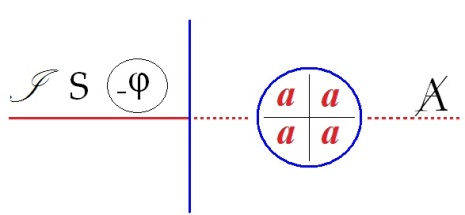
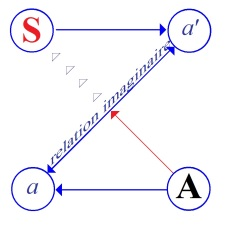
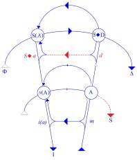
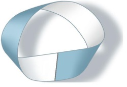
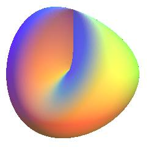
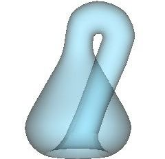
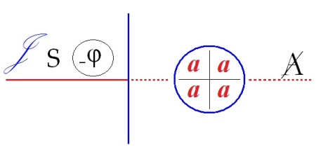
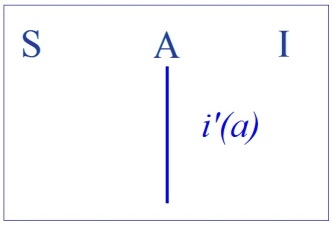
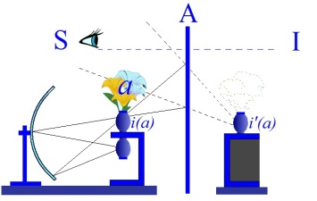

# Leçon 21 | 08 Juin 1966

<!-- source-url: http://staferla.free.fr/S13/S13 L'OBJET.docx -->
<!-- seminar: s13 -->
<!-- lesson: 21 -->

<!-- id: s13-21-0001 -->

Ce *schéma*, prenez-le à la valeur de ces espèces de bouchon de liège flottant sur une eau plus ou moins calme qui peuvent vous servir à repérer où vous avez laissé traîner un filet. Aussi bien, ni *ce schéma* de droite, ni *ces mots* bizarres \- mais dont j’espère que déjà vous dit quelque chose la résonance - n’ont bien sur une valeur opératoire *stricte*.

<!-- id: s13-21-0002 -->

<!-- id: s13-21-0003 -->

I : hiarien, S : gniaka, R : le trou

<!-- id: s13-21-0004 -->

Ce sont des repères, des flotteurs concernant ce que j’ai à vous dire aujourd’hui et où bien sûr j’essaierai de mettre les choses au point d’arrêt que comporte le fait que ceci est mon – *pour cette année* – dernier séminaire ouvert.

<!-- id: s13-21-0005 -->

Pour conserver la note de gravité que certains ont eu le bon esprit de percevoir dans certaines des choses que je disais la dernière fois je vais repartir… partir d’un point analogue qui est, qui m’a été fourni par un entretien que j’ai eu cette semaine avec un de mes amis mathématicien.

<!-- id: s13-21-0006 -->

« *Dans la mathématique*…

<!-- id: s13-21-0007 -->

> me disait cet excellent ami dont je n’omets le nom que parce qu’après tout je ne sais pas *si je suis en droit de publier ces sortes d’ouverture du cœur*, elles ne sont pas communes chez les mathématiciens, ce sont des gens qui dans l’ensemble manquent un peu d’élan de ce côté-là, il n’en est pas de même chez ce personnage distingué qui me disait *…*« *Dans la mathématique*…

<!-- id: s13-21-0008 -->

> en somme, et peut-être après tout cet aveu lui était-il arraché par une certaine façon que j’avais de le harceler, d’essayer de lui tirer du nez le maximum de ce que je peux pour ces sortes de vermicules que je viens ensuite faire se tortiller devant vous sous la forme de ma topologie

<!-- id: s13-21-0009 -->

« *Dans la mathématique* - remarquait-il - *on ne dit pas de quoi on parle* - tout est dans ce « on ne dit » - *on le parle tout simplement,* *d’où un certain air* - disait-il textuellement - *de faire semblant.* »

<!-- id: s13-21-0010 -->

Et *c’est ce qu’il appelait* - d’un ton comme ça, avec un grain qui n’est pas usuel dans ces sortes de dialogues - *c’est ce qu’il appelait* : « *Ce je ne sais quel air d’hypocrisie qu’il y a dans le discours mathématique.* »

<!-- id: s13-21-0011 -->

Je n’oserais moi-même, avancer une chose semblable, si je ne la recueillais de la bouche d’un mathématicien lui-même, qui - il faut dire que c’est quelqu’un qui - à cet endroit, ne manque pas d’*exigence*. C’est comme si celui qui énonçait, à un certain niveau de reprise, ce discours mathématique, se trouvait toujours en posture de cacher quelque chose.

<!-- id: s13-21-0012 -->

Mais là, mon mathématicien ne se trouve pas sans biais, car qu’il soit sur une attente de cette confidence, qui tient aussi, peut-être - n’omettons rien d’aucune des faces de la situation - au filet qu’il tend vers moi, à savoir ce que lui aussi de son côté, désire extraire de ce bain dont je suis censé être le détenteur, il revient quand même sur ses pieds, sa position, et ajoute qu’après tout ce qu’il cache lui, mathématicien c’est strictement ce qu’il doit cacher.

<!-- id: s13-21-0013 -->

L’astuce du discours rationnel c’est d’arriver à le laisser caché, ce qu’on ne dit pas concernant exactement la matière, le sujet de la mathématique. Ce - en tout cas - dont on parle, on le parle tout simplement.

<!-- id: s13-21-0014 -->

Une petite parenthèse : il en résulte que les plus épais et seulement eux - seulement eux, sachez-le bien ! - croient que la mathématique, elle parle de choses qui n’existent pas.

<!-- id: s13-21-0015 -->

Et si j’annonce que je fais un petit dessin, un petit crayonnage en marge, c’est un plaisir comme ça, que je vous donne en passant, mais ça n’est pas du tout l’axe de ce que je vais continuer à vous dire : seulement je vais vous faire remarquer par exemple, que si vous ouvrez le livre de MUSIL, là - dont on vient de faire un très joli film encore un peu raté : « *Les désarrois de l’élève Törless* [^189] » - vous vous apercevrez que quand le lycéen est un peu fin, il peut y avoir les plus grands rapports entre :

<!-- id: s13-21-0016 -->

- le jour où son maître d’école patauge lamentablement pour lui rendre compte de ce qu’il en est *des nombres imaginaires,*

<!-- id: s13-21-0017 -->

- et le fait qu’il se rue comme par hasard vers ce moment là dans une configuration proprement perverse de ses rapports avec ses petits camarades.

<!-- id: s13-21-0018 -->

Tout ceci n’est qu’une annotation marginale.

<!-- id: s13-21-0019 -->

Je voudrais reprendre et dire à la fois *la différence et la parenté* de la position du *psychanalyste* par rapport à celle du *mathématicien*.

<!-- id: s13-21-0020 -->

En fin de compte, et nous le verrons d’une façon précise, à un certain niveau, lui non plus *ne dit pas de quoi il parle*.

<!-- id: s13-21-0021 -->

Seulement, c’est pour des raisons un peu différentes de celles du mathématicien. Vraiment, comme tout le monde le sait, s’il ne dit pas de quoi il parle, ce n’est pas simplement parce qu’il n’en sait rien, c’est parce qu’*il ne peut pas le savoir*.

<!-- id: s13-21-0022 -->

C’est proprement ce que veut dire qu’il y a de *l’inconscient*, de *l’inconscient* irréductible et de l’*Urverdrängung*.

<!-- id: s13-21-0023 -->

Mais peut-on dire que, à la façon dont le fait le mathématicien, il le parle, tout simplement ? Il est bien évident qu’il n’est pas du tout dans la même position : d’une certaine façon *quelqu’un le parle ce dont il s’agit*, seulement *c’est celui à qui il donne la parole,* *à savoir le patient*. Il s’agit de savoir où il est, car *il n’est pas pour rien dans cette position* où il est, en tant qu’il fait que *le patient parle*. Car quand le patient parle, il parle à sa façon concernant *ce dont il y aurait à dire ce dont il parle, et qui ne peut pas être dit*.

<!-- id: s13-21-0024 -->

La chose curieuse, c’est qu’il faut bien que les psychanalystes aussi parlent, et qu’il en résulte - non pas qu’ils parlent comme fait le mathématicien tout simplement - ce dont on ne dit pas *qu’il parle* mais qu’il en parle à côté. Il y a un petit syndrome que les psychiatres ont trouvé depuis très longtemps, qui s’appelle le *syndrome de Ganser*, ce « *parler à côté* » qui caractérise le discours de la communauté analytique, peut-être cela va nous permettre d’éclairer d’un curieux jour latéral ou ambiant, je n’en sais rien, faudrait voir ça de près - ce qu’il en est du *syndrome de Ganser*, qui s’appelle précisément ça : « *la réponse à côté* ».

<!-- id: s13-21-0025 -->

Bref, le psychanalyste est amené à avoir cette sorte de discours qui retombe sur cette *nécessité fondamentale*, bien sûr, *du discours*, à savoir qu’il ait cours.

<!-- id: s13-21-0026 -->

Et vraiment pour entrer plus loin dans ce sujet, c’est aux métaphores de l’usage de la monnaie, non pas même *métaphorique*, qu’il faudrait me dire[^190],à savoir de la différence entre :

<!-- id: s13-21-0027 -->

- un certain discours qui a un *cours forcé* à l’intérieur de ce cercle,

<!-- id: s13-21-0028 -->

- et d’autre part de la façon dont il a, en somme à se faire valoir sur le marché des changes des cercles externes.

<!-- id: s13-21-0029 -->

C’est quelque chose que j’ai essayé d’aborder quand j’ai écrit un article - que je me suis trouvé relire pour des raisons non tout à fait contingentes, puisqu’il s’agit de le faire reparaître avec tout un recueil - article sur *les variantes de la technique* [^191], auquel vous pourrez vous reporter.

<!-- id: s13-21-0030 -->

La question est tout de même celle-ci, pratique pour vous analystes, elle se formule d’une façon très gentille, très naïve : Est-ce qu’il est vraiment nécessaire d’apprendre *la topologie* pour être *psychanalyste* ? Car en fin de compte - et ce n’est pas avec des *bébés* que ces dialogues s’échangent, c’est à cette sorte de question qu’une certaine impasse aboutit.

<!-- id: s13-21-0031 -->

Quoique je suis amené à trancher parmi des notes beaucoup plus nuancées que j’avais jetées sur ce thème, mais il faut bien fendre la vague et j’ai d’autres choses importantes à vous dire aujourd’hui, pour la fendre et répondre à cette question.

<!-- id: s13-21-0032 -->

Quiconque la pose, est déjà en mesure que je lui donne *cette réponse : la topologie c’est pas quelque chose qu’il doit apprendre en plus*, en quelque sorte comme si la formation du psychanalyste consistait à savoir de quel pot de couleur on allait se peindre, il n’a pas à se poser *la question de savoir s’il doit ou non apprendre quelque chose concernant la topologie*, dans l’étiquette abrégée et je dirai *imprécise*, à laquelle je désigne le peu que j’en apporte ici, *c’est que la topologie c’est l’étoffe même dans laquelle il taille*, qu’il le sache ou qu’il ne le sache pas.

<!-- id: s13-21-0033 -->

Peu importe qu’il ouvre ou non *un bouquin de topologie*, *du moment qu’il fait de la psychanalyse c’est l’étoffe dans laquelle il taille*, *dans laquelle il taille le sujet de l’opération psychanalytique :* « *patron, robe, modèle* », c’est ce qui peut être en cause, dans ce qu’il a à *découdre* et à *recoudre*. Si sa *topologie* est faite en se trompant, *c’est aux dépens de son patient*.

<!-- id: s13-21-0034 -->

Ce n’est pas d’hier bien sûr, que j’ai essayé de former cette construction, *ces réseaux, ces écriteaux indicateurs, ces réseaux orientés* qui s’appellent successivement *schéma L ou schéma R, graphe,* ou enfin cette année, depuis disons quelques années, l’usage des *surfaces de l’analysis situs*.

<!-- id: s13-21-0035 -->

    

<!-- id: s13-21-0036 -->

Après tout, ceux qui m’ont pu voir travailler à apporter ces choses savent que je les ai construites, certes *contre vents et marées,* mais *pas uniquement* par désir de déplaire \[sic\] à mon auditoire ancien et actuel, mais parce que je n’avais qu’à le suivre, ce plan à développer, dans le discours même que mes patients ou de chacun de ceux, tout au moins, que je peux « *contrôler* », qui viennent à m’apporter, pour faire ce qu’on appelle en psychanalyse « *un contrôle* », qui m’apportent toute crues, toute vives, ces formules mêmes qui sont à l’occasion les miennes : les malades les disent strictement, rigoureusement, exactement comme elles sont dites ici ! Cette *topologie*, si je n’en avais pas eu *quelque chose déjà*, comme un petit vent, *mais les malades me l’auraient fait réinventer *!

<!-- id: s13-21-0037 -->

La question est donc claire, l’aide qu’on peut prendre de telle ou telle référence, à ce quelque chose dont le mathématicien ne dit pas ce que c’est, mais qu’il le parle, eh bien, il y a toutes les chances que ça nous déblaie un peu le chemin, que ça nous donne des instruments où, à l’occasion, reconnaître ce à quoi nous avons affaire, ce que j’ai posé depuis le début du moment où je me suis mêlé de parler de la psychanalyse, à savoir *la fonction du langage et le champ de la parole* [^192].

<!-- id: s13-21-0038 -->

Et pour ceux qui conservent toujours dans la tête cette espèce d’objection : « *Oui, mais ce n’est pas tout !* », je répèterai une fois de plus, depuis le temps que je sue à le répéter, qu’en effet ce n’est pas tout, mais que tout ce qui vient à notre horizon *dans la psychanalyse*, vient par là.

<!-- id: s13-21-0039 -->

Autrement dit, que *pour ce qu’il en est de rester cachée*…

<!-- id: s13-21-0040 -->

> beaucoup plus loin que *cachée* : *sans limite, inconnue, à peine approchée* en quelques points d’accès j’ai dit, ce que nous aussi nous ne disons que très rarement, au point même *qu’il vaut mieux ne pas le dire* ...j’ai nommé *la jouissance* - nous n’aurions aucune espèce d’idée de cette dimension, de cette profondeur…

<!-- id: s13-21-0041 -->

> dont on ne peut pas dire qu’elle s’offre à nous puisqu’elle est *interdite*,
>
> mais qu’à tout le moins nous pouvons nommer : *la jouissance* …nous n’en aurions aucune espèce d’idée, si ce n’était *la fondation du sujet dans le langage*, qui par voie de répercussion, en tant qu’il fonde en nous cet ordre, cette barrière, cette défense qui s’appelle le désir, qui par répercussion dis-je, ne nous forçait à interroger : contre quoi nous défendons-nous ? Qu’en est-il de cette *jouissance* ?

<!-- id: s13-21-0042 -->

Question, bien sûr, que ne se pose aucun être qui ne soit l’être parlant ! Qu’est-ce que profile pour vous, le déroulement de cette ligne à droite ? Mais, si vous avez quelque chose qui vous reste du schéma : S, I, *i’(a)*, A...

<!-- id: s13-21-0043 -->

  

<!-- id: s13-21-0044 -->

…vous pouvez voir la disposition fondamentale qui va du S au champ du grand Autre qui vous désigne ce que je vais vous rappeler tout à l’heure, à savoir :

<!-- id: s13-21-0045 -->

- que c’est de ce champ \[A\] qu’est retiré par le sujet - comme appartenance - *l’objet(a)*,

<!-- id: s13-21-0046 -->

- que quelque chose est en jeu, plus en deçà \[- ϕ\], concernant une autre fonction de l’Autre puisque cet autre, là \[J\] en arrière du sujet, *à lui tout à fait caché et aperçu seulement comme en mirage là où il le projette au champ de l’Autre* … \[J\] *la jouissance­* est à placer.

<!-- id: s13-21-0047 -->

Ceci pour l’orientation générale de ce que j’ai à vous dire, aujourd’hui.

<!-- id: s13-21-0048 -->

En effet, la valeur foncière de *l’objet de la jouissance* est de nous montrer par quel engrenage... car nous n’avons rien d’autre jusqu’à présent : je mets au défi quelque philosophie que ce soit de nous rendre compte à présent du rapport qu’il y a entre le surgissement du signifiant et ce rapport de *l’être* à *la jouissance*. Il y en a forcément un. Quel est-il ?

<!-- id: s13-21-0049 -->

Effectivement, c’est dans le filet de la topologie subjective que se ramasse quelque chose de ce champ de *la Jouissance*.

<!-- id: s13-21-0050 -->

C’est très précisément - la chose en est en suspens en ce point où FREUD nous l’a dit, c’est là le sens de ce qu’il dit - dans ce *filet subjectif*, dans ce qui fait que le sujet n’est pas immanent mais *latent, évanouissant au réseau du langage*. Là-dedans est prise la *jouissance* en tant qu’elle est jouissance sexuelle. C’est là l’originalité et l’abrupt, l’accent, de ce que nous dit FREUD.

<!-- id: s13-21-0051 -->

Mais pourquoi en est-il ainsi ? *Aucune philosophie*, dis-je, actuellement *ne nous en* *rend compte*. Et ces *misérables avortons de philosophie* que nous traînons derrière nous *comme des habits qui se morcellent* ne sont rien d’autre - depuis le début du siècle dernier - qu’*une façon de batifoler,* plutôt que de s’attaquer à cette question qui est la seule, sur *la vérité* et ce qui s’appelle - et que FREUD a nommée - *l’instinct de mort*, le masochisme primordial de la jouissance, à savoir : des métaphores, des reflets éclairs que projette sur cette question notre expérience.

<!-- id: s13-21-0052 -->

Toute la parole philosophique foire et se dérobe. Nous ne savons donc pas ce qu’il en est de cette prise au filet, dans ce champ redoutable et pourtant déjà *annoncé* dans tout le fantasme de *la tragédie,* nous ne savons pas pourquoi, quelque chose vient à notre expérience, d’une façon contingente peut-être, avec FREUD qui nous dit : ce qui se prend au champ de la parole et du langage, c’est ce qui de *la Jouissance* a un rapport avec cet autre mystère, laissé intact, je vous le ferai remarquer, dans tout le développement de la doctrine analytique, et qui s’appelle la sexualité.

<!-- id: s13-21-0053 -->

Alors, ce que j’appelle « *le doigt dans l’engrenage* », c’est qu’il s’agit de bien d’autre chose que de rendre raison, nous n’en sommes pas à maîtriser le *pourquoi* de cette aventure. C’est déjà beaucoup que nous sachions *comment* on y entre, comment pris par le petit doigt, c’est peut-être là, à faire quelques réflexions, celles qui s’imposent concer­nant la topologie de cette mécanique, qu’il nous pourra venir quelque lumière sur ces raisons et ces limites.

<!-- id: s13-21-0054 -->

D’autant plus, comme il doit bien y avoir quelque temps que toute la mécanique fonctionne, à apercevoir les choses par ce bout, nous en pourrons peut-être savoir beaucoup, à voir de quelle façon, antérieurement on s’est obligé à ne pas voir.

<!-- id: s13-21-0055 -->

Alors comment on y entre, c’est évidemment tout le sens de *l’objet(a)*.

<!-- id: s13-21-0056 -->

Dans ce rapport à ce que nous avons inscrit comme nécessaire du lieu de l’Autre, dans ce rapport qui s’établit par *la demande* et qui nous y pousse à partir du besoin, quelque chose entre en jeu de très simple : c’est ce que *de ce champ de l’Autre,* *nous trouvons à récupérer notre propre corps en tant que ça y est déjà*.

<!-- id: s13-21-0057 -->

Que le sein ne soit qu’une appartenance de ce corps égaré *au champ de l’Autre* tient à ce que nous appellerons provisoirement, de notre point de vue, une contingence biologique qui s’appelle simplement *être mammifère*. Nous sommes… mammifères mes petits amis, nous n’y pouvons rien !

<!-- id: s13-21-0058 -->

Et ça a beaucoup d’autres conséquences. C’est en général accompagné de ce fait : d’avoir cet appareil bizarre qui s’appelle un pénis et qui fait que la copulation est soutenue par une certaine jouissance : ça ne casse pas les manivelles, comme on dit, hein !… enfin c’en est une, une de celles qu’on a à la portée de la main. Je vous fais marrer...

<!-- id: s13-21-0059 -->

Mais c’est le centre de l’enseignement analytique ! On a commencé par partir de là : « *Pas toutouche, ou en va te la couper.* »

<!-- id: s13-21-0060 -->

Ça été *une des premières vérités* : on faisait - comme ça, n’est ce pas - dans la vague, cette découverte formidable qui s’appelait l’œdipe. Il faut tout de même bien voir que c’est à ce niveau de vérité triviale que cet autre petit bateau en rapport avec le pénis est accroché dans l’énorme affaire de l’œdipe. Ça devrait, tout de même, nous porter à la réflexion.

<!-- id: s13-21-0061 -->

Est-ce que tout est là ? En d’autres termes, nous voilà mis sur le cas de ce qu’il faut penser de la castration. Ça a bien rapport avec les deux termes que je viens de mettre en avant : le cycle court de la jouissance manuelle chez le mammifère.

<!-- id: s13-21-0062 -->

Ah... je n’ai pas perdu mon temps cette année à vous expliquer ce que ça peut être chez les punaises[^193]. *Ça doit être insondable !*

<!-- id: s13-21-0063 -->

Auprès de cela la vôtre peut toujours… aller se rhabiller ! C’est très important, cette remarque.

<!-- id: s13-21-0064 -->

*La seconde*, en effet c’est comme beaucoup de choses, beaucoup de choses pour l’homme, c’est à la portée de la main, pour la raison qu’il n’y a pas beaucoup d’êtres, en dehors de lui, qui ont une main. Les primates en font couramment toute la journée l’usage que j’ai évoqué tout à l’heure et ont, par conséquent, concernant la jouissance des problèmes beaucoup plus simples.

<!-- id: s13-21-0065 -->

Mais on remarquera que, par exemple, simplement chez le chien - qui a sur le primate, l’avantage d’entrer dans le champ de la parole humaine - tout ce qui se rapporte à ce *frotti-frotta* prend un degré de plus de complication. On ne peut qu’admirer qu’une chose : c’est à quel point, les chiens sont *bien élevés*. C’est de là qu’il faut partir. Vous voyez que très vite, nous nous trouvons engagés dans une espèce de collusion - qui est bien ce sur quoi se sont précipitées les personnes à chemin court - de collusion entre *l’objet(a)* de la demande et quelque chose qui concerne ce qu’on refuse de voir : *l’objet de la Jouissance*. C’est justement que, à en rester là, *on n’ira pas loin*. On n’ira pas loin parce que, à rester à ce niveau de la demande, à ce qui \[...\] quelle appartenance du corps.

<!-- id: s13-21-0066 -->

Je n’ai pas parlé de l’autre, à savoir de la plus triviale, celle dont on dit qu’il nous est demandé par l’Autre et moyennant quoi nous lui donnons ce que nous avons à donner avec notre corps, à le mettre au lieu de l’Autre considéré comme dépotoir, comme champ d’épandage, à savoir ce que nous appelons pudiquement *les fèces, le scybale* - σκύβαλον \[scubalon\], *ce qu’on rejette* c’est un mot très élégant - et à la vérité disons  qu’ils ont en général la fonction du *déchet corporel*.

<!-- id: s13-21-0067 -->

À limiter - comme il tend à se faire, dans un certain horizon analytique - *toute la dialectique des rapports du sujet à l’Autre,* *à la demande*, *on aboutit à cette sphère* limitée à la frustration, *à la* *prévalence de l’Autre maternel*, tout juste porté aux degrés de complication qu’on appelle « *le parent composé* ». Et on obtient en effet quelque chose d’assez fermé qui n’a vraiment qu’un seul inconvénient c’est qu’on se demande après ça pourquoi il y a eu l’invention de l’œdipe, alors que justement cette invention était originelle, qu’elle est sortie bille en tête toute armée du cerveau de FREUD.

<!-- id: s13-21-0068 -->

C’est bien certain que c’est à ceci que se réfère cette dimension du désir pour autant que FREUD l’a mise, lui aussi, d’abord, et que c’est seulement autour d’elle que s’est édifié, que s’est découvert *le mécanisme de la demande, et qu’il n’est aucune demande*, non seulement qui n’évoque mais qui littéralement ne s’évoque *que de la formation à son horizon de l’appel du désir.*

<!-- id: s13-21-0069 -->

Disons que l’Autre, au lieu d’être ce champ inerte…

<!-- id: s13-21-0070 -->

> où l’on récupère quelque chose, à savoir ce sein qui est l’objet idéal, toujours manquant, qu’essaye dans toutes sortes d’appareillage de reproduire la machinerie humaine, en fin de compte que ce soit celui qui fait de la nage sous-marine ou qui s’envole dans les « *cosmos* », comme on dit maintenant, c’est toujours d’un petit appareil nourricier avec lui et formant circuit fermé, qu’il s’aborne, aucun besoin pour ça d’imaginer sa nostalgie de l’utérus maternel dans lequel, précisément, son appareillage était, à cet endroit, singulièrement déficient - je veux dire dans le registre que je viens d’évoquer - et d’une symbiose bien boiteuse …*le champ de l’Autre* c’est cela qu’il s’agit d’intéresser dans le désir : le désir vient intéresser l’Autre.

<!-- id: s13-21-0071 -->

Et c’est là, l’essence différente des *deux autres objets(a)*. C’est pour cela, que cette année j’ai fait pointer et même isoler *le paradigme du premier de ces objets, à savoir le regard*, comme représentant le moment avancé de mon exposé. Je ne me suis pas attardé aux autres dont nous avons suffisamment le maniement, encore qu’il y a à revenir là-dessus, mais j’ai parlé du *regard*.

<!-- id: s13-21-0072 -->

Le *regard* a ce privilège d’être ce qui va à l’Autre, comme tel. C’est bien sûr, il y a là toute une phénoménologie à laquelle on peut s’attarder, voire même on peut s’en régaler, mais puisque c’est une fente, à quel moment fonctionne-t-il ?

<!-- id: s13-21-0073 -->

Quand il est ouvert ou fermé ? Il y a un rêve, dans la *Traumdeutung* là-dessus, qui s’appelle « *fermer les yeux* ».

<!-- id: s13-21-0074 -->

Consultez-le un petit peu, tout est déjà là, il y a une foule de questions qui se posent.

<!-- id: s13-21-0075 -->

Mais de cette fonction du *regard,* j’ai écarté *tout pittoresque*, je n’ai pas demandé pourquoi c’est à partir du moment où il est aveugle que TIRÉSIAS devient voyant, batifolages qui font la joie ordinaire de notre singulier milieu, j’ai donné la structure, et comment avec le *regard*, il entre en jeu - toujours complète - une topologie que j’ai décrite sur laquelle on ne peut revenir, qui est celle qui justifie l’existence de l’écran.

<!-- id: s13-21-0076 -->

Dans ce champ de l’Autre le regard est ce qui introduit l’écran et la nécessité - qu’un de mes élèves : MELMAN, m’a fait récemment la remarque, qu’il est inscrit dans l’article de FREUD *Über Deckerinnerungen* sur *les souvenirs écrans* - la nécessité que *le sujet s’inscrive* dans le tableau. Il n’y est pas dit, bien sûr, cette topologie si essentielle, si fondamentale à tout le développement freudien, qu’elle est aussi importante que celle de l’œdipe, cette topologie qui est la véritable assise et ce qui donne sa consistance à cette fonction qu’on appelle - pourquoi ? - la scène primitive.

<!-- id: s13-21-0077 -->

Qu’est-ce que c’est, si ce n’est la nécessité de ces cadres, de ces portants, que j’ai essayé cette année d’installer devant vous, pour vous y faire remarquer la condition structurale qui n’est peut-être - c’est cela qui est à confirmer - que *l’envers*, que *la doublure*, que *le deuxième tour* grâce à quoi…

<!-- id: s13-21-0078 -->

> déjà *complet* dans FREUD, mais jusqu’ici *complété* par personne, *complété* parce que pas suivi dans l’ordre …de son double tour instaure, à coté de la loi du désir en tant qu’il est le désir conditionné par l’œdipe, cette loi de ce qui lie, par quoi le sujet est accroché au lieu de l’Autre, rend nécessaire ce certain ordre construit autour de *l’objet du regard*.

<!-- id: s13-21-0079 -->

Ce qui fait que quand cet objet de l’Autre, vient se dresser sur quelque chose que nous appelons comme vous voudrez : le tableau, la scène ou l’écran, ceci est l’accrochage…

<!-- id: s13-21-0080 -->

> juste m’emparant d’un terme dont je pense vous savez l’origine d’André BRETON[^194] …que j’appellerai *à l’Autre*, en tant que caractérisé par ce « *peu de réalité* » qui est toute la substance *du fantasme*, mais qui est aussi, peut-être, toute la réalité à laquelle nous pouvons accéder.

<!-- id: s13-21-0081 -->

Ceci mérite que nous ayons laissé - et non sans desseins : pour des nécessités d’exposé - à plus tard cet *autre objet*, étrange en somme de se croiser avec *l’objet du regard*, j’ai dit : *la voix*. Mais en tant que - lui - à venir manifestement de l’Autre, c’est néanmoins *à l’intérieur* que nous l’entendons. Ici *la voix*, bien sûr, ce n’est pas seulement ce bruit qui se module dans le champ auditif, mais *ce qui choit* dans cette rétroaction d’un signifiant sur l’autre, qui est ce que nous avons défini comme condition fondamentale de l’apparition du sujet. Autrement dit, dans toute la mesure où vous entendez de tout ce que je dis, peu de choses, c’est que vous êtes occupés par vos voix, comme tout le monde.

<!-- id: s13-21-0082 -->

Et maintenant, il s’agit de savoir ce que veut dire, dans tout ceci, *la fonction de la castration*. La castration me semble liée à la fonction du désir en tant que dans ce champ de l’Autre elle est littéralement projetée à un point limite, suffisamment indiqué dans le mythe par *le meurtre* et *la mort du père* et d’où découle la dimension de *la loi*. On oublie trop que dans le mythe ce n’est pas seulement la mère que le père accapare, mais *toutes les femmes* et qu’après l’énoncé de *la loi de l’inceste* il ne s’agit de rien d’autre que de signifier que *toutes les femmes* sont interdites tout autant que la mère.

<!-- id: s13-21-0083 -->

Autrement l’histoire du *complexe d’Œdipe* a besoin de tellement de rallonge, à savoir :

<!-- id: s13-21-0084 -->

- que c’est par transfert que *les autres femmes* etc.,

<!-- id: s13-21-0085 -->

- c’est un accident... C*omme si c’était un accident* ! …bref que *le mythe d’Œdipe* n’aurait, autrement aucun sens. En d’autres termes, la castration se présente, à la prendre par ce biais, comme quelque chose qui nous suggère de nous demander l’objet par quoi le sujet est intéressé dans cette dialectique de l’Autre, en tant cette fois qu’elle ne répond *ni à la demande, ni au désir, mais à la jouissance*.

<!-- id: s13-21-0086 -->

Puisque nous partons d’une question posée par FREUD, de la jouissance des femmes, premier temps, répétons que la jouissance, ici donc, s’ouvre pour la première fois comme question en tant que le sujet en est *barré*, ce que nous avions appelé autrefois dans notre discours sur *L’Angoisse* \[1962-63\] : « *embarrassé* » !

<!-- id: s13-21-0087 -->

Bien sûr tout cela est resté un tout petit peu dans les airs, *c’est certainement de beaucoup le meilleur séminaire que j’ai fait*.

<!-- id: s13-21-0088 -->

Ceux qui ont eu le souci de s’en repaître dans les vacances qui ont suivi, peuvent en témoigner. Mais en ce moment-là j’avais tout un premier rang de « *sous-off.* » qui prenaient ardemment ce que j’écrivais, mais ils pensaient tellement à autre chose, qu’on conçoit qu’il ne leur en soit rien resté.

<!-- id: s13-21-0089 -->

*Embarrassé* il est, *le sujet*, devant cette jouissance. Et cette barrière qui l’embarrasse c’est très précisément le désir lui-même. C’est pour cela qu’il projette dans l’Autre, dans cet Autre dont FREUD nous repère *le mannequin* sous la forme de ce *père tué*, où il est facile de reconnaître « *le Maître* » de Hegel en tant qu’il se substitue au Maître absolu. Le père est à la place de la mort et il est supposé avoir été capable de soutenir toute la jouissance.

<!-- id: s13-21-0090 -->

C’est vrai dans FREUD à part ceci : qu’aussi dans FREUD, nous pouvons nous apercevoir *que c’est un mirage *:

<!-- id: s13-21-0091 -->

- ça n’est pas parce que c’est le désir du père qui, mythiquement, se pose à l’origine de la loi grâce à quoi ce que nous désirons a pour meilleure définition ce que nous ne voulons pas,

<!-- id: s13-21-0092 -->

- ce n’est pas parce que les choses sont ainsi, que la jouissance est là, derrière le support du mythe de l’Œdipe, puis ce que j’ai appelé son mannequin, ...il apparaît au contraire tellement bien que ce n’est là qu’un mirage, que c’est là aussi que nous n’avons aucune peine à pointer l’erreur hégélienne, je parle de celle qui, dans la *Phénoménologie de l’esprit* [^195], attribue au « *maître* »…

<!-- id: s13-21-0093 -->

> à celui de « *la lutte à mort de pur prestige* », vous connaissez la rengaine j’espère …attribue au « *maître* » de garder par-devers lui le privilège de la jouissance, ceci sous le prétexte que l’esclave, pour conserver sa vie, y a renoncé à cette jouissance.

<!-- id: s13-21-0094 -->

Je pense déjà avoir une fois, il y a quelques séminaires, pointé « *un petit peu* » la question de ce coté-là.

<!-- id: s13-21-0095 -->

Car où prendre *les lois* de cette singulière dialectique, qu’il suffirait *de renoncer à la jouissance* pour la perdre !

<!-- id: s13-21-0096 -->

Mais vous ne connaissez pas les lois de *la jouissance* ! C’est probablement le contraire !

<!-- id: s13-21-0097 -->

C’est même sûrement le contraire : c’est du côté de l’esclave que reste la jouissance, et justement parce qu’il y a renoncé.

<!-- id: s13-21-0098 -->

*C’est parce que le maître dresse son désir qu’il vient, sur les marges de la jouissance, buter. Son désir n’est même fait que pour cela, pour renoncer à la jouissance, et c’est pour cela qu’il a engagé la lutte à mort de pur prestige.* De sorte que l’histoire hegelienne est *une bonne plaisanterie* qui se justifie assez de ce qu’elle est totalement incapable d’expliquer quel peut bien être le ciment de la société des maîtres.

<!-- id: s13-21-0099 -->

Alors que FREUD la donne comme cela, la solution : elle est tout simplement homosexuelle.

<!-- id: s13-21-0100 -->

C’est le désir - ça c’est vrai - de ne pas subir la castration, moyennant quoi les homosexuels - ou plus exactement les maîtres - sont homosexuels et c’est ce que FREUD dit : *le départ de la société c’est le lien homosexuel*, précisément dans son rapport à *l’interdiction de la Jouissance, la Jouissance de l’Autre en tant qu’elle est ce dont il s’agit dans la Jouissance sexuelle à savoir de l’Autre féminin*.

<!-- id: s13-21-0101 -->

Voilà ce qui, dans le discours de FREUD, est la partie masquée. Il est extraordinaire que toute masquée qu’elle soit, cette vérité s’étale, à tout bout de champ - c’est le cas de le dire - dans son discours.

<!-- id: s13-21-0102 -->

Pour ce qui, en tout cas, vient de notre expérience, à savoir que tout le problème de *l’union sexuelle entre l’homme et la femme*, sur laquelle nous avons déversé toutes les conneries de notre stade prétendu *génital*, de notre fabuleuse *oblativité* , ce problème qui est vraiment celui sur lequel l’analyse a joué le rôle de l’obscurantisme le plus furieux, ce problème repose tout entier sur ceci : c’est la difficulté, l’extrême obstacle à ce que *dans l’union intersexuelle, l’union de l’homme et de la femme, le désir s’accorde*.

<!-- id: s13-21-0103 -->

Autrement dit que la jouissance féminine… Ce qu’on sait depuis toujours, depuis OVIDE : lisez le mythe de TIRÉSIAS, il y a là vingt vers d’OVIDE que j’ai mis dans mon premier *Rapport*, celui *de Rome*, parce que c’est un point essentiel, et que j’ai essayé de faire repasser depuis, quand on a parlé de *La sexualité féminine* à Amsterdam.

<!-- id: s13-21-0104 -->

Ça a été du beau ! Comment oublier la profonde disparité qu’il y a, entre *la jouissance féminine* et *la jouissance masculine* !

<!-- id: s13-21-0105 -->

C’est bien pour cela que dans FREUD on parle de tout, d’activité, de passivité, de toutes les polarités que vous voudrez mais jamais de masculin-féminin, parce que ce n’est pas une polarité, et que d’ailleurs, comme ce n’est pas une polarité, c’est tout à fait inutile d’essayer de parler de cette différence. Il y a un seul truchement de cette différence : c’est que dans la jouissance féminine peut entrer comme objet le désir de l’homme comme tel. Moyennant quoi *la question du fantasme se pose pour la femme*. Mais comme elle en sait probablement un petit bout de plus que nous, concernant le fait que *le fantasme et le désir sont précisément des barrières à la jouissance*, ceci ne simplifie pas sa situation. Il est fâcheux que des vérités aussi premières, dans le champ psychanalytique, puissent prendre un air de scandale.

<!-- id: s13-21-0106 -->

Mais il faut qu’elles soient avancées parce que c’est proprement là ce qui justifie le temps précis où nous en sommes de notre exposé, c’est-à-dire…

<!-- id: s13-21-0107 -->

> contrairement au fait qui fait que c’est telle ou telle appartenance du corps, objet chu
>
> du corps dans un certain champ, qui organise la demande et le désir …quant à ce dont il s’agit *du rapport du désir à la jouissance*, en tant qu’il intéresse le sujet du sexe opposé, le truchement n’est plus d’un objet, ni même d’un objet interdit…

<!-- id: s13-21-0108 -->

> de l’interdiction pédantesque, si je puis dire, qui est tout un registre de la castration freudienne, ça va de l’interdit porté sur la main du petit garçon ou de la petite fille jusqu’à la formation que vous recevez à l’université,
>
> il s’agit toujours de nous empêcher de voir clair …mais l’autre fonction de la castration qu’on confond avec la première est beaucoup plus profonde, c’est ce par quoi, si un accord est possible…

<!-- id: s13-21-0109 -->

> un accord, entendez-le à la façon dont je peux essayer de faire un échantillon de couleur,
>
> ce qui reproduira à coté de celle-ci quelque chose qui soit de la même teinte …c’est grâce au fait que cet objet qui est le pénis…

<!-- id: s13-21-0110 -->

> mais que nous sommes forcés de porter à cette fonction d’être épinglé *phallus* …est traité d’une façon telle que celle qui est la même que quand on se livre à cet *exercice de l’accord*.

<!-- id: s13-21-0111 -->

Ce sont des choses, sur lesquelles, par discipline, je ne me suis pas étendu cette année, mais c’est d’un autre registre que du visuel et du regard. *Avec n’importe quel trio de couleur* on peut faire un petit mélange qui reproduit *n’importe quel* autre \- je dis *n’importe quel* <u>et</u> *n’importe quel ! -* sauf à ce qu’on se permette quand ça ne marche pas, ce qui se produit sur une assez grande marge, de se servir… de se servir *d’une des couleurs du trio* pour le soustraire sur l’échantillon de l’autre côté.

<!-- id: s13-21-0112 -->

En d’autres termes, il y a certaines qualités de certains objets qu’il faut que nous fassions passer au signe négatif.

<!-- id: s13-21-0113 -->

En d’autres termes, il faut que dans le rapport homme-femme, l’objet contingent, l’objet caduc de la jouissance mammifère, soit capable d’être négativé, il faut que l’homme s’aperçoive que la jouissance masturbatoire n’est pas tout, et inversement que la femme s’ouvre à la dimension que cette *jouissance* là lui manque. Je ne dis pas là des choses bien *sorcières*, mais c’est là le véritable fondement de la relation castrative, si nous voulons lui donner un sens quelconque quant à la façon dont elle fonctionne réellement. Dite, comme je viens de vous la dire, ça finit par être tourné à la lapalissade.

<!-- id: s13-21-0114 -->

C’est dans ce cas là que vous ne voyez pas où est le problème, à savoir quelle est la nature de ce signe négatif qu’il s’agit de porter sur cet objet, *le phallus*. Ce ne sont pas, bien entendu, là des choses que j’essaierai même d’aborder, dans les dernières minutes de mon séminaire de cette année, mais c’est, précisément, pour répondre à de telles questions que celui de l’année prochaine, si Dieu lui prête faveur, s’appellera la *Logique du fantasme*.

<!-- id: s13-21-0115 -->

Néanmoins je voudrais dès maintenant vous faire remarquer comme introduction à cette logique que la question de ce qu’il en est du négatif comme on dit ou de la négativité mériterait enfin que nous y prenions une orientation qui ne soit pas simplement parcellaire. Et pour non pas la déchiffrer mais la défricher, je commencerai, comme j’ai fait depuis toujours, avec des instruments : la charrue de bois ouvrant un sillon sommaire bien entendu, et c’est celui que je me suis amusé - ceci, depuis longtemps, je ne sais même pas si je l’ai laissé sortir jamais devant votre auditoire – à pointer de ces trois registres qui sont : I : *hiarien*, S : *gniaka*, R : *le trou*

<!-- id: s13-21-0116 -->

Le premier, l’*Imaginaire* - et que j’écris comme ça, d’une petite orthographe « chinoise » : *hiarien* - ce que nous disons tous \- quand quoi ? - quand dans un champ nous trouvons le vide. Et si vous croyez que c’est facile à expliquer ça : cette notion de champ et de vide ! Bien sûr, le registre gestaltiste s’offre tout de suite, seulement la rapidité avec laquelle il se contamine vers une version symbolique - dans la notion de classe, par exemple, qui prend, justement, de sa présence toute sa densité - doit nous rendre extrêmement prudent quant au maniement. Quoiqu’il en soit, l’écrire de cette orthographe baroque, qui est celle dont je ne fais rien qu’une occasion de le mémoriser comme *instrument transitoire*, j’ai appelé cela le « *hiarien* » *écrit comme vous le voyez là*.

<!-- id: s13-21-0117 -->

Il y a une chose qui est, en tout cas, bien tranchée et qui n’a rien à faire avec le *hiarien*, c’est celle que j’exprime dans la deuxième ligne et sous cette forme, dont après tout je n’ai pas de raison de vous refuser l’anecdote, cette forme empruntée au langage d’un petit garçon qui était très intelligent, puisque c’était mon frère. Il « *gniakavait *» me dit-il, conjuguant ainsi bizarrement un verbe dont le radical serait « *gniaka* ». Eh bon, un registre du *gniaka* est absolument *essentiel* !

<!-- id: s13-21-0118 -->

Ceci par quoi, un état présent est supposé dériver de *quelque chose* qui fait, qu’il est amputé de quelque chose.

<!-- id: s13-21-0119 -->

Ceci est la forme la plus radicale par quoi s’introduit toute une catégorie où nous aurons, justement, à nous orienter quant aux instaurations proprement *symboliques* de la négation. Car « *gniaka* » ça va très loin :

<!-- id: s13-21-0120 -->

- ça peut être un manque,

<!-- id: s13-21-0121 -->

- ça peut être aussi un point de départ : « *gniaka *» prendre un point de départ, on appelle cela le 0, élément neutre.

<!-- id: s13-21-0122 -->

Rien qu’à ce « *gniaka* » là vous avez ce qu’on appelle *un groupe abélien*. Ceci pour vous indiquer dans quelle voie nous serons amenés à ordonner nos réflexions, l’année prochaine. Mais assurément ce « *gniaka* » n’est pas sans nous indiquer de revenir sur ce que nous avons dit l’année dernière[^196] quant à la fonction du 0 comme suturant l’instance du sujet et d’articuler le rapport du sujet au désir et aussi à la castration. « *Gniaka* » mettre le signe négatif sur le pénis et la fonction phallique s’instaure avec tout l’usage absolument aveugle que nous savons en faire.

<!-- id: s13-21-0123 -->

Et puis il y a *quelque chose* pour quoi il n’y a *pas de mot*, ni d’épinglage, au moins dans mon registre, et ceci pour une bonne raison, c’est que si je le dénommais, ou que si je le supposais, il aurait quelque rapport avec cette fonction *imaginaire* ou celle de la *symbolisation*.

<!-- id: s13-21-0124 -->

Ce troisième terme, celui que depuis déjà trois ans que je suis ici, je vous apprends à connaître, par quelque voie, que je ne saurais dire être celle de la palpation, c’est bien plus : j’essaye, je sollicite, j’appelle de vous que vous vous identifiez à ce qu’on peut y appeler, d’un langage mathématique, le facteur *tor* (*t.o.r.*), ce qui veut dire : ce qu’il y a dans le *réel*, dans ce *réel* auquel nous avons affaire et qui est justement ce qu’il y a au-delà, au dehors de cette nécessité qui nous contraint de ne conjoindre à la *Jouissance* que ce peu de réalité du fantasme, ce *réel* témoigne d’une certaine torsion.

<!-- id: s13-21-0125 -->

Cette *torsion* n’est pas l’ἀνάγκη \[ananké\] dont parle FREUD, car ἀνάγκη \[ananké\] et λόγος \[logos\], ils sont tous les deux de l’ordre du *symbolique*. La seule nécessité contraignante est celle qu’impose le λόγος \[logos\].

<!-- id: s13-21-0126 -->

Et le *réel* n’entre au-delà, comme il est manifeste dans l’expérience, que pour - entre ces solutions nécessaires, car il y en a toujours plusieurs - désigner celle qui est *impossible*. Telle est la fonction du *réel* et sa torsion. Cette torsion c’est celle même que nous essayons de saisir au niveau de ce qui est notre champ, que j’ai, tout au moins cette année, essayé de vous apporter le matériel qui vous permette, pour la suite de ce que nous aurons à dire, de repérer comment se coupe, dans une étoffe qui est commune, le rapport du sujet à l’Autre, cet avènement du sujet dans le signifiant grâce à quoi se soutient ce fantasme dans son rapport au *réel*, grâce à quoi l’opacité nous apparaît d’une jouissance indéfinie.

## Notes

[^189]: Robert Musil : *Les désarrois de l'élève Törless*, Seuil, Paris, Coll. Points, 1995. Film de Volker Schlöndorff, Mars 1966.

[^190]: Cf. « *cours légal* », « *cours forcé* » d’une monnaie…

[^191]: Cf. *Variantes de la cure type* in *Écrits* p.323.

[^192]: Cf. *Fonction et champ de la parole et du langage en psychanalyse*, in *Écrits* p.237.

[^193]: Cf. séminaire 1962-63 : *L’angoisse*, 06-03.

[^194]: André Breton : *Introduction au discours sur le peu de réalité* (1924), in *Œuvres complètes*, volume II, Paris, Gallimard, Pléiade, 1992, p.265-80.

[^195]: G.W.F. Hegel : *Phénoménologie de l'esprit*, Paris, Aubier Montaigne, 1998.

[^196]: Séminaire1965-66 : « *Problèmes cruciaux*... » 09-06.
