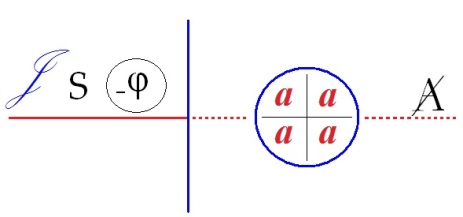

# Leçon 22 | l5 Juin l966

<!-- source-url: http://staferla.free.fr/S13/S13 L'OBJET.docx -->
<!-- seminar: s13 -->
<!-- lesson: 22 -->

<!-- id: s13-22-0001 -->

[SAFOUAN](#Safouan)

<!-- id: s13-22-0002 -->

LACAN

<!-- id: s13-22-0003 -->

Nous avons entendu…

<!-- id: s13-22-0004 -->

> je dis cela pour ceux qui sont à la fois partie prenante de ce séminaire fermé et qui assistent aux débats intitulés *Communications*... dans l’École Freudienne, il y a ici, par exemple, certainement, une part importante de l’assemblée qui réalise… cette réunion de caractère… …évidemment nous avons entendu une *communication très, très bien*[^197] - d’ailleurs je l’ai marqué - mais enfin elle est *très, très bien,* à placer, si vous me permettez cette chose qui est *à prendre avec le grain de sel*, dans ce qui constitue pour moi la problématique de ce qu’on appelle *communication* - vous avez vu tout à l’heure, je n’ai pas achevé - *communication scientifique dans la psychanalyse*.

<!-- id: s13-22-0005 -->

Ça ne doit pas lui être absolument *particulier à la psychanalyse*. Il doit y avoir bien d’autres configurations dans lesquelles le même effet se produit. Enfin, pour la psychanalyse appelons ça… que ça tourne toujours un peu au *complot contre le malade !*

<!-- id: s13-22-0006 -->

Et c’est ça qui fausse la chose, enfin, qui fait que… qu’on arrive à dire des choses qui dépassent, un peu, enfin si je puis dire, la stricte pensée scientifique qui pourrait être celle où on se tiendrait, s’il s’agissait de véritables réunions scientifiques.

<!-- id: s13-22-0007 -->

Comme nous sommes en fin d’année, on peut me permettre un peu d’ouvrir mon cœur sur les raisons que j’ai d’être réticent à ce style en tant qu’il est le *moteur courant du travail analytique*, et qui s’appellent les *réunions* où il y a des *communications* qu’on appelle *scientifiques*, et qui ne le sont pas tellement que ça.

<!-- id: s13-22-0008 -->

Moyennant quoi, sur le plan d’une notation clinique de quelque chose de centré autour du couple pervers, CLAVREUL, dont je déplore l’absence ici car je lui aurais renouvelé mon compliment, nous a fait quelque chose d’excellent. Voilà !

<!-- id: s13-22-0009 -->

Il n’y manque que ceci, qui a été dit finalement dans la discussion mais que personne n’a entendu parce qu’on ne l’a pas dit clairement, c’est qu’en somme pour parler tout à fait *scientifiquement* de la perversion, il faudrait partir de ceci, qui est tout simplement la base dans FREUD : *on a dit, on a amené timidement ces* « *Trois essais sur la sexualité »,* ben c’est que *la perversion*, elle est normale : il faut repartir de là une bonne fois !

<!-- id: s13-22-0010 -->

Alors le problème, le problème de construction clinique, ce serait de savoir pourquoi il y a des pervers anormaux.

<!-- id: s13-22-0011 -->

Pourquoi il y a des pervers anomaux ? Ça nous permettrait d’entrer dans toute une configuration pour une part historique parce que les choses historiques, elles ne sont pas historiques uniquement parce qu’il est arrivé un accident, elles sont historiques parce qu’il fallait bien qu’une certaine forme, une certaine configuration, vienne au jour.

<!-- id: s13-22-0012 -->

Il est bien clair que c’est le même problème que celui que notre ami Michel FOUCAULT…

<!-- id: s13-22-0013 -->

> qui n’est pas là, lui non plus : il ne s’est pas cru invité au séminaire fermé, c’est bien malheureux …notre ami Michel FOUCAULT, en somme aborde avec des excellents bouquins comme ceux auxquels nous nous sommes reportés : *L’histoire de la folie*, ou *La naissance de la clinique*. Vous comprendrez pourquoi : premièrement il y a des *pervers normaux*, deuxièmement il y a des *pervers considérés comme anormaux*.

<!-- id: s13-22-0014 -->

C’est bien le moindre que si, à partir du moment où il y a des pervers anormaux, il y a aussi des gens pour les considérer comme tels, à moins que les choses soient dans l’ordre inverse, mais il ne faut rien forcer dans ce genre là.

<!-- id: s13-22-0015 -->

Quoi qu’il en soit, je regrette l’absence de CLAVREUL parce que je lui aurais recommandé, à lui, *une lecture* pour cette prochaine conférence qu’il nous fera, certainement encore plus excellente, en partant, comme je le lui ai conseillé, de ce que j’ai pointé, à savoir que sa référence la meilleure, dans tout ce qu’il nous a dit…

<!-- id: s13-22-0016 -->

> n’oublions pas que sa conférence était intitulée *Le couple pervers*. Comme s’il y en avait de purs et simples couples pervers. Justement, c’est tout le drame. Enfin, laissons …la remarque qui est celle épinglée de Jean GENET, qu’il y a toujours dans l’exercice de l’acte pervers un endroit où le pervers tient beaucoup à ce que soit placée la marque du faux.

<!-- id: s13-22-0017 -->

Je lui ai conseillé de repartir de là. Je lui conseillerai aujourd’hui *une lecture*, *une lecture* qui est *une lecture* pour tous d’ailleurs, que je vous conseille à tous et qui vous permettra de donner une illustration très simple, et très convaincante à ce que je suis en train de vous dire : qu’il faut partir du fait que la perversion c’est normal. Autrement dit, que dans certaines conditions ça peut ne pas faire tâche du tout. Moyennant quoi, ce livre…

<!-- id: s13-22-0018 -->

> que j’ai pris soin de passer chez le libraire pour que vous voyez qu’il existe, et je ne me souvenais plus qu’il avait été imprimé au Mercure de France, tout récemment d’ailleurs, grâce à quoi vous pouvez le voir - qui s’appelle « *Mémoires de l’Abbé de Choisy habillé en femme* [^198]» - lisez-le …moyennant quoi vous verrez d’où est le sain départ concernant le registre de la perversion.

<!-- id: s13-22-0019 -->

Vous verrez quelqu’un de, non seulement tout à fait à l’aise dans sa perversion - *et ceci de bout en bout* - ce qui ne l’a pas empêché d’être quelqu’un qui a mené une carrière accomplie dans le respect général, de recevoir toutes les marques de la confiance publique et même royale, et d’écrire avec une parfaite élégance un compte-rendu de choses qui, de nos jours, nous mettraient littéralement la tête à l’envers et nous pousseraient même à faire des choses aussi exorbitantes qu’une expertise médico-légale.

<!-- id: s13-22-0020 -->

Sans compter le discrédit qui rejaillirait sur le haut-clergé pourtant bien connu pour être particulièrement expert dans ces pratiques, alors que de nos jours, il se croit forcé de dissimuler ces choses qui ne sont que le signe d’un rapport sain et normal aux choses fondamentales. Voilà donc la lecture que je vous conseille. Naturellement, certaines des personnes qui sont ou qui ne sont pas ici, y verront la confirmation que, comme ça se dit, je suis un bourgeois d’entre les deux guerres.

<!-- id: s13-22-0021 -->

Mon Dieu, comme les gens voient petit ! Je suis un bourgeois d’avant la révolution française, alors, vous vous rendez compte, comme ils m’avancent. Bien, enfin, la chose, vous en serez convaincus, après cette approbation, cette estampille : *livre à lire* que je viens de donner à ce bouquin.

<!-- id: s13-22-0022 -->

Là dessus, aujourd’hui j’aimerais bien que, puisque, non seulement c’est un séminaire fermé mais que c’est l’avant-dernier et que, mon Dieu, dans le dernier il faudra bien que je me donne l’aspect de donner à certaines choses une clôture : j’ai hésité sur ce sur quoi je clorai. Peut-être après tout que je pourrai tout de même mettre un point à quelque chose qui a fait le début du séminaire fermé cette année, à savoir *la discussion* des articles où notre excellent ami STEIN a produit ses positions sur le sujet de ce qu’il appelle la situation analytique, qu’il a bien voulu limiter aux conditions de départ, enfin à ce à quoi on s’engage en faisant des séances analytiques. Puis après ça il a été tout doucement *au transfert et au contre-transfert*, il s’agit de s’entendre sur ce qu’il met sous ces deux rubriques. Et après ça, il a parlé du *jugement du psychanalyste*[^199].

<!-- id: s13-22-0023 -->

Il y a eu un débat, un débat auquel je n’ai pas assisté à tout, parce que, pour une part, le Dr Irène PERRIER-ROUBLEF a bien voulu en tenir la direction en mon absence. Tout ça mériterait assurément complément, et peut-être éclairage, et peut-être un peu plus… enfin, un peu plus ferme. Je veux dire… je veux dire que peut-être tout à l’heure, nous commencerons un peu d’en parler, si ça marche, eh bien ça nous incitera aussi à demander à STEIN de venir la prochaine fois, puisque aussi bien, il ne serait pas non plus tout à fait convenable que cette clôture soit faite en dehors de sa présence. Enfin, ça viendra peut-être quand même tout à l’heure, je veux dire l’amorce de ça.

<!-- id: s13-22-0024 -->

Ce que j’aimerais...

<!-- id: s13-22-0025 -->

> et ce dont heureusement je me suis assuré *une petite garantie*, que j’aurais au moins quelque chose pour me répondre …ce que j’aimerais, c’est que, somme toute, après une année où je vous ai dit des choses, dont il doit y avoir dans votre tête un gros résidu quand même…

<!-- id: s13-22-0026 -->

> j’ai dit des choses, certaines qui étaient tout à fait neuves au moins pour une part d’entre vous, d’autres qui étaient vraiment structurées pour la première fois d’une façon absolument, non seulement exemplaire mais même rigoureuse, et j’ai osé ajouter - prenant par là une sorte d’engagement - définitive, considérant par exemple,
>
> le schéma que je vous ai donné de la fonction du regard …bon, je ne serais pas mécontent, je ne déplorerais pas que certains me posent des questions.

<!-- id: s13-22-0027 -->

Naturellement le bruit se confirme que ce n’est pas une chose à faire, sous prétexte que l’autre jour, par exemple j’ai eu l’air de dire à M. AUDOUARD…

<!-- id: s13-22-0028 -->

> qui en somme, est la seule personne qui sur ce plan m’a donné toute satisfaction cette année,
>
> c’est à dire qu’il s’est tout simplement risqué à ce que je demande, c’est à dire à ce qu’on me réponde …Monsieur AUDOUARD a fait, c’est vrai, *une grosse erreur*, une grosse erreur en collant dans le schéma de la perspective, l’œil de l’artiste dans ce qu’on peut en somme appeler *le plan du tableau*, ceci au moment de fondation de la perspective. Bon !

<!-- id: s13-22-0029 -->

Il faudrait quand même bien que vous conceviez ceci, c’est que, étant donné que chacun est ici avec son petit narcissisme en poche, c’est-à-dire l’idée de ne pas se ridiculiser, il faudrait tout de même bien vous dire que ce que M. AUDOUARD a fait, c’est très exactement ce que, par rapport à ALBERTI…

<!-- id: s13-22-0030 -->

> je vous ai dit qu’il était dans ce fameux schéma de la perspective - je l’ai dessiné au tableau, enfin, j’ai pris beaucoup de peine - dans ce qu’ALBERTI a fondé, et qu’un nommé VIATOR - c’était parce qu’il s’appelait PELLERIN tout simplement en français - a repris …eh bien, l’erreur qu’a fait Monsieur AUDOUARD, c’est exactement l’erreur qu’a fait Albert DÜRER.

<!-- id: s13-22-0031 -->

C’est à dire que quand on se reporte aux écrits d’Albert DÜRER[^200], on voit très exactement que certaines fautes, un certain déplacement du schéma, qui n’est pas sans retentir d’ailleurs sur ce que vous voyez d’assez chavirant dans *les perspectives* d’Albert DÜRER quand vous y regardez de près …est dû, très exactement à une erreur initiale de cette espèce.

<!-- id: s13-22-0032 -->

Vous voyez donc que Monsieur AUDOUARD n’est pas en mauvaise compagnie.

<!-- id: s13-22-0033 -->

Ceci, bien sûr, je ne peux pas vous le démontrer parce que, parce qu’il faudrait…enfin c’est très facile, je peux vous donner, à ceux que ça intéresse la bibliographie. Il y a quelqu’un qui a très, très joliment mis ça en évidence, c’est un américain qui a fait sur l’art et la géométrie quelques petits livres astucieux, dont un spécialement concernant ce statut de la perspective en tant qu’il ressort d’ALBERTI, de VIATOR et d’Albert DÜRER, et on s’explique tout ça très bien.

<!-- id: s13-22-0034 -->

On s’explique tout ça très bien en fonction de ceci justement, qu’Albert DÜRER a commencé à se poser le problème de la perspective à partir de ce que j’appellerai, enfin, la démarche radicalement *opposée*, celle qui est issue de la considération du point lumineux et de la formation de l’ombre, c’est à dire la position antécédente, celle que je vous ai montrée pour être tout à fait antinomique de celle de la construction de la perspective, qui a des fins toutes opposées, qui ne sont pas des fins de constitution du monde éclairé, mais de constitution *du monde subjectif*, si vous me permettez de faire cette opposition marquée, *marquée et justifiée* de tout le discours antérieur. C’est dans la mesure où ce qui intéresse DÜRER, c’est l’ombre d’un cube, qu’il n’arrive pas à faire *la juste perspective du cube*.

<!-- id: s13-22-0035 -->

Bon, ceci étant dit et M. AUDOUARD étant remis à sa place, c’est à dire n’ayant subi que du prestige, auquel d’autres que nous - et qu’on peut dire plus grands - ont succombé, j’aimerais bien que ça encourage ceux qui peuvent avoir quelques questions à poser sur ce que j’ai dit et par exemple sur ce que j’ai dit la dernière fois sur le schéma, qui aboutit vraiment à poser de très, très grosses questions.

<!-- id: s13-22-0036 -->

<!-- id: s13-22-0037 -->

Sur ce schéma n’est-ce pas, J est là dans un arrière et où nous nous trouvons avec le sujet dans cette position, par rapport au champ de l’Autre, que tout ce qui concerne son rapport à la jouissance doive lui venir par l’intermédiaire de ce qui est lié à l’Autre et qui se présente bien ainsi comme lié à une *certaine* fonction qui n’est pas sans être le \[...\] puisque aussi bien, ce que l’appareil illustre par l’exemple des *Ménines*, de la structure qui fut produite par VELÀZQUEZ nous le démontre.

<!-- id: s13-22-0038 -->

Disons que dans l’appareil de la perspective et du regard nous pouvons concevoir, faire coexister, pas seulement ce pour quoi coexiste le registre narcissique, tout mon premier effort d’enseignement a été de le décoller de ce qu’il a comme articulation, que non seulement, comment ils peuvent coexister mais comment au niveau d’un certain objet, le regard, l’un peut donner la clé de l’Autre, et le regard comme effet du monde symbolique, être le véritable ressort, le véritable secret de la *capture narcissique*.

<!-- id: s13-22-0039 -->

Donc dans ce rapport du S au A, nous avons pu établir la fonction de ce *(a)* dont j’ai parlé…

<!-- id: s13-22-0040 -->

> si vous voulez, avec le privilège pour l’un d’entre eux, le moins étudié
>
> et pourtant le plus fondamental pour toute articulation de la chose elle-même …et puis la correspondance *en avant*, ou si vous voulez l’équivalence que le (–J) c’est-à-dire *le phallus*, en tant qu’objet en jeu dans le rapport à *la jouissance*, en tant qu’il nécessite la conjonction de l’autre dans la relation sexuelle…

<!-- id: s13-22-0041 -->

> Ah, ben vous voilà STEIN. Venez là. Je déplorais votre absence …eh bien, ceci évidemment pose - me semble offrir - l’occasion de toutes sortes de questions.

<!-- id: s13-22-0042 -->

Quand je dis que je refais une seconde fois le tour, que je redouble la *bande de Mœbius* freudienne, vous en voyez, non pas du tout une illustration, mais le fait même de ce que je veux dire dans le fait que le drame de l’œdipe… que je crois avoir pour vous *suffisamment articulé* …il a une autre face par laquelle on pourrait l’articuler de bout en bout, en faire tout le tour.

<!-- id: s13-22-0043 -->

Le drame de l’œdipe, c’est le meurtre du père et le fait qu’ŒDIPE a joui de la mère. On voit aussi que la chose reste en suspens d’une éternelle interrogation, concernant la loi et tout ce qui s’en engendre, de ce fait que ŒDIPE comme je le dis souvent, n’avait pas *le complexe d’Œdipe*, à savoir *qu’il l’a fait tout tranquillement* bien sûr, il l’a fait sans le savoir.

<!-- id: s13-22-0044 -->

Mais on peut éclairer le drame d’une autre façon et dire que le drame d’ŒDIPE, en tout cas le drame de la tragédie, et de la façon la plus claire, c’est le drame engendré par le fait qu’ŒDIPE est le héros du désir de savoir.

<!-- id: s13-22-0045 -->

Mais que, comme je l’ai déjà dit depuis très longtemps, mais je le répète dans ce contexte, j’ai déjà dit depuis très longtemps quel est le terme de l’œdipe[^201] : ŒDIPE, devant la révélation, sur l’écran crevé, de ce qu’il y a derrière, et avec - je l’ai dit dans ces termes - ses yeux par terre, ŒDIPE s’arrachant les yeux, ce qui n’a rien à faire avec la vision, ce qui est proprement donc le symbole de cette chute dans cet entre-deux…

<!-- id: s13-22-0046 -->

> dans cet espace que DESARGUES désigne du nom d’« *essieu* »,
>
> et que j’ai identifié - c’est la seule identification possible - à ce que nous appelons le *Dasein* …là est chu le regard d’ŒDIPE.

<!-- id: s13-22-0047 -->

Ceci est la fin, la conclusion et le sens de la tragédie, tout au moins est-il aussi loisible de traduire cette tragédie dans cet envers que de la poser dans l’endroit où elle nous révèle le drame générateur de la fondation de la loi.

<!-- id: s13-22-0048 -->

Les deux choses sont équivalentes pour la raison même qui fait que la *bande de Mœbius* ne se conjoint à elle-même réellement qu’à faire deux tours.

<!-- id: s13-22-0049 -->

Bon. Eh bien, ceci ayant été amené ne s’accompagnera plus que d’une remarque, c’est que la considération de *l’objet(a)* et de sa fonction, pour autant que seule cette considération nous amène à nous poser les questions cruciales qui concernent le complexe de castration, à savoir comment surgit « *le groupe* » - il faut bien employer un terme mathématique - qui permet le fonctionnement d’un certain – ϕ - dont nous nous sommes servi depuis longtemps, mais d’une façon plus ou moins bien précisée - dans uns structure logique.

<!-- id: s13-22-0050 -->

Eh bien, c’est là ce qu’introduit de décisif *l’objet(a)*, à savoir ce par quoi il nous permettra d’aborder ce terrain à proprement parler vierge, vierge pour un psychanalyste comme ça, émis de nos jours si je puis dire, à savoir le complexe de castration.

<!-- id: s13-22-0051 -->

Il est tout à fait clair qu’on n’en parle jamais que d’une façon cardinale, en faisant comme si on savait ce que ça veut dire. Évidemment, on a bien un petit soupçon parce que j’en ai un peu parlé, de ci, de là, mais enfin, tout de même pas *assez* pour que M. RICŒUR, par exemple, en fasse entrer la moindre parcelle dans son bouquin qui a provoqué tant d’intérêt.

<!-- id: s13-22-0052 -->

Il est même remarquable qu’il n’y en a pas trace. C’est donc qu’on n’en parle pas ailleurs non plus. Il serait bien nécessaire qu’on pût, du complexe de castration dire quelque chose. Or, il me semble que la dernière fois, j’ai commencé de dire *quelque chose de très fermement articulé* sur ce point. Évidemment dans la mesure où nous pouvons au moins ébaucher le programme, pour dire que l’année prochaine nous parlerons de cette sorte de logique qui puisse nous permettre de situer ce qui, très spécifiquement, ressortit à la fonction – ϕ, par rapport à ce premier plan que nous avons assuré cette année concernant *l’objet(a)*.

<!-- id: s13-22-0053 -->

Il y a une chose en tout cas certaine, puisque nous avons parlé du mythe d’Œdipe : bien sûr que l’œdipisme est la pierre angulaire, et que si nous ne voyons pas que tout dans ce qu’a construit FREUD, c’est autour de l’œdipe, nous ne verrons jamais absolument rien. Seulement, il ne suffit pas encore qu’on explique l’œdipe pour que vous sachiez de quoi parlait FREUD, à moins que vous ne sachiez, étant rompus au vocabulaire que je déroule devant vous, que ce qu’il s’agit d’articuler c’est le fondement du désir et que, tant qu’on ne va que jusque là, on n’a même pas assuré le champ de la sexualité. Le mythe d’Œdipe ne nous enseigne rien du tout sur ce que c’est que d’être homme ou femme. C’est absolument étalé dans FREUD. Comme je l’ai dit la dernière fois, le fait que jamais il ne promeuve le couple masculin-féminin, sauf pour dire qu’on ne peut pas en parler justement, prouve assez cette espèce de limite.

<!-- id: s13-22-0054 -->

On ne commence à poser des questions qui concernent la sexualité, aussi bien masculine que féminine, qu’à partir du moment où entre en jeu l’organe et la fonction phallique. Faute de faire ces *distinctions*, on est dans l’embrouillamini le plus absolu.

<!-- id: s13-22-0055 -->

Il faut bien dire que là, il y a quelque chose, qui joue peut-être à la base, du fait que FREUD n’a pas fait - pourquoi ne l’aurait-il pas fait lui-même ? - son second tour. Pourquoi, est-ce qu’il l’aurait laissé à faire à quelqu’un d’autre ?

<!-- id: s13-22-0056 -->

On peut aussi se poser cette question. C’est là que je suis très embarrassé. L’expérience m’enseigne - m’enseigne à mes dépens - me conseille de ne procéder qu’avec de très grandes précautions.

<!-- id: s13-22-0057 -->

À la vérité, ce n’est pas tout à fait de ma nature, mais d’autres les prennent pour moi, en somme, puisque cette trame serrée d’événements qui a abouti un jour à faire que j’interrompe à ma première leçon, un séminaire annoncé sous le titre des *Noms du Père* \[20-11-63\] vous direz que, pour des psychanalystes, il est tout de même bien naturel de donner un sens aux événements et que, quels qu’en soient les détours contingents, les échéances, et les petits *pataquès*…

<!-- id: s13-22-0058 -->

> qui ont pu faire échoir justement, ce jour-là, le fait que, après tout, des gens peut-être plus avertis de l’importance de ce que j’avais à dire, ont bien veillé à ce que je tienne ma parole de ne pas le dire, en certains cas …c’est bien qu’il y avait là tout de même *quelques raisons*, et qui touchent, qui touchent à *ce fait* *délicat* précisément, *de la limite où s’est arrêtée* FREUD.

<!-- id: s13-22-0059 -->

Si tellement de choses de l’ordre qui aboutissent à ces singuliers rendez-vous - dont on ne peut pas dire qu’en eux-mêmes, ils soient progressifs - c’est bien qu’il y a quelque-chose dans FREUD qu’on ne peut pas supporter. Si je le leur retire, de quoi pourront-ils *se supporter* ceux qui se supportent justement, en somme de ce qu’il y a d’insupportable dans ce quelque chose dont il faut croire que ça faisait déjà bien assez en avant dans un certain sens puisqu’on ne peut pas aller plus loin.

<!-- id: s13-22-0060 -->

De sorte qu’en somme, ce n’est qu’avec une façon, une touche tout à fait légère et, en quelque sorte, comme une ombre de facteur négatif, que je ferai remarquer que nous devons à FREUD, tout de même, le fait que jusqu’à la fin de sa vie, semble-t-il, il lui soit paru résider un mystère dans la question suivante, qu’il exprimait ainsi : « *Que veut une femme ?* »[^202]

<!-- id: s13-22-0061 -->

Nous devons ça à une connasse qui nous l’a rapporté et devant laquelle il avait, comme ça, laissé s’ouvrir sa tirelire ventrale.

<!-- id: s13-22-0062 -->

Il y a des moments où même les idoles se déballent. Il faut dire qu’il faut pour ça des spectacles spécialement horrifiants.

<!-- id: s13-22-0063 -->

« *Que veut une femme ?* »

<!-- id: s13-22-0064 -->

FREUD - comme s’exprime JONES - avait un trait qui ne peut tout de même pas manquer de frapper, ce *trait* qui ne s’exprime bien, qui ne s’épingle bien, qu’en la langue anglaise, on appelle ça *uxorious*. En français, ce n’est pas très en usage. Nous ne sommes peut-être pas assez *uxorieux*[^203] pour ça. Mais enfin, dans un cas comme dans l’autre, qu’on le soit ou qu’on ne le soit pas, ça n’est jamais que la spécification d’une position qu’on a sur ce point à se vanter, ce n’est pas plus heureux de l’être que de ne pas l’être.

<!-- id: s13-22-0065 -->

Il était *uxorieux* et pas à l’endroit de n’importe qui. « *La femme de César* - dit-on - *ne saurait être soupçonnée.* »

<!-- id: s13-22-0066 -->

Ça s’emploie beaucoup. « *Le style, c’est l’homme* » par exemple - c’est une citation inexacte mais ça ne fait rien - c’est des choses qui marchent toujours. Placées au bon endroit, ça ne souffre pas discussion.

<!-- id: s13-22-0067 -->

Qu’est-ce que ça veut dire ? Soupçonnée de quoi ? D’être une vraie femme peut-être ?

<!-- id: s13-22-0068 -->

La femme de FREUD, dont il y a tout à parier que c’était sa seule femme, ne saurait être l’objet d’un tel soupçon.

<!-- id: s13-22-0069 -->

Nous en avons sous la plume de FREUD, enfin, toutes les traces les plus extraordinaires. L’emploi du terme *sich straüben* : *se hérisser*, dans l’analyse du « *rêve de l’injection d’Irma* », est en quelque sorte *dans ce style*, cet *Umschreibung*, ce style tordu, presque le seul cas où je peux me recommander du sien, où il nous amène *ce vers quoi* il veut aller, bien sûr sans le dire, *c’est qu’en fin de compte, tout ça, une femme, straübt sich - c’est comme Madame Freud quoi - et que c’est tout de même bien embêtant*.

<!-- id: s13-22-0070 -->

Oui, voilà évidemment un point de repère de nature à nous donner le sentiment de savoir :

<!-- id: s13-22-0071 -->

- où se pose le problème,

<!-- id: s13-22-0072 -->

- où est la question et où nous en sommes,

<!-- id: s13-22-0073 -->

- où sont les barrières en quelque sorte structurales, inhérentes à la structure même du concept mis en jeu,

<!-- id: s13-22-0074 -->

> qui explique beaucoup de choses, par exemple de… de l’histoire de la psychanalyse depuis… du mode sous lequel s’y sont fait valoir non seulement la féminité et ses problèmes mais les femmes elles-mêmes.

<!-- id: s13-22-0075 -->

Ce qu’on peut appeler « *les mères* » dans notre communauté psychanalytique. Ce sont des drôles de mères !

<!-- id: s13-22-0076 -->

– Irène ROUBLEF : *On n’entend pas *!

<!-- id: s13-22-0077 -->

Eh bien, c’est peut-être mieux !

<!-- id: s13-22-0078 -->

Alors j’aimerais bien là-dessus, en somme que certaines questions soient posées. Puisqu’en somme, par exemple, la dernière fois, en posant le sujet devant, si je puis dire, cette surface de réflexion que constitue la dialectique de l’Autre, pour y repérer - d’une façon qui nécessite, en somme, là aussi, un certain ordre de mirage - la place de la jouissance, je vous ai indiqué bien des choses nommément, et réglé cette question au passage de ce que j’ai appelé l’erreur de HEGEL : que la jouissance est dans le maître.

<!-- id: s13-22-0079 -->

On est étonné : si le maître a quelque chose à voir avec *le Maître absolu* c’est à dire *la mort*, quelle sacrée idée de placer la jouissance du côté du maître. Il n’est pas facile de faire fonctionner l’instance de la mort. Personne n’a encore imaginé que ce soit dans cet être mythique que la jouissance réside. L’erreur hegelienne est donc bel et bien une erreur analysable.

<!-- id: s13-22-0080 -->

Et là, nous touchons du doigt, dans la structure ici écrite au tableau :

<!-- id: s13-22-0081 -->

<!-- id: s13-22-0082 -->

inscrite dans ces petites lettres où gît l’essence, le nœud dramatique qui est proprement celui auquel nous avons affaire : comment il se fait que ce soit à cette place du A, à la place de l’Autre, en tant que c’est là que se fait l’articulation signifiante, que se pose pour nous la visée du repérage qui tend à *la jouissance*, et proprement, à *la jouissance sexuelle* ?

<!-- id: s13-22-0083 -->

Que le - ϕ, c’est à dire l’organe, l’organe *particulier* dont je vous ai expliqué quelle est la contingence, je veux dire qu’il n’est nullement, en lui–même, nécessaire à l’accomplissement de la copulation sexuelle, qu’il a pris cette forme particulière pour des raisons qui, jusqu’à ce nous sachions articuler un tout petit commencement de quelque chose en matière d’évolution des femmes, eh bien, nous nous contenterons de tenir la chose pour ce qu’elle est.

<!-- id: s13-22-0084 -->

Tant qu’on n’aura pas substitué à quelques principes imbéciles cette appréhension première qu’il suffit de regarder un petit peu le fonctionnement zoologique des animaux pour savoir que l’instinct ne concerne que ceci : qu’est-ce que le vivant va bien pouvoir faire avec un organe ? Non seulement la fonction ne crée pas l’organe, ça saute aux yeux - et comment ça pourrait-il même se faire ? - mais il faut énormément d’astuce pour donner un emploi à un organe. Voilà exactement ce que nous montre réellement le fonctionnement des choses quand on y regarde de près. L’organisme vivant fait ce qu’il peut de ce qui lui est donné d’origine, et avec l’organe pénien, eh bien, on *peut* sans doute, mais on peut peu.

<!-- id: s13-22-0085 -->

En tout cas, il est tout à fait clair qu’il entre dans une certaine fonction, dans un rôle qui est un tout petit plus compliqué que celui de baiser, qui est ce que j’ai appelé l’autre jour, pour servir d’échantillon, pour faire l’accord entre la jouissance mâle et la jouissance femelle.

<!-- id: s13-22-0086 -->

Ceci se plaçant tout à fait aux dépens de la jouissance mâle, non seulement parce que le mâle ne saurait y accéder qu’à faire choir l’organe pénien au rang de fonction d’objet, mais avec ce signe tout à fait spécial qui est le signe négatif auquel il s’agira pour nous, l’année prochaine, dans de savantes recherches logiques, de voir, de préciser, quelle est exactement la fonction de ce signe (–) par rapport à ceux qui sont en usage…

<!-- id: s13-22-0087 -->

> et dont on use, d’ailleurs - je parle dans le courant, chez la plupart des gens qui sont ici, par exemple –
>
> sans du tout savoir ce qu’on fait, alors qu’il serait tout à fait simple de se reporter à d’excellents petits bouquins
>
> de mathématiques qui maintenant courent les rues, car tout ça maintenant, se vulgarise Dieu merci, avec l50 ans
>
> de retard mais enfin, il n’est jamais trop tard pour bien faire …mais tout le monde peut s’apercevoir que le signe *moins* peut avoir selon les groupes - et fait intervenir - des sens excessivement différents. Il s’agit de savoir donc, ce qu’il est pour nous.

<!-- id: s13-22-0088 -->

Mais laissons cela. Prenons-le en bloc ce - ϕ et disons… et disons que le rapport qu’il s’agit d’établir dans l’union sexuelle, à une jouissance, laisse précisément le pas à *la jouissance féminine* qui n’aurait point cette importance si elle ne venait pas précisément se situer à la place que j’ai marquée ici du A, *lieu de l’Autre*. Ça ne veut pas du tout dire, bien sûr, que *la femme* y soit plus, d’emblée, que nous *hommes*, car elle est exactement à la même place du S, et tous les deux, *les pauvres chers mignons...*

<!-- id: s13-22-0089 -->

comme dans le célèbre conte de *Longus immortel* [^204], …sont là, avec dans la main ce joli dessert du - ϕ, se regarder, à se demander : qu’est-ce qu’on va bien en faire pour se mettre d’accord quant à la jouissance.

<!-- id: s13-22-0090 -->

Alors après cela, on fera peut-être mieux de ne pas nous parler comme d’une donnée de la maturation génitale, de l’existence du ménage parfait. Parce que bien sûr, l’oblativité – cette sacrée oblativité dont je finis par ne plus que très peu parler, et dont il ne faudrait pas parler éternellement - il faudrait une bonne fois, un jour, qu’on ferme cette parenthèse - il ne faudrait pas croire non plus, que c’est un moulin à vent : j’ai des élèves qui le prennent pour ça, ils se lancent toujours à tort et à travers là-dessus, là où elle n’y est pas du tout, en plus.

<!-- id: s13-22-0091 -->

C’est tout de même certain qu’il faut bien dire que… il y a des choses qu’il faudrait dire quand même… Ça existe le mari oblatif par exemple. Il y en a qui sont oblatifs comme on ne peut pas imaginer. Ça se rencontre ! Ça a des origines diverses.

<!-- id: s13-22-0092 -->

Il ne faut pas jeter le discrédit d’avance là-dessus. Ça peut avoir des origines nobles : le masochisme par exemple.

<!-- id: s13-22-0093 -->

C’est une excellente position. Du point de vue de la réalisation sexuelle, après - je commence à avoir de l’expérience, enfin quoi, oui - trente cinq ans quand même, *ça commence à bien faire*. Naturellement, j’ai pas vu grand monde, pas plus que personne. On a si peu de temps. Mais enfin *quand même*, j’ai jamais vu que chez une femme ça déclenche à proprement parler, vous savez : ça !

<!-- id: s13-22-0094 -->

Ça déclenche de très, très curieuses réactions et des abus qui du dehors, comme ça, du point de vue moraliste, sont tout à fait manifestes, en tous les cas une grande insistance de la part de la femme sur la chanterelle de la castration du mari.

<!-- id: s13-22-0095 -->

Ce qui ne va pas de soi, ce qui n’est pas impliqué dans le schéma, vous comprenez, quand je parle du moins *phallus*(–ϕ), là, comme de l’échantillon vibrant qui doit permettre l’accord, ça ne veut pas dire que la castration soit réservée à l’homme puisque justement, c’est bien tout l’intérêt de la théorie analytique, c’est qu’on s’aperçoive que le concept de castration joue en tant qu’il porte aussi sur quelqu’un qui ne l’est pas de nature castré, il peut même ne pas l’être s’il s’agit du pénis.

<!-- id: s13-22-0096 -->

C’est dans cette perspective qu’il conviendrait, par exemple, de s’interroger sur l’extraordinaire efficace quant à la révélation sexuelle, car ça existe cet extraordinaire efficace sur beaucoup de femmes - pour ne pas dire *la* femme, ça existe *la* femme, ça existe là-bas au niveau de *l’objet(a) -* L’extraordinaire valeur donc, pour cette opération, de ce qu’on appelle des hommes féminins. Leur succès, ne fait absolument aucun doute. On sait ça *depuis toujours* et puis ça se voit toujours.

<!-- id: s13-22-0097 -->

Qu’une femme qui a eu ce genre de mari du type en or, taillé à la serpe, enfin, le boucher de *La belle bouchère*, rencontre seulement un *chanteur à voix* et vous m’en direz des nouvelles ! Ce sont de ces faits, enfin, qui sont *gros comme ça*, d’observation courante, renouvelés tous les jours, qui remplissent… nous analystes, nous pouvons savoir le plaisir qu’elles ont les femmes avec le *chanteur à voix* !

<!-- id: s13-22-0098 -->

C’est *fantastique* comment elles se sont retrouvées là. Je ne vous dis pas qu’elles y restent. Si elles n’y restent pas c’est parce que *c’est trop bon*. Tout le problème se repose du rapport du désir et de la jouissance mais il faut savoir tout de même de quel côté est accessible la jouissance. Je sens que j’entre tout doucement, comme ça, sur le penchant des - je ne sais pas – des mémoires de trente ans de psychanalyse. Et puis c’est la fin de l’année, on est quand–même un peu entre nous : vous me pardonnez de dire des choses qui sont entre la banalité et le scandale, mais qui, si on les oublie, finissent vraiment par être justement ce qui ouvre la porte, enfin, au déconnage le plus permanent.

<!-- id: s13-22-0099 -->

Ce qui est tout de même - malgré tout, malgré tous mes efforts - celui qui reste absolument en usage et dominant dans cette contrée comme dans les voisines, il faut bien le dire. Bon, pendant que j’y suis sur cette pente, il faudrait tout de même... Oui tenez, j’ai parlé d’en finir avec... de régler, de ne plus jamais parler de cette histoire d’oblativité.

<!-- id: s13-22-0100 -->

Il faut bien tout de même se souvenir, puisque j’ai parlé de contexte, dans quel milieu, quel petit cirque étroit, cette idée a fait manège, à savoir mettre quelques noms, ce n’est pas à moi quand même de vous les ressortir, n’est-ce pas.

<!-- id: s13-22-0101 -->

C’est pas sorti d’un mauvais lieu. Il y avait un nommé Édouard PICHON[^205] qui n’avait qu’un tort, c’était d’être maurassien, ça c’est *irrémédiable*. Il n’est pas le seul. Entre les deux guerres, il y en avait pas mal. Il a fomenté ça avec quelques *cliniciens*, enfin, n’est-ce pas, puisqu’il s’agit d’entre deux guerres, les rescapés de la première, vous savez, c’était pas brillant.

<!-- id: s13-22-0102 -->

Et alors, ça a été repris. Ça a été repris, je ne sais pas pourquoi. Si ! Mais enfin ce n’est pas à moi de vous le dire.

<!-- id: s13-22-0103 -->

Dans un certain contexte, alors beaucoup plus récent et nourri d’une histoire qui n’avait en somme rien à faire avec l’oblativité et qui était ce mode de rapport très spécial qui surgissait d’une certaine technique analytique dite centrée sur « *la relation d’objet* » en tant qu’elle faisait intervenir d’une certaine façon le fantasme phallique et ce fantasme phallique spécialement dans *la névrose obsessionnelle*. Voilà.

<!-- id: s13-22-0104 -->

Et alors là, tout ce qui se jouait autour de ce fantasme phallique, j’en ai - mon Dieu - plusieurs fois, à plusieurs temps de mon séminaire parlé assez, je suis assez revenu pour tout de même que, dans ses détails, dans son usage technique, on en ait tout de même bien vu les ressorts, les points de forçage, les points d’abus et je ne peux là vraiment que dire… je ne peux même pas dire, dire quelque chose qui résume tout ce que j’en ai montré dans le détail mais simplement qui montre le fond de ma pensée, sur ce qu’il y a là dedans.

<!-- id: s13-22-0105 -->

Il y a quelque chose qui a trouvé spécialement faveur du fait que le glissement général qui a fait que toute la théorie de l’analyse n’a plus pris que la référence de *la frustration*, je veux dire a tout fait tourner, non pas autour du double point initial du *transfert* et de *la demande* mais tout simplement de *la demande*.

<!-- id: s13-22-0106 -->

Parce que les effets du *transfert*, bien sûr n’étaient pas négligés mais simplement mis entre parenthèses, puisqu’on en attendait, en fin de compte que ça se passe, et que par contre la demande, avec spécialement ce fait qu’il se passe des choses sur ce point et en effet, il s’en passe, il ne se passe pas du tout ce que vous dites STEIN. Mais enfin, si vous revenez la prochaine fois, on en parlera.

<!-- id: s13-22-0107 -->

La position de l’analyste dans la séance, par rapport à son patient, c’est certainement pas d’être ce pôle dérangeant lié à ce que vous appelez le principe de réalité. Je crois qu’il faut tout de même revenir à cette chose qui est vraiment constitutive : c’est que *sa position est d’être celui, qui ne demande rien.* C’est bien ce qu’il y a de redoutable : *comme il ne demande rien*, et qu’on sait d’où le sujet sort, surtout quand il est névrosé, *on lui donne ce* *qu’il ne demande pas*.

<!-- id: s13-22-0108 -->

Or, ce qu’il y a à donner c’est une seule chose et un seul *objet(a)*. Il y a un seul *objet(a)* qui est en rapport avec cette demande spécifiée d’être la demande de l’Autre, cet objet qu’on trouve lui aussi dans l’« *essieu* », dans l’entre–deux, là où est chu aussi le regard, les yeux d’ŒDIPE et les nôtres devant le tableau de VELÀZQUEZ quand nous n’y voyons rien : dans ce même espace, *il pleut de la merde*.

<!-- id: s13-22-0109 -->

L’objet de la demande *de* l’Autre - nous le savons par la structure et l’histoire, après la demande *à* l’autre : demande du sein - la demande qui vient *de* l’Autre et qui instaure la discipline et qui est une étape de la formation du sujet : c’est *de faire ça,* *de faire ça en temps et dans les formes*. *Il pleut de la merde*, hein ! l’expression ne va tout de même pas surprendre les psychanalystes qui en savent un bout là-dessus. Ça ne parle que de ça après tout.

<!-- id: s13-22-0110 -->

Mais enfin, ce n’est pas parce qu’on ne parle que de ça qu’on l’aperçoit partout où elle est. Enfin, la pluie de merde, c’est évidemment moins élégant que *La pluie de feu* chez DANTE, mais ce n’est pas tellement loin l’un de l’autre.

<!-- id: s13-22-0111 -->

Et puis il y en a aussi dans l’*Enfer* de la merde. Il n’y a qu’une chose que DANTE n’a pas osé mettre dans l’*Enfer*, ni dans le *Paradis* non plus, je vous le dirai une autre fois. C’est quand même bien frappant.

<!-- id: s13-22-0112 -->

Et en plus, hein, que nous ayons à charrier la tinette, nous autres analystes, ce n’est quand même pas non plus des choses dont on va nous faire des couronnes : pendant tout un siècle, la bourgeoisie a considéré que cette sorte de charriage, que j’appelle charriage de tinette, était exactement ce qu’il y avait d’éducatif dans le service militaire. Et c’est pour ça qu’elle y a envoyé ses enfants. Il ne faut pas croire que la chose ait énormément changé, simplement maintenant, on l’accompagne de coups de pieds dans les tibias et de quelques autres exercices de plat ventre, appliqués sur la recrue, ou sur celle qu’ensuite on lui confie, par exemple quand il s’agit d’entreprises coloniales. C’est une légère complication dont on s’est légitimement, naturellement, alarmé, mais la base c’est ça : le charriage de tinette.

<!-- id: s13-22-0113 -->

Je ne vois pas le mérite spécial qu’introduisent dans cette affaire les analystes. Tout le monde assure que la merde a le rapport le plus étroit avec toute espèce d’éducation. Jusqu’à celle - vous le voyez - de la virilité puisque, après avoir fait ça, on sort du régiment, un homme ! Ce que je suis en train de dire - il s’agit d’une théorie, et certains savent très bien lequel je vise - c’est que si vous relisez attentivement tout ce qui s’est dit de cette dialectique phallique spécialement chez *l’obsessionnel,* et du « *toucher* » et du « *pas toucher* » et de la précaution et du « *rapproché* », tout ça sent la merde.

<!-- id: s13-22-0114 -->

Je veux dire que ce dont il s’agit, c’est d’une castration anale, c’est-à-dire d’une certaine fonction qui, en effet intervient au niveau du rapport de la demande de l’Autre ou de la phase anale, c’est à dire ce premier fonctionnement du passage d’un côté à l’autre de la barre, qui fait que ce qui est d’un côté avec le signe plus est de l’autre côté avec le signe moins.

<!-- id: s13-22-0115 -->

On donne ou on ne donne pas sa merde. Et ainsi on arrive ou on n’arrive pas à l’oblativité. Il en est tout à fait ainsi de tout don et de tout cadeau - comme nous le savons depuis toujours, parce que FREUD n’a jamais dit autre chose - il ne s’agit jamais, quand on donne ce qu’on a, que de donner de la merde. C’est bien pour ça que quand j’ai essayé da définir pour vous l’amour, en une espèce, comme ça, de *flash*, j’ai dit que *l’amour c’était donner ce qu’on n’a pas*.

<!-- id: s13-22-0116 -->

Naturellement il ne suffit pas de le répéter pour savoir ce que ça veut dire.

<!-- id: s13-22-0117 -->

Je me rends compte que je me suis laissé aller, un peu, sur la pente des confidences, et que je vais clore par quelque chose *qui ne sera pas mal venu* - n’est ce pas SAFOUAN - *à la suite de ce que je viens de dire*, pour que vous leur fassiez la petite *communication* que vous avez eu la gentillesse, comme ça, de forger à tout hasard, bien dans la ligne de ce que vous apportez.

<!-- id: s13-22-0118 -->

Est-ce qu’un quart d’heure vous suffit ? Sinon on remet à la prochaine fois.

<!-- id: s13-22-0119 -->

Paul DUQUENNE : *On a le temps*.

<!-- id: s13-22-0120 -->

SAFOUAN : Ça dépend.

<!-- id: s13-22-0121 -->

LACAN : Combien est-ce que vous croyez que vous avez pour dire ce que vous avez à dire?

<!-- id: s13-22-0122 -->

SAFOUAN : Vingt minutes.

<!-- id: s13-22-0123 -->

LACAN : Eh bien, partez tout de suite, il sera deux heures cinq, c’est l’heure où on finit d’habitude. Je suis incorrigible.

<!-- id: s13-22-0124 -->

[Mustapha SAFOUAN](#Juin_15_1966)

<!-- id: s13-22-0125 -->

Le sujet de cette communication c’est : *Le dédoublement de l’objet féminin dans la vie amoureuse de l’obsessionnel*.

<!-- id: s13-22-0126 -->

C’est un sujet que j’ai choisi justement parce que, il me mène aux mêmes questions que Monsieur LACAN a annoncées comme étant celles dont il va traiter l’année prochaine, et amené à apprécier l’intérêt et l’importance qui, pour un analyste se rattache à ce que cette question soit traitée.

<!-- id: s13-22-0127 -->

Avant de la soumettre à l’examen, je vais vous présenter d’abord un matériel, qui est en effet assez exemplaire pour permettre un repérage aisé de la structure sous-jacente à ce dédoublement, mais dont vous ne manquerez sûrement pas de voir le caractère tout à fait typique.

<!-- id: s13-22-0128 -->

À un moment donné de son analyse un patient tombe amoureux et cela s’accompagne de son impuissance sur le plan sexuel. C’est comme si chaque partie de son corps était mise dans un écrin, dit-il en parlant de la personne qu’il aime.

<!-- id: s13-22-0129 -->

D’où j’ai conclu à la présence d’une intention protectrice vis à vis du corps de l’objet aimé, mais tout aussi bien de son *phallus* qu’il ne parvient pas à mettre en usage et partant à une identification de ces deux termes.

<!-- id: s13-22-0130 -->

Cela évidemment, appelle beaucoup de précisions qui justement vont se dégager par la suite. En outre il n’est peut-être pas sans intérêt de souligner ceci que, le même objet qui le fascinait n’était pas sans lui inspirer, par moment un certain dégoût.

<!-- id: s13-22-0131 -->

Par exemple, en notant un manque d’attache au niveau du poignet ce qui veut dire aussi qu’il n’était pas sans détailler cet objet, indice que son rapport n’était pas tout à fait étranger à *la dimension narcissique*.

<!-- id: s13-22-0132 -->

Je dis en effet parce que c’est lui-même qui la qualifiait ainsi. Mais l’important est que, parallèlement à cet amour, qualifié par lui de narcissique, il était aussi lié d’une façon qu’il qualifiait - lui - d’*anaclitique* [^206], à une autre jeune fille, qui non seulement le mettait, mais lui demandait expressément de se laisser mettre, dans une position entièrement passive, afin de déverser sur lui toutes les excitations perverses qui lui plaisaient.

<!-- id: s13-22-0133 -->

De sorte que l’ensemble de la situation s’exprimait pour lui dans ce fantasme, à savoir, dit–il, qu’il vole vers sa bien-aimée, le phallus érect et dirigé vers le bas, mais l’autre s’interpose, l’attrape au vol, le pompe et quand il arrive, c’est flacide.

<!-- id: s13-22-0134 -->

Et c’est dans ce contexte que le patient a raconté un rêve où il a vu son ami que j’appellerai, mettons, BAROT, portant un bas en nylon, et la vue de sa jambe et d’une partie de sa cuisse ainsi revêtue l’a mis exactement dans le même état d’excitation que s’il s’agissait d’une femme. Et il se demande : « *Quel est ce bas ?* » Ce sur quoi je lui ai répondu : « *C’est un écrin.* »

<!-- id: s13-22-0135 -->

Je laisse de côté, pour le moment, je laisse de côté les effets ultérieurs de cette interprétation qui lui a fait retrouver pour un temps sa puissance sexuelle, mais l’important est que sur le champ, il répond en disant qu’il allait se lancer dans des histoires d’homosexualité mais qu’il s’aperçoit que son ami BAROT n’est intéressé dans l’affaire qu’en raison de son nom - par exemple : Bas (BAROT) - que le nœud de la question est dans cet écrin, et que là il frôle vraiment la perversion.

<!-- id: s13-22-0136 -->

Qu’est-ce que cet *écrin* et qu’est-ce qu’il met dedans ? Et s’il ne peut pas s’empêcher de dire oui, après tout pourquoi pas, parce qu’un écrin on y met aussi des bijoux, et les bijoux, c’est de la merde. Ce sur quoi il enchaîne sur des récits de *masturbation*, anale, dit-il. Voilà pour le matériel.

<!-- id: s13-22-0137 -->

L’écrin, c’est le rideau. Le rideau dans la thématique de l’au–delà du rideau que Monsieur LACAN a traité dans son séminaire sur la relation d’objet, c’est à dire même pas *i(a)*, image réelle du corps mais *i’(a)* image virtuelle. Si je me réfère évidemment au schéma optique paru dans l’article de Monsieur LACAN sur le numéro six de *La Psychanalyse*, une chose qui mérite d’être soulignée d’après cet article, c’est le fait que ce n’est pas l’unique, que la saisie la plus immédiate n’est pas de l’immédiat, mais du médiat, et que *i(a)* n’est jamais appréhendé en dehors de l’artifice analytique.

<!-- id: s13-22-0138 -->

Je veux dire par là que, il n’y aurait même pas assomption, il n’y aurait même pas simple relation à ce qui autrement serait non seulement, serait une contingence indicible - parce que la notion de contingence suppose déjà la notion d’un réseau - mais ce qui serait plutôt sûr d’être rejeté, à savoir l’image spéculaire, sort de cette médiation de l’autre, à laquelle l’enfant se retourne. Autrement dit, que c’est d’emblée, n’est–ce pas comme *i’(a)* que l’acte sexuel fonctionnant *dans le champ de l’Autre*, que l’image du corps fonctionne et que tout un procédé - qui est vraiment le procédé analytique - y mette le sujet en position *d’où il peut voir i(a) réellement*.

<!-- id: s13-22-0139 -->

LACAN - Il ne peut jamais le voir, il est construit dans le schéma et puis il le reste : c’est *une construction i(a).*

<!-- id: s13-22-0140 -->

Mustapha SAFOUAN

<!-- id: s13-22-0141 -->

Oui… Oui bien sûr… Justement oui. Mais le contenu de l’écrin pose plus de problèmes : le contenu de l’écrin se trouve parfois, n’est-ce pas, s’avère être parfois *la merde*, parfois *le phallus*. Ce *phallus* se trouve identifié à l’objet aimé de sorte que la question se pose : ou bien il y a erreur de traduction quelque part, ou bien une traduction juste pose le paradoxe de ce genre, ce qui est probablement le cas, étant donné que... étant donné l’expérience. Alors, pour reprendre *cette traduction*, cette équivalence : *phallus* = *objet aimé, phallus* = *fille*, on s’aperçoit que je l’ai appuyé sur la présence d’une intention *protectrice*. D’où la question se pose : il le protège de qui ? Sûrement pas de la fille honnête mais de l’autre, celle qu’il appelle la perverse.

<!-- id: s13-22-0142 -->

Cela illumine un fait que jusque-là je n’avais pas souligné, à savoir que toute son *angoisse* était engagée effectivement dans ses rapports avec sa bien-aimée, c’est-à-dire celle qui était un pôle du désir, terme dont on peut voir combien il est plus adéquat de parler simplement du *narcissisme*, comme il le fait lui, parce qu’il ne voit que *i(a)*, parce que rien n’est visible en principe que *i’(a)* : c’est là que toute son angoisse était engagée - arrivera-t-il, arrivera-t-il pas ?  - alors que cette angoisse était parfaitement absente dans son rapport avec la fille perverse, qu’on peut donc appeler à désigner comme pôle de demande, dont on peut voir combien ça serait plus adéquat que de parler de relation anaclitique comme il le dit lui-même.

<!-- id: s13-22-0143 -->

Il faut donc examiner de plus près la description qu’il donne de son comportement, et de cette dernière. Il s’en dégage ceci qu’elle se servait de lui comme d’un *phallus* mais cela au sens d’un objet soumis à l’exercice de ses caprices et non pas au sens de l’organe dont il est porteur, parce que c’est justement ce sens là qui est exclus dans ce rapport. Son *phallus* réel, elle le mettait hors circuit et sans doute s’employa-t-elle avec cette castration, à garantir son désir. Et sans doute l’exaspération de ses exercices pervers retombaient-ils à l’impossibilité où elle était d’intégrer, si je puis dire, sa condition d’être réellement un *objet(a)*, c’est à dire *un objet échangeable*.

<!-- id: s13-22-0144 -->

Car aussi, il serait fort difficile évidemment de citer maintes observations qui mettraient en lumière cet état de choses à savoir que c’est dans la mesure même où un sujet est dans l’impossibilité, si je puis dire de « s’avoir » comme objet de jouissance qu’il pensera l’être, d’où d’ailleurs le paradoxe d’un être dont toute pensée serait nécessairement fausse : bien entendu on ne sait pas que cela même est Dieu, c’est parce qu’on ne le sait pas que la religion garde toujours, et les formes de la vie religieuse gardent toujours, leur connexion structurale avec la culpabilité.

<!-- id: s13-22-0145 -->

D’ailleurs on peut aussi se demander dans quelle mesure on ne peut pas dire que l’inconscient est cela, c’est à dire ce savoir faux dont le dire constitue cependant le vrai et qui ne se situe nulle part sauf dans cette béance d’un *s’avoir* en souffrance.

<!-- id: s13-22-0146 -->

Mais avec toutes ces considérations qui ont l’air philosophiques, je ne fais qu’anticiper sur *la conclusion clinique* de ce travail ou de cette observation.

<!-- id: s13-22-0147 -->

Pour revenir donc au patient, il y a un malentendu ou peut-être une entente n’est-ce pas, c’est ici qu’il m’est difficile de trancher. Autant un malentendu que je qualifierai de comique, n’était-ce la gravité des conséquences, va s’installer et marquer son rapport à *la fille perverse*. C’est un malentendu que l’on peut tirer au clair.

<!-- id: s13-22-0148 -->

C’est que, à mesure que s’intensifient les tentations qui le mettraient entièrement à sa merci, au moment donc où s’intensifient les tentations en somme liées à ce que *i’(a)* tente dans son mode d’échange à coïncider avec (ϕ), ou plus simplement à ce qu’il s’aperçoive comme un objet qui, non pas la calme, mais qui calme quelque chose en elle, il n’aura d’autre recours que de garantir sa castration à elle avec la sienne sans s’apercevoir que c’est déjà chose faite.

<!-- id: s13-22-0149 -->

C’est à dire qu’il ne s’aperçoit pas que non seulement cette castration est la même de part et d’autre mais dans le sens que c’est un seul et même objet qui manque à l’un ou à l’autre…

<!-- id: s13-22-0150 -->

> qui n’est évidemment pas le *phallus* réel parce que cela, ça ne lui manque pas à lui et pour ce qui la concerne,
>
> on peut dire que ça ne lui manque pas parce que c’est justement de cela qu’elle ne veut pas …mais qui est l’image liée à cet organe, à savoir le *phallus imaginaire* qui dès lors va fonctionner comme (-ϕ) et c’est par ce biais là, qu’on peut dire que la position phallique fait que le sujet soit non pas ni homme ni femme, mais l’un ou l’autre.

<!-- id: s13-22-0151 -->

Autrement dit, ce dont il s’agit en fin de compte est ceci, c’est que *la neutralisation* et *la mise hors circuit*, non pas de n’importe quel organe mais de son *phallus* va promouvoir la fonction de l’image qui s’y rattache comme (-ϕ).

<!-- id: s13-22-0152 -->

En d’autres termes, en d’autres mots, plus *i’(a)* tend à s’identifier à (ϕ), plus le sujet lui, tend non pas à s’identifier mais à se subtiliser, si je puis dire en (-ϕ) c’est à dire en un *phallus* toujours présent ailleurs.

<!-- id: s13-22-0153 -->

À partir de quoi, on voit, non pas comment il identifie la fille aimée au *phallus*…

<!-- id: s13-22-0154 -->

> car ce n’est pas là une opération qu’il *accomplit*, il s’agit plutôt d’une opération où il est pris …mais on voit comment en s’engageant dans cette voie, il ne voit que narcissisme, le reste, c’est à dire l’identification de la fille au *phallus*, étant l’effet de ce que la demande de l’Autre s’évoquait déjà à partir d’un désir.

<!-- id: s13-22-0155 -->

Chose curieuse, mais cela me parait mériter plus d’examen, enfin j’irai plus doucement, on pourrait dire à la rigueur que ce (-ϕ) qui se signifie dans cet énoncé : « *C’est comme si chaque partie de son corps était mise dans un écrin.* »

<!-- id: s13-22-0156 -->

Et ce malentendu va rebondir nécessairement en une *maldonne*, si je puis dire, qui va marquer son rapport à la fille aimée comme une marque d’origine. La *maldonne* ici, ne consiste pas en ce que la fille aimée est le *phallus* mais au contraire en ce qu’elle ne l’est pas, ou plus précisément en ce qu’elle est (-ϕ) garantie de la castration de l’autre. C’est que dans toute la mesure où la vie érotique du sujet se place ainsi sous le signe de la dépendance de la toute puissance de l’autre.

<!-- id: s13-22-0157 -->

Et ici je traite de la question, de l’autre question, de l’autre problème qui se pose, à savoir que si son corps était *identifié* à la merde, alors cela s’éclaire.

<!-- id: s13-22-0158 -->

Je dis à partir de ceci : que dans toute la mesure où la vie érotique du sujet se place sous le signe de la dépendance de la toute puissance de l’autre, on ne s’étonnera pas que le même objet bien aimé se trouve également identifié aux fèces.

<!-- id: s13-22-0159 -->

La formule qui clarifie cet état de choses et sur laquelle je vais conclure est la suivante : plus le désir de la mère se leurre dans ce qui va fonctionner d’emblée à la vue pour le sujet comme *i’(a)*, plus le sujet non seulement régresse mais s’aliène dans un objet, prégénital, ici le scybale, lequel objet ne fonctionnera cependant que par référence à la béance qui dans ce désir de l’Autre, se signifie toujours comme castration.

<!-- id: s13-22-0160 -->

Je pense que c’est à partir de ceci qu’on peut poser correctement le problème de la castration œdipienne normativante - j’entends la castration en tant qu’elle régularise justement la position phallique, laquelle position phallique est strictement identique, on l’a vu, à la castration imaginaire. C’est à partir de cela qu’on peut poser le problème de la castration œdipienne et on voit que, vraiment la question de savoir par quel cheminement s’effectue cette castration symbolique, ne saurait être résolu qu’en établissant des distinctions jusqu’à maintenant, en tout cas, inédites, non formulées concernant la négation.

<!-- id: s13-22-0161 -->

LACAN

<!-- id: s13-22-0162 -->

Bien, merci beaucoup cher SAFOUAN. C’est excellent. Naturellement comme on dit - comme de tout texte lu - ça vaudrait mieux qu’on le relise. On verra avec MILNER si on ne pourrait pas colloquer ça dans *Les Cahiers* comme ça toutes les personnes pourraient en prendre connaissance.

<!-- id: s13-22-0163 -->

Je vais quand même, pour conclure la chose de SAFOUAN, vous dire quelque chose qui m’est venu à l’esprit comme on dit, cependant. Vous avez bien entendu que, tout de suite après son double engagement avec ces deux *objets* si différenciés, il a fait ce rêve concernant la jambe de son ami dans un bas, et c’est autour de cela que tout tourne et toute la phénoménologie de la castration que, si subtilement, vous a présentée SAFOUAN.

<!-- id: s13-22-0164 -->

Ça m’a rappelé ce que NAPOLÉON disait de TALLEYRAND : un bas rempli de merde.

<!-- id: s13-22-0165 -->

SAFOUAN - *Un bas de soie*… LACAN

<!-- id: s13-22-0166 -->

Oui. Mais ça pose des petits problèmes. La jambe, NAPOLEON en connaissait un bout quant à ce qui concerne ce qui ressortit de l’amour. Il disait que le mieux qu’on avait à faire c’était de les prendre à son cou, les jambes, j’entends.

<!-- id: s13-22-0167 -->

La seule victoire en amour, c’est la fuite. Il savait faire l’amour. On a des preuves.

<!-- id: s13-22-0168 -->

D’autre part, il est évident que la merde tenait une très grande place dans la politique de TALLEYRAND.

<!-- id: s13-22-0169 -->

Enfin, il avait aussi certains rapports à la toute-puissance. Et que son désir l’ait trouvé assez bien y cheminer c’est ce qui ne fait pas de doute. Il faut donc aussi se méfier de ceci, de l’objet du désir de l’autre : qu’est-ce qui nous conduit à penser que c’est *de la merde* ?

<!-- id: s13-22-0170 -->

Dans le cas de NAPOLEON, il peut y avoir là un petit problème concernant TALLEYRAND, qui l’a eu, en fin de compte.

<!-- id: s13-22-0171 -->

Voilà. C’était simplement un ordre de réflexion que je voulais vous proposer et qui vient en codicille à ce que je vous ai dit de *l’objet(a)*.

## Notes

[^197]: Cf. Jean Clavreul : « *Le couple pervers* », in *Le désir et la perversion,* Paris, Seuil, 1981.

[^198]: François Timoléon abbé de Choisy (1644-1724) : *[Mémoires de l'abbé de Choisy](http://gallica.bnf.fr/ark:/12148/bpt6k36339w.capture) habillé en femme*, Paris, éd. : Ombres, 1998.

[^199]: Cf. Supra, exposé de Conrad Stein du 26-01-1966 et séance du 23-03.

[^200]: [Albrecht Dürer : *Instruction sur la manière de mesurer*](http://gallica.bnf.fr/ark:/12148/btv1b2100033g.planchecontact).

[^201]: Séminaire 1959-60 : *L’éthique*, séance du 29-06-60, et séminaire 1962-63 : *L’angoisse*, séances des 06-03 et 03-07-1963.

[^202]: E. Jones : *La vie et l'œuvre de Sigmund Freud*, Paris, PUF, 3 vol., 2006.

[^203]: Uxorieux se disait autrefois d’un homme qui se laisse gouverner par son épouse.

[^204]: [Longus : *Les amours pastorales de Daphnis et Chloé*](http://agora.qc.ca/biblio/longus.html), Actes Sud, 1993.

[^205]: Édouard Pichon (1890-1940), Médecin et psychanalyste français, est surtout connu pour avoir été, avec R. Laforgue, le véritable fondateur de

    la psychanalyse en France. Adepte de Charles Maurras et militant de l'Action française, ce catholique fervent répètera à qui veut l'entendre qu'il ne prendra de « *Monsieur Freud »* que ce qui s'accorde au goût national. Il est l’auteur, avec son oncle J. Damourette, d’un ouvrage de grammaire de la langue française :

    *Des mots à la pensée*. Sur la controverse Lacan-Pichon sur l’oblativité, Cf. C. Ragoucy : « *L’oblativité : premières controverses* », *Psychanalyse* 2007/1, N° 8, p. 29-41.

[^206]: Qui résulte de la privation des soins maternels pendant la première année.
