# Leçon 03 | 15 Décembre l965

<!-- source-url: http://staferla.free.fr/S13/S13 L'OBJET.docx -->
<!-- seminar: s13 -->
<!-- lesson: 03 -->

<!-- id: s13-03-0001 -->

Les figures, les coupures ne vous sont pas ménagées aujourd’hui. Pour être strict même, j’ai pris soin de mettre au tableau en haut et à gauche, celle qui correspond au rappel que j’ai fait la dernière fois de ce que j’avais donné à la fin de ma 1ère année ici comme *schéma de l’aliénation*. Disons que l’aliénation consiste en ce choix, qui n’en est pas un, et qui nous force, des deux termes, à accepter « *ou la disparition des deux, ou un seul mutilé* » .

<!-- id: s13-03-0002 -->

<!-- id: s13-03-0003 -->

Jouir de la vérité disais-je, voilà qui est la visée véritable de *la pulsion épistémophilique*, en quoi fuit et s’évanouit, à la fois *tout savoir* et *la vérité* elle-même.

<!-- id: s13-03-0004 -->

« *Sauver la vérité* » et pour ceci « *ne rien vouloir en savoir* », voilà ce qui est la position fondamentale de la science et c’est pourquoi elle est science, c’est à dire *savoir* au milieu duquel s’étale *le trou du manque* de *l’objet(a)* - ici marqué par appui sur une *convention eulérienne* - comme représentant le champ d’intersection de la *vérité* et du *savoir*.

<!-- id: s13-03-0005 -->

Il est clair qu’à ces cercles d’EULER, j’ai élevé plus d’une objection sur le plan de leur utilisation strictement logique, et qu’aussi bien leur usage, ici, est en quelque sorte métaphorique. Ce sont des précautions à prendre. N’allez pas penser que je pense qu’il y ait *un champ de la vérité* et *un champ du savoir*. Le terme « *champ* » a un sens précis que nous aurons peut-être l’occasion de retoucher aujourd’hui. Donc cet usage des cercles eulériens est à prendre avec réserve.

<!-- id: s13-03-0006 -->

Je le note parce que, à la différence de cette réserve que je viens de faire, vous allez me voir aujourd’hui prendre appui sur certaines formes… dire « *certaines formes* » ce n’est pas dire ce que c’est :

<!-- id: s13-03-0007 -->

- « *coupures* »  c’est plus près, 

<!-- id: s13-03-0008 -->

- « *signifiants* » c’est ce dont il s’agit, 

<!-- id: s13-03-0009 -->

- « *écritures* »  pourquoi pas ?

<!-- id: s13-03-0010 -->

Donc - j’avance - donc je vous prie de remarquer que leur portée décisive est à prendre en un bien autre sens qu’un sens de signification comme ce que représente le cercle - au sens eulérien ici - qui en somme est destiné à nous montrer comment s’inclut une certaine conceptualisation *extensive* et *compréhensive* dans ce que je vous montre au centre de ces figures que j’ai apportées pour vous aujourd’hui.

<!-- id: s13-03-0011 -->

À savoir quelque chose qui a été tracé par un moine bouddhiste qui s’appelle du nom que j’ai mis là au tableau, dans sa phonétisation Japonaise, puisque Japonais il était : JIOUN SONJA[^46].

<!-- id: s13-03-0012 -->

JIOUN SONJA - comme un de mes fidèles amis, qui est ici aujourd’hui, a eu la bonté de me l’apprendre - JIOUN SONJA a vécu de l714 à l804. Entré « *dans les ordres* » - si j’ose dire - Bouddhistes à quinze ans, vous voyez qu’il y est resté jusqu’à un âge avancé. Son œuvre est considérable et je ne vous dirai pas les *fondations originales* qui portent encore sa marque.

<!-- id: s13-03-0013 -->

Vous donner une idée de son activité sera vous *évoquer* par exemple, qu’*un manuel d’étude sanscrite* actuellement *considéré* comme fondamental est de sa source, sinon tout entier de sa main et qu’il n’a pas moins *de mille volumes*.

<!-- id: s13-03-0014 -->

C’est dire que ce n’était pas un homme fainéant.

<!-- id: s13-03-0015 -->

Mais ce que vous voyez ici est typiquement la trace de ce quelque chose qui, dirai-je, se fait en quelque point sommet d’une *méditation* et n’est pas sans rapport - *au moins de semblance* - avec ce qui s’obtient de certains de ces exercices, ou plutôt de *ces rencontres* qui s’échelonnent sur le chemin de *ce qu’on appelle* le ZEN.

<!-- id: s13-03-0016 -->

J’aurais scrupule à avancer ce nom même ici, à savoir devant un auditoire, une partie duquel est pour moi *trop peu sûre* quant à la façon dont je peux être *entendu*, pour que, avancer sans aucune précaution une référence à quelque chose…

<!-- id: s13-03-0017 -->

> qui n’est certes pas un secret, qui traîne les rues et dont on entend parler partout : le ZEN …ne représente pas quelque chose qui peut aller jusqu’à l’abus de confiance. À vrai dire, je ne saurais trop vous conseiller de vous méfier de toutes les sottises qui s’empilent sous ce registre.

<!-- id: s13-03-0018 -->

Mais après tout *pas plus que sur la psychanalyse elle-même*.

<!-- id: s13-03-0019 -->

Je suis forcé tout de même de dire que ceci, tracé d’un coup de pinceau dont sans doute il n’est pas sûr que nous puissions apprécier la vigueur particulière, qui est pourtant pour un œil exercé, assez frappante.

<!-- id: s13-03-0020 -->

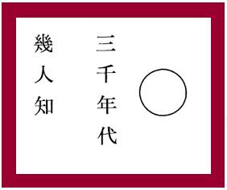

<!-- id: s13-03-0021 -->

Ce coup de pinceau, c’est lui qui va m’importer, c’est sur lui que je vais fixer votre attention pour supporter ce que j’ai aujourd’hui à avancer dans le chemin que nous avons ouvert.

<!-- id: s13-03-0022 -->

Il n’est pas douteux qu’il est là dans la position propre qui est celle… qui est celle que je définis pour être celle du signifiant.

<!-- id: s13-03-0023 -->

Qu’il *représente le sujet, et pour un autre signifiant*, ceci étant assez assuré par le contenu de l’écriture qui ici s’aligne et se lit comme l’écriture chinoise qu’elle est :

<!-- id: s13-03-0024 -->

<!-- id: s13-03-0025 -->

\[en simplifié et en *pinyin*\]

<!-- id: s13-03-0026 -->

> 几 *jī* 三 *sān*
>
> 人 *rén* 千 *qiān*
>
> 知 *zhī*   年 *nián*
>
> 代 *dài*

<!-- id: s13-03-0027 -->

Ceci est écrit en caractère chinois, je vous le prononcerai, non pas en Japonais mais en Chinois :

<!-- id: s13-03-0028 -->

> 三千年代 几人知

<!-- id: s13-03-0029 -->

*Sān* *qiān* *nián* *dài* *jī* *rén* *zhī* 

<!-- id: s13-03-0030 -->

Ce qui veut dire : « *Dans trois mille ans, combien d’hommes sauront ?* »

<!-- id: s13-03-0031 -->

Sauront quoi ? Sauront qui a fait ce cercle. Qui était cet homme dont j’ai cru devoir d’abord, vous indiquer l’empan, entre le plus extrême, le plus pyramidal de la science et un mode d’exercice dont nous ne pouvons pas ne pas tenir compte ici, comme fonds de ce qu’il nous laisse ici décrire ?

<!-- id: s13-03-0032 -->

« *Dans trois mille ans, combien d’hommes sauront ?* » ce qu’il y a au niveau de ce cercle tracé ?

<!-- id: s13-03-0033 -->

Je me suis permis, *dans ma propre calligraphie*, de répondre :

<!-- id: s13-03-0034 -->

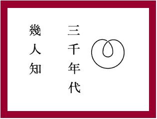

<!-- id: s13-03-0035 -->

\[en simplifié et en *pinyin*\] 人 *rén* 三 *sān* 知 *zhī* 千 *qiān* 也 *yě* 年 *niá* 前 *qián*

<!-- id: s13-03-0036 -->

« *Dans trois mille ans, bien avant, les hommes sauront* ».

<!-- id: s13-03-0037 -->

三千年前 人知也 *sān qiān nián qián rén zhī yě*

<!-- id: s13-03-0038 -->

*Bien avant trois mille ans* - et après tout, ça peut commencer aujourd’hui - *les hommes sauront*.

<!-- id: s13-03-0039 -->

Ils se souviendront peut-être que le sens de cette *trace* mérite de s’inscrire ainsi.

<!-- id: s13-03-0040 -->

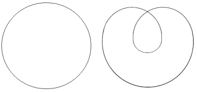

<!-- id: s13-03-0041 -->

Malgré la différence apparente, c’est *topologiquement* la même chose. Supposez que ceci soit rond, que ce que j’ai appelé cercle soit un disque. Ce qu’ici j’ai tracé de ma main, est aussi un disque bien que sous la forme de deux lobes dont l’un recouvre l’autre, la surface est d’un seul tenant, elle est limitée par un bord qui, par déformation continue peut se développer de façon à ce que l’un des bords recouvre l’autre. L’homomorphie topologique est évidente.

<!-- id: s13-03-0042 -->

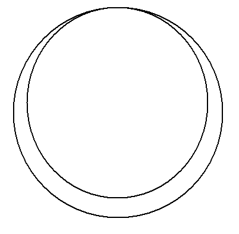

<!-- id: s13-03-0043 -->

Que signifie alors que *je l’ai tracée d’une façon différente* et que ce soit là-dessus que j’aie maintenant à attirer votre attention ?

<!-- id: s13-03-0044 -->

Un tracé que j’ai appelé un cercle et non pas un disque, laisse en suspens la question *de ce qu’il limite*. Pour voir les choses là où elles sont tracées, sur un plan, ce qu’il limite : c’est peut-être ce qui était *dedans*, c’est peut-être aussi ce qui est au *dehors*.

<!-- id: s13-03-0045 -->

À la vérité, c’est là qu’il nous faut considérer ce qu’il peut y avoir d’originel dans la fonction de *l’écrit*.

<!-- id: s13-03-0046 -->

Quittons un instant ce que nous avons ici sous les yeux et que je propose plutôt assurément à un *experimentum mentis,* à un exercice de l’esprit, qu’à une adhésion intuitive. Car si je vous emmène dans le champ de la topologie, c’est pour vous introduire à une sorte d’assouplissement *mentis*, d’un exercice mental, concernant des figures qui ne sont pas, sans doute, sans pouvoir être appréhendée de quelque façon, intuitivement, mais dont il vous suffira d’essayer, au moins pour ce qui est des moins prévenus, de me suivre pour, disons les effets que j’essaierai de vous y décentrer par le tracé de certaines *coupures*.

<!-- id: s13-03-0047 -->

Vous verrez tout de suite que vous aurez assez de peine pour ces choses *excessivement simples* qui sont là, s’étageant à votre usage dans ce que je vous ai pour aujourd’hui préparé, pour que vous vous aperceviez que ce n’est sans doute pas pour rien que *ces constructions qui s’appellent*...

<!-- id: s13-03-0048 -->

> je les déjà toutes introduites et j’en ai déjà même assez usé et abusé,
>
> mais non sans que j’ai aujourd’hui besoin de rassembler ce qui les regarde ...*ces figures appelées bouteille de Klein, plan projectif, tore,* se trouvent par rapport à ce qui est la structure des *coordonnées* habituelles de notre intuition, dans une position si déroutante, qu’il faut vraiment s’y *exercer*, s’y *appliquer*, pour s’y *retrouver* aisément .

<!-- id: s13-03-0049 -->

C’est en ceci… je m’excuse - auprès de ce que je peux avoir dans mon auditoire de mathématiciens - de devoir expliquer les choses par des oppositions, en quelque sorte massives et qui laissent échapper une part de la rigueur de ce qui serait *la présentation* actuelle de ce qu’il en est, par exemple *de ce chapitre où apparaissent ces figures dans un livre moderne de topologie*.

<!-- id: s13-03-0050 -->

Mais après tout je n’ai pas non plus trop à m’en excuser, car *ces difficultés qu’on qualifie de difficultés intuitives concernant le champ* *de la topologie* ont été en quelque sorte radicalement éliminées de l’exposé à proprement parler mathématique de ces choses.

<!-- id: s13-03-0051 -->

Si elles n’y pèsent même pas un instant - vu les formules combinatoires très assurées dans leurs *prémisses*, dans leurs *axiomes* originels, dans leurs *lois* qui sont avancées - il n’en reste pas moins que quelque chose garde sa valeur dans la difficulté même qu’ont présenté ces choses à être décantées, à finir par trouver leur statut logico-mathématique et que c’est trop aisé de s’en débarrasser en disant qu’il y avait là des restes d’impuretés intuitionnistes, que tout serait dans le fait - par exemple - qu’on s’est laissé trop longtemps encombrer par une vue en quelque sorte liée à l’expérience d’un *espace à trois dimensions*, qu’il fallait en arriver à pouvoir le penser, à le construire, à partir de ces données de l’expérience en variant, en échafaudant, en édifiant *une combinatoire généralisée*.

<!-- id: s13-03-0052 -->

On se contente de cette *critique* et de cette *référence*, mais je pense qu’on manque là quelque chose.

<!-- id: s13-03-0053 -->

Si *le nombre négatif*... pour nous en tenir à une des apories historiques vraiment - maintenant pour nous - qui nous paraissent le plus grossièrement élémentaires - qui est-ce qui se tourmente à propos de l’existence du *nombre négatif* ?

<!-- id: s13-03-0054 -->

Et *cette tranquillité où nous sommes à propos du* *nombre négatif*, outre d’ailleurs qu’elle ne recouvre rien de bon, elle est tout de même néanmoins bien utile pour ce qui est de ne pas se poser de questions inutiles, cette tranquillité à l’égard du nombre négatif ne date pas de plus d’un siècle.

<!-- id: s13-03-0055 -->

Je parlais encore tout récemment avec *un mathématicien* fort érudit, qui connaît admirablement son *histoire des mathématiciens* : encore du temps de DESCARTES le *nombre négatif*, cette grandeur au-dessous du 0, ça les tourmente.

<!-- id: s13-03-0056 -->

Ils ne sont pas tranquilles : les nombres ça croît, ça décroît aussi et quand ça dépasse la limite en dessous, le fond du fond, où est-ce que ça va ? Après tout c’est assez légitime, s’ils prenaient les choses en ces termes, qu’ils en soient tourmentés.

<!-- id: s13-03-0057 -->

Je n’évoque cet exemple simple… vous pensez bien qu’il me serait facile d’en évoquer d’autres : le nombre irrationnel, *le nombre* qu’on appelle *imaginaire*, la fameuse √-1 . Là encore, *les mathématiciens* oublient un petit peu aisément ce que ce *nombre imaginaire* a été pendant des siècles, cinq ou six siècles environ.

<!-- id: s13-03-0058 -->

Vous savez qu’il est apparu à propos d’une racine en dehors du champ du concevable de la très simple *équation du* 2*nd degré*. Depuis ce temps-là jusqu’au début du XIXème siècle - ça en fait quelques uns - le *nombre imaginaire* on ne savait qu’en faire, qu’en faire conceptuellement, et si maintenant les choses sont assurées à partir du fondement du *nombre complexe*…

<!-- id: s13-03-0059 -->

> extension des ensembles numériques auxquels on a fini par donner son statut …il n’en reste pas moins qu’il est assez aisé aux mathématiciens - et trop aisé ! - de ne pas remarquer que bien entendu, le terme d’« *imaginaire* » lui reste attaché, mais que c’est *un nombre aussi bon qu’un autre*, que cette notion que je viens de faire intervenir d’ensemble numérique suffit à la couvrir, et qu’il n’est pas plus *imaginaire* qu’un autre.

<!-- id: s13-03-0060 -->

Eh bien, *c’est sur ce point que j’avancerai une objection*. Car il me semble que pour tout ce qui a constitué ainsi point d’arrêt, point de scansion dans la progressive maîtrise des conquêtes de certaines structures que j’ai évoquées à l’instant sous le terme d’ensembles numériques, l’obstacle n’est pas à mettre sous le registre de l’intuition, de ce voile, de cette fermeture, qui résulterait de ce que ne peut être visualisé quelque support de ce dont il s’agit dans la combinatoire.

<!-- id: s13-03-0061 -->

Je tiens au contraire que nous sommes portés à quelque chose de plus *primitif* qui n’est rien d’autre que ce que nous essayons de saisir comme *la structure*, comme la constitution, *de par le signifiant*, du sujet. C’est en tant que ces diverses formes de l’expression numérique se trouvent *reproduire* divers temps de *scansion*, je dis *reproduire* temporellement, et nous ne sommes même pas sûrs que c’est du même tour qu’il s’agit dans cette reproduction : il faut y aller voir.

<!-- id: s13-03-0062 -->

En d’autres termes, il y a peut-être des formes structurales de ce manque constitutif du sujet qui diffèrent les unes des autres, et que peut-être, ce n’est pas le même qui s’exprime dans ce *nombre négatif*, à propos duquel on peut bien dire que, l’introduction par KANT[^47] de ce nombre dans le champ de la philosophie est vraiment - quand on y retourne - du caractère le plus navrant. Peut-être est-ce un grand mérite que KANT ait tenté cette introduction. Le résultat est un incroyable pataugeage. Donc ce n’est pas le même moment du *manque structural du sujet*, peut-être, qui *se supporte*, je ne dis pas là *se symbolise* : ici *le symbole* est identique à ce qu’il cause, c’est à dire le manque du sujet. J’y reviendrai.

<!-- id: s13-03-0063 -->

Il y a à introduire au niveau du manque, la dimension subjective du manque, or je suis étonné que personne n’ait regardé dans l’article de FREUD sur *Le fétichisme* [^48] l’usage du verbe *vermessen* dont on peut voir que, dans ses trois emplois dans cet article il désigne le manque au sens subjectif, *au sens où le sujet manque son affaire*.

<!-- id: s13-03-0064 -->

Nous voici donc portés, sur cette fonction du manque au sens où elle est liée à ce quelque chose d’originel qui s’appelant *la coupure*, se situe *en un point où c’est l’écrit qui détermine le champ du langage*. Si j’ai pris soin d’écrire *Fonction et champ de la parole et du langage,* c’est que *Fonction* se rapporte à *parole* et *champ* à *langage*. Un champ *ça a une définition mathématique tout à fait précise*.

<!-- id: s13-03-0065 -->

La question a été posée dans la première partie d’un article paru - je crois, cette semaine, en tout cas c’est cette semaine que j’en ai reçu la livraison - par quelqu’un[^49] qui est très proche de certains de mes auditeurs et qui introduit, avec une vivacité, un mordant, une verdeur qui lui donne vraiment une portée inaugurale, cette question de *la fonction de l’écriture dans le langage*.

<!-- id: s13-03-0066 -->

Il pointe d’une façon je dois dire, définitive, irréfutable, que faire de l’écriture un instrument, de ce qui serait, vivrait, dans la parole, est absolument méconnaître sa véritable fonction. Qu’il faille la reconnaître ailleurs, est structural au langage même, d’une chose que j’ai assez indiqué moi-même, et ne serait-ce que dans la prévalence donnée à *la fonction du trait unaire* au niveau de *l’identification,* pour que je n’aie pas là-dessus à *souligner mon accord*.

<!-- id: s13-03-0067 -->

Ceux qui ont assisté à mes anciens séminaires[^50], *s’ils se souviennent encore de quelque chose de ce que j’y ai dit,* pourront se souvenir de la valeur donnée à ceci : quelque chose d’en apparence aussi caduc et ininterprétable que la trouvaille faite par

<!-- id: s13-03-0068 -->

Sir [FLINDERS PETRIE](http://fr.wikipedia.org/wiki/William_Matthew_Flinders_Petrie)[^51] sur les tessons prédynastiques, à savoir loin antérieurs à la fondation de l’alphabet phénicien, précisément des signes de cet alphabet prétendus phonétiques qui étaient là bien évidemment comme marque de fabrique.

<!-- id: s13-03-0069 -->

Et j’ai là-dessus accentué ceci, qu’il nous faut au moins admettre, même quand il s’agirait prétendument d’*écriture phonétique,* que *les signes* sont venus de quelque part, certainement pas du besoin de *signaler*, de *coder* des phonèmes. Alors que chacun sait que même dans une écri­ture phonétique, ils ne codent rien du tout. Par contre, ils expriment remarquablement *la relation fondamentale* que nous mettons au centre de *l’opposition phonématique* en tant qu’elle se distingue de *l’opposition phonétique*.

<!-- id: s13-03-0070 -->

Ce sont là choses grossières, je dirai tout à fait en retard, au regard de la précision avec laquelle la question est posée dans l’article que je vous ai dit. C’est toujours bien dangereux d’ailleurs d’indiquer des références : il faut savoir à qui.

<!-- id: s13-03-0071 -->

Bien sûr ceux qui liront ceci y verront mises en question certaines oppositions telles que celle du signifié et du signifiant \- ça va jusque là - et y verront peut-être discordance là où il n’y en a aucune.

<!-- id: s13-03-0072 -->

D’autre part - qui sait ? - ça les incitera à lire tel article avant ou après, il y a toujours quelque chose de bien délicat dans cette référence toujours fondamentale *qu’un signifiant renvoie à un autre signifiant*.

<!-- id: s13-03-0073 -->

Écrire et publier ce n’est pas la même chose. Que j’écrive, même quand je parle n’est pas douteux.

<!-- id: s13-03-0074 -->

« *Alors pourquoi ne publiez-vous pas plus ?* ». Justement à cause de ce que je viens de dire : on publie quelque part.

<!-- id: s13-03-0075 -->

La conjonction fortuite, inattendue, de ce quelque chose qui est l’écrit et qui a ainsi d’étroits rapports avec *l’objet(a)*, donne à toute conjonction non concertée d’écrit, l’aspect de la poubelle.

<!-- id: s13-03-0076 -->

Croyez-moi, à l’heure matinale où il m’arrive de rentrer chez moi, j’ai une grande expérience de la poubelle et de ceux qui la fréquentent. Rien de plus fascinant que ces êtres nocturnes qui y chopent je ne sais quoi dont il est impossible de comprendre l’utilité. Je me suis longuement demandé pourquoi un ustensile aussi essentiel avait si aisément gardé le nom d’un préfet, auquel on avait déjà donné un nom de rue ce qui aurait bien suffi à sa célébration. Je crois que si le mot *poubelle* est venu *si exactement* se colloquer avec cet ustensile, c’est justement à cause de sa parenté avec la *poubellication*.

<!-- id: s13-03-0077 -->

Pour revenir à nos Chinois vous savez - *je ne sais pas si c’est vrai mais c’est édifiant* - qu’on n’y met jamais à la poubelle un papier sur lequel a été tracé un caractère. Des gens, *pieux vieillards dit-on,* parce qu’ils n’ont rien d’autre à faire, les collectent pour les brûler sur *un petit autel* *ad hoc*. C’est vrai. *Si non e vero, e bello !* 

<!-- id: s13-03-0078 -->

Il est tout à fait essentiel de délimiter cette sorte de trappe d’extériorité que j’essaie de définir au regard de la fonction de la poubelle dans ses rapports avec l’écrit. Ceci n’implique pas l’exclusion de toute hiérarchie. Disons que parmi les revues dont nous sommes dotés il y a des poubelles plus ou moins distinguées. Mais à bien prendre les choses, je n’ai pas vu d’avantages sensibles sur les poubelles de la rue de Lille, par rapport à celles de quartiers plus circonvoisins.

<!-- id: s13-03-0079 -->

Donc, reprenons notre trou. Chacun sait qu’un exercice ZEN, ça a tout de même quelque rapport - encore qu’on ne sache pas bien ce que ça veut dire - avec la réalisation subjective d’un vide. Et nous ne forçons rien en admettant que quiconque, le contemplateur moyen, verra cette figure, se dira qu’il y a quelque chose comme une sorte de moment sommet, qui doit avoir rapport avec le vide mental, qu’il s’agit d’obtenir et qui serait obtenu : ce moment singulier, brusquerie succédant à l’attente qui se réalise parfois par *un mot, une phrase, une jaculation, voire une grossièreté, un pied de nez, un coup de pied au cul*… Il est bien certain que ces sortes de *pantalonnades* ou *clowneries* n’ont de sens qu’au regard d’une longue préparation subjective.

<!-- id: s13-03-0080 -->

Mais encore, au point où nous en sommes venus, si vide il y a, si le cercle est à considérer - pour nous - comme définissant sa valeur trouante, si, y trouvant faveur à figurer ce que nous avons approché, par toutes sortes de convergence, de ce qu’il en est de *l’objet(a)*, que *l’objet(a)* soit lié en tant que chute, à l’émergence, à la structuration, du sujet comme division, c’est là ce qui représente, je dois dire, le point de la mise en question : qu’est-ce qu’il en est du sujet dans notre champ ?

<!-- id: s13-03-0081 -->

Est-ce que ce trou, cette chute, cette πτῶσις \[ptôsis\], pour employer ici *un terme stoïcien* dont il me semble que la difficulté, certes tout à fait insoluble, qu’il fait aux commentateurs, pour être affronté avec le seul κατηγόρημα \[catégorèma\], et ceci à propos d’un λεκτόν \[lecton\], autre terme mystérieux, traduisons-le *sous toutes réserves* et de la façon la plus grossière, certainement inexacte, par *signification*, signification incomplète, en d’autres termes : fragment de pensée.

<!-- id: s13-03-0082 -->

L’une de ces possibilités de « *fragment de pensée* », c’est la δόξα \[doxa\], l’εὐδόκειν \[eudokein\].

<!-- id: s13-03-0083 -->

Et les commentateurs bien sûr, tenus par l’incohérence du système, ne loupent pas tellement le rapport en le traduisant par sujet, sujet *logique*. Comme il s’agit de *logique* à ce niveau de la doctrine stoïcienne, ils n’ont pas tort.

<!-- id: s13-03-0084 -->

Mais que nous puissions y reconnaître à la trace cette articulation de *quelque chose qui choît avec la constitution du sujet*, voilà ce dont je crois nous aurions tort de ne pas nous sentir confortés.

<!-- id: s13-03-0085 -->

Alors allons-nous, de ce *trou*, nous contenter ? *Un trou dans le réel, voilà le sujet*. Un peu facile.

<!-- id: s13-03-0086 -->

Nous sommes encore là, au niveau de *la métaphore*. Nous trouverions là pourtant - à nous y arrêter un instant - une indication précieuse, notamment quelque chose de tout à fait indiqué par notre expérience, qui pourrait s’appeler l’inversion de la fonction du cercle eulérien : nous serions encore dans le champ de l’opération de l’attribution, nous rejoindrions là le chemin nécessaire à ce que FREUD définit comme la *Bejahung*, d’abord et seule rendant concevable la *Verneinung*.

<!-- id: s13-03-0087 -->

Il y a la *Bejahung*, et la *Bejahung* est un *jugement* *d’attribution*. Elle ne préjuge pas de l’existence, elle ne dit pas « *le vrai sur le vrai* ».

<!-- id: s13-03-0088 -->

Elle donne le départ du vrai à savoir quelque *chose* qui se développera : ποῖος \[poïos\], telle la *qualification*, la *quiddité,* ce qui n’est d’ailleurs *pas tout à fait pareil*. Nous en avons un exemple dans l’expérience psychanalytique, il est premier pour notre objet d’aujourd’hui, c’est *le phallus*. Le *phallus* à un certain niveau de l’expérience - qui est à proprement parler celle qui est analysée dans le cas du petit Hans - *le phallus est l’attribut de ce que Freud appelle « les êtres animés »*. Laissons de côté, si nous n’avons pas une désignation meilleure.

<!-- id: s13-03-0089 -->

Mais observez que si ceci est vrai, ce qui veut dire que tout ce qui se développe dans le registre de l’animisme aura eu pour départ un attribut qui ne fonctionne qu’à être placé au centre, à structurer le champ à l’extérieur et à commencer à être fécond à partir du moment où il tombe, c’est à dire où il ne peut plus être vrai que le *phallus* est l’attribut de tous les êtres animés. Je le répète, si j’ai avancé ce schéma, je ne l’ai fait qu’entre parenthèses.

<!-- id: s13-03-0090 -->

Soit dit en passant, si mon discours se déroule de la parenthèse, du suspens et de sa clôture, puis de sa reprise très souvent embarrassée, reconnaissez-y une fois de plus la structure de l’écriture.

<!-- id: s13-03-0091 -->

Est-ce donc là… Serait-ce donc là, un de ces rappels sommaires où se limiterait l’exhaustion que nous tentons de faire ? Assurément pas ! Car il ne s’agit pas pour nous de savoir, au point où nous portons la question, comment le signifiant peinturlure le réel ! Qu’on puisse colorier n’importe quelle carte sur un plan avec *quatre couleurs* et que ça suffise…

<!-- id: s13-03-0092 -->

> encore que ce théorème soit à cette date, comme toujours, vérifié mais encore indémontré …ce n’est pas ce qui nous intéresse aujourd’hui.

<!-- id: s13-03-0093 -->

Il ne s’agit pas du signifiant comme *trou dans le réel*. Il s’agit du signifiant comme déterminant *la division du sujet*.

<!-- id: s13-03-0094 -->

Qu’est-ce qui peut nous en donner la structure ? Aucun vide, aucune chute de *l’objet(a)*, aucune angoisse primordiale n’est susceptible d’en rendre compte, et je vais essayer de vous le faire sentir par des considérations topologiques.

<!-- id: s13-03-0095 -->

Si je procède ainsi, c’est parce qu’il y a un fait tout à fait frappant, c’est que de mémoire de *griffonneur*, et Dieu sait que ça date, même si on croit que l’écriture est une invention récente, il n’y a pas d’exemple que tout ce qui est de l’ordre du *sujet*, et du *savoir* du même coup, ne puisse toujours *s’inscrire sur une feuille de papier*.

<!-- id: s13-03-0096 -->

Je considère que c’est là un fait d’expérience plus fondamental que celui que nous avons, que nous aurions, que nous croyons avoir, des *trois dimensions*. Car nous avons appris, ces *trois dimensions* à les faire vaciller un petit peu. Il suffit qu’elles vacillent un *petit peu* pour qu’elles vacillent *beaucoup*, au lieu que, peut-être, on écrive toujours sur une feuille de papier et qu’on n’ait pas besoin de la remplacer par des cubes : <u>ça</u>, n’a pas encore vacillé. Il doit donc y avoir là quelque chose, dont je ne suis pas en train de dire qu’il faille en conclure que le *réel* n’est que de deux dimensions.

<!-- id: s13-03-0097 -->

Je pense assurément que *les fondements de l’esthétique transcendantale* sont à reprendre, que la mise en jeu, ne serait-ce qu’à titre probatoire, d’une topologie à deux dimensions pour ce qui concerne le sujet, aurait en tout cas déjà cet avantage rassurant…

<!-- id: s13-03-0098 -->

> *si nous continuons à croire, dur comme fer, à nos trois dimensions dans lesquelles en effet nous avons bien des raisons de leur marquer*
>
> *de l’attachement à ces trois dimensions, parce que c’est là que nous respirons* …ça aurait au moins l’avantage rassurant de nous expliquer en quoi, ce qui concerne *le sujet*, est de la catégorie de *l’impossible*. Et que tout ce qui nous parvient - *par lui* - du *réel*, s’inscrit d’abord au registre de *l’impossible*, de *l’impossible réalisé*.

<!-- id: s13-03-0099 -->

Le *réel* dans lequel se taille *le patron de la coupure subjective*, c’est ce *réel* que nous connaissons bien parce que nous le retrouvons, à l’envers en quelque sorte, de notre langage chaque fois que nous voulons vraiment serrer ce qu’il en est du *réel* : *le réel c’est toujours l’impossible*.

<!-- id: s13-03-0100 -->

Reprenons donc notre *feuille de papier *: notre *feuille de papier*, nous ne savons pas ce que c’est. Nous savons ce que c’est que *la coupure* et que, cette *coupure,* celui qui l’a tracée, est suspendu à son effet. « *Dans trois mille ans, combien d’hommes sauront ?* »

<!-- id: s13-03-0101 -->

Il faudrait savoir quelle condition doit remplir une feuille de papier - ce qu’on appelle en topologie « *une surface* » : là où nous avons fait les *trous - pour que ce trou soit une cause*, à savoir *ait changé* *quelque chose*.

<!-- id: s13-03-0102 -->

Observez que pour ce que nous essayons de saisir de ce qu’il en est du *trou*, nous n’allons pas nous mettre à en supposer un autre, celui-là nous suffit. Si ce trou a eu pour effet de faire tomber une chute un lambeau… bon, *il faut que ce qui reste ne soit pas la même chose*, parce que si c’est la même chose, c’est exactement ce qu’on appelle *un trou* ou un coup d’épée dans l’eau.

<!-- id: s13-03-0103 -->

Eh bien, si nous nous fions au support intuitif le plus accessible, le plus familier, le plus fondamental, et dont il ne s’agit d’ailleurs pas de déprécier bien sûr, ni l’intérêt historique, ni l’importance réelle , à savoir *une sphère*…

<!-- id: s13-03-0104 -->

> *je demande ici pardon aux mathématiciens : c’est à l’intuition qu’ici je fais appel, puisque nous n’avons qu’une surface dans laquelle on tranche et que je n’ai pas à faire appel à quelque chose qui est plongé, justement dans l’espace à trois dimensions* …à savoir que ce que je veux simplement dire en vous demandant d’évoquer une sphère, c’est de penser que ce qui reste autour du cercle n’a pas d’autre bord.

<!-- id: s13-03-0105 -->

Vous ne pouvez intuitionner ça dans l’état actuel des choses que sous la forme d’une sphère, une sphère avec un trou.

<!-- id: s13-03-0106 -->

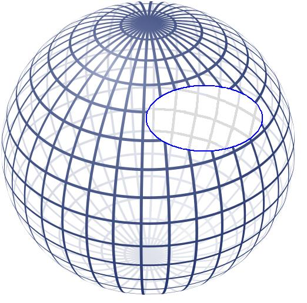 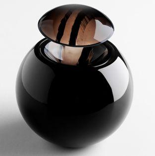

<!-- id: s13-03-0107 -->

Si vous réfléchissez à ce que c’est qu’une sphère avec un trou, c’est exactement la même chose que le couvercle que vous venez de faire tomber. La sphère a la même structure.

<!-- id: s13-03-0108 -->

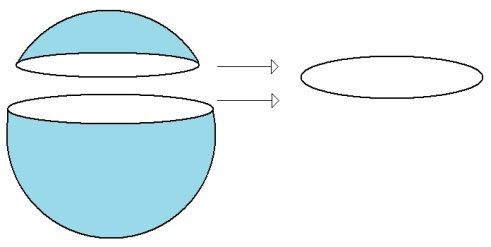

<!-- id: s13-03-0109 -->

*La chute* dont il s’agit dans ce tracé fondamental *n’a pas d’autre effet que de faire resurgir à la même place ce qui vient d’être ablationné*. Ça ne nous permet en aucun cas de concevoir quelque chose qui, au regard du sujet qui nous intéresse, soit *structural*.

<!-- id: s13-03-0110 -->

Comme il faut bien que j’avance, je ne ferai qu’une allusion rapide au fait que M. BROUWER…

<!-- id: s13-03-0111 -->

> personnage considérable dans le développement moderne des mathématiques …a démontré ce *théorème* topologiquement, qui topologiquement est le seul à nous donner le vrai fondement de la notion de centre, *une homologie topologique* : deux figures, quelles qu’elles soient, en tant que pourvues d’un bord, peuvent être, par déformation de ce bord, démontrées *homéomorphiques*.

<!-- id: s13-03-0112 -->

En d’autres termes vous prenez un carré, c’est topologiquement la même chose que ce cercle, car vous n’avez qu’à souffler \- *si je puis m’exprimer ainsi* - à l’intérieur du carré, *il se gonflera en cercle*. Et inversement, vous donnez des coups de marteau sur le cercle, sur ce cercle à deux dimensions, vous donnez un coup de marteau à deux dimensions également et *il fera un carré*.

<!-- id: s13-03-0113 -->

Il est démontré que *cette transformation*, de quelque façon qu’elle soit faite, laisse au moins *un point fixe*, ou...

<!-- id: s13-03-0114 -->

chose plus *astucieuse* et moins facile à voir immédiatement, encore que déjà la première chose ne soit pas si facile *...ou un nombre impair de points fixes*. Je ne m’étendrai pas là-dessus. Je veux simplement vous dire qu’à ce niveau de structure de la surface, la structure est, si l’on peut dire, concentrique, même si c’est par l’extérieur que nous passons. Je veux dire intuitivement, pour percevoir ce qui se rejoint, au niveau de ce bord, il s’agit d’une structure concentrique .

<!-- id: s13-03-0115 -->

Il y a très longtemps que j’ai dit - je suis encore plus porté à le dire, mais je ne le dirai pas pourtant - que PASCAL était un très mauvais métaphysicien. Ce « *monde des deux infinis* », ce morceau littéraire qui nous *casse les pieds* depuis quasi notre naissance, me parait être la chose la plus désuète qui se puisse imaginer. Cet autre τόπος \[topos\] anti-aristotélicien « *où le centre est partout, et la circonférence nulle part »,* me paraît bien être la chose la plus à côté qui soit, si ce n’est que j’en ferai aisément sortir toute *la théorie* de l’angoisse de PASCAL.

<!-- id: s13-03-0116 -->

Je le ferai d’autant plus aisément qu’à la vérité si j’en crois des remarques stylistiques qui m’ont été apportées par ce grand lecteur en matière de mathématiques qui m’a prié de me référer au texte de DESARGUES, lequel était un autrement grand styliste que PASCAL, pour s’apercevoir - ce que nous savons très fermement par ailleurs - de l’importance que les références de DESARGUES pouvaient avoir pour PASCAL, ce qui changerait tout le sens de son œuvre.

<!-- id: s13-03-0117 -->

Quoi qu’il en soit, il est clair que sur cette structure concentrique, sphérique, si *le cercle peut être partout*, assurément *le centre* *n’est nulle part*. Autrement dit, il saute aux yeux de n’importe qui, qu’il n’y a pas de centre à la surface d’une sphère.

<!-- id: s13-03-0118 -->

Là est l’incohérence de l’intuition pascalienne.

<!-- id: s13-03-0119 -->

Et maintenant, le problème se pose de savoir s’il ne peut pas y avoir…

<!-- id: s13-03-0120 -->

> pour nous expliquer en termes, non pas d’*images*, mais peut-être d’*idées*, et qui vous donnent l’*idée* d’où je vous guide …si à l’extérieur de ce que j’ai appelé « *le cercle* » très intentionnellement, et pas circonférence, le cercle veut dire ce que vous appelez ordinairement en géométrie circonférence, ce qu’on appelle d’habitude cercle, je l’appellerai *disque* ou *lambeau*, comme tout à l’heure.

<!-- id: s13-03-0121 -->

*Qu’est-ce qu’il faut qu’il y ait au dehors pour structurer le sujet ?*

<!-- id: s13-03-0122 -->

Autrement dit, pour que la coupure d’où résulte la chute de *l’objet(a)*, fasse apparaître…

<!-- id: s13-03-0123 -->

> sur quelque chose qui était tout à fait fermé jusque là, et où donc rien ne pouvait apparaître …pour faire apparaître, en ce que nous exigeons de *la constitution du sujet*, le sujet comme fondamentalement *divisé* ?

<!-- id: s13-03-0124 -->

Ceci est facile à faire apparaître car il suffit que vous regardiez la façon dont est disposé ce cercle dans la façon dont je l’ai retracé…

<!-- id: s13-03-0125 -->

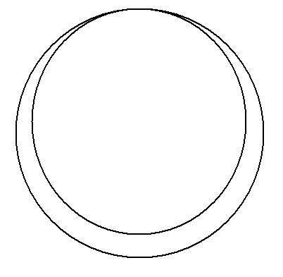

<!-- id: s13-03-0126 -->

pour vous apercevoir que si ce tracé vous le concevez vide, comme je vous ai appris à lire vide celui-ci, il devient très simplement…

<!-- id: s13-03-0127 -->

> et cela saute aux yeux, je pense tout de même vous avoir assez parlé jusqu’ici de la *bande de Mœbius* pour que
>
> vous la reconnaissiez …il est *la monture*, *l’armature*, ce qui vous permet de voir *soutenu* et immédiatement intuitionnable une *bande de Mœbius*.

<!-- id: s13-03-0128 -->

Vous la voyez ici :

<!-- id: s13-03-0129 -->

→ 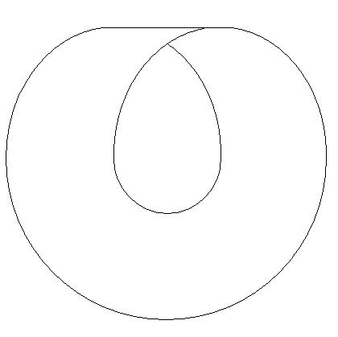

<!-- id: s13-03-0130 -->

Joignez, si je puis dire, *d’une trace* chacun de ses bords. Vous la voyez se renverser et venir se coudre au niveau de *son envers* à ce qui était d’abord *son endroit*.

<!-- id: s13-03-0131 -->

La *bande de Mœbius* a de nombreuses propriétés. Il y en a une majeure, capitale, que je vous ai suffisamment, je pense, représentée dans les années précédentes - jusqu’avec une paire de ciseaux, ici, moi-même je vous l’ai démontrée – à savoir *qu’une bande de Mœbius, <u>ça n’a aucune surface</u>, que c’est un pur bord.*

<!-- id: s13-03-0132 -->

Non seulement il n’y a qu’un bord à cette surface de la [*bande de Mœbius*](http://www.youtube.com/watch?v=21qgxixi3Dw&feature=related) mais si je la refends par le milieu, il n’y a plus de *bande de Mœbius*, car c’est mon trait de coupure, c’est la propriété de la division qui institue la *bande de Mœbius*.

<!-- id: s13-03-0133 -->

Vous pouvez retirer de la *bande de Mœbius* autant de petits morceaux que vous voudrez, il y aura toujours une *bande de Mœbius* tant qu’il restera quelque chose de la bande, mais ça ne sera toujours pas *la bande que vous tiendrez*.

<!-- id: s13-03-0134 -->

La *bande de Mœbius*, c’est une surface telle que *la coupure* qui est tracée en son milieu, soit *elle*, la *bande de Mœbius*.

<!-- id: s13-03-0135 -->

La *bande de Mœbius* dans son essence , c’est *la coupure* même. Voilà en quoi la *bande de Mœbius* peut être pour nous le support structural de la constitution du sujet comme divisible.

<!-- id: s13-03-0136 -->

Je vais ici avancer quelque chose dont je vous signale, au niveau topologique strict l’inexactitude. Néanmoins ce n’est pas cela qui sera pour nous gêner, car, que je sois pris entre vous expliquer quelque chose d’une façon inexacte ou ne pas vous l’expliquer du tout.

<!-- id: s13-03-0137 -->

Voilà un de ces exemples tangibles de ces impasses subjectives qui sont précisément ce sur quoi nous nous fondons.

<!-- id: s13-03-0138 -->

Donc - j’avance... - vous ayant suffisamment avertis, qu’en stricte doctrine topologique ceci est inexact.

<!-- id: s13-03-0139 -->

Vous pouvez remarquer que ma *bande de Mœbius*, je parle de celle qui se dessine sur la monture de cet *objet(a)* :

<!-- id: s13-03-0140 -->

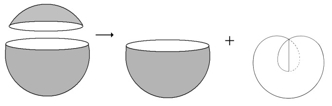

<!-- id: s13-03-0141 -->

Cette monture, je vous l’ai dit, c’est exactement un *lambeau sphérique* qui ne se distingue en rien de ce que je vous ai démontré tout à l’heure à propos du trou de JIOUN SONJA. Pour qu’il puisse servir de monture à une *bande de Mœbius*, c’est bien que la *bande de Mœbius* change radicalement sa nature de *lambeau* ou de *portioncule* en se soudant à lui.

<!-- id: s13-03-0142 -->

Ce dont il s’agit, c’est d’un *texte*, *tissu*, *cohérence* *d’une étoffe*, de quelque chose de tel, qu’y étant passée la trace d’une certaine coupure, *deux éléments distincts*, hétérogènes apparaissent, dont l’un est une *bande de Mœbius*…

<!-- id: s13-03-0143 -->

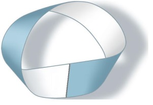

<!-- id: s13-03-0144 -->

…et dont l’autre est ce lambeau équivalent à tout autre sphérique :

<!-- id: s13-03-0145 -->

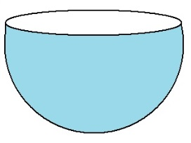

<!-- id: s13-03-0146 -->

Cette *bande de Mœbius*, fomentez la par l’imagination, elle viendra en cette ligne nécessairement, si la chose est plongée dans trois dimensions - c’est là qu’est mon inexactitude - mais c’est une inexactitude qui ne suffit pas à écarter le problème de ce fait que quelque chose qui est *indiqué dans les trois dimensions par un recroisement*, un recoupement qui donne finalement, à la figure totale de ce qu’on appelle communément *une sphère coiffée d’un chapeau croisé* ou *cross-cap,* qui donne ce qui est ici dessiné en rouge :

<!-- id: s13-03-0147 -->

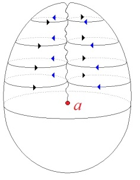

<!-- id: s13-03-0148 -->

À savoir ce que vous pouvez imaginer…

<!-- id: s13-03-0149 -->

> toujours d’une façon bien sûr inexacte, et plongé dans la troisième dimension …comme ayant, *dans le bas et au niveau de cette base, de cette chiasmatique, de ce recroisement,* comme ayant cette coupe :

<!-- id: s13-03-0150 -->

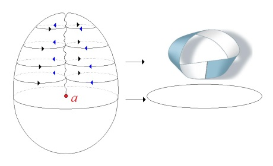

<!-- id: s13-03-0151 -->

Toute coupure qui passe au niveau de ce qui, schématiquement est représenté comme cette trace de recroisement, toute coupure fermée qui passe par ce recroisement est quelque chose qui dissipe, si je puis dire i*nstantanément* toute la structure du *cross-cap*, *chapeau croisé*, ou encore *plan projectif*.

<!-- id: s13-03-0152 -->

À la différence d’une sphère, qui ne quitte pas *sa structure fondamentale concentrique*, à propos de n’importe quelle coupure ou bord fermé que vous pouvez décrire sur sa surface, ici *la coupure introduit un changement essentiel*, à savoir :

<!-- id: s13-03-0153 -->

- l’apparition d’une *bande de Mœbius,*

<!-- id: s13-03-0154 -->

- et d’autre part ce *lambeau* ou *portioncule* :

<!-- id: s13-03-0155 -->

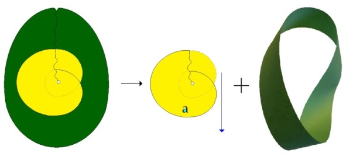

<!-- id: s13-03-0156 -->

Et pourtant ce que je viens de vous dire, c’est que le trait - ici dessiné en noir \[a\] :

<!-- id: s13-03-0157 -->

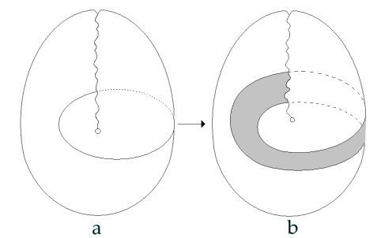

<!-- id: s13-03-0158 -->

qui est un trait simple, un bord fermé, du même type que celui du dessin de JIOUN SONJA - l’a réduite, vous ai-je dit, toute entière à cette portioncule. Alors, où est la devinette ? Je pense que vous vous souvenez encore de ce que je vous ai dit *tout à l’heure*, à savoir que *la coupure elle-même est une bande de Mœbius*.

<!-- id: s13-03-0159 -->

Comme vous pouvez le voir à ce second tracé \[b\] que j’ai fait sur la même figure, à côté, figure qui se schématise dans quelque chose, baudruche où j’essaie de vous faire intuitonner ce qu’il en est du *plan projectif* si vous écartez les bords, si je puis dire, qui résultent de *la coupure* ici tracée en noir, vous obtenez une béance qui est faite comme une *bande de Mœbius*.

<!-- id: s13-03-0160 -->

La coupure elle-même a la structure de la surface appelée *bande de Mœbius*. Ici vous la voyez figurée par un double trait de ciseaux, que vous pourriez également faire et où vous découperiez effectivement la figure totale du *plan projectif*, ou *chapeau croisé* comme je l’ai appelé, en deux parts :

<!-- id: s13-03-0161 -->

- une *bande de Mœbius* d’une part \[b\]… ici elle est censée être découpée à elle toute seule,

<!-- id: s13-03-0162 -->

- et un reste \[a\] d’autre part, qui est ce qui joue la même fonction du trou dans sa forme primitive, à savoir du trou qu’on obtient sur *une surface sphérique*.

<!-- id: s13-03-0163 -->

<!-- id: s13-03-0164 -->

Ceci est fondamental à considérer et il faut que vous en voyiez une autre figure sous la forme schématisée et plus proprement topologique qui est celle-ci dont j’ai inscrit le complément sur ce tableau où je pense que vous le voyez :

<!-- id: s13-03-0165 -->

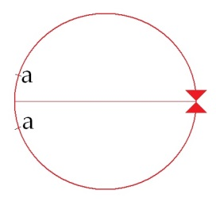 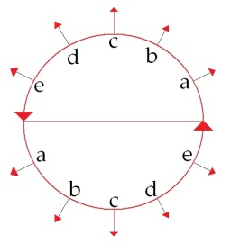

<!-- id: s13-03-0166 -->

1er trou : *sphérique* 2ème trou : *mœbien*

<!-- id: s13-03-0167 -->

Alors que la façon dont se suture le premier trou – le trou sphérique, celui que j’ai appelé concentrique : la topologie nous révèle que rien n’est moins concentrique que cette forme de centre attenant à la fonction du premier lambeau :

<!-- id: s13-03-0168 -->

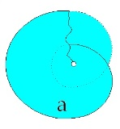

<!-- id: s13-03-0169 -->

Car pour fermer le trou sur la sphère, une simple coupure est bonne qui rapproche les deux morceaux, à la façon simplement dont une couturière vous fera n’importe quelle reprise.

<!-- id: s13-03-0170 -->

La coupure instaurée - si vous prenez la chose en sens inverse - par la *bande de Mœbius* cela implique un ordre, et c’est réellement là qu’est notre *troisième dimension*, ce qui nous justifie, tout à l’heure à en avoir introduit une troisième, fausse, pour vous faire sentir le poids de ces figures.

<!-- id: s13-03-0171 -->

Cette *dimension d’ordre*, *autrement dit, représentant une certaine assise temporelle,* implique que pour réaliser ce trou…

<!-- id: s13-03-0172 -->

> le trou second dont je suis en train de vous expliquer les propriétés topologiques …un ordre est nécessaire qui est un *ordre diamétral*. *Diamétral* c’est à dire apparemment spatial, fondé selon le trait médian qui vous donne le support figuré où proprement se lit que cette sorte de coupure est justement celle que nous attendions, c’est-à-dire qui ne se réalise qu’à devoir du même coup se diviser.

<!-- id: s13-03-0173 -->

Autrement dit, si c’est non pas d’une façon intuitive et visuelle mais d’une façon mentale que vous essayez de réaliser ce dont il s’agit, à partir du moment où vous pensez que le *a*, le point *a* sur ce cercle est identique au point *a* diamétralement opposé…

<!-- id: s13-03-0174 -->

> *ce qui est la définition même de ce qui fut introduit dans un tout autre contexte, dans la géométrie métrique, par DESARGUES, autrement dit, le plan projectif, et Dieu sait que DESARGUES en l’écrivant, lui–même a souligné ce qu’avait de paradoxal, d’ahurissant, d’affolant enfin, une telle conception, ce qui prouve bien que les mathématiciens sont fort capables de concevoir eux-mêmes les points de transgression, de franchissement qui sont les leurs à propos de l’instauration de telle ou telle catégorie structurale.*
>
> *S’ils l’oubliaient d’ailleurs, il y aurait toujours leurs confrères pour le leur rappeler en leur disant qu’on ne comprend rien*
>
> *à ce qu’ils disent, ce qui arrive à chaque coup, et spécialement ce qui est arrivé à [DESARGUES](http://fr.wikipedia.org/wiki/Girard_Desargues)* [^52] *où les murs de Lyon*
>
> *se sont couverts de libellés où on s’insultait à propos de choses, vous le voyez, passionnantes. Beau temps : merveilleuse époque !* …le *a* et le *a* sont le même \[...\] qu’est-ce que ça veut dire si ce n’est que, même si nous considérons ceci comme le trou, la conjonction des bords ne saurait se faire qu’à diviser le trou, qu’à venir y passer dans le mouvement, si l’on peut dire, de sa conjonction.

<!-- id: s13-03-0175 -->

Nous trou­vons donc là le modèle de ce qu’il en est du sujet en tant que déterminé par une coupure. Il doit nécessairement se présenter comme divisé dans la structure même. Je n’ai, bien entendu, pas pu aujourd’hui pousser plus loin le point où je dési­rais vous faire arriver. Sachez seulement qu’en nous référant à deux autres structures topologiques qui sont respectivement :

<!-- id: s13-03-0176 -->

- *la bouteille de Klein* en tant que, je vous l’ai déjà montré, elle est faite, composée de la couture ensemble de *deux bandes de Mœbius.* Vous le verrez, ceci ne suffit pas du tout à ce que nous en déduisions, par *simple addition* ses propriétés.

<!-- id: s13-03-0177 -->

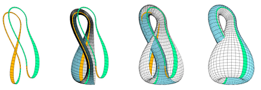

<!-- id: s13-03-0178 -->

- D’autre part *le tore* qui est encore une autre structure.

<!-- id: s13-03-0179 -->

Nous pouvons à partir de ces définitions premières concernant le S concevoir à quoi peuvent nous servir ces deux autres struc­tures de *la bouteille de Klein* et du *tore* pour établir des relations fondamentales qui nous permettront de situer, avec une rigueur qui n’est jamais obtenue jusqu’ici avec le langage ordinaire, pour autant que le langage ordinaire aboutit à une *ontification* du sujet qui est le véritable nœud et clé du problème.

<!-- id: s13-03-0180 -->

Chaque fois que nous parlons de quelque chose qui s’appelle le sujet, nous en faisons un *Un*, or ce qu’il s’agit de concevoir c’est justement ceci, c’est que le nom du sujet est ceci : il manque l’*Un* pour le désigner.

<!-- id: s13-03-0181 -->

Qu’est-ce qui le remplace ? Qu’est-ce qui vient « faire fonction » de cet *Un* ?

<!-- id: s13-03-0182 -->

Assurément *plusieurs choses*.

<!-- id: s13-03-0183 -->

Mais si on ne voit pas que *plusieurs choses très différentes*…

<!-- id: s13-03-0184 -->

- *l’objet(a)* d’un côté par exemple,

<!-- id: s13-03-0185 -->

- *le nom propre* de l’autre, …remplissent la même fonction, il est bien clair qu’on ne peut rien comprendre

<!-- id: s13-03-0186 -->

- ni à leur distinction, car quand on s’aperçoit qu’ils rem­plissent la même fonction, on croit que c’est la même chose,

<!-- id: s13-03-0187 -->

- ni au fait même qu’ils remplissent la même fonction.

<!-- id: s13-03-0188 -->

Il s’agit de savoir où se situe, où s’articule ce S, ce sujet divisé en tant que tel.

<!-- id: s13-03-0189 -->

Le *tore* d’une part, figure si exemplaire que déjà dans l’année de mon séminaire sur *L’Identification* \[1961-62\]*…*

<!-- id: s13-03-0190 -->

> *où, sauf les oreilles fraîches que j’avais cette année-là, personne n’écoutait ce que j’étais en train de dire : on avait d’autres soucis* …dans mon séminaire sur *L’Identification*, j’ai montré la valeur exemplaire que pouvait avoir le *tore* pour lier d’une façon structuralement dogmatisable, la fonction de *la demande* et celle du *désir* à proprement parler *au niveau de la découverte freu­dienne*, à savoir du névrosé et de l’inconscient. Vous en verrez le fonctionne­ment exemplaire.

<!-- id: s13-03-0191 -->

Ce qui peut s’en structurer du sujet est tout entier lié structuralement à la possibilité de la transformation, du passage, de la structure du *tore* à celle de la *bande de Mœbius*, non pas la vraie du sujet, mais la *bande de Mœbius* en tant que divisée,

<!-- id: s13-03-0192 -->

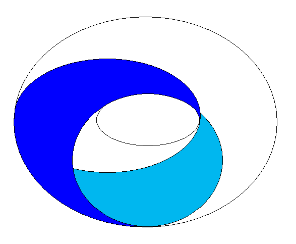

<!-- id: s13-03-0193 -->

en tant *qu’une fois coupée par le milieu elle n’est plus une bande de Mœbius, elle est une chose qui a deux faces, un endroit et un envers*, qui s’en­roule sur soi-même d’une drôle de façon, mais qui…

<!-- id: s13-03-0194 -->

> *comme je vous ai apporté aujourd’hui le modèle pour que vous le voyiez d’une façon sensible*

<!-- id: s13-03-0195 -->

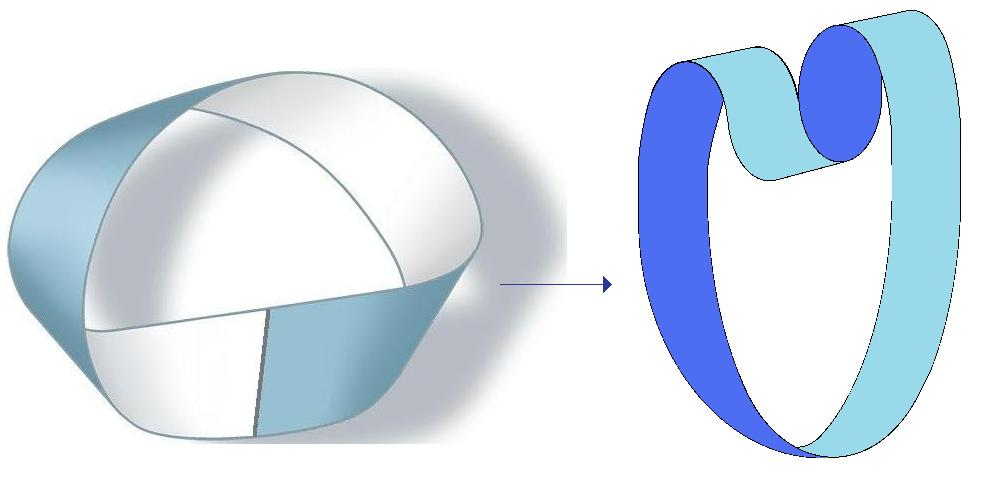 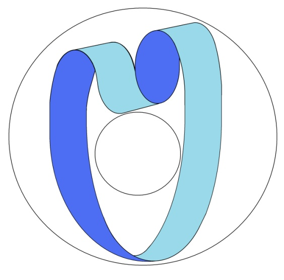

<!-- id: s13-03-0196 -->

…devient applicable sur ceci qu’on appelle couramment un anneau et qui est un *tore*.

<!-- id: s13-03-0197 -->

Cette connexion structurale permet d’articuler d’une façon particulièrement claire et évidente certaines relations qui doivent être fondamentales pour la définition des rapports, du *sujet*, de *la demande*, et du *désir*.

<!-- id: s13-03-0198 -->

De même au niveau de la *bouteille de Klein* seulement, pourra se définir *le rapport originel* tel qu’il s’instaure à partir du moment où dans le langage entrent en fonction *la parole* et la dimension de *la vérité*.

<!-- id: s13-03-0199 -->

La conjonction non symétrique du *sujet* et du *lieu de l’Autre* est ce que nous pourrons, grâce à la *bouteille de Klein*, illustrer.

<!-- id: s13-03-0200 -->

Sur ces indications simples, je vous laisse en vous donnant rendez-vous au premier mercredi de janvier.

<!-- id: s13-03-0201 -->

Pour le quatrième mercredi de ce mois, je prie instamment quiconque dans cette assemblée, qui soit - d’une façon quelle qu’elle soit - intéressé à la progression de ce que j’essaie ici de faire avancer, de bien vouloir…

<!-- id: s13-03-0202 -->

> quel que soit le sort que je réserverai à la feuille d’information qu’il aura remplie,
>
> c’est-à-dire que je l’in­vite ou non au quatrième mercredi …considérer que ce n’est pas en raison de ses mérites ou de ses démérites qu’il est ou non invité.

<!-- id: s13-03-0203 -->

Ils sont ou non invités pour des raisons qui sont les mêmes que celle que PLATON[^53] définit à la fonction de politique, c’est-à-dire qui n’a rien à faire avec la politique mais de celle qui est bien plutôt à considérer comme celle du tapissier.

<!-- id: s13-03-0204 -->

S’il me faut quelques fils d’une couleur et d’autres fils d’une autre couleur pour faire ce jour-là une certaine trame, Laissez-moi choisir mes fils \[*Sic*\].

<!-- id: s13-03-0205 -->

Que je fasse ça cette année à titre d’expérience, à chacun des quatrièmes mercredis, est une chose que l’ensemble de mes auditeurs et d’autant plus qu’ils me sont plus fidèles, et d’autant plus qu’ils peuvent être vraiment intéressés par ce que je dis, doivent en quelque sorte laisser à ma discrétion.

<!-- id: s13-03-0206 -->

Vous me laisserez donc, pour le prochain quatrième mercredi, inviter *qui il me semblera bon* pour que le sujet, le sujet donné de discussion, de dialogue, qui fonctionnera ce jour-là se fasse dans les conditions les meilleures, c’est-à-dire avec des interlocuteurs par moi expressément choisis.

<!-- id: s13-03-0207 -->

Ceux qui ne feront pas partie ce mercredi-là, ceux-là n’ont nullement à s’en formaliser.

## Notes

[^46]: [Cf. Lacanchine : *L’objet de la psychanalyse* : 15-12-1965, note 1](http://www.lacanchine.com/L_References_65.html).

[^47]: Emmanuel Kant : *Essai pour introduire en philosophie le concept de grandeur négative* (1763), Paris, Vrin, 2000.

[^48]: S. Freud : [*Fetischismus*](http://www.textlog.de/freud-psychoanalyse-fetischismus.html), *Le fétichisme*, op. cit.

[^49]: Jacques Derrida : « *L'écriture avant la lettre »*, in *De la grammatologie I et II*, Critique n° 223, Déc. 1965 et n° 224, Janv. 1966.

[^50]: Cf. séminaire 1961-62 : « *L'identification* », fin de la séance du 20-12.

[^51]: Sir Flinders Petrie : *The formation of the alphabet*, London, Macmillan, 1912.

[^52]: Girard Desargues (1591-1661). Cf. [L'abcès de Monsieur d'Espernon, percé par un de ses amis](http://gallica.bnf.fr/ark:/12148/bpt6k1002842.capture), Gallica [t.1](http://gallica.bnf.fr/ark:/12148/bpt6k993793.capture) et [t.2](http://gallica.bnf.fr/ark:/12148/bpt6k993809.capture).

[^53]: Platon : *La Politique*, 279c .
