# Leçon 05 | 05 Janvier l966

<!-- source-url: http://staferla.free.fr/S13/S13 L'OBJET.docx -->
<!-- seminar: s13 -->
<!-- lesson: 05 -->

<!-- id: s13-05-0001 -->

Je vous souhaite une bonne année ! Vœux affectueux, vœux après tout qui dans ma bouche prend sa portée de pouvoir au moins sur un point, si réduit soit-il, de votre intérêt, y apporter moi-même quelque chose.

<!-- id: s13-05-0002 -->

Nous allons poursuivre ce que nous avons à dire cette année de *l’objet(a)*.

<!-- id: s13-05-0003 -->

Si vous me le permettez à la faveur de cette coupure et de ces vœux, d’y mettre l’accent sur une certaine solennité[^56], c’est le cas de le dire, nous dirons de cet *objet(a)*…

<!-- id: s13-05-0004 -->

> *objet de déchet*, vous en avez eu déjà assez d’approches pour sentir la pertinence de ce terme, objet, dans une certaine perspective et dans un certain sens rejeté, oui …ne dirons-nous pas de lui que, comme il est prédit, *pierre de rebut* il doit devenir la *pierre d’angle* [^57] ?

<!-- id: s13-05-0005 -->

Il est présent partout dans la pratique de l’analyse, encore, en fin de compte peut-on dire que personne ne sait le *voir*.

<!-- id: s13-05-0006 -->

Ceci n’est pas surprenant s’il a la situation des propriétés que nous lui donnons : l’articulation que nous allons essayer une fois de plus de faire avancer aujourd’hui.

<!-- id: s13-05-0007 -->

Que personne ne sache le *voir*, est lié, nous l’avons déjà indiqué, à *la structure même de ce monde* en tant qu’il parait être *coextensif* au *monde de la vision*. *Illusion fondamentale* que depuis le départ de notre discours nous nous attachons à ébranler, à réfuter en fin de compte. Mais que personne ne sache *le voir* - au sens ou *sache* c’est *puisse le voir -* n’excuse pas que personne encore n’ait su *le concevoir*, quand, comme je l’ai dit, son aperception est constante dans la pratique de l’analyse.

<!-- id: s13-05-0008 -->

Tant et si bien - tant et tellement - qu’après tout l’on en parle de cet *objet* dit « *prégénital* », dont on se gargarise pour essayer, autour, de typifier cette appréhension injuste, imparfaite, d’une réalité dont la prise, dont la forme serait liée au seul effet d’une *maturation*… dont assurément les piliers sont fermes dans l’analyse, à savoir le lien qu’il y a entre cette *maturation* et quelque chose qu’il faut bien appeler par son nom : une *vérité*.

<!-- id: s13-05-0009 -->

Cette *vérité* c’est que cette maturation est liée au *sexe*. Encore tout ceci dut-il paraître noyé dans une confusion du « *sexe* » et d’une certaine *morale sexuelle* - qui sans doute n’est pas sans être intimement liée au sexe puisque la morale en sort - qui, faute d’une délinéation suffisante, *fait de cet objet prégénital la fonction d’un mythe* où tout se perd, où l’essentiel de ce qu’il peut et doit nous apporter, quant à la fonction plus radicale de la structure du sujet tel qu’il sort de l’analyse, est qu’il abolit à jamais une certaine conception de la connaissance.

<!-- id: s13-05-0010 -->

On en parle donc beaucoup :

<!-- id: s13-05-0011 -->

- et non pas seulement au sens qui, je l’ai dit, est bien excusable, à savoir le « *voir* », car nous verrons quelles sont les conditions pour qu’une chose soit vue,

<!-- id: s13-05-0012 -->

- et *sans savoir même le sens de ce qu’on en dit*, en quoi - puisque cette position « *ne pas savoir ce qu’on dit* » est proprement ce qui doit être tourné dans l’analyse, ce qui doit être forcé dans l’analyse, ce qui fait que l’analyse ouvre un nouveau chemin au progrès du savoir - on peut dire que l’analyste fait défaut à sa mission en ne progressant pas justement là où est le point vif où doit s’attacher son effort.

<!-- id: s13-05-0013 -->

Je suis venu de loin pour accrocher ce point central et l’une des utilités de l’emploi de cet algèbre, *qui fait que cet objet je l’épingle de cette lettre* *(a)*, une des fonctions de cet emploi de *la notation algébrique* c’est qu’il est permis d’en suivre le fil, *comme un fil d’or* depuis les premiers pas de cette démarche qu’est mon discours et que m’attachant d’abord à accrocher le point vif, le point de partage de ce que c’est que l’analyse et de ce qui ne l’est pas, ayant commencé par *le stade du miroir* et la fonction du narcissisme, si dès l’abord j’ai appelé *i(a)* cette image aliénante, autour de quoi se fonde cette méconnaissance fondamentale qui s’appelle le *moi*.

<!-- id: s13-05-0014 -->

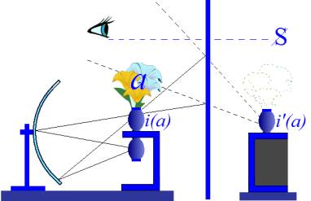

<!-- id: s13-05-0015 -->

Je ne l’ai pas appelé *i(s)* par exemple, l’image du *self*, *ce qui aurait aussi bien suffi, ça n’en aurait été qu’une image : ce qu’il y avait à démontrer, que ce n’était qu’imaginaire, était déjà suffisamment indiqué,* j’ai appelé ça dès le départ *i(a)*, ce qui est en somme, de façon superflue, redoubler l’indication qu’il y a dans *l’identification* de *l’aliénation fondamentale*. Nous nous *mé-*connaissons d’être *moi*.

<!-- id: s13-05-0016 -->

*(a)* est dans la parenthèse, au cœur de cette notation, si bien que déjà, c’est là qu’est indiqué qu’il y a quelque chose d’autre, le *(a)* précisément au cœur de cette capture et qui est sa véritable raison.

<!-- id: s13-05-0017 -->

Il y a donc une double erreur :

<!-- id: s13-05-0018 -->

- erreur du mirage de l’identification

<!-- id: s13-05-0019 -->

- et méconnaissance de ce qu’il y a au cœur de ce mirage, qui le soutient réellement.

<!-- id: s13-05-0020 -->

Je l’indique aujourd’hui pour la 1ère fois, je crois, vous allez le voir revenir aujourd’hui dans la suite de ce discours : *(a)...*

<!-- id: s13-05-0021 -->

repère, simple indication : je le dis. Je n’en donne pas ici la raison et vous allez la voir surgir ...*(a) est de l’ordre du réel*.

<!-- id: s13-05-0022 -->

J’ai eu, lors de mon séminaire fermé, la satisfaction de voir - par quelqu’un - *rassembler* jusqu’à la date de ce jour, couvrir dirais-je, à peu près tout *le champ de ce que j’ai articulé sur le* *(a)*, et poser les questions que ce rassemblement laisse ouvertes.

<!-- id: s13-05-0023 -->

J’indique au passage pour tous ceux dont je ne puis, pour des raisons… pour des raisons de rapport de *masse*, de rapport entre *la quantité et la qualité* comme on dit ailleurs, du fait que la qualité change d’un auditoire qu’il soit trop ample et trop touffu, je m’excuse auprès de ceux que je ne convoque pas à ces travaux dont j’espère qu’ils prendront le ton d’un échange, d’un travail d’équipe.

<!-- id: s13-05-0024 -->

Celui dont je parle - M. André GREEN - assurément n’a pas encore *amorcé le dialogue*, si ce n’est avec moi puisqu’il s’agissait de dire ce que j’avais dit jusqu’ici de *l’objet(a)* pour m’interroger, et *la pertinence* ici suffit pour m’imposer d’avance *l’adéquation*, sans ça *à quoi bon s’interroger, la pertinence des questions* est de celles auxquelles j’espère pouvoir cette année donner satisfaction.

<!-- id: s13-05-0025 -->

Aussi bien, que tout ceux qui n’assistent pas à ces séminaires sachent qu’*ici la solution est simple au problème de la communication* : il suffit que cette *sorte de petit rapport* soit diffusé pour qu’aussi bien il serve à tous pour repérer ce que je pourrais y insérer de réponses par la suite. Dans d’autres cas où le dialogue sera de débat, d’articulations permettant d’être résumées un protocole, de même - ce sera simplement une question de délai - ce qui restera de ce qui peut être articulé comme linéament, réseau, obtenu de cette discussion sera communiqué de même. Il ne s’agit donc nullement dans le séminaire dit *fermé* d’ésotérisme, de quelque chose qui ne soit pas à la disposition de tous.

<!-- id: s13-05-0026 -->

Je suis donc parti aujourd’hui de ces deux termes, rappelés dans le discours auquel je fais allusion, à savoir que c’est dès l’origine de mon sillon critique dans l’articulation de l’analyse, que nous voyons pointer, apparaître ce qui aboutit maintenant à l’articulation de *l’objet(a) *: *le moi fonction de méconnaissance*.

<!-- id: s13-05-0027 -->

Il importe de voir jusqu’où s’étend, par rapport à ce qui s’est appelé, avant FREUD - prenons JANET comme repère - *la fonction du réel*, l’important est de souligner cette tare constitutive du *moi*. Contrairement à ce qu’on affirme, le *moi* dans FREUD n’est pas *la fonction du réel*, même s’il joue un rôle dans l’affirmation du *principe de réalité*, ce qui n’est pas du tout la même chose. Le *moi* est l’appareil de *la perception-conscience,* *Wahrnehmung-Bewusstsein*.

<!-- id: s13-05-0028 -->

Or, si depuis toujours le problème de la connaissance tourne et vire autour de la critique de *la perception*, est-ce que de notre place d’analyste précisément, nous ne pouvons pas entrevoir ceci, qui se trahit dans *le discours philosophique* lui-même \- car toujours en fin de compte, dans le discours traînent les clés de ce qu’il réfute - et le discours insensé des analystes sur *l’objet prégénital* nous laisse aussi saillir de-ci, de-là, *les articulations* qui permettraient de le situer correctement.

<!-- id: s13-05-0029 -->

C’est bien là ce que nous devons prévoir de quelque chose d’éclatant, qu’il devrait être depuis longtemps de *notre patrimoine* d’avoir mis à la disposition de tous. Qui ne sait combien est courte l’intelligence de l’homme et au premier plan ceux–là qui justement - guidés par le progrès du contexte scientifique - se sont mis à étudier l’intelligence là où elle doit être prise : au niveau des animaux.

<!-- id: s13-05-0030 -->

Que nous sommes déjà récompensés quand nous savons déterminer le niveau d’*intelligence* par *la conduite du détour* !

<!-- id: s13-05-0031 -->

Je vous le demande, pour ce qui est de l’*intelligence*, où est le degré de plus que l’homme atteint ? Il y a un degré de plus. Il y a ce qu’on trouve au niveau de la première articulation thalessiene *-* de THALÈS[^58] *-* à savoir que de quelque chose, une mesure se détermine par rapport à autre chose, d’être - à cette autre chose - dans la même proportion qu’une 3ème à une 4ème.

<!-- id: s13-05-0032 -->

Et c’est là strictement la limite de l’intelligence humaine, car c’est là seulement ce qu’elle saisit avec ses mains. Tout le reste de ce que nous plaçons dans ce domaine de l’intelligence, et nommément ce qui a abouti à notre science, est l’effet de *ce rapport*, de cette prise dans quelque chose que j’appelle *le signifiant*, dont *la portée*, dont *la fonction*, dont *la combinaison*, dépasse dans ses résultats ce que le sujet qui la manie peut en prévoir.

<!-- id: s13-05-0033 -->

Car, contrairement à ce qu’on dit, ce n’est pas *l’expérience* qui fait progresser le savoir, ce sont *les impasses* où le sujet est mis d’être déterminé par la mâchoire - dirais-je - du signifiant. Si la proportion, la mesure, nous la saisissons, au point de croire, et sans doute à juste titre, que cette notion de mesurer c’est l’homme même : l’homme s’est fait - dit le présocratique[^59] - le monde est fait à la mesure de l’homme.

<!-- id: s13-05-0034 -->

Bien sûr puisque l’homme c’est déjà la mesure et ce n’est que ça. Le signifiant - j’ai essayé de l’articuler pour vous lors de ces dernières leçons - ce n’est pas la mesure : c’est précisément ce quelque chose qui, à entrer dans le *réel*, y introduit lors de la mesure ce que certains ont appelé et appellent encore *l’infini actuel* [^60].

<!-- id: s13-05-0035 -->

Mais reprenons. Que signifie ce que je veux dire quand je répète après l’avoir tellement dit, que ce qui fausse la perception, si je puis dire, c’est la conscience ? À quoi peut tenir cette étrange *falsification* ?

<!-- id: s13-05-0036 -->

Si, de toujours, j’ai attaché tant d’importance à la saisir dans le registre psychologique, au niveau du *stade du miroir*, c’est que c’est la chercher à sa place, mais cette place va loin. Le miroir ne se définit, n’existe que de cette surface qui divise - pour le renouveler - un espace à trois dimensions, espace que nous tenons pour *réel* et qui l’est sans doute, *je n’ai pas ici à le contester*.

<!-- id: s13-05-0037 -->

Je me déplace comme vous et n’ai pas le moindre petit pied à l’étrier du voyage taoïste, chevauchant quelque dragon à travers les mondes.

<!-- id: s13-05-0038 -->

Mais justement, qu’est-ce à dire ? Sinon que l’image spéculaire n’aurait cette valeur d’*erreur* et de *méconnaissance* si déjà *une symétrie*, qu’on appelle *bilatérale*, par un plan sagittal ne caractérisait en tout cas l’être qui y est intéressé.

<!-- id: s13-05-0039 -->

On a une droite et une gauche, qui ne sont évidemment pas semblables mais qui font *office* de semblables, en gros deux oreilles, deux yeux, une mèche sans doute de travers mais en tout cas, on peut faire la raie au milieu, on a deux jambes… On a des organes par paires - pour un grand nombre d’entre eux, pas dans tous - et quand on y regarde de plus près, à savoir quand on ouvre : à l’intérieur c’est un tant soi peu tordu, mais ça ne se voit pas au dehors.

<!-- id: s13-05-0040 -->

L’homme, tout comme une libellule a l’air symétrique. C’est à un accident de cette espèce – « accident d’apparence » comme disent les philosophes - que quelque chose est dû, tout d’abord à cette capture dite du *stade du miroir*.

<!-- id: s13-05-0041 -->

Est-ce qu’il n’y a pas - c’est la question qu’ici nous pouvons nous poser - une raison plus profonde, de ce qui paraît un accident, au fait de cette capture ?

<!-- id: s13-05-0042 -->

C’est là bien sûr, qu’une vue un peu plus pénétrante, attentive des formes, pourrait nous mettre sur *la trace*, car d’abord tous les êtres vivants ne sont pas marqués de cette symétrie bilatérale. En plus, nous non plus car il suffit de nous ouvrir le ventre pour s’en apercevoir.

<!-- id: s13-05-0043 -->

En plus, il nous est arrivé de nous intéresser aux formes en cours, à l’embryologie et là, plus nous avançons plus nous remarquons que ce que j’appelais tout à l’heure, que je désignais du terme de *torsion* ou encore de *disparité* ou encore \- je voudrais me servir du *mot anglais*, si excellent - « *oddité* », domine toujours dans ce qui constitue la transformation, le passage d’un stade à l’autre.

<!-- id: s13-05-0044 -->

Dans l’année où j’ai tracé au tableau, les premières utilisations de *ces formes* - auxquelles je vais venir maintenant - *en topologie* et où j’essayais d’inscrire pour l’*édification* de mes auditeurs et leur indiquer ce qu’il y avait à en tirer de résonance, comme analogie pour les introduire à ce qu’il faut enfin maintenant que *je leur montre pour être proprement la structure de la réalité* *et non pas seulement la figure* [^61].

<!-- id: s13-05-0045 -->

Combien de fois ceux-ci n’ont-ils pas été frappés…

<!-- id: s13-05-0046 -->

> quand pour eux cette baudruche de quelque *tore* et de quelque *cross-cap*, je la montrai éventrée …de voir, en quelque sorte surgir au tableau une figure qui aurait pu passer au premier coup d’œil pour *une coupe de cerveau* par exemple avec des formes involuées si frappantes jusque dans la macroscopie, ou au contraire une étape de l’embryon ?

<!-- id: s13-05-0047 -->

Après tout, ouvrez *un livre d’embryologie*, le premier venu, voyez les choses au niveau où un œuf, déjà à un stade assez avancé de division, nous présente ce qu’on appelle la ligne primitive, et puis ce petit point qui s’appelle « *le nœud de Hensen* », enfin c’est quand même assez frappant *que ça ressemble tout à fait* exactement à ce que je vous ai maintes fois dessiné sous le nom abrégé d’un *chapeau croisé*, d’un *cross-cap*.

<!-- id: s13-05-0048 -->

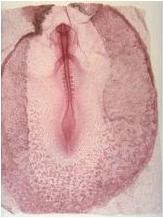 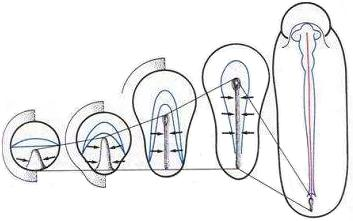

<!-- id: s13-05-0049 -->

Je ne vais pas, même un instant, glisser dans cette « *philosophie de la nature* ». Ce n’est pas de cela qu’il s’agit, de toute façon nous ne pouvons trouver là qu’un indice de quelque chose qui indique que peut-être dans les formes de la vie il y a comme une espèce d’obligation de simulation de quelque structure plus fondamentale.

<!-- id: s13-05-0050 -->

Mais ce que ceci simplement nous indique et qui doit être retenu, c’est qu’il n’est pas légitime de réduire le corps - au sens propre de ce terme à savoir ce que nous sommes, et rien d’autre, nous sommes des corps - *de réduire les dimensions du corps* *à* celle de ce qu’au dernier terme de la réflexion philosophique, DESCARTES a appelé « *l’étendue* » [^62].

<!-- id: s13-05-0051 -->

Cette *étendue*, dans la théorie de la connaissance :

<!-- id: s13-05-0052 -->

- elle est là depuis toujours,

<!-- id: s13-05-0053 -->

- elle est là depuis ARISTOTE,

<!-- id: s13-05-0054 -->

- elle est là au départ de *la pensée qu’on appelle* - j’ai horreur de ces foutaises - *occidentale*.

<!-- id: s13-05-0055 -->

C’est celle d’*un espace métrique à trois dimensions, homogène* et au départ ce que ceci implique c’est *une sphère,* sans limite sans doute, mais constituée quand même par *une sphère*. Je vais tout à l’heure - j’espère - pouvoir préciser ce que veut dire cette appréhension correcte d’*un espace à trois dimensions*, homogène, et comment il s’*identifie* à la *sphère*, toujours limite même si elle peut toujours s’étendre.

<!-- id: s13-05-0056 -->

C’est autour de cette appréhension de l’*étendue* que la pensée du *réel* - celle de l’*étant* comme dit HEIDEGGER - s’est organisée. *Cette sphère était le suprême et le dernier étant* : *le moteur immobile*.

<!-- id: s13-05-0057 -->

Rien n’est changé avec l’espace cartésien : cette *étendue* est simplement poussée par lui à ses dernières conséquences, à savoir que lui appartient de droit tout ce qui est *corps* et *connaissance du corps*. Et c’est pourquoi la physique des passions de l’âme est manquée chez DESCARTES [^63] parce que nulle passion ne peut être l’affect de « *l’étendue* ».

<!-- id: s13-05-0058 -->

*Sans doute y a-t-il là quelque chose de très séduisant depuis toujours *: nous allons le voir, *la structure de cet espace sphérique,* *c’est là l’origine de cette fonction du miroir mis au principe de la relation de connaissance.*

<!-- id: s13-05-0059 -->

*Celui qui est au centre de la sphère, se voit monstrueusement reflété dans ses parois : microcosme répondant au macrocosme.*

<!-- id: s13-05-0060 -->

*Ainsi la conception de la connaissance comme adéquation :*

<!-- id: s13-05-0061 -->

- *de ce point central mystérieux qu’est le sujet,*

<!-- id: s13-05-0062 -->

- *à cette périphérie de l’objet,* *…est-elle une fois pour toutes instaurée comme une immense tromperie au sens du problème.*

<!-- id: s13-05-0063 -->

DESCARTES ne s’est pas assez méfié du « *Dieu malin* » : il pense pouvoir l’apprivoiser au niveau du « *Je pense* », c’est au niveau de « *l’étendue* » qu’il y succombe. Mais aussi bien, cette tromperie n’est-elle pas forcément une *tromperie *: c’est aussi bien une *limite*, une limite imposée par Dieu précisément.

<!-- id: s13-05-0064 -->

En tout cas, dans la *Genèse*, à peu près dans *le 5ème verset* - je n’ai pas eu le temps de le vérifier avant de venir *-* du בְּרֵאשִׁית בָּרָא אֱלֹהִים אֵת הַשָּׁמַיִם וְאֵת הָאָרֶץ \[beréchit bara heloïm\], il y a un terme qui est là, éclatant depuis le fond des âges et qui, bien sûr, n’a pas échappé aux commentaires rabbiniques, c’est *celui* que Saint JÉRÔME a traduit par *firmamentum*, ce qui n’est pas si mal : l’*enfermement du monde*.

<!-- id: s13-05-0065 -->

Cela au-delà de quoi Dieu a dit : « *Tu ne passeras pas* ». Car n’oubliez pas que jusqu’à une époque récente, *la voûte céleste* c’était ce qu’il y avait de plus fermé. Ça n’a pas changé. Ce n’est pas du tout parce qu’on conçoit qu’on peut voguer toujours plus loin qu’elle est moins fermée. Il s’agit d’une limite autre dans la pensée de celui qui articula ça en caractères hébraïques : רקיע וַיַּבְדֵּל \[rakî’a\].

<!-- id: s13-05-0066 -->

*Rakî’a* sépare les « *eaux supérieures* » des « *eaux inférieures* ». Il était entendu, pour *les eaux supérieures,* que l’accès était interdit[^64].

<!-- id: s13-05-0067 -->

Ça n’est pas *que nous nous baladions dans l’espace avec* - *point qu’incidemment j’apprécie, je ne réduis pas à néant - que nous nous baladions dans l’espace avec* de charmants satellites qui est l’important, c’est qu’à l’aide de ce quelque chose qui est *le signifiant* et *sa combinatoire*, nous soyons en possession de possibilités qui sont celles qui vont au-delà de cet espace métrique.

<!-- id: s13-05-0068 -->

C’est du jour où nous sommes capables de concevoir comme possible, je ne dis pas comme réel, des mondes à *six*, *sept*, *huit* \- autant que vous voudrez - *dimensions* que nous avons crevé רקיע וַיַּבְדֵּל \[rakî’a\], le firmament.

<!-- id: s13-05-0069 -->

Et ne croyez pas que ce soient des blagues, enfin des choses dans lesquelles on peut faire ce qu’on veut sous prétexte que c’est irréel. On croit, comme ça, qu’on peut extrapoler. On a étudié *la sphère à quatre*, puis *à cinq*, puis *à six dimensions*.

<!-- id: s13-05-0070 -->

Alors on se dit c’est bien. On découvre *une petite loi* comme ça qui a l’air de suivre.

<!-- id: s13-05-0071 -->

Alors on pense que la complexité va aller toujours s’ajoutant en quelque sorte à elle-même et qu’on peut traiter ça comme on traiterait une série. Pas du tout ! Arrivés aux sept dimensions, Dieu sait pourquoi - *c’est le cas de le dire, lui seul, sans doute encore actuellement, car les mathématiciens ne le savent pas* - il y a un os, *la sphère à sept dimensions* fait des difficultés incroyables[^65].

<!-- id: s13-05-0072 -->

Ce ne sont pas des choses auxquelles nous aurons l’espace de nous arrêter ici. Mais c’est pour vous signaler, en retour, en retrait, le sens de ce que je dis quand je dis : « *Le réel c’est l’impossible* ». Ça veut précisément dire ce qui reste d’affirmé dans le *firmamentum*, ce qui fait que spéculant de la façon la plus valable, la plus réelle… car votre sphère à sept dimensions elle est réelle , elle vous résiste, elle ne fait pas ce que vous voulez, vous mathématiciens.

<!-- id: s13-05-0073 -->

De même qu’aux premiers pas de PYTHAGORE, *le nombre* - qu’il n’avait pas la naïveté de croire un produit de l’esprit humain - lui a fait difficulté simplement à faire la chose minimale, à commencer par s’en servir pour mesurer quelque chose, faire un carré. Tout de suite *le nombre* surgit dans son premier effet *irrationnel*, en quoi c’est ça qui démontre qu’il est *réel* : *c’est l’impossible*, c’est qu’on n’en fait pas ce qu’on veut.

<!-- id: s13-05-0074 -->

J’ai tiré autant d’enseignement de cette première expérience que de celle de *la sphère à sept dimensions* qui n’est là que pour vous amuser et pas pour faire « *planète* ».

<!-- id: s13-05-0075 -->

Alors, la question est de savoir comment nous pouvons rendre compte de ceci qui est depuis toujours à la portée de la main, de quelque chose qui est tout de même aussi dans le *réel*, mais qui n’est *pas du tout comme le dépeint la théorie de la connaissance* : à savoir ce point central, ce point de convergence, ce point de réunion, de fusion, d’harmonie, dont on se demanderait alors pourquoi tant de péripéties, d’avatars, de vicissitudes depuis le temps qu’il serait là, à recueillir le macrocosme : ce sujet…

<!-- id: s13-05-0076 -->

> *dont la première chose que nous voyons, et on n’a pas pour ça attendu FREUD, c’est qu’il est - où qu’il aille, où qu’il fasse acte de sujet - de lui-même divisé* …comment ça peut s’inscrire dans *un monde à topologie sphérique*.

<!-- id: s13-05-0077 -->

Notre seule faveur c’est d’être *au moment* où peut-être…

<!-- id: s13-05-0078 -->

> d’avoir crevé רקיע וַיַּבְדֵּל \[rakî’a\], *firmamentum*, avant tout dans les spéculations des mathématiciens …nous pouvons donner à l’espace, à l’étendue du réel, une autre structure que celle de *la sphère à trois dimensions*.

<!-- id: s13-05-0079 -->

Bien sûr, il fût un temps où je vous fis faire, dans un certain *Rapport* - *de Rome* - les premiers pas qui consistent à bien marquer la différence…

<!-- id: s13-05-0080 -->

> *de ce moi qui se croit moi, à ce qu’il exige de nous, fascinés par ce point secret d’évanouissement qui est le vrai point de perspective au–delà de l’image spéculaire qui fascine celui qui, là, se reconnaît, se regarde* …la différence qu’il y a entre cela et le « *je* » de *la parole* et du *discours*, de *la parole pleine* comme ai-je dit, celle qui s’engage dans ce vœu que j’ose à peine répéter sans rire : « *Je suis ta femme* »[^66] ou bien « *ton homme* » ou bien « *ton élève* ».

<!-- id: s13-05-0081 -->

Pour moi, je n’ai jamais fait allusion à *cette dimension* que sous la forme du « *tu* », comme bien entendu toute personne qui n’est pas absolument insensée. Que cette sorte de message, qu’on ne le reçoive jamais que de l’Autre et sous une forme inversée, c’est ce sur quoi j’ai insisté tout d’abord.

<!-- id: s13-05-0082 -->

Au niveau de mon séminaire sur le Président SCHREBER j’ai longuement…

<!-- id: s13-05-0083 -->

> à propos de ce que j’ai appelé « *le pouvoir de performation* »[^67], de l’affirmation consacrante …longuement balancé autour de « *Tu es celui qui me suivra(s)* » qui - bienfait des dieux en français - bénéficie de l’amphibologie de la deuxième et de la troisième personne du futur, on ne sait pas s’il faut écrire « *suivras* » ou « *suivra* »[^68].

<!-- id: s13-05-0084 -->

Ça, on peut le dire, mais quant à celui qui dit : « *Je suis celui qui te suivrait* » : pauvre imbécile ! *Jusqu’où est-ce que tu me suivras ?* Jusqu’au point où tu perdras ma trace, ou celui où tu auras envie de me donner un grand coup de « t’abuses ! » sur la tête.

<!-- id: s13-05-0085 -->

La légèreté de cette parole fondatrice est de celle dont les humains font usage pour tenter d’exister. C’est quelque chose dont nous ne pouvons commencer à parler avec quelque sérieux que parce que nous savons que ce « *Je* » *énonçant*, c’est lui qui est vraiment divisé, à savoir que dans tout discours, le « *Je* » qui énonce, le « *Je* » qui parle, va au–delà de ce qui est dit.

<!-- id: s13-05-0086 -->

La parole dite « pleine » - premier élément de mon initiation - n’est ici que figure dérisoire de ceci : c’est qu’au-delà de tout ce qui s’articule, quelque chose parle que nous avons restauré dans ses droits de vérité.

<!-- id: s13-05-0087 -->

« *Moi la vérité, je parle*. » dans votre discours trébuchant, dans vos engagements titubants et *qui ne voient pas plus loin* *que le bout de votre nez*, le sujet, le « *Je* » : celui–là ne sait pas du tout qui il est. Le sujet du « *je parle* », parle quelque part en un lieu que j’ai appelé « *le lieu de l’Autre* », et là est ce qui, à jamais nous oblige de rendre compte d’une figure, structure qui soit autre que punctiforme et qui organise l’articulation du sujet. C’est cela qui nous amène à considérer d’aussi près que possible ce qui doit être repris de cette trace, de cette coupure, de ce quelque chose que notre présence dans le monde introduit comme un sillon, *comme un graphisme, comme une écriture*, au sens où elle est plus originelle que tout ce qui va sortir, au sens où une écriture existe déjà avant de servir l’écriture de la parole.

<!-- id: s13-05-0088 -->

C’est là que, pour prendre notre saut, nous reculons d’un pas. Nous n’espérons pas crever רקיע וַיַּבְדֵּל \[rakî’a\] dans les trois dimensions. Peut-être à nous contenter de deux, ces deux qui nous servent toujours, après tout, et puisque depuis le temps que nous nous battons avec ce problème de ce que ça veut dire qu’il y ait au monde des êtres qui se croient pensants.

<!-- id: s13-05-0089 -->

Que ce soit sur du parchemin, de l’étoffe ou du papier à cabinet que nous l’écrivions, qu’est-ce que c’est, qu’est-ce que ça veut dire qu’il y ait au monde des êtres qui se croient pensants ?

<!-- id: s13-05-0090 -->

Alors, nous allons prendre une fonction déjà illustrée par un titre donné à l’un de ses recueils par un des esprits curieux de ce temps : Raymond QUENEAU, pour le nommer, a appelé un de ses volumes « *Bords* »[^69].

<!-- id: s13-05-0091 -->

Puisqu’il s’agit de *frontières*, puisqu’il s’agit de *limites* - et ça ne veut pas dire autre chose, *bord* c’est limite ou frontière - essayons de saisir la frontière comme ce qui est vraiment l’essence de notre affaire.

<!-- id: s13-05-0092 -->

Au niveau des deux dimensions, une feuille de papier, voilà la forme la plus simple du bord.

<!-- id: s13-05-0093 -->

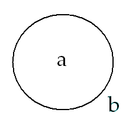

<!-- id: s13-05-0094 -->

C’est celle dont on se sert depuis toujours, mais à laquelle on n’a jamais - jusqu’avant un certain Henri POINCARÉ - fait une véritable attention. Déjà un nommé POPILIUS et bien d’autres encore… Et si on fait ça : \_\_\_\_\_\_\_\_\_ est-ce que c’est un bord ? Justement pas !

<!-- id: s13-05-0095 -->

Mais ça ne veut pas dire que ça n’ait pas de bord. Ça : 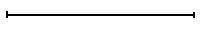 ce trait, ça a deux bords ou plus exactement, par convention, nous appellerons son bord les deux points qui le lient.

<!-- id: s13-05-0096 -->

C’est précisément dans la mesure où *ce que vous voyez là* - qui s’appelle aussi une coupure fermée - n’*a* pas de bord, justement, qu’elle *est* un bord, un bord entre ce qui est là \[a\] et ce qui est là \[b\].

<!-- id: s13-05-0097 -->

<!-- id: s13-05-0098 -->

Ce qui est là \[a\], puisque nous nous sommes limités aux deux dimensions, nous allons l’appeler ce que ça est, nous allons l’appeler un *trou*. Un *trou* dans quoi ? Dans une surface à deux dimensions. Nous allons voir ce qu’il advient d’une surface à deux dimensions qui - à partir de ce que nous avons dit tout à l’heure, et qui est là depuis toujours - est une sphère - je n’ai pas dit un globe : une sphère - ce qu’il résulte dans la surface de l’instauration de ce *trou*.

<!-- id: s13-05-0099 -->

Pour le voir, ce *trou* \[x\] étant - lui - stable dès le départ de l’expérience :

<!-- id: s13-05-0100 -->

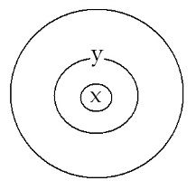

<!-- id: s13-05-0101 -->

Faisons-en d’autres \[y\]. Il est facile de s’apercevoir que ces autres *trous*, sur lesquels nous nous donnons la liberté du mouvement, la liberté d’expérimenter, ce qui va résulter de ce qu’il y a un trou pour les autres trous, tous les autres *trous* peuvent se réduire à être ce point–sujet dont je parlais tout à l’heure. Tous !

<!-- id: s13-05-0102 -->

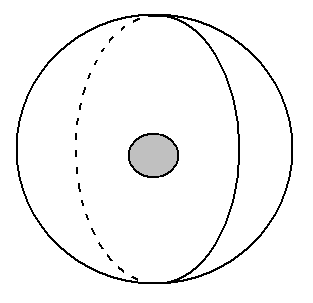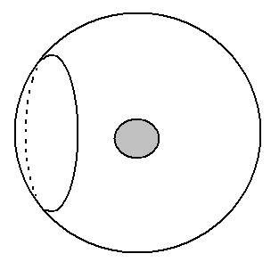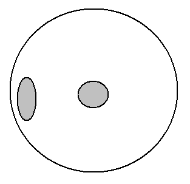

<!-- id: s13-05-0103 -->

> 1 2 3

<!-- id: s13-05-0104 -->

Car supposez que je fasse ceci \[1-2\], c’est la même chose. Si grande que soit la sphère, ce trou \[Y\] je peux l’élargir infiniment pour qu’il aille au pôle opposé se réduire à un simple point \[3\].

<!-- id: s13-05-0105 -->

Ceci veut dire que sur une surface déterminée par ce bord que nous appelons le bord d’un disque, que - cette surface est une sphère en réalité - tous ces trous que nous pouvons pratiquer sont infiniment réductibles à un point, et en plus ils sont tous concentriques, je veux dire que même celui-là \[a : y\] que je fais en dehors de la première coupure, en apparence, il peut, par translation régulière, être amené à la position de celui-ci \[b : x\]. Il suffit pour ça de passer par ce que j’ai appelé tout à l’heure le pôle opposé de la sphère \[c\].

<!-- id: s13-05-0106 -->

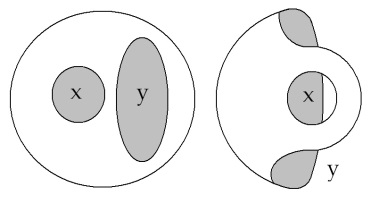 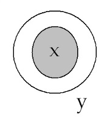

<!-- id: s13-05-0107 -->

> a b c

<!-- id: s13-05-0108 -->

Et pourtant, quelque chose est changé depuis que nous avons fait deux trous. C’est qu’à partir de maintenant, si nous continuons à faire des trous : supposez que nous en fassions un comme ça ici : *c’est un trou réductible, réductible à un point*.

<!-- id: s13-05-0109 -->

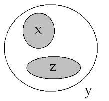

<!-- id: s13-05-0110 -->

Mais si nous en faisons un, concentrique au premier trou et concentrique également au second, là, ce trou-là, n’a aucune chance d’évasion qui lui permette de se réduire à un point.

<!-- id: s13-05-0111 -->

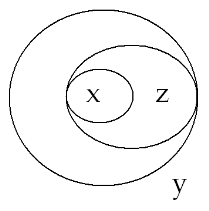

<!-- id: s13-05-0112 -->

Il est irréductible, qu’on le rétrécisse ou qu’on l’élargisse, il rencontrera la limite du bord constitué par deux trous.

<!-- id: s13-05-0113 -->

Je le répète : je dis bord, au singulier, pour dire que, à une étape suivante de l’expérience dans la sphère, j’ai défini deux trous et c’est ça que j’appelle le bord. Ce qui veut dire quoi ? C’est qu’une surface qui est ici dessinée, qu’il vous est facile de reconnaître même si ça vous semble - puisqu’on peut l’appeler un disque - troué, voire quelque chose comme un jade chinois, vous pouvez voir qu’elle est exactement équivalente ici à ce qu’on appelle *un cylindre*.

<!-- id: s13-05-0114 -->

Avec *le cylindre*, nous entrons déjà dans une toute autre espèce surfacielle car je vous présente ici ma sphère à deux trous.

<!-- id: s13-05-0115 -->

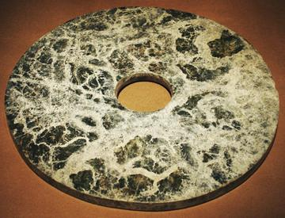

<!-- id: s13-05-0116 -->

Je vous ai dit tout à l’heure que c’était tout à fait équivalent que ces trous *aient l’air* ou *n’aient pas l’air* de se concentriser, *si je puis dire*, l’un l’autre, c’est exactement le même tabac. D’ailleurs vous le voyez, cette espèce d’estomac que j’ai dessiné là est un cylindre, il suffit que j’en abouche autant, à savoir un cylindre à deux trous, aux deux trous précédents (b)*,* ce qui en fait quatre.

<!-- id: s13-05-0117 -->

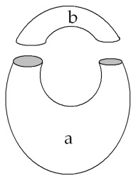

<!-- id: s13-05-0118 -->

Et il suffit que je les couse pour faire sortir la figure qui s’appelle tout simplement dans le langage des demoiselles, un anneau qu’il faut bien entendu conserver en image comme étant creux, pour voir de quelle sorte de surface il s’agit.

<!-- id: s13-05-0119 -->

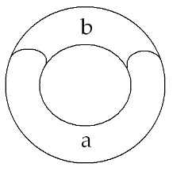

<!-- id: s13-05-0120 -->

Depuis longtemps, je me suis servi de ce *tore* pour articuler bien des choses et vous en retrouvez la trace dans la dernière phase du *Rapport de Rome*[^70]. Ce *tore*, à lui tout seul - et je dirai presque : intuitivement - introduit quelque chose d’essentiel à nous permettre de sortir de l’image sphérique de *l’espace* et de *l’étendue*.

<!-- id: s13-05-0121 -->

Car, bien sûr, nous ne nous imaginons pas que nous ayons dessiné là le vrai *tore* à 3 dimensions. Ce *tore*, à 2 dimensions lui, assurément est un bord, à savoir que dans la mesure où nous avons supprimé les bords du cylindre, c’est un *sans bord*, et comme surface il devient *bord* de quelque chose qui est son intérieur et son extérieur.

<!-- id: s13-05-0122 -->

Mais c’est une figure simple et qui ne doit nous donner l’idée que, analogique de ce qu’il peut advenir de l’espace - de l’espace sphérique - si nous le supposons dans son ampleur, dans son épaisseur d’espace, dirais-je…

<!-- id: s13-05-0123 -->

> pour me faire entendre d’un auditoire pas forcément rompu à l’usage *des formules mathématiques* …qu’il soit, sur lui-même tordu, d’une façon torique.

<!-- id: s13-05-0124 -->

Quoi qu’il en soit, à le prendre, ce qui nous suffit, comme modèle au niveau des deux dimensions, nous nous apercevons qu’ici, il y a - concernant ce que nous pouvons dessiner de bord à une dimension, de coupure – une différence d’espèce, de la nature la plus claire, entre :

<!-- id: s13-05-0125 -->

- *les cercles qui peuvent se réduire à n’être qu’un point* \[1\]

<!-- id: s13-05-0126 -->

> 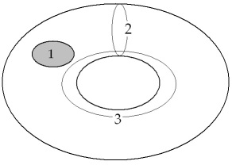

<!-- id: s13-05-0127 -->

- et ceux qui vont se trouver, en quelque sorte bouclés, entravés, du fait d’être un cercle, par exemple tracé comme ceci \[3\] tout le long du tore, ou même ici \[2\] de le boucler dans ce que nous appellerons si vous voulez,

<!-- id: s13-05-0128 -->

> son épaisseur d’anneau. Ceux-là sont irréductibles.

<!-- id: s13-05-0129 -->

Je vous montrerai - j’en reprendrai ceci que j’ai déjà articulé l’année du séminaire sur *L’Identification*[^71] - que le tore nous donne un modèle particulièrement exemplaire à figurer le nœud, le lien qui existe de la demande au désir.

<!-- id: s13-05-0130 -->

Il suffit pour cela de déclarer…

<!-- id: s13-05-0131 -->

> *convention, mais convention dont vous verrez la motivation profonde quand je serai revenu des figures suivantes* …que la demande doit à la fois boucler sa boucle autour de l’intérieur - l’intérieur d’anneau, de cet *anneau* qu’est le *tore* - et venir *se reboucler sur elle-même sans s’être croisée*. Voici à peu près la figure que vous obtenez.

<!-- id: s13-05-0132 -->

De quelque façon que vous la dépouilliez, c’est une figure comme ceci, *le vide central* de l’anneau étant ici :

<!-- id: s13-05-0133 -->

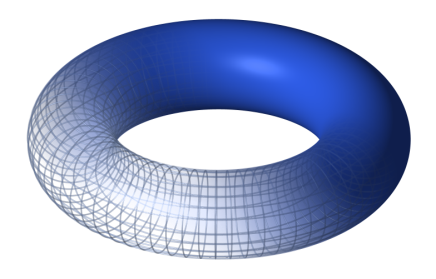

<!-- id: s13-05-0134 -->

Vous pouvez alors facilement constater qu’à dessiner une telle boucle :

<!-- id: s13-05-0135 -->

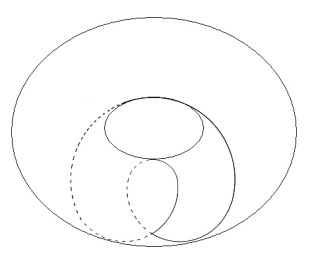 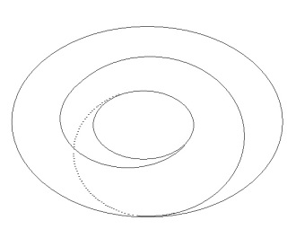

<!-- id: s13-05-0136 -->

vous êtes dans l’obligation de faire au moins deux boucles, je dirai, sur le vide intérieur de l’anneau, et pour que ces boucles se rejoignent, de faire un tour autour de l’autre vide, c’est-à-dire : *2 D* au moins *plus 1 d* ou inversement *2 d plus 1 D*.

<!-- id: s13-05-0137 -->

Autrement dit, un désir suppose toujours au moins deux demandes et une demande suppose toujours au moins deux désirs.

<!-- id: s13-05-0138 -->

C’est là ce que j’ai articulé dans un temps et que je reprendrai. Je ne le rappelle ici que pour pointer l’élément sur lequel nous allons pouvoir revenir d’une façon qui ôte à cette figure son opacité.

<!-- id: s13-05-0139 -->

*Il est important d’aller plus loin avant que je vous quitte*. C’est à savoir, à vous montrer, ce qui constitue à proprement parler la découverte de cette topologie, qui est absolument essentielle pour nous permettre, à nous, de concevoir le lien qui existe entre ce sillon du sujet et tout ce que nous pouvons y accrocher d’opératoire et nommément le mirage que constitue ceci, qui est resté au fond du culot de « la psychanalyse cossue » comme un reste de la vieille théorie de la connaissance et rien d’autre : l’idée de la fusion auto-érotique, de la primordiale unité supposée *de l’être pensant* puisque de penser, il s’agit dans l’inconscient, *avec celle qui le porte*…

<!-- id: s13-05-0140 -->

- comme s’il n’était pas suffisant que l’embryologie nous montre que c’est de l’œuf lui-même que surgissent ces enveloppes qui ne font qu’un, qui sont contiguës avec les tissus de l’embryon, qui sont faits *de la même matière originelle*,

<!-- id: s13-05-0141 -->

- comme si depuis les premiers tracés de FREUD, ceux là même dont il semble que nous n’ayons jamais pu les dépasser, il n’était pas *évident* au niveau de *L’Homme aux loups* [^72]... rappelez vous *L’Homme aux loups* qui était né coiffé... est-ce que ceci n’a pas une importance capitale dans la structure tellement spéciale du sujet, que ce fait qu’il traîne - mais jusqu’après les pas franchis, les derniers pas de l’analyse de FREUD - cette sorte de débris qui serait l’enveloppe, cette obnubilation, ce voile, ce quelque chose, dont il se sent comme séparé de la réalité.

<!-- id: s13-05-0142 -->

Est-ce que tout ne porte pas la trace :

<!-- id: s13-05-0143 -->

- que dans la situation primitive de l’être, ce dont il s’agit c’est bien de son enfermement, de son enveloppement, de sa fermeture à l’intérieur de lui–même. Même s’il se trouve, par rapport à un autre organisme dans une position que les physiologistes n’ont absolument pas méconnue, qui n’est pas de symbiose mais de parasitisme ?

<!-- id: s13-05-0144 -->

- que ce dont il s’agit dans la prétendue fusion primitive, c’est au contraire ce quelque chose qui est pour le sujet un idéal toujours cherché, de la récupération de ce qui constituait *sa fermeture* - *non pas son ouverture* - *primitive*.

<!-- id: s13-05-0145 -->

C’est une première étape de la confusion, mais ce n’est pas dire, bien sûr que nous devions nous en arrêter là, et croire comme LEIBNIZ à *la monade*.

<!-- id: s13-05-0146 -->

Car en effet, si ce complément nous demeure toujours à chercher comme une réparation jamais atteinte - ce dont nous avons effectivement dans la clinique les traces - il reste néanmoins que le sujet est ouvert et que ce qu’il s’agit de trouver, c’est précisément une limite, un bord, un bord tel qu’il n’en soit pas un, c’est-à-dire un bord qui nous permette sur sa surface de tracer quelque chose, qui soit constitué en bord, mais qui soi–même *ne soit pas un bord*.

<!-- id: s13-05-0147 -->

Vous pouvez… vous l’avez vu déjà se retracer, la figure en huit inversé sur le tore, elle coupe le tore et l’ouvre d’une certaine façon tordue mais qui le laisse en un seul morceau. Et ce tore reconstitué est un bord : il y a un intérieur et un extérieur.

<!-- id: s13-05-0148 -->

Nous pouvons donc tirer modèle et enseignement d’*une certaine fonction de bord*, qui s’inscrit sur quelque chose qui est un bord.

<!-- id: s13-05-0149 -->

Nous avons besoin d’une fonction de bord déterminant des effets analogues à ceux que j’ai décrits sur la surface, d’une *différence*, d’une *différenciation*, entre les bords qui pourront être tracés par la suite. Nous avons besoin de cela sur *quelque chose* qui ne soit pas le vrai bord, à savoir qui ne détermine ni intérieur ni extérieur. C’est précisément ce que nous donne la figure que j’ai appelée tout à l’heure \[...\] sur une feuille, cette sorte de bonnet croisé ou *cross-cap*.

<!-- id: s13-05-0150 -->

Cette figure, je dirais, est trop en avant par rapport à ce que nous avons à dire. Ce que je veux aujourd’hui souligner avant de vous quitter c’est ceci : c’est que, une des deux surfaces qui se produisent quand sur cette surface - *faussement fermée, faussement ouverte, c’est ce que j’ai appelé le* *cross-cap -* nous traçons le même bord en huit inversé que j’ai décrit tout à l’heure.

<!-- id: s13-05-0151 -->

Nous obtenons deux surfaces, mais deux surfaces qui là sont distinctes l’une de l’autre, à savoir :

<!-- id: s13-05-0152 -->

- l’une est un disque,

<!-- id: s13-05-0153 -->

- l’autre est une *bande de Mœbius*.

<!-- id: s13-05-0154 -->

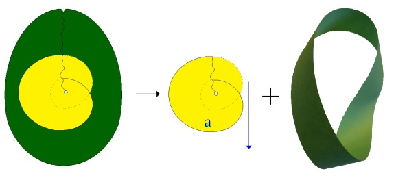

<!-- id: s13-05-0155 -->

Or, ce que ceci va nous permettre d’obtenir c’est - ensuite - des bords d’une structure différente.

<!-- id: s13-05-0156 -->

Tout bord qui sera tracé sur la *bande de Mœbius* donnera des qualités absolument distinctes de ceux qui sont tracés sur le disque, je vous dirai lesquelles la prochaine fois.

<!-- id: s13-05-0157 -->

Et pourtant ce disque se trouve le corrélatif irréductible…

<!-- id: s13-05-0158 -->

> dès lors que nous avons affaire au monde du réel à trois dimensions,
>
> au monde marqué de ce signe de *l’impossible* au regard de nos structures topologiques …ce disque occupe une fonction déterminante à l’endroit de ce qui est le plus original : la *bande de Mœbius*.

<!-- id: s13-05-0159 -->

Qu’est-ce que représente dans cette figuration *bande de Mœbius* ?

<!-- id: s13-05-0160 -->

C’est ce que nous pourrons illustrer la prochaine fois en montrant ce qu’elle est, c’est à dire pure et simple coupure, c’est-à-dire support nécessaire à ce que nous ayons une structuration exacte de la fonction du sujet, du sujet en tant que cette puissance osculatrice[^73], cette prise du signifiant sur lui-même qui fait le sujet nécessairement divisé et qui nécessite que tout recoupement à l’intérieur de lui-même ne fasse rien d’autre, même poussé à son plus extrême, que reproduire - de plus en plus cachée - sa propre structure.

<!-- id: s13-05-0161 -->

Mais l’existence est déterminée par sa fonction dans la troisième dimension ou plus exactement dans le réel où elle existe.

<!-- id: s13-05-0162 -->

Le disque, je vous le démontrerai, se trouve en position de traverser nécessairement - lui comme *réel -* cette figure qui est celle de la *bande de Mœbius* en tant qu’elle nous rend possible le sujet.

<!-- id: s13-05-0163 -->

- Cette traversée de la bande sans endroit ni envers nous permet de donner *une figuration suffisante du sujet comme divisé*.

<!-- id: s13-05-0164 -->

- Cette traversée, c’est précisément la division du sujet lui-même.

<!-- id: s13-05-0165 -->

Au centre, au cœur du sujet, *il y a ce point qui n’est pas un point*, qui n’est *pas sans* laisser un objet central.

<!-- id: s13-05-0166 -->

Soulignez ce « *pas sans* », qui est le même que celui dont je me suis servi pour la genèse de l’angoisse. Cet objet, sa fonction par rapport au monde des objets, nous la désignerons la prochaine fois. Elle a un nom. Elle s’appelle la valeur.

<!-- id: s13-05-0167 -->

Rien dans le monde des objets ne pourrait être retenu comme valeur s’il n’y avait point ce quelque chose de plus originel qui est un certain *objet*, qui s’appelle *l’objet(a)* et dont la valeur a un nom : *valeur de vérité*.

## Notes

[^56]: Jeu de mots sur « *solen* » en allemand.

[^57]: Cf. Bible, Psaumes 118 v 22 : « *La pierre qu'ont rejetée ceux qui bâtissaient Est devenue la principale de l'angle* ».

[^58]: Diogène Laërce, dans *Vies, Doctrines et sentences des philosophes illustres*, vol. 1, précise que Hiéronyme dit que Thalès mesura les pyramides d'Égypte en calculant le rapport entre leur ombre et celle de notre corps. L'anecdote rapporte que le Pharaon Amasis aurait mis ses connaissances à l'épreuve en lui disant que personne n'était en mesure de savoir quelle était la hauteur de la Grande Pyramide. (Plutarque, *Le Banquet des Sept Sages*, §2 :

    « *Ainsi, vous, Thalès, le roi d'Egypte vous admire beaucoup, et, entre autres choses, il a été, au-delà de ce qu'on peut dire, ravi de la manière dont vous avez mesuré la pyramide sans le moindre embarras et sans avoir eu besoin d'aucun instrument. Après avoir dressé votre bâton à l'extrémité de l'ombre que projetait la pyramide, vous construisîtes deux triangles par la tangence d'un rayon, et vous démontrâtes qu'il y avait la même proportion entre la hauteur du bâton et la hauteur de la pyramide qu'entre la longueur des deux ombres.* »)

    Il partit simplement du principe qu'à un certain moment de la journée, l'ombre de tout objet devient égale à sa hauteur. Il ne lui restait qu'à déterminer le moment exact. Il devait également pour cela tenir compte de ce que les rayons du soleil devaient être perpendiculaires avec l'un de ses côtés, ce qui ne se produisait que deux fois par année (21 novembre et le 20 janvier).

[^59]: Protagoras : «  L’homme est la mesure de toute chose »

[^60]: Selon Hippocrate de Chios dit « Ibicrate le géomètre », élève de Sophrotatos, les philosophes grecs ont toujours fait clairement le distinguo entre *l’infini potentiel* - accepté par Aristote essentiellement à l’usage des mathématiciens - l’« apeiron », plus exactement traduit par « l’illimité » - et *l’infini actuel*, par exemple l'ensemble des entiers naturels en tant que totalité achevée, qu’il refuse de considérer. - *L'infini potentiel fut conçu déjà dans la Grèce antique*. On considère que l'on se dirige vers l'infini sans jamais l'atteindre. *L'infini est perçu comme une potentialité*. - *L'infini actuel est une conception plus contemporaine*. À la Renaissance, la perspective cavalière, et par la suite la géométrie projective, introduisirent des points de fuite à l'infini, perceptibles sur des tableaux ou des dessins. Cela amena les penseurs à imaginer l'infini comme « atteignable » ou comme ayant une réalité proche, ils considérèrent l'infini comme une qualité intrinsèque de ce que ils étudiaient, l'infini étant perçu comme une réalité, ou bien plus souvent, car représentant Dieu, donc « inatteignable », « immontrable », à le cacher par un artifice graphique (bâtiment dans l'axe du point de fuite central).

[^61]: Séminaire 1961-62 : « *L’identification* », séance du 07-03.

[^62]: [R. Descartes : « *Les principes de la philosophie*](http://gallica.bnf.fr/ark:/12148/bpt6k942606.capture) », in *Œuvres, Lettres*, Paris, Gallimard, Pléiade, 1953, p.571. Cf. aussi [*Méditation seconde*](http://un2sg4.unige.ch/athena/descartes/desc_med.html).

[^63]: [DESCARTES : *Les passions de l’âme*](http://un2sg4.unige.ch/athena/descartes/desc_pas/desc_pas_frame0.html), in *Œuvres, Lettres*, Paris, Gallimard, Pléiade, 1953, p.695.

[^64]: [Genèse](http://www.mechon-mamre.org/f/ft/ft0101.htm) 7 : וַיַּעַשׂ אֱלֹהִים, אֶת-הָרָקִיעַ, וַיַּבְדֵּל בֵּין הַמַּיִם אֲשֶׁר מִתַּחַת לָרָקִיעַ, וּבֵין הַמַּיִם אֲשֶׁר מֵעַל לָרָקִיעַ; וַיְהִי-כֵן. Dieu fit l'espace, opéra une séparation entre les eaux

    qui sont au-dessous et les eaux qui sont au-dessus, et cela demeura ainsi.

[^65]: Cf. Séminaire Problèmes cruciaux… 10-03 ; Cf. John W. Milnor (médaille Fields 1962) : [*Sommes de variétés différentiables et structures différentiables des sphères*](http://archive.numdam.org/ARCHIVE/BSMF/BSMF_1959__87_/BSMF_1959__87__439_0/BSMF_1959__87__439_0.pdf).

    Bulletin de la Société Mathématique de France, 1959, p. 439-444.

[^66]: Cf. Séminaires : Les Formations… 08-01 - 1958 ; Les Psychoses, 30-11, 07-12-1955.

[^67]: Cf. énoncés performatifs…

[^68]: Cf. Séminaire  : Les Formations… 08-01.

[^69]: Raymond QUENEAU : *Bords : mathématiciens, précurseurs, encyclopédistes*, Paris, Hermann, 1963, Réédition 1978.

[^70]: *Écrits* p.321.

[^71]: Séminaire 1961-62 : « *L’identification* », séances du 21-03 au 11-04.

[^72]: S. Freud : Cinq psychanalyses, Paris, PUF, 1954, 4ème éd. 1970.

[^73]: Oscultatrice : se dit de lignes, plans, surfaces, se touchant d’une façon particulière.
