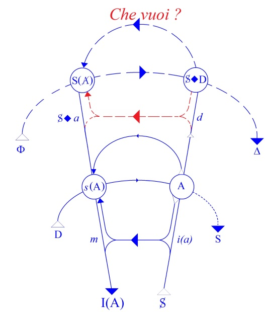

# Leçon 09 | 02 Février l966

<!-- source-url: http://staferla.free.fr/S13/S13 L'OBJET.docx -->
<!-- seminar: s13 -->
<!-- lesson: 09 -->

<!-- id: s13-09-0001 -->

Je me soucie de savoir si ceux des psychanalystes à qui j’ai enseigné quelque chose transmettront proprement ce que j’ai dit.

<!-- id: s13-09-0002 -->

C’est là le sens de l’épreuve que constituent les séances consacrées à un séminaire auquel je ne puis pas admettre autant de monde, pour la raison que cette assistance même serait un obstacle à cette vérification.

<!-- id: s13-09-0003 -->

S’il est vrai que l’aspiration primaire du sujet psychologique est de présenter au désir de l’Autre cet objet fallacieux qu’est son image de soi, nous ne saurions prendre de précautions trop rigoureuses pour ne jamais…

<!-- id: s13-09-0004 -->

> sous une forme quelconque, voir dans ce qui s’appelle *la cure psychanalytique* qui est une expérience proprement transcendante au regard de ce qui s’est exprimé jusqu’alors dans *l’ordre de l’éthique* …nous ne saurions jamais prendre trop de précautions pour définir les voies par où cette formule du rapport du sujet au désir de l’Autre - que je viens de donner d’abord et qui n’a jamais été, dans aucune doctrine philosophique dépassée - soit effectivement dépassée, franchie d’une façon radicale.

<!-- id: s13-09-0005 -->

C’est pourquoi, faute de pouvoir être au quatrième mercredi où se poursuivront les débats qui se sont instaurés depuis les deux mercredi derniers sur le sujet des formulations de Monsieur STEIN ici présent au premier rang de cette assemblée, je l’interrogerai pour que la balle en soit reprise sur ce qu’il entend par ce prétendu masochisme imputé au patient dans la mesure où il se soumet à une règle sévère.

<!-- id: s13-09-0006 -->

Pourquoi si vite aller que de définir *masochisme* ceci, après tout dont nous pourrions n’avoir rien à dire au départ, si ce n’est *qu’il en veut*. C’est tout ce que nous pouvons en dire : « *il en veut !* », formule non pas vague mais minimale du désir.

<!-- id: s13-09-0007 -->

Tout désir alors serait-il d’être désir et en lui-même masochiste. Assurément si la question vaut d’être posée, elle vaut aussi de n’être pas tranchée trop tôt, surtout si nous nous souvenons de la formule que j’ai donnée, en parlant du *désir et de son interprétation* \[séminaire 1958-59\] *qu’en un certain sens*, vues les conditions de *l’expérience psychanalytique*, *le désir c’est son interprétation*.

<!-- id: s13-09-0008 -->

S’exposer à cette situation, qui est vraiment fondamentale, que toute demande ne peut qu’être déçue, c’est là sans doute, ce que le patient a à affronter et ce qu’il ne saurait au départ prévoir, et au reste *quel masochisme dans ce cas à s’offrir à la déception*, comme l’a formulé fort bien quelqu’un d’autre de mes interlocuteurs[^91]. L’analyste est en effet le *sujet supposé savoir*, *supposé savoir tout* sauf ce qu’il en est de la vérité du patient. Et bien plus qu’une situation s’établissant sur les données dont je vous indique ici la pointe, est-ce que le patient qui s’offre à l’expérience analytique ne nous dit pas :

<!-- id: s13-09-0009 -->

> « *C’est vous qui subirez, si vous me demandez la vérité, cette loi que toute demande ne peut qu’être déçue. Vous ne jouirez pas de ma vérité et c’est pour cela que je vous suppose savoir. C’est parce que c’est cela qui vous oblige à être trompé. La pulsion épistémologique, c’est la vérité qui s’offre comme jouissance et qui sait, par là même, être défendue car, qui pourrait jouir de la vérité ?* »

<!-- id: s13-09-0010 -->

Pulsion donc, « plutôt mythique », laissez-moi accoler ces deux termes en un seul mot et recevez - psychanalystes - l’investiture de ce qui vous est ici imposé, l’adjectif en un seul mot : la *plutomythique* . Ce que le patient fait de nous c’est qu’il nous fait déchoir de la position de pyrrhonien[^92]. Vous voudrez en savoir plus :

<!-- id: s13-09-0011 -->

> « *J’éveille votre désir le plus réfléchi, c’est-à-dire le plus méconnaissable.*
>
> *Le prédicat dont vous m’affecterez, c’est votre chute à vous, si vous qualifiez, vous vous qualifiez, je triomphe.* ».

<!-- id: s13-09-0012 -->

Sans doute y a-t-il là, comme STEIN l’a perçu, la pointe et *la naissance d’une culpabilité* chez le patient.

<!-- id: s13-09-0013 -->

Mais vous, si vous vous acceptez comme *juge*, vous voilà rejeté comme *sujet*, dès lors *dans l’ambiguïté d’avoir à se juger*.

<!-- id: s13-09-0014 -->

Le *glissement harmonique* de la langue, ce *sujet* qui a à se *juger*, reconnaissez-en là une de ces formes dont *chaque langue*, à sa façon, nous offre l’indication. Sans doute, ici, du même coup est l’avertissement de n’aller pas, de n’avoir pas à *aller trop loin* car, dit le patient :

<!-- id: s13-09-0015 -->

> « *Bien sûr vous me rendriez masochiste c’est-à-dire amoureux de votre angoisse que vous prenez pour une jouissance. Je suis devenu l’Autre pour vous et si vous n’y prenez garde, vous ne pouvez plus que jouer tout de travers. Car il suffit que je m’identifie à vous*
>
> *pour que vous voyiez bien que ce n’est pas de moi que vous jouirez. La muscade est passée et qu’à prendre votre réalité (Wirklichkeit),* *ce que j’efface jusqu’à la trace dans le réel (Realität), c’est justement ce que j’ai choisi en vous pour sanctionner cet effacement.* »

<!-- id: s13-09-0016 -->

Ainsi l’idée d’un être subsistant et saisissable, fondant les relations de sujet à sujet est proprement le terrain savonné de pièges sur lequel au départ, une théorie insuffisante s’engage irrémédiablement. Et c’est pour cela qu’il est pour nous si souhaitable d’élaborer la structure qui nous permette de concevoir d’une façon radicale, comment est possible le progrès de celui qui s’offre dans la position de sujet supposé savoir et qui doit pourtant, *initialement* et de façon *pyrrhonienne,* renoncer à tout accès à *la vérité*.

<!-- id: s13-09-0017 -->

Οὐ μᾶλλον \[ou mallon\], « *pas plus* *ceci que cela »*, cette formule nodale est celle où s’exprime la position du *pyrrhonien* ou du *sceptique*, PYRRHON étant le chef de file d’une de ces sectes philosophiques que j’ai encore appelées à l’occasion « *écoles* » pour bien rappeler qu’autre chose était la pratique de la philosophie dans un certain contexte, celui où s’achevait un certain ordre socialement défini du monde antique.

<!-- id: s13-09-0018 -->

Songez à ce qu’était la discipline de ceux qui s’imposaient précisément :

<!-- id: s13-09-0019 -->

- dans l’introduction de tout prédicat,

<!-- id: s13-09-0020 -->

- dans quelque question que ce fût sur *la vérité*, …non pas seulement de repousser par un  « *ni*... , *ni*... » les membres d’une alternative, mais de toujours se défendre contre l’introduction même de *la disjonction* - celle la plus apparemment s’imposant - le refus précisément de franchir la barre de son établissement et de rejeter tout ensemble les deux membres de la disjonction.

<!-- id: s13-09-0021 -->

La position donc fondamentale d’un sujet comme s’imposant son propre arrêt au seuil de *la vérité* est ici quelque chose qui mériterait sans doute plus longue explication, retour sur ces textes, sans doute épars, insuffisants, pleins de problèmes, mais dont pourtant la lecture d’un SEXTUS EMPIRICUS[^93] peut nous donner toute *l’ampleur*, celle qui ne se touche pas simplement à en lire dans quelque manuel le résumé, mais à suivre au détour d’un texte qu’il faut effeuiller page par page, *le style, le poids, la réalité du jeu* qui y était engagé.

<!-- id: s13-09-0022 -->

Ce n’est point pour rien qu’ici j’avance cette référence que je donne comme visée aux plus studieux, fusse à leur indiquer d’y trouver dans l’excellent ouvrage de Victor BROCHARD[^94] « *Les sceptiques grecs »,* le complément, la situation, le fruit d’une méditation réelle dans un esprit moderne. Ce n’est point par hasard que je le mets ici au seuil de ce que j’ai annoncé aujourd’hui comme devant être mon sujet qui, sans doute ne doit pas être pour rien dans l’énorme assistance que je recueille, c’est à savoir : *Le pari de Pascal*.

<!-- id: s13-09-0023 -->

*Le pari de Pascal*, j’espère qu’il n’est nul d’entre vous qui avant aujourd’hui n’en ait eu quelque vent.

<!-- id: s13-09-0024 -->

Je ne doute pas que *Le pari de Pascal* ne soit quelque chose - j’entends comme objet culturel - d’infiniment plus diffusé qu’on ne le suppose et si l’on s’émerveille qu’il y ait eu *quelques* textes de philosophes.

<!-- id: s13-09-0025 -->

Après tout si je devais ici vous en donner *la bibliographie*, j’arriverais - mon Dieu - assez vite à l’épuiser : quand j’aurais atteint à une cinquantaine de références, du côté de ceux qui écrivent et qui jugent bon de nous faire part de leur pensée, j’en aurais vu le bout. Et tout ce qui a été dit - je regrette d’avoir à énoncer une formule si déprimante, je le regrette d’autant plus que ceci intéresse, si je puis dire, la réputation d’une corporation dite philosophique - tout ceci ne va pas bien loin.

<!-- id: s13-09-0026 -->

Je ne serai pas, pourtant, sans vous recommander tel article, qui se recommande par le procédé excellent d’un départ au niveau, je ne dirai pas, du texte mais de l’écrit de ce petit papier, ou plutôt de *ces deux petits papiers* couverts *recto* et *verso*, qui est ce que PASCAL nous a laissé de ce qu’on pourrait appeler son griffonnage, et qui partant de là, car c’est bien nécessaire de n’y point voir quelque chose qui aurait été achevé à notre adresse mais qui pourtant - *et peut-être d’autant plus* - mérite d’être retenu comme nous donnant en quelque sorte, une sorte de substitut ou de substance réelle concernant cette singulière réalité incorporelle qui est proprement celle dont j’essaie, avec les ressources d’une topologie élémentaire, de faire valoir pour vous ce que nous pouvons en tirer au niveau de nos articulations.

<!-- id: s13-09-0027 -->

À ce titre, l’article de Monsieur Henri GOUHIER…

<!-- id: s13-09-0028 -->

> paru dans une revue italienne et dont après tout, j’aimerais vous laisser ici l’indication, revue italienne qui est celle publiée sous le titre de *Archivio di filosofia, n°3, l962, organe de l’institut des études philosophiques, Di studi filosofici* à Rome …l’article de Monsieur Henri GOUHIER : « *Le pari de Pascal »* mérite, si vous pouvez vous procurer le tome de cette revue, votre attention. C’est, comme vous le voyez, un des derniers parus.

<!-- id: s13-09-0029 -->

Dans le passé il y en a eu bien d’autres :

<!-- id: s13-09-0030 -->

- depuis *les étonnements de* VOLTAIRE[^95],

<!-- id: s13-09-0031 -->

- *les précisions de* CONDORCET,

<!-- id: s13-09-0032 -->

- *les divagations de* LAPLACE,

<!-- id: s13-09-0033 -->

- *le scandale de* Victor COUSIN[^96] sur lequel ici je ne m’étendrai pas, n’ayant pas le temps de vous dire quelle fut la véritable fonction de ce qu’on appelle *l’éclectisme* \[[cf. 09–02](#eclectisme)\],

<!-- id: s13-09-0034 -->

- plus récemment *les remarques de mérite qui ont été données par le bon* LACHELIER[^97], qui assurément peuvent se lire.

<!-- id: s13-09-0035 -->

- Je n’en dirai pas autant de quelque chose dont je vous donnerai un échantillon tout à l’heure, *l’article de* DUGAS et RIQUIER dans la *Revue philosophique* de l900.

<!-- id: s13-09-0036 -->

Depuis les choses ont été reprises au niveau de ce que nous appellerons le pari considéré au niveau du plan de l’Autre.

<!-- id: s13-09-0037 -->

Doit-on parier ?

<!-- id: s13-09-0038 -->

Parier - comme PASCAL nous l’indique, si tant est que c’est de cela qu’il s’agisse - ce qu’aurait de *certain* le bien de notre vie - conçue à son niveau le plus ordinaire - *pour l’incertitude d’une promesse*…

<!-- id: s13-09-0039 -->

> dont l’articulation de PASCAL semble toute entière orientée à nous montrer le *sans mesure*
>
> au regard de ce que nous abandonnerions …« *introduction* » dit-on - pour nous : « *invite* » - au pari de la croyance : assurément discernez dès maintenant ce qui se propose dans l’avancée de ce *quelque chose*, après tout qui n’est pas si loin de la conscience la plus commune, cette vague angoisse de l’au-delà - qui n’est point forcément un au-delà de la mort - ne faut-il pas qu’elle existe pour se supporter dans toutes sortes de références qui, pour les plus exigeants, prennent forme dans ces espoirs auxquels on se consacre et qui ne sont, dans cette perspective, au regard de la religion, que quelque chose que pour le moins nous qualifierons d’*analogique*…

<!-- id: s13-09-0040 -->

Dans un chapitre court et substantiel, l’auteur du *Dieu caché* [^98] - M. GOLDMAN - ne semble pas, pour lui, du tout répugner à faire du *pari de Pascal* le prélude à la foi que le marxiste engage dans *l’avènement du prolétariat*.

<!-- id: s13-09-0041 -->

Je serais loin de réduire à cette portée, dont le moins qu’on puisse dire c’est qu’elle est un tant soi peu trop apologétique, la portée d’un chapitre dont la valeur de discussion est assurément enrichissante, assez sans doute pour que nous puissions mettre cette part de l’entreprise au dessus du bricolage.

<!-- id: s13-09-0042 -->

Mais il me semble que nulle part, personne ne s’est avancé dans ce texte du pari de ce point de vue : que ce n’est pas un « *on* » qu’il s’agit de convaincre, que ce pari est le *pari de Pascal* lui-même, d’un « *Je* », d’un sujet qui nous révèle sa structure, structure parfaitement contrôlable et à contrôler, non pas de tel ou tel incident qui le confirme dans le contexte biographique, les gestes de PASCAL dans une vie dont on a raison de manifester les pas extrêmement complexes, les gestes tels qu’ils s’achèvent dans l’approche de la mort…

<!-- id: s13-09-0043 -->

> dans tel ou tel vœu qui peut nous paraître exorbitant : celui d’être mené aux incurables pour y achever son existence …ce serait bien vite les épingler que d’y relever la thématique masochiste.

<!-- id: s13-09-0044 -->

Si un sujet, si une pensée - qui sait si admirablement distinguer, vous allez le voir, dans la formulation stricte de positions essentielles - nous livre en quelque sorte sa structure, c’est là quelque chose qui pour nous, n’a à être relié qu’aux autres points où, aussi, la structure du sujet en tant que telle est par lui, dans une certaine position radicale, manifestée - et si nous avons l’honneur de voir s’affirmer, sans qu’au reste rien ne dise qu’il y eût là un quelconque message car après tout, ces petits papiers, nous les avons presque après sa mort, la mort n’est *peut-être pas* la limite d’aucun au-delà, elle est *sûrement* une des limites les plus faciles à utiliser quand il s’agit de faire les poches.

<!-- id: s13-09-0045 -->

On a fait les poches à PASCAL. La chose est faite, profitons-en.

<!-- id: s13-09-0046 -->

Profitons-en s’il y a quelque chose qui puisse *pour nous* nous permettre d’articuler un des plus *singuliers projets*, une forme d’entreprise les plus exceptionnelles qui nous ait jamais été donnée, et qui peut passer pour être la plus banale comme vous allez le voir.

<!-- id: s13-09-0047 -->

« *Infini, rien.* » [^99]

<!-- id: s13-09-0048 -->

Commence-t-il, ininterprétable.

<!-- id: s13-09-0049 -->

« *Notre âme est jetée dans le corps, où elle trouve nombre, temps, dimensions.*

<!-- id: s13-09-0050 -->

*Elle raisonne là-dessus, et appelle cela nature, nécessité, et ne peut croire autre chose.* »

<!-- id: s13-09-0051 -->

Rappel des puissances de l’imaginaire .

<!-- id: s13-09-0052 -->

> « *L’unité jointe à l’infini ne l’augmente de rien, non plus qu’un pied à une mesure infinie. Le finit s’anéantit en présence de l’infini,*
>
> *et devient pur néant. Ainsi notre esprit devant Dieu ; ainsi notre justice devant la justice divine. Il n’y a pas si grande disproportion*
>
> *entre notre justice et celle de Dieu, qu’entre l’unité et l’infini.* »

<!-- id: s13-09-0053 -->

Je ne résiste pas au plaisir de ne pas couper ce qui suit :

<!-- id: s13-09-0054 -->

> « *Il faut que la justice de Dieu soit énorme comme sa miséricorde. Or la justice envers les réprouvés est moins énorme et doit moins choquer que la miséricorde envers les élus. Nous connaissons qu’il y a un infini, et ignorons sa nature. Come nous savons qu’il est faux que les nombres soient finis, donc il est vrai qu’il y a un infini en nombre. Mais nous savons ce qu’il est : il est faux qu’il soit pair,* *il est faux qu’il soit impair, car, en ajoutant l’unité, il ne change point de nature ; cependant c’est un nombre, et tout nombre est pair* *ou impair (il est vrai que cela s’entend de tout nombre fini). Ainsi, on peut bien connaître qu’il y a un Dieu sans savoir ce qu’il est.*

<!-- id: s13-09-0055 -->

*N’y a-t-il point une vérité substantielle, voyant tant de choses vraies qui ne sont point la vérité même ? Nous connaissons donc* *l’existence et la nature du fini, parce que nous sommes finis et étendus comme lui. Nous connaissons l’existence de l’infini et ignorons* *sa nature, parce qu’il a étendue comme nous, mais non pas des bornes comme nous. Mais nous ne connaissons ni l’existence ni la nature* *de Dieu, parce qu’il n’a ni étendue ni bornes. Mais par la foi nous connaissons son existence ; par la gloire nous connaîtrons sa nature.*

<!-- id: s13-09-0056 -->

*Or, j’ai déjà montré qu’on peut bien connaître l’existence d’une chose sans connaître sa nature.* »

<!-- id: s13-09-0057 -->

Telle est l’introduction développée dans la suite. Je vous prierai, à partir de là, de vous reporter au texte dont le départ est proprement que PASCAL...

<!-- id: s13-09-0058 -->

penseur, et penseur - si vous le voulez – religieux, intégré à la pensée que les réprouvés comme les élus,

<!-- id: s13-09-0059 -->

> sont entièrement à la merci de la grâce divine …n’en pose pas moins pourtant comme *démarche inaugurale*, que Dieu, d’aucune sorte de façon et jusque dans son être, ne saurait être connu.

<!-- id: s13-09-0060 -->

Il pointe même à proprement parler qu’on ne saurait, de par le pouvoir de la raison, savoir s’il existe. L’important, je vais \- j’espère - vous le montrer, et après tout je ne pense pas là apporter pour aucun d’entre vous quelque chose de *si surprenant*.

<!-- id: s13-09-0061 -->

Vous avez assez entendu parler - quoique suspendus dans le vague des problèmes de l’existence *-* pour que vous ne soyez pas surpris si j’indique *–* si j’indique en passant faute de pouvoir plus aujourd’hui m’y arrêter *–* que l’important n’est point tant *ce suspens*, en tant qu’il est radical, que la division qu’il introduit entre *l’être* et *l’existence*.

<!-- id: s13-09-0062 -->

Le « *il existe* » qui fit tellement de difficultés à la pensée aristotélicienne pour autant qu’après tout, l’être posé se suffit : il existe parce qu’il est *être*. Et pourtant, l’intrusion de la révélation religieuse, celle du judaïsme pose - *je parle, parmi les philosophes à partir d’Avicenne* - la question de savoir comment caser ce suspens de l’existence en tant qu’il est nécessaire pour une pensée religieuse d’en remettre à Dieu la décision.

<!-- id: s13-09-0063 -->

Cette impossibilité de caser d’une façon catégorisable la fonction de l’existence au regard de l’être fût-elle la même qui ira à rejaillir en question sur Dieu lui-même, à nous garder sur cette question de savoir s’il suffit de dire de Dieu qu’il est l’être suprême. N’en doutez pas : pour PASCAL *la question est tranchée* ! Un autre petit papier cousu, lui, plus profondément que dans une poche, sous une doublure… « *Non pas Dieu des philosophes mais Dieu d’Abraham, d’Isaac et de Jacob* »[^100] …nous montre le pas franchi et *qu’il ne s’agit point de l’être suprême*.

<!-- id: s13-09-0064 -->

Dès lors, déblayez, décrassez ces questions préliminaires qui rendront assurément précaires toutes références à un donné comme constituant suffisamment de par soi-même *une cer­titude*. Quand M.M.DUGAS et RIQUIER, à la fin de leur article \- lisez-le, je ne prétends pas le faire juger tout entier à l’échantillon que je vous en donne - s’interrogent :

<!-- id: s13-09-0065 -->

> « *Et maintenant que penser d’une expérience qui se présente ainsi : pour entrer dans l’état d’âme du croyant*
>
> *vous dépouillerez votre nature, vous ferez table rase de vos instincts, de vos sentiments, de vos conceptions du bonheur.*
>
> *À ne considérer le pari qu’au point de vue logique, le refus de parier pour*…»

<!-- id: s13-09-0066 -->

*On appelle ça, dans l’argument* - je ne vous l’ai pas lu assez loin pour que vous soyez à ce point de vocabulaire - « *prendre croix* ».

<!-- id: s13-09-0067 -->

Ça veut dire « *pair ou impair* », « *croix ou pile* », il ne s’agit pas de la croix chrétienne.

<!-- id: s13-09-0068 -->

> « *Mais si nous nous mettons en face des conditions réelles du pari, nous devons dire qu’il y aurait au contraire folie à prendre croix car la foi n’est pas telle que Pascal quelquefois la présente. Elle ne se superpose pas simplement à la raison, elle n’a pas pour effet de reculer les bornes de notre esprit sans entraver son développement naturel et de lui donner ainsi accès dans un monde qui lui serait naturellement fermé. En réalité elle exige l’abdication de notre raison, l’immolation de nos sentiments. Cet anéantissement de notre personnalité*
>
> *n’est-il pas le plus grand danger que nous puissions, humainement courir. Pascal, néanmoins, voit ce danger d’un œil indifférent. Qu’avez-vous à perdre ? Nous dit-il, tout rempli de ses idées théologiques* - nous voilà dans la psychologie - *il n’entre pas dans l’esprit de l’homme purement homme et son « discours » s’adresse exclusivement à celui qui admet déjà, sinon le péché originel*
>
> *et la déchéance de l’homme, du moins la faiblesse de la raison, la vanité du bonheur terrestre et toute cette philosophie pessimiste*
>
> *que lui-même a tiré du dogme chrétien - mais tout esprit qui n’a que la raison pour guide et qui croit à la dignité naturelle de l’homme*
>
> *et à la possibilité du bonheur ne peut manquer de considérer l’argumentation du pari à la fois comme une monstruosité logique et une énormité morale. La dureté d’un pareil jugement trouverait au besoin sa justification ou son excuse dans la remarque célèbre de Pascal sur la différence entre les hommes ou l’originalité des esprits* ».

<!-- id: s13-09-0069 -->

Je vous passe quelques lignes pour arriver jusqu’à cette absolution indulgente : « *Sa sincérité est évidente, sa franchise absolue et quelle que soit l’immoralité de ses thèses et la faiblesse de ses raisonnements,* *on continue à respecter son caractère et à admirer son génie.* ».

<!-- id: s13-09-0070 -->

Voilà qui est envoyé ! « Poupoule passez-moi mes pantoufles, je lui ai réglé son compte ! »

<!-- id: s13-09-0071 -->

Néanmoins j’aimerais que, faisant appel à tout ceci, qui après tout, donne une note qui n’est à proprement parler jamais tout à fait absente, au moins comme état de ceux qui ont poussé le plus loin l’analyse du *pari de Pascal*, auxquels je ne voudrais pas - faute de craindre de l’oublier ensuite - manquer de joindre à ceux que je vous ai cités tout à l’heure, le chapitre consacré par Monsieur SOURIAU au pari de PASCAL dans son livre : *L’ombre de Dieu* [^101]. Là aussi vous y verrez des aperçus tout à fait suggestifs et valables dans notre perspective au regard de *la façon dont il convient de manier ce témoignage*.

<!-- id: s13-09-0072 -->

Un pari. On a dit sur ce pari beaucoup de choses, et en particulier qu’il n’en était pas un. Nous allons voir tout à l’heure *ce que c’est qu’un pari*. Ce qui fait peur, au départ, c’est l’enjeu et la façon dont PASCAL en parle. \[pléiade, p.1213\]

<!-- id: s13-09-0073 -->

> « *Exa­minons donc ce point et disons : Dieu est ou il n’est pas. Mais de quel côté pencherons-nous. La raison n’y peut rien déterminer.*
>
> *Il y a un chaos infini. Tout nous sépare. Il se joue un jeu*...

<!-- id: s13-09-0074 -->

Attention à cette phrase !

<!-- id: s13-09-0075 -->

...*à l’extrémité de cette distance infinie où il arrivera croix ou pile.* »

<!-- id: s13-09-0076 -->

Jamais « *cette distance infinie* » - à savoir ce qu’elle veut dire - n’a été vraiment prise en considération.

<!-- id: s13-09-0077 -->

« *Que gagerez-vous ? Par raison vous ne pouvez faire ni l’un ni l’autre. Par raison vous ne pouvez défendre nulle des deux.* »

<!-- id: s13-09-0078 -->

C’est PASCAL qui parle.

<!-- id: s13-09-0079 -->

> « *Ne blâmez donc pas de fausseté ceux qui ont pris un choix car vous n’en savez rien. - Non… répond l’interlocuteur qui est Pascal lui-même aussi… mais je les blâmerai d’avoir fait, non ce choix, mais <u>un choix</u> car encore que celui qui prend croix et l’autre,*
>
> *soient en pareille faute, ils sont tous deux en faute. Le juste est de ne point parier . - Oui, mais il faut parier. Cela n’est pas volontaire. Vous êtes embarqués. Lequel prendrez-vous donc, voyons, puisqu’il faut choisir. Voyons ce qui vous intéresse le moins.*
>
> *Vous avez deux choses à perdre*...

<!-- id: s13-09-0080 -->

Personne ne semble s’être aperçu qu’il s’agit purement et simplement de les perdre.

<!-- id: s13-09-0081 -->

...*le vrai et le bien, deux choses à engager : votre raison et votre volonté, votre connaissance et votre béatitude.* »

<!-- id: s13-09-0082 -->

Quand on engage quelque chose dans un jeu, dans un jeu qui se mène à deux il y a deux mises :

<!-- id: s13-09-0083 -->

- *votre raison et votre volonté* est la première,

<!-- id: s13-09-0084 -->

- *votre connaissance et votre béatitude* est la seconde, qui n’est point mise par le même partenaire.

<!-- id: s13-09-0085 -->

Plus tard on discutera sur ce qui est en jeu, à savoir : « *Gagez donc qu’<u>Il est</u>, sans hésiter* \[...\] *puisqu’il y a pareil hasard de gain, et de perte, si vous n’aviez qu’à gagner deux vies pour une,* *vous pourriez encore gagner.* » \[p.1214\]

<!-- id: s13-09-0086 -->

À la suite de quoi il nous est promis - en une formule dont il importe de ne pas méconnaître le texte - « *une infinité de vie* » d’abord, ce qui déplace bien sûr, les conditions de l’enjeu, ce ne sont point deux vies au lieu d’une, une vie de chaque côté qui sont mises dans le jeu, mais une vie d’une part et d’autre part, ce que PASCAL appelle d’abord :

<!-- id: s13-09-0087 -->

- « *une éternité de vie* »,

<!-- id: s13-09-0088 -->

- puis ensuite : « *une infinité de vie infiniment heureuse* ».

<!-- id: s13-09-0089 -->

C’est ce que nous aurons à reprendre dans un instant quand nous étudierons ce que signifie un tel pari.

<!-- id: s13-09-0090 -->

Mais d’abord je voudrais interroger sur ceci qui n’a point été retenu, c’est à savoir ce que veut dire « *engager sa vie* » et comment elle est mise dans le jeu. Nous voyons PASCAL y faire allusion à plusieurs étapes de son raisonnement :

<!-- id: s13-09-0091 -->

- Premièrement qu’elle ne peut pas ne pas y être engagée.

<!-- id: s13-09-0092 -->

- Deuxièmement la façon dont il conviendra de la juger si, au terme, le pari est perdu.

<!-- id: s13-09-0093 -->

« *Je réponds* - dit PASCAL - *perdue votre vie* - et ici il articule - *mais la perdant vous ne perdez rien.* »

<!-- id: s13-09-0094 -->

*Singularité de ce rien !* D’abord il s’agit d’une vie, au moins pour un temps, dans le cas moyen, ce choix n’est point fait au lit de mort, encore que ceci ne soit point impensable, une vie que vous aurez vécue. Cette vie elle est évoquée à d’autres moments comme comportant plus d’un plaisir, plaisirs qu’il qualifie d’*empestés* sans doute mais qui n’en sont pas moins là, pourvus d’un certain poids puisqu’ils feront obstacle à ce que de ce raisonnement, celui *auquel il s’adresse* sente la portée convaincante.

<!-- id: s13-09-0095 -->

L’ambiguïté donc de cette vie entre :

<!-- id: s13-09-0096 -->

- ceci qu’elle est le cœur de la résistance du sujet à s’engager dans le pari,

<!-- id: s13-09-0097 -->

- et que d’autre part, au regard de ce dont il s’agit dans le pari, elle est un *rien*, ...ceci est proprement ce qui doit être par nous retenu pour *nous faire nous interroger* sur ce qui distingue ce *rien*.

<!-- id: s13-09-0098 -->

Ce *rien* a tout de même cette propriété qu’il est l’enjeu dont nous allons voir tout de suite ce dont il s’agit concernant un pari, cette remarque est justement le quelque chose qui va nous permettre de donner sa véritable place dans la structure à ce prétendu *rien* de l’enjeu.

<!-- id: s13-09-0099 -->

Et si, quand franchissant le terme du « discours » - entre guillemets, pour les y mettre comme M.M. DUGAS et RIQUIER - de PASCAL, PASCAL, à celui qui vient à consentir à se soumettre aux règles du pari, dit pourtant : « *Vous ne pourrez croire que les effets de mon pari s’identifient à ma croyance.* ».

<!-- id: s13-09-0100 -->

La réponse de PASCAL : « *Abêtissez-vous* »[^102], celle qui faisait l’horreur de M. Victor COUSIN, le premier à l’avoir extraite avec l’écrit du scandale des papiers directs - auxquels il avait directement accès - de PASCAL, cet « *Abêtissez-vous* » est pourtant assez clair.

<!-- id: s13-09-0101 -->

Cet « *Abêtissez-vous* » est exactement ce que nous pouvons désigner par le renoncement aux *pièges*, aux *enveloppes*, à *l’habillement du narcissisme*, à savoir, au dépouillement de cette *image*, la seule que justement n’ont pas les bêtes, à savoir l’*image de soi*.

<!-- id: s13-09-0102 -->

Ce qui tombe, *ce qui choit,* au but proposé d’une certaine ascèse, d’un certain dépouillement, c’est proprement ce qui relie dans sa situation dans l’être, au niveau de ce qui s’en affirme comme « *je suis* » au champ de l’Autre, de ce qui dans le sujet relève de *la méconnaissance de soi*.

<!-- id: s13-09-0103 -->

Est-ce à dire, si nous devions prendre pour égal au néant le *rien* qui reste, comment pourrait-il alors jouer son rôle d’enjeu ?

<!-- id: s13-09-0104 -->

Ce *rien*, est-ce que - j’introduis ici la question - nous ne pouvons pas l’identifier :

<!-- id: s13-09-0105 -->

- à cet *objet* toujours fuyant, toujours dérobé,

<!-- id: s13-09-0106 -->

- à ce qui est après tout - espoir ou désespoir - l’essence de notre désir,

<!-- id: s13-09-0107 -->

- à cet *objet* innommable, insaisissable, inarticulable et pourtant que le pari de PASCAL va nous permettre d’affirmer, selon la formule que PLATON emploie dans le *Phédon* [^103] concernant ce qu’il en est de l’être, comme quelque chose à quoi correspond *un discours invincible * ?

<!-- id: s13-09-0108 -->

Le *(a)* comme cause du désir et valeur qui le détermine, voilà ce dont il s’agit dans l’enjeu pascalien.

<!-- id: s13-09-0109 -->

Qu’est-ce qui nous permet de le confirmer ? Assurément, je viens de le dire, le fait qu’il est engagé comme enjeu dans le pari.

<!-- id: s13-09-0110 -->

Pour ceci, il convient de débrouiller les obscurités qui concernent ce que c’est qu’un pari. Un pari c’est un acte auquel beaucoup se livrent. J’ai dit « *c’est un acte* » : il n’y a pas en effet de pari sans quelque chose qui emporte la décision.

<!-- id: s13-09-0111 -->

Cette décision est remise à une cause que j’appellerai *la cause idéale* et qui s’appelle *le hasard*. Aussi bien, faisons très attention d’éviter ici l’ambiguïté qui consisterait à insérer le *pari de Pascal* dans les termes de la moderne théorie, *non encore née à cette époque,* de la probabilité. La probabilité est ce que le développement de notre science rencontre au dernier terme d’une certaine veine d’investigation du réel.

<!-- id: s13-09-0112 -->

Et pour manifester *la permanence de la présence de cette ambiguïté* dont j’évoquai seulement tout à l’heure le profil concernant le rapport à l’être, je ne puis ici que rappeler comment - comme dirait PASCAL - se marquent « *les différences des esprits* », ce qui n’est point une remarque psychologique mais une référence à la structure du sujet.

<!-- id: s13-09-0113 -->

La répugnance marquée - par exemple dans une lettre à Max BORN - d’EINSTEIN[^104] pour cette réalité dernière qui ne serait qu’un joueur de dés, l’attachement foncier et proclamé de la part d’un esprit qui y engageait la plus haute autorité scientifique de son temps, pour la supposition d’un être - malin sans doute mais qui ne trompe pas - à savoir une certaine forme encore parfaitement subsistante au centre d’une pensée scientifique d’un être divin, voilà qui mérite d’être rappelé, au seuil de ce en quoi nous allons nous engager et qui est proprement…

<!-- id: s13-09-0114 -->

> ceci ne peut être défini qu’au moment de ce seuil, de ce pas, de ce franchissement radical de PASCAL ...à savoir le terme strictement opposé d’un hasard défini \[αύτόματον : *automaton*\].

<!-- id: s13-09-0115 -->

Car qu’est-ce que le hasard ? Le hasard se rattache essentiellement à la conception du *réel* en tant qu’*impossible*, ai-je dit. Impossible à quoi, compléterai-je aujourd’hui ? *Impossible à interroger, impossible à interroger parce qu’il répond au hasard*.

<!-- id: s13-09-0116 -->

Qu’est-ce à dire de cette forme du *réel* ? Nous pouvons considérer - ne serait-ce que pour un instant et pour situer le sens de ce que nous articulons - comme « *le mur* »[^105], *la limite*, le point auquel nous essayons, au dernier terme par l’exploration de la science de finir par rejoindre, le point ou il n’y a plus rien à en tirer qu’une réponse au hasard.

<!-- id: s13-09-0117 -->

La science n’est point achevée, mais la progressive montée d’une pensée *qu’on appelle très improprement indéterministe*…

<!-- id: s13-09-0118 -->

> pour autant que le niveau du *réel* que nous interrogeons nous y oblige …peut nous permettre au moins de suggérer cette perspective où s’inscrirait le savoir scientifique. s’il est précisément ce que je vous dis - c’est-à-dire *renonciation au connaître, du même coup à l’être -* n’est-ce point dans la mesure où ce dont il s’agit c’est de construire sous forme *des instruments scientifiques,* ce qui, au cours de cette visée de rejoindre au *réel* le point de hasard, nous a été commandé comme instrument qui soit capable de le rejoindre.

<!-- id: s13-09-0119 -->

Qu’est-ce qu’un *dé* sinon *un instrument fait pour faire surgir le pur hasard*. Dans l’investigation du *réel*, tous *nos instruments* peuvent n’être conçus que comme l’échafaudage grâce à quoi, à pénétrer plus avant, nous arrivons jusqu’au terme de l’absolu hasard.

<!-- id: s13-09-0120 -->

Je ne dis point que je tranche en cette matière. Sans doute, ils ne pourraient être suffisamment articulés qu’à entrer d’une façon bien plus précise, dans les élaborations que notre étreinte avec la physique nous contraignent de donner au principe de la probabilité. Mais nous sommes là à un niveau beaucoup plus élémentaire.

<!-- id: s13-09-0121 -->

Est-ce que, avant que naisse cette *théorie de la probabilité* qui assure à ce registre si je puis dire, son *sérieux scientifique,* nous ne devons pas nous interroger sur ce que signifie la première spéculation sur le hasard indispensable toujours à mettre en exergue de toute spéculation sur la probabilité.

<!-- id: s13-09-0122 -->

Ouvrez n’importe quel livre...

<!-- id: s13-09-0123 -->

> il y en a de bons, il y en a de mauvais - *il y en a un bon que je vous cite au passage :* *« Le hasard »* de M. Émile BOREL[^106] - simplement du fait qu’il vous ramasse au passage une série d’objections, de *questions absurdes* : rien de plus intéressant pour nous que les *stultitiœ questiones* [^107] …vous y verrez que pour ceux qui commencent à *donner corps,* à donner forme à cette question sur le hasard, quand j’ai dit tout à l’heure « *donner corps* » et évoquant cette édification de notre science, il me vient en écho la formule qui avait en quelque sorte - prenant des notes - jailli de ma plume : que dans le repérage sur ce « *mur de hasard* », *notre science*, *dans ses instruments*, *donnerait corps à la vérité*.

<!-- id: s13-09-0124 -->

Mais qu’est-ce qui hante quiconque taquine, au niveau le plus *accessible* et le plus *élémentaire*, ce jeu du hasard :

<!-- id: s13-09-0125 -->

- les singes dactylographes au bout de combien de temps auront-ils écrit avec leur machine un vers d’HOMÈRE ?

<!-- id: s13-09-0126 -->

- Quelle est la chance qu’un enfant qui ne connaît pas l’alphabet ne range d’emblée dans le bon ordre les lettres ?

<!-- id: s13-09-0127 -->

- Quelle chance y-a-t-il qu’un poème sorte de suites de coups de dés ?

<!-- id: s13-09-0128 -->

Ces questions sont absurdes. Toutes ces éventualités, il n’y a aucune objection à ce qu’elles se réalisent du premier coup.

<!-- id: s13-09-0129 -->

Simplement que nous y pensions quand nous introduisons cette fonction du hasard, prouve ce que signifie pour nous la visée de cette cause.

<!-- id: s13-09-0130 -->

Elle vise à la fois ce *réel* dont *il n’y a rien à attendre*…

<!-- id: s13-09-0131 -->

> ce qu’un poète en l929 écrivait dans une petite revue introuvable : « ...*le mal aveugle et sou**rd, le dieu privé de sens*... »[^108] …et en même temps, elle en attend de se manifester comme un sujet.

<!-- id: s13-09-0132 -->

Mais après tout, où en venons-nous ?

<!-- id: s13-09-0133 -->

Même si les enjeux sont égaux…

<!-- id: s13-09-0134 -->

> ce qui est toujours ce dont on part pour commencer d’apprécier ce qui est en jeu dans un jeu de hasard …que les chances, comme on dit, ou encore *l’espérance mathématique*, terme très impropre, soient égales à un demi, ici commence qu’il vaille la peine d’être joué.

<!-- id: s13-09-0135 -->

Et pourtant, il est bien clair que si la chance n’est qu’un demi, vous ne ferez, à partie à mise égale, que récupérer la vôtre, ce qui ne veut rien dire. C’est donc qu’il y a dans le risque quelque chose d’autre qui est engagé.

<!-- id: s13-09-0136 -->

Ce qui est engagé, ce qui est à l’horizon subjectif de la passion du joueur est ceci que, au terme de *l’acte*… car il faut qu’il y ait *acte* et *acte de décision* …au terme de ceci dont il faut d’abord qu’un certain cadre signifiant ait défini les conditions…

<!-- id: s13-09-0137 -->

> je ne l’ai pas encore abordé jusqu’ici parce que c’est là que nous allons entrer ensuite …une réponse pure donne l’équivalent de ce qui en effet est toujours engagé comme *rien*…

<!-- id: s13-09-0138 -->

> puisque *la mise* est mise là pour être perdue, qu’elle *incarne* pour tout dire ce que j’appelle
>
> *l’objet perdu pour le sujet dans tout engagement dans le signifiant* …et qu’au–delà une autre chaîne \[Φ → Δ\]… *supposée être signifiante et d’un autre ordre de sujet* …livre quelque chose qui ne comporte pas d’*objet perdu* et de ce fait dans la séquence réussie, nous le rend.

<!-- id: s13-09-0139 -->

<!-- id: s13-09-0140 -->

Tel est le principe pur de la passion du joueur : le joueur se réfère - *dans un certain au-delà qui est celui que définit le cadre du jeu* – se réfère à un mode de rapport autre du sujet au signifiant, qui ne comporte pas la perte du *(a)*.

<!-- id: s13-09-0141 -->

C’est pourquoi il est capable s’il est joueur… Et pourquoi le déprécier si vous ne l’êtes pas, vous n’avez aucun doute sur les témoignages les plus importants de la littérature, qu’il y a là *un mode existentiel* et que si vous ne l’êtes pas, c’est peut-être simplement de ne pas vous apercevoir jusqu’à quel point vous aussi l’êtes, ce que j’espère bientôt vous montrer, comme fait PASCAL qui vous dit que vous êtes - que vous le vouliez ou non - engagés.

<!-- id: s13-09-0142 -->

Ici, il faut nous arrêter un instant sur la façon dont, avant le pari, PASCAL a proprement essayé de donner substance si je puis dire, à cette référence - qui peut vous paraître hardie - que je vous donne de la présence de l’objet qui se retrouve dans la séquence hasardeuse.

<!-- id: s13-09-0143 -->

Je vous expliquerai - sans doute pas aujourd’hui mais la prochaine fois, vu que l’heure me limitera - pourquoi PASCAL dans *le pari*, n’évoque pas qu’un jeu, et spécialement celui-là - et spécialement celui-là *pour,* disons vite il est tard, *un janséniste -* se joue en plusieurs coups.

<!-- id: s13-09-0144 -->

Mais une chose, à l’époque même où il commençait d’écrire *Les Pensées* et où personne ne peut savoir s’il avait déjà écrit les petits papiers du *pari,* une chose a été par lui, travaillée dont il était très fier. Elle est essentielle à rappeler parce que, dans la triade qui est de sa propre plume et qui résume les trois temps du pari...

<!-- id: s13-09-0145 -->

> dont je n’aurai donc aujourd’hui parcouru que deux, réservant pour la prochaine fois le troisième, pyrrhonien ...nul accès à « *la vérité géomètre* », « *géométrie du hasard* », c’est en ces termes que PASCAL s’adresse à la société mathématique parisienne devant laquelle il présente certains des résultats de *son triangle arithmétique*. Il appelle lui-même « *stupéfiante* » cette capture, ce licol par lui passé de la géométrie au hasard.

<!-- id: s13-09-0146 -->

Il dialogue longuement avec FERMAT, esprit sans doute éminent mais que sa position dans la magistrature de Toulouse, sans doute, disons distrayait de la stricte fermeté nécessaire aux spéculations mathématiques. Car *ils ne sont point d’accord* sur ce qu’on appellera - vous verrez ce que c’est dans la suite - « *la valeur des parties* » c’est que justement, *trop prématurément* FERMAT entend les traiter au nom de la probabilité, c’est-à-dire de la série des coups, arrangés selon la suite des résultats combinatoires entre ce qu’ils donnent, disons avec PASCAL « *croix ou pile* ».

<!-- id: s13-09-0147 -->

PASCAL a un tout autre procédé, *c’est ce qui s’appelle* dans PASCAL « *la règle des parties* ». Je vais essayer de la mettre tout de suite à la portée de votre main. Je vous conseille néanmoins de vous mettre très sérieusement à la lecture…

<!-- id: s13-09-0148 -->

> dans l’édition BOUTROUX, GAZIER, BRUNSCHVICG [^109] au *livre III* du *volume III* …à la lecture de ce qu’il en est non seulement de « *la règle des parties* », mais du *triangle arithmétique*.

<!-- id: s13-09-0149 -->

*Parce que vous verrez* à ce moment-là *que ça ne se livre pas tout de suite*, encore que… encore que c’est, comme je vais vous le dire, pour *la première fois* que PASCAL le présente à [FERMAT](#LettrePASCAL) ou à Monsieur DE CARCAVI, je ne me souviens pas.

<!-- id: s13-09-0150 -->

Une partie se joue en deux coups. Ceci suppose que les mises sont là. Nous disons provisoirement qu’elles sont égales.

<!-- id: s13-09-0151 -->

On joue un coup : je gagne. Mon partenaire désire arrêter là la partie. Je souligne cette *scansion* qui est abrégée dans PASCAL. Il parle tout de suite « *d’un commun accord* ». Or, nous le reverrons, ce « *commun accord* » mérite d’être interrogé*.*

<!-- id: s13-09-0152 -->

Je suis d’accord. Qu’est-ce que nous allons faire, puisque *personne n’a gagné*, si le hasard dont il s’agit c’est par exemple que deux fois la piécette sorte de suite « *croix* », sur lequel j’aurais parié, simple supposition.

<!-- id: s13-09-0153 -->

Je n’ai pas gagné, et pourtant PASCAL dit, et affermit dans un développement qui donne à l’articulation dont il va s’agir tout son poids, car il en résulte une théorie mathématique dont les développements sont très amples, et c’est à *cette ampleur* que je vous priais tout à l’heure, en attendant de me réentendre la semaine prochaine, de vous reporter. PASCAL dit : « *Ainsi doit raisonner le gagnant pour donner son accord. Il doit dire : j’ai gagné une partie.* ».

<!-- id: s13-09-0154 -->

Ceci n’est rien auprès du pari puisque le pari c’est que j’en ai gagné deux et pourtant cela vaut quelque chose *car si nous jouons la seconde maintenant* :

<!-- id: s13-09-0155 -->

- ou bien je gagne le tout : l’enjeu,

<!-- id: s13-09-0156 -->

- ou bien si c’est vous qui gagnez nous sommes au même point qu’au départ, c’est-à-dire que si nous nous séparons, je répète « *d’un commun accord* », chacun reprend sa mise.

<!-- id: s13-09-0157 -->

Donc pour consentir, moi qui suis *gagnant* maintenant, à l’interruption du jeu…

<!-- id: s13-09-0158 -->

> il y a ceux qui partent et ceux qui le font repartir, *Parturi cognoscant partitura jusque :*
>
> ou bien *j’ai à reprendre ma mise*, ou bien *je gagne le tout.* …je vous demande comme légitime de prendre la moitié de votre mise.

<!-- id: s13-09-0159 -->

C’est de là que PASCAL part pour donner son sens à ce que signifie un jeu de hasard. Ce qui n’est pas mis en valeur c’est que si c’était moi le gagnant qui interrompe, mon adversaire serait tout à fait en droit de dire : « *Pardon, vous n’avez pas gagné, et donc, vous n’avez rien à demander sur ma mise !* »

<!-- id: s13-09-0160 -->

La substance, l’incarnation que donne PASCAL de la valeur de l’acte même du jeu, séparé de la séquence de la partie, voilà où se désigne que ce que PASCAL voit dans le jeu, ce sont précisément un de ces objets qui ne sont rien et qui peuvent quand même s’évaluer en fonction de la valeur de la mise car comme il l’articule fort bien, cet objet définissable en toute justesse et toute justice dans « *la règle des parties* », c’est l’*avoir* sur l’argent de l’autre, dit-il.

<!-- id: s13-09-0161 -->

Il est deux heures et ces choses dans lesquelles je m’avance, dont vous verrez qu’au dernier terme, *nulle part,* là où je vous ai dit les choses aujourd’hui, n’est le pari, puisque le pari est - dans le *pari de Pascal -* sur l’existence de l’Autre.

<!-- id: s13-09-0162 -->

Que ce pari tienne pour sûres les deux lignes séparées par une barre :

<!-- id: s13-09-0163 -->

> *<u>Dieu existe</u>*
>
> *Dieu n’existe pas* à savoir que, non pas comme on l’a dit, le pari de PASCAL reste suspendu parce que si Dieu n’existe pas, il n’y a pas de pari puisqu’il n’y a *ni Autre, ni mise*, bien loin de là : la structure qu’avance le *pari de Pascal*, c’est la possibilité, non seulement *fondamentale*, mais je dirai essentielle, structurale, ubiquiste dans toute structure du sujet, que le champ par rap­port auquel s’instaure la revendication du *(a)*, de l’objet du désir :

<!-- id: s13-09-0164 -->

- c’est le champ de l’Autre en tant que divisé au regard de l’être même,

<!-- id: s13-09-0165 -->

- c’est ce qui est dans mon graphe comme S signifiant du A barré : S(A).

## Notes

[^91]: André Green ; cf. supra la fin de séance du 26-01.

[^92]: Cf. Marcel Conche : *Phyrron ou l’apparence*, PUF, 1994, Coll. Perspectives critiques.

[^93]: Sextus Empiricus : *Esquisses pyrrhoniennes*, Paris, Seuil, Coll. Points essais, 1997 (bilingue).

[^94]: Victor Brochard : *Les sceptiques grecs*, Paris, Vrin, 1981 ; ou [Les sceptiques grecs](http://gallica.bnf.fr/ark:/12148/bpt6k94236b.capture), Gallica, pdf.

[^95]: Voltaire : XXVe *lettre, in Lettres philosophiques*, éd. F. Deloffre, Paris, Gallimard, Coll. Folio Classiques 1986.

[^96]: Victor Cousin : [*Des pensées de Pascal*](http://gallica.bnf.fr/ark:/12148/bpt6k37212t.capture). Rapport à l'Académie Française sur la nécessité d’une nouvelle édition de cet ouvrage. Paris, 1846.

[^97]: Jules Lachelier : *[Du fondement de l'induction](http://gallica.bnf.fr/ark:/12148/bpt6k654177.capture)...,* Paris, Alcan, 1898.

[^98]: Lucien Goldman : *Le Dieu caché : les pensées de Pascal*, Gallimard, Coll. Tel, 1976.

[^99]:
    ##  «  *Le pari de Pascal* » in « *Les pensées* », *fragment 397*, *Œuvres complètes*, Paris, Gallimard, Pléiade, 1954, p.1212.

[^100]: Cf. Pascal, *Mémorial* : « *Dieu d'Abraham, Dieu d'Isaac, Dieu de Jacob non des philosophes et des savants. Certitude. Certitude. Sentiment. Joie. Paix.*

    *Dieu de Jésus-Christ. Deum meum et Deum vestrum. « Ton Dieu sera mon Dieu. » Oubli du monde et de tout, hormis Dieu. Il ne se trouve que par les voies enseignées dans*

    *l'Évangile. Grandeur de l'âme humaine. « Père juste, le monde ne t'a point connu, mais je t'ai connu. » Joie, joie, joie, pleurs de joie. Je m'en suis séparé : Dereliquerunt me*

    *fontem aquae vivae. « Mon Dieu, me quitterez-vous ? » Que je n'en sois pas séparé éternellement* ».

[^101]: Étienne Souriau : *L'ombre de Dieu*, Paris, PUF, 1955, p. 47-87.

[^102]: p.1215-16 : « *Suivez la manière par où ils ont commencé : c'est en faisant tout comme s'ils croyaient, en prenant de l'eau bé­nite, en faisant dire des messes, etc.*

    *Naturellement même cela vous fera croire et vous abêtira.* »

[^103]: Lapsus de Lacan : *Timée* ! Platon, [*Ti**mée*](#Retour_note_94)*,* 29b, « « Dans ces conditions, il est aussi absolument nécessaire que ce monde-ci soit l’image de quelque chose. Or en toute matière, il est de la plus haute importance de commencer par le commencement naturel. En conséquence, à propos de l’image et de son modèle, il faut faire les distinctions suivantes : les paroles ont une parenté naturelle avec les choses qu’elles expriment. Expriment-elles ce qui est stable, fixe et visible à l’aide de l’intelligence, elles sont stables et fixes, et, autant qu’il est possible et qu’il appartient à des paroles d’être *irréfutables et invincibles*, elles ne doivent rien laisser à désirer à cet égard.» « \[29b\] τούτων δὲ ὑπαρχόντων αὖ πᾶσα ἀνάγκη τόνδε τὸν κόσμον εἰκόνα τινὸς εἶναι. Μέγιστον δὴ παντὸς ἄρξασθαι κατὰ φύσιν ἀρχήν. Ὧδε οὖν περί τε εἰκόνος καὶ περὶ τοῦ παραδείγματος αὐτῆς διοριστέον, ὡς ἄρα τοὺς λόγους, ὧνπέρ εἰσιν ἐξηγηταί, τούτων αὐτῶν καὶ συγγενεῖς ὄντας· τοῦ μὲν οὖν μονίμου καὶ βεβαίου καὶ μετὰ νοῦ καταφανοῦς μονίμους καὶ ἀμεταπτώτους – καθ᾽ ὅσον οἷόν τε καὶ ἀνελέγκτοις προσήκει **λόγοις εἶναι καὶ ἀνικήτοις**, τούτου δεῖ μηδὲν ἐλλείπειν » ( Cf. le [site de Philippe Remacle](http://remacle.org/) )

[^104]: Albert Einstein, dans une lettre à Max Born du 04.12.1926 : « La mécanique quantique force le respect. Mais une voix intérieure me dit que ce n’est pas encore le *nec plus ultra*. La théorie nous apporte beaucoup de chose, mais elle nous rapproche à peine du secret du Vieux. De toute façon, je suis convaincu que lui, au moins, ne joue pas au dés ». Albert Einstein, Max Born : Correspondance 1916-1955, Paris, Seuil, 1972, p.107.

[^105]: Cf. « *le mur de l’impossible* », in *L’étourdit* (1972), et les quatre formes : *inconsistance, incomplétude, indémontrable, indécidable.*

[^106]: Œuvres d’Émile Borel, éd. du C.N.R.S., 1998.

[^107]: Stultitiœ questiones : questions absurdes, insensées…

[^108]: [J. Lacan : *Hiatus irrationalis*](#Mail_25_1966) (6 août 1929), Le Phare de Neuilly, 1933, n° 314. Réédité en 1977 dans le numéro 121 du Magazine littéraire.

[^109]: Pascal : *Œuvres*, Léon. Brunschvicg, P. Boutroux, F. Grazier, 11 vol., Paris, Hachette, Collection les Grands Écrivains de la France, 1908-1914.
