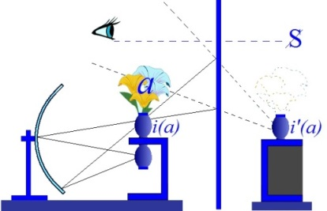

# Leçon 11 | 23 Février 1966

<!-- source-url: http://staferla.free.fr/S13/S13 L'OBJET.docx -->
<!-- seminar: s13 -->
<!-- lesson: 11 -->

<!-- id: s13-11-0001 -->

<u>PERRIER–ROUBLEF</u> [STEIN](#Stein2) [MELMAN](#Melman2) [OURY](#OURY2302) [MICHAUD](#melleMichaud)

<!-- id: s13-11-0002 -->

<u>Irène PERRIER-ROUBLEF</u>

<!-- id: s13-11-0003 -->

LACAN nous a demandé d’assurer aujourd’hui son séminaire. Nous allons reprendre la discussion sur les trois articles de STEIN que vous connaissez. Mais auparavant, je voudrais introduire un débat centré sur les notions de *transfert* et de *névrose de transfert* pour tenter de restituer ces éléments dans le cadre de la conférence de STEIN sur le *transfert* et *le contre-transfert*. Cet exposé venant *après* celui de STEIN serait *en meilleure place* *avant*, tout au moins en sa première partie.

<!-- id: s13-11-0004 -->

Cette première partie comporte en effet un survol de la notion de transfert chez FREUD et d’autres psychanalystes alors que STEIN approfondit cette notion dans la cure elle-même. Comme soutien, de la cure et en même temps comme obstacle, STEIN introduit le masochisme qui s’étale sur le divan et dont il s’agit de reconnaître l’économie… du masochiste, pas du divan …et le *narcissisme* qui s’épanouit à la faveur de la régression topique dans la situation psychanalytique.

<!-- id: s13-11-0005 -->

la deuxième partie de nos exposés introduit ce que LACAN nous enseigne concernant *l’objet(a)* qui nous permettra de dépasser l’obstacle du *complexe de castration* auquel FREUD s’est heurté dans *ses psychanalyses interminables, ou mieux, infinies*.

<!-- id: s13-11-0006 -->

Dans ce débat sur les notions de transfert et de névrose de transfert, la question qui se pose est celle-ci : Peut-on prononcer indifféremment ces deux termes ?

<!-- id: s13-11-0007 -->

Pour aborder ce thème, il m’a paru judicieux de citer un article de LACAN pris dans *La direction de la cure et le principe de son pouvoir* [^117]. LACAN y disait en substance à propos du transfert : « *Est-ce le même effet qui attache le patient à l’analyste, qui plus tard le fera s’installer dans la trame de satisfaction qu’on qualifie de névrose de transfert où il faut bien voir une impasse de l’analyse, entendons que l’analyse s’avère impuissante à résoudre, aboutissant à un point mort ?*

<!-- id: s13-11-0008 -->

*Est-ce le même effet encore qui donne à l’analyse au second stade, la dynamique qui lui est propre et que symbolise la scansion triadique : frustration, agression, régression où l’on motive son procès ?*

<!-- id: s13-11-0009 -->

*Est-ce le même effet enfin par quoi l’analyste vient, en son tout ou par partie, occuper les fantasmes du patient ?*

<!-- id: s13-11-0010 -->

*Voilà sur quoi l’on peut s’étonner - dit Lacan - que la lumière ne soit pas faite. La raison en a été donnée par Ida Macalpine* [^118]*:* *c’est qu’à chaque étape de la mise en question du transfert, l’urgence du débat sur les divergences techniques n’a jamais laissé place à une tentative systématique d’en concevoir la notion (de ce transfert) autrement que par ses effets.* »

<!-- id: s13-11-0011 -->

Force nous est donc de faire état des pratiques où le transfert est évoqué dans les travaux actuels.

<!-- id: s13-11-0012 -->

Dans *la technique* que LACAN qualifie de *corrective*, le transfert est apprécié pour autant qu’il permet de saisir, dans une conduite actuelle du patient, ce qu’on conçoit comme un *pattern* \[*modèle*\] inactuel, occasion de refléter l’introduction dans la réalité d’une *exigence* qui la déforme et qui ne saurait, comme telle, y recevoir de réponse[^119].

<!-- id: s13-11-0013 -->

Cette tendance est orientée par la créance faite à la notion du moi inconscient autrement dit à un facteur de synthèse organisant les défenses du sujet contre ses propres tendances par une série de mécanismes dont Anna FREUD a dressé l’inventaire. LACAN pense que cette théorie est insuffisante pour n’avoir pu spécifier, dans la genèse, l’ordre d’apparition et la hiérarchie de ces mécanismes et leur coordination aux étapes du développement instinctuel.

<!-- id: s13-11-0014 -->

Car il ne sert à rien, d’ordonner le traitement de la surface à la profondeur si la notion de leurs rapports est obscurcie.

<!-- id: s13-11-0015 -->

Le transfert n’est pas seulement lié à la dynamique de l’écart entre la réalité et *les symptômes* comme tels.

<!-- id: s13-11-0016 -->

Il joue dans le traitement un rôle positif et c’est même en quoi ABRAHAM en vient à formuler que *la capacité de transfert étant la capacité d’aimer, elle permettait de mesurer la capacité d’adéquation au réel, du malade* [^120]. C’est bien cette vue d’ABRAHAM qui fait le fond de la conception que LACAN qualifie de *saturative* du traitement en soulignant la confusion qui s’est accumulée auteur de la notion de transfert.

<!-- id: s13-11-0017 -->

En ce qui concerne *la névrose de transfert*, la confusion est encore plus grande et chez FREUD lui-même ce n’est pas très clair.

<!-- id: s13-11-0018 -->

À consulter certains travaux, il semble qu’on puisse dégager deux notions assez communément admises :

<!-- id: s13-11-0019 -->

- le transfert qui s’inscrit inévitablement dans la situation analytique, est un facteur d’efficience du traitement.

<!-- id: s13-11-0020 -->

- la névrose de transfert en revanche, implique le franchissement d’un seuil au-delà duquel le monde du malade se referme sur la personne de l’analyste. Une résistance massive s’installe alors qui sera diffi­cile à entamer.

<!-- id: s13-11-0021 -->

Entre *le transfert* et *la névrose de transfert*, il y a ainsi - et ce sont les termes de NACHT[^121] - franchissement d’un seuil.

<!-- id: s13-11-0022 -->

Au-delà de ce seuil, il y a prolifération, organisation, utilisation à titre défensif par le névrosé de la relation psychanalytique, laquelle n’étant plus un moyen, devient un but en soi. S’agit-il là d’un processus inhérent à la structure créée par la méthodologie freudienne ? Il ne le semble pas et nous en savons assez pour pouvoir affirmer d’emblée que, lorsqu’une *névrose de transfert* s’installe ainsi, l’analyste y est pour *quelque chose*. Autrement dit :

<!-- id: s13-11-0023 -->

- cette *névrose de transfert*, pourquoi survient-elle ?

<!-- id: s13-11-0024 -->

- Quelle en sont la cause, le sens et la fonction ?

<!-- id: s13-11-0025 -->

- Finalement, comment l’éviter ?

<!-- id: s13-11-0026 -->

Revenons-en d’abord aux textes classiques sur le transfert. Parmi les auteurs qui se sont préoccupés de ce problème, FREUD d’abord et beaucoup d’autres ensuite, jugent que le transfert et la névrose de transfert ne font que reproduire, en les transposant, la névrose infantile et les relations que l’enfant a eues avec son entourage. C’est le transfert d’émois et d’affects de FREUD. Dans son article [*Remémoration, répétition et élaboration*](http://www.lutecium.fr/Jacques_Lacan/transcriptions/errinern.pdf) FREUD[^122] écrit: « *Le malade répète tout ce qui, émané des sources du refoulé, imprègne déjà toute sa personnalité : ses inhibitions, ses attitudes inadéquates, ses traits de caractère pathologiques. Il répète également pendant le traitement tous ses symptômes et, en mettant en évidence cette compulsion à répéter, nous n’avons découvert aucun fait nouveau mais acquis seulement une conception plus cohérente de l’état des choses. Nous constatons clairement que l’état morbide de l’analysé ne saurait cesser dès le début du traitement et que nous devons traiter sa maladie non comme un événement du passé mais comme une forme actuellement agissante. C’est fragment par fragment que cet état morbide est apporté dans le champ d’action du traitement et, tandis que le malade le ressent comme quelque chose de réel ou d’actuel, notre tâche à nous consiste à rapporter ce que nous voyons au passé* ».

<!-- id: s13-11-0027 -->

Plus tard dans les conférences données en 1916 : [*Introduction à la psychanalyse*](http://classiques.uqac.ca/classiques/freud_sigmund/intro_a_la_psychanalyse/intro_psychanalyse_2.pdf), FREUD[^123] insiste sur le fait qu’il serait déraisonnable de penser que la névrose du malade en traitement a cessé d’être un processus actif : elle a seulement *modifié son point d’impact*. C’est dans la relation transférentielle qu’elle porte tout son poids, c’est pourquoi nous voyons souvent le malade abandonner les symptômes de sa névrose.

<!-- id: s13-11-0028 -->

Celle-ci s’exprime désormais sous une autre forme, grâce au transfert, qui représente donc une réédition camouflée de son ancienne névrose. L’avantage est que celle-ci pourra beaucoup mieux être saisie sur le vif et élucidée, puisque le thérapeute en représente cette fois le centre. On peut dire qu’on a alors, non plus affaire à la maladie antérieure du patient mais à une névrose nouvellement formée qui remplace la première. FREUD ajoute :

<!-- id: s13-11-0029 -->

> « *Surmonter cette nouvelle névrose artificielle c’est supprimer la maladie engendrée par le traitement. Ces deux résultats vont de pair, et quand ils sont obtenus, notre tâche thérapeutique est terminée* » \[p.422\]

<!-- id: s13-11-0030 -->

Il exprime ainsi clairement que la fin de la cure et sa réussite dépendent de la possibilité de résoudre la névrose de transfert. Nous savons que c’est sur cela qu’il a buté dans *Analyses finies et infinies* [^124]. Dans la *névrose de transfert*, l’analyste en est-il le centre ? Autrement dit, comme LACAN se pose la question, possède-t-il cet objet qui focalise le transfert de l’autre et au-delà de son avoir, qu’est-il lui-même ?

<!-- id: s13-11-0031 -->

C’est très tôt dans l’histoire de l’analyse que la question de l’être de l’analyste apparaît.

<!-- id: s13-11-0032 -->

Que ce soit par celui qui a été le plus tourmenté par le problème de l’action psychanalytique n’est pas pour nous surprendre.

<!-- id: s13-11-0033 -->

On peut dire en effet que l’article de FERENCZI[^125] *Introjection et transfert* datant de 1909, est ici inaugural et qu’il anticipe de loin, sur tous les thèmes ultérieurement développés. Le transfert groupe - pour FERENCZI - les phénomènes concernant l’introjection de la personne du médecin dans l’économie subjective.

<!-- id: s13-11-0034 -->

Il ne s’agit plus ici de cette personne comme support d’une compulsion répétitive, d’une conduite inadaptée ou comme figure d’un fantasme. Il s’agit de son absorption dans l’économie du sujet, par tout ce qu’il représente lui-même de problématique incarnée. La question est de savoir comment lui-même s’incarne dans la problématique projetée sur lui.

<!-- id: s13-11-0035 -->

Si l’on en revient à FREUD[^126] *[Au-delà du principe du Plaisir](http://classiques.uqac.ca/classiques/freud_sigmund/essais_de_psychanalyse/Essai_1_au_dela/Au_dela_principe_plaisir.pdf) ch. III*, et à la différence qu’il fait entre répéter et se souvenir, on se rappellera que le psychanalyste doit s’efforcer de limiter le champ de *la névrose de transfert* en forçant le plus possible dans le souvenir, et le moins possible dans la répétition.

<!-- id: s13-11-0036 -->

Ce qui est souhaitable, nous dit FREUD, c’est que le malade conserve une certaine marge de supériorité, grâce à laquelle la réalité de ce qu’il reproduit sera reconnue comme un reflet, comme l’apparition dans le miroir, d’un passé oublié.

<!-- id: s13-11-0037 -->

Lorsqu’on réussit dans cette tâche, on finit par obtenir la conviction du malade et les conséquences thérapeutiques qui s’ensuivent. Tout cela définit le transfert et son maniement et non la névrose de transfert en tant que c’est ce qui est à éviter aux dires mêmes de FREUD. Lui-même ne l’évita pas s’il est vrai que dans *Analyses finies et infinies*, il se croit possesseur de ce quelque chose que vise l’analyse dans son désir.

<!-- id: s13-11-0038 -->

Pour aller plus loin, il faut évoquer ce que LACAN enseigne concernant *l’objet(a)*.

<!-- id: s13-11-0039 -->

Car dans la dialectique de l’ἐραστής \[erastès : l’amant\] et de l’ἐρώμενος \[erômenos : l’aimé\] :

<!-- id: s13-11-0040 -->

- ou bien cet objet se situe dans une *problématique incarnée* et c’est là le contre-transfert,

<!-- id: s13-11-0041 -->

- ou bien, il se situe *entre* l’analysé et l’analyste.

<!-- id: s13-11-0042 -->

C’est *la compréhension de ce cap* qui peut aider, plutôt que de se poser la question à la fin d’une séance : qu’est–ce que ça veut dire dans le transfert, qu’est–ce que le patient veut me dire à *moi, l’analyste* ? Car si l’analyste est un *moi* cela suffit à déterminer cette sorte de *relation duelle* qui ne peut être qu’une relation située dans le registre de l’identification à l’analyste ou à son désir.

<!-- id: s13-11-0043 -->

La névrose de transfert dans ce qu’elle a d’encombrant, dans son poids, plus on analyse le transfert, plus elle s’établit, et cela faute de savoir comment formuler autrement le transfert. Comment en effet, peut-on le formuler autrement ?

<!-- id: s13-11-0044 -->

L’élément de répétition va de soi. Mais cet élément historique ne suffit pas. Il y intervient *un élément structural*.

<!-- id: s13-11-0045 -->

Certains éléments dans la structure, viennent jouer un rôle de pivot. Si on ne conçoit pas le mode de compréhension de différents points du transfert, si on ne fait pas entrer en jeu les points pivots dans la façon dont il convient d’aborder l’analyse dans la relation entre l’analysé et l’analyste, on aura beau analyser le transfert, en ne fera que stabiliser ce certain type de relation structurale.

<!-- id: s13-11-0046 -->

Une image aliénante est clé dans la névrose. On constituera une néo-névrose : la névrose de transfert. Il faut tenir compte, non seulement de la structure de la névrose, mais du fait qu’elle est intéressée dans la relation complète qui se produit dans la relation psychanalytique. Dans [*Au-delà du principe du plaisir*](http://classiques.uqac.ca/classiques/freud_sigmund/essais_de_psychanalyse/Essai_1_au_dela/Au_dela_principe_plaisir.pdf), *chapitre VII*, l’image idéale de la relation de transfert qui se veut la plus réduite possible, est une image dépassée. Elle va vers la structure. La cause de la névrose de transfert, c’est le mode sur lequel on analyse le transfert. Il faudrait articuler une formule précise du rapport à *l’image spéculaire* *i(a)* *dans l’algèbre lacanienne*, une correcte analyse du transfert, n’est pas de se demander à tout instant, qu’est-ce que le patient a voulu me dire ?

<!-- id: s13-11-0047 -->

Il faut analyser ce que le patient appréhende du désir de l’autre à propos de *l’objet(a)*, repérer le degré d’émergence de *l’objet(a)* à chaque séance, autour de quoi peut se faire l’analyse du transfert, prendre le moi de l’analyste comme mesure de la réalité suffit pour qu’une névrose ne puisse se loger que là. Tout dépend donc de la façon dont l’analyste pense la situation.

<!-- id: s13-11-0048 -->

Rappelons les grandes lignes de la théorie lacanienne pour situer cet *objet(a)* du névrosé. D’une part tout l’investissement narcissique ne passe pas par l’image spéculaire. Il y a un reste : le phallus (–ϕ). Dans l’image réelle du corps libidinalisé, le phallus apparaît :

<!-- id: s13-11-0049 -->

- en moins,

<!-- id: s13-11-0050 -->

- en blanc,

<!-- id: s13-11-0051 -->

- il n’est pas représenté,

<!-- id: s13-11-0052 -->

- il est même coupé de l’image spéculaire.

<!-- id: s13-11-0053 -->

D’autre part le sujet barré par rapport à l’Autre, dépendant de l’Autre, est marqué du signifiant dans le champ de l’autre, mais il y a un reste, un résidu qui échappe aux statuts de l’image spéculaire. Cet objet, n’importe lequel, c’est *(a)*, l’objet de l’angoisse. L’angoisse se constitue quand un mécanisme fait apparaître quelque chose à la place naturelle de (–ϕ), celle qu’occupe *l’objet(a)*.

<!-- id: s13-11-0054 -->

Il n’y a pas d’image du manque : si quelque chose apparaît là, *le manque vient à manquer*. S’il ne manque pas, l’angoisse apparaît.

<!-- id: s13-11-0055 -->

Ce qui peut donc venir se signaler à cette place(–ϕ) c’est l’angoisse et *c’est l’angoisse de castration* dans son rapport à l’Autre.

<!-- id: s13-11-0056 -->

Le dernier terme où FREUD est arrivé c’est l’angoisse de castration.

<!-- id: s13-11-0057 -->

Pour LACAN, ce n’est pas elle qui constitue l’impasse dernière du névrosé : c’est *la forme de la castration*. C’est de faire de *sa castration* ce qui manque à l’Autre, c’est d’en faire la garantie de cette fonction de l’Autre, cet Autre qui ce dérobe dans le renvoi indéfini des significations. Le sujet ne peut s’accrocher à cet univers des significations que par la jouissance.

<!-- id: s13-11-0058 -->

Celle-ci, il ne peut l’assurer qu’au moyen d’un signifiant qui manque forcément. C’est l’appoint à cette place manquante que le sujet est appelé à faire par signe que nous appelons la castration.

<!-- id: s13-11-0059 -->

Vouer sa castration à cette garantie de l’Autre, c’est devant quoi le névrosé s’arrête. C’est elle qui l’amène à l’analyse.

<!-- id: s13-11-0060 -->

Et c’est *l’angoisse* qui va nous permettre de l’étudier. Le névrosé, pour se défendre contre l’angoisse, pour la recouvrir, se sert de son *fantasme*, qu’il organise. C’est *l’objet(a)* qui fonctionne dans son *fantasme* : mais c’est un *(a)* postiche et c’est dans cette mesure qu’il se défend contre l’angoisse. C’est aussi l’appât avec lequel il tient l’Autre, on peut citer l’exemple de BREUER qui s’est laissé prendre à cet appât en analysant Anna 0.

<!-- id: s13-11-0061 -->

FREUD, lui, ne s’est pas laissé prendre. Il s’est servi de *sa propre angoisse* devant son désir, pour reconnaître que ce qu’il s’agissait de faire c’était de comprendre à quoi tout cela servait et d’admettre qu’Anna 0. le visait, lui. C’est bien à ceci que l’on doit d’être entré par le fantasme dans l’analyse et dans son usage rationnel du transfert. Et c’est ce qui va nous permettre de voir que ce qui fonctionne chez le névrosé, à ce niveau *(a)* de l’objet, c’est quelque chose qui fait qu’il a pu faire le transfert du *(a)* dans l’Autre, ce qu’il faut lui apprendre à donner, au névrosé, c’est *rien*, et c’est justement son angoisse.

<!-- id: s13-11-0062 -->

Je vais maintenant essayer de rappeler certaines parties de l’article de STEIN sur *Transfert et contre-transfert*, en m’excusant d’avance de n’avoir pas eu le temps de prendre connaissance de ses deux autres articles ainsi que des réponses qu’il a faites à MELMAN et à CONTÉ. Lorsque STEIN introduit, dans l’attente de l’intervention de l’analyste, la coupure entre le patient et l’analyste, entre le monde intérieur et le monde extérieur, coupure par où s’introduit un pouvoir hétérogène, il semble qu’il y ait alors en présence deux êtres : le sujet et l’objet, l’analyste et la patient.

<!-- id: s13-11-0063 -->

Cette attente est ressentie comme déplaisir. L’analyste semble frustrer le patient du plaisir qu’il éprouve dans sa tendance à *l’expansion narcissique*. Et c’est la frustration que le patient éprouve dans cette coupure, c’est ce phénomène qui est le transfert. (*Ceci d’après l’article de* STEIN). la patient dote l’analyste, d’un pouvoir qui n’est pas le sien. Il semble à première vue, comme l’a dit CONTÉ, que cette dialectique de la frustration ramène la situation analytique à une relation duelle entre sujet et objet.

<!-- id: s13-11-0064 -->

Pour ma part, c’est peut-être aussi d’ailleurs impliqué dans le texte de STEIN, bien qu’il ne l’ait pas explicité, je pense que le transfert est soutenu par la règle analytique et non par la relation à la personne de l’analyste qui justement, par son action, est dépossédé de sa personne. À l’arrière-plan de cette dialectique, se profile le troisième joueur, le grand Autre lacanien. L’analyste se trouve pris dans un dédoublement constitutif de la situation. Et ce dédoublement n’a rien à voir avec une relation duelle. Il y a là une contradiction qui crée l’ambiguïté. Si on l’oublie, c’est que ce joueur, ce troisième joueur, est bien l’analyste pour l’autre, et que pour l’analyste, c’est l’autre qui lui dicte ses coups. Il semble qu’on retrouve ici la visée sadique dont parle STEIN : « *Que l’analyste peut se laisser tromper dans le transfert et prendre la place à laquelle le patient* *le situe, c’est-à-dire comme origine du pouvoir de la frustration.* »

<!-- id: s13-11-0065 -->

C’est sur cette frustration que porte sa deuxième remarque. À mon avis, la frustration dans l’analyse n’a pas pour source le déplaisir causé par l’attente de l’intervention, attente qui introduirait *une coupure*.

<!-- id: s13-11-0066 -->

Au contraire, elle naîtrait sur un horizon de non réponse à toutes les demandes que le patient formule, y compris celle qu’il ne formule pas. C’est par l’intermédiaire de la demande que tout le passé s’entrouvre jusqu’au fin-fond de la 1ère enfance.

<!-- id: s13-11-0067 -->

Et c’est parce que je me tais que je frustre mon patient. C’est par cette voie seulement que la régression analytique est *possible*.

<!-- id: s13-11-0068 -->

L’abstinence de l’analyste qui se refuse à gratifier la demande, la sépare du champ du désir, et le transfert est un discours où le sujet tend à se réaliser au-delà de la demande et par rapport à elle.

<!-- id: s13-11-0069 -->

Pourtant il me semble que dans cet article de STEIN, tout laisse à penser que lorsqu’il dit frustration, c’est de castration qu’il s’agit et alors tout collerait très bien, comme nous allons le voir. STEIN situe la fin de l’analyse par l’accès au savoir sur la frustration. Pour FREUD, les frontières de l’analyse s’arrêtent au complexe de castration qui garde sa signification prévalente c’est-à-dire :

<!-- id: s13-11-0070 -->

> l\) que l’homme peut avoir *le phallus* sur le fond de ne *l’avoir pas*,
>
> 2\) que la femme n’a pas *le phallus* sur le fond de ce qu’elle l’a.

<!-- id: s13-11-0071 -->

Et si FREUD a marqué le caractère à l’infini de certaines analyses, c’est qu’il n’a pas vu que la solution du problème de la castration n’est pas autour du dilemme de « *l’avoir ou pas* » car ce n’est que lorsque le sujet s’aperçoit *qu’il ne l’est pas* qu’il peut normaliser cette position naturelle de *combien* *il ne l’a pas*.

<!-- id: s13-11-0072 -->

Pour revenir à l’article de STEIN, si le progrès du patient tend vers l’interminable, dans ce balancement entre le progrès apparent dans le monde et l’exigence du *statu quo* dans la position du masochisme, mettant le transfert sous le signe de l’incertitude, peut-être pourrait-on voir là une manifestation justement de *la névrose de transfert* aboutissant à un point mort.

<!-- id: s13-11-0073 -->

Cette incertitude inhérente à l’analyse est, comme l’a si bien dit STEIN, celle que FREUD voit dans la crainte de perdre, ou l’envie d’avoir un attribut sans prix. Nous retombons là dans les analyses infinies de FREUD *faute d’avoir différencié les plans de l’être et de l’avoir.* C’est bien d’ailleurs ce que dit STEIN sans l’expliciter : « *La crainte de perdre ou l’envie d’avoir se retourne dans le transfert en la position de l’être pour l’analyste : être son plaisir ou sa croix.* »

<!-- id: s13-11-0074 -->

[Conrad STEIN](#fev23)

<!-- id: s13-11-0075 -->

Je vais essayer d’être très bref au moins dans un premier temps. Je reviendrai sur certains points si ça parait nécessaire.

<!-- id: s13-11-0076 -->

Ça m’a évidemment beaucoup intéressé, beaucoup, beaucoup. Et je vous remercie beaucoup. Je prends les points dans l’ordre où je les ai notés très rapidement.

<!-- id: s13-11-0077 -->

En ce qui concerne la remarque de Mme MACALPINE qui dit *qu’il n’y a pas de conception de la notion de transfert en dehors de ses effets*, pour elle c’est une constatation de fait et non un jugement de ce qui devrait être. Elle a raison de dire cela.

<!-- id: s13-11-0078 -->

Mais elle ne sait pas pourquoi il en est ainsi. Et je crois que si on voulait savoir pourquoi il en est ainsi, il faudrait noter une chose qui me paraît très évidente, c’est la suivante : vous savez que FREUD a découvert le transfert en même temps que la résistance, dès le début de la mise en œuvre de sa technique, de sa cure cathartique. Le transfert y apparaissait comme un accident, une complication de l’analyse qu’il a vite reconnu inéluctable. Par la suite, FREUD a changé d’avis et aujourd’hui, on nous apprend dans tous les organismes d’enseignement du monde que la cure psychanalytique consiste en premier lieu à analyser le transfert. C’est possible. C’est non seulement possible, c’est même vrai.

<!-- id: s13-11-0079 -->

Je crois…

<!-- id: s13-11-0080 -->

> je ne peux pas développer la chose ici, c’est une idée qui, à mon sens, mériterait d’être fouillée …je crois que si les choses en sont encore aujourd’hui au point où elles en sont, c’est que malgré cette affirmation que l’analyse, c’est l’analyse du transfert, la pesée de cette conception initiale selon laquelle le transfert est une complication de la cure, cette pesée continue à s’exercer sur nous, c’est-à-dire que, dans une certaine mesure les psychanalystes - quoi qu’ils disent le contraire - continuent à considérer le transfert comme une complication, comme un accident de la cure.

<!-- id: s13-11-0081 -->

Maintenant, pour la question de la différence entre le transfert et la névrose de transfert, qui n’est pas très claire dans FREUD, je dois dire que je n’en suis pas partisan, en tout cas, pas dans la formulation que vous avez citée, qui, je crois est de NACHT, celle du seuil. Il est évident que si le transfert peut être le moteur de l’analyse, qu’il ne peut pas y apparaître comme un obstacle quasi irréductible : il n’y a pas là franchissement d’un seuil, dans le sens d’une question de quantité.

<!-- id: s13-11-0082 -->

Vous avez présenté ça, si j’ai bien compris… je n’avais pas cette citation présente à l’esprit …comme s’il s’agissait d’une question de *quantité de transfert* : il est évident que ce n’est pas une question *quantitative* mais une question de structure du transfert. Mais je ne crois pas qu’on puisse distinguer *le transfert* et *la névrose de transfert* qui sont une seule et même chose. Ce qu’on peut distinguer, ce sont des modalités, des modalités du transfert, des modalités dans sa structure pour employer le terme que vous avez emprunté à LACAN, dans votre deuxième partie.

<!-- id: s13-11-0083 -->

Quand vous avez dit qu’il fallait concevoir le transfert dans *sa dimension historique* et aussi dans *sa dimension structurelle* ce n’est pas un terme de FREUD. C’est bien de LACAN. Et moi, je suis tout à fait d’accord avec cette distinction. Je vais même peut-être plus loin que LACAN et c’est votre évocation de l’article de FERENCZI qui me l’a fait penser : je crois moi que toute la technique de la retrouvaille du passé, de la reconstruction du passé à travers les réminiscences…

<!-- id: s13-11-0084 -->

> car la réminiscence est quelque chose d’actuel et pas quelque chose de passé …que toute cette technique de retrouvaille est un moyen de l’analyse et rien d’autre, et qu’il est *l’un des moyens* qu’il est bon d’employer dans certaines conjonctures, qu’il n’est pas bon d’employer dans d’autres conjonctures.

<!-- id: s13-11-0085 -->

Ce que le patient appréhende du désir de l’autre à propos de *l’objet(a)* et la question de la castration comme garantie de la fonction de l’Autre : je crois que ce sont ceux-là les thèmes lacaniens qui m’ont inspirés pour ce deuxième article.

<!-- id: s13-11-0086 -->

S’il y en a, ce sont ceux-là, sans aucun doute, quoique je n’emploie pas l’*algèbre* de LACAN parce que, pour une raison ou pour une autre, je ne suis pas sensible à l’avantage de ce type de formulation. J’ai peut–être tort. Mais enfin, c’est bien là que se trouve ma source d’inspiration Lacanienne. Il est important de le noter. Bien sûr, on ne peut pas développer la question maintenant.

<!-- id: s13-11-0087 -->

Alors, dans les remarques que vous faites concernant mon article, la coupure où s’introduit un pouvoir hétérogène, cette coupure qui sépare, je ne dis pas deux êtres en présence, mais je dis deux personnes, pour une raison très précise que vous ne pouvez pas connaître. C’est parce que j’ai donné par ailleurs une définition très précise de la notion de personne.

<!-- id: s13-11-0088 -->

Là, je ne veux pas non plus me lancer là-dedans. Il est évident que je suis obligé de récuser votre remarque concernant…

<!-- id: s13-11-0089 -->

> comme je l’ai déjà fait à propos de la remarque similaire de CONTÉ …concernant la notion d’une relation duelle entre sujet et objet.

<!-- id: s13-11-0090 -->

*Les raisons en sont multiples*, mais d’abord je vous fais remarquer que même dans la description que je donne dans ce texte, qui est loin de constituer l’œuvre achevée puisque ceux d’entre vous qui ont assisté au séminaire de Piera AULAGNIER ont entendu un chapitre supplémentaire que j’ai intitulé *Le jugement du psychanalyste* et que celui-là n’est pas encore le dernier mais même dans ce texte, vous remarquerez une chose, c’est que s’il y a des personnes en présence, il y en a au moins trois puisqu’il y a : celle du patient, et du psychanalyste dans la coupure, et il y a celle, mythique, qu’on pourrait décrire comme le « *tout est en un et un est en tout* », c’est-à-dire cette personne où le psychanalyste et le patient ne sont présents ni l’un ni l’autre en tant que sujet, dans la mesure où la régression topique, au cours de la situation analytique s’accomplit d’une manière dont on peut dire - c’est ce que j’ai développé à propos des argumentations de CONTÉ et de MELMAN - que « *ça parle* », le patient parle, le psychanalyste parle.

<!-- id: s13-11-0091 -->

Ils sont deux et dans l’autre conjoncture qui n’est jamais parfaitement accomplie, de même que la conjoncture de la séparation n’est jamais parfaitement accomplie, non plus, « *ça parle* ». Donc vous avez déjà au moins trois personnes.

<!-- id: s13-11-0092 -->

Je ne veux pas dire qu’on ne peut décrire que ces trois personnes-là. À un autre stade du développement, trois personnes apparaissent dans une formulation différente mais il est bien certain qu’il ne peut pas y en avoir deux et je crois même que dans la conversation ou dans l’échange de paroles le plus banal, on ne peut pas considérer qu’il y a, comme le veut *une théorie* très en vogue aujourd’hui, qu’il y a *échange d’information*, une sorte d’insufflation, d’information entre deux interlocuteurs.

<!-- id: s13-11-0093 -->

Une telle chose n’existe pas. L’information dont s’occupe *la théorie de l’information* - si elle est vraie - ce sont des ondes sonores et c’est une question de physique et de physiologie cérébrale, ça passe par l’oreille et ça va dans le lobe temporal.

<!-- id: s13-11-0094 -->

Ça n’est pas ça qui nous occupe. Pour que ces phénomènes physiques soient signifiants, il faut bien autre chose que cette *théorie de la communication d’une information entre deux personnes* et il faut bien qu’il y ait quelque part la référence à une troisième. Ça non plus je ne peux pas le développer. Donc, il n’est pas question de relation duelle.

<!-- id: s13-11-0095 -->

Que *le transfert* est soutenu par *la relation analytique* : J’ai noté ça. Je ne sais pas si c’est vous qui le dites ou vous me citez ?

<!-- id: s13-11-0096 -->

Irène ROUBLEF - Je vous cite.

<!-- id: s13-11-0097 -->

STEIN

<!-- id: s13-11-0098 -->

Bon. Nous sommes tout à fait d’accord en tout cas. Mais je crois - là aussi, je ne peux pas développer la chose - qu’il faudrait donner sa pleine dimension à ce terme soutenu - je croyais que vous le disiez dans votre objection, je n’ai pas mon texte parfaitement en mémoire.

<!-- id: s13-11-0099 -->

Non, je crois que c’est votre objection. Mais il faut voir que le transfert est soutenu par la relation analytique ou quelque chose comme ça. Enfin, peu importe puisque nous sommes d’accord.

<!-- id: s13-11-0100 -->

Soutenu... il faut donner le plein sens à ce terme car je suis de plus en plus persuadé, je ne peux pas vous le développer, je ne pourrais même pas très bien parce que c’est une idée récente, mais je ne crois pas qu’on puisse considérer que *la situation analytique* crée le transfert. Je crois que *la situation analytique* est une révélatrice du transfert.

<!-- id: s13-11-0101 -->

– X dans la salle : Mme PERRIER a dit : *la règle* … STEIN

<!-- id: s13-11-0102 -->

J’ai marqué *relation*. Bon, vous avez raison. Et moi j’ai marqué autre chose probablement parce que j’avais envie d’en parler.

<!-- id: s13-11-0103 -->

Je continue quand même son argument pour en revenir très vite à *la règle*. Donc je pense qu’elle ne crée pas le transfert, je pense qu’elle le révèle et qu’elle nous permet d’en prendre connaissance.

<!-- id: s13-11-0104 -->

Mais je crois que le transfert est justement ce facteur anthropologique universel d’où manque toute *théorie de la communication* conçue comme un *échange d’informations*. Là non plus, je ne peux pas développer ça.Quant à la question, du transfert soutenu par la règle analytique, c’est-à-dire la mise en valeur de l’importance de la règle analytique, je ne veux pas intervenir là-dessus maintenant mais précisément le premier paragraphe du chapitre que j’ai exposé au séminaire de Piera AULAGNIER et de CLAVREUL y est consacré. Alors, ce serait un peu long.

<!-- id: s13-11-0105 -->

Ce que j’ai montré là : j’ai d’abord rappelé une chose qui est d’expérience, je crois, assez courante, c’est qu’il est *parfaitement inutile* de formuler ce que nous avons l’habitude de formuler comme étant la règle fondamentale, c’est-à-dire qu’il n’est pas du tout nécessaire de dire au patient qu’il faut qu’il dise tout ce qui lui viendra par la tête, etc. C’est parfaitement inutile mais ce que j’ai essayé de dégager c’est que, même si on ne la disait pas, la pesée de la règle restait la même.

<!-- id: s13-11-0106 -->

Il y avait au moins quelque chose qui était imposé d’une manière unilatérale, c’était par exemple, l’horaire des séances.

<!-- id: s13-11-0107 -->

C’est-à-dire que, malgré tout, même si *le psychanalyste* ne formule aucune règle et vous dit je vous recevrai trois ou quatre ou cinq fois par semaine, tel jour, à telle heure, venez, couchez–vous sur le divan et qu’il ne lui dit rien de plus, cela suffit pour exercer une pesée tout à fait analogue à celle de la règle formulée. J’ai aussi fait remarquer à ce propos que ce qui est quand même très important, c’est que, il y a au moins une intervention du psychanalyste à chaque séance, intervention qui peut être attendue, qui est celle qui marque la fin de la séance. On n’y échappe pas.

<!-- id: s13-11-0108 -->

Donc penser que le psychanalyste n’est pas intervenu parce qu’il n’a rien dit ce jour–là, ça n’est pas tout à fait juste. Il est évident que d’être intervenu pour dire quelque chose ou d’être intervenu pour avoir marqué la fin de la séance ce n’est pas pareil, mais c’est quand même une intervention. La preuve en est qu’il est des patients qui s’en vont d’eux même avant la fin de la séance parce qu’ils ne supportent pas que la fin de la séance soit indiquée par le psychanalyste. Je ne crois pas qu’il y ait beaucoup de patients qui le fassent de manière constante, à *toutes les séances*, mais dans la pratique de chaque analyste, ça arrive de temps à autre.

<!-- id: s13-11-0109 -->

la question de l’analyste trompé qui serait à l’origine du pouvoir, je crois que nous sommes tout à fait d’accord là-dessus.

<!-- id: s13-11-0110 -->

La frustration, me dites-vous, est au contraire sur un horizon de non réponse. Je veux bien. À la demande. Oui, bien sûr.

<!-- id: s13-11-0111 -->

Lorsque je parle de l’attente de l’intervention du psychanalyste, c’est que cet horizon, je suis tout à fait d’accord pour vous dire que la frustration est sur un horizon de non-réponse à la demande. Mais cet horizon de quoi est-il fait ?

<!-- id: s13-11-0112 -->

Si ce s’est de cette attente de l’intervention du psychanalyste. Je ne crois pas que ce soit là des arguments contradictoires mais je crois, quant à moi, qu’il est nécessaire, parce que c’est cela qui soutient le transfert dans une définition stricte, de mettre l’accent sur cet horizon de non–réponse, sur l’attente de l’intervention du psychanalyste, c’est-à-dire sur son intervention *imaginée* ou *supputée*. C’est ça qui fait d’ailleurs une bonne partie du discours du patient pendant la séance : « *Vous allez me dire que*… » et « *J’imagine que*… », toujours : *vous, vous, vous*.

<!-- id: s13-11-0113 -->

Avec certains patients, jamais. Quand ça n’a jamais lieu, vous savez à quel type de résistance nous avons affaire. Nous avons affaire au type de résistance que BLOUVET a appelé *la résistance au transfert*. Alors que la résistance qui est analysable est plutôt *la résistance* du transfert, c’est-à-dire *par le transfert*. Non, je ne pense pas du tout que ce soit contradictoire, mais je crois qu’il faut mettre l’accent sur ce qui vient meubler *cet horizon de non-réponse* qui est la supputation de l’intervention attendue.

<!-- id: s13-11-0114 -->

Et puis, ce qui se passe toujours, qui est important à considérer, c’est la *non conformité* de l’intervention, lorsqu’elle se produit enfin, avec ce qui était attendu.

<!-- id: s13-11-0115 -->

Dernier point : vous dites que là où je parle de frustration, il faudrait parler de castration. Là-dessus, je ne peux pas vous donner une réponse absolument ferme et définitive parce qu’il est possible que vous ayez raison et que, pour moi, ce problème n’est pas encore tout à fait tranché. Cependant, je crois qu’en un premier temps, il est nécessaire de mettre l’accent sur la notion de frustration, comme je le fais dans cet article-là, parce que la frustration, qu’est ce que c’est ?

<!-- id: s13-11-0116 -->

En français, la frustration c’est la suppression la privation de quelque chose à quoi on a droit, à la différence de la privation. Frustrer quelqu’un, c’est lui enlever quelque chose à quoi il a droit. Or, de quel droit s’agit–il si ce n’est du droit imaginaire de la toute puissance narcissique. Autrement dit, le droit dont il est question ici est loin d’être un droit au sens juridique, bien sûr il ne s’agit pas de frustration d’un droit au sens du code, il s’agit au contraire de frustration au sens de ce que le patient dans son narcissisme veut poser comme un droit, et qui est son désir.

<!-- id: s13-11-0117 -->

Donc, Je crois qu’il faut, à ce niveau-là parler de frustration. La frustration, comme le dit LACAN, est d’ordre imaginaire. Or, le droit narcissique, le droit du désir à être accompli, si on peut parler de droit puisque c’est le contraire du droit, au sens du code, est bien d’ordre imaginaire. D’ailleurs, c’est ça qui soutient le fantasme. Quant à la castration comme le dit LACAN, il faut considérer qu’elle reste d’ordre symbolique.

<!-- id: s13-11-0118 -->

Et alors, justement nous arrivons là, à propos de cette fin de l’analyse, qui est en un sens - comme je l’ai dit, ça ne résout pas la question - qui est en un sens savoir sur la frustration, mais savoir sur la frustration dans quoi ? Justement dans le fait d’assumer la castration au sens symbolique, c’est-à-dire dans le sens de la constitution de *l’idéal du moi*.

<!-- id: s13-11-0119 -->

Et lorsque FREUD dit que *l’idéal du moi* est l’héritier du narcissisme primaire, et bien, dans cet héritage, nous avons justement le passage du registre *imaginaire* de la frustration, car on n’assume pas une frustration, la frustration on s’en plaint, il n’est pas *concevable* qu’il en soit autrement, donc dans cet héritage nous avons le passage du registre *imaginaire* de la frustration, au registre *symbolique* de la castration avec constitution de *l’idéal du moi*, constitution de *l’idéal du moi* dont il faudra justement étudier la place par rapport à celle où le patient dans son sentiment de *frustration*, met l’analyste en tant qu’origine du pouvoir.

<!-- id: s13-11-0120 -->

*L’idéal du moi*… La fin de l’analyse n’est pas comme on l’a dit souvent dans une identification au psychanalyste.

<!-- id: s13-11-0121 -->

C’est une notion qui est absolument insoutenable mais en un sens on peut dire que la fin de l’analyse est dans l’identification à *l’idéal du moi*. *L’idéal du moi* dont on sait, dans la mesure où le savoir sur la frustration nous indique que cet *idéal du moi* est à une autre place que celle où est le psychanalyste.

<!-- id: s13-11-0122 -->

Écoutez, j’ai déjà parlé beaucoup plus longtemps que je ne le voulais.

<!-- id: s13-11-0123 -->

Irène ROUBLEF

<!-- id: s13-11-0124 -->

Je ne voudrais pas non plus prolonger le débat mais simplement vous répondre deux ou trois *petites choses*.

<!-- id: s13-11-0125 -->

D’abord sur Ida MACALPINE. Tout à fait d’accord sur la différence que vous faites entre *transfert* et *névrose de transfert* ou plutôt que vous ne faites pas, je crois en effet qu’il n’est pas du tout question d’une différence quantitative.

<!-- id: s13-11-0126 -->

C’est évidemment une différence de structure et que la névrose de transfert, si on avait bien compris ce que je voulais dire, c’était justement l’impasse à laquelle on arrive dans une analyse où on ne peut pas aller au–delà de ce à quoi on se heurte dans le complexe de castration quand on le place sur le plan de l’être, de l’être au lieu de l’avoir.

<!-- id: s13-11-0127 -->

Pour FERENCZI, tout à fait d’accord sur ce que vous avez dit. Je suis aussi d’accord quand vous dites que, sans parler *de signifiant, d’objet(a) de grand Autre,* etc. que vous n’aimez pas l’algèbre lacanienne, mais que vous vous en servez.

<!-- id: s13-11-0128 -->

Je suis tout à fait d’accord avec vous puisque je le dis moi-même dans une remarque que je vous fais lorsque je vous parle de relation duelle avec, il semble - ai-je dit - qu’il y aurait deux êtres en présence, donc le mot être, je veux bien l’enlever : le sujet et l’objet, l’analyste et l’analysé, c’est vous qui le dites. J’ai dit que, moi, il m’apparaît - sans que vous l’ayez explicité que ce ne soit pas ça - et qu’en effet à l’arrière-plan se profile le troisième joueur qui est le grand Autre. Je l’ai dit pour vous.

<!-- id: s13-11-0129 -->

Maintenant, je voudrais dire un mot sur ce qu’on appelle la relation duelle. Ça ne veut pas du tout dire qu’il y a un monsieur et un monsieur ou un monsieur et une madame qui sont là, face à face et puis c’est tout. Parce que, comme vous l’avez dit, il faudrait alors être dans *une île déserte*, ne pas parler, pour qu’il y ait une relation duelle.

<!-- id: s13-11-0130 -->

Il est bien entendu que ce qu’on appelle une relation duelle dans l’enseignement lacanien, ce n’est pas du tout qu’il n’y a pas d’autre terme, il y en a forcément un troisième, mais que ça se place dans la dialectique de l’enfant et de la mère.

<!-- id: s13-11-0131 -->

Ce qui ne veut pas dire que le père n’apparaît pas. Il apparaît forcément puisqu’il a conçu l’enfant.

<!-- id: s13-11-0132 -->

STEIN

<!-- id: s13-11-0133 -->

Je ne comprends pas très bien. Si ça se place dans une dialectique de l’enfant et de la mère où le père apparaît, quelle autre dialectique peut-on concevoir ?

<!-- id: s13-11-0134 -->

Irène ROUBLEF

<!-- id: s13-11-0135 -->

Le père n’y apparaît pas de la même façon que lorsqu’on aborde l’Œdipe. Je sais bien que pour vous l’Œdipe existe d’emblée. Mais ce ne sont pas les notions que nous avons de la chose, et pour nous l’Œdipe ça commence à partir d’un certain moment du développement, très tôt d’ailleurs, beaucoup plus tôt que pour les analystes classiques, mais enfin ce qu’on appelle la relation à trois, si vous voulez, qui ne soit pas relation duelle, c’est lorsque le *Nom du Père* apparaît dans la relation entre la mère et l’enfant. Le *Nom du Père*, je ne vous dis pas… que le père n’a pas donné son sperme.

<!-- id: s13-11-0136 -->

STEIN - À ce moment-là, c’est une relation à trois ?

<!-- id: s13-11-0137 -->

Irène ROUBLEF

<!-- id: s13-11-0138 -->

Oui, à partir du *Nom du Père* et à partir du moment où le désir de l’enfant est renvoyé vers le désir du père par l’intermédiaire de la mère. Enfin, Je crois qu’on pourra discuter très longtemps là–dessus.

<!-- id: s13-11-0139 -->

STEIN

<!-- id: s13-11-0140 -->

Là je pourrai quand même vous répondre publiquement ce que je vous ai dit au téléphone hier, c’est que je crois que ce que vous décrivez là, c’est bien le fait le plus originaire et le plus fondamental qui puisse exister, qu’on ne peut rien concevoir avant. Parce que, lorsque vous dites que dans une relation duelle, c’est une relation entre l’enfant et la mère où le père apparaît, comment apparaît-il ?

<!-- id: s13-11-0141 -->

Irène ROUBLEF

<!-- id: s13-11-0142 -->

Non je n’ai pas dit ça. J’ai dit bien sûr que le père a figuré puisqu’il a fait l’enfant avec la mère.

<!-- id: s13-11-0143 -->

Mais il n’apparaît pas dans la relation, dans cette première relation de la mère et de l’enfant, dans la relation du nourrisson.

<!-- id: s13-11-0144 -->

STEIN - Moi, Je ne crois pas à l’existence d’une telle chose.

<!-- id: s13-11-0145 -->

Irène ROUBLEF

<!-- id: s13-11-0146 -->

Il faudra qu’on reprenne ce débat, ce serait vraiment trop long. Maintenant, au sujet de la frustration : vous dites que l’attente de l’intervention de l’*analyste* et la non–réponse, c’est *la même chose*. Je crois que ce n’est quand même *pas tout à fait* *la même chose*.

<!-- id: s13-11-0147 -->

STEIN - Je dis que la non-réponse est la condition de cette attente.

<!-- id: s13-11-0148 -->

Irène ROUBLEF

<!-- id: s13-11-0149 -->

Ce n’est pas tout à fait ça que vous dites dans votre article lorsque vous parlez de ce que cette *attente de l’intervention* de l’analyste provoque l’introduction d’un pouvoir hétérogène qui provoque la coupure. Je ne crois pas… enfin, peut-être pourrait-on dire la même chose dans la non-réponse. Je crois que ce qui est important, c’est que la non-réponse porte sur la demande et qu’on a l’impression que, dans ce que vous décrivez dans votre texte, ça porte sur le désir.

<!-- id: s13-11-0150 -->

Et c’est pour ça que je dis que ce n’est pas de la frustration qu’il s’agit mais que c’est de la castration et que, au fond, vous dites la même chose que ce que nous disons seulement vous l’appelez autrement.

<!-- id: s13-11-0151 -->

D’ailleurs vous n’avez qu’à voir la fin de votre texte. Vous dites exactement, mot pour mot, ce que LACAN disait : que lorsque FREUD n’arrive pas à terminer une analyse c’est parce qu’il se croit possesseur d’un objet très précieux.

<!-- id: s13-11-0152 -->

Mais qu’est-ce que c’est que cet objet très précieux sinon le *phallus*.

<!-- id: s13-11-0153 -->

STEIN

<!-- id: s13-11-0154 -->

Oui, mais reprenons cela. Quand vous dites : non-réponse, l’horizon de non-réponse, vous vous mettez bien sûr, disons à la place du patient, pour le dire. Il n’y a pas de non-réponse en dehors de l’évocation d’une réponse.

<!-- id: s13-11-0155 -->

Irène ROUBLEF - Bien sûr.

<!-- id: s13-11-0156 -->

STEIN - Le patient dira : « Il ne me répond pas ».

<!-- id: s13-11-0157 -->

MELMAN - Qui « Il » ?

<!-- id: s13-11-0158 -->

STEIN

<!-- id: s13-11-0159 -->

Ça c’est une autre question. La non-réponse est un jugement négatif fait sur l’existence d’une réponse, donc il faut que cette réponse soit présente à l’esprit en tant que possibilité, donc je ne crois pas que ce soit tellement différent.

<!-- id: s13-11-0160 -->

Irène ROUBLEF

<!-- id: s13-11-0161 -->

Je crois qu’il faudra revoir tout cela puisque, on n’a peut-être pas beaucoup de temps. Justement, je voulais donner la parole à MELMAN et à CONTÉ.

<!-- id: s13-11-0162 -->

[Charles MELMAN](#fev23)

<!-- id: s13-11-0163 -->

Oui, sur cette question, sur cette phrase : « *La frustration, survient sur un horizon de non-réponse à la demande.* »

<!-- id: s13-11-0164 -->

Et sur cette discussion qu’a introduite Irène, de savoir si le terme de frustration est ici exact, est ici bien employé ou bien si ce serait le terme de castration qui serait à sa place. Il me semble que c’est précisément l’une des *questions* fondamentales qui se dégagent, qui se posent à la lecture de ton texte, et où je dois dire que pour ma part j’aurais tendance…

<!-- id: s13-11-0165 -->

> pas seulement peut-être pour des raisons de commodité de lecture ou de facilité …j’aurais tendance à regretter que finalement *l’algèbre lacanienne* ne soit pas ici, après tout, utilisée.

<!-- id: s13-11-0166 -->

Parce que, après tout, « *horizon de non réponse à la demande* », c’est en tout cas dans cette dimension que j’aurai tendance à voir ce qui est l’installation très précisément du transfert, c’est–à–dire que, « *horizon de non réponse à la demande* », la demande exercée en tant que formulée et en tant que justement se trouve là cet interlocuteur si singulier qui lui donne sa vraie dimension, à cette demande, c’est-à-dire celle d’être vraiment enfin entendue.

<!-- id: s13-11-0167 -->

Et entendue non pas par quelque réponse qui viendrait immédiatement soi-disant la gratifier mais en fait constituer ce fonds, disons-le, si traumatisant de méconnaissance qui fait partie de nos relations habituelles, conventionnelles, normales, mais enfin cette installation de la demande dans son *vrai registre*, c’est-à-dire celui de la non-réponse pour que précisément, cette dimension du désir sur lequel la demande vient s’installer puisse être entendue. Il me semble que seule, donc, la non-réponse, en tant que précisément, en tant que non-réponse en tant que gratifiante, il me semble qu’elle vient couvrir ici, justement la dimension du transfert.

<!-- id: s13-11-0168 -->

Bien sûr, je crois que dans la cure, le patient est amené bien sûr à nous prêter toutes les réponses, enfin, nous engager dans ce dialogue que tu évoquais si bien tout à l’heure, c’est-à-dire à nous prêter comme ça toutes les réponses que nous pourrions lui faire, tous les sentiments qu’il pourrait nous supposer. Ceci dit, je crois que, si nous nous livrions à… appelons ça un passage à l’acte, c’est-à-dire à lui dire, après tout, à lui répondre, à sa demande, n’est-ce pas, je crois que nous exercerions à ce moment-là un effet proprement traumatisant et de désarroi qui, enfin peut–être parfaitement perceptible, enfin - perçu ou noté - dans telle ou telle circonstance ou telle au telle observation.

<!-- id: s13-11-0169 -->

Ce qui fait que si, après tout, je dis bien après tout, si on se sert de l’algèbre lacanienne, et que l’on se pose la question de savoir où se situe l’absence de réponse, finalement, tout compte fait, toute séance faite où se situe l’absence fondamentale de réponse à la demande et, par là même le dégagement de cette dimension du désir, autrement dit je pense que si on fait intervenir ici le grand Autre, la *position respective* des divers partenaires dans la cure se trouve, à mon sens, beaucoup mieux précisée. Et cette *position respective* des partenaires dans la cure, tout à l’heure STEIN en évoquait trois ce qui semble en tout cas, certainement un minimum, je pense qu’elle se trouverait en tout cas également mieux précisée par cette petite notation, il me semble, très fine, très précise que tu fais à propos de l’analyste, de l’intervention implicite de l’analyste en début et en fin de séance. Autrement dit, que même si après tout, l’analyste se tait, du seul fait qu’il fixe l’heure de la séance et *du seul fait* qu’il est amené à un moment donné à dire : « restons-en là », la séance est terminée, il est amené implicitement à intervenir.

<!-- id: s13-11-0170 -->

Je crois que c’est en fait une question. Je dois dire que ça ne me paraît pas, après tout, si simple que ça, car je pense qu’il y a *une technique* de la cure, par exemple, où justement le problème se pose de savoir si l’analyste, en fixant l’heure de la séance et en marquant sa levée, intervient ou n’intervient pas.

<!-- id: s13-11-0171 -->

Je dois dire que, il me semble qu’il y a par exemple une technique de la cure, supposons comme ça la cure, la cure idéale, enfin, où les séances sont lundi, mercredi, vendredi, telle heure, durée strictement déterminée…

<!-- id: s13-11-0172 -->

> on sait combien l’inconscient des malades pige admirablement le temps, et combien les malades, même sans regarder leur montre, savent parfaitement le moment où, dans une séance dont le temps est, comme ça, strictement fixé, à quel moment va tomber la fin de la séance …eh bien je pense que, donc, dans cette technique-là, avec ces séances à heure fixe, jour fixe, je ne suis pas sûr qu’il y ait intervention de l’analyste.

<!-- id: s13-11-0173 -->

Je n’en suis pas sûr parce que je me demande si, justement, puisque j’introduisais la fonction du grand Autre pour essayer de situer, de partager la position des partenaires dans la cure, je me demande s’il n’y a pas en fait une déclaration implicite qui serait un petit peu différente, et qui serait plutôt, peut-être, la soumission de l’analyste, comme du patient, à une relation, un rapport au temps. En tant que bien entendu, il fait intervenir toujours une relation au grand Autre, soumission en quelque sorte, déclaration implicite ou intentionnelle d’identité entre l’analyste et le patient dans cette relation au temps, et où la dimension… enfin on ne va pas s’engager dans une discussion là-dessus.

<!-- id: s13-11-0174 -->

Mais enfin je voudrais quand même dire que, parmi les divers partenaires qui sont présents dans la séance, où la dimension disons d’un quatrième qui serait en l’occurrence ce mort, comme ça, qu’on évoque de temps en temps, se trouve à mon sens, certainement introduite de manière très précise.

<!-- id: s13-11-0175 -->

Bon, je n’ai peut-être pas répondu à ton souci, à tes questions mais enfin, en vous écoutant, voilà ce qui m’était venu.

<!-- id: s13-11-0176 -->

Irène ROUBLEF

<!-- id: s13-11-0177 -->

Je vous remercie de ces remarques et je vais peut-être demander à CONTÉ s’il veut parler.

<!-- id: s13-11-0178 -->

Claude CONTÉ - ...

<!-- id: s13-11-0179 -->

[Jean OURY](#fev23)

<!-- id: s13-11-0180 -->

C’est simplement quelques remarques terminologiques parce que, il me semble que c’est important d’employer l’algèbre, lacanienne ou pas, mais enfin tout au moins, sur les termes d’avoir quand même des acceptions communes.

<!-- id: s13-11-0181 -->

Par exemple, pour employer les termes frustration, castration, privation. J’ai l’impression qu’il y a eu un certain mélange et que ça n’a pas abouti à un éclaircissement, justement parce que, de ma place, en tant qu’auditeur, j’ai pas compris grand chose à la discussion qui s’est engagée au sujet de la frustration et de la privation. Surtout quand STEIN a dit que c’est au niveau de la castration qu’on peut parler d’*idéal du moi*. Il me semble bien me souvenir que dans *la terminologie lacanienne*, il faut bien s’en tenir ici à une terminologie, il peut se faire qu’on peut en parler dans les termes lacaniens, c’est que l’*idéal du moi*, se place davantage au niveau de la privation. Encore faut-il bien définir les termes. Le terme de frustration est engagé par FREUD… enfin FREUD n’emploie pas le terme de frustration, c’est le terme de *Versagung* qui est traduit souvent par LACAN sous le terme de dédit.

<!-- id: s13-11-0182 -->

Et en effet c’est dans la dimension, dans le registre, imaginaire que se place la frustration mais il précise bien que c’est… il emploie le terme de *dam*, de *dommage imaginaire* mais de quelque chose de *réel*. Par exemple, on veut un exemple clinique, disons de la frustration, c’est quand par exemple, on a à dire quelque chose, c’est peut–être un peu grossier, admettons qu’on soit dans la salle, qu’on a envie de dire quelque chose et que, pour des raisons de séance ou de temps, on ne peut pas le dire : il semble que ça, c’est du registre de la frustration en ce sens que le dit qu’on a dans la tête pour le dire, il est vraiment dédié et en même temps, il y a une espèce d’effet d’éclatement même du dire, éparpillement du dire qui est bien sûr, un *dommage imaginaire* mais qui peut aller loin, qui peut donner, créer toute une symptomatologie.

<!-- id: s13-11-0183 -->

Tandis que dans la castration, c’est un registre *symbolique* mais qui porte sur un *objet imaginaire*. C’est pourquoi tout à l’heure j’ai dit que… j’ai fait ces remarques, en disant que l’*idéal du moi*, ce n’est pas au niveau de la privation mais dans un des premiers schémas, disons, de la mise en place, avant l’Œdipe, justement dans ce passage justement où le père va intervenir dans cette sorte de coalescence de l’enfant avec la mère, cette première ébauche de l’identification, c’est au niveau de la privation que ça se fait. Il faudrait le développer avec beaucoup d’exemples. Mais je pense qu’on n’a pas la temps et je n’ai pas les moyens ici. Maintenant, dans le transfert il est évident que *le transfert* c’est quand même au niveau de *la demande* que ça - il faudrait reparler de *la demande* très en détail - c’est au niveau de *la demande* qu’apparaît, en fin de transfert, l’impact de l’idéal du moi. Enfin, ça c’est une première terminologie.

<!-- id: s13-11-0184 -->

Maintenant, une autre remarque. C’est au niveau de la relation duelle. J’ai l’impression que c’est toujours un terme très très malheureux à employer, le terme duel. Qu’en effet, comme le remarquait STEIN, il suffit d’une simple conversation… les bases mêmes de la linguistique le démontrent, que dans toute communication, il y a toujours un réfèrent ou un contexte, le tout sur la notion, reprise par LACAN, du grand Autre, ce que les linguistes appelaient aussi « *la communauté linguistique* », le « *lieu du code* », etc. Il est certain qu’il n’y a pas simplement deux protagonistes. Mais il est un fait qu’il y a quand même un moment, disons historique, dans l’évolution de la personnalité, où apparaît une triangulation.

<!-- id: s13-11-0185 -->

Et plutôt que de parler du passage un petit peu fantaisiste de deux à trois, ce qui ne veut pas dire grand chose peut-être, mais c’est là qu’intervient la fonction spéculaire, c’est au niveau du *stade du miroir*, l’importance dans le métabolisme justement, de la relation de l’assomption imaginaire par la fonction, du *stade du miroir*, c’est autour de ça que va se jouer ensuite la triangulation, mais il faut bien dire que déjà, le *stade du miroir* n’a de sens que s’il est pris lui–même dans un système *symbolique*. Il faut dire que ce qui précède l’*imaginaire*, c’est le *symbolique*. C’est grâce à ça que souvent LACAN schématise le *stade du miroir* en dessinant le miroir lui-même, en mettant que c’est le grand Autre, le miroir dans lequel se reflète le *moi*, dans cette méconnaissance.

<!-- id: s13-11-0186 -->

<!-- id: s13-11-0187 -->

Il semble là qu’en effet il y ait un passage d’un système, disons indéterminé, spéculaire, à un système de triangulation dans lequel intervient, d’une façon plus spécifique, disons, le *Nom du Père* ou la *Loi*, etc. On pourrait développer tout ça mais enfin c’est simplement pour marquer qu’il y a quand même peut-être une terminologie à définir d’une façon plus précise avant de pousser plus loin une discussion. Sans quoi j’ai l’impression qu’on… Irène ROUBLEF

<!-- id: s13-11-0188 -->

C’est très juste ce que vous dites que la relation duelle en effet, il faudrait y faire intervenir l’image spéculaire.

<!-- id: s13-11-0189 -->

Quant à ce que vous dites sur la frustration, il est bien évident que la frustration est *un dam imaginaire portant sur un objet réel*, vous avez oublié que l’agent en était la mère symbolique, mais ceci nous ramène toujours à ce qu’on ne peut pas appeler autrement que la relation duelle parce que, pour le moment on n’a pas d’autre *terme* pour l’appeler. Il est bien évident que c’est un terme tout à fait impropre. La relation duelle peut comporter un très grand nombre de personnes, de *petit (a)* ou de n’importe quelle lettre de l’alphabet.

<!-- id: s13-11-0190 -->

STEIN

<!-- id: s13-11-0191 -->

Je vais intercaler un mot, un mot pour dire que quand on parle de la castration…

<!-- id: s13-11-0192 -->

> telle que, je crois, l’entend LACAN, qui est en cela freudien, il n’y a pas du tout d’écart, il n’y a aucune opposition de LACAN à FREUD en cette matière …quand on parle de la castration, il ne faut jamais oublier que pour nous, le concept de castration est un concept positif, c’est le concept de l’accession à un pouvoir véritable, et c’est là que se situe sa relation avec l’*idéal du moi*, c’est un concept positif figuré par l’image négative d’un manque. Tout ça qui se situe dans la marge entre la positivité de ce concept et la figuration qui est celle, négative, d’un manque, c’est quelque chose d’essentiel à la problématique de l’analyse.

<!-- id: s13-11-0193 -->

On a souvent tendance à confondre la castration avec ce que les patients de FREUD lui disaient lorsqu’il en parle dans *Analyse terminée et analyse interminable* : « *De toute façon, tout ce travail que nous avons fait depuis quelques années, c’est bien gentil mais moi je n’aurai pas de pénis.* »

<!-- id: s13-11-0194 -->

Si c’est une femme, ou : « *Moi je suis quand même toujours exposé aux risques de le perdre puisqu’il existe, puisque j’en ai un. Je peux le perdre.* »

<!-- id: s13-11-0195 -->

Si c’est un homme.

<!-- id: s13-11-0196 -->

Or justement, ça c’est le *complexe de castration*. Le *complexe de castration* et *la castration*, au sens où l’entend LACAN, ce n’est pas la même chose. Je crois que c’était quelque chose qu’il fallait dire. C’est justement là que le malade introduit ce leurre auquel FREUD s’est peut–être laissé prendre. Car en définitive, en plaçant les choses sur un plan beaucoup plus terre à terre de ce qu’on peut dire au patient, on est quand même amené à lui montrer…

<!-- id: s13-11-0197 -->

> et c’est là qu’intervient justement *la structure du transfert* dont vous parliez en citant LACAN, *opposée à son historicité* …on peut quand même être amené à lui montrer, par exemple, lorsque c’est une dame qui se plaint de n’avoir pas de pénis, de lui dire que de toute façon l’analyse ne lui en donne pas un, que ce dont elle se plaint - de ne pas avoir de pénis – que son envie du pénis n’est rien d’autre que ce avec quoi elle essaie de présenter au psychanalyste un leurre.

<!-- id: s13-11-0198 -->

Car ce n’est pas vrai qu’elle a envie d’un pénis. Ce n’est pas vrai dans l’absolu. C’est vrai dans la mesure où cette envie lui permet de maintenir le psychanalyste dans la position que j’ai désignée comme étant celle du contre-transfert.

<!-- id: s13-11-0199 -->

Il faudrait dire ça d’une manière plus précise.

<!-- id: s13-11-0200 -->

Irène ROUBLEF

<!-- id: s13-11-0201 -->

C’est exactement celle à laquelle BREUER s’est laissé prendre avec Anna 0. LACAN dit la même chose. Et d’ailleurs l’*idéal du moi* est en relation avec la castration puisqu’il apparaît chez FREUD dans le déclin du complexe d’Œdipe.

<!-- id: s13-11-0202 -->

STEIN

<!-- id: s13-11-0203 -->

Ce n’est pas contradictoire avec ce que j’ai dit sur la privation… Il faut voir justement les origines de l’*idéal du moi*…

<!-- id: s13-11-0204 -->

[Ginette MICHAUD](#fev23)

<!-- id: s13-11-0205 -->

Il faut voir justement les origines de l’*idéal du moi*. C’est très très marginal à la discussion mais c’est à propos d’une remarque qu’a faite STEIN tout à l’heure sur ce qu’il croit être du transfert comme non révélé par l’analyse, enfin… comme révélé par l’analyse et comme préexistant.

<!-- id: s13-11-0206 -->

Je pense qu’on ne peut qu’aller dans ce sens là. Le premier est FREUD qui l’a bien défini comme ça, comme quelque chose qui est révélé par la situation psychanalytique et qui préexiste, qui n’est pas repris, qui n’est pas ré-articulé en dehors, mais qui préexiste à la situation psychanalytique.

<!-- id: s13-11-0207 -->

On peut dire également que, à partir du moment où il peut exister un support autre que *la situation analytique*, c’est pour ça que je trouve que, effectivement, le terme duel, n’est qu’un élément partiel, qu’une définition partielle de ce dont il s’agit …que donc à partir du moment où il peut exister , une situation, où le mécanisme du transfert puisse être repris et articulé, on peut peut-être le mettre à jour et s’en servir, de la même façon qu’on peut s’en servir en analyse.

<!-- id: s13-11-0208 -->

Par exemple, si on peut dire très sommairement, le transfert en analyse, enfin… l’analyste est celui sur qui… qui est le révélateur du transfert, sur qui porte le transfert, qui est en même temps, le destinataire donc du message et le lecteur du message, plus ou moins. Si par exemple, dans un organisme, dans une institution de soins où il existe ces mécanismes, où quelque part, une structure puisse être en position de polariser ce mécanisme ou une autre structure, ou là même, où une personne dans la position analytique, qui soit l’analyste ou qui soit le médecin, puisse se servir de ce phénomène.

<!-- id: s13-11-0209 -->

Je crois que, on peut à ce moment-là reprendre des mécanismes de transfert qui ne sont pas forcément superposables au transfert de *la situation psychanalytique*. C’est pour ça que le terme duel c’est un terme… enfin, on peut situer l’analyse comme situation duelle à partir du moment où elle est située en négatif par rapport à un grand Autre, définir, enfin un grand Autre, enfin on peut dire en terme d’*exclusion*. Justement en analyse, enfin, l’analyste n’a pas :

<!-- id: s13-11-0210 -->

- ni de rapports avec la famille,

<!-- id: s13-11-0211 -->

- ni de rapports avec les amis,

<!-- id: s13-11-0212 -->

- se situe en miroir, par rapport à ce qui va être projeté là.

<!-- id: s13-11-0213 -->

Dans une institution, dans un groupe thérapeutique, la situation est tout à fait différente. Il n’y a pas ce système d’exclusion et c’est justement la possibilité de polariser tout ce qui est ailleurs vécu comme système d’exclusion et qui doit être repris pour être thérapeutique, pour que justement, les mécanismes de transfert ne puissent pas échapper au traitement, à la thérapie du malade globalement. Et pour éviter le passage à l’acte, ça se transforme en *acting out* c’est à dire disons en mécanismes qui font sens pour le désir… enfin, pour la demande disons de celui qui est dans cette situation, et puisse être repris par ailleurs sur le plan thérapeutique.

<!-- id: s13-11-0214 -->

Je crois que là, il y a quelque chose à développer.

<!-- id: s13-11-0215 -->

Irène ROUBLEF

<!-- id: s13-11-0216 -->

Merci d’être intervenue. Est-ce que quelqu’un d’autre veut prendre la parole ? BEIRNAERT ? Non.

<!-- id: s13-11-0217 -->

Personne d’autre ? Est-ce que STEIN vous voulez dire quelque chose ?

<!-- id: s13-11-0218 -->

STEIN - Ecoutez, je crois que j’ai beaucoup parlé. Merci. Non.

<!-- id: s13-11-0219 -->

Irène ROUBLEF - Vous pourriez avoir quelque chose à dire en réponse à Ginette MICHAUD ?

<!-- id: s13-11-0220 -->

STEIN

<!-- id: s13-11-0221 -->

Non, tout ce que je peux lui dire c’est que ce n’est pas possible de discuter maintenant. Tout ce que je peux lui dire c’est que cette question m’intéresse. Je ne m’occupe pas du tout d’autre chose que d’*analyses*. Mais ça se situe - je ne crois pas que ça se superpose - mais ça se situe dans la même problématique que quelques mots que j’ai eu l’occasion de dire à propos d’une conférence que KŒCHLIN a faite à l’*Évolution psychiatrique* sur la thérapeutique institutionnelle.

<!-- id: s13-11-0222 -->

Et je crois que c’est une chose qui peut intéresser le psychanalyste, disons en tant que théoricien, même s’il n’a pas l’occasion de s’occuper, ou l’intention de s’occuper lui-même, d’institutions psychiatriques. Disons que je pense qu’il y a quelque chose à apprendre dans ce que les gens qui comme vous s’en occupent, ont à nous dire. Ça me paraît très certain. C’est-à-dire que je ne pense pas que la théorie du soin des malades en institutions puisse être autre que la théorie psychanalytique.

<!-- id: s13-11-0223 -->

Et c’est ce que vous confirmez tout à fait. Donc ça m’a beaucoup intéressé.

<!-- id: s13-11-0224 -->

Alors, pour terminer. Je voudrais vous remercier.

<!-- id: s13-11-0225 -->

Irène ROUBLEF

<!-- id: s13-11-0226 -->

Je vous remercie aussi, la séance est levée.

## Notes

[^117]: Écrits p.585 ou t.2 p.62

[^118]: Ida Macalpine : L'évolution du transfert, Revue Française de Psychanalyse, 1972, vol.36, n°3.

[^119]: S. Nacht, J. Lebovici, M. Bouvet, R. Diatkine, J. A. Favreau, A. Doumic : *La Psychanalyse d'aujourd'hui,* Paris, PUF, 1956.

[^120]: *Écrits* p.604-605, t.2 p.81.

[^121]: S. Nacht : La présence du psychanalyste, Paris, PUF, 1994.

[^122]: S. Freud : (1914, G.W.X), Remémoration, répétition et élaboration, La technique psychanalytique, Paris, PUF, 1999.

[^123]: S. Freud : (G.W XI), Introduction à la psychanalyse : Le transfert, Paris, Payot, 1922

[^124]: S. Freud : (G.W XVI), L'analyse avec fin et l'analyse sans fin, Paris, PUF, 1985.

[^125]: S. Ferenczi : Transfert et introjection (1909), Œuvres complètes, Paris, Payot, 1990.

[^126]: S. Freud : (1920, G.W XIII), Essais de psychanalyse, [Au-delà du principe de plaisir](http://classiques.uqac.ca/classiques/freud_sigmund/essais_de_psychanalyse/Essai_1_au_dela/Au_dela_principe_plaisir.pdf), Paris, Payot, 2006.
