# Leçon 13 | 30 Mars l966

<!-- source-url: http://staferla.free.fr/S13/S13 L'OBJET.docx -->
<!-- seminar: s13 -->
<!-- lesson: 13 -->

<!-- id: s13-13-0001 -->

*Je rappelle aux quelques-uns d’entre vous qui n’étaient pas là la dernière fois que l’administration de l’École m’a chargé de vous demander* *de ne pas fumer : de ne pas fumer, cher Alain*. *C’est une demande de l’administration de l’École.*

<!-- id: s13-13-0002 -->

Cette dernière fois donc, je vous ai parlé, au premier abord de ce que je pouvais en donner immédiatement*,* de ma visite aux Amériques. C’est là un sujet qui n’a pas fini, je pense, de porter ses fruits, ou ses conséquences, dans la suite de ce que j’aurais à vous dire. Pour *aujourd’hui*, nous le laisserons radicalement de côté - *On m’entend au fond ? Pas très bien -* et que donc ce sujet je ne le reprendrai pas *aujourd’hui*.

<!-- id: s13-13-0003 -->

Je n’ai pas parlé que de cela la dernière fois et pour ce que j’ai dit d’autre, je me suis aperçu que j’avais mis, disons certains, dans l’embarras, pour ne pas dire produit chez eux quelque scandale. En effet, j’ai touché à deux points : le premier, à cause de l’article de Michel TORT, j’ai dit, j’ai tenu sur le plagiat quelques propos qui m’ont valu la manifestation d’un *étonnement*.

<!-- id: s13-13-0004 -->

« *Comment* - a pu me dire l’un des meilleurs de mes auditeurs – *pouvez-vous faire bon marché, comme vous l’avez énoncé, du plagiat ?* »

<!-- id: s13-13-0005 -->

Répétant ce que pourtant j’avais *dit* depuis longtemps, depuis très longtemps, depuis toujours - ceux-là le savent qui me suivent depuis l’origine - qu’il n’y a pas de propriété des idées.

<!-- id: s13-13-0006 -->

« *Est-ce que vous ne semblez pas tenir beaucoup vous-même, que de ce qui vous est dû, hommage, à l’occasion, vous soit rendu ?* »

<!-- id: s13-13-0007 -->

Je crois qu’il y a là un point à préciser : si en effet il est bon qu’à chacun, pas seulement à moi, hommage soit rendu de ce qu’il peut apporter de nouveau dans la circulation de ce qui s’articule d’un discours cohérent, ceci ne peut être que du point de vue de l’histoire, et d’une façon, qui doit y rester limitée.

<!-- id: s13-13-0008 -->

Qui donc songerait, faisant un cours de *mathématiques*, à rendre à chacun des initiateurs de ce qu’il est amené à articuler dans son cours, sa place et son dû. Tout ceci reste assimilé, réintégré, repris, généralisé ou particularisé selon les cas, et d’une façon, après tout, qui se passe fort bien de toute référence au premier temps de la mise en circulation d’une démonstration ou d’une forme. C’est pourquoi j’ai entendu, déplacer l’accent sur ce que j’ai appelé, d’une façon plus ou moins propre, « *détournement d’un mouvement de la pensée* ». Ceci est bien *autre chose*.

<!-- id: s13-13-0009 -->

*Quand un discours*, dans ce qu’il a de conquérant, de *révolutionnaire* pour appeler les choses par leur nom, *est en train de se tenir*, et de nos jours nous savons où ces discours se tiennent, en reprendre *les opérations* voire même *le matériel* pour l’orienter à des fins qui sont proprement celles d’où il entend se distinguer, c’est là qu’au moins serait-il nécessaire de *rapporter* les éléments du discours, là où on les a pris et où ils ont été créés, orientés, à une fin parfaitement articulée et claire, et qui est celle qu’on entend desservir.

<!-- id: s13-13-0010 -->

Si l’analyse est une opération qui se poursuit en référence à la science, et en tant que re-posée d’une façon entièrement orientée par l’existence de cette science, *la question de la vérité*, cette interrogation est par l’analyse portée à son maximum : au minimum d’étroitesse, précisément, qui correspond à cette visée que *c’est la science qu’elle interroge*.

<!-- id: s13-13-0011 -->

Si sur cette *question de la vérité*, c’est la religion qui doit donner la réponse, que ne le dit-on ouvertement ! Mais alors qu’on ne se targue pas de la position du philosophe, qui jusqu’à ce jour, précisément n’a jamais varié de s’en distinguer, de cette réponse religieuse. Personne n’a encore osé faire de FREUD un apologiste de la religion.

<!-- id: s13-13-0012 -->

Pour quelqu’un, ne pas reconnaître que c’est moi qui lui ai appris à lire FREUD, alors que cette opération est en cours, pour en détourner l’incidence - de cette lecture sur les sables du désarroi de la pensée spiritualiste : ceci est proprement une malhonnêteté, non pas d’écrivain qui dérobe tel ou tel passage du discours d’un confrère, mais de philosophe.

<!-- id: s13-13-0013 -->

C’est à proprement parler une *trahison philosophique* à laquelle je ne donnerai pas cette sorte de grandeur qui serait de révéler ce qu’il peut y avoir à partir d’un certain moment de *malhonnêteté foncière* dans la position philosophique elle-même, si elle ignore combien *la psychanalyse* la renouvelle.

<!-- id: s13-13-0014 -->

Dans ce cas, c’est simplement *une malhonnêteté débile, un manque absolu de sérieux, un pur désir de parade*, dont je remercie

<!-- id: s13-13-0015 -->

M. TORT d’avoir démontré l’inopérance et le ridicule. J’ai parlé ensuite d’autres choses *que j’ai à peine amorcées*.

<!-- id: s13-13-0016 -->

J’ai parlé du retournement introduisant ce que j’ai à vous dire aujourd’hui sur le plan topologique, et ma foi, de ce retournement il s’est trouvé que certains se sont sentis un tant soit peu retournés : c’est qu’à la vérité, *dans un certain contexte* les mots portent, et que là encore nous nous trouvons, bien sûr, rapportés à ce qu’il en est, non tant de l’usage des idées, mais de l’usage des mots.

<!-- id: s13-13-0017 -->

Prendre un mot comme support *d’un nœud du discours* n’est assurément pas une opération inoffensive puisque ce mot a déjà pu être pris dans un autre discours. C’est un autre niveau de la fonction de l’homonymie et dans certains cas, il peut en effet en porter avec lui certaines conséquences.

<!-- id: s13-13-0018 -->

Ce retournement, que j’ai donc amené au jour, ou plutôt *ramené*, comme vous allez le voir, à propos de *la figure* *du tore,* j’ai cru pouvoir le faire d’une façon assez rapide croyant qu’au moins dans une partie de mon auditoire, on se souvenait qu’à la fin de l’année l962 - c’est le séminaire l96l-62, sur *L’Identification*, celui où j’ai mis au jour la fonction fondamentale du *trait unaire*, de la coupure et où, introduisant déjà la fonction des différentes formes topologiques dont je vais avoir à parler aujourd’hui, à propos du tore, le 30 Mai l962 exactement j’ai expressément montré comment s’articulaient deux champs qui étaient proprement ceux de deux *tores*, si vous voulez, pris l’un dans l’autre, telle que cette figure peut le représenter et, comme je l’ai longuement détaillé, comment il est possible de voir, dans les roulements de l’un sur l’autre, roulements dont il est *démontrable* qu’est spéculativement possible la possibilité d’un entier décalque de tout ce qui peut se dessiner sur l’un, au cours de ce roulement sur l’autre…

<!-- id: s13-13-0019 -->

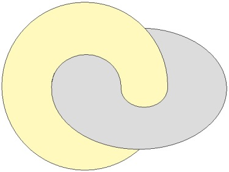

<!-- id: s13-13-0020 -->

Avec ce que ceci comporte, c’est que *la coupure suivante*, dont j’ai montré l’importance parce que c’était précisément là ce sur quoi j’ai - pendant cette année - longuement insisté, que *la coupure suivante*, que nous avions appris à traduire comme le chemin entourant si l’on peut dire le corps du tore, *c’est la demande*.

<!-- id: s13-13-0021 -->

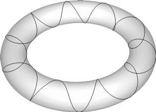

<!-- id: s13-13-0022 -->

Et comment il est nécessaire qu’une demande qui se répète dans cette forme d’équivalence, ne puisse se former que…

<!-- id: s13-13-0023 -->

> je m’exprime dans *des termes imagés et simples* de façon à bien me faire entendre de cet auditoire qui n’est pas forcément initié aux formes proprement mathématiques qui donneraient à ceci sa rigueur …à faire, si je puis dire, *le tour de ce trou central*, qui est la propriété topologique essentielle du tore, celle qui introduit dans *son extérieur*, cette énigme de contenir *un intérieur par rapport à l’intérieur du tore*, ou si vous voulez, d’une façon plus rigoureuse, de permettre *que des circuits fermés à l’intérieur du tore, s’enchaînent ou se bouclent* par rapport à *des circuits fermés qui sont extérieurs*.

<!-- id: s13-13-0024 -->

Je vous l’illustre, voici, je vais le faire dans une autre couleur : voilà *un circuit fermé à l’intérieur* \[b\], vous voyez que c’est un tore.

<!-- id: s13-13-0025 -->

Il est possible de faire *un circuit fermé à l’extérieur* \[a\] qui soit bouclé avec le circuit fermé intérieur :

<!-- id: s13-13-0026 -->

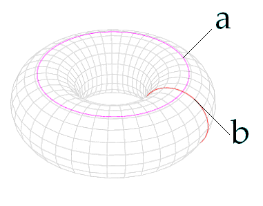

<!-- id: s13-13-0027 -->

Ce qui est strictement impossible dans la formule topologique qui forme depuis toujours le modèle sur lequel s’articule la pensée de *l’intérieur et de l’extérieur*, qui est *la sphère *: quelque circuit fermé que vous fassiez à l’intérieur de la sphère, il ne sera jamais bouclé avec un circuit fermé extérieur.

<!-- id: s13-13-0028 -->

Cette forme topologique étant restée longtemps la forme prévalente pour toute conception de la pensée, et restant par exemple, immanente à l’usage des cercles d’EULER en logique, c’est précisément là l’intérêt des nouveautés topologiques que je promeus devant vous : le fait de vous montrer de quel usage elles peuvent être pour résoudre certaines impasses des problèmes qui nous sont à nous posés par la topologie de notre expérience, et qui trouvent dans ces nouvelles formes topologiques leur support et leur solution.

<!-- id: s13-13-0029 -->

Que ce retournement soit bien un retournement, ceci peut se voir aisément, et je le dis tout de suite.

<!-- id: s13-13-0030 -->

C’est de l’ordre, semble-t-il, de la récréation mathématique que de le représenter, comme je vais vous le représenter.

<!-- id: s13-13-0031 -->

Néanmoins cela garde tout son intérêt et toute son importance. Comme je ne pourrais pas l’insérer aisément dans la suite de mon discours, je vais vous en donner tout de suite l’image. Considérez simplement ceci comme une introduction à ce qui va vous être dit d’une façon plus cohérente et plus développée.

<!-- id: s13-13-0032 -->

Ce n’est pas simplement d’un autre tore qu’il s’agit dans celui–ci qui peut servir de décalque à ce qui est inscrit sur l’autre.

<!-- id: s13-13-0033 -->

Topologiquement, un tore est quelque chose de tout à fait équivalent à ce qu’on appelle en topologie l’insertion sur une sphère, d’une poignée.

<!-- id: s13-13-0034 -->

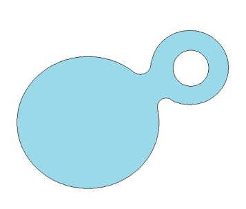

<!-- id: s13-13-0035 -->

Vous voyez bien que par transformation continue comme on s’exprime dans certains manuels, c’est exactement la même chose, un tore ou une poignée, que cette espèce de cloche fermée. À partir de là, il vous sera aisé de comprendre la légitimité du terme de *retournement* si nous donnons à ce mot, *son sens intuitif*, son sens intuitif dont ce n’est pas pour rien qu’il évoque la manipulation, la manœuvre, la main, cette main qui est présente jusque dans le terme allemand pour désigner ce traitement : *Handlung*. La faveur que nous pouvons y trouver est justement celle, sinon de complètement réduire à ce qu’il y a de prévalence visuelle dans le terme d’intuition, tout au moins de le faire reculer.

<!-- id: s13-13-0036 -->

Déjà les stoïciens en avaient senti l’importance et la nécessité - certains d’entre vous savent ce qu’ils faisaient de la main ouverte, de la main fermée, du poing, voire justement de ce retournement que la main image. Ici, c’est à proprement parler à cette sorte de retournement qui est lié à l’usage de la main, retournement de la peau qui la recouvre, le retournement du gant pour l’appeler par son nom, que nous faisons référence. Ce fait qu’un *gant droit retourné fasse un gant gauche*, et plus exactement fasse l’image du gant dans le miroir, pour autant que l’image du gant dans le miroir c’est le gant de l’espèce opposée, voilà qui est le point de départ de l’intérêt que nous portons à ce terme de retournement.

<!-- id: s13-13-0037 -->

N’oubliez pas que cet exemple intuitif est proprement ce qui a nécessité pour KANT[^131], certains des amarrages de son esthétique transcendantale. Je ne m’y arrête pas plus longtemps pour l’instant mais consultez le chapitre qui, si mon souvenir est bon, est le chapitre treize des *Prolégomènes à toute métaphysique future*[^132]. Vous en verrez l’importance qui va s’enraciner plus loin dans toute la discussion entre LEIBNIZ et NEWTON sur la nature de l’espace.

<!-- id: s13-13-0038 -->

Pour le cas de *notre sphère avec la poignée*, elle est uniquement là, surtout sous cette forme, pour vous rendre sensibles à ceci : qu’un tore est tout aussi retournable qu’un quelconque support *d’homologie sphérique* tel que le gant.

<!-- id: s13-13-0039 -->

Car le gant, vous le voyez bien, n’est pas dissemblable, quant à sa topologie, d’une sphère, il suffit que vous souffliez assez fort sa baudruche pour le voir se réduire à une forme sphérique.

<!-- id: s13-13-0040 -->

Le tore est retournable également. Il suffit en effet, pour que vous le voyez tout de suite, que passant par une ouverture quelconque votre main, vous alliez accrocher l’intérieur de la poignée pour voir ce qui s’y passe. Voici maintenant ma sphère ouverte pour ma main et retournée.

<!-- id: s13-13-0041 -->

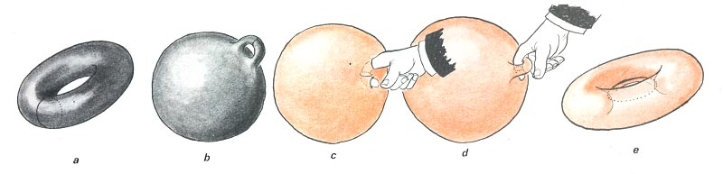

<!-- id: s13-13-0042 -->

Ici vous voyez se dessiner, avec deux trous dans la sphère, ce qui pourrait apparaître être une *poignée intérieure*.

<!-- id: s13-13-0043 -->

Je vais mettre mon doigt, ici à *l’intérieur* de cette *poignée intérieure*. Il vous est du même coup immédiatement sensible je pense, qu’à *tirer là-dessus*, vous voyez se produire, se reproduire, une poignée extérieure. Il n’y a pas de poignée intérieure insérable sur une sphère. Toute poignée est toujours une poignée extérieure.

<!-- id: s13-13-0044 -->

La seule différence avec la première, celle qui est ici, sera de se profiler ici dans un axe sagital par rapport à vous, alors qu’elle était ici transversale, autrement dit, de même que les deux tores précédents, d’être l’un par rapport à l’autre dans une position de déplacement *d’un quart de tour*, non pas d’un demi tour, comme dans *une translation* qui tenterait d’en reproduire l’équivalent, mais d’un quart de tour. *Ce quart de tour est très important car il est irréductible à toute translation spéculaire.*

<!-- id: s13-13-0045 -->

Néanmoins, il reste, au niveau du tore, que quelque chose n’apparaît pas aussitôt, qui nous détache des possibilités particulières qui font que *le retournement* - la substitution de l’endroit à l’envers et inversement - est quelque chose qui reproduit *la formation spéculaire*. On pourrait dire ici qu’on trouve quelque chose qui, *à ce quart de tour près,* ferait de *l’image retournée du tore*, après tout quelque chose qui n’est pas *réellement*, qui n’est pas *fondamentalement* différent du point de vue *topologique* et qui en donne encore en quelque façon, *un équivalent spéculaire*.

<!-- id: s13-13-0046 -->

Je le répète, c’est à ce déplacement d’un quart de tour près, dont nous allons mieux voir, à rapprocher le tore des formes topologiques de sa famille, qu’il est déjà quelque chose qui sépare le tore de toute surface d’homologie sphérique concernant cette relation à l’image spéculaire. Nous allons le voir maintenant plus en détail. Mais pour ne pas faire baisser, si je puis dire, votre attention, à m’étendre sur ce qui fait la force générale de ces aspects *topologiques* qui se distinguent de *la sphère,* je vais tout de suite matérialiser pour vous ce dont il s’agit. Il s’agit *du rapport d’un décalque à l’image spéculaire*, vous n’avez qu’à vous reporter à ce que j’ai déjà - suffisamment, je pense - manipulé devant vous de la *surface* ou de la *bande de Mœbius*, pour vous rappeler à la fois ce que je vous en ai dit, et ce qui en vient aujourd’hui dans mon explication.

<!-- id: s13-13-0047 -->

Si la *surface de Mœbius* se fait *de joindre les deux extrémités d’une bande après* *un demi tour*, et *s’il en résulte* - ce que je vous ai dit en son temps - *une surface unilatère*, vous pouvez vous souvenir de ce que je vous ai dit, ici dans mon cours, il y a déjà deux ans[^133].

<!-- id: s13-13-0048 -->

C’est à savoir que pour recouvrir cette surface, pour en faire l’équivalent et le décalque il faudra que vous en fassiez deux fois le tour, c’est-à-dire que, partant d’un point, ou d’une ligne transversale qui est celle-ci vous arrivez après un tour, à être à l’envers du point d’où vous êtes d’abord parti, et qu’il faut que vous fassiez un second tour pour revenir conjoindre votre décalque à la ligne dont vous êtes parti.

<!-- id: s13-13-0049 -->

Vous aurez donc un décalque, une surface collée à la première, qui aura diverses propriétés, dont la première d’abord est d’être pour nous - pour parler rapidement - deux fois plus longue que la première, d’autre part d’être complètement différente d’elle, du point du vue topologique.

<!-- id: s13-13-0050 -->

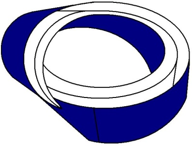 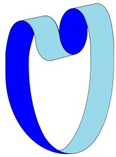 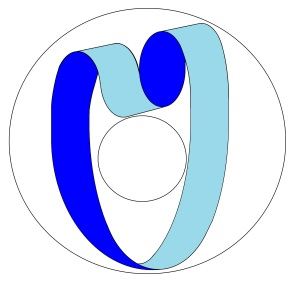

<!-- id: s13-13-0051 -->

Elle n’est ni *homéomorphe*, ni *homéotope*, elle n’est pas *homologue*, car elle - au lieu de se conjoindre à elle-même, après un demi tour, une demi torsion sur elle-même - elle est conjointe à elle-même d’une *torsion complète*, ce qui aura pour effet de vous la présenter de la façon que je peux facilement reproduire en coupant - j’ai déjà maintes fois fait ce geste - celle-ci par son milieu, à savoir quelque chose qui se présente comme une double boucle, laquelle est conjointe d’une façon bien particulière qui reste à préciser, qui n’est pas n’importe laquelle mais dont je vous ai déjà dit, et montré qu’elle a pour *propriété* d’être applicable sur la surface d’un tore, d’une façon qui reproduit exactement la double boucle et l’inclusion du trou central dans cette boucle, qui est exactement celle-ci. Cette différence qu’il y a, du décalque radical à ce dont il part, c’est là proprement ce sur quoi repose cette distinction que je fais qu’en parlant de *l’objet(a)* je dis *qu’il n’est pas spéculaire*.

<!-- id: s13-13-0052 -->

*L’objet(a) étant précisément de la bande de Mœbius,* vous le savez :

<!-- id: s13-13-0053 -->

- *ce qui la complète et ce qui est son support*,

<!-- id: s13-13-0054 -->

- *ce qui ferme la bande de Mœbius* pour donner cette surface complétée auxquels sont donnés légitimement

<!-- id: s13-13-0055 -->

> les noms divers du *plan projectif* quelquefois ou mieux encore, dans le cas où nous la représentons…
>
> cette construction que j’ai maintes fois représentée devant vous sous cette forme dont vous savez qu’elle représente l’entrecroisement de ce qui est la surface qui se gonfle ici dans la partie inférieure \[*a*\] de cette baudruche, l’entrecroisement de cette surface avec elle–même qui ici passe derrière \[b\], de même ici celle-ci passe derrière \[c\]

<!-- id: s13-13-0056 -->

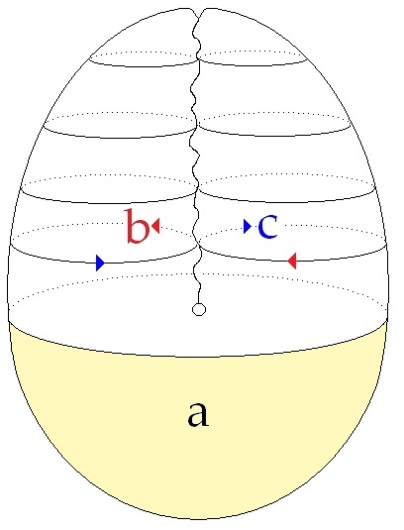

<!-- id: s13-13-0057 -->

…c’est ce qu’on appelle le *cross-cap*, *la partie supérieure*, ou plus exactement, quand nous avons - comme dans cette figure - amputée de la partie sphérique inférieure ou calotte, ceci représente ce qu’on appelle le *cross-cap,* ou autrement dit la *mitre*.

<!-- id: s13-13-0058 -->

L’ensemble de la figure, si vous voulez, appelons-là - pour ça, pour cette forme représentée - sphère mitrée.

<!-- id: s13-13-0059 -->

Ce qui donne une actualité singulière, si vous me permettez un peu de fantaisie, aux représentations de DALI des évêques morts sur la plage de Cadaquès. Quoi de plus beau, semble avoir deviné DALI, qu’un évêque statufié, pour représenter ce qui nous importe ici à savoir le désir.

<!-- id: s13-13-0060 -->

Cette propriété générale d’un certain nombre de fonctions topologiques, de se présenter, avec une distinction plus ou moins apparente, dont je pense ici vous avoir fait saisir, au niveau de la *bande de Mœbius,* le caractère s’imposant, alors qu’il peut être, dans certaines des autres formes, plus larvé - voilà ce qui est essentiel à distinguer, et qui pour nous, nous dirige vers ce que, pour parler rapidement nous appellerons si vous voulez « *les formes mentales* » qui sont celles auxquelles nous devons accommoder notre expérience, ce qui est là seulement une approche de la question, laquelle est celle-ci : quel est le rapport de cette structure avec le champ de notre expérience ?

<!-- id: s13-13-0061 -->

Quelqu’un m’a demandé récemment si - j’entends quelqu’un qui n’est pas de notre domaine, qui est un mathématicien fort distingué, dont j’ai l’honneur d’être l’ami depuis quelques temps et que certains ici connaissent, au moins par la liaison que j’ai commencé d’établir entre eux et lui - ce quelqu’un qui n’a pas du tout été inattentif à la sortie du premier cahier du cercle épistémologique m’a posé certaines questions sur tel ou tel texte de M. MILNER ou de M. MILLER et s’est inquiété, en quelque sorte, de ce dont il s’agissait, à savoir si c’était de *modèles mathématiques* ou même de *métaphores*.

<!-- id: s13-13-0062 -->

J’ai cru pouvoir lui répondre que les choses dans ma pensée allaient plus loin, et que les structures dont il s’agit ont droit d’être considérées comme de l’ordre d’un ὑποχείμενον \[upokeimenon\], d’un *support*, voire d’une *substance* de ce qui constitue notre champ. Le terme donc de « *forme mentale* » comme toujours est là d’approche, est inapproprié.

<!-- id: s13-13-0063 -->

N’oubliez pas pourtant que celui qui a introduit de façon éminente cette question de la révision des formes topologiques comme fondement de la géométrie, Henri POINCARÉ pour le nommer, et ses publications qui commencent comme vous le savez, au compte-rendu de la *Société de Mathématiques de Palerme*. Entendez bien qu’il s’agissait là de quelque chose qui nécessite, chez le mathématicien lui-même, une sorte d’exercice, d’exercice d’auto-brisure des cadres intuitifs qui lui sont habituels et qu’il admettait que dans ces références, il y avait la source d’une sorte de conversion de l’exercice intuitif de l’esprit qu’il considérait comme non seulement fondamental mais nécessaire à l’inauguration de cette révision.

<!-- id: s13-13-0064 -->

Disons maintenant quelles sont *les formes* dont il s’agit et quelles sont celles qui vont nous servir. *Elles sont au nombre de quatre, dont brièvement*, à l’usage de ceux pour qui ces termes ont un sens, je dirai que le caractère commun est que la caractéristique dite d’EULER-POINCARÉ, précisément que je viens de nommer, y est égale à zéro \[F - A + S = 0\]. Je ne vais pas vous dire ce que c’est que cette caractéristique d’EULER-POINCARÉ, néanmoins je vais tout de même vous en donner une pointe, un aperçu, sans ça, à quoi bon la nommer. Commençons d’abord par énumérer ces quatre formes qui sont :

<!-- id: s13-13-0065 -->

- *le cylindre*, ou le disque troué, ce qui *topologiquement* est exactement la même chose,

<!-- id: s13-13-0066 -->

- *le tore*,

<!-- id: s13-13-0067 -->

- *la bande de Mœbius*

<!-- id: s13-13-0068 -->

- et *la bouteille de Klein*.

<!-- id: s13-13-0069 -->

Ces quatre formes topologiques ont cette constante d’EULER-POINCARÉ.

<!-- id: s13-13-0070 -->

Pour vous donner l’idée de la différence qu’il y a entre ces surfaces et celle de la sphère, je vous rappellerai que la sphère \- j’ai mis des ombres pour la rendre plus mignonne -

<!-- id: s13-13-0071 -->

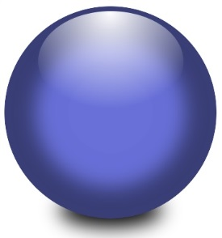

<!-- id: s13-13-0072 -->

la sphère et tout ce qui lui est homologue, à savoir par exemple tous les polyèdres que vous connaissez qui peuvent s’y inscrire car quelle que soit la complication de ces polyèdres, ils sont homologues à une sphère : si vous faites à l’intérieur de la sphère, par exemple, un tétraèdre, vous verrez qu’il n’est pas de nature essentiellement différente, il n’y a qu’à souffler dans le tétraèdre assez fort pour qu’il devienne sphérique.

<!-- id: s13-13-0073 -->

Eh bien, l’une des incarnations de cette constante d’EULER consiste à prendre, quand il s’agit du polyèdre :

<!-- id: s13-13-0074 -->

- le nombre de ses faces : F,

<!-- id: s13-13-0075 -->

- le nombre de ses arêtes : A,

<!-- id: s13-13-0076 -->

- et le nombre de ses sommets : S,

<!-- id: s13-13-0077 -->

- et à y colloquer alternativement le signe plus et le signe moins, par exemple : F – A + S.

<!-- id: s13-13-0078 -->

Je mets ici un signe moins et ici un signe plus et nous avons pour ce qui est du tétraèdre : + 4 – 6 + 4. Vous voyez que ceci donne exactement pour résultat le chiffre 2. C’est précisément parce que si vous faites, n’est–ce pas : 4 – 6 + 4 ça fait 2, vous pouvez vérifier ceci à propos de *n’importe quel polyèdre*.

<!-- id: s13-13-0079 -->

Si je vous ai mis le plus simple, c’est pour ne pas vous fatiguer, si vous prenez un dodécaèdre, le résultat sera le même.

<!-- id: s13-13-0080 -->

Mais si vous faites un polyèdre quelconque qui soit inscrit dans un tore, vous vérifierez facilement qu’à faire la même opération, à savoir l’addition des faces avec les sommets, et la soustraction des arêtes, vous aurez 0.

<!-- id: s13-13-0081 -->

Maintenant, quel est l’usage que nous pouvons faire de ces quatre éléments topologiques, respectivement :

<!-- id: s13-13-0082 -->

- *le cylindre*,

<!-- id: s13-13-0083 -->

- *le tore*,

<!-- id: s13-13-0084 -->

- *la bande de Mœbius*,

<!-- id: s13-13-0085 -->

- *la bouteille de Klein*.

<!-- id: s13-13-0086 -->

C’est là que nous allons venir maintenant, et vous parlant de cet usage, il faut d’abord que je mette l’accent sur certaines des propriétés, l’usage viendra après. Impossible de vous en jeter à la tête, si je puis dire, tout de suite la valeur opératoire, dans telle ou telle de nos références. Impossible de vous en donner *la translation*, *la traduction* tout de suite, si d’abord je ne mets pas en valeur ce qui les distingue l’une de l’autre et ce qui leur donne ces précieuses propriétés, qui ne sont autres, je vous le répète que les propriétés mêmes de notre champ, que nous voyons ici en raison du fait que ces figures ne sont pas quoi que ce soit que vous puissiez légitimement traduire par ce par quoi, je suis pourtant forcé de vous les *représenter*.

<!-- id: s13-13-0087 -->

À savoir par quelque chose qui s’intuitionne, mais par quelque chose qui dans toute sa rigueur, ne s’articule que de référence symbolique, et d’une formulation qui ne se supporte que de l’usage plus ou moins élaboré et combiné de ce que j’appellerai des *lettres*. Pour autant qu’une théorie des ensembles pourrait ici vous amener à ce chapitre particulier de la topologie qui nous attache dans l’occasion, je pourrais entièrement vous le développer au tableau sous la forme *d’une série de formules* qui ne se distingueraient pas à votre regard de l’usage commun *des formules algébriques* et que ça serait évidemment *d’un cheminement* beaucoup plus sûr, pour l’usage que nous pourrions en faire.

<!-- id: s13-13-0088 -->

Autrement dit, il importe, concernant ces surfaces, que vous fassiez la distinction dans votre esprit de ce qui est de *la surface locale*, et de *la surface globale*. Il est de la conséquence de votre capture par ce qui s’appelle l’intuition, autrement dit l’imaginaire, que vous pensiez ces surfaces comme des surfaces locales c’est-à-dire, que vous ne puissiez pas détacher l’intuition d’une portion quelconque de ces surfaces de ce qu’implique le fait qu’une surface locale peut faire partie d’un plan indéfini ou d’une sphère ce qui est équivalent, topologiquement. Mais toute parcelle d’une surface globale telle qu’elle est définie ici topologiquement, doit se concevoir comme porteuse essentiellement des propriétés de la surface globale.

<!-- id: s13-13-0089 -->

C’est pourquoi par exemple, il ne nous intéresse absolument pas de considérer dans le tore, un de ces petits fragments par exemple \[a\], que nous appellerons disques dans l’occasion, en tant qu’il peut se réduire à un point.

<!-- id: s13-13-0090 -->

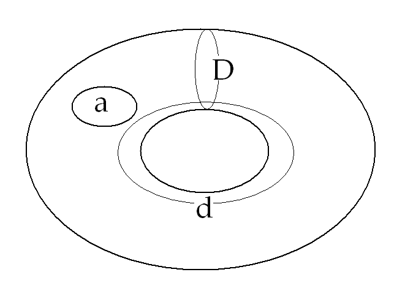

<!-- id: s13-13-0091 -->

Ceci n’a rien à faire topologiquement avec le tore, car ce qui distingue le tore de la sphère, où la même chose se produit, comme sur le plan, c’est qu’il y a dans le tore des circuits fermés, exactement apparemment équivalents à celui que nous avons défini ici tout d’abord \[d\], et dont vous voyez bien qu’il se distingue radicalement du premier, premièrement en ceci :

<!-- id: s13-13-0092 -->

- qu’il ne découpe rien à la surface du tore, il l’ouvre simplement, *il le transforme en un cylindre*,

<!-- id: s13-13-0093 -->

- et d’autre part, qu’il ne peut d’aucune façon se réduire à un point, puisque le trou central du tore est ce qui arrêterait, si je puis dire, son rétrécissement.

<!-- id: s13-13-0094 -->

*Sur un tore*, vous voyez bien qu’*il existe deux sortes de circuits fermés* de cette espèce, voici l’autre \[D\]. Et vous reconnaissez ici donc, *les deux formes de coupure* que dans un premier abord, j’ai demandé qu’on me suive par hypothèse en convenant d’attacher à l’une la connotation d’*une de ces coupures signifiantes que nous pourrions considérer comme représentant la demande*.

<!-- id: s13-13-0095 -->

À cette condition que nous nous apercevions de ce que comporte la répétition de ce cycle quand il ne se ferme pas et comment pour se fermer, il doit *obligatoirement* passer par le circuit de l’autre espèce \[d\], que de ce fait, nous nous apercevons pouvoir particulièrement aisément symboliser ce fait, que pour nous *ce que la demande se trouve supporter*, par rapport à ce que je vous ai appris à considérer comme sa conséquence, à savoir *la dimension du désir*, *elle ne saurait le supporter comme tel qu’à se répéter*.

<!-- id: s13-13-0096 -->

Ce qui du même coup nous suggère, quelque originalité spéciale de ce terme de *répétition*, à savoir qu’il n’est pas en quelque sorte une dimension vaine, qu’en elle-même *la répétition* développe *quelque chose* qu’il y a pour nous tout intérêt à illustrer de cette façon. En effet, pour reprendre POINCARÉ[^134], *c’est lui qui a introduit la fable, si l’on peut dire philosophique, l’idée de ces « êtres infiniment plats »* qui pouvaient subsister sur les surfaces topologiques qu’il a mises en circulation.

<!-- id: s13-13-0097 -->

Ces « *êtres infiniment plats* » ont une valeur, ont une valeur qui est de nous faire remarquer ceci, à savoir : ce qu’ils peuvent et ce qu’ils ne peuvent pas savoir.

<!-- id: s13-13-0098 -->

Il est clair que, si nous supposons, une topologie, une structure qui est elle-même de surface, habitée par des « *êtres infiniment plats* », ce n’est certainement pas pour nous référer nous-mêmes à ce que vous voyez forcément ici représenté, à savoir la plongée dans l’espace, des dites formes topologiques. Pour ce qui subsiste au niveau de cette structure topologique, ce que j’appelle - au passage, comme ça et en m’en excusant - *le trou central*, est absolument impossible à apercevoir.

<!-- id: s13-13-0099 -->

Par contre, ce qu’il est possible d’apercevoir, c’est la cohérence des boucles telles que je viens de vous les dessiner.

<!-- id: s13-13-0100 -->

Il est également parfaitement possible à l’intérieur même du système de s’apercevoir qu’une espèce de boucle que je vais vous représenter maintenant, si vous le voulez - pour économiser - sur la même figure, celle-ci qui conjoint en un seul, les deux espèces de circuit fermé qui pour nous - pour nous qui plongeons dans l’espace parce que nous sommes, au moins provisoirement, assez infirmes pour y trouver un secours - il se trouve y faire circuit à la fois autour de ce que j’appellerai \- pourquoi, puisque nous en sommes à la compromission, nous arrêter ? - « *le trou intérieur* » et « *le trou extérieur* ».

<!-- id: s13-13-0101 -->

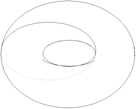

<!-- id: s13-13-0102 -->

Cette boucle qui s’appelle - parce que c’est celui qui l’a découverte - un [*cercle de Villarceau*](http://fr.wikipedia.org/wiki/Cercles_de_Villarceau). Il a découvert ceci bien avant qu’on fasse de la topologie, il l’a découvert au milieu de propriétés métriques sur lesquelles je n’insisterai pas. Il s’est amusé à découvrir que cette sorte de boucle, à condition de la déterminer par une opération bien choisie, pouvait être, dans un tore fait par la rotation d’un cercle régulier, que cette boucle elle-même pouvait être circulaire. C’est très facile de s’en apercevoir. *Il suffit de pratiquer sur le tore* *[une coupe par un plan bitangent](http://fr.wikipedia.org/wiki/Fichier:Villarceau_circles.gif),* ce qui en coupe se présente comme ça :

<!-- id: s13-13-0103 -->

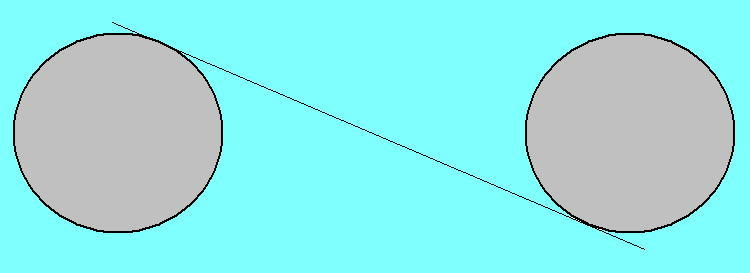

<!-- id: s13-13-0104 -->

Ceci était déjà une première approche, il y avait quelque aperçu topologique dans cette approche de [VILLARCEAU](http://www.umpa.ens-lyon.fr/~bkloeckn/sous-pages/images.html).

<!-- id: s13-13-0105 -->

Je n’y fais allusion que pour vous faire remarquer que même un être infiniment plat, dans la surface du tore, peut s’apercevoir qu’il y a deux séries de ces cercles de [VILLARCEAU](http://pagesperso-orange.fr/math-a-mater/villarceau/villarceau.html). Il y a ceux qui vont dans ce sens-là, et puis il y a ceux qui vont dans le sens contraire et qui ont pour propriété de recouper tous les premiers :

<!-- id: s13-13-0106 -->

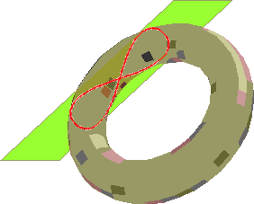

<!-- id: s13-13-0107 -->

Bien entendu vous voyez bien qu’on peut en faire toute une série faisant tout le tour du tore, qui ne se recoupent pas :

<!-- id: s13-13-0108 -->

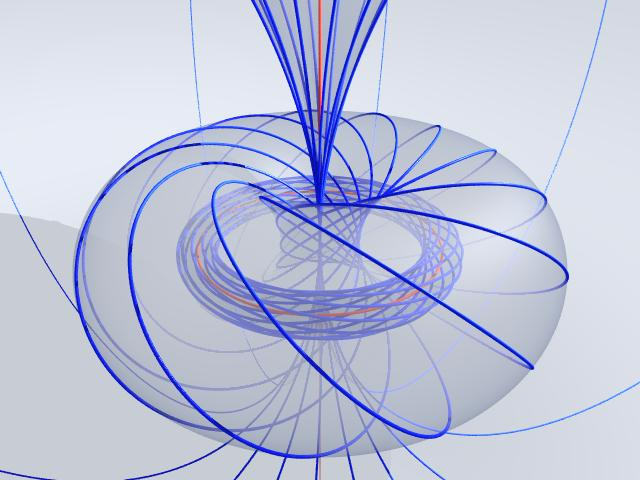

<!-- id: s13-13-0109 -->

Ceci pour vous montrer l’élaboration possible, le matériel que mettent à notre portée ces structures pour quelque chose qui n’est rien de moins que l’articulation cohérente de ce qui se pose à nous comme problème au regard par exemple d’une réalité comme le fantasme. J’ai insisté dans le début de mon enseignement sur *la fonction imaginaire* comme étant ce qui supporte radicalement l’identification narcissique, le rapport microcosme-macrocosme, tout ce qui a servi jusqu’à présent de module à la *cosmologie* comme à la *psychologie*.

<!-- id: s13-13-0110 -->

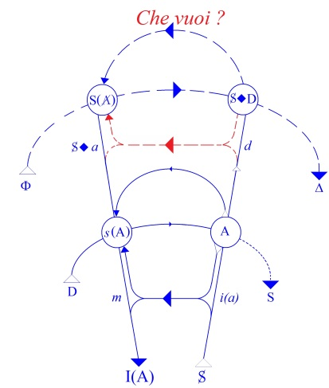

<!-- id: s13-13-0111 -->

J’ai construit un graphe pour vous montrer - à un autre état, et dans une autre référence à la combinatoire symbolique - quelque chose qui est aussi *une forme d’identification* celle *qui fait le désir se supporter du fantasme*.

<!-- id: s13-13-0112 -->

Le fantasme, je l’ai symbolisé par la formule S *coupure*, si vous voulez, de *(a)* : S**◊***a*. Qu’est-ce que c’est que ce *(a)* ?

<!-- id: s13-13-0113 -->

Est-ce que c’est quelque chose d’équivalent à *i(a)*, image spéculaire*,* ce dont se supporte - comme FREUD l’articule expressément - cette série d’identification s’enveloppant l’une l’autre, s’additionnant, se concrétisant à la façon des couches d’une perle, au cours du développement qui s’appelle le *moi*. Est-ce que le *(a)* n’est qu’*une autre fonction de l’imaginaire* ?

<!-- id: s13-13-0114 -->

Quelque chose doit tout de même vous mettre en soupçon qu’il n’en est rien : si j’avance depuis toujours *que le (a) n’a pas d’image spéculaire*. Mais qu’est-il ?

<!-- id: s13-13-0115 -->

Pour vous reposer, parce que je pense qu’après tout, tout ceci est bien aride, je vous dirai qu’*une fable*, *un modèle*, *un apologue* m’est venu à l’esprit, précisément au temps de mes conférences aux U.S.A., mais que je vous en ai réservé la primeure.

<!-- id: s13-13-0116 -->

C’est-à-dire que le mot qui m’est venu à l’esprit pour vous faire saisir où est le problème, ce mot je ne l’ai pas mis en circulation. Je l’ai d’autant moins mis en circulation que je ne crois pas qu’il ait de traduction en anglais.

<!-- id: s13-13-0117 -->

Mais enfin je leur en ai donné quand même une petite idée : j’ai employé le terme *frame* ou *framing*.

<!-- id: s13-13-0118 -->

Il y a un mot beaucoup plus beau en français, c’est un mot qui a son prix sur la scène du théâtre, c’est le mot « *praticable* ».

<!-- id: s13-13-0119 -->

Après tout, peut-être certains d’entre vous se souviennent-ils de la façon dont j’ai parlé du fantasme à certaines de nos journées provinciales[^135] quand j’y ai fait référence à un jeu - qui n’est point de hasard - du peintre [MAGRITTE](#Magritte), qui l’a dans ses tableaux répété bien souvent, à savoir de représenter l’image qui résulte de la pose, dans le cadre même d’une fenêtre, d’un tableau qui représente exactement le paysage qu’il y a derrière. À ceux-là, mon introduction du praticable n’apportera rien de nouveau, à ceci près que c’est un petit peu plus mettre l’accent et le point sur les i.

<!-- id: s13-13-0120 -->

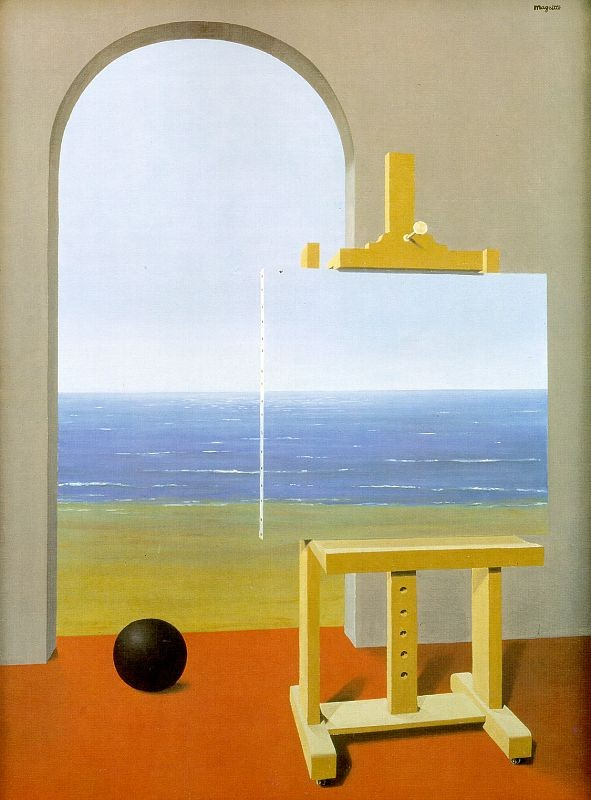 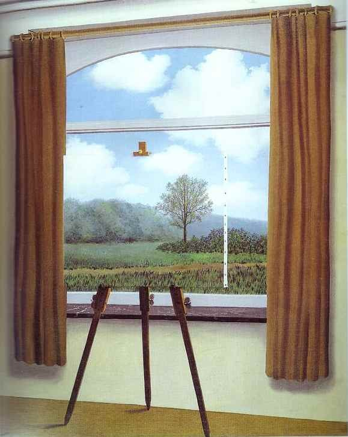

<!-- id: s13-13-0121 -->

Quel est le fruit de la présence du *praticable* sur la scène du théâtre, sinon à une certaine distance, d’être pour nous *trompe-l’œil*, d’introduire une perspective, un jeu, une capture dont on peut dire qu’il participe de tout ce qu’il en est dans le domaine du visuel, de l’ordre de *l’illusion* et de *l’imaginaire*. Néanmoins, si vous passez derrière le praticable, il n’y a plus moyen de s’y tromper. Et pourtant le praticable est toujours là. Il n’est pas imaginaire. Le bâti existe. C’est là très précisément ce dont il s’agit, il faut avoir poussé les choses assez loin - et très précisément dans une analyse - pour arriver au point où nous touchons, dans le fantasme, *l’objet(a)* comme le bâti.

<!-- id: s13-13-0122 -->

La *fonction du fantasme* dans l’économie du sujet n’en est pas moins de *supporter le désir* de sa fonction illusoire.

<!-- id: s13-13-0123 -->

Il n’est pas illusoire : c’est par sa fonction illusoire qu’il soutient le désir, le désir se captive de cette division du sujet en tant qu’elle est causée par le bâti du fantasme. Qu’est-ce à dire ? Est-ce à dire que nous puissions nous contenter de dire que, comme au théâtre, il n’y a qu’à avoir son entrée dans les coulisses pour aller visiter le praticable et en avoir le fin mot ?

<!-- id: s13-13-0124 -->

Il est bien évident que ce n’est pas de cela qu’il s’agit et que, comme les êtres infiniment plats qui habitent ce corps, ce n’est pas à nous déplacer sur la surface du tore, que nous aurons jamais l’idée de ce qui est là sous forme de trou, et qui selon toute apparence, doit bien avoir quelque chose à faire avec cet *objet(a)* puisque c’est de son existence que dépend la distinction de ces deux boucles :

<!-- id: s13-13-0125 -->

- celles \[d\] qui sont faites autour de cette torsion externe,

<!-- id: s13-13-0126 -->

- avec celle \[D\] qui les rejoint à franchir ce trou.

<!-- id: s13-13-0127 -->

C’est ici que l’usage des autres *surfaces topologiques* dont je vous ai annoncé la fonction peut nous être de quelque service.

<!-- id: s13-13-0128 -->

Je n’ai pas besoin, je pense, de longuement pérorer sur ce qui peut se décrire au niveau du *plan projectif, quand il est particulièrement aisé* - et je l’ai fait maintes fois - *de le représenter ici par ce que j’ai appelé tout à l’heure* improprement *le cross-cap*.

<!-- id: s13-13-0129 -->

Car cet *impropre* nous permet la remarque - mais continuons de l’appeler ainsi, je n’aime pas beaucoup *la sphère mitrée -* de nous apercevoir qu’une coupure, qui d’une façon très frappante a exactement *la même structure de double boucle* que celle qui nous permet au niveau du tore, de mettre en évidence la présence du trou central, même aux êtres plats, alors que je vous fais remarquer qu’elle est, au niveau de la simple coupure \[I\], du *cercle de* VILLARCEAU parfaitement indiscernable, que cette double boucle ici \[II\] a pour effet - je pense l’avoir suffisamment de fois décrite devant vous, pour que vous vous en souveniez - de séparer la surface.

<!-- id: s13-13-0130 -->

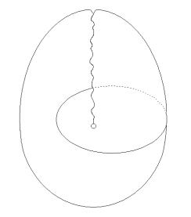 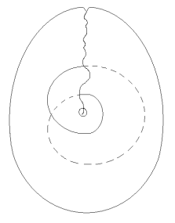

<!-- id: s13-13-0131 -->

I II

<!-- id: s13-13-0132 -->

Contrairement à ce qui se passe pour la double boucle quand elle est faite sur le tore : le tore reste d’un seul tenant.

<!-- id: s13-13-0133 -->

Mais ici nous avons au centre, cette surface de ce que nous pouvons appeler *un faux disque* \[a\] si vous voulez, mais qui est tout de même bel et bien *un disque* dont nous savons depuis longtemps que je le prend pour *support* ou encore *armature* et enfin *cause de l’illusion du désir*, autrement dit comme *équivalent de l’objet(a)*.

<!-- id: s13-13-0134 -->

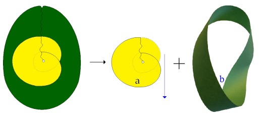

<!-- id: s13-13-0135 -->

L’autre partie du cross-cap \[b\] étant… ceci est très facile à mettre en évidence, je l’ai fait autrefois, à cette même époque lointaine, en 62, par des dessins dont certains se souviennent encore, extraordinairement raffinés mais vraiment dont je serais ici un peu las de reproduire le détail, ils n’avaient qu’un intérêt, c’est dans certaines des transformations qui consistent à déplier le repli qui se trouve là, et aussi bien à le réduire ici, on va s’apercevoir que l’autre partie - appelons-la, la partie b, et celle-là a - que l’autre partie, est une *bande de Mœbius*.

<!-- id: s13-13-0136 -->

En cours de déploiement, vous pouvez sur cette figure faire apparaître toutes les *illusions les plus ravissantes *:

<!-- id: s13-13-0137 -->

- approchez ça de la forme de la conque de l’oreille,

<!-- id: s13-13-0138 -->

- d’une coupe médiane montrant les involutions des formes extérieures du cerveau,

<!-- id: s13-13-0139 -->

- aussi bien de n’importe quoi d’autre, à savoir une coupe des enveloppes embryonnaires.

<!-- id: s13-13-0140 -->

Ceci n’a qu’une valeur suggestive et peut-être pas tout à fait sans nous indiquer que quelques choses de ces formes enroulées sont inscrites partout à l’intérieur de l’organisme.

<!-- id: s13-13-0141 -->

Mais alors, est-ce que nous ne pouvons pas nous poser la question de savoir si nous ne trouvons pas ici confirmation de ce que nous cherchions concernant ce que j’ai appelé - approximativement jusqu’à présent - « *le trou central du tore* », une confirmation de cette indication qu’au niveau du tore - et la chose aura son importance si nous sommes amenés par exemple à symboliser le fonctionnement en décalque des deux tores d’une façon telle qu’ils nous servent à représenter par exemple une relation spécifique de la névrose, celui qui lie le désir du sujet à la demande de l’autre - cette suggestion que, ici, le trou, à savoir quelque chose d’insaisissable est ce qui représente la place de *l’objet(a)*.

<!-- id: s13-13-0142 -->

Est-ce qu’à le trouver dans son support au niveau d’une autre surface comme celle du *cross-cap*, nous ne voyons pas là une suggestion qui peut être précieuse du point de vue opératoire. Quelque chose nous le confirme, à savoir ceci : un tore, c’est fait de la couture des deux bords, des deux trous qui constituent les limites d’un cylindre ou d’un jade troué, comme vous voudrez.

<!-- id: s13-13-0143 -->

 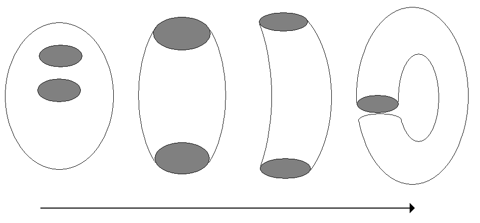

<!-- id: s13-13-0144 -->

Car ce n’est pas pour rien que quelque chose comme les jades troués ça se fait depuis longtemps, bien sûr, nous ne savons plus ce que ça veut dire mais il est assez probable que ceux qui se sont donnés assez de mal à l’origine pour les faire, savaient que ça pouvait servir à quelque chose. Il n’y a pas tellement que ça de *formes trouées naturelles*, et ce n’est pas pour rien que la gravure chinoise manifeste nettement dans toutes ses propositions et ses associations que ses formes de pierre trouée qu’elle nous montre avec surabondance, sont toujours liées à des thèmes érotiques, par parenthèse.

<!-- id: s13-13-0145 -->

Comment est-ce constitué un *plan projectif* ? La forme rigoureuse, je vous la donne d’emblée, pour vous montrer à quel croisement on la rencontre et comment on la construit…

<!-- id: s13-13-0146 -->

> mais c’est elle qui est à la fois la plus essentielle, je veux dire dans une représentation topologique tout à fait couramment reçue, valable et fondamentale …c’est celle-ci : partez d’une figure qui est faite comme l’autre, vous voyez, *des deux cercles qui font bord dans le cylindre et identifiez chaque point d’un de ces cercles avec le point diamétralement opposé de l’autre.*

<!-- id: s13-13-0147 -->

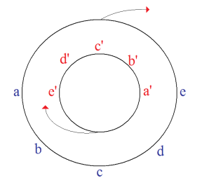

<!-- id: s13-13-0148 -->

En d’autres termes, ce qui dans la *bande de Mœbius* se représente comme ceci :

<!-- id: s13-13-0149 -->

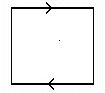

<!-- id: s13-13-0150 -->

À savoir que c’est en la tordant d’un demi tour, que c’est en venant appliquer cette flèche dans son sens, bien sûr, en l’accoudant à l’autre flèche qui est dans le sens opposé, que vous obtenez une *bande de Mœbius*. Eh bien, cette opération-là, faites-là avec deux limites circulaires. Vous aurez ce qui, ici va dans ce sens là, s’accoler ici, dans ce sens-là.

<!-- id: s13-13-0151 -->

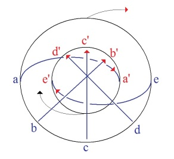

<!-- id: s13-13-0152 -->

Il est facile de voir à cette coupure même, que dans une pareille topologie qui est celle du *plan projectif*, le disque central...

<!-- id: s13-13-0153 -->

encore que ça ne saute pas à l’intuition, mais quand je vous l’ai représenté comme ça, vous le voyez tout de suite …le disque central n’est pas un trou, mais fait partie de la surface. C’est pourquoi un *plan projectif* est dit…

<!-- id: s13-13-0154 -->

> je ne vous apprends là… je ne sais pas, ça peut vous surprendre, mais reportez-vous aux manuels de topologie, vous y verrez - ce qui est considéré comme fondamental - ceci …que le *plan projectif* est composé de *deux parties* à savoir, d’un disque central, et de quelque chose qui l’entoure, qui a la structure d’une *bande de Mœbius* que je considère, par cette figure, comme suffisamment illustré.

<!-- id: s13-13-0155 -->

<!-- id: s13-13-0156 -->

À ceci près, que ce disque central, lui, puisque c’est un vrai disque, est parfaitement évanouissant. À savoir qu’il est également vrai que le *plan projectif* ce soit ce que je vous dessine là maintenant, à savoir simplement une surface telle que chacun de nos points soit identique au point diamétralement opposé, il n’est pas nécessaire que le disque central apparaisse : il peut se réduire à n’être rien. En quoi se démontre sa propriété éminente pour représenter telle dimension de *l’objet(a)* et très spécialement le regard par exemple, dont la propriété d’objet et de piège, consiste précisément en ceci qu’il peut être totalement élidé.

<!-- id: s13-13-0157 -->

Je ne puis vous quitter sans vous faire remarquer cette chose que je pense avoir déjà suffisamment avancée devant vous pour n’avoir qu’à y faire allusion : c’est que grâce à la coupure en huit inversé, à la double boucle, le découpage du *tore* \- qui, je vous le répète, reste d’un seul tenant - est fait d’une façon telle qu’à condition d’une couture appropriée, vous en faites très aisément - et il ne s’agit pas là d’une question matérielle, manipulatoire, encore qu’elle le soit, elle n’est point incorporelle - vous pouvez très facilement du *tore* ainsi ouvert par la double boucle, en y procédant - c’est très facile, je pense que vous le concevez puisque je vous dis que la *surface de Mœbius* coupée par le milieu vient s’appliquer sur le *tore*, inversement si la coupure du tore représente précisément, ce qui en isole cette surface à double boucle - vous en faites très aisément une *bande de Mœbius*.

<!-- id: s13-13-0158 -->

C’est là le lien topologique qui nous donne l’idée de la transformation possible de ce qui se passe à la surface du tore, en ce qui doit se passer sur une *surface de Mœbius* si nous voulons que puisse en surgir la fonction de *l’objet(a)*.

<!-- id: s13-13-0159 -->

Néanmoins cet *objet(a)*, restant encore là si fuyant, problématique, en tout cas si accessible à la disparition, peut-être n’est-ce pas là ce qui est suffisant. C’est ce qui fera qu’une fois de plus je vous laisserai sur un suspense et vous montrerai comment la *bouteille de Klein* résout cette impasse.

<!-- id: s13-13-0160 -->

MAGRITTE

<!-- id: s13-13-0161 -->

 

<!-- id: s13-13-0162 -->

[retour 30-03](#retourMagritte300366) [retour 11-05](#retourMagritte1105) [retour 25-05](#RetourMAGRITTE0106)

## Notes

[^131]: Emmanuel Kant : *Critique de la raison pure*, Paris, Flammarion, 2006.

[^132]: Emmanuel Kant : [*Prolégomènes à toute métaphysique future*](http://fr.wikisource.org/wiki/Prol%C3%A9gom%C3%A8nes_%C3%A0_toute_m%C3%A9taphysique_future/Premi%C3%A8re_partie)..., Paris, Vrin, 1968, Ière partie, § 13.

[^133]: Séminaire 1964-65 : « *Problèmes cruciaux*... » séance du 09-12-1964

[^134]: H. Poincaré : *La science et l'hypothèse*, Paris, Flammarion, 1968, 2e partie, chap.III : *La géométrie de Riemann*:

    « *Imaginons un monde uniquement peuplé d'êtres dénués d'épaisseur ; et supposons que ces animaux « infiniment plats » soient tous dans un même plan et n'en puissent sortir. Admettons de plus que ce monde soit assez éloigné des autres pour être soustrait à leur influence. Pendant que nous sommes en train de faire des hypothèses, il ne nous en coûte pas plus de douer ces êtres de raisonnement et de les croire capables de faire de la géométrie. Dans ce cas, ils n'attribueront certainement à l'espace que deux dimensions.*»

[^135]: « *Journées Provinciales* » d'octobre 1962 sur le fantasme.
