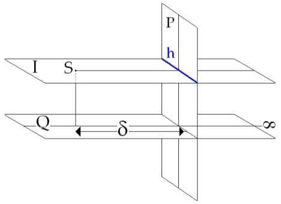
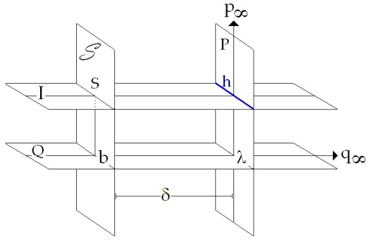
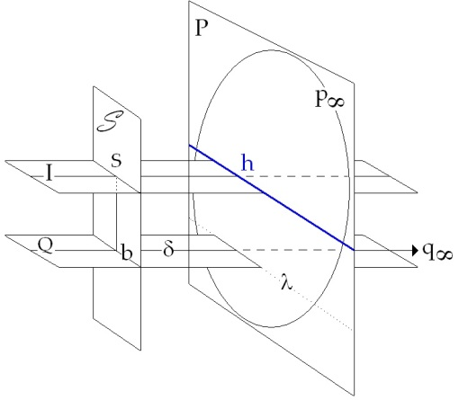
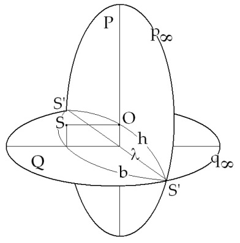
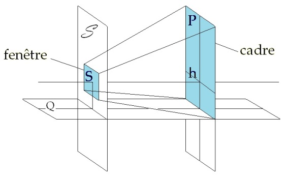
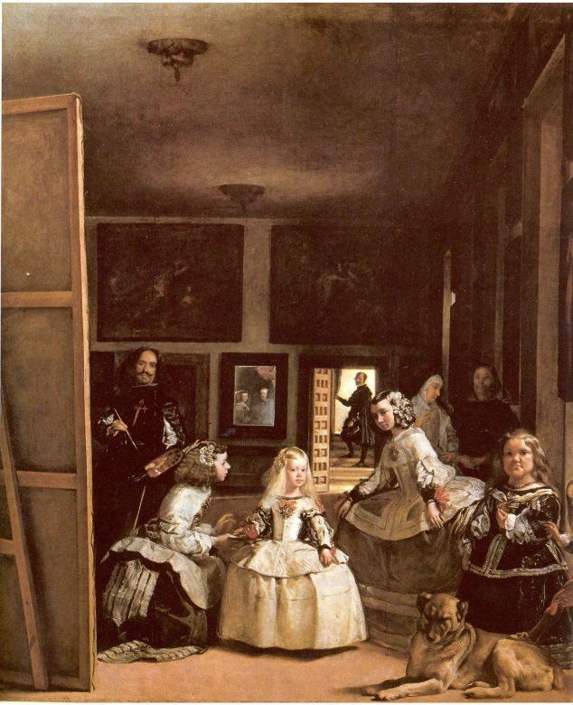
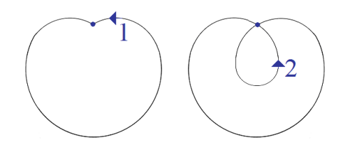
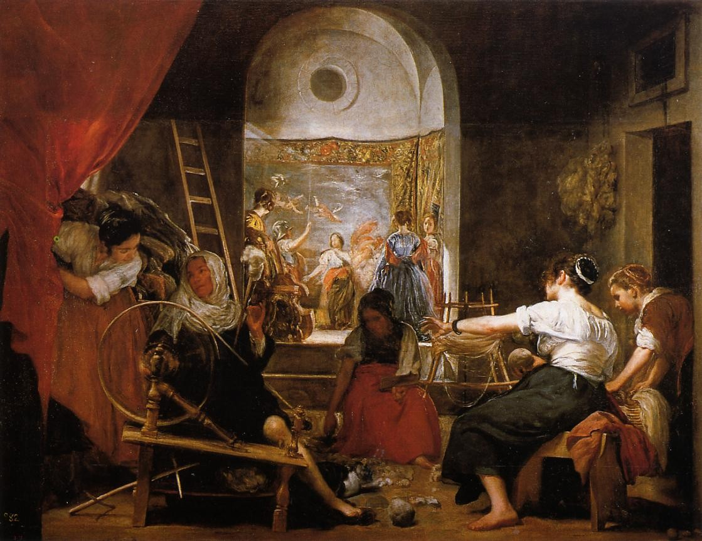
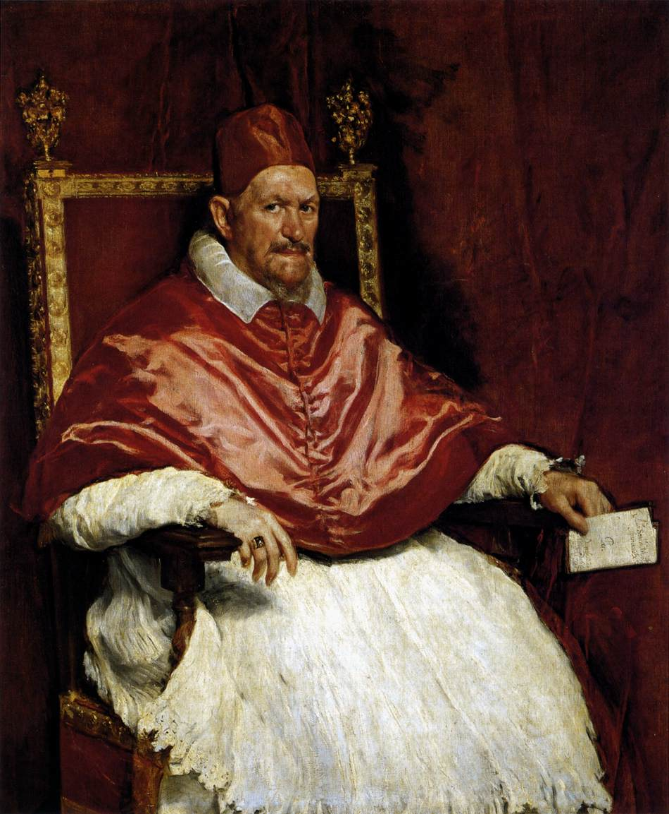

# Leçon 17 | 11 Mai 1966

<!-- source-url: http://staferla.free.fr/S13/S13 L'OBJET.docx -->
<!-- seminar: s13 -->
<!-- lesson: 17 -->

<!-- id: s13-17-0001 -->

Pour ce qui est du savoir, il est difficile de ne pas tenir compte de l’existence du savant - « *savant* » ici pris seulement comme le support de l’hypothèse du savoir en général - sans y mettre forcément la connotation de *scientifique*.

<!-- id: s13-17-0002 -->

Le savant sait quelque chose ou bien il ne sait rien, dans les deux cas, il sait qu’il est un savant.

<!-- id: s13-17-0003 -->

Cette remarque est seulement faite pour vous pointer ce problème *préparé* depuis longtemps et je dirai même, présentifié depuis, non pas seulement que j’enseigne, depuis que j’ai poussé mes premières remarques sur ce que nous rappelle de fondamental l’analyse et qui est centré autour de la fonction du *narcissisme* ou du stade du miroir.

<!-- id: s13-17-0004 -->

Disons pour aller vite, puisque nous avons commencé en retard, que *le statut du sujet* au sens le plus large, au sens non encore débroussaillé, non pas au sens où je suis en train d’essayer d’en serrer pour vous la structure, ce qu’on appelle le sujet en général veut simplement dire, dans le cas que je viens de dire : il y a du savoir *donc* il y a un savant.

<!-- id: s13-17-0005 -->

Le fait de savoir qu’on est un savant ne peut pas ne pas s’intriquer profondément dans la structure de ce savoir.

<!-- id: s13-17-0006 -->

Pour y aller carrément disons que le professeur, puisque le professeur a beaucoup affaire avec le savoir, pour transmettre le savoir, il lui faut charrier une certaine quantité de savoir qu’il a été prendre soit dans son expérience, soit dans une accumulation de savoir faite ailleurs et qui s’appelle par exemple dans tel ou tel domaine, *la philosophie par exemple, la tradition*.

<!-- id: s13-17-0007 -->

Il est clair que nous ne saurions négliger que la préservation du statut particulier de ce savant - j’ai évoqué le professeur mais il y en a bien d’autres statuts, celui du médecin par exemple - que la préservation de son statut est de nature à infléchir, à incliner ce qui, pour lui, lui paraîtra le statut général de son savoir. Le contenu de ce savoir, le progrès de ce savoir, la pointe de son extension, ne sauraient ne pas être influencés par la protection nécessaire de son statut de sujet savant.

<!-- id: s13-17-0008 -->

Ceci me semble assez évident si l’on songe que nous en avons devant nous la matérialisation taxable par les consécrations sociales de ce statut qui font qu’un monsieur n’est pas considéré comme « *savant* » uniquement dans la mesure où *il sait* et où il continue de fonctionner comme savant, les considérations de rendement viennent là, de loin, derrière celles du maintien d’un statut permanent à celui qui a accédé à une fonction savante. Ceci n’est pas injustifié et dans l’ensemble arrange tout le monde, tout le monde *s’en accommode* fort bien, chacun a sa place : le savant « *savante* » dans des endroits désignés, et on ne va pas regarder de si près si son *savantement* à partir d’un certain moment se répète, se rouille, ou même devient pur semblant de *savanterie*.

<!-- id: s13-17-0009 -->

Mais comme beaucoup de cristallisations sociales, nous ne devons pas nous arrêter simplement à ce qu’est la pure exigence sociale, ce qu’on appelle habituellement les fonctions de groupe et comment un certain groupe prend un statut plus ou moins *privilégié* pour des raisons qui sont en fin de compte toujours à faire remonter à quelque origine *historique*.

<!-- id: s13-17-0010 -->

Il y a bien là quelque chose de structural et qui, *comme le structural nous force souvent de le remarquer,* dépasse de beaucoup la simple *interrelation d’utilité*.

<!-- id: s13-17-0011 -->

On peut considérer que du point de vue du rendement, il y aurait avantage à faire le statut du savant moins stable.

<!-- id: s13-17-0012 -->

Mais il faut croire justement qu’il y a dans les mirages du sujet, et non dans la structure du sujet lui-même, quelque chose qui aboutit à ces structures stables, qui les nécessite. Si la psychanalyse nous force à remettre en question le statut du sujet, c’est sans doute parce qu’elle aborde ce problème - problème de ce qu’est un sujet - d’un autre départ :

<!-- id: s13-17-0013 -->

- si pendant de longues années j’ai pu montrer que l’introduction de cette expérience de l’analyse dans un champ qui ne saurait se repérer que de conjoindre une certaine mise en question du *savoir* au nom de *la vérité*,

<!-- id: s13-17-0014 -->

- si la scansion de ce champ va se chercher en un point plus radical, en un point antérieur à cette *rencontre*, à cette *rencontre* d’*une vérité* qui se pose et se propose comme *étrangère au savoir*, nous l’avons dit, …ceci s’introduit du premier biais de demande, qui d’abord dans une perspective qui se réduit ensuite, se propose comme plus primitif, comme plus archaïque et qui nécessite d’interroger comment s’ordonnent dans leur structure, cette demande avec quelque chose dont elle discorde et qui s’appelle *le désir*.

<!-- id: s13-17-0015 -->

C’est ainsi que par ce biais en quelque sorte, dans ce clivage structural nous sommes arrivés à remettre en question ce statut, du sujet, à considérer que loin que *le sujet* nous paraisse un point-pivot, une sorte d’axe autour de quoi tourneraient - quels que soient les rythmes, la pulsation, que nous accordions à ce qui tourne - autour de quoi tourneraient les expansions et les retraits du savoir, nous ne pouvons considérer le drame qui se joue, qui fonde l’essence du sujet tel que nous le donne l’expérience psychanalytique, en introduisant le biais du désir au cœur même de la fonction du savoir, *nous ne pouvons le faire sur le fondement de statut de la personne qui*, en fin de compte, est ce qui a dominé jusque là, la vue philosophique qui a été prise du rapport de l’homme à ce qu’on appelle *le monde,* sous la forme d’un certain *savoir*.

<!-- id: s13-17-0016 -->

Le sujet nous apparaît fondamentalement divisé, en ce sens qu’à interroger ce sujet au point le plus radical, à savoir s’il sait ou non quelque chose, c’est là le doute cartésien, nous voyons ce qui est l’essentiel dans cette expérience du *cogito *: l’être de ce sujet - au moment qu’il est interrogé - fuir en quelque sorte, diverger sous la forme de *deux rayons d’être qui ne coïncident que sous une forme illusoire à l’être* qui trouva sa certitude de se manifester comme être au sein de cette interrogation.

<!-- id: s13-17-0017 -->

*Je pense*… *Pensant, je suis. Mais je suis ce qui pense, et penser « je suis » n’est pas la même chose que d’être ce qui pense.* Point non remarqué mais qui prend tout son poids, toute sa valeur, de se recouper dans l’expérience analytique de ceci : que *celui qui est ce qui pense, pense d’une façon dont n’est pas averti celui qui pense : « je suis »*. C’est là le sujet qu’est chargé de *représenter* celui qui, dirigeant l’expérience analytique, s’appelant le psychanalyste, voit se re-poser pour lui ce qu’il en est de la question du savant.

<!-- id: s13-17-0018 -->

Le rapport du psychanalyste à la question de son statut reprend ici sous une forme d’une acuité décuplée celle qui est posée depuis toujours concernant le statut de celui qui détient le savoir. Et le problème de la formation du psychanalyste n’est vraiment rien d’autre que - par une expérience privilégiée - de permettre que vienne au monde, si je puis dire, des sujets pour qui cette division du sujet ne soit pas seulement quelque chose qu’ils savent mais quelque chose *en quoi* ils pensent.

<!-- id: s13-17-0019 -->

Il s’agit que viennent au monde *quelques uns* qui sauraient découvrir ce qu’ils expérimentent dans l’expérience analytique, à partir de cette position maintenue : *que jamais ils ne soient en état de méconnaître* qu’au moment de savoir, comme analystes, ils sont dans une position divisée. Rien n’est plus difficile que de maintenir dans une position d’être ce qui, assurément pour chacun, s’il mérite le titre d’analyste, a été à quelque moment dans l’expérience, éprouvé.

<!-- id: s13-17-0020 -->

Et voilà : à partir du moment où le statut *est instauré* de celui qui est *supposé savoir* dans la perspective analytique, *tous les prestiges de la méconnaissance spéculaire* renaissent, qui ne peuvent que *réunifier* ce statut du sujet, à savoir laisser tomber, élider l’autre partie qui est celle dont pourtant ça devrait être l’effet de cette expérience unique, ce devrait être l’effet séparatif par rapport à l’ensemble du troupeau, que certains non seulement le sachent mais soient, soient au moment d’aborder toute expérience de l’ordre de la leur, soient conformes ou au moins pressentent ce qu’il en est de cette structure divisée.

<!-- id: s13-17-0021 -->

Ce n’est pas autre chose que le sens de mon enseignement de rappeler cette exigence, quand assurément c’est ailleurs que sont les moyens d’y introduire...

<!-- id: s13-17-0022 -->

mais que de par une structure, je le répète : qui de beaucoup dépasse son conditionnement social ...quelque chose…

<!-- id: s13-17-0023 -->

> quelle que soit l’expérience, du seul fait du fonctionnement où chacun s’identifie
>
> à un certain statut nommable, dans l’occasion celui d’être le savant …qui tend à faire « *rentrer dans l’ordre* » l’essentiel de la *schize* par laquelle seule pourtant peut s’ouvrir un accès à l’expérience qui soit au niveau propre de cette expérience.

<!-- id: s13-17-0024 -->

C’est en tant que *sujet divisé* que l’analyste est appelé à répondre à la demande de celui qui entre avec lui dans une expérience de sujet. C’est pourquoi ce n’est pas *pur raffinement, ornement de détail, peinture* d’un secteur particulier de notre expérience, qui illustrerait en quelque sorte ce qu’il convient d’ajouter d’information à ce que nous pouvons connaître par exemple de *la pulsion scopique* que la dernière fois j’ai été amené à développer devant vous des fonctions de la notion de *la perspective*.

<!-- id: s13-17-0025 -->

C’est dans la mesure - au contraire - où il s’agit pour vous d’illustrer ce qui peut soutenir de son appareil, ce autour de quoi il s’agit que la subjectivité de l’analyste se repère, et se repérant n’oublie jamais, même au moment où *le second point de fuite*, si je puis dire, de sa pensée, tend à être oublié, élidé, laissé de côté, du moins dans la force de quelque schème, se voit rappeler à lui-même qu’il doit chercher où fonctionne cet autre point de fuite : au moment même, à l’endroit même où il tend à formuler quelque *vérité* qui de par son expression même, s’il n’y prend garde, se trouvera retomber dans *les vieux schèmes unitaires du* *sujet de la connaissance* et l’incitera, par exemple, à mettre au premier plan telle idée de totalité qui est à proprement parler ce dont il doit le plus se méfier *dans la synthèse de son expérience*.

<!-- id: s13-17-0026 -->

La dernière fois, essayant pour vous, par des voies abrégées, de présentifier ce que peut nous apporter ce que nous enseigne *l’expérience de la perspective*, encore que ces voies je les ai choisies aussi praticables que je l’ai pu, assurément j’ai eu le sentiment de n’avoir pas toujours réussi à concentrer, sinon toute *l’attention*, du moins à avoir toujours réussi à la récompenser.

<!-- id: s13-17-0027 -->

Faute peut-être de quelque schéma, et pourtant c’était bien ce que j’entendais repousser, reculer, pour éviter quelque malentendu.

<!-- id: s13-17-0028 -->

Je vais pourtant aujourd’hui le faire, le résumer et dire ce qui, dans cette expérience de la perspective, pour nous, à proprement parler peut illustrer ce dont il s’agit, à savoir *le rapport de la division du sujet à ce qui spécifie*, dans l’expérience analytique, *la relation proprement visuelle au monde, à savoir un certain objet(a).*

<!-- id: s13-17-0029 -->

Cet *objet(a)* que jusqu’ici, et d’une façon approchée et qui n’a d’ailleurs pas à être reprise, j’ai distingué du champ de la vision comme étant la fonction du *regard*, comment ceci peut-il s’organiser dans l’expérience, l’expérience structurale,

<!-- id: s13-17-0030 -->

- pour autant qu’elle instaure un certain type de pensée dans la géométrie,

<!-- id: s13-17-0031 -->

- pour autant qu’elle est rendue sensible dans tout le fonctionnement de l’art, et spécialement dans la peinture.

<!-- id: s13-17-0032 -->

J’ai fait la dernière fois, verbalement, une construction qu’il est facile de retrouver telle quelle dans un ouvrage de perspective. Ce n’est pas de celui-là qu’il s’agit - on me l’a apporté à l’instant - c’est l’ouvrage par exemple, ou plutôt le recueil des articles d’Erwin PANOFSKY[^169] sur la perspective. Il y en a une édition en allemand qui est d’ailleurs… où les articles, je le vois, se groupent différemment de cette édition italienne.

<!-- id: s13-17-0033 -->

J’ai rappelé que, dans le rapport dit projectif, qui s’établit du plan de ce qu’on peut appeler le tableau, au plan de ce que \- pour être simple aujourd’hui - nous appellerons le sol perspectif, il y a des correspondances linéaires fondamentales qui s’établissent et qui impliquent des éléments, à proprement parler non intuitivables, et qui sont pourtant des éléments fondamentaux de ce qu’on peut appeler l’espace, ou l’étendue projectifs.

<!-- id: s13-17-0034 -->

Une géométrie cohérente, instaurant une parfaite rigueur démonstrative, qui n’a rien de commun avec *la géométrie métrique*, s’établit à condition d’admettre que ce qui se passe dans ce que j’ai appelé aujourd’hui « *le sol perspectif* », pour remplacer un terme - *je me suis rendu compte* - plus difficile à maintenir dans l’esprit, que celui-là que j’avais employé la dernière fois, la correspondance des lignes tracées donc sur le sol perspectif avec les lignes traçables sur le tableau, implique qu’une ligne à l’infini sur *le sol perspectif* se traduise par la ligne d’horizon sur le tableau.

<!-- id: s13-17-0035 -->

Ceci est le premier pas de toute construction perspective. Je vais le schématiser de la façon suivante :

<!-- id: s13-17-0036 -->

<!-- id: s13-17-0037 -->

Supposez que :

<!-- id: s13-17-0038 -->

- ce soit ici \[Q\] le sol perspectif,

<!-- id: s13-17-0039 -->

- je vous laisse de profil le tableau \[P\],

<!-- id: s13-17-0040 -->

- je mets ici ce dont je n’ai pas encore parlé : le point œil \[S\] du sujet.

<!-- id: s13-17-0041 -->

J’ai suffisamment indiqué la dernière fois ce dont il s’agissait pour que vous compreniez maintenant le sens du tracé que je vais faire. Je vous ai dit, indépendamment de quoi que ce soit à quoi vous ayez à vous référer dans l’expérience, et nommément pas l’horizon tel qu’il est effectivement expérimenté sur notre boule, en tant qu’elle est ronde, un plan infini suppose que de ce point d’œil, il soit en \[I\], posant un plan parallèle au sol perspectif, que vous déterminiez la ligne d’horizon \[h\] sur le tableau selon la ligne où ce plan parallèle coupe le plan du tableau.

<!-- id: s13-17-0042 -->

L’expérience du tableau et de la peinture nous dit que n’importe quel point de cette ligne d’horizon est tel que les lignes qui y concourent correspondent à des lignes parallèles quelles qu’elles soient, sur le sol perspectif. Nous pouvons donc choisir n’importe quel point de cette ligne d’horizon comme centre de la perspective. C’est ce qui se fait en effet dans tout tableau soumis aux lois de la perspective. Ce point est proprement ce qui dans le tableau, ne répond pas seulement, vous le voyez, au sol à mettre en perspective, mais à la position du point qui comme tel dans la figure, représente l’œil : c’est en fonction de l’œil de celui qui regarde que l’horizon s’établit dans un plan-tableau.

<!-- id: s13-17-0043 -->

À ceci, vous ai-je dit la dernière fois, tous ceux qui ont étudié la perspective, ajoutent ce qu’ils appellent *l’autre œil*, à savoir l’incidence dans la perspective de la distance \[δ\] de ce point S au plan du tableau. Or, aussi bien *en fait,* que dans l’usage qu’on en fait dans n’importe quel tableau, cette distance est arbitraire, au choix de celui qui fait le tableau.

<!-- id: s13-17-0044 -->

Je veux dire qu’elle est au choix à l’intérieur du tableau-même.

<!-- id: s13-17-0045 -->

Est-ce à dire que du point de vue de *la structure du sujet*…

<!-- id: s13-17-0046 -->

> en tant que le sujet : est le sujet du regard, est le sujet d’un monde vu, c’est ce qui va nous intéresser …est-ce à dire que nous pouvons négliger cette partie du sujet, qu’elle ne nous apparaisse qu’en une fonction d’artifice, qu’alors que la ligne d’horizon est structurale, le fait que le choix de la distance librement est laissé à mon choix, de moi qui regarde, je puisse dire qu’il n’y a là qu’artifice de l’artiste, que c’est à la distance où je me mets mentalement de tel ou tel plan, que je choisis dans la profondeur du tableau, que ceci soit donc en quelque sorte caduc et secondaire et non pas structural ?

<!-- id: s13-17-0047 -->

Je dis : c’est structural, et jamais personne jusqu’ici ne l’a suffisamment remarqué.

<!-- id: s13-17-0048 -->

Ce second point, dans la perspective, se définit de la remarque que quelle que soit *la distance* du sujet provisoire…

<!-- id: s13-17-0049 -->

> du sujet S qui est justement ce que nous avons à mettre en suspens et voir comment il rentre dans le tableau …que quelle que soit *la distance* de ce sujet au tableau :

<!-- id: s13-17-0050 -->

- il y a quelque chose qui est simplement « *l’entre lui  et le tableau* », ce qui le sépare du tableau, et que ceci n’est pas simplement quelque chose qui se notera de *la valeur métrique* de cette *distance*,

<!-- id: s13-17-0051 -->

- que cette *distance* en elle-même s’inscrit quelque part dans la structure, et que c’est là que nous devons trouver, non pas l’autre œil comme disent les auteurs de « perspective » entre guillemets, mais l’autre sujet.

<!-- id: s13-17-0052 -->

Et ceci se démontre de la façon dont je l’ai fait la dernière fois et qui, pour certains n’a pas été comprise, et qui se fonde sur la remarque que premièrement si nous faisons passer par le point S, un plan \[S\], parallèle non plus cette fois au plan perspectif mais au tableau, *il en résulte deux choses*.

<!-- id: s13-17-0053 -->

<!-- id: s13-17-0054 -->

D’abord que ceci nous incite à remarquer qu’il existe une ligne \[λ\] d’intersection du tableau avec le plan, « *sol perspectif* » dont le nom est connu, qui s’appelle - si j’en crois le livre de PANOWSKY - qui s’appelle « *la ligne fondamentale* ».

<!-- id: s13-17-0055 -->

Je ne l’ai pas appelée ainsi la dernière fois et c’est cette ligne-là.

<!-- id: s13-17-0056 -->

Le plan \[S\] parallèle au tableau qui passe par le point S coupe le plan du sol perspectif en une ligne \[b\] parallèle à la première .

<!-- id: s13-17-0057 -->

De la représentation de ces *deux lignes* sur le tableau, ce que j’appelais la dernière fois le plan-figure, va se déduire ce que nous appellerons *le second point sujet*. En effet dans la relation triple : point-sujet \[S\], plan-tableau \[P\], sol perspectif \[Q\], nous avons vu qu’à la ligne infinie sur le sol perspectif \[q *∞*\] - là je pense avoir assez indiqué la dernière fois ce que cette ligne infinie veut dire - à la ligne infinie du sol perspectif correspond la ligne horizon sur le plan-tableau.

<!-- id: s13-17-0058 -->

Dans le même groupe de trois vous pouvez - *si vous y regardez de près* - vous apercevoir que la ligne ici définie, appelons-la ligne b, celle de la parallèle à la ligne fondamentale, a la même fonction par rapport à la ligne infinie du plan du tableau \[p – *∞*\] que l’horizon dans le plan-tableau a par rapport à la ligne infinie dans le sol perspectif.

<!-- id: s13-17-0059 -->

<!-- id: s13-17-0060 -->

Elle est donc représentée dans la figure par cette ligne infinie, bien sûr dans le tableau, et d’autre part comme la ligne fondamentale est déjà dans le tableau, l’autre point-sujet \[S’\] - alors que le premier se définissait ainsi : n’importe quel point dans la ligne d’horizon - l’autre point-sujet \[S’\] peut s’écrire ainsi : le point d’intersection de la ligne infinie du plan tableau avec la ligne fondamentale. Vous voyez là que j’ai représenté d’une façon qui n’est que figurée, qui est insuffisante, la ligne infinie par un cercle puisqu’en somme pour *l’intuition*, elle est cette ligne qui est toujours, de tous les côtés à l’infini sur un plan quelconque. Intuitivement, nous la représentons par un cercle mais elle n’est pas un cercle. Le prouvent tout son maniement et les correspondances ligne par ligne, point par point qui constituent l’essentiel de cette géométrie projective.

<!-- id: s13-17-0061 -->

L’apparent double point de rencontre qu’elle a avec la ligne fondamentale n’est qu’une pure apparence puisqu’elle est une ligne, une ligne à considérer comme ligne droite comme toutes les autres lignes, et que deux lignes droites ne sauraient avoir qu’un seul point d’intersection.

<!-- id: s13-17-0062 -->

<!-- id: s13-17-0063 -->

Ce ne sont pas là choses que je vous demande d’*admettre* au nom d’une construction qui serait mienne.

<!-- id: s13-17-0064 -->

*Je ne peux pas, pour vous,* *pousser la porte de* *la géométrie projective*, et nommément pas pour ceux qui n’en ont pas encore la pratique.

<!-- id: s13-17-0065 -->

Mais il est très simple pour quiconque de s’y reporter et voir qu’il n’y a rien à reprendre dans ce que j’avance ici, à savoir qu’il en résulte que nous avons deux point-sujet - dans toute structure d’un monde projectif ou d’un monde perspectif - deux point-sujet :

<!-- id: s13-17-0066 -->

- l’un \[O\] qui est un point quelconque sur la ligne d’horizon, dans le plan de la figure,

<!-- id: s13-17-0067 -->

- l’autre qui est à l’intersection d’une autre ligne parallèle à la première, qui s’appelle la ligne fondamentale \[λ\], qui exprime un rapport du plan figure au sol projectif avec *la ligne à l’infini*, dans le plan-figure \[p–*∞*\].

<!-- id: s13-17-0068 -->

Ceci mérite d’être pointé par le chemin où c’est venu, où nous avons pu l’établir.

<!-- id: s13-17-0069 -->

Mais une fois établi par cette voie, dont vous verrez par la suite qu’elle n’est pas sans - pour nous - constituer une trace importante chaque fois que nous aurons à repérer cet autre point-sujet, je pense pour vous dire maintenant que si, dans le plan-figure, nous traçons la ligne d’horizon qui est parallèle à cette ligne fondamentale, nous devons en déduire que la ligne d’horizon coupe cette ligne infinie *exactement au même point où la coupe la ligne fondamentale* puisque c’est une ligne parallèle à la première. D’où vous verrez se simplifier beaucoup le rapport de ces deux points :

<!-- id: s13-17-0070 -->

- l’un est un point quelconque sur la ligne d’horizon,

<!-- id: s13-17-0071 -->

- l’autre est le point à l’infini en ceci que le point à l’infini n’est pas un point quelconque, qu’il est un point unique malgré que là, il ait l’air d’être deux.

<!-- id: s13-17-0072 -->

C’est ceci qui sera pour nous, quand il s’agira de mettre en valeur la relation du sujet dans le fantasme et nommément la relation du sujet à *l’objet(a)*, ceci aura pour nous valeur d’appui et mérite que vous ayez passé le temps nécessaire, pas plus, pas plus que dans les démonstrations de DESCARTES. Une démonstration une fois saisie est démontrée, encore faut-il en tenir la rigueur et les procès. Ceci est ce qui doit nous servir, nous servir de référence chaque fois que nous avons à opérer quant au fantasme scopique.

<!-- id: s13-17-0073 -->

Ce sujet divisé est soutenu par une monture commune : *l’objet(a),* qui dans ce schéma est à chercher où ? Il est à chercher en un point où bien entendu il *tombe* et *s’évanouit*, sans ça ce ne serait pas *l’objet(a)*. *L’objet(a)* est ici représenté par ce quelque chose qui, justement, dans la figure - qu’ici, j’espère vous en avoir montré avec ce succès, de vous en rendre quelque chose sensible - *l’objet(a)* c’est ce qui supporte ce point S, ce que j’ai ici figuré par la menée de ce plan parallèle.

<!-- id: s13-17-0074 -->

Ce qui y est *élidé* et ce qui pourtant y est toujours, c’est ce que sous plus d’une forme, j’ai déjà introduit dans *le rapport structural du sujet au monde* : c’est *la fenêtre*. Dans le rapport scopique de ce sujet au point S d’où part toute la construction, apparaît spécifié, individualisé dans ce mur, si je puis m’exprimer ainsi, que représente ce plan parallèle en tant qu’il va déterminer le second point du sujet, dans ce mur il faut qu’il y ait une ouverture, une fente, une vue, un regard.

<!-- id: s13-17-0075 -->

C’est cela précisément, qui ne saurait être vu de la position initiale de la construction.

<!-- id: s13-17-0076 -->

<!-- id: s13-17-0077 -->

Nous avons déjà vu cette fonction de *la fenêtre*, l’année dernière[^170] nous rendre des services en tant que surface de ce qui peut s’écrire de plus *premier* comme fonction de signifiant. Appelons-là du nom qu’elle mérite, elle est, précisément dans cette structure fermée qui est celle qui nous permettrait de nouer les uns avec les autres tous ces différents plans que nous venons de tracer et reproduire la structure du plan projectif sous sa forme purement topologique, à savoir *sous l’enveloppe du cross-cap,* elle est *ce quelque chose de troué* dans cette structure qui permet précisément que s’y introduise l’irruption d’où va dépendre, d’où va dépendre la production de la division du sujet, c’est-à-dire à proprement parler, ce que nous appelons *l’objet(a)*.

<!-- id: s13-17-0078 -->

C’est en tant que *la fenêtre*, dans le rapport du regard au monde vu, est toujours ce qui est élidé, que nous pouvons nous représenter la fonction de *l’objet(a)*. *La fenêtre* :

<!-- id: s13-17-0079 -->

- c’est à dire aussi bien la fente des paupières,

<!-- id: s13-17-0080 -->

- c’est à dire aussi bien l’entrée de la pupille,

<!-- id: s13-17-0081 -->

- c’est à dire aussi bien ce qui constitue cet objet le plus primitif de tout ce qui est de la vision : la chambre noire.

<!-- id: s13-17-0082 -->

Or c’est ceci que j’entends aujourd’hui vous *illustrer*, vous illustrer par une œuvre dont je vous ai dit qu’elle avait été mise au premier plan dans telle production récente d’un investigateur dont le type de recherches n’est certainement pas très éloigné de celui dont ici - au nom de *l’expérience psychanalytique* - je prends la charge, encore que n’ayant pas la même base ni la même inspiration, j’ai nommé : Michel FOUCAULT et ce tableau de VELÀZQUEZ qui s’appelle *[Les Ménines](#LesMenines)* [^171].

<!-- id: s13-17-0083 -->

Ce tableau, je vais le faire maintenant - fermez la fenêtre - maintenant projeter devant vous pour que nous y voyons d’une façon sensible ce que permet une lecture de quelque chose qui n’est nullement en quelque sorte fait pour répondre à la structure de ce tableau même, mais dont vous allez voir ce qu’il nous permet... *Qu’est-ce qui se passe ?*

<!-- id: s13-17-0084 -->

<!-- id: s13-17-0085 -->

Il s’agit là d’une diapositive qui m’a été prêtée par le Louvre, que je n’ai pas pu expérimenter avant, et qui vraiment ne donnera là que le plus faible support, mais qui pour ceux qui ont vu soit quelque photographie de ce tableau dit des *Ménines*, soit simplement qui s’en souviennent un peu, nous servira un peu de repère.

<!-- id: s13-17-0086 -->

*Vous n’avez pas un petit bâtonnet, quelque chose pour que je puisse montrer les choses ? Ce n’est pas beaucoup, mais enfin c’est mieux que rien. Voilà. Alors, peut-être pourriez-vous, vous voyez quand même un peu, enfin, le minimum. Est-ce que, quand on est là-bas dans le fond, on voit quelque chose ?*

<!-- id: s13-17-0087 -->

*Melle X - Aussi bien que devant. Monsieur Milner a essayé.*

<!-- id: s13-17-0088 -->

Remarquez que ce n’est pas tellement défavorable, n’est ce pas… Ici, vous avez la figure du peintre.

<!-- id: s13-17-0089 -->

Vous allez la substituer tout de suite pour que, tout de même, on voit qu’il est bien là. Alors, mettez au point.

<!-- id: s13-17-0090 -->

*X – C’est tout, je ne peux pas davantage.*

<!-- id: s13-17-0091 -->

Oui... remettez la première. Le peintre est au milieu de ce qu’il peint. Et ce qu’il peint vous le voyez réparti sur cette toile, d’une façon sur laquelle nous allons revenir. Ici, ce trait que vous voyez est la limite, le bord externe - touché de lumière c’est pour ça qu’il émerge - de quelque chose qui va de là, très exactement jusqu’à un point qui se trouve ici, vous voyez presque toute la hauteur du tableau, et qui nous représente - vous voyez ici un montant de chevalet - un tableau vu à l’envers.

<!-- id: s13-17-0092 -->

Il est sur cette toile. Il œuvre ce tableau et ce tableau est retourné - *Vous avez quoi à dire ? -* ceci est le plan essentiel d’où nous devons partir, et qu’à mon avis Michel FOUCAULT -que je vous ai tous prié de lire - dans son très remarquable texte, a éludé. C’est en effet le point autour de quoi il importe de faire tourner toute la valeur, *toute la fonction de ce tableau*.

<!-- id: s13-17-0093 -->

Je dirais que ce tableau est effectivement une sorte de carte retournée, et dont nous ne pouvons pas ne pas tenir compte qu’il est comme une carte retournée, qu’il prend sa valeur d’être du module et du modèle des autres cartes.

<!-- id: s13-17-0094 -->

Cette carte retournée, elle est là vraiment faite pour vous faire abattre les vôtres.

<!-- id: s13-17-0095 -->

Car en effet, il y a eu - je ne pourrais pas ne pas en faire mention - discussion, débat, sur ce qu’il en est de ce que le peintre, ici VELÀZQUEZ, est là - à une certaine distance du tableau, de ce tableau - en train de peindre.

<!-- id: s13-17-0096 -->

La façon dont vous répondrez à cette question, dont vous abattrez vos cartes, est en effet absolument essentielle à l’effet de ce tableau. Ceci implique cette dimension que ce tableau *subjugue*. Depuis qu’il existe, il est la base, le fondement de toutes sortes de débats. Cette subjugation a le plus grand rapport avec ce que j’appelle cette *subversion* - justement - *du sujet*, sur lequel j’ai insisté dans toute la première partie de mon discours aujourd’hui, et c’est précisément de s’y appuyer qu’il prend sa valeur. En fait, le rapport à l’œuvre d’art est toujours marqué de cette subversion. Nous semblons avoir admis avec le terme de sublimation quelque chose qui, en somme, n’est rien d’autre.

<!-- id: s13-17-0097 -->

Car si nous avons suffisamment approfondi le mécanisme de *la pulsion* pour voir que ce qui s’y passe, c’est un aller et retour du sujet au sujet, à condition de saisir que ce retour n’est pas *identique* à l’aller et que précisément le sujet, conformément à la structure de la *bande de Mœbius,* s’y *boucle à lui-même* après avoir accompli ce demi-tour, qui fait que, parti de son endroit, il revient à se coudre à son envers, en d’autres termes qu’il faut faire *deux tours pulsionnels* pour que quelque chose soit accompli qui nous permette de saisir ce qu’il en est authentiquement de la division du sujet.

<!-- id: s13-17-0098 -->

<!-- id: s13-17-0099 -->

C’est bien ce que va nous montrer ce tableau dont la valeur de capture tient au fait qu’il n’est pas simplement ce à quoi nous nous limitons toujours, *précisément parce que nous ne faisons qu’un tour*, et que peut-être en effet, pour la sorte d’artiste à qui nous avons affaire, c’est-à-dire ceux qui nous consultent, l’œuvre d’art est à usage interne : elle lui sert à faire sa propre boucle.

<!-- id: s13-17-0100 -->

Mais quand il s’agit d’un *Maître* tel que celui présent, il est clair que au moins ce qui reste de toute appréhension avec cette œuvre est que *celui qui la regarde y est bouclé*. Il n’y a pas de spectateur simplement, qui ne fasse autre chose que de passer devant à toute vitesse et *rendre ses devoirs au rite du musée,* qui ne soit saisi par la particularité de cette composition dont tous s’accordent à dire que quelque chose se passe en avant du tableau qui en fait quelque chose de tout à fait spécifique, à savoir - on s’exprime comme on peut - que nous sommes pris dans son espace.

<!-- id: s13-17-0101 -->

Et on se casse la tête à chercher par quelle astuce de construction, et de construction perspective ceci peut se produire.

<!-- id: s13-17-0102 -->

À partir de là on va plus loin, on spécule, sur ce qu’il en est de la fonction de chacun des personnages et des groupes et l’on ne voit pas que tout ceci fait une seule et même question. On procède généralement par cette voie qui est en effet la question qui va rester au cœur du problème et qui est celle à laquelle, à la fin, j’espère pouvoir donner la réponse.

<!-- id: s13-17-0103 -->

Qu’est-ce que le peintre fait ? Qu’est-ce qu’il peint ? Ce qui implique, et c’est le plus souvent puisqu’il s’agit de critique d’art, la force sous laquelle se pose la question : qu’a-t-il voulu faire ? Puisqu’en somme, bien sûr, personne ne prend à proprement parler au sérieux la question : que fait-il ? Le tableau est là, il est fini et nous ne nous demandons pas ce qu’il peint actuellement. Nous nous demandons : qu’est-ce qu’il a voulu faire ? Ou plus exactement quelle idée veut-il nous donner de ce qu’il est en train de peindre ?

<!-- id: s13-17-0104 -->

Point où déjà se voit marqué évidemment un rapport qui pour nous, est bien reconnaissable : ce que nous désirons, et désirons savoir, c’est à très proprement parler quelque chose qui est de l’ordre de ce qu’on appelle désir de l’Autre, puisque nous disons : qu’est-ce qu’il a voulu faire ?

<!-- id: s13-17-0105 -->

C’est certainement la position erronée à prendre car nous ne sommes pas en position d’analyser, je ne dirai pas la peinture, mais un tableau. Il est certain que ce qu’il a voulu faire, *le peintre*, il l’a fait puisque c’est là devant nos yeux, et que par conséquent cette question, en quelque sorte s’annule elle-même d’être en deçà du point où elle se pose, puisque nous la posons au nom de ce qu’il a déjà fait. En d’autres termes, dans le retour de boucle dont je parlais tout à l’heure, et c’est en ceci déjà que ce tableau nous introduit à la dialectique du sujet, il y a déjà un tour de fait et nous n’avons qu’à faire l’autre. Seulement, pour ça il ne faut pas manquer le premier.

<!-- id: s13-17-0106 -->

La présence du tableau qui occupe toute cette hauteur et qui du fait même de cette hauteur, nous incite à y reconnaître le tableau lui-même, qui nous est présenté par la voie - je le note, en quelque sorte en marge de notre progrès - qui passe par une autre voie que cette discussion, pour ceux qui ont avancé cette thèse - que je me permets de considérer comme futile - que c’est d’un autre tableau qu’il s’agit - vous le verrez tout à l’heure, nous le discuterons de plus près - à savoir le portrait du roi et de la reine, que vous ne pouvez vas pas voir bien sûr, sur cette figure, bien sûr tout à fait insuffisante que je vous ai apportée.

<!-- id: s13-17-0107 -->

<!-- id: s13-17-0108 -->

Ici dans le fond, et comme vous le savez j’espère dans l’ensemble, est présent dans un cadre dont nous aurons à discuter tout à l’heure de ce qu’il signifie, mais dont certains prennent le témoignage comme indiquant que le roi et la reine sont ici en avant du tableau et que c’est eux que le peintre peint : ceci est à mon avis réfutable.

<!-- id: s13-17-0109 -->

Je ne veux pour l’instant que remarquer que c’est sur ce fond, que je vous dis que la taille de la toile est déjà un argument qu’on peut apporter pour qu’il n’en soit pas ainsi et que cette toile représentée soit exactement, représente, le tableau que nous avons là, en tant qu’il est une toile supportée sur une monture de bois dont nous voyons là, ici, l’armature.

<!-- id: s13-17-0110 -->

Et qu’en d’autres termes, nous avons dans ce tableau la représentation de ce tableau comme réalité.

<!-- id: s13-17-0111 -->

Je peux bien là pousser cette petite porte qui fait qu’une fois de plus nous y trouvons le recoupement de ma formule qui fait là, de l’objet pictural, un *Vorstellungsrepräsentanz*. Non pas du tout que je dise que le tableau est représentation dont la monture, le support, serait le représentant. S’il fonctionne ici pour nous faire apercevoir ce qu’il y a là de vérité, c’est en ceci : qu’à nous mettre dans le tableau ce qui, chose curieuse, est là fait pour la première fois.

<!-- id: s13-17-0112 -->

Car il y a déjà eu des choses telles que *les miroirs dans le tableau*, même de nombreux à cette époque, *mais le tableau dans le tableau* - *ce qui n’est pas la scène dans la scène*, pas du tout, c’est quelque chose qui a été fait là, semble-t-il, pour la première fois et guère refait depuis, sauf au niveau du point où je vous l’ai repéré, à savoir dans [MAGRITTE](#MAGRITTE). Représentation, c’est bien en effet ce qu’est cette figure de la réalité du tableau, mais elle est là pour bien nous montrer que, au niveau de réalité et de représentation, ce qui est là tracé dans le tableau, et le tableau, mutuellement se saturent.

<!-- id: s13-17-0113 -->

Et que c’est là en quoi il nous est pointé que justement ce qui constitue le tableau dans son essence n’est pas *représentation*, car quel est l’effet de ce tableau dans le tableau : *Vorstellungrepräsentanz*.

<!-- id: s13-17-0114 -->

C’est très précisément que tout ces personnages, que vous voyez justement en tant qu’ils ne sont pas du tout des représentations, mais qu’ils sont *en représentation,* que tous ces personnages quels qu’ils soient, dans leurs statuts, tels qu’ils sont là effectivement dans la réalité, quoique morts depuis longtemps, mais qu’ils y sont toujours, sont des personnages qui se soutiennent en représentation et avec une conviction entière, ce qui veut dire précisément *que de ce qu’ils représentent, aucun d’entre eux ne se représente rien*.

<!-- id: s13-17-0115 -->

Et c’est cela l’effet de ce quelque chose qui, introduit dans l’espace du tableau, les noue, les cristallise, dans cette position d’être des personnages en représentation, des personnages de cour. À partir de là, que VELÀZQUEZ le peintre, aille se mettre au milieu d’eux, prend tout son sens. Mais bien entendu, il va beaucoup plus loin que cette simple touche, si l’en peut dire, de *relativisme social*. La structure du tableau permet d’aller bien au-delà.

<!-- id: s13-17-0116 -->

À la vérité, pour aller au-delà, il aurait fallu partir d’une question… non pas d’une question, mais d’un tout autre mouvement que ce mouvement de la question dont je vous ai dit qu’elle s’annulait du seul fait de la présence de l’œuvre elle-même, mais partir de ce qu’impose l’œuvre telle que nous la voyons là, à savoir que la même bouche d’enfance qui nous est suggérée par le personnage central, par cette petite infante…

<!-- id: s13-17-0117 -->

> qui est la seconde fille du couple royal : Philippe IV et Doña Mariana d’Autriche …la petite Doña Margherita, je peux dire cinquante fois peinte par VELÀZQUEZ, que nous nous laissions guider par ce personnage qui vient en quelque sorte à notre devant dans *cet espace* qui est pour nous le point d’interrogation.

<!-- id: s13-17-0118 -->

Et pour tous ceux qui ont vu ce tableau, qui ont parlé de ce tableau, qui ont écrit de ce tableau le point d’interrogation qu’il nous pose ce sont, poussés par sa bouche, *les cris* dirais-je, dont il convient de partir pour pouvoir faire ce que j’appellerai le second tour de ce tableau…

<!-- id: s13-17-0119 -->

> et c’est celui, me semble-t-il qui est manqué dans *l’analyse de l’œuvre dont je parlais tout à l’heure* \[Foucault\] …« *Fais voir* *ce qu’il y a derrière la toile* » telle que nous la voyons à l’envers, c’est un « *Fais voir !* » qu’il appelle et que nous sommes plus ou moins prêts à prononcer.

<!-- id: s13-17-0120 -->

Or, de ce seul « *Fais voir !* » peut surgir ce qui en effet à partir de là s’impose, *c’est-à-dire ce que nous voyons*, à savoir ces personnages tels que j’ai pu les qualifier pour être essentiellement des personnages en représentation.

<!-- id: s13-17-0121 -->

Mais nous ne voyons pas que cela, nous voyons *la structure du tableau*, son montage *perspectif*. C’est ici qu’assurément je peux regretter que nous n’ayons pas ici un support qui soit suffisant pour vous démontrer ces traits dans leur rigueur.

<!-- id: s13-17-0122 -->

Ici, le personnage que vous voyez s’encadrer dans une porte au fond de lumière est le point très précis où concourent les lignes de la perspective. C’est en un point à peu près situé selon les lignes qu’on trace entre la figure de ce personnage, car il y a de légères fluctuations du recoupement qui se produisent, et son coude que se situe le point de fuite, et ce n’est pas hasard si par ce *point de fuite*, c’est précisément ce personnage et un personnage qui sort.

<!-- id: s13-17-0123 -->

Ce personnage n’est pas n’importe lequel. Il s’appelle aussi VELÀZQUEZ : Nieto au lieu de s’appeler Diego-Rodriguez.

<!-- id: s13-17-0124 -->

Ce Nieto est celui qui a eu quelques voix au vote qui a fait accéder VELÀZQUEZ à la position *d’Aposentador du roi*, c’est-à-dire quelque chose comme *Chambellan ou Grand Maréchal.* C’est une sorte en somme de personnage qui le *redouble*, et ce personnage ici se désigne à nous de ce fait : parce que ce que nous ne voyons pas, et nous disons « *Fais voir !* », non seulement lui le voit de là où il est, mais qu’il l’a - *si je puis dire* - trop vu, il s’en va. Est-ce qu’il y a meilleur moyen de désigner cette pointe, quant à ce qui s’épanouit quant au sujet de la fonction de l’œil, que ceci qui s’exprime par un « vu » en quelque sorte, définitif ?

<!-- id: s13-17-0125 -->

Dès lors, la présence de VELÀZQUEZ lui-même dans cette position où vous l’avez vu tout à l’heure et la seconde photo n’étant pas meilleure que la première, vous n’avez pas pu voir ce que vous pourrez voir sur de meilleures reproductions et ce dont témoigneront mille auteurs qui en ont parlé, à savoir que ce personnage qui regarde - on le souligne - vers nous spectateurs - *Dieu sait si on a pu spéculer sur cette orientation du regard -* ce personnage a précisément le regard le moins tourné vers l’extérieur qui soit. Ceci n’est pas une analyse qui me soit personnelle. Maints auteurs - la grande majorité - l’ont remarqué.

<!-- id: s13-17-0126 -->

L’aspect en quelque sorte, rêveur, absent, tourné vers quelque *disegno interno*[^172]…

<!-- id: s13-17-0127 -->

> comme s’expriment les gongoristes, je veux dire toute la théorie du style baroque, maniériste,
>
> concettiste, tout ce que vous voudrez, et dont GONGORA est l’exemple, est la fleur. …*disegno interno* ce quelque chose à quoi se réfère le discours maniériste et qui est proprement ce que j’appelle que dans ce discours il n’y a pas de métaphore, que la métaphore y entre comme une composante réelle : cette présence de VELÀZQUEZ dans sa toile, sa figure portant en quelque sorte le signe et le support qu’il y est là, à la fois comme la composante et comme élément d’elle, c’est là le point structural, représenté, par où il nous est désigné, ce qu’il peut en être, par quelle voie peut se faire qu’apparaisse dans la toile même, celui qui la supporte en tant que sujet regardant.

<!-- id: s13-17-0128 -->

Eh bien, il est quelque chose de tout à fait frappant et dont la valeur ne peut, à mon avis, être repérée que de ce que je vous ai introduit dans cette structure topologique. Deux traits sont à mettre en valeur : *ce que ce regard regarde*, et dont chacun vous dit « *c’est nous, nous les spectateurs* ». Pourquoi nous en croire tant ? Sans doute il nous appelle à quelque chose puisque nous répondons ainsi que je vous l’ai dit. Mais ce que ce regard implique…

<!-- id: s13-17-0129 -->

- comme aussi bien *la présence du tableau retourné* dans le tableau,

<!-- id: s13-17-0130 -->

- comme aussi bien *cet espace qui frappe tous ceux qui regardent le tableau, comme étant en quelque sorte unique et singulier,* …c’est que ce tableau, s’étend jusqu’aux dimensions de ce que j’ai appelé *la fenêtre,* *et la désigne comme telle*.

<!-- id: s13-17-0131 -->

Ce fait que, dans un coin du tableau, par le tableau lui-même, en quelque sorte retourné sur lui-même pour y être représenté, soit créé cet espace en avant du tableau où nous sommes proprement désignés comme l’habitant comme tel, cette présentification de la fenêtre dans le regard de celui qui ne s’est pas mis par hasard, ni n’importe comment, à la place qu’il occupe : VELÀZQUEZ, c’est là le point de capture et l’action qu’exerce sur nous, spécifique, ce tableau.

<!-- id: s13-17-0132 -->

À cela, il y a un recoupement dans le tableau. Je ne peux que regretter une fois de plus de devoir vous renvoyer à des images, en général, d’ailleurs je dois dire, dans de nombreux volumes, toujours assez mauvaises : ou trop sombres ou trop claires.

<!-- id: s13-17-0133 -->

Ce tableau n’est pas facile à reproduire mais il est clair que *la distance du peintre au tableau*, dans le tableau où il est représenté est très suffisamment accentuée pour nous montrer *qu’il n’est justement pas à portée de l’atteindre et que là, il y a une intention*.

<!-- id: s13-17-0134 -->

À savoir que cette partie du groupe, ce qu’on a appelé ici *Las Méninas*, *Les Ménines*…

<!-- id: s13-17-0135 -->

- à savoir Doña Margherita,

<!-- id: s13-17-0136 -->

- avec Doña Maria Agostina de SARMIENTO qui est à genoux devant elle …sont en avant du peintre, alors que les autres, encore qu’ayant l’air, d’être sur un plan analogue, devant, sont plutôt en arrière, et que cette question de ce qu’il y a de cet espace entre le peintre et le tableau est non seulement là ce qui nous est présenté, mais qui se présentifie à nous par cette *trace* qu’il suffit de désigner pour reconnaître qu’ici, *une ligne de traversée* marque quelque chose qui n’est pas simplement division lumineuse, groupement de la toile, mais véritablement *sillage du passage* de cette présence fantasmatique du peintre en tant qu’il regarde.

<!-- id: s13-17-0137 -->

Si je vous dis que c’est quelque part au niveau de la recoupée de la ligne fondamentale avec le *sol perspectif* et en un point à l’infini que va le sujet regard, c’est bien également de ce point que VELÀZQUEZ a fait sous cette forme fantomale, qui spécifie cet *auto-portrait* parmi tous les autres, un des traits qui se distingue assurément du style du peintre.

<!-- id: s13-17-0138 -->

Il vous dirait lui-même : « *Croyez-vous qu’un autoportrait, c’est de cette goutte là, de cette huile-là, de ce pinceau-là, que je le peindrais ?* ».

<!-- id: s13-17-0139 -->

Vous n’avez qu’à vous reporter au portrait d’[INNOCENT X](#INNOCENTX) qui est à la Galerie PAMPHILJ, pour voir que le style n’est pas tout à fait le même.

<!-- id: s13-17-0140 -->

Ce fantôme du sujet regardant et rentré par cette trace qui est encore là sensible et dont je puis dire que tous les personnages portent la vibration, car dans ce tableau - où c’est devenu un cliché, un lieu commun, et je l’ai entendu articuler des bouches, je dois dire les plus non seulement autorisées mais les plus élevées dans la hiérarchie des créateurs - ce tableau dont on nous dit que c’est le tableau des regards qui se croisent et d’une sorte d’inter-vision comme si tous les personnages se caractérisaient de quelque relation avec chacun des autres : si vous regardez les choses de près, vous verrez qu’à part le regard de la *Ménine* Maria Agostina de SARMIENTO qui regarde Doña Margherita, aucun autre regard ne fixe rien.

<!-- id: s13-17-0141 -->

Tous ces regards sont perdus sur quelque point invisible comme qui dirait : « *un ange a passé* » précisément le peintre.

<!-- id: s13-17-0142 -->

L’autre *Ménine* qui s’appelle [Isabel DE VELASCO](#LesMenines) est là, en quelque sorte comme interdite, les bras comme, en quelque sorte écartés de la trace de ce passage. L’idiote, là, le monstre Mari-BARBOLA, la naine, regarde ailleurs et non pas du tout, comme on le dit, de notre côté. Quant au petit nain, il s’occupe ici à faire très précisément, à jouer très précisément le rôle qu’il est fait pour jouer en tant qu’imitation de petit garçon, il fait « *l’affreux jojo *» : *il donne un coup de pied* *sur le derrière du chien comme pour en quelque sorte lui dire «* *Tu roupilles, alors ! T’as pas reniflé la souris qui vient de passer* ».

<!-- id: s13-17-0143 -->

Regards, nous dirait-on, si on voulait encore le soutenir, mais observez que dans un tableau qui serait *un tableau* *du jeu des regards*, il n’y a pas, en tout cas même si nous devons retenir ce regard de l’une des *Ménines,* deux regards qui s’accrochent, de regards complices, de regards d’intelligence, de regards de quête. Doña Margharita, la petite fille, ne regarde pas la suivante qui la regarde. Tous les regards sont ailleurs. Et bien entendu, le regard - au fond - de celui qui s’en va, n’est plus qu’un regard qui veut dire «* *Je te quitte », loin qu’il soit pointé sur quiconque.

<!-- id: s13-17-0144 -->

Dès lors que peut vouloir dire ce qu’on amène au centre de la théorie de ce tableau quand on prétend que ce qui est là au premier plan, à notre place et Dieu sait si le spectateur peut se délecter d’un tel support, d’une telle hypothèse, ce sont *le roi et la reine* qui sont reflétés dans ce miroir qui devrait vous apparaître ici et qui est dans le fond ?

<!-- id: s13-17-0145 -->

À ceci j’objecterai : le peintre - où qu’il se montre dans ce tableau - où entend-il que nous le mettions ?

<!-- id: s13-17-0146 -->

Une des hypothèses, et une de celles qui ont le plus séduit parmi celles qui ont été avancées, c’est que, puisque le peintre est là et que c’est ceci qu’il a peint, c’est qu’il a dû, tout cela, le voir dans un miroir, un miroir qui est à notre place.

<!-- id: s13-17-0147 -->

Et nous voici transformés en miroir.

<!-- id: s13-17-0148 -->

La chose n’est pas sans séduction ni même sans comporter un certain appel à l’endroit de tout ce que je vous évoque comme relativité du sujet à l’Autre, à ceci près que - quand vous voudrez - c’est autour d’une telle expérience que je vous pointerai *la différence stricte qu’il y a entre un miroir et la fenêtre* : deux termes précisément qui structuralement n’ont aucun rapport. Mais tenons-nous en au tableau. Le peintre se serait peint ayant vu toute la scène des gens autour de lui dans un miroir.

<!-- id: s13-17-0149 -->

Je n’y vois qu’une objection, *c’est que rien ne nous indique*, des témoignages de l’histoire, et Dieu sait si ce sont là des nouvelles que l’histoire se charge de transmettre, rien ne nous indique que VELAZQUEZ fut gaucher*.*

<!-- id: s13-17-0150 -->

Or c’est bien ainsi que nous devrions le voir apparaître si nous prenons au sérieux le fait que, dans une peinture faite soi-disant à l’aide d’un miroir il se représente tel qu’il était bien en effet, à savoir tenant son pinceau de la main droite.

<!-- id: s13-17-0151 -->

Ceci pourrait vous paraître mince raison. Il n’en reste pas moins que s’il en était ainsi, cette théorie serait tout à fait incompatible avec la présence, ici, du roi et de la reine. Ou c’est le miroir qui est ici, ou c’est le roi et la reine.

<!-- id: s13-17-0152 -->

Si c’est le roi et la reine, ça ne peut pas être le peintre, si le peintre est ailleurs, si le roi et la reine sont là, *ça ne peut pas être le peintre* qui est là. Comme moi je suppose qu’il y était effectivement.

<!-- id: s13-17-0153 -->

Vous ne comprenez pas Monsieur CASTORIADIS ?

<!-- id: s13-17-0154 -->

*– Non !*

<!-- id: s13-17-0155 -->

Dans l’hypothèse que le roi et la reine, reflétés là-bas dans le miroir étaient ici pour se faire peindre par le peintre, comme je viens d’éliminer l’hypothèse que le peintre fût là autrement que par l’art de son pinceau il fallait bien que le peintre fût là.

<!-- id: s13-17-0156 -->

Et d’ailleurs, l’exigence que le peintre fût là et non pas de l’autre côté d’un miroir que nous serions nous-même, est dans le fait de supposer que roi et reine sont dans le miroir. En d’autres termes, à la même place nous ne pouvons pas mettre deux quelconques des personnages de ce *trio* qui sont : un miroir supposé, le roi et la reine, ou le peintre.

<!-- id: s13-17-0157 -->

Nous sommes toujours forcés, pour que ça tienne d’en mettre deux à la fois et ils ne peuvent pas être deux à la fois.

<!-- id: s13-17-0158 -->

Si le roi et la reine sont là pour être reflétés dans le fond dans le miroir…

<!-- id: s13-17-0159 -->

> or il est impossible qu’ils soient représentés comme étant là dans le miroir, ne serait-ce qu’en raison de l’échelle, de la taille où on les voit dans le miroir où ils ont à peu près la même échelle que le personnage qui est en train de sortir à côté d’eux. Alors qu’étant donnée la distance où nous sommes, ils devraient être exactement deux fois plus petits. Mais ceci n’est encore qu’un argument de plus …Si le roi et la reine sont là dans cette hypothèse, alors, le peintre est ici et nous nous trouvons devant la position avancée par les anecdotiers, par Madame de MOTTEVILLE[^173] par exemple, à savoir que le roi et la reine étaient ici et ils seraient debout - *encore plus !* - en train de se faire… de poser et auraient devant eux la rangée de tous ces personnages, dont vous pouvez voir quelle serait la fonction naturelle, si vraiment pendant ce temps-là VELÀZQUEZ était en train de peindre toute autre chose qu’eux et par dessus le marché, quelque chose qu’il ne voit pas puisqu’il voit tous ces personnages dans une position qui l’entoure.

<!-- id: s13-17-0160 -->

J’avance, à l’opposé de cette *impossibilité manifeste,* que ce qui est l’essentiel de ce qui est indiqué par ce tableau, c’est cette fonction de *la fenêtre*. Que le fait que la trace soit en quelque sorte marquée de ce par quoi le peintre peut y revenir est vraiment là ce qui nous montre en quoi c’est là, la place vide.

<!-- id: s13-17-0161 -->

Que ce soit en symétrie à cette place vide qu’apparaissent ceux, si je puis dire, dont non pas le regard mais la supposition qu’ils voient tout, qu’ils sont dans ce miroir exactement comme ils pourraient être derrière un grillage ou *une vitre sans tain*, et après tout, rien à la limite ne nous empêcherait de supposer qu’il ne s’agisse de quelque chose de semblable, à savoir de ce qu’on appelle « *connecté* », *en connexion* avec une grande pièce, un de ces endroits du type endroit pour épier, qu’ils soient là en effet, que le fait qu’ils voient tout, soit ce qui soutient ce monde d’être en représentation, qu’il y ait là quelque chose qui nous donne en quelque sorte le parallèle au « *Je pense donc je suis* » de DESCARTES : « *Je peins donc je suis* » dit VELÀZQUEZ, et je suis là qui vous laisse avec ce que j’ai fait pour votre éternelle interrogation.

<!-- id: s13-17-0162 -->

Et je suis aussi dans cet endroit d’où je peux revenir à la place que je vous laisse, qui est vraiment celle où se réalise cet effet de ce qu’il y ait chute et désarroi de quelque chose qui est au cœur du sujet. La multiplicité même des interprétations, leur - on peut dire - leur embarras, leur maladresse, est là, suffisamment faite pour le souligner.

<!-- id: s13-17-0163 -->

Mais à l’autre point qu’avons-nous ? *Cette présence du couple royal* jouant exactement le même rôle que le dieu de DESCARTES, à savoir que dans tout ce que nous voyons, rien ne trompe, à cette seule condition que le Dieu omniprésent, *<u>lui</u>, y soit trompé*. Et c’est là, la présence de ces êtres que vous voyez dans cette atmosphère brouillée si singulière du miroir. Si ce miroir est là, en quelque sorte l’équivalent de *quelque chose qui va s’évanouir au niveau du sujet* qui est là, comme en pendant de ce *petit (a)* de la fenêtre au premier plan, est-ce que ceci ne mérite pas que nous nous y arrêtions un peu plus ?

<!-- id: s13-17-0164 -->

Un peintre, une trentaine d’années plus tard qui s’appelait Luca GIORDANO, précisément un maniériste en peinture, et qui a gardé dans l’histoire l’étiquette de « *fa presto »* parce qu’il allait un peu vite, extraordinairement brillant d’ailleurs, ayant longuement contemplé cette image dont je ne vous ai pas fait l’histoire quant à la démonstration, a proféré une parole, une de ces paroles, mon Dieu comme on peut les attendre de quelqu’un qui était à la fois maniériste et fort intelligent : « *C’est la théologie de la peinture* » a-t-il dit.

<!-- id: s13-17-0165 -->

Et bien sûr, c’est bien à ce niveau théologique où le Dieu de DESCARTES est le support de *tout un monde en train de se transformer par l’intermédiaire du fantôme subjectival*, c’est bien par cet *intermédiaire* du couple royal qui nous apparaît scintillant dans ce cadre au fond que ce terme prend son sens. Mais je ne vous quitterai pas sans vous dire, quant à moi, ce que me suggère le fait qu’un peintre comme VELÀZQUEZ, ce qu’il peut avoir de visionnaire.

<!-- id: s13-17-0166 -->

Car qui parlera à son propos de réalisme ? Qui par exemple à propos des [*Hilanderas*](#LasHilandereas) osera dire que c’est là la peinture d’une rudesse populaire ? Elle l’est sans doute, qui veut simplement éterniser le *flash* qu’il aurait eu un jour en quittant a manufacture de tapisseries royales et en voyant les ouvrières au premier plan faire cadre à ce qui se produit au fond.

<!-- id: s13-17-0167 -->

<!-- id: s13-17-0168 -->

Je vous prie simplement de vous reporter à *cette peinture* - sur quelque chose qui vaille plus que ce que je vous ai montré là - pour voir combien peut être distante de tout *réalisme* - et d’ailleurs, *il n’y a pas de peintre réaliste*, mais visionnaire, assurément - et à mieux regarder *ce qui se passe au fond de cette scène*, dans ce miroir où ces personnages nous apparaissent clignotant et eux assurément distincts de ce que j’ai appelé tout à l’heure fantomal mais vraiment brillants, il m’est venu ceci : qu’en opposition, polairement à cette fenêtre où le peintre nous encadre, et comme en miroir il nous fait surgir ce qui pour nous sans doute, ne vient pas à n’importe quelle place, quant à ce qui se passe pour nous des rapports du sujet à *l’objet(a),* l’écran de télévision.

<!-- id: s13-17-0169 -->

[INNOCENT X](#R_INNOCENTX)

<!-- id: s13-17-0170 -->

<!-- id: s13-17-0171 -->

[*retour 11-05*](#retourLasHilandereas) [*retour 25-05*](#retourhilanderas2505)

<!-- id: s13-17-0172 -->

## Notes

[^169]: Erwin Panofsky : *La perspective comme forme symbolique et autres essais*, Paris, Minuit, 1976, Coll. Le sens commun.

[^170]: Séminaire 1964-65 : « *Problèmes cruciaux*... », séance du 23-06.

[^171]: Diego Velàzquez : *Las Meninas*, 1656, Madrid, Prado.

[^172]: *Libertas artibus restituta* : *la liberté rendue aux arts*. Ce mouvement, initié dès le début de la Renaissance, a vu progressivement se construire une théorie des arts visuels fondée sur une promotion de sa dimension « intellectuelle ». Pour que la peinture pût être considérée comme un art « libéral », digne d’être pratiquée et enseignée par les « gens libres », il lui fallait être arrachée du rang des métiers et des artisanats, qui supposaient un asservissement au corps et

    à son exercice, et rapprochée des disciplines de l’esprit. C’est ainsi que, dans son *Traité de peinture* posthume (1651), Léonard de Vinci affirme vouloir traiter de la peinture comme une *cosa mentale* et non plus seulement comme une activité manuelle. De nombreux auteurs, comme Zuccaro et Bellori, en Italie, ont présenté la peinture comme un « *art de l’esprit* », soumis au *disegno interno*, au dessein de l’artiste (par rapport au *designo externo*, le dessin, l’œuvre comme objet extérieur) – à sa capacité à forger en son esprit une image précise et complète de l’œuvre qu’il souhaite réaliser, et cela même avant de l’avoir exécutée.

[^173]: [Françoise Bertaut de Motteville](http://gallica.bnf.fr/Search?ArianeWireIndex=index&p=1&lang=FR&q=Fran%C3%A7oise+de+Motteville) : (1621-1689), Mémoires, Vol. 1 à 5, Gallica.
