# Leçon 18 | l8 Mai l966

<!-- source-url: http://staferla.free.fr/S13/S13 L'OBJET.docx -->
<!-- seminar: s13 -->
<!-- lesson: 18 -->

<!-- id: s13-18-0001 -->

[GREEN](#Green1805) [AUDOUARD](#Audouard1805) [LACAN](#Lacan1805)

<!-- id: s13-18-0002 -->

LACAN

<!-- id: s13-18-0003 -->

Je voudrais saluer parmi nous la présence de Michel FOUCAULT qui me fait le grand honneur de venir à ce séminaire.

<!-- id: s13-18-0004 -->

Quant à moi je me réjouis d’avoir moins à me livrer devant lui à mes habituels exercices que d’essayer de lui montrer ce qui fait le but principal de nos réunions c’est-à-dire un but de formation, ce qui implique plusieurs choses entre nous, d’abord que les choses ne doivent pas être ces choses des deux bords, du vôtre et du mien, et immédiatement repérées au même niveau, sans ça, à quoi bon : c’est une fiction d’enseignement.

<!-- id: s13-18-0005 -->

C’est bien pour cela que depuis trois de nos *rencontres*, je suis amené à revenir sur le même plan, à plusieurs reprises, par *une sorte d’effort d’accommodation réciproque*. Je pense que déjà, entre l’avant-dernière fois et la dernière, il s’est produit un pas et j’espère qu’il s’en fera un autre aujourd’hui. Pour tout dire, je reviendrai aujourd’hui encore sur ce support tout à fait admirable que nous ont donné *Les Ménines*, non pas qu’elles aient été amenées au premier plan comme l’objet principal, bien sûr - nous ne sommes pas ici à l’École du Louvre - mais parce que, il nous a semblé que s’y illustraient d’une façon particulièrement remarquable certains faits que j’avais essayé de mettre en évidence et sur lesquels je reviendrai encore pour quiconque ne m’aura pas suffisamment suivi. Il s’agit là évidemment de choses peu habituelles.

<!-- id: s13-18-0006 -->

L’emploi ordinaire de l’enseignement, qu’il soit universitaire ou secondaire, par lequel vous avez été formé, fait que ce qui constitue par exemple la forme vraiment essentielle de la géométrie moderne, vous reste non seulement ignorée mais spécialement opaque, ce dont j’ai pu, bien sûr, voir l’effet quand j’ai essayé de vous en amener, par des figures, des figures très simples et exemplaires, essayé de vous en amener quelque chose qui en suscitât pour vous la dimension.

<!-- id: s13-18-0007 -->

Là-dessus *Les Ménines* se sont présentées, comme il arrive souvent - il faut bien s’émerveiller, on a tort de s’émerveiller - les choses vous viennent comme bague au doigt. On n’est pas seul à travailler dans le même champ.

<!-- id: s13-18-0008 -->

Ce que Monsieur Michel FOUCAULT avait écrit dans son premier chapitre a été tout de suite remarqué par certains de mes auditeurs, je dois dire avant moi, comme devant constituer une sorte de point d’intersection particulièrement pertinent entre deux champs de recherche.

<!-- id: s13-18-0009 -->

Et c’est bien en effet ainsi qu’il faut le voir, et je dirai d’autant plus qu’on s’applique à relire cet étonnant premier chapitre, dont j’espère que ceux qui sont ici se sont aperçus qu’il est repris un peu plus loin dans le livre, au *point-clé*, au *point-tournant,* à celui où se fait la jonction de ce mode, de ce mode constitutif si l’on peut dire des rapports entre *Les mots et les choses* tel qu’il s’est établi dans un champ qui commence à la maturation du XVIème siècle pour aboutir à ce point particulièrement exemplaire et particulièrement bien articulé dans son livre qui est celui de la pensée du XVIIIème.

<!-- id: s13-18-0010 -->

Au moment d’arriver à ce qui fait… à son but, dans sa perspective, au point où il nous a amené, la naissance d’une autre articulation, celle qui naît au XIXème siècle, celle qui lui permet déjà de nous introduire à la fois la fonction et le caractère profondément ambigu et problématique de ce qu’on appelle « *les sciences humaines* », ici Monsieur Michel FOUCAULT s’arrête et reprend son tableau des *Ménines*, autour du personnage à propos duquel nous avons laissé la dernière fois nous-même suspendu notre discours, à savoir, dans le tableau, la fonction du roi. \[*Les mots et les choses*, p.318\]

<!-- id: s13-18-0011 -->

Vous verrez que c’est ce qui nous permettra *aujourd’hui*, si nous en avons le temps, si les choses s’établissent comme je l’espère, d’établir pour moi la jonction entre ce que je viens d’amener, en apportant cette précision que la géométrie projective peut nous permettre de mettre dans ce qu’on peut appeler la subjectivité de la vision, de faire la jonction de ceci, avec ce que j’ai apporté déjà dès longtemps *sous le thème du narcissisme du miroir*.

<!-- id: s13-18-0012 -->

Le miroir est présent dans ce tableau sous une forme énigmatique, si énigmatique qu’humoristiquement la dernière fois, j’ai pu terminer en disant qu’après tout, faute de savoir qu’en faire, nous pourrions y voir ce qui apparaît être, d’une façon surprenante en effet, quelque chose qui ressemble singulièrement à notre écran de télévision.

<!-- id: s13-18-0013 -->

Ceci est évidemment un *concetto*. Mais vous allez le voir aujourd’hui - si nous en avons le temps, je le répète - que ce rapport entre le tableau et le miroir, ce que l’un et l’autre, non pas seulement nous illustrent ni ne nous représentent, mais vraiment représentent comme structure de la représentation, c’est ce que j’espère pouvoir introduire aujourd’hui. Mais je ne veux pas le faire sans avoir eu ici quelques témoignages des questions qui ont pu se poser à la suite de mes précédents discours.

<!-- id: s13-18-0014 -->

J’ai demandé à GREEN, qui d’ailleurs - puisque nous sommes en séminaire fermé - s’était offert en quelque sorte spontanément, à m’apporter cette réplique en m’en apportant en dehors de ce cercle. Je vais donc lui donner la parole.

<!-- id: s13-18-0015 -->

Je crois qu’AUDOUARD - je ne sais pas s’il est ici - voudra bien aussi nous apporter certains éléments d’interrogation et tout de suite après, j’essaierai, en leur répondant, peut-être - j’espère - d’amener M. Michel FOUCAULT à me donner quelques remarques. En tout cas, je ne manquerai certainement pas de l’interpeller.

<!-- id: s13-18-0016 -->

Bien. Je vous donne la parole, GREEN. Je suis un peu fatigué de la voix aujourd’hui. Je ne suis pas sûr que dans cette salle, dont l’acoustique est aussi mauvaise que la propreté, aujourd’hui tout au moins, je ne suis pas sûr que… on m’entende très bien jusqu’au fond. Si ? Enfin, c’est le moment de faire un petit mouvement de foule et de vous rapprocher. Je me sentirai plus sûr.

<!-- id: s13-18-0017 -->

[André GREEN](#Mai1805)

<!-- id: s13-18-0018 -->

En fait, ce que LACAN m’a demandé c’est *essentiellement* de lui donner l’occasion de repartir sur le développement qu’il avait commencé la dernière fois. Et c’est à partir de certaines remarques que je m’étais faites moi-même au moment de son commentaire, que j’avais pris la liberté de lui écrire. Ces remarques tenaient essentiellement aux conditions de projection qui étaient très directement liées au commentaire de LACAN et à sa propre place, occupée par lui, dans le commentaire, et de ce qu’il n’y pouvait apercevoir du point où il était.

<!-- id: s13-18-0019 -->

Les conditions de cette projection ayant été, comme vous le savez, défectueuses, et l’absence d’une suffisante obscurité ont considérablement dénaturées le tableau, et notamment, certains détails de ce tableau sont devenus totalement invisibles. C’était en particulier le cas pour ce qui concernait… LACAN

<!-- id: s13-18-0020 -->

GREEN, ce n’est pas une critique… On va le projeter aujourd’hui. Aujourd’hui, ça va marcher. Je ne pense pas que c’ait été « *l’insuffisante obscurité* », encore que l’obscurité nous soit chère, ce n’est pas de ça qu’il s’agit. Je crois que c’est que la lampe était - je ne sais pas pourquoi - mal réglée ou faite pour un autre emploi.

<!-- id: s13-18-0021 -->

Bref, mon cliché la dernière fois - j’ai maudit l’École du Louvre, j’ai eu tort et je suis allé m’en excuser - mon cliché était non seulement très suffisant mais vous allez le voir, excellent. C’est donc une question de lampe.

<!-- id: s13-18-0022 -->

*Naturellement, il faut baisser ces rideaux si nous voulons avoir la projection.*

<!-- id: s13-18-0023 -->

*Alors, faites-le vite. Vous serez gentils. Voilà. Merci. Alors, vous y allez Gloria. Vous mettez Les Ménines.*

<!-- id: s13-18-0024 -->

André GREEN

<!-- id: s13-18-0025 -->

En fait, ce qui était effacé en cette occasion, c’était le personnage de VELÀZQUEZ lui-même, le peintre et le couple.

<!-- id: s13-18-0026 -->

Aujourd’hui, on peut mieux le voir, mais la dernière fois justement, ce qui était effacé c’était le personnage du peintre et ce couple, ce couple qui était apparu comme totalement effacé.

<!-- id: s13-18-0027 -->

Je me suis interrogé sur cet effacement et je me suis demandé si, au lieu de le considérer simplement comme une insuffisance, nous ne pouvions pas considérer que cet effacement était lui-même significatif de quelque chose comme une de ces productions de l’inconscient, comme l’acte manqué, comme l’oubli et s’il n’y savait pas là une *clé*, une *clé* qui unit étrangement le peintre et ce couple qui se trouve être dans la pénombre, qui parait, du reste, se désintéresser de la scène et qui parait chuchoter.

<!-- id: s13-18-0028 -->

Et c’est à partir de cette réflexion que je me suis demandé s’il n’y avait pas là quelque chose à creuser, à propos de cet effacement, et effacement de trace dans le tableau, où les plans de lumière sont distingués de façon très précise, aussi bien par LACAN que par FOUCAULT , avec notamment le plan de lumière du fond, de l’autre VELÀZQUEZ, le VELÀZQUEZ du fond, et le plan de lumière qui lui vient de la fenêtre.

<!-- id: s13-18-0029 -->

Ce serait donc dans cet *entre-deux*, dans cet *entre-deux* lumières que, peut-être, il y aurait là quelque chose à creuser sur la signification de ce tableau. Maintenant, on pourrait peut-être rallumer si vous voulez. Ceci ce sont donc les remarques que j’avais faites à LACAN par écrit, sans du tout penser qu’elles n’avaient un but différent que *de relancer sa réflexion*.

<!-- id: s13-18-0030 -->

Et puis, j’ai repris le texte de FOUCAULT, ce chapitre tellement remarquable, pour y constater un certain nombre de points de convergence avec ce que je venais de vous dire, et notamment ce qu’il dit lui-même du peintre, il dit :

<!-- id: s13-18-0031 -->

> « *Sa taille sombre et son visage clair sont mitoyens du visible et de l’invisible.* » \[*Les mots et les choses*, p.19\]

<!-- id: s13-18-0032 -->

Par contre, FOUCAULT me parait avoir été très silencieux sur le couple dont je viens de parler. Il y fait allusion du reste, il parle de courtisan qui est là, et il ne parle pas du tout du personnage qui, à ce qu’il parait, semble être une religieuse, à ce qu’on peut voir. Là je dois dire que *la reproduction* qui est dans le livre de FOUCAULT ne permet absolument pas de la voir, alors que la reproduction que vient d’épingler LACAN ici, permet de penser qu’il y a de fortes raisons pour que ce soit une religieuse. Et j’ai retrouvé, évidemment dans le texte de FOUCAULT, un certain nombre d’oppositions systématiques qui éclairent la structure du tableau.

<!-- id: s13-18-0033 -->

Certaines de ces oppositions ont déjà été mises en lumière et notamment, par exemple il y a l’opposition du miroir :

<!-- id: s13-18-0034 -->

- le miroir comme support d’une opposition entre le modèle et le spectateur,

<!-- id: s13-18-0035 -->

- le miroir comme opposition au tableau et à la toile, et notamment, en ce qui concerne cette toile, une formulation de FOUCAULT qui nous rappelle, je crois, beaucoup la barrière du refoulement.

<!-- id: s13-18-0036 -->

« *Elle empêche que soit jamais repérable ni définitivement établi le rapport des regards.* » \[*Les mots et les choses*, p.21\]

<!-- id: s13-18-0037 -->

Cette espèce d’impossibilité conférée à la situation de la toile, à son envers de savoir, ce qui y est inscrit, nous fait penser, à nous, qu’il y a là un rapport tout à fait essentiel. Mais surtout, par rapport aux réflexions de LACAN sur la perspective, ce qui m’a paru intéressant, c’est, non pas de retrouver d’autres oppositions, il y en a et j’en oublie bien entendu, mais surtout d’essayer de comprendre la succession des différents plans du fond vers la surface, justement dans la perspective de LACAN sur la perspective. Eh bien, il n’est certes pas indifférent, je crois, qu’on puisse y retrouver au moins quatre plans. Quatre plans qui sont successivement :

<!-- id: s13-18-0038 -->

- le plan de l’autre VELÀZQUEZ : celui du fond,

<!-- id: s13-18-0039 -->

- le plan du couple,

<!-- id: s13-18-0040 -->

- le plan du peintre,

<!-- id: s13-18-0041 -->

- et le plan constitué par *l’Infante et ses suivantes, l’idiote, le bouffon et le chien* qui sont tous en avant de VELÀZQUEZ.

<!-- id: s13-18-0042 -->

Ils sont en avant de VELÀZQUEZ et je crois qu’on peut diviser ce groupe lui-même en deux sous-groupes :

<!-- id: s13-18-0043 -->

- *le groupe constitué par l’Infante* où FOUCAULT voit un des deux centres du tableau, l’autre étant le miroir,

<!-- id: s13-18-0044 -->

> et je crois que ceci est évidemment très important,

<!-- id: s13-18-0045 -->

- *et l’autre sous-groupe constitué par l’animal et les monstres, c’est-à-dire l’idiote et le bouffon Nicolasito Percusato avec le chien*.

<!-- id: s13-18-0046 -->

Je crois que *cette division* sur le mode *d’arrière en avant*, avec ces deux groupes, pourrait nous faire penser, et là peut-être que je m’avance un peu, mais c’est uniquement pour donner une matière à vos commentaires et à vos critiques, *comme quelque chose qui fait de ce tableau, bien sûr* *un tableau sur la représentation, la représentation de la représentation classique*, comme nous disons, *mais aussi peut-être de la représentation comme création* et comme, finalement, cette antinomie de la création entre - sur la partie gauche - entre cet être, absolument, qui dans le rapport de l’Infante à ses deux géniteurs qui sont derrière, représente la création sous sa forme humaine la plus réussie, la plus heureuse, et au contraire déporté de l’autre côté, du côté de la fenêtre, par opposition à la toile, ces ratés de la création, ces marques de la castration que peuvent représenter l’*idiote* et le *bouffon*.

<!-- id: s13-18-0047 -->

Si bien qu’à ce moment-là, ce couple qui serait dans la pénombre, aurait une singulière valeur par rapport à l’autre couple reflété dans le miroir, qui est celui du roi et de la reine. Cette dualité étant probablement trop portée, à ce moment-là sur le problème de la création, en tant que justement c’est ce que VELÀZQUEZ est en train de peindre, et où nous trouvons cette dualité, probablement entre ce qu’il peint et le tableau que nous regardons. Je crois que c’est par opposition à *ces plans* et à *ces perspectives*, et probablement le fait que ce n’est pas un hasard - ce que je ne savais pas - si *le personnage du fond*, et FOUCAULT écrit à propos de *ce personnage du fond*, dont je ne savais pas qu’il s’appelait VELÀZQUEZ et dont on peut dire qu’il est l’autre VELÀZQUEZ, il dit de lui une phrase qui m’a beaucoup frappée : «* Peut-être va-t-il entrer dans la pièce ?*

<!-- id: s13-18-0048 -->

*Peut-être se borne-t-il à épier ce qui se passe à l’intérieur, content de surprendre sans être observé.* » \[*Les mots et les choses*, p.26\]

<!-- id: s13-18-0049 -->

Eh bien je crois que justement, ce personnage de par sa situation est justement en posture d’observer. Et il observe quoi ?

<!-- id: s13-18-0050 -->

Évidemment tout ce qui se déroule devant lui, alors que VELÀZQUEZ, lui, n’est absolument pas en mesure d’observer ce couple qui est dans la pénombre, et ne peut que regarder ce qui est en avant de lui, c’est-à-dire ces deux sous-groupes dont je viens de parler.

<!-- id: s13-18-0051 -->

Je ne veux pas être beaucoup plus long pour laisser la parole à LACAN, mais je crois que nous ne pouvons pas ne pas voir à quel point dans tout cela et dans le rapport de la fenêtre et du tableau dont parle LACAN, eh bien, je crois que l’effet de fascination produit par ce tableau - et je crois que c’est ça qui est le plus important pour nous, c’est que ce tableau produit un effet de fascination - est directement en rapport avec le fantasme dans lequel nous sommes pris et peut-être que, justement, y a-t-il là quelque rapport avec ces quelques remarques que je faisais concernant la création, autrement dit la scène primitive.

<!-- id: s13-18-0052 -->

LACAN

<!-- id: s13-18-0053 -->

Bien. Nous pouvons remercier GREEN à la fois de son intervention et - mon Dieu, ça n’a pas l’air très aimable ! - de sa brièveté. Mais nous avons perdu beaucoup de temps au début de cette séance. Je demanderai à AUDOUARD \- s’il veut - de faire une intervention dont je ne doute pas qu’elle doive avoir les mêmes qualités.

<!-- id: s13-18-0054 -->

[Xavier AUDOUARD](#Mai1805)

<!-- id: s13-18-0055 -->

Justement, il me semble que dans un séminaire comme celui-ci, ne doivent pas se borner à parler ceux qui ont compris, les élèves brillants, mais que ceux qui n’ont pas compris, aussi puissent le dire.

<!-- id: s13-18-0056 -->

Alors je voudrais *dire* à Monsieur LACAN et à vous-même, en m’excusant d’avance du caractère un peu ingrat de cette intervention, que ce que je voudrais exprimer, c’est surtout ce que je n’ai pas compris dans la présentation que M. LACAN nous a faite, de la topologie que M. LACAN nous a faite, en partie dans la rencontre *du plan-support* et *du plan-figure*.

<!-- id: s13-18-0057 -->

D’abord, il y a plusieurs manières de *ne pas comprendre*. Il y a une manière qui est de sortir du séminaire en se disant : « *Je n’ai rien compris du tout. Mon vieux toi, tu as compris quelque chose ?* » - « *Moi non plus* » dit l’autre. Et puis on en reste là.

<!-- id: s13-18-0058 -->

Et puis, il y a l’autre manière que pour une fois j’ai adoptée c’est de me mettre devant une feuille de papier et essayer de me faire mon « *petit graphe à moi* », mon petit schéma à moi. Ça n’a pas été sans mal. C’était surtout ce matin, parce que c’est ce matin que Monsieur LACAN m’a téléphoné pour me dire que j’aurais peut-être quelque chose à dire.

<!-- id: s13-18-0059 -->

Alors je me suis dépêché à faire quelque chose, alors c’est vraiment tout à fait comme ça, impromptu. Seulement, je suis bien gêné car ce « *petit graphe à moi* », j’aurais bien voulu le mettre quelque part, et je m’aperçois que ce serait détruire l’ordonnancement de la séance et… LACAN - Le papier est pour ça, servez-vous de ça.

<!-- id: s13-18-0060 -->

AUDOUARD

<!-- id: s13-18-0061 -->

Merci beaucoup. Alors ce que je vais faire, je vais simplement en vous disant la manière dont je me suis vu obligé de m’exprimer à moi-même les choses, je demanderai à M. LACAN de me dire en quoi je me suis trompé… LACAN – Allez-y mon vieux, allez-y.

<!-- id: s13-18-0062 -->

AUDOUARD …nous permettront de mieux voir. Bon.

<!-- id: s13-18-0063 -->

Je vais figurer par un plan circulaire, ce plan du regard \[Pr\] dans lequel mon œil est pris, plan du regard dans lequel mon œil est pris, donc que mon œil ne peut pas voir. Ici, il va y avoir la ligne infinie \[α\] qui va conduire à l’horizon \[h\].

<!-- id: s13-18-0064 -->

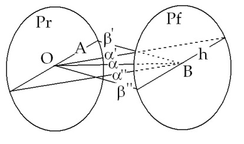

<!-- id: s13-18-0065 -->

Ici \[A\], il va y avoir la répétition projective de cette ligne \[h\] qui ne sera pas seulement la répétition projective de cette ligne comme s’il s’agissait d’une géométrie métrique, mais qui va être la possibilité, pour une géométrie métrique que chacun de ses points, bien sûr, parallèles à cette ligne \[α\] vienne à s’y projeter et constituer une ligne parallèle, mais en réalité, pour mon œil situé ici \[O\] dans le champ du regard, chacune de ces lignes \[α’, α’’\] n’est donc plus parallèle mais viendra constituer un point \[B\], comme ceci, dans la perspective offerte à mon œil.

<!-- id: s13-18-0066 -->

Bon. Il est aussi certain que la ligne infinie \[α\] qui se trace depuis le champ du regard jusqu’à l’horizon, sera elle-même, d’une manière ou d’une autre - et c’est là que peut-être ma position est un petit peu incertaine - d’une manière ou d’une autre projetée sur cette ligne \[h\] et donc en fin de compte, sur ce point \[B\]. Chaque point de cette ligne \[α\] et chaque point de cette ligne \[A\] seront, en fin de compte, projetés sur ce point \[B\].

<!-- id: s13-18-0067 -->

Ici j’ai le plan-figure \[Pf\], c’est-à-dire ce qui s’offre à moi, ce qui s’offre à mon regard lorsque je regarde : mon champ, mon champ dans lequel le plan que je ne puis pas voir, moi, c’est-à-dire le plan-support, le plan du regard dans lequel mon œil est pris, d’une manière ou d’une autre, va se projeter. Tant et si bien que, comme M. LACAN nous l’a souvent fait remarquer, *je suis vu autant que je vois*.

<!-- id: s13-18-0068 -->

C’est-à-dire que les lignes \[α’, α’’\] qui viennent ici rejoindre le plan du regard ou cette ligne fondamentale dont nous a parlé M. LACAN, à ce plan-figure, seront aussi bien inversables si je puis dire, comme ceci \[β’, β’’\], par une projection exactement inverse. Tant et si bien que si je considère que dans le plan-figure se projette le plan-regard, que le plan-regard me renvoie quelque chose qui venait du plan-figure, il y aura à chaque point intermédiaire entre le plan du regard et la ligne infinie, le point de fuite, le point d’horizon, il y aura à chaque point de cet espace, une différence entre la perspective, si je la considère comme vectorialisée pour ainsi dire comme ceci, ou vectorialisée comme cela, c’est-à-dire que, par exemple, un arbre qui aura cette dimension dans ce vecteur.

<!-- id: s13-18-0069 -->

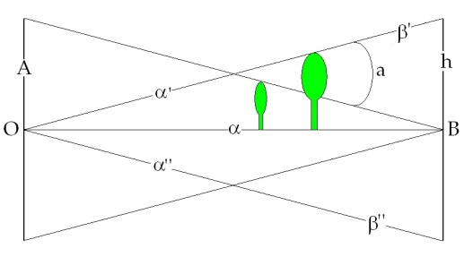

<!-- id: s13-18-0070 -->

Il y aura cette dimension dans ce vecteur.

<!-- id: s13-18-0071 -->

Il y aura donc ici un écart \[a\], quelque chose de non vu qui ne vient qu’exprimer que, à chaque point de ce plan \[Pr\], il y a aussi, un écart de chaque point par rapport, à lui-même, c’est-à-dire que cet espace ne sera pas homogène et que chaque point sera décalé par rapport à lui-même en un écart non vu, non visible qui cependant vient constituer étrangement chacune des choses que mon œil perçoit dans le *plan perspectif*. Chacune de ces choses, vues dans le plan perspectif étant renvoyée par le plan-figure en tant que dans ce plan-figure, le plan du regard se projette. Chacun de ces écarts pourra être appelé \[a\] et ce \[a\] est constitutif de l’écart que chaque point du plan-regard prend par rapport à lui-même.

<!-- id: s13-18-0072 -->

Une non-homogénéité absolue de ce plan se découvre ainsi et chaque objet se découvre comme pouvant avoir une certaine distance par rapport à lui-même, une certaine différence par rapport à lui-même.

<!-- id: s13-18-0073 -->

Et je suis frappé que, dans ce que vient de nous dire GREEN, si l’on considère en effet cette sorte d’entrecroisement des éclairages du plan, les figures dont il nous a parlé se situent comme à l’intersection pour rejoindre en quelque sorte, pour rejoindre ce qui se croise ici comme cela. Et qu’en effet, il y a, peut-on dire aussi, dans l’éclairement des visages par rapport aux corps un petit quelque chose qui dépasse et qui pourrait - en manière d’illustration simple, je ne prétends pas faire plus - qui pourrait nous indiquer cette petite différence justement que prend l’objet par rapport à lui–même quand on met en regard, c’est le moment de le dire, le plan du regard et le plan de la figure.

<!-- id: s13-18-0074 -->

Voilà la manière dont je me suis exprimé les choses et je laisse à M. LACAN le soin de me dire que je me suis lourdement trompé ou que j’ai méconnu une partie de ce qu’il a dit l’autre jour.

<!-- id: s13-18-0075 -->

[LACAN](#Mai1805)

<!-- id: s13-18-0076 -->

Je vous remercie beaucoup AUDOUARD. Voilà. C’est vraiment une construction intéressante parce qu’exemplaire.

<!-- id: s13-18-0077 -->

Je peux difficilement croire qu’il ne s’y soit pas mêlé pour vous le désir de concilier *un premier schéma* que j’avais donné au moment où je parlais de *la pulsion scopique*, il y a deux ans[^174] avec ce que je viens de vous apporter la dernière fois et l’avant-dernière. Ce schéma tel que vous le produisez et qui ne correspond ni à l’un, ni à l’autre de ces deux énoncés de ma part, si toutes sortes de caractéristiques dont la principale est de vouloir figurer - du moins je le crois, si je ne me trompe pas moi-même sur ce que vous avez voulu dire - en somme, une certaine *réciprocité* de la représentation que vous avez appelée *la figure*, avec ce qui se produit dans le plan du regard d’où vous êtes parti.

<!-- id: s13-18-0078 -->

Je pense, c’est bien en effet d’une espèce de représentation strictement réciproque qu’il s’agit et où se marque, si l’on peut dire, le vertige permanent de l’intersubjectivité. Là-dessus vous introduisez, d’une façon qui mériterait d’être critiquée dans le détail, je ne sais quoi que je ne veux pas, dans lequel je ne veux pas m’appesantir, où il résulterait quelque chose par quoi l’objet, c’est bien d’un objet qu’il s’agit puisque vous avez supposé un petit arbre qui tirerait en quelque sorte \- je vais un peu vite - qui tirerait tout son relief, de la non-coïncidence des deux perspectives qui le saisissent.

<!-- id: s13-18-0079 -->

Ce qui, en effet, doit être à peu près soutenable de la façon dont vous avez posé les choses. Et d’ailleurs je crois que, à la fin, ce n’est pas pour rien que vous nous présentez dans le plan du regard deux points écartés l’un de l’autre et qui viennent là singulièrement, sans que je ne sache si c’est votre intention, mais d’une façon frappante, évoquer la vision binoculaire.

<!-- id: s13-18-0080 -->

Bref, vous paraissez avec ce schéma être tout à fait prisonnier de quelque chose d’assurément confus, et qui prend son prestige de recouvrir assez bien ce que s’efforce d’explorer la physiologie proprement *optique*.

<!-- id: s13-18-0081 -->

Or - je vais naturellement très vite - ça vaudrait la peine d’être discuté en détail avec vous, mais alors je pense que le séminaire d’aujourd’hui ne pourrait pas être considéré comme restant dans l’axe de ce que nous avons à dire.

<!-- id: s13-18-0082 -->

Bref il est facile de repérer là les défauts de votre construction par rapport à ce que j’ai apporté, le fait que vous soyez parti de quelque chose que, disons, vous appelez le plan du sujet voyant ou le plan du regard, que vous soyez parti de là est une *erreur* tout à fait sensible et extrêmement déterminante dans l’embarras que vous a donné la suite de votre tentative de recouvrir ce que j’ai dit. Ça ne me donnera qu’une occasion de l’exprimer une fois de plus.

<!-- id: s13-18-0083 -->

Partir de là en disant que ceci \[A\], dont *vous avez tracé la ligne horizontale* sans préciser tout de suite, n’est-ce pas, ce que c’était…

<!-- id: s13-18-0084 -->

> et d’ailleurs ce sur quoi nous restons dans l’embarras, parce que, cette ligne, ce par quoi elle est déterminée : elle est déterminée par ce plan que j’ai appelé la première fois *le plan–support*, que j’ai appelé plus simplement et pour faire image, ensuite, le sol n’est-ce pas, *le* *plan sol* …vous ne le précisez pas, mais par contre supposer que quoi que ce soit qui est dans ce plan, dans ce plan du regard, peut aller se projeter à ce quelque chose que vous avez introduit d’abord et qui est la ligne d’horizon, c’est vraiment manquer l’essentiel de ce qu’apportait la construction que je vous ai montrée l’autre jour \[supra 11-05\] en second temps, après l’avoir d’abord exprimée \[Supra 04-05\] d’une façon, enfin, qui aurait pu se traduire simplement *par des lettres ou des chiffres* au tableau.

<!-- id: s13-18-0085 -->

Rien de ce qui est dans ce plan du regard - si nous l’avons défini comme je l’ai défini, c’est-à-dire comme parallèle au plan-figure, ou encore au tableau, n’est-ce pas - rien très précisément, ne peut aller s’y projeter dans le tableau d’une façon qui soit par vous représentable, puisque cela va en effet s’y projeter, puisque tout s’y projette mais cela va s’y projeter selon, non pas la ligne d’horizon mais la ligne à l’infini du tableau.

<!-- id: s13-18-0086 -->

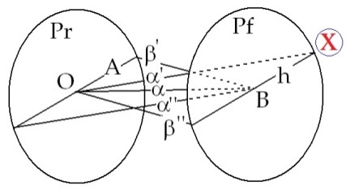

<!-- id: s13-18-0087 -->

Ce point-là \[X\] donc, que je vais faire en rouge pour le distinguer de vos traits, ce point-là, donc, est le point à l’infini du plan du tableau. Vous y êtes ? Ceci est facile à concevoir puisque, si nous rétablissons les choses comme elles doivent être, à savoir, je dessine ici… *Voulez-vous me mettre d’autres feuilles de papier Gloria s’il vous plaît parce que, ce sera vraiment trop confus…* Pendant ce temps-là, je vais, tout de même, essayer de dire en quoi tout ceci nous intéresse, parce que, après tout, pour quelqu’un comme FOUCAULT qui n’a pas assisté à nos précédents entretiens, cela peut paraître un peu en dehors des limites de l’épure, c’est le cas de le dire. Mais enfin ça peut m’être l’occasion, ça peut m’être l’occasion, de préciser ce dont il s’agit : nous sommes des psychanalystes, à quoi avons-nous affaire ?

<!-- id: s13-18-0088 -->

À une pulsion qui s’appelle la *pulsion scopique*. Cette pulsion, si la pulsion est une chose construite comme FREUD nous l’inscrit, et si nous essayons à la suite de ce qu’inscrit FREUD concernant la pulsion, qui n’est pas un instinct, mais un *montage*, un *montage* entre des réalités de niveau essentiellement hétérogènes, comme ce qui s’appelle la *poussée*, le *Drang*, quelque chose que nous pouvons inscrire comme étant l’orifice du corps où ce *Drang*, si je puis dire, prend son appui et d’où il tire, d’une façon qui n’est concevable que d’une façon strictement topologique, sa constance, cette constance du *Drang* ne peut s’élaborer qu’en la supposant émaner d’une surface dont le fait qu’elle s’appuie sur un bord constant, assure finalement, si l’on peut dire, la constance vectorielle du *Drang*.

<!-- id: s13-18-0089 -->

De quelque chose ensuite, qui est un mouvement d’aller et de retour : *toute pulsion inclut en* quelque sorte en *elle-même*, quelque chose qui est, non pas sa réciproque, mais *son retour sur sa base*. Ceci à partir de quelque chose que nous ne pouvons concevoir, à la limite, et d’une façon, je dis non pas métaphorique mais foncièrement inscrite dans l’existence, à savoir un tour, elle fait le tour, elle contourne quelque chose, et c’est quelque chose que j’appelle *l’objet(a*). Ceci est parfaitement illustré d’une façon constante, dans la pratique analytique, en ceci que *l’objet(a)*, dans la mesure où il nous est le plus *accessible*, où il est littéralement *cerné par l’expérience analytique*, est d’une part, ce que nous appelons *le sein*, et nous l’appelons dans des contextes suffisamment nombreux pour que son ambiguïté, son caractère problématique saute aux yeux de chacun.

<!-- id: s13-18-0090 -->

Que le sein soit *objet(a)*, toutes sortes de choses sont bien faites pour montrer qu’il ne s’agit pas là, de ce quelque chose de charnel dont il s’agit quand nous parlons du sein, ce n’est pas simplement ce quelque chose sur quoi le nez du nourrisson s’écrase, c’est quelque chose qui, pour être défini - s’il doit remplir les fonctions et aussi bien, représenter les possibilités d’équivalence qu’il manifeste dans la pratique analytique - c’est quelque chose qui doit être défini d’une bien autre façon.

<!-- id: s13-18-0091 -->

Je ne mets pas l’accent ici sur la fonction qui présente aussi les mêmes problèmes que constitue, de quelque façon que vous l’appeliez, le *scybalum*, le *déchet*, l’*excrément*, ici nous avons quelque chose qui est en quelque sorte tout à fait clair et cerné.

<!-- id: s13-18-0092 -->

Or, dès que nous passons dans le registre de la pulsion scopique, qui est précisément celle que dans cet article, cet article sur lequel je m’appuie, pas simplement parce que c’est l’article sacré de FREUD[^175], parce que c’est un article *culmen* où vient pour lui s’exprimer justement quelque nécessité, qui est sur la voie de cette précision *topologique* que je m’efforce de donner.

<!-- id: s13-18-0093 -->

Si dans cet article, il met particulièrement en valeur cette fonction d’aller et de retour dans la pulsion scopique, ceci implique que nous essayions de cerner cet *objet(a)* qui s’appelle le regard. Donc c’est de *la structure du sujet scopique* qu’il s’agit et non pas du champ de la vision. Tout de suite, nous voyons là qu’il y a un champ où le sujet est impliqué d’une façon éminente.

<!-- id: s13-18-0094 -->

Car pour nous - quand je dis nous, je vous dis vous et moi, Michel FOUCAULT, qui nous intéressons au rapport des *mots et des choses*, car en fin de compte, il ne s’agit que de ça dans la psychanalyse - nous voyons bien tout de suite aussi que ce sujet scopique intéresse éminemment la fonction du signe.

<!-- id: s13-18-0095 -->

Il s’agit donc de quelque chose qui d’ores et déjà introduit une toute autre dimension que la dimension que nous pourrons qualifier *- au sens élémentaire du mot -* de « *physique* », que représente *le champ visuel en soi-même.* Là-dessus, si nous faisons quelque chose dont je ne sais pas si vous accepterez l’intitulé, à vous de me le dire si nous essayons de faire, sur quelque point précis ou par quelque biais, quelque chose qui s’appelle « *histoire de la subjectivité* ».

<!-- id: s13-18-0096 -->

C’est un titre que vous accepteriez, non pas en sous-titre parce que je crois qu’il y en a déjà un, mais en sous-sous-titre, n’est-ce pas, et que nous définissions soit un champ, comme vous l’avez fait pour *La naissance de la clinique*, ou pour *L’histoire de la folie,* en un champ historique comme dans votre dernier ouvrage, il est bien clair que *la fonction du signe* y apparaît ce quelque chose d’essentiel, cette *fonction essentielle* que vous, vous donnez dans une telle analyse.

<!-- id: s13-18-0097 -->

Je n’ai pas le temps, grâce à ces retards que nous avons pris, peut-être de soulever point par point, dans votre premier chapitre tous les termes, non pas du tout où j’aurai en quoi que ce soit à objecter, mais bien au contraire qui me paraissent *littéralement* converger vers la sorte d’analyse que je fais. Vous aboutissez à la conclusion que ce tableau serait en quelque sorte *la représentation* du « *monde des représentations* » comme vous considérez que c’est ce dont le système, je dirais infini, d’application réciproque constituerait la caractéristique d’un certain temps de la pensée.

<!-- id: s13-18-0098 -->

Vous n’êtes pas tout à fait contre ce que je dis là ?

<!-- id: s13-18-0099 -->

FOUCAULT* *: … LACAN

<!-- id: s13-18-0100 -->

Vous êtes d’accord ! Merci. Parce que ça prouve que j’ai bien compris.

<!-- id: s13-18-0101 -->

Il est certain que rien ne saurait plus *nous instruire,* de la satisfaction que nous donne son éclat, qu’une telle controverse.

<!-- id: s13-18-0102 -->

Je ne pense absolument pas vous apporter une *objection* en disant qu’en fin de compte *ce n’est que* - en faveur d’une fin didactique, à savoir de poser pour nous les problèmes qu’imposerait une certaine limitation dans le système - *repère*, qu’il est en effet important qu’une telle saisie de ce qu’a été, disons, la pensée pendant le XVIIème et le XVIIIème siècles, nous soit proposée.

<!-- id: s13-18-0103 -->

Comment procéder autrement si nous voulons même commencer à soupçonner sous quel biais les problèmes, à nous, se proposent ? Rien n’est plus éclairant que de voir, de pouvoir saisir dans quelle - je peux dire le mot - *perspective* différente ils pouvaient se proposer dans un autre contexte, ne serait-ce que pour éviter les erreurs de lecture, je dirais même plus, simplement pour nous permettre la lecture, quand nous n’y sommes pas naturellement disposés, d’auteurs comme ceux dont vous mettez par exemple, d’une façon éblouissante, en avant la facture, comme CUVIER par exemple. Je ne parle pas, bien sûr, de tout ce que vous avez apporté aussi dans le registre de l’économie de l’époque et aussi de sa linguistique.

<!-- id: s13-18-0104 -->

Je vous pose la question : est-ce que vous croyez… vous ne croyez pas qu’en fin de compte, quel que soit le tracé, le témoignage, que nous pouvons avoir des lignes où s’est assurée la pensée d’une époque, il s’est toujours posé *à l’être parlant*, quand je dis posé, je veux dire qu’il était dedans et que, de ce fait, nous ne pouvons pas ne pas partir de la pensée que, exactement les mêmes problèmes, structurés de la même façon, se posaient pour eux comme pour nous.

<!-- id: s13-18-0105 -->

Je veux dire que ce n’est pas là une espèce simplement de présupposé, en quelque sorte *métaphysique*, et même pour le dire plus précisément, heideggerien, à savoir que la question de *L’essence de la vérité* s’est toujours posée de la même façon et que, on s’y est refusé d’un certain nombre de façons différentes, c’est toute la différence. Mais tout de même, nous pouvons toucher du doigt sa présence, je dis, non pas simplement comme HEIDEGGER en remontant à l’archi-antiquité grecque mais d’une façon directe.

<!-- id: s13-18-0106 -->

Dans la succession de chapitres que vous donnez : *parler*, *échanger*, *représenter* - je dois dire d’ailleurs que, à cet égard, les voir résumer dans la table des matières, a quelque chose de saisissant - il me semble que le fait que vous n’y ayez pas fait figurer le mot « *compter* » a quelque chose d’assez *remarquable*. Et quand je dis « *compter* », bien sûr je ne parle pas seulement d’arithmétique ni de *bowling*. Je veux dire que vous avez vu que en plein cœur de la pensée du XVIIème siècle, quelque chose certainement qui est resté méconnu et qui même a été hué, vous savez aussi bien que moi de qui je vais parler, à savoir celui qui a reçu les pommes cuites, qui a rentré sa petite affaire et qui, néanmoins, est resté indiqué comme ayant - pour les meilleurs - brillé du plus vif éclat, autrement dit Girard DESARGUES, et pour marquer quelque chose qui échappe, me semble-t-il à ce que j’appellerais « *le trait d’inconsistance* » des modes réciproques des représentations, dans les différents champs que vous nous décrivez pour faire le bilan du XVIIème et du XVIIIème.

<!-- id: s13-18-0107 -->

En d’autres termes, le tableau de VELÀZQUEZ n’est pas la représentation de - je dirais - *tous les modes de la représentation*, il est, selon un terme qui va bien sûr n’être là que comme un dessert, n’est-ce pas, et qui est le terme sur quoi j’insiste quand je l’emprunte à FREUD, à savoir : *le représentant de la représentation*. Qu’est-ce que ça veut dire ?

<!-- id: s13-18-0108 -->

Nous venons de faire… enfin d’avoir un témoignage éclatant - je m’excuse AUDOUARD - de la difficulté avec laquelle peut passer le spécifique de ce que j’ai essayé d’introduire, par exemple, dans un temps, intervalle assez court à remonter, c’est-à-dire depuis deux de nos réunions, quand il s’agit du champ scopique.

<!-- id: s13-18-0109 -->

Le champ scopique, il y a longtemps qu’il sert dans cette relation à *L’essence de la vérité*. HEIDEGGER est là pour nous rappeler dans cet *ouvrage* [^176]...

<!-- id: s13-18-0110 -->

> dont je ne conçois même pas pourquoi il n’a pas été traduit le premier, comme *Wesen* - non pas comme *Wesen der Wahrheit* - mais de la *Lehre* \[*Doctrine, enseignement*\] de PLATON sur *la vérité*, ouvrage qui non seulement n’est pas traduit mais en plus, est introuvable ...est là pour nous rappeler combien, dans le premier enseignement, il est absolument clair, manifeste, sur ce sujet de *la vérité*, -que PLATON a fait usage de ce que j’appellerais ce monde scopique.

<!-- id: s13-18-0111 -->

Il en a fait un usage, comme d’habitude, beaucoup plus astucieux et rusé qu’on ne peut l’imaginer, car en fin de compte, tout le matériel y est, comme je l’ai rappelé récemment :

<!-- id: s13-18-0112 -->

- le trou, l’obscurité, la caverne,

<!-- id: s13-18-0113 -->

- cette chose qui est si capitale, à savoir *l’entrée*, ce que je vais appeler tout à l’heure *la fenêtre*,

<!-- id: s13-18-0114 -->

- et puis derrière, le monde que j’appellerais « *le monde solaire* ».

<!-- id: s13-18-0115 -->

C’est bien l’entière présence de tout le bataclan qui permet à HEIDEGGER d’en faire l’usage éblouissant que vous au moins Michel FOUCAULT, ici, vous savez…

<!-- id: s13-18-0116 -->

> parce que je pense que vous l’avez lu, et comme cet ouvrage est introuvable il doit y en avoir peu
>
> qui l’aient lu jusqu’ici, ici, mais j’en ai tout de même quelque peu parlé …c’est-à-dire de faire dire à PLATON beaucoup plus qu’on n’y lit ordinairement, et de montrer, en tout cas, la valeur fondamentale d’un certain nombre de *mouvements du sujet* qui sont très exactement quelque chose qui, comme il le souligne, lie la vérité à une certaine formation, une certaine παιδεία \[paideia\]*.* À savoir à ces mouvements que nous connaissons bien, en tout cas dont ceux qui suivent mon enseignement, connaissent bien la valeur de signifiant : mouvement de tour et de retour, mouvement de celui qui se retourne et qui doit se maintenir dans ce *retournement*.

<!-- id: s13-18-0117 -->

Il n’en reste pas moins que la suite même des temps nous montre à quelle confusion peut prêter un tel départ, si nous ne savons pas sévèrement isoler, dans ce champ du monde scopique, la différence des *structures*.

<!-- id: s13-18-0118 -->

Et bien sûr, c’est aller sommairement que, par exemple, y faire une opposition, une opposition d’où je vais partir.

<!-- id: s13-18-0119 -->

L’apologue de la fable de PLATON, telle qu’elle est d’habitude reçue, n’implique que :

<!-- id: s13-18-0120 -->

- quelque chose qui est un point d’irradiation de la lumière, un objet qu’il appelle « *l’objet véritable* »,

<!-- id: s13-18-0121 -->

- et quelque chose qui est l’ombre[^177].

<!-- id: s13-18-0122 -->

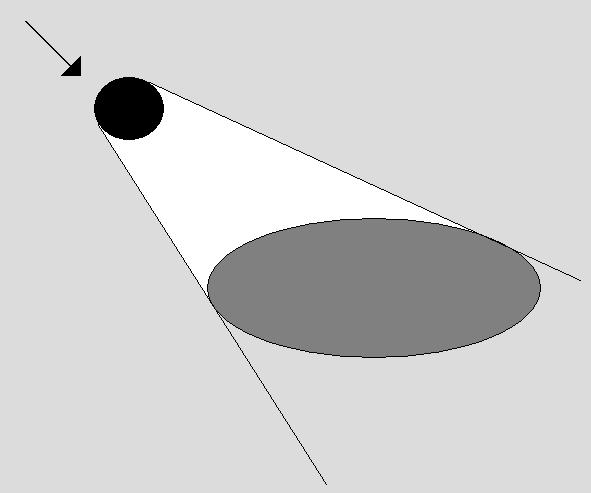

<!-- id: s13-18-0123 -->

Que ce que voient ceux qui sont les prisonniers de la caverne ne soit qu’ombre, c’est là, d’habitude, tout ce qui est reçu de cet enseignement. J’ai tout à l’heure marqué *combien* HEIDEGGER *arrivait à en tirer plus*, en montrant ce qui y est en effet.

<!-- id: s13-18-0124 -->

Néanmoins, cette façon de partir de cette centralité de la lumière vers quelque chose qui va devenir non pas simplement la structure qu’elle est, à savoir *l’objet et son ombre,* mais une sorte de dégradé de réalité qui va en quelque sorte introduire au cœur même de tout ce qui apparaît, de tout ce qui est *scheinen* \[*apparaître, sembler, briller*... \], pour reprendre ce qui est dans le texte de HEIDEGGER une sorte de mythologie qui est justement celle sur laquelle repose *l’idée même de l’Idée,* qui est l’*Idée* du « *bien* » : celle où est, où se trouve l’intensité même de *la réalité*, de la consistance, et d’où en quelque sorte, émanent toutes les enveloppes qui ne seront plus en fin de compte qu’enveloppes d’illusions croissantes, de représentations toujours de représentations.

<!-- id: s13-18-0125 -->

C’est cela d’ailleurs précisément - si vous me permettez de vous le rappeler, je ne sais pas, après tout, si vous avez tous une bonne mémoire - que le l9 Janvier j’ai illustré ici, en faisant commenter par Mme PARISOT, ici présente, *deux textes* *de* DANTE, les deux seuls où il ait parlé du « *miroir de Narcisse* ».

<!-- id: s13-18-0126 -->

Or, ce que nous apporte notre expérience, l’expérience analytique, est centré sur le phénomène de l’écran. Loin que le fondement inaugural de ce qui est la dimension de l’analyse soit quelque chose où, comme en un point quelconque, la primitivité de la lumière, de par elle-même fait surgir tout ce qui est ténèbres sous la forme de ce qui existe, nous avons, et d’abord, affaire à cette relation problématique qui est représenté par l’écran.

<!-- id: s13-18-0127 -->

*L’écran n’est pas seulement ce qui cache le réel, il l’est sûrement, mais en même temps il l’indique.*

<!-- id: s13-18-0128 -->

Quelles structures porte *ce bâti de l’écran* d’une façon qui l’intègre strictement à l’existence du sujet ?

<!-- id: s13-18-0129 -->

C’est là *le point tournant* à partir duquel nous avons… si nous voulons rendre compte des moindres termes qui interviennent dans notre expérience comme connotés du terme « *scopique* », et là bien sûr nous n’avons pas affaire qu’au « *souvenir écran* »,

<!-- id: s13-18-0130 -->

- nous avons affaire à ce quelque chose qui s’appelle *le fantasme*,

<!-- id: s13-18-0131 -->

- nous avons affaire à ce terme que FREUD appelle non pas représentation mais *représentant de la représentation*,

<!-- id: s13-18-0132 -->

- nous avons affaire à plusieurs séries de termes dont nous avons à savoir s’ils sont ou non synonymes.

<!-- id: s13-18-0133 -->

C’est pour cela que nous nous apercevons que ce monde « *scopique* » dont il s’agit n’est pas simplement à penser dans les termes de la lanterne magique, qu’il est à penser dans une structure qui heureusement nous est fournie.

<!-- id: s13-18-0134 -->

Elle nous est fournie… je dois dire, qu’elle est présente quand même au long des siècles, elle est présente dans toute la mesure où tels et tels l’ont manquée. Il y a un certain théorème de [PAPPUS](http://perso.univ-rennes1.fr/michel.coste/cindy/Pappus.html)[^178] qui se trouve d’une façon surprenante être exactement inscrit dans les théorèmes de [PASCAL](http://perso.univ-rennes1.fr/michel.coste/cindy/Pascal.html) et de [BRIANCHON](http://archive.numdam.org/ARCHIVE/NAM/NAM_1897_3_16_/NAM_1897_3_16__78_1/NAM_1897_3_16__78_1.pdf), ceux sur la rectilinéarité de la colinéarité des points de rencontre d’un certain hexagone en tant que cet hexagone est inscrit dans *une conique*.

<!-- id: s13-18-0135 -->

PAPUS en avait trouvé un cas particulier qui est très exactement celui où cet hexagone n’est pas inscrit dans ce que nous appelons couramment « *une conique* » mais simplement dans deux droites se croisant, ce qui je dois dire… jusqu’à une époque qui était celle de KEPLER, on ne s’était pas aperçu que deux lignes qui se croisent c’est une conique.

<!-- id: s13-18-0136 -->

C’est bien pour ça que PAPPUS n’a pas généralisé son truc. Mais qu’on puisse faire une série de ponctuations qui prouvent qu’à chaque époque, cette chose qui s’appelle déjà géométrie projective n’a pas été reconnue, c’est déjà suffisamment nous assurer qu’était présente un certain mode de relation au monde scopique dont je vais essayer de dire maintenant, et dans la hâte où nous sommes toujours ici pour travailler, quels sont les effets structuraux.

<!-- id: s13-18-0137 -->

Qu’est-ce que nous cherchons ? Si nous voulons rendre compte de la possibilité d’un rapport, disons au *réel* - je ne dis pas au monde - qui soit tel, qu’instituée s’y manifeste la structure du fantasme, nous devons dans ce cas avoir quelque chose qui nous connote la présence de *l’objet(a)*, de *l’objet(a)* en tant qu’il est la monture d’un effet. Non seulement je n’ai pas à dire : « *ce que nous connaissons bien* », nous ne le connaissons pas justement, nous avons à en rendre compte de cet effet premier, donné, d’où nous partons dans *la psychanalyse*, qui est la division du sujet.

<!-- id: s13-18-0138 -->

À savoir que dans toute la mesure - je sais que vous la faites à bon escient - où vous maintenez la distinction du *cogito* et de *l’impensé*, pour nous, il n’y a pas d’impensé. La nouveauté pour la psychanalyse, c’est que là où vous désignez \- je parle en un certain point de *votre développement *: l’impensé dans son rapport au *cogito -* là où il y a cet impensé, ça pense, et c’est là le rapport fondamental, d’ailleurs dont vous sentez fort bien quelle est la problématique, puisque vous indiquez ensuite, quand vous parlez de la *psychanalyse* que c’est en cela que la *psychanalyse* se trouve radicalement mettre en question tout ce qui est sciences humaines.

<!-- id: s13-18-0139 -->

Je ne déforme pas ce que vous dites ?… Quoi ?

<!-- id: s13-18-0140 -->

Michel FOUCAULT – Vous reformez.

<!-- id: s13-18-0141 -->

LACAN

<!-- id: s13-18-0142 -->

Bien sûr. Et en plus – naturellement - en plus d’une façon qui nécessiterait beaucoup plus de franchissement et d’étapes.

<!-- id: s13-18-0143 -->

Alors, ce dont il s’agit c’est d’une géométrie qui nous permette, non seulement *d’être représentation* - dans un *plan-figure* - de ce qui est dans un *plan support*, mais *que s’y inscrive ce tiers-terme qui s’appelle le sujet* et qui est nécessaire à sa construction.

<!-- id: s13-18-0144 -->

C’est très précisément pourquoi j’ai fait la construction que je suis forcé de reprendre, qui d’ailleurs n’a rien d’originale, qui est souvent empruntée aux livres les plus communs sur la perspective, à condition qu’on les éclaire par la géométrie desarguienne et par tous les développements qu’elle en a fait depuis, aussi bien au XIXème siècle.

<!-- id: s13-18-0145 -->

Mais justement DESARGUES est là pour pointer qu’au cœur de ce XVIIème siècle déjà, toute cette géométrie qu’il a parfaitement saisie, cette existence fondamentale par exemple, d’un principe comme le principe de dualité, qui ne veut dire essentiellement par soi-même que : *les objets géométriques* sont renvoyés à *un jeu d’équivalence symbolique*.

<!-- id: s13-18-0146 -->

Eh bien, à l’aide simplement du plus simple usage des montants de la perspective, nous trouvons ceci :

<!-- id: s13-18-0147 -->

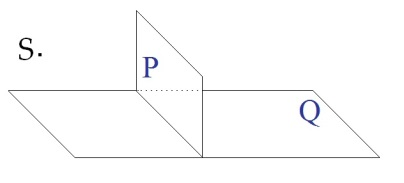

<!-- id: s13-18-0148 -->

que pour autant qu’il faille distinguer ce *point-sujet* \[S\], ce *plan-figure* \[P\], le *plan-support* \[Q\], bien sûr je suis bien forcé de les représenter par quelque chose, entendez que tous s’étendent à l’infini, bien sûr. Eh bien, *quelque chose est repérable* d’une façon double qui inscrit le sujet dans ce plan-figure qui, de ce fait, n’est pas simplement enveloppe, *illusion détachée* si l’on peut dire, de ce qu’il s’agit de représenter, mais en lui–même constitue une structure *qui, de la représentation est le représentant*.

<!-- id: s13-18-0149 -->

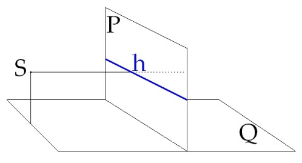

<!-- id: s13-18-0150 -->

Je veux dire que *la ligne d’horizon*, pour autant qu’elle est directement déterminée par ce point qu’il ne faut pas appeler *point-œil* mais *point-sujet*, point-sujet, si on peut dire entre parenthèses, je veux dire sujet nécessaire à la construction, et qui n’est pas le sujet puisque le sujet, il est engagé dans l’aventure de la figure, et qu’il est nécessaire que là se produise quelque chose qui, à la fois indique qu’il est quelque part en un point nécessairement, mais que son autre point - encore qu’il soit nécessaire, qu’il soit présent - soit en quelque sorte *élidé*.

<!-- id: s13-18-0151 -->

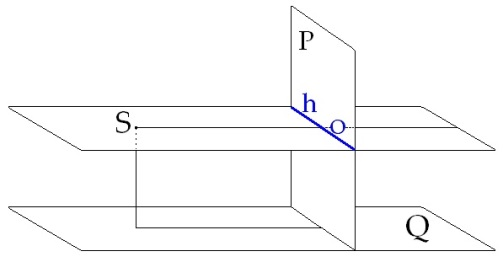

<!-- id: s13-18-0152 -->

C’est ce que nous obtenons en remarquant, *je le rappelle* - le temps me manque pour en refaire d’une façon aussi articulée la démonstration - que si cette *ligne d’horizon* est déterminée par simplement une parallèle, un plan parallèle qui passe par le point sujet, *plan parallèle* au *plan du sol*, ceci, tout le monde le sait, mais que ce type d’horizon, d’ailleurs, dans l’établissement d’une perspective quelconque implique le choix d’*un point* \[O\] sur cette *ligne d’horizon* et que, chacun sait ça, *c’est ce qu’on appelle le point de fuite* et que donc la première présence du *point-sujet* dans *le plan-figure*, c’est un point quelconque de la *ligne d’horizon*, disons n’importe quel point, je souligne encore, il doit y en avoir en principe un. Quand il y en a plusieurs, c’est quand il arrive que les peintres se permettent la licence, quand il y en a plusieurs, c’est *à des fins déterminées*. De même que, quand nous avons plusieurs « *moi idéal* » ou « *moi idéaux* » - l’un et l’autre se disent - c’est à certaines fins.

<!-- id: s13-18-0153 -->

Mais que, il y a - *mais ça c’est bien sûr une des nécessités de la perspective -* tout ceux qui sont là-dedans *les fondateurs*, à savoir : ALBERTI, et PELLERIN - autrement dit VIATOR, mais aussi bien Albert DÜRER, qui l’appellent « *l’autre œil* ».

<!-- id: s13-18-0154 -->

Je le répète, ceci prête à confusion car il ne s’agit en aucun cas de vision binoculaire, la perspective n’a rien à faire avec ce qu’on voit, et le relief. Contrairement à ce qu’on s’imagine *la perspective c’est le mode* – « *en un certain temps, en une certaine époque »*, comme vous diriez - *par lequel le peintre comme sujet se met dans le tableau*, exactement comme les peintres de l’époque improprement appelés *primitifs* se mettaient dans le tableau comme donateur. Dans le monde dont il s’agissait que le tableau soit le représentant, au temps des prétendus primitifs, le peintre était à sa place dans le tableau.

<!-- id: s13-18-0155 -->

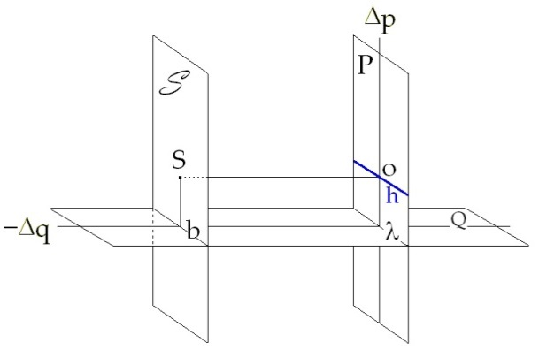

<!-- id: s13-18-0156 -->

Au temps de VELÀZQUEZ, il a l’air de s’y mettre, mais il n’y a qu’à le regarder pour voir, vous l’avez fort bien souligné, à quel point c’est à l’état d’absence qu’il y est. Il y est *en un certain point* que je décris précisément en ceci qu’on touche *la trace du point d’où il vient*, de ce point - pour vous, pour vous seulement, car je l’ai déjà assez dit pour les autres – de ce point que je n’ai pas jusqu’à présent qualifié, qui est l’autre point de présence, l’autre *point-sujet* dans le champ du tableau, qui est ce point qui se détermine, non pas de la façon dont on vous l’a dit tout à l’heure, mais en tenant compte précisément de ceci qu’il y a un plan et un seul \[*S*\], *parallèle au plan du tableau*, qui ne saurait aucunement s’inscrire *dans le tableau*.

<!-- id: s13-18-0157 -->

Et c’est bien ce qui fait déjà sauter aux yeux à quel point est problématique la première présence du point S sur *la ligne d’horizon* sous la forme d’un point quelconque. Ce point quelconque sous sa forme de *point d’indifférence* est bien justement ce qui est de nature à nous surprendre sur ce qu’on pourrait appeler sa primauté.

<!-- id: s13-18-0158 -->

Par contre, en tenant compte de ceci : que cette ligne \[b\]…

<!-- id: s13-18-0159 -->

> que nous déterminons comme la *ligne d’intersection* du plan \[*S*\] qui passe par le point S supposé de départ, d’intersection avec le plan support …que cette ligne sur le *plan-figure* a une traduction \[Δp\] qu’il est facile de saisir, parce qu’il suffit simplement de renverser, ce qu’il nous a paru tout naturel d’admettre concernant la relation de l’horizon \[h\] avec la ligne infinie \[Δq\] sur le plan support, là dans l’autre disposition :

<!-- id: s13-18-0160 -->

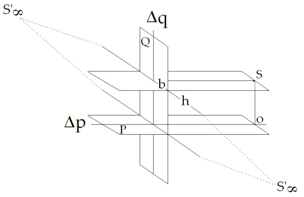

<!-- id: s13-18-0161 -->

Il apparaît tout de suite que ceci \[b\], si vous voulez, constitue une ligne d’horizon par rapport à quoi la ligne à l’infini du plan-figure \[Δp\] jouera la fonction inverse et que, dès lors, c’est à l’intersection de la ligne fondamentale \[λ\], c’est-à-dire du point où le tableau coupe le plan-support, à l’intersection de cette ligne fondamentale avec cette ligne \[b\] à l’infini, c’est-à-dire en un point à l’infini que se place le second pôle \[S’\] du sujet.

<!-- id: s13-18-0162 -->

C’est de ce pôle que revient VELÀZQUEZ après avoir fendu sa petite foule et *la ligne de scission qui s’y marque,* n’est-ce pas, de son passage, en quelque sorte de ce qui forme son groupe modèle, nous indique assez que c’est de quelque part, hors du tableau qu’il vient ici surgir.

<!-- id: s13-18-0163 -->

Ceci, je le regrette, me fait prendre les choses du point *le plus théorique et le plus abstrait*, et l’heure s’avance, je ne pourrai donc pas mener les choses aujourd’hui jusqu’au point où je voulais les mener. Néanmoins la forme même de ce qui m’a été apporté tout à l’heure comme interrogation nécessitait que je remette ceci au premier plan.

<!-- id: s13-18-0164 -->

Néanmoins, si quelques-uns d’entre vous peuvent faire encore le sacrifice de quelques minutes après cette heure de deux heures, je vais tout de même passer, c’est à dire en prenant les choses au niveau de la description, je dois dire fascinante, que vous avez faite du tableau des *Ménines*, vous montrer l’intérêt concret que prennent ces considérations dans le plan de la description même.

<!-- id: s13-18-0165 -->

Il est clair que depuis toujours, critiques autant que spectateurs sont absolument fascinés, inquiétés par ce tableau.

<!-- id: s13-18-0166 -->

Le jour où quelqu’un, je ne veux pas vous dire son nom, encore que j’aie là toute la littérature, a fait la découverte que c’était formidable ces petits *roi* et *reine* qu’on voyait dans le fond, que c’était sûrement là *la clé de l’affaire*, tout le monde l’a acclamé : comme c’était vraiment formidable, intelligent d’avoir vu ça qui est évidemment… qui s’étale… on ne pas dire au premier plan puisque c’est au fond, mais enfin qu’il est impossible de ne pas voir. Enfin… On a progressé de découvertes héroïques en autres découvertes diversement sensationnelles… Mais il n’y a qu’une chose qu’on n’a pas tout à fait expliquée, c’est à quel point cette chose, si ce n’était que ça : « *coucou, le roi et la reine sont dans le tableau* » ça suffisait à faire l’intérêt du truc.

<!-- id: s13-18-0167 -->

À la lumière, si on peut dire, puisque nous ne travaillons pas ici dans le plan photopique, nous n’avons pas affaire à la couleur, je la réserve pour l’année prochaine, si cette année prochaine doit exister, nous travaillons dans le champ scotopique en effet, dans la pénombre, comme ici.

<!-- id: s13-18-0168 -->

Ce qui est important, intéressant, c’est ce qui se passe entre ce point S rituel, car il ne sert qu’à la construction, tout ce qui nous importe c’est ce qu’il y a dans la figure, mais il joue quand même son rôle, c’est ce qui se passe entre ce point-là, dans l’intervalle entre lui et l’écran. Or, s’il y a quelque chose que ce tableau nous *impose*, c’est grâce à un artifice qui est celui d’ailleurs dont - je vous en rends hommage - vous êtes parti.

<!-- id: s13-18-0169 -->

À savoir que la première chose que vous avez dite c’est que « *dans le tableau il y a un tableau* » et je pense que vous ne doutez pas plus que moi que *ce tableau qui est dans le tableau* soit *le tableau* lui-même, celui que nous voyons, encore que peut-être là-dessus, vous prêtez à laisser se perpétrer cette interprétation que ce tableau serait le tableau où il fait le portrait du roi et de la reine. Vous vous rendez compte, il aurait pris le même tableau de trois mètres dix-huit avec la même monture pour faire le roi et la reine seulement, ces deux pauvres petits cons qui sont là au fond, or c’est précisément de la présence de ce tableau qui est la seule *représentation* qui est dans le tableau, cette représentation sature, en quelque sorte, le tableau en tant que réalité.

<!-- id: s13-18-0170 -->

Mais le tableau est autre chose, puisque je ne vous *le démontrerai* pas aujourd’hui, j’espère que vous reviendrez dans huit jours, parce que je pense qu’on peut dire quelque chose sur ce tableau qui aille au delà de cette remarque qui est vraiment inaugurale, à savoir ce que c’est vraiment que ce tableau. J’ai assez souligné la dernière fois les difficultés que représentent toutes les interprétations qui en ont été données, mais évidemment il faut partir de l’idée que ce qui nous est caché et dont vous faites si bien valoir la fonction, de *quelque chose qui est caché*, de *carte retournée* pour vous forcer à abattre les vôtres.

<!-- id: s13-18-0171 -->

Et Dieu sait si, en effet, les critiques n’ont pas manqué de les abattre, les leurs de cartes. Et pour dire une série de choses extravagantes, pas tellement d’ailleurs, ça a suffi de les rapprocher pour quand même aboutir à savoir pourquoi leur extravagance, dont une est celle par exemple : *que le peintre peint devant un miroir qui serait à notre place.* C’est une solution élégante, malheureusement, elle va tout à fait contre cette histoire du roi et de la reine qui sont dans le fond parce qu’alors, il faudrait aussi qu’eux soient à la place du miroir. Il faut choisir. Bref, toutes sortes de difficultés se présentent, si simplement nous pouvons maintenir que *le tableau est dans le tableau comme représentation de l’objet tableau*.

<!-- id: s13-18-0172 -->

*Or cette problématique de la distance entre le point S et le plan du tableau est à proprement parler à la base de l’effet captatif de l’œuvre.*

<!-- id: s13-18-0173 -->

C’est pour autant que ce n’est pas une œuvre avec une perspective habituelle, c’est une espèce de tentative folle, qui d’ailleurs n’est pas le privilège de VELÀZQUEZ, je connais - Dieu merci - assez de peintres et nommément l’un dont je vais vous faire montrer pour vous donner une petite - comme ça - friandise, à la fin de cet exposé…

<!-- id: s13-18-0174 -->

> dont je regrette d’être forcé de toujours revenir sur les mêmes plans qui soient trop arides …un peintre dont je vais, en vous quittant, vous montrer ici une œuvre, que vous pouvez d’ailleurs aller tous voir là où elle est exposée, montrant que c’est bien le problème du peintre - *et ceci, reportez-vous à mes premières dialectiques comme quand j’ai introduit la pulsion scopique -* à savoir que le tableau est un piège à regard, qu’il s’agit de piéger celui qui est là devant.

<!-- id: s13-18-0175 -->

Et quelle plus propre façon de le piéger que d’étendre le champ des limites du tableau, de la perspective, jusqu’au niveau de ce qui est là, au niveau de *ce point S*, et que j’appelle à proprement parler *ce qui s’évanouit toujours*, *ce qui est l’élément de chute*.

<!-- id: s13-18-0176 -->

La seule chute dans cette représentation, ou ce *représentant de la représentation* qu’est le tableau en soi, c’est cet *objet(a),* et *l’objet(a) c’est ce que nous ne pouvons jamais saisir et spécialement pas dans le miroir, pour la raison que c’est la fenêtre que nous constituons nous-même d’ouvrir les yeux simplement.* Tout cet effort du tableau pour attraper ce plan évanouissant qui est proprement ce que nous venons apporter, nous tous baguenaudeurs :

<!-- id: s13-18-0177 -->

- nous sommes là dans une exposition à croire qu’il ne nous arrive rien quand nous sommes devant un tableau,

<!-- id: s13-18-0178 -->

- nous sommes pris comme mouche à la glue, nous baissons le regard comme on baisse culotte et pour le peintre, il s’agit, si je puis dire, de nous faire entrer dans le tableau.

<!-- id: s13-18-0179 -->

C’est précisément parce qu’il y a cet intervalle entre cette *haute toile* représentée de dos et *quelque chose* qui est - le cadre du tableau - en avant, que nous sommes dans ce malaise. *C’est une interprétation proprement structurale et étroitement scopique.*

<!-- id: s13-18-0180 -->

Si vous revenez m’entendre la prochaine fois, je vous dirai pourquoi c’est ainsi car à la vérité je reste ici aujourd’hui strictement dans *les limites de l’analyse* de la structure : de la structure telle que vous l’avez faite, de la structure de ce qu’on voit sur le tableau. Vous n’y avez introduit rien du dialogue, si je puis dire, du dialogue qu’il suggère entre quoi et quoi… ?

<!-- id: s13-18-0181 -->

Ne croyez pas que je vais vous refaire - après AUDOUARD - de la *réciprocité*, à savoir que nous sommes priés, nous, de dialoguer avec VELÀZQUEZ : j’ai assez dit depuis longtemps que *les relations du sujet à l’Autre ne sont pas réciproques* pour que je n’aille pas tomber dans ce piège aujourd’hui.

<!-- id: s13-18-0182 -->

*Qui est-ce qui parle en avant ? Qui est-ce qui interroge ? Qui est-ce qui - plutôt - crie et supplie, et demande à Velàzquez* « *Fais voir !* » ?

<!-- id: s13-18-0183 -->

C’est là le point d’où il faut partir, je vous l’ai indiqué la dernière fois, pour savoir en fait qui est-ce qui est là dans le tableau ?

<!-- id: s13-18-0184 -->

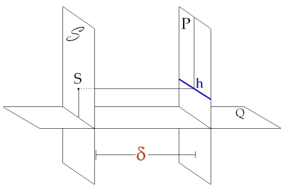

<!-- id: s13-18-0185 -->

Et que cet intervalle \[δ\], cet intervalle entre les deux plans, le plan du tableau et le plan du point S, que cet intervalle qui coupe le plan-support en deux parallèles et par ce qui, dans le vocabulaire de DESARGUES s’appelle « *essieu* »…

<!-- id: s13-18-0186 -->

> car, en plus, histoire de se faire un peu plus mal voir : un vocabulaire qui n’était pas comme celui de tout le monde
>
> \[[G. DESARGUES : *Brouillon project d’une atteinte aux événemens des rencontres d’un cône avec un plan* (1639)](http://gallica.bnf.fr/ark:/12148/bpt6k105071b.capture)\] …dans l’« *essieu* » de l’affaire qu’est-ce qui se passe ?

<!-- id: s13-18-0187 -->

Certainement pas ce que nous disons aujourd’hui et que le tableau, soit fait pour nous faire sentir cet intervalle, c’est ce qui est doublement indiqué dans notre rapport de *happage* par ce tableau d’une part et dans le fait que dans le tableau, VELÀZQUEZ est manifestement tellement là pour nous marquer l’importance de cette distance qu’il n’est pas - remarquez le, vous avez dû le remarquer mais vous ne l’avez pas dit - il n’est pas à portée, même avec son pinceau allongé, de toucher ce tableau. Naturellement on dit : il a reculé pour mieux voir. Oui, bien sûr… Mais enfin, le fait manifestement qu’il ne soit pas à portée du tableau est là le point absolument capital.

<!-- id: s13-18-0188 -->

Bref que les deux points de fuite de ce tableau soient non pas simplement celui qui fuit, lui aussi vers une fenêtre, vers une béance, vers l’extérieur, posé là comme en parallèle à la béance antérieure, et d’autre part VELÀZQUEZ, dont *savoir ce qu’il nous dit* est là le point essentiel. Je le ferai parler pour terminer, non pas pour terminer parce que je veux encore que vous voyez le tableau de BALTHUS tout de même, pour dire les choses dans un langage lacanien, puisque je parle à sa place, pourquoi pas ? Il nous dit, en réponse à « *Fais voir !* » :

<!-- id: s13-18-0189 -->

> « *Tu ne me vois pas d’où je te regarde.* »

<!-- id: s13-18-0190 -->

C’est une formule, fondamentale à expliciter ce qui nous intéresse en toute relation de *regard*. Il s’agit de la pulsion scopique et très précisément dans l’exhibitionnisme comme dans le voyeurisme, mais nous ne sommes pas là pour voir si dans le tableau, *on se chatouille* ni s’il se passe *quelque chose*. Nous sommes là pour voir comment ce tableau nous inscrit la structure des rapports du *regard* dans ce qui s’appelle *le fantasme* en tant qu’il est constitutif.

<!-- id: s13-18-0191 -->

Il y a une grande ambiguïté sur le mot *fantasme*. *Fantasme* inconscient, bon, ça c’est un objet. D’abord c’est un objet où nous perdons toujours une des trois pièces qu’il y a dedans à savoir deux sujets et un *(a)*. Parce que, ne croyez pas que j’ai l’illusion que je vais vous apporter le fantasme inconscient comme un objet, sans ça la pulsion du fantasme renaîtrait ailleurs.

<!-- id: s13-18-0192 -->

Mais ce qui trouble, c’est que chaque fois qu’on parle du fantasme inconscient, on parle aussi implicitement du fantasme de le voir. C’est-à-dire que l’espoir, du fait qu’on court après, introduit en la matière beaucoup de confusion.

<!-- id: s13-18-0193 -->

Moi pour l’instant, j’essaie de vous donner à proprement parler ce qui s’appelle « *un bâti* », et « *un bâti* » ce n’est pas une métaphore parce que le fantasme inconscient repose sur « *un bâti* » et c’est ce « *bâti* » que je ne désespère pas, non seulement de le rendre familier à ceux qui m’entendent mais *de le leur faire entrer dans la peau*.

<!-- id: s13-18-0194 -->

Tel est mon but, *et ceci est un exercice absolument scabreux*, et qui pour certains paraît dérisoire, que je poursuis ici, et dont vous n’entendez que de lointains échos. Je vais maintenant vous faire passer, grâce à Gloria, l’image de [Monsieur BALTHUS](#BALTHUSlarue).

<!-- id: s13-18-0195 -->

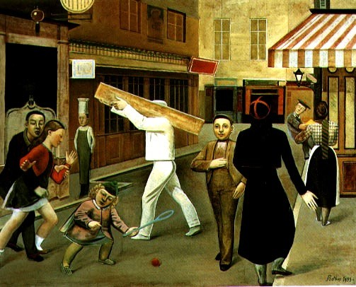 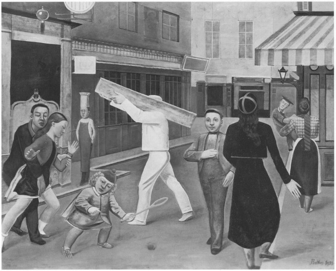

<!-- id: s13-18-0196 -->

Il y a une exposition BALTHUS pour l’instant. Elle est au Pavillon de MARSAN[^179] : *information gratuite*. Moyennant une modique somme, vous pourrez tous aller admirer ce tableau. Eh bien, c’est un *petit devoir* que je donne à certains.

<!-- id: s13-18-0197 -->

Je leur donne pour ça toutes les vacances - voyons : regardez ce tableau - s’en étant procuré, je l’espère quelques *reproductions*, ce n’est pas très facile. Je dois celle-ci à Madame Henriette GOMEZ, qui se trouvait - *c’était absolument d’ailleurs pour elle un étonnement -* qui se trouvait l’avoir dans son fichier. Voilà !

<!-- id: s13-18-0198 -->

Il y a une légère différence dans le tableau que vous verrez, voyez-vous - contrairement à ce qui se passe dans VELÀZQUEZ, parce qu’il y a évidemment des questions d’*époques -* ici, dans ce tableau-là, on se chatouille un peu et cette main, pour la tranquillité du propriétaire actuel a été légèrement regrattée par l’auteur.

<!-- id: s13-18-0199 -->

<!-- id: s13-18-0200 -->

Je le lui ai remontré hier soir, je dois dire que, il m’a dit que c’était quand même bien mieux composé comme ça.

<!-- id: s13-18-0201 -->

Il regrettait d’avoir fait une concession qu’il avait cru devoir. C’était une espèce de contre-concession. Il avait dit : « *Après tout, je fais peut-être ça pour embêter les gens alors pourquoi ne pas le lâcher* » 

<!-- id: s13-18-0202 -->

Mais c’est pas vrai. Il l’avait mis là parce que ça devait être là… Enfin, toutes les autres choses qui sont là, doivent aussi être là et en fin de compte, quand j’ai vu ce tableau…

<!-- id: s13-18-0203 -->

> je l’avais vu déjà une fois, autrefois, et je ne m’en souvenais plus, mais quand je l’ai vu cette fois-ci, dans ce contexte,
>
> vous attribuerez ceci, je ne sais pas à quoi, à ma lucidité ou à mon délire, c’est à vous d’en trancher …j’ai dit : « *Voilà Les Ménines.* » Pourquoi est-ce que ce tableau ce sont *Les Ménines* ?

<!-- id: s13-18-0204 -->

Tel est le petit devoir de vacances donc, que je laisserai parmi vous aux meilleurs.

## Notes

[^174]: Séminaire 1964 : *Les fondements*…, ou *Les quatre concepts*…, Seuil 1973, séances des 04-03 et 11-03-1964.

[^175]: S. Freud : *Pulsions et destins des pulsions*, in *Métapsychologie*, Paris, Gallimard, Coll. Idées, 1968, p.11- 44.

[^176]: M. Heidegger : *Vom Wessen der Wahrheit*, Frankfurt, V. Klosterman, 1988. *De l’essence de la vérité*, Paris, Gallimard, 2001, trad. Alain Boutot.

[^177]: Chez Platon, l’« *Idée* », l’objet véri­table, est distinct de ses occurren­ces (son ombre).

[^178]: Pappus d'Alexandrie, La collection mathématique, éd. Albert Blanchard, 2000.

[^179]: Balthus, exposition du 12 mai au 27 juin 1966, pavillon de Marsan, Musée des Arts Décoratifs, 107 rue de Rivoli 75001 Paris.
