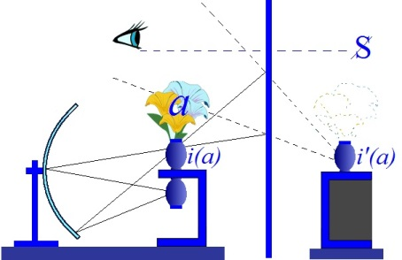
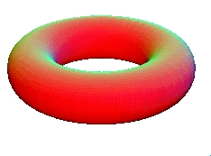
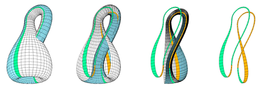
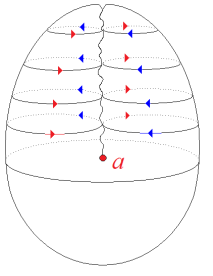
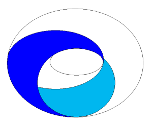
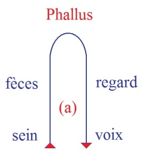
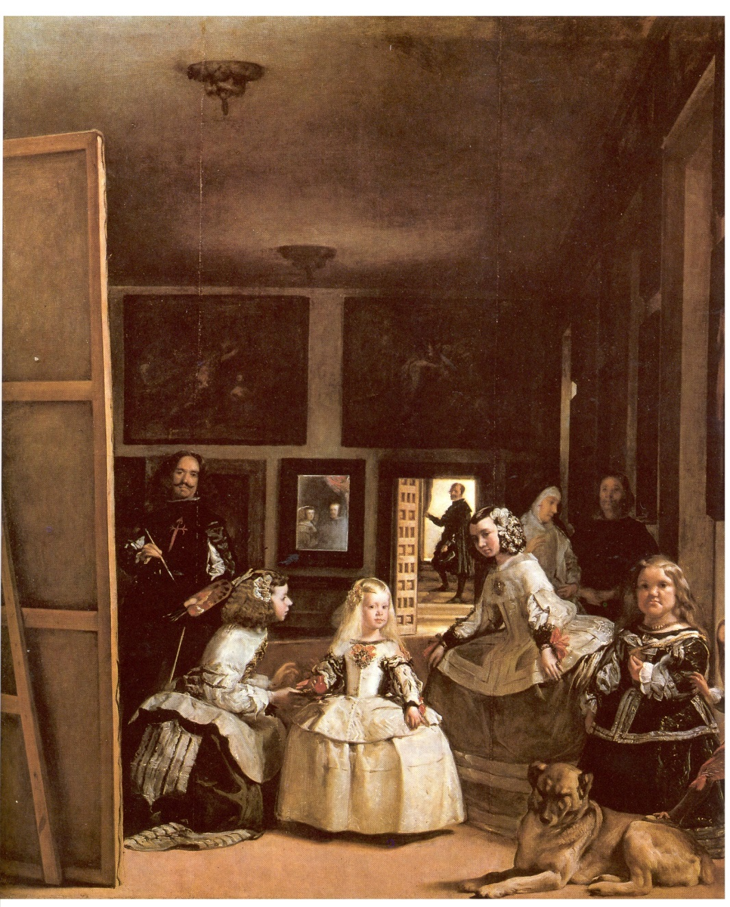
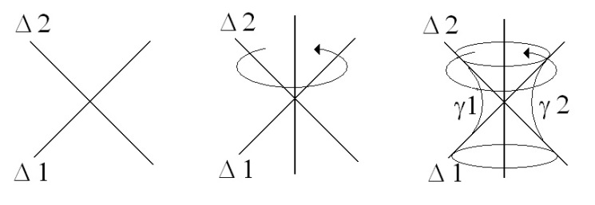
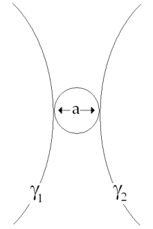

# Leçon 20 | 0l Juin l966

<!-- source-url: http://staferla.free.fr/S13/S13 L'OBJET.docx -->
<!-- seminar: s13 -->
<!-- lesson: 20 -->

<!-- id: s13-20-0001 -->

Nous avançons vers la clôture de cette année dont je m’aperçois que, par rapport à la plus grande partie de mes collègues, je la prolonge avec un zèle inhabituel. Il n’est pas coutume de vous solliciter d’une présence au-delà du début de Juin, pourtant on sait que ma coutume est différente et il est probable que je ne la modifierai pas beaucoup cette année.

<!-- id: s13-20-0002 -->

Tout dépend de la place que je donnerai au séminaire fermé : un ou deux.

<!-- id: s13-20-0003 -->

Il me reste donc deux fois à vous parler dans la position d’aujourd’hui, dite du « *cours ouvert* ».

<!-- id: s13-20-0004 -->

Ce sera bien sûr, pour essayer de rassembler le sens de ce que j’ai apporté devant vous cette année sous le titre de *L’objet de la psychanalyse* dont vous savez qu’il n’est point cette sorte d’ouverture vague qui s’offre à simple lecture du titre mais qu’il veut dire très précisément ce que j’ai articulé dans la structure comme *l’objet(a)*.

<!-- id: s13-20-0005 -->

Vous pourrez remarquer aussi que, si *l’objet(a)* est bien celui dont il se trouverait prendre dans son accolade l’ensemble des objets que les psychanalystes ont fait fonctionner sous cette rubrique, j’aurais certainement manqué *quelque peu*, même beaucoup, à ma fonction descriptive ou de collation. Je les ai énumérées quelquefois à la file, mais on ne peut pas dire que je me sois appesanti sur leurs *bouquets* et puisque l’autre jour je rappelais leur *représentation* justement sous la forme d’un *bouquet de fleurs*, je ne me suis pas étalé sur leur botanique à chacune.

<!-- id: s13-20-0006 -->

<!-- id: s13-20-0007 -->

J’ai surtout parlé d’éléments topologiques, et d’éléments topologiques où en somme je n’ai pas jusqu’à présent, d’une façon explicite, tout à fait pointé où le mettre cet *objet(a)*. Bien sûr, ceux qui m’écoutent bien, ont pu plus d’une fois recueillir que *l’objet(a)* est structure topologique, celle que je vous ai imagée par les figures du *tore*, du *cross-cap*, de la *mitre*, voire de la *bouteille de Klein* : on peut l’en détacher avec une paire de ciseaux.

<!-- id: s13-20-0008 -->

 

<!-- id: s13-20-0009 -->

Ils ont pu entendre aussi que c’est là une opération sur la nature de laquelle on se tromperait tout à fait si on croyait que l’en détacher avec une paire de ciseaux sous la forme de quelques rondelles, ça représente quoi que ce soit.

<!-- id: s13-20-0010 -->

Là encore *le terme de* *représentant de la représentation* conviendrait, car la représentation n’est absolument pas du tout dans cette opération d’isolation, de découpage, et il est facile de s’apercevoir que ces structures, sur lesquelles j’ai opéré pour mettre en valeur l’articulation de cette opération, ces structures ont, si je puis dire, leur *ressources propres* en des points qui, singulièrement, par rapport à ce qu’elles représentent, justement ne peuvent guère se désigner que par le terme de « *trou* ».

<!-- id: s13-20-0011 -->

Si notre *tore* est efficace à représenter quelque chose, un enroulement répété, successif, comme du fameux serpent AMPHISBÈNE[^183] qui représente pour les Anciens quelque *symbole de la vie,* bref si ce *tore* a une valeur quelconque c’est justement parce que c’est *cette structure topologique* qui est marquée de cette chose centrale, qu’il est assurément bien difficile de cerner quelque part, puisqu’elle semble simplement n’être qu’une partie de *son extérieur*, mais qui incontestablement structure le *tore* très différemment d’une *sphère*.

<!-- id: s13-20-0012 -->

Eh bien, *l’objet(a)*…

<!-- id: s13-20-0013 -->

> je le disais tout à l’heure, ceux qui ont prêté attention à ce que je disais
>
> et qui ont pu, même incidemment, me le voir explicitement prononcer …*l’objet(a) c’est là, dans cet espace du trou qu’il est proprement, disons représentable, proprement de ce fait qu’il n’est aucunement représenté.*

<!-- id: s13-20-0014 -->

Nous allons voir ces choses tout à l’heure se boucler, à savoir pourquoi en somme, nous en venons à une référence proprement *située dans* ce champ topologique. Mais dès maintenant vous pouvez voir qu’il y a sûrement quelque cohérence entre le fait qu’au dernier temps des séminaires qui ont précédé, y inclus les séminaires fermés, qui se sont passés tout entier à développer à propos d’un *tableau très éminent* pour permettre de manifester, accentuer en quelque sorte, par le peintre, la fonction de la perspective, nous nous sommes trouvés, je dois dire d’une façon à laquelle vous pouvez faire la plus grande confiance, je veux dire que j’y ai poussé aussi loin que possible la rigueur avec laquelle peut s’énoncer, dans ce cas du *champ scopique*, comment se compose *le fantasme*, enfin qu’il est pour nous *le représentant de toute représentation possible du sujet*.

<!-- id: s13-20-0015 -->

Vous sentez bien qu’il y a un rapport entre le fait que j’ai mis tous les feux sur ce champ scopique, sur *l’objet(a)* scopique, le regard, en tant - il faut bien le dire - qu’il n’a jamais été étudié, jamais été isolé, je parle : là où j’ai à parler, à savoir dans *le champ psychanalytique*, où il est tout de même bien étrange qu’on ne se soit pas aperçu qu’il y avait là quelque chose à isoler autrement que pour l’évoquer dans - et encore, sans le nommer - dans de *grossières analogies*.

<!-- id: s13-20-0016 -->

Un auteur au nom un petit peu rebattu dans l’enseignement analytique, Monsieur FENICHEL, nous a démontré les analogies de l’identification scoptophilique avec la manducation*.* Mais analogie n’est pas structure et ce n’est pas à l’intérieur de la scoptophilie, isoler de quel objet il s’agit et quelle est sa fonction.

<!-- id: s13-20-0017 -->

Il y a bien d’autres choses encore par où *le regard* aurait pu faire son entrée. Au point où nous en sommes, et où au moins une partie d’entre vous ont pu la dernière fois m’entendre, après *l’avoir situé ce regard, au centre même du tableau, caché quelque part sous les robes de l’Infante, de ce point enveloppé*, leur donner, si je puis dire leur rayonnement, j’ai fait remarquer qu’il était là.

<!-- id: s13-20-0018 -->

Par quel office ? S’il est vrai, comme je l’ai dit que ce que *le peintre* nous représente c’est l’image qui se produit dans l’œil vide du roi, cet œil qui *comme tous les yeux est fait pour ne point voir*, et qui supporte en effet cette image telle qu’il nous l’a peinte, c’est-à-dire non pas dans un miroir mais bel et bien son image dans le bon sens, à l’endroit.

<!-- id: s13-20-0019 -->

Ici le regard est ailleurs, *là* dans l’objet qui est *l’objet(a)* par rapport à ceux qui, tout au fond, le couple royal, en posture à la fois de ne rien voir et de voir par leur reflet quelque part au fond de la scène là où nous sommes.

<!-- id: s13-20-0020 -->

*Cet objet(a), devant ce miroir, en somme inexistant de l’Autre* nous avons posé la question de savoir de qui il est l’appartenance :

<!-- id: s13-20-0021 -->

- de ceux qui le supportent dans *cette vision vide*,

<!-- id: s13-20-0022 -->

- ou du peintre, ici placé comme sujet regardant qui fait surgir *la transmutation de l’œuvre d’art* ?

<!-- id: s13-20-0023 -->

Cette ambiguïté de l’appartenance de *l’objet (a)*, c’est là ce qui nous permet de le rapporter, de renouer à ce fil précédent que nous avons laissé pendant, autour de la fonction de l’*enjeu* en tant que nous l’avons illustré du pari de PASCAL.

<!-- id: s13-20-0024 -->

*L’objet (a) rejoignant ici sa plus universelle combinatoire, c’est ce qui est en jeu entre* S *et* A *en tant que aucun d’entre eux ne saurait coexister avec l’autre, sinon d’être marqué du signe de la barre, c’est à dire d’être en position de divisé précisément de l’incidence de l’objet(a).*

<!-- id: s13-20-0025 -->

L’impasse, l’écartèlement où est mise la fonction du sujet, justement dans la fonction du pari…

<!-- id: s13-20-0026 -->

> ce pari absurde vraiment crucial pour tous ceux qui se sont penchés sur son analyse …je rappelle que j’en ai fait le chapitre d’introduction, à l’avancée de mon exposé cette année, sur *l’objet(a)*.

<!-- id: s13-20-0027 -->

Il s’agit aujourd’hui de placer ce que j’avance ainsi, de le replacer dans l’économie de ce que vous connaissez de ce qui vous sert d’appui dans la doctrine de FREUD. Car aussi bien, il ne doit pas être oublié, pour situer la portée de ce que je vous enseigne, du *procédé* de mon enseignement, qu’il n’est autre que ce qu’il s’est déclaré être à l’origine et qui lui donne sa chair et son lien, car autrement *on pourrait s’étonner de tel ou tel détour de mes cheminements*.

<!-- id: s13-20-0028 -->

Et pour qui reprendra ce que j’énonce depuis maintenant quelques quinze ans, dans le recueil qui en a toujours été fait avec soin, sinon avec succès, et qui permettra au moins d’en garder le réseau général, on verra qu’il n’y a rien qui n’ait été à chaque fois, très exactement commandé par ceci, que ce qui m’est demandé est quoi ? Repenser FREUD !

<!-- id: s13-20-0029 -->

Voilà comme je l’avancerai d’abord, prêtant là à toutes sortes d’ambiguïtés, voire de malentendus, *Rückkehr zu Freud*, *retour à Freud* ai-je dit d’abord, à un moment où ceci prenait son sens des manifestations confusionnelles d’un *prodigieux dévoiement* dans l’analyse. Il est d’importance secondaire qu’il apparaisse, ou non, que j’y ai si peu que ce soit obvié.

<!-- id: s13-20-0030 -->

C’était moins de cette contingence que *je m’autorisais* : l’*idéal* *bien classique à toutes sortes d’idéalisations d’un retour aux sources,* n’est certes pas ce qui me poignait : repenser, voilà *ma méthode*. Mais j’aime mieux ce second mot si justement*,* vous penchant sur lui pour le dévisser quelque peu, vous vous apercevez *que le mot « méthode* » *peut exactement vouloir dire* : *voie reprise par après*. \[de μετά « *vers* » et οδος « *voie, manière de faire* »\] *Le mot* μετά \[méta\], *comme toutes les prépositions grecques*, et à la vérité comme toutes les prépositions dans toutes les langues*,* pour peu qu’on s’y intéresse, *est toujours un objet d’études extraordinairement rémunérant*.

<!-- id: s13-20-0031 -->

S’il y a *une espèce de mot* à propos duquel on peut dire que toute espèce de proéminence donnée dans l’étude linguistique à la signification est destinée à se perdre dans un labyrinthe inextricable, c’est bien les prépositions. L’exploration de la richesse et de la diversité de l’éventail des sons du mot μετά \[méta\], vous pouvez vous-même essayer d’en faire l’épreuve avec les dictionnaires et vous verrez que rien n’obvie à ce que de ce μετά \[méta\], je passe à ce que proprement nécessitent les formes structurales que j’ai cette année promues devant vous.

<!-- id: s13-20-0032 -->

Et nommément en vous montrant sur la *bande de Mœbius* qui joue dans - *apparemment* - dans deux de ces *formes* \[*bouteille de Klein,* *cross-cap* \], la fonction d’un rapport tout à fait *fondamental*, exemplaire, *la fonction de support* de ce qui est leur structure et qui est aussi latente à la troisième \[*tore*\], cette *bande de Mœbius* qui nous exemplifie ce que j’appellerai *la nécessité,* dans une structure, *du double tour*.

<!-- id: s13-20-0033 -->

  

<!-- id: s13-20-0034 -->

Je veux dire que *par un seul tour*, vous ne bouclez qu’apparemment ce qui s’y cerne, ne faisant retour à votre point de départ qu’à cette seule condition d’y avoir renversé votre orientation - surface non orientable - *ce qui nécessite qu’après, si je puis dire, l’avoir deux fois perdue, vous ne la retrouviez qu’à faire deux tours.*

<!-- id: s13-20-0035 -->

C’est très exactement *le sens* que je donnerai à ma méthode au regard de ce qu’a enseigné FREUD. S’il y a en effet quelque chose d’étrange qui soit le caractère bouclé, fermé, s’achevant - quoique marqué d’une torsion - par quelque chose qui se rejoint dans ce point, où *- je l’ai longtemps souligné -* choit sa plume, soit : la  *Spal**tung* de l’[*ego*](#FREUDclivage)[^184]*,* et qui revient tout chargé du sens accumulé au cours d’une longue exploration, celle de toute sa carrière, vers un point originel - au sens complètement transformé - point originel d’où il partait presque de la notion complètement différente du *dédoublement de la personnalité*.

<!-- id: s13-20-0036 -->

Disons que cette *notion*, en somme courante, qu’il a su complètement transformer par les repères de *l’inconscient*, c’est celle-là à laquelle à la fin, sous la forme de *la division du sujet*, il donnait son sceau définitif.

<!-- id: s13-20-0037 -->

Ce que j’ai à faire, c’est très exactement de faire une seconde fois le même tour. Mais dans une telle structure, le faire une seconde fois n’a absolument pas le sens d’un pur et simple redoublement.

<!-- id: s13-20-0038 -->

  

<!-- id: s13-20-0039 -->

Et cette nécessité structurale a quelque chose de tellement premier qu’il ne nous est permis d’y accéder que par la voie d’un difficile repérage, quelque chose qui, je dirais presque nécessite une sorte de boussole à laquelle il me faut bien… *de la façon dont j’ai à opérer : parlant à des praticiens* …justifier de vous fier à la mienne, très proprement en tant qu’elle se supporte d’une combinaison de l’expérience analytique et de la lecture de FREUD mais dont la trigonométrie a tout de même *sa sanction*, c’est à savoir, disons le mot, *si ça colle ou pas*.

<!-- id: s13-20-0040 -->

Tous ceux qui viennent là pour m’entendre peuvent recouper effectivement, qu’avec une construction qui bien des fois semble s’appareiller d’éléments qui étaient à FREUD bien étrangers, *c’est très précisément à ces points de rendez-vous importants* *que je me trouve le rencontrer et d’une façon qui éclaire d’une toute nouvelle perspective les points sur lesquels il a mis l’accent de la valeur.*

<!-- id: s13-20-0041 -->

J’ai dit tout à l’heure qu’il n’était pas tellement important, que pendant le temps où je poursuis cette opération, se manifeste bien clairement quelque chose du côté de ce qui s’énonce du courant de la psychanalyse comme *un renversement du mouvement*.

<!-- id: s13-20-0042 -->

Il faut bien en tout cas que je me résigne que ce que j’enseigne ne porte pas immédiatement ce qu’il est fait pour engendrer, qu’il se contente d’abord de rassembler ceux qui y peuvent trouver matière.

<!-- id: s13-20-0043 -->

Car aussi bien, il est un certain ordre d’opérations auquel je n’ai pas à donner de nom général, si ce n’est qu’il est proprement celui qui s’exemplifie de ce que je viens de définir, à savoir l’achèvement d’une structure dont il n’est pas tellement essentiel qu’il se sanctionne immédiatement par ses effets de communication.

<!-- id: s13-20-0044 -->

Au grand étonnement de quelqu’un que j’évoque ici dans le souvenir \[Maurice Merleau*-*Ponty\], j’ai pu énoncer que ce que j’avais dit un jour…

<!-- id: s13-20-0045 -->

- devant un auditoire qui n’était certainement pas le vôtre,

<!-- id: s13-20-0046 -->

- devant un auditoire qui n’était pas non plus de tellement mauvaise qualité,

<!-- id: s13-20-0047 -->

- mais devant un auditoire fort peu préparé …ce que j’avais pu avancer sous un titre comme : *Dialectique du désir et subversion du sujet* \[*Écrits* p.793 ou t.2 p.273\]…

<!-- id: s13-20-0048 -->

- « *Comment -* me disait-on - *pouvez-vous croire qu’il y ait le moindre intérêt à énoncer ce que vous énoncez devant des gens aussi peu faits*

<!-- id: s13-20-0049 -->

> *pour l’entendre ? Est-ce que vous croyez que ceci existe dans une sorte de tiers ou de quart espace ?* »

<!-- id: s13-20-0050 -->

Assurément pas, mais qu’une certaine *boucle* ait été effectivement bouclée et que quelque chose - si peu que ce soit - en reste indiqué quelque part, voilà qui suffit parfaitement à justifier qu’on se donne la peine d’en faire l’énoncé.

<!-- id: s13-20-0051 -->

C’est ici que la notion d’« *intersubjectivité* » devient tout à fait secondaire : le dessin de la structure peut attendre, une fois qu’il est là, il se soutient par lui-même et à la façon, si je puis dire, la métaphore m’en vient là [*extemporanée*](http://www.cnrtl.fr/definition/extemporan%C3%A9e), à la façon d’un piège, d’un trou, d’une fosse. Il attend que quelque *sujet du futur* vienne s’y prendre.

<!-- id: s13-20-0052 -->

Il n’y a donc que peu à s’inquiéter de ce qu’on peut appeler *la défaillance d’une certaine communauté*, *dans l’occasion la psychanalytique,* ou plutôt, il y a à repérer à ce propos, en quoi cette défaillance consiste précisément, dans la mesure *-* comme je le fais quelquefois *-* où on peut y repérer qu’*elle porte témoignage en faveur de la structure qu’il y a à dessiner*.

<!-- id: s13-20-0053 -->

Vous me direz : « *Où sont les critères de celui qui donne la bonne structure ?* » Mais précisément, c’est la structure elle-même.

<!-- id: s13-20-0054 -->

Dans le champ où il s’agit du sujet, si la structure est telle que dans *l’esquisse, le projet* que vous faites *d’un champ d’objectivation*, il n’est pas impliqué comme nécessaire que vous deviez trouver *la marque, l’empreinte, la trace sanglante et éclatée du sujet lui-même*, si c’est exclus d’avance, si je puis dire, au nom de cette *fausse modestie expérimentale*...

<!-- id: s13-20-0055 -->

> qui croyant s’autoriser de ce qui a été réussi dans le champ de la science physique, croit pouvoir se permettre
>
> de projeter en ce champ qu’on appelle « *psycho-sociologie* », cette sorte d’objectivation pleine et de plein droit,
>
> au nom de je ne sais quelle façon de tirer son épingle du jeu au départ, ...à l’abri de la *fausse modestie expérimentale*, nous dirons qu’il est un critère, *un registre de l’épreuve* qui est valable logiquement, que j’appellerais de ces termes.

<!-- id: s13-20-0056 -->

Il y a des structures initiales de la démarche de la pensée dont on ne peut rien dire de plus qu’elles peuvent ou ne peuvent pas être soupçonnées d’être vraies. Là est le test de la structure. Si faussement modeste qu’elle soit, celle qui s’avance dans son champ, celui que j’ai nommé tout à l’heure, d’une façon qui ne présente pas en elle la nécessité de cette déchirure, de cette béance, de cette plaie, ce qui s’en retrouvera c’est le signe dans un certain nombre de paradoxes.

<!-- id: s13-20-0057 -->

Et aussi bien le champ de cette science réussie, sans doute, qui est la nôtre - pour autant que dans tout son champ physique, elle a réussi à forclore le sujet - ne peut donner son fondement, son principe mathématique qu’à retrouver cette même *béance*, sous la forme d’un certain nombre de paradoxes.

<!-- id: s13-20-0058 -->

En ce point elle continue à pouvoir donc être soupçonnée d’être vraie. Mais toute cette plaie que nous laissons s’étendre, au nom de ne pas savoir motiver ce que veut dire qu’elle ne saurait en aucun cas être supposée d’être vraie, voilà ce qui laisse le champ libre à ce que j’ai appelé cette plaie que vous pouvez épingler encore du terme de « *médico-pédagogique* ».

<!-- id: s13-20-0059 -->

C’est bien là, la gravité du cas du psychanalyste. Car c’est toute leur force, et je pense que ce que les mots que je dis ont assez de poids et de portée pour que, concernant leur place, vous donniez son sens à ce prestige - ils n’en ont pas d’autre - dans le champ de la science : qu’ils peuvent bien être soupçonnés d’être les *représentants d’une représentation* qui serait véridique.

<!-- id: s13-20-0060 -->

C’est bien dans ce registre, et ce qui accroche et ce qui arrête devant ce qui serait normal, une pure et simple position de rejet puisque, aussi bien, nous n’avons pas encore réussi à donner un statut valable au matériel qu’ils apportent.

<!-- id: s13-20-0061 -->

Or c’est bien là, qu’est le glissement et l’alibi : qu’une formation réponde à une définition de *la structure*, par quoi elle peut être soupçonnée d’être vraie. Ce qui, puisqu’il n’y a que soupçon, ne veut pas dire suffisance, mais implique un « *il faut* » au-delà duquel peut-être, rien d’adjoint ne peut décisivement apporter la suffisance.

<!-- id: s13-20-0062 -->

Tel est ce signe qui est la définition de ce soupçon, et c’est bien là en effet notre *problématique,* devant ce que nous propose *le symptôme comme question de vérité*. Chaque fois que nous avons affaire, *diversement campés dans un savoir*, à cette interrogation de *la vérité*, la même ambiguïté se présente, que supporte et qu’incarne le terme de *représentant de la représentation*.

<!-- id: s13-20-0063 -->

Car c’est bien ainsi que depuis toujours échoue, sur *le leurre* que je vais dire, la critique - par l’*Aufklärung* - de la religion.

<!-- id: s13-20-0064 -->

Ces représentants savent fort bien l’erreur en quoi consiste *- cette représentante de la vérité -* de l’attaquer sur les représentations, sur les représentations qu’elle en donne, et ceci, les représentants eux-mêmes, c’est-à-dire les personnages diversement sacralisés, le savent fort bien. Ils encouragent que les assiégeants de la citadelle discutent sur la vraisemblance de l’arrêt du soleil dans « *la bataille de Josué* »[^185] ou telle ou telle autre historiette du texte sacré.

<!-- id: s13-20-0065 -->

La question n’est pas à porter dans la structure qui prétend intéresser *la question de la vérité* sur *les représentations*, quelles que puissent être les représentations de cette structure, mais sur *les représentants de la représentation*.

<!-- id: s13-20-0066 -->

C’est pourquoi ceux-ci aiment mieux que la bataille se porte sur les thèmes, d’autant plus inexpugnables de la révélation, qu’on peut les pourfendre aussi longtemps qu’on voudra, comme ils sont de la matière même de la structure, c’est-à-dire pas de la même matérialité que les épées qui les traversent, ils se porteront encore longtemps fort bien.

<!-- id: s13-20-0067 -->

Ainsi, inverse est ce que nous pourrons appeler « *la trahison des psychanalystes* ». C’est que pour être les représentants d’une position qui peut être soupçonnée d’être vraie, ils se croient en devoir de donner corps par tout autre moyen que ceux qui devraient découler du cernage le plus strict de leur fonction de représentant : *ils s’efforcent au contraire d’authentifier* *les représentations de toutes les façons les plus étrangères qu’ils puissent chercher, pour leur donner le sceau du généralement reçu*.

<!-- id: s13-20-0068 -->

Voici, dans la fin de ce que nous cherchons à construire, *les critères de la structure* en tant qu’ils répondent à ces exigences \- étant donné ce qui est abordé, à savoir la structure du sujet - qu’une doctrine puisse être soupçonnée d’être vraie, ce qui implique chez ceux qui en sont les *représentants* quelque chose d’autre que de s’appuyer sur des critères étrangers.

<!-- id: s13-20-0069 -->

Voilà ce qui justifie non seulement la méthode mais les limites selon lesquelles nous devons aborder certains éléments-clé de cette structure et concernant tel *objet(a)*, celui par exemple du champ scopique, assurément nous imposer cette discipline qui ne va pas sans quelque puritanisme, de faire peu de cas de la richesse de ce qui nous est là offert.

<!-- id: s13-20-0070 -->

Car aussi bien comment ne pas remarquer quel point de concours est ce regard autour duquel, déjà FREUD nous a appris, lui, et lui seul, à repérer la fonction, la valeur du signe de l’*Unheimlichkeit* [^186].

<!-- id: s13-20-0071 -->

Car vous pourrez remarquer - à reprendre son étude - dans les œuvres qu’il apporte en témoignage de cette dimension, le rôle, la fonction qu’y joue *le regard sous cette forme étrange de l’œil aveugle* parce qu’arraché, ou quelque attribut que ce soit qui peut en représenter l’équivalent proche : *les lunettes* par exemple ou encore *l’œil de verre*, *le faux œil*.

<!-- id: s13-20-0072 -->

C’est là *toute la thématique d’*HOFFMANN[^187], et Dieu sait si elle est encore *plus riche* que je ne peux ici l’évoquer.

<!-- id: s13-20-0073 -->

La référence aux *Élixirs du diable* est là à votre portée. Il y a toute une *Histoire de l’œil*, c’est le cas de le dire.

<!-- id: s13-20-0074 -->

Et ceux qui ont ici l’oreille ouverte à ce qui peut être information larvée, savent à quoi je fais allusion en parlant de

<!-- id: s13-20-0075 -->

L’*histoire de l’œil*. C’est un livre publié anonyme par un des personnages les plus représentatifs d’une certaine inquiétude essentielle à notre époque, et qui passe pour un roman érotique. *L’histoire de l’œil* [^188] est riche de toute une trame bien faite pour nous rappeler, si l’on peut dire, l’emboîtement, l’équivalence, la connexion entre eux, de tous les *objets(a)* et leur rapport central avec l’organe sexuel.

<!-- id: s13-20-0076 -->

Bien sûr, ce n’est pas sans effet que nous pourrions en rappeler que ce n’est pas en vain que c’est dans ce point de la fente palpébrale que se produit le phénomène du pleur dont on ne peut pas dire que nous n’ayons pas à cette occasion à nous interroger sur son rapport à la signification structurelle donnée à cette fente. Et comment ne pas voir aussi que ce n’est pas en vain que l’œil ou plutôt cette fente joue le rôle, pour nous la fonction, de porte du sommeil.

<!-- id: s13-20-0077 -->

En voilà beaucoup, et assez pour nous égarer.

<!-- id: s13-20-0078 -->

Trop de richesses ou trop d’anecdotes ne sont faites que pour nous faire retomber dans l’ornière de je ne sais quelle référence développementale où chercher une fois de plus les temps spécifiques dans l’histoire qui, quel que soit l’intérêt de ces repères, ne font que nous dissimuler ce qu’il s’agit de définir, à savoir la fonction occupée par ce champ scopique dans une structure qui est proprement celle qui intéresse le rapport du sujet à l’Autre.

<!-- id: s13-20-0079 -->

Il est bien étrange, précisément qu’alors qu’au cours de tout ce temps, nous avons promu la fonction de la communication dans le langage comme étant ce qui, essentiellement, devait centrer ce qui regardait l’inconscient…

<!-- id: s13-20-0080 -->

> alors que de toutes parts, nous n’avons cessé de réentendre cette objection qui n’en est pas une, à savoir qu’il y a du *« pré-verbal »*, de *« l’extra-verbal »*, de *« l’anté-verbal »*, alors qu’on a fait état, disons-nous, du geste, de la mimique, de la pâleur, de toutes les formes vasomotrices, cénesthésiques ou autres, où soit disant pourrait s’exercer
>
> je ne sais quelle communication ineffable, comme si nous l’avions jamais contesté …que personne n’ait jamais promu ce qui était pourtant le seul point sur lequel il y avait vraiment quelque chose à dire, à savoir l’ordre de communication qui se passe par le regard. Ça, en effet, ce n’est pas du langage !

<!-- id: s13-20-0081 -->

C’est justement ce qui vient à l’appui de la portée de son recentrement...

<!-- id: s13-20-0082 -->

du maniement de l’inconscient sur ce qui est du langage et de la parole ...c’est que justement FREUD a inauguré la position analytique en en excluant le regard.

<!-- id: s13-20-0083 -->

C’est *une vérité première* dont on est tout de même bien forcé de faire état car le fait justement qu’on l’élide et qu’on l’oublie, prouve à quel point on est à côté de la plaque.

<!-- id: s13-20-0084 -->

Alors cet *objet(a)*, celui qui est en cause dans le champ scopique, pourquoi est-ce *celui-là que nous avons mis*, en somme *en avant*, *en pointe* et sur lequel cette année, nous nous sommes trouvés focaliser ce qu’on appelle, en cette occasion, l’attention ?

<!-- id: s13-20-0085 -->

*L’objet(a)* est l’enjeu de ce qu’il y a de fondateur pour le sujet dans son rapport à l’Autre. Notre question est suspendue sur le sujet de son appartenance. Regardons de plus près de quoi il s’agit, et en partant du plus élémentaire de ce qui est donné dans l’expérience, à propos de ce que les analystes appellent « *la relation d’objet* ». S’ils ont nettement laissé s’infléchir ce rapport du sujet à l’Autre, à le réduire au registre de la demande, prenons-en faveur.

<!-- id: s13-20-0086 -->

Les deux plus connus de ces objets, les objets-type, si je puis dire, dans la fonction, l’état qu’en fait l’analyse :

<!-- id: s13-20-0087 -->

- c’est *l’objet de la demande* faite à l’Autre, du *bon sein* comme on dit,

<!-- id: s13-20-0088 -->

- c’est *l’objet de la demande* qui vient de l’autre, celui qui donne sa valeur à *l’objet excrément*.

<!-- id: s13-20-0089 -->

Il est clair que tout ceci nous laisse enfermés dans une relation parfaitement duelle…

<!-- id: s13-20-0090 -->

> quand je dis « parfaitement » je ne veux y inscrire par là nul accent de *satisfecit*, mais de fermé, de parfaitement clos …et l’on sait ce qu’il en résulta de réduction de toute la perspective, aussi bien théorique, compréhensive, pratique, clinique, psychologique et même pédagogique, pour s’enfermer dans ce cycle de la demande, cohérent de celui de *« la frustration* *ou gratification », « frustration ou non frustration »*.

<!-- id: s13-20-0091 -->

La restitution, en quelque sorte interne, immanente à la fonction de la demande, de ce qui doit en surgir comme autre dimension du seul fait que cette demande s’exprime par le moyen du langage : en tant qu’il donne au lieu de l’Autre la primauté, permet de donner un statut suffisant à *la dimension du désir*. Dans *la dimension du désir* vient à se manifester le caractère spécifique de *l’objet(a)* qui le cause, en tant que cet objet prend *cette valeur absolue*, ce cachet qui fait que ce que nous découvrons dans l’efficience de l’expérience, ce n’est pas à proprement parler de *la satisfaction du besoin* qu’il s’agit : ce n’est pas que l’enfant soit rempli, ni que rempli il s’endorme, qui compte,

<!-- id: s13-20-0092 -->

- c’est que quelque chose qui prend un accent si particulier, un accent de condition si absolue, qu’il vient à être isolé sous ces termes différemment dénommés qu’on appelle : *nipple*, *bout de sein*, *bon* *sein*, *mauvais sein*,

<!-- id: s13-20-0093 -->

- ce n’est pas de sa forme biologique qu’il s’agit, mais d’une certaine fonction structurale qui...

<!-- id: s13-20-0094 -->

> justement permet de lui trouver l’équivalent qu’on veut dans, aussi bien la tétine par exemple, le biberon ou n’importe quel autre objet mécanique, ou même le petit coin ou le petit bout de mouchoir pourvu que ce soit le mouchoir sale de la mère
>
> …donnera, présentifiera la fonction de cet objet oral d’une façon qui mérite d’être spécifiée, structuralement, comme étant là, la cause du désir.

<!-- id: s13-20-0095 -->

Cette fonction de *condition absolue* à laquelle est porté un certain objet, qui n’est définissable qu’en terme structural, voilà ce sur quoi il importe de mettre l’accent, pour en donner les caractéristiques. Car, en effet, c’est quelque chose qui est emprunté au domaine charnel et qui devient l’enjeu d’une relation que - pour parler tout à fait improprement - on peut appeler « *intersubjective* ».

<!-- id: s13-20-0096 -->

Mais quel est, de cet objet, l’exact statut ? C’est précisément ce que nous sommes en train d’essayer de définir. Pour les deux premiers objets que j’ai pointés, ils sont en jeu dans la demande mais pourtant pas sans qu’ils intéressent le désir de l’Autre.

<!-- id: s13-20-0097 -->

La valeur prise par l’objet réclamé dans la dialectique autant orale qu’anale joue sur le fait qu’en le donnant ou en le refusant, le partenaire, quel qu’il soit, fait valoir ce qu’il en est de son désir, dans son consentement ou son refus.

<!-- id: s13-20-0098 -->

La dimension du désir surgit avec l’avènement de cet objet qui, je le répète, n’est pas l’objet de la satisfaction d’un besoin, mais d’un rapport de la demande du sujet au désir de l’Autre. Il est à l’inauguration de la fonction du désir et il introduit, dans cette dimension de la demande, qui s’origine du besoin, la condition absolue du rapport au désir de l’Autre.

<!-- id: s13-20-0099 -->

Voici pourquoi ces deux objets se trouvent prévalents dans la structure de la névrose, et pourquoi à rester dans un horizon d’autant plus facilement borné que c’est eux-mêmes qui le bornent…

<!-- id: s13-20-0100 -->

> quand je dis horizon, il a un sens depuis que j’ai parlé d’une certaine façon, de *l’objet scopique* …les psychanalystes se contentent si aisément d’une théorie qui met tout l’accent sur la demande et la frustration, sans s’apercevoir que c’est une caractéristique spécifique de la névrose.

<!-- id: s13-20-0101 -->

*Le névrosé a ce rapport à l’Autre :*

<!-- id: s13-20-0102 -->

- *que sa demande vise le désir de l’Autre,*

<!-- id: s13-20-0103 -->

- *que son désir vise la demande de l’Autre.*

<!-- id: s13-20-0104 -->

Dans cet entrecroisement qui est lié aux propriétés - je l’ai accentué plusieurs fois - de la structure du tore, gît la limitation de la structure névrotique. D’une autre dimension s’agit-il pour *les autres objets* que j’ai déjà introduits dans un certain *quatuor*, peut-être est-il un cadran, à savoir : *la voix* et *le regard*.

<!-- id: s13-20-0105 -->

<!-- id: s13-20-0106 -->

Il est certainement remarquable que je ne me sois pas penché cette année, étant donnée la prédilection que je peux avoir pour le champ des effets de la parole, sur *la voix*. Sans doute ai-je pour cela mes raisons, ne serait-ce que celles que la limitation de temps m’impose peut-être, de devoir en prendre quelque peu pour faire comprendre et promouvoir les choses nouvelles que j’ai apportées justement sur le champ scopique.

<!-- id: s13-20-0107 -->

Que pour ce qui est de *la voix* en tout ça, l’objet soit directement impliqué et immédiatement au niveau du désir, c’est ce qui est évident. *Si le désir du sujet se fonde dans le désir de l’Autre*, ce désir comme tel se manifeste au niveau de *la voix*.

<!-- id: s13-20-0108 -->

La voix n’est pas seulement l’objet causal mais l’instrument où se manifeste le désir de l’Autre. Ce terme est parfaitement cohérent, et constituant si je puis dire, le point sommet par rapport aux deux sens de la demande :

<!-- id: s13-20-0109 -->

- soit à l’Autre,

<!-- id: s13-20-0110 -->

- soit venant de l’Autre.

<!-- id: s13-20-0111 -->

Comment, alors pourrons-nous situer cet objet et ce champ scopique ? Est-ce que ce n’est pas là que nous lui voyons...

<!-- id: s13-20-0112 -->

> et comme à nous laisser guider par le parallélisme des termes *désir*, *demande*, *de*…, *à*… ...que nous voyons s’ouvrir cette dimension singulière, déjà pour nous offerte par l’évocation de la fenêtre - qu’aussi bien on l’appelle elle-même volontiers « *un regard* » - dans cette dimension de désir à l’Autre, d’ouverture, d’aspiration par l’Autre, qui est à proprement parler ce dont, à ce niveau, il s’agit.

<!-- id: s13-20-0113 -->

C’est alors que nous pouvons voir pourquoi il prend dans la topologie elle-même cette fonction privilégiée, puisque en fin de compte, à quelque réduction combinatoire que nous puissions pousser ces formes topologiques, dont je fais devant vous état en en faisant image, il semble qu’il y reste quelques résidus de ce que, peut-être faussement, on appelle intuitif, et qui est proprement cet *objet(a)* que j’appelle « *le regard* ».

<!-- id: s13-20-0114 -->

Je vais, pour terminer aujourd’hui, et comme pour simplement fournir *un point de scansion,* évoquer...

<!-- id: s13-20-0115 -->

sous une forme qui aura l’avantage de vous montrer la polyvalence des recours qu’on a au niveau de la structure ...évoquer pour vous une autre forme, aussi bien topologique, qui viendra recouper le paradigme, l’exemplification que je vous ai donnée de cette, structure scopique au niveau des *Ménines*.

<!-- id: s13-20-0116 -->

Je vais terminer la leçon d’aujourd’hui, *pour trouver un point de chute* sur ce que je vous ai présenté comme la bonne plaisanterie du roi collant la croix de Santiago sur la poitrine du peintre dans le tableau *Les Ménines*, que ce soit ou non comme la légende le dit, en y mettant lui-même la main au pinceau.

<!-- id: s13-20-0117 -->

Ce petit trait aurait ému, si j’en crois les échos, dans l’assemblée, quelques bonnes âmes qui y auraient vu *une secrète allusion* à ce que j’ai à traîner moi-même ! Que ces bonnes âmes se consolent, je ne me sens pas crucifié !

<!-- id: s13-20-0118 -->

Et pour une simple raison, c’est que la croix d’où je partais, celle des deux lignes qui divisent le tableau des *Ménines*...

<!-- id: s13-20-0119 -->

- celle qui va du point d’horizon qui se perd, passant par la porte,(le personnage qui sort) jusqu’au premier plan au pied du grand tableau, *représentant de la représentation,*

<!-- id: s13-20-0120 -->

- et l’autre ligne, celle qui part de l’œil de VELÀZQUEZ pour s’en aller tout à fait vers la gauche,

<!-- id: s13-20-0121 -->

> là où elle rejoint son lieu naturel, où je l’ai situé, à savoir à *la ligne à l’infini* du tableau …sont deux lignes qui, tout simplement, et toutes croisées qu’elles paraissent, ne se croisent pas, pour la bonne raison *qu’elles sont dans des plans différents*.

<!-- id: s13-20-0122 -->

<!-- id: s13-20-0123 -->

C’est bien aussi, s’il en est une, toute la croix à laquelle j’ai affaire dans mes rapports avec les analystes à savoir que…

<!-- id: s13-20-0124 -->

> on vous l’a représenté comme ça \[A\], d’une façon qui s’interrompt …nous avons donc deux lignes \[γ1, γ2\] qui ne sont pas dans le même plan.

<!-- id: s13-20-0125 -->

Eh bien sachez - c’est une petite trouvaille, faite depuis très longtemps par les gens qui se sont occupés de ce qu’on appelle « *les coniques* » - que quand on prend pour axe une troisième ligne quelconque entre ces deux précédentes, qui sont donc comme ça \[B\], et qu’on fait tourner le tout comme une toupie, qu’est-ce qu’on produit ?

<!-- id: s13-20-0126 -->

<!-- id: s13-20-0127 -->

A B C

<!-- id: s13-20-0128 -->

On produit quelque chose auquel peu de monde semble avoir, enfin, dans les minutes précédentes, pensé, puisque je n’entends aucun cri pour me dire de quoi il s’agit, on produit quelque chose comme ceci \[C\], que pour vous faire comprendre, parce que Dieu sait ce qui va encore se produire, je vous demande de vous représenter comme ce qu’on appelle un *diabolo*, autrement dit une surface ainsi modelée :

<!-- id: s13-20-0129 -->

<!-- id: s13-20-0130 -->

À ceci près qu’elle s’en va - bien entendu puisqu’il s’agit d’une droite - à l’infini.

<!-- id: s13-20-0131 -->

Qu’est-ce que c’est que cette surface ? *Ça se démontre*. C’est ce qu’on appelle *un hyperboloïde de révolution*.

<!-- id: s13-20-0132 -->

Qu’est-ce que ça veut dire *un hyperboloïde de révolution* ? C’est tout simplement ce qu’on obtient en faisant tourner, « *roter* », une hyperbole autour d’une ligne qu’on appelle sa dérivée. Une hyperbole donc, c’est ce qui est là, à savoir ces deux lignes \[γ1, γ2\] que vous voyez là en profil mais que maintenant j’isole sur un plan.

<!-- id: s13-20-0133 -->

Qu’est-ce que c’est qu’une hyperbole ? C’est une ligne dont tous les points ont la propriété de ce que *leur distance à deux points*, qui s’appellent les foyers, *a une différence constante*. Il en résulte que la mesure de cette différence est exactement donnée par *la distance qui sépare les deux sommets de cette courbe* : le point où elles s’approchent au maximum sans parvenir à se toucher.

<!-- id: s13-20-0134 -->

Il est remarquable que, précisément à la surface de ce qui est obtenu par une telle révolution, on puisse tracer une série de lignes droites qui ont pour propriété de s’en aller à l’infini.

<!-- id: s13-20-0135 -->

J’espère que vous faites un peu attention à ce que je fais car ça, c’est justement le point vif et tout à fait amusant : ce sont toujours deux lignes droites qui peuvent ainsi se dessiner, si je puis dire, faisant se déployer autour la surface définie, d’une façon qui, à partir de son origine du plan paraît en effet complexe et être ce qu’on appelle une conique, nous trouvons donc sur une hyperbole, sur une hyperbole de révolution, la même propriété de lignes droites qui peuvent indéfiniment se prolonger, que nous trouverions sur un cône qui est une autre forme de conique de révolution.

<!-- id: s13-20-0136 -->

Qu’en résulte-t-il ? C’est que précisément chacun des points de ce qui est sur cette hyperbole, même quand elle est déployée dans l’espace par cette révolution, a cette propriété d’avoir par rapport à chacun des foyers une distance telle que *la différence des deux distances soit constante*.

<!-- id: s13-20-0137 -->

Nous voilà donc en mesure d’illustrer quelque chose, qui est représenté par *une sphère* qui serait caractérisée exactement, par le fait d’avoir comme diamètre la mesure de cette différence, que ceci représente quelque chose qui, à l’intérieur de cette surface hyperbolique est juste ce qui vient passer à son point d’étroitesse maximum.

<!-- id: s13-20-0138 -->

Tel est, si vous voulez voir une autre représentation des rapports de S et de A, ce qui nous permettrait de symboliser d’une autre façon *l’objet(a)*.

<!-- id: s13-20-0139 -->

<!-- id: s13-20-0140 -->

Mais ce qu’il y a d’important, ce n’est pas cette possibilité de trouver un support structural, c’est la fonction dans laquelle nous pouvons l’inclure. Ce sera l’objet de notre prochaine rencontre. Nul élément ne peut avoir la fonction d’*objet(a)* s’il n’est associable à d’autres objets dans ce qu’on appelle *une structure de groupe*.

<!-- id: s13-20-0141 -->

Vous voyez bien déjà ce qui est possible, car nous avons d’autres éléments.

<!-- id: s13-20-0142 -->

Encore que cette *structure de groupe* implique-t-elle qu’on puisse employer un quelconque de ces objets avec un signe négatif.

<!-- id: s13-20-0143 -->

Qu’est-ce que ceci veut dire ? Et où cela nous conduit-il ?

<!-- id: s13-20-0144 -->

C’est ce qui nous permettra, ce que j’espère faire la prochaine fois, de finir cette année avec quelque chose qui achève la définition structurale impliquant la combinatoire de *l’objet(a)* et la valeur qu’il peut prendre, comme tel, dans ce qui est le fondement même de la dimension proprement freudienne du *désir* et du *sujet*, à savoir *la castration*.

## Notes

[^183]: Amphisbène : serpent à deux têtes de la mythologie.

[^184]: Sigmund Freud : [*Die Ichspaltung*](http://www.textlog.de/freud-psychoanalyse-ichspaltung-abwehrvorgang.html)… 1940. G.W XVII, *Le clivage du moi dans les processus de défense*.

[^185]: La Bible, Livre de Josué, X, 12-13.

[^186]: S. Freud : *L'inquiétante étrangeté et autres essais*, Paris, Gallimard, Folio, 2003.

[^187]: Ernst Theodor Amadeus Hoffman : *Les élixirs du diable*…, Paris, Phébus, Coll. Libretto, 2005.

[^188]: [Georges Bataille : *Histoire de l'œil*](http://www.desordre.net/textes/bibliotheque/bataille_oeil.html), Gallimard, Paris, Coll. L’imaginaire, 1993.
