# Leçon 01 | 16 Novembre 1966

<!-- source-url: http://staferla.free.fr/S14/S14 LOGIQUE.docx -->
<!-- seminar: s14 -->
<!-- lesson: 01 -->

<!-- id: s14-01-0001 -->

Je vais aujourd’hui jeter quelques points qui participeront plutôt de la promesse.

<!-- id: s14-01-0002 -->

*Logique du fantasme* ai-je intitulé, cette année, ce que je compte pouvoir vous présenter de ce qui s’impose, au point où nous en sommes, d’un certain chemin. Chemin qui implique - je le rappellerai avec force aujourd’hui - cette sorte de *retour bien spécial* que nous avons vu déjà l’année dernière inscrit dans la structure et qui est proprement, dans tout ce que découvre la pensée freudienne, fondamental. Ce *retour* s’appelle « *répétition* ».

<!-- id: s14-01-0003 -->

Répéter ce n’est pas retrouver la même chose, comme nous l’articulerons tout à l’heure et contrairement à ce qu’on croit, ce n’est pas forcément répéter indéfiniment. Nous reviendrons donc à des thèmes que j’ai d’une certaine façon déjà situés depuis longtemps. C’est bien aussi, parce que nous sommes au temps de ce retour et de sa fonction, que j’ai cru ne pas pouvoir plus tarder à vous livrer réuni ce que jusqu’ici j’avais cru nécessaire *comme pointage minimum* de ce parcours, à savoir ce volume \[*Écrits*, Seuil, 1966\] que vous vous trouvez déjà avoir à votre portée.

<!-- id: s14-01-0004 -->

Ce rapport à l’écrit, qu’après tout, d’une certaine façon, je m’efforçais jusqu’à présent sinon d’éviter, tout au moins de retarder, c’est parce que cette année il nous sera sans doute possible d’*en approfondir la fonction*, que là encore, j’ai cru pouvoir franchir ce pas.

<!-- id: s14-01-0005 -->

Ces quelques points d’indication que je vais aujourd’hui énoncer devant vous, je les ai choisis *cinq*.

<!-- id: s14-01-0006 -->

- *Le premier* consistant à vous rappeler le point où nous en sommes concernant l’articulation logique du fantasme, ce qui sera à proprement parler cette année, mon texte.

<!-- id: s14-01-0007 -->

- *Le second*, au rappel du rapport de cette structure du fantasme, que je vous aurai d’abord rappelée, à la structure, comme telle, du signifiant.

<!-- id: s14-01-0008 -->

- *Le troisième*, à quelque chose d’essentiel et de vraiment fondamental qu’il convient de rappeler, concernant ce que nous *pouvons*, ce que nous *devons appeler* cette année, si nous mettons au premier plan ce que j’ai appelé *la logique* en question, une remarque essentielle concernant l*’Univers du discours*.

<!-- -->

<!-- id: s14-01-0009 -->

- *Le quatrième point* : quelque indication relative à sa relation à l’écriture comme telle.

<!-- id: s14-01-0010 -->

- *Enfin , je terminerai* sur le rappel de ce que nous indique FREUD d’une façon articulée, concernant ce qu’il en est du rapport de la pensée au langage et à l’inconscient.

<!-- id: s14-01-0011 -->

*Logique du fantasme* donc, nous partirons de l’écriture que j’en ai déjà formée, à savoir de la formule : (S◊*a*)

<!-- id: s14-01-0012 -->

*S barré, poinçon, petit(a)*, ceci entre parenthèses.

<!-- id: s14-01-0013 -->

Je rappelle ce que signifie le S : le *S barré* représente, tient lieu dans cette formule de ce dont il retourne concernant *la division du sujet*, qui se trouve au principe de toute la découverte freudienne et qui consiste en ceci que le sujet est, pour une part, barré de ce qui le constitue proprement en tant que fonction de l’inconscient.

<!-- id: s14-01-0014 -->

Cette formule établit quelque chose qui est un lien, une connexion entre ce sujet en tant qu’ainsi constitué et quelque chose d’autre qui s’appelle *petit(a)*. *Petit(a)* est un objet dont ce que j’appel­le cette année « *faire la logique du fantasme* », consistera à déterminer le statut : le statut, précisément dans un rapport qui est un rapport logique à proprement parler.

<!-- id: s14-01-0015 -->

Chose étrange sans doute et sur quoi vous me per­mettrez de ne pas m’étendre : je veux dire que ce que suggère de rapport à la *fantasia*, à l’imagination, le terme de *fantasme*, je ne me plairai pas, même un instant, à en marquer le contraste avec le terme de *logique* dont j’entends le *structurer*.

<!-- id: s14-01-0016 -->

C’est sans doute que le fantas­me, tel que nous prétendons en instaurer le statut, n’est pas *si foncièrement*, *si radicalement* antinomique qu’on peut au premier abord le penser, à cette *caractérisation lo­gique* qui, à proprement parler, le dédaigne.

<!-- id: s14-01-0017 -->

Aussi bien le trait *imaginaire* de ce qu’on appelle l’*objet(a)*, vous apparaîtra-t-il mieux encore, à mesure que nous mar­querons ce qui permet de le caractériser comme *valeur logique,* être beaucoup moins apparenté, il me semble, au premier abord, avec *le domaine* de ce qui est, à proprement parler l’*imaginaire*. *L’imaginaire bien plutôt s’y accroche, l’entoure*, s’y accumule. *L’objet(a) est d’un autre statut.*

<!-- id: s14-01-0018 -->

Assurément il est sou­haitable que ceux qui m’écoutent cette année, en aient eu l’année dernière l’occasion d’en prendre quelque appréhension, quelque idée. Bien-sûr cet *objet(a)* n’est point quelque chose qui, encore si aisé­ment…

<!-- id: s14-01-0019 -->

> pour tous et spécialement pour ceux pour qui c’est le centre de leur expérience : *les psychanalys­tes* …ait encore, si je puis dire assez de familiarité, pour que ce soit, je dirais *sans crain­te*, voire sans angoisse, qu’il leur soit présentifié.

<!-- id: s14-01-0020 -->

- « *Qu’avez-vous donc fait ?* - me disait l’un d’entre eux - *qu’aviez-vous besoin d’inventer cet objet petit(a) ?* »

<!-- id: s14-01-0021 -->

Je pense, à la vérité, qu’à prendre les choses d’un horizon un peu plus ample, il était grand temps. Car sans cet *objet petit(a)…*

<!-- id: s14-01-0022 -->

> dont les incidences - me semble-t-il - se sont faites pour les gens de notre gé­nération assez largement sentir …il me semble que beau­coup de ce qui s’est fait comme analyses, tant de *la subjectivité* que de *l’histoire* et de son interprétation et nommément de ce que nous avons vécu comme histoire contemporaine et très précisément de ce que nous avons assez grossièrement baptisé du terme le plus impropre sous le nom de « *totalitarisme* ».

<!-- id: s14-01-0023 -->

Chacun, qui après l’a­voir comprise, pourra s’employer à y appliquer la fonc­tion de la catégorie de l’*objet petit(a)*, verra peut-être s’éclairer de quoi il retournait dans ce sur quoi nous manquons encore, d’une manière surprenante, d’interprétations satisfaisantes.

<!-- id: s14-01-0024 -->

Le sujet barré, dans son rapport avec cet *objet petit(a),* est joint dans cette formule écrite au tableau (S◊*a*) par ce *quelque chose*, qui se présente comme *un losange*, que j’ai appelé tout à l’heure *le poinçon,* et qui, à la vérité, est un signe forgé tout exprès pour conjoindre en lui ce qui peut s’en isoler, selon que vous le sépa­rez d’un *trait vertical* ou d’un *trait horizontal.*

<!-- id: s14-01-0025 -->

Séparé par un trait vertical :

<!-- id: s14-01-0026 -->

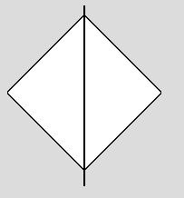

<!-- id: s14-01-0027 -->

il représente un double rapport qui peut se lire au premier abord comme plus grand (\>) ou plus petit (\<) :

<!-- id: s14-01-0028 -->

- **S** plus petit ou – aussi bien – plus grand que grand A. \[*lapsus de Lacan, en fait* : (a)\]

<!-- id: s14-01-0029 -->

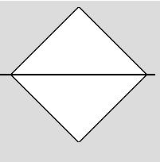

<!-- id: s14-01-0030 -->

- **S** inclus ou aussi bien exclu de grand A \[*lapsus réitéré*\].

<!-- id: s14-01-0031 -->

Qu’est-ce à dire ? Sinon que ce qui se suggère au premier plan de cette conjonction, c’est quelque chose qui logique­ment s’appelle la relation d’*inclusion* ou encore d’*implication*, à condition que nous la fassions réversible et qui s’articule… je vais vite sans doute, mais nous aurons tout le temps de nous étendre et de reprendre ces choses : aujourd’hui je vous l’in­dique, il suffit que nous posions quelques jalons suggestifs …cette relation qui s’articule de l’articu­lation logique, qui s’appelle : « *si et si seulement *».

<!-- id: s14-01-0032 -->

S barré dans ce sens, à savoir : *le poinçon* étant divi­sé par *la barre verticale*, c’est le sujet barré à ce rapport de « *si et si seulement *» avec le *petit(a) *: (S◊*a*)

<!-- id: s14-01-0033 -->

Ceci nous arrête : il existe donc un sujet… Voilà ce que logiquement nous sommes forcés d’écrire au principe d’une telle formule.

<!-- id: s14-01-0034 -->

Quelque chose, là, à nous se propose qui est la division de *l’existence de fait* et de *l’existence logique.*

<!-- id: s14-01-0035 -->

- *L’existence de fait* bien sûr nous reporte à l’existence d’\|*êtres*\| - entre deux barres le mot *êtres - êtres -* ou pas - *parlants.*

<!-- id: s14-01-0036 -->

Ceux-ci sont *en général vi­vants*. Je dis « *en général* », parce que ce n’est pas du tout forcé : nous avons *Le convive de pierre* qui n’exis­te pas seulement *dans la scène* où MOZART l’anime, il se promène parmi nous tout à fait couramment !

<!-- id: s14-01-0037 -->

- *L’existence logique est autre chose* et comme telle, a son statut : *il y a du sujet à partir du moment où nous faisons de la logique,* *c’est à dire où nous avons à ma­nier des signifiants.*

<!-- id: s14-01-0038 -->

Ce qu’il en est de *l’existence de fait*, à savoir que quelque chose résulte de ce qu’il y a du sujet au niveau des êtres qui parlent, c’est quelque chose qui, comme toute *existence de fait*, nécessite que soit éta­blie déjà une certaine articulation. Or, rien ne prou­ve que cette articulation se fasse en prise directe, que ce soit directement du fait qu’il y a des êtres vivants ou autres qui parlent, qu’ils soient pour autant et d’une façon immédiate, déterminés comme sujets.

<!-- id: s14-01-0039 -->

Le « *si et si seulement *» est là pour nous le rappeler. Je vous redis ici des articulations par lesquelles nous au­rons à repasser, mais elles sont en elles-mêmes assez inhabituelles, assez peu frayées, pour que je croie de­voir vous indiquer la ligne générale de mon dessein dans ce que j’ai à expliquer devant vous.

<!-- id: s14-01-0040 -->

*Petit(a)*, résulte d’une opération de structure logique, elle, effectuée non pas *in vivo*, non pas même sur le vivant, non pas à proprement parler \[sur le corps\] au sens confus que garde pour nous le terme de « *corps* »… ça n’est pas né­cessairement la « *livre de chair* »[^1], encore que cela puisse l’être et qu’après tout, quand ça l’est, ça n’arrange pas si mal les choses …mais enfin, il appert que dans cette entité si peu appréhendée du « *corps* », il y a quelque chose qui se prête à cette opération de structure logique, qu’il nous reste à déterminer. Vous savez : *le sein, le scybale, le regard, la voix*, ces pièces détachables et pour­tant entièrement reliées au corps, voilà ce dont il s’agit dans *l’objet petit(a).*

<!-- id: s14-01-0041 -->

Pour faire du *(a)*, donc, limitons-nous, puisque nous nous obligerons à quelque rigueur logique, à signaler ici, qu’il faut du « *prêt à le fournir* » : ça peut, momentanément, nous suffire. Et *ça n’arrange rien* ! *Ça n’arran­ge rien* pour ce en quoi nous avons à nous avancer : pour faire du fantasme, il faut du « *prêt à le porter* ».

<!-- id: s14-01-0042 -->

Vous me permettrez ici, d’articuler quelques thè­ses sous leur forme la plus provocante, puisque aussi bien ce dont il s’agit c’est de *décoller* ce domaine *des champs de capture* qui le font invinciblement revenir aux illusions les plus fondamentales : ce qu’on appel­le *l’expérience psychologique*. Ce que je vais avancer c’est très précisément ce qu’étaiera, ce que fondera, ce dont montrera la consistance, tout ce que je vais cette année, pour vous, dérouler.

<!-- id: s14-01-0043 -->

Dérouler, je l’ai déjà dit, il y a longtemps que c’est fait. Dans la quatrième année de mon séminaire, j’ai traité *La relation d’objet :* déjà concernant *l’objet petit(a)* tout est dit quant à *la structure du rapport du petit(a) à l’Autre*, tout à fait spécialement et très suffisam­ment amorcée dans l’indication que *c’est de l’imaginaire de la mère que va dépendre la structure subjective de l’enfant*. Assurément, ce qu’il s’agit ici pour nous d’indi­quer, c’est *en quoi ce rapport s’articule en termes pro­prement logiques, c’est à dire relevant radicalement de la fonction du signifiant.*

<!-- id: s14-01-0044 -->

Mais il est à noter que pour qui résumait alors ce que je pouvais indiquer dans ce sens, la moindre faute…

<!-- id: s14-01-0045 -->

> je veux dire : défaut concer­nant l’appartenance de chacun des termes de ces *trois fonctions* qui alors pouvaient
>
> se désigner comme *sujet, objet* - *au sens d’objet d’amour* - et de l’au-delà de celui­-ci, notre actuel *objet(a)* …la moindre faute, à savoir la référence à « *l’imagination du sujet* », pouvait obscurcir *la relation* qu’il s’agissait là d’esquisser.

<!-- id: s14-01-0046 -->

Ne pas si­tuer au champ de l’Autre comme tel, la fonction de *l’ob­jet(a)* \[amène un tel à écrire ?\] par exemple, que dans le statut du pervers, c’est à la fois la fonction, pour lui, du *phallus* et la théorie sadique du *coït* qui sont les *dé­terminants*.

<!-- id: s14-01-0047 -->

Alors qu’il n’en est rien, que c’est au niveau de la mère que ces deux incidences fonctionnent.

<!-- id: s14-01-0048 -->

J’avance donc, dans ce qu’il s’agit ici d’énoncer : pour faire du fantasme, il faut du « *prêt à porter *». Qu’est-ce que porte, *qu’est-ce qui porte le fantasme* ? *Ce qui porte le fan­tasme a deux noms*, ceux *qui concernent une seule et même subs­tance*, si vous voulez bien *- ce terme –* le réduire à *cette fonction de la surface* telle que je l’ai, l’année der­nière, articulée…

<!-- id: s14-01-0049 -->

> cette surface primordiale qu’il nous faut pour faire fonctionner notre articulation logique, vous en connaissez déjà quelques formes : ce sont des surfaces fermées, elles participent de *la bulle* à ceci près qu’elles ne sont pas sphériques.
>
> Appelons-les « *la bulle* » et nous verrons ce qui motive, ce à quoi s’attache, l’existence de *bulles* dans le *réel* …cette surface que j’appelle *bulle* a proprement deux noms : *le désir* et *la réalité*.

<!-- id: s14-01-0050 -->

Il est bien inutile de se fatiguer à articuler « *la* *réalité du désir* » parce que primordialement *le désir et la réalité ont un rapport de texture* *sans coupure,* ils n’ont donc pas besoin de *couture*, ils n’ont pas besoin d’être *recousus*. Il n’y a pas plus de « *réalité du désir* » qu’il n’est juste de dire « *l’envers de l’endroit* » : il y a une seule et même étoffe qui a *un envers* et *un en­droit*.

<!-- id: s14-01-0051 -->

Encore cette étoffe est-elle *tissée* de telle sor­te qu’on passe, sans s’en apercevoir, puisqu’elle est *sans coupure* et *sans couture,* de l’une à l’autre de ses faces et c’est pour cela que j’ai fait devant vous tellement état d’une structure comme celle dite du *plan projectif,* imagé au tableau dans ce qu’on appelle *la mitre* ou *le cross-cap.* Qu’on passe d’une face à l’autre sans s’en apercevoir, ceci dit bien *qu’il n’y en a qu’une* - j’entends : *qu’une face*.

<!-- id: s14-01-0052 -->

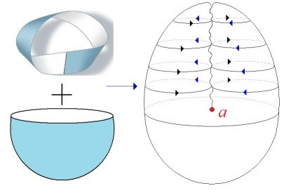

<!-- id: s14-01-0053 -->

Il n’en reste pas moins, comme dans *les surfaces* que je viens d’évoquer, dont une for­me parcellaire est *la bande de Mœbius* : il y a *un endroit* et *un envers*. Ceci est nécessaire à poser, d’une façon originelle, pour rappeler comment se fonde cette distinction de *l’endroit* et de *l’envers* en tant que déjà là avant toute coupure.

<!-- id: s14-01-0054 -->

Il est clair que *qui* - comme les *animalcules* dont font état les mathémati­ciens[^2] concernant la fonction des surfaces - *y serait* *dans cette surface*, intégralement impliqué, ne verra, à cette distinction pourtant sûre de *l’endroit* et de *l’en­vers*, que goutte, autrement dit : absolument rien.

<!-- id: s14-01-0055 -->

Tout ce qui se rapporte, dans les surfaces dont j’ai fait état devant vous, sériées depuis le *plan projectif* jusqu’à la *bouteille de Klein,* à ce qu’on peut appeler les propriétés extrinsèques, et qui vont fort loin : je veux dire que la plupart de *ce qui vous parait le plus évident*, quand je vous image ces surfaces *ne sont pas des propriétés de la surface : c’est dans une troisième dimension que ça prend sa fonc­tion*.

<!-- id: s14-01-0056 -->

Même le trou qui est au milieu du tore ne croyez pas qu’un être purement torique s’aperçoit même de sa fonction !

<!-- id: s14-01-0057 -->

Néanmoins, cette fonction n’est pas sans con­séquence puisque c’est d’après elle que j’ai, il y a - mon Dieu - quelque chose comme presque six ans, déjà essayé d’articuler - pour ceux qui m’écoutaient alors, parmi lesquels j’en vois, au premier rang - d’articu­ler les rapports du sujet à l’Autre *dans la névrose*.

<!-- id: s14-01-0058 -->

*C’est en effet de cette troisième dimension, en elle, de l’Autre qu’il s’agit, comme tel. C’est par rapport à l’Autre et en tant qu’il y a là cet autre ter­me,* *qu’il peut s’agir de distinguer un endroit d’un en­vers,* ce n’est pas encore distinguer *réalité* et *désir*. *Ce qui est endroit ou envers primitivement* *au lieu de l’Autre, dans le discours de l’Autre, se joue à pile ou face*. Ça ne concerne en rien le sujet, pour la rai­son qu’il n’y en a pas encore.

<!-- id: s14-01-0059 -->

*Le sujet commence avec la coupure*.

<!-- id: s14-01-0060 -->

Si nous prenons, de ces surfaces, la plus exemplaire parce que la plus simple à manier, à savoir celle que j’ai appelée tout à l’heure *cross-cap* ou *plan projectif*, une coupure mais pas n’importe laquelle, je veux dire…

<!-- id: s14-01-0061 -->

> je le rappelle pour ceux pour qui ces images ont encore quelque présence : si, je le répète, d’une façon purement ima­gée, mais dont l’image est nécessaire, à savoir sur cette *bulle* :

<!-- id: s14-01-0062 -->

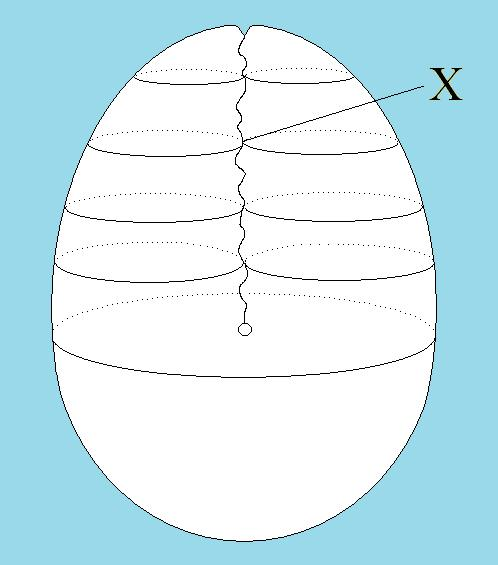

<!-- id: s14-01-0063 -->

> dont les parois (appelons-les anté­rieure et postérieure) vien­nent ici \[X\], en ce trait non moins imaginaire, se croi­ser.
>
> C’est ainsi que nous représentons la structure de ce dont il s’agit …toute découpe, toute coupe qui franchira cette ligne imaginaire, ins­taurera un changement total de la structure de la surface :

<!-- id: s14-01-0064 -->

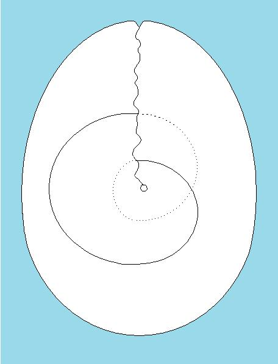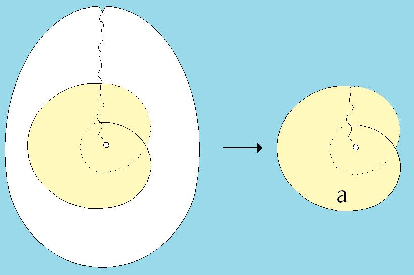

<!-- id: s14-01-0065 -->

- à savoir que cette surface toute entière devienne ce que l’année dernière, nous avons appris à découper dans cette surface sous le nom d’*objet(a),*

<!-- id: s14-01-0066 -->

- à savoir que – toute entière – la surface devient un disque aplatissable, avec un endroit et un envers, dont on doit dire qu’on ne peut pas passer de l’un à l’autre, sauf à franchir un *bord*.

<!-- id: s14-01-0067 -->

Ce *bord* c’est précisément ce qui rend ce franchissement *im­possible*, du moins pouvons–nous ainsi articuler sa fonc­tion.

<!-- id: s14-01-0068 -->

D’abord, *in initio,* la bulle - par cette première coupure riche d’une implication qui ne saute pas aux veux tout de suite – par cette première coupure, devient un *objet(a)*. Cet *objet(a)* garde - parce que ce rapport il l’a dès l’origine, pour que quoi que ce soit puisse s’en ex­pliquer, un rapport fondamental avec l’Autre.

<!-- id: s14-01-0069 -->

En effet, le sujet n’est point encore apparu avec *la seule coupure* par où cette bulle *qu’instaure le signifiant dans le réel,* laisse choir d’abord cet *objet étranger* qu’est l’*objet(a).* Il faut et il suffit, dans la structure ici indiquée, qu’on s’aperçoive de ce qu’il en est de cette coupure, pour s’apercevoir aussi qu’elle a la propriété, en se redoublant simplement, de se rejoindre – autrement dit que c’est la même chose de faire une seule coupure ou d’en faire deux :

<!-- id: s14-01-0070 -->

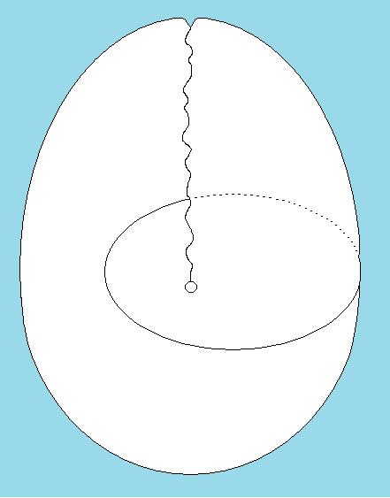 

<!-- id: s14-01-0071 -->

de considérer la béance de ce qu’il y a, ici, entre mes deux tours qui n’en font qu’un, comme l’équivalent de la première coupure, qui en effet :

<!-- id: s14-01-0072 -->

- si je l’écarte c’est cette béance qui se réalise,

<!-- -->

<!-- id: s14-01-0073 -->

- *mais si je fais dans le tissu où il s’agit d’exercer cette coupure, une double coupure, j’en dégage, j’en restitue ce qui a été perdu dans la première coupure : à savoir une surface dont l’endroit se continue avec l’envers. Je restitue la non-séparation primitive de la réalité et du désir.*

<!-- id: s14-01-0074 -->

Comment – de par après – nous définirons « *réalité* » ce que j’ai appelé tout à l’heure le « *prêt à porter le fantasme* » c’est à dire ce qui fait son « *cadre* » et nous verrons alors :

<!-- id: s14-01-0075 -->

- que *la réalité*, toute la réalité humaine, n’est rien d’autre que *montage du symbolique et de l’i­maginaire*,

<!-- id: s14-01-0076 -->

- que *le désir*, au centre de cet appareil, de ce cadre que nous appelons « *réalité* », c’est aussi bien, à proprement parler, ce qui couvre, comme je l’ai articulé depuis toujours, ce qu’il importe de distinguer de *la réalité humaine* et qui est à proprement parler *le réel,* qui n’est jamais *qu’en­tr’aperçu*, entr’aperçu quand le masque vacille, qui est celui du fantasme - à savoir la même chose que ce qu’a appréhendé SPINOZA, quand il a dit : « *Le désir, c’est l’essence de l’homme.* »

<!-- id: s14-01-0077 -->

À la vérité ce mot « *homme* » est un terme de tran­sition impossible à conserver dans un système athéolo­gique, ce qui n’est pas le cas de SPINOZA. À cette for­mule spinozienne, nous avons à substituer simplement cette formule – cette formule dont la méconnaissance conduit la psychanalyse aux aberrations les plus gros­sières à savoir que : « *Le désir est l’essence de la réalité.* »

<!-- id: s14-01-0078 -->

Mais, ce rapport \[de *l’objet(a)*\] à l’Autre - sans lequel rien ne peut être aperçu du jeu réel de ce rapport - c’est ce dont j’ai essayé de dessiner pour vous, en recourant au vieux support des *cercles d’Euler*, la relation comme fon­damentale. Assurément elle est insuffisante cette représenta­tion, mais si nous l’accompa­gnons de ce qu’elle supporte en logique, elle peut servir : ce qui ressortit du rapport du sujet à *l’objet(a)* se définit comme un premier cercle, qu’un autre cercle, celui de l’Autre vient recouper, le *(a)* est leur intersection :

<!-- id: s14-01-0079 -->

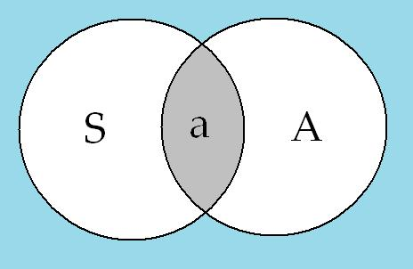

<!-- id: s14-01-0080 -->

C’est par là qu’à jamais…

<!-- id: s14-01-0081 -->

> dans *cette relation d’un vel originalement structuré* qui est celui où j’ai essayé d’articuler pour vous, il y a déjà trois ans, *l’aliénation* …le sujet ne saurait s’instituer que com­me un rapport de *manque* à ce *(a)* qui est de l’Autre, sauf à vouloir se situer dans l’Autre, à ne l’avoir également qu’*amputé* de cet *objet(a)*. Le rapport du sujet à *l’objet(a)* comporte ce que *l’image d’Euler* prend comme sens quand elle est portée au niveau de simple représentation des deux opérations logiques qu’on appelle « *réunion »* et « *intersection ».*

<!-- id: s14-01-0082 -->

La « *réunion »* nous dépeint la liaison du sujet à l’Autre et *l’inter­section* nous définit *l’objet(a).* L’ensemble de *ces deux opérations logiques* sont ces opérations-mêmes que j’ai mises originelles, en disant que le *(a)* est *le résultat effectué d’opérations logiques et qui doivent être deux.*

<!-- id: s14-01-0083 -->

Qu’est-ce à dire ? Que c’est essentiellement dans *la représentation* d’un *manque*, en tant qu’il court, que s’institue *la structure fondamentale* *de la bulle* que nous avons appelée d’abord *l’étoffe du désir.* Ici, dans le plan du rapport *imaginaire*, s’instau­re une relation exactement inversée de celle qui lie le *moi* à *l’image de l’autre.* Le *moi* est, nous le verrons, doublement illusoire :

<!-- id: s14-01-0084 -->

- *illusoire* en ceci qu’*il est sou­mis aux avatars de l’image*, c’est à dire aussi bien li­vré à la fonction du déni ou du faux–semblant.

<!-- id: s14-01-0085 -->

- Il est illusoire également en ceci qu’il instaure un ordre logique perverti dont nous verrons – *dans la théorie psychanalytique* – la formule, pour autant qu’elle franchit imprudemment cette frontière logique, qui suppose qu’à un moment quelconque donné, et qu’on suppose primor­dial de la structure, ce qui est rejeté peut s’appeler « *non-moi* ».

<!-- id: s14-01-0086 -->

*C’est très précisément ce que nous contestons !*

<!-- id: s14-01-0087 -->

L’ordre dont il s’agit, qui implique, sans qu’on le sache et en tout cas sans qu’on le dise, l’entrée en jeu du langage, n’admet d’aucune façon une telle complémentari­té. Et c’est précisément ce qui nous fera mettre *au pre­mier plan, cette année,* de notre articulation, la dis­cussion de *la fonction de la négation.*

<!-- id: s14-01-0088 -->

Chacun sait, et pourra s’apercevoir dans ce recueil mis maintenant à votre portée, que la 1ère année de mon séminaire à Sainte-Anne fut dominée par une discussion sur la *Verneinung* ou M. Jean HIPPOLYTE dont l’intervention est reproduite dans l’appendice de ce volume, scanda excellemment ce qu’était pour FREUD la *Verneinung*. La seconda­rité de la *Verneinung* y est articulée assez puissamment pour que d’ores et déjà il ne puisse aucunement être ad­mis qu’elle surviendrait d’emblée au niveau de cette première scission que nous appelons *plaisir* et *déplaisir.* C’est pourquoi dans ce *manque* instauré par la structure de *la bulle,* qui fait l’étoffe du sujet, il n’est aucunement question de nous limiter au terme, dé­sormais désuet pour les confusions qu’il implique, de « *négativité* ».

<!-- id: s14-01-0089 -->

*Le signifiant* ne saurait aucunement…

<!-- id: s14-01-0090 -->

> même si propédeutiquement il a fallu pendant un temps en seriner la fonction aux oreilles qui m’écoutent …*le signifiant*…

<!-- id: s14-01-0091 -->

> et l’on pourra remarquer que je ne l’ai ja­mais proprement articulé comme tel …*n’est pas seulement ce qui supporte ce qui n’est pas là* [^3].

<!-- id: s14-01-0092 -->

Le *fort-da,* en tant qu’il se rapporte à *la présence* ou à *l’absence* maternel­le, n’est pas là l’articulation exhaustive de l’entrée en jeu du signifiant. *Ce qui n’est pas là, le signifiant ne le désigne pas, il l’engendre. Ce qui n’est pas là, à l’origi­ne, c’est le sujet lui-même.* Autrement dit, *à l’origi­ne il n’y a pas de Dasein sinon dans l’objet(a)*, *c’est à dire sous une forme aliénée*, qui reste marquer jusqu’à son terme, toute énonciation concernant le *Dasein.* Est­-il besoin de rappeler ici mes formules : *qu’il n’y a de sujet que par un signifiant et pour un autre signifiant*.

<!-- id: s14-01-0093 -->

C’est l’algorithme :

<!-- id: s14-01-0094 -->

> 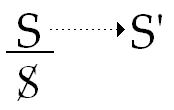

<!-- id: s14-01-0095 -->

S en tant qu’il *tient lieu* du sujet, ne fonctionne que *pour* un autre signifiant*. L’Urverdrängung* ou refoulement originaire c’est ceci : ce qu’un signifiant représente pour un autre signifiant. Ça ne mord sur rien, ça ne constitue absolument rien, ça s’accommode d’une absence absolue de *Dasein.*

<!-- id: s14-01-0096 -->

Pendant environ seize siècles, au minimum, *les hiéro­glyphes égyptiens sont restés solitaires autant qu’in­compris dans le sable du désert*, il est clair et il a toujours été clair pour tout le monde, que ceci voulait dire que chacun des signifiants gravés dans la pierre, au minimum, représentait un sujet pour les autres signi­fiants. Si cela n’en était pas ainsi jamais personne n’aurait même pris ça pour une écriture ! *Il n’est nulle­ment nécessaire qu’une écriture veuille dire quelque chose pour qui que ce soit, pour qu’elle soit une écri­ture et pour que,* *comme telle, elle manifeste que chaque signe représente un sujet pour celui qui le suit.*

<!-- id: s14-01-0097 -->

Si nous appelons cela *Urverdrängung,* ça veut dire que nous admettons, qu’il nous parait conforme à l’expé­rience, de penser ce qui se passe, à savoir : *qu’un sujet émerge à l’état de sujet barré comme quelque chose qui vient*

<!-- id: s14-01-0098 -->

- *d’un lieu où il est supposé inscrit,*

<!-- id: s14-01-0099 -->

- *dans un autre lieu où il va s’inscrire à nouveau.*

<!-- id: s14-01-0100 -->

À savoir exactement de la même façon quand je structurais autrefois la fonction de la métaphore, en tant qu’elle est le modèle de ce qui se passe quant au retour du refoulé :

<!-- id: s14-01-0101 -->

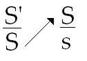

<!-- id: s14-01-0102 -->

De même, c’est pour autant qu’à l’égard de ce *signi­fiant premier*, dont nous allons voir quel il est, le sujet barré \[S\] qu’il abolit vient à surgir à une place où nous allons pouvoir donner aujourd’hui une formule qui n’a pas encore été donnée : *le sujet barré*, comme tel, *c’est ce qui représente pour un* *signifiant* - ce signifiant d’ou il a surgi - *un sens*. J’entends par « *sens* » exactement ce que je vous ai fait entendre au début d’une année[^4] sous la formule : « *Colourless green ideas sleep furiously.* » Ce qui peut se tradui­re en français *par ceci qui dépeint admirablement l’or­dre ordinaire de vos cogitations* : « *Des idées vertement fuli­gineuses s’assoupissent avec fureur !* »

<!-- id: s14-01-0103 -->

Ceci, précisément faute de savoir qu’elles s’adres­sent toutes à ce *signifiant du manque* du sujet que de­vient un certain *premier signifiant* dès que le sujet ar­ticule son discours. *À savoir* *ce dont quand même tous les psychanalystes se sont assez bien aperçus, encore qu’ils ne surent rien en dire qui vaille*, *à savoir* *l’objet(a)* qui à ce niveau remplit précisément la fonction que FREGE distingue du *sinn* sous le nom de *Bedeutung* \[signification\], *c’est la première Bedeutung l’objet(a), le pre­mier référent*, *la première réalité*, la *Bedeutung* qui reste parce qu’elle est, après tout, tout ce qui reste de la pensée à la fin de tous les discours.

<!-- id: s14-01-0104 -->

- *À savoir*, ce que le poète[^5] peut écrire sans savoir ce qu’il dit quand il s’adresse à sa « *mère Intelligence chez qui la douceur coulait,* *quelle est cette négli­gence qui laisse tarir son lait ?* »

<!-- id: s14-01-0105 -->

- *À savoir*, un regard *saisi* qui est celui qui se transmet à la naissance de la clinique.

<!-- id: s14-01-0106 -->

- *À savoir*, ce qu’un de mes élèves, récemment, au Congrès de l’Université John HOPKINS[^6], prit pour sujet en l’appelant

<!-- id: s14-01-0107 -->

« *La voix dans le mythe littéraire* ». \[Guy Rosolato : *The voice and the literary myth*\]

<!-- id: s14-01-0108 -->

- *À savoir*, aussi ce qui reste de tant de pensées dé­pensées sous forme *d’un fatras pseudo-scientifique et qu’on peut aussi bien appeler par son nom*, comme je l’ai fait depuis longtemps *concernant une partie de la litté­rature analytique* et qu’on appelle : *de la merde*. De l’aveu, d’ailleurs, des auteurs ! Je veux dire qu’à une toute petite défaillance de raisonnement près, concer­nant la fonction de *l’objet(a)*, tel d’entre eux peut fort bien articuler qu’il n’y a d’autre support au *complexe de castration* que ce qu’on appelle pudiquement « *l’objet anal* ».

<!-- id: s14-01-0109 -->

Ce n’est donc pas là un *épinglage* de pure et simple *appréciation*, mais bien plutôt la nécessité d’une arti­culation dont le seul énoncé doit retenir, puisque après tout il ne se formule pas des plumes les moins qualifiées et que ce sera aussi bien cette année notre méthode, formulant la *Logique du fantasme*, de montrer où dans la théorie analytique elle vient à trébucher. Je n’ai pas, après tout, nommé cet auteur que beaucoup connaissent. Qu’on entende bien que la faute de raisonnement encore est-elle raisonnée, c’est à dire arraisonnable, mais ce n’est pas obligatoire !

<!-- id: s14-01-0110 -->

Et *l’objet(a)* en question peut, dans tel article, se montrer tout à fait nu et ne s’ap­préciant pas de lui-même. C’est ce que nous aurons l’oc­casion de montrer dans certains textes, après tout dont je ne vois pas pourquoi, à titre de travaux pratiques, je ne vous ferais pas bientôt une distribution assez générale, si j’en ai suffisamment - ce qui est à peu près le cas - à ma disposition.

<!-- id: s14-01-0111 -->

Ceci viendra, au moment où nous aurons à attaquer certain registre et dès main­tenant je veux tout de même marquer ce qui empêche d’ad­mettre certaines interprétations qui ont été données de ma fonction de la métaphore…

<!-- id: s14-01-0112 -->

> je veux dire de celles dont je viens de vous donner l’exemple le moins ambigu …de la confondre avec quoi que ce soit qui en fasse une sorte de *rapport proportionnel*.

<!-- id: s14-01-0113 -->

### Quand j’ai écrit que la substitution…

<!-- id: s14-01-0114 -->

> le fait d’*enter*[^7] un signifiant substitué à un autre signifiant sur la chaîne signifiante …c’est la source et l’origi­ne de toute signification, ce que j’ai articulé s’inter­prète correctement sous la forme où, aujourd’hui, par le surgissement de ce *sujet barré* comme tel, je vous ai donné la formule.

<!-- id: s14-01-0115 -->

Ce qui exige de nous la tâche de lui donner *son statut logique*.

<!-- id: s14-01-0116 -->

Mais pour vous montrer tout de suite l’exemple de l’urgence d’une telle tâche, ou seulement de sa nécessité, observez que la confusion fut faite de ce rapport à quatre :

<!-- id: s14-01-0117 -->

<!-- id: s14-01-0118 -->

le S’, les deux S et le petit s du signifié, avec cette relation de proportion où un de mes interlocu­teurs…

<!-- id: s14-01-0119 -->

> M. PERELMAN, l’auteur d’une théorie de l’argu­mentation, promouvant à nouveau une rhétorique abandon­née …articule la métaphore, y voyant la fonction de l’analogie et que c’est du rapport d’un signifiant à un autre en tant qu’un troisième le reproduit en faisant surgir un signifié idéal, qu’il fonde la fonction de la métaphore. À quoi j’ai répondu, en son temps.

<!-- id: s14-01-0120 -->

C’est uni­quement d’une telle métaphore que peut surgir la formule qui a été donnée, à savoir :

<!-- id: s14-01-0121 -->

> 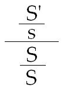

<!-- id: s14-01-0122 -->

S’ sur le petit s de la signification trônant au haut d’un premier registre d’inscription dont l’*Underdrawn,* dont l’*Unterdrückt,* dont l’autre registre substantifiant l’inconscient, serait constitué par ce rapport étrange d’un signifiant à un autre signifiant, dont on nous ajoute que c’est de là que le langage prendrait son lest.

<!-- id: s14-01-0123 -->

Cette formule *dite du «* *langage réduit* », je pense que vous le sentez maintenant, repose sur une erreur, qui est d’induire dans ce rapport à quatre, la structure d’une *proportionnalité*. On voit mal - aussi bien - ce qui peut en sortir, puisque aussi bien le rapport S/S devient alors plutôt difficile à interpréter. Mais nous ne voyons, dans cette référence à un « *langage réduit* », d’autre des­sein - d’ailleurs avoué - que de réduire notre formule que « *l’inconscient est structuré comme un langage* », *la­quelle*, plus que jamais, *est à prendre au pied de la let­tre*.

<!-- id: s14-01-0124 -->

Et puisque aujourd’hui, il s’avère que je ne rempli­rai pas les cinq points que je vous ai annoncés, je n’en arrive pas moins à pouvoir \- pour vous - scander ce qui est ici à la clef de toute la structure et ce qui rend l’entreprise, qui s’est trouvée ainsi articulée : …

<!-- id: s14-01-0125 -->

> très précisément au début du petit recueil dont je vous par­lais tout à l’heure, qui concerne
>
> *le tournant de mes rapports avec mon audience*, qu’a constitué le *Congrès de Bonneval* …il est erroné de structu­rer ainsi, *sur un prétendu mythe de « langage réduit* », au­cune déduction de l’inconscient, pour la raison suivan­te : *il est de la nature de tout et d’aucun signifiant de ne pou­voir en aucun cas se signifier lui-même.*

<!-- id: s14-01-0126 -->

L’heure est assez avancée pour que je ne vous impo­se pas, dans la hâte, l’écriture de ce point inaugural de toute *théorie des ensembles*, qui implique que cette théorie ne peut fonctionner qu’à partir d’un *axiome* dit *de spécification.* C’est à savoir qu’il n’y a d’intérêt à faire fonctionner *un ensemble* que s’il existe *un autre ensemble* qui puisse se définir par la définition de certains x dans le premier comme satisfaisant *librement* à une certaine proposition. « *Librement* » veut dire *in­dépendamment de toute quantification* : « *petit nombre* » ou « *tout* ».

<!-- id: s14-01-0127 -->

Il en résulte - je commencerai ma prochaine leçon par ces formules - il en résulte qu’à poser un ensemble quelconque, en y définissant la proposition, que j’ai indiquée comme *y* spécifiant des *x,* comme étant simple­ment que *x n’est pas membre de* *lui-même* - ce qui, pour ce qui nous intéresse, à savoir pour ceci qui s’impose dès qu’on veut introduire le mythe d’un langage réduit, qu’il y a un langage qui ne l’est pas, c’est à dire qui constitue, par exemple, « *l’ensemble des signifiants* ».

<!-- id: s14-01-0128 -->

Le propre de « *l’ensemble des signifiants* », je vous le montre­rai en détail, comporte ceci de nécessaire… si nous ad­mettons seulement *que le signifiant ne saurait se signifier lui-même* …comporte ceci de nécessaire : qu’*il y a quelque chose qui n’appartient pas à cet ensemble*. Il n’est pas possible de réduire le langage, simplement en raison de ceci que le langage ne saurait constituer un *ensemble fermé*, autrement dit : « *Il n’y a pas d’univers du discours* ».

<!-- id: s14-01-0129 -->

Pour ceux qui auraient eu quelque peine à entendre ce que je viens de formuler, je rappellerai seulement ceci que j’ai déjà dit en son temps : que les vérités que je viens d’énoncer sont simplement celles qui sont apparues d’une façon confuse à la période naïve de l’instauration de la théorie des ensembles, sous la forme de ce qu’on appelle faussement « *le paradoxe de Russell* » - car ce n’est pas un paradoxe, c’est une ima­ge - le catalogue de tous les catalogues qui ne se contiennent pas eux-mêmes. Qu’est-ce à dire ?

<!-- id: s14-01-0130 -->

- Ou bien il se contient lui-même et il contredit à sa défini­tion,

<!-- id: s14-01-0131 -->

- ou bien il ne se contient pas lui-même et alors il manque à sa mission.

<!-- id: s14-01-0132 -->

*Ce n’est nullement un paradoxe*. On n’a qu’à déclarer qu’*à faire un pareil catalogue, on ne peut pas le pousser jusqu’au bout*, et pour cause.

<!-- id: s14-01-0133 -->

Mais, ce dont tout à l’heure je vous ai donné l’énoncé sous cette formule que : *dans l’univers du dis­cours il n’est rien qui contienne tout*, voilà qui à proprement parler nous incite à y être tout spéciale­ment prudents quant au maniement de ce qu’on appelle « *tout* » et « *partie* » et à exiger à l’origine, que nous distin­guions ceci sévèrement - ce sera l’objet de mon prochain cours - l’*Un* de *la totalité…* que justement je viens de réfuter, disant au niveau du discours qu’il n’y a pas d’Univers, ce qui assurément laisse encore plus en sus­pens que nous puissions le supposer n’importe où ail­leurs …distinguer cet *Un* de l’1 *comptable* en tant que de sa nature, il se dérobe et glisse, pour ne pouvoir être l’1 qu’à se répéter au moins une fois et se re­fermant sur lui-même, instaurer à l’origine, le manque dont il s’agit : il s’agit d’instituer le sujet.

## Notes

[^1]: Cf. Shakespeare : *Le marchand de Venise*.

[^2]: Poincaré : *La science et l'hypothèse*, Paris, Flammarion, 1968, 2e partie, chap. III, La géométrie de Riemann : « Imaginons un monde uniquement peuplé d'êtres dénués

    d'épaisseur ; et supposons que ces animaux « infiniment plats » soient tous dans un même plan et n'en puissent sortir. \[...\]Dans ce cas, ils n'attribueront certainement

    à l'espace que deux dimensions

[^3]: Cf. Frege : « *Les signes donnent présence à ce qui est absent, invisible, et le cas échéant inaccessible aux sens* », p. 63, in *Écrits logiques et philosophiques*, Seuil, Paris, 1971.

[^4]: Cf. Séminaire 1964-65 : *Problèmes cruciaux*…, séance du 02-12-1964 ; exemple extrait par Lacan de N. Chomsky : *Structures syntaxiques* Paris, Points Seuil, 1979.

[^5]: Paul Valéry (1871-1945)

    > *...Par la surprise saisie,  
    > Une bouche qui buvait  
    > Au sein de la Poésie  
    > En sépare son duvet :  
    > - O ma mère Intelligence,  
    > De qui la douceur coulait,  
    > Quelle est cette négligence  
    > Qui laisse tarir son lait !*

[^6]: 18-21 Octobre 1966, Université John Hopkins, symposium international : *The Structuralist Controversy : The Languages of Criticism and The Sciences of Man.* 

    John Hopkins University Press, Baltimore, 1970 (rééd. 2007) Guy Rosolato : *The voice and the literary myth*, p.201.

[^7]: Enter : *Arboric.* placer une ente, une greffe dans l’ouverture préparée sur la tige ou tronc d’un végétal.

    *charpent.* Assemblage par entailles de deux pièces de bois mises bout à bout.
