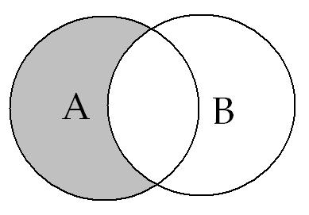

# Leçon 03 | 30 Novembre 1966

<!-- source-url: http://staferla.free.fr/S14/S14 LOGIQUE.docx -->
<!-- seminar: s14 -->
<!-- lesson: 03 -->

<!-- id: s14-03-0001 -->

[MILLER](#Miller)

<!-- id: s14-03-0002 -->

LACAN

<!-- id: s14-03-0003 -->

Aujourd’hui vous allez entendre, une com­munication de Jacques-Alain MILLER. Ceci…

<!-- id: s14-03-0004 -->

> dont je vous ai averti la dernière fois,
>
> peut-être un peu tard, une partie de l’assemblée étant déjà dispersée au moment où j’en ai fait l’annonce …marque que je désire que reste fondé ce nom curieux de *séminaire,* attaché à mon enseigne­ment depuis Sainte-Anne où il s’est tenu pendant dix ans, comme vous le savez.

<!-- id: s14-03-0005 -->

Pour ne parler que des deux années qui ont précédé ici, certains d’entre vous n’ignorent pas - à leur grand désagrément - que j’ai voulu que ce séminaire se tînt d’une façon effective, croyant que cette effectivité devait être liée à une certaine réduction de cette audience si nombreuse et si sympathique que vous me donnez par votre assiduité et votre attention.

<!-- id: s14-03-0006 -->

Et - mon Dieu - tant d’assiduité, d’atten­tion méritent bien des égards, lesquels m’ont rendu bien dif­ficile ce que la réduction de l’audience nécessitait de triage. De sorte qu’au total votre nombre plus réduit, ne l’était pas tellement que, du point de vue de la quantité, qui joue un rôle si important dans la communication, les choses eussent à proprement parler changé d’échelle.

<!-- id: s14-03-0007 -->

Aussi laisserai-je en suspens, cette année, la solution de ce difficile problème. Jusqu’à nouvel ordre et sans m’y engager aucunement, je ne ferme aucun de ces mercredis qu’ils soient terminaux, semi-terminaux ou autres.

<!-- id: s14-03-0008 -->

Je désirerais seulement que fut maintenu ce nom de *séminaire,* sous un mode plus marqué que nous le vîmes à Sainte-Anne, où jusque dans les toutes dernières années il y eut des réunions au cours desquelles je déléguais la parole à tel ou tel de ceux qui me suivaient alors.

<!-- id: s14-03-0009 -->

Néan­moins quelque ambigüité demeure qui suspend cette appel­lation de *séminaire* entre l’usage propre d’une catégorie, un endroit où quelque chose doit s’échanger, où la transmission, la dissémination d’une doctrine doit se manifester comme telle, c’est-à-dire *en voie de véhiculation* , et je ne sais quel autre « usage », non point du *nom propre* - *car toute la discussion du nom propre pour­rait s’engager* *là-dessus -* mais disons d’une « *nomination par excellence* » laquelle « *nomination par excellence* » deviendrait une « *nomination par ironie* ».

<!-- id: s14-03-0010 -->

Dès lors, je crois que pour bien marquer que ce n’est pas l’état de choses où j’entends que se stabilise l’usage de cette appellation, vous verrez périodiquement intervenir un certain nombre de person­nes qui s’y montreront disposées.

<!-- id: s14-03-0011 -->

Assurément Jacques-Alain MILLER, pour en inaugurer la suite, a quelque titre cette année : il vous a fourni dans mon livre[^9] cet *index raisonné des concepts* qui, d’après ce que j’entends, est fort bien venu pour beaucoup, qui trouvent *grand avantage* à ce *fil d’Ariane* qui leur permet de se promener à travers cette succession d’articles, où telle notion où tel concept, comme le terme est employé plus judicieusement, se retrou­ve à des étages divers.

<!-- id: s14-03-0012 -->

Tout petit détail : je signale, pour répondre à une question qui m’a été posée, que dans cet index, les chiffres *italiques* marquent les passages essentiels et que les chiffres droits ou romains, marquent des passages où le concept est intéressé d’une façon plus « *en passant* ». Il arrive qu’à la page qui vous est désignée, ce qui est référé ainsi tient en une indication dans une ligne, c’est dire le soin avec lequel ce petit appareil si utilisable a été construit.

<!-- id: s14-03-0013 -->

On m’annonce que le livre est - comme on dit en ce *franglais* que quant à moi je ne ré­pudie pas - *out of print,* ce qui veut dire « *épuisé* ». Je trouve « *out of print* » plus gentil, « *épuisé* » \[Rires\] : on se demande ce qui lui est arrivé. J’espère que cet *out of print* ne dure­ra pas trop longtemps. C’est ce qui s’appelle un succès, mais un succès *de vente *! Ne préjugeons pas de l’*autre* succès, dont il reste tout à attendre et qui laisse ouverte la question.

<!-- id: s14-03-0014 -->

On a pu remarquer que *c’est un livre que je ne me suis pas beaucoup pressé de mettre dans la circulation*. Si j’ai tellement tardé à le faire, on peut se poser la question « *Pourquoi maintenant. Qu’est-ce qu’il en attend ?* ». Il est bien clair que la réponse : « *Que ça vous serve !* » n’était pas moins valable il y a une année ou deux, et même bien avant. La question n’est donc pas simple, elle intéresse tout ce qu’il en est de mes rapports avec quelque chose qui joue là la fonction de base…

<!-- id: s14-03-0015 -->

> à savoir la psychanalyse sous sa forme *incarnée,* nous dirions vite, ou bien *as­sujettie* *…*autrement dit : avec les psychanalystes eux-mêmes.

<!-- id: s14-03-0016 -->

Plusieurs éléments m’ont paru motiver que ce que j’essayai de construire restât dans un champ réservé, permettant la sélection \- qui s’est faite ! - de ceux qui voudraient bien se décider à reconnaître les consé­quences qu’impliquait l’étude de FREUD dans leur pratique.

<!-- id: s14-03-0017 -->

Finalement les choses ne se passent jamais tout à fait de la façon calculée, en ces difficiles matières où *la résistance n’est pas localisée* à ce qu’il faut désigner - au sens étroit de ce terme - dans *la praxis analytique*, elle a une autre forme où le contexte social n’est point sans portée. Ce qui me rend délicat de m’en expliquer devant une aussi vaste au­dience.

<!-- id: s14-03-0018 -->

C’est bien pourquoi, tout ce qui concerne ce que j’appellerais les *relations extérieures* de mon enseignement…

<!-- id: s14-03-0019 -->

> je n’envisage pas autrement tout ce qui peut se manifester de *brouhaha* et de *remue-ménage* autour de termes,
>
> auxquels je ne me vois pas d’un très bon œil associé : ainsi du « *structuralisme* » …je ne me sens nullement disposé, sauf à ce que j’y sois forcé par quelque incidence de ce que j’appelais tout à l’heure « le succès du livre » à mor­dre sur un temps mesuré.

<!-- id: s14-03-0020 -->

Vous voyez ou sentez, par votre expérience de ces dernières années, que je n’ai pas de temps à perdre si je veux énoncer devant vous les choses au niveau de la construction que j’inaugurais dans son style par mon dernier séminaire et le point où j’ai entendu établir l’amorce de cette *logique* que j’ai à développer devant vous cette année.

<!-- id: s14-03-0021 -->

Comme tout de même ce livre existe avec les premiers mouvements qu’il entraîne - *lesquels seront suivis d’autres* - et que les deux ou trois points que je viens de faire surgir en tant que principaux - mais il y en a d’autres - risquent de rester en suspens, je crois devoir vous avertir que vous en trouverez l’explication, au moins une explication suffisante telle qu’elle vous permette de répondre au moins en partie aux questions qui pour vous resteraient en suspens, dans deux *interviews* qui paraîtront cette semaine, si mon information est bonne, dans ces endroits qui n’ont rien d’une foire : *Le* *Figaro littéraire* \[1966-12-01 : [*Interview au Figaro Littéraire*](http://www.ecole-lacanienne.net/documents/1966-12-01.doc)\] et *Les* *Lettres françaises.* \[1966-11-26 : [*Entretien avec Pierre Daix*](http://www.ecole-lacanienne.net/documents/1966-11-26.doc)\] \[Rires\] Vous en saurez peut-être alors un peu plus long.

<!-- id: s14-03-0022 -->

En outre ne pouvant m’empêcher, chaque fois que j’ai un de ces modes de *relations extérieures,* d’y mettre un petit peu de ce qui est en cours, il est possible que vous trouviez par-ci, par-là, quelque chose qui se rapporte à notre discours de cette année.

<!-- id: s14-03-0023 -->

J’ai quelque scrupule - je le disais la dernière fois - à vous parler de la *répétition du trait unaire* comme s’instituant fondamentalement, de cette répétition dont on peut dire qu’elle n’arrive qu’une seule fois, ce qui signifie qu’elle est double, sans ça il n’y aurait pas de répétition. Ce qui d’emblée, pour quiconque veut un peu s’y arrêter, instaure dans son fondement le plus radical, *la division du sujet*.

<!-- id: s14-03-0024 -->

Si j’énonçais cette notion devant vous, la dernière fois, presque en passant, alors qu’à ce congrès de John HOPKINS au mois d’Octobre, je l’ai mâché pendant environ *trois quarts d’heure*, c’est peut-être que je vous fais plus grand crédit qu’à mes auditeurs d’alors, certains échos reçus depuis m’ayant montré que *l’oreille structuraliste*, quels qu’en soient les tenants, *est capable de se montrer* *un peu dure de la feuille* ! \[Rires\] Dans des endroits plus inattendus encore, ou vous pourrez peut–être…

<!-- id: s14-03-0025 -->

### *X dans la salle : « on n’entend pas ! »*

<!-- id: s14-03-0026 -->

### LACAN

<!-- id: s14-03-0027 -->

Quoi ? Qui est-ce qui n’entend pas ? Il y a combien de temps que vous n’entendez rien ? \[Rires\] …Dans des endroits plus inattendus encore, vous pourrez peut-être trouver sur ces différents thèmes, jusques et y compris ces petites *indications-amorces* jamais trop tôt venues, sur certains thèmes que j’aurai à développer par la suite. Et par exemple sur la fonction du *préconscient* dont - chose curieuse - on ne sem­ble pas s’occuper depuis *un bon bout de temps*...

<!-- id: s14-03-0028 -->

depuis qu’on mêle tout, en croyant le maintenir distingué ...des fonctions que FREUD lui réservait. Le *préconscient* s’est glissé au passage dans un de ces entretiens, je ne sais plus lequel, auxquels il convient d’en ajouter deux autres, inattendus pour vous je pense : ils se tiendront à l’O.R.T.F.

<!-- id: s14-03-0029 -->

L’un, vendredi prochain à 10H 45, heure de « grande écoute » m’a-t-on assuré \[Rires\]. Je veux bien le croire, mais je pense que vous serez tous à l’hôpital. Enfin… vous vous ar­rangerez comme vous pourrez et j’espère pouvoir en communiquer le texte, si la Radio veut bien m’en donner l’autorisation. Le deuxième entretien aura lieu lundi. On est pressé, vous le voyez.

<!-- id: s14-03-0030 -->

Le premier c’est Georges CHARBONNIER qui a bien voulu m’en donner la place, et le second c’est M. Pierre DAIX grâce à qui vous aurez peut-être quelque chose de plus vivant que le premier, puisque ce sera un dialogue avec la personne la plus qualifiée pour le soutenir, nommément François WAHL - qui est ici - et qui a bien voulu se livrer avec moi à cet exerci­ce.

<!-- id: s14-03-0031 -->

X dans la salle : *à quelle heure ?*

<!-- id: s14-03-0032 -->

Ça… je ne jure de rien ! Il paraît que c’est à partir de 6h 15, seulement on ne parle pas que de mon livre et je ne peux pas vous dire à quel rang ceci apparaîtra entre *six heures un quart* et *sept heures*, chacun ayant son quart d’heure… Qu’y a-t-il chère Irène ?

<!-- id: s14-03-0033 -->

Irène PERRIER-ROUBLEF  : *Est-ce à six heures du matin ?*

<!-- id: s14-03-0034 -->

C’est une heure de grande écoute qui en général est accompagnée de mouvements de gymnastique. \[Rires\]

<!-- id: s14-03-0035 -->

Voilà, enfin on verra la suite de tout ça… Avant de donner la parole à Jacques-Alain MILLER, je veux vous faire connaître quelque chose de très amusant, qui m’a été apporté par un fidèle : la communication émanant d’une revue spécialisée, fait état tant des machines I.B.M. que de ce qu’on en fait à un niveau expérimental au *Massachusetts Institut of Technology* - *M.I.T. comme on dit communément* - et nous parle de l’usage d’une de ces machines de rang élevé comme il s’en fait maintenant, à laquelle a été donné - certainement pas pour rien - le nom d’*Elisa,* *elle s’appelle tout au moins Elisa pour l’usage qu’on fait et que je vais vous dire.*

<!-- id: s14-03-0036 -->

*Elisa* est, dans une pièce bien connue : « *Pygmalion »* [^10], la personne à qui on apprend le « *beau parler* »…

<!-- id: s14-03-0037 -->

> alors qu’elle est une petite vendeuse de bouquets de fleurs dans les rues les plus « *courantées* » de Londres …et qu’il s’agit de dresser à pouvoir s’exprimer dans la meilleure société, sans qu’on puisse remarquer qu’elle n’en fait point partie.

<!-- id: s14-03-0038 -->

*Quelque chose de cet ordre surgit avec la dite machine*. À la vérité ce n’est pas à proprement parler de cela qu’il s’agit. Qu’une machine soit ca­pable de donner des *réponses articulées*, simplement quand on lui parle - *je ne dis pas quand on l’interroge* - s’avère maintenant un jeu, lequel met en question ce qui peut se produire : *d’obtenir ces réponses chez celui qui lui parle*.

<!-- id: s14-03-0039 -->

La chose n’est pas articulée d’une façon qui satisfasse complètement à une situation pour nous si utilisable, nous donnant une réfé­rence si intéressante dans le discours poursuivi. Elle n’est pas énoncée d’une façon qui tienne compte du cadre où nous pourrions l’insérer. Néanmoins elle est fort intéressante parce qu’il y est en fin de compte suggéré quel­que chose qui pourrait être considéré comme une fonction thérapeutique de la machine. Pour tout dire, *ce n’est rien moins que l’analogue d’un transfert,* qui pour­rait se produire dans cette relation, dont la question est soulevée. Ceci, qui ne m’a pas déplu, n’est pas sans rapport avec tout ce que je laisse ouvert concernant la façon dont j’ai à manier la diffusion de ce que vous appelez mon *enseignement*.

<!-- id: s14-03-0040 -->

Et je voudrais que vous trouviez là le maniement *d’une première chaîne symbolique dont il fallait que les psychanalystes conçussent la notion*. Notion à laquelle il convenait que leur esprit s’accommodât, pour se centrer convenablement sur *ce que* FREUD *appelle* *remémoration* , et qui leur donnât le modèle subjectif de la construction de cette chaîne symbolique, et de sa sorte de mémoire à elle.

<!-- id: s14-03-0041 -->

Mémoire incontestablement consistante et même insis­tante, articulée dans ce qui vient maintenant dans ce livre, au second chapitre, au second temps : dans la position inversée où l’*Introduction à La lettre volée* qui précède, est fixée, c’est à dire juste après *La lettre volée*.

<!-- id: s14-03-0042 -->

Je rappelle à ceux qui m’entendaient alors, que cette construction, comme toutes les autres, fut faite devant eux et pour eux, pas à pas, et que je commençais par un examen, à partir d’un texte de POE, à savoir la façon dont l’esprit travaille sur ce thème : « *Peut-on gagner au jeu de pair ou impair ?* ».

<!-- id: s14-03-0043 -->

Mon second pas avait été d’imaginer *une machine* de cette nature. Ce qui est effectivement produit aujourd’hui ne diffère en rien de ce que j’avais articulé alors, simplement *la machine* est supposée par le sujet être munie d’une *programmation* telle qu’elle tienne compte des gains et des pertes.

<!-- id: s14-03-0044 -->

Partant de ceci \[Cf. *La lettre volée, Écrits*\]…

<!-- id: s14-03-0045 -->

- que le sujet l’interrogerait - la dite machine - en jouant avec elle au *jeu de pair ou impair *,

<!-- id: s14-03-0046 -->

- et de *cette seule supposition*, qu’elle a au moins pendant un certain nombre de coups, *la mémoire de ses gains et de ses pertes*, …on peut construire cette suite de +, +, –, +, –,... lesquels englobés, réunis dans une parenthèse d’une longueur type et qui se déplace d’un rang à chaque fois, nous permet d’établir ce trajet que j’ai construit, sur lequel je fonde ce premier type le plus élémentaire de modèle : « que nous n’avons pas besoin de considérer la mémoire sous le registre de l’impression phy­siologique, mais seulement du *mémorial symbolique* »

<!-- id: s14-03-0047 -->

Et ce, à partir d’un jeu hypothétique avec ce qui n’était pas encore peut-être déjà en état de fonctionner alors à ce niveau, mais qui quand même existait comme tel, comme machine élec­tronique, c’est à dire aussi bien comme quelque chose qui peut s’écrire sur le papier - c’est la définition moderne de la machine.

<!-- id: s14-03-0048 -->

C’est à partir de là…

<!-- id: s14-03-0049 -->

> donc bien avant que cela vienne tout à fait à l’ordre du jour des préoccupations des ingénieurs, qui se consacrent
>
> à ces appareils, vous le savez, toujours en progrès, puisqu’on en attend rien de moins que la traduction automatique …c’est à partir de là, qu’il y a quinze ans, j’ai construit *un premier modèle* à l’usage propre des psychanalystes, dans la fin de produire en leur *mind,* cette sorte de décollement nécessaire de l’idée que le fonctionnement du signifiant est forcé­ment *la fleur de la conscience*, ce qui était alors à intro­duire d’un pas absolument sans précédent.

<!-- id: s14-03-0050 -->

La parole est à Jacques-Alain MILLER.

<!-- id: s14-03-0051 -->

[Jacques-Alain MILLER ](#novembre-1966-table-des-séances): *Les équations de la pensée*.

<!-- id: s14-03-0052 -->

Pour KANT, ce qu’il y a d’impensable dans le système de SPINOZA, se résume dans cette proposition :

<!-- id: s14-03-0053 -->

> « *Le spinozisme parle de pensées qui se pensent elles-mêmes.* »

<!-- id: s14-03-0054 -->

Qu’il y ait « *des pensées qui se pensent elles-mêmes.* », disons que c’est à l’accepter et à l’entendre, que la découverte de FREUD nous a convoqués.

<!-- id: s14-03-0055 -->

Qu’il y ait « *des pensées qui se pensent elles-mêmes.* » reçoit de FICHTE le nom de « *postulat de la déraison* ». C’est là sans doute une expression qui doit nous retenir en ce qu’elle marque, sans équivoque, la limite de la philosophie de la subjectivité, dans son impossibilité à concevoir rien d’une pensée qui ne serait pas l’acte d’un sujet.

<!-- id: s14-03-0056 -->

Au contraire, articuler « *les lois de la pensée qui se pense elle-même* » requiert de nous, de nous consti­tuer des catégories incompatibles radicalement avec celles de la *pensée* pensée par le sujet. C’est pourquoi nous nous aiderons ici de ce qui a été élaboré dans un domaine de la science où il fut question, dès l’origine, des pensées qui se pensent elles-mêmes : qui s’articulent en l’absence d’un sujet qui les anime.

<!-- id: s14-03-0057 -->

Ce domaine de la science, c’est *la logique mathématique*. Disons que nous devons tenir la logique mathématique comme logique pure, pour le jeu théorique où se réfléchissent « *les lois de la pensée qui se pense elle-même* » en dehors de la subjectivité du sujet.

<!-- id: s14-03-0058 -->

Or, on doit noter que *la constitution du domaine de la logique mathématique s’est faite par l’exclusion*, progressivement assurée, *de la dimension psychologique*, où il semblait auparavant possible de dériver la genèse des éléments des catégories spécifiquement logiques.

<!-- id: s14-03-0059 -->

Rappelons qu’à nos yeux l’exclusion de la psychologie nous laisse libres de suivre, en ce champ, les traces où se marque ce qu’il faut nommer « *le passage du sujet* », dans une définition qui ne doit plus rien à la philosophie du *cogito* pour ce qu’elle rapporte le concept du sujet, non pas à sa subjectivité, mais à son *assujettissement*.

<!-- id: s14-03-0060 -->

En quoi la logique mathématique s’avère-t-elle propre à notre lecture ? Eh bien, en ceci : que l’autonomie et la suffisance qu’elle s’efforce d’assurer à son symbolisme rendent d’autant plus manifestes les articulations où *achoppe* la marque de son fonctionnement.

<!-- id: s14-03-0061 -->

C’est donc très simplement en tant qu’elles arti­culent sans le savoir la suggestion de la subjectivité du sujet, que *les lois de la logique mathématique* peuvent nous retenir ici.

<!-- id: s14-03-0062 -->

Voilà ce dont je m’autorise pour faire venir, de l’origine de la logique mathématique, une expression dont elle a depuis longtemps abandonné l’usage. Pour vous proposer cette expression comme mon sujet, je vais essayer de parler un peu, partiellement, des « *équations de la pensée* ».

<!-- id: s14-03-0063 -->

Pour retrouver cette expression, nous devons pousser notre lecture *au-delà* de l’appareil formalisé de la logique moderne. Pour la retrouver exactement au premier fondateur de la logique mathématique - dont FREUD est seulement le second - remontons à la découverte de Georges BOOLE \[1815–1864\]: que *l’algèbre peut formuler des relations logiques*. La découverte est proprement théorique.

<!-- id: s14-03-0064 -->

Parce que la formalisation algébrique se libère du champ des *nombres*, qui n’est plus alors qu’une de ses spécifications, elle libère la formalisation mathématique, pour énoncer que la symbolisation proprement dite n’est pas dépendante de l’interprétation des symboles, mais seulement des lois de leur combinaison.

<!-- id: s14-03-0065 -->

Par-là, BOOLE s’efforce d’établir que les lois de la pensée sont soumises à une mathématique, au même titre que les conceptions quantitatives de l’espace et du temps, du nombre et de la grandeur. Pourtant, si la logique reconnaît bien *le premier livre de* BOOLE : *Analyse mathématique de la Logique* pour l’événement *inaugural* de son histoire, *le second livre de* BOOLE : *Investigation des lois de la pensée*[^11] ne tient plus aucune place dans la mémoire de *la science logique*.

<!-- id: s14-03-0066 -->

BOOLE, pour faire retour à ce que la logique délaisse de son histoire, nous fera connaître ce qu’elle méconnaît des conditions de son exercice, nous révélant par-là même certaines des lois de la logique qui en ces lieux opèrent. Logique qui, vous le savez, s’élève sur *la logique logicienne*. Cette logique, logique du signifiant, Jean-Claude MILNER et moi-même avons eu l’occasion d’en présenter, à propos du *Sophiste* de PLATON et des *Grundlagen*[^12], quelques éléments.

<!-- id: s14-03-0067 -->

Si j’en poursuis aujourd’hui la présentation, c’est sans doute que le sujet des leçons de cette année du Dr LACAN s’y prête, et aussi que *notre construction formelle s’est avérée*, pour le psychanalyste, *assez maniable* pour être interprétée librement dans le champ freudien.

<!-- id: s14-03-0068 -->

Qu’une telle interprétation soit possible justifie éminemment la constitution de notre symbolisme et la présentation que nous en avons faite, comme d’un *calcul du sujet*.

<!-- id: s14-03-0069 -->

Passons à la doctrine de BOOLE, pour dire tout de suite qu’il n’innove pas, puisqu’il pense le langage comme le produit et l’instrument de la pensée, et qu’il donne le signe pour une marque arbitraire. C’est-à-dire que la signification est produite de la liaison *d’un mot et d’une idée*, ou bien *d’un mot et d’une chose*. Vous savez que ces deux possibilités ne sont pas du tout équivalentes. Pour BOOLE, elles sont équivalentes.

<!-- id: s14-03-0070 -->

Ce qui veut dire que la communication est alors uniquement assurée par la permanence d’une association :

<!-- id: s14-03-0071 -->

- rien là que de très classique,

<!-- id: s14-03-0072 -->

- rien là qui excède la doctrine lockienne du langage.

<!-- id: s14-03-0073 -->

Seulement, venons-en à la proposition qui fonde l’entreprise de BOOLE. Toutes les opérations du langage comme instrument du raisonnement peuvent être menées dans *un système de signes*. Bien sûr, toutes langues - les langues que nous parlons - sont *des systèmes de signes*. Mais ce que spécifie le signe qu’emploie l’algèbre, de la logique, c’est qu’il peut n’être qu’une lettre ou une simple marque. Et cela est autorisé par la théorie de *l’arbitraire du signe*. Mais c’est la première fois qu’on emploie proprement un signe.

<!-- id: s14-03-0074 -->

Il faut maintenant apprendre - et cela peut se faire assez rapidement de façon élémentaire - le symbolisme de BOOLE.

<!-- id: s14-03-0075 -->

Disons qu’il y a *trois catégories de signes* à mettre en place :

<!-- id: s14-03-0076 -->

- *primo* : *les lettres symboliques* qui ont pour fonction de représenter les choses comme objets de nos conceptions, qui marquent les choses comme objets de représentation.

<!-- id: s14-03-0077 -->

- *secundo* : il y a les signes d’opération : le « *+* », le « *-* » le « X », qui ont pour fonction de représenter les opérations de l’entendement par lesquelles nos représentations sont combinées et reformées en de nouvelles représentations

<!-- id: s14-03-0078 -->

- *tertio*, et ce n’est pas le moins important : *le signe de l’identité*.

<!-- id: s14-03-0079 -->

1)  Les lettres symboliques.

<!-- id: s14-03-0080 -->

Disons que le signe X ou le signe Y représentent *une classe de choses* à laquelle un nom particulier, ou une propriété, peuvent être attribués. Donc, représentons-nous un cercle avec un certain nombre d’objets, d’un certain nom ou d’une certaine proprié­té.

<!-- id: s14-03-0081 -->

On nommera cette classe X.

<!-- id: s14-03-0082 -->

On dira que la combinai­son X x Y - on peut écrire X.Y - représente la classe d’objets à laquelle les noms et les propriétés de X et Y sont simultanément applicables : l’intersection de X.Y.

<!-- id: s14-03-0083 -->

On peut d’abord remarquer que l’ordre des symboles est indifférent. On peut écrire X.Y = Y.X, c’est-à-dire que les lettres symboliques sont commutatives. Mais BOOLE insiste sur ce qu’il s’agit d’une *loi de la pensée*, ici, et pas de la nature, et pas non plus d’une simple loi de l’arithmétique.

<!-- id: s14-03-0084 -->

2)  Les signes d’opération.

<!-- id: s14-03-0085 -->

Ensuite on peut obtenir de BOOLE, un certain nombre d’autres lois, qui d’ailleurs ne sont pas éloignées des *lois de l’arithmétique*, mais qui les reprennent dans l’arc de la logique :

<!-- id: s14-03-0086 -->

- on peut faire intervenir le signe (+) : ce sera le signe de *la classe* qui réunit, par exemple, les classes X et Y.

<!-- id: s14-03-0087 -->

- on peut faire intervenir le signe (–), qui marquera qu’on enlève d’une classe une partie de ses éléments.

<!-- id: s14-03-0088 -->

\[Lacan illustre au tableau\]

<!-- id: s14-03-0089 -->

<!-- id: s14-03-0090 -->

A - B (en gris)

<!-- id: s14-03-0091 -->

Supposons que X et Y aient la même signification. Comme la combinaison des deux symboles exprime l’ensemble de la classe d’objets auxquels les noms ou les propriétés représentés par X et Y sont ensemble applicables, cette combinaison n’exprime rien de plus qu’un seul des deux symboles.

<!-- id: s14-03-0092 -->

Ceci paraît très simple. Vous allez voir avec quelle ingéniosité BOOLE en tire une loi, qu’il dit fondamentale pour la pensée.

<!-- id: s14-03-0093 -->

LACAN - Simplement, pour compléter la différence, qui n’est pas tout à fait ce que vous avez dans l’esprit. \[Lacan explique l’illustration\]

<!-- id: s14-03-0094 -->

Jacques-Alain MILLER

<!-- id: s14-03-0095 -->

Si les deux symboles ne disent rien de plus qu’un seul des deux : X . Y = X, comme Y a la même signification que X, on peut énoncer : X . X = X

<!-- id: s14-03-0096 -->

C’est particulièrement simple. On peut encore écrire cela en appliquant une règle qui traduira un symbolisme.

<!-- id: s14-03-0097 -->

On peut écrire cette loi tout à fait anodine : X2 = X

<!-- id: s14-03-0098 -->

Puisque tout cela est extraordinairement simple, il faut essayer - chaque fois - de ponctuer que c’est important.

<!-- id: s14-03-0099 -->

Cette formule X2 = X est dans l’algèbre de la logique, donnée comme une loi majeure de la pensée. Ce que nous devons en dire c’est qu’elle régit en quelque façon tout ce qu’on peut définir comme appartenant à la dimension de la signification.

<!-- id: s14-03-0100 -->

On doit d’abord rappeler que sont assujettis à cette loi tous les symboles qui doivent valoir, dans l’algèbre de la logique, comme représentation des lois de la pensée. S’il n’y a pas un sujet commun à la logique et à l’arithmétique, *il y a communauté des lois formelles*.

<!-- id: s14-03-0101 -->

C’est là-dessus que l’algèbre de BOOLE part.

<!-- id: s14-03-0102 -->

C’est pourquoi on doit chercher, une fois qu’on a cette formule, à l’interpréter par des nombres. Or, il est apparent aussitôt que deux nombres sont seuls capables d’interpréter cette formule d’une façon qui satisfasse à l’arithmétique. Il est bien évident que les deux seuls nombres qui puissent interpréter cette formule sont le 0 et le 1.

<!-- id: s14-03-0103 -->

On ne doit pas croire pour autant que tous les X que l’on aura en logique, dans cette logique de la pensée, doivent être interprétés par le 0 et par le 1. Mais il faut dire, que seuls le 0 et le 1 répondent, dans la numération, à la loi boolléenne de la pensée, que nous avons dite « *loi de la signification* ». À partir de maintenant, disons que c’est l’arithmétique qui va guider la logique.

<!-- id: s14-03-0104 -->

Examinons les propriétés arithmétiques du 0.

<!-- id: s14-03-0105 -->

La plus simple : 0 . Y = 0, *quoi que ce soit qu’* Y *représente*.

<!-- id: s14-03-0106 -->

Cela veut dire que *la classe* 0 multipliée par Y est identique à la classe représentée par 0.

<!-- id: s14-03-0107 -->

Autrement dit, il y a une seule interprétation possible du 0 : le 0 ne représente rien, mais ce 0 qui ne représente rien est une *classe*.

<!-- id: s14-03-0108 -->

Examinons maintenant la propriété arithmétique du 1 : 1 . Y = Y.

<!-- id: s14-03-0109 -->

Le symbole 1 représente et ne peut représenter qu’*une classe telle que tous les individus* - *n’importe quelle classe* X - *soient aussi ses membres*.

<!-- id: s14-03-0110 -->

Résultat : *cette classe ne peut être que l’univers, défini comme la classe dans laquelle sont compris tous les individus de n’importe quelle classe.*

<!-- id: s14-03-0111 -->

Vous voyez ici apparaître la catégorie de *l’univers du discours* dont la fois dernière le Dr LACAN vous entre­tenait.

<!-- id: s14-03-0112 -->

Vous la voyez ici, par BOOLE, déduite du symbolisme le plus élémentaire.

<!-- id: s14-03-0113 -->

Poursuivons dans l’élaboration de BOOLE.

<!-- id: s14-03-0114 -->

Soit maintenant X : n’importe quelle classe. Si 1 représente l’univers, il est clair que 1 – X est le *complément de* X : c’est la classe comportant les objets qui ne sont pas compris dans la classe X. Nous allons faire une très simple transformation de cette formule : X2 = X. Il suffit de faire passer un des membres de cette équation de l’autre côté du signe « = ».

<!-- id: s14-03-0115 -->

Vous allez avoir *deux possibilités*, BOOLE n’en choisit qu’*une*. On peut évidemment faire partir X du côté de X2 ou le contraire.

<!-- id: s14-03-0116 -->

\[X2 = X ↔ X – X2 = 0, ou : X2 = X ↔ X2 – X = 0\] BOOLE *ne choisit qu’une de ces deux possibilités*. *L’autre tombe : il n’en parlera plus jamais*.

<!-- id: s14-03-0117 -->

X – X2 = 0

<!-- id: s14-03-0118 -->

Telle est la dérivation et transformation que choisit BOOLE. Et il en déduit une autre *formule*, toujours aussi simplement :

<!-- id: s14-03-0119 -->

###  X . ( 1 – X ) = 0

<!-- id: s14-03-0120 -->

Il n’y a pas d’intersection entre 1 – X et X, ce qui veut donc dire, aussi simplement, *qu’il est impossible pour un être de posséder une qualité et de ne pas la posséder en même temps*.

<!-- id: s14-03-0121 -->

À partir de cette loi : X2 = X on en dérive par cette interprétation l’énoncé du *principe de contradiction*, donné par BOOLE comme une conséquence de *« l’équation fondamentale de la pensée »*.

<!-- id: s14-03-0122 -->

Autrement dit, dans cet ordre qu’il suit, la constitu­tion de la pensée est antérieure à ce principe de contradiction.

<!-- id: s14-03-0123 -->

On peut dire que ces X et ces Y ont été interprétés dans des *classes*, mais pourraient être interprétés autrement.

<!-- id: s14-03-0124 -->

Dans ces conditions, la multiplication qui nous donne X2, cette multiplication de X par lui-même, qu’est-elle d’autre que l’opération par laquelle une chose - toute chose - vient se signifier à elle-même, et par laquelle tout signe vient se signifier à lui-même ?

<!-- id: s14-03-0125 -->

3)  Le signe de l’identité.

<!-- id: s14-03-0126 -->

Cette formule X2 = X est une forme plus élaborée qu’une formulation du principe de l’identité. Mais une formulation telle, qu’elle fait éclater ceci, qui ne doit pas nous être indifférent : que l’identité suppose la dualité de l’élément identique à soi dans l’opération de se signifier soi-même. Cela veut dire…

<!-- id: s14-03-0127 -->

> et pour ceux qui connaissent le système du Dr LACAN ce n’est pas une proposition sans écho …il n’y a pas d’identité à soi sans altérité.

<!-- id: s14-03-0128 -->

Autrement dit, quel est l’intérêt qu’on peut prendre à l’équation de BOOLE ? Celui-ci : qu’elle révèle, par sa formule : X = X2, que la signification d’un élément, dans *l’univers du discours*, implique sa reduplication, et que son identité à soi n’est rien que la réduction de son double à lui-même.

<!-- id: s14-03-0129 -->

Pour fixer les idées, disons - après BOOLE - que cette « *loi de la signification* », « *loi fondamentale de la pensée* » dit BOOLE, …est *une équation du second degré*. C’est évidemment la formulation la plus concise qu’on puisse donner d’un principe qui a en quelque sorte régi une bonne partie de la philosophie occidentale.

<!-- id: s14-03-0130 -->

Que la pensée n’opère, dans la signification, que suivant cette *équation du second degré*, veut dire que la dichotomie est le procès de toute analyse dans la signification, d’où l’on pourrait déduire - nous ne le ferons pas ici, mais c’est assez simple – que *le binarisme* n’est pas *un avatar contemporain* de la réflexion, de l’analyse, mais qu’il est inscrit déjà dans cette *dualité*.

<!-- id: s14-03-0131 -->

BOOLE refuse de faire une supposition, en disant qu’on ne peut pas concevoir une pensée qui serait régie ou exprimée par une équation du troisième degré. On ne peut même pas concevoir ce que cela serait. Pourquoi l’équation X = X3 , par exemple, n’est-elle pas interprétable dans l’algèbre de la logique ? Elle n’est pas interprétable parce que, de quelque façon qu’on transforme cette équation, elle met en cause deux termes qui ne sont pas interprétables dans l’algèbre de la logique :

<!-- id: s14-03-0132 -->

- d’une part l’expression - et il faut noter le mot « expression » - « 1 + X »,

<!-- id: s14-03-0133 -->

- d’autre part le symbole « – 1 »

<!-- id: s14-03-0134 -->

Or, le symbole « -1 », *on peut déjà le faire apparaître un peu auparavant* dans la dérivation que BOOLE n’a pas faite à partir de sa formule.

<!-- id: s14-03-0135 -->

En effet, il a choisi de dire : X – X2 = 0. S’il avait dit : X2 *–* X = 0, on aurait eu : X . (X –1) = 0, le « -1 » eût été déjà présent, là.

<!-- id: s14-03-0136 -->

Il a exclu une des deux transformations possibles qui pouvaient être !

<!-- id: s14-03-0137 -->

C’est au niveau seulement de X = X3 qu’il retrouve ce « -1 ». Pourquoi le symbole - je n’entends pas ici l’interpré­tation qu’on lui donne d’« *univers* » - pourquoi le symbole-même, « -1 », doit-il être exclu du champ de la logique ?

<!-- id: s14-03-0138 -->

Tout simplement parce qu’il ne suit pas la loi X2 = X. Autre­ment dit, pour tirer la conclusion la plus simple, la plus immédiate, du texte de BOOLE : *à l’origine de la logique mathématique*, au point même où elle se fonde, *est consommée l’exclusion du symbole « *-1* »*.

<!-- id: s14-03-0139 -->

Pourquoi ? D’après la loi : parce qu’il est le symbole même du *non identique à soi*, pour autant qu’il ne suit pas cette loi *de l’identité*, *de la non–contradiction* dans l’ordre de la signification.

<!-- id: s14-03-0140 -->

Pourquoi l’expression « 1 + X » est–elle aussi exclue ? Elle est exclue parce que - dit BOOLE - on ne peut concevoir l’addition de rien à l’univers. Or, dans « 1 + X », le « 1 » représente l’univers, X étant l’élément qui vient en surcroît sur cet univers.

<!-- id: s14-03-0141 -->

En fait, dans la formule « 1 + X » , c’est X qui repré­sente une unité, un élément unique.

<!-- id: s14-03-0142 -->

Donc, ce que l’on ne peut pas accepter dans la logique mathématique, au point où elle se constitue vraiment, c’est l’excès d’un élément sur l’univers, l’excès de ce que l’on peut appeler un « + 1 », ou « *1 en plus* ».

<!-- id: s14-03-0143 -->

Disons donc, aussi simplement que nous avons parlé auparavant de -1, qu’à l’origine de la logique mathématique est consommée l’exclusion du « + 1 » *symbole du hors signification, ou du hors signifié, et du non-représentable* pour autant qu’il excède la totalité de l’univers.

<!-- id: s14-03-0144 -->

Or, il peut être manifeste que ces deux exclusions n’en font qu’une : c’est la même place qu’occupent le « 1 *par excès* » et le « 1 *par défaut* », par rapport aussi bien à la signification qu’à la réalité. C’est-à-dire aussi bien par rapport à *l’univers du discours* qu’à *l’univers des choses* qui lui répond.

<!-- id: s14-03-0145 -->

On peut exprimer *la conjonction de ces deux exclusions*, leur unité, par cette formule : « *que dans l’ordre de la signification, l’en-plus manque.* ».

<!-- id: s14-03-0146 -->

Sans aller vraiment plus loin, on peut développer ceci, disons une « *loi du signe* », comme élément de la signification.

<!-- id: s14-03-0147 -->

Il suffit de dire que dans la signification, les signes doués de signi­fication sont constitués de manière à obéir à la loi de BOOLE, mais que le signifiant, comme matière de signe, ou comme élément hors signifié, lui, n’y obéit pas.

<!-- id: s14-03-0148 -->

On retrouve là un axiome finalement bien des fois répété ici « *que le signifiant ne se signifie pas lui-même* », qui est proprement le contre-pied de la loi de BOOLE, mais cela nous permet de comprendre que le signifiant n’est pas constitué à l’image de la signification qu’il supporte.

<!-- id: s14-03-0149 -->

On peut avoir une formule tout à fait simple, pour s’en souvenir, puisque *la multiplica­tion de* -1 *par lui-même ne redonne pas* -1.

<!-- id: s14-03-0150 -->

Mais si l’on veut - BOOLE l’interprétait ainsi : -1(-1) = 1 + 1"- cette multiplication inverse le facteur, interprétons-le ainsi, *institue l’ordre du signifié comme inverse de l’ordre du signifiant*, en ceci que le signifiant se répète et ne peut que se répéter : -1, -1, -1,… tandis que la signification peut se multiplier, c’est-à-dire se redoubler.

<!-- id: s14-03-0151 -->

Disons, pour fournir ce qui n’est plus une image peut-être - que la chaîne du signifiant doit être pensée comme constituée par une concaténation de -1, d’unités constituées comme des -1, des « caténations » mais disons que ce sont des *unités* pour généraliser le mot du Dr LACAN : « *des unités de type unaire* ».

<!-- id: s14-03-0152 -->

Nous avons produit ou fait apparaître une catégorie qui est le + *ou* – 1. Il faut maintenant comprendre exacte­ment par quelle voie il s’impose à l’ordre de la signification. Pour rejoindre ces deux lois, de la signification du signe et de la signification du signifiant, il fau­drait montrer que le + *ou* – 1 est produit par toute signification en tant qu’elle suppose une opération de redoublement.

<!-- id: s14-03-0153 -->

On peut partir, pour l’exposer, des rapports de la pensée à la conscience et, disons, de ce qu’est la *réflexion*.

<!-- id: s14-03-0154 -->

Pour le comprendre, on peut d’abord aller chercher une définition mathématique de la *réflexion* ou *réflexivité*.

<!-- id: s14-03-0155 -->

Empruntons-la à RUSSEL, dans l’*Intro­duction à la Philosophie Mathématique*.

<!-- id: s14-03-0156 -->

Ce qu’il dit est simple : une classe… il faut peut-être dire une collection, ou un ensemble …est réflexive si c’est une classe semblable à une partie de soi-même, cela veut dire qu’une partie de cette collection peut faire miroir au tout, ou encore que la similitude entre ces deux ensembles, la partie et le tout, consiste dans la possibilité de joindre à tout élément du tout un élément de sa partie, de les mettre en correspondance biunivoque. La réflexivité est une propriété d’une collection infinie. On peut l’exemplifier par l’infinité nombrable des « *touts* », des nombres naturels.

<!-- id: s14-03-0157 -->

On peut joindre à tout nombre naturel les nombres pairs. *C’est-à-dire faire correspondre* à 1 : 2 , à 2 : 4, à 3 : 6, et ainsi de suite à l’infini.

<!-- id: s14-03-0158 -->

On peut appliquer l’ensemble de tous les nombres pairs et impairs aux nombres pairs seulement. Il y a si l’on veut, le même nombre de *nombres pairs* d’une part, et *impairs* d’autre part. Cette propriété caractérise la collection infinie.

<!-- id: s14-03-0159 -->

Disons que ce qui caractérise le nombre cardinal de cette collection, pour donner une caractéristique simple, est qu’il demeure inchangé par l’addition ou la soustraction d’une unité ou de plusieurs.

<!-- id: s14-03-0160 -->

Prenons une unité : ce qui caractérise disons le nombre *n* d’une telle *collection*, c’est que n = n + 1 aussi bien que n = n - 1.

<!-- id: s14-03-0161 -->

D’ailleurs, les deux propositions veulent dire exactement la même chose. Tout cela est élémentaire dans la théorie.

<!-- id: s14-03-0162 -->

Je ne le rap­pelle que pour marquer et ponctuer ces +1 et -1.

<!-- id: s14-03-0163 -->

S’il y a chez SPINOZA, *des pensées qui se pensent elles-mêmes dans l’entendement divin*, c’est précisément que *l’entendement divin* est infini.

<!-- id: s14-03-0164 -->

De sorte qu’il y a autant d’*idées* qu’il y a d’*idées d’idées*, etc. De la même façon que les nombres pairs sont des *idées d’idées*, les nombres pairs et impairs sont la somme des *idées* et des *idées qui les réfléchissent*.

<!-- id: s14-03-0165 -->

DIEU s’il a conscience de ses idées, n’a pas conscience de soi, c’est-à-dire qu’il n’est pas une personne.

<!-- id: s14-03-0166 -->

Il a conscience de ses idées par la propriété de réflexion de cet ensemble infini de son entendement infini.

<!-- id: s14-03-0167 -->

Pourtant, s’il y a quelque chose qu’on appelle un « *tout* » et quelque chose qu’on appelle une « *partie* », il faut au moins qu’il y ait une petite différence entre l’un et l’autre, la simple différence qui maintient l’opposition de la partie au tout.

<!-- id: s14-03-0168 -->

Il faut bien que cet ensemble réponde à la loi : n = n – 1. Disons, pour plus de clarté, qu’il n’y a réflexion que si quelque chose du « tout » tombe en dehors de la réflexion - un élément du tout. C’est ce que l’on voit quand on met tous les nombres naturels en correspondance avec tous les nombres naturels -1.

<!-- id: s14-03-0169 -->

Il faut nécessairement faire sauter *au moins un élément* au début pour qu’il y ait cette in­flexion, pour qu’elle ait un sens.

<!-- id: s14-03-0170 -->

Nous ne ferons pas état ici, de ceci : que sou­vent c’est le 0 de la suite qu’on met en correspondance avec le 1.

<!-- id: s14-03-0171 -->

Ainsi, le 0 n’a plus réflexion. Il suffit de dire qu’un élément tombe. Et que représente-t-il, cet élément qui tombe ?

<!-- id: s14-03-0172 -->

Il représente la différence du tout et de la partie. C’est dire qu’en quelque sorte le tout lui-même tombe, ou la totalité du tout.

<!-- id: s14-03-0173 -->

Autrement dit, avoir conscience de ses idées sur le type spinosiste, implique qu’il n’y ait pas de conscience et qu’il y ait un entendement infini. Bien sûr, *cela repose sur ce type de réflexion que* SARTRE *nomme « l’exigence de la réflexion comme conscience positionnelle* ».

<!-- id: s14-03-0174 -->

Ce qui suppose ce modèle d’une liaison biunivoque d’une idée, et de la conscience de l’idée.

<!-- id: s14-03-0175 -->

Ce qui suppose une liaison biunivoque entre l’idée et l’idée de l’idée, sous le modèle de réflexion de SPINOZA.

<!-- id: s14-03-0176 -->

Or, dans *L’Être et le Néant* - p. 8-19 - SARTRE demande qu’on évite ce qu’il appelle une « *régression à l’infini* ». Il n’a pas d’autre mot pour condamner cette « *régression à l’infini* », que le mot « absurde ».

<!-- id: s14-03-0177 -->

« *Il faut* - dit-il - *si nous voulons éviter la régression à l’infini, que la conscience de soi soit rapport immédiat et non cognitif de soi à soi.* »

<!-- id: s14-03-0178 -->

On peut le formuler dans des termes qui ne sont pas tout à fait ceux de SARTRE et les décalent même nettement.

<!-- id: s14-03-0179 -->

SARTRE dit : « *si nous voulons éviter*... ». Si l’on exclut la possibilité d’« *un entendement infini* » et si l’on veut obtenir « *la conscience de soi* », on doit produire de la réflexion : un élément tel qu’il se rapporte à soi sans se re-dupliquer. C’est, disait SARTRE, *la conscience* *non thétique de soi*, non positionnelle, sur le type à l’opposé du type *spinosiste*, qui ne suppose plus un élément ici et un élément là.

<!-- id: s14-03-0180 -->

Et il écrit : « *Si la conscience première de conscience première*…

<!-- id: s14-03-0181 -->

> ce qui est un peu, ici, mysté­rieux …*n’est pas positionnelle, c’est qu’elle ne fait qu’un avec la conscience dont elle est consciente.* »

<!-- id: s14-03-0182 -->

En prenant avec brutalité ce texte, au pied de la lettre, en imposant à SARTRE un schéma qui n’est pas le sien, le schéma de l’univoque, si l’on essaie de penser le texte de SARTRE à partir de la liaison bi-univoque dans la réflexion, il faut dire que si l’élément appelé « *conscience de conscience* » ne fait qu’un avec la conscience dont il est conscient, si véritablement il y a possibilité d’unité de l’un et de l’autre, cet élément appelé « *conscience de conscience* », ou conscience non positionnelle de soi, est constitué comme un *moi*, un *moi* qui - disait SARTRE - prend ses déguisements de style de ce *qu’il manque à être*, autre formule que je n’ai pas relevée.

<!-- id: s14-03-0183 -->

En même temps, si quelque chose comme « *une conscience de conscience* », se manifeste, il faut dire que dans le champ de la réflexion elle est un phénomène d’aberration, un impair ou un élément en trop venant rompre la corres­pondance bi-univoque des idées et des idées de l’idée.

<!-- id: s14-03-0184 -->

Que dire de cet élément « *conscience de conscience* », sinon qu’il a la position d’un point de réflexion, tel qu’il a à supporter la différence du tout et de la partie à lui seul. À lui tout seul, il assume la propriété réflective de la collection infinie. Ce point est en quelque sorte, dans la pensée consciente, dans son espace, un point à l’infini. C’est là que vient s’écraser la collection infinie posée par SPINOZA.

<!-- id: s14-03-0185 -->

Et les aberrations, et le manque de ce point, sont assez marqués par une catégorie que SARTRE emploie ici et là, à propos de la mauvaise foi, qui est la catégorie de l’évanescence. Ce point est évanescent… Nous dirons plutôt que ce point, dans la réflexion, *vacille* nécessairement du +1 au -1.

<!-- id: s14-03-0186 -->

Et que, dans cette *vacillation*, il faut reconnaître un être évidemment hétérogène, aussi bien à la réalité qu’à la réflexion, un être :

<!-- id: s14-03-0187 -->

- toujours *de surcroît* sur la réalité et la réflexion lorsqu’il vient à s’identifier,

<!-- id: s14-03-0188 -->

- toujours *en défaut* sur elle lorsqu’il s’en sépare.

<!-- id: s14-03-0189 -->

Cet être hétérogène, disons que c’est l’être du sujet.

<!-- id: s14-03-0190 -->

Il était de nos intentions de compléter un peu ceci en examinant le principe du cercle vicieux, ou l’on peut saisir, disons à l’état nu, la naissance de ce « *+* 1 », produit de cet « 1 *en trop* » produit par la signification. Pour aller très vite, disons que ce principe et tout ce qui se rapporte à l’ensemble d’une collection ne doit pas être un « élément de la collection ». Ce qui dispose l’ensemble d’une collection ne peut pas être intérieur à cette collection.

<!-- id: s14-03-0191 -->

Ce qui veut dire :

<!-- id: s14-03-0192 -->

- on ne peut prédiquer sur une collection sinon de son extérieur,

<!-- id: s14-03-0193 -->

- ou encore, on ne peut penser l’unité d’une collection qu’en dehors de cette collection.

<!-- id: s14-03-0194 -->

Saisir une collection comme un *ensemble* suppose qu’on la cerne. Ce cerne-même est l’unité de la collection.

<!-- id: s14-03-0195 -->

Le cerne de toute collection est un élément produit en plus par toute prédication, tout discours sur la collec­tion.

<!-- id: s14-03-0196 -->

La collection ne peut être signifiée comme telle qu’à partir de « *l’un en plus* ».

<!-- id: s14-03-0197 -->

Partant de cette formule, on peut obtenir aussi bien celle-ci : « *Que l’un en plus manque aux éléments de la collection pour que cette collection se ferme.* »

<!-- id: s14-03-0198 -->

On peut l’interpréter comme un incomptable, un hors signifié, auquel la signification renvoie, pour autant qu’elle superpose un redoublement. Cela pour indiquer de quelle façon on doit démentir l’équation de BOOLE qui reste pourtant fondamentale.

<!-- id: s14-03-0199 -->

Et on pourrait la compléter par un examen de *la théorie des types* de RUSSELL. Mais cet examen a déjà été fait en partie par le Dr LACAN sur le « *je mens* » qu’il verrait produit, par *la théorie des types* de RUSSELL, d’une division du sujet : le « *je mens* » peut être compris dans la vérité, dans l’élément de la vérité, à la condition de redoubler le « *je* ».

<!-- id: s14-03-0200 -->

Cette division du sujet produite par la vérité, cette division du sujet qui répond dans un sens un peu infléchi à la formule de BACHELARD : « *Toute valeur divise le sujet valorisant*. »

<!-- id: s14-03-0201 -->

Cette division du sujet, je crois en avoir dit assez pour qu’elle ne soit pas confondue - ceci importe à la théorie – avec la reduplication dans la signification.

<!-- id: s14-03-0202 -->

LACAN

<!-- id: s14-03-0203 -->

Je n’ajouterai pas de commentaire. Je considère le travail qui a été énoncé devant vous comme ce qui étaie, fonde, correspond, à ce que la dernière fois j’introduisais comme étant le point de départ absolument nécessaire à toute logique qui soit pro­prement celle qu’exige le terrain psychanalytique. Ce commentaire n’a nullement, d’ailleurs, la portée d’une reduplication.

<!-- id: s14-03-0204 -->

Il vous a montré quelque chose, dans la confrontation avec le premier des groupes, au sens logico-mathématique du terme, le groupe de BOOLE apparemment plus homogène avec la logique classique. Vous avez vu que de ce groupe-même, il nous est permis de construire cette précédente logique, cette nécessité qui distingue radi­calement le statut de la signification et son origine dans le signifiant. Vous avez eu là une démonstration fort élégante.

<!-- id: s14-03-0205 -->

En même temps ceci consti­tue un temps qui était nécessaire pour l’assimilation, le complément, le contrôle, la configura­tion, de ce que, la dernière fois, j’ai réussi à apporter devant vous et dont vous aurez la prochaine fois la suite.

## Notes

[^9]: Jacques Lacan : Écrits, Le Seuil, Paris, 1966. Index raisonné des concepts majeurs, p.893.

[^10]: George Bernard Shaw : *Pygmalion*, L’Arche, 1997. Cf. aussi le film de Georges Cukor : « *My fair Lady* » (1964).

[^11]: George Boole : *Les lois de la pensée*, Vrin 1992.

[^12]: Friedrich Ludwig Gottlob Frege : *Les Fondements de l'arithmétique* (*Die Grundlagen der Arithmetik*, 1884), Seuil, 1969.
