# Leçon 05 | 14 Décembre 1966

<!-- source-url: http://staferla.free.fr/S14/S14 LOGIQUE.docx -->
<!-- seminar: s14 -->
<!-- lesson: 05 -->

<!-- id: s14-05-0001 -->

En attendant cette craie dont je puis avoir besoin et qui j’espère ne va pas tarder à venir, alors parlons de… de petites nouvelles.

<!-- id: s14-05-0002 -->

C’est une chose curieuse et dont je ne crois pas étranger à ce qui nous réunit ici de parler : la façon dont ce livre est accueilli dans une cer­taine zone, justement celle que vous représentez, tous tant que vous êtes, qui êtes là.

<!-- id: s14-05-0003 -->

Je veux dire qu’il est curieux par exemple que, dans des universités éloignées où je n’ai pas de raisons de penser que jusqu’ici ce que je me limitais à dire *dans* mes séminaires avait tant d’écho, eh bien je ne sais pas pourquoi, ce livre est demandé.

<!-- id: s14-05-0004 -->

Alors comme ce à quoi je fais allusion, c’est la Belgique, je signale que ce soir à 22 heures, la troisième chaîne de « *Radio Bruxelles* »…

<!-- id: s14-05-0005 -->

> mais sur fréquence modulée : n’en pour­ront donc bénéficier que ceux qui habitent du côté de Lille,
>
> mais je sais que j’ai aussi des auditeurs lillois …eh bien, à 22 heures passera une petite réponse[^16] que j’ai donnée à *une personne des plus sympathiques* qui est venue m’interviewer.

<!-- id: s14-05-0006 -->

Là-dessus il y en a d’autres, bien entendu, d’autres pays encore plus éloignés, où il n’est pas sûr que ça réussisse toujours si bien.

<!-- id: s14-05-0007 -->

Mais enfin je vais partir, puisqu’il faut bien faire une transition, je vais partir d’une question idio­te qui m’a été posée.

<!-- id: s14-05-0008 -->

Ce que j’appelle une question idiote n’est pas ce qu’on pourrait croire, je veux dire : quelque chose qui d’aucune façon me déplairait – j’adore les ques­tions idiotes – j’adore aussi les idiotes, j’adore aussi les idiots d’ailleurs, ce n’est pas un privilège du sexe.

<!-- id: s14-05-0009 -->

Pour tout dire, ce que j’appelle *idiot*, est quelque chose, à l’occasion, de tout simplement *naturel et propre*. Un *idiotisme* c’est quelque chose qu’on confond trop vite avec la singularité, c’est quelque chose de *naturel, de simple*, et pour tout dire, de très souvent lié à la situation. La personne en question, par exemple, n’avait pas ouvert mon livre, elle m’a posé la question suivante :

<!-- id: s14-05-0010 -->

> « *Quel est le lien entre vos Écrits ?* »

<!-- id: s14-05-0011 -->

Je dois dire que c’est une question qui ne me serait pas venue à l’idée, à moi tout seul. Bien­ sûr, je dois dire aussi que c’est une question dont il ne pouvait pas me venir à l’idée qu’elle viendrait à l’idée de personne. Mais c’est une question très intéressante à la vérité, à laquelle j’ai fait tous mes efforts pour ré­pondre. Et répondre, eh bien mon Dieu, comme elle m’était posée.

<!-- id: s14-05-0012 -->

C’est à dire que, comme elle m’était posée à moi-même pour la première fois, elle était pour moi *source vé­ritable d’interrogations* et, pour aller vite, j’y ai répon­du en ces termes : que ce qui me semblait en faire le lien…

<!-- id: s14-05-0013 -->

> je pense là non pas tellement à mon enseignement mais à mes *Écrits*
>
> tels qu’ils peuvent se présenter à quelqu’un qui justement va les ouvrir …eh bien, c’est ce à quoi, *de l’ordre de ce qu’on appelle « l’identité »*, chacun est en droit de se rapporter, pour se l’appliquer à soi-mê­me.

<!-- id: s14-05-0014 -->

Je veux dire que depuis *Le stade du miroir* jusqu’aux dernières notations que j’ai pu inscrire sous la rubrique de la *Subversion du sujet,* en fin de compte ce serait ça le lien. Et comme vous le savez, cette année…

<!-- id: s14-05-0015 -->

> je ne le rappel­le que pour ceux qui viennent ici pour la première fois …j’ai cru devoir - parlant, je le dis aussi pour ceux-là, de *La logique du fantasme -* partir de cette remarque qui, pour les familiers d’ici n’a rien de nouveau, mais est essentielle, que : « *Le signifiant ne saurait se signifier lui-même.* »

<!-- id: s14-05-0016 -->

Ce n’est *pas tout à fait la même chose* que cette question portant sur la sorte d’identité, pour le sujet, qui pourrait lui être à soi-même applicable. Mais enfin, pour dire les choses de façon qu’elles résonnent, le départ, et qui reste un lien jusqu’au terme de ce recueil, est bien ce quelque chose de profondément discuté, c’est le moins qu’on puisse dire, tout au long de ces *Écrits* et qui s’exprime sous *cette for­mule, qui vient à tous* et qui s’y maintient, je dois dire, *avec une regrettable certitude*, et qui s’exprime ainsi : « *moi, je suis moi* » !

<!-- id: s14-05-0017 -->

Je pense qu’il est peu d’entre vous qui n’aient pas à lutter pour mettre cette conviction en branle et quand même - d’ailleurs - l’auraient-ils rayée de leurs papiers, grands et petits, *il n’en resterait pas moins qu’elle est toujours fort dangereuse.*

<!-- id: s14-05-0018 -->

En effet, ce qui s’engage tout de suite, la voie où l’on glisse est celle-ci, que j’ai re-signalée au début de cette année - vous voyez que la ques­tion, tout de suite, se pose et de la façon la plus natu­relle - les mêmes chez qui est établie si fortement cette *certitude*, n’hésitent pas à trancher aussi légèrement de ce qui n’est pas d’eux : « *Ça c’est pas moi, je n’ai pas agi de la sorte* ».

<!-- id: s14-05-0019 -->

Ce n’est pas le privilège des bébés de dire que « *ce n’est pas moi* » et même toute une théorie de la ge­nèse du monde pour chacun, qui s’appelle *psychologique*, ­fera tout uniment ce départ : que les premiers pas de l’ex­périence seront…

<!-- id: s14-05-0020 -->

> pour celui qui la vit : l’être *« infans »,* puis ensuite infantile …qu’il fera la distinction - dit le professeur de psychologie - entre le « *moi* » et le « *non-moi* ».

<!-- id: s14-05-0021 -->

Une fois engagé dans cette voie, il est bien clair que la question ne saurait avancer d’un pas, puisque s’enga­ger dans cette opposition comme si elle était considérée comme tranchable, entre le « *moi* » et le « *non-moi* », avec la seule limite d’une négation, comportant en plus *le tiers-exclu*, je suppose, il est tout à fait hors de champ, tout à fait hors de jeu que soit attaqué ce qui pourtant est la seule question importante, c’est à savoir si « *moi je suis moi* ».

<!-- id: s14-05-0022 -->

Il est certain qu’à ouvrir mon livre, tout lecteur sera serré dans ce lien - et très vite - mais que ça n’est pas pour autant une raison pour qu’il s’y tienne, car ce qui est noué par ce lien, lui donne assez d’occasions, de s’occuper d’autres choses, des choses qui précisément s’éclairent d’être serrées dans ce lien, et donc de glisser encore hors de son champ. C’est ce qui est concevable en ceci : que ce n’est évidemment pas sur le terrain de *l’identification* elle-même, que la question peut être vraiment résolue.

<!-- id: s14-05-0023 -->

C’est justement à reporter, non seulement cette question mais tout ce qu’el­le intéresse, en particulier la question de l’inconscient, qui présente, il faut le dire, des difficultés qui sautent beaucoup plus immédiatement aux yeux, quant à savoir à quoi il convient de l’identifier, c’est, portant sur cette ques­tion de *l’identification* - mais non pas simplement limitée à ce qui du sujet croit se saisir sous l’identification « *moi* » - que nous employons *la référence à la structure* et qu’il nous faut partir de quelque chose qui est externe à ce qui est donné immédiatement, intuitivement, dans ce champ de *l’identification*, à savoir par exemple la remarque que je ré-évoquais tout à l’heure, à savoir : « *Que nul signifiant ne saurait se signifier lui-même.* »

<!-- id: s14-05-0024 -->

Alors, pour partir aujourd’hui de ce pourquoi j’ai demandé ces craies, puisqu’il s’agit de structure…

<!-- id: s14-05-0025 -->

> quoi­que ici une des sources de mon embarras est quelquefois qu’*il faut que je fasse des détours assez longs* pour vous expliquer certains éléments, dont ce n’est certes pas de ma faute s’ils ne sont pas à votre portée, c’est à dire dans une circulation assez commune, *pour que*, si l’on peut dire, *des vérités pre­mières soient considérées comme acquises* quand je vous par­le …je vais vous faire ici *le schéma de ce qu’on appelle un groupe*. J’ai fait plusieurs fois allusion à ce que signifie un groupe, en partant *par exemple de la théorie des ensem­bles*, je ne vais pas recommencer aujourd’hui, surtout étant donné le chemin que nous avons à parcourir.

<!-- id: s14-05-0026 -->

Il s’agit du *groupe de Klein,* pour autant que c’est un groupe défini par un certain nombre d’opérations.

<!-- id: s14-05-0027 -->

Il n’y en a pas plus de trois. Ce qui résulte d’elles est défini par une série d’égalités très simples entre deux d’entre elles, et un résultat qui peut être obtenu autrement, c’est à dire par l’une des autres par exemple, l’une par *l’autre* des deux par exemple. Je ne dis point par l’une des autres, et vous allez voir pourquoi.

<!-- id: s14-05-0028 -->

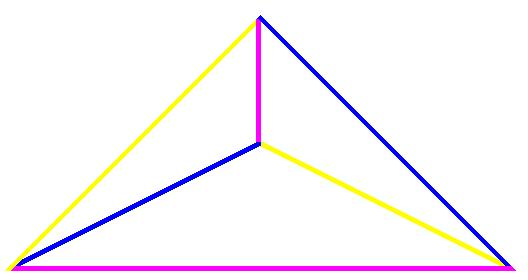

<!-- id: s14-05-0029 -->

Ce groupe de KLEIN, nous allons le symboliser par les opérations en question, à condition qu’elles s’organisent en un réseau tel que chaque trait de couleur réponde à une de ces opérations et…

<!-- id: s14-05-0030 -->

- la couleur rose, donc correspond *à une seule et même opération*,

<!-- id: s14-05-0031 -->

- cette couleur bleue également,

<!-- id: s14-05-0032 -->

- le trait de couleur jaune également …vous voyez donc que chacune de ces opérations, que je peux lais­ser dans l’indétermination complète jusqu’à ce que j’en ai donné plus de précision, chacune de ces opérations se trouve à deux places différentes dans le réseau.

<!-- id: s14-05-0033 -->

Nous défi­nissons la relation entre ces opérations - en quoi elles sont fondées - comme *groupe de Klein…*

<!-- id: s14-05-0034 -->

> c’est du même KLEIN qu’il s’agit, dont j’ai fait état à propos de *la bouteille*, dite du même nom …une opération de ces trois, qui sont *a, b* et *c,* chacune, toutes ont ce caractère d’être des opérations qu’on appelle « *involutives* ».

<!-- id: s14-05-0035 -->

La plus simple, pour représenter ce type d’opération, mais non pas la seule, c’est par exemple *la négation.* Vous niez quelque chose, vous mettez le signe de la négation sur quelque chose, qu’il s’agisse d’un prédicat ou d’une proposition : « *il n’est pas vrai que…* ».

<!-- id: s14-05-0036 -->

Vous refaites une négation sur ce que vous venez d’obtenir. L’important est de poser qu’il y a un usage de la négation où peut être admis ceci : *non pas, comme on vous l’enseigne, que deux négations valent une affirmation*… nous ne savons pas de quoi nous sommes partis, nous ne sommes peut-être pas partis d’une affirmation …mais de quoi que ce soit que nous soyons partis, cette sorte d’opération dont je vous donne un exem­ple avec la négation, a pour résultat 0 : c’est comme si on n’avait rien fait. C’est cela que ça veut dire, que l’o­pération est *involutive*.

<!-- id: s14-05-0037 -->

Donc nous pouvons écrire, si en faisant se succéder les lettres nous entendons que l’opé­ration se répète que : *aa, bb, cc,* chacun est équivalent à 0. 0 par rapport à ce que nous avions avant, c’est à dire que si avant par exemple nous avions l, ça veut dire qu’après *aa* il y aura toujours l. Ceci vaut la peine d’ê­tre souligné.

<!-- id: s14-05-0038 -->

> 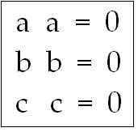

<!-- id: s14-05-0039 -->

Mais il peut y avoir bien d’autres opérations que la négation qui ont ce résultat. Supposez qu’il s’agis­se du *changement de signe, ce n’est pas pareil que la négation*. En ayant *l au début*, j’aurai -l puis, faisant fonctionner le *moins* sur le *moins* du -1, *j’aurai de nouveau l au départ*.

<!-- id: s14-05-0040 -->

Il n’en restera pas moins que ces deux opérations, quoique différentes, auront eu pour *même manifestation* d’être *involutives*, c’est à dire de parvenir à 0 comme résultat. Par contre, il vous suffit de considérer ce diagramme :

<!-- id: s14-05-0041 -->

> 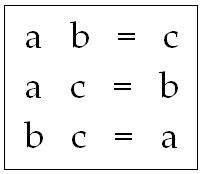 …pour vous apercevoir

<!-- id: s14-05-0042 -->

- que *a* auquel succède *b* a le même effet que *c*,

<!-- id: s14-05-0043 -->

- que *b* auquel succède *c* a le même effet que *a*.

<!-- id: s14-05-0044 -->

Voilà ce qu’on appelle le *groupe de Klein*.

<!-- id: s14-05-0045 -->

Comme peut-être certaines exigences intuitives qui peuvent être les vôtres, aimeraient avoir là-dessus un peu plus à se mettre sous la dent, je peux vous signaler, par ce que là, c’est vraiment cette semaine à la portée de tout le monde, dans tous les kiosques, un numéro d’ailleurs assez mince, d’une revue[^17] qui... - vous savez ce que je pense des revues déjà et ne vais pas me livrer aujourd’hui à la répétition de certains jeux de mots qui me sont habituels. Bref, dans cette revue où il n’y a pas grand chose, il y a un article sur la structure en mathématique qui évidemment pourrait être plus étendu mais qui, sur la courte surface qu’il a choisi, ma foi à juste titre, puisque c’est juste­ment du *groupe de Klein* qu’il s’agit, vous mâche les choses avec, je dois dire, un soin extrême.

<!-- id: s14-05-0046 -->

Pour ce que je viens de vous montrer là, qui est très simple, je crois qu’il y en a, eh bien ma foi… 24 pages, et où l’on pro­cède, on peut le dire : pas à pas. Néanmoins cela peut être *un exercice très utile* - en tous cas pour ceux qui aiment les longueurs - *un exercice très utile*, qui peut fortement vous assouplir en ce qui concerne ce *groupe de Klein*. Si je le prends c’est parce que - et si je vous le présente dès l’a­bord - il va nous rendre, du moins je l’espère, quelques services.

<!-- id: s14-05-0047 -->

Si nous repartons de la structure, vous vous souve­nez de certains des pas autour desquels je l’ai fait tour­ner assez pour qu’il puisse vous venir à l’idée que le fonc­tionnement d’un groupe ainsi structuré, qui pour fonctionner, vous le voyez, peut se contenter de quatre éléments, les­quels sont représentés ici sur le réseau qui le supporte par les points sommets, autrement dit où se rencontrent les arêtes de cette petite figure que vous voyez ici inscrite. \[Cf. *Écrits, La lettre volée* : α, β, γ, δ\]

<!-- id: s14-05-0048 -->

Observez - *Ça va durer longtemps ?* \[adressé à un perturbateur\] - observez que cette figure n’a aucune différence avec *celle que je vous crayonne* ici rapidement à la craie blanche et qui présente également quatre sommets, chacun ayant la propriété d’être relié aux trois autres.

<!-- id: s14-05-0049 -->

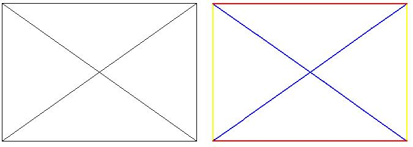

<!-- id: s14-05-0050 -->

Du point de vue de la structure, c’est exac­tement la même. Mais nous n’aurons qu’à colorer les traits qui rejoignent les sommets, deux par deux de la façon sui­vante, pour que vous vous aperceviez que c’est exactement la même structure. En d’autres termes, le point médian dans ce réseau, dans cette figure, n’a aucun privilège. L’avan­tage de la représenter autrement est de marquer qu’il n’y a pas, à cet endroit, de privilège. Néanmoins, l’autre figure a encore un autre avantage, c’est de vous faire toucher du doigt qu’il y a là quelque chose entre autres, que la notion de relation proportionnelle peut recouvrir éventuellement.

<!-- id: s14-05-0051 -->

Je veux dire que par exemple :

<!-- id: s14-05-0052 -->

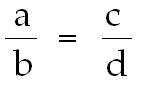

<!-- id: s14-05-0053 -->

est quelque chose qui fonctionne, mais entre autres - entre autres nombreuses autres structures qui n’ont rien à faire avec la proportion - selon la loi du *groupe de Klein*.

<!-- id: s14-05-0054 -->

Il s’agit pour nous de savoir si la fonction que j’ai introduite sous les termes, comme par exemple celui de *la fonction de la métaphore*, telle que je l’ai représentée par la structure : S, un signifiant en tant qu’il se pose dans une certaine position qui est proprement *la position méta­phorique,* ou de substitution, par rapport à un autre signifiant S’ - S venant donc se substituer à S’ - quelque chose se produit, pour autant que le lien de S’ à S est conservé, comme possi­ble à \[...\], il vient en résulter cet effet d’*une nouvelle signification,* autrement dit *un effet de signifié.*

<!-- id: s14-05-0055 -->

Deux signifiants sont en cause, deux positions de l’un de ces signifiants, et un élément hétérogène : *le quart-élé­ment* « s », *effet de signifié*, celui qui est le résultat de la métaphore et que j’écris ainsi :

<!-- id: s14-05-0056 -->

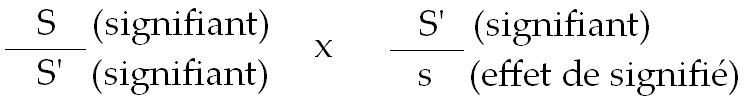

<!-- id: s14-05-0057 -->

C’est que S, en tant qu’il est venu remplacer S’, devient le facteur d’un S(1/s), qui est *ce que j’appelle* *l’effet métaphorique de signification **:*

<!-- id: s14-05-0058 -->

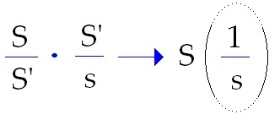

<!-- id: s14-05-0059 -->

Vous le savez, *je donne une grande importance à cet­te structure* pour autant qu’elle est *fondamentale pour ex­pliquer la structure de l’inconscient*.

<!-- id: s14-05-0060 -->

C’est à savoir que, dans le moment considéré comme premier, original, de ce qui est le refoulement, il s’agit, dis-je - puisque c’est là le mode qui m’est propre de le présenter *- il s’agit*, dis-je, *d’un effet de substitution signifiante à l’origine*. Quand je dis *à l’origine, il s’agit d’une origine logique* et non point d’autre chose. Ce qui est substitué a un ef­fet que les penchants de la langue si l’on peut dire, en français, peuvent nous permettre d’exprimer tout de sui­te d’une façon fort vive : *le substitut a pour effet de sub-situer ce à quoi il se substitue.*

<!-- id: s14-05-0061 -->

Ce qui se trouve, du fait de cette substitution - dans la position que l’on croit, que l’on imagine, que l’on doctrine même, très à tort à l’occasion - être *effacé*, est simplement *sub-situé,* ce qui est la façon dont aujourd’hui je traduirai - parce qu’elle me semble particulièrement pratique - le *Unterdrückt* de FREUD. Qu’est-ce donc alors que *le refoulé* ?

<!-- id: s14-05-0062 -->

Eh bien, si paradoxal que cela paraisse, *le refoulé* comme tel, au ni­veau de cette théorie *ne se supporte, n’est écrit, qu’au niveau de son retour*. C’est en tant que le signifiant ex­trait de la formule de *la métaphore*, vient en liaison, dans la chaîne, avec ce qui a constitué *le substitut*, que nous touchons du doigt *le refoulé*, autrement dit *le repré­sentant de la représentation* première en tant qu’elle est liée au fait premier, *logique*, du refoulement. Est-ce que quelque chose - dont vous sentez tout à fait immédiatement le rapport avec la formule, non pas identique à celle-ci mais parallèle : que « *le signifiant est ce qui représente un sujet pour un autre signifiant* » - doit vous apparaître ?

<!-- id: s14-05-0063 -->

Ici, *la métaphore* du fonctionnement de l’inconscient, le S en tant qu’il ressurgit pour permettre le retour du S’ refoulé, le S se trouve représenter le sujet, *le sujet de l’inconscient*, au niveau de quelque chose d’autre, qui est là ce à quoi nous avons affaire et dont nous avons à déter­miner l’effet comme *effet de signification* et qui s’appel­le *le symptôme*.

<!-- id: s14-05-0064 -->

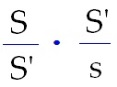

<!-- id: s14-05-0065 -->

C’est à ceci que nous avons affaire et c’est, aussi bien, ce qui était nécessaire de rappeler pour autant que cette *formule à quatre termes*, *formule à quatre termes* qui est ici *la cellule*, *le noyau*, où nous apparaît la difficulté propre d’établir, du sujet, une logique primordiale comme telle, en tant que ceci vient rejoindre ce qui, d’autres horizons, par d’autres disciplines, parvenues à un point de rigueur très supérieure à la nôtre, notamment celle de la lo­gique mathématique, s’exprime en ceci : qu’il n’est plus te­nable maintenant de considérer qu’il y ait un *univers du discours.*

<!-- id: s14-05-0066 -->

Il est clair que *dans le groupe de Klein  rien n’y implique cette faille de l’univers du discours*, *mais rien n’implique non plus que cette faille n’y soit pas* !

<!-- id: s14-05-0067 -->

Car le propre de *cette faille* dans *l’univers du discours*, c’est que si elle est manifestée en certains points de paradoxe, qui ne sont pas toujours si paradoxaux que cela, d’ailleurs je vous l’ai dit : le prétendu paradoxe de RUSSELL n’en est pas un et c’est autrement exprimé, qu’il faut désigner que *l’u­nivers du discours* ne se ferme pas.

<!-- id: s14-05-0068 -->

Rien n’indique donc, à l’avance, qu’une structure si fondamentale dans l’ordre des références structurantes, que le *groupe de Klein* ne nous permette pas - *à condition de saisir d’une façon appropriée nos opérations -* ne nous permette pas de supporter de quelque façon ce qu’il s’agit de supporter, c’est à dire en l’occasion, c’est là ma visée d’aujourd’hui, le rapport que nous pouvons donner à notre exigence de donner son statut structural à l’incons­cient avec – avec quoi ? – avec le *cogito* cartésien.

<!-- id: s14-05-0069 -->

Car il est bien certain que ce *cogito* cartésien, ce n’est même pas chose à dire que de remarquer que je ne l’ai pas choisi au hasard, c’est bien parce qu’il se pré­sente comme une aporie, une contradiction radicale au statut de l’inconscient, que tant de débats ont déjà tourné autour de ce statut prétendu fondamental de la conscience de soi.

<!-- id: s14-05-0070 -->

Mais s’il se trouvait après tout, que ce *cogito* se présente comme étant exactement *le meilleur* *envers* qu’on puisse trouver, d’un certain point de vue, au statut de l’in­conscient, il y aurait peut-être quelque chose de gagné dont nous pouvons déjà présumer que ce n’est point invrai­semblable, en ceci que je vous ai rappelé qu’il ne pouvait même se concevoir, je ne dis pas une formulation mais mê­me une découverte, de ce qu’il en est de l’inconscient avant l’avènement, la promotion inaugurale du sujet du *cogito,* en tant que cette promotion est co-extensive de l’avènement de la science.

<!-- id: s14-05-0071 -->

Il n’aurait su y avoir de psychanalyse hors de l’ère, structurante pour la pensée, que constitue l’avènement de notre science, c’est sur ce point que nous avons terminé, non pas l’année dernière, mais déjà l’année précédente. En effet, rappelez-vous le point dont je vous ai déjà signalé l’intérêt, de ce *graphe*…

<!-- id: s14-05-0072 -->

> de ce *graphe* que la plupart de vous connaissent et auquel vous pouvez maintenant aisément vous reporter dans mon livre …nommément, tel qu’il est déve­loppé au niveau de l’article : *Subversion du sujet et dialectique du désir.*

<!-- id: s14-05-0073 -->

Qu’est-ce que veut dire - il vaut peut-être la peine de le remarquer maintenant - ce qui se trouve au niveau de la chaîne supérieure et à gauche de ce petit *graphe* qui, dessiné, est fait comme ça :

<!-- id: s14-05-0074 -->

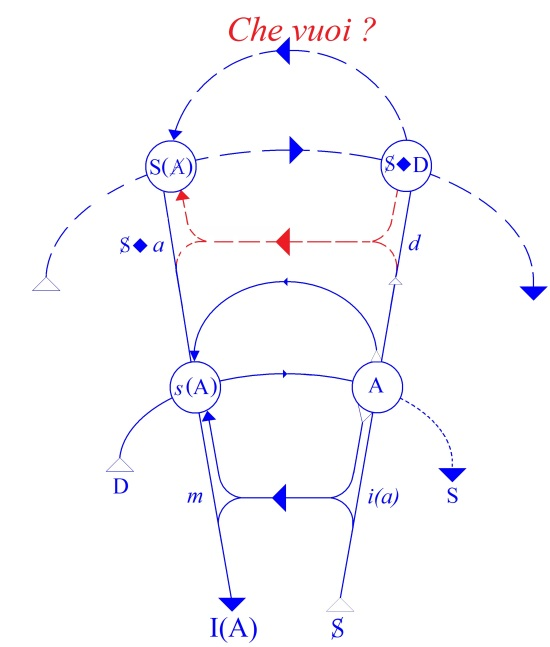

<!-- id: s14-05-0075 -->

Ici nous avons la marque, ou l’indice S(A), que je n’ai pas - depuis des années qu’il existe, qu’il est placé dans ce graphe - sur lequel je n’ai pas porté tellement de commen­taires. En tout cas, certes pas assez pour qu’aujourd’hui je n’aie pas l’occasion là, de vous faire remarquer que ce dont il s’agit précisément à cette place du graphe : S(A), d’un signifiant en tant qu’il con­cernerait, qu’il serait l’équivalent en quelque chose de ceci : de la présence de ce que j’ai appelé l’« 1 *en trop* », qui est aus­si ce qui manque, *ce qui manque dans la chaîne signifiante*, pour autant très précisément *qu’il n’y a pas d’univers du discours*.

<!-- id: s14-05-0076 -->

« *Qu’il n’y a pas d’Univers du discours* » veut dire très exactement ceci : qu’au niveau du signifiant, cet « **1** *en trop* », qui est du même coup *le signifiant du manque*, est à propre­ment parler *ce dont il s’agit…*

<!-- id: s14-05-0077 -->

> et ce qui doit être maintenu, maintenu comme tout à fait essentiel, conservé à la fonction de la structure, pour autant qu’elle nous intéresse, bien entendu, si nous suivons la trace, où après tout, jusqu’à présent je vous ai tous plus ou moins emmenés, puisque vous êtes là …que « *l’inconscient est structuré comme un langage* ».

<!-- id: s14-05-0078 -->

Dans un certain lieu parait-il - on me l’a rapporté et je ne vois point pourquoi cette information ne serait pas juste - quelqu’un, dont il ne me déplairait pas qu’un jour il vint se présenter ici, commence ses cours sur l’incons­cient en disant : « *S’il y a ici quelqu’un pour qui l’incons­cient est structuré comme un langage, il peut sortir tout de suite !* »

<!-- id: s14-05-0079 -->

Nous pouvons un petit peu nous reposer. Je vais tout de même vous raconter *comment ces choses sont commentées au niveau des « bébés »* \- parce que depuis que mon livre est paru, même les « bébés » lisent mon livre ! - au niveau des « bébés », on m’en a rapporté une que je ne peux me retenir de vous commu­niquer : on discute donc un peu *de ceci*, *de cela* et de ceux qui ne sont pas d’accord, il y en a un qui dit ceci, que j’aurais pas inventé en somme : « *Là comme ailleurs, il y a les* «* Afreud* » » ! \[Rires\]

<!-- id: s14-05-0080 -->

Remarquez que cela ne tombe pas à côté, juste avant une interview - que je me suis lais­sé surprendre, à la Radio - juste avant moi, il y a quelqu’un, une voix je dois dire anonyme, de sorte que je ne dérange­rai personne en la citant, à qui on a posé la question : « faut-il lire FREUD ? » .

<!-- id: s14-05-0081 -->

- «* Lire Freud* - a répondu ce psychana­lyste qu’on qualifiait d’éminent - *Lire Freud ? Que nenni ! Mais, pas nécessaire du tout ! Aucun besoin, aucun besoin… La technique simplement, la technique ! Mais Freud ce n’est pas du tout nécessaire de s’en occuper.* »

<!-- id: s14-05-0082 -->

De sorte que je n’ai vraiment pas beaucoup de peine à me donner, pour démontrer qu’il y a des endroits où, « *Afreud*  » ou pas, on ne s’occupe guère de FREUD.

<!-- id: s14-05-0083 -->

Alors, reprenons : il s’agit donc, ce signifiant, ce signifiant de ceci : quelque chose qui concerne le « 1 *en trop* » nécessaire, de *la chaîne signifiante* comme telle, *en tant qu’écrite* - *je souligne* - *elle est pour nous le tenant-­lieu de l’univers du discours*. Car c’est bien de ceci qu’il s’agit.

<!-- id: s14-05-0084 -->

Il s’agit là de ce qui est, pour le départ de cette année, notre fil conducteur : que c’est en tant que nous trai­tons *le langage et l’ordre* qu’il nous propose *comme structure*, par le moyen de l’écriture, que nous pouvons mettre en valeur qu’il en résulte la démonstration, au plan *écrit*, de la non-existence de cet *univers du discours*.

<!-- id: s14-05-0085 -->

Si la logique - ce qu’on appelle... - n’avait pas pris les voies qu’elle a prises dans *la logique moderne*, c’est à dire de traiter les problèmes logiques en les *purifiant* jusqu’à la dernière limite de l’élément intuitif qui a pu pendant des siècles rendre si satisfaisante, par exemple, la logique d’ARISTOTE, qui incontestablement, de cet élément intuitif, retenait une grande part, le rendre si séduisant que pour KANT lui-même - qui n’était certes pas un idiot - que pour KANT lui-même il n’y avait rien à ajou­ter à cette logique d’ARISTOTE.

<!-- id: s14-05-0086 -->

Alors qu’il a suffi de lais­ser passer quelques années pour voir qu’à traiter, à seule­ment être tenté de traiter, ces problèmes, par cette sorte de transformation qui résultait simplement de l’usage de l’écriture, telle que depuis - déjà alors - elle s’était répandue et nous avait rompus à ses formules par le moyen de l’algèbre, soudain, venait à pivoter et changer de sens dans la structure.

<!-- id: s14-05-0087 -->

C’est à dire à nous permettre de poser le problème de la lo­gique tout autrement, en atteignant ce qui - loin de diminuer sa valeur, et précisément ce qui lui donne toute sa valeur - en atteignant ce qui en elle, comme telle, est *pure structure.* Ce qui veut dire « structure » : effet du langage. C’est donc de cela qu’il s’agit.

<!-- id: s14-05-0088 -->

Et qu’est-ce que cela veut dire, ce grand S avec dans la parenthèse ce A barré : S(A), si cela ne veut pas dire, au niveau où nous en sommes, la désignation par *un signifiant* de ce qu’il en est de l’« 1 *en trop* ».

<!-- id: s14-05-0089 -->

Mais alors, allez-vous me dire - ou plutôt, je l’es­père, allez-vous vous retenir de dire - car bien sûr puisque toujours nous sommes sur le fil, sur le tranchant de l’iden­tification, de même que tout naturellement de la bouche de la personne naïve que vous commencez d’*endoctriner* : « *moi, j’suis pas moi *? *Alors* - dit-elle - *qui est moi ?* », de même, autour de cette *invincible renaissance du mirage* *de l’identité du sujet*, pouvons-nous dire : est-ce qu’à faire fonctionner ce signifiant de l’« 1 *en trop* », nous n’opérons pas comme si l’obstacle, si je puis dire, était « *vincible* » et si nous laissions dans la circulation de la chaîne ce qui pré­cisément ne saurait y entrer ?

<!-- id: s14-05-0090 -->

C’est à savoir *le catalogue de tous les catalogues qui ne se contiennent pas eux-mêmes* , *imprimé dans le catalogue*, et par conséquent, dévalorisant.

<!-- id: s14-05-0091 -->

Or ce n’est pas de cela qu’il s’agit. Ce n’est pas de cela qu’il s’agit, car dans *la chaîne signifiante*, que nous pouvons considérer, par exemple, comme faite de toute la série des lettres qui existent en français, c’est pour autant qu’à chaque instant, pour qu’une quelconque de ces lettres puisse *tenir lieu* de toutes les autres, qu’il faut qu’elle s’y barre, que cette barre donc est tournante et virtuellement frappe chacune des lettres, que nous avons, insérée dans la chaîne, la fonction de l’« 1 *en trop* » parmi les signifiants.

<!-- id: s14-05-0092 -->

Mais *ce signifiant en trop,* vous l’évoquez comme tel pour peu que, comme ici c’est indiqué, nous le mettions hors de la parenthèse où fonctionne la barre, toujours prête à suspendre l’usage de chaque si­gnifiant quand il s’agit qu’il se signifie lui-même, l’indication signifiante de la fonction de « 1 *en trop* » comme tel, est possible. Non seulement est possible, mais est à proprement parler ce qui va se manifester comme pos­sibilité d’une intervention directe sur la fonction du sujet.

<!-- id: s14-05-0093 -->

En tant que *le signifiant est ce qui représente le sujet pour un autre signifiant*, tout ce que nous ferons qui res­semble à ce S(A) - et qui, vous le sentez bien, ne répond à rien de moins qu’à la fonction de *l’interprétation -* va se juger par quoi ?

<!-- id: s14-05-0094 -->

Par - conformément au système de la métaphore - par l’intervention dans la chaîne, de *ce signifiant* qui lui est immanent comme « 1 *en plus* », et comme « 1 *en plus* » *sus­ceptible* d’y produire cet *effet de métaphore*, qui va être ici quoi ?

<!-- id: s14-05-0095 -->

Est-ce par un *effet de signifié*, comme semble l’indiquer la métaphore, que l’interprétation opère ?

<!-- id: s14-05-0096 -->

Assu­rément - conformément à la formule - par un *effet de signi­fication*, mais cet *effet de signification* est à préciser au niveau de sa structure logique, au sens technique du ter­me. Je veux dire que la suite de ce discours - de celui que je vous tiens - vous précisera les raisons pour lesquelles cet *effet de signification* se précise, se spécifie et doit en quelque sorte délimiter la fonction de l’interprétation dans son sens propre, dans l’analyse, comme un « *effet de vérité* ».

<!-- id: s14-05-0097 -->

Mais aussi bien, ceci bien-sûr n’est que jalon sur la route, après quoi s’ouvre une parenthèse. Pour pouvoir là-dessus vous donner tous les motifs qui me permettent de pré­ciser ainsi l’effet de l’interprétation.

<!-- id: s14-05-0098 -->

Entendez bien que j’ai dit « *effet de vérité* », qu’il ne saurait d’aucune façon être préjugé de *la vérité de l’interprétation*…

<!-- id: s14-05-0099 -->

> je veux dire : si l’indice « *vrai* » ou « *faux* », jusqu’à nouvel ordre, peut être ou non affecté au signifiant de l’in­terprétation elle-même. Ce signifiant jusqu’ici n’était qu’un signifiant *en plus*, voire *en trop,* comme tel, jusqu’à ce qu’il vienne,
>
> *signifiant de quelque manque*, de quelque manque préci­sément comme manquant à *l’univers du discours* …je n’ai dit qu’une chose, c’est que *l’effet va être un effet de vérité*.

<!-- id: s14-05-0100 -->

Mais ce n’est pas non plus pour rien que certaines choses, je les avance comme je le peux, chacune à son tour, comme on pousse quelquefois un troupeau de moutons, et que si je vous ai fait la dernière fois la remarque, la remarque que dans l’ordre de l’implication, en tant qu’*implication matérielle*, c’est à dire en tant qu’il existe ce qu’on appelle *la consé­quence* dans la chaîne signifiante, ce qui ne veut rien dire d’autre *qu’antécédent et conséquent : protase et apodose -* et que je vous ai fait remarquer qu’il n’y a aucun obstacle, pour que ce soit coté de l’indice *vérité*, *à ce qu’une prémisse soit fausse pourvu que sa conclusion soit vraie*. Donc, suspendez votre esprit sur ce que j’ai appelé « *effet de vérité* », avant que nous en sachions un peu plus long, que nous puissions en dire un peu plus sur ce qu’il en est de la fonction de l’interprétation.

<!-- id: s14-05-0101 -->

Maintenant, nous allons être amenés simplement, aujour­d’hui, à produire ceci qui concerne le *cogito.* Le *cogito* car­tésien, dans le sens où vous le savez, ce n’est pas tout sim­ple, puisque parmi les gens qui consacrent à l’œuvre de DES­CARTES - ou qui ont consacré - leur existence, il reste sur ce qu’il en est de la façon dont il convient de l’interpré­ter et le commenter, de très larges *divergences*.

<!-- id: s14-05-0102 -->

Vais-je ou fais-je jusqu’à présent quelque chose qui consisterait à m’immiscer, moi, spécialiste - *non spécialiste* \![Rires\], ou spécialiste d’autre chose - à m’immiscer dans ces débats cartésiens ? Bien sûr, après tout y-ai-je autant de droits que tout le monde, je veux dire que le *Discours de la Méthode* ou les *Méditations* me sont aussi bien qu’à tout le monde, adressés, et qu’il m’est loisible sur quelque point qu’il s’en agisse, de m’interroger sur la fonction de l’« *ergo »* par exemple, dans le « *cogito, ergo sum* ».

<!-- id: s14-05-0103 -->

Je veux dire qu’il m’est, autant qu’à tout le monde, permis de relever que, dans la traduction latine que DESCARTES donne du [*Discours de la Mé­thode*](http://classiques.uqac.ca/classiques/Descartes/discours_methode/Discours_methode.pdf) [^18], très précisément en l644, apparaît, comme traduction du « *Je pense, donc je suis* » : « *Ergo sum* *sive existo* ».

<!-- id: s14-05-0104 -->

Et d’autre part dans les *[Méditations](http://un2sg4.unige.ch/athena/descartes/desc_med_frame0.html),* dans *la deuxième Méditation* et juste après qu’il se sent quelque enthousiasme, il compare au point d’ARCHIMÈDE, ce point dont on peut tellement attendre, nous dit-­il : « *Si je n’ai touché, je n’ai inventé (invenero), que celui-ci, minimum, qui comporte quelque chose de certain et d’inébranlable (certum sit & inconcussum)* »

<!-- id: s14-05-0105 -->

\[« *Nihil nisi punctum petebat Archimedes, quod esset firmum & immobile, ut integram terram loco dimoveret ; magna quoque speranda sunt, si vel minimum quid invenero quod certum sit & inconcussum.* » *Meditatio* II, 3\] …que c’est dans le même texte qu’il formule cette formule qui n’est pas absolu­ment identique : *Ego sum, ego existo.*

<!-- id: s14-05-0106 -->

\[ *Haud dubie igitur ego etiam sum, si me fallit ; & fallat quantum potest, nunquam tamen efficiet, ut nihil sim quamdiu me aliquid esse cogitabo. Adeo ut, omnibus satis superque pensitatis, denique statuendum sit hoc pronuntiatum, Ego sum, ego existo, quoties a me profertur, vel mente concipitur, necessario esse verum.* *Meditatio* II, 3 \]

<!-- id: s14-05-0107 -->

Et qu’enfin dans les *[Principes de la recherche de la vérité par la lumière naturelle](http://fr.wikisource.org/wiki/Recherche_de_la_v%C3%A9rit%C3%A9_par_les_lumi%C3%A8res_naturelles),* c’est « *dubito ergo sum »*, ce qui pour le psychanalyste, a une tout autre résonance, mais une résonnance où je n’essaierai pas aujourd’hui de m’engager, c’est un terrain trop glissant…

<!-- id: s14-05-0108 -->

> pour que, avec les coutumes actuelles, celles qui permettent de parler de M. ROBBE-GRILLET
>
> en lui appliquant les grilles de la névrose obsessionnelle \[Rires\] …qui présente pour les psy­chanalystes trop de dangers d’achoppement, voire de ridicule, pour que j’aille loin dans ce sens.

<!-- id: s14-05-0109 -->

Mais par contre, je souligne que ce dont il s’agit pour nous est quelque chose qui nous offre un certain choix. Le choix que je fais, en l’occasion, est celui-ci : de laisser suspendu tout ce que le logicien peut soulever de questions autour du *cogito ergo sum*.

<!-- id: s14-05-0110 -->

C’est à savoir : l’ordre d’impli­cation dont il s’agit. Si c’est seulement de *l’implication matérielle*, vous voyez où cela nous conduit.

<!-- id: s14-05-0111 -->

Si c’est de *l’implication matérielle*…

<!-- id: s14-05-0112 -->

> selon la formule que j’ai écrite la dernière fois au tableau et que je veux bien réécrire pour peu qu’on m’en redonne la place …c’est uniquement dans la mesure où *de l’implication*, *en tant que le « donc » l’in­diquerait*, la seconde proposition : « *je suis* », serait fausse, que le lien d’implication entre les deux termes pourrait être rejeté.

<!-- id: s14-05-0113 -->

Autrement dit, seul importe de savoir si « *je suis* » est vrai, il n’y aurait aucun inconvénient à ce que ce « *je pense* » soit faux - je dis : pour que la formule soit re­cevable en tant qu’implication.

<!-- id: s14-05-0114 -->

« *Je pense* » : *c’est moi qui le dis*. Après tout, *il se peut que je croie que je pense, mais que je ne pense pas*. *Ça arrive même tous les jours et à beaucoup*.

<!-- id: s14-05-0115 -->

Puisque l’implica­tion qu’« *il est »* \[i.e. « *donc je suis* »\]- qui je vous le répète, dans l’implication pure et simple, celle qu’on appelle *implication matérielle -* n’exige qu’une chose : c’est que la conclusion soit vraie.

<!-- id: s14-05-0116 -->

En d’autres termes, la logique comportant référence aux fonctions de vérité, en établissant le tableau dans un certain nombre de matrices, ne peut définir, pour rester cohé­rente avec elle-même, ne peut définir certaines opérations comme l’implication qu’à les admettre comme fonctions qui seraient encore mieux nommées : « *conséquences* »*. Conséquences* ne voulant par là dire que ceci : l’ampleur du champ dans lequel, dans une *chaîne signifiante*, nous pouvons mettre la conno­tation de *vérité* : nous pouvons mettre la connotation de vé­rité sur la liaison d’un faux abord, d’un vrai ensuite, et non pas l’inverse.

<!-- id: s14-05-0117 -->

Ceci, bien entendu - c’est certain - nous laisse loin de l’ordre de ce qu’il y a à dire du *cogito cartésien* comme tel, dans son ordre propre, qui sans doute implique, inté­resse la constitution du sujet comme tel, c’est-à-dire compli­que ce qu’il en est de l’écriture en tant que réglant le fonctionnement de l’opération logique, le dépasse précisément, en ceci : que cette écriture même ne fait sans doute là que *représenter un fonctionnement plus primordial de quelque chose*, qui à ce titre mérite bien pour nous d’être posé en fonction d’écriture, en tant que c’est de là que dépend le véritable statut du sujet et non pas de son *intuition* d’être « *celui qui pense* ».

<!-- id: s14-05-0118 -->

*Intuition* justifiée par quoi, si ce n’est par quelque chose qui lui est à ce moment-là profondément caché, à savoir : *qu’est-ce qu’il veut* en cherchant cette certitude sur ce terrain qui est celui de l’évacuation progressive, du nettoyage, du balayage de tout ce qui est mis à sa portée concernant la fonction du savoir ? Et puis, après tout, qu’est-ce que c’est que ce *cogito* ?

<!-- id: s14-05-0119 -->

- *Ago* : je pousse - comme tout à l’heure, j’en parlais - mes moutons : ça fait partie de mon travail quand je suis ici,

<!-- id: s14-05-0120 -->

> ce n’est pas forcément le même quand je suis tout seul ni non plus quand je suis dans mon fauteuil d’analyste,

<!-- id: s14-05-0121 -->

- *Cogo* : je pousse ensemble,

<!-- id: s14-05-0122 -->

- *Cogito* : tout ça, ça remue.

<!-- id: s14-05-0123 -->

En fin de compte, s’il n’y avait pas ce désir de DESCARTES qui oriente de façon si décisive cette cogitation, le *cogito* nous pourrions le traduire, comme on peut le tra­duire après tout partout où ça cogite, on pourrait le tra­duire : je trifouille !

<!-- id: s14-05-0124 -->

Pourquoi *cogito* et pas *puto*, par exemple, qui a aussi son sens en latin : cela veut même dire « *élaguer* », ce qui pour nous analystes, a de petites résonances... Enfin, *puto ergo sum* aurait peut-être un autre nerf, un autre style... peut-être d’autres conséquences.

<!-- id: s14-05-0125 -->

On ne sait pas, s’il avait commencé par élaguer - vraiment au sens d’élaguer - il élague­rait peut-être Dieu, à la fin ! Tandis qu’avec *cogito* c’est autre chose. Et d’ailleurs *cogito*… *cogito* c’est écrit, d’abord si nous nous sommes aperçus que *cogito* ça pouvait s’écrire.

<!-- id: s14-05-0126 -->

« *Cogito* : « *ergo sum* », c’est bien là que nous pouvons ressaisir l’intuition et faire saisir que \[...\] quelque \[...\] contenu, ce liquide qui remplit ce qui dérive de - proprement : *de structure, de l’appareil du langage*. N’oublions pas, concernant certaines fonctions, en tant peut-être…

<!-- id: s14-05-0127 -->

> je dis « peut-être» parce que je commence à l’amener et que j’aurai à y revenir …en tant peut-être que ce sont celles où le sujet ne se trouve pas simplement en position de l’être-agent, mais en position de sujet, pour autant que le sujet est plus qu’intéressé, est fonciè­rement déterminé, par l’acte même dont il s’agit.

<!-- id: s14-05-0128 -->

Les langues antiques avaient *un autre registre* : *dia­thèse* - *comme disent sur ce terrain ceux qui ont le vocabu­laire* - *ça s’appelle la diathèse moyenne*, c’est pour ça que, concernant ce dont il s’agit et qui s’appelle le langage, pour autant qu’il détermine cette autre chose où le sujet se constitue comme être parlant, on dit : *loquor*.

<!-- id: s14-05-0129 -->

Et puis, ce n’est pas d’hier que j’essaie d’expliquer toutes ces choses à ceux qui viennent m’entendre, quelles que soient les préoccupations qui les y rendent plus ou moins sourds. Qu’ils se souviennent du temps où je leur expliquais la différence de « *celui qui te suivrai* » et « *celui qui te suivra* ».

<!-- id: s14-05-0130 -->

« *Je suis celui qui te suivrai* » *n’a pas le même sens que* « *Je suis celui qui te suivra* ». S’il y en a deux…

<!-- id: s14-05-0131 -->

> qui ne se re­connaissent qu’à cette *différence de temps*, après l’opacité du relatif et du celui qui désigne le sujet …c’est parce qu’il n’y a pas de *voix moyenne* [^19] en français, qu’on ne voit pas que « *suivre* » ne peut se dire que « *sequor* », pour autant que du seul fait de suivre, on n’est pas le même que de ne pas avoir suivi.

<!-- id: s14-05-0132 -->

Ce ne sont pas des choses compliquées. Ce sont des choses qui nous intéressent concernant ce qu’on pourrait dire d’u­ne pensée qui en serait une, une vraie de vraie, de pensée !

<!-- id: s14-05-0133 -->

Comment cela se dirait en latin par la [*voix moyenne*](http://www.yann-ollivier.org/etymo/voix_moyenne.html.fr) ? Ce qui serait préférable, ce serait d’en trouver une qui serait parmi ce qu’on appelle les *media tantum :* où le verbe n’existe qu’au *moyen,* comme les deux que je viens de vous citer. C’est une devinette !

<!-- id: s14-05-0134 -->

Personne ne lève la main pour proposer quelque chose ? Je le regrette. Je vous le dirai.

<!-- id: s14-05-0135 -->

Mais enfin ce serait peut-être aller un peu vite que de vous le dire maintenant. Peut-être que justement c’est à l’oc­casion de ce que fait le psychanalyste quand il interprète, que je serai amené à vous le dire. Mais enfin, il faut encore avancer, comme nous le faisons, pas à pas. Pour vous donner quand même, sur cette voix, une petite indication, je vous renvoie - vous comprenez que tout cela, je ne le tire pas de mon cru uniquement - à l’article de BENVENISTE[^20], dans son recueil récent, aussi, qu’il a fait, lui.

<!-- id: s14-05-0136 -->

Il recueille un article, qu’heureusement nous avons tous lu depuis très longtemps dans le *Journal de Psychologie,* sur *la voix active* et *la voix moyenne.* Il vous expliquera une chose qui, peut-être - j’y pense maintenant - peut vous ouvrir un peu les idées. ­

<!-- id: s14-05-0137 -->

Il parait qu’en sanscrit on dit : « *Je sacrifie* » de deux façons. Ce n’est pas un verbe *media tantum*, ni *activa tantum*, il y a les deux, comme pour beaucoup de verbes d’ailleurs en latin. Mais enfin, on emploie *la voix active* quand, Pour le verbe « *sacrifier » ?*

<!-- id: s14-05-0138 -->

Eh bien, c’est quand le prêtre fait le sacrifice au BRAHMA, ou à tout ce que vous voudrez - pour un client. Il lui dit : « *Venez, il faut faire un sacrifice au Dieu.* - et le type : « *très bien, très bien...* », *il lui remet son machin et puis hop ! un sacrifice*. Ça, c’est actif !

<!-- id: s14-05-0139 -->

Il y a une nuance : *on met la voix moyenne quand il officie en son nom*.

<!-- id: s14-05-0140 -->

C’est un peu compliqué, que je vous avance ça main­tenant, parce que ça ne fait pas simplement intervenir une faille qu’il faudrait mettre quelque part entre *le sujet de l’énonciation et le sujet de l’énoncé*, ce qui va tout de suite pour ce qui est de *loquor -* mais là c’est un petit peu plus compliqué, parce qu’il y a l’Autre : l’Autre, qu’avec le sacrifice, on prend au piège. *Ce n’est pas pareil de pren­dre l’Autre* *au piège en son nom ou si c’est plus simplement pour le client, qui a besoin d’avoir rendu un devoir à la divinité et qui va chercher le technicien*.

<!-- id: s14-05-0141 -->

Une devinette - je sens que je vais de devinette en devinette - où sont les analogues, dans le rapport dit de la situation analytique ?

<!-- id: s14-05-0142 -->

Qu’est-ce qui officie et pour qui ? C’est une question qu’on peut se poser. Je ne la pose que pour vous faire sentir ceci : qu’il y a une fonction de la déchéance de la parole à l’inté­rieur de la technique analytique. Je veux dire que c’est un artifice technique qui soumet cette parole aux seules lois de la conséquence, on ne se fie à rien d’autre : cela doit s’enfiler, simplement.

<!-- id: s14-05-0143 -->

Ce n’est pas tellement naturel, nous le savons par expérience : *les gens n’apprennent ce métier là*, comme dit quelqu’un, *pas tout de suite*. Ou bien il faut qu’ils aient vraiment l’envie d’officier. *Parce que cela ressemble beaucoup à un office*, justement, qu’on lui demande de faire, *comme doit le faire le brave bramine, quand il a un petit peu de métier, en dévidant ses petites prières ou en repensant à autre chose*.

<!-- id: s14-05-0144 -->

*Cogito ergo sum* : Qu’est-ce qui « *sum* » dans ce *sum* là ? C’est ceci, qui est de nature à nous faire entendre que de toute façon, quelle que soit la juste place de nos réflexions quant à ce qui concerne le pas cartésien… qu’il ne s’agit bien entendu, pas du tout de réduire, vous savez que je lui fais sa suffisante place historique, pour qu’ici, vous le voyez bien, il ne s’agit que d’une utilisation mais d’une utili­sation, d’ailleurs, qui reste pertinente.

<!-- id: s14-05-0145 -->

À savoir que c’est à partir de là - dans ce cas là, si ce que je dis est vrai - c’est à partir du moment où on traite la pensée… c’est quel­que chose la pensée, cela avait son passé, ses titres de no­blesse. Je sais bien qu’avant on ne songeait pas - personne n’avait jamais songé - à faire tourner *le rapport au monde* autour de « *moi, je suis moi !* ». *La division du moi et du non-­moi*, voilà une chose qui n’était jamais venue à l’idée de personne, avant quelque siècle récent ! C’est la rançon, c’est le prix qu’on paye - quoi ? - le fait d’avoir jeté la pensée à la poubelle, peut-être.

<!-- id: s14-05-0146 -->

*Cogito*, après tout dans DESCARTES *c’est le déchet puisqu’il le met effectivement au panier, tout ce qu’il a examiné dans son cogito*.

<!-- id: s14-05-0147 -->

Je pense que ceux qui me suivent voient un petit peu l’intérêt et le rapport que tout cela a avec ce que je suis en train d’avancer.

<!-- id: s14-05-0148 -->

À partir de la formulation écrite de la nouvelle lo­gique, on a énoncé un certain nombre de choses, qui n’étaient pas apparues avec évidence, et qui ont pourtant bien leur intérêt. Par exemple ceci : si vous voulez nier *a et b,* je mets la barre, et, par convention, c’est ça qui constitue la négation :

<!-- id: s14-05-0149 -->

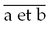

<!-- id: s14-05-0150 -->

L’avantage de ces procédés écrits est bien connu : c’est qu’il faut que ça fonctionne comme une moulinette, pas besoin de réfléchir ! Ça consiste à écrire : *Non-a* ou *non-b*, voilà c’est tout.

<!-- id: s14-05-0151 -->

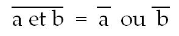

<!-- id: s14-05-0152 -->

Vous irez chercher dans M. MORGAN, qui a trouvé la chose et dans M. BOOLE qui l’a retrouvée, à quoi ça cor­respond.

<!-- id: s14-05-0153 -->

Bon, je vais quand-même - *à mon grand regret* - vous l’*imager*, parce que je sais qu’il y aurait des personnes qui seraient agacées si je ne le faisais pas. Mais je regrette, parce que *ces personnes vont probablement être satisfaites et croire qu’elles ont compris* quelque chose.

<!-- id: s14-05-0154 -->

C’est d’ail­leurs pour ça que je vais le leur montrer, mais à ce moment­-là elles seront définitivement enfoncées dans l’erreur !

<!-- id: s14-05-0155 -->

Néanmoins... Qu’est-ce que cela veut dire ?

<!-- id: s14-05-0156 -->

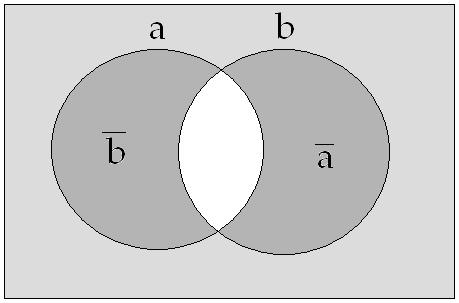

<!-- id: s14-05-0157 -->

Voilà deux ensembles, *a* et *b* : ou l’un, ou l’au­tre. Ou *non-a* ou *non-b*, là-­dedans. C’est naturellement exclu.

<!-- id: s14-05-0158 -->

Ça \[en gris foncé\], c’est à dire ce qu’on appelle *la différence symétrique*, c’est ce qu’on appelle le com­plément dans cet ensemble.

<!-- id: s14-05-0159 -->

C’est là, interprétée au ni­veau des ensembles, *la fonction de la négation*. La négation étant *ce qui n’est pas* cet *a et b*, ce sont les deux autres aires de ces deux ensembles - qui, comme vous le voyez, ont un secteur commun - ce sont les deux autres aires indifféremment – indifféremment, je dis : qui remplissent cette fonction.

<!-- id: s14-05-0160 -->

Je vous annonce, aux fins *- puisqu’il est deux heures -* de le remettre pour la prochaine fois, *que nous examinerons toutes les façons que nous pouvons chercher, pour opérer sur ce* « *Je pense, donc je suis* », pour y définir des opérations qui nous permettraient de saisir son rapport \- d’abord à sa mise en faux : « *Je pense et je ne suis pas* » - à une autre transformation, également, qui est possi­ble et dont vous verrez l’intérêt brûlant, quand je vous dirai que c’est la position aristotélicienne : « *Je ne pense pas ou je suis* »

<!-- id: s14-05-0161 -->

Et puis la quatrième qui recouvre très exactement celle-ci et qui s’inscrit ainsi :

<!-- id: s14-05-0162 -->

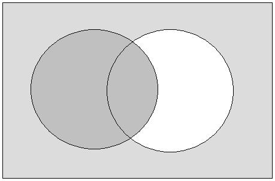

<!-- id: s14-05-0163 -->

Tous ces cercles symbolisant, puisque j’ai choisi de donner un support pour que vous en reteniez *aujourd’hui quelque chose de mon point de chute,* « *Ou je ne pense pas ou je ne suis pas* ». J’essaierai d’avancer un tel appareil comme étant la meilleure traduction que nous puissions donner à notre usage du *cogito* cartésien, pour servir de point de cristallisa­tion au sujet de l’inconscient.

<!-- id: s14-05-0164 -->

Cet inverse \[du cogito\]

<!-- id: s14-05-0165 -->

> et vous sentez bien que cet *inverse* n’est *négation* que par rapport à l’ensemble où nous le faisons fonctionner …cet inverse que le « *ou je ne suis pas ou je ne pense pas* » réalise par rapport au *cogito*, il va s’agir pour nous de l’interroger d’une façon telle que nous découvrions :

<!-- id: s14-05-0166 -->

- et le sens de ce *vel* \[« ou »\] qui l’unit,

<!-- id: s14-05-0167 -->

- et la portée exacte que la négation ici peut prendre, pour nous rendre compte de ce qu’il en est du sujet de l’inconscient.

<!-- id: s14-05-0168 -->

C’est ce que je ferai donc le 21 Décembre, c’est ce qui clora, je l’espère, finement - si je tiens jusque là - cette année, ce qui nous permettra le juste départ, par la suite, de ce qu’il convient cette année que nous parcourions comme *Logique du fantasme.*

<!-- id: s14-05-0169 -->

*  *

## Notes

[^16]: Jacques Lacan : [*Interview à la R.T.B*](http://www.ecole-lacanienne.net/documents/1966-12-14.doc), 14-12-1966. Publiée en 1982 dans *Quarto* n° 7 pages 7-11.

[^17]: *Les temps modernes*, N°246 , Nov. 1966. Marc Barbut : *Le sens du mot « structure » en mathématiques* , pp.791-815.

[^18]: René Descartes : [*De methodo*](http://philosophie.ac-creteil.fr/IMG/pdf/Specimina_philosophiae.pdf) : « *Sed statim postea animadverti, me quia caetera omnia ut falsa sic rejiciebam, dubitare planè non posse quin ego ipse interim essem : Et quia videbam*

    *veritatem hujus pronuntiati ; Ego cogito, ergo sum sive existo, adeò certam esse atque evidentem, ut nulla tam enormis dubitandi causa à Scepticis fingi possit, à qua illa non eximatur,*

    *credidi me tutò illam posse, ut primum ejus, quam quaerebam, Philosophiae fundamentum admittere.* »

[^19]: La voix moyenne est une troisième voix possible dans la conjugaison, à côté de la voix active et de la voix passive (qui n'existait pas en indo-européen). Le moyen est caractérisé par le fait que le sujet de l'action est plus affecté par celle-ci que l'objet, qui n'est en quelque sorte qu'une circonstance. La distinction entre *moyen* et *actif* sert parfois à exprimer deux aspects de la même action : en grec, l’actif *daneizô* signifie « *prêter* », tandis que le moyen *daneizomai* signifie « *emprunter* ». Exemple de verbes traditionnellement utilisés à la voix moyenne dans diverses langues indo-européennes : *se nourrir*, *suivre* (qui, en grec comme en allemand, est suivi du datif)... En latin, le moyen se traduit par les « déponents ». En français, le moyen a abouti soit à une construction à la voix active avec complément d'objet direct (*manger*), soit à un verbe réfléchi (*se nourrir*).

[^20]: Émile Benveniste : *Actif et moyen dans le verbe*, Journal de psychologie, Janvier-Février 1950, PUF. Repris dans : Émile Benveniste, *Problèmes de linguistique générale,*

    Gallimard, 1966, ch. XIV : pp. 168-173.
