# Leçon 11 | 15 Février 1967

<!-- source-url: http://staferla.free.fr/S14/S14 LOGIQUE.docx -->
<!-- seminar: s14 -->
<!-- lesson: 11 -->

<!-- id: s14-11-0001 -->

Il me faut avancer et démontrer dans le mouvement de quelle nature est le savoir analytique. Très exactement comment il se fait qu’il passe - *ce savoir* - *qu’il passe dans le réel*.

<!-- id: s14-11-0002 -->

Cela - n’est-ce pas ? - « *qu’il passe dans le réel* », nous posons que cela se produit toujours plus, à mesure de la prétention toujours croissante du « *je* » à s’affirmer comme « *fons et origo* » \[*source et origine*\] de l’être. C’est ce que nous avons posé.

<!-- id: s14-11-0003 -->

Mais ceci n’élucide bien entendu rien de ce que je viens d’appeler « *le passage* » de ce savoir dans le *réel*. Je ne fais pas ici allusion à autre chose qu’*à la for­mule que j’ai donnée de la Verwerfung ou « rejet »*, qui est que « *tout ce qui est rejeté du symbolique reparaît dans le réel* ».

<!-- id: s14-11-0004 -->

Cette prévalence du « *je* » au sommet de quelque chose qu’il est bien difficile de saisir sans prêter à *malentendu* : dire « *l’époque* », dire même comme nous l’avons dit : « *l’ère de la science* », c’est ouvrir toujours quelque biais à une no­te qu’on pourrait assez bien épingler du terme de « *spenglerisme* », par exemple. L’idée de « *phases humaines* » n’est pas là, certes, ce qui peut nous contenter et prête à beaucoup de *ma­lentendus.*

<!-- id: s14-11-0005 -->

Partons seulement de ceci : qu’il est vrai que le discours a son empire et que je crois vous avoir démontré ceci : que la psychanalyse n’est pensable qu’à mettre dans ses précédents *le discours de la science*. Il s’agit de savoir *où* elle se place dans les effets de ce discours : dedans, dehors ? C’est là, vous le savez, que nous essayons de la saisir comme une sorte de *frange* qui tremble, de quelque chose d’analogue à ces formes les plus sensibles où se révèle l’organisme. Je parle de ce qui est *frange*.

<!-- id: s14-11-0006 -->

Il y a pourtant un pas à franchir avant d’y reconnaître le trait de l’animé, *car la pensée telle que nous l’enten­dons n’est pas « l’animé ».*

<!-- id: s14-11-0007 -->

*Elle est l’effet du signifiant, c’est- à-dire en dernier ressort, de la « trace ». Ce qui s’appelle la structure, c’est cela.* Nous suivons la pensée à *la trace*, et à rien d’autre, parce que *la trace* a toujours causé la pensée. Le rapport de ce procédé à la psychanalyse se sent tout de suite, si peu qu’on puisse l’imaginer, voire qu’on en ait l’expérience.

<!-- id: s14-11-0008 -->

Que FREUD, inventant la psychanalyse, ce soit l’in­troduction d’une méthode à détecter une trace de pensée, là où la pensée elle–même la masque de s’y reconnaître autre­ment - autrement que *la trace* ne la désigne - voilà ce que j’ai promu.

<!-- id: s14-11-0009 -->

Voilà ce contre quoi ne prévaudra nul déploie­ment du *freudisme* comme idéologie. Idéologie naturaliste, par exemple.

<!-- id: s14-11-0010 -->

Que ce point de vue - qui est un point de vue d’histoire de la philosophie - soit mis en avant ces temps-­ci, par des gens qui s’autorisent de la qualité de « *psychana­lyste *», voilà qui manifeste ce qui va donner plus de préci­sion à la réponse que nécessite la question que j’ai posée d’abord, à savoir : « *comment il se fait que le savoir analy­tique vienne à passer dans le réel  ?* »

<!-- id: s14-11-0011 -->

La voie par où ce que j’enseigne passe dans le *réel* n’est nulle autre - *bizarrement* - que la *Verwerfung,* que le *re­jet effectif* que nous voyons se produire à un certain ni­veau de génération, de la position du psychanalyste, en tant « *qu’elle ne veut rien savoir* » de ce qui est pourtant son seul et unique savoir. *Ce qui est rejeté du symbolique* doit être foca­lisé dans *un champ subjectif*, quelque part, *pour reparaître à un niveau corrélatif dans le réel.* Où ? Ici, sans doute. Qu’est-ce que ça veut dire ?

<!-- id: s14-11-0012 -->

Ce « *ici* » vous touche, c’est-à-dire ce point qui est ce dont témoigne ce que les journalistes ont déjà repéré sous l’étiquette de « *structuralisme* » et qui n’est rien d’autre que votre intérêt, intérêt que vous prenez à ce qui ici se dit, intérêt qui est réel.

<!-- id: s14-11-0013 -->

Naturellement, parmi vous il y a des psychanalys­tes et il y a - elle est déjà là - une génération de psycha­nalystes en qui s’incarnera la juste position du sujet, en tant qu’elle est nécessitée par l’acte analytique.

<!-- id: s14-11-0014 -->

Quand ce temps de maturité de cette génération sera venu, on mesure­ra la distance parcourue à lire les *choses impensables*, heureusement imprimées pour qu’elles témoignent, pour qui sait lire, des *préjugés* d’où il aura fallu extraire le tracé que nécessite cette réalisation de l’analyse. Parmi *ces préjugés* et *ces choses impensables* il y aura aussi *le structuralisme*, je veux dire ce qui s’intitule maintenant sous ce titre d’une certaine valeur, cotée à la bourse de la cogitation.

<!-- id: s14-11-0015 -->

Si ceux d’entre vous qui ont vécu ce qui aura ca­ractérisé le milieu de ce siècle, disons sa première partie…

<!-- id: s14-11-0016 -->

> les épreuves que nous avons traversées de manifes­tations étranges dans la civilisation …si ceux-là n’a­vaient pas été endormis, dans ses suites, par une philosophie qui a tout simplement continué son bruit de crécelle, j’aurais maintenant moins de loisir, pour essayer de mar­quer les traits nécessaires à ce que vous ne soyez pas tout à fait paumés, pour la phase de ce siècle qui va sui­vre immédiatement.

<!-- id: s14-11-0017 -->

### Quand FREUD introduit pour la première fois, dans son « *Jenseits* » \[*au-delà*\] à lui : l’« *Au delà du principe du plaisir »,* le concept

<!-- id: s14-11-0018 -->

### de « *répétition* », comme du *forçage* : *Zwang, répétition* : *Wiederholung,* cette *répétition* *forcée* : *Wiederholungszwang,* quand il l’introduit

<!-- id: s14-11-0019 -->

### pour donner son état définitif au sta­tut du « *sujet de l’inconscient* », mesure-t-on bien la portée de cette intrusion conceptuelle ?

<!-- id: s14-11-0020 -->

Si elle s’appelle « *Au-delà du principe du plaisir »*, c’est précisément en ceci qu’elle rompt avec ce qui jusque là lui donnait le module de la fonction psychique, à savoir cette *homéostase* qui fait écho à celle que nécessite *la substance de l’organisme*, qui la redouble et la répète, et qui est celle que, dans l’appareil nerveux isolé comme tel, il définit par la loi de « *la moindre* *tension* ».

<!-- id: s14-11-0021 -->

Ce qu’introduit la *Wiederholungszwang* est nettement en contradiction avec cette loi primitive : celle qui s’é­tait *énoncée* dans *le principe du plaisir*. Et c’est comme telle que FREUD nous la présente. Tout de suite, nous qui - je suppose - avons lu ce texte, nous pouvons aller à son extrême, que FREUD formule comme ce qu’on appelle « *pulsion de mort* » (traduction de *Toddestrieb*).

<!-- id: s14-11-0022 -->

C’est à savoir qu’il ne peut s’arrêter d’é­tendre ce *Zwang*, cette contrainte de la répétition, à un champ qui n’enveloppe pas seulement celui de la manifesta­tion vivante, mais qui la déborde, à l’inclure dans la pa­renthèse d’un retour à « *l’inanimé* ». Il nous sollicite donc de faire subsister comme « *vivante* »*...*

<!-- id: s14-11-0023 -->

et il nous faut bien met­tre ici ce terme *entre guillemets...une tendance* qui étend sa loi au-delà de la durée du vivant.

<!-- id: s14-11-0024 -->

Regardons-y bien de près, puisque c’est là ce qui fait l’objection et l’obstacle devant quoi se rebelle… tant que, bien sûr, la chose n’est pas comprise …se re­belle de prime abord, une pensée habituée à donner un cer­tain support au terme « *tendance* », support justement, qui est celui que je viens d’évoquer en mettant le mot « *vivan­te* » entre guillemets. La vie donc, dans cette pensée, n’est plus « *l’ensemble des forces* *qui résistent à la mort* » - pour ce qui est de BICHAT - elle est *l’ensemble des forces* où se signifie que la mort serait pour la vie, son *rail*.

<!-- id: s14-11-0025 -->

À la vérité, ceci n’irait pas très loin, s’il ne s’agissait pas d’autre chose que de *l’étant* de la vie, mais de ce que nous pouvons dans un premier abord appe­ler : son *sens*.

<!-- id: s14-11-0026 -->

C’est-à-dire de quelque chose que nous pou­vons lire dans des signes qui sont d’une apparente sponta­néité vitale, puisque le sujet ne s’y reconnaît pas, mais où il faut bien qu’il y ait un sujet, puisque ce dont il s’agit ne saurait être un simple effet de la *retombée*, si l’on peut dire, de la bulle vitale qui crève, laissant la place dans l’état où elle était avant, mais de quelque chose qui, partout où nous le suivons, se formule non pas comme ce simple retour, mais comme une *pensée* *de retour*, comme une *pensée de* *répétition*.

<!-- id: s14-11-0027 -->

Tout ce que FREUD a saisi *à la trace* dans son ex­périence *clinique*, c’est *là* où il va la chercher, *là* où pointe pour lui le problème, à savoir dans ce qu’il appel­le *la réaction thérapeutique négative* ou encore ce qu’il aborde à ce niveau comme un fait - *point d’interrogation* - de masochisme primordial, comme ceci qui, dans une vie, insiste pour rester dans un certain médium… mettons les points sur les «i», disons : de *maladie* ou d’*échec*.

<!-- id: s14-11-0028 -->

C’est ceci que nous devons saisir comme *une pensée de répétition*. *Une pensée de répétition* c’est un autre domaine que celui de *la mémoire*.

<!-- id: s14-11-0029 -->

*La mémoire*, sans doute, évoque la trace aussi. Mais la trace de la mémoire à quoi la reconnaissons-nous ? Elle a justement pour effet la *non-répétition*. Si nous cherchons à déterminer dans l’expérience, en quoi un micro-organisme est doué de mémoire, nous le verrons à ceci qu’il ne réagira pas, la seconde fois, à un excitant, comme la première. Et après tout, ceci quelque­fois nous fera parler de mémoire, avec prudence, avec in­térêt, avec suspension, au niveau de certaines organisa­tions inanimées.

<!-- id: s14-11-0030 -->

### Mais *la répétition*, c’est bien autre chose ! *Si nous faisons de la répétition le principe directeur d’un champ*, en tant qu’elle est proprement subjective, nous ne pou­vons manquer de formuler ce qui unit en matière… en maniè­re de copule, l’*identique* avec le *différent.*

<!-- id: s14-11-0031 -->

Ceci nous réimpose l’emploi, à cette fin, de ce *trait unaire* dont nous avons reconnu *la fonction élective* à propos de *l’identification*.

<!-- id: s14-11-0032 -->

J’en rappellerai l’essentiel en termes simples, ayant pu éprouver qu’une fonction si simple parait étonnante dans un contexte de philosophes, ou de prétendus tels, comme il m’est arrivé récemment d’en avoir l’expérience, et qu’on ait pu trouver obscure, voire opaque, cette très simple re­marque : que le *trait unaire* joue le rôle de *repère symbolique*, et précisément d’exclure que ce soient ni la similitude, ni donc non plus la différence, qui se posent au principe de *la différenciation*.

<!-- id: s14-11-0033 -->

J’ai déjà ici, assez souligné que l’usage du « 1 »*…*

<!-- id: s14-11-0034 -->

> qui est ce « 1 » que je distingue du « *Un* » unifiant, à être l’1 comptable …est de pouvoir fonctionner, à désigner com­me autant de « 1 », *des objets aussi hétéroclites qu’une pen­sée, un voile ou n’importe quel objet* qui soit ici à notre portée, et puisque j’en ai énuméré trois, à compter cela « 3 », c’est-à-dire :

<!-- id: s14-11-0035 -->

- à tenir pour nulle, jusqu’à leur plus ex­trême différence de nature,

<!-- id: s14-11-0036 -->

- instaurer leur différenciation d’autre chose.

<!-- id: s14-11-0037 -->

Voilà qui nous donne *la fonction du nombre* et tout ce qui s’instaure sur *l’opération de la récurrence*, dont vous savez que la démonstration s’appuie sur ce module unique : que tout ce qui étant démontré pour vrai, que ce qui est vrai de *n+1*, l’est de *n*. Il nous suffit de savoir ce qu’il en est pour *n = 1*, pour que la vérité du théorème soit as­surée.

<!-- id: s14-11-0038 -->

Ceci fonde un *être de vérité*, qui est tout entier de glissement. Cette sorte de vérité qui est, si je puis dire « *l’ombre du nombre* »[^47], elle reste sans prise sur aucun *réel*. Mais si nous descendons dans le temps, dans ce qui est ici ce qui vous est aujourd’hui demandé, pour reprendre le *schéma identificatoire de l’aliénation* et voir comment il fonctionne : nous remarquerons que le « 1 » basal de *l’opération de la récurrence* n’est pas « *déjà-­là* », qu’il ne s’instaure que de *la répétition* elle-même.

<!-- id: s14-11-0039 -->

Reprenons. Nous n’avons pas ici à remarquer que *la répétition* ne saurait dynamiquement se déduire du *principe du plaisir*.

<!-- id: s14-11-0040 -->

Nous ne le faisons que pour vous faire sentir le relief de ce dont il s’agit. À savoir que le maintien de la moindre tension, comme *principe du plaisir*, n’impli­que nullement *la répétition*. Au contraire, la retrouvaille d’une situation de plaisir dans sa *mêmeté* ne peut être la source que d’opérations toujours plus coûteuses, que de suivre simplement le biais de la tension la moindre.

<!-- id: s14-11-0041 -->

À la suivre comme une *ligne isotherme* - si je puis m’exprimer ainsi - elle finira bien par mener, de situation de plaisir en situation de plaisir, au maintien désiré de *la moindre tension*. Si elle implique quelque bouclage, quelque re­tour, ce ne peut être que par la voie, si l’on peut dire, d’une structure externe, qui n’est nullement impensable, puisque j’évoquais tout à l’heure l’existence d’une *ligne isotherme*. Ce n’est nullement ainsi et *du dehors* que s’im­plique l’existence du *Zwang* dans la *Wiederholung* freudienne, dans *la répétition*.

<!-- id: s14-11-0042 -->

Une situation qui se répète, comme situation d’é­chec par exemple, implique des coordonnées non de « plus » et de « moins » de tension, mais d’identité signifiante du plus (+) ou moins (–) comme *signe* de ce qui doit être répété. Mais ce *signe* n’était pas porté comme tel par la situation première.

<!-- id: s14-11-0043 -->

Entendez bien que celle-ci n’était pas marquée du signe de *la répétition*, sans cela elle ne serait pas première. Bien plus, il faut dire qu’elle devient - qu’elle *<u>devient</u>* - la *situation répétée* et que de ce fait, *elle est perdue comme situation d’origine* : *qu’il y a quelque chose de perdu* *de par le fait* *de la répétition.* Et ceci non seulement est parfai­tement articulé dans FREUD, mais il l’a articulé bien avant d’avoir été porté à l’énoncé de l’*Au-delà du principe du plaisir :* dès les *Trois essais sur la sexualité,* nous voyons sur­gir - surgir comme *impossible* – le principe de la retrouvail­le.

<!-- id: s14-11-0044 -->

Qu’il y ait dans le métabolisme des pulsions, cette fonction de *l’objet perdu* comme tel, déjà le simple abord de l’expérience clinique en avait suggéré à FREUD la trou­vaille et *la fonction*. Elle donne le sens même de ce qui surgit sous la rubrique de l’*Urverdrängung.*

<!-- id: s14-11-0045 -->

C’est pourquoi il faut bien reconnaître que loin qu’il y ait là, dans la pensée de FREUD, saut ni rupture, il y a plutôt prépara­tion par une signification entrevue, préparation de quel­que chose qui trouve enfin *son statut logique* dernier *sous la forme d’une loi constituante*, encore qu’elle ne soit pas réflexive, constituante du sujet lui-même et qui est *la répétition*.

<!-- id: s14-11-0046 -->

Le graphe - si l’on peut dire - de cette fonction, je pense que tous vous en avez eu, vu passer, la forme telle que je l’ai donnée comme support intuitif, imagina­tif, de cette *topologie de retour*, pour qu’elle solidarise la part, qui est aussi importante que son effet directif, à cet effet lui-même imagé, à savoir son effet rétroactif, ce que j’ai appelé à l’instant : ce qui se passe quand par l’effet du *répétant*, ce qui était à répéter devient *le ré­pété*.

<!-- id: s14-11-0047 -->

Le trait dont se sustente ce qui est répété, en tant que répétant, doit se boucler, doit se retrouver à l’origine : celui - ce trait - qui de son fait, dès lors marque le répété comme tel. Ceci, ce tracé, n’est autre que celui de *la double boucle*, ou encore de ce que j’ai appelé, la première fois que je l’ai introduit, le *huit inversé* et que nous écri­rons comme ceci :

<!-- id: s14-11-0048 -->

<!-- id: s14-11-0049 -->

le voilà qui revient sur ce qu’il répète et c’est ce qui, dans l’opération première, fondamentale, initiatrice comme telle de la répétition, donne cet effet rétroactif qu’on ne peut en détacher, qui nous force à pen­ser le rapport tiers, qui de l’1 au 2 qui constitue le retour, revient en se bouclant vers ce 1 pour donner cet élément non numérable que j’appelle l’« 1*en plus* », et qui justement…

<!-- id: s14-11-0050 -->

> pour n’être pas réductible à la série des nom­bres naturels, ni additionnable ni soustrayable, à ce 1 et à ce 2 qui se succèdent …mérite encore ce titre de l’« 1*en trop* », que j’ai désigné comme essentiel à toute déter­mination signifiante et toujours prête d’ailleurs, non seu­lement à apparaître, mais à se faire appréhender, *fuyante*, détectable dans le vécu, dès que *le sujet comptant* (*c.o.m.p.t.a.n.t.*) *a à se compter entre d’autres*.

<!-- id: s14-11-0051 -->

Observons que c’est là la forme topologique la plus radicale et qu’elle est nécessaire pour introduire ce qui dans FREUD, se fait valoir sous ces formes polymorphes que l’on connaît sous le terme de *régression *: qu’elles soient *topique*, *temporelle* ou *formelle,* ce n’est pas là *régression homogène,* leur *racine commune* est à trouver dans ce re­tour, dans cet *effet de retour de la répétition*.

<!-- id: s14-11-0052 -->

Certes, ce n’est pas sans raison que j’ai pu retar­der aussi longtemps l’examen de ces fonctions de régres­sion.

<!-- id: s14-11-0053 -->

Il suffirait de se reporter à un récent article, pa­ru quelque part sur un terrain neutre, médical - un article sur la régression - pour voir *la véritable béance* qu’il laisse ouverte, quand une pensée habituée à pas trop de lumière, essaie de conjoindre *la théorie* avec ce que lui suggère *la pratique psychanalytique*.

<!-- id: s14-11-0054 -->

La sorte de curieuse valorisation que la régression reçoit dans certaines des études théoriques les plus récentes, répond sans doute à quelque chose dans l’expérience de l’analyse, par où, en effet, mérite d’être interrogé ce que peut comporter d’ef­fet progressif la régression, qui, comme chacun sait, *est essentielle au procès même de la cure comme telle*.

<!-- id: s14-11-0055 -->

Mais il suffit de voir, de toucher du doigt, la distance, qui en quelque sorte laisse véritablement ouvert tout ce qui est à ce propos ré-évoqué des formules de FREUD, avec ce qui en est déduit quant à l’usage de la pratique…

<!-- id: s14-11-0056 -->

> qu’on se reporte à cet article qui est dans le dernier nu­méro de *L’Évolution Psychiatrique* [^48] …pour qu’on sente à quel point la régression dont il s’agit ici est de nature à nous suggérer la question de savoir s’il ne s’agit pas de rien d’autre que d’une *régression théorique.*

<!-- id: s14-11-0057 -->

À la vérité, c’est bien là le mode majeur de ce re­jet que je désigne comme essentiel à telle position présen­te du psychanalyste.

<!-- id: s14-11-0058 -->

À reprendre telles ou telles questions, de nouveau, à leur origine, comme si elles n’avaient pas déjà quelque part été tranchées, on fait durer le plaisir ! Ce n’est as­surément pas, dans l’affaire, celui de ceux dont nous pre­nons la responsabilité.

<!-- id: s14-11-0059 -->

Je reviendrai là-dessus en son temps, car si, bien sûr, il y a dans tous ces *effets*, quel­que chose de l’ordre de *la maladresse*, ceci n’est pas pour autant lever toute référence possible à quelque chose de l’ordre de *la malhonnêteté*, si de telle formules se trou­vent conjoindre et légitimer une finalité du traitement qui se trouve couvrir les *illusions du moi* les plus gros­sières, c’est-à-dire ce qui est le plus opposé à la réno­vation analytique.

<!-- id: s14-11-0060 -->

Que veut dire ce que nous avons apporté sous le terme d’*aliénation,* quand nous commençons de l’éclairer par cet appareil de l’*involution signifiante* - si je puis l’ap­peler ainsi - *de la répétition* ?

<!-- id: s14-11-0061 -->

Nous avons avancé d’abord que l’*aliénation*, c’est le signifiant de l’Autre, en tant qu’il fait de l’Autre (avec un grand A) un champ marqué de la même *finitude* que le sujet lui-même, le S(A) : S, parenthèse ouverte, A bar­ré. De quelle *finitude* s’agit-il ?

<!-- id: s14-11-0062 -->

De celle que définit dans le sujet, le fait de dépendre des effets du signifiant.

<!-- id: s14-11-0063 -->

*L’Autre comme tel*…

<!-- id: s14-11-0064 -->

> je dis : ce lieu de l’Autre, pour autant que l’évoque le besoin d’assurance d’une véri­té …*l’Autre comme tel est*…

<!-- id: s14-11-0065 -->

> si je puis dire, si vous per­mettez ce mot à mon improvisation *…fracturé*. De la même façon que nous le saisissons *dans le sujet lui-même*. \[Lacan désigne le schéma\] :

<!-- id: s14-11-0066 -->

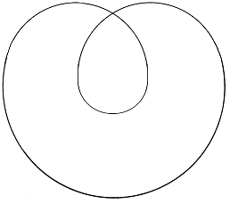

<!-- id: s14-11-0067 -->

Très précisément, de la sorte où le marque la double boucle to­pologique de la répétition, l’Autre aussi se trouve sous le coup de cette finitude. Ainsi se trouve posée *la division* *au cœur des con­ditions de la vérité*. Complication, disons *apportée* à toute exigence de *type leibnizien*, *de réservation* de la sus­dite, je veux dire *de la vérité*.

<!-- id: s14-11-0068 -->

Le « *salva veritate *» essen­tiel à tout ordre de la pensée *philosophique*, est pour nous…

<!-- id: s14-11-0069 -->

> *et pas seulement du fait de la psychanalyse - mani­feste en tous points de cette élaboration qui se fait au niveau de la logique mathématique* …est pour nous un peu plus compliqué. Il exclut en tout cas, tout à fait, toute forme d’« *absoluité intuitive* », l’attribution par exemple, au champ de l’Autre, de la dimension - qualifiée aussi spi­noziennement que vous voudrez - de l’Éternel, par exemple.

<!-- id: s14-11-0070 -->

Cette déchéance permanente de l’Autre est inextir­pable du donné de l’expérience subjective. C’est elle qui met au cœur de cette expérience le phénomène de la croyan­ce dans son ambiguïté, constituée de ceci : *que ce n’est point par accident*, par ignorance, *que la vérité se présen­te dans la dimension du contestable*.

<!-- id: s14-11-0071 -->

*Phénomène* donc, qui n’est pas *à considérer* comme fait de défaut, mais *comme fait de structure*, et que c’est là pour nous *le point de prudence*.

<!-- id: s14-11-0072 -->

Le point où nous sommes sollicités de nous avan­cer du pas le plus discret, je veux dire le plus *discer­nant* pour désigner le point substantiel de cette structu­re, pour ne pas prêter à la confusion dans laquelle on se précipite, *non innocemment* sans doute, en suggérant-là une forme renouvelée de *positivisme*.

<!-- id: s14-11-0073 -->

Bien plutôt devrions-nous trouver nos modèles dans ce qui reste si incompris et pourtant si vivant de ce que *la tradition* nous a légué de fragmentaire des *exercices* du *scepticisme* [^49], en tant qu’ils ne sont pas simplement ces jongleries étincelantes entre doctrines opposées, mais au contraire véritables *exercices spirituels*, qui correspon­daient sûrement à une *praxis éthique*, qui donne sa vérita­ble densité à ce qui nous reste de théorique sous ce chef et sous cette rubrique.

<!-- id: s14-11-0074 -->

Disons qu’il s’agit maintenant pour nous, de *rendre compte en termes de notre logique*, du surgissement néces­saire de ce « *lieu de l’Autre* » en tant qu’il est ainsi divisé. Car, pour nous, c’est *là* qu’il nous est demandé de situer non pas simplement ce « *lieu de l’Autre* »…

<!-- id: s14-11-0075 -->

> le « *répondant* » par­fait de ceci : *que la vérité n’est pas trompeuse* …mais bien plus précisément, aux différents niveaux de l’expérience subjective que nous impose la clinique, comment est possi­ble que s’y insèrent - dans cette expérience - des instan­ces qui ne sont pas articulables autrement que comme *de­mande de l’Autre* : c’est la névrose.

<!-- id: s14-11-0076 -->

Et ici nous ne pouvons manquer de dénoncer à quel point est abusif l’usage de tels termes que nous avons in­troduits, mis en valeur, comme celui par exemple de *la demande,* quand nous le voyons repris sous la plume de tel *novice*, à s’exercer *sur le plan de la théorie de l’analyse* et à marquer combien est essentiel - le jeunot montre ici sa perspicacité - de mettre au centre et au départ de l’a­venture une demande - dit-il - d’exigence actuelle.

<!-- id: s14-11-0077 -->

C’est ce que depuis toujours on avance, en faisant tourner l’analyse autour de « *frustration et gratification* ».

<!-- id: s14-11-0078 -->

L’usage ici du terme de *demande* - qui m’est emprunté - n’est là que pour brouiller les traces de ce qui en fait l’essentiel, qui est que le sujet vient à l’analyse, non pas pour *deman­der* quoi que ce soit d’une exigence actuelle, *mais pour savoir ce* *qu’il demande*.

<!-- id: s14-11-0079 -->

Ce qui le mène très précisément à cette voie de demander que l’Autre lui demande *quelque chose :*

<!-- id: s14-11-0080 -->

- le problème de la demande se situe au niveau de l’Autre.

<!-- id: s14-11-0081 -->

- le désir du névrosé tourne autour de la demande de l’Autre.

<!-- id: s14-11-0082 -->

Le problème logique est de savoir comment nous pouvons situer cette fonction de la demande de l’Au­tre, sur ce support : que l’Autre pur et simple, comme tel, est A (A barré).

<!-- id: s14-11-0083 -->

Bien d’autres termes sont aussi à évoquer comme de­vant trouver dans l’Autre leur place : *l’angoisse de l’Au­tre*, vraie racine de la position du sujet comme *position masochique*. Disons encore comment nous devons concevoir ceci : qu’un «* point de jouissance* » est essentiellement repérable com­me « *jouissance de l’Autre* ». Point sans lequel il est impossible de comprendre ce dont il s’agit dans la perversion. Point, pourtant, qui est le seul référent structural qui puisse donner raison de ce qui dans la tradition s’appréhende com­me *Selbstbewusstsein.*

<!-- id: s14-11-0084 -->

Rien d’autre dans *le sujet* ne se tra­verse réellement soi–même, ne se perfore, si je puis dire, comme tel…

<!-- id: s14-11-0085 -->

> j’essaierai d’en dessiner pour vous, un jour, quelque modèle enfantin …rien d’autre, sinon ce point qui, de la jouissance, fait la « *jouissance de l’autre* ».

<!-- id: s14-11-0086 -->

Ce n’est pas d’un pas immédiat que nous nous avan­cerons dans ces problèmes. Il nous faut aujourd’hui tracer la conséquence à tirer du rapport de ce graphe de la répétition, avec ce que nous avons scandé comme le choix fonda­mental de l’*aliénation*.

<!-- id: s14-11-0087 -->

 → 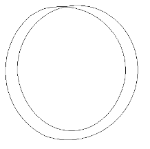

<!-- id: s14-11-0088 -->

Il est facile de voir à cette double boucle que plus elle collera à elle–même, plus elle tendra à se divi­ser.

<!-- id: s14-11-0089 -->

À supposer qu’ici se réduise la distance d’un bord à l’autre, il est facile de voir que ce seront deux rondelles qui viendront à s’isoler.

<!-- id: s14-11-0090 -->

Quel rapport y-a-t-il entre ce *passage à l’acte de l’aliénation* et *la répétition* elle-même ?

<!-- id: s14-11-0091 -->

Eh bien, très précisément, ce qu’on peut et ce qu’on doit appeler l’ACTE .

<!-- id: s14-11-0092 -->

C’est aujourd’hui, d’une situation logique de l’ac­te en tant que tel, que je veux avancer les prémisses.

<!-- id: s14-11-0093 -->

*Cette double boucle, tracé de la répétition : si elle nous impose une topologie,* *c’est que ce n’est pas sur n’importe quelle surface qu’elle peut avoir fonction de bord.*

<!-- id: s14-11-0094 -->

Essayez de la tracer sur la surface d’une sphère, je l’ai montré depuis longtemps, vous m’en direz des nouvelles ! Faites-la revenir ici et essayez de la boucler de façon à ce qu’elle soit un *bord,* c’est-à-dire qu’elle ne se recoupe pas elle–même : ceci est impossible !

<!-- id: s14-11-0095 -->

Ce ne sont des choses possibles - je l’ai déjà depuis longtemps fait remarquer - que sur un certain type de surfaces, celles qui sont ici dessinées, par exemple :

<!-- id: s14-11-0096 -->

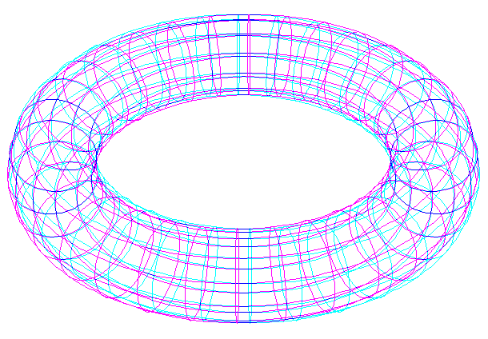 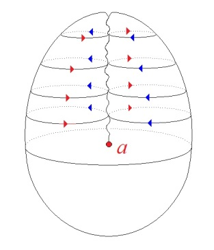 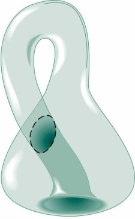

<!-- id: s14-11-0097 -->

*Tore* *Cross-cap* *Bouteille de Klein*

<!-- id: s14-11-0098 -->

- tel *le tore*,

<!-- id: s14-11-0099 -->

- ce que j’ai appelé dans son temps, *le cross-cap* ou *le plan projectif*,

<!-- id: s14-11-0100 -->

- ou encore la tierce *bouteille de Klein* dont vous savez, je pense, si vous vous souvenez encore, du petit des­sin dont on peut l’imager - il est bien entendu que *la bou­teille de Klein* n’a rien qui la lie spécialement à cette représentation particulière.

<!-- id: s14-11-0101 -->

L’important est de savoir ce qui dans chacune de ces surfaces, résulte de *la coupure* constituée *par la double boucle *:

<!-- id: s14-11-0102 -->

- *sur le tore*, cette coupure donnera une surface à deux bords.

<!-- id: s14-11-0103 -->

 → 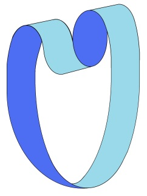

<!-- id: s14-11-0104 -->

- *sur le cross-cap*, elle donnera une coupure à un seul bord.

<!-- id: s14-11-0105 -->

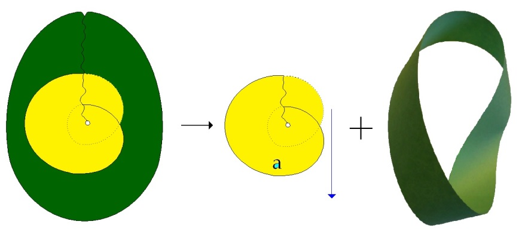

<!-- id: s14-11-0106 -->

Ce qui est important, c’est : quelle est la structure des surfaces ainsi instaurées ? Les images qui sont à gauche \[*en haut à gauche du tableau*\]...

<!-- id: s14-11-0107 -->

> et que j’ai déjà in­troduites la dernière fois pour que vous puissiez en pren­dre le dessin …vous représentent ce qui constitue *la sur­face la plus caractéristique pour nous imager la fonction que nous donnons à la double boucle*.

<!-- id: s14-11-0108 -->

C’est, en haut et à gauche, *la bande de Mœbius*, dont le bord, c’est-à-dire tout ce qui est dans ce dessin, sauf ceci, qui est un pro­fil :

<!-- id: s14-11-0109 -->

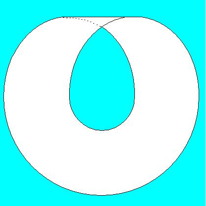

<!-- id: s14-11-0110 -->

qui n’est là, en quelque sorte inscrit, que pour faire surgir dans votre imagination l’image du support de la sur­face elle-même, à savoir qu’ici la surface tourne de l’autre côté, mais ceci ne fait partie bien sûr d’aucun bord, il ne reste donc que la double boucle, qui est le bord - le bord unique - de la surface en question.

<!-- id: s14-11-0111 -->

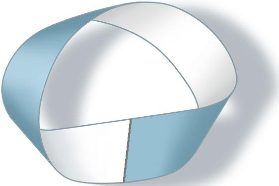

<!-- id: s14-11-0112 -->

Nous pouvons prendre cette surface pour symbolique du sujet, à condition que vous considériez, bien sûr, que seul le bord constitue cette surface, comme il est facile de le démontrer en ceci : c’est que si vous faites une cou­pure par le milieu de cette surface, cette coupure elle-même concentre en elle l’essence de la double boucle. Étant une coupure qui, si je puis dire, se « *retourne* » sur elle-même, elle est *elle-même,* cette coupure unique, à elle toute seule, toute *la surface de Mœbius*.

<!-- id: s14-11-0113 -->

Et la preuve c’est qu’aussi bien, quand vous l’avez faite, cette coupure mé­diane, il n’y a plus de *surface de Mœbius du tout* !

<!-- id: s14-11-0114 -->

La coupure, si je puis dire « *médiane* », l’a retirée de ce que vous croyez voir, là, sous la forme d’une surface.

<!-- id: s14-11-0115 -->

C’est ce que vous montre la figure qui est à droite, qui vous montre qu’une fois coupée *par le milieu*, cette surface, qui auparavant n’avait ni endroit ni envers, n’avait qu’une seule face, comme elle n’avait qu’un seul bord, a mainte­nant un endroit et un envers, que vous voyez ici marqué de deux couleurs différentes.

<!-- id: s14-11-0116 -->

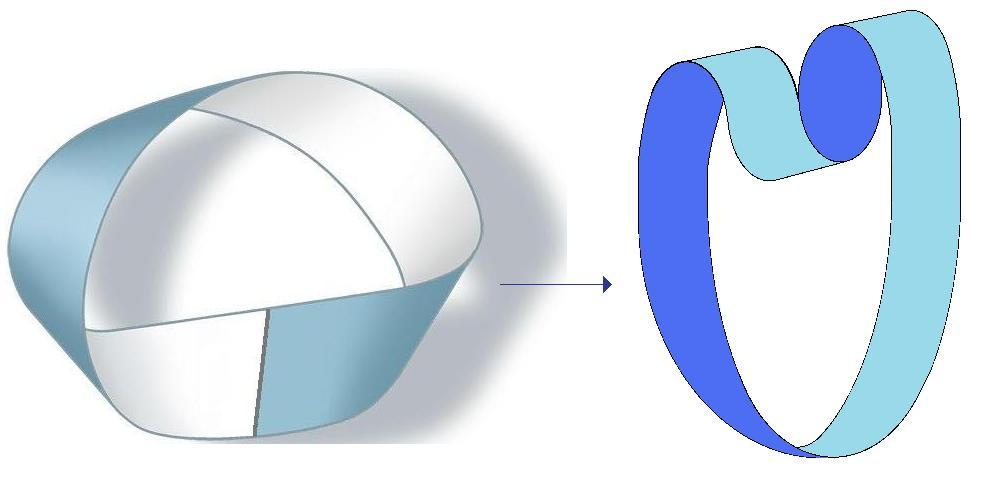

<!-- id: s14-11-0117 -->

Il vous suffit bien sûr, d’ima­giner que chacune de ces couleurs passe à l’envers de l’au­tre, là où du fait de la coupure elles se continuent. Autrement dit, après la coupure il n’y a plus de *surface de Mœbius*, mais par contre, quelque chose qui est applicable sur un tore. Ce que vous démontrent les deux autres figures, à savoir que si vous faites d’une certaine façon glisser cette surface : celle qui est obtenue après la coupure à l’envers d’elle–même, si je puis m’exprimer ainsi, ce qui est tout à fait bien imagé dans la figure présente :

<!-- id: s14-11-0118 -->

 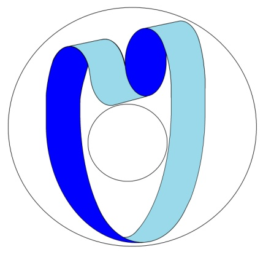

<!-- id: s14-11-0119 -->

Vous pouvez, en couchant - si je puis dire - d’une autre façon les bords dont il s’agit, constituer ainsi une nouvelle surface qui est la surface d’un tore, sur laquelle est mar­quée toujours la même coupure, constituée par *la double bou­cle fondamentale de la répétition*.

<!-- id: s14-11-0120 -->

Ces faits topologiques sont pour nous extrêmement favorables à imager quelque chose qui est ce dont il s’agit, à savoir que, de même que l’aliénation s’est imagée dans deux sens d’opérations différentes :

<!-- id: s14-11-0121 -->

- où l’un représente le choix nécessaire du « *je ne pense pas* » écorné de l’*Es* de la struc­ture logique,

<!-- id: s14-11-0122 -->

- l’autre élément qu’*on ne peut choisir*, de l’alternative, qui oppose, qui conjoint le noyau de l’in­conscient, comme étant ce quelque chose où il ne s’agit pas d’une pensée d’aucune façon attribuable au «* je* » institué de l’unité subjective, et qui le conjoint à un « *je ne suis pas* », bien marqué dans ce que, dans la structure du rêve, j’ai défini comme *l’immixtion du sujet,* à savoir comme le caractère *infixable*, *indéterminable*, du sujet assumant la pensée de l’inconscient.

<!-- id: s14-11-0123 -->

La répétition nous permet de mettre en cor­rélation, en correspondance, deux modes sous lesquels le sujet peut apparaître différent, peut se manifester dans son conditionnement temporel, de façon qui corresponde aux deux statuts définis

<!-- id: s14-11-0124 -->

- comme *celui du « je » de l’aliénation,*

<!-- id: s14-11-0125 -->

- et comme *celui que révèle la position de l’inconscient dans des conditions spécifiques, qui ne sont autres que celles de l’analyse*.

<!-- id: s14-11-0126 -->

<!-- id: s14-11-0127 -->

Nous avons, correspondant au niveau du *schéma tem­porel*, ceci :

<!-- id: s14-11-0128 -->

- que *le passage à l’acte* est ce qui est permis dans l’opération de *l’aliénation,*

<!-- id: s14-11-0129 -->

- que, correspondant à l’autre terme, *terme en principe impossible à choisir dans l’alternative aliénante,* correspond *l’acting-out.*

<!-- id: s14-11-0130 -->

> 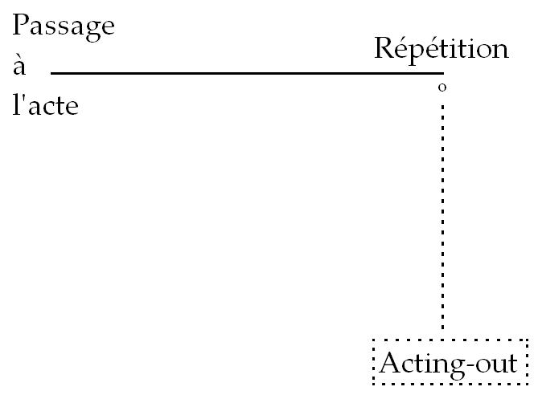

<!-- id: s14-11-0131 -->

Qu’est–ce que ceci veut dire ? J’entends *l’acte* et non pas quelque manifestation de mouvement. *Le mouvement, la décharge motrice* \- comme on s’exprime au ni­veau de la théorie - voilà ce qui ne suffit d’aucune façon à constituer *un acte*, si vous me permettez une image gros­sière : un réflexe n’est pas *un acte*.

<!-- id: s14-11-0132 -->

Mais enfin c’est, bien entendu, bien au-delà qu’il faut prolonger cette aire du « *ne pas-acte* ». Ce qu’on sollicite dans l’étude de l’intelligence d’un animal supérieur - la conduite du détour, par exemple le fait qu’un singe s’aper­çoive de ce qu’il faut faire pour saisir une banane quand une vitre l’en sépare - n’a absolument rien à faire avec *un acte*. Et à la vérité, un très grand nombre de nos mouve­ments, vous n’en doutez pas - de ceux que vous exécuterez d’ici la fin de la journée - n’ont rien à faire bien sûr avec de *l’acte*.

<!-- id: s14-11-0133 -->

*Mais comment définir ce qu’est un acte ?* *Il est impossible de le définir autrement que sur le fondement de la double boucle, autrement dit de la répétition.* Et c’est précisément en cela que *l’acte est fondateur du sujet*. *L’acte* est précisément l’équivalent de *la répéti­tion*, par lui-même.

<!-- id: s14-11-0134 -->

Il est cette répétition en un seul trait, que j’ai désignée tout à l’heure par cette coupure qu’il est possible de faire au centre de *la bande de Mœbius*. Il est en lui-même : double boucle du signifiant.

<!-- id: s14-11-0135 -->

On pourrait dire, mais ce serait se tromper, que dans son cas le signifiant se signifie lui–même. Car nous savons que c’est *impossible*. Il n’en est pas moins vrai que *c’est aussi proche que possible de cette opération*. Le sujet, disons dans l’acte *est équivalent à son signifiant*.

<!-- id: s14-11-0136 -->

Il n’en reste pas moins *divisé*.

<!-- id: s14-11-0137 -->

Tachons d’éclairer un peu ceci et mettons-nous au niveau de cette *aliénation* où le « *je* » se fonde d’un « *Je ne pense pas* » d’autant plus favorable à laisser tout le champ à l’*Es* de la structure logique. « *Je ne pense pas* » … si « *je* » suis, d’autant plus que *je ne pense pas*, je veux dire : si je ne suis que le «* je* » qu’ins­taure la structure logique, le médium, le trait, où peuvent se conjoindre ces deux termes, c’est le « *j’agis* », ce « *j’agis* » qui n’est pas, comme je vous l’ai dit, effectuation motri­ce. Pour que « *je marche* » devienne un acte, il faut que le fait que « *je marche* » signifie : *que je marche en fait, <u>et</u> que je le dise comme tel*.

<!-- id: s14-11-0138 -->

Il y a répétition intrinsèque à tout acte, qui n’est permise que par l’effet de rétroaction qui s’exer­ce du fait de l’incidence signifiante qui est mise en son cœur, …et rétroaction de cette incidence signifiante sur ce qu’on appelle « *le cas* » dont il s’agit, quel qu’il soit.

<!-- id: s14-11-0139 -->

Bien sûr, il ne suffit pas que je proclame que je marche ! C’est quand même, déjà, un début d’action.

<!-- id: s14-11-0140 -->

C’est une action d’opérette : « *Marchons, marchons*… » C’est ce qu’on appelle, dans une certaine idéologie aussi l’engagement, c’est ce qui lui donne le caractère comique bien connu.

<!-- id: s14-11-0141 -->

L’important à détecter sur ce qu’il en est de l’ac­te, est à chercher là où la « *structure logique* » nous livre - et nous livre *en tant que* *structure logique -* la possibili­té de transformer en acte ce qui, de premier abord, ne saurait être autre chose qu’une pure et simple passion « *Je tombe par terre* », ou « *je trébuche* », par exemple.

<!-- id: s14-11-0142 -->

Ré­fléchissez à ceci, que ce fait de redoublement signifiant, à savoir que dans mon « *je tombe par terre* » il y a l’affir­mation que je tombe par terre : « *je tombe par terre* » de­vient, transforme ma chute, en quelque chose de signifiant. Je tombe par terre et je fais par là l’acte où je démontre que je suis, comme on dit : atterré.

<!-- id: s14-11-0143 -->

De même, « *je trébuche* » - même « *je trébuche* » qui porte en soi si manifestement la passivité du ratage - peut être, s’il est repris et redou­blé de l’affirmation « *je trébuche* », l’indication d’un acte, en tant que j’assume moi-même le sens, comme tel, de ce trébuchement.

<!-- id: s14-11-0144 -->

Il n’y a rien-là, qui aille contre l’inspiration de FREUD, si vous vous rappelez qu’à telle page de la *Traumdeutung* et très précisément dans celle où il nous dési­gne les premiers linéaments de sa recherche sur *l’identi­fication*, il souligne bien lui-même…

<!-- id: s14-11-0145 -->

> légitimant par avance les intrusions que je fais de la formule cartésien­ne dans la théorie de l’inconscient …la remarque que *Ich* a deux sens différents dans la même phrase, quand on dit : « *Ich denke was gesundes Kind Ich war.* »

<!-- id: s14-11-0146 -->

« *Je pense* », ou : *Ich bedenke,* comme il l’a dit exactement : je médite, je réflé­chis, je me gargarise « *à la pensée de quel enfant bien portant,* *Ich bin… Ich war, j’étais* ».

<!-- id: s14-11-0147 -->

Le caractère essentiellement signifiant comme tel, et redoublé de l’acte, l’incidence répétitive et intrinsè­que de la répétition dans l’acte, voilà qui nous permet de conjoindre d’une façon originelle, et de façon telle qu’elle puisse ensuite satisfaire à l’analyse de toutes ses variétés, la définition de l’acte.

<!-- id: s14-11-0148 -->

Je ne peux ici qu’indiquer en passant, car nous aurons à y revenir, que l’important n’est pas tellement dans la définition de l’acte, que dans *ses suites*. Je veux dire de *ce qui résulte de l’acte comme changement de la surface*. Car si j’ai parlé tout à l’heure de l’incidence de la coupure dans la surface topologique que je dessine com­me celle de *la bande de Mœbius,* si *après l’acte :*

<!-- id: s14-11-0149 -->

- la surface est d’une *autre structure *dans tel cas,

<!-- id: s14-11-0150 -->

- si elle est d’*une struc­ture* encore différente dans tel autre,

<!-- id: s14-11-0151 -->

- ou si même dans certains cas elle peut ne pas changer, …voilà qui va pour nous, nous pro­poser *modèles,* si vous voulez, à distinguer ce qu’il en est de l’incidence de l’acte, non pas tant dans *la détermination* que dans *les mutations* du sujet.

<!-- id: s14-11-0152 -->

Or il est un terme que depuis quelque temps j’ai laissé aux *tentatives* et *gustations* de ceux qui m’entou­rent, sans jamais franchement répondre à l’objection qui m’est faite - et qui m’est faite depuis longtemps - que la *Verleugnung* \[*le déni*\], puisque c’est le terme dont il s’agit, est le terme auquel il faudrait référer les effets que j’ai réservés à la *Verwerfung* \[*la forclusion*\].

<!-- id: s14-11-0153 -->

J’ai assez parlé de cette dernière, depuis le discours d’aujourd’hui, pour n’avoir pas y reve­nir. Je pointe simplement ici que ce qui est de l’ordre de la *Verleugnung* est toujours ce qui a affaire à l’ambiguïté qui résulte des effets de l’acte comme tel :

<!-- id: s14-11-0154 -->

- « *Je franchis le Rubicon » *: ça peut se faire tout seul. Il suffit de prendre le train à Cesene dans la bonne di­rection, une fois que vous êtes dans le train, vous n’y pouvez plus rien, *vous franchissez le Rubicon*. Mais ce n’est pas un acte.

<!-- id: s14-11-0155 -->

- Ce n’est pas un acte non plus quand *vous franchissez le Rubicon* en pensant à CÉSAR[^50], c’est *l’imi­tation* de l’acte de CÉSAR. Mais vous voyez déjà que *l’imita­tion* prend, dans la dimension de l’acte, une toute autre structure que celle qu’on lui suppose d’ordinaire. Ce n’est pas un acte, mais ça peut quand même en être un ! Et il n’y a même aucune autre définition possible à des suggestions, autrement aussi exorbitantes que *celles qui s’intitulent l’Imitation de* JÉSUS-CHRIST, par exemple.

<!-- id: s14-11-0156 -->

Autour de cet acte, qu’il soit imitation ou pas, qu’il soit l’acte même, original…

<!-- id: s14-11-0157 -->

> celui dont les historiens de CÉSAR, nous disent bien le sens indiqué par le rêve qui précède le franchissement du Rubicon, qui n’est autre que le sens de *l’inceste* …il s’agit de savoir, à chacun de ces niveaux, quel est l’effet de l’acte.

<!-- id: s14-11-0158 -->

C’est le labyrinthe propre à la reconnaissance de ces effets par un sujet qui ne peut les reconnaître, puis­qu’il est tout entier, comme sujet, transformé par l’ac­te, ce sont de *ces effets-là* - *ces effets-là !* - que désigne, partout où le terme est justement employé, la rubrique de la *Verleugnung.* L’acte donc est le seul lieu où le signifiant a l’apparence - la fonction en tout cas - de se signifier lui-même.

<!-- id: s14-11-0159 -->

C’est à dire de fonctionner hors de ses possibi­lités.

<!-- id: s14-11-0160 -->

Le sujet est - dans l’acte - représenté comme division pure. La division, dirons-nous, est son *Repräsentanz*. Le vrai sens du terme *Repräsentanz* est à prendre à ce niveau, car c’est à partir de cette *représentance* du sujet comme es­sentiellement divisé, qu’on peut sentir comment cette fonc­tion de *Repräsentanz* peut affecter ce qui s’appelle *représen­tation,* ce qui fait dépendre la *Vorstellung* d’un effet de *Repräsentanz.*

<!-- id: s14-11-0161 -->

L’heure nous arrête… Il va être pour nous ques­tion, la prochaine fois, de savoir comment il est possible que soit présentifié l’élément impossible à choisir de l’aliénation. La chose vaut bien la peine d’être rejetée à un discours qui lui soit réservé, puisqu’il ne s’agit là de rien d’autre que du statut de l’Autre, là où il est évoqué pour nous de la façon la plus urgente, à ne pas prê­ter à précipitation et erreur, à savoir la situation ana­lytique.

<!-- id: s14-11-0162 -->

Mais ce modèle que nous donne l’acte comme divi­sion et dernier support du sujet, point de vérité qui… disons-le avant de nous quitter, entre parenthèses …est celui qui motive la montée au sommet de *la philosophie,* de la fonction de *l’existence,* qui n’est assurément rien d’au­tre que la forme voilée sous laquelle, pour la pensée, se présente le caractère originel de *l’acte dans la fonction du sujet*.

<!-- id: s14-11-0163 -->

Pourquoi cet acte - dans son instance - est-il resté voilé, et ceci dans ceux qui en ont su le mieux marquer *l’autonomie*…

<!-- id: s14-11-0164 -->

> contre ARISTOTE, qui n’avait pas de ceci - et pour cause - la moindre idée …je veux dire : Saint THOMAS ?

<!-- id: s14-11-0165 -->

C’est sans doute parce que l’autre possibilité de coupure nous est donnée, dans la partie impossible à choi­sir de l’aliénation… pourtant mise à notre portée par le biais de l’analyse …la même coupure intervenant à l’autre sommet, celui ici désigné, qui correspond à la conjonction : *Inconscient -* « *Je ne suis pas* ».

<!-- id: s14-11-0166 -->

<!-- id: s14-11-0167 -->

C’est ce qui s’appelle l’*acting-out* et c’est ce dont nous essaierons la prochaine fois de défi­nir le statut.

## Notes

[^47]: [Pindare](http://remacle.org/bloodwolf/poetes/falc/pindare/pythiques.htm#VIII) : σκιᾶς ὄναρ ἄνθρωπος \[skias onar anthrôpos\], « rêve d’une ombre l’homme », huitième ode. Pindare, Pythiques, huitième Pythique,

    trad. Aimé Puech, Paris, « Les Belles Lettres », 1977, v. 96-97.

[^48]: C.H. Nodet : « *À propos de la régression* », L'évolution Psychiatrique, Tome XXXI, fascicule 3, Privat Didier, 1966, pp 515-535.

[^49]: Cf. Marcel Conche : *Pyrrhon ou l’apparence*, Paris, PUF, 1994.

    Cf. Sextus Empiricus : *Esquisses pyrrhoniennes*, Bilingue, Trad. Pierre Pellegrin, Seuil , 1997.

[^50]: Le Rubicon (aujourd’hui Fiumicino) était la frontière entre la Gaule cisalpine et l’Italie. Il était interdit à tout général romain de le franchir en armes

    sans ordres du Sénat.
