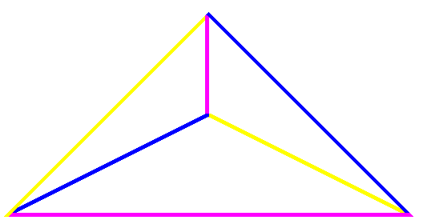
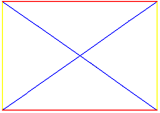
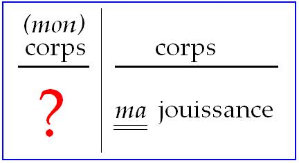
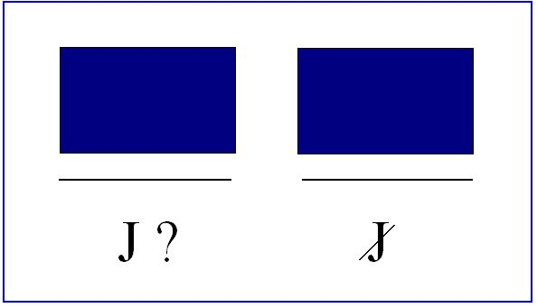

# Leçon 22 | 07 Juin 1967

<!-- source-url: http://staferla.free.fr/S14/S14 LOGIQUE.docx -->
<!-- seminar: s14 -->
<!-- lesson: 22 -->

<!-- id: s14-22-0001 -->

Qu’est-ce qu’il y a de commun à ce qu’on appelle en der­nière heure « *les structuralismes* » ? C’est de faire dépendre la fonction du sujet de l’articulation signifiante. C’est dire qu’après tout, ce signe distinctif peut res­ter plus ou moins élidé, qu’en un sens il l’est toujours.

<!-- id: s14-22-0002 -->

Bien sûr, je sais que certains d’entre vous peuvent trouver qu’à cet égard les analyses de LÉVI-STRAUSS laissent justement ce point central en suspens, nous laissent pour tout dire, devant cette question…

<!-- id: s14-22-0003 -->

> pour autant que depuis quelques années elle est centrée sur le mythe, cette analyse …faut-il penser enfin que *le miel attendait* - j’entends : depuis toujours - *attendait dans le tabac, la vérité de son rapport avec la cendre* ?

<!-- id: s14-22-0004 -->

En un certain sens \[Rire de Lacan\] … c’est vrai ! Et c’est pourquoi, de toute approche semblable, la mise en suspens du sujet découle.

<!-- id: s14-22-0005 -->

Et c’est ce qui suffit à nous faire contribuer à quelque chose qui n’est pourtant pas une doctrine, qui est seulement la recon­naissance d’un efficace, qui semble bien être de la même nature que celui qui fonde la science.

<!-- id: s14-22-0006 -->

Il n’en reste pas moins qu’une notion de *classe,* telle qu’el­le impliquerait « *structuralismes* » au pluriel, qu’un *minimum* de caractéristiques ne saurait d’aucun façon conjoindre en un *en­semble* un certain nombre de recherches, pour autant que pour prendre la mienne par exemple, après tout ce n’est que comme *office*, comme *appareil adjuvant*, qu’elle a dû d’abord rencon­trer - pour l’articuler – cette nécessité de l’articulation sub­jective dans le signifiant.

<!-- id: s14-22-0007 -->

Elle n’en est en quelque sorte que la préface : rien ne saurait y être correctement pensé sans cela.

<!-- id: s14-22-0008 -->

Pourtant, ce n’est pas sans raison que nous devons pro­duire en fin, ce qui dans le même champ a été articulé trop vite, qui est *le rapport fondamental du sujet* ainsi constitué *avec le corps*. Ceci…

<!-- id: s14-22-0009 -->

> d’où sort que *symbolisme* veut toujours dire en ­fin \[*in fine*\] *symbolisme corporel* …ceci à quoi j’arrive, a dû pendant des années être par moi écarté, précisément en raison du fait que c’est ainsi depuis toujours, que c’est ainsi tradition­nellement qu’était articulé le *symbolisme*, c’est-à-dire d’une façon qui manquait *l’essentiel*, comme il arrive, pour être trop précipitée.

<!-- id: s14-22-0010 -->

« *Les membres et l’estomac* » ! Il y a bien longtemps... depuis tou­jours j’ai évoqué à l’horizon la fable de MENENIUS AGRIPPA[^89].

<!-- id: s14-22-0011 -->

C’était pas si mal ! Comparer la noblesse à l’estomac, c’est mieux que de la comparer à la tête, et puis ça remet la tête à sa place parmi les membres…C’est quand même aller un peu vite.

<!-- id: s14-22-0012 -->

Et si nous le savons, c’est en raison du fait que ce qui est au centre de notre re­cherche à nous - à nous, analystes - c’est quelque chose qui sans doute ne passe pas par ailleurs que par les voies de *la structure*, les incidences du signifiant dans le *réel*, en tant qu’il y introduit le sujet, mais que *son centre*…

<!-- id: s14-22-0013 -->

> et c’est un signe que je ne puisse le rappeler avec cette force qu’au moment où, à proprement parler, j’installe mon discours dans ce que je puis légitimement appeler « *une logique* », que c’est à ce moment que je puis rappeler… …que *tout tourne pour nous autour de* ce qu’il en est de ce qu’il faut appeler *la difficulté* - *non pas d’être, comme disait l’autre*[^90] *en son grand âge* - *la difficulté inhérente à l’acte sexuel*.

<!-- id: s14-22-0014 -->

Il y a d’autres difficultés qui ont annoncé celle-là. Introduire cette *fonction de la difficulté*, ce n’est pas rien ! Le jour où la difficulté de l’harmonie sociale a pris ce nom - lé­gitime - *la lutte des classes*, un pas était franchi. *La difficul­té de l’acte sexuel* peut être d’un certain poids, si on s’y ar­rête. Je veux dire : si tout ce que nous avons à articuler dans ce champ se centre effectivement sur cette difficulté.

<!-- id: s14-22-0015 -->

Je soupçonne qu’une des raisons pour quoi *les psychanalys­tes* préfèrent s’en tenir à ce que poser *la Chose*, *avec un grand C si vous voulez,* à ce que poser *la Chose* au centre, il en résulte de lumière pour toute une région zonale, je soupçon­ne que, mis à part quelque chose qu’il faudra bien que je si­gnale tout à l’heure, c’est d’abord une difficulté logique.

<!-- id: s14-22-0016 -->

On pourrait à ce propos tenir pour indiciel que *l’institution du mariage* se révèle comme d’autant plus, je ne di­rais pas « *solide* », c’est bien plus que ça : *résistante*, que droit est donné dans notre société, de s’articuler à toutes les aspirations - comme disent les psychologues - à toutes les aspirations vers l’acte sexuel.

<!-- id: s14-22-0017 -->

S’il s’est trouvé que quel­que chose a été franchi dans *l’éclaircissement de la difficulté de l’harmonie sociale*, il est en effet tout à fait frappant : que ce n’est pas spécialement là qu’ait été plus ouvert le droit à s’articuler des aspirations vers l’acte sexuel, que le mariage s’y montre - je ne dirai pas plus *résistant*, il n’a pas à résister - plus *institué* qu’ailleurs, et que dans le champ où les aspirations s’articulent sous mille formes efficaces, dans tous les champs de l’art, du cinéma, de la parole, sans compter dans celui du grand malaise névrotique de la civilisa­tion, le mariage, bien sûr, reste au centre, n’ayant pas bougé d’un pouce dans son statut fondamental.

<!-- id: s14-22-0018 -->

Autrement dit, pour la résumer cette institution, de voir qu’elle est fondée sur cette seule énonciation, une fois prononcée, dont je me suis servi – autrement ! – comme exemple pour y indiquer la structuration du message en lui–même : « *Tu es ma femme* », ce qui n’a même pas besoin d’être redoublé d’une autre annonce, ce qui rend presque purement formel qu’on lui demande, si elle est d’accord.

<!-- id: s14-22-0019 -->

À ceci tient - et sous toutes les formes où persiste, au moins pour l’instant, cette institution - à ceci tient l’inau­guration de ce que nous appellerons un couple défini comme producteur. Ce n’est pas tout à fait dire seulement qu’il s’agit du couple au sens où il s’agit de la paire sexuelle. Bien sûr elle est exigible, mais il faut remarquer que nous pouvons dire que son produit est autre chose que l’enfant réduit au rejeton symbolique, à l’effet de la fonction de reproduction. Et c’est ce que nous voulons dire en désignant comme *(a)* ce que nous avons à interroger, au départ de son entrée dans l’acte sexuel.

<!-- id: s14-22-0020 -->

Il en est *déjà* *le produit*, et non pas seulement comme rejeton biologique, ce *(a)*, dont je vous ai dit que vous pouvez grossièrement, si vous voulez absolument le situer dans vos cases philosophiques, l’identifier à ce à quoi est arri­vé le *résidu* de cette tradition au dernier terme, après avoir porté jusqu’à la perfection l’isolation de la fonction du sujet, et avoir dû au-delà rester coite.

<!-- id: s14-22-0021 -->

Il n’en reste pas moins, qu’avant de nous faire signe : « *Bye, bye, voguez maintenant, sur ce qui me succède et où vous êtes un tant soit peu plongés,* *dans ce monde qui remue, qui va sortir la dernière de ses contradic­tions, ça commence*… » À ce moment-là aussi elle vous a dit quand même qu’un petit *résidu* restait, de cette bénéfique dia­lectique à quoi était offert d’avance *l’ordre total*, *le savoir absolu* et qui s’appelle le *Dasein*.

<!-- id: s14-22-0022 -->

Ce *résidu de présence*, en tant que lié à la constitution subjective, est en fait le seul point par où nous restons en continuité avec la tradition philosophi­que, nous *le recueillons de sa main*, nous qui le retrouvons précisément comme le sous produit de ce quelque chose qui était resté masqué dans la dialectique du sujet, à savoir qu’elle a affaire à *l’acte sexuel*.

<!-- id: s14-22-0023 -->

Ce *résidu subjectif* est *déjà là* au moment où se pose la question du mode dont il va jouer dans l’acte sexuel. Si tout le discours humain est ainsi structuré qu’il laisse béante la possibilité même de l’instauration subjective impliquée dans l’acte sexuel, *tout le discours humain a déjà produit* - non pas dans chaque sujet, au niveau de son effet subjectif en soi - *cette pluie, ce ruissellement de résidus* \[cf. Lituraterre\] qui accompagne chacun des sujets intéressés dans le processus.

<!-- id: s14-22-0024 -->

Et il se trouve - je pense que vous vous en souvenez, parce que c’est par cet abord que nous l’avons déjà approché - que *ce résidu c’est* en fin de compte la jonction la plus sûre, tou­te partielle qu’elle soit dans son essence, *la jonction la plus sûre du sujet avec le corps*.

<!-- id: s14-22-0025 -->

Que *ce petit(a) se présente* - *certes comme corps, mais non comme on le dit comme corps total*  - *comme chute, égaré au re­gard de ce corps dont il dépend* selon une structure qui est fortement à maintenir si l’on veut la comprendre.

<!-- id: s14-22-0026 -->

On ne peut la comprendre qu’à se référer au *centre*. Et c’est bien ce que­ maintiennent certaines indications, comme celle que l’inciden­ce de ces objets que j’appelle du *petit(a)*, sont toutes liées…

<!-- id: s14-22-0027 -->

> on ne dit pas à l’acte, bien sûr, puisque c’est moi qui l’ai dit le premier …à quelque chose quand même qui s’y destine, puisque c’est tout entier autour…

<!-- id: s14-22-0028 -->

> pas seulement de la prématuration biologique, pour autant qu’elle invoque cet appel fait au corps vers le lieu de l’acte …non pas seulement prématura­tion ou sa tentative : *pré-puberté,* nous dit-on, première pous­sée qui en sorte, en indique l’avenir et l’horizon, et à soi seule…

<!-- id: s14-22-0029 -->

> mais non sans invoquer toute une conjonction, toute une circonstance sociale de répression, d’appréciation, tout au moins de référence discursive, de demande et de désir …déjà « *préforme* », fait arriver le sujet comme *petit(a),* comme sous­-produit de ce point central de difficulté, à la difficulté même.

<!-- id: s14-22-0030 -->

Peut-être la carence relative…

<!-- id: s14-22-0031 -->

> et qui, si même elle est *relative*, n’en reste pas moins radicale - je dis : peut-être …des psychanalystes, eu égard à leur tâche, tient-elle à ce qu’ils ne se posent pas eux-mêmes comme engagés à en éprouver à l’extrême *la difficulté de l’acte sexuel*.

<!-- id: s14-22-0032 -->

Car la psychanalyse didactique, si bien sûr elle est plus qu’exigible pour - chez eux - disons *cicatriser les effets de hasard*, comme il en est chez chacun, de cette *difficulté*, ce n’est pas dire qu’elle \[la psychanalyse\] constitue en elle–même le fait de s’éprouver à cette *difficulté* !

<!-- id: s14-22-0033 -->

Il est assez commode, franchi - appelez ça comme vous voudrez - *le nettoyage*, *la purification préalable* de retour­ner à ses pantoufles, qui ne sont - quoi qu’on en dise - pas le lieu élu de l’acte sexuel !

<!-- id: s14-22-0034 -->

Certes, c’est déjà un accès que d’être en état de *penser le désir.* Allez-vous croire \[Rire de Lacan\] que je vous donne ce mot d’ordre qu’il s’agit de « *penser l’acte sexuel* » ? Un acte - remarquez-le si vous vous souvenez de la fa­çon dont je l’ai introduit – n’a pas besoin d’être pensé, pour être un acte. La question se soulève même, de savoir si ce n’est pas pour ça qu’il est un acte !

<!-- id: s14-22-0035 -->

Je n’irai pas plus loin dans ce sens, qui ne favorise que trop les semblants d’acte. L’affaire n’est pas commode, mais il est certain \- qu’il faille ou non le penser - qu’on ne peut le penser qu’après ! La nature de l’acte : c’est qu’il faut le commettre d’abord.

<!-- id: s14-22-0036 -->

Ce qui, peut–être, n’exclut pas qu’il soit pensé. C’est vous dire que, si l’on part de *la difficulté de l’acte sexuel*, ça n’est pas mettre à la portée de la main *le temps de le penser*.

<!-- id: s14-22-0037 -->

Alors, reprenons au niveau le plus ras, comment ça se pose : si c’est un acte, constitution en acte d’un signifiant…

<!-- id: s14-22-0038 -->

> à par­tir de quelque motion, dirons-nous, n’invoquant là que le re­gistre
>
> du mouvement, quelque chose de mesurable dans la pesée d’un corps …il doit y avoir, si le signifiant se réduit à la plus simple chaîne, cette opposition que j’ai déjà inscrite sur deux petites plaques inattendues dans un de mes articles[^91], et que nous retraduirons ici par le - je ne dis même pas « *je* » -  « *suis un homme* », et son rapport avec «* suis une femme *». C’est-à-dire que nous revenons à ce qui tout à l’heure se présentait comme *le message sous une forme inversée*.

<!-- id: s14-22-0039 -->

Est-ce qu’il n’est pas absolument fabuleux que nous ne puissions en aucun cas - absolument pas ! - rendre compte d’un lien entre ces termes qui justifie que nous les prenions pour - l’un de l’autre - l’inverse ?

<!-- id: s14-22-0040 -->

Et qu’il faut bien, dès lors, que nous les interrogions tels qu’ils sont, c’est-à-dire…

<!-- id: s14-22-0041 -->

> com­me vous ne l’ignorez pas et comme articulé à chaque li­gne de FREUD …dans la *totale incapacité* de leur donner quelque corrélat sûr que ce soit : activité, passivité, par exemple, ne sont que des substituts dont, chaque fois qu’il les em­ploie, FREUD souligne le caractère, je ne dirai pas inadé­quat : suspect.

<!-- id: s14-22-0042 -->

Alors, reposons les questions avec les appareils que nous a fournis notre bonne petite tradition de maniement du sujet.

<!-- id: s14-22-0043 -->

Elle doit pouvoir ici être mise à l’épreuve, et même si elle ne peut servir à rien, la façon dont elle sera rebutée par l’objet nous instruira peut–être de quelque chose concer­nant l’objet lui–même, son élasticité par exemple!

<!-- id: s14-22-0044 -->

*L’être-mâle*, pour le prendre d’abord - mais aussi bien *l’être-femelle* : *ils sont à ce niveau du discours exactement dans la même position* – nous allons lui trouver quelque chose d’analogue à ce à quoi nous a mené notre maniement du sujet, il doit bien y avoir deux faces là aussi, ça saute aux yeux d’ailleurs tout de suite !

<!-- id: s14-22-0045 -->

Il y a un « *en soi* » et puis un « *pour*... », un « *pour quelque chose* » ! Mais ce qui se voit tout de suite, c’est que ce n’est pas du tout là le « *pour soi* », en raison même de l’exigence fondamentale de l’acte sexuel : il ne peut pas rester «* pour soi *», mais ne disons pas qu’il est « *pour* » celui qui fait la paire ! C’est là que doit nous servir l’introduction de la fonc­tion du grand Autre.

<!-- id: s14-22-0046 -->

Ce qui correspond ici à notre interroga­tion, comme opposé à cet « *en soi* » plutôt dérapant, qui corres­pond à *l’être-mâle* et bien plus encore à *l’être-femme,* c’est un « *pour l*’*Autre* », avec un grand A. C’est-à-dire, ce qu’il nous a bien fallu évoquer d’abord, c’est-à-dire *le lieu* d’où le mes­sage lui revient sous une forme inversée.

<!-- id: s14-22-0047 -->

Je vous fais remarquer que c’est un petit rappel, je le ferai plus accentué la prochaine fois mais je ne peux ici que l’amorcer, en passant, à *cette alternative* dont j’ai étendu la portée en montrant qu’elle n’est pas celle, simplement, de l’aliénation, puisqu’elle nous a permis d’ores et déjà au pre­mier trimestre, d’instituer cette opération logique de l’alié­nation dans sa relation avec deux autres, vous l’avez peut-être oublié, qui forment avec elle quelque chose que j’ai in­terrogé à la manière d’un *groupe de Klein* \[Cf. 21-12-1966\].

<!-- id: s14-22-0048 -->

 

<!-- id: s14-22-0049 -->

Bref ! le départ de ce petit rectangle \[Cf. 11-01-1967\] où j’ai situé l’aliénation fondamentale du sujet, précisément dans son rapport avec une possibilité qui n’était que la place marquée de *l’acte sexuel* sous la forme - logique - de *la sublimation*.

<!-- id: s14-22-0050 -->

<!-- id: s14-22-0051 -->

Cette alternative : ou « *je ne pense pas *», ou *« je ne suis pas *», choix séduisant comme vous le voyez, qui est le départ de ce qui est offert au sujet dès que la perspective s’introduit d’un inconscient, en tant qu’il est fait de cette *difficulté de l’acte sexuel*. Vous voyez ici omme elle se répare : le « *je ne pense pas* », c’est assurément le *pour*... *en soi* \[Lacan rectifie son lapsus\] « *l’en­ soi* », si jamais il se manifeste, de *l’être-mâle* ou de *l’être-femme*. Le « *je ne suis pas* » étant de l’autre côté, à savoir du côté du « *pour l’Autre* ».

<!-- id: s14-22-0052 -->

*Ce que l’acte sexuel est appelé à assurer, puisqu’il s’y fonde, c’est quelque chose que nous pourrons appeler un signe, venant d’« où je ne pense pas » :* *d’où je suis comme ne pensant pas, pour arriver « où je ne suis pas » : là où je suis comme n’étant pas.*

<!-- id: s14-22-0053 -->

Car si « *je suis où je ne pense pas* » et si « *je pense où je ne suis pas* » - c’est bien l’occasion de s’en rappeler - dans ce rapport qui a beau arriver « *où je ne suis pas* » - c’est-à-dire, moi *mâle* : au niveau de *la femme -* c’est quand même là que…

<!-- id: s14-22-0054 -->

> *quelles qu’aient été les prétentions des philosophes à détacher le* τὸ ϕρονεῖν \[to phronein : *je cogite*\], *du* τὸ χαίρειν \[to khairein : *je jouis*\] …c’est quand même là que mon destin même, au niveau du τὸ ϕρονεῖν \[to phronein : *je cogite*\], se joue. Le fait d’avoir dialogué avec SOCRATE, n’a jamais em­pêché personne d’avoir des obsessions qui chatouillent, qui dérangent grandement son τὸ ϕρονεῖν !

<!-- id: s14-22-0055 -->

Alors le pas suivant est celui-ci qui nous est offert - et c’est pour ça que je l’ai rappelée - par la fonction du message : c’est que c’est un fait, qu’imprudent et ne sachant absolument pas ce que je dis, je m’annonce comme étant « *homme* » là où « *je ne pense pas* ».

<!-- id: s14-22-0056 -->

Et cette forme du « *Tu es ma femme* », là où «  *je ne suis pas* », ça a quand même l’intérêt que ça donne à la femme, la possibilité de s’annoncer, elle aussi. Et c’est cela qui exige qu’elle soit là au titre de sujet, car elle le devient, elle comme moi, *dès lors qu’elle s’annonce*.

<!-- id: s14-22-0057 -->

Cette rencontre, sous la forme pure - d’autant plus pure, j’y insiste, qu’on ne sait absolument pas ce qu’on dit - c’est là ce qui met au tout premier plan *la fonction du sujet* dans *l’acte sexuel*. Et c’est même comme pur sujet que nous nous apercevons, précisément au niveau du fondement de cet acte, que ce pur sujet se situe au joint, ou pour mieux dire au *dis­joint du* *corps et de la jouissance*.

<!-- id: s14-22-0058 -->

*C’est un sujet dans la mesu­re de ce disjoint.* Comment, ici, ça se voit-il au mieux ?

<!-- id: s14-22-0059 -->

Bien sûr nous le savons *de tradition*, puisque tout à l’heure, j’évoquais le *Philèbe* en particulier, où ce τὸ ϕρονεῖν \[to phronein : *je cogite*\] et ce τὸ χαίρειν \[to khairein : *je jouis*\] sont soumis à cette opération de séparation, avec une rigueur dont c’est précisément pour cela qu’à la veille des dernières vacances, je vous en ai recommandé la relecture.

<!-- id: s14-22-0060 -->

Mais ici, si même déjà vous vouliez me dire qu’après tout, cet acte, nous pouvons bien nous passer de ses *exigences d’acte*, qu’on n’a pas besoin peut-être de l’acte sexuel pour foutre d’une façon parfaitement convenable ! Il s’agit en effet de savoir, dans le relief de l’acte, ce qu’y exige le sujet. C’est peut-être peu dire que de dire que tout tient dans l’opposition des signifiants *homme, femme,* si nous ne savons pas encore même ce qu’ils veulent dire.

<!-- id: s14-22-0061 -->

Et en effet, là où se voit *l’incidence du sujet*, ce n’est pas tellement dans le mot « *femme* » que dans le mot « *mâle* ». *La jouissance*, ai-je fait remarquer, est un *terme ambi­gu* : il glisse. De ceci, qui fait dire *qu’il n’y a de jouissance que du corps* et qui ouvre le champ de *la substance* où viennent s’inscrire *ces limites sévères*, où le sujet se contient, *des in­cidences du plaisir*. Et puis ce sens où *jouir* - *ai-je dit* - c’est poser le « *ma... *» : *Je jouis de quelque chose*. Ce qui laisse en suspens la question de savoir si *ce quelque chose* - *de ce que je jouisse de lui* - *jouit*.

<!-- id: s14-22-0062 -->

Là, autour du « *ma...* », est très précisé­ment cette *séparation* *de la jouissance et du corps*. Car ce n’est pas pour rien que je vous y ai introduits la dernière fois, par le rappel de cette articulation, fragile d’être li­mitée au champ traditionnel de la genèse du sujet, de la *Phé­noménologie de l’esprit*, du maître et de l’esclave.

<!-- id: s14-22-0063 -->

« *Ma*... » je jouis de ton corps désormais, c’est-à-dire que ton corps devient la métaphore de « *ma* » *jouissance*.

<!-- id: s14-22-0064 -->

Et HEGEL tout de même n’oublie pas que ce n’est qu’*une métaphore*. C’est-à-dire que si maître je suis, ma jouissance est déjà déplacée, qu’elle dépend de la métaphore du serf. Et qu’il reste que pour lui, comme pour ce que j’interroge dans l’acte sexuel, il y a une *autre Jouissance* qui est *à la déri­ve*. Et est-ce que j’ai besoin, une fois de plus, de l’écri­re au tableau, avec mes petites barres ?

<!-- id: s14-22-0065 -->

<!-- id: s14-22-0066 -->

Ce corps de la femme, qui est « *ma* », est désormais la métaphore de ma jouissance. Il s’agit de savoir ce qui est là sous la forme de mon corps - bien sûr je ne pense même pas, innocent que je suis, à l’appeler « *mon* » - il va avoir aussi son rapport de *métaphore*, ce qui assurément, fonderait tout de la façon la plus élégante et la plus aisée, avec la jouis­sance qui est en question et qui fait la difficulté de l’acte sexuel.

<!-- id: s14-22-0067 -->

Vous allez me dire : « *Pourquoi est-ce que c’est au ni­veau de la femme qu’elle fait question ?* » Nous allons le dire très vite et très simplement tout de suite, tous les psychanalystes le savent, ils ne savent pas le dire forcément, mais ils le savent ! Ils le savent, en tout cas, par ceci : *c’est qu’hommes ou femmes, ils n’ont pas été encore capables d’articuler la moindre chose qui tien­ne sur le sujet de la jouissance féminine* !

<!-- id: s14-22-0068 -->

Je ne suis pas en train de dire que la jouissance fémini­ne ne peut pas prendre cette place, je suis en train de vous arrêter au moment où il s’agit de ne pas aller trop vite pour dire que c’est là, *la difficulté de l’acte sexuel* ! Et cette référence, qui était moins insupportable uniquement parce que c’est un mythe, que j’ai prise la dernière fois dans les rapports du maître et de l’esclave, à savoir de *la jouissance* à la dérive, vous pouvez bien l’imaginer quand il s’agit de l’esclave, \[*Lacan écrit au tableau Jouissance*\] à savoir qu’il n’y a pas de raison qu’elle ne soit pas toujours là, la jouissance, et ceci d’autant plus que lui n’a pas eu, comme le maître, l’idiotie de la mettre dans le risque !

<!-- id: s14-22-0069 -->

Alors, pourquoi ne l’aurait-il pas gardée ? Ce n’est pas \[une raison\] parce que son corps est devenu la métaphore de la jouissance du maître, pour que sa jouissance à lui ne continue pas sa petite vie ! Comme tout le prouve ! Si vous lisez la comédie antique, si vous relisez le cher [TÉRENCE](http://fr.wikipedia.org/wiki/T%C3%A9rence) par exemple, qui n’est pas précisément un primitif, qui est même tout le contraire, dont on peut même dire que les choses sont poussées si loin, chez lui, si exténuées, que ça dépasse en *simplicité* tout ce que nous pouvons cogiter.

<!-- id: s14-22-0070 -->

Beaucoup plus simplet qu’un film de M. ROBBE-GRILLET, même quand il est bâclé ! \[Rires\] Mais il n’est pas bâclé !

<!-- id: s14-22-0071 -->

Seulement, nous ne nous apercevons absolument plus de quoi il s’agit ! Il y a une certaine histoire d’[*Andrienne*](http://remacle.org/bloodwolf/comediens/Terence/andrienne.htm), par exemple… Vous allez le lire et vous allez dire : « *Mon Dieu, quelle histoire !* »

<!-- id: s14-22-0072 -->

Tout ça parce qu’un garçon qui a un père et qui doit ou non épouser une fille qui soit de *la bonne* ou de *la mauvaise so­ciété*. Et comme à la fin, celle qui est de la mauvaise socié­té s’avère être de la bonne – à cause de cette histoire éternel­le des reconnaissances, qu’elle a été enlevée tout petite, *et patati et patata*… Quelle histoire ! Et quelle histoire idio­te ! Seulement, ce qu’il y a de fâcheux, c’est que si vous raisonnez ainsi, vous ne voyez pas une chose, c’est qu’il n’y a qu’une seule personne intéressante dans toute cette co­médie et qui s’appelle DAVOS! C’est bel et bien un esclave. *Car on peut le prendre* tout à fait *au sérieux*, lui qui mène tout, lui qui est le seul intelligent parmi toutes ces personnes, et on ne songe même pas à vous suggérer que les autres pourraient commencer de l’être :

<!-- id: s14-22-0073 -->

- *Le père joue le rôle paternel au degré, enfin... d’abrutissement souhaitable*, enfin... *véritablement*, enfin *superfétatoire* n’est-ce pas ? \[Rires\]

<!-- id: s14-22-0074 -->

- Le fils est un pauvre mignon complè­tement égaré! \[Rires\]

<!-- id: s14-22-0075 -->

- Les filles en jeu ? On ne les voit même pas, elles n’intéressent personne! \[Rires\]

<!-- id: s14-22-0076 -->

- Il y a un esclave, qui se bat pour son maître, à ceci près qu’il risque d’être, d’une minute à l’autre - c’est écrit - crucifié !

<!-- id: s14-22-0077 -->

Et il mène l’affaire de *main de maître*, c’est le cas de le dire ! \[Hilarité générale\]

<!-- id: s14-22-0078 -->

Voilà de quoi il s’agit dans la comédie antique. À ceci près que ça n’a pour nous qu’un intérêt, à savoir de vous mon­trer qu’il peut y avoir une question de ce qu’il advient de la jouissance quand il s’est produit ce petit mouvement de déca­lage, de *Verschiebung,* qui est à proprement parler constitué dès que s’introduit, entre le corps et la jouissance, la fonction du sujet.

<!-- id: s14-22-0079 -->

Ça n’est pas avec la jouissance propre à un corps en tant que cette jouissance le définit ! Un corps, c’est quelque chose qui peut jouir. Seulement voilà : on le fait devenir *la méta­phore* de *la jouissance* d’un autre ! Et qu’est-ce que devient la sienne ?

<!-- id: s14-22-0080 -->

Est-ce qu’elle s’échange ? Toute la question est là ! Mais elle n’est pas résolue. Elle n’est pas résolue, pourquoi ?

<!-- id: s14-22-0081 -->

Tout de même, nous analystes nous le savons. C’est à dire que nous pouvons toujours le dire !

<!-- id: s14-22-0082 -->

C’est une observation générale, je ne vais pas tout le temps la répéter ! Écrivons ça... On va faire comme ça, hein, pour le corps, ça va être plus amusant, et ça ressemble à mes *petites plaques*, sur lesquel­les, dans un de mes articles, j’ai écrit « *Hommes* », « *Dames* » : ça se voit à l’entrée des urinoirs... \[ Rires \]

<!-- id: s14-22-0083 -->

<!-- id: s14-22-0084 -->

Une *petite plaque* peut nous servir de corps, avec *ins­crites* dessus, un certain nombre de choses, en effet *c’est la fonction du corps*, depuis que nous avons rappelé que c’est *le lieu de l’Autre*.

<!-- id: s14-22-0085 -->

Alors, on fait la même petite barre, pour que vous ne soyez pas troublés, et ici on écrit « J » pour dire « *jouissance* ».

<!-- id: s14-22-0086 -->

Alors, là il y a un point d’interrogation parce que c’est celle-là et que nous ne savons pas finalement si elle vient là, si le corps du mâle est bel et bien - sûrement - ce que le mâle affirme, car il ne fait que l’affirmer, c’est de là que nous partons dans le « *Tu es ma femme* », à savoir *que le corps de la femme est la métaphore de sa jouissance à lui*. Voilà ! Il suffit d’ajouter un trait pour rendre expres­sive cette petite articulation.

<!-- id: s14-22-0087 -->

En effet, pour des raisons qui tiennent… qui tiennent à ceci *qu’il n’y a pas que le couple en jeu dans l’acte sexuel*, à savoir que…

<!-- id: s14-22-0088 -->

> comme d’autres structuralistes qui fonctionnent dans d’autres champs vous l’ont rappelé …le rapport de l’hom­me et de la femme est soumis à des fonctions *d’échange*, qui impliquent du même coup une *valeur d’échange*, et que le lieu où quelque chose qui est d’usage, est frappé de cette négati­vation qui en fait une *valeur d’échange*, est ici…

<!-- id: s14-22-0089 -->

> pour des raisons prises dans la constitution naturelle de la fonction de copulation …est ici prise sur la jouissance masculine en tant, qu’elle, on sait où elle est. Enfin, on le croit ! C’est un petit organe qu’on peut attraper. C’est ce que fait *le bébé* tout de suite, avec *le plus grand aise*.

<!-- id: s14-22-0090 -->

Ah - ça je puis vous dire, entre parenthèses il faudra vraiment que je vous le montre - on m’a apporté un petit livre romantique sur *la masturbation*… Avec figures ! C’est quelque chose de tellement… enfin, de tellement ravissant, que je ne peux pas croire que si je le fais ici circuler, il me reviendra ! \[Hilarité générale\] Alors, je ne sais que faire, je ne sais que faire, il faudra… il doit y avoir des appa­reils, où on peut projeter, comme ça, des objets et l’ouvrir à la page… Bon, enfin, il faut que vous voyiez ça. Ca s’ap­pelle *Le livre sans titre* et c’est fait pour... il y a au moins vingt-cinq figures, enfin...

<!-- id: s14-22-0091 -->

ou une vingtaine, qui démontrent *les ravages* \[rire de Lacan\] qu’exerce sur un malheureux… sur tout malheureux jeune homme, bien sûr - vous savez combien la masturbation avait mauvaise réputation au début du siècle dernier - les ravages et les… les horreurs, enfin, que ça produit ! Et tout ça, avec un trait et des couleurs ! \[Rires\] Enfin, voir le malheureux jeune homme, le malheureux jeune homme vomir du sang ! Parce que c’est une des choses qui sont les conséquences… enfin, c’est quelque chose de *subli­me*. Je vous demande pardon, ça n’a rien à faire avec mon discours, *absolument rien à faire* ! Ça va me coûter horriblement cher ! C’est une des raisons aussi, pour quoi je ne voudrais pas m’en séparer ! \[Nouvelle hilarité générale\]

<!-- id: s14-22-0092 -->

Oui, et c’est d’une beau­té qui dépasse tout… s’il existe des appareils avec lesquels ont peut projeter, même sans que la chose soit transparente, je voudrais vous montrer ça… Je n’ai jamais rien vu de pareil ! \[Rires\] Bon, enfin bref ! Enfin bref, vous le savez, cet embargo, hein, sur la jouissance masculine, en tant qu’elle est appréhendable quel­que part, voilà quelque chose qui est structural - quoique ca­ché - pour la fondation de la valeur.

<!-- id: s14-22-0093 -->

Si une femme, qui est un sujet quand même, dans *l’acte sexuel*…

<!-- id: s14-22-0094 -->

> *je dirai même plus, je viens d’articuler qu’il ne sau­rait y avoir d’acte sexuel si elle n’est pas, au départ, fondée comme sujet* …pour qu’une femme puisse prendre sa fonction de *valeur d’échange*, il faut qu’elle recouvre quelque chose qui est ce qui déjà est institué comme valeur et qui est ce que la psychanalyse révèle sous le nom de complexe de castration.

<!-- id: s14-22-0095 -->

*L’échange des femmes,* je ne suis pas en train de vous dire qu’il se retraduit aisément par *l’échange des phallus !* Sans ça, on ne voit pas pourquoi les ethnologues ne feraient pas aussi bien *leurs tableaux de structures* en appelant les choses par leur nom !

<!-- id: s14-22-0096 -->

C’est *l’échange des phallus*, en tant que symboles d’une jouissance soustraite comme telle, c’est-à-dire non pas le pénis, mais ce qui, puisque la femme devient la métaphore de la jouissance, fait qu’on peut à sa place prendre une nouvelle métaphore, à savoir cette par­tie du corps - *négativée* - que nous appelons *le phallus*, pour le distinguer du pénis.

<!-- id: s14-22-0097 -->

Et ceci n’en laisse pas moins le problème ouvert que nous venons d’articuler ! En d’autres termes, quel­que chose s’instaure, sur quoi un autre processus : celui de l’échange social, dans la fondation du *matériel* - si je puis di­re - destiné à l’acte sexuel.

<!-- id: s14-22-0098 -->

Ceci ne laisse pas moins en suspens si nous pouvons - en raison de cet élément externe - situer quelque chose concernant *la femme* dans *sa fonction de métaphore*, par rapport à une jouissance passée à *la* *fonction de valeur*. Ce qui est exprimé dans maint mythe.

<!-- id: s14-22-0099 -->

Je n’ai pas besoin de rappeler ISIS et *son deuil éternel*, de ce qu’il en est *de cette dernière partie du corps qu’elle a rassemblé*.

<!-- id: s14-22-0100 -->

Je vous signale seulement, au passage, que dans ce mythe extrême, où précisé­ment la déesse se définit comme étant, elle, \- c’est ce qui la distingue d’une mortelle - *jouissance pure,* certes séparée elle aussi du corps, mais pourquoi ?

<!-- id: s14-22-0101 -->

Parce qu’il n’est pas question pour elle de ce qui constitue un corps dans son statut, comme corps mortel.

<!-- id: s14-22-0102 -->

Ceci ne veut pas dire que les dieux n’ont pas de corps, simplement, comme vous ne l’ignorez pas, ils en chan­gent !

<!-- id: s14-22-0103 -->

Même le Dieu d’Israël a un corps ! Il faut être fou pour ne pas s’en apercevoir : ce corps est une *colonne de feu* la nuit, et *de fumée* le jour. Ceci nous est dit dans *Le Livre* et ce dont il s’agit là est à proprement parler son corps.

<!-- id: s14-22-0104 -->

C’est, comme pour mon autre histoire - *c’est une paren­thèse* - c’est des choses que j’aurais mieux développées si j’avais pu faire un séminaire sur *Le Nom du Père*.

<!-- id: s14-22-0105 -->

La déesse est *jouissance*, il est très important de le rappeler. Son statut de déesse est d’être jouissance, et le *méconnaître* c’est proprement se condamner à ne rien compren­dre de tout ce qui est de la jouissance. Et c’est pourquoi le *Philèbe* est exemplaire, où une réplique nous annonce qu’en au­cun cas les dieux n’ont que faire de la jouissance, ce ne se­rait pas digne d’eux.

<!-- id: s14-22-0106 -->

C’est là, si l’on peut dire, qu’est *le point faible* du départ du discours philosophique : c’est d’avoir radicalement méconnu le statut de *la jouissance* dans l’ordre des étants. Je ne fais ces remarques que d’une façon incidente et pour vous rappeler la portée qu’a cette lecture du *Philèbe*, pour autant qu’elle permet de repérer, avec une exactitude exemplai­re, le champ limité dans lequel se développe tout ce qui va en être du statut du sujet et de ce que signifie la rentrée, la récupération, des questions qui ont été, de son fait, isolées.

<!-- id: s14-22-0107 -->

Nous voici donc autour de cette question de ce qu’il en est de la jouissance dans l’acte sexuel.

<!-- id: s14-22-0108 -->

Disons, pour introduire ce qui est la fin de ce discours - mais qu’il est essentiel, d’abord, d’articuler avec la plus extrême scansion - ce qui est la fin de ce discours est de nous permettre de repérer en quoi les actes qu’on met, et légitimement, *au registre de la perversion* concernent l’acte sexuel.

<!-- id: s14-22-0109 -->

S’ils concernent l’acte sexuel, c’est parce que, au point où il est question de la jouissance…

<!-- id: s14-22-0110 -->

> et vous verrez que du fait qu’il y a ce point, il peut n’en être pas moins ques­tion au niveau du corps de la femme, mais que c’est par un second biais que nous pouvons l’aborder …étant donné que la prise, le modèle qui nous est donné, de ce qui va apparaître dans les tentatives de solution, est là à droite, dans *l’instauration de la valeur de jouissance :*

<!-- id: s14-22-0111 -->

<!-- id: s14-22-0112 -->

C’est-à-dire dans le fait qu’est négativée la fonction d’un *certain organe*, qui est l’organe même par où la nature, par l’offre d’un plaisir, assure la fonction copulante, mais d’une façon qui est parfaite­ment contingente, accessoire…

<!-- id: s14-22-0113 -->

> chez d’autres espèces animales elle l’assure tout *différemment*, elle l’assure *avec des cro­chets* par exemple …et rien ne peut nous assurer que dans cet organe il y ait quoi que ce soit qui concerne à proprement parler *la jouissance*.

<!-- id: s14-22-0114 -->

Ici nous avons ce terme par où s’intro­duit *la valeur*. C’est par là, qu’au niveau où est la question de *la jouissance*, très précisément *cette jouissance* entre en jeu sous forme de question. Se poser la question de la jouissance féminine, eh bien, c’est déjà ouvrir la porte de tous les actes *pervers*. Ceci résulte… c’est pour ça que les hommes ont, en apparence tout au moins, le privilège des grandes positions perverses. Et qu’on pose la question - c’est déjà quelque cho­se qu’on puisse la poser - si la femme même en a soupçon.

<!-- id: s14-22-0115 -->

### Bien sûr, par la réflexion de ce qu’introduit en elle *ce man­que de la jouissance de l’homme*, elle entre dans ce champ, par la voie du désir, qui comme je l’enseigne, est le désir de l’Autre, c’est-à-dire le désir de l’homme. Mais c’est plus primitivement que - pour l’homme - se pose la question de la jouissance. Elle se pose en ceci qu’elle est intéressée, au départ, au fondement, de la possibilité de l’acte sexuel. Et la façon dont il va l’interroger, c’est au moyen d’*objets.* De ces *objets* qui sont précisément les *objets* que j’appelle *petit(a),*

<!-- id: s14-22-0116 -->

### en tant qu’ils sont *marginaux,* qu’ils échappent à une certaine structure du corps.

<!-- id: s14-22-0117 -->

À savoir, à celle que j’appelle *spéculaire,* et qui est le mirage par quoi il est dit que « *l’âme est la forme du corps* », que tout ce qui du corps passe dans l’âme : là est ce qui peut être retenu, là est *l’image du corps*, là est ce par quoi tant d’analystes croient pouvoir saisir ce qu’il en est dans notre référence au corps. D’où tant d’absurdités.

<!-- id: s14-22-0118 -->

Car c’est précisément dans cette partie du corps, dans cette étrange limite qui, comme je le dirai en commentant ces images, font *boule* ou font [*symphyse*](http://www.cnrtl.fr/definition/symphyse), dans ces parties du corps que nous appellerons, par rapport à la réflexion spé­culaire, *parties anesthésiques,* c’est là que se réfugie la question de la jouissance. Et c’est à ces *objets* que *le sujet* pour qui cette ques­tion se pose - au premier rang : le sujet mâle - que ce *sujet* s’adresse pour poser la question de *la jouissance*.

<!-- id: s14-22-0119 -->

Bien sûr, ceci, au moment où je vous quitte, peut vous paraître une formule fermée. Et c’est vrai. Pour autant qu’à tout le moins faudrait-il, sur chacun de ces objets majeurs que je viens d’évoquer, qui sont ceux que je désigne sous le nom d’*objets(a),* le démontrer, de façon exemplaire. Mais ce que je vous démontrerai - ce sera pour notre prochaine rencon­tre - c’est *comment* ces objets servent d’éléments questionneurs. Ceci ne peut nous être donné qu’à partir de ce que j’ai d’abord articulé, déjà la dernière fois, là encore aujourd’hui, comme *séparation constitutive du corps et de la jouissance.*

<!-- id: s14-22-0120 -->

Ai-je seulement besoin de commencer à en indiquer quel­que chose, pour que vos pensées aillent tout de suite sur la voie de la pulsion qu’on appelle - qu’on appelle à tort - « *sado-masochique* », mais qui est tout de même, pourtant, avec *la scoptophilie*, les seuls termes dont FREUD se serve comme pivot quand il a proprement à définir la pulsion.

<!-- id: s14-22-0121 -->

Que la pulsion *sado-masochique* joue tout entière, dans un jeu où ce qui est en question est là, dans ce point de disjonction, suffisamment marqué par mon sigle ou algorithme, comme vous voudrez, du *signifiant de A barré* S(A), à savoir la dis­jonction de la jouissance et du corps – c’est pour autant - *et vous le verrez la prochaine fois dans tous ses détails -* que le *masochiste*, et c’est de lui que je partirai, interroge la complétude et la rigueur de cette séparation et la soutient comme telle, c’est par là qu’il vient à « *soutirer* » si je puis dire, du champ de l’Autre, ce qui reste pour lui dispo­nible d’un certain jeu de la jouissance.

<!-- id: s14-22-0122 -->

C’est en tant que le *masochiste* donne une solution qui n’est pas voie de l’acte sexuel mais qui se passe sur cette voie, que nous pourrons situer de la façon juste ce qui se dit de toujours approximatif sur cette position fondamentale du *masochisme*, en tant qu’elle est *structure perverse* et qu’à son niveau - *pour l’avoir articulé en son temps, qui est ici primordial -* lui seul nous permet de distinguer, car il faut les distinguer, ce qu’il en est *de l’acte pervers* et ce qu’il en est *de l’acte névrotique.*

<!-- id: s14-22-0123 -->

Vous le verrez, je vous l’indique parce que j’ai le sentiment de ne vous en avoir pas tant dit aujourd’hui et qu’après tout le temps presse, je vous l’indique pour autant que cela peut à certains servir déjà de thème de réflexion, il faut radicalement distinguer *l’acte pervers* de *l’acte* *névrotique *:

<!-- id: s14-22-0124 -->

- *l’acte pervers* se situe au niveau de cette *question sur la jouissance,*

<!-- id: s14-22-0125 -->

- *l’acte névrotique,* même s’il se réfère au modèle de l’ac­te pervers, n’a pas d’autre fin que *de soutenir* ce qui n’a rien à faire avec la question de l’acte sexuel, à savoir *l’effet du désir.*

<!-- id: s14-22-0126 -->

Ce n’est qu’à poser les questions de cette façon radica­le - *et elle ne peut être radicale, que d’être articulée, logique -* que nous pouvons distinguer la fonction fondamenta­le de l’acte pervers, je veux dire : nous apercevoir qu’il est distinct de tout ce qui y ressemble, parce que cela y emprunte son fantasme. Voilà !

<!-- id: s14-22-0127 -->

À la prochaine fois.

## Notes

[^89]: Agrippa Menenius Lanatus, patricien romain, consul en 503 av. J.-C. Devant réaliser la concordance entre *patriciens* et *plébéiens*, il emploie le fameux apologue 

    « *Les membres et l'estomac »* grâce auquel il tente de démontrer que la cité ne peut exister sans la plèbe, mais que, parallèlement la plèbe ne peut vivre sans la cité :

    « *Un jour* \[...\] *les membres du corps humain, voyant que l'estomac restait oisif, séparèrent leur cause de la sienne, et lui refusèrent leur office. Mais cette conspiration les fit bientôt tomber*

    *eux-mêmes en langueur ; ils comprirent alors que l'estomac distribuait à chacun d'eux la nourriture qu'il avait reçue, et rentrèrent en grâce avec lui. Ainsi le sénat et le peuple, qui sont*

    *comme un seul corps, périssent par la désunion, et vivent pleins de force par la concorde* ». (D’après Aurelius Victor).

[^90]: Jean Cocteau : *La difficulté d'être*, LGF - Livre de Poche , 1993.

[^91]: *Écrits*, « *L’instance de la lettre dans l’inconscient* », p. 500 :

    « *Un petit garçon et une petite fille, le frère et la sœur, dans un compartiment sont assis l'un en face de l'autre, du côté où la vitre donnant sur l'extérieur laisse se dérouler la vue des bâtiments*

    *du quai le long duquel le train stoppe :* *Tiens, dit le frère, on est à « Dames » ! - Imbécile ! répond la sœur, tu ne vois pas qu'on est à « Hommes » ».*
