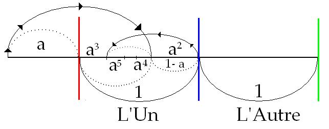
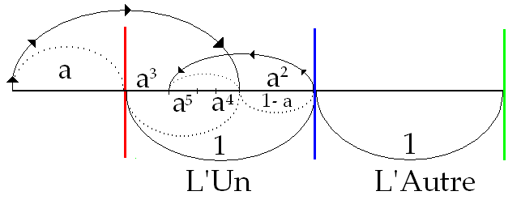

# Leçon 23 | 14 Juin 1967

<!-- source-url: http://staferla.free.fr/S14/S14 LOGIQUE.docx -->
<!-- seminar: s14 -->
<!-- lesson: 23 -->

<!-- id: s14-23-0001 -->

L’analyse peut être interminable, mais pas un cours. Il faut bien qu’il ait une fin. Alors le dernier de cette année, aura lieu Mercredi prochain. C’est donc aujourd’hui l’avant dernier. Cette année, j’ai choisi qu’il n’y ait pas de *séminaire fermé*. J’ai fait néanmoins place au moins - je m’excuse si j’en oublie - au moins à deux personnes qui m’ont apporté ici leur contribution.

<!-- id: s14-23-0002 -->

Peut-être, au début de cet avant-dernier cours y aura­-t-il quelqu’un d’entre vous - quelqu’un ou plusieurs - quelqu’un qui voudrait bien me dire peut-être, sur quoi il aime­rait me voir - qui sait - mettre un peu plus d’accent, ou don­ner une réponse, amorcer une reprise pour le futur, ceci, soit dans cette avant-dernière leçon, soit dans la dernière.

<!-- id: s14-23-0003 -->

Enfin… je verrai si je peux y répondre aujourd’hui. Je m’ef­forcerai au moins d’indiquer dans quel sens je peux répondre, où bien - je ne sais pas... - ne pas répondre, la prochaine fois. Bref, si quelques-uns d’entre vous voulaient bien, ici, tout de suite, rapidement, là-dessus me donner si je puis dire quelques indications de leurs vœux, de ce que j’ai pu leur laisser à désirer concernant le champ que j’ai articulé cette année sur *La logique du fantasme*, eh bien, je leur en serais bien reconnaissant.

<!-- id: s14-23-0004 -->

Eh bien, la parole, à qui ? Il ne faut pas traîner, d’un autre côté. Qui la demande ? Bon… C’est chaud ! Bon, eh bien, *n’en parlons plus*, au moins pour l’ins­tant. Ceux qui auront l’esprit de l’escalier pourront peut­–être m’envoyer un petit mot… Mon adresse est dans l’annuai­re, c’est rue de Lille. Je ne pense pas que vous aurez d’ailleurs d’hésitation : que je sache, je suis le seul - au moins à cette place - à être repéré comme Docteur LACAN. Bon... Alors, reprenons.

<!-- id: s14-23-0005 -->

Je vais poursuivre donc, au point où nous avons laissé les choses et comme nous n’avons plus très longtemps pour boucler ce qui peut passer pour former un certain champ, cerné dans ce que j’ai dit cette année, je vais - mon Dieu - m’efforcer de vous indiquer les derniers points de repères d’une façon aussi simple que je le pourrai.

<!-- id: s14-23-0006 -->

Je vais essayer de faire simple, bien sûr, ce qui suppose que je vous avertisse de ce que cette simplicité peut vouloir dire.

<!-- id: s14-23-0007 -->

Vous voyez bien qu’au terme de cette *logique du fantas­me*, terme suffisamment justifié par le fait, que je vais une fois de plus ré–accentuer aujourd’hui, que *le fantasme c’est* - d’une façon bien plus étroite encore que tout le reste de l’inconscient – *structuré comme un langage*, puisqu’en fin de compte : *le fantasme c’est une phrase avec une structure grammaticale*.

<!-- id: s14-23-0008 -->

Il semble indiqué donc, d’articuler *la logique du fantasme*, ce qui veut dire par exemple, poser un certain nom­bre de questions logiques qui, pour simples qu’elles soient, ont - certaines - été articulées pas si souvent…

<!-- id: s14-23-0009 -->

> je ne dis pas : « *pour la première fois par moi* », mais : « *peut-être pour la premiè­re fois par moi* », dans le champ analytique …le rapport du *sujet de l’énoncé* - *par exemple* - au *sujet de l’énonciation*.

<!-- id: s14-23-0010 -->

Cela n’exclut pas qu’au terme de ce premier débrouilla­ge, cette indication, cette direction donnée du sens pour­rait se développer dans l’avenir d’une façon plus pleine, plus articulée, plus systématique. Cette *logique du fantasme*, je ne prétends qu’en avoir ouvert cette année le sillon. Non seulement cela n’ex­clut pas, mais cela indique bien sûr que quelque part cette *logique du fantasme* s’accroche, s’insère, se suspend, à *l’économie du fantasme*. C’est bien pour cela qu’au terme de ce discours, j’ai amené ce terme de *la jouissance.*

<!-- id: s14-23-0011 -->

Je l’ai amené en le soulignant, en accentuant que c’est là un terme nouveau, au moins dans *la fonction* que je lui donne, et que ce n’est pas un terme que FREUD ait mis au premier plan de l’articulation théorique. Et que si mon enseignement, en somme, pourrait trouver son axe, de la formule « de faire valoir la doctrine de FREUD », c’est bien là quelque chose qui implique, justement, que j’y annonce, que j’y amorce, telle fonction, tel repère, qui y est, en quelque sorte cerné, dessiné, exigé, impliqué… Faire valoir FREUD, c’est faire ce que je fais toujours. D’abord, comme on dit « *rendre à Freud ce qui est à Freud* ». Ce qui n’exclut pas quelque autre allégeance, celle par exemple de le faire valoir au regard de ce qu’il indique, de ce qu’il comporte de *la relation à la vérité*.

<!-- id: s14-23-0012 -->

Je dirai même que, si quelque chose comme cela est pos­sible, c’est précisément dans la mesure où je ne manque jamais de *rendre à Freud ce qui est à Freud*, que je ne me l’approprie pas. C’est là un point qui, je dois le dire, a son *importance*, et peut-être aurai-je le temps d’y revenir à la fin.

<!-- id: s14-23-0013 -->

Il est assez curieux de voir que pour certains, c’est à s’approprier - je veux dire à ne pas me rendre - ce qu’ils me doivent le plus manifestement - tout un chacun peut s’en aper­cevoir - dans leurs formulations, ce n’est pas ça qui est l’important, c’est *ce quelque chose* que ce « *manque à me le rendre* » qui les empêche de faire - ce qui serait pourtant en maint champ bien facile - le pas suivant tout de suite, au lieu - hélas ! - de me le laisser toujours à faire, quitte à - après coup - à se désespérer que je leur aie, comme il semble, coupé l’herbe sous le pied.

<!-- id: s14-23-0014 -->

Donc cette fonction du fantasme, approchons la.

<!-- id: s14-23-0015 -->

Approchons la et d’abord pour nous apercevoir, dire simplement, comme le dé­part même de notre question, une chose qui saute aux yeux : *il est quelque chose de clos*. Il se présente à nous, dans notre expérience, comme *une signification fermée*, pour les sujets qui d’habitude, le plus communément, le plus coutumièrement pour nous, le supportent, à savoir les névrosés.

<!-- id: s14-23-0016 -->

### Qu’on note…

<!-- id: s14-23-0017 -->

> comme le fait FREUD avec force, dans l’examen exemplaire qu’il a fait d’un de ces fantasmes : « *On bat un enfant* »,
>
> que j’ai déjà fait, si vous vous en souvenez, quand j’ai introduit les premiers schémas de cette année - que bien sûr,
>
> je vous conseille, quand vous aurez rassem­blé ce que vous avez pu prendre de plus ou moins étendu com­me notes, auxquelles, je pense, vous aurez de nouveau recours, pour saisir le chemin qui aura été ici parcouru …que *quel­que chose de clos* donc, est à situer -et doublement - dans ces deux termes que j’ai accentués, l’un comme ce corrélatif du choix constitué par le « *je ne pense pas* » dans lequel le « *je »* se constitue par le fait que le « *Je* » justement, vient en ré­serve, si je puis dire comme écornage en négatif dans la structure : « *Ein Kind ist geschlagen*. »

<!-- id: s14-23-0018 -->

Ce fantasme…

<!-- id: s14-23-0019 -->

> non pas « *on bat un enfant* », par exemple, mais pour être strict : « *un enfant est battu* », comme il est écrit en allemand …ce fantasme…

<!-- id: s14-23-0020 -->

> c’est bien cette structure qu’au niveau du seul terme possible du choix tel qu’il est laissé par la structure de l’aliénation – le choix du « je ne pense pas » …ce fantasme apparaît, comme cette phrase, gramma­ticalement structuré : « *Ein Kind ist geschlagen*. »

<!-- id: s14-23-0021 -->

Mais comme je vous l’ai dit, *cette structure*, la seu­le qui nous soit offerte : *le choix forcé*, au niveau de l’« *ou* *je ne suis pas*, *ou je ne pense pas* », si elle est là c’est dans la mesure où *elle peut être appelée à dévoiler l’autre*, la reje­ter, et qu’au niveau de l’autre, celle du « *je ne suis pas* », c’est la *Bedeutung inconsciente*, qui vient corrélativement mordre sur *ce « je » qui est en tant que n’étant pas*.

<!-- id: s14-23-0022 -->

Et le rapport à cette *Bedeutung* est précisément cette *signification*, en tant qu’elle échappe, cette *signification fermée*, cette *significa­tion* pourtant si importante à souligner en tant que, si l’on peut dire, c’est elle qui donne la mesure de *la compréhension,* la mesure acceptée, la mesure reçue, *l’intuition*, *l’expérien­ce*, qu’on *interpelle*, quand à tenir ces discours de faux-semblant qui font appel à *la compréhension*, comme opposée à *l’explication* : sainteté et vanité philosophique, M. JASPERS[^92] au premier rang.

<!-- id: s14-23-0023 -->

Le point des tripes où il vous vise pour vous faire croire que vous comprenez des choses de temps en temps, c’est ça, c’est cette petite chose secrète, isolée, que vous avez au­-dedans de vous sous la forme du fantasme, et que vous croyez que vous comprenez parce qu’il éveille en vous la dimension du désir.

<!-- id: s14-23-0024 -->

C’est là tout simplement ce dont il s’agit concernant ce qu’on appelle *compréhension.* Et le rappeler a ici son importance.

<!-- id: s14-23-0025 -->

Parce que ça n’est pas parce qu’en moyenne, tous tant que vous êtes, je dis pour la majorité, un peu névrosés sur les bords, le fantasme vous donne *la mesure de la compréhension*, *précisément* à ce niveau où le fantasme éveille en vous le désir… ce qui n’est foutre pas rien, car c’est ce qui centre votre monde, ce n’est pas pour ça qu’il faut que vous vous imaginiez que vous comprenez *ce qui seul livre la logique du fantasme, à savoir : la perversion.*

<!-- id: s14-23-0026 -->

Ne vous imaginez pas que le pervers, pour lui le fantasme joue le même rôle. C’est en ça que j’essaie de vous expliquer l’enracinement de ce que fait le pervers, qui ne sau­rait se définir que par rapport au terme que j’ai introduit, également neuf de l’avoir accentué, qui s’appelle : *l’acte sexuel.* Donc, vous le voyez, il y a là des connexions qu’il faut distinguer.

<!-- id: s14-23-0027 -->

Articuler ce qu’il en est de *la jouissance intéressée dans la perversion*, par rapport à la difficulté ou à *l’impasse de l’acte sexuel*, c’est donner quelque chose qui a, par rapport au *fantasme*…

<!-- id: s14-23-0028 -->

> au *fantasme* tel qu’il nous est donné à l’état fermé, et c’est pour ça que j’ai rappelé tout à l’heure
>
> cet exemple de *On bat un enfant* dans le texte freudien­ …*la fonction de ce fantasme*, qui ne peut comme tel présenter, n’être autre chose, que strictement cette formule « *Ein Kind ist geschlagen* ».

<!-- id: s14-23-0029 -->

Ce n’est pas parce qu’elle peut intéresser, en ce sens qu’elle a une configuration que vous pouvez pointer, reporter sur l’économie de la jouissance perverse en faisant correspondre tel des termes de l’un à tel des termes de l’au­tre qu’il est d’aucune façon de la même nature ! En d’autres termes…

<!-- id: s14-23-0030 -->

> pour tout de suite rappeler ce point vif qu’il n’est tout de même pas difficile
>
> de *ramasser au passage* dans ce tex­te si clair de FREUD, c’est par exemple ceci …qu’il n’a pas une telle spécificité dans les cas de névrose où il l’a ren­contré.

<!-- id: s14-23-0031 -->

Dans la structure d’une névrose, ce fantasme, pour prendre celui-là puisqu’il faut bien prendre quelque chose pour savoir où fixer notre attention, ce fantasme n’est pas lié spécifiquement à tel ou tel. Voilà bien quelque chose qui pourrait un instant retenir notre attention !

<!-- id: s14-23-0032 -->

Enfin, pour ce qu’il en est de *la structure des symptô­mes*, *je veux dire de ce que signifient les symptômes dans l’économie* , là nous ne pouvons pas dire que s’arrange la même chose dans une névrose ou dans une autre. Je ne le répéterai jamais trop, même si je semble éton­né quand, auprès de ceux qui me font la confiance de venir se faire contrôler par moi, je m’élève par exemple avec force contre l’usage de termes comme ceux-ci par exemple : de « *structure hystéro-phobique* » . Pourquoi ça ? Ce n’est pas pareil *une structure hystérique* et *une structure phobique* ! Pas plus proche l’une de l’autre que de *la structu­re obsessionnelle*. Le *symptôme* représente une structure.

<!-- id: s14-23-0033 -->

C’est là qu’est le point frappant, c’est que - *comme nous l’indique Freud dans des structures très différentes -* ce fantasme peut être là qui se balade, avec ce privilège d’être plus ici inavouable que quoique ce soit. Je lis FREUD, je le répète ici pour l’instant.

<!-- id: s14-23-0034 -->

« *Inavouable* » comporte beaucoup de choses. On pourrait s’y arrêter. En tout cas, pour rester au niveau d’approche grossière qui est celui de l’an l9l9, où ceci a été écrit, disons *qu’y est appendu*, comme une cerise sur un pédicule, *le sentiment de culpabilité*.

<!-- id: s14-23-0035 -->

C’est là en tous cas ce à quoi FREUD s’arrête, pour se mettre en rapport avec ce qu’il appelle « *une cicatrice* ». Celle précisément, du complexe d’Œdipe.

<!-- id: s14-23-0036 -->

Ceci est bien fait pour nous faire dire que, pour la fa­çon dont il a surgi dans notre expérience, le fantasme parti­cipe de l’aspect expérimental du corps étranger. Que nous ayons été amenés - ceci en raison d’un véritable pont théorique de FREUD - à pressentir que cette signification ferme avait rapport avec quelque chose d’autre, bien plus dé­veloppable, bien plus riche de virtualités, qui s’appelle à proprement parler la perversion.

<!-- id: s14-23-0037 -->

Ce n’est pas parce que FREUD a fait ce saut très vite, que nous, nous ne devons pas re­mettre les distances, le juste rapport, nous interroger, après quand-même beaucoup d’expérience acquise sur ce qu’il en est de la perversion. La perversion donc, ai-je dit, est quelque chose qui s’articule, se présente, comme une voie d’accès propre à la difficulté qui s’engendre, disons : « *du projet* » \- et vous met­tez ce mot entre guillemets c’est-à-dire qu’il n’est là qu’analogique, je le fais intervenir comme une référence à un autre discours que le mien - de la mise en question, pour être plus exact, qui se situe dans l’angle de ces deux termes : « *il n’y a pas...* », « *il n’y a que*... », « *d’acte sexuel* », « *l’acte sexuel* ».

<!-- id: s14-23-0038 -->

*Il n’y a pas d’acte sexuel*, ai-je dit, pour autant que nous sommes incapables d’en articuler les affirmations résultantes.

<!-- id: s14-23-0039 -->

Ce qui ne veut pas dire, bien sûr, qu’il n’y ait pas quelques sujets qui y aient accédé, qui puissent dire légiti­mement : « *Je suis un homme* », « *Je suis une femme* ».

<!-- id: s14-23-0040 -->

Mais nous, *analystes*, \[Rire de Lacan\] c’est bien là ce qui est frappant, c’est que nous ne sommes pas capables de le dire.

<!-- id: s14-23-0041 -->

Pourtant, il n’y a que cet acte, mis en suspens à ce ni­veau, pour rendre compte de ce quelque chose, qui après tout \- *la chose non seulement est restée mais reste encore ambiguë -* pourrait en être séparé, qui s’appelle la perversion. Pourquoi ?

<!-- id: s14-23-0042 -->

Si c’était une perversion au sens absolu, au sens où ARISTOTE la prend par exemple quand il écarte - τέρας \[teras\] : ce sont-là des monstres - du champ de son *Éthique* un certain nom­bre de pratiques, qui étaient peut–être, pourquoi pas, plus *manifestes*, plus *visibles*, plus *vivaces* même, dans son monde que dans le nôtre, où d’ailleurs il ne faut pas croire qu’elles ne sont pas là toujours, à savoir tel exemple qu’il nous donne d’amour bestial, voire, *si je me souviens bien,* l’allusion au fait que je ne sais quel tyran de Phalère, si je m’en souviens bien, aimait assez à faire passer quel­ques victimes, qu’elles lui fussent ou non amicales ou ina­micales, à les faire passer par je ne sais quelle machine où elles cuisaient à l’étuvée un certain temps. ARISTOTE écarte ceci du champ de l’*Éthique*.

<!-- id: s14-23-0043 -->

Ça n’est pas, bien sûr, pour nous un modèle univoque, puisqu’en son *Éthique* l’acte sexuel jus­tement, comme dans aucune éthique de la tradition philosophi­que grecque, *l’acte sexuel* n’a pas valeur *centrale*, je veux dire *avouée*, *patente*. Il nous reste à nous, à la lire.

<!-- id: s14-23-0044 -->

Il n’en est pas de même pour nous, grâce au fait de l’inclusion des *Commandements judaïques* dans notre morale.

<!-- id: s14-23-0045 -->

Mais assurément, avec FREUD, la chose est ferme : l’in­térêt que nous portons à *la perversion sexuelle*, même si nous trouvons plus commode d’en relâcher les chaînes, sous la forme de référence à je ne sais quel développement endogène, je ne sais quel stade que nous prétendons, on ne sait pour­quoi, biologique, il reste que *la perversion ne prend sa valeur qu’à s’articuler à l’acte sexuel*.

<!-- id: s14-23-0046 -->

Je dis : à l’acte sexuel comme tel. Et c’est pour cela que j’ai choisi ce petit modèle, ce petit modèle de *la di­vision incommensurable* par excellence, de ce *petit(a)*, le plus large à développer son *incommensurabilité*, qui se définit par le 1/*a* = 1+*a,* et nous permet de l’inscrire en un schème, sous la forme d’un double développement. Vais-je devoir le réinscrire aujourd’hui ?

<!-- id: s14-23-0047 -->

<!-- id: s14-23-0048 -->

J’indique seulement ceci étant 1, il y a mode de replier ici le *petit(a)*, puis ce qui en reste, qui se trouve, comme par hasard, être le carré de *(a)*, égal lui-même à 1*- a*, il n’est pas difficile de le vérifier tout de suite, pour produire ici un *a3*, lequel sur l’*a2* précédent se replie pour ici faire un *a4*, lequel *a4*, etc. et aboutir ici à *une somme des puissances impaires* qui se trouve être égale à *a2*, tandis que *la somme des puissances paires* se trouve à la fin égale à *(a)*. Par quoi, ce que vous avez vu d’abord se projeter dans le 1, à savoir le *(a)* à gauche, le *a2* à droite, se trouvent à la fin séparés d’une façon définitive dans une forme inversée.

<!-- id: s14-23-0049 -->

Schème dont il nous serait facile - quoique d’une façon purement métaphorique - de montrer qu’il peut représenter as­sez bien ce qui, de l’acte sexuel pourra pour nous se présen­ter d’une façon conforme au pressentiment de FREUD, à savoir : réalisable, mais seulement sous la forme de *la sublimation*.

<!-- id: s14-23-0050 -->

C’est précisément dans la mesure où cette voie *et ce qu’elle implique* reste problématique, que je l’exclus cette année. Car dire que cela peut se réaliser *sous la for­me de la sublimation*, est s’écarter précisément de ce à quoi nous avons affaire, à savoir que dans son champ surgis­sent, structuralement, toute la chaîne des difficultés qui se déroulent, qui s’incluent d’une *béance* majeure, et d’une *béan­ce* qui reste, qui est, celle de la castration.

<!-- id: s14-23-0051 -->

C’est dans la mesure… là-dessus le vote commun si je puis dire, des au­teurs, de ceux qui en ont l’expérience, est clair : c’est au minimum peut-on dire, *dans une voie qui est inverse de celle qui va à la butée de la castration, que s’articule ce qui est perversion*.

<!-- id: s14-23-0052 -->

L’intérêt de ce *schéma*, est celui–ci : c’est de montrer que cette mesure *petit(a)*, ici d’abord projetée sur le 1, peut aussi se développer d’une façon externe. À savoir que le rapport de 1*/* 1*+a* est aussi égal à ce rapport fon­damental que désigne le *petit(a)* qui veut dire ici, je l’ai rap­pelé en son temps : *a /*1.

<!-- id: s14-23-0053 -->

Que ce dont il s’agit au niveau de la perversion est ce­ci : c’est que c’est dans la mesure où le *Un…*

<!-- id: s14-23-0054 -->

> présumé, non pas de l’acte mais de l’union - du pacte si vous voulez - sexuel­le …dans la mesure *où ce Un est laissé intact*, *où la partition ne s’y établit pas*, que le sujet dit « *pervers »*, vient à trouver, au niveau de cet irréductible qu’il est, de ce *petit(a)* origi­nel, sa jouissance.

<!-- id: s14-23-0055 -->

Ce qui le rend concevable est ceci :

<!-- id: s14-23-0056 -->

- qu’il ne saurait y avoir d’*acte sexuel* - non plus qu’aucun autre *acte* - si ce n’est *dans la référence signifiante* qui seule peut le constituer comme acte.

<!-- id: s14-23-0057 -->

- Que cette référence signifiante, ici n’intéresse pas - *de ce seul fait* - deux entités naturelles*, le mâle et la femelle*.

<!-- id: s14-23-0058 -->

- Que du seul fait qu’elle domine, parce que *c’est un champ bas de l’acte sexuel*, cette référence signifiante n’introduit ces êtres, que nous ne pouvons d’aucune façon maintenir à l’état d’êtres naturels, les introduit sous la forme d’une *fonction de sujet*.

<!-- id: s14-23-0059 -->

- Que cette *fonction de sujet,* c’est ce que j’ai articulé les fois précédentes, a pour effet *la disjonction du corps et de la jouissance*, et que c’est là, c’est au niveau de cette partition, qu’intervient le plus typiquement la perversion.

<!-- id: s14-23-0060 -->

Ce qu’elle met en valeur pour essayer de les re-conjoindre, cette *jouissance* et ce *corps*, séparés du fait de l’intervention signifiante, c’est là ce par quoi elle se situe sur la voie d’une résolution de la question de l’acte sexuel. C’est parce que dans l’acte sexuel, comme je vous l’ai montré dans mon schéma de la dernière fois, il y a - pour quelque soit lequel des deux partenaires – une jouissance, celle de l’autre, qui reste en suspens.

<!-- id: s14-23-0061 -->

C’est parce que l’entrecroisement, *le chiasme* exigible, qui ferait de plein droit de chacun des corps la métaphore, le signifiant de la jouissance de l’autre, c’est parce que *ce chiasme* est en suspens que nous ne pouvons, de quelque côté que nous l’abordions, que voir ce déplacement qui en effet met une jouissance dans la dépendance du corps de l’au­tre.

<!-- id: s14-23-0062 -->

Moyennant quoi la jouissance de l’autre reste, comme je l’­ai dit, *à la dérive*.

<!-- id: s14-23-0063 -->

L’homme - pour la raison structurale qui fait que c’est sur la sienne de jouissance, qu’est pris un prélèvement qui l’élève à la fonction d’une *valeur de jouissance* - l’homme se trouve, plus électivement que la femme, pris dans les consé­quences de cette soustraction structurale d’une part de sa jouissance. L’homme est effectivement le premier à supporter la réalité de *ce trou introduit dans la jouissance*.

<!-- id: s14-23-0064 -->

C’est bien pourquoi aussi, c’est lui pour lequel cette question de *la jouissance* est, non pas bien sûr de plus de poids - c’est tout autant pour son partenaire - mais telle, qu’il peut y don­ner des solutions articulées. Il le peut, à la faveur de ceci : *qu’il y a dans la nature de cette chose qui s’appelle le corps, quelque chose qui redouble cette aliénation*, qui est - de la structure du sujet - *aliénation de la jouissance*.

<!-- id: s14-23-0065 -->

À côté de l’*aliénation subjective* - je veux dire dépen­dante de l’introduction de la fonction du sujet - qui porte sur la jouissance, il y en a une autre qui est celle qui est incarnée dans la fonction de *l’objet(a)*. EURYDICE, si l’on peut dire deux fois perdue.

<!-- id: s14-23-0066 -->

La jouis­sance, cette jouissance que le pervers retrouve, où va-t-il la retrouver ?

<!-- id: s14-23-0067 -->

Non pas dans la totalité de son corps, celle où *une jouissance* est parfaitement concevable et peut être exigi­ble, mais où il est clair que c’est là qu’elle fait problème quand il s’agit de *l’acte sexuel*. La jouissance de *l’acte sexuel* ne saurait d’aucune façon se comparer à celle que peut éprouver le coureur, de cette démarche libre et altière.

<!-- id: s14-23-0068 -->

*Nulle part* plus que dans le champ de la jouissance sexuelle...

<!-- id: s14-23-0069 -->

et ce n’est pas pour rien que c’est là qu’elle apparaît prévalente - …*nulle part* plus que dans ce champ *le principe du plaisir*…

<!-- id: s14-23-0070 -->

> qui est proprement la limite, l’achoppement, le terme mis à toute forme qui se situe comme d’excès de la jouissance …*nulle part*, il n’apparaît mieux, que la loi de *la jouissance* est soumise à cette limite.

<!-- id: s14-23-0071 -->

Et que c’est là que va se trouver *tout spécialement pour l’homme* - en tant que, je l’ai dit, pour lui *le complexe de castration* ar­ticule déjà le problème - va se trouver son champ. Je veux dire qu’*il est des objets qui dans le corps se définissent d’être* en quelque sorte, au regard du *principe de plaisir, hors corps*. C’est là ce que sont les *objets(a)*.

<!-- id: s14-23-0072 -->

*Le petit(a) est ce quelque chose d’ambigu qui, si peu qu’il soit du corps, de l’objet­ même individuel, c’est dans le champ de l’Autre…*

<!-- id: s14-23-0073 -->

> *et pour cau­se, parce que c’est là le champ où se dessine le sujet…qu’il a à en faire la requête, à en trouver la trace.*

<!-- id: s14-23-0074 -->

- *Le sein,* cet objet dont il faut bien le définir comme étant ce quelque chose qui, pour être plaqué, accroché comme en surface, comme parasitairement, à la façon d’*un placenta*, reste ce quelque chose que peut légitimement revendiquer com­me son appartenance, le corps de l’enfant. On le voit bien : appartenance énigmatique, bien sûr, j’entends que par un ac­cident d’évolution des êtres vivants, il apparaît qu’ainsi, pour certains d’entre eux, quelque chose d’eux reste appendu au corps de l’être qui les a engendrés.

<!-- id: s14-23-0075 -->

Et puis les autres, nous l’avons dit déjà :

<!-- id: s14-23-0076 -->

- *l’excrément,* à peine besoin de souligner ce que celui–ci a, au regard du corps, de marginal, mais non pas sans être extrêmement lié à son fonctionnement : il est assez clair de voir dans tout son poids ce que les êtres vivants ajoutent au domaine naturel de ces produits de leurs fonctions.

<!-- id: s14-23-0077 -->

- Et puis, ceux que j’ai désignés sous les termes du *regard* et de *la voix*. Cherchant au moins pour le premier de ces deux termes,… ayant déjà ici articulé abondamment ce que cela comporte dans le rapport de vision : la question reste toujours suspen­due qui est celle, si simple à articuler, dont on peut dire que, malgré tout, l’abord *phénoménologique*, comme le prouve la dernière œuvre de MERLEAU-PONTY, \[*Le visible et l’invisible*, 1964\] ne peut pas le ré­soudre, à savoir ce qu’il en est de cette racine du vi­sible, laquelle doit être retrouvée dans la question de ce que c’est radicalement que *le regard*.

<!-- id: s14-23-0078 -->

*Le regard* qui ne peut, pas plus être saisi comme reflet du corps, qu’aucun des autres objets en question ne peut être res­saisi dans *l’âme*, je veux dire dans cette esthésie régulatrice du *principe du plaisir*, dans cette esthésie représentative, où l’individu se retrouve et s’appuie, identifié à lui-même, dans le rapport narcissique où il s’affirme comme individu.

<!-- id: s14-23-0079 -->

*Ce reste*, et *ce reste* qui ne surgit que du moment où est conçue la limite que fonde le sujet, *ce reste qui s’appel­le l’objet(a),* *c’est là que se réfugie la jouissance qui ne tombe pas sous le coup du principe de plaisir.* C’est aussi là, c’est d’être là, c’est de ce que le *Dasein,* non seulement du pervers mais de tout sujet, est à situer dans cet *hors corps*, cette partie que dessine déjà ce quelque chose de pressenti­ment qu’il y a quelque part dans le [*Philèbe*](http://remacle.org/bloodwolf/philosophes/platon/cousin/philebe2.htm), dans ce passage que je vous ai demandé d’aller rechercher, et que SOCRATE appelle, dans la relation de l’âme au corps, *cette partie anesthésique*. *C’est justement dans cette partie anesthésique que la jouissance gîte*, comme le montre *la structure de la position du sujet* dans ces deux termes exemplaires, qui sont définis comme celui *du sadique* et *du masochiste*.

<!-- id: s14-23-0080 -->

Pour vous apprivoiser, si je puis dire, avec cette voie d’accès, ai-je besoin d’évoquer pour vous *la marionnette* la plus élémentaire de ce que nous pouvons imaginer de *l’acte sa­dique* ? À ceci près bien sûr, que j’ai pris au départ *mes ga­ranties*, et que je vous demande *de bien saisir* que là, je vous demande *de vous arrêter* à autre chose qu’à ce que pour vous - je l’ai dit : plus ou moins vacillants sur les bords de la névrose - peut éveiller en vous de vague empathie, le moindre petit fantasme de cet ordre.

<!-- id: s14-23-0081 -->

S’agit pas de « *com­prendre* » ce que peut avoir d’émouvant telle pratique, imaginée ou pas, qui soit de ce registre, il s’agit bien d’articuler ceci, qui vous évitera des questions sur l’économie - dans cette fonction - de la douleur par exemple, sur lequel j’espè­re bien, on a fini de se casser la tête, *ce avec quoi joue le sadique c’est avec le sujet*, dirons-nous. Je ne vais pas faire là-dessus de prosopopée. D’abord j’ai déjà écrit *quel­que chose là-dessus* qui s’appelle *Kant avec Sade,* pour montrer qu’ils sont de la même veine.

<!-- id: s14-23-0082 -->

Il joue avec le sujet. Quel sujet ? Le sujet dirai-je - comme j’ai dit quelque part *qu’on est sujet à la pensée ou sujet au vertige* - le *sujet à la jouissance*. Ce qui, vous le voyez bien, introduit cette inflexion qui, du sujet, nous fait passer à ce que j’ai marqué comme en étant *le reste*, à *l’objet petit(a).*

<!-- id: s14-23-0083 -->

C’est au niveau de l’Autre, avec un grand A bien sûr, qu’il opère cette subversion, en réglant - je dis *en réglant* -­ ce que depuis toujours les philosophes ont senti comme digne de qualifier ce qu’ils appelaient dédaigneusement les rapports du corps à l’âme, et qui dans SPINOZA s’appelle de son vrai nom : « *titillatio* », le *chatouillement*.

<!-- id: s14-23-0084 -->

Il jouit du corps de l’Autre, apparemment.

<!-- id: s14-23-0085 -->

Mais vous voyez bien que la question est à déplacer au niveau de celle que j’ai formulée dans un champ où les choses sont moins cap­tivantes, quand j’ai imagé ce « *rapport du maître et de l’esclave* » en demandant : « *Ce dont on jouit, cela jouit-il ?* »

<!-- id: s14-23-0086 -->

Donc vous voyez bien le rapport immédiat avec le champ de l’acte se­xuel.

<!-- id: s14-23-0087 -->

Seulement, la question au niveau du sadique est celle-ci : c’est *qu’il ne sait pas que c’est à cette question en tant que telle qu’il est attaché*, qu’il en devient l’instrument pur et simple, qu’il ne sait pas ce qu’il fait lui-même comme sujet, qu’il est essentiellement dans la *Verleugnung*, qu’il peut le sentir, l’interpréter de mille façons, ce qu’il ne manque pas de faire. Il faut bien sûr qu’il ait quelque puissance articu­lante, ce qui fut le cas du marquis de SADE, moyennant quoi, légitimement, son nom reste attaché à la chose.

<!-- id: s14-23-0088 -->

SADE reste essentiel pour avoir bien masqué les rapports de l’acte sadique à ce qu’il en est de la jouissance, et pour avoir…

<!-- id: s14-23-0089 -->

> quand il en a tenté dérisoirement d’articuler la loi sous la forme d’une *Règle universelle* digne des articulations de KANT, dans ce morceau célèbre *[Français, encore un effort pour être républicains](http://fr.wikisource.org/wiki/Fran%C3%A7ais%2C_encore_un_effort_si_vous_voulez_%C3%AAtre_r%C3%A9publicains)* objet de mon commentaire dans l’arti­cle
>
> que j’ai évoqué tout à l’heure …montré que cette loi ne saurait s’articuler qu’en terme, non pas de « *jouissance du corps* » - notez-le bien dans le texte - mais de « *parties du corps* ».

<!-- id: s14-23-0090 -->

Chacun, dans cet État - *avec un grand É* - fantasmatique, qui serait fondé sur le droit à la jouissance, chacun étant tenu d’offrir à quiconque en marque *le dessein*, la jouissance de telle « *partie* », écrit l’auteur - ce n’est pas là en vain - de son corps.

<!-- id: s14-23-0091 -->

*Refuge de la jouissance*, cette « *partie* » dont le sujet sa­dique ne sait pas que cette partie c’est cela très exacte­ment qui est - à lui – son *Dasein*, qu’il en réalise l’essence. Voilà ce qui est déjà donné comme clé par le texte de SADE.

<!-- id: s14-23-0092 -->

<!-- id: s14-23-0093 -->

Bien sûr je n’ai pas le temps - parce que, mon Dieu, le temps avance - de réarticuler ce qui résulte de cette reprise, de ce reclassement l’*Un* par rapport à l’*Autre*, *de la jouissance* et *du sujet*, et combien proche elle est du fantasme - bien en­tendu immédiatement articulé par SADE - de *la jouissance* là où elle est portée à l’absolu dans l’Autre, très précisé­ment dans *cette part du* 1 *qui est ici le plus à droite,* là où nous avions vu glisser, au début du problème, la jouissance, laissée sans support, celle dont il s’agit, et pour laquelle SADE doit construire - lui athée - cette figure, pourtant la plus manifeste et la plus manifestement vraisemblable de Dieu : celle de *la jouissance d’une méchanceté absolue*.

<!-- id: s14-23-0094 -->

Ce *mal essentiel et souverain*, dont alors - et alors seulement - emporté, si l’on peut dire, par *la logique du fan­tasme*, SADE avoue que le sadique n’est que le ser­vant : qu’il doit, au mal radical que constitue la nature, frayer les voies d’un maximum de destruction.

<!-- id: s14-23-0095 -->

Mais ne l’oublions pas, il ne s’agit-là que de *la logique de la chose*. Si je l’ai développée dans *Kant avec Sade* ou indi­qué de vous reporter à ses sources, dans le caractère si manifestement futile, bouffon, dans le caractère toujours misé­rablement avorté des entreprises sadiques, c’est parce que c’est à partir de cette apparence que s’en fera mieux voir *la vérité*.

<!-- id: s14-23-0096 -->

*La vérité* qui est proprement donnée par la pratique masochiste où il est là évident que *le masochiste*…

<!-- id: s14-23-0097 -->

> pour *soutirer* si l’on peut dire, dérober, au seul coin où manifes­tement il est saisissable, qui est *l’objet petit(a)* …*se livre* - lui, délibérément - *à cette identification à cet objet comme re­jeté* : *il est moins que rien*, même pas animal, l’animal qu’on maltraite, et aussi bien *sujet* qui, *de sa fonction de sujet*, a abandonné par contrat tous les privilèges.

<!-- id: s14-23-0098 -->

Cette recherche, cette construction en quelque sorte acharnée, d’une identification impossible avec ce qui se réduit au plus extrême du *déchet*, et que ceci soit lié pour lui à la captation de la jouissance : voilà où apparaît nue, exemplaire, l’économie dont il s’agit.

<!-- id: s14-23-0099 -->

### Là, observons…, sans nous arrêter aux vers sublimes \[rire de Lacan\] qui humanisent, si je puis dire, cette manœuvre :

<!-- id: s14-23-0100 -->

> « *Tandis que des mortels la multitude vile,*
>
> *Sous le fouet du Plaisir, ce bourreau sans merci,*
>
> *Va cueillir des remords dans la fête servile*… »[^93]

<!-- id: s14-23-0101 -->

Tout ça c’est de la blague ! C’est le regret porté sur la loi du plaisir, le plaisir n’est pas un «*bourreau sans merci* ».

<!-- id: s14-23-0102 -->

Le plaisir vous maintient dans une limite assez tamponnée, préci­sément, pour être le plaisir.

<!-- id: s14-23-0103 -->

Mais ce dont il s’agit, quand le poète s’exprime ainsi, c’est très précisément de marquer sa distance :

<!-- id: s14-23-0104 -->

> « …*Ma Douleur, donne moi la main, viens par ici, Loin d’eux*…[^94] »

<!-- id: s14-23-0105 -->

Chant de flûte… pour nous montrer les charmes d’un certain chemin, et qui s’obtient, par ces couleurs, ainsi inversé.

<!-- id: s14-23-0106 -->

Si nous avons affaire au masochiste, au masochiste sexuel observons la nécessité de notre schéma. Ce que REIK souligne, avec une maladresse qu’on peut vraiment dire « *à vous faire tourner la tête »,* du caractère de ce qu’il appelle « *imaginaire* » ou « *fantaisiste* » - exactement *phantasiert -* du masochisme.

<!-- id: s14-23-0107 -->

Il n’a pas vraiment saisi - encore que tout ce qu’il apporte comme exemples le désigne suffisam­ment - que ce dont il s’agit c’est justement ce que nous avons projeté là, au niveau du 1, à droite, à savoir le 1 absolu de l’union sexuelle, pour autant que, d’une part, elle est cette jouissance pure - mais *détachée* - du corps féminin.

<!-- id: s14-23-0108 -->

<!-- id: s14-23-0109 -->

Ceci, Sacher MASOCH, aussi exemplaire que l’autre \[Sade\] à nous avoir livré, du rapport masochiste, les structures - incarne dans une femme, essentiellement dans la figure d’une femme, cet Autre, auquel il a à dérober sa jouissance, cette « *Autre jouissance* » absolue mais complètement énigmatique, il n’est pas un instant question, même, que cette jouissance puisse, à la femme - si je puis dire - lui faire plaisir ! C’est bien le cadet des soucis du masochiste ! C’est bien pourquoi, aussi bien, sa femme…

<!-- id: s14-23-0110 -->

> qu’il avait affublée d’un nom qu’elle n’avait pas, du nom de WANDA de *La Vénus aux fourrures* *…*sa femme, quand elle écrit ses mémoires, nous montre à quel point de ses requêtes, elle est à peu près aussi embarrassée qu’un poisson d’une pomme.

<!-- id: s14-23-0111 -->

Par contre, à quoi bon se casser la tête sur le fait qu’il faut que *cette jouissance* - comme je vous le dis : *purement imaginaire -* il faut qu’elle soit *incarnée*, à l’occasion par *un couple*, nécessité justement - ceci est manifeste - de la struc­ture de cet Autre, en tant qu’il n’est que le rabattement de cet **1** *non encore réparti dans la division sexuelle*.

<!-- id: s14-23-0112 -->

On n’a pas, pour tout dire, à se casser la tête, à entrer dans des évocations *œdipiennes*, ­pour voir qu’il est nécessaire que cet être, qui représente cette jouissance mythique, ici que je réfère à la jouissance féminine, soit à l’occasion représenté par deux partenaires prétendus sexuels, qui sont là pour le théâtre, pour le guignol, et alternent.

<!-- id: s14-23-0113 -->

Le masochiste donc - lui d’une façon manifeste - se situe et ne peut se situer que par rapport à une représentation de l’acte sexuel, et définit par sa place, le lieu où s’en réfugie la jouissance. C’est même ce que ça a de dérisoire. Et ça n’est pas simplement dérisoire pour nous, c’est dérisoire pour lui. C’est par là que s’explique ce double aspect de dérision - je veux dire : vers l’extérieur - en tant que jamais il ne manque de mettre dans *la mise en scène*, *comme l’a remarqué quelqu’un qui s’y connaît :* M. Jean GENET, cette petite chose qui marque, non pas pour un public éternel, mais pour quiconque survenant ne s’y trompe pas - ça fait partie de la jouissance – *que tout ça c’est du truc, voire de la rigolade*.

<!-- id: s14-23-0114 -->

Et cette autre face qu’on peut appeler à proprement parler « *moquerie* », qui est tour­née vers lui-même, qu’il suffit d’avoir relu…

<!-- id: s14-23-0115 -->

> puisque vous l’avez maintenant à votre portée à la suite de l’admirable *Présentation* \[de Sacher Masoch\] de Gilles DELEUZE …*La Vénus aux fourrures *: voyez ce moment où ce personnage, quand même assez seigneur qu’était Sacher MASOCH, imagine ce personnage de son roman, dont il fait, lui, alors, un *grand seigneur* qui, pendant qu’il joue le rôle de valet à courroter derrière sa dame, a toutes les peines du monde à ne pas éclater de rire, encore qu’il prenne l’air le plus triste possible. Il ne retient qu’avec peine son rire.

<!-- id: s14-23-0116 -->

Et c’est encore y introduire - donc comme essentiel - ceci : le côté que j’appellerai…

<!-- id: s14-23-0117 -->

> et qui a aussi frappé, sans qu’il en rende complètement compte, REIK, à ce propos … le côté « *démonstration* » de la chose, qui fait partie de cette position du masochiste, qu’il démontre, comme moi, au tableau noir : ça a la même valeur, qu’il démontre que *là seulement* est le lieu de la jouissance.

<!-- id: s14-23-0118 -->

Cela fait partie de sa jouissance, de le démontrer. Et la démonstration n’est pas pour cela moins valable. La perversion toute entière a toujours cette dimension démonstrative. Je veux dire non pas qu’elle *démontre pour nous*, mais que le pervers est lui-même démonstrateur. Et c’est lui qui a l’intention, c’est pas *la perversion* bien sûr.

<!-- id: s14-23-0119 -->

Voilà à partir de quoi peuvent se poser sainement les questions de ce qu’il en est de ce que nous appelons, *plus ou moins prudemment*, « *le masochisme moral* ». Avant d’introduire le terme de masochisme à chaque tournant de nos propos, il faut d’abord avoir bien compris ce qu’est le masochisme au niveau du pervers.

<!-- id: s14-23-0120 -->

Je vous ai suffisamment indiqué tout à l’heure que dans la névrose, ce par quoi elle est reliée à la perversion…

<!-- id: s14-23-0121 -->

> qui n’est rien d’autre que ce fantasme qui à l’intérieur de son champ à elle, névrose, remplit une fonction bien spéciale, sur laquelle semble-t-il, on ne s’est jamais vraiment interrogé …c’est uniquement à partir de là que nous pourrons donner *juste valeur* à ce que nous introduirons à plus ou moins juste titre, en tel tournant de la névrose, en l’appelant *masochisme*.

<!-- id: s14-23-0122 -->

Je suis pris de court aujourd’hui et littéralement ce que je vous dis est - de ne pouvoir continuer sur la névrose - cassé en deux, ça c’est lié au fait que, bien sûr, toujours je mesure mal ce que je peux vous dire en une fois. Mais au­jourd’hui, j’ai bien articulé ce qui fait le ressort de la perversion en elle-même, et du même coup vous ai montré que le sadisme n’est nullement à voir comme un retournement du masochisme, car il est bien clair que tous les deux opèrent de la même façon, à ceci près que le sadique opère d’une façon plus naïve.

<!-- id: s14-23-0123 -->

Intervenant sur le champ du sujet, en tant qu’il est sujet à la jouissance, le masochiste, après tout, sait bien que peu lui chaut de ce qui se passe au champ de l’Autre, bien sûr il faut que l’autre se prête au jeu, mais, lui, sait la jouissance qu’il a à soutirer.

<!-- id: s14-23-0124 -->

Pour le sadique, il se trouve en vérité serf de cette passion, de cette nécessité, de rame­ner sous le joug de la jouissance, ce qu’il vise comme étant le sujet.

<!-- id: s14-23-0125 -->

Mais il ne se rend pas compte que dans ce jeu, *il est lui-même la dupe*, se faisant serf de quelque chose qui est tout entier hors de lui, et la plupart du temps restant à mi-­chemin de ce qu’il vise, mais par contre, ne manquant pas de réaliser en fait…

<!-- id: s14-23-0126 -->

> je veux dire lui sans le savoir, sans le chercher, sans s’y situer, sans s’y placer …la fonction de *l’ob­jet(a)*, c’est-à-dire d’être objectivement, réellement, dans une *position masochiste*, comme la biographie de notre « *divin Marquis* » - je l’ai souligné dans mon article - nous le démontre assez : quoi de plus de masochiste que de s’être entièrement remis entre les mains de la Marquise de Merteuil. \[Cf. *Les liaisons dangereuses*. La marquise De Sade était née marquise de Montreuil\]

## Notes

[^92]: Karl Jaspers : Psychopathologie générale, Bibliothèque des introuvables, 2000.

[^93]: Cf. Charles Baudelaire : « *Recueillement* », in *Les fleurs du mal* .  

[^94]: Charles Baudelaire : « [*Recueillement*](http://poesie.webnet.fr/lesgrandsclassiques/poemes/charles_baudelaire/recueillement.html) »

    ...« *Ma Douleur, donne-moi la main, viens par ici,*

    *Loin d’eux. Vois se pencher les défuntes Années,*

    *Sur les balcons du ciel, en robes surannées ;*

    *Surgir du fond des eaux le Regret souriant*... »
