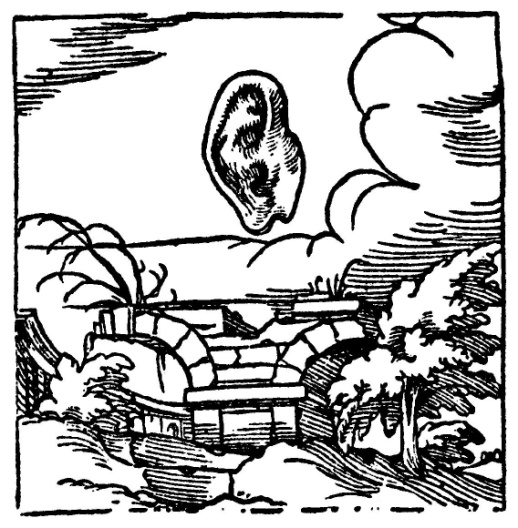
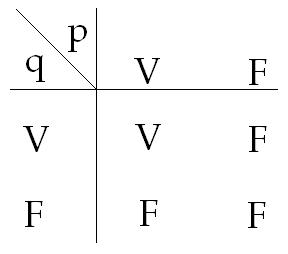
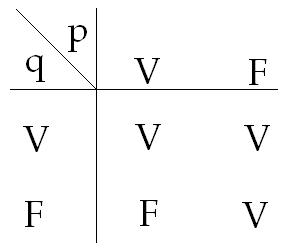

# Leçon 04 | 07 Décembre 1966

<!-- source-url: http://staferla.free.fr/S14/S14 LOGIQUE.docx -->
<!-- seminar: s14 -->
<!-- lesson: 04 -->

<!-- id: s14-04-0001 -->

Vous avez pu, la dernière fois que nous nous som­mes rencontrés ici, entendre ce que vous a proposé Jacques-Alain MILLER.

<!-- id: s14-04-0002 -->

Je n’ai pu y ajouter beaucoup d’observations en raison du temps.

<!-- id: s14-04-0003 -->

Je pense que vous avez pu remarquer, dans cet expo­sé marqué d’une sûre connaissance de ce qui, à propre­ment parler, a été inauguré, nous pouvons dire, dans l’en­semble, comme logique moderne, par le travail et l’œuvre de BOOLE.

<!-- id: s14-04-0004 -->

Il n’est peut-être pas indifférent de vous fai­re savoir que Jacques-Alain MILLER, qui n’avait pas été présent à mon dernier… cours, disons qui n’avait pu non plus en avoir communication, puisque moi-même je n’en ai eu le texte qu’il y a deux jours, se trouvait donc, de par la voie et l’exposé qu’il avait choisis… et vous avez pu aussi très bien sentir, je pense, au moment où je l’avais annoncé à mon dernier cours, *que je n’étais pas très fixé sur le sujet qu’il avait choisi*.

<!-- id: s14-04-0005 -->

Ces remarques ont leur intérêt, précisément en raison de l’extraordinaire *convergence* disons, ou encore si vous voulez : *réapplication* de ce qu’il a pu énoncer devant vous, sans doute bien-sûr, en connaissance de cause, c’est-à-dire sachant quels sont *les principes* et si je puis dire, *les axiomes* autour des­quels tourne pour l’instant mon développement.

<!-- id: s14-04-0006 -->

Il est néanmoins frappant, qu’à l’aide de BOOLE…

<!-- id: s14-04-0007 -->

> chez qui, bien-sûr, est absente cette articulation majeure : « *qu’aucun signifiant ne saurait se signifier lui-même* » …qu’en partant de la logique de BOOLE, c’est-à-dire de ce moment de virage où, en quelque sorte, on s’aperçoit, à avoir voulu formaliser *la logique classique*, que cette *formalisation* elle-même permet non seulement de lui apporter des *extensions* majeures, mais se révèle être *l’essence cachée* sur laquelle cette *logique* avait pu s’orienter et se construire, en croyant suivre quelque chose qui n’était pas vraiment son fondement - en croyant suivre ce que nous allons essayer de cerner aujourd’hui pour, en quelque sorte, l’écarter du champ où nous allons procéder, pour autant que nous l’avons annoncé *Logique du fantasme*.

<!-- id: s14-04-0008 -->

La surprenante aisance avec laquelle, des champs en blanc de la logique de BOOLE, MILLER a retrouvé la si­tuation, la place, où le signifiant dans sa fonction propre y est en quelque sorte élidé, dans ce fameux « **-**1 » dont il a admirablement détaché l’exclusion dans la logique de BOOLE.

<!-- id: s14-04-0009 -->

La façon dont, par cette élision même, il indiquait la place où ce que j’essaie d’articuler ici se situe, est là quelque chose qui, je crois, a son importance - non pas du tout que je lui en fasse ici compliment - mais qui vous permet de saisir la cohérence, la droite ligne, dans la­quelle s’insère cette logique que nous sommes obligés de fonder au nom des faits de l’inconscient et qui, comme il faut s’y attendre, *si nous sommes ce que nous sommes, c’est­-à-dire rationalistes,* ce à quoi il faut s’attendre, c’est bien évidemment, non pas que la logique antérieure en soit en quelque sorte renversée, mais qu’elle ne fasse qu’y retrouver ses propres fondements.

<!-- id: s14-04-0010 -->

Aussi bien vous avez vu, au passage, marquer qu’en ­ce point qui nécessite pour nous la mise en jeu d’un cer­tain symbole, ce quelque chose qui correspond à ce « -1 » dont BOOLE n’use pas ou s’interdit l’usage, dont il n’est pas sûr que ce soit ce « -1 » qui soit le meilleur à l’usage.

<!-- id: s14-04-0011 -->

Car le propre d’une logique, d’une logique formelle, c’est qu’elle opère, et ce que nous avons à dégager cette année, ce sont de nouveaux opérateurs dont l’ombre, en quelque sor­te, déjà s’est profilée, dans ce qu’à la mesure des oreil­les à qui je m’adressais, j’ai déjà essayé d’articuler d’une façon maniable - *maniable pour ce qu’il y avait à ma­nier, qui n’était autre en l’occasion, que la praxis analytique* - mais ce que cette année nous portons sur ses limites, sur ses bords à proprement parler, nous contraint de donner des formulations plus rigoureuses pour cerner ce à quoi nous avons affaire et qui mérite sous certaines fa­ces à être pris, entrepris, dans l’articulation la plus générale qui nous soit donnée pour l’instant en matière de logique, à savoir : ce qui se centre de la fonction des en­sembles.

<!-- id: s14-04-0012 -->

Je quitte ce sujet, de ce que MILLER a donc apporté la dernière fois, moins comme articulation à ce que je déve­loppe devant vous que comme confirmation, assurance, cadrage, en marge.

<!-- id: s14-04-0013 -->

Il n’est pas inintéressant de vous pointer, qu’en désignant, chez SARTRE, sous l’appellation de la « *cons­cience thétique de soi* », la façon qu’il a en quelque sorte d’occuper la place où réside cette articulation logique, qui est notre tache cette année, il ne s’agit bien là que de ce qu’on appelle un « *tenant lieu* » *-* très proprement - à savoir : ce à quoi, ce dont nous n’avons à nous occuper, nous autres ana­lystes, que d’une façon strictement équivalente à celle dont nous nous occupons des autres « *tenant lieu* », quand nous avons à manier ce qui est effet de l’inconscient.

<!-- id: s14-04-0014 -->

C’est bien en quoi l’on peut dire que d’aucune fa­çon ce que je peux énoncer sur *la structure* ne se situe par rapport à SARTRE, puisque ce point fondamental autour duquel tourne le privilège qu’il tente de maintenir du su­jet, est proprement cette sorte de « *tenant lieu* » qui ne peut d’aucune façon m’intéresser, sinon dans le registre de son interprétation.

<!-- id: s14-04-0015 -->

*Logique*, donc, *du fantasme*… Il faudrait presque aujourd’hui rappeler, mais nous ne pouvons le faire que très rapidement à la façon dont, touchant du bout du doigt une cloche, on la fait un instant vibrer, vous rappeler là-dessus la vacillation non éteinte de ce qui se rattache à la tradition, que le terme d’*universitaire* épinglera ici…

<!-- id: s14-04-0016 -->

> si nous donnons à ce sens non pas quoi que ce soit qui dé­signe ou honnisse un point géographique,
>
> mais ce sens d’*Universitas litterarum* ou un *cursius classici* disons …il n’est pas inutile au passage d’indiquer que, quels que soient les autres sens bien-sûr, beaucoup plus historiques, qu’on peut donner à ce terme « d’*université* », *il y a là quelque allusion à* ce que j’ai appelé *l’univers du discours.*

<!-- id: s14-04-0017 -->

Du moins n’est–il pas vain de rapprocher les deux termes.

<!-- id: s14-04-0018 -->

Or, il est clair que dans cette hésitation - rappe­lez-vous en la valse - que le professeur de philosophie...

<!-- id: s14-04-0019 -->

dans l’année, vous y passâtes à peu près tous autant que vous êtes, je pense …faisait autour de *la logique*, à sa­voir : de quoi s’agit-il ?

<!-- id: s14-04-0020 -->

- Des lois de la pensée ou de ses normes ?

<!-- id: s14-04-0021 -->

- De la façon dont ça fonctionne, et que nous allons extraire scientifiquement dirons-nous, ou de la façon dont il faut que ça soit conduit ?

<!-- id: s14-04-0022 -->

Admettez que pour qu’on en soit encore à n’avoir pas tranché ce débat, peut-être un soupçon nous peut venir : que la fonction de l’*Uni­versité*… au sens où je l’articulais tout à l’heure …est peut-être précisément d’en écarter la décision.

<!-- id: s14-04-0023 -->

Tout ce que je veux dire c’est que cette décision, peut-être est plus intéressée - je parle de logique - dans ce qui se passe au Vietnam, par exemple, que ce qu’il en est de *la pensée*, si tant est qu’elle reste encore ainsi suspen­due dans *ce dilemme entre ses lois*, qui dès lors nous lais­se à nous interroger : si elle s’applique au « monde » comme on dit, disons plutôt au réel, autrement dit, si elle ne rêve pas ?

<!-- id: s14-04-0024 -->

Je ne perds pas ma corde psychanalytique, je parle de choses qui nous intéressent, nous analystes, parce qu’à nous analystes, de savoir si *l’homme qui pense* rê­ve, c’est une question qui a un sens des plus concrets.

<!-- id: s14-04-0025 -->

Pour vous mettre en appétit, pour vous tenir en haleine, sachez que j’ai bien l’intention de poser la question cette année, de ce qu’il en est de l’éveil : norme de la pensée, à l’au­tre opposé, voilà bien qui nous intéresse aussi !

<!-- id: s14-04-0026 -->

Et dans sa dimension non réduite par ce petit travail de ponçage par lequel généralement, le professeur… quand il s’agit de logique dans la classe de philosophie …finira par faire que *ces lois et ces normes*, ça finisse par se présenter avec le même « *lisse* » qui permette de filer du doigt de l’une sur l’autre, autrement dit *de manier tout ça à l’aveugle*.

<!-- id: s14-04-0027 -->

Pour nous, n’a pas perdu son relief *- je dis : nous­ analystes -* *cette dimension* qui s’intitule celle *du vrai*, pour autant qu’après tout, *elle ne nécessite pas, n’impli­que pas, en elle-même le support de la pensée,* et que si à interroger ce que c’est le *vrai* dont il s’agit, à propos de quoi est suscité le fantasme d’une norme, *assurément, il apparaît bien d’origine que ce n’est pas immanent à la pensée*.

<!-- id: s14-04-0028 -->

Si je me suis permis - toujours pour les oreilles qu’il fallait bien faire vibrer - d’écrire un jour, dressant une figure qu’il ne m’était pas d’ailleurs bien difficile de faire vivre, celle de « *La vérité sortant du puits* », comme on la peint depuis toujours, pour lui faire dire :

<!-- id: s14-04-0029 -->

> « *Moi, la vérité, je parle.* [^13] » c’est bien en effet pour pointer ce relief qu’il s’agit pour nous de maintenir, ce à quoi - à proprement parler - s’accroche notre expérience et qui est absolument impossible à exclure de l’articulation de FREUD. Car FREUD y est mis tout de suite *au pied du mur*, et on n’est pas forcé d’intervenir pour ça : il s’y était mis lui-même.

<!-- id: s14-04-0030 -->

La question de la façon dont se présume le champ de l’interprétation, le mode sur lequel la technique de FREUD lui offre occasion, *l’association libre* autrement dit, nous porte au cœur de cette organisation formelle d’où s’ébau­chent les premiers pas d’une *logique mathématique*, qui a un nom… dont tout de même il n’est pas possible que le chatouillement ne soit pas venu à tous à vos oreilles …qu’on appelle *réseau -* oui et l’on précise, mais ce n’est pas ma fonction aujourd’hui de préciser et de vous rappe­ler ce qu’on appelle *[treillis](http://fr.wikipedia.org/wiki/Treillis_%28ensemble_ordonn%C3%A9%29)* ou *lattice,* *transposition anglai­se du mot* *treillis*.

<!-- id: s14-04-0031 -->

C’est de ça qu’il s’agit, dans ce que FREUD, aussi bien dans ses premières esquisses d’une nouvelle psychologie, que dans la façon dont ensuite il organise le maniement de la séance analytique comme telle, c’est ça qu’il construit avant la lettre, si je puis dire.

<!-- id: s14-04-0032 -->

Et quand l’objection lui est faite, en un point précis de la *Traumdeutung*…

<!-- id: s14-04-0033 -->

> il se trouve que je n’ai pas apporté au­jourd’hui l’exemplaire où je vous avais repéré la page …il a à répondre à l’objection :

<!-- id: s14-04-0034 -->

> « *Bien-sûr, avec votre fa­çon de procéder, à tout carrefour vous aurez bien l’occa­sion de trouver un signifié qui fera le pont entre deux*
>
> *significations et avec cette façon d’organiser les ponts, vous irez toujours de quelque part à quelque part.* »
>
> Ce n’est pas pour rien que j’avais mis la petite affichette extraite de l’ORUS APOLLO[^14] …
>
> comme par hasard, à savoir d’une interprétation au XVIème siècle des hiéroglyphes égyptiens
>
> …sur une revue maintenant vaporisée qui s’appe­lait *La Psychanalyse* : « *L’Oreille et le Pont* »

<!-- id: s14-04-0035 -->

<!-- id: s14-04-0036 -->

C’est de cela qu’il s’agit dans FREUD et chaque point de conver­gence de ce *réseau* ou *lattice*, où il nous apprend à fonder *la première interrogation*, c’est en effet un petit pont. C’est comme ça que ça fonctionne et ce qu’on lui objecte c’est qu’ainsi tout expliquera tout.

<!-- id: s14-04-0037 -->

Autrement dit, ce qui s’oppose fondamentalement à l’interprétation psychanalytique, ce n’est aucune espèce de « *critique scientifique* » entre guillemets…

<!-- id: s14-04-0038 -->

> comme on l’imagine de ce qui est ordinairement le seul bagage que les esprits qui entrent dans le champ de la médecine ont encore de leur année de philosophie, à savoir que le scien­tifique ça se fonde sur l’expérience !
>
> Bien entendu, on n’a pas ouvert Claude BERNARD, mais on connaît encore le titre …ça n’est pas une *objection scientifique*, c’est une *objection* qui remonte à la tradition médiévale, où on sa­vait ce que c’était que *la logique*. C’était beaucoup plus répandu que de notre temps, malgré les moyens de diffusion qui sont les nôtres.

<!-- id: s14-04-0039 -->

Les choses en sont d’ailleurs au point que, ayant laissé glisser récemment dans une des interviews dont je vous ai parlé, *que mon goût du commentaire, je l’avais pris d’une vieille pratique des scolastiques, j’ai prié qu’on gratte ça*, Dieu sait ce que les gens en auraient déduit ! \[Rires\]

<!-- id: s14-04-0040 -->

Enfin bref, au Moyen-âge on savait que : «* Ex falso sequitur quodlibet. *» Autrement dit qu’«* il est de la caracté­ristique du faux de rendre* *tout vrai *». *La caracté­ristique du faux*, c’est qu’on en déduit du même pas, du même pied, le faux et le vrai. Il n’exclut pas le vrai.

<!-- id: s14-04-0041 -->

S’il excluait le vrai, ça serait trop facile de le reconnaître ! Seule­ment pour s’apercevoir de ça, il faut précisément avoir fait un petit nombre minimum d’exercices de logique, ce qui jusqu’à maintenant, que je sache, ne fait pas partie des études de médecine, et c’est bien regrettable !

<!-- id: s14-04-0042 -->

Et il est clair que la façon dont FREUD répond, nous porte tout de suite sur le terrain de la structure du réseau.

<!-- id: s14-04-0043 -->

Il ne l’exprime pas, bien-sûr, dans tous les détails, les précisions modernes que nous pourrons lui donner.

<!-- id: s14-04-0044 -->

Il serait intéressant d’ailleurs de savoir *comment il a pu* ou *comment il n’a pas pu* profiter de l’enseignement de BRENTANO, qu’il n’ignorait sûrement pas, nous en avons la preuve dans son cursus universitaire.

<!-- id: s14-04-0045 -->

La fonction de *la structure du réseau*, la façon dont les lignes, d’association précisément, vien­nent se recouvrir, se recouper, converger en des points élus d’où se font des re-départs électifs, voilà ce qui est indiqué par FREUD. On sait assez, par toute la suite de son œuvre, l’*inquiétude*, dirons-nous, le véritable souci pour être plus précis, qu’il avait de cette dimension qui est bien à proprement parler celle de *la vérité*.

<!-- id: s14-04-0046 -->

Car du point de vue réalité, on est à l’aise ! Même à savoir que peut-être le *traumatisme* n’est que *fantasme*. D’une certai­ne façon, c’est même plus sûr, un fantasme, comme je suis en train de vous le montrer, c’est structural, mais ça ne laisse pas FREUD, qui était fort capable d’inventer ça aussi bien que moi, vous le pensez, ça ne le laisse pas plus tranquille.

<!-- id: s14-04-0047 -->

Où est – demande-t-il - le critère de *vérité* ? Et il n’aurait pas écrit *L’homme au loups,* si ce n’était pas sur cette piste, sur cette exigence propre : est-ce que c’est vrai, ou pas ? « *Est-ce que c’est vrai ?* »

<!-- id: s14-04-0048 -->

Il supporte ceci de ce qui se découvre à interroger la figure fondamentale qui se manifeste dans *le rêve à répétition de* *L’homme au loups.*

<!-- id: s14-04-0049 -->

Et « *Est-ce que c’est vrai ?* » ne se réduit pas à savoir si oui ou non, et à quel âge, il a vécu quelque chose qui a été re­construit à l’aide de cette figure du rêve. L’essentiel - il suffit de lire FREUD pour que vous vous en aperceviez - c’est de savoir comment le sujet, *L’homme au loups,* a pu - cette scène - la vérifier, la vérifier de tout son être. C’est par son symptôme.

<!-- id: s14-04-0050 -->

Ce qui veut dire - *car FREUD ne doute pas de la réalité de la scène originelle -* ce qui veut dire : comment il a pu l’articuler en termes propre­ment de signifiant ? Vous n’avez à vous rappeler que *la figure du cinq romain* par exemple, en tant qu’elle y est en cause, et qu’elle reparaît partout, dans les jambes écar­tées d’une femme, ou le battement d’ailes d’un papillon, pour savoir, pour comprendre que ce dont il s’agit c’est du maniement du signifiant.

<!-- id: s14-04-0051 -->

Le rapport de *la vérité* au signifiant, le détour par où l’expérience analytique rejoint le procès le plus moderne de la logique, consiste justement en ceci : c’est que ce rapport du signifiant à *la vérité* peut court-circuiter toute pensée qui le supporte.

<!-- id: s14-04-0052 -->

Et de même qu’une sorte de visée se profile à l’horizon de la logique moderne qui est celui qui réduit la logique à un maniement correct de ce qui est seulement écriture, de même pour nous la ques­tion de la vérification, concernant ce à quoi nous avons affaire, passe par ce fil direct du jeu du signifiant, pour autant qu’à lui seul reste suspendu la question de *la vérité*.

<!-- id: s14-04-0053 -->

Il n’est pas facile de mettre en avant un terme com­me celui du *vrai*, sans faire résonner immédiatement tous les échos où viennent se glisser les « *intuitions* » - entre guillemets - les plus suspectes, sans aussitôt produire des objections : \[c’est un\] fait de vieille expérience, que ceux qui s’engagent dans ces terrains ne savent que trop qu’ils peu­vent - chats échaudés - craindre l’eau froide.

<!-- id: s14-04-0054 -->

Mais qui vous dit que, parce que je vous fais dire : « *Moi, la Vérité, je parle* », *que par là j’ouvre sa rentrée au thème de l’Être*, par exemple ?

<!-- id: s14-04-0055 -->

Regardons-y au moins - pour le savoir - à deux fois. Contentons-nous de ce *nœud très exprès* que je viens de faire entre la vérité…

<!-- id: s14-04-0056 -->

> et je n’ai indiqué par là nulle personne, sinon celle à qui j’ai fait dire ces mots : « *Moi, la Vérité, je parle* ».
>
> Nulle personne, divine ou hu­maine, n’est intéressée en dehors de celle-là …à savoir *le point d’origine des rapports entre le signifiant et la vérité.*

<!-- id: s14-04-0057 -->

Quel rapport entre ceci et le point dont je suis parti tout à l’heure ? Qu’est-ce à dire : qu’à vous porter sur ce champ de la logique la plus formelle, j’aie oublié celui où se joue, *à mon dire de tout à l’heure*, le sort de la logique ?

<!-- id: s14-04-0058 -->

Il est tout à fait clair que M. Bertrand RUSSELL s’intéresse plus que M. Jacques MARITAIN à ce qui se passe au Vietnam.

<!-- id: s14-04-0059 -->

Ceci à soi tout seul, peut nous être une indication. Au reste, en évoquant ici *Le paysan de la Garonne* - *c’est son dernier habillement* – je ne prends pas une cible.

<!-- id: s14-04-0060 -->

Vous ne savez pas que c’est paru, *Le paysan de la Garonne ?* Eh bien, allez vous le procurer. \[Rires\]

<!-- id: s14-04-0061 -->

C’est le dernier livre de Jacques MARITAIN, auteur qui s’est beaucoup occupé des auteurs *scolastiques* pour autant que s’y développe l’influence de la philosophie de Saint THOMAS, qui après tout n’a pas de raisons de ne pas être évoquée ici, dans la mesure où une certaine façon de poser les principes de l’être n’est tout de même pas sans inci­dence sur ce qu’on fait de la logique : on ne peut pas dire que ça empêche le maniement de la logique, mais ça peut à certains moments y faire obstacle.

<!-- id: s14-04-0062 -->

En tout cas je tenais à préciser - je m’excuse de cette parenthèse - que si j’évo­que ici Jacques MARITAIN, et si donc par conséquent, impli­citement je vous incite à trouver, non pas que sa lecture est méprisable mais qu’elle est loin d’être sans intérêt, je vous prie tout de même de vous y reporter dans cet es­prit : du paradoxe qui s’y démontre, du maintien chez cet auteur, *parvenu à son grand âge, comme il le souligne lui-même*, de cette sorte de rigueur qui permet d’y voir pous­ser vraiment jusqu’à une *impasse*…

<!-- id: s14-04-0063 -->

> une impasse caricaturale, dans un re­père très exact de tout le relief du développement moderne de la pensée …le maintien des espoirs les plus impensables concernant ce qui devrait se développer, soit à sa place, soit dans sa marge, et pour que pût se maintenir ce qui est son adhésion centrale à savoir ce qu’il appelle « *l’intuition de l’être* ».

<!-- id: s14-04-0064 -->

Il parle à ce propos « *d’Éros phi­losophique*» et à la vérité, je n’ai pas à répudier, avec ce que j’avance devant vous du « désir », l’usage d’un tel terme, mais son usage en cette occasion, à savoir, *au nom de la philosophie de l’être*, espérer la renaissance, corrélativement au développement de la science moderne, d’*une philosophie de la nature* participe d’un *éros*, me semble-t-il, qui ne peut se situer que dans le registre de *la comédie italienne !* \[Rires\]

<!-- id: s14-04-0065 -->

Ceci n’empêche nullement bien sûr, qu’au passage, pour reprendre ses distances et pour les répudier, ne soient pointées quelques remarques - plus d’une, et à la vérité tout au long du livre - quelques remarques des plus pertinentes, concernant ce qu’il en est par exemple, de la structure de la science. Qu’effec­tivement notre science ne comporte rien de commun avec la dimension de la connaissance, voilà qui en effet est fort juste, mais qui ne comporte pas en soi–même un espoir, une promesse, de cette renaissance de *la connaissance* - *connaissance antique* - rejetée, qui se conforte dans notre perspec­tive.

<!-- id: s14-04-0066 -->

Donc je reprends, après cette parenthèse, ce qu’il s’agit pour nous d’interroger. Nulle nécessité pour nous à reculer devant l’usage de *ces tableaux de vérité par où les logiciens introduisent*, par exemple, *un certain nombre de fonctions fondamentales de la logique des propo­sitions.*

<!-- id: s14-04-0067 -->

<!-- id: s14-04-0068 -->

Écrire que la conjonction de deux propositions im­plique…

<!-- id: s14-04-0069 -->

> un tableau, je vous le rappelle - je ne vais pas vous les faire tous - c’est à la portée de tout le monde de le voir …implique que si des deux propositions nous met­tions ici les valeurs, à savoir :

<!-- id: s14-04-0070 -->

- de la proposition *p* : la valeur *vraie* et la valeur *fausse*, à savoir qu’elle peut être ou « *vraie* », ou « *fausse* ».

<!-- id: s14-04-0071 -->

- et de la proposition *q*, la va­leur *vraie* et la valeur *fausse*, …et que dans ce cas, ce qu’on appelle « *conjonction* », à savoir ce qu’elles sont, réunies en­semble, ne sera vraie que si les deux sont vraies. Dans tous les autres cas, leur conjonction donnera un résultat faux.

<!-- id: s14-04-0072 -->

Voilà le type de tableau dont il s’agit et que je n’ai pas à faire varier devant vous parce qu’il suffit que vous ouvriez le début de n’importe quel volume concernant *la logique moderne*, pour trouver comment se dé­finira différemment, par exemple, la *disjonction*, ou encore l’*implication*, ou encore l’*équivalence*.

<!-- id: s14-04-0073 -->

Et ceci peut être pour nous support, mais n’est que support et appui, à ce que nous avons à nous demander, à savoir : *est-il licite*…

<!-- id: s14-04-0074 -->

> ce que nous manions, si je puis dire, par la parole, ce que nous disons, à dire qu’il y a vérité …*est-il licite d’écrire ce que nous disons*, pour au­tant que de l’écrire va être pour nous le fondement de notre manipulation ?

<!-- id: s14-04-0075 -->

En effet, la logique - la logique *moderne*, je viens de le dire et de le répéter - entend s’instituer, je n’ai pas dit d’une convention, mais d’une *règle d’écriture*. Laquelle *règle d’écriture*, bien sûr, se fonde sur quoi ? Sur ce fait qu’au moment d’en constituer l’alphabet, nous avons posé un certain nombre de règles, appelées axiomes, concernant leur manipulation correcte et que ceci est en quelque sorte une parole qu’à nous-mêmes nous nous sommes donnée.

<!-- id: s14-04-0076 -->

Avons-nous le droit d’inscrire dans les signifiants le V et le F du *vrai* et du *faux* comme quelque chose de maniable logiquement ?

<!-- id: s14-04-0077 -->

Il est sûr que, quelque soit le carac­tère en quelque sorte introductif, *prémissiel*, de ces « *ta­bleaux de vérité* » dans les menus traités de logique qui peu­vent vous tomber sous la main, il est sûr que tout l’effort du développement de *cette logique*, sera tel : *de construi­re* *la logique propositionnelle sans partir de ces tableaux*, *dût-on d’ailleurs*, après avoir construit autrement les rè­gles de leur déductibilité, *y revenir*.

<!-- id: s14-04-0078 -->

Mais nous, ce qui nous intéresse, c’est aussi de savoir - disons au moins - ce que ça voulait dire qu’on s’en soit servi, je dis ici, tout spécialement dans *la logique stoïcienne*. Tout à l’heure, j’ai fait allusion à l’«* Ex falso sequitur quodlibet *», c’est bien-sûr quelque chose qui a dû apparaître depuis fort long­temps, mais il est clair que *ça n’a été articulé avec une telle force, nulle part mieux que chez les stoïciens.*

<!-- id: s14-04-0079 -->

Sur le vrai et le faux, les stoïciens se sont inter­rogés par cette voie logique :

<!-- id: s14-04-0080 -->

- à savoir, qu’est-ce qu’il faut pour que le *vrai* et le *faux* aient un rapport avec la logique au sens propre où nous le plaçons ici,

<!-- id: s14-04-0081 -->

- à savoir où *le fondement de la logique n’est pas à prendre ailleurs que dans l’articulation du langage, dans la chaîne signi­fiante. C’est pourquoi leur logique était une logique de propositions et non pas de classes.*

<!-- id: s14-04-0082 -->

Pour qu’il y ait une *lo­gique des propositions*, pour que ça puisse même opérer, com­ment faut-il que les propositions s’enchaînent au regard du *vrai* et du *faux* ?

<!-- id: s14-04-0083 -->

- Ou cette logique n’a rien à faire avec le *vrai* et le *faux*,

<!-- id: s14-04-0084 -->

- ou elle a à faire : le *vrai* doit engendrer le *vrai*.

<!-- id: s14-04-0085 -->

C’est ce qu’on appelle la relation d’implication au sens où elle ne fait rien intervenir d’autre que *deux temps propositionnels* :

<!-- id: s14-04-0086 -->

- la « *protase* », je dis « *protase* » pour ne pas dire *hypothèse* qui va tout de suite éveiller chez vous l’idée qu’on se met à croire à quelque chose. Il ne s’agit pas de croire, ni de croire que c’est vrai, il s’agit de po­ser : « *protase* », c’est tout. C’est-à-dire *que ce qui est af­firmé est affirmé comme vrai*.

<!-- id: s14-04-0087 -->

- Et la seconde proposition « *apodose* ».

<!-- id: s14-04-0088 -->

Nous définissons *l’implication* comme « *quelque chose qu’il peut y avoir* », rien de plus : une « *protase* » *vraie* et une « *apodose* » *vraie*.

<!-- id: s14-04-0089 -->

Ceci ne peut donner que quelque chose que nous mettons entre parenthèses et qui constitue une liaison *vraie*.

<!-- id: s14-04-0090 -->

Ça ne veut pas dire du tout qu’il ne puisse y avoir que ça ! Supposons la même « *protase* » *faux*, et l’« *apodose* » *vraie*, eh bien les stoïciens vous diront que ceci est *vrai*, parce que très précisément «* Ex falso sequitur quodlibet *» : *du faux peut être impliqué aussi bien le vrai que le faux* et, par conséquent, si c’est le *vrai*, il n’y a pas là d’objec­tion logique.

<!-- id: s14-04-0091 -->

L’implication ne veut pas dire la cause. L’im­plication veut dire cette liaison où s’unissent, d’une cer­taine façon concernant le tableau de la vérité, la « *protase* » et l’« *apodose* ».

<!-- id: s14-04-0092 -->

La seule chose qui ne peut pas aller, du moins est-ce la doctrine d’un nommé PHILON[^15] qui jouait là un rôle éminent, c’est que la « *protase* » soit *vraie* et l’« *apodose* » *fausse*. Le vrai ne saurait impliquer le faux : c’est le fondement le plus radical de toute possibilité de manier, dans un certain rapport avec la vérité, la chaîne signifian­te comme telle. Nous avons donc ici la possibilité d’un tableau qui, je vous le répète, se construit de cette façon : à savoir : quand la proposition p étant vraie, si la proposi­tion q est fausse, alors la liaison d’implication est con­notée de fausseté.

<!-- id: s14-04-0093 -->

<!-- id: s14-04-0094 -->

Qu’est-ce que ça veut dire ? Bien-sûr : les condi­tions d’existence les plus radicales d’une logique, vous ai-je dit. Le problème est tout à fait évident, c’est ce que nous avons nous à faire, quand nous avons ensuite à parler de ce qui est là écrit, en d’autres termes : quand *le sujet de l’énonciation* entre en jeu. Pour le mettre en valeur, nous n’avons qu’à observer ce qui se passe quand nous disons :

<!-- id: s14-04-0095 -->

> «* Qu’il est vrai qu’il est faux* »

<!-- id: s14-04-0096 -->

Ça ne bouge pas, à savoir tout simplement le faux reprend peut-être je ne sais quoi de lustre, d’encadrement, qui le fait passer au faux rayonnant. Ça n’est pas rien, tout de même.

<!-- id: s14-04-0097 -->

Dire : « *Qu’il est faux qu’il est vrai* » a le même résultat, je veux dire que nous fondons le faux. Mais, est-ce tout à fait la même chose ?

<!-- id: s14-04-0098 -->

Ne serait-ce pour n’indiquer que ceci que nous avons à marquer : que nous dirons plutôt « *il est faux qu’il soit vrai* ».

<!-- id: s14-04-0099 -->

L’emploi du subjonctif nous indique là qu’il se passe quelque chose.

<!-- id: s14-04-0100 -->

Dire « *qu’il est vrai qu’il est vrai* » va bien aussi et nous laisse une vérité assurée, encore que tautologique.

<!-- id: s14-04-0101 -->

Mais dire « *qu’il est faux qu’il soit faux* » n’assure pas sans doute le même ordre de vérité.

<!-- id: s14-04-0102 -->

Dire « *ce n’est pas faux* » ça n’est pas pour au­tant dire : « *c’est vrai* ». Nous revoyons donc, avec la dimension de *l’énoncia­tion,* *remis en suspens* quelque chose qui ne demandait qu’à fonctionner, d’une façon tout à fait automatique au niveau de *l’écriture*.

<!-- id: s14-04-0103 -->

C’est pourquoi, il est tout à fait frappant de no­ter quel est le côté glissant de ce point où, le drame si je puis dire, surgit très exactement de cette *duplicité* du sujet, qui est celle que, je dois dire, je n’hésiterai pas à illustrer d’une petite histoire, à laquelle j’ai déjà plusieurs fois fait allusion parce qu’elle n’a pas été sans incidences - disons : la carrière de ma petite histoire - cette espèce de réclamation, voire d’exigence qui un jour surgissait justement de la gorge de quelqu’un de très séduit par ce que j’apportais comme premières articulations de mon enseignement, touchante jaculation lancée vers le Ciel :

<!-- id: s14-04-0104 -->

- « *Pourquoi* - disait ce personnage - *pourquoi ne dit-il pas le vrai sur le vrai ?* »

<!-- id: s14-04-0105 -->

Cette sorte d’urgence, voire d’inquiétude, trouverait déjà, je pense, suffisamment sa réponse à cette seule condition, de repasser au signi­fiant écrit. Le vrai sur le vrai ! Le V sur le V, le signifiant ne sau­rait se signifier lui-même, sauf justement à ce que ça ne soit pas lui qu’il signifie, c’est-à-dire qu’il use de la métaphore. Et rien n’empêche la métaphore, qui substitue un signifiant autre à ce V de la vérité, de faire à ce moment-là la vérité ressortir, avec l’effet ordinaire de la métaphore, à savoir : la création d’un signifié faux. Ça se produit même tout le temps.

<!-- id: s14-04-0106 -->

Et à propos du discours, aussi rigoureux que je tente de le faire aujour­d’hui, ça peut encore…

<!-- id: s14-04-0107 -->

> dans beaucoup de coins de ce qu’on appelle plus ou moins proprement vos cervelles \[Rires\] …engendrer ces sortes de confusions, liées justement à la production du signifié dans la métaphore.

<!-- id: s14-04-0108 -->

Certes, il n’est pas éton­nant qu’il me revienne aux oreilles que de la même source donc d’où se produisait cette invocation nostalgique, un énoncé récent ait pris pour visée, concernant ce qu’ensei­gne FREUD, ce que, si élégamment cette bouche a articulé comme « *délayage conceptuel* ». Il y a là, en effet, une cer­taine sorte d’aveu, où précisément se désigne ceci : le rapport étroit qu’a, avec la structure du sujet, l’objet partiel.

<!-- id: s14-04-0109 -->

L’idéal ou même simplement le fait d’admettre qu’il est possible en quoi que ce soit de commenter un texte de FREUD en délayant ses concepts évoque invincible­ment ce qui ne saurait d’aucune façon satisfaire à la fonc­tion d’*objet partiel* : l’objet partiel doit pouvoir être tranché.

<!-- id: s14-04-0110 -->

D’aucune façon, *le pot de moutarde…le pot de mou­tarde* que j’ai défini en son temps comme étant nécessaire­ment vide - *vide de moutarde* - ne saurait être rempli d’une façon satisfaisante avec ce que le délayage évoque suffisamment, à savoir : *la merde molle*. \[Rires\]

<!-- id: s14-04-0111 -->

Il est extrêmement essentiel de voir *la cohérence* précisément, qu’ont ces objets primordiaux avec tout manie­ment correct d’une dialectique, comme on dit, subjective. Pour reprendre ces premiers pas concernant l’implication, il est nécessaire de voir surgir ce joint entre la vérité et l’écrit, à savoir : *ce qui peut être écrit* et *ce qui ne le peut pas*. Que veut dire ce « *ne peut pas* » dont, à la limite, la définition reste entièrement arbitraire. La seule limite posée dans *la logique moderne* au fonctionnement d’un alphabet, dans un certain système, la seule limite étant celle de la parole donnée, *axiomatique* et *initiale*. Que veut dire le « *ne peut pas* » ?

<!-- id: s14-04-0112 -->

Il a un sens dans la parole donnée, initiale, interdictive. Mais qu’est-ce qui peut s’en écrire ? Le problème de *la négation* est à poser au niveau de *l’écriture* en tant qu’elle la règle comme fonctionnement logique.

<!-- id: s14-04-0113 -->

Ici tout de suite, bien sûr, nous apparaît-il la nécessité qui a fait surgir d’abord cet usage de la négation dans ces images intuitives, marquées par le premier dessin de ce qu’on ne savait point même encore être *un bord* : les images en quelque sorte d’une limite, celle où la logique première, celle introduite par ARISTOTE : logique du « *prédicat* », qui marque « *le champ* » où une classe se caractérise par un « *prédicat donné* » et « *l’hors champ* » comme désigné par « *non joint au prédicat* ».

<!-- id: s14-04-0114 -->

Bien sûr il n’est pas aperçu, il n’est pas articulé au niveau d’ARISTOTE, que ceci comporte *l’unité de l’univers du discours*.

<!-- id: s14-04-0115 -->

Que dire - comme je l’ai écrit quelque part à propos de l’inconscient, pour en faire sentir l’absurdité - « *qu’il y a le noir et puis…* *tout ce qui ne l’est pas* », que ceci a un sens, que c’est là le fondement de la logique des classes ou du prédicat.

<!-- id: s14-04-0116 -->

C’est très précisément en raison de ce que ceci comporte déjà de suspect, sinon d’impasse, qu’on a tenté de fonder autre chose.

<!-- id: s14-04-0117 -->

Ce n’est pas aujourd’hui, mais certainement dans les séances qui vont suivre, que je vais essayer pour vous de distinguer d’une façon complète, quels sont les niveaux logiques à proprement parler, ce qui s’impose, ce qui s’impose de l’écriture elle-même de distinguer concernant la négation.

<!-- id: s14-04-0118 -->

C’est au moyen de petites lettres aussi claires, et aussi une fois fixées sur ce tableau noir, que je vous montrerai qu’il y a *quatre échelles différentes de négation, dont la négation classique*, celle qui invoque, et parait se fonder uniquement, sur *le principe de non-contradiction*, *dont la négation classique n’est qu’une d’entre elles*.

<!-- id: s14-04-0119 -->

Cette distinction technique, je veux dire, ce qui peut se formuler strictement en logique formelle, sera assurément tout à fait essentielle pour nous permettre de mettre en question ce que FREUD dit - et que bien entendu, depuis qu’il l’a dit on répète sans qu’il y ait jamais eu le plus petit commencement d’examen ! - « *que l’inconscient ne connaît pas la contradiction* ».

<!-- id: s14-04-0120 -->

Il est bien triste que certains propos soient lancés sous cette forme de flèche illuminante - car c’est vraiment nous mettre sur la piste des développements les plus radicaux - et soient restés en cet état suspendus. À tel point que même une dame qualifiée de ce titre, qu’elle avait en effet of­ficiellement, de princesse, ait pu le répéter en croyant qu’elle disait quelque chose !

<!-- id: s14-04-0121 -->

Ça c’est le danger de *la logique*, précisément : que la logique ne se supporte que là où on peut la manier dans l’usage de *l’écriture*, mais qu’à proprement parler, personne ne peut être assuré que quel­qu’un qui en parle dise même quelque chose.

<!-- id: s14-04-0122 -->

C’est bien ça qui l’a fait prendre en suspicion ! C’est aussi pour ça qu’il nous est si nécessaire de recourir à l’appareil de l’écriture.

<!-- id: s14-04-0123 -->

Néanmoins, notre danger, notre risque à nous, c’est que nous devons nous apercevoir du mode sous lequel surgit, ailleurs que dans l’articulation écrite, cette né­gation. Où vient-elle, par exemple ? Où allons-nous pouvoir la saisir, où allons-nous devoir être forcés de l’écrire, avec les seuls appareils que j’ai déjà, ici, produits de­vant vous ?

<!-- id: s14-04-0124 -->

Prenons cette implication : la proposition p impli­que la proposition q. Essayons, de voir ce qu’il en est en partant de q, à savoir ce que nous pouvons articuler de la proposition p si nous la mettons après la proposition q. Eh bien, nous devons écrire la négation *avant*, ou *à côté*, ou *au-dessus*, *quelque part* liée à q : p implique q indique que : *si non q, pas de p*.

<!-- id: s14-04-0125 -->

Je répè­te : c’est un exemple, et l’un des plus sensibles, de la né­cessité du surgissement *dans l’écrit* de quelque chose dont on aurait bien tort de croire que c’est le même qui *fonctionnait* tout à l’heure, au titre du complémentaire, par exemple à savoir qui de lui-même posait *l’univers du discours* comme *Un*. Les deux choses vont si peu ensemble qu’il suffit de le décréter pour les désarticuler l’une de l’autre, pour faire que l’un et l’autre fonctionnent distinctement.

<!-- id: s14-04-0126 -->

Parmi *les variétés* donc *de cette négation*, qui pour nous se proposent comme à interroger de l’avant de ce qui peut être écrit, à savoir du point où s’élimine la dupli­cité du *sujet de l’énonciation* au *sujet de l’énoncé*, si vous voulez : du point où cette duplicité se maintient.

<!-- id: s14-04-0127 -->

Nous aurons d’abord la fonction de la négation, pour autant qu’elle rejette de tout ordre du discours, en tant que le dis­cours l’articule, ce dont elle parle.

<!-- id: s14-04-0128 -->

Soit - je vous le ferai remarquer très précisément - ce que FREUD avance et ce qui est méconnu, quand il articule le premier pas de l’expérience, en tant qu’il est structuré par le principe du plaisir : « *comme s’ordonnant* - dit-il - *d’un « moi » et d’un «  non-moi »* ».

<!-- id: s14-04-0129 -->

On est si peu logicien qu’on ne s’aperçoit pas qu’à ce moment il ne saurait s’agir… ceci avec une façon d’autant plus fautive, que dans le texte de FREUD, les deux étages sont distingués :

<!-- id: s14-04-0130 -->

> le *moi* et le *non-moi*, en tant qu’ils se définissent dans l’opposition *Lust-Unlust* …et si peu à considérer comme de l’or­dre de cette complémentarité imposée par *l’univers du dis­cours*, que FREUD l’a distinguée en mettant à la première ligne : *Ich aussen welt,* qui n’est point du même registre.

<!-- id: s14-04-0131 -->

Si *moi* et *non-moi* voulaient dire à ce moment « *saisie du monde dans un Univers du dis­cours* »…

<!-- id: s14-04-0132 -->

> ce qui est à propre­ment parler ce qu’on évoque à considérer que *le narcissisme primaire peut intervenir dans la séance analytique* …ceci voudrait dire que le sujet infantile, au point où FREUD le désigne, déjà dans le premier fonctionnement du *principe du plaisir*, est capable de faire de la logique.

<!-- id: s14-04-0133 -->

Alors que ce dont il s’agit est proprement de *l’identification* du *moi* dans ce qui lui plaît, dans le *Lust * :

<!-- id: s14-04-0134 -->

- ce qui veut dire que le *moi* du sujet ici s’aliène de façon imaginaire,

<!-- id: s14-04-0135 -->

- ce qui veut dire que c’est précisément dans le *dehors* que ce qui plait est isolé comme *moi*.

<!-- id: s14-04-0136 -->

Ce premier « non » qui est fondateur quant à *la structure narcissique,* pour autant que *dans la suite de* FREUD elle ne se développera dans rien de moins que dans cette sorte de *négation de l’amour*, à propos de laquelle quand on la trouvera, comme il s’est fait, *dans mon discours*, on ne dira pas que je dis *le vrai sur le vrai*, mais que je dis le vrai sur ce que dit FREUD.

<!-- id: s14-04-0137 -->

Que tout amour soit fondé dans ce narcissisme premier, voilà un des termes d’où FREUD, partant, nous sollicite de savoir ce qu’il en est de cette fonction prétendue *univer­selle*, pour autant qu’elle vient donner la main à la fameuse « *intuition* » tout à l’heure dénoncée « *de l’être* ».

<!-- id: s14-04-0138 -->

Voilà cette négation que nous appellerons le « *mé* » \[μὴ\] - de *méconnaissance* - qui déjà nous pose sa question et qui se distingue du complément, en tant que dans *univers du dis­cours* il désigne - et peut-il désigner ? - la contrepartie, ce que nous appellerons, si vous voulez, ici « *le contre *», pour ne pas dire plus et l’appeler « *le contraire* » *qui en est parfai­tement distinct*, et dans FREUD lui-même.

<!-- id: s14-04-0139 -->

C’est ensuite ceci qui entrera plus loin, et plus ma­niable que ça l’est dans l’écriture logique…

<!-- id: s14-04-0140 -->

> ce à quoi j’ai fait allusion tout à l’heure dans l’implication …pour au­tant qu’à la régler dans l’apparition de ces négations tout à fait opaques dans leur retournement, on peut l’appeler dans l’implication elle-même : le « *pas sans* », dans *l’implica­tion* telle qu’elle est *définie par la tradition stoïcienne*, telle qu’elle ne peut être évitée, quels que soient ses para­doxes.

<!-- id: s14-04-0141 -->

Car assurément, il y a quelque paradoxe à ce qu’elle soit constituée telle, que n’importe quelles propositions « p » et « q » constituent une implication si vous les conjoignez ensemble et qu’il est clair que de dire : « *Si Madame Unetelle a les cheveux jaunes, alors les triangles équilatéraux ont telle proportion pour leur hauteur.* »

<!-- id: s14-04-0142 -->

Sans doute, il y a quelque paradoxe à cet usage, mais ce qu’implique la position du retournement, à savoir que la condition devienne nécessaire de remonter de ce qui est la seconde proposition vers la première, c’est par ce côté de « *pas sans* » (ceci ne va *pas sans*).

<!-- id: s14-04-0143 -->

Madame *Unetelle* peut avoir les cheveux jaunes, ça n’a pas pour nous de liaison nécessaire avec ceci : que le triangle équilatéral doive avoir telle propriété. Néan­moins, il reste vrai que le fait qu’elle ait ou qu’elle n’ait pas les cheveux jaunes ne va pas sans la chose qui, de toute façon est vraie. ­

<!-- id: s14-04-0144 -->

Autour du suspens de ce « *pas sans* » se profilent à la fois la place et le mode de surgissement de ce qu’on appelle la cause.

<!-- id: s14-04-0145 -->

Si nous pouvons donner un sens, une substance, à cet être fantomatique qu’on n’a jamais réussi à *exorciser* de ce joint, malgré que manifestement tout ce que développe la science tende toujours à l’éliminer et ne s’achève en perfec­tion qu’à ce qu’on n’ait même plus à en parler, c’est la fonction de ce « *pas sans* » et la place qu’il occupe qui nous per­mettra de la débusquer.

<!-- id: s14-04-0146 -->

Et pour terminer sur ce qui fera, en somme, tout l’ob­jet et la question de notre prochaine rencontre : *qu’est-ce que veut dire le terme « non » ?* Pouvons-nous même le faire surgir :

<!-- id: s14-04-0147 -->

- en tant que forme du complémentaire,

<!-- id: s14-04-0148 -->

- ni en tant que forme du « *mé* » \[μὴ\] de la *méconnaissance*,

<!-- id: s14-04-0149 -->

- ni en terme de ce « *pas sans* », quand il viendra à s’appliquer aux termes les plus radicaux sur lesquels j’ai fait tourner pour vous la question du fait de l’inconscient.

<!-- id: s14-04-0150 -->

À savoir, peut-il même nous venir à l’idée que quand nous parlons du « *non-être* », il s’agisse de ce quel­que chose qui serait en quelque sorte au pourtour de *la bul­le de l’être* ?

<!-- id: s14-04-0151 -->

Est-ce que le « *non-être* » c’est tout l’espace à l’extérieur ? Est-il même possible de suggérer que c’est ça ce que nous voulons dire quand nous parlons - à vrai dire fort confusément - de ce « *non-être* » que j’aimerais mieux dans l’oc­casion intituler de ce dont il s’agit et que l’inconscient met en question, à savoir : « *le lieu ou je ne suis pas* ».

<!-- id: s14-04-0152 -->

Quant au « *ne pas penser *»*,* qui ira à dire que c’est là quel­que chose qui puisse d’aucune façon se saisir dans ce autour de quoi tourne, de toute la logique du prédicat, à savoir cette fameuse distinction - qui n’en est pas une - de l’*exten­sion* et de la *compréhension * ?

<!-- id: s14-04-0153 -->

Comme si la *compréhension* consti­tuait la moindre antinomie au registre de l’*extension,* quand il est clair que *tout ce qu’on a fait de pas dans la logique*, dans le sens de la *compréhension, c’était toujours et unique­ment quand on a pris les choses uniquement sous l’angle de d’extension.*

<!-- id: s14-04-0154 -->

Est-ce une raison pour que *la négation*, ici, puisse même continuer d’être, sans un questionnement primordial, mise en usage, concernant ce dont il s’agit, si elle doit rester liée à l’*extension* ? Car il n’y a pas pour nous que ce « *ne pas être* »*,* puisque aussi bien la sorte d’« *être* » qui nous importe concernant le sujet, est liée à la pensée. Alors, que veut dire ce « *ne pas penser *» *?*

<!-- id: s14-04-0155 -->

J’entends : que veut-il dire au point que nous puissions l’écrire dans notre logique ?

<!-- id: s14-04-0156 -->

C’est là la question autour de quoi, celle du « *je ne suis pas *» et du « *je ne pense pas *», je ferai porter notre prochain entre­tien.

## Notes

[^13]: *Écrits* : *La Chose freudienne*, p.409.

[^14]: Cf. Orus Apollo Niliacus, ou Horapollo Niliacus, « *De la signification des notes hiéroglyphiques des Aegyptiens* », Paris : J. Kerver, 1543, traduict de grec en

    francoys par Jean Martin (secrétaire du cardinal de Lenoncourt), II, 23.

    Cf. Les « *Hieroglyphica d’Horapollon* » cités par Freud ( le « vautour ») dans « *Un souvenir d’enfance de Léonard de Vinci* ».

    Cf. *The hieroglyphics of Horapollo*, Princeton University Press, 1993.

[^15]: Le stoïcien Philon de Mégare (IV-IIIème siècle avant J.-C.), dit « le Dialecticien », a conçu l'implication matérielle que l'on retrouve dans la logique symbolique contemporaine, tandis qu'un autre stoïcien, Chrysippe (280 av. J.-C. - 200), qui conçut l'implication stricte « s'il fait jour, il fait jour », le critiqua. Le stoïcien Diodore Kronos (IVème siècle av. J.-C.) avait conçu l'implication  formelle. Cf. Jan Lukasiewicz : *Contribution à l'histoire de la logique des propositions*. Traduction française

    in Jean Largeault : *Logique mathématique* - Textes, pp. 9-25, éd. Armand Colin, coll. U, Paris, 1972. *Analyse de l'histoire du calcul propositionnel de Philon de Mégare à Frege*.
