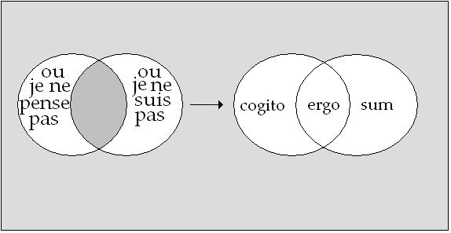
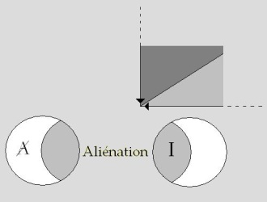

# Leçon 08 | 18 Janvier 1967

<!-- source-url: http://staferla.free.fr/S14/S14 LOGIQUE.docx -->
<!-- seminar: s14 -->
<!-- lesson: 08 -->

<!-- id: s14-08-0001 -->

Je reviendrai aujourd’hui, pour l’articuler une fois encore et avec plus d’insistance, sur l’opération que j’ai la dernière fois introduite sous le terme d’*aliénation.* L’*aliénation* est dans ce que je vous expose le point-pivot…

<!-- id: s14-08-0002 -->

> et d’abord en ce sens que ce terme transforme l’usa­ge qu’on en a fait jusqu’ici …est le point-pivot grâce à quoi peut et doit être maintenue pour nous, la valeur de ce qu’on peut appeler sous l’angle du sujet l’*instauration freudienne*, le pas décisif : ce que la pensée de FREUD, et plus encore la *praxis* qui se maintient de son patronage sous le nom de psy­chanalyse, ont - une fois apportées à notre considération - de décisif.

<!-- id: s14-08-0003 -->

Nous parlerons d’une pensée qui n’est pas « *je* », tel est - d’un premier abord flou - ce comme quoi se présente l’inconscient.

<!-- id: s14-08-0004 -->

La formule est certainement insuffisante, elle a ce prix, qu’elle met - au pivot de ce que FREUD produit pour nous de décisif - ce terme du « *je* »*.*

<!-- id: s14-08-0005 -->

Bien sûr ce n’est pas là pour autant nous permettre de nous contenter de cette formule si vague, encore que *poétique*, qui d’ailleurs, n’est extraite de son contexte poétique que toujours avec un petit peu d’abus, *ce n’est pas tout dire que d’avancer que : « je est un autre* »

<!-- id: s14-08-0006 -->

C’est pour cela qu’il est nécessaire d’en donner une articulation logique plus précise.

<!-- id: s14-08-0007 -->

Vous le savez, la fonction de l’Autre…

<!-- id: s14-08-0008 -->

> tel que je l’écris avec ce grand A placé au coin, en haut, à gauche de notre tableau, aujourd’hui …en est la fonction déterminante.

<!-- id: s14-08-0009 -->

- Il n’est pas seulement *<u>impossible d’articuler</u>* juste­ment *la logique de la pensée* telle que l’*expérience freudien­ne* l’établit,

<!-- id: s14-08-0010 -->

- il est *<u>impossible également de comprendre</u>* quoi que ce soit à ce qu’a représenté dans la tradition philoso­phique telle qu’elle est venue à nous jusqu’à FREUD,

<!-- id: s14-08-0011 -->

- il est *<u>impossible de situer</u>* justement ce qu’a représenté ce pas de *la mise au centre de la réflexion*, de *la fonction du sujet* comme tel : ...si nous ne faisons pas entrer en jeu *cette fonc­tion de l’Autre*, telle que je la définis quand je la marque de ce *grand A*, si nous ne nous rappelons pas que j’appelle l’*Au­tre*, ainsi marqué, *ce qui prend fonction d’être le Lieu de la parole*. Qu’est-ce que cela veut dire ?

<!-- id: s14-08-0012 -->

Nous n’y reviendrons jamais assez, encore que je croie déjà l’avoir quelque peu martelé : FREUD, quand il nous parle de « *cette pensée qui n’est pas je* », au niveau par exemple de ce qu’il appelle *« les pensées du rêve » : les Traumgedanken,* semble nous dire que cette pensée reste singulièrement indépendante de toute logique.

<!-- id: s14-08-0013 -->

Il souligne d’abord : aussi bien leur système ne s’embarrasse pas de *la contradiction*. Plus d’un trait encore est articulé : ceux \[les traits\] qui disent d’un premier abord que *la négation* comme telle ne saurait s’y représenter et qu’aussi bien, *l’articulation causale, la subordination, le conditionnement,* semblent fuir ce qui, de ces pensées, en apparence s’enchaîne et ne peut être retrouvé dans son fil que par les voies de la plus libre association. Il y a là quelque chose que je ne rap­pelle que parce que pour beaucoup, c’est encore là l’idée qui est reçue de ce dont il s’agit dans l’ordre de l’inconscient.

<!-- id: s14-08-0014 -->

En fait, parler du lien dénoué que présenteraient les *pensées* que nous repérons au niveau de l’inconscient, qui sont bien celles d’un sujet *ou doivent l’être,* dire que ces *pensées* ne suivent pas les lois de la logique n’est qu’un abord premier, lequel suppose quelque chose qui est plutôt une antinomie avec un réel préconçu, ou plutôt une préconcep­tion de ce que devraient être les rapports de toute pensée avec le *réel*. Le *réel*, pensons-nous - c’est là le *juste et bon or­dre* de toute efficace de la pensée - devrait s’imposer à elle.

<!-- id: s14-08-0015 -->

À la vérité, ceci ressortit trop au présupposé d’une lo­gique pédagogique qui se fonde sur un schème de l’adaptation, pour ne pas à la fois justifier que FREUD, parlant à des es­prits pas autrement formés que pouvaient l’être les gens de son ordinaire auditoire, y fasse référence, mais qu’aussi bien pour toute réflexion qui fait état de ce qu’il en est de différent de ce qui est du rapport d’un quelconque sujet avec le *réel*…

<!-- id: s14-08-0016 -->

> *du fait de ceci : que lui, sujet, ne se fonde, ne s’établit que pour autant qu’il y a déjà dans ce réel, et s’exerçant comme tel, les pouvoirs du langage* …nous obli­ge à porter plus loin notre interrogation.

<!-- id: s14-08-0017 -->

Le pas que nous fait faire FREUD *ne reste certes pas moins étonnant,* à vrai dire ne prend la valeur qui fonde l’étonnement qu’il convient qu’y soit le nôtre à l’entendre, *qu’à ce que nous articulions plus précisément ce qu’il renouvel­le des rapports de la pensée à l’être*. Assurément, thème depuis venu à l’ordre du jour de par le discours de tel des philo­sophes contemporains, au premier plan : HEIDEGGER.

<!-- id: s14-08-0018 -->

Mais assuré­ment, dans le bruit qui se fait autour de ce qu’il articule, ce serait bien la forme la plus naïve de traduire ce qu’il appelle « penser »…

<!-- id: s14-08-0019 -->

> comme ce je ne sais quel rappel qui devrait, à ce tournant où nous sommes, venir de l’être lui-même à la pensée,
>
> pour qu’elle en soit *renouvelée*, qu’elle rompe avec ce qui, du fil qu’elle a suivi depuis quelque trois mille ans,
>
> l’a menée à je ne sais quelle impasse où elle ne se saisirait plus elle-même dans son essence et où l’on pourrait s’inter­roger comme le fait HEIDEGGER : « *Was heisst Denken ?* » « *Que veut dire penser ?* » …n’attendre le renouvellement du sens de ce mot « *penser* » que de je ne sais quel accident trans-méta­physique, qui reviendrait à une bascule totale de tout ce que la pensée a tracé.

<!-- id: s14-08-0020 -->

Assurément ce n’est pas là le sens du texte de HEIDEGGER, et pour ceux qui s’y arrêteraient, on pourrait évoquer l’humoristique et dérisoire métaphore qui serait celle de la fille qui ne sait pas s’offrir autrement qu’à s’étaler sur un lit, les membres *à hue et à dia*, atten­dant que l’initiative vienne de celui auquel ainsi elle pen­se s’offrir. Ce n’est pas une aventure si rare en un temps de médiocre civilisation et chacun sait que le personnage qui s’y trouve confronté n’y est pas pour autant spécialement stimulé à y intervenir !

<!-- id: s14-08-0021 -->

Il conviendrait que *la pensée* n’ait pas une image du même ordre, mais *qu’elle consente à se rappeler* que ce n’est pas toujours sans un petit peu de peine que se font *les vraies conjugaisons*. C’est bien, en fait, quelque chose qui a à contribuer à ce problème de *l’être,* que nous apporte *le chemin* qu’a tra­cé FREUD. Mais pas autrement - j’y reviens - qu’à jauger la jonction, les conséquences de ce qui résulte pour la pensée de ce *pas décisif*, de ce *pas tranché* qui est celui que nous avons appelé, par une sorte de convention historiquement fon­dée le *pas cartésien*, à savoir celui qui limite l’instaura­tion de l’être comme tel à celui du « *je pense* » du *cogito*.

<!-- id: s14-08-0022 -->

Autrement dit du « *je suis* » qu’implique le pur fonctionnement du sujet du « *je pense* » comme tel, pour au­tant qu’il donne cette apparence - car ce n’est qu’une apparen­ce - d’être *transparent à lui-même*, d’être ce que nous pour­rions appeler une « *sui-pensée* »*.*

<!-- id: s14-08-0023 -->

Permettez-moi, avec ce néologis­me, de traduire ou de supporter caricaturalement ce qui d’habitude est appelé « *conscience de soi* », terme qui résonne mal et insuffisamment, auprès de l’usage qu’en permet la composition germanique de *Selbstbewusstsein.*

<!-- id: s14-08-0024 -->

Mais aussi bien, au niveau de DESCARTES et du *cogito,* c’est proprement d’une « *sui-pensée* » qu’il s’agit, de ce « *je pense* » qui ne se situe qu’au moment où il ne se supporte plus que d’articuler « *je pense* ». C’est de la suite de la conséquence de ceci, en tant que c’est <u>la</u> démarche décisive, qu’il s’agit. Je veux dire que *c’est dans une pensée déterminée par ce pas premier que s’inscrit la découverte de* FREUD.

<!-- id: s14-08-0025 -->

J’ai parlé de l’Autre, il est clair qu’au niveau du *cogito* cartésien, il y a remise à la charge de l’Autre des conséquences de ce pas :

<!-- id: s14-08-0026 -->

- si le « *cogito ergo sum* » n’implique pas ce que DESCARTES écrit en toutes lettres dans ses *Regulae,* où se lisent si bien les conditions qui l’ont toutes détermi­né comme pensée,

<!-- id: s14-08-0027 -->

- si le *cogito* ne se complète pas d’un « *sum, ergo Deus est *», ce qui assurément rend les choses bien plus aisées …il n’est pas tenable.

<!-- id: s14-08-0028 -->

Et pourtant, s’il n’est pas te­nable comme articulation - j’entends : philosophique - il n’en reste pas moins que le bénéfice est acquis.

<!-- id: s14-08-0029 -->

Que de la dé­marche qui réduit à cette mince marge de l’être pensant, en tant qu’il pense pouvoir se fonder de cette seule pensée, comme « *je suis* », il reste que quelque chose est acquis *dont les conséquences se lisent*, très vite d’ailleurs, *dans une série de contradictions*.

<!-- id: s14-08-0030 -->

Car c’est bien le lieu de marquer, par exemple, que le fondement prétendu de *la simple intuition* qui en verrait se *distinguer radicalement* *la chose étendue* \[*res extensa*\] de *la chose pensante* \[*res cogitans*\] .

<!-- id: s14-08-0031 -->

La première, comme étant fondée d’une extério­rité de l’une à l’autre de ses parties, du fondement *partes extra partes*, comme caractéristique de *l’étendue* , est à très bref délai annihilé par *la découverte newtonienne*, dont je crois qu’on ne souligne pas assez que la caractéristique qu’elle donne à *l’étendue,* c’est précisément qu’en chacun de ses points, si je puis dire, nulle masse n’en « *ignore* » de ce qui se passe à l’instant même dans tous les autres points. Para­doxe certes évident et qui a donné aux contemporains, et tout spécialement aux cartésiens, beaucoup de mal à l’admet­tre.

<!-- id: s14-08-0032 -->

Une résistance qui n’a pas tari et où se démontre quel­que chose qui pour nous se complète certainement de ceci, que *la chose pensante* s’impose à nous, précisément de l’expé­rience freudienne, comme étant, elle :

<!-- id: s14-08-0033 -->

- non plus cette chose toujours pointée d’une unification indéfectible,

<!-- id: s14-08-0034 -->

- mais bien au contraire comme marquée, comme caractérisée d’être mor­celée, voire morcelante, porter en elle cette même marque qui se développe et en quelque sorte se démontre, dans tout le développement de *la logique moderne*.

<!-- id: s14-08-0035 -->

À savoir que ce que nous appelons *la machine dans son fonctionnement essentiel*, est ce qu’il y a de plus proche *d’une combinatoire de notations* et que *cette combinatoire de notations est* pour nous *le fruit le plus précieux*, le plus indicatif du développement *de la pensée.* FREUD, ici, apporte sa contribution à démontrer ce qui résulte du *fonctionnement effectif* de cette face de la pensée. Je veux dire de ses rapports non point avec le sujet de *la démonstration mathématique*, dont nous allons rappeler tout de suite quelle est l’essence, mais avec un sujet qui est celui que KANT appellerait « *sujet pathologique *»*,* c’est à dire avec le sujet en tant que, de cette sorte de pensée, il peut pâtir.

<!-- id: s14-08-0036 -->

Le sujet *souffre de la pensée*, en tant, dit FREUD, qu’*il la refoule.* Le caractère morcelé et morcelant de cette pensée re­foulée est ce que nous enseigne notre expérience de chaque jour, dans la psychanalyse.

<!-- id: s14-08-0037 -->

C’est pourquoi c’est une mythologie grossière et mal­honnête que de présentifier comme fonds de notre expérience, je ne sais quelle nostalgie d’une unité primitive, d’une pure et simple pulsation de la satisfaction, dans un rapport à l’Autre, qui est ici le seul qui compte, et qu’on image, qu’on représente comme l’Autre d’un rapport nourricier. Le pas sui­vant, plus scandaleux - si je puis dire - encore que le premier, devenant nécessairement ce qui se passe, ce qui s’articule dans la théorie psychanalytique moderne en long et en large : la confusion de cet *Autre nourricier* avec l’*Autre sexuel*.

<!-- id: s14-08-0038 -->

Il n’y a vraiment de salut - si je puis dire - de la pensée, de préservation possible de la vérité introduite par FREUD, mais aussi bien, dirai-je *d’honnêteté technique*, qui ne puissent, qui ne doivent se fonder sur l’écart de *ce leurre grossier*, de cet abus scandaleux qu’il représente : d’une sorte de pé­dagogie à rebours, un usage délibéré d’une capture, par une sorte d’illusion spécialement intenable devant quiconque jette un regard droit sur ce qu’est l’expérience psychanaly­tique.

<!-- id: s14-08-0039 -->

*Rétablir l’Autre dans le seul statut qui vaille, qui est pour lui celui du Lieu de la parole,* est le point de départ nécessaire d’où chaque chose, dans notre expérience analytique, peut reprendre sa juste place. Définir *l’Autre comme Lieu de la parole  *:

<!-- id: s14-08-0040 -->

- c’est dire qu’il n’est rien d’autre que le lieu où l’assertion se pose comme véridique,

<!-- id: s14-08-0041 -->

- c’est dire du même coup qu’*il n’a aucune autre espèce d’existence,*

<!-- id: s14-08-0042 -->

- mais comme le dire c’est encore faire appel à lui pour situer cette vérité, c’est le faire ressurgir chaque fois que je parle.

<!-- id: s14-08-0043 -->

Et c’est pourquoi dire qu’« *il n’a aucune espèce d’existence* »*, je ne peux pas le dire, mais je peux l’écrire.*

<!-- id: s14-08-0044 -->

Et c’est pourquoi j’écris S(A) : S signifiant du grand A barré, comme constituant un des points nodaux de ce réseau autour duquel s’articule toute *la dialec­tique du désir*, en tant qu’elle se creuse de l’intervalle entre *l’énoncé* et *l’énonciation.*

<!-- id: s14-08-0045 -->

Il n’y a nulle insuffisance*,* nulle réduction à je ne sais quel geste gratuit, dans ce fait d’affirmer que l’écriture S(A) joue ici pour notre pensée un rôle pivot essentiel. *Car il n’y a aucun autre fondement à ce qu’on appelle « vérité mathématique », sinon que le recours à l’Autre, en tant que ceux à qui je parle sont priés de s’y référer* - j’entends : en tant que grand Autre - *pour y voir s’inscrire les signes de nos conventions initiales quant à ce qui en est de ce que je manipule en mathématiques*, qui est très exac­tement ce que M. Bertrand RUSSELL, *expert en la matière*, ira jusqu’à oser désigner de ces termes : que nous ne savons pas de quoi nous parlons, ni si ce que nous disons y a la moindre vérité.

<!-- id: s14-08-0046 -->

Et en effet, et pourquoi pas ? Simplement le recours à l’Autre, en tant que dans un certain champ correspondant à un usage limité de certains signes, il est incontestable *qu’ayant parlé, je peux écrire et maintenir ce que j’ai écrit*. Si je ne puis, à chaque temps du raisonnement mathéma­tique, faire ce mouvement de va-et-vient entre ce que j’ar­ticule par mon discours et ce que j’inscris comme étant éta­bli, il n’y a aucune progression possible de ce qui s’appelle vérité mathématique et c’est là toute l’essence de ce qu’on appelle en mathématique « *démonstration* ».

<!-- id: s14-08-0047 -->

C’est précisément *du même ordre* qu’est ce dont il s’agit ici. *Le recours à l’Autre est, dans tout effet de la pensée, absolument déter­minant*.

<!-- id: s14-08-0048 -->

Le « *je suis* » du « *je pense* » cartésien, non seulement ne l’é­vite pas, mais s’y fonde, s’y fonde avant même qu’il soit forcé - cet Autre - de le placer à un niveau d’essence divine.

<!-- id: s14-08-0049 -->

Rien déjà que pour obtenir de l’interlocuteur la suite, le « *<u>donc</u>* » du « *je suis* »*,* cet Autre est très directement appelé, c’est à lui, c’est à la référence à *ce lieu*, comme *lieu de la pa­role*, que DESCARTES s’en remet, pour *un discours qui appelle le consentement* à faire ce que je suis en train de faire de­vant vous : à m’exhorter au doute, vous ne nierez pas que je suis.

<!-- id: s14-08-0050 -->

L’argument est ontologique dès cet étape et assu­rément s’il n’a pas le tranchant de l’argument de Saint ANSELME, s’il est plus sobre, il n’est pas pour autant sans comporter des conséquences qui sont celles où nous allons venir maintenant et qui sont précisément celles qui résultent de devoir *écrire par un signifiant*, que cet Autre n’est pas autre chose.

<!-- id: s14-08-0051 -->

Saint ANSELME…

<!-- id: s14-08-0052 -->

> je vous avais priés pendant ces vacances de vous reporter à un certain chapitre et pour que la chose ne reste pas en l’air,
>
> je rappellerai ici de quel ordre est ce fameux argument, qui est injustement déprécié et qui est bien fait pour mettre dans tout son relief la fonction de cet Autre. L’argument ne porte d’aucune façon - comme on le dit dans les manuels –
>
> sur ceci : que l’essence la plus parfaite impliquerait l’existence …*chapitre II du Fides quaerens intellectum,* articule l’argument de s’adresser à ce qu’il appelle l’« *insensé* ».

<!-- id: s14-08-0053 -->

L’insensé qui - *dit l’Écriture* - a dit dans son cœur : « *Il n’y a point de Dieu.* »

<!-- id: s14-08-0054 -->

L’argument consiste à dire : « *Insensé ! Tout dépend de ce que vous appelez Dieu, et comme il est clair que vous avez appelé Dieu l’Être le plus parfait, vous ne savez pas ce que vous dites.* » Car, dit Saint ANSELME : « *Je sais bien, moi Saint Anselme, je sais qu’il ne suffit pas que l’idée de l’Être le plus parfait existe comme idée, pour que cet Être existe. Mais si vous, vous considérez que vous êtes en droit d’avoir cette idée, que vous dites que cet Être n’existe pas, à quoi ressemblez-vous si par hasard il existe ?*

<!-- id: s14-08-0055 -->

*Car vous démontrez alors qu’en formant l’idée de l’Être le plus parfait, vous formez une idée inadéquate, puisqu’elle est séparée de ceci :* *que cet Être peut exister et que comme existant, il est plus parfait qu’une idée qui n’implique pas l’existence.* »

<!-- id: s14-08-0056 -->

C’est une démonstration de l’impuissance de la pensée chez celui qui l’articule, par un certain biais de critique concernant l’inopérance de la pensée elle-même. C’est lui démontrer qu’articulant quelque chose *sur la pensée*, lui-même ne sait pas ce qu’il dit.

<!-- id: s14-08-0057 -->

C’est pourquoi ce qui est à revoir est ailleurs et très précisément au niveau du statut de cet Autre, où non seulement *je peux*, mais où je ne peux pas faire autrement que de *m’établir*, chaque fois que quelque chose s’articule qui est du champ de la parole.

<!-- id: s14-08-0058 -->

Cet Autre, comme l’a écrit récemment un de mes amis, personne n’y croit : à notre époque, des plus dévots aux plus libertins, si tant est que ce terme ait encore un sens, tout le monde est athée. Philosophiquement, tout est intena­ble qui se fonderait sur une forme d’existence quelconque de cet Autre. C’est pourquoi tout se réduit, dans la portée du « *je suis *» qui suit le « *je pense* », à ceci : que ce « *je pense* » fait sens, mais exactement de la même façon que n’importe quel *non sens*.

<!-- id: s14-08-0059 -->

Fait sens tout ce que vous articulez, *à cette seule condition,* je vous l’ai déjà enseigné, *que soit maintenue une certaine forme grammaticale*…

<!-- id: s14-08-0060 -->

> ai-je besoin de revenir sur les « *green colour­less ideas »* [^38]*etc.* ? …*tout ce qui a simplement forme grammati­cale fait sens*. Et ceci ne veut rien dire d’autre qu’à partir de là je ne peux pas aller plus loin.

<!-- id: s14-08-0061 -->

Autrement dit, que la stricte considération de la portée logique que comporte toute opération de langage, s’affirme dans ce qui est l’effet fon­damental et sûr, de ceci qui s’appelle *aliénation* et qui ne veut pas dire du tout que nous nous en remettons à l’Autre, mais au contraire, que nous nous apercevons de *la caducité* de tout ce qui se fonde seulement sur ce recours à l’Autre, dont ne peut subsister que ce qui fonde le cours de la dé­monstration mathématique d’un raisonnement par récurrence, dont le type est que si nous pouvons démontrer que quelque chose qui est vrai pour *n* l’est aussi pour *n-1.* Il suffit que nous sachions ce qu’il en est pour *n* = *1* pour pouvoir affirmer que la même chose est vraie de toute la série des nombres entiers. Et après ? … Ceci ne comporte en soi aucune autre conséquence que la nature d’une vérité qui est celle que j’ai tout à l’heure assez épinglée de l’appréciation de Bertrand RUSSELL. Pour nous, nous devons poser…

<!-- id: s14-08-0062 -->

- puisque quelque chose vient nous révéler la vérité qui se cache derrière cette conséquence,

<!-- id: s14-08-0063 -->

- puisque nous n’avons nullement lieu de reculer devant ceci qui est essentiel …que le statut de la pensée, en tant que s’y réalise *l’aliénation comme chute de l’Autre*, est composé de ceci, à savoir de ce champ blanc qui est à la gauche de l’S et qui correspond à ce statut du « *je* », qui est celui du « *je* » tel qu’il règne, *et ceci sans conteste*, sur la plus grande part de nos contemporains et *qui s’articule d’un « je ne pense pas » non seulement fier mais même glorieux de cette affirmation* !

<!-- id: s14-08-0064 -->

Moyennant quoi, ce qui le complète est ce que, là, j’ai désigné du S et que j’ai articulé la dernière fois comme étant un complément, certes, mais *complément qui lui vient de la partie chue de cette aliénation*, à savoir : *de ce qui lui vient de ce lieu de l’Autre disparu, dans ce qu’il en reste comme étant le* « *non-je* » et que j’ai appelée - parce que c’est ainsi qu’il faut la désigner - rien que ceci : *la structure grammaticale*.

<!-- id: s14-08-0065 -->

*La chose, certes, n’est pas le privilège d’un freudien* que de se concevoir ainsi, lisez M. WITTGENSTEIN[^39] : *Tractatus logico philosophicus.*

<!-- id: s14-08-0066 -->

Ne croyez pas que - parce que toute une école qui s’appelle *logico-positiviste*, nous rebat les oreilles d’une série de considérations *anti-philosophiques* des plus insipides et des plus médiocres - que le pas de M. WITTGENSTEIN ne soit rien. Cette *tentative* d’articuler ce qui résulte d’une considération de la logique *telle qu’elle puisse se passer de toute existence du sujet*, vaut bien d’être suivie dans tous ses détails et *je vous en recommande la lecture*.

<!-- id: s14-08-0067 -->

Pour nous freudiens, par contre, ce que cette struc­ture grammaticale du langage représente est exactement la même chose que ce qui fait que quand FREUD veut articuler la pulsion, il ne peut faire autrement que de passer par *la structure grammaticale* qui seule, donne son champ complet et ordonné à ce qui, *en fait*, quand FREUD a à parler de la pulsion, vient à dominer, je veux dire à constituer les deux seuls exemples *fonctionnant* de pulsions comme telles, à savoir *la pulsion scoptophilique* et *la pulsion sado-masochiste*.

<!-- id: s14-08-0068 -->

- *Il n’est que dans un monde de langage* que puisse pren­dre sa fonction dominante le « *je veux voir* » laissant ouvert de savoir d’où et pourquoi je suis regardé.

<!-- id: s14-08-0069 -->

- *Il n’est que dans un monde de langage*, comme je l’ai dit la dernière fois pour le pointer seulement au passage, que « *Un enfant est battu* » a sa valeur pivot.

<!-- id: s14-08-0070 -->

- *Il n’est que dans un monde de langage* que le sujet de l’action fasse surgir la question qui le supporte à savoir : pour qui agit-il ?

<!-- id: s14-08-0071 -->

Sans doute, *rien ne peut se dire* sur ce qu’il en est *de ces structures*. Notre expérience pourtant nous affirme que *ce sont elles qui dominent*…

<!-- id: s14-08-0072 -->

> et non pas ce qui rôde dans on ne sait quel couloir de l’« *Assemblée analytique* »*,* à savoir une pulsion « *génitale* » que quiconque serait bien *incapable de définir* comme telle …que *ce sont elles qui donnent leur loi à la fonction du désir*. Mais ceci ne peut être *dit*, sinon à répéter les articulations grammaticales où elles se cons­tituent, c’est à dire à exhiber, dans les phrases qui les fondent, ce qui pourra être déduit des diverses façons que le sujet aura de s’y loger.

<!-- id: s14-08-0073 -->

*Rien* - *dis-je* - *ne peut en être dit, sinon ce que nous entendons* en fait, à savoir le sujet dans sa *plainte.* À savoir pour autant qu’il ne s’y retrouve pas, que le désir qu’il y fonde a pour lui cette valeur ambiguë d’être un désir qu’il n’assume pas, qu’il ne *veut* que *malgré lui.*

<!-- id: s14-08-0074 -->

C’est bien pour revenir sur ce point que nous articulons tout ce que nous avons ici, devant vous, à dérouler.

<!-- id: s14-08-0075 -->

C’est bien parce qu’il en est ainsi et parce qu’on a *osé le dire,* qu’il faut examiner d’où ce discours a pu partir.

<!-- id: s14-08-0076 -->

Il a pu partir de ceci : qu’il est un point d’expé­rience d’où nous pouvons voir ce qu’il en est de la vérité, de ce que j’appellerai comme vous voudrez : *obscurcissement, étranglement, impasse, de la situation subjective*, sous cette incidence étrange dont le ressort dernier est à fonder dans le statut du langage. Il est au niveau où *la pensée* existe comme « *ce n’est pas JE qui pense* »*.*

<!-- id: s14-08-0077 -->

<!-- id: s14-08-0078 -->

Cette pensée, telle qu’elle est là, supportée par cette petite navette \[en bas à gauche\] qui supporte le grand I, cette pensée qui a le statut des *pensées de l’inconscient,* implique ceci : qu’elle ne peut di*re*, et c’est là le statut qui lui est propre :

<!-- id: s14-08-0079 -->

- ni « *donc je suis* »,

<!-- id: s14-08-0080 -->

- ni même le « *donc je ne suis pas* »*,* qui pourtant la complète et qui est son statut virtuel au niveau de l’Autre.

<!-- id: s14-08-0081 -->

Car c’est là que cet Autre, et seulement là, qu’il maintient son instance. C’est là où le « *je* », comme tel, ne vient s’inscrire effectivement que d’un « *je ne suis pas* ». D’un « *je ne suis pas* » qui est supporté par ce fait :

<!-- id: s14-08-0082 -->

- qu’il se supporte d’autant d’autres qu’il y en a pour constituer un rêve,

<!-- id: s14-08-0083 -->

- que le rêve, nous dit FREUD, est essentiellement égoïstique,

<!-- id: s14-08-0084 -->

- que dans tout ce que nous présente le rêve nous avons à reconnaître l’instance du *Ich*, sous un masque.

<!-- id: s14-08-0085 -->

Mais aussi bien, que c’est en tant qu’il ne s’y articule pas comme *Ich*, qu’il s’y masque, qu’il y est présent.

<!-- id: s14-08-0086 -->

C’est pourquoi la place de toutes les pensées du rêve est marquée ici\[ schéma \], dans sa partie droite, par cette ai­re blanche où se désigne que le *Ich* comme tel, il nous est certes indiqué en chacune des *pensées du rêve* de le retrou­ver, mais ce qui va constituer ce que FREUD appelle *Traumin­halt,* à savoir très précisément cet ensemble de si­gnifiants dont un rêve est constitué, par les divers méca­nismes qui sont ceux de l’inconscient : *condensation, déplacement, Verdichtung, verschiebung.*

<!-- id: s14-08-0087 -->

Si *le « je », le Ich, l’ego*, y est présent dans tous, c’est très précisément en ceci qu’*il y est dans tous, c’est-à-dire qu’il y est absolument dis­persé*.

<!-- id: s14-08-0088 -->

Qu’est-ce à dire ? Et *quel est le statut qui reste aux pensées qui constituent cet inconscient*, si ce n’est d’être ce que nous dit FREUD, à savoir ces signes par où chacune des *choses*…

<!-- id: s14-08-0089 -->

> au sens que j’ai dit la dernière fois : « *Sache *» *: affaires, choses de rencontre* …joue les unes par rapport aux autres cette fonction de renvoi qui nous fait, dans l’opération psychanalytique, nous perdre un temps dans leur foison comme dans un monde inordonné ?

<!-- id: s14-08-0090 -->

Mais que va être l’opération que réalise FREUD…

<!-- id: s14-08-0091 -->

> et spécialement dans cette partie de la *Traumdeutung*[^40] qui s’appelle le « *travail du rêve *»*, die Traumarbeit* *…*sinon de nous montrer que ce qu’il articule…

<!-- id: s14-08-0092 -->

> *ce qu’il articule au début de ce chapitre de la façon la plus claire et en toutes lettres*, quoiqu’en disent les personnes qui me lisent ces temps-ci pour la première fois et qui s’étonnent que depuis tant d’années *j’articule que l’inconscient est structuré com­me un langage* *…Der Trauminhalt - le contenu du rêve* - est donné : *its gleichsam,* tout comme dans une écriture faite d’images - ce qui désigne les *hiéroglyphes -* dont les signes sont seulement *zu übertragen,* à traduire, *in die Sprache - dans la langue des pensées du rêve*.

<!-- id: s14-08-0093 -->

\[*Der Trauminhalt ist gleichsam in einer Bilderschrift gegeben, deren Zeichen einzeln in die Sprache der Traumgedanken zu übertragen sind. Man würde offenbar in die Irre geführt, wenn man diese Zeichen nach ihrem Bilderwert anstatt nach ihrer Zeichenbeziehung lesen wollte. Ich habe etwa ein Bilderrätsel (Rebus) vor mir: ein Haus, auf dessen Dach ein Boot zu sehen ist, dann ein einzelner Buchstabe, dann eine laufende Figur, deren Kopf wegapostrophiert ist u. dgl.* \]

<!-- id: s14-08-0094 -->

Et toute la suite :

<!-- id: s14-08-0095 -->

- sur les *Zeichenbeziehung,*

<!-- id: s14-08-0096 -->

- sur la comparaison avec *un rébus*,

<!-- id: s14-08-0097 -->

- sur le fait qu’*on ne comprend un rébus qu’à le lire et à l’articuler*, car autrement il est absurde de voir une ima­ge - nous dit-il - composée d’une maison sur laquelle il y a un navire ou une personne qui est en train de courir avec à la place de sa tête une virgule, que tout ceci n’a de sens que dans une *<u>langue</u>.*

<!-- id: s14-08-0098 -->

Et après nous avoir dit que *le mon­de des pensées du rêve* est de nature illogique… je vous prie de vous reporter au texte de FREUD …ce qui n’est pas simplement pour vous témoigner de ce qui est véritablement patent et grossièrement illustré à chaque page, à savoir qu’on ne parle jamais que de langa­ge, mais à voir que ce que FREUD articule, c’est *toutes les façons* qu’il y a pour que dans ce monde « *des choses* » - sans doute, mais qu’est-ce que ça veut dire ? cela veut dire des « *Bedeutung* » - de ce à quoi ça se rapporte ce sens du *ré­bus*. Et ce à quoi ça se rapporte, c’est-à-dire en effet les images qui le *constituent,* qu’est-ce que FREUD fait, sinon de nous mon­trer comment, dans une certaine façon justement de les al­térer - ces images, par exemple – on peut désigner l’indice grâce à quoi, dans leur suite, nous retrouvons toutes *les fonctions grammaticales* d’abord éliminées.

<!-- id: s14-08-0099 -->

Et de nous mon­trer :

<!-- id: s14-08-0100 -->

- comment s’exprime le rapport d’une subordonnée à une principale – lisez tout cet énorme *chapitre VI de la Traumar­beit*,

<!-- id: s14-08-0101 -->

- comment une relation causale peut s’exprimer,

<!-- id: s14-08-0102 -->

- com­ment aussi bien fait sa rentrée *la forme de la négation*.

<!-- id: s14-08-0103 -->

Et très précisément, vous y trouverez des choses dont la parenté avec les *schémas* que je vous ai donnés*,* livrés ici, vous paraîtra évidente, *comme de la fonction de l’« ou bien - ou bien »*, dit-il, *qui sert à exprimer*, parce qu’on ne peut pas le faire autrement, *une conjonction.*

<!-- id: s14-08-0104 -->

Et quand vous y regarderez de près, vous y trouverez exactement ce que je vous ai dit quant à *l’« ou bien - ou bien »* suspendu entre deux négations : vous avez justement la même valeur que dans la négation de cette conjonction.

<!-- id: s14-08-0105 -->

Assurément ces « trucs », si je puis dire, vous pa­raîtront un tout petit peu plus en avant dans leurs résul­tats que ceux que vous livre FREUD, mais FREUD vous en li­vre très suffisamment pour vous inciter à aller dans la même voie. C’est-à-dire que quand vous prendrez : le rêve « *Sezerno* »*,* ou le rêve où « *il faut fermer ou bien un œil ou bien deux yeux* », vous vous apercevrez de ce que cela signi­fie, à voir que ça veut dire qu’on ne peut pas avoir à la fois un œil ouvert ou deux yeux ouverts, que ce n’est pas la même chose.

<!-- id: s14-08-0106 -->

Bref, la légitimité de *la logique du fantasme* est précisément ce quelque chose à quoi tout le chapitre de FREUD - pour ne parler que de celui-ci - nous prépare, nous prépare en nous montrant que ce dont FREUD trace la voie, c’est d’*une logique de ces pensées*, à savoir ceci qui veut dire : elle exige ce support du lieu de l’Autre, qui ne peut très précisément, ici, s’articuler que d’un « *donc je ne suis pas* ». Ainsi nous voici suspendus, au niveau de cette fonction, à un « *Tu n’es pas, donc je ne suis pas* »*.*

<!-- id: s14-08-0107 -->

*Est-ce que ça ne chatouille pas vos oreilles d’une certaine façon* ? *Est­ ce que ce n’est pas là le langage* - je dirais le plus im­portun - *de l’amour même* ?

<!-- id: s14-08-0108 -->

Qu’est-ce à dire ? Faut-il en pousser plus loin le sens, qui d’ailleurs donne sa vérité : « *Tu* *n’es que ce que je suis* »* *? Chacun sait et peut reconnaître que si le sens de l’amour, c’est bien en effet cette formule qui le donne, l’amour aussi bien dans son *émoi*, dans son élan naïf, com­me dans beaucoup de ses discours, ne se recommande pas comme fonction de la pensée. Je veux dire que si d’une telle *formule* « *Tu n’es pas, donc je ne suis pas* » sort le monstre dont nous connaissons assez bien les effets dans la vie de chaque jour, c’est très précisément pour autant que cette vérité, celle du « *Tu n’es pas, donc je ne suis pas* »*,* est dans l’amour rejetée *(verworfen).*

<!-- id: s14-08-0109 -->

Les manifestations de l’amour dans le *réel*, c’est très précisément la caractéristique, qui est celle que j’énonce de toute *Verwerfung.*

<!-- id: s14-08-0110 -->

À savoir : les effets les plus incommodes et les plus déprimants - c’en est bien là une illustration de plus - où les voies de l’amour ne sont nulle part à désigner comme si aisément tracées. Assurément, à l’époque de DESCARTES ces lois n’é­taient, bien sûr, ignorées de personne. Nous étions à l’époque d’Angélus SILESIUS, qui osait dire à Dieu : « *Si je n’étais pas là, eh bien c’est bien simple : Toi, Dieu, en tant que Dieu existant, Tu n’y serais pas non plus.* »

<!-- id: s14-08-0111 -->

Dans une telle époque on peut parler des problèmes de la nôtre, plus exactement on peut s’y replacer pour juger de ce qui nous fait impasse. Que FREUD nous dit-il, à porter plus loin l’examen de sa logique ?

<!-- id: s14-08-0112 -->

Si vous aviez encore gardé le moindre dou­te concernant la nature de cette subversion, qui fait de la *Bedeutung…*

<!-- id: s14-08-0113 -->

> en tant que nous la saisissons *au moment de son altération, de sa torsion comme telle, de son amputa­tion, voire de son ablation* …le ressort qui peut nous per­mettre d’y reconnaître la fonction rétablie de la logique.

<!-- id: s14-08-0114 -->

Si vous aviez encore le moindre doute, vous verriez les doutes s’évanouir à voir comment FREUD, dans le rêve, réin­tègre tout ce qui y apparaît comme jugements, que ces ju­gements soient internes au vécu de ce rêve, mais plus en­core qu’ils se présentent comme jugements – en apparence – au réveil.

<!-- id: s14-08-0115 -->

Quand - nous dit-il à propos du rêve - quelque chose dans le récit du rêveur s’indique comme étant un moment de flottement, d’interruption, une lacune - comme autrefois je disais, au temps où de « lacune » je faisais quelque état - *Lücken,* une *Unterbrechung,* une *rupture*, dans le récit que moi, rêveur, je peux en donner, cela même est à rétablir, nous dit FREUD, comme faisant partie du texte du rêve.

<!-- id: s14-08-0116 -->

Et qu’est-ce que ceci désigne ? Il me suffira de me reporter quelque part dans ce que FREUD nous en donne comme exem­ple : « *Je vais* – dit un de ses rêveurs – *avec Fraülein K. in das Volksgartenrestaurant, dans le restaurant du Volksgarten*… Et là c’est la *dunkel Stelle,* c’est le passage dont il n’y a plus rien à dire : il ne sait plus, et puis ça reprend : …*Alors, je me trouve dans le salon d’un bordel, in dem ich zwei oder drei Frauen sehe, dans lequel je vois deux ou trois femmes, une en chemise et en petite cu­lotte.* »

<!-- id: s14-08-0117 -->

Analyse : la *Fraülein K.* est la fille de son patron d’avant et ce qui est caractéristique, c’est la circons­tance où il a eu à lui parler et qu’il désigne dans ces termes : « *On s’est reconnu, man sich erkannte, gleischsam dans une sorte d’égalité, in seiner Geschlechtlichkeit, dans sa qualification de sexe, comme si on voulait dire : je suis un homme, Ich bin ein Mann und du ein Weib, et toi une femme*. »

<!-- id: s14-08-0118 -->

­

<!-- id: s14-08-0119 -->

*Voilà très précisément pourquoi est choisie la Fraülein K.* pour constituer *l’entrée du rêve*, mais aussi sans doute pour déterminer *la syncope*.

<!-- id: s14-08-0120 -->

Car ce qui va sui­vre dans le rêve, se démontre être très précisément ce qui vient perturber ce beau rapport plein de certitude entre l’homme et la femme. À savoir que les trois personnes qui sont liées, pour lui, au souvenir de ce restaurant et qui représentent aussi celles qu’il trouve dans le salon du bordel, sont respectivement sa sœur, la femme de son beau-frère et une amie de celle-ci, ou de celui-ci, qu’im­porte, en tout cas trois femmes avec lesquelles on ne peut pas dire que ses rapports soient marqués d’un abord sexuel franc et direct.

<!-- id: s14-08-0121 -->

\[Traumdeutung, VI : « *In ganz ähnlicher Form kleidete sich eine analoge Reminiszenz eines anderen Träumers ein. Er träumt : Ich gehe mit Frl. K. in das Volksgartenrestaurant..., dann kommt eine dunkle Stelle, eine Unterbrechung..., dann befinde ich mich in einem Bordellsalon, in dem ich zwei oder drei Frauen sehe, eine in Hemd und Höschen.*

<!-- id: s14-08-0122 -->

*Analyse : Frl. K. ist die Tochter seines früheren Chefs, wie er selbst zugibt, ein Schwesterersatz. Er hatte nur selten Gelegenheit, mit ihr zu sprechen, aber einmal fiel eine Unterhaltung zwischen ihnen vor, in der »man sich gleichsam in seiner Geschlechtlichkeit erkannte, als ob man sagen würde: Ich bin ein Mann und du ein Weib«. Im angegebenen Restaurant war er nur einmal in Begleitung der Schwester seines Schwagers, eines Mädchens, das ihm vollkommen gleichgültig war. Ein andermal begleitete er eine Gesellschaft von drei Damen bis zum Eingange in dieses Restaurant. Die Damen waren seine Schwester, seine Schwägerin und die bereits erwähnte Schwester seines Schwagers, alle drei ihm höchst gleichgültig, aber alle drei der Schwesterreihe angehörig. Ein Bordell hat er nur selten besucht, vielleicht zwei– oder dreimal in seinem Leben.*

<!-- id: s14-08-0123 -->

*Die Deutung stützte sich auf die » dunkle Stelle«, » Unterbrechung« im Traume und behauptete, daß er in knabenhafter Wißbegierde einigemal, allerdings nur selten, das Genitale seiner um einige Jahre jüngeren Schwester inspiziert habe. Einige Tage später stellte sich die bewußte Erinnerung an die vom Traume angedeutete Untat ein.*  »\]

<!-- id: s14-08-0124 -->

Autrement dit, ce que FREUD nous démontre comme étant *toujours* et strictement corrélatif de cette syncope du *Trauminhalt,* de la carence des signifiants, c’est dès - précisément - qu’il est abordé quoi que ce soit qui *dans le langage* - et non pas simplement les mirages de se regarder les yeux dans les yeux - mettrait en cause ce qu’il en est *des rapports du sexe comme tel*.

<!-- id: s14-08-0125 -->

Le sens logique originel de *la castration*, en tant que l’analyse a découvert sa dimension, repose en ceci qu’au niveau des *Bedeutungen,* des *significations*, le langage - en tant que c’est lui qui structure le sujet comme tel - très mathématiquement fait défaut, je veux dire : réduit ce qu’il en est du rapport entre les sexes à ce que nous désignons comme nous pouvons, par ce quelque chose à quoi le langage *réduit* la polarité sexuelle, c’est à savoir un « *avoir ou n’avoir pas* » la connotation phallique.

<!-- id: s14-08-0126 -->

C’est très précisément ce que représente - et seu­lement représente - l’effet de l’analyse.

<!-- id: s14-08-0127 -->

Aucun abord de la castration comme telle n’est pos­sible pour un sujet humain, sinon dans un renouvellement…

<!-- id: s14-08-0128 -->

> à un autre étage, séparé de toute la hauteur de ce rec­tangle que j’ai là dessiné …de cette fonction, que j’ai appelée tout à l’heure : *aliénation*, c’est à savoir : où intervient comme telle la fonction de l’Autre en tant que nous devons la marquer comme barrée : A.

<!-- id: s14-08-0129 -->

<!-- id: s14-08-0130 -->

C’est justement pour autant que l’analyse par son travail, vient à *inverser* ce rapport, qui faisait de tout ce qui était de l’ordre du statut du sujet dans son « *je ne suis pas* »*,* un champ vide, sujet non identifiable, c’est pour autant que ce champ-là va se remplir ici : dans le coin *en bas à gauche*, que va apparaître inversement le - ϕ de l’échec de l’articulation de la *Bedeutung* sexuelle.

<!-- id: s14-08-0131 -->

*Die Bedeutung des phallus…*

<!-- id: s14-08-0132 -->

> Ai-je intitulé - *puisque je l’ai prononcée en allemand* - cette conférence que j’ai faite sur *La signification du phallus* …c’est à partir de là, que doit être posée la question de ce qu’il en est de ce qui *distancie* ces deux opérations également aliénantes :

<!-- id: s14-08-0133 -->

- celle de l’aliénation pure et simple, logique,

<!-- id: s14-08-0134 -->

- et celle de la re­lecture de la même nécessité aliénante dans la *Bedeutung* des pensées inconscientes.

<!-- id: s14-08-0135 -->

Avec dans les deux cas - vous le voyez - un résultat différent, puisqu’ils semblent même - à les regarder tels qu’ils sont là, ombrés - s’opposer stric­tement l’un à l’autre. C’est que toute la distance entre l’une et l’autre de ces opérations, consiste dans leur champ de départ, dont l’un  est celui - reconstruit - à partir duquel je dé­signe le fondement de toute l’opération logique, à savoir le choix offert du « *ou je ne pense pas ou je ne suis pas* »*,* comme étant le sens véridique du *cogito* cartésien.

<!-- id: s14-08-0136 -->

<!-- id: s14-08-0137 -->

Celui-là  aboutit à un « *je ne pense pas* » et au fondement de tout ce qui, du sujet humain, fait un sujet soumis spécialement aux *deux pulsions* que j’ai désignées comme *scoptophilique* et *sadomasochiste*.

<!-- id: s14-08-0138 -->

<!-- id: s14-08-0139 -->

Que si *quelque chose d’autre, qui a rapport à la sexualité,* *se manifeste* à partir des pensées de l’incons­cient - c’est très précisément le sens de la découverte de FREUD mais aussi *ceci* par quoi se *désigne la radicale inadé­quation de la pensée à la réalité du sexe*.

<!-- id: s14-08-0140 -->

La question n’est pas de *franchir* ce qu’il y a là d’impensable - d’impensable et pourtant de salubre - car c’est là tout le nerf de ce pourquoi FREUD tenait si essen­tiellement à la théorie sexuelle de la libido. Il faut lire, sous la plume véritablement *chama­nique*, *inspirée* - je ne sais comment la quali­fier - de JUNG, *sa stupeur, son indignation*, à recueillir de la bouche de FREUD quelque chose qui lui semble consti­tuer je ne sais quel *parti-pris* strictement *anti-scienti­fique*, quand FREUD lui dit :

<!-- id: s14-08-0141 -->

- « *Et puis surtout, hein ! vous, Jung ne l’oubliez pas : il faut y tenir à cette théo­rie.* »

<!-- id: s14-08-0142 -->

- « *Mais pourquoi ?* » lui dit *Jung* .

<!-- id: s14-08-0143 -->

- « *Pour empêcher -* dit FREUD *-* *le « Schlammflut », le flot de fange !* »

<!-- id: s14-08-0144 -->

- « *Lequel ?* »

<!-- id: s14-08-0145 -->

- « *De l’occultisme.* » …lui dit FREUD, sachant très bien tout ce que comporte le fait de n’avoir pas touché cette limite précisément désignée, parce qu’elle constitue sans doute l’essence du langage, dans le fait que le langage ne domi­ne pas…

<!-- id: s14-08-0146 -->

> de ce fondement du sexe en tant qu’il est peut-être le plus profondément relié à l’essence de la mort …­ne domine pas ce qu’il en est de la réalité sexuelle. Tel est l’enseignement de sobriété que nous donne FREUD.

<!-- id: s14-08-0147 -->

Mais alors, pourquoi y a-t-il ainsi *deux voies* et *deux accès* ? Sans doute qu’il y a quelque chose qui mérite un nom dans l’opération dont nous n’avons pas parlé, celle qui nous fait passer du niveau de la pensée inconsciente à ce statut logique, théorique.

<!-- id: s14-08-0148 -->

Inversement celle qui peut nous faire passer de ce statut du sujet, en tant qu’il est sujet des *pulsions scoptophilique* et *masochiste*, au statut du sujet analysé, pour autant que pour lui a un sens la fonction de castration.

<!-- id: s14-08-0149 -->

- *Ceci*, que nous appellerons « opération vérité », par­ce que, comme la vérité elle–même, elle souffle et elle se réalise où elle veut, quand elle parle…

<!-- id: s14-08-0150 -->

- *Ceci*, qui a été lié à la découverte, à l’irruption de l’inconscient, au re­tour du refoulé…

<!-- id: s14-08-0151 -->

- *Ceci* nous permet de concevoir pourquoi nous pouvons retrouver l’instance de la castration dans *l’objet-noyau*, dans *l’objet-core* pour le dire en anglais, dans l’objet autour de quoi tourne le statut du sujet grammatical…

<!-- id: s14-08-0152 -->

- *Ceci* peut être désigné et traduit à par­tir de ce coin obtenu du fait que le langage est, de par son statut même, *antipathique* si je puis dire, à la réa­lité sexuelle.

<!-- id: s14-08-0153 -->

- *Ceci* n’est rien d’autre que le lieu de l’opération autour de quoi nous allons pouvoir définir, dans son statut logique, la fonction de *l’objet(a)*.

## Notes

[^38]: Séminaire 1964-65 : *Problèmes cruciaux*..., séance du 02-12-1964.

[^39]: Ludwig Wittgenstein : *Tractatus logico-philosophicus*, Gallimard, 1993.

[^40]: Sigmund Freud : L’interprétation des rêves, Paris, P.U.F., 1967.
