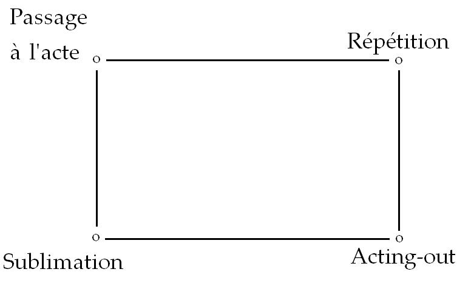
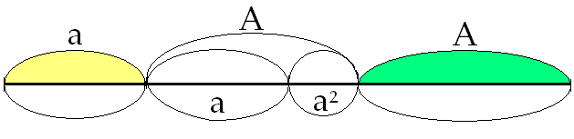
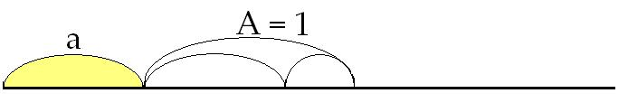
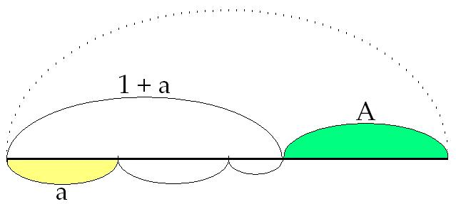
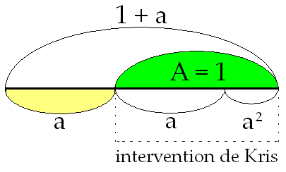
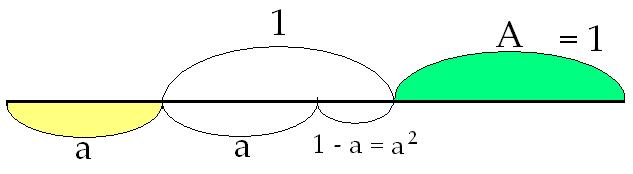
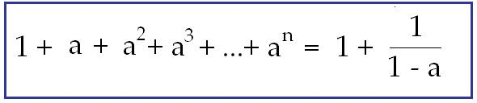

# Leçon 14 | 08 Mars 1967

<!-- source-url: http://staferla.free.fr/S14/S14 LOGIQUE.docx -->
<!-- seminar: s14 -->
<!-- lesson: 14 -->

<!-- id: s14-14-0001 -->

J’instaure en somme, toute une *méthode*…

<!-- id: s14-14-0002 -->

> sans la­quelle on peut dire que tout ce qui dans un certain champ reste implicite concernant ce qui définit ces champs,
>
> à sa­voir la présence comme telle du sujet …eh bien, cette *métho­de* que j’instaure, consiste, permet de parer, si l’on peut dire, à tout ce que cette implication du *sujet* dans ce champ y introduit de *fallace,* de *falsité* à la base.

<!-- id: s14-14-0003 -->

Quelque chose dont en somme on s’aperçoit, à prendre un peu de recul, c’est que cette *méthode* a bien toute cette *généralité*, *bien sûr* *ce n’est pas d’une visée si générale que je suis parti,* je dirai même plus - quelque chose dont je m’aperçois moi-même après coup - que quelque jour il arrive que cette *méthode*, on s’en serve pour *repenser les choses* là où elles sont le plus intéressantes, *sur le plan politique* par exemple, pourquoi pas ?

<!-- id: s14-14-0004 -->

Il est certain qu’avec des [*amodiations*](http://www.cnrtl.fr/lexicographie/amodiations)[^55] suffisantes, certains des schémas que je donne y trouveront leur application, c’est peut-être même là qu’ils auront le plus de succès, car sur le terrain pour lequel je les ai forgés, ce n’est pas joué d’avance.

<!-- id: s14-14-0005 -->

Étant donné que peut-être c’est là, c’est sur ce terrain, sur ce terrain qui est celui du psychanalyste, qu’un certain « *Un* » passe…

<!-- id: s14-14-0006 -->

> *qui est précisément celui que manifes­tent ce que j’appelle - et elles ne sont pas univoques - les fallaces du sujet* …trouve le mieux a résister. Enfin, il n’en reste pas moins que c’est là que ces concepts se seront forgés et qu’on peut même dire plus : c’est que toute la contingence de l’aventure, à savoir le mode–même de ce qu’ils auront eu à affronter, *ces concepts*, à savoir :

<!-- id: s14-14-0007 -->

- par exemple la théorie analytique telle qu’elle s’est déjà forgée, telle qu’ils ont à y introduire correction,

<!-- id: s14-14-0008 -->

- cette théorie analytique et la dialectique même de ce que leur in­troduction dans la théorie analytique aura comporté de diffi­culté, voire de résistance - voire de résistance en apparence tout à fait accidentelle, extérieure - tout cela vient en quelque sorte *contribuer* aux modes sous lesquels je les aurai serrés.

<!-- id: s14-14-0009 -->

Je veux dire que ce qu’on peut appeler la résistance des psychanalystes eux–mêmes à ce qui est leur propre champ, est peut-être ce qui apporte le témoignage le plus écla­tant des difficultés qu’il s’agit de résoudre. Je veux dire : de leur structure même.

<!-- id: s14-14-0010 -->

Voilà donc pourquoi, aujourd’hui nous arrivons à un terrain encore un peu plus vif, au moment où il va s’agir que je vous parle de ce que j’ai situé au quatrième sommet du quadrangle, que nous qualifierons…

<!-- id: s14-14-0011 -->

> je suppose que mes auditeurs d’aujourd’hui y étaient tous, là, dans mes deux pré­cédentes leçons …que nous qualifierons - ce quadrangle - de celui qui connote le moment de *la répétition.*

<!-- id: s14-14-0012 -->

<!-- id: s14-14-0013 -->

*La répétition* ai-je dit, à quoi répond comme *fondateur du sujet, le pas­sage à l’acte,* je vous ai montré, j’ai insisté - j’y reviendrai aujourd’hui parce qu’il faut y revenir - sur l’importance, dans ce statut de *l’acte*, qu’a *l’acte sexuel*. Sans le définir comme *acte,* il est absolument impossible de situer, de conce­voir, la fonction que FREUD a donnée à la sexualité, concer­nant *la structure* de ce qu’on doit appeler, avec lui, *la satisfaction*. *Satisfaction* subjective, *Befriedigung,* qui ne saurait être conçue d’un autre lieu que de celui où s’*ins­titue* le sujet comme tel. C’est la seule notion qui fonctionne d’une façon qui puisse donner un sens à cette *Befriedigung.*

<!-- id: s14-14-0014 -->

Pour donner à cet acte sexuel les repères structuraux hors desquels il nous est impossible de concevoir sa place dans ce dont il s’agit, à savoir la théorie freudienne, nous avons été amenés à faire fonctionner un des ressorts les plus exemplaires de la pensée mathématique. Assurément quand j’use de tels *moyens*, il est bien entendu qu’il y attient \[[attenir](http://www.cnrtl.fr/lexicographie/attenir)\] toujours quelque chose de partiel, *de partiel pour quiconque, de la théorie mathématique, n’aura à connaître que ce dont je me serai servi moi-même comme instrument*.

<!-- id: s14-14-0015 -->

Mais bien sûr, la situation peut être différente pour quiconque connaît la pla­ce de tel ressort, qu’avec sans doute ma part à moi d’inex­périence, j’extrais, croyez-le tout de même :

<!-- id: s14-14-0016 -->

### non sans sa­voir quelles sont les ramifications de ce dont je me sers, dans l’ensemble de la théorie mathématique,

<!-- id: s14-14-0017 -->

### et non s’en m’être as­suré que pour quiconque voudrait en faire un usage plus appro­fondi, il trouverait – dans l’ensemble de la théorie, aux points précis que j’ai choisis pour fonder telle structure - il trouve­rait tous les prolongements qui lui permettraient d’y donner une juste extension.

<!-- id: s14-14-0018 -->

Quelque écho m’est revenu que m’entendant parler de *l’acte sexuel*, à me servir pour en y structurer les tensions, de ce que me fournissait de *ternaire* la proportion du *Nombre d’or*, quelqu’un laissa passer entre ses dents cette remarque : « *La prochaine fois que j’irai foutre, il ne faudra pas que j’oublie ma règle à calcul !* » \[Rires\]

<!-- id: s14-14-0019 -->

Assurément, cette remarque a tout le caractère plaisant qu’on attribue au *mot d’esprit*, elle reste quand même pour moi à prendre *mi-figue, mi-raisin*, à partir du moment où le responsable de cette amusante sortie est un *psychanalyste*. Car à la vérité, je pense très précisément que la réussite de la jouissance au lit est essentiel­lement faite - *comme vous allez le voir je remettrai les points sur les « i »* - de l’oubli de ce qui pourrait être trouvé sur *la règle à calcul*. Pourquoi ?

<!-- id: s14-14-0020 -->

C’est si facile à oublier...

<!-- id: s14-14-0021 -->

ce sur quoi j’insisterai une fois de plus tout à l’heure. C’est même là tout le ressort de ce qu’il y a, en somme, de satisfaisant dans ce qui d’autre part – subjecti­vement – se traduit par *la castration*.

<!-- id: s14-14-0022 -->

...mais il est bien clair qu’un *psychanalyste* ne saurait oublier que c’est dans la mesure où un autre acte l’intéresse…

<!-- id: s14-14-0023 -->

> que nous appellerons, pour introduire son terme aujourd’hui : *l’acte psychanalytique­* …que quelque recours à *la règle à calcul* peut évidemment être exigible.

<!-- id: s14-14-0024 -->

*La règle à calcul* - bien sûr, pour éviter tout malenten­du - ne consistera pas dans cette occasion, à s’en servir pour y lire - nous n’en sommes pas encore là ! - ce qui se lit à la rencontre de deux petits traits, mais pour ce qu’elle porte en elle-même d’une mesure, qui ne s’appelle pas autrement que celle du *logarithme*, elle nous fournit en effet quelque chose qui n’est pas tout à fait sans rapport avec la structure que j’évoque.

<!-- id: s14-14-0025 -->

L’acte psychanalytique a ceci de frappant - à le nom­mer ainsi en référence à l’ensemble de la théorie - a ceci de frappant, qui va nous permettre de faire *une remarque* qui peut-être a paru à certains dans les marges de ce que j’ai énoncé jusqu’ici, et qui est celle-ci : j’ai insisté sur le caractère d’*acte* de ce qu’il en est de *l’acte sexuel*.

<!-- id: s14-14-0026 -->

On pourrait remarquer à ce propos, que tout ce qui s’énonce dans la théorie analytique, semble destiné à *effacer…*

<!-- id: s14-14-0027 -->

> à l’usage de ces êtres à divers titres souffrants ou insatisfaits dont nous prenons la charge …le caractère d’*acte* qu’il y a dans le fait *de la rencontre sexuelle*.

<!-- id: s14-14-0028 -->

Toute la théorie analytique met l’accent sur le mode de *la relation sexuelle*, déclarée à bon ou à mauvais droit…

<!-- id: s14-14-0029 -->

> en tout cas à divers titres, et à des titres sur lesquels je me suis permis d’élever à plusieurs reprises quelques objections …à qualifier comme plus ou moins satisfaisante telle ou telle forme de ce qu’on appelle *la relation sexuelle.*

<!-- id: s14-14-0030 -->

On peut se demander si ce n’est pas là *une façon d’éluder, voire même de noyer* ce qu’il y a de vif, de tranchant à pro­prement parler… puisqu’il s’agit là de quelque chose qui a la même *structure de coupure* que celle qui appartient à tout *acte* …ce qu’il en est proprement de l’*acte sexuel*.

<!-- id: s14-14-0031 -->

Comme c’est une coupure qui, comme toute notre expé­rience le démontre surabondamment, ne va pas toute seule, et ne donne pas à proprement parler un résultat de simple équité, comme toutes sortes d’anomalies structurales…

<!-- id: s14-14-0032 -->

> au reste parfaitement articulées et repérées, sinon conçues à leur véritable portée dans la théorie analytique …en sont le ré­sultat, il est bien clair que le fait d’éluder ce qu’il en est du relief comme tel de l’*acte*, est assurément quelque chose de lié à ce que j’appellerai le tempérament, *le mode tempéré* sous lequel la théorie s’avance, dans le dessein manifeste de ne pas traîner avec elle trop de scandale.

<!-- id: s14-14-0033 -->

Le pire étant bien entendu celui-ci, qui ne semble pas pour autant réduit par cette prudence, que l’ac­te sexuel dès lors \- quelle que soit notre aspiration à *la liberté de la pensée -* que l’acte sexuel, contraire­ment à ce qui a pu s’affirmer dans telle ou telle zone et l’examen objectif qui ressort à l’éthique, eh bien, il faut bien le dire…

<!-- id: s14-14-0034 -->

> que la théorie le reconnaisse ou non, y mette l’accent ou ne l’y mette pas, peu nous importe …l’expérience, semble-t-il, prouve surabondamment que depuis des temps qui ne datent pas d’hier, où parmi les nombreuses tentatives qui se sont faites, plus ou moins héritées des ex­périences autrement complexes qui furent celles de ce qu’on appelle « *le temps de l’homme du plaisir* », que ce à quoi ont pu aboutir, dans *certaines formules outrées* des milieux libertaires du début de ce siècle par exemple, dont il y avait encore quelques exemplaires surnageant, flottant, dans des milieux, sur d’autres terrains autrement sérieux, j’en­tends sur des terrains révolutionnaires, on a pu voir encore se maintenir la formule qu’après tout, enfin, l’acte sexuel ne devait pas être pris pour avoir plus d’importance que celle de boire un verre d’eau.

<!-- id: s14-14-0035 -->

Ça se disait, par exemple dans certaines zones, certains groupes, certains secteurs, dans l’entourage de LÉNINE.

<!-- id: s14-14-0036 -->

Je me souviens d’avoir lu autrefois en allemand un fort joli petit volume, qui s’appelait *Wege der Liebe* \[Chemins de l’amour\]*,* si je me souviens encore bien du titre…

<!-- id: s14-14-0037 -->

> c’était quand même le commencement, avant la guerre, de quelque chose qui ressemblait fort au livre de poche,
>
> et *sur la couverture il y avait* [*le ravissant museau de* Mme KOLLONTAI](#kollontai)[^56] - c’était la première équipe –
>
> et elle fut, si mon souvenir est bon, ambas­sadrice à Stockholm …c’étaient de charmants contes sur ce thème.

<!-- id: s14-14-0038 -->

Le temps ayant passé et les sociétés socialistes ayant la structure que vous savez, il apparaît bien que *l’acte sexuel* n’est pas encore passé au rang de ce qu’on satisfait au *snack-bar*. Pour tout dire, que *l’acte sexuel* traîne encore avec soi et doive traîner pour longtemps, cette sorte de bizarre effet de je ne sais pas quoi, moi… de discor­dance, de déficit, de quelque chose qui ne s’arrange pas et qui s’appelle la culpabilité. Je ne crois pas que tous les écrits des esprits élevés qui nous entourent et qui s’intitulent : des choses comme *L’Univers morbide de la faute* par exemple, comme s’il était d’ores et déjà conjuré !

<!-- id: s14-14-0039 -->

C’est un de mes amis[^57] qui l’a écrit, je préfère toujours citer des gens que j’aime bien. \[*Rires*\]

<!-- id: s14-14-0040 -->

Tout ça n’arrange pas du tout la ques­tion et ne fait pas, pour autant que nous n’ayons en effet à nous occuper probablement encore pour longtemps, de ce qui reste accroché de cet univers, autour des *ratés* disons - mais des *ratés* dont il s’agit justement de considérer le statut : ces *ratés* leur sont peut-être essentiels - des *ratés* dis-je, ou *pas–ratés*, de la structure de *l’acte sexuel*.

<!-- id: s14-14-0041 -->

Moyennant quoi, je crois devoir revenir, très courte­ment certes, mais revenir encore sur ce qu’a d’insuffisant la définition qui peut nous être donnée dans un certain registre d’*homélie bénisseuse,* concernant *ce qu’on appelle le stade génital,* sur ce qui ferait la structure idéale de son objet. Il n’est pas tout à fait vain de se reporter à cette littérature. Qu’à la vérité, la dimension de la tendresse qu’on y évoque soit quelque chose assurément de respectable, je n’ai pas à contes­ter, mais qu’on l’y considère comme *une dimension* en quelque sorte *structurale* : voilà quelque chose sur lequel je ne crois pas vain d’apporter une contestation.

<!-- id: s14-14-0042 -->

Je veux dire d’abord, qu’aussi bien il n’est pas non plus absolument…

<!-- id: s14-14-0043 -->

- *Qu’est-ce qui arrive ?* \[*un des fils de l’appareil de prise de son commence à brûler*\]

<!-- id: s14-14-0044 -->

- *Quoi ?*

<!-- id: s14-14-0045 -->

Sur le sujet de cette fameuse « *tendresse* »… \[*Rires*\] On pourrait là un peu y penser. Il y a une face de la tendresse, et peut-être toute la tendresse, qu’on pourrait épingler de quelque formule qui serait assez proche de celle-ci : «* Ce qu’il nous convient d’avoir d’apitoiement au regard de l’impuissance d’aimer. *»

<!-- id: s14-14-0046 -->

Structurer ça, au niveau de la pulsion comme telle, n’est pas facile. Mais aussi bien, pour illustrer ce qu’il conviendrait d’articuler au regard de ce qu’il en est de *l’acte* et de la satisfaction sexuelle, il serait peut–être bon de rappeler ce que l’ex­périence impose au psychanalyste, de l’*ambiguïté…*

<!-- id: s14-14-0047 -->

> ils appellent cela l’*ambivalence*. On a tellement usé de ce mot *ambivalence,* qu’il ne veut absolument plus rien dire ! …de *l’ambiguïté de l’amour*.

<!-- id: s14-14-0048 -->

Est-ce qu’un *acte sexuel* est moins un *acte sexuel…*

<!-- id: s14-14-0049 -->

> n’est qu’un acte immature qui sera à renvoyer - pour nous - dans le champ d’un sujet inachevé,
>
> resté accroché à l’arriération de quel­que stade archaïque …s’il est commis, cet *acte sexuel*, dans *la haine* tout simplement ? Le cas semble ne pas intéresser la théorie analytique.

<!-- id: s14-14-0050 -->

C’est curieux : je ne l’ai vu soulever nulle part, ce cas.

<!-- id: s14-14-0051 -->

Pour introduire la considération de cette dimension, j’ai dû, dans un séminaire déjà ancien[^58] - enfin, du temps où *le séminaire* était un *séminaire* - j’ai dû me servir de la pièce de CLAUDEL[^59], bien connue, plus exactement de la tri­logie qui commence avec *L’otage.*

<!-- id: s14-14-0052 -->

Les amours de TURELURE et de Sygne DE COÛFONTAINE sont–­elles ou non une conjonction immature ?

<!-- id: s14-14-0053 -->

Ce qu’il y a d’admirable, c’est que je crois avoir amplement fait valoir les mérites et les incidences de cette trilogie tragique, je dois dire également : sans que personne, à ma connaissance, parmi mes auditeurs, en ait perçu la portée. Ce n’est pas étonnant, puisque je n’ai pas pris soin de mettre expressément l’accent sur cette question précise et qu’en général les auditeurs, d’après tout ce que j’en ai eu d’échos, évitent aisément ce point.

<!-- id: s14-14-0054 -->

Il y en a deux espèces :

<!-- id: s14-14-0055 -->

- ceux qui suivent Monsieur CLAUDEL dans *la résonance religieuse* du plan où il situe une tragédie qui est assurément une des plus radicalement « *anti-chrétiennes *» qui aient jamais été forgées, tout au moins, eu égard à un christianisme de bon ton et d’émotion tendre.

<!-- id: s14-14-0056 -->

- Ceux qui le suivent dans cette atmosphère pensent que *Sygne De Coûfontaine*, bien entendu, *reste dans tout cela intacte*.

<!-- id: s14-14-0057 -->

Ce n’est pas ce que dans le drame, elle semble articuler, elle. Mais qu’importe : on entend à travers certains écrans. Chose curieuse : les auditeurs qui sembleraient ne pas devoir être incommodés par cet écran, à savoir les auditeurs *non reli­giosés à l’avance*, semblent de la même façon ne rien vouloir entendre de ce dont il s’agit très précisément.

<!-- id: s14-14-0058 -->

Quoi qu’il en soit, puisque nous n’avons pas d’autres références à notre portée - je veux dire *à la portée de la main*, ici, du haut d’une tribune - je laisse quand même soulevée la question de savoir si un acte sexuel consommé dans la haine en est moins un acte sexuel de pleine portée, dirai-je. Porter la question à ce niveau déboucherait sur bien des biais, qui ne seraient pas inféconds, mais où je ne peux en­trer aujourd’hui.

<!-- id: s14-14-0059 -->

Qu’il me suffise de marquer, dans la théorie régnante concernant « *le stade génital* », un autre trait, qui semble mal raccordé à ceux dont on fait usage, c’est à savoir *le caractère* - si l’on peut dire *limité, modéré, tempéré*, de toute façon, qu’y prendrait *l’affection du deuil*.

<!-- id: s14-14-0060 -->

Le signe de la maturité génitale étant que cet objet réalisé dans le conjoint…

<!-- id: s14-14-0061 -->

> puisqu’il s’agit, après tout, d’une formule qui tend à s’adapter à des mœurs aussi conformes qu’on peut le souhaiter …cet *objet*, il serait normal et signe de maturité *qu’on puisse en faire*, dans un délai que nous appellerons décent, *le deuil*.

<!-- id: s14-14-0062 -->

Il y a là quelque chose, d’abord, qui fait penser qu’il serait dans les normes de ce qu’on appelle une maturité affective, que ce soit l’autre qui parte le premier ! Ça fait penser à la bonne histoire, qui était sans doute celle \[...\] dont FREUD fait état quelque part.

<!-- id: s14-14-0063 -->

Le monsieur qui - viennois bien sûr, c’est une histoire viennoise... - qui dit à sa femme : « *Quand l’un de nous deux sera mort, j’irai à Paris.* » \[*Rires*\]

<!-- id: s14-14-0064 -->

C’est curieux, je remarque, par cette voie grossière d’opposition contras­tée qu’il ne soit jamais évoqué non plus dans la théorie, quoi que ce soit concernant - concernant « *le sujet mature* » - concernant le deuil qu’il laissera, lui, derrière lui.

<!-- id: s14-14-0065 -->

Ça pourrait aussi bien être une caractéristique qu’on pourrait très sérieusement envisager, concernant le statut du sujet !

<!-- id: s14-14-0066 -->

Il est probable que ça intéresserait moins la clientèle… De sorte que là-dessus : même blanc !

<!-- id: s14-14-0067 -->

Il y a d’autres remarques, que ce menu incident \[l’incident du fil brûlé\] pour le temps qu’il nous a fait perdre, me force à abréger.

<!-- id: s14-14-0068 -->

Je voudrais simplement dire ceci : c’est que l’in­sistance qui est mise, également le foisonnement de dévelop­pements qui concernent ce qu’on appelle la « *situation* », ou encore la « *relation* » *analytique*, est–ce que ceci n’est pas fait aussi pour nous permettre d’éluder la question concernant ce qu’il en est de *l’acte analytique ?*

<!-- id: s14-14-0069 -->

L’acte analytique bien sûr, dira-t-on, c’est *l’interprétation*. Mais comme *l’interprétation*, c’est assurément - d’une façon toujours croissante dans le sens du déclin - ce sur quoi il semble le plus difficile dans la théorie d’ar­ticuler quelque chose, nous ne ferons pour l’instant que *prendre acte* - c’est le cas de le dire - de cette déficience, et remarquerons que…

<!-- id: s14-14-0070 -->

> d’une façon qui n’est pas sans comporter, je dois dire, quelque promesse …nous avons tout de même quelque chose de très strict dans la théorie, qui conjugue *la fonction de l’analyste*…

<!-- id: s14-14-0071 -->

> je ne dis pas la « *relation analytique* », sur laquelle je viens de très exactement diriger mon index,
>
> pour dire qu’elle a en cette occasion une fonction d’écrantage …que *la fonction analytique* donc, paraît se rapprocher de quelque chose qui est du registre de *l’acte*.

<!-- id: s14-14-0072 -->

Ceci n’est pas sans promesse, nous allons le voir. Pour cette raison : c’est que si *l’acte analytique* est bien à préciser en ce point…

<!-- id: s14-14-0073 -->

> bien sûr, pour nous le plus vif et le plus intéressant à déterminer : le point en bas à gauche du quadrangle qui nous concerne, au niveau où il s’agit de l’inconscient et du symptôme … *l’acte analytique* a, je dirai d’une façon assez complète, la structure du refou­lement, d’une sorte de position « *à côté »*.

<!-- id: s14-14-0074 -->

Un représentant - si je puis m’exprimer ainsi - de sa représentation déficiente nous est donné sous le nom précisément de l’*acting out,* qui est dans ce schéma ce que j’ai à introduire aujourd’hui.

<!-- id: s14-14-0075 -->

<!-- id: s14-14-0076 -->

Tous ceux qui sont ici analystes ont au moins une vague notion de ce terme. Son axe, son centre, est donné par ceci : que certains actes…

<!-- id: s14-14-0077 -->

> ayant une structure sur laquel­le tous ne sont pas forcément à s’entendre,
>
> mais sur lesquels on peut tout de même se reconnaître …sont susceptibles de se produire dans l’analyse et dans un certain rapport de dépendance plus ou moins grande, au regard non pas de la *si­tuation* ou de la *relation* analytique, mais d’un moment précis de l’intervention de l’analyste : de quelque chose, donc, qui doit avoir quelque rapport avec ce que je considère comme pas défini du tout, à savoir *l’acte psychanalytique.*

<!-- id: s14-14-0078 -->

Nous n’avons pas, en un champ aussi difficile, à nous avancer comme le rhinocéros dans la porcelaine !

<!-- id: s14-14-0079 -->

Nous avons à y avancer doucement : de tenir avec *l’acting out* quelque chose, quelque chose sur quoi il semble pos­sible d’attirer l’attention de ceux qui ont l’expérience de l’analyse, de façon qui promette accord.

<!-- id: s14-14-0080 -->

On sait qu’il est quelque chose qui s’appelle *l’acting out, que ça a rapport avec l’intervention de l’analyste*. J’ai désigné la page de mes *Écrits…*

<!-- id: s14-14-0081 -->

> c’est dans mon dialogue avec Jean HIPPOLYTE, concernant la *Verneinung* *…*où j’ai mis en relief un très bel exemple, excellent témoi­gnage, auquel on peut faire foi, car c’est un témoignage vraiment « *innocent* », c’est le cas de le dire, celui d’Ernst KRIS, dans *l’article* qu’il a fait sous le titre *Ego Psychology and Interpretation in Psychoanalytic Therapy, Psychoanalytic Quaterly, volume XX, n°1, janvier l951, pp. 15-30*.

<!-- id: s14-14-0082 -->

Je l’ai marqué en long et en large, dans ce texte de moi aisé à retrouver. J’en ai même dit la page[^60], à l’un de ces derniers sémi­naires[^61] et *c’est dans mon dialogue avec* Jean HIPPOLYTE, *celui qui suit* *Fonction et champ de la parole et du langage,* autre­ment dit le *Discours de Rome*.

<!-- id: s14-14-0083 -->

*J’y ai mis en relief ce que comporte le fait*, pour KRIS, d’avoir - suivant un principe de méthode qui est celui que promeut l’*ego psychology -* *d’être intervenu* dans le champ qu’il appelle « *la surface* [^62] » et que nous appellerons quant à nous *le champ d’une apprécia­tion de réalité.*

<!-- id: s14-14-0084 -->

Cette « *apprécia­tion de réalité* », elle joue un rôle dans les interventions analytiques. En tous les cas dans les termes de référence de l’analyste, elle joue un rôle consi­dérable !

<!-- id: s14-14-0085 -->

Ce n’est pas une des moindres distorsions de la théorie que celle, par exemple, qui va à dire qu’il est possible d’interpréter ce qu’on appelle *les manifestations de transfert*, en faisant sentir au sujet ce que les *répétitions*, qui en constitueraient l’essence, ont d’impropre, de déplacé, d’inadéquat, au regard de - ce qui a été écrit, imprimé noir sur blanc ! - *ce champ de la situation analyti­que* : du confinement dans le cabinet de l’analyste, considéré comme constituant - ceci a été écrit - *une réalité si simple* ! Le fait le dire : « *Vous ne voyez pas à quel point il est dé­placé que telle et telle choses se répètent ici, dans ce champ où nous nous retrouvons 3 fois par semaine.* »...

<!-- id: s14-14-0086 -->

> comme si le fait de se retrouver trois fois par semaine était une réalité si simple ! …a quelque chose assurément, *qui laisse fort à penser sur la définition* que nous avons à donner de ce qu’il en est *de la réalité dans l’analyse*.

<!-- id: s14-14-0087 -->

Quoi qu’il en soit, c’est sans doute dans une pers­pective analogue que M. KRIS se place quand : ayant affaire à quelqu’un qui \- *à ses yeux à lui :* KRIS - s’épingle de s’ac­cuser de plagiarisme, ayant mis la main sur un document qui - *à ses yeux à lui :* KRIS - prouve manifestement que le sujet n’est pas réellement *un plagiaire*, croit devoir, comme inter­vention « *de surface* », articuler que bel et bien, <u>lui KRIS</u> l’assure qu’il n’est pas *un plagiaire*, puisque le volume dans lequel lui - le sujet - a cru en trouver la preuve, KRIS a été le chercher et le trouver, et qu’il n’y a rien vu de spécia­lement original dont le sujet - son patient - aurait fait son profit.

<!-- id: s14-14-0088 -->

Je vous prie de vous reporter à mon texte, comme aussi bien au texte de KRIS, comme aussi bien - si vous pouvez arriver à mettre la main dessus - au texte de Melitta SCHMIDEBERG, qui avait eu le sujet dans une première période ou tranche d’analyse.

<!-- id: s14-14-0089 -->

Vous y verrez ce que comporte d’absolument exorbitant ce passage par ce truchement, pour aborder un cas où rien n’est bien évidem­ment dit : *ce qui est l’essentiel ce n’est pas que le sujet soit réellement ou non plagiaire, mais c’est que tout son désir soit de plagier*, pour cette simple raison qu’il lui semble impossible de formuler quelque chose qui ait une valeur, sinon que lui ne l’ait empruntée à un autre.

<!-- id: s14-14-0090 -->

C’est cela qui est le ressort essentiel. Je peux schématiser aussi ferme, parce que c’est cela qui est le ressort.

<!-- id: s14-14-0091 -->

Quoi qu’il en soit, après cette *intervention* [^63]*,* c’est KRIS lui-même qui nous communique qu’après un petit temps de silence du sujet \- *qui pour KRIS accuse le coup* - il énon­ce simplement ce petit fait : que depuis un bon petit bout de temps, il va, chaque fois qu’il sort de chez KRIS, absorber un bon petit plat de cervelle fraîche. \[*Rires*\]

<!-- id: s14-14-0092 -->

Qu’est-ce que c’est que ceci ? Je n’ai pas à le dire, puisque déjà tout au début de mon enseignement, j’ai mis en valeur le fait que ceci est un *acting out*. En quoi… en quoi qui n’était pas absolument articulable à ce moment comme je peux le faire maintenant …en quoi, sinon en ceci que *l’objet petit(a)*, oral, est là en quelque sorte présentifié, apporté sur un plat - c’est bien le cas de le dire - par le patient, en relation, en rapport, avec cette interven­tion.

<!-- id: s14-14-0093 -->

Et puis après ? Après ? Ceci bien sûr n’a pour nous d’intérêt, main­tenant…

<!-- id: s14-14-0094 -->

> encore que bien sûr ça en ait toujours un, perma­nent, pour tous les analystes …que ceci n’a d’intérêt main­tenant que si ça nous permet d’avancer un peu dans la structure.

<!-- id: s14-14-0095 -->

Alors, on appelle ça *acting out*. Qu’est-ce que nous allons faire de ce terme ?

<!-- id: s14-14-0096 -->

D’abord, nous ne nous arrêterons pas, je pense, à ce­ci : c’est de tomber dans le travers d’user de ce qu’on ap­pelle le « *franglais* ».

<!-- id: s14-14-0097 -->

Pour moi, l’usage du « *franglais* », je dois dire - *quelque goût que je puisse avoir pour la langue fran­çaise -* ne m’incommode à aucun degré.

<!-- id: s14-14-0098 -->

Je ne vois vraiment pas pourquoi n’adonnerions pas notre usage de la langue de l’emploi éventuel de mots qui n’en font pas partie ? Ça ne me fait ni chaud ni froid ! Ceci, d’autant plus que ce que je n’arrive d’aucune façon à le traduire, et que c’est un terme, en anglais, d’une extraordinaire pertinence.

<!-- id: s14-14-0099 -->

Je le signale en passant, pour la raison qu’à mes yeux c’est en quelque sorte, si l’on peut dire, une confirmation de quelque chose.

<!-- id: s14-14-0100 -->

C’est à savoir, que si les auteurs…

<!-- id: s14-14-0101 -->

> et je ne vais pas vous faire l’histoire des auteurs qui l’ont introduit, parce que le temps me presse …si les auteurs se sont servis d’« *acting out* », du terme *acting out* en anglais, eh bien, ils savaient très bien ce qu’ils voulaient dire et je vais vous en apporter la preuve.

<!-- id: s14-14-0102 -->

Non pas en me servant de ce que j’aurais cru pouvoir trouver dans un excellent dictionnaire philologique fondamen­tal, que j’ai, bien entendu, chez moi, en treize volu­mes : le *New English Oxford Dictionary* : pas trace de *act out*. Mais il m’a suffi d’ouvrir le *Webster’s*…

<!-- id: s14-14-0103 -->

> qui est aussi un ad­mirable instrument - quoique en un seul volume - et qui parait en Amérique …pour trouver à *to act out,* la définition suivan­te, que j’espère retrouver… Voilà ! : *to*…

<!-- id: s14-14-0104 -->

> je m’excuse de mon… de mon anglais… de mon articulation, mon « *spelling* » insuffisant en anglais …*to represent,* entre parenthèses : *as a play, story and so on, in action –* donc : *représenter* com­me un jeu sur la scène, une histoire en action, *as opposed :* comme opposée, *to reading :* à la lecture. Comme par exemple : *as, to act out a scene one has readed.* Donc, comme *act out* \- je ne dis pas : « *jouer* » , puisque c’est *act out,* n’est-ce pas, ce n’est pas *jouer* \[*to play*\] - *une scène qu’on a lue*. Donc il y a *deux* temps.

<!-- id: s14-14-0105 -->

Vous avez lu quelque cho­se : vous lisez du RACINE, mais vous le lisez mal, bien entendu - je parle : que vous le lisez à voix haute de façon détestable - quelqu’un qui est là *veut vous montrer ce que c’est* : il le joue. Voilà ce que c’est que *to act out.*

<!-- id: s14-14-0106 -->

Je suppose que les gens qui ont choisi ce terme dans la littérature anglaise, pour désigner *l’acting out*, sa­vaient ce qu’ils voulaient dire. En tout cas, ça colle parfai­tement. *Je « act out  » quelque chose*, *parce que ça m’a été lu, traduit, articulé, signifié insuffisamment, ou « à côté »*.

<!-- id: s14-14-0107 -->

J’ajouterai que s’il vous arrive l’aventure que j’ai imagée tout à l’heure, à savoir que quelqu’un veuille vous donner une meilleure présence de RACINE, c’est pas un très bon point de départ, ça sera probablement aussi mauvais que votre façon de lire.

<!-- id: s14-14-0108 -->

En tout cas, ça partira déjà d’un cer­tain porte-à-faux : il y a quelque chose déjà d’à-côté, voire d’amorti, dans *l’acting out* introduit par une telle sé­quence. C’est-là la remarque autour de quoi j’entendrai appro­cher ce que je mets seulement en question aujourd’hui.

<!-- id: s14-14-0109 -->

Pour parler de *la logique du fantasme*, il est indis­pensable d’avoir au moins quelque idée d’où se situe l’acte psychanalytique. Voilà qui va nous forcer à un petit retour en arrière. On peut en effet remarquer - *ça va sans dire, mais ça va encore bien mieux en le disant -* que l’acte psychanalytique n’est pas un acte sexuel.

<!-- id: s14-14-0110 -->

Ce n’est même pas possible du tout de les faire interférer. C’est tout à fait le contraire. Mais dire : « *le contraire* »*,* ça ne veut pas dire le *con­tradictoire,* puisque nous faisons de la logique ! Et pour le faire sentir, je n’ai qu’à évoquer « *la couche analytique »*.

<!-- id: s14-14-0111 -->

Elle est quand même là pour quelque chose ! Dans l’ordre topologique, il y a quelque chose dont je me suis aperçu - mais c’est vraiment un problème - que les mythes en font peu état, et pourtant « *le lit »* c’est quelque chose qui a affaire avec l’acte sexuel.

<!-- id: s14-14-0112 -->

Le lit, ce n’est pas simplement ce dont nous parle ARISTOTE pour - je vous le rappelle - désigner à ce propos la différence de la ϕύσις \[phusis\] avec la τέχνη \[technè\]. Et de nous présentifier un lit en bois comme si, d’un instant à l’autre, il pouvait se remettre à bourgeonner ! J’ai bien cherché, dans ARISTOTE il n’y a pas trace du lit considéré comme… je ne sais pas… ce que j’appellerai, dans mon langage à moi - et qui n’est pas très loin de celui d’ARISTOTE - le lieu de l’Autre !

<!-- id: s14-14-0113 -->

Il avait un certain sens du τόπος \[ topos \], lui aussi, quand il s’agissait de l’ordre de la nature. C’est très curieux, ayant parlé…

<!-- id: s14-14-0114 -->

> au livre « *êta* », si mon souvenir est bon, de la *Métaphysique* [^64], mais je ne vous jure pas …de ce lit si bel et bien, il ne le con­sidère jamais comme τόπος \[topos\] de l’acte sexuel.

<!-- id: s14-14-0115 -->

On dit « enfant d’un premier lit ». C’est tout de même à prendre aussi au pied de la lettre. Les mots, ça ne se dit pas, ça ne se conjoint pas au hasard. Dans certaines conditions, le fait *d’entrer dans l’ai­re du lit* peut peut-être qualifier un acte comme ayant un certain rapport avec l’acte sexuel, comme : « *faire les ruelles* » des Pré­cieuses[^65].

<!-- id: s14-14-0116 -->

Alors « *le lit analytique* » signifie quelque chose : une aire qui n’est pas sans un certain rapport à *l’acte se­xuel*, qui est un rapport à proprement parler de contraire, à savoir qu’il ne saurait d’aucune façon s’y passer. Il n’en reste pas moins que c’est un lit et que ça introduit le sexuel sous la forme d’un champ vide ou d’un *ensemble vide*, comme on dit quelque part.

<!-- id: s14-14-0117 -->

Et alors, si vous vous rapportez à mon petit schéma structural, puisque c’est là que nous l’avons déjà placé, l’Autre sexuel, c’est là aussi que l’acte analytique, en au­cun cas, n’a rien à foutre.

<!-- id: s14-14-0118 -->

<!-- id: s14-14-0119 -->

Il s’arrête là, à cela \[Lacan désigne le A de droite\] : et le *petit( a)*, et leur rapport… je veux dire l’Autre (grand A) dont après tout, j’aimerais bien de temps en temps pouvoir élider les choses lourdes. Mais enfin, pour ceux qui sont sourds, qui ne m’ont encore jamais entendu, il s’agit bien de ce champ de l’Autre, en tant - non pas tant qu’il redou­ble - mais qu’*il se dédouble* de façon telle que justement il y est - en son intérieur - question d’un Autre en tant que champ de l’acte sexuel.

<!-- id: s14-14-0120 -->

Et puisque cet Autre, là, qui semble bien ne pas pouvoir aller sans, et qui est ce champ de l’Autre (de *l’aliénation*), *ce champ de l’Autre* qui nous introduit l’Au­tre du A, qui est aussi *le champ de l’Autre* où *la véri­té* pour nous se présente, mais de cette façon rompue, morce­lée, fragmentaire, qui la constitue à proprement parler comme *intrusion dans le savoir*.

<!-- id: s14-14-0121 -->

Avant d’oser même poser les questions concernant ce­ci : « *où est le psychanalyste ?* », il nous faut faire le rappel de ce dont il s’agit, concernant le statut de ce que désigne ici : le segment *petit( a)*. Vous avez, je pense, déjà senti qu’il est bien clair qu’il y a un rapport entre ce *a* qui est ici \[en jaune\] et ce grand A qui est là \[en vert\], qu’ils ont même la même fonction par rapport à *deux choses différentes*.

<!-- id: s14-14-0122 -->

Le *petit( a)*…

<!-- id: s14-14-0123 -->

> forme fermée, forme donnée au départ de l’expérience analytique, sous laquelle se présente le sujet, production de son histoire et nous dirons même plus : déchet de cette histoire, forme qui est celle que je désigne sous le nom de *l’objet(a)* …a le même rapport avec le A de l’Au­tre sexuel, que ce *A de la vérité*, du champ d’intrusion de ce quelque chose qui boite, qui pèche dans le sujet, sous le nom de *symptôme* - le même rapport que ce champ *petit( a)*, avec quoi ? Avec l’ensemble !

<!-- id: s14-14-0124 -->

 

<!-- id: s14-14-0125 -->

Toute coupure faite dans ce champ … et ce n’est pas dire que l’analyste qui y procède soit à identifier à *ce champ de l’Autre*…

<!-- id: s14-14-0126 -->

> comme on serait évidemment un tant soit peu tenté de le faire : les grossières analogies entre l’analyste et le père, par exemple, puisque aussi bien, ce pourrait aussi être là que fonctionne cette mesure destinée à déterminer tous les rapports de l’ensemble et nommément ceux du *petit( a)* avec le champ du A sexuel. Ne nous pressons pas, je vous en prie, vers des formules aussi précipitées, d’autant plus qu’elles sont faus­ses …ceci n’empêche pas qu’il y a le plus étroit rapport en­tre le champ du grand A de l’intervention véridique et la fa­çon dont le sujet vient à présentifier le *petit( a)*, ne serait-ce…

<!-- id: s14-14-0127 -->

> comme vous venez de le voir, en apparence, dans l’exemple em­prunté à Ernst KRIS …qu’en manière de protestation à une cou­pure anticipée.

<!-- id: s14-14-0128 -->

Il n’y a qu’un malheur : c’est que justement *ça n’est pas là* qu’a porté l’intervention de KRIS, *elle a porté dans ce champ–ci* :

<!-- id: s14-14-0129 -->

<!-- id: s14-14-0130 -->

pour autant que dans l’analyse, je dis : dans l’analyse d’autant plus que c’est un champ désexualisé. Je veux di­re que dans l’économie subjective, c’est de la désexualisation du champ propre à l’acte sexuel que dépend l’économie, les re­tentissements donc, que vont avoir l’un sur l’autre les autres secteurs du champ.

<!-- id: s14-14-0131 -->

### C’est pour ça que ceci vaut bien…

<!-- id: s14-14-0132 -->

> avant que je pour­suive plus loin : ce qui ne se fera qu’après les vacances de Pâques, pour la raison que
>
> la prochaine de nos séances, qui sera la dernière *avant*, je la réserverai à quelqu’un qui m’a demandé d’intervenir sur ce que j’ai avancé, au moins depuis le début du mois de janvier, concernant cette topologie, celle qui comprend aussi bien les quatre termes de *l’aliénation* que ceux de *la répétition* …il vaut bien, dans ces conditions, de s’attarder sur ce qu’il en est de ce champ, en tant que, dans l’analyse, c’est là que se trouve réservée la place de l’acte sexuel.

<!-- id: s14-14-0133 -->

Je reviens sur le fondement de la satisfaction de l’acte sexuel, en tant qu’il est aussi ce qui donne le statut de la *sublimation*.

<!-- id: s14-14-0134 -->

J’y reviens pour, cette année, ne pas devoir pousser plus loin ce que j’introduis sur ce point.

<!-- id: s14-14-0135 -->

Qu’en est-il de la satisfaction de l’acte sexuel ? Elle ressortit à ceci, que nous connaissons par l’ex­périence analytique, qu’il y a, non pas d’un partenaire à l’autre, mais d’un quelconque des partenaires à l’idée du cou­ple comme « *Un* » :

<!-- id: s14-14-0136 -->

- ce manque, que nous pouvons définir différemment : manque à être, manque à la jouissance de l’Autre

<!-- id: s14-14-0137 -->

- ce manque, cette non coïncidence du sujet comme *produit*, en tant qu’il s’avance dans ce champ de l’acte sexuel, car il n’est pas autre chose qu’un *produit* à ce moment-là.

<!-- id: s14-14-0138 -->

Il n’a besoin *ni d’être, ni de penser, ni d’avoir sa règle à calcul*… Il entre dans ce champ et il croit être égal au rôle qu’il a à y tenir. Ceci, qu’il soit de l’homme ou de la femme. Dans les deux cas le manque phallique, qu’on l’appelle *castration* dans un cas, ou *Penisneid* dans l’autre, est là ce qui symbolise le manque essentiel. C’est de ceci qu’il s’agit.

<!-- id: s14-14-0139 -->

Et pourquoi le pénis se trouve-t-il le symboliser ? Précisément d’être ce qui…

<!-- id: s14-14-0140 -->

> sous forme de la *détumescence,* matérialise ce défaut, ce *manque à* *la jouissance* *…*matérialise le manque qui dérive, ou plus exac­tement qui paraît dériver, de *la loi du plaisir*.

<!-- id: s14-14-0141 -->

C’est en effet dans la mesure où le plaisir a une li­mite, où le trop de plaisir est un déplaisir, que ça s’arrê­te-là et qu’il paraisse qu’il ne manque rien. Eh bien, c’est une erreur de calcul ! Exactement la même que nous ferions… et je peux vous faire passer ça comme on fait passer la mus­cade : je vous assure que si je me livre à un certain nombre de petites équations concernant ce *a*, ce *1 + a*, ce *1 – a* qui est égal à *a2* et tout ce qui s’ensuit, je vous ferais, à un moment passer comme rien, que ce *2 + a* que vous voyez là sous la forme de ce *a* qui est là et de ceux–ci qui valent chacun 1…

<!-- id: s14-14-0142 -->

<!-- id: s14-14-0143 -->

*…* je vous le transformerai bien sûr, en un *2a + 1*, sans même que vous y ayez vu que du feu \[Rires\]. Je n’ai pas le temps aujourd’hui, si vous voulez que je le fasse la prochaine fois, quand nous aurons ensemble un petit débat, ce sera aisé à faire, et c’est même très amusant. Il n’y a rien de plus amusant que cette très jolie fonction qui s’ap­pelle le *Nombre d’or.*

<!-- id: s14-14-0144 -->

Le *1 – a* qui est ici et dont il est facile de démontrer qu’il est égal à *a2*, c’est ce qu’a de satisfaisant *l’acte sexuel*, à savoir que *dans l’acte sexuel on ne s’aperçoit pas de ce qui manque*. C’est toute la différence qu’il y a avec *la sublima­tion.* Non pas que dans *la sublima­tion* on le sache tout le temps, mais qu’on l’obtient comme tel à la fin - si tant est qu’il y ait une fin de la sublimation - c’est ce que je vais essayer de matérialiser pour vous par l’usage de ce qu’il en est de *cette relation dite « moyenne et extrême raison ».*

<!-- id: s14-14-0145 -->

Dans *la sublimation*, que se passe-t-il ? Loin que le manque qui est ici sous la fonction de *(a)*, par rapport à ce *petit(a)* qui vient d’être porté ici sur le *1*, de la façon que vous voyez plus haut. L’intérêt de cette relation, je vous l’ai dit la dernière fois, est le pouvoir de procéder par une *réduction successive*, qui se produit ainsi : vous rabat­tez ici le *a2* et vous obtenez, concernant ce qui *reste*, à sa­voir, le a ici*,* une autre soustraction du *a*, c’est-à-dire *a–a2*, qui se trouve - *c’est facile à démontrer, de même que a2 était égal à 1–a -* égal à *a3*, qui se place ici.

<!-- id: s14-14-0146 -->

<!-- id: s14-14-0147 -->

Voilà donc ce que vous obtenez, en prenant toujours *le reste ,* et non pas, bien sûr, ce que vous avez reproduit du *a2*.

<!-- id: s14-14-0148 -->

Si vous rabattez ainsi le *a3*, vous obtenez ici un secteur qui a la valeur *a4*. Puis vous le rabattez et vous avez ici *a5*. Vous avez donc toutes les puissances paires d’un côté, toutes les puissances impaires de l’autre. Il est facile de voir qu’elles iront, si je puis dire, à la rencontre l’une de l’autre, jusqu’à se totaliser en *1*, mais que le point où se produira la coupure entre les puissances impaires et les puissances paires, est facile à calcu­ler : ce point est très précisément un point qui est détermi­nable par le fait qu’il est égal au *a2* qui se produisait ici d’abord. Il suffit que vous manipuliez un peu ces proportions, sur une feuille blanche, pour que vous puissiez en faire le contrôle vous-mêmes.

<!-- id: s14-14-0149 -->

Qu’est-ce que ceci donne comme structure de *la fonc­tion sublimatoire* ? D’abord, qu’au contraire du pur et simple acte sexuel, *c’est du manque qu’elle part et c’est à l’aide de ce manque qu’elle construit ce qui est son œuvre* et qui est toujours la reproduction de ce *manque*.

<!-- id: s14-14-0150 -->

Quelle qu’elle soit, de quelque façon qu’elle soit prise, *l’œuvre de sublimation* n’est pas du tout forcé­ment *l’œuvre d’art*. Elle peut être bien d’autres choses en­core, y compris ce que je suis en train de faire ici avec vous, qui n’a rien à faire avec *l’œuvre d’art*.

<!-- id: s14-14-0151 -->

Cette repro­duction du manque, qui va jusqu’à serrer le point où sa coupure dernière équivaut strictement au manque de départ *a2*, voilà ce dont il s’agit dans toute œuvre de sublimation ache­vée. Ceci, bien sûr, implique à l’intérieur de l’acte une *répétition* : ce n’est qu’à retravailler le manque d’une façon *infiniment* répétée, que la limite est atteinte qui donne à l’œuvre entière sa mesure.

<!-- id: s14-14-0152 -->

Bien sûr, pour que ceci fonctionne, convient–il que la mesure soit juste, au départ. Car observez quelque chose : qu’avec la mesure *petit( a)*, que nous avons donnée pour être une mesure spécialement harmonique, vous avez la formule suivante : *1 + a + a2*… *etc.*

<!-- id: s14-14-0153 -->

( *jusqu’à l’infini quant aux puissances invoquées* ) est égal à : *1 + 1 / 1–a*

<!-- id: s14-14-0154 -->

<!-- id: s14-14-0155 -->

Ceci n’est pas seulement vrai pour « *a* » de la juste mesu­re, pour celle du [*Nombre d’or*](http://fr.wikipedia.org/wiki/Nombre_d'or) : « *a* », pour autant qu’elle nous sert d’image, à la mesure du sujet par rapport au sexe dans un cas idéal, ceci fonctionne pour n’importe quel *x* , de n’importe quelle valeur, à cette seule condition que cet *x* soit compris entre *0* et *1*. C’est-à-dire, qu’il comporte aussi, par rapport au *1*, quelque défaut ou quelque manque. Mais bien sûr, la manipulation n’en sera pas aussi aisée concernant la fonction répétitive de la sublimation.

<!-- id: s14-14-0156 -->

C’est bien de la question de ce qu’il en est, au départ, de ce « *a* », qu’il s’agit : le « *a* » n’a pas affaire, dans le sujet, qu’à la fonction sexuelle, il lui est même antérieur, il est lié purement et simplement à la répétition en elle-même. Le rapport de *(a)* au S barré \[S\], *en tant que le* S *s’efforce d’être justement situé au regard de la satisfaction sexuelle*, c’est là ce qui s’appelle à proprement parler *le fantasme* et c’est ce à quoi, cette année, nous désirons avoir affaire.

<!-- id: s14-14-0157 -->

Mais avant de voir comment nous y accédons, à savoir dans *l’acte analytique*, il était nécessaire que j’articule pour vous d’une façon qui, certes, peut paraître éloignée des faits - elle ne l’est pas, vous le verrez, tellement que vous pouvez le croire - à plaisanter sur la présence ou non, dans votre po­che, de la règle à calcul… Vous verrez, au contraire, que c’est à introduire ces nouveautés dans l’ordre structural, que beaucoup des confusions*,* des collapses, des embrouillages de la théorie, peuvent s’aérer d’une façon qui a sa sanction dans l’ordre efficace.

<!-- id: s14-14-0158 -->

######## [Alexandra Kollontai](#Retourkollontai)

<!-- id: s14-14-0159 -->

## Notes

[^55]: Amodiation : Bail « *à ferme* » d'un bien foncier, d'une exploitation rurale, etc., moyennant une prestation périodique en nature ou en argent ; concession.

[^56]: Alexandra Kollontai : *Wege der Liebe* (*Chemins de l’amour*). *Drei Erzählungen* (*trois récits*), Berlin , Malik-Verlag, 1925.

    Cf. aussi : *Marxisme et révolution sexuelle*, La Découverte, 2001.

[^57]: A. Hesnard : *L'Univers morbide de la Faute*, PUF 1949.

[^58]: Séminaire1960-61 : « *Le transfert*... », séances des 03-05 , 10-05 , 17-05 , 24-05-1961. Le Seuil, 2001.

[^59]: Paul Claudel, la trilogie : *L’otage*, *Le pain dur*, et *Le père humilié*, in Claudel Théâtre II, Gallimard, Pléiade, 1956, ou Folio n°170.

[^60]: *Écrits* p.393, « *Réponse au commentaire de Jean Hyppolite* », ( ou t.1 p.391), ainsi que Le séminaire, Livre I, Paris, Le Seuil, 1975, p. 71-72 :

    séance du 10-02-1954 « *sur la Verneinung de Freud* ». Cf. aussi « La direction de la cure… *Écrits* p.598, (ou t.2 p.75).

[^61]: Cf. séminaires L’angoisse, séance du 23-01-1963.

[^62]: Ernst Kris se proposait de démontrer par ce cas le procédé d’interprétation propre à l’*ego psychology* : l’exploration progressive de la « surface » vers

    « les profondeurs » et « ne visant pas, à travers l’interprétation, un accès direct et rapide vers le « ça » ; Kris, op. cit. p.24.

[^63]: Cf. La direction de la cure... », *Écrits* p. 600 ( ou t.2 p.77).

[^64]: Aristote : [Métaphysique](http://remacle.org/bloodwolf/philosophes/Aristote/metaphyque7.htm), Livre VII, Ch. 5, § 3.

[^65]: Ruelle : Au XVIIe et au XVIIIe siècles, alcôve attenante au lit, chambre à coucher de certaines dames de qualité, qui tenaient lieu de salon littéraire et mondain.
