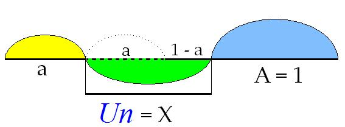
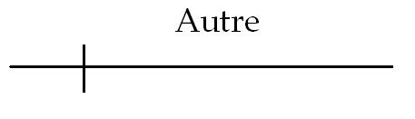

# Leçon 19 | 10 Mai 1967

<!-- source-url: http://staferla.free.fr/S14/S14 LOGIQUE.docx -->
<!-- seminar: s14 -->
<!-- lesson: 19 -->

<!-- id: s14-19-0001 -->

Je vais d’abord vous annoncer qu’à mon grand regret je ne ferai pas ce cours, ou ce *séminaire*, comme vous voudrez l’appeler, mercredi prochain. Pour la raison qu’il y a la grève, qu’après tout j’entends pour ma part la respecter, outre les incommodités que nous donnerait qu’on annonce que, toute électricité étant coupée, ce que je me donne tant de mal depuis de nombreuses séances pour faire fonctionner ici à votre bénéfice et au mien serait rendu inutile.

<!-- id: s14-19-0002 -->

Donc il faudra le réinscrire d’ici la fin de la séance, pour que les personnes qui arrivent en retard n’ignorent point qu’il n’y aura de prochain *séminaire* - puisqu’on l’appelle ainsi - que dans quinze jours. Nous som­mes, je crois, le l0 Mai, ça fait donc le 24.

<!-- id: s14-19-0003 -->

Rendez-vous au 24.

<!-- id: s14-19-0004 -->

Quelqu’un a-t-il quelque observation à me faire sur ce que je vous ai communiqué à la dernière séance ? Ou quelqu’un s’est-il fait quelque réflexion comportant spé­cialement - j’éclaire ma lanterne - ce que j’ai écrit au tableau ?

<!-- id: s14-19-0005 -->

Il ne semble pas… Et je ne sais pas si je dois ou non en respirer !… Est-ce à cause de la profonde distraction avec laquelle on reçoit ce que je peux inscrire ? Mais enfin je me suis fait, en rentrant chez moi, un sang d’encre, pour avoir écrit au tableau la formule de *petit(a)* bien sûr, (*–*1)/2, et puis, tout de suite après, la valeur de: 2,236… enfin, et quel­que chose.

<!-- id: s14-19-0006 -->

Puis je me suis livré à quelques plaisanteries sur la table des logarithmes. Mais j’aurais mieux fait de vous préciser, bien sûr, que ce que j’écrivais là n’était pas la valeur de *petit(a)*, mais de .

<!-- id: s14-19-0007 -->

Qu’on ne s’imagine pas que *petit(a)*, c’est *deux*, *virgule et quelque chose* ! Puisque au con­traire *petit(a)* est inférieur à l’unité. C’est un chiffre qui est un petit peu plus élevé que six dixièmes, ce qui n’est pas inutile à connaître pour quand vous voulez ins­crire ces longueurs ou ces lignes dont je me sers et mettre dans une proportion à peu près exacte la longueur du *petit(a)* à côté de la longueur définie pour équivaloir à l’unité.

<!-- id: s14-19-0008 -->

La seconde erreur que j’ai faite, c’est qu’à la suite d’une longue série d’égalités, nommément celle qui s’inscrit par : 1 + *a* / 1, par exemple, j’ai fini à la fin, par écrire : égale *petit(a)* , alors que c’était 1 qu’il fallait écrire. Bon, enfin… pour ceux qui ont copié ces formules, qu’ils les corrigent !

<!-- id: s14-19-0009 -->

Nous continuons de nous avancer dans notre objet de cette année et, bien sûr, cette *logique* que j’éla­bore devant vous sous le nom d’une *logique du fantasme,* à une fin que j’ai plusieurs fois définie et dont il faut bien qu’enfin elle vienne à s’appliquer.

<!-- id: s14-19-0010 -->

À s’appliquer à quel­que chose qui ne saurait être, bien-sûr, qu’une œuvre de criblage ou même à proprement parler de critique, contre ce qui est avancé à un certain niveau de l’expérience et sous une forme théorique qui, parfois, prête à défaut.

<!-- id: s14-19-0011 -->

Dans ce dessein, j’ai ouvert, ou plutôt rouvert, à votre usage, un ouvrage qui n’avait pas manqué de me pa­raître important au moment qu’il a surgi, et il est à vous tous accessible puisqu’il a été traduit en français sous le nom de *La névrose de base,* de quelqu’un qui assuré­ment ne manque ni de talent ni de pénétration analytique et qui s’appelle M. BERGLER[^85].

<!-- id: s14-19-0012 -->

C’est un ouvrage que je vous recommande - puisque vous allez avoir encore quinze jours devant vous - que je vous recommande à titre d’exemple, de support occasionnel de ce à quoi peut servir notre travail ici.

<!-- id: s14-19-0013 -->

En vous le recommandant *à titre d’exemple*, bien sûr, ce n’est pas vous le recommander à titre de mo­dèle…

<!-- id: s14-19-0014 -->

> c’est pourtant, comme je l’ai déjà dit, un ouvrage de grand mérite …ce n’est pas, certes, par ces voies que nous verrons d’aucune façon s’éclairer ce qu’il en est de la nature de la névrose, mais assurément ce n’est pas dire non plus qu’il ne soit pas là aperçu quelque ressort es­sentiel.

<!-- id: s14-19-0015 -->

Les notions de structure qui sont ici mises en avant…

<!-- id: s14-19-0016 -->

> et qui d’ailleurs, *au sens où j’emploie pour l’ins­tant ce* mot, ne sont pas le privilège de cet auteur …ce qui s’énonce d’habitude dans la notion de *couches*…

<!-- id: s14-19-0017 -->

> que pour la même raison on étage : superficiel ou profond, ou inversement : profond ou superficiel …celles nommément dont part l’auteur, à savoir que dans les cas qu’il envisage…

<!-- id: s14-19-0018 -->

> mais encore faut-il ajouter qu’il les considère de beaucoup comme les plus nombreux dans *la né­vrose* …les cas définis à son sens par ce qu’il appelle « *la régression orale* », se définissent par quelque chose qu’après tout je n’ai pas de raison, puisque c’est là ré­sumé en quelques lignes, de ne pas directement emprunter à son texte… Ce sera plus sûr  :

<!-- id: s14-19-0019 -->

« *Les névrosés oraux font surgir constamment la situa­tion du triple mécanisme de l’oralité que voici :* *Premièrement : je me créerai le désir masochique d’être rejeté par ma mère*… »

<!-- id: s14-19-0020 -->

Que quelqu’un écrive \[au tableau\] :

<!-- id: s14-19-0021 -->

1)  « *être rejeté* »*,* tout à fait dans le coin, en haut à droite.

<!-- id: s14-19-0022 -->

Muriel ? Si vous voulez bien, vous me rendrez ce ser­vice. Prenez ces gros machins \[les marqueurs\] qui sont là pour ça.

<!-- id: s14-19-0023 -->

> « *Deuxièmement : je ne serai pas*...Je finis le premier paragraphe - *je me créerai le désir masochique* - donc - *d’être rejeté par ma mère,*
>
> *en créant ou déformant des situations dans lesquelles quelque substitut de l’image préœdipienne de ma mère refusera mes désirs.* »

<!-- id: s14-19-0024 -->

Ceci est *la couche* la plus profonde, celle dont l’accès est le plus difficile, celle contre la révélation de laquelle le sujet se défendra le plus fortement et le plus longtemps. Je dis ceci pour les auditeurs les plus novices de cette salle.

<!-- id: s14-19-0025 -->

« *Deuxièmement : je ne serai pas conscient de mon désir d’être rejeté et de ce que je suis l’auteur de ce rejet. Je verrai seulement que j’ai raison* *de me défendre, que mon indi­gnation est bien justifiée, ainsi que la pseudo-agressivité que je témoigne en face de ces refus.* »

<!-- id: s14-19-0026 -->

2)  *Pseudo-agressivité.*

<!-- id: s14-19-0027 -->

Écrivez \[au tableau\] seulement ces mots, s’il vous plaît.

<!-- id: s14-19-0028 -->

« *Troisièmement, après quoi je m’apitoierai sur moi-même en raison de ce qu’une « telle injustice » -* entre guillemets - *ne peut arriver qu’à moi et je jouirai, une fois de plus, d’un plaisir masochique.* »

<!-- id: s14-19-0029 -->

Je passe sur ce que BERGLER y ajoute, ce qu’il appelle « *le point de vue clinique* », singulière différencia­tion d’ailleurs qu’il fait entre ceci qu’il considère com­me résumant la genèse du trouble - *l’élément génétique* - et cette forme ou aspect *clinique* se définissant pour lui par l’intervention d’un *surmoi*, dont *la vigilance* consiste pré­cisément à maintenir la présence de l’élément qu’ici il désigne comme *masochique*, comme élément toujours *actif* dans le maintien de la défense.

<!-- id: s14-19-0030 -->

Ce second point de vue est en lui-même à discuter, et je ne le ferai pas aujourd’hui.

<!-- id: s14-19-0031 -->

Ce qu’aujourd’hui, sur ce sujet, j’avance est ceci : que nulle part n’est articu­lé en quoi ceci…

<!-- id: s14-19-0032 -->

> qui, au reste, est juste : que dans la posi­tion orale le sujet, disons veut être refusé …pourquoi il n’est pas vrai de dire que la pulsion orale consiste à vouloir obtenir, nommément le sein.

<!-- id: s14-19-0033 -->

Si l’observation est fondée dans sa *position radicale*, dans nul point de ce travail de BERGLER il n’est de quelque façon rendu compte de ce que ceci veut dire au regard d’une pulsion définie comme orale, et pourquoi - en quelque sorte au départ - ce qui en semble la tendance disons *naturelle* est ainsi ren­versé. Point pourtant important en ceci que, précisément, c’est de sa position naturelle que le sujet arguera pour soutenir cette *agressivité* que BERGLER, *très justement*, dénomme « *pseudo* », car ce n’en est pas une.

<!-- id: s14-19-0034 -->

Ceci bien sûr, laissant ouvert ce dont il s’agit au niveau d’une *agressi­vité* qui ne serait pas « *pseudo* ».

<!-- id: s14-19-0035 -->

Comme sur ce sujet j’ai introduit un registre qui est à proprement parler celui du narcissisme…

<!-- id: s14-19-0036 -->

> équiva­lent à ce que, dans la théorie ordinairement reçue, on ap­pelle « *narcissisme secondaire* » …comme j’y ai mis l’agres­sivité comme étant sa dimension constitutive et comme distincte, à ce titre, de la pure et simple agression, nous nous trouvons là dans un éventail de notions :

<!-- id: s14-19-0037 -->

- depuis celle, brute, d’agression, qui ne convient en presque aucun cas,

<!-- id: s14-19-0038 -->

- quand il s’agit de phénomène névrotique : celui d’agres­sivité narcissique,

<!-- id: s14-19-0039 -->

- enfin de cette pseudo-agressivité que spécifie BERGLER comme ressortant, à un certain niveau, de la névrose orale.

<!-- id: s14-19-0040 -->

Je pointe simplement ces distinctions, sans leur donner pour l’instant leur développement complet.

<!-- id: s14-19-0041 -->

Quoi qu’il en soit, la question se pose de ce qu’il convient de maintenir comme le statut, jusqu’à présent dé­fini comme « *agressif* », d’un certain temps de la pulsion ora­le et pourquoi, dans la névrose orale, cet accent de l’« *être refusé* » est posé par BERGLER comme étant le plus radical.

<!-- id: s14-19-0042 -->

La seule portée de ma remarque n’est pas d’en *trancher* quant aux faits…

<!-- id: s14-19-0043 -->

> outre que bien sûr d’en trancher impli­querait de chercher de quoi il parle, *à savoir de quelle névrose, de quel moment de son abord* …mais de ceci, qui manque dans un texte théorique, à savoir s’il n’y avait pas à se pencher, précisément ici, au point où les choses s’arrêtent, à savoir sur ce que veut dire et pourquoi est pertinent le terme « *être refusé* » :

<!-- id: s14-19-0044 -->

- « *être refusé* » suggère quelque suspens questionnant.

<!-- id: s14-19-0045 -->

- « *être refusé* » à quel titre ?

<!-- id: s14-19-0046 -->

- « *être refusé* » en tant que quoi ?

<!-- id: s14-19-0047 -->

Ce n’est tout de même pas pour nous - à le suppo­ser au seuil de la théorie analytique - chose nouvelle que ce qui se passe quand nous nous présentons dans une relation, par exemple, que l’on qualifiera d’« *intersubjective* ».

<!-- id: s14-19-0048 -->

Vous sa­vez qu’à cet égard, ce qui a pu être avancé dans un certain mode de pensée, qui est celui - *hégélien* - dont SARTRE lui­-même, détachant un rameau, a mis en valeur l’accent qu’à un certain niveau il peut prendre : celui qui a été qualifié d’« *exclusion radicale et mutuelle des consciences* », du carac­tère *incompatible* de leur coexistence, de cet « *ou lui ou moi* » qui surgirait dès qu’à proprement parler apparaît la dimen­sion du *sujet*.

<!-- id: s14-19-0049 -->

C’est assez dire aussi, combien ce relief tombe sous la portée des critiques qu’on peut avancer contre la genèse initialement prise dans « *la lutte à mort* », *« lutte à mort » qui prend son statut de cette conception radicale du sujet comme absolument autonome, comme Selbstbewusstsein**.***

<!-- id: s14-19-0050 -->

Est-ce de quelque chose de cet ordre qu’il s’agit ? Il ne semble assurément pas, puisque tout ce que nous appor­te l’expérience analytique concernant le *stade* dit *oral* y fait intervenir de bien autres dimensions*,* et nommément, cette dimension *corporelle* de l’*agressivité orale*, du besoin de mordre et de la peur d’être dévoré.

<!-- id: s14-19-0051 -->

L’« *être refusé* » donc, est-il à prendre dans cette occasion comme concernant l’objet ? À la vérité, on en ver­rait facilement pointer la justification en ceci : qu’« *être refusé* » serait, dans ce registre, à proprement parler, se sauver soi-même de l’engloutissement du partenaire mater­nel. Ce serait peut-être aussi un peu trop simple que de répondre ainsi à la question du statut de l’« *être refusé* ».

<!-- id: s14-19-0052 -->

Et dire que c’est *trop simple* est suffisamment souli­gné par ceci - ceci deux fois répété dans les lignes que je viens de vous lire, de BERGLER - qui associe à cette névrose orale, comme lui étant essentielle, la dimension du *masochisme*.

<!-- id: s14-19-0053 -->

L’« *être refusé* » en question est un refus *de défaite*, est un « *refus humiliant* », écrit encore ailleurs l’auteur, et c’est en ceci qu’il se permet d’introduire l’étiquette de *masochisme*, qu’il qualifie de « *masochisme psychique* » en l’occasion. Consacrant en quelque sorte *un usage vulgaire* du terme de *masochisme*, dont je ne dis pas qu’il n’y ait pas, dans tel texte de FREUD, prétexte à l’introduire, mais qui, étendu et pris dans cet usage où il est maintenant de plus en plus courant, est à propre­ment parler ruineux. L’allusion à la référence à l’*objet*, au niveau de ce refus, est là seulement ce qui pourrait justifier l’in­troduction de *la dimension du* *masochisme* à ce niveau.

<!-- id: s14-19-0054 -->

Il est inexact de dire que ce qui caractérise *le masochisme*, c’est le côté pénible, assumé comme tel, dans une situation.

<!-- id: s14-19-0055 -->

Aborder les choses sous cet angle aboutit à cet abus de faire - certains le font - de la di­mension *sadomasochisme*, le registre essentiel, par ex­emple, de toute la relation analytique. Il y a là une vé­ritable perversion, autant de la pensée de FREUD que de la théorie et de la pratique. Et ceci est à proprement parler insoutenable, tant la dimension du *masochisme* est définie précisément, sans doute par le fait que le su­jet assume une position d’« *objet* », au sens le plus accentué que nous donnons au mot « *objet* »*,* pour le définir comme cet *effet de chute et de déchet, de reste de l’avènement sub­jectif*.

<!-- id: s14-19-0056 -->

Le fait que le masochiste instaure une situation réglée à l’avance et réglée dans ses détails, qui peut aller jusqu’à le faire séjourner sous une table, dans la position du chien : ceci fait partie d’une *mise en scène*, d’un *scénario*, qui a son sens et son bénéfice et qui, in­contestablement, est au principe d’un bénéfice de *jouis­sance*, quelque note que nous puissions y ajouter ou non, concernant le maintien, le respect et l’intégrité du *prin­cipe de plaisir*.

<!-- id: s14-19-0057 -->

*Que cette jouis­sance soit étroitement liée à* *une manœuvre de l’Autre* dirai-je, qui s’exprime le plus com­munément sous la forme du contrat…

<!-- id: s14-19-0058 -->

> quand je dis « du contrat », je dis : du *contrat écrit* …de quelque chose qui dicte tout autant à l’Autre - *et bien plus encore à l’Autre qu’au masochiste lui-même* - toute sa conduite.

<!-- id: s14-19-0059 -->

C’est ceci qui doit nous instruire, concernant le rapport qui donne sa spécificité, son originalité, à la perversion masochique, qui est hautement faite pour nous éclairer jusqu’en son fonds, sur la part qu’y joue l’Autre au sens où j’en­tends ce terme. J’entends :

<!-- id: s14-19-0060 -->

- l’Autre avec un grand A,

<!-- id: s14-19-0061 -->

- l’Autre : *lieu où se déploie*, dans l’occasion une parole qui est *une parole de contrat*.

<!-- id: s14-19-0062 -->

Réduire l’usage du terme « *masochique* », après cela, à être quelque chose qui se présente comme simplement une exception, une aberration, à l’accès du plaisir le plus simple, est quelque chose de nature à engendrer tous les abus.

<!-- id: s14-19-0063 -->

Dont le premier – *dont le premier !* – est ceci, pour le­quel, mon Dieu, je ne croirai pas employer un terme trop fort ni inapproprié en relevant dans les lignes de BERGLER - d’un bout à l’autre de ce livre remarquable, rempli d’ob­servations très fouillées et toutes très instructives - de relever pourtant ce *quelque chose* que j’appellerai « *une exas­pération* » qui n’est pas loin de réaliser *une attitude méchan­te* *à l’égard du malade*, tous ces gens qu’il appelle - qu’il appelle, comme si c’était là un grand tort de leur part - « *collectionneurs d’injustices* » !

<!-- id: s14-19-0064 -->

Comme si, après tout, nous étions dans un monde où la justice soit un état si ordinai­re qu’il faille vraiment y mettre du sien pour avoir à se plaindre de quelque chose !

<!-- id: s14-19-0065 -->

Ces *collectionneurs d’injustices* chez qui assurément il décèle leur opération la plus secrète dans le fait d’être rejetés. Mais après tout, ne pouvons-nous pas nous-mêmes émettre, contre BERGLER, cette idée que dans certains cas après tout, être rejeté…

<!-- id: s14-19-0066 -->

> comme nous l’avons d’ailleurs suffisamment montré… dans les fantas­mes c’est autre chose : je parle ici de la réalité …il vaut peut-être mieux, de temps en temps, être rejeté qu’être accepté trop vite ! La rencontre qu’on peut faire avec telle ou telle personne qui ne demande qu’à vous adop­ter, n’est pas toujours… la meilleure solution n’est pas toujours de ne pas y échapper !

<!-- id: s14-19-0067 -->

Pourquoi cette partialité qui, en quelque sorte, implique une sereine… qu’il serait dans l’ordre, dans *la nature des cho­ses, dans leur bonne pente,* de faire toujours tout ce qu’il faut pour être admis ? Ceci supposant qu’« *être admis* » est toujours être *admis à une table bienfaisante*. Ceci assurément, n’est pas sans être de nature inquiétante et ne pas nous paraître à l’occasion à pointer, pour remarquer que telle ou telle chose qui peut se passer dans le monde, et par exemple, tout simplement pour l’ins­tant dans un certain petit district de l’Asie du Sud-Ouest, c’est que… de quoi s’agit-il ?

<!-- id: s14-19-0068 -->

Il s’agit de convaincre certaines gens qu’ils ont bien tort de ne pas vouloir être admis aux bienfaits du capitalisme ! Ils préfèrent être rejetés ! C’est à partir de ce moment-là, semble-t-il, que devraient se poser les questions sur certaines significations. Et nommément celle-ci par exemple, qui nous montrerait…

<!-- id: s14-19-0069 -->

> qui nous montrerait sans doute, mais ce n’est pas aujourd’hui que je ferai dans cette direction, même les premiers pas …*que si Freud a écrit quelque part que « l’anatomie c’est le destin », il y a peut-être un moment où, quand on sera reve­nu à une saine perception de ce que Freud nous a découvert, on dira - je ne dis même pas que « la politique c’est l’incons­cient » - mais, tout simplement : <u>l’inconscient c’est la politi­que</u> !*

<!-- id: s14-19-0070 -->

*Je veux dire que ce qui lie les hommes entre eux, ce qui les oppose, est précisément à motiver de ce dont nous essayons pour l’instant d’articuler la logique.*

<!-- id: s14-19-0071 -->

Car c’est faute de cette articulation logique que ces glissements peuvent se produire, qui font qu’avant de s’apercevoir de ce que pour être rejeté - pour qu’« *être re­jeté* » soit essentiel comme dimension pour le névrotique - il faut en tout cas ceci : qu’*il s’offre*.

<!-- id: s14-19-0072 -->

Comme je l’ai écrit quelque part : aussi bien le névrotique que ce que nous faisons nous-mêmes, et pour cause, puisque ce sont ces chemins que nous suivons, ça consiste précisément, avec de l’offre, à essayer de faire de la demande, et que bien entendu une telle opération, ni dans la névrose, ni non plus dans la cure analytique, ne réussit pas toujours, surtout si elle est *conduite* maladroitement.

<!-- id: s14-19-0073 -->

### Ceci aussi, d’ailleurs est de nature…

<!-- id: s14-19-0074 -->

> car nul discours analytique n’est sans présenter pour nous l’occa­sion - l’interrogeant - l’occasion de nous apercevoir
>
> de ce qu’il implique dans un certain cours innocent, où il ne sait jamais lui-même - je dis : ce discours analytique –
>
> jusqu’où il va dans ce qu’il *articule* …ceci nous permet­trait de nous apercevoir, en effet, que si la clef de la position névrotique tient à ce rapport étroit à *la demande* de l’Autre, en tant qu’il \[le névrotique\] essaie de la faire surgir, c’est bien, comme je le disais à l’instant, parce que lui *s’of­fre* et que du même coup nous voyons là le caractère fan­tasmatique et donc caduc de ce mythe, de ce mythe introduit par la prêcherie analytique, et qui s’appelle *l’oblativité*. C’est un mythe de névrosé.

<!-- id: s14-19-0075 -->

Mais qu’est-ce qui motive ces besoins qui s’expri­ment dans ces biais paradoxaux, et toujours si mal définis

<!-- id: s14-19-0076 -->

- si on les rapporte purement et simplement au bénéfice - re­cueilli ou non à leur suite - de la réalité,

<!-- id: s14-19-0077 -->

- si on omet cette première étape essentielle et à la lumière seule de laquelle - je dis : l’étape - ce qui ressort de ses résultats dans le réel peut se juger ?

<!-- id: s14-19-0078 -->

C’est l’articulation logique de la position, névrotique dans le cas présent, et aussi bien de toutes les autres.

<!-- id: s14-19-0079 -->

Sans une articulation logique qui ne fait pas intervenir aucun préjugé de ce qui est à souhaiter pour le sujet : qu’en savez-vous ?

<!-- id: s14-19-0080 -->

- Qu’en savez-vous, si le besoin… si le sujet a besoin de se marier avec telle ou telle ?

<!-- -->

<!-- id: s14-19-0081 -->

- Et s’il a loupé son mariage à tel détour, si ce n’est pas pour lui, une veine ?

<!-- id: s14-19-0082 -->

- De quoi vous mêlez-vous, autrement dit ?

<!-- id: s14-19-0083 -->

Alors que la seule chose à quoi vous ayez affaire, c’est la structure logique de ce dont il s’agit, de ce dont il s’agit nommément dans le cas d’une position comme celle qu’on pourra qualifier du *désir d’être rejeté*. Vous avez d’abord à savoir ce que le sujet, à ce niveau, poursuit : quel est pour le névrotique la nécessité et le bienfait peut-être, qu’il y a à être rejeté?

<!-- id: s14-19-0084 -->

Et y épingler, de sur­plus, le terme de *masochique* est simplement, dans l’occasion, y introduire une note péjorative, qui est immédiatement sui­vie - comme je l’avais marqué tout à l’heure - d’une attitude directive de l’analyste qui peut, à l’occasion, aller jusqu’à devenir persécutive.

<!-- id: s14-19-0085 -->

Voilà pourquoi il est tout à fait nécessaire de re­prendre les choses comme j’entends le faire cette année et, puisque nous y sommes, de rappeler que si je suis parti cette année de *l’acte sexuel* dans sa structure d’*acte*, c’est en relation à ceci : que *le sujet ne vient au jour* *que par le rapport d’un signifiant à un autre signifiant* et que ceci en exige - je veux dire de ces signifiants - le *matériel. Faire un acte,* *c’est introduire ce rapport de signi­fiants par quoi la conjoncture est consacrée comme signifi­cative*, c’est-à-dire comme une *occasion* *de penser.*

<!-- id: s14-19-0086 -->

On met l’accent sur la maîtrise de la situation, parce qu’on imagine que c’est la volonté qui préside au *fort-da,* par exemple - fameux - du jeu de l’enfant. Ce n’est pas le côté actif de la motricité qui est là la dimension essentielle. Le côté actif de la motricité ne se déploie ici, que dans la dimension du jeu, *j.e.u.*

<!-- id: s14-19-0087 -->

C’est sa struc­ture logique qui distingue cette apparition du *fort-da,* pris pour exemplaire et devenu maintenant un « bateau ».

<!-- id: s14-19-0088 -->

C’est parce que c’est la première *thématisation signifiante* - sous for­me d’opposition phonématique - d’une certaine situation, qu’on peut qualifier *d’active*, mais seulement au sens ou désormais nous ne l’appellerons « *active* » que s’il y a, au sens où je l’ai définie, la structure de *l’acte*, la mise en question de *l’acte* dans cette relation si distordue : ça c’est exclu, mis à l’ombre !

<!-- id: s14-19-0089 -->

Quelle est la re­lation entre deux êtres appartenant à deux classes, qui sont définitives pour l’état civil et pour le conseil de révision, mais que précisément notre expérience nous a appris à voir, pour n’être absolument plus évidentes pour la vie fami­liale par exemple, et assez brouillées pour la vie secrète, …autrement dit ce qui définit l’homme et la femme.

<!-- id: s14-19-0090 -->

C’est la théorie, c’est l’expérience analytique, qui apportent ici la notion de « *satisfaction* ». Je veux dire comme essentiel­le à cet acte. *Satisfaction* - dans le texte de FREUD, *Befriedigung -* qui introduit la notion d’une paix survenant. Cette satisfaction est-elle la satisfaction de la décharge, de la détumescence ? Satisfaction simple en apparence et tout à fait propre à être reçue.

<!-- id: s14-19-0091 -->

Néanmoins, il est clair que *tout ce que nous développons* - en termes plus ou moins propres ou impropres - *implique que la satisfaction*…

<!-- id: s14-19-0092 -->

> puisque nous dis­tinguons celle, par exemple, qui serait de l’ordre *prégéni­tal* de celle qui est *génitale* …implique une autre dimension : celle impliquée même par cette différence. Qu’assurément d’abord, un terme comme celui de « *re­lation d’objet* » se soit ici imposé, va de soi. Ce qui n’ôte rien au caractère bouffon de ce qui se passe quand on essaie d’inscrire sous ce terme, de le varier, de l’échelon­ner, selon le plus ou moins d’aise où s’inscrit la relation.

<!-- id: s14-19-0093 -->

Car il ne s’agit de rien d’autre quand on distingue la rela­tion génitale par ces deux traits :

<!-- id: s14-19-0094 -->

- d’une part, la prétendue « *tendresse* » qu’on pourrait facilement, aisément - je me targue de le faire - soutenir qu’elle n’est en aucun cas que la réversion d’un mépris,

<!-- id: s14-19-0095 -->

- et d’autre part, ce qu’on y accentue de la *prétendue* essence de la rupture, voir du deuil.

<!-- id: s14-19-0096 -->

### Ainsi, le progrès de la relation - j’entends : la « *relation sexuel­le* », entre guillemets - en tant qu’elle deviendrait *géni­tale*, 

<!-- id: s14-19-0097 -->

### serait qu’on aurait d’autant plus d’aise à penser du partenaire : « *Tu peux crever* » !

<!-- id: s14-19-0098 -->

Reprenons les choses d’un autre plan de certitude : à quoi l’acte sexuel satisfait-il ? Il est bien évident d’abord, qu’on peut répondre, et légitimement, simplement : au plaisir. Je ne connais qu’un seul registre où cette réponse soit pleinement tena­ble : c’est un plan ascétique, qui est tenu dans l’histoire par DIOGÈNE, qui fait *le geste public de la masturbation*, comme le signe de cette *affirmation théorique d’un hédonis­me* dit - en raison même de ce mode de manifestation - « *cyni­que* » et qu’on peut considérer comme un *traitement*, *Behandlung,* un traitement médical du désir : il n’est pas sans *se payer d’un certain prix*.

<!-- id: s14-19-0099 -->

Puisque tout à l’heure j’ai introduit la dimension politi­que – chose curieuse et tout à fait sensible : ce *type phi­losophique* s’exclut lui-même, comme il se voit non pas seu­lement aux anecdotes mais à la position du personnage dans son tonneau - eût-il un visiteur comme ALEXANDRE - qui se paie d’une *exclusion* de la dimension de la cité. Je le répète : il y a là quelque chose dont on au­rait tort de sourire, c’est une face à proprement parler ascétique, un mode de vivre. Il n’est probablement pas si courant qu’il parait.

<!-- id: s14-19-0100 -->

Je ne peux rien en dire : je n’ai pas essayé.

<!-- id: s14-19-0101 -->

- *Oh ! S’exclame-t-on au fond de la salle.*

<!-- id: s14-19-0102 -->

- *Vous entendez ou pas ? Vous n’entendez pas ? Alors à quoi ça sert tout ces machins ?* \[Lacan désigne le matériel de sonorisation\]

<!-- id: s14-19-0103 -->

- *Oh, tout de même ! Dit-on encore.* \[Rires\]

<!-- id: s14-19-0104 -->

Donc, il ne faudra pas oublier ce lieu du plaisir, de la moindre… tension. Bon. Seulement il est clair qu’il n’est pas suffisant ce lieu, que bien d’autres *mo­des*, qu’une très grande variété de *modes,* apparaissent, de satisfaction au niveau de la recherche impliquée par l’acte sexuel. Notre thèse - *celle à laquelle donne corps le cours de cette* *année* - est ceci : de *l’impossibilité de saisir l’ensemble de ces modes*, en dehors d’une scruta­tion logique, seule capable de rassembler, dans la varié­té comme dans l’ampleur, les différents modes de cette satisfaction. L’ensemble dont il s’agit qui instaure ce que nous appellerons ­- provisoirement et sous réserve - *un être masculin et* *un être féminin*, dans cet acte fondateur que nous avons évoqué au départ de notre discours de cette année, en l’appelant l’acte sexuel.

<!-- id: s14-19-0105 -->

Si j’ai dit qu’« *il n’y a pas d’acte sexuel* » c’est au sens où cet acte conjoindrait, sous une forme de répartition simple, celle qu’évoque dans *la technique* - par exemple dans les techniques usuelles, dans celle du serrurier - l’appellation de « *pièce mâle* » ou de « *pièce femelle* ». Cette répartition simple constituant le pacte, inaugural, par où la subjectivité s’engen­drerait comme telle : mâle ou femelle.

<!-- id: s14-19-0106 -->

J’ai fait état, en son temps et en son lieu, du fameux « *Tu es ma femme* ». Eh bien, il est tout à fait clair qu’il ne suffit pas que je le dise pour que je reste son homme. Mais enfin, cela suffirait-il, que ça ne résoudrait rien ! Je me fonde comme « *<u>son</u> quelque chose* ».

<!-- id: s14-19-0107 -->

C’est un vœu d’appartenance qui est gros d’un *pacte*, au minimum d’un pacte de préférence.

<!-- id: s14-19-0108 -->

Ça ne situe absolument rien ni de *l’homme* ni de *la femme*. Tout au plus peut-on dire que ce sont deux termes opposés et qu’il est indispensable qu’il y en ait deux, mais ce qu’est chacun, ou aucun, est tout à fait exclu du fondement dans la parole.

<!-- id: s14-19-0109 -->

Quant à ce qui est de l’union, matrimoniale si vous voulez, ou de tout autre : qu’une certaine dimension la porte jusqu’à la dimension de sacrement ne change absolument rien… absolument rien à ce dont il s’agit, à savoir : de *l’être de l’homme* ou de *la femme*.

<!-- id: s14-19-0110 -->

Ça laisse en particulier si complètement à coté la catégorie de la féminité - puisque j’ai pris l’exemple du « *Tu es ma femme* » - qu’il n’est jamais mauvais de *rapporter* à cet exemple qui est celui du maître même de la psychanalyse, dont on peut dire que pour lui ce pacte a été extraordinairement prévalant…

<!-- id: s14-19-0111 -->

> *la chose a frappé tous ceux qui l’ont approché : uxorious*[^86] *comme on dit en anglais, uxorieux, ainsi le qualifie Jones, après tant d’autres* …mais dont après tout ce n’est pas un mystère non plus que *sa pensée a buté* jusqu’à la fin sur le thème : « *Que veut une femme ?* »

<!-- id: s14-19-0112 -->

Ce qui revient à dire : « *Qu’est-ce qu’être une femme ?* »

<!-- id: s14-19-0113 -->

Il faut vous ajouter que depuis, 67 ans de… *surgery psychanalytique* n’ont pas fait que nous en sachions plus sur ce qu’il en est de la jouissance féminine, quoique de la femme ou de la mère - on ne sait pas trop comment ça s’exprime - nous parlions sans arrêt.

<!-- id: s14-19-0114 -->

C’est quand même *quelque chose* qui vaut qu’on le relève.

<!-- id: s14-19-0115 -->

C’est pourquoi il est important de s’apercevoir… *et ce schéma heuristique que je vous ai donné sous la for­me de ces trois lignes* : du *petit(a)*, du *Un* qui suit - du *Un percé*, et de *l’Autre*, …nous rappelle simplement ceci qui est la monnaie de ce que nous articulons à cours de jour­née, à savoir que l’acte sexuel implique un élément tiers à tous les niveaux.

<!-- id: s14-19-0116 -->

<!-- id: s14-19-0117 -->

À savoir, par exemple :

<!-- id: s14-19-0118 -->

- ce qu’on appelle *la mère*, la mère dans l’œdipe sur laquelle sont accrochés tous les ravalements de la vie amoureuse, en tout cas qui reste toujours présente dans le désir de ce fait

<!-- id: s14-19-0119 -->

- ou encore *le phallus en tant qu’il doit manquer à celui qui l’a*, c’est-à-dire à l’homme, en tant que *le complexe de castration* veut dire quelque chose, quelque chose qui n’est pas du tout encore mis au jour, puisqu’il implique que nous inventions à son propos la portée d’une négation spéciale : car enfin, s’il ne l’a pas - dans le registre et pour autant que l’acte sexuel peut exister - ça n’est pas dire pour autant non plus qu’il le perde (*Le sujet de cette négation*, j’espère, pourra être abordé avant la fin de cette année), que ce *phallus*, d’autre part, devient l’être du partenaire qui ne l’a pas.

<!-- id: s14-19-0120 -->

C’est ici que nous trouvons sans doute la raison pourquoi ARISTOTE, comme je l’ai rappelé la dernière fois, si soumis à la grammaire - *paraît-il, nous dit-on* - qu’il fût, a développé l’éventail, la liste, le catalogue des *Catégories *: curieusement, après avoir tout dit : *la qualité* \[ποιον : poion\], *la quantité* \[ποσον : poson\], *le* ποτε \[pote : quand\], *le* που \[pou : où\], *le* το τι \[to ti\], et tout ce qui suit dans la baraque, n’a absolument pas soufflé…

<!-- id: s14-19-0121 -->

> encore que la langue grecque comme la nôtre soit abso­lument soumise à ce que PICHON appelle la « *sexuisemblance* » , à savoir qu’il y a *le fauteuil* et qu’il y a *la photo…* comme d’ailleurs - tenez - en passant amusez-vous à renverser l’orthographe, ça vous instruira beaucoup sur une di­mension tout à fait dissimulée de la relation analytique :
>
> *le photeuil (p,h,o)* et *la fauto* (*f,a,u*), c’est très amu­sant …enfin, quoi qu’il en soit, ARISTOTE n’a jamais songé à soutenir à propos d’aucun *étant* - ce qui tout de même s’imposait tout autant de son temps que du nôtre - de savoir s’il y avait une catégorie du sexe.

<!-- id: s14-19-0122 -->

De deux choses l’une :

<!-- id: s14-19-0123 -->

- ou il n’était pas autant qu’on le dit guidé par la grammaire,

<!-- id: s14-19-0124 -->

- ou bien il y a à cela alors, à cette omission, quelque raison.

<!-- id: s14-19-0125 -->

Elle est probablement liée à ceci : quand j’ai parlé, tout à l’heu­re *d’être masculin* ou *d’être féminin*, il y avait là un emploi fautif, à savoir que peut-être, l’être est-il - comme s’exprime encore PICHON - « insexuable », que le το τί \[to ti\], la quiddité du sexe est peut-être manquante, qu’il n’y a peut-être que *le phallus*. Cela expliquerait en tout cas bien des choses.

<!-- id: s14-19-0126 -->

*En particulier cette lutte sauvage* qui s’établit autour et qui nous donne assurément la raison visible, sinon dernière, de ce qu’on appelle « *la lutte des sexes* » ! Seulement, je crois aussi, là encore, que *la lutte des sexes* est quelque chose auquel d’ailleurs l’Histoire démontre que ce sont les psychana­lystes les plus superficiels qui se sont arrêtés.

<!-- id: s14-19-0127 -->

Néanmoins, il reste qu’une certaine ἀλήθηια \[alétheia\]…

<!-- id: s14-19-0128 -->

> à prendre dans ce sens-là, avec l’accent de *Verborgenheit* \[*secret*\] que lui donne HEIDEGGER …peut être, à proprement parler, à instaurer quant à ce dont il s’agit concernant l’acte sexuel.

<!-- id: s14-19-0129 -->

C’est ceci qui justifie l’emploi par moi de ce *schème*, qui je le souligne en passant pour ne pas faire de confusion avec d’autres choses que j’ai dites dans d’au­tres circonstances et nommément concernant la structure et la fonction de la coupure…

<!-- id: s14-19-0130 -->

> dont je vous ai dit parfois que, telle que je la symbolise quand je la fais jouer sur ce qu’on appelle « *le plan projectif* »
>
> je prétends non pas *faire une métaphore,* mais à proprement parler, *parler du support réel* de ce dont il s’agit …il n’en est bien entendu pas de même dans ce très simple petit schème :

<!-- id: s14-19-0131 -->

- de ce *Un*, que j’ai fait la dernière fois, « *pointillé* » et « *perforé* »,

<!-- id: s14-19-0132 -->

- de cet *Autre*,

<!-- id: s14-19-0133 -->

- et de ce *petit(a)*.

<!-- id: s14-19-0134 -->

<!-- id: s14-19-0135 -->

C’est cette triplicité très simple, *autour* de laquelle peut et doit se développer un certain nombre de *points* que nous avons à mettre en relief à ce propos, con­cernant ce qu’il en est de ce qui se rapporte au *sexe*, tout ce qui est du *symptôme*, et dont cette année, j’entends poser, certes d’une façon répétée et je ne saurais trop répéter les choses quand il s’agit de catégories nouvelles, répé­ter ce qui va nous servir de base.

<!-- id: s14-19-0136 -->

Le *Un*, pour commencer par le milieu, est le plus litigieux. Le *Un* concerne cette prétendue union sexuelle, c’est-à-dire le champ où il est mis en question de savoir si peut se produire l’acte de partition que nécessiterait la répartition des fonctions définies comme « *mâle* » et « *femelle* ».

<!-- id: s14-19-0137 -->

Nous avons dit déjà, avec la métaphore du chaudron, que j’ai rappelée la dernière fois, qu’il y a - *en tout cas ici, provisoirement* - quelque chose que nous pouvons dési­gner de la présence d’un *gap,* d’un *trou* si vous voulez. *Il y a quelque chose qui ne colle pas*, qui ne va pas de soi et qui est précisément ce que je rappelais tout à l’heure de l’abîme qui sépare toute promotion, toute proclamation de la bipolarité mâle et femelle, de tout ce que nous donne *l’expérience* concernant l’acte qui la fonde.

<!-- id: s14-19-0138 -->

Je veux dire ici, pour aujourd’hui, dans le temps qui m’est imparti ce midi, que c’est de là, de ce champ *Un*, *de ce Un fictif*, de ce *Un* auquel se cramponne toute une théorie analytique dont vous m’avez entendu les dernières fois, à maintes reprises, dénoncer la fallace, il importe de poser que c’est de là, de ce *champ* désigné *Un*, numéroté *Un*, non assumé comme unifiant - au moins jusqu’à ce que nous en ayons fait la preuve, que *c’est de là que parle toute vérité.*

<!-- id: s14-19-0139 -->

En tant que pour nous analystes…

<!-- id: s14-19-0140 -->

> et pour bien d’autres, avant même que nous soyons apparus - quoique pas bien longtemps - pour une pensée qui date de ce que nous pouvons appeler de son nom après tout : le tournant marxiste …*la véri­té n’a pas d’autre forme que le symptôme*. *Le symptôme, c’est-à-dire la signifiance des discordances entre le réel et ce pour quoi il se donne*.

<!-- id: s14-19-0141 -->

L’idéolo­gie si vous voulez, à une condition : c’est que pour ce terme, vous alliez jusqu’à y inclure la perception elle-même.

<!-- id: s14-19-0142 -->

*La perception c’est le modèle de l’idéologie*. Puisque c’est un crible par rapport à la réalité. Et d’ailleurs, pourquoi s’en étonner ?

<!-- id: s14-19-0143 -->

Tout ce qui existe d’idéologies, depuis que le monde est plein de philosophes, ne s’est après tout jamais construit que sur une réflexion première, qui portait sur la perception.

<!-- id: s14-19-0144 -->

J’y reviens : ce que FREUD appelle « *le fleuve de boue* », concernant le plus vaste champ de la connaissance, toute *cette part* *de la connaissance* absolument inondante *dont nous émergeons à peine*, pour l’épingler du terme de *connaissance mystique* : à la base de tout ce qui s’est manifesté au monde de cet ordre : qu’*il n’y a que l’acte sexuel.* Envers de ma formule : *il n’y a pas* *d’acte sexuel.*

<!-- id: s14-19-0145 -->

La position freudienne, il est tout à fait superflu de prétendre s’y rapporter en quoi que ce soit, si ce n’est pas *prendre à la lettre* ceci : à la base de tout ce qu’a apporté jusqu’à présent - mon Dieu - de satisfaction, la connaissance…

<!-- id: s14-19-0146 -->

> je dis : *la connaissance,* je l’ai épinglée *mystique* pour *la distinguer* de ce qui est né de nos jours sous la forme de *la science* *…*de tout ce qui est de la connaissance, il n’y a, à son principe, *que* l’acte sexuel.

<!-- id: s14-19-0147 -->

Lire dans FREUD, qu’il y a dans le psychisme des fonctions désexualisées*,* ça veut dire - dans FREUD - qu’il faut chercher le sexe à leur origine. Ça ne veut pas dire qu’il y a ce qu’on appelle en tels lieux, pour des besoins politiques, la fameuse « *sphère non conflictuelle* », par exemple : un *moi* plus ou moins fort, plus ou moins « *autonome* », qui pourrait avoir une appréhension plus ou moins aseptique de la réalité.

<!-- id: s14-19-0148 -->

Dire qu’il y a des rapports à *la vérité* - je dis *la vérité* - que l’acte sexuel n’intéresse pas, ceci est proprement ce qui n’est pas vrai. Il n’y en a pas ! Je m’excuse de ces formules, à propos desquelles je suggère que leur tranchant peut être un peu trop vivement ressenti, mais je me suis fait à moi-même cette observation :

<!-- id: s14-19-0149 -->

- d’abord que tout ça est impliqué dans tout ce que j’ai énon­cé jamais, pour autant que *je sais ce que je dis*.

<!-- id: s14-19-0150 -->

- Mais aus­si cette remarque : que le fait que je sache ce que je dis, ça ne suffit pas ! Ça ne suffit pas pour que vous l’y *reconnaissiez*. Parce que, dans le fond, la seule sanction de ce que « *je sais ce que je dis »*, c’est *ce que je ne dis pas* ! Ce n’est pas mon sort propre, c’est le sort de tous ceux qui savent ce qu’ils disent.

<!-- id: s14-19-0151 -->

C’est ça qui rend la communication très difficile. Ou bien, on sait ce qu’on dit et on le dit, mais dans bien des cas il faut considérer que c’est inutile, parce que per­sonne ne remarque que le nerf de ce que vous avez à faire en­tendre, c’est justement ce que vous ne dites jamais.

<!-- id: s14-19-0152 -->

C’est ce que les autres disent, qui continue à faire son bruit et plus encore, qui entraîne des effets. C’est ce qui nous force, de temps en temps, et même plus souvent qu’à notre tour, à nous employer au balayage. Une fois qu’on s’est engagé dans cette voie, on n’a aucune raison de finir.

<!-- id: s14-19-0153 -->

Il y a eu, autrefois, un nommé HERCULE qui a - parait-il - achevé son travail dans les écuries d’un nommé AUGIAS.

<!-- id: s14-19-0154 -->

C’est le seul cas que je connaisse de nettoyage des écuries, au moins quand il s’agit d’un certain domaine !

<!-- id: s14-19-0155 -->

Il n’y a qu’un seul domaine, semble-t-il, et je n’en suis pas sûr, qui n’ait pas de rapport avec l’acte se­xuel en tant qu’il intéresse la vérité : c’est la mathémati­que, au point où elle conflue avec la logique. Mais je crois que c’est ce qui a permis à RUSSELL de dire *qu’on ne sait ja­mais si ce qu’on y avance est vrai*. Je ne dis pas « vraiment vrai », vrai tout simplement.

<!-- id: s14-19-0156 -->

En fait c’est vrai à partir d’une position définitionnelle de la vérité : si tel et tel et tels axiomes sont vrais, alors un système se développe, dont il y a à juger s’il est ou non consistant.

<!-- id: s14-19-0157 -->

Quel est le rapport de ceci avec ce que je viens de dire, à savoir avec *la vérité*, pour autant qu’elle nécessi­terait la présence, la mise en question comme telle de l’ac­te sexuel ? Eh bien, même après avoir dit ça, je ne suis pas sûr, même, que ce merveilleux, ce sublime déploiement moder­ne de la mathématique logique, ou de la logique mathématique, soit tout à fait sans rapport avec le suspens de s’il y a ou non un acte sexuel.

<!-- id: s14-19-0158 -->

Il me suffirait d’entendre le *gémissement* d’un CANTOR car *c’est sous la forme d’un gémissement* qu’à un moment donné de sa vie il énonce qu’on ne sait pas que la grande difficul­té, le grand risque de la mathématique, c’est d’être le lieu de *la liberté*.

<!-- id: s14-19-0159 -->

On sait que CANTOR l’a payée *très cher*, cette liberté !

<!-- id: s14-19-0160 -->

De sorte que la formule que « *le vrai concerne le réel en tant que nous y sommes engagés par l’acte sexuel* »…

<!-- id: s14-19-0161 -->

> par cet acte sexuel dont j’avance d’abord qu’on n’est pas sûr qu’il existe, quoiqu’il n’y ait que lui qui intéresse *la vérité* …me paraît être la formule la plus juste, au point où nous en arrivons.

<!-- id: s14-19-0162 -->

Donc le *symptôme* – tout *symptôme* – c’est en ce lieu de l’*Un troué* qu’il se noue. Et c’est en cela qu’il comporte toujours \- quelque étonnant que cela nous paraisse - sa face de satisfaction… je dis : au *symptôme*.

<!-- id: s14-19-0163 -->

La vérité sexuelle est exigeante et il vaut mieux y satisfaire un peu plus que pas assez.

<!-- id: s14-19-0164 -->

Du point de vue de la satisfaction, un *symptôme*, à ce titre, nous pouvons concevoir qu’il soit plus satisfaisant que la lecture d’un roman policier. Il y a plus de rapport entre *un symptôme* et *l’acte sexuel* qu’entre *la vérité* et le « *je ne pense pas* » fondamental, dont je vous ai rappelé au début de ces réflexions, que l’hom­me y aliène son « *je ne suis pas* » trop peu supportable.

<!-- id: s14-19-0165 -->

Par rapport à quoi, notre alibi de l’« *être rejeté* » de tout à l’heure, encore que pas tellement agréable en soi-même, peut nous paraître plus supportable. Alors ? Fini pour l’instant avec l’*Un*. Il fallait que ceci je l’indique.

<!-- id: s14-19-0166 -->

Passons à *l’Autre*, comme au *lieu* où prend place *le signifiant*. Parce que je ne vous ai pas dit jusqu’ici qu’il était là, le signifiant :

<!-- id: s14-19-0167 -->

- parce que le signifiant n’existe que comme *répétition*,

<!-- id: s14-19-0168 -->

- parce que c’est lui qui fait venir *la chose* dont il s’agit comme *vraie*.

<!-- id: s14-19-0169 -->

À l’origine, on ne sait pas d’où il sort. Il n’est rien - vous ai-je dit la dernière fois - que ce *trait* qui est aussi *coupure*, à partir duquel *la vérité peut naître*.

<!-- id: s14-19-0170 -->

<!-- id: s14-19-0171 -->

L’Autre, c’est le réservoir de matériel, pour l’acte. Le matériel s’accumule, très probablement du fait que l’acte est impossible.

<!-- id: s14-19-0172 -->

Quand je dis ça, je ne dis pas qu’il n’existe pas. Ça ne suffit pas pour *le dire*, puisque *l’impossibilité c’est le réel* tout simplement, *le réel pur*. La définition du possible exigeant toujours une première symbolisation. Si vous excluez cette symbolisation, vous apparaîtra beaucoup plus naturelle cette formule : « *L’impossible c’est le réel.* »

<!-- id: s14-19-0173 -->

Il est un fait : qu’on n’a pas prouvé - de l’acte sexuel - la possibilité dans aucun système formel. Vous voyez j’insiste, hein ? J’y reviens ! Qu’est-ce que ça prouve qu’on ne puisse pas le prou­ver, maintenant :

<!-- id: s14-19-0174 -->

### que nous savons très bien que « *non computa­bilité »*, « *non décidabilité »* même, n’impliquent pas du tout « *irrationalité »*,

<!-- id: s14-19-0175 -->

### qu’on définit, qu’on cerne parfaitement bien, qu’on écrit des volumes entiers sur ce domaine du sta­tut de la *non décidabilité* et qu’on peut parfaitement la définir logiquement.

<!-- id: s14-19-0176 -->

En ce point, alors, qu’est-ce que c’est ?

<!-- id: s14-19-0177 -->

Qu’est-ce que c’est que cet Autre, le grand là, avec un grand A ?

<!-- id: s14-19-0178 -->

Quelle est sa substance hein ?

<!-- id: s14-19-0179 -->

Je me suis laissé dire…

<!-- id: s14-19-0180 -->

> quoique à la vérité, il faut croire que je m’en laisse de moins en moins dire, puisqu’on ne l’entend plus… enfin, que *je* ne l’entends plus : ça ne vient plus à mes oreilles …je me suis laissé dire pendant un temps, que je camouflais sous ce lieu de l’Autre ce qu’on appelle agréablement \- et après tout pour­quoi pas - l’Esprit. L’ennuyeux c’est que c’est faux.

<!-- id: s14-19-0181 -->

*L’Autre, à la fin des fins et si vous ne l’avez pas encore deviné, l’Autre, là, tel qu’il est là écrit, c’est le corps !*

<!-- id: s14-19-0182 -->

Pourquoi appellerait-on quelque chose comme un volume ou un objet, en tant que soumis aux *lois du mouvement*, en général, comme ça, un corps ? Pourquoi parlerait-on de la chute des corps ? Quelle curieuse extension du mot « corps » !

<!-- id: s14-19-0183 -->

Quel rapport entre une petite balle qui tombe de la tour de Pise au corps qui est le nôtre, si ce n’est qu’à partir de ceci : *que c’est d’abord le corps, notre présence de corps animal, qui est le premier lieu où mettre des inscriptions, le premier signifiant*, comme tout est à - *pour nous* - le suggérer dans notre expérience, à ceci près bien sûr, que *nous passionnons toujours les choses* : *quand on parle* *de la bles­sure*, on ajoute « *narcissique* » et on pense tout de suite que ça doit bien embêter le sujet, qui naturellement *est un idiot* !

<!-- id: s14-19-0184 -->

*Il ne vient pas à l’idée que l’intérêt de la blessure, c’est la cicatrice.* La lecture de *La Bible* pourrait être là pour nous *rap­peler*, avec les roseaux mis au fond du ruisseau où vont paître les troupeaux de JACOB

<!-- id: s14-19-0185 -->

- que les différents trucs pour imposer au corps *la marque* ne datent pas d’hier et sont tout à fait radicaux,

<!-- id: s14-19-0186 -->

- que si on ne part pas de l’idée que *le symptôme hystérique*, sous sa forme la plus simple, celui de la *[rhagade](http://www.cnrtl.fr/lexicographie/rhagade)* [^87] n’a pas à être considéré comme un mystère, mais comme le principe-même de toute possibilité signifiante, il n’y a pas à se casser la tête,

<!-- id: s14-19-0187 -->

- *que le corps est fait pour inscrire quelque chose qu’on appelle « la marque »*, ça éviterait à tous bien des soucis et le ressassement de bien des sotti­ses.

<!-- id: s14-19-0188 -->

*Le corps est fait pour être marqué. On l’a toujours fait. Et le premier commencement du geste d’amour, c’est toujours, un tout petit peu, ébaucher plus ou moins ce geste*. Voilà !

<!-- id: s14-19-0189 -->

Ceci dit, *quel est le premier effet, l’effet le plus radical de cette irruption de l’*1 *en tant qu’il repré­sente l’acte sexuel, au niveau du corps ?*

<!-- id: s14-19-0190 -->

Eh bien, c’est ce qui fait quand même notre avantage sur *un certain nombre de spéculations dialoguées sur les rapports de l’*1 *et du multiple*. \[Cf. Dialogues de Platon : *Parménide, Timée*...\] Nous, nous savons que ça n’est pas du tout si dialectique que ça : *quand cet* 1 *fait irruption au champ de l’Autre, c’est-à-dire au niveau du corps : le corps tombe en morceaux.*

<!-- id: s14-19-0191 -->

Le corps morcelé : voilà ce que notre expérience nous démontre exister aux origines subjectives. L’enfant rêve de dépeçage, il rompt la belle unité de l’empire du corps maternel. Et ce qu’il ressent comme menace, c’est d’être par elle déchiré.

<!-- id: s14-19-0192 -->

Il ne suffit pas de découvrir ces choses et de les ex­pliquer par une petite mécanique, un petit jeu de balle \[*Fort-Da*\] : l’agression se reflète, se réfléchit, revient, repart ! Qu’est-ce qui a commencé ?

<!-- id: s14-19-0193 -->

Avant cela, il pourrait bien être utile de mettre en suspens sa fonction à *ce corps morcelé*, c’est-à-dire le seul biais par où il nous a *intéressé* en fait, à savoir *sa relation à* ce qu’il peut en être de *la vérité*, en tant qu’elle-même est suspendue à l’ἀλήθηια \[alétheia\] et à la *Verborgenheit* \[*secret*\]*, au caractère recelé de* *l’acte sexuel*.

<!-- id: s14-19-0194 -->

À partir de là, bien sûr, la notion de l’Ἔρως \[Éros\]sous la forme que j’ai récemment raillée…

<!-- id: s14-19-0195 -->

> *d’être la force qui unirait d’un attrait irrésistible, toutes les cellules et les orga­nes que rassemble notre sac de peau : conception pour le moins mystique, car ils ne font pas la moindre résistance à ce qu’on les en extraie et le reste ne s’en porte pas plus mal !* …c’est évidemment *une fantaisie compensatrice des terreurs liées à ce fantasme orphique* que je viens de vous dé­crire.

<!-- id: s14-19-0196 -->

D’ailleurs, ce n’est pas du tout explicatif. Parce qu’il ne suffit pas que la terreur existe pour qu’elle ex­plique quoi que ce soit.

<!-- id: s14-19-0197 -->

C’est plutôt elle qu’il faudrait expliquer, pour pouvoir mieux se diriger dans la voie de ce que j’appelle « *système consistant* » logiquement, car en effet, il faut que nous en arrivions maintenant à ceci : pourquoi y a-t-il cet Autre, avec un grand A ?

<!-- id: s14-19-0198 -->

Qu’est-ce que c’est que la position de cet étrange dou­ble que prend - remarquez le - le simple, car l’Autre - *avec un grand A* - lui n’est pas deux, cette position donc, de double que prend le simple, quand il s’agit d’expliquer ce curieux *Un* qui, lui, se noue dans *la bête à deux dos*, autrement dit dans *l’étreinte* de deux corps.

<!-- id: s14-19-0199 -->

Car c’est de cela qu’il s’agit, ce n’est pas de ce drôle d’**1** qu’il est, lui, l’Autre. Encore plus drôle, *il n’y a entre eux* - je veux dire : ce champ de *l’Un*, ce champ de *l’Autre* , *aucun lien, mais tout le contraire*. C’est même pour cela que *l’Autre c’est aussi l’inconscient*, c’est-à-dire *le symptôme sans son sens, privé de sa vérité*, mais par contre chargé toujours plus de ce qu’il contient de sa­voir.

<!-- id: s14-19-0200 -->

*Ce qui les coupe l’Un de l’Autre, c’est très précisément cela qui constitue le sujet*.

<!-- id: s14-19-0201 -->

Il n’y a pas de sujet de *la vérité*, sinon de *l’acte* en général, de *l’acte* qui, peut-être, ne peut pas exister en tant qu’acte sexuel.

<!-- id: s14-19-0202 -->

Ceci est très spécifiquement cartésien : le sujet ne sait rien de lui, sinon qu’il *doute*. Le *doute*… le *doute*, comme dit le jaloux qui vient de voir par le trou de la serrure un arrière-train en *position* d’affrontement avec des jambes qu’il connaît bien.

<!-- id: s14-19-0203 -->

Justement si ce n’est pas Dieu et son *âme* le fondement du sujet de DESCARTES, son incompatibilité avec *l’étendue* n’est pas raison suffisante à identifier à l’étendue, le corps, mais son *exclusion de sujet* est par contre, par là *fondée* à le prendre par le biais que je vous présente. La question de son intime union avec le corps - je parle du sujet, non pas de l’âme - n’en est plus une.

<!-- id: s14-19-0204 -->

Il suffit de réfléchir à ceci : *qu’il n’y a* - attention, hein, ceux qui ne sont pas habitués\[Rires\] - *quant au signifiant, c’est-à-dire* *à la structure, aucun autre support - d’une sur­face par exemple - que le trou qu’elle constitue par son bord : il n’y a que cela qui la définit*.

<!-- id: s14-19-0205 -->

*Élevez les choses d’un de­gré, prenez les choses au niveau du volume : il n’y a d’autre support du corps que le tranchant qui préside à son découpa­ge.*

<!-- id: s14-19-0206 -->

Ce sont là des *vérités topologiques*, dont je ne tranche­rai pas ici si elles ont rapport ou non avec l’acte sexuel.

<!-- id: s14-19-0207 -->

Mais toute élaboration possible de ce qu’on appelle « *une al­gèbre de bords* », exige ceci qui nous donne l’image de ce qu’il en est du sujet à ce joint, entre ce que nous avons dé­fini comme l’*Un* et *l’Autre* : *le sujet est toujours d’un de­gré structural au-dessous de ce qui fait son corps*. C’est ce qui explique aussi que d’aucune façon sa pas­sivité, à savoir ce fait par quoi il dépend d’une marque du corps, ne saurait être d’aucune façon compensée par aucune activité, fût-elle son affirmation en acte.

<!-- id: s14-19-0208 -->

Alors, de quoi l’Autre est-il l’Autre ?

<!-- id: s14-19-0209 -->

J’en suis bien chagrin : le temps, une certaine démesure, peut-être aussi un certain usage, paradoxal, de la coupure… mais dans ce cas-là prenez-le pour intentionnel …fera que je vous laisserai ici, aujourd’hui, avec le terme de l’heure.

<!-- id: s14-19-0210 -->

*L’Autre n’est l’Autre que de ceci -* qui est le premier temps de mes trois lignes *- à savoir ce petit(a).*

<!-- id: s14-19-0211 -->

C’est de là que je suis parti lors de nos derniers entretiens, pour vous dire que sa nature est celle de *l’incommensurable*, ou plutôt que c’est de *son incommensurable* que surgit toute question de mesure.

<!-- id: s14-19-0212 -->

C’est sur ce *petit(a)*, objet ou non, que nous reprendrons notre entretien de la prochaine fois.

## Notes

[^85]: Edmund Bergler : La névrose de base, Payot , Coll. PBP, 2000.

[^86]: *Uxorious* : excessivement dévoué ou soumis à sa femme (Robert & Collins).

[^87]: Rhagade : plaie linéaire d'origine traumatique sans perte de substance, mais formée dans un tissu dermique altéré par un processus inflammatoire.
