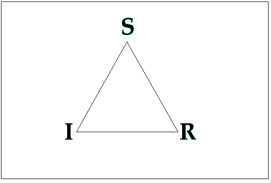
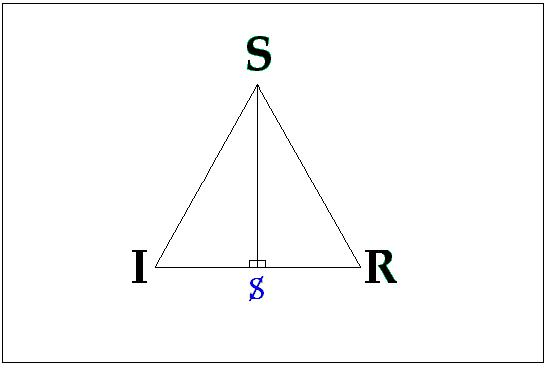
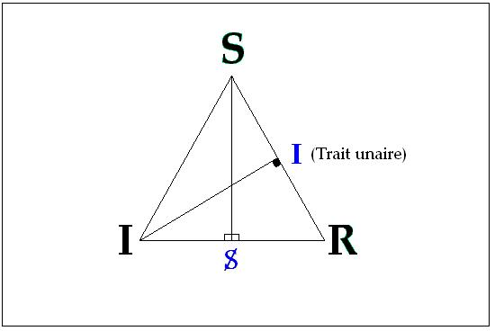
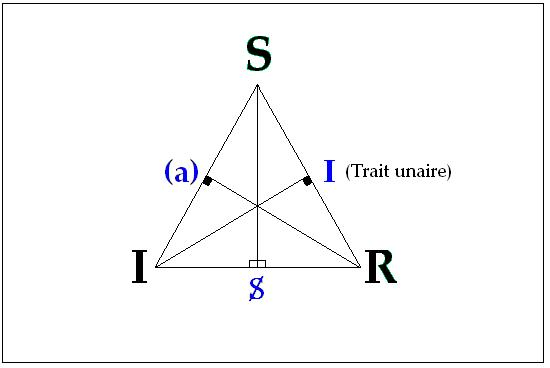
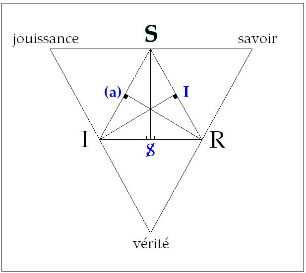
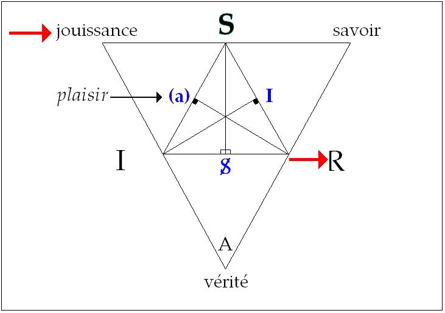
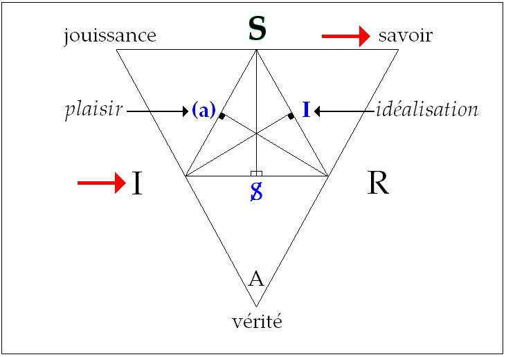
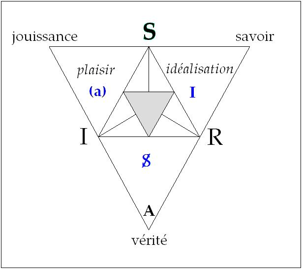

# Leçon 04 | 06 Décembre 1967

<!-- source-url: http://staferla.free.fr/S15/S15 L'ACTE.docx -->
<!-- seminar: s15 -->
<!-- lesson: 04 -->

<!-- id: s15-04-0001 -->

- « *Dis-moi quelle est la première chose dont tu te souviennes ?* »

<!-- id: s15-04-0002 -->

- « *Qu’est-ce que tu veux dire - répond l’autre - la première qui me vient à l’esprit ?* »

<!-- id: s15-04-0003 -->

- « *Non, le premier souvenir que tu aies eu* ». Longue réflexion...

<!-- id: s15-04-0004 -->

- « *J’ai dû l’oublier* ».

<!-- id: s15-04-0005 -->

- « *Justement le premier que tu n’aies pas oublié* ». Longue réflexion…

<!-- id: s15-04-0006 -->

- « *J’ai oublié la question* ».

<!-- id: s15-04-0007 -->

\[Tom Stoppard : *Rosencrantz et Guildenstern sont morts*, Paris, Seuil, 1968, p.15\]

# Ces quelques répliques que j’ai extraites pour vous - vous aurez mes sources - d’une petite pièce fort habile 

# et même pénétrante qui m’avait attiré par son titre, qui contient deux personnages pour moi assez plein de sens, 

# *Rosencrantz et Guildenstern -* l’un et l’autre, nous dit ce titre - *sont morts* [^28].

# Plût au ciel que ce fût vrai ! Il n’en est rien : ROSENCRANTZ et GUILDENSTERN seront toujours là, mais ces répliques, me semble-t-il, sont bien faites pour évoquer l’écart, la distance qu’il y a entre *trois niveaux de* μαθεσις \[mathésis\] dirais-je, *d’appréhension savante*.

<!-- id: s15-04-0008 -->

La 1ère, dont la théorie de la réminiscence, que je vous ai représentifiée la dernière fois par l’évocation du Ménon, donne l’exemple, je la centrerai sur un « *je lis* » à une épreuve révélatrice.

<!-- id: s15-04-0009 -->

La 2nde, différente, qui est présentifiée dans le ton - c’est le mot propre - du progrès de notre science, est un « *j’écris* ».

<!-- id: s15-04-0010 -->

J’écris, même quand c’est pour suivre la trace d’un écrit déjà marqué.

<!-- id: s15-04-0011 -->

Le dégagement de l’incidence signifiante comme telle signifie notre progrès dans *cette appréhension de ce qui est savoir*, ce que j’ai voulu vous rappeler par, non pas cette *anecdote*, mais ces répliques très bien forgées et qui en quelque sorte, désignent leur place elles-mêmes, d’aller se situer dans un nouveau maniement de ces marionnettes essentielles à la tragédie qui est vraiment la nôtre propre, celle de *Hamlet*, celle sur laquelle je me suis longuement livré au repérage de la place comme telle du désir[^29], désignant par là ceci qui a pu paraître très étrange jusque-là, que très exactement chacun y ait pu lire le sien.

<!-- id: s15-04-0012 -->

Ces trois répliques désignent donc ce mode propre de *l’appréhension sachante* qui est celui de l’analyse et qui commence au « *je perds, je perds le fil* ». Là commence ce qui nous intéresse, à savoir…

<!-- id: s15-04-0013 -->

> qui s’en étonne ou ferait à cette occasion de grands yeux, montrerait bien qu’il oublie
>
> ce qui a été l’entrée dans le monde, les premiers pas de l’analyse …le champ du *lapsus*, de *l’achoppement*, de *l’acte manqué*.

<!-- id: s15-04-0014 -->

Je vous en ai rappelé la présence dès les premiers mots de cette année. Vous verrez que nous aurons à y revenir et que ce repère est essentiel à maintenir toujours au centre de notre visée, si nous voulons ne pas perdre, nous, la corde quand il s’agit - dans sa forme la plus essentielle - de ce que j’appelle cette année *l’acte psychanalytique*.

<!-- id: s15-04-0015 -->

Mais aussi m’avez-vous vu, presque à chaque reprise et d’abord, témoigner de quelque embarras dont, je m’excuse, l’occasion n’était personne d’autre que *votre assistance gracieuse*. Je me suis posé - sous une forme qui aujourd’hui se centre - la problématique de mon enseignement. Que veut dire ce qu’ici je produis depuis maintenant quatre ans passés ?

<!-- id: s15-04-0016 -->

Il vaut bien d’en poser *la question*, est-ce *l’acte psychanalytique* ? Cet enseignement se produit devant vous, à savoir « public », comme tel il ne saurait être *acte psychanalytique*. Que veut dire dès lors, que j’en aborde la thématique ? Est-ce à dire que je pense ici le soumettre à une instance critique ? C’est une position qui après tout serait assumable, et qui d’ailleurs a été assumée bien des fois, même si à proprement parler, ça n’est pas de ce terme *acte* qu’on s’est servi.

<!-- id: s15-04-0017 -->

Il est assez frappant que la tentative, chaque fois qu’elle a été faite par quelqu’un de l’extérieur, ne donnait que des résultats assez pauvres.

<!-- id: s15-04-0018 -->

Or je suis psychanalyste et dans *l’acte psychanalytique* je suis moi-même pris. Peut-il y avoir chez moi un autre dessein que de saisir *l’acte psychanalytique* du dehors ? Oui, et voici comment ce dessein s’institue.

<!-- id: s15-04-0019 -->

Un enseignement n’est pas un acte, ne l’a jamais été. Un enseignement est une *thèse*, comme on l’a toujours très bien formulé au temps où on savait ce que c’était. Un enseignement dans l’université, au beau temps où ce mot avait un sens, ça voulait dire *thèse*. *Thèse suppose antithèse*, à l’*antithèse* peut commencer *l’acte*. Est-ce à dire que je l’attends des psychanalystes ?

<!-- id: s15-04-0020 -->

La chose n’est pas si simple.

<!-- id: s15-04-0021 -->

À l’intérieur de *l’acte psychanalytique*, mes *thèses* impliquent parfois des conséquences. Il est frappant que ces conséquences y rencontrent - je dis à l’intérieur - des objections qui n’appartiennent ni à *la thèse*, ni à aucune autre *antithèse* formulable, que *les us et coutumes* régnant parmi ceux qui font profession de *l’acte psychanalytique*. Il est singulier donc qu’un discours qui n’est point jusqu’ici, à l’intérieur de ceux qui sont dans *l’acte psychanalytique,* aisé à contredire, rencontre en certains cas obstacle qui n’est pas de contradiction.

<!-- id: s15-04-0022 -->

L’hypothèse qui guide chez moi la poursuite de ce discours est celle-ci : non pas certes qu’il y ait indication de critiquer l’acte psychanalytique, et je vais dire pourquoi, mais au contraire de démontrer - j’entends dans l’instance de cet acte - que ce qu’elle méconnaît, c’est qu’à n’en pas sortir on irait beaucoup plus loin. Il faut donc croire qu’il y a quelque chose en cet acte d’assez insupportable, intenable à qui s’y engage, pour qui redoute d’approcher - faut-il dire - de ses limites, puisque aussi bien ce que je vais introduire c’est cette particularité de sa structure, après tout assez connue pour qu’elle soit à chacun saisissable, mais qu’on ne formule presque jamais.

<!-- id: s15-04-0023 -->

Si nous partons de la référence que j’ai donnée tout à l’heure, à savoir que la première forme de l’acte que l’analyse ait pour nous inaugurée, c’est cet *acte symptomatique* dont on peut dire qu’il n’est jamais si bien réussi que quand il est un acte manqué, quand *l’acte manqué* est supposé et contrôlé, il se révèle ce dont il s’agit - épinglons-le de ce mot dont j’ai déjà suffisamment insisté qu’il en sort ravivé - *la vérité*.

<!-- id: s15-04-0024 -->

Observez que c’est de cette base que nous partons, nous analystes, pour avancer. Il n’y aurait même sans cela aucune analyse possible, en ceci que tout acte même qui ne porte pas ce petit indice du ratage, autrement dit, qui se donne à lui-même un bon point quant à l’intention, n’en tombe pas moins exactement sous le même ressort, à savoir que peut être posée la question d’*une autre vérité* que celle de cette intention.

<!-- id: s15-04-0025 -->

D’où il résulte que c’est proprement là dessiner *une topologie* qui peut s’exprimer ainsi, qu’à seulement dessiner *la voie de* *sa sortie*, *on y rentre*, même sans y penser et qu’après tout, la meilleure façon d’y rentrer d’une façon certaine, c’est d’en sortir pour de bon. *L’acte psychanalytique désigne une forme, une enveloppe, une structure* telle qu’en quelque sorte il suspend tout ce qui s’est *institué* jusqu’alors, *formulé*, *produit*, comme statut de l’acte, à sa propre loi.

<!-- id: s15-04-0026 -->

C’est aussi bien ce qui, du point où se tient celui qui, à un titre quelconque, s’engage dans cet acte dans une position où il est difficile de glisser le biais d’aucun coin, ce qui dès lors suggère que quelque mode de *discernement* doit être introduit.

<!-- id: s15-04-0027 -->

Il est facile d’épingler les choses, à reprendre au début, que s’*il n’y a rien de si réussi que le ratage* quant à l’acte, ça n’est pas dire pour autant qu’*une réciprocité* s’établisse et que tout ratage - en soi - soit le signe de quelque réussite : j’entends réussite d’acte.

<!-- id: s15-04-0028 -->

Tous les *trébuchements* ne sont pas des *trébuchements interprétables*, c’est bien évident, ce qui s’impose au départ d’une simple remarque qui est d’ailleurs aussi bien la seule objection qui ait jamais été produite dans l’usage.

<!-- id: s15-04-0029 -->

Il suffit de commencer, auprès de quelqu’un de bon sens, comme on dit, à introduire…

<!-- id: s15-04-0030 -->

> s’il est neuf, s’il n’a pas encore été immunisé, s’il a gardé quelque fraîcheur …la dimension des cogitations analytiques, pour que les gens vous répondent :

<!-- id: s15-04-0031 -->

- « *Mais qu’est-ce que vous venez me raconter tant de choses sur ces bêtises que nous connaissons bien et qui simplement sont vides de tout appui saisissable, qui ne sont que du négatif !* »

<!-- id: s15-04-0032 -->

Il est sûr qu’à ce niveau, le discernement n’a pas de règle sûre, et c’est bien ainsi qu’on constate qu’à se tenir en effet au niveau de ces *phénomènes exemplaires*, le débat reste en suspens. Il n’est pas inconcevable que là où *l’acte psychanalytique* prend son poids, c’est-à-dire où, *pour la première fois au monde*, il y a des sujets dont c’est l’acte que d’être *psychanalyste*, c’est-à-dire qui là-dessus organisent, groupent, poursuivent une expérience, prennent leurs *responsabilités* en quelque chose qui est d’un autre registre que celui de l’acte, à savoir un faire, mais attention : ce *faire* n’est pas le leur.

<!-- id: s15-04-0033 -->

La fonction de la psychanalyse se caractérise clairement en ceci qu’instituant un *faire* par quoi le psychanalysant obtient une certaine fin que personne n’a pu encore clairement fixer. On peut le dire, si l’on se fie à l’oscillation véritablement désordonnée de l’aiguille qui se produit dès que là-dessus on interroge les auteurs. Ce n’est pas le moment de vous donner un éventail de cette oscillation, mais vous pouvez m’en croire et vous pouvez aussi bien contrôler dans la littérature.

<!-- id: s15-04-0034 -->

La loi, la règle, comme on dit, qui cerne l’opération appelée psychanalyse, structure et définit un *faire*.

<!-- id: s15-04-0035 -->

Le *patient* comme on s’exprime encore, le *psychanalysant* comme j’en ai introduit récemment le mot…

<!-- id: s15-04-0036 -->

> qui s’est diffusé rapidement, ce qui prouve qu’il n’est pas si inopportun et que d’ailleurs il est évident que dire
>
> *le psychanalysé*, est laisser sur l’achèvement de la chose toutes les équivoques : pendant qu’on est en psychanalyse, le mot *psychanalysé* n’a de sens que d’indiquer une passivité qui n’est nullement évidente, c’est bien plutôt le contraire puisque après tout, celui qui parle tout le temps, c’est bien le psychanalysant, c’est déjà un indice …ce *psychanalysant*, dont l’analyse est menée à un terme dont - je viens de le dire - *personne* n’a strictement défini encore la portée de *fin* dans toutes les acceptions de ce mot, mais où néanmoins il est supposé que ce peut être un *faire* réussi, l’épingler d’un mot comme *être*, pourquoi pas ?

<!-- id: s15-04-0037 -->

Il reste pour nous assez blanc ce terme, et assez plein pourtant pour qu’il puisse ici nous servir de repère.

<!-- id: s15-04-0038 -->

Qu’est-ce que serait la fin d’une opération qui, assurément a affaire – au moins au départ – avec *la vérité*, si le mot *être* n’était pas évocable à son horizon ?

<!-- id: s15-04-0039 -->

L’est-il pour l’analyste ? À savoir celui qui est supposé - rappelons-nous en - avoir franchi un tel parcours sur les principes qu’il suppose et qui sont apportés par l’acte du psychanalyste. Inutile de s’interroger si le psychanalyste a le droit, au nom de quelque objectivité, d’interpréter le sens d’une figure donnée dans cette opération poétique par le sujet *faisant*.

<!-- id: s15-04-0040 -->

Inutile de se demander s’il est légitime ou non d’interpréter ce faire comme confirmant le fait du transfert : *interprétation* et *transfert* sont impliqués dans l’acte par quoi l’analyste donne à ce *faire*, support et autorisation, c’est fait pour ça.

<!-- id: s15-04-0041 -->

C’est tout de même donner quelque poids à la présence de l’acte, même si l’analyste ne fait rien. Donc cette bipartition du *faire* et de l’acte est essentielle au statut de l’acte lui-même. *L’acte psychanalytique*, où est-il saisissable qu’il manifeste quelque achoppement ? N’oublions pas que le psychanalyste est supposé parvenu en ce point où – si réduit soit-il – s’est pour lui produit cette *terminaison que comporte l’évocation de la vérité*.

<!-- id: s15-04-0042 -->

De ce point d’être, il est supposé l’ARCHIMÈDE capable de faire tourner tout ce qui se développe dans cette *structure* premièrement évoquée, dont le cernage d’un « *je perds* » par quoi j’ai commencé, donne la clé.

<!-- id: s15-04-0043 -->

Ne peut-il être intéressant de voir se reproduire cet *effet de perte* au-delà de l’opération que centre *l’acte analytique* ?

<!-- id: s15-04-0044 -->

Je pense qu’à poser la question en ces termes, il vous apparaîtra aussitôt qu’il n’est pas douteux que c’est dans les insuffisances de la production dirais-je, analytique que doit se lire quelque chose qui répond à cette dimension d’achoppement au-delà d’un acte supposé faire fin, dont il faut bien supposer ce point *magistral* si nous voulons pouvoir parler de quoi que ce soit le concernant.

<!-- id: s15-04-0045 -->

Et aussi bien n’y a-t-il rien d’abusif à l’évoquer quand les analystes d’eux–mêmes…

<!-- id: s15-04-0046 -->

> et qui peuvent tomber le plus sous le coup de cette désignation de l’achoppement - là où je propose qu’on aille chercher l’incidence qui puisse compléter voire instaurer l’appui de notre critique …il n’y a rien d’abusif à parler de ce point tournant du passage du psychanalysant au psychanalyste puisque par les psychanalystes eux-mêmes, ceci même que je viens d’évoquer, la référence en est constante et donnée comme condition de toute compétence analytique.

<!-- id: s15-04-0047 -->

Ce pourrait être un travail infini que de mettre à l’épreuve cette littérature analytique, aussi bien, déjà en ai-je pointé quelques exemples à l’horizon. J’ai cité dans mon premier cours de cette année *l’article* de RAPPAPORT qui pourrait à peu près s’appeler en français - il est paru dans l’*International Journal* [^30] - « *Statut analytique du penser* », *thinking* c’est un participe présent en anglais. Il serait, dans une assemblée aussi large, aussi fastidieux qu’inefficace - je pense - de prendre un tel article pour y voir manifester une extrême *bonne intention*, si je puis dire, une sorte de *mise à plat* de tout ce qui peut, de l’énoncé freudien lui-même, s’organiser d’une *énonciation* concernant ce qu’il en est de la fonction de la pensée dans l’économie dite analytique.

<!-- id: s15-04-0048 -->

Le frappant en serait que les déchirures qui se marquent à tout instant, l’impossibilité de ne pas faire partir ce montage du *thinking -* ou démontage, comme on voudra - du *processus primaire* lui–même et au niveau de ce que FREUD désigne comme *l’hallucination primitive*…

<!-- id: s15-04-0049 -->

> celle qui est liée à la première *recherche pathétique*, celle supposée par l’existence simplement d’un système moteur qui, dès lors qu’il ne rencontre pas l’objet de sa satisfaction, serait - c’est au principe de l’explication du processus primaire - responsable de ce processus régressif qui fait apparaître *l’image fantasmatique* de ce qui est recherché …la complète incompatibilité de ce registre, qui est bien pourtant à mettre au tableau de la pensée, avec ce qui est au niveau du processus secondaire instauré d’une pensée*…* qui est une sorte *d’action réduite*, *d’action au petit pied* qui force à passer dans un tout autre registre que celui qui a été évoqué d’abord, à savoir *l’introduction de la dimension de l’épreuve de la réalité* …ne manque pas bien sûr d’être notées au passage par l’auteur qui, poursuivant imperturbablement son chemin, en arrivera à s’apercevoir que non seulement il n’y a pas deux modes et deux registres de pensée, mais qu’il y en a une infinité…

<!-- id: s15-04-0050 -->

> qui sont à peu près à *échelonner* dans ce qu’auparavant les psychologues ont noté des « *étagements de la conscience *» …et par conséquent de complètement réduire le relief de ce qui a été apporté par FREUD à ce qu’on appelle « *la psychologie générale* », c’est-à-dire à son abolition.

<!-- id: s15-04-0051 -->

Ce n’est là qu’un exemple léger et vous pouvez à votre gré aller le confirmer. Si d’autres voyaient intérêt à ce que se tienne un séminaire, où quelque chose comme ceci serait suivi dans ses détails, pourquoi pas ? L’important me semble-t-il, est que soit complètement éludé dans cette perspective de réduction, avec échec conséquent, ce qui est frappant, saillant, énorme, impliqué dans la dimension du processus primaire, ce quelque chose qui peut à peu près s’exprimer ainsi : non pas « *au commencement est l’insatisfaction* », ce qui n’est rien : ce n’est pas que l’individu vivant courre après sa satisfaction qui est important, *c’est qu’il y ait un statut de la jouissance qui soit l’insatisfaction*.

<!-- id: s15-04-0052 -->

À l’éluder comme originaire, comme impliqué dans la théorie de celui qui l’a introduite, cette théorie, peu importe qu’il l’ait ou non exprimée comme ça, mais s’il l’a faite comme ça, c’est-à-dire s’il a formulé *le principe du plaisir* comme *jamais* on ne l’avait formulé avant lui…

<!-- id: s15-04-0053 -->

> car *le plaisir* servait de toujours à définir le « *Bien* », il était en lui-même satisfaction, à ceci près naturellement
>
> que personne ne pouvait y croire, parce que tout le monde a su depuis toujours qu’être dans le « *Bien* »,
>
> ce n’est pas toujours satisfaisant …si FREUD introduit cette autre chose, il s’agit de voir quelle est la cohérence de cette pointe avec celle qui d’abord s’indique dans la dimension de *la vérité*.

<!-- id: s15-04-0054 -->

J’ai ouvert par hasard une revue, un hebdomadaire, ou un trisannuel, dans lequel j’ai vu des signatures distinguées, l’une d’un côté de l’horizon où la bataille divine bat toujours son plein - celle pour le « *Bien* » précisément, j’ai vu un article qui commençait *par une sorte d’incantation sur le Symbolique, l’Imaginaire et le Réel,* à quoi la personne que j’indique afférait l’illumination qu’avait apportée dans le monde cette tripartition - *vous voyez de quoi je suis responsable -* et de conclure tout vaillamment : « *À nous, ça dit ce que ça dit : le réel c’est Dieu*. » *Et voilà comment on peut dire que je suis un appoint pour la foi théologique*.

<!-- id: s15-04-0055 -->

Ça m’a quand même incité à quelque chose que j’ai essayé, pour ceux qui sont ici, nombreux peut–être, à voir que tout ça se mélange, que ce qu’on peut tout de même indiquer si on prend ces termes autrement que dans l’absolu, c’est ceci :

<!-- id: s15-04-0056 -->

<!-- id: s15-04-0057 -->

- *le symbolique*, on va le mettre, si vous voulez, comme ça : en haut,

<!-- id: s15-04-0058 -->

- *l’imaginaire* on va le mettre par là,

<!-- id: s15-04-0059 -->

- et *le réel* à droite.

<!-- id: s15-04-0060 -->

C’est complètement idiot comme ça. Il n’y aurait vraiment rien à en faire et surtout pas un triangle rectangle… Si ! peut-être, enfin pour nous permettre un peu de poser les questions. Vous n’allez pas vous promener avec ce que je vais mettre autour, après ça, sur un petit bout de papier, en cherchant tout le temps dans quel carré on va être !

<!-- id: s15-04-0061 -->

<!-- id: s15-04-0062 -->

Mais enfin, quand même, si nous nous souvenons de ce que j’enseigne concernant *le sujet* comme *déterminé par le signifiant*, toujours par *deux signifiants*, ou plus exactement : par un *signifiant comme le représentant pour un autre signifiant*, pourquoi ne pas mettre ce S là comme une *projection* sur l’autre côté ? Cela nous permettra peut-être de nous demander ce qu’il en est des rapports du sujet entre *l’imaginaire* et *le réel*.

<!-- id: s15-04-0063 -->

D’autre part, ce fameux grand I du *trait unaire*, celui dont on part pour voir comment effectivement *dans le développement*, ce mécanisme de l’incidence du signifiant, dans le développement se produit, à savoir *la première identification*, nous le mettrons aussi comme une projection sur l’autre côté.

<!-- id: s15-04-0064 -->

<!-- id: s15-04-0065 -->

Et la troisième fonction me sera donnée par *(a)* qui est quelque chose bel et bien comme *une chute du réel* sur le vecteur tendu du *symbolique* à *l’imaginaire*

<!-- id: s15-04-0066 -->

<!-- id: s15-04-0067 -->

à savoir comment le signifiant peut très bien prendre son matériel - qui est-ce qui y verrait obstacle ? - dans des fonctions imaginaires, c’est-à-dire dans la chose la plus fragile, la plus difficile à saisir quant à ce qui est de l’homme, non pas bien entendu qu’il n’y ait pas chez lui ces images primitives destinées à nous donner un guide dans la nature, mais justement comme le signifiant s’en empare, c’est toujours bien difficile à repérer dans son côté cru.

<!-- id: s15-04-0068 -->

Alors vous voyez que la question peut se poser de ce que représentent les vecteurs unissant chacun de ces points repérés.

<!-- id: s15-04-0069 -->

Ce qui va avoir un intérêt - c’est pour ça que je vous prépare pour ce petit jeu - c’est que tout de même, depuis que nous parlons de *l’acte analytique*, nous n’avons pas pu faire autrement que de ré-évoquer les dimensions où se sont déployés nos repérages concernant la fonction du *symptôme*, par exemple :

<!-- id: s15-04-0070 -->

- quand nous l’avons mis comme échec de ce qui est *sachable*, *le savoir*,

<!-- id: s15-04-0071 -->

- ce qui depuis toujours représente quelque *vérité*,

<!-- id: s15-04-0072 -->

- et nous mettrions ici ce qui constitue le pôle tiers, *la jouissance*.

<!-- id: s15-04-0073 -->

<!-- id: s15-04-0074 -->

Ceci introduit tout de même - vu d’une certaine attache fondamentale de l’esprit humain à *l’imaginaire - quelque chose* qui peut vous aider à la façon de *points cardinaux*. En un sens, peut-être, ils pourront vous servir de support pour le cercle, chaque fois que j’évoquerai un de ces pôles, comme aujourd’hui *je pose la question de ce qu’il en est de l’acte de l’analyste par rapport à la vérité.*

<!-- id: s15-04-0075 -->

Au départ, la question peut et doit se poser : est-ce que *l’acte psychanalytique* prend en charge *la vérité* ?

<!-- id: s15-04-0076 -->

Il a bien l’air, mais qui oserait prendre en charge *la vérité* sans s’attirer la dérision ?

<!-- id: s15-04-0077 -->

Dans certains cas, je me prends pour Ponce PILATE. Il y a une jolie image de CLAUDEL[^31] : Ponce PILATE qui n’a eu le tort que de poser cette question. Il tombait mal, c’est le seul qui l’ait posée, devant la vérité, ça l’a foutu un peu à côté.

<!-- id: s15-04-0078 -->

D’où il résulte que - là je suis dans le registre de CLAUDEL, c’est CLAUDEL qui a inventé ça - quand il se promenait par la suite, toutes les idoles - c’est toujours CLAUDEL qui parle - voyaient leur ventre s’ouvrir dans une dégringolade, avec un grand bruit de machine à sous. Je ne pose pas la question ni dans un tel contexte, ni avec une telle vigueur que j’obtienne ce résultat, mais enfin quelquefois ça approche.

<!-- id: s15-04-0079 -->

Le psychanalyste ne prend pas en charge *la vérité*. Il ne prend pas en charge *la vérité*, précisément parce que aucun de ces pôles n’est jugeable qu’en fonction de ce qu’il représente de nos trois sommets de départ :

<!-- id: s15-04-0080 -->

<!-- id: s15-04-0081 -->

À savoir que *la vérité* c’est, au lieu de l’Autre, l’inscription du signifiant.

<!-- id: s15-04-0082 -->

C’est-à-dire que ce n’est pas là comme ça *la vérité*, pas plus que *la jouissance* d’ailleurs, qui a certainement rapport avec *le réel* mais dont justement, c’est *le principe de plaisir* qui est fait pour nous en séparer.

<!-- id: s15-04-0083 -->

<!-- id: s15-04-0084 -->

*Quant au savoir, c’est une fonction imaginaire*, une idéalisation, incontestablement.

<!-- id: s15-04-0085 -->

<!-- id: s15-04-0086 -->

C’est ce qui rend délicate *la position de l’analyste* qui en réalité se tient là au milieu, où c’est *le vide, le trou, la place du désir* \[en gris\].

<!-- id: s15-04-0087 -->

<!-- id: s15-04-0088 -->

Seulement, ça comporte un certain nombre de points *tabous*, en quelque sorte de discipline, c’est à savoir que, puisque assurément on a à répondre à quelque chose…

<!-- id: s15-04-0089 -->

> je veux dire ceux qui viennent consulter l’analyste pour trouver plus d’assurance …eh bien - mon Dieu - il arrive qu’on fasse une théorie des conditions de l’assurance croissante qui doit arriver à quelqu’un qui se développe normalement.

<!-- id: s15-04-0090 -->

*C’est un très beau mythe*. Il y a un article d’Erik ERIKSON[^32] sur « *le rêve de l’injection d’Irma* » qui n’est pas fichu autrement.

<!-- id: s15-04-0091 -->

Il nous énumère par étapes comment doit s’édifier l’assurance du petit bonhomme qui a eu d’abord une *mummy* convenable, celle, bien entendu, qui a bien appris sa leçon dans les livres des psychanalystes.

<!-- id: s15-04-0092 -->

L’échelonnement va, tout à fait au sommet, nous donner…

<!-- id: s15-04-0093 -->

> je l’ai déjà évoqué quelquefois, je m’excuse, c’est là un bateau …un *G.I.* parfaitement assuré. C’est constructible, tout est constructible en termes de psychologie.

<!-- id: s15-04-0094 -->

Il s’agit de savoir en quoi *l’acte psychanalytique* est compatible avec de tels *déchets* - il faut croire qu’il a quelque chose à faire avec *le déchet -* et le mot *déchet* n’est pas à prendre là *comme venant au hasard*.

<!-- id: s15-04-0095 -->

Peut-être qu’à épingler comme il convient certaines productions théoriques, on pourrait tout de suite repérer sur cette carte, puisque carte il y a, *si socratique*, mon Dieu, que ce n’est pas plus que celle que j’évoquais l’autre jour à propos du *Ménon,* ça n’a pas plus de portée : portée d’exercice.

<!-- id: s15-04-0096 -->

<!-- id: s15-04-0097 -->

Mais à voir le rapport que peut avoir une production… qui en aucun cas n’a fonction par rapport à la pratique …que même les analystes les plus effervescents, dans ces constructions en général optimistes, ne respectent pas moins : nul psychanalyste, si je puis dire, ne va *- sauf excès ou exception -* jusqu’à y croire quand il intervient.

<!-- id: s15-04-0098 -->

La relation de ces productions avec le point naturel, ici du *déchet*, à savoir *l’objet(a)* \[schéma\], peut peut-être nous servir à nous faire progresser quant à ce qu’il en est des relations de la production analytique avec tel ou tel autre terme, par exemple l’idéalisation de sa position sociale que nous mettrions quelque part \[schéma\] du côté du I.

<!-- id: s15-04-0099 -->

Bref, l’inauguration d’une méthode de discernement quant à ce qu’il en est des productions de *l’acte psychanalytique*, de la part de perte *– peut-être nécessaire –* qu’il comporte, ceci peut être de nature, non point seulement à éclairer d’une vive lumière ce qu’il en est de *l’acte psychanalytique*, du statut *qu’il suppose* et *qu’il supporte* dans son ambiguïté, mais à déployer… et pourquoi s’arrêter en un point quelconque ?

<!-- id: s15-04-0100 -->

…l’étendue de cette ambiguïté jusqu’à - si je puis dire - ce que nous soyons revenus à notre point de départ.

<!-- id: s15-04-0101 -->

S’il est vrai qu’il n’y a pas moyen d’en sortir, autant vaudrait en faire le tour. C’est précisément ce à quoi nous allons essayer cette année de donner une première image d’épreuve. Et pour ceci par exemple, je n’irai pas prendre, bien entendu, les plus mauvais exemples.

<!-- id: s15-04-0102 -->

*Il y a déchet et déchet, si je puis dire : il y a des déchets ininterprétables*. Encore, faites attention que *cette désignation de l’ininterprétable* n’est pas, ici, prise au sens propre. Prenons un auteur excellent qui s’appelle WINNICOTT, cet auteur auquel on doit une découverte des plus fines. Il me souvient - et je ne manquerai jamais d’y revenir en hommage dans mon souvenir - de ce que *l’objet transitionnel*, comme il l’a dénommé, a pu m’apporter de secours au moment où je m’interrogeais sur la façon de démystifier cette fonction de l’objet dit *partiel*, telle que nous la voyons soutenir pour en supporter la théorie la plus *abstruse*, la plus *mythifiante*, la moins clinique, sur les prétendues « *relations développementales* » du prégénital par rapport au génital.

<!-- id: s15-04-0103 -->

La seule introduction de ce petit objet qu’on appelle chez M. WINNICOTT *l’objet transitionnel*, ce tout *petit bout de chiffon* dont le bébé se sert dès avant ce drame autour duquel on a accumulé tant de nuées confuses, dès avant ce drame du sevrage…

<!-- id: s15-04-0104 -->

> qui quand nous l’observons n’est pas du tout forcément un drame, comme me faisait remarquer quelqu’un qui n’est pas sans pénétration : il se peut que le sevrage, la personne qui le ressent le plus, c’est la mère …que ce ne soit la présence, la seule présence dans ce cas qui semble être en quelque sorte l’appui, l’arche fondamentale grâce à quoi tout ne sera plus jamais ensuite développé qu’en termes de rapport duel, de rapport de l’enfant à la mère.

<!-- id: s15-04-0105 -->

Ceci est tout de suite interféré par cette fonction de ce menu objet dont WINNICOTT va nous articuler le statut.

<!-- id: s15-04-0106 -->

Je reprendrai l’année prochaine ces traits, dont on peut dire que la description est exemplaire. Il suffit de lire

<!-- id: s15-04-0107 -->

M. WINNICOTT pour, en quelque sorte, le traduire. Il est clair que *ce petit bout de chiffon, ce bout de drap, ce morceau souillé* à quoi l’enfant se cramponne, il n’est pas rien de voir ici son rapport avec ce premier objet de jouissance, qui n’est pas du tout le sein de la mère jamais là à demeure, mais celui-là, toujours à portée : le pouce de la main de l’enfant.

<!-- id: s15-04-0108 -->

Comment les analystes peuvent-ils à ce point écarter de leur expérience ce qui leur est apporté au premier chef de la fonction de la main ? C’est au point que pour eux, l’humain, ça devrait s’écrire avec un trait d’union au milieu.

<!-- id: s15-04-0109 -->

Mais cette lecture que je vous conseille, qui est facile, elle est dans le numéro 5 de cette revue qui a passé longtemps pour la mienne, qui s’appelait *La Psychanalyse*, il y a une traduction de cet *objet transitionnel* de WINNICOTT[^33].

<!-- id: s15-04-0110 -->

Lisez ça - rien de plus fatigant qu’une lecture et de moins propice à retenir l’attention - mais si quelqu’un la prochaine fois veut bien la faire ? Qui n’entendra pas tout ce mal que se donne WINNICOTT pour dire ce qu’est cet *objet(a)* ?

<!-- id: s15-04-0111 -->

Il n’est ni à l’extérieur ni à l’intérieur, ni réel ni illusoire, ni ceci ni cela. Il ne rentre dans rien de toute cette construction artificieuse que le commun de l’analyse édifie autour du narcissisme, en y voyant tout autre chose que ce pour quoi c’est fait, à savoir non pas pour faire deux versants moraux : d’un côté *l’amour de soi-même*, et de l’autre *celui de l’objet* comme on dit.

<!-- id: s15-04-0112 -->

Il est très clair - je l’ai déjà fait ici - à lire ce que FREUD a écrit du *Real-Ich* et du *Lust-Ich*, c’est fait pour nous démontrer que le premier objet, c’est le *Lust-Ich*, à savoir moi-même, la règle de mon plaisir, et que ça le reste.

<!-- id: s15-04-0113 -->

Alors toute cette description, je dois dire aussi précieuse que fine, de *l’objet(a)*, il ne lui manque qu’une chose, c’est qu’on voie que tout ce qui s’en dit ne veut rien dire que *le bourgeon, la pointe, la première sortie de terre* - de quoi ? - *de ce que l’objet(a) commande, à savoir tout bonnement le sujet*. Le sujet comme tel fonctionne d’abord au niveau de cet objet transitionnel. Ce n’est certes pas là épreuve faite pour diminuer ce qui peut se faire de production autour de l’acte analytique.

<!-- id: s15-04-0114 -->

Mais vous allez voir ce qu’il en est quand WINNICOTT pousse les choses plus loin, à savoir quand il est non pas *observateur* du petit bébé, comme il en est plus qu’un autre capable, mais repérant sa propre technique concernant ce qu’il cherche, lui, à savoir d’une façon patente - et je vous l’ai indiqué la dernière fois à l’orée de ma conférence - *la vérité*.

<!-- id: s15-04-0115 -->

Car ce *self* dont il parle, c’est *quelque chose* qui est là depuis toujours, en arrière de tout ce qui se passe, avant même que d’aucune façon le sujet se soit repéré. « *Quelque chose est capable de geler* - écrit-il - *la situation de manque* ». Quand l’environnement n’est pas approprié *dans les premiers jours, les premiers mois du bébé, quelque chose peut fonctionner qui fait ce freezing, cette gélation* [^34]. Assurément, c’est là quelque chose dont seule l’expérience peut trancher et là encore, il y a au regard de ses conséquences psychotiques, quelque chose que WINNICOTT a fort bien vu : mais derrière ce *freezing*, il y a, nous dit WINNICOTT, ce *self* qui attend, ce *self* qui de s’être gelé constitue le *faux-self* auquel il faut que M. WINNICOTT ramène, par un procès de régression dont ce sera l’objet de mon discours de la prochaine fois de vous montrer le rapport à l’agir de l’analyste.

<!-- id: s15-04-0116 -->

Derrière ce *faux-self*, attend quoi ? le *vrai*, pour repartir.

<!-- id: s15-04-0117 -->

Qui ne voit…

<!-- id: s15-04-0118 -->

> quand déjà nous avons dans la théorie analytique ce « *Real-Ich *», ce « *Lust-Ich *», ce « *ego *», ce « *id* », toutes ces références déjà assez articulées pour définir notre champ …que *l’adjonction* de ce *self* ne représente rien d’autre que - comme d’ailleurs *c’est avoué* dans le texte avec *false* et *true - la vérité* ?

<!-- id: s15-04-0119 -->

Et qui ne voit aussi qu’il n’y a d’autre *true-self* derrière cette situation que M. WINNICOTT lui-même qui, là, se pose comme *présence de la vérité* ? Ce n’est rien dire qui comporte en quoi que ce soit une dépréciation de ce à quoi cette position le mène.

<!-- id: s15-04-0120 -->

Comme vous le verrez la prochaine fois, extrait de son texte lui-même, c’est à une position qui s’avoue devoir… en tant que telle, et de façon avouée …sortir de l’acte analytique, prendre la position de *faire*, par quoi il assume… comme s’exprime un autre analyste …de répondre à tous les besoins du patient. Nous ne sommes pas ici pour entrer dans le détail d’à quoi ceci mène.

<!-- id: s15-04-0121 -->

Nous sommes ici pour indiquer comment la moindre méconnaissance…

<!-- id: s15-04-0122 -->

> et comment n’existerait–elle pas puisque n’est pas encore défini ce qu’il en est de *l’acte analytique* ? …entraîne aussitôt *qui* l’assume, et d’autant mieux qu’il est plus sûr, qu’il est plus capable… je cite cet auteur parce que je considère qu’*il n’y en a pas qui l’approchent en langue anglaise* …qu’aussitôt il soit porté, noir sur blanc, à la négation de la position analytique.

<!-- id: s15-04-0123 -->

Ceci à soi tout seul, me paraît confirmer, donner amorce sinon appui encore, à ce que j’introduis comme méthode d’une critique par les expressions théoriques de ce qu’il en est du statut de *l’acte psychanalytique*.

## Notes

[^28]: Tom Stoppard : *Rosencrantz et Guildenstern are dead*, London, Faber & Faber, 1967. *Rosencrantz et Guildenstern sont morts*, Paris, Seuil, 1968.

    Lacan évoque ces deux personnages *in Écrits*, « *L’instance de la lettre dans l’inconscient* » , p. 506 note 1.

[^29]: Cf. séminaire 1958-59 : « *Le désir et son interprétation* », séances sur Hamlet du 04-03 au 29-04 et du 27-05-1959.

[^30]: David Rappaport : *On the psychoanalytic Theorie of Thinking* , op. cit.

[^31]: Paul Claudel : « *Le point de vue de Ponce Pilate* », *Figures et paraboles* - *Œuvres en prose*, Paris, Gallimard, coll. La Pléiade, 1965, p. 919.

[^32]: Erik Erikson : *A way of looking at things, Selected papers from* 1930 *to* 1980, « *The Dream Specimen of Psychoanalysis* », New-York, London, Norton Ed., 1987,

    pp. 237-279.

[^33]: D.W. Winnicott : « *Objets transitionnels et phénomènes transitionnels* », La Psychanalyse, vol.5, Paris, PUF, 1959, p.21. Traduction de « *Transitional objects and*

    *transitional phenomena* », 15 juin 1951, in Int. Journal of Psycho-Analysis, vol. XXXIV, 1953. Cet article a été écrit d’après un exposé, fait par son

    président, à la Société britannique de Psychanalyse, le 30 mai 1951. Réédité en français dans : *De la pédiatrie à la psychanalyse*, op. cit., p. 109.

[^34]: C’est en fait dans un autre article de Winnicott que l’on trouve explicitement cette notion de *freezing* : « *Les aspects métapsychologiques et cliniques*

    *de la régression au sein de la situation analytique* », *in op. cit. De la pédiatrie à la psychanalyse*, p. 131. Traduit de : « *Metapsychological and Clinical Aspects*

    *of Regression within the Psycho-Analytical Set-Up* », exposé fait à la Société britannique de Psychanalyse, le 17 mars 1954, et édité dans *International*

    *Journal of Psycho-Analysis*, vol. 36, 1955. p. 135 *: « gelant la situation de carence ».*
