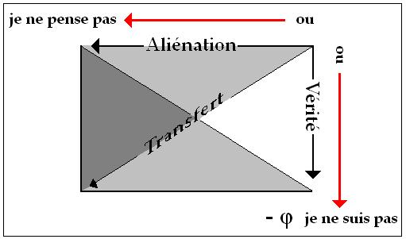
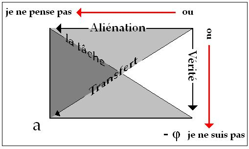
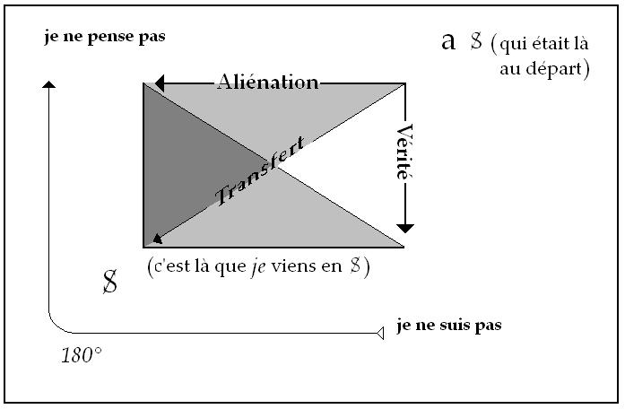

# Leçon 06 | 17 Janvier 1968

<!-- source-url: http://staferla.free.fr/S15/S15 L'ACTE.docx -->
<!-- seminar: s15 -->
<!-- lesson: 06 -->

<!-- id: s15-06-0001 -->

En parlant de *l’acte psychanalytique* j’ai, si je puis dire *deux ambitions*, une longue et une courte, et forcément la courte est la meilleure.

<!-- id: s15-06-0002 -->

- La longue, qui ne peut être écartée, c’est d’éclairer ce qu’il en est de l’acte.

<!-- id: s15-06-0003 -->

- La courte, c’est de savoir en quoi il y a le psychanalyste.

<!-- id: s15-06-0004 -->

Déjà dans quelque écrit passé j’ai parlé *du psychanalyste*, non pas « *du* », à décomposer « *de le *» psychanalyste, j’ai dit que je ne partais que de ceci : qu’il y a « *du* » psychanalyste[^49].La question de savoir s’il y a « *le* » psychanalyste n’est pas non plus du tout à mettre en suspens, c’est celle de savoir comment il y a « *un* » psychanalyste, qui est une question qui se pose à peu près sous les mêmes termes que ce qu’on appelle en logique *la question de l’existence*.

<!-- id: s15-06-0005 -->

*L’acte psychanalytique*, si c’est un acte - c’est bien de là que nous sommes, dès l’année dernière, partis - c’est quelque chose qui nous pose la question de l’articuler, de le dire, ce qui est légitime et même, allant plus loin, ce qui implique des conséquences d’acte pour autant que l’acte est lui-même, de sa propre dimension, un dire : *L’acte dit quelque chose,* *c’est de là que nous sommes partis.* Cette dimension est aperçue depuis toujours, elle est présente dans le fait, dans l’expérience.

<!-- id: s15-06-0006 -->

Il suffit d’évoquer même un instant des formules, et des formules prégnantes, des formules qui ont agi comme celle d’*agir selon sa conscience*, pour saisir ce dont il s’agit.

<!-- id: s15-06-0007 -->

*Agir selon sa conscience*, c’est bien là une espèce de point médium autour de quoi peut être dite avoir tourné l’histoire de l’acte, ou qu’on puisse prendre aussi comme point de départ pour le centrer. *Agir selon sa conscience*, pourquoi, et devant qui ?

<!-- id: s15-06-0008 -->

La dimension de l’Autre en tant que l’acte y vient témoigner que quelque chose n’est pas plus éliminable.

<!-- id: s15-06-0009 -->

Est–ce à dire, bien sûr, que ce soit là le vrai tournant, le centre de gravité ? Pouvons-nous même un instant *le soutenir d’où nous sommes, c’est-à-dire d’où la conscience comme telle est mise en question*. *Mise en question* de la mesure qu’elle peut donner à quoi ?

<!-- id: s15-06-0010 -->

Assurément pas au *savoir*, à *la vérit*é non plus. C’est de là que nous repartons en prenant la mesure :

<!-- id: s15-06-0011 -->

- de ce qui n’est point encore défini,

<!-- id: s15-06-0012 -->

- de ce qui n’est point encore vraiment serré,

<!-- id: s15-06-0013 -->

- de ce qui est seulement ici introduit, même pas supposé : *l’acte psychanalytique*, pour réinterroger ce point d’équilibre autour de quoi se pose la question de ce que c’est que l’acte.

<!-- id: s15-06-0014 -->

À l’horizon, bien sûr nous le savons, une vaste rumeur, une rumeur qui vient de loin, qui nous vient des temps qu’on appelle *classiques*, ou de ce qu’on appelle encore notre *Antiquité* où assurément nous savons que tout ce qui s’est dit sur le sujet de l’acte exemplaire, de l’acte méritoire, du plutarquisme[^50] si vous voulez, sûrement déjà nous sentons qu’il y a un peu trop d’estime de soi à entrer dans le jeu et pourtant, en sommes-nous si distancés ?

<!-- id: s15-06-0015 -->

Si nous pensons qu’aujourd’hui c’est autour d’*un discours*, d’*un discours sur le sujet*, que nous reprenons l’acte et que notre avantage ne saurait tenir à rien d’autre qu’à ceci qui nous a fait rétrécir le point d’appui de ce sujet en nous imposant la plus rude discipline, à ne vouloir tenir pour sûre que cette dimension par quoi il est le sujet grammatical, entendons bien que ce n’est point là nouveau, que l’année dernière dans notre exposé de la *Logique du fantasme* nous avons marqué à sa place, à la place du « *je ne pense pas* », cette forme du sujet qui apparaissait comme en écornure du champ à lui réservé, cette dimension proprement de la grammaire qui faisait que le fantasme pouvait être dominé littéralement par une phrase et une phrase qui ne se soutient pas, qui ne se conçoit pas, autrement que de *la dimension grammaticale*, *Ein Kind wird geschlagen*, *On bat un enfant* [^51], nous la connaissons.

<!-- id: s15-06-0016 -->

C’est là le point de donnée le plus sûr autour de quoi…

<!-- id: s15-06-0017 -->

> au nom de ceci que nous posons aussi à titre disciplinaire qu’il n’y a pas de métalangage,
>
> que la logique elle-même doit être extraite de cette donnée qu’est le langage …c’est autour de cette *logique* par contre, que nous avons fait tourner *cette triple opération* à laquelle, par une sorte de *tentative*, d’*essai de divination*, de *risque*, nous avons donné *la forme du groupe de Klein*, opération que nous avons commencé par pointer dans le cheminement d’origine par où nous l’avons abordée, par les termes : d’*aliénation*, de *vérité* et de *transfert* [^52].

<!-- id: s15-06-0018 -->

Assurément, ce ne sont là qu’épinglages et, à être parcourus dans certains sens, au moins pour nous y retrouver, pour supporter ce que ces opérations peuvent représenter pour nous, nous sommes forcés de leur donner un autre nom mais, bien sûr, à condition de nous apercevoir qu’il s’agit du même trajet.

<!-- id: s15-06-0019 -->

Donc, c’est à partir de la subversion du sujet[^53]…

<!-- id: s15-06-0020 -->

> que nous avons déjà depuis quelque dix ans suffisamment articulée pour qu’on conçoive quel est le sens que prend ce terme au moment où nous disons que c’est à partir de la subversion du sujet… …que nous avons à reprendre la fonction de l’acte, pour que nous voyions que c’est entre ce sujet grammatical, celui qui est là *inscrit*, on peut dire, dans la notion même d’acte, dans la façon dont il nous est présentifié, le « *je* » de l’action, et ce sujet articulé dans ces termes glissants, toujours prêt à nous fuir d’un déplacement, d’un saut à l’un des sommets de ce « *tétraèdre* » que déjà la dernière fois j’avais ici reproduit en vous rappelant ces fonctions et ces termes.

<!-- id: s15-06-0021 -->

<!-- id: s15-06-0022 -->

- ici, la position du « *ou-ou* » d’où part *l’aliénation originelle*, celle qui aboutit au « *je ne pense pas* », pour qu’il puisse même être choisi - et que veut dire ce choix ?

<!-- -->

<!-- id: s15-06-0023 -->

- là, le « *je ne suis pas* » qui en articule l’autre terme. Ces vecteurs, plus exactement ces directions dans lesquelles sont prises les opérations fondamentales, étant celles que j’ai rappelées tout à l’heure sous les termes d’*aliénation*, de *vérité* et de *transfert*, qu’est-ce que cela veut dire, où cela nous conduit-il ?

<!-- id: s15-06-0024 -->

*L’acte psychanalytique*, nous le posons comme consistant en ceci : de supporter le transfert…

<!-- id: s15-06-0025 -->

> nous ne disons pas *qui* supporte : celui qui fait l’acte, le psychanalyste donc implicitement …ce transfert qui serait une pure et simple obscénité, dirai–je, redoublée de bafouillage, si nous ne lui redonnions pas son véritable nœud dans la fonction du *sujet supposé savoir*.

<!-- id: s15-06-0026 -->

Ici nous l’avons fait depuis un temps, en démontrant que tout ce qui s’articule de sa diversité comme effet de transfert ne saurait s’ordonner qu’à être rapporté à cette fonction vraiment fondamentale, partout présente, dans tout ce qu’il en est d’aucun progrès de savoir et qui prend ici sa valeur justement de ce que l’existence de l’inconscient la met en question, une question jamais posée de ce qu’on ait toujours la réponse - si l’on peut dire, implicitement, la réponse même inaperçue - que du moment qu’il y a savoir il y a sujet, et qu’il faut *quelques décalages, quelques fissures, quelques ébranlements, quelques moments* *de jeu dans ce savoir* pour que tout à coup on s’avise, pour qu’ainsi il se renouvelle ce savoir. *Qui le savait avant ?*

<!-- id: s15-06-0027 -->

Ceci est à peine relevé au moment où cela se passe, mais c’est le champ de la psychanalyse qui le rend inévitable.

<!-- id: s15-06-0028 -->

Qu’en est-il du *sujet supposé savoir* puisque nous avons affaire à cette sorte d’impensable qui dans l’inconscient nous situe *un savoir sans sujet* ? Bien sûr c’est là quelque chose aussi dont on ne peut pas ne pas s’aviser : à continuer à considérer que le sujet est impliqué dans ce savoir, c’est simplement laisser fuir tout ce qu’il en est de l’efficience du refoulement et qu’il n’est point autrement concevable qu’en ceci, que *le signifiant* présent dans l’inconscient et susceptible de retour est précisément *refoulé* en ceci :

<!-- id: s15-06-0029 -->

- qu’il n’implique point de sujet,

<!-- id: s15-06-0030 -->

- qu’il n’est plus *ce qui représente un sujet pour un autre signifiant*,

<!-- id: s15-06-0031 -->

- qui est ceci qui s’articule à un autre signifiant sans pour autant y représenter un sujet,

<!-- id: s15-06-0032 -->

- qu’il n’y a pas d’autre définition possible de ce qu’il en est vraiment de *la fonction de l’inconscient* pour autant que l’inconscient freudien n’est pas simplement cet implicite ou cet obscurci, ou cet archaïque ou ce primitif, que l’inconscient est toujours d’un tout autre registre.

<!-- id: s15-06-0033 -->

Dans le mouvement instauré comme « *faire* » dans cet acte de supporter ou d’accepter - comme vous voudrez - *le transfert*, la question est : que devient le *sujet supposé savoir* ? Je vais vous dire que le psychanalyste en principe le sait ce qu’il devient : assurément *il choit*. Ce qui est impliqué théoriquement - je viens de vous le dire - dans cette suspension du *sujet supposé savoir*, ce trait de suppression, cette barre sur le S qui la symbolise dans le devenir de l’analyste dans l’analyse, elle se manifeste en ceci que quelque chose se produit et à une place certes pas indifférente au psychanalyste puisque *c’est à sa propre place que cette chose surgit. Cette chose s’appelle l’objet(a). L’objet petit(a) est la réalisation de cette sorte de désêtre qui frappe le sujet supposé savoir*.

<!-- id: s15-06-0034 -->

Que ce soit l’analyste - et comme tel - qui vienne à cette place n’est pas douteux et se marque dans toutes les inférences, si je puis dire, où il s’est senti impliqué au point de ne pouvoir faire qu’infléchir la pensée de sa pratique dans ce sens de la dialectique de la frustration, comme vous le savez, liée autour de ceci que lui-même se présente comme la substance dont il est jeu et manipulation dans le « *faire* » analytique.

<!-- id: s15-06-0035 -->

Et c’est justement à méconnaître ce qu’il y a de distinct entre ce *faire* et l’acte qui le permet, l’acte, si je puis dire qui l’institue, celui dont je suis parti tout à l’heure en le définissant comme cette acceptation, ce support donné au *sujet supposé savoir*, à ce dont pourtant le psychanalyste sait qu’il est voué au *désêtre*, et qui donc constitue si je puis dire, un acte en *porte-à-faux* puisqu’il n’est pas de *sujet supposé savoir*, puisqu’il ne peut pas en être : *que s’il est quelqu’un à le savoir c’est le psychanalyste entre tous*.

<!-- id: s15-06-0036 -->

Faut-il que ce soit maintenant ou simplement un petit peu plus tard…

<!-- id: s15-06-0037 -->

> mais pourquoi pas maintenant, pourquoi pas tout de suite quitte à revenir après sur ce dont il s’agit. J’espère tout ceci vous le rendre plus familier en vous rappelant les coordonnées dans d’autres registres, dans d’autres énoncés …faut-il vous rappeler que la tâche psychanalytique pour autant qu’elle se dessine de ce point, si je puis dire, du sujet déjà aliéné et en un certain sens naïf dans son aliénation, celui que le psychanalyste sait être défini du « *je ne pense pas* », que ce à quoi il le met à la tâche, c’est un « *je pense* » qui prend justement tout son accent de ce qu’il sache le « *je ne pense pas* » inhérent au statut du sujet :

<!-- id: s15-06-0038 -->

<!-- id: s15-06-0039 -->

Il le met à la tâche d’une pensée qui se présente en quelque sorte dans son énoncé même, dans la règle qu’il lui en donne, comme admettant cette vérité foncière du « *je ne pense pas* »:

<!-- id: s15-06-0040 -->

- qu’il associe et librement,

<!-- -->

<!-- id: s15-06-0041 -->

- qu’il ne cherche pas à savoir s’il y est ou non tout entier comme sujet, s’il s’y affirme.

<!-- id: s15-06-0042 -->

La tâche à laquelle *l’acte psychanalytique* donne son statut est une tâche qui implique déjà en elle–même *cette destitution du sujet*.

<!-- id: s15-06-0043 -->

Et où cela nous mène-t-il ? Il faut se souvenir - il ne faut pas passer son temps à oublier ce qui s’en articule dans FREUD expressément - du résultat. Cela a un nom et FREUD ne nous l’a pas mâché…

<!-- id: s15-06-0044 -->

> c’est quelque chose qui est ma foi d’autant plus à mettre en valeur
>
> que comme expérience subjective cela n’a jamais été fait avant la psychanalyse …cela s’appelle *la castration* qui est à prendre dans sa dimension d’*expérience subjective* pour autant que nulle part, sinon par cette voie, *le sujet ne se réalise exactement qu’en tant que manque*, ce qui veut dire que l’expérience subjective aboutit à ceci que nous symbolisons –ϕ.

<!-- id: s15-06-0045 -->

Mais si tout usage de *la lettre* se justifie de démontrer qu’il suffit du recours à sa manipulation pour ne pas se tromper… à condition qu’on sache s’en servir, bien sûr \[Cf. D. Lagache\] …il n’en reste pas moins que nous sommes en droit au moins d’essayer de pouvoir y mettre un « *il existe* » que j’évoquais tout à l’heure à propos du psychanalyste au début de ce discours d’aujourd’hui, et que ce « *il existe* » en question, ce « *il existe* » d’un manque, il nous faut l’incarner dans ce qui lui donne effectivement son nom : *la castration*, c’est à savoir que le sujet y réalise qu’il n’a pas l’organe de ce que j’appellerais, puisqu’il faut bien choisir un terme, *la jouissance unique, unaire, unifiante*.

<!-- id: s15-06-0046 -->

Il s’agit proprement de ce qui fait *une* la jouissance dans la conjonction des sujets de sexe opposé, c’est-à-dire ce sur quoi j’ai insisté l’année dernière en relevant ceci qu’il n’est pas de réalisation subjective possible du sujet comme élément, comme partenaire sexué dans ce qu’il s’imagine comme unification dans l’acte sexuel.

<!-- id: s15-06-0047 -->

Cette incommensurabilité que j’ai essayé de serrer devant vous l’an dernier en usant du *nombre d’or*[^54] pour autant que c’est le symbole qui laisse jouer au plus large…

<!-- id: s15-06-0048 -->

> c’est là quelque chose sur lequel je ne puis pas insister du fait qu’il est du registre mathématique …cette incommensurabilité, ce rapport du *petit(a)* au 1, puisque c’est le *petit(a)* que j’ai repris, non sans intention, pour le symboliser ce *nombre d’or*, voilà où se joue ce qui apparaît comme réalisation subjective au bout de la tâche psychanalytique, c’est à savoir ce *manque*, ce « *n’a pas l’organe* ».

<!-- id: s15-06-0049 -->

Ceci bien sûr n’est point sans arrière-plan si nous songeons que l’organe et la fonction sont deux choses différentes et si différentes qu’on peut dire - j’y reviens de temps en temps - que le problème est de savoir quelle fonction il faut donner à chaque organe. C’est là le vrai problème de l’adaptation du vivant. Plus il y a d’organes, plus il en est empêtré.

<!-- id: s15-06-0050 -->

Mais suspendons.

<!-- id: s15-06-0051 -->

Il s’agit donc d’une expérience ici limitée, d’une expérience logique et après tout pourquoi pas, puisqu’un instant nous avons sauté sur l’autre plan, sur le plan des rapports du vivant à soi-même, et que nous n’abordons que par le schème de cette *aventure subjective*. Il nous faut bien rappeler ici que du point de vue *du vivant*, tout ceci après tout peut être considéré comme un *artefact*, et *que la logique soit le lieu de la vérité* n’y change rien, puisque la question, la question qu’il y a au bout, est justement celle-ci à laquelle nous saurons donner tout son accent en son temps : *qu’est-ce que la vérité ?*

<!-- id: s15-06-0052 -->

Mais alors *il nous importe de voir* que de ces deux lignes, celle que j’ai désignée comme *la tâche, le chemin parcouru* par le psychanalysant en tant qu’il va du sujet naïf, qui est aussi bien le sujet aliéné, à cette réalisation du manque en tant que, je vous l’ai fait remarquer la dernière fois :

<!-- id: s15-06-0053 -->

- il n’est pas - ce manque - ce que nous savons être à la place du « *je ne suis pas* », ce manque il était là depuis le départ,

<!-- id: s15-06-0054 -->

- que de toujours nous savons que ce manque c’est l’essence même de ce sujet qu’on appelle « homme » quelquefois,

<!-- id: s15-06-0055 -->

- que de l’homme c’est le désir, on l’a déjà dit, qui est l’essence et, simplement, ce manque a fait un progrès dans l’articulation, dans sa fonction d’ὀργανον \[organon\], progrès logique essentiellement dans cette réalisation comme telle du manque phallique.

<!-- id: s15-06-0056 -->

Mais il comporte que la perte…

<!-- id: s15-06-0057 -->

> *en tant qu’elle était là d’abord, à ce même point*, avant que le trajet en soit parcouru et simplement pour nous qui savons …*la perte de l’objet qui est à l’origine du statut de l’inconscient* - et ceci a toujours été expressément formulé par FREUD – soit réalisée autre part. Elle l’est précisément - c’est de là que je suis parti - au niveau du *désêtre* du *sujet supposé savoir*.

<!-- id: s15-06-0058 -->

<!-- id: s15-06-0059 -->

C’est pour autant que celui qui donne le support au transfert - qui est là sous la ligne noire - qui, lui, sait d’où il part, non pas qu’il y soit - il ne sait que trop bien qu’il n’y est pas, qu’il n’est pas le *sujet supposé savoir -* mais qu’il est rejoint par *le désêtre que subit le* *sujet supposé savoir*, qu’à la fin c’est lui, l’analyste, qui donne corps à ce que ce sujet devient, sous la forme de *l’objet petit(a)*.

<!-- id: s15-06-0060 -->

Ainsi, comme il est à attendre, comme il est conforme à toute notion de structure : la fonction de l’aliénation qui était au départ et qui faisait que nous ne partions que du sommet - en haut à gauche - d’un sujet aliéné, se retrouve à la fin égale à elle-même, si je puis dire, en ce sens que le sujet qui s’est réalisé dans *sa castration* par la voie d’une opération logique, voit aliéner, remettre à l’autre, se décharger si je puis dire - et c’est là la fonction de l’analyste - de *cet objet perdu* *d’où* dans la genèse nous pouvons concevoir que *s’origine toute la structure*. *D’où distinction : l’aliénation du petit(a) quand il vient ici*, se sépare du moins phi (–ϕ) qui à la fin de l’analyse, idéalement, est la réalisation du sujet. Voici le processus dont il s’agit.

<!-- id: s15-06-0061 -->

Il y a un deuxième temps dans cette énonciation qu’aujourd’hui je poursuis devant vous. J’y ouvre une parenthèse pour loger ce devant quoi tout à l’heure je me suis arrêté. Ce que j’aurais pu en faire - une introduction - j’en ferai maintenant un rappel, c’est celui-ci : ce n’est pas hasard…

<!-- id: s15-06-0062 -->

> *jeu scolaire, idée de prendre un point familier à ce dont on nous a chatouillé la cervelle aux fins d’enseignement secondaire* …que je me réfère au *cogito* de DESCARTES, c’est qu’il comporte en lui cet élément particulièrement favorable à y reloger le détour freudien - non pas certes à y démontrer je ne sais quelle cohérence historique, comme si tout cela devait se rabouter de siècle en siècle en une manière de progrès, quand il n’est que trop évident que s’il y a quelque chose que cela évoque c’est bien plutôt l’idée du labyrinthe. Mais qu’importe, laissons…

<!-- id: s15-06-0063 -->

À regarder de près le *cogito* de DESCARTES, observez bien que le sujet qui y est supposé comme *être*, il peut bien être celui de la pensée, mais de quelle pensée en somme ? De cette pensée qui vient de rejeter tout savoir.

<!-- id: s15-06-0064 -->

Il ne s’agit pas de ce que font après DESCARTES ceux qui, méditant sur l’immédiateté du « *je suis* » au « *je pense* », fondent une évidence, qu’à leur gré ils font consistante ou fuyante. Il s’agit de *l’acte cartésien* lui-même en tant qu’il est *un acte*. Ce qui nous en est rapporté et dit, c’est précisément à le dire qu’il est acte, c’est ce point où s’achève une mise en suspens de tout savoir possible. Que ce soit là ce qui assure *le* « *je suis* », *est-ce d’être pensée du cogito ou est-ce du rejet du savoir* ?

<!-- id: s15-06-0065 -->

La question vaut bien d’être posée si l’on pense à ce qu’on appelle dans les manuels de philosophie *les successeurs*, *la postérité* *d’ une pensée philosophique*, comme s’il s’agissait simplement de reprise de morceaux de mélasse pour en faire un autre mélange, alors qu’il s’agit à chaque fois d’un renouvellement, d’un acte qui n’est point forcément le même, et que si nous appréhendons HEGEL, bien sûr là encore comme partout d’ailleurs nous retrouvons la mise en suspens du *sujet supposé savoir*, à ceci près que ce n’est pas pour rien que ce sujet est destiné à nous donner, au terme de l’aventure *le savoir absolu*.

<!-- id: s15-06-0066 -->

Mais pour voir ce que cela veut dire, il faut y regarder d’un peu près et pourquoi-pas y regarder au départ ?

<!-- id: s15-06-0067 -->

Si *La phénoménologie de l’esprit* [^55], elle, s’institue expressément de s’engendrer de sa fonction d’acte, est-ce qu’il n’est pas visible dans la mythologie de la « *lutte à mort de pur prestige* » que ce savoir d’origine… à devoir tracer son chemin jusqu’à devenir cet impensable « *savoir absolu* » où l’on peut se demander même, puisque HEGEL le formule, ce qui pourra y tenir lieu - même un seul instant - de sujet …que ce savoir de départ qui nous est présenté comme tel, c’est le savoir de la mort, c’est-à-dire une autre forme extrême, radicale, de mise en suspens comme fondement de ce sujet du savoir ?

<!-- id: s15-06-0068 -->

Est-ce que nous n’avons pas à trouver remarquable, à réinterroger du point de vue des conséquences ceci, dont il nous est dès lors facile de nous apercevoir que ce que l’expérience analytique propose comme *objet petit(a)*…

<!-- id: s15-06-0069 -->

> dans la voie de mon discours, en tant qu’il ne fait que résumer, que pointer, que donner son signe et son sens
>
> à ce que cette expérience s’articule partout, jusque dans le désordre et la confusion qu’il engendre …cet *objet(a)*, ne voyons-nous pas qu’il vient à la même place où est :

<!-- id: s15-06-0070 -->

- au niveau de DESCARTES ce rejet du savoir,

<!-- id: s15-06-0071 -->

- au niveau de HEGEL ce savoir comme « *savoir de la mort* », dont nous savons qu’assurément c’est là sa fonction ?

<!-- id: s15-06-0072 -->

Et que ce « *savoir de la mort* », articulé précisément dans cette *lutte à mort de pur prestige* en tant qu’elle fonde *le statut du maître*, c’est d’elle que procède cette *Aufhebung*[^56] de la jouissance, qu’il en est rendu raison, que c’est comme *renonçant* - en un acte décisif - *à la jouissance* pour se faire *sujet de la mort* que *le maître s’institue*, et que c’est aussi bien là pour nous - je l’ai souligné en son temps - que se promeut *l’objection* que nous pouvons faire à ceci, par un singulier paradoxe, un paradoxe inexpliqué dans HEGEL, c’est au maître que la jouissance ferait retour de cette *Aufhebung.*

<!-- id: s15-06-0073 -->

Bien des fois nous avons demandé « et pourquoi ? »

<!-- id: s15-06-0074 -->

- Pourquoi, si c’est pour ne pas renoncer à *la jouissance* que l’esclave devient esclave, pourquoi, pourquoi ne la garderait-il pas ?

<!-- id: s15-06-0075 -->

- Pourquoi reviendrait-elle au maître, dont c’est précisément le statut que d’y avoir renoncé, *sinon sous une forme dont peut-être nous pouvons exiger un peu plus que le tour de passe-passe de la maestria hégélienne pour nous en rendre compte* ?

<!-- id: s15-06-0076 -->

Ce n’est pas un mince test si nous pouvons toucher dans la dialectique freudienne un maniement plus rigoureux, plus exact et plus conforme à l’expérience de *ce qu’il en est du devenir de la jouissance après la première aliénation*. Je l’ai déjà suffisamment indiqué à propos du *masochisme* pour qu’on sache ici ce que je veux dire et que je n’indique qu’une voie à reprendre.

<!-- id: s15-06-0077 -->

Nous ne pouvons assurément pas nous y attarder *aujourd’hui* mais il fallait que l’amorce en fût indiquée à sa place.

<!-- id: s15-06-0078 -->

Pour poursuivre notre chemin et le poursuivre en fonction de ce qu’il en est de *l’acte psychanalytique*, nous n’avons rien fait jusqu’ici - je veux dire dans ce que j’en ai dit tout à l’heure - que de démontrer ce qu’il engendre par son « *faire* ».

<!-- id: s15-06-0079 -->

Pour faire un pas plus loin, venons-en au seul point où l’acte peut être interrogé : en son point d’origine.

<!-- id: s15-06-0080 -->

Qu’est-ce qui nous est dit ? Je l’ai la dernière fois déjà évoqué, c’est que c’est au terme d’une psychanalyse supposée achevée que le psychanalysant peut devenir psychanalyste. Il ne s’agit pas ici du tout de justifier la possibilité de cette jonction.

<!-- id: s15-06-0081 -->

Il s’agit de la poser comme articulée et de la mettre à l’épreuve de notre schéma tétraédrique.

<!-- id: s15-06-0082 -->

<!-- id: s15-06-0083 -->

Comme vous pouvez le remarquer, c’est le sujet qui a accompli la tâche au bout de laquelle il s’est réalisé comme sujet dans la castration en tant que défaut fait à la jouissance de l’union sexuelle, c’est celui–là que nous devons voir…

<!-- id: s15-06-0084 -->

> *par une rotation si vous voulez, ou une bascule, à un certain nombre de degrés, ici, telle qu’est dessinée cette figure, à 180 degrés* …que nous devons voir passer, revenir à la position de départ, quand il s’est ici réalisé, à ceci près, comme je l’ai souligné déjà, que le sujet qui vient ici \[en haut à droite\] sait ce qu’il en est de l’expérience subjective et que cette expérience implique aussi, si je puis dire, qu’à sa gauche il reste ce qu’il en est advenu de celui dont l’acte se trouve responsable du chemin parcouru, en d’autres termes, que pour l’analyste tel que nous le voyons maintenant surgir au niveau de son acte, il y a déjà savoir du *désêtre du sujet supposé savoir* en tant qu’il est, de toute cette logique, la position nécessaire de départ.

<!-- id: s15-06-0085 -->

C’est précisément pour cela, nous l’avons dit la dernière fois, qu’il y a question de ce qu’il en est pour lui de cet acte que nous avons défini tout à l’heure comme étant acte en porte-à-faux. Quelle est, si vous voulez, la mesure de l’éclairement de son acte puisque de cet acte, en tant qu’il a parcouru le chemin qui permet cet acte, il est d’ores et déjà lui-même *la vérité* ?

<!-- id: s15-06-0086 -->

C’est la question que la dernière fois j’ai posée en disant qu’une vérité conquise « *pas sans le savoir* », est une vérité que j’ai qualifiée d’incurable, si je puis m’exprimer ainsi. Car si nous suivons ce qui résulte de cette bascule de toute la figure qui est celle seule où puisse s’expliquer le passage de la conquête, fruit de la tâche, à la position de celui qui franchit l’acte d’où cette tâche peut se répéter, c’est ici que vient le S qui était là au départ dans le *ou-ou* du : « *ou je ne pense pas* » « *ou je ne suis pas* », et effectivement, pour autant qu’il y a acte qui se mêle à la tâche, qui la soutient, ce dont il s’agit est proprement d’une intervention signifiante.

<!-- id: s15-06-0087 -->

Ce en quoi le psychanalyste agit, si peu que ce soit, mais où il agit proprement dans le cours de la tâche, c’est d’être capable de cette immixtion signifiante qui, à proprement parler, n’est susceptible d’aucune généralisation qui puisse s’appeler savoir.

<!-- id: s15-06-0088 -->

Ce qu’engendre l’interprétation analytique, c’est ce quelque chose qui, de l’universel, ne peut être évoqué que sous la forme dont je vous prie de remarquer combien elle est, à tout ce qui s’est jusqu’ici qualifié comme tel, combien elle lui est contraire : c’est si l’on peut dire cette sorte de *particulier* qu’on appelle « *clé universelle* », la clé qui ouvre toutes les boîtes.

<!-- id: s15-06-0089 -->

Comment diable la concevoir ? Qu’est-ce que c’est que de s’offrir comme celui qui dispose de ce qui d’abord ne peut se définir que comme quelconque particulier ?

<!-- id: s15-06-0090 -->

Telle est la question que je laisse aussi ici seulement amorcée de ce qu’il en est du statut de celui qui, au point de ce sujet S, peut faire qu’il existe quelque chose qui réponde dans la tâche, et non pas dans l’acte fondateur, qui réponde dans la tâche au *sujet supposé savoir*. Voilà tout à fait précisément *ce qui amorce la question : que faut-il qu’il soit possible pour qu’il y ait un analyste* ?

<!-- id: s15-06-0091 -->

Je le répète (*au coin en haut à gauche du schéma*), ce dont nous sommes partis, c’est que pour que toute la schématisation soit possible, pour que *la logique de la psychanalyse* existe, il fallait qu’il y ait là *<u>du</u> psychanalyste*. Quand il se met là… *après avoir lui-même parcouru le chemin psychanalytique* …il sait déjà où le conduira alors comme analyste le chemin à re-parcourir : au *désêtre du sujet supposé savoir*, à n’être que le support de cet objet qui s’appelle *l’objet(a)*.

<!-- id: s15-06-0092 -->

Qu’est-ce que nous dessine cet acte psychanalytique dont il faut bien rappeler qu’une des coordonnées c’est précisément d’exclure de l’expérience psychanalytique tout acte, toute injonction d’acte ?

<!-- id: s15-06-0093 -->

Il est recommandé à ce qu’on appelle le patient - le *psychanalysant* pour le nommer autant que possible - il lui est recommandé d’attendre pour agir, et si quelque chose caractérise la position du psychanalyste, c’est très précisément qu’il n’agit que dans le champ d’intervention signifiante que j’ai délimité à l’instant.

<!-- id: s15-06-0094 -->

Mais n’est-ce pas là aussi, pour nous, occasion de nous apercevoir qu’en sort tout à fait renouvelé le statut de tout acte, car la place de l’acte quel qu’il soit…

<!-- id: s15-06-0095 -->

> *et ce sera à nous de nous apercevoir à la trace de ce que nous voulons dire*
>
> *quand nous parlons du statut de l’acte sans même pouvoir nous permettre d’y ajouter, de l’acte humain* …c’est que s’il est quelque part où *le psychanalyste* à la fois ne se connaît pas, qui est aussi le point où il existe, c’est en tant qu’assurément *il est sujet divisé* et jusque dans son acte et que la fin où il est attendu, à savoir cet *objet(a)*, en tant qu’il est non pas le sien mais celui que, de lui comme Autre, requiert le psychanalysant pour qu’avec lui il soit de lui rejeté.

<!-- id: s15-06-0096 -->

Est-ce qu’il n’y a pas là, figure à nous ouvrir ce qu’il en est du *destin* de tout acte et ceci sous diverses *figures* ?

<!-- id: s15-06-0097 -->

Depuis le héros où l’Antiquité, de toujours a essayé de placer dans toute son ampleur, dans tout son dramatique, ce qu’il en est de l’acte, non pas certes que dans ce même temps le savoir ne se soit point orienté vers d’autres traces car c’est aussi… et ce n’est pas négligeable de le rappeler …le temps où, pour *ce qu’il en est de l’acte sage*, on en a cherché - et à la vérité il n’y a rien là qui soit à dédaigner - la raison dans un « *Bien* » : *le fruit de l’acte*, voilà qui semblait donner sa première mesure à l’*Éthique*, je l’ai reprise en son temps \[1959-60\] en commentant celle d’ARISTOTE. *L*’*Éthique à Nicomaque* [^57] part de ceci qu’il y d’abord le « *Bien* » au niveau du plaisir et qu’une juste filière suivie dans ce registre du plaisir nous mènera à la conception du « *Souverain Bien* ». Il est clair que c’était là, à sa façon, sorte d’acte, et qui a sa place dans *le cheminement* d’acte dit philosophique. La façon dont nous pouvons le juger est ici sans aucune importance. C’est un temps.

<!-- id: s15-06-0098 -->

Nous savons que s’y appareillait une tout autre interrogation, l’interrogation tragique de ce qu’il en était de l’acte mais que si celle-ci s’en remettait à un obscur divin, s’il y a une dimension, une force qui n’était pas *supposée savoir* c’est bien celle de l’ἀνανκη \[anankè\] antique, en tant qu’elle était incarnée par ces sortes de fous furieux qu’étaient les dieux.

<!-- id: s15-06-0099 -->

Mesurez la distance parcourue de cette visée de l’acte à celle de KANT !

<!-- id: s15-06-0100 -->

S’il y a quelque chose qui d’une autre manière rend nécessaire notre énoncé de l’acte comme d’un *dire*, c’est bien la mesure qu’en donne KANT de ce qu’il doit être réglé par une maxime qui puisse avoir portée universelle.

<!-- id: s15-06-0101 -->

Est-ce que ce n’est pas là aussi - j’espère que certains d’entre vous s’en souviennent - ce que j’ai eu vraiment bon aise à caricaturer, à conjoindre à une telle règle, telle qu’elle est énoncée dans la fantasmagorie de SADE ?

<!-- id: s15-06-0102 -->

N’est-il pas vrai d’autre part, qu’entre ces deux extrêmes, je parle d’ARISTOTE et de KANT, la référence à l’Autre prise comme telle est celle, elle aussi très bouffonne, qui a été donnée par une forme au moins classique de la direction religieuse ?

<!-- id: s15-06-0103 -->

La mesure de l’acte aux yeux de Dieu serait donnée par ce qu’on appelle « *l’intention droite* ».

<!-- id: s15-06-0104 -->

Est-ce qu’il est possible *d’amorcer une voie de duperie plus installée que celle de mettre cette mesure au principe de la valeur d’acte* ?

<!-- id: s15-06-0105 -->

Est-ce qu’en quoi que ce soit « *l’intention droite* », dans un acte, peut un seul instant lever pour nous la question de ce qu’il en est de son fruit ?

<!-- id: s15-06-0106 -->

Il est sûr que FREUD n’est pas le premier à nous permettre de sortir de ces anneaux fermés, que pour mettre en suspens ce qu’il en est de la valeur de la bonne intention nous en avons une critique tout à fait efficace, explicite et maniable dans ce que HEGEL nous articule de *la loi du cœur ou du délire de la présomption*[^58]: *qu’il ne suffit pas de s’élever contre le désordre du monde pour ne pas, de cette protestation même, s’en faire le plus permanent support*.

<!-- id: s15-06-0107 -->

De ceci, la pensée, justement celle qui a succédé à l’acte du *cogito*, nous a donné maints modèles.

<!-- id: s15-06-0108 -->

Quand l’ordre surgi de la « *loi du cœur *» est détruit par la critique de *La phénoménologie de l’esprit*, que voyons-nous sinon le retour que je ne peux faire autrement que de qualifier *d’offensive de la ruse de la raison* ?

<!-- id: s15-06-0109 -->

C’est là qu’il nous faut nous apercevoir que cette méditation a débouché très spécialement sur quelque chose qui s’appelle l’acte politique et qu’assurément il n’est pas vain, que ce qui s’est engendré non seulement de méditation politique mais d’acte politique en quoi je ne distingue nullement la spéculation de MARX de la façon dont elle a été… à tel ou tel détour de la révolution …*mise en acte*, est-ce qu’il ne se peut pas que nous puissions situer toute une ligne de réflexions sur l’acte politique en tant qu’assurément ce sont des actes au sens où ces actes étaient un dire… et précisément, un dire au nom d’UNTEL …qui y ont apporté *un certain nombre de changements décisifs* ?

<!-- id: s15-06-0110 -->

Est–ce qu’il n’est pas possible de les réinterroger dans ce même registre qui est celui auquel aboutirait aujourd’hui ce qui se dessine de *l’acte psychanalytique* là, où à la fois, il est et il n’est pas, qui peut s’exprimer ainsi en vertu du mot d’ordre que donne FREUD à l’analyse de l’inconscient ?

<!-- id: s15-06-0111 -->

> *Wo Es war* - nous dit-il - *soll Ich werden.*

<!-- id: s15-06-0112 -->

Et je vous ai appris à le relire la dernière fois : *Wo* S *war,* et vous permettrez - ce *Es -* de l’écrire de la lettre ici barrée, là où le signifiant agissait, au double sens où *il vient de cesser* et où *il allait juste agir*, non point *soll Ich werden* mais *muß Ich*, moi qui agis, moi qui - comme je le disais l’autre jour - lance dans le monde cette chose à quoi on pourra s’adresser comme à *une raison*, *muss Ich petit(a)*, *muss Ich (a)* *werden, moi* - de ce que j’introduis comme nouvel ordre dans le monde - *je dois devenir le déchet*.

<!-- id: s15-06-0113 -->

Telle est la nouvelle forme sous laquelle je vous propose de poser une nouvelle façon d’interroger ce qu’il en est en notre âge, du statut de l’acte. Pour autant que cet acte…

<!-- id: s15-06-0114 -->

> *si singulièrement parent d’un certain nombre d’introductions originelles au premier rang desquelles est le cogito cartésien* …pour autant que *l’acte psychanalytique* permet d’en reposer la question.

## Notes

[^49]: Cf. *Écrits* : « *Du sujet enfin en question* », p.236.

[^50]: Plutarque, dans ses *Œuvres morales* définit comment agir positivement dans la conscience.

[^51]: S. Freud, G.W., XII, p. 197. - [*Contribution à l'étude de la genèse des perversions sexuelles, On bat un enfant*](http://www.effet-freudien.com/effetfreudien/Freud/battre.htm), Revue française de psychanalyse, Tome VI, n° 3-4,

    Paris, Denoël & Steele, 1933. *Résultats, idées, problèmes*, t.1, Paris, PUF 1998.

[^52]: Cf. séminaire 1966-67 : *La logique du fantasme* : le groupe de Klein à partir de la séance du 14-12, et à propos du sujet grammatical (référence au fantasme

    *Ein Kind wird geschlagen*) séance du 11-01.

[^53]: J. Lacan : « *Subversion du sujet et dialectique du désir dans l'inconscient freudien* », *Écrits, op. cit.,* p.793. Le graphe produit dans ce texte a été élaboré au cours

    des premières séances du séminaire (le premier trimestre 1957) *Les formations de l'inconscient*, Paris, Seuil, 1998. Dans ce même article, Lacan fait référence

    à *La phénoménologie de l'esprit* de Hegel dont il va être question dans la suite de cette séance.

[^54]: Lacan introduit le nombre dans les séances des 01-03, 08-03, 12-04, 26-04, 10-05-1967.

[^55]: G.W.F. Hegel : *La phénoménologie de l’esprit*, Paris, Aubier-Montaigne, trad. de Jean Hyppolite, 1939 ; ou trad. de J.-P. Lefebvre, Paris, Aubier, 1991.

[^56]: *Aufhebung* : levée, suppression, abolition, résiliation, relève, sublimation ? A propos de la difficulté à traduire ce terme qui veut dire à la fois supprimer

    et conserver, on peut se reporter au « Commentaire de Jean Hyppolite sur la *Verneinung* », *Écrits*, pp. 880-882. Ce terme, que l'on trouve également

    dans Freud, Jean Hyppolite en fait le « mot dialectique de Hegel », il le traduit par « levée ».

[^57]: Aristote : [*Éthique à Nicomaque*](http://remacle.org/bloodwolf/philosophes/Aristote/tablemorale.htm), Paris, Garnier, 1940 (bilingue) ; Lacan y fait particulièrement référence dans son séminaire *L'éthique de la psychanalyse*.

[^58]: Hegel, op. cit. , pp.302-312.
