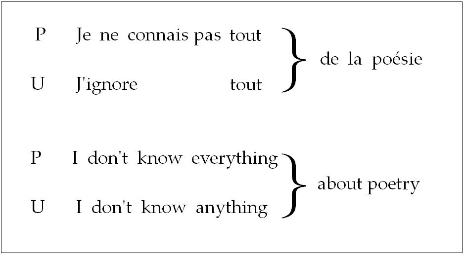
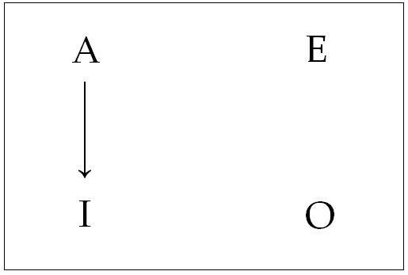
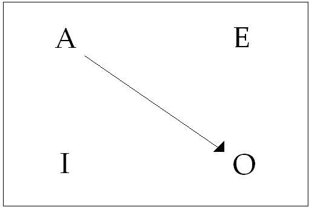
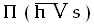

# Leçon 12 | 06 Mars 1968

<!-- source-url: http://staferla.free.fr/S15/S15 L'ACTE.docx -->
<!-- seminar: s15 -->
<!-- lesson: 12 -->

<!-- id: s15-12-0001 -->

<!-- id: s15-12-0002 -->

J’ai écrit « *je ne connais pas* » et « *j’ignore* ». Ce *je ne connais pas* et ce *j’ignore,* je les confronte à quelque chose qui va me servir de base : *de la poésie.* Pour plus de rigueur, je dis que je pose que *je ne connais pas* équivaut à *j’ignore.* J’admets, je prends que la négation est incluse dans le terme *j’ignore.*

<!-- id: s15-12-0003 -->

Bien sûr, une autre fois je pourrais revenir sur l’*ignosco* et sur ce qu’il indique très précisément dans la langue latine d’où il nous vient mais, logiquement, je pose aujourd’hui que les deux termes sont équivalents. C’est à partir de cette supposition que la suite va prendre sa valeur. J’écris deux fois le mot « tout ». Ceux–là sont bien équivalents. Qu’en résulte-t-il ?

<!-- id: s15-12-0004 -->

Que par l’introduction deux fois répétée à ces deux niveaux de ce terme identique, j’obtiens deux propositions de valeur essentiellement différentes. Ce n’est pas la même chose de dire *je ne connais pas tout de la poésie* ou *j’ignore tout de la poésie.*

<!-- id: s15-12-0005 -->

De l’une à l’autre il y a la distance, je le dis tout de suite pour éclairer, puisque c’est nécessaire, où je veux en venir c’est à la distinction signifiante…

<!-- id: s15-12-0006 -->

> je veux dire en tant qu’elle peut être déterminée par des procédés signifiants …entre ce qu’on appelle *une proposition universelle*, pour s’exprimer avec ARISTOTE, et aussi bien d’ailleurs avec tout ce qui s’est prorogé de logique depuis, et *une proposition particulière*. *Où est donc le mystère si ces signifiants sont équivalents terme à terme* ?

<!-- id: s15-12-0007 -->

Mettons qu’ici nous l’ayons posé par convention, je le répète, ce n’est qu’un scrupule autour de l’étymologie de « *j’ignore* ».

<!-- id: s15-12-0008 -->

« *J’ignore* » veut dire bel et bien ce qu’il veut dire dans l’occasion : je ne sais pas, je ne connais pas. Comment cela aboutit-il à deux propositions : dont l’une se présente bien comme se référant à *un particulier* de ce champ de la poésie : « *Il y en a là-dedans que je ne connais pas, je ne connais pas tout de la poésie.* »

<!-- id: s15-12-0009 -->

Et cette *proposition* bel et bien *universelle*, encore que *négative* : « *De tout ce qui est du champ de la poésie, je n’en connais rien, je n’entrave que couic*. »

<!-- id: s15-12-0010 -->

Ce qui est le cas général. Est-ce que nous allons nous arrêter à ceci qui tout de suite nous introduit dans la spécificité d’une langue positive, dans l’existence particulière du français qui, *comme nous l’ont exposé dans leur temps des gens fort savants,* présente de la duplicité, duplicité des termes où s’appuie la négation, à savoir que le « *ne* » qui semble le support suffisant \- *l’affonctif* [^91] comme on dit - nécessaire et suffisant à la fonction négative, s’appuie, en apparence se renforce, mais peut–être après tout se complique, de cette adjonction d’un terme dont seul l’usage de la langue nous permet de voir à quoi il sert.

<!-- id: s15-12-0011 -->

Là-dessus, quelqu’un qu’en marge je ne peux faire que citer, à savoir un collègue psychanalyste et éminent grammairien du nom de PICHON, dans l’ouvrage qu’avec son oncle DAMOURETTE il a *excogité* sur *la grammaire française*, a introduit de fort jolies considérations, dans la ligne de ce qui était sa méthode et son procédé, concernant ce qu’il appelle

<!-- id: s15-12-0012 -->

- *la fonction* plutôt « *discordantielle* » du « *ne* »,

<!-- id: s15-12-0013 -->

- et celle plutôt « *forclusive* »[^92] du « *pas* ».

<!-- id: s15-12-0014 -->

Il a dit là-dessus des choses fort subtiles et fort nourries de toutes sortes d’exemples pris à tous les niveaux et fort bien choisis sans - *je pense* - être dans l’axe, tout au moins pour nous, qui peut être d’une véritable importance.

<!-- id: s15-12-0015 -->

Comment cette importance est *déterminée* pour nous, c’est ce que je vous ferai entendre, du moins j’espère, *par la suite*.

<!-- id: s15-12-0016 -->

Et pour l’instant, à me référer simplement à cette spécificité de la langue française, je ne veux prendre que l’appui de ce quelque chose qui doit bien se produire ailleurs aussi, s’il se produit dans notre langue, c’est que par exemple on pourrait soulever ceci, c’est que si le résultat de cet énoncé tenait au fait que nous puissions grouper le « *pas tout* », auquel cas le sens de la phrase reviendrait, rendant superflu en quelque sorte, permettant d’élider comme il arrive dans la conversation familière, je ne dis pas de supprimer : d’élider, de faire rentrer dans la gorge le « *ne* », « *j’connais pas tout* », avec « *pas tout* » ensemble, ce serait la non séparabilité de la négation, que nous pouvons appeler incluse au terme de « *j’ignore* » et qui serait là le ressort, et tout le monde serait bien content.

<!-- id: s15-12-0017 -->

Je ne vois pas pourquoi on ne se satisferait pas de cette explication s’il ne s’agissait, bien sûr, que de résoudre cette petite énigme. C’est drôle, mais enfin ça ne va peut-être pas si loin que ça en a l’air. Si ! Ça va plus loin, comme nous allons essayer de le démontrer en nous référant à une autre langue, la langue anglaise par exemple.

<!-- id: s15-12-0018 -->

Essayons de partir de quelque chose qui correspond comme sens à la première phrase :

<!-- id: s15-12-0019 -->

> « *I don’t know everything about pœtry.* » et l’autre phrase :

<!-- id: s15-12-0020 -->

> « *I don’t know anything about pœtry.* »

<!-- id: s15-12-0021 -->

Ce qui va pourtant nous apparaître, en considérant les choses exprimées dans cette autre langue, c’est que, pour produire ces deux sens équivalents à la distance des deux premiers, l’explication que nous avons tout à l’heure évoquée du blocage des deux signifiants ensemble va se trouver obligatoirement inversée, car ce blocage du « *pas* » avec le terme « *tout* » dans le premier exemple se trouve ici réalisé - au niveau signifiant, j’entends - dans ce qui correspond à la seconde articulation, la seconde proposition, celle que nous avons qualifiée d’*universelle*.

<!-- id: s15-12-0022 -->

*Anything - comme chacun sait -* est en effet là comme équivalent de *something,* quelque chose qui se transforme en *anything* dans la mesure où c’est au titre *négatif* qu’il intervient. Par conséquent, notre première explication n’est pas pleinement satisfaisante puisque c’est par quelque chose de tout opposé, c’est par un blocage fait au niveau de la seconde phrase, celle qui réalise dans l’occasion l’universelle, que se produit ce blocage, ce détachement également ambigu d’ailleurs, le *don’t* ne disparaissant pas pour autant pour obtenir ce sens : « *je n’entrave rien à la poésie* ». Par contre c’est là où *everything* se trouve conjoint avec le *I don’t know* que se réalise le premier sens.

<!-- id: s15-12-0023 -->

Ceci est bien fait pour nous faire réfléchir à quelque chose qui n’intéresse rien de moins que, comme je vous l’ai déjà dit, abattant mes cartes, ce dont il s’agit quant au mystère des relations de *l’universel* et *du* *particulier.* Nous tâcherons de dire tout à l’heure quelle était *la préoccupation fondamentale de celui qui a introduit cette distinction dans l’histoire*, à savoir ARISTOTE.

<!-- id: s15-12-0024 -->

Chacun sait que sur ce sujet du biais dont il faut prendre ces deux registres de l’énoncé, il s’est produit une sorte de petite révolution de l’esprit, celle que j’ai déjà à plusieurs reprises épinglée de l’introduction des quantificateurs.

<!-- id: s15-12-0025 -->

Il y a peut-être quelques personnes ici - *j’aime le supposer -* pour qui ce n’est pas simplement un chatouillage de l’oreille.

<!-- id: s15-12-0026 -->

Mais il doit y en avoir également beaucoup pour qui ce n’est vraiment que l’annonce que j’ai faite qu’à un moment donné j’en parlerais. Et *- Dieu sait comment -* il va falloir que je vous en parle par le point où ça nous intéresse, le point où j’en suis, le point donc où il m’a semblé que ça pouvait nous *servir,* c’est-à-dire que je ne peux pas vous en donner toute *l’histoire*, tous *les antécédents*, comment c’est surgi, ça a émergé, ça s’est perfectionné et comment - *en fin de compte, c’est à ça qu’il faut que je me limite -* c’est pensé par ceux qui en usent. Comment le savoir ?

<!-- id: s15-12-0027 -->

Car il n’est pas sûr du tout que, parce qu’ils s’en servent, ils le pensent. Je veux dire qu’ils situent d’aucune façon ce que leur façon de s’en servir implique au niveau du penser. Alors je vais bien être forcé d’en partir de la façon dont moi je le pense, au niveau que je pense, qui vous intéresse, c’est-à-dire au niveau où ça peut, à nous, nous servir à quelque chose.

<!-- id: s15-12-0028 -->

Au niveau d’ARISTOTE, tout repose sur ceci, qui est désigné dans quelque chose qui est un signe. Ce qu’il croit pouvoir se permettre, il se permet d’opérer ainsi, à savoir que s’il a dit que :

<!-- id: s15-12-0029 -->

> « *Tout homme est un animal* » il peut à toutes fins utiles, si ça lui semble pouvoir servir à quelque chose, en extraire :

<!-- id: s15-12-0030 -->

> « *Quelque homme est un animal* ».

<!-- id: s15-12-0031 -->

C’est ce que nous appellerons - ce n’est pas tout à fait le terme dont il se sert - puisqu’il s’agit d’un rapport qu’on a qualifié de subalterne entre *l’universelle* et *la particulière*, une « *opération de subalternation* ». J’aurai probablement plus d’une fois à faire *quelque remarque incidente* sur la façon dont on nous rebat les oreilles de « *l’Homme* » dans les exemples, les illustrations que donnent les logiciens de leurs élaborations, qui n’est sans doute pas sans avoir une valeur symptomatique.

<!-- id: s15-12-0032 -->

Nous pouvons commencer à nous en douter, *dans toute la mesure où nous nous sommes fait la remarque,* que peut-être « *l’Homme* » nous ne savons pas si bien ce que c’est que ça. Enfin, ça nous entraînerait… La question de savoir si deux ensembles *- dit-on de nos jours -* peuvent avoir quelque chose de commun est une question grave qui est en train de comporter toute une révision de la théorie mathématique.

<!-- id: s15-12-0033 -->

Car après tout, nous pourrions fort bien dès l’abord, et sans nous mettre à faire *des gestes vains*, j’ose le dire, comme celui de notre ami Michel FOUCAULT [^93] donnant *l’absoute* [^94] à un humanisme tellement déjà depuis longtemps crevé qu’il s’en va au fil de l’eau sans que personne sache où il est parvenu, comme si ça faisait encore question et comme si c’était là l’essentiel de la question concernant le structuralisme, passons… Disons simplement que logiquement nous pouvons seulement retenir ceci qui seul nous importe, si nous parlons de la même chose quand nous disons *- logiquement j’entends -* :

<!-- id: s15-12-0034 -->

> « *Tout homme est un animal* » ou, par exemple :

<!-- id: s15-12-0035 -->

> « *Tout homme parle* »

# La question de savoir si deux *ensembles* *- je vous le répète -* peuvent avoir un élément commun est une question qui est *très sérieusement soulevée* pour autant qu’elle soulève ceci, à savoir ce qu’il en est de l’élément, si l’élément lui-même ne peut être…

# c’est le fondement de *la théorie des ensembles*

# …que quelque chose à propos de quoi vous pouvez spéculer exactement comme si c’était un ensemble, 

# c’est là que commence à pointer la question, mais laissons…

<!-- id: s15-12-0036 -->

Vous savez que la patrie est à la fois la réalité la plus belle, et que bien sûr il va de soi que :

<!-- id: s15-12-0037 -->

> « *Tout français doit mourir pour elle.* »

<!-- id: s15-12-0038 -->

Mais c’est à partir du moment où vous *subalternez* pour savoir si :

<!-- id: s15-12-0039 -->

> « *Quelque français doit mourir pour elle* » qu’il me semble que vous devez vous apercevoir que l’opération de subalternation présente quelques difficultés, parce que

<!-- id: s15-12-0040 -->

« *Tout français doit mourir pour elle* » et

<!-- id: s15-12-0041 -->

« *Quelque français doit mourir pour elle* » ce n’est pas du tout la même chose ! C’est des choses dont on s’aperçoit tous les jours.

<!-- id: s15-12-0042 -->

C’est là qu’on s’aperçoit ce que traîne d’ontologie…

<!-- id: s15-12-0043 -->

> c’est-à-dire de quelque chose qui est un peu plus que ce qui était sa visée en faisant *une logique, une logique formelle* …ce que d’ontologie traîne encore la logique.

<!-- id: s15-12-0044 -->

J’évite, je vous assure, beaucoup de digressions, je voudrais que vous ne perdiez pas mon fil. Là, je vais introduire d’emblée, par un procédé d’opposition évidemment un petit peu tranchant. Je me réjouis - peut-être à tort - mais d’habitude il y a un éminent logicien qui est ici au premier rang, je le regarde toujours du coin de l’œil pour voir le moment où il va pousser des hurlements. Il n’est pas là aujourd’hui, je ne crois pas le voir, ça me rassure à la fois, puis ça m’ennuie d’autre part : j’aurais bien aimé savoir ce qu’il m’en dirait.

<!-- id: s15-12-0045 -->

À la fin, d’habitude, il me serre la main et il me dit qu’il est tout à fait d’accord, ce qui me fait toujours un grand bien.

<!-- id: s15-12-0046 -->

Non pas du tout que j’aie besoin qu’il me le dise pour savoir, naturellement, où je vais, mais chacun sait que, quand on s’aventure dans des terrains qui ne sont pas à proprement parler les vôtres, on est toujours à la portée de… pan ! pan !

<!-- id: s15-12-0047 -->

Or moi, bien sûr, ce n’est pas d’empiéter sur des terrains qui ne sont pas les miens, qui m’importe, c’est de trouver, au niveau de la logique, quelque chose qui soit pour vous un exemple, un fil, un guide exemplificateur des difficultés auxquelles nous avons affaire, nous, ceux au nom de qui je vous parle, ceux aussi à qui je parle… et cette ambiguïté est là bien essentielle …à savoir les psychanalystes, au regard d’une action qui ne concerne rien de moins et rien d’autre que ce que j’ai essayé pour vous de définir comme le sujet.

<!-- id: s15-12-0048 -->

Le sujet, ce n’est pas « *l’Homme* ». S’il y a des gens qui ne savent pas ce que c’est que « *l’Homme* », c’est bien *les psychanalystes*.

<!-- id: s15-12-0049 -->

C’est même tout leur mérite de le mettre radicalement en question, je parle, en tant qu’homme, pour autant que ce mot ait même encore une apparence de sens pour quiconque.

<!-- id: s15-12-0050 -->

Alors, je passe au niveau de *la logique des quantificateurs* et je me permets, avec ce côté *bulldozer* que j’emploie de temps en temps, d’indiquer que la différence radicale dans la façon d’opposer *l’universel* au *particulier*, au niveau de *la logique des quantificateurs*, réside en ceci…

<!-- id: s15-12-0051 -->

> naturellement, quand vous ouvrirez des bouquins là-dessus, vous vous y retrouverez avec ce que je vous dis,
>
> vous pourrez bien sûr voir que ça peut être abordé de mille autres façons, mais l’essentiel, c’est que vous voyiez que c’est ça le fil principal, au moins pour ce qui nous intéresse …que *l’universelle* - du moins *affirmative* - doit s’énoncer ainsi : « *pas d’homme qui ne soit sage* ».

<!-- id: s15-12-0052 -->

Voilà…

<!-- id: s15-12-0053 -->

> croyez-m’en au moins pour un instant, l’important c’est que vous puissiez suivre le fil pour voir où je veux en venir …qui donne la formule de *l’universelle affirmative* à savoir ce qui, dans ARISTOTE, s’articulerait : « *tout homme est sage* » énoncé rassurant qui, dans l’occasion d’ailleurs, n’a aucune espèce d’importance. Ce qui nous importe, c’est de voir l’avantage que nous pouvons trouver, cet énoncé, à l’articuler autrement. Là, tout de suite, vous pouvez remarquer que cette *universelle affirmative* viendra mettre en jeu, pour se supporter, rien de moins que *deux négations*.

<!-- id: s15-12-0054 -->

Il importe que vous voyiez dans quel ordre les choses vont se présenter. Mettons ici les formes aristotéliciennes :

<!-- id: s15-12-0055 -->

<!-- id: s15-12-0056 -->

*universelles affirmative* et *négative*, ce sont les lettres A et E qui les désignent dans la postérité d’ARISTOTE, et les lettres I et O sont les *particulières*, I étant la *particulière affirmative*.

<!-- id: s15-12-0057 -->

« *Tous les hommes sont sages* » (A)

<!-- id: s15-12-0058 -->

« *Quelque homme est sage* » (I).

<!-- id: s15-12-0059 -->

Comment, dans notre articulation quantificatrice, « *quelque homme est sage* » va-t- il pouvoir s’exprimer ? J’avais dit d’abord : « *Pas d’homme qui ne soit sage* ». Nous articulons maintenant : «* Il est homme qui soit sage * » ou «* Homme qui soit sage* » mais ce « *homme* » qui resterait suspendu en l’air, nous le supportons comme il convient d’un « *il est* », de même que

<!-- id: s15-12-0060 -->

« *Pas d’homme qui ne soit sage* » c’est « *Il n’est d’homme qui ne soit sage* ».

<!-- id: s15-12-0061 -->

Mais vous voyez aussi qu’il y a plus du « *ne* » au niveau du « *ne soit sage* », il faut que ce soit \[ainsi\] pour qu’il y ait le sens « *qui soit sage* ». Ou, si vous voulez articuler encore « *Il est homme tel qu’il soit sage* » ce « *tel que* » n’a rien d’abusif car vous pouvez aussi le mettre au niveau de l’universelle : « *Il n’est homme tel qu’il ne soit sage* »

<!-- id: s15-12-0062 -->

Pour, donc, faire l’équivalent de notre *subalternation* aristotélicienne, nous avons dû effacer deux négations.

<!-- id: s15-12-0063 -->

Ceci est fort intéressant parce que, d’abord nous pouvons voir qu’un certain usage de la double négation n’est pas du tout fait pour se résoudre en une affirmation mais, justement, à permettre…

<!-- id: s15-12-0064 -->

> selon le sens où elle est employée cette *double négation* : soit qu’on l’ajoute, soit qu’on la retire …d’assurer le passage de *l’universel* au *particulier*.

<!-- id: s15-12-0065 -->

Voilà qui est assez frappant et destiné à nous faire nous demander ce qu’il faut bien dire pour que, dans certains cas, *la double négation*, nous puissions l’assimiler au retour à zéro, c’est-à-dire ce qu’il y avait comme affirmation au départ et, dans d’autres cas, avec ce résultat.

<!-- id: s15-12-0066 -->

Mais continuons à nous intéresser à ce que nous offre comme propriété ce dont nous sommes partis comme fonctionnement, que nous avons épinglé…

<!-- id: s15-12-0067 -->

> parce que c’est juste, parce que c’est à cela que ça répond …l’opération quantificatrice. N’enlevons qu’une négation, la première : « *Il est homme tel qu’il ne soit sage* »

<!-- id: s15-12-0068 -->

Là aussi, je particularise, et d’une façon qui correspond à *la particulière négative*. C’est ce qu’ARISTOTE appellerait : « *Quelque homme n’est pas sage* ». À la vérité, dans ARISTOTE, ce « *pas sage* », non plus de subalternation mais de subalternation opposée, qui est diagonale, opposition de A à O, de « *Tout homme est sage* » à « *Quelque homme n’est pas sage* », c’est ce qu’il appelle « *contradictoire* ».

<!-- id: s15-12-0069 -->

<!-- id: s15-12-0070 -->

L’usage du mot « *contradictoire* » nous intéresse, nous, les analystes, d’autant plus que… *comme au dernier séminaire fermé M.* NASSIF *l’a rappelé* …c’est un point tout à fait essentiel pour les psychanalystes que FREUD leur ait sorti une fois *cette vérité* assurément *première*, que *l’inconscient ne connaît pas la contradiction*.

<!-- id: s15-12-0071 -->

Seul inconvénient…

<!-- id: s15-12-0072 -->

> on ne sait jamais les fruits que porte ce que vous énoncez comme vérité, surtout première …c’est que ceci a eu pour conséquence que les psychanalystes, à partir de ce moment–là, se sont crus en vacances, si je puis dire, à l’endroit de *la contradiction*, et qu’ils ont cru que du même coup cela leur permettait eux–mêmes de n’en rien connaître, c’est-à-dire de ne s’y intéresser à aucun degré. C’est une conséquence manifestement abusive. Ce n’est pas parce que *l’inconscient*, même si c’était vrai, ne connaîtrait pas la contradiction que *les psychanalystes* n’ont pas à la connaître, ne serait-ce que pour savoir pourquoi il \[l’inconscient\] ne la connaît pas, par exemple !

<!-- id: s15-12-0073 -->

Enfin remarquons que « *contradiction* » mérite un examen plus attentif, que naturellement les logiciens ont fait depuis longtemps, et que c’est tout autre chose que de parler de « *contradiction* » au niveau du *principe de non-contradiction*…

<!-- id: s15-12-0074 -->

> à savoir que A ne saurait être non-A du même point de vue et à la même place …et le fait que notre particulière négative ne soit là, « *contradictoire* ». C’est vrai, elle l’est.

<!-- id: s15-12-0075 -->

Mais vous voyez que dans le biais : « *Il est homme tel qu’il ne soit sage* », je ne la porte…

<!-- id: s15-12-0076 -->

> au regard de la formule qui nous a servi de point de départ, fondée sur la double négation …je ne la porte qu’à la position d’exception. Bien sûr, l’exception ne confirme pas la règle, contrairement à ce qui se dit couramment et qui arrange tout le monde. Ça la réduit simplement à la valeur de règle sans valeur nécessaire, c’est-à-dire ça la réduit à la valeur de règle, c’est même la définition de la règle.

<!-- id: s15-12-0077 -->

Alors, vous commencez à voir combien les choses peuvent prendre pour nous d’intérêt. Je fais ici appel à *mon auditoire psychanalytique* pour lui permettre un peu de ne pas s’ennuyer. Vous voyez l’intérêt de ces articulations qui nous permettent de nuancer des choses aussi intéressantes que celle-ci, par exemple, que ce n’est pas pareil de dire…

<!-- id: s15-12-0078 -->

> c’est pourquoi j’ai fait cette distinction au niveau de la contradiction …« *L’homme est non femme* »…

<!-- id: s15-12-0079 -->

> là bien sûr, on nous dira que l’inconscient ne connaît pas la contradiction …mais ce n’est pas tout à fait pareil de dire :

<!-- id: s15-12-0080 -->

- *universelle* : « *pas d’homme*… - il s’agit du sujet, bien sûr - …*qui n’exclue la position féminine, la femme* »

<!-- id: s15-12-0081 -->

- ou, l’état d’*exception* et non plus de *contradiction* : « *il est homme tel qu’il n’exclue pas la femme* ».

<!-- id: s15-12-0082 -->

Ceci peut vous montrer cependant ce qu’il peut y avoir de plus maniable et de destiné à montrer l’intérêt de ces recherches logiques, même au niveau où *le psychanalyste se croit*…

<!-- id: s15-12-0083 -->

> chose qui mérite bien, avec le temps, de s’appeler *obédience* …obligé d’avoir le regard fixé sur l’horizon du *préverbal*.

<!-- id: s15-12-0084 -->

Continuons - nous, par contre - notre petit chemin en faisant une expérience : « *Il est homme tel qu’il ne soit sage* » ai-je dit.

<!-- id: s15-12-0085 -->

Vous avez pu remarquer que le « *pas* », nous nous en sommes jusqu’à présent passés. Essayons de voir ce que ça va faire.

<!-- id: s15-12-0086 -->

« *Il est homme tel qu’il soit -* par exemple - *pas sage* ». Ça n’a pas d’inconvénient, ça veut dire pareil : il y en a toujours qui ne sont pas sages. Méfions-nous : ce « *pas sage* » pourrait bien nous servir de *passage* vers quelque chose d’un peu inattendu.

<!-- id: s15-12-0087 -->

Si on remet le « *ne* », ça va toujours : « *Il est homme tel qu’il ne soit pas sage* ». Ça peut encore aller.

<!-- id: s15-12-0088 -->

Venons-en au « *pas sage* » et revenons en diagonale à A, *l’universelle affirmative* d’ARISTOTE étant la locution quantificatrice :

<!-- id: s15-12-0089 -->

> « *Pas d’homme tel qu’il ne soit pas sage* ».

<!-- id: s15-12-0090 -->

C’est que ça fait un drôle de sens, tout d’un coup, c’est l’universelle négative : ils sont tous *pas sages*.

<!-- id: s15-12-0091 -->

Qu’est-ce qui a bien pu se produire ? Ce « *pas* », ajouté, qui était parfaitement tolérable au niveau de *la particulière négative*, voilà que si nous le mettons au niveau de ce qui était auparavant *l’universelle affirmative*…

<!-- id: s15-12-0092 -->

> qui paraissait tout à fait désignée pour aussi bien le tolérer, ce « *pas* » …voilà qu’elle vire au noir, *et je ne sais pas quelle couleur a « e » dans le sonnet de* RIMBAUD[^95], mais au niveau aristotélicien *il est noir*, c’est *l’universelle négative* : ils sont tous pas sages.

<!-- id: s15-12-0093 -->

Je vais tout de suite vous dire l’enseignement que nous allons tirer de cela. C’est évidemment quelque chose qui nous fait toucher du doigt que la relation des *deux* « *ne* »…

<!-- id: s15-12-0094 -->

> telle qu’elle existe dans la structure fondamentale de *l’universelle affirmative quantifiée*,
>
> qui est cette formule : « *Il n’est rien qui ne…* » …a quelque chose qui se suffit en soi-même, et nous en avons *la preuve* dans la libération de ce « *pas* » qui tout d’un coup, inoffensif ailleurs, se trouve ici avoir fait virer une *universelle* dans l’autre.

<!-- id: s15-12-0095 -->

C’est ce qui nous permet d’avancer et d’affirmer que l’opération quantificatrice, quand nous la mettons à *sa fonction rectrice*, fonction d’origine de l’opération logique, se distingue en ceci de la logique d’ARISTOTE, qu’elle substitue…

<!-- id: s15-12-0096 -->

> à la place où l’οὐσἰα \[ousia\], l’essence, l’ontologique n’est pas éliminé, à la place du sujet grammatical …le sujet qui nous intéresse en tant que sujet divisé, à savoir :

<!-- id: s15-12-0097 -->

- la pure et simple division comme telle du sujet en tant qu’il parle,

<!-- id: s15-12-0098 -->

- du *sujet de l’énonciation* en tant que distinct du *sujet de l’énoncé*.

<!-- id: s15-12-0099 -->

L’unité où se présente cette *présence du sujet divisé*, ça n’est rien d’autre que *cette conjonction des deux négations*, et aussi bien c’est celle qui motive que pour vous la présenter, pour l’articuler devant vous - que vous l’ayez remarqué ou pas, mais il est temps qu’on le remarque - les choses n’allaient pas sans l’emploi d’*un subjonctif* : « *Il n’est rien qui ne soit…* » …*sage* ou *pas sage*, la chose importe peu : c’est ce « *soit* » qui marque la dimension de ce glissement, de ce qui se passe entre ces *deux* « *ne* » et qui est précisément là où va jouer la distance qui subsiste toujours de *l’énonciation* à *l’énoncé*.

<!-- id: s15-12-0100 -->

Ce n’est donc pas pour rien qu’en vous donnant, il y a quelques séances, le premier exemple de ce qu’il en est de la formulation de PEIRCE[^96], je vous ai bel et bien fait remarquer que ce qui constituait, dans cette exemplification que je vous ai montrée de ces petits traits répartis, bien choisis, en quatre cases :

<!-- id: s15-12-0101 -->

<!-- id: s15-12-0102 -->

que le véritable sujet de toute *universelle*, c’est essentiellement le sujet en tant qu’il est essentiellement et fondamentalement ce « *pas de sujet* » qui déjà s’articule dans notre façon de l’introduire : « *Pas d’homme qui ne soit sage* »

<!-- id: s15-12-0103 -->

Il est difficile de se maintenir sur ce tranchant. Très exactement la théorie, bien sûr, est faite pour l’éliminer. Je veux dire que ce qui nous intéresse, c’est que *la théorie des quantificateurs*, si nous l’articulons, nous force à y déceler ce relief et cette fuite irréductible qui fait que nous ne savons où glisse le nerf proprement instituant de ce qui ne semble d’abord que négation répétée, et qui est au contraire négation créatrice en tant que c’est d’elle que s’instaure la seule chose qui soit vraiment digne d’être articulée dans le savoir, c’est à savoir l’*universelle affirmative*, ce qui vaut toujours, et en tout cas cela seul nous intéresse.

<!-- id: s15-12-0104 -->

C’est ainsi que vous verrez se formuler, sous la plume des logiciens de la quantification, que nous pouvons faire l’équivalence de ce qui est exprimé par un ∀, à savoir la valeur universelle d’une proposition écrite telle que : ; Fx, nous devons l’écrire dans *les termes algébrisés de la logique symbolique*, à savoir que cette vérité universelle : ∀ est *pour tout x*, que x fonctionne dans la fonction Fx, à savoir par exemple dans l’occasion, la fonction d’être sage et que l’homme sera un x qui sera toujours à sa place dans cette fonction.

<!-- id: s15-12-0105 -->

La transformation qui nous est donnée comme recevable dans *la théorie des quantificateurs* se représente ainsi par : :…

<!-- id: s15-12-0106 -->

> ce : étant le symbole qui spécifie pour nous, dans la quantification, l’existence d’un x, d’une valeur
>
> de x telle qu’elle satisfasse la fonction Fx …et on nous dira que le ; Fx peut être traduit par un : à savoir qu’il n’existe pas de x qui soit tel qu’il mette la fonction Fx en l’air : .

<!-- id: s15-12-0107 -->

Bref, que la conjonction de ces deux signes « *moins* »… *et c’est bien quelque chose qui se trouve recouvrir la forme articulée*, langagièrement nuancée, sous laquelle je vous l’ai avancée …suffit à symboliser la même chose, ce qui n’est point vrai, car il est bien clair que - tout moins qu’ils soient - dans la symbolisation logique ces deux « moins » n’ont pas la même valeur, qu’il n’existe pas de x qui - ai-je été amené à vous dire - mette en l’air, c’est-à-dire rende fausse, la fonction Fx. J’ai symbolisé que ces deux termes, celui de la non existence \[/\] et celui de  qui se solde par la fausseté de la fonction, ne sont pas du même ordre. Mais c’est précisément ce dont il s’agit.

<!-- id: s15-12-0108 -->

C’est de masquer quelque chose qui est justement la fissure très fine, et tout à fait essentielle pour nous à déterminer et à fixer dans son plan, qui est *la distance* du *sujet de l’énonciation* au *sujet de l’énoncé*, comme je vous le ferai, par exemple, encore remarquer à propos d’une autre façon, au niveau d’autres auteurs, de donner de la fonction une image qui soit plus maniable au niveau de son application proprement prédicative, car à la vérité, Fx peut désigner *toutes sortes de choses*, y compris toutes espèces de formules mathématiques que vous pouvez y appliquer. C’est la formule la plus générale.

<!-- id: s15-12-0109 -->

Par contre si vous voulez rester au niveau de mon « *Tout homme est sage* », voilà la formule : ( h v s ), avec le signe de *disjonction* « v » que j’avais déjà mis l’autre fois au tableau, formule à laquelle, selon les logiciens qui ont introduit la quantification, il suffirait d’ajouter le Π du πᾶν \[pan\] ou le Σ pour en faire une *proposition universelle* ou *particulière* : Π(h v s) et qui voudrait dire que, en somme ce à quoi nous avons affaire, c’est à la disjonction de « *pas homme* » et de ce s. Cela veut dire que si nous choisissons le contraire du « *pas homme* », c’est-à-dire « *l’homme* », nous avons la disjonction : « *il est sage* », soit *dans tous les cas*, soit *dans certains cas particuliers*.

<!-- id: s15-12-0110 -->

Si nous prenons la négation du *sage,* c’est-à-dire si nous renonçons au *sage,* nous sommes de l’autre côté de la disjonction, à savoir du côté du « *pas homme* »: cela peut encore aller, jusqu’à ce point. Mais ceci n’implique nullement l’exigence du « *non sage* » pour ce qui n’est « *pas homme* ». Or ceci n’est pas indiqué dans la formule. Il faudrait pour cela que la disjonction soit marquée par exemple comme cela :

<!-- id: s15-12-0111 -->

<!-- id: s15-12-0112 -->

donc un signe qui serait « *l’inverse* » de celui de *la racine carrée*, ceci destiné à nous montrer que, au regard de *l’implication*… si nous avons ici en somme au niveau de *l’universel* que *homme* implique *sage …non sage,* certes, n’implique pas *homme,* mais que *sage* est parfaitement compatible, lui aussi, avec *pas homme.* C’est-à-dire qu’il peut y avoir quelque chose d’autre que l’homme qui soit sage, ceci est élidé dans la façon de présenter toute crue la formule de la disjonction, entre un sujet négativé et le prédicat qui ne l’est pas.

<!-- id: s15-12-0113 -->

Point aussi où se démontre quelque chose qui, dans le système dit de *la double négation*, à s’exprimer de cette *scription* qui est celle de MITCHELL[^97], laisse toujours échapper ce quelque chose qui, cette fois-ci, loin de suturer la fissure, la laisse à son insu béante, confirmation que de fissure, c’est là toujours ce dont il s’agit. En d’autres termes, ce dont il s’agit \- concernant la logique formelle s’entend - est toujours ceci, de savoir ce qui peut se tirer - *et jusqu’où* - d’un énoncé, à savoir d’obtenir *un énoncé fiable*. C’est bien de là aussi qu’était parti ARISTOTE.

<!-- id: s15-12-0114 -->

ARISTOTE, bien sûr ne disons pas qu’il était à l’aurore de la pensée, parce que le propre de la pensée est précisément de n’avoir jamais eu d’aurore, elle était déjà très vieille et il en savait quelque chose. Il en savait ceci particulièrement que, bien sûr, *il ne serait même pas question de savoir s’il n’y avait pas le langage*. Ça ne suffit pas bien sûr, à ce que le savoir ne dépende que du langage, mais lui, ce qui lui importait, c’était de savoir justement - à cause de ceci que la pensée ne datait pas d’hier - ce qui d’une énonciation pouvait faire *une chose nécessaire*, pas moyen de céder sur ce point.

<!-- id: s15-12-0115 -->

La première ἀναγκη \[ananké\] est ἀναγκη du discours.

<!-- id: s15-12-0116 -->

La logique formelle d’ARISTOTE était le premier pas pour savoir ce qui proprement et *distingué comme tel au niveau de l’énoncé*, pouvait se formuler comme donnant de cette source - ce qui ne veut pas dire que ce fût la seule, bien sûr - sa nécessité à l’énonciation, c’est-à-dire que là, il n’y a pas moyen de reculer. Aussi bien, c’est le sens qu’avait à cette époque le terme d’ἐπιστήμη \[epistèmé\] c’est celui d’une *énonciation sûre*. La distinction de l’ἐπιστήμη \[epistèmé\] et de la δόξα \[doxa\] n’est rien d’autre qu’*une distinction qui se situe au niveau du discours*.

<!-- id: s15-12-0117 -->

C’est sa différence avec ce qu’est pour nous la science… *à aller dans le même sens, à savoir d’un énoncé strictement fiable* …et pour nous bien sûr, qui avions fait *quelques productions inédites* concernant ce qu’il en est de l’énoncé, et d’ailleurs pas dans d’autres endroits que les mathématiques.

<!-- id: s15-12-0118 -->

Ces lois de l’énoncé, pour très fiables qu’elles sont devenues, deviennent encore chaque jour de plus en plus exigeantes et à ce titre ne sont pas sans démontrer leurs limites. Je veux dire que c’est dans toute la mesure où nous avons fait, en logique, quelques pas dont, bien sûr, celui que là je vous représente, mais c’est le pas originel, nous, qui nous intéresse. Pourquoi ? Parce que c’est en deçà de cette tentative de capture de l’énonciation par les réseaux de l’énoncé, que nous analystes, nous nous trouvons. Mais quelle chance que le travail ait été poussé si loin ailleurs, si ça peut être par là qu’à nous se livrent quelques règles pour bien repérer la fissure.

<!-- id: s15-12-0119 -->

Quand j’énonce que *l’inconscient est structuré comme un langage*, ça ne veut pas dire que je le sais, puisque ce dont je le complète, c’est proprement ce « *qu’on* » - sur lequel je mets l’accent et qui est celui qui donne le vertige *à l’ensemble des psychanalystes* - c’est que « *on* » n’en *sait* rien, « *on* », le *sujet* *supposé savoir*, *celui qu’il faut toujours qu’il soit là pour nous donner le repos*.

<!-- id: s15-12-0120 -->

Ce n’est donc pas que je le *sais* si je l’énonce. C’est que mon discours ordonne, en effet, l’inconscient. Je dis que le seul discours que nous ayons sur l’inconscient - celui de FREUD - *fait sens*, certes, \[mais\] ce n’est pas cela qui est important, parce qu’*il fait sens* comme « *on fait eau* » : de toutes parts. Tout fait sens, je vous l’ai montré[^98]. « *Colourless green ideas sleep furiously* » fait sens aussi. C’est même la meilleure caractérisation que l’on puisse donner de *l’ensemble de la littérature analytique*.

<!-- id: s15-12-0121 -->

Si ce sens dans FREUD est si plein, si résonnant par rapport à ce qui est en cause - l’inconscient - si, en d’autres termes, ça se distingue de tout ce qu’il a rejeté à l’avance comme occultisme, si chacun sait et sent que ce n’est pas du MESMER…

<!-- id: s15-12-0122 -->

> c’est pour ça que ça subsiste malgré l’insensé du discours analytique …c’est un miracle que nous ne pouvons *expliquer qu’indirectement*, à savoir par la formation scientifique de FREUD.

<!-- id: s15-12-0123 -->

L’important ce n’est pas son sens, à ce discours dont il faut d’abord qu’il existe, pour que ce que j’avance avec « *l’inconscient est structuré comme un langage* » ait sa référence, sa *Bedeutung,* parce que c’est là qu’on s’aperçoit que la référence, c’est le langage. En d’autres termes, que tout ce que mon discours articule à propos de celui de FREUD sur l’inconscient aboutit à *des formules isomorphes*, celles qui s’imposent s’il s’agit *du langage pris comme objet*.

<!-- id: s15-12-0124 -->

L’isomorphisme qu’impose, à mon discours, l’inconscient au regard de ce qu’il en est du discours sur le langage, voilà ce dont il s’agit et ce qui fait qu’en ce discours doit être pris tout psychanalyste, pour autant qu’il s’engage dans ce champ qui est celui défini par FREUD pour l’inconscient. À partir de là, nous ne pouvons guère qu’énoncer, avant de nous quitter, quelques épinglages destinés à ce que vous ne perdiez pas la tête dans cette affaire.

<!-- id: s15-12-0125 -->

J’espère que ce que je viens de dire au dernier terme concernant la formule : « *l’inconscient est structuré comme un langage* » gardera tout de même sa valeur de point tournant pour ceux qui l’entendent même depuis longtemps comme aussi bien pour ceux qui se refusent à l’entendre. Bien sûr que notre science, celle qui est la nôtre, ne se définit pas seulement de ces coordonnées par quoi il n’est de savoir que par le langage.

<!-- id: s15-12-0126 -->

Il reste pourtant que la science elle-même ne peut se soutenir que de la mise en réserve d’un savoir purement langagier, à savoir d’une logique strictement interne et nécessaire au développement de son instrument, en tant que *l’instrument est mathématique*, et que chacun peut toucher du doigt qu’à tout instant les impasses proprement langagières où la met ce progrès de *l’instrument mathématique* lui-même, en tant qu’à la fois il accueille et qu’il est accueilli par chaque champ nouveau de ces découvertes factuelles, ce progrès est un ressort tout à fait essentiel à la science moderne.

<!-- id: s15-12-0127 -->

Il reste donc bien qu’il y a tout un niveau où le savoir est de langage et que ça n’est pas vanité de dire que ce champ est proprement tautologique, que ce soit à l’origine même de ce qui a fait le départ de la science, à savoir une prise de mesure du clivage ainsi défini dans le discours, d’une ascèse logique qui s’appelle le *cogito.*

<!-- id: s15-12-0128 -->

C’est un signe que j’aie pu - *cette ascèse* - la développer assez pour y fonder la *logique du fantasme*, celle dont les articulations ont été, je dois dire, fort bien isolées la dernière fois lors du séminaire fermé, par un de ceux qui ici travaillent dans ce champ de mon discours. Il ne s’agit pas, comme il l’a dit, et comme il l’a dit d’une façon légitime dans la perspective de ce qu’il essayait d’apporter comme réponse à ce discours, d’une *nouvelle négation* qui serait celle que je produirais.

<!-- id: s15-12-0129 -->

Le Ciel m’en préserve que je donne encore à quiconque, avec l’introduction d’une nouveauté, l’occasion d’escamoter ce dont il s’agit, qui est bien tout le contraire de ce quelque chose qu’on bouche puisque c’est quelque chose d’imbouchable.

<!-- id: s15-12-0130 -->

Plût au Ciel que je ne donnasse point au psychanalyste un renouvellement d’alibi, à ceci qu’il a à être dans le discours analytique, à savoir au sens propre et aristotélicien, son ὑποκειμἐνων \[hypokeimenon\], son support subjectif, certes, mais en tant que lui-même en assume la division.

## Notes

[^91]: J. Damourette et E. Pichon : *Des mots à la pensée. Essai de grammaire de la langue française* (1911-1927), Paris, Éd. d'Arthrey ; rééd. C.N.R.S., 7 vol., Tome 1,

    Chap. VII, « La négation », p. 130 ; rééd. Vrin (2000), en 8 volumes.

[^92]: J. Damourette et E. Pichon : Ibid., et « *Sur la signification psychologique de la négation en français* », Journal de psychologie normale et pathologique, Paris,

    1928 ; rééd. in *Grammaire et inconscient*, suppl. au n° 2 de *L'unebévue*, Paris, EPEL, 1993.

[^93]: Allusion probable à un certain nombre d'écrits de Michel Foucault de ces années-là (1966, 67, 68), après la publication de « Les mots et les choses »

    (Gallimard, Paris, 1966), où la question de la fin de l'humanisme est, pour Foucault, d'une brûlante actualité. Cf. Michel Foucault : « *Dits et écrits* »,

    Tome I, Gallimard, Paris, 1994.

[^94]: L’absoute : cérémonie faite notamment de prières terminant l'office des morts et se faisant autour du cercueil ou du catafalque.

[^95]: Cf. Arthur Rimbaud : [« *Voyelles* »](http://perso.dixinet.com/studiocalice/manuscrit%20voyelles%20rimbaud.htm), Paris, Éd. Garnier, 1961, p.110. Dans ce sonnet, la lettre « e » est blanche.

[^96]: Cf. Séance du 7 Février 1968.

[^97]: Oscar Howard Mitchell, 1883 : “*On a New Algebra of Logic*,” in C.S. Peirce (ed.), Studies in Logic. By Members of the Johns Hopkins University,

    Little, Brown, and Company : Boston; reprinted John Benjamins: Amsterdam/Philadelphia 1983 (= Foundations in Semiotics; 1), 72–106.

[^98]: Cf. le séminaire 1964-65 : *Problèmes cruciaux pour la psychanalyse*, séance du 02-12.
