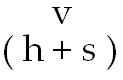

# Leçon 11 | 28 Février 1968 (séminaire fermé)

<!-- source-url: http://staferla.free.fr/S15/S15 L'ACTE.docx -->
<!-- seminar: s15 -->
<!-- lesson: 11 -->

<!-- id: s15-11-0001 -->

[NASSIF](#NASSIF2802)

<!-- id: s15-11-0002 -->

LACAN

<!-- id: s15-11-0003 -->

Quelqu’un qui, déjà alerté la dernière fois par les soins de Monsieur Charles MELMAN…

<!-- id: s15-11-0004 -->

> qui avait bien voulu la dernière fois tenir la place ici, pour le séminaire fermé de la fin janvier …s’est trouvé par lui sollicité, et de façon d’autant plus légitime que Jacques NASSIF, dont il s’agit, a bien voulu faire, pour le *Bulletin de l’École Freudienne*, le résumé de mon séminaire de l’année dernière, celui sur *La logique du fantasme.*

<!-- id: s15-11-0005 -->

Il a bien voulu répondre à cet appel qui consistait à lui demander s’il n’y avait pas quelque chose à dire, ou à interroger, ou à présenter, qui donne une idée de la façon dont il entend le point où nous en sommes venus cette année.

<!-- id: s15-11-0006 -->

Je lui sais tout à fait gré d’avoir bien voulu donner cette réponse, c’est-à-dire préparer quelque chose qui va servir d’introduction à ce qui va se dire aujourd’hui.

<!-- id: s15-11-0007 -->

Déjà, je puis dire en quel sens ceci m’apporte satisfaction :

<!-- id: s15-11-0008 -->

- d’abord pour le pur et simple fait qu’il a préparé ce travail, qu’il l’a préparé d’une façon compétente, étant parfaitement au fait de ce que j’ai dit l’année dernière…

<!-- id: s15-11-0009 -->

- et puis il se trouve que, de ce travail, ce qu’il a extrait, je veux dire ce qu’il a mis en valeur, ce qu’il a isolé par rapport au contenu de ce que j’ai dit l’année dernière, c’est à proprement parler le réseau logique et surtout son importance, son accent, sa signification dans ce qui est peut-être défini, indiqué comme l’orientation de mon discours, enfin sa visée, sa fin, pour dire le mot.

<!-- id: s15-11-0010 -->

Que nous soyons précisément au point où, dans cette élaboration, cette question que je pose sur *l’acte analytique* qui se présente comme quelque chose de profondément impliquant, pour chacun de ceux qui ici m’écoutent au titre d’analystes, nous en arrivons justement à ce point où je vais mettre un accent plus fort encore que celui qui a été mis jusqu’ici, justement pour ne pas simplement…

<!-- id: s15-11-0011 -->

> sur ce quelque chose qui peut s’entendre d’une certaine façon comme 
>
> « *En toute chose, il y a une logique.* »… personne ne sait bien ce que cela veut dire …dire qu’il y a là une logique interne à quelque chose, qu’on serait là simplement à chercher la logique de la chose, c’est-à-dire que le terme « logique » serait là mis en usage d’une façon en quelque sorte métaphorique.

<!-- id: s15-11-0012 -->

Non ce n’est pas tout à fait cela à quoi nous en venons et la dernière fois, au terme de mon discours, il y en avait l’indication dans cette affirmation certainement audacieuse, et dont je ne m’attends pas à l’avance qu’elle trouve écho, résonance… j’espère au moins sympathie …dans l’oreille de tel ou tel de ceux que je peux avoir dans mon auditoire, ici présents au titre de logiciens.

<!-- id: s15-11-0013 -->

Enfin, ce que j’ai indiqué c’est ceci, c’est qu’il devait y avoir…

<!-- id: s15-11-0014 -->

> et bien sûr, j’espère me montrer en état d’apporter dans ce sens quelque argument …quelque relation, quelque possibilité même de *définir* comme telle la logique…

<!-- id: s15-11-0015 -->

> la logique au sens précis du terme, à savoir cette science qui s’est élaborée, précisée, définie …et en disant « définir » cela ne veut pas dire qu’elle se soit définie du premier pas, du premier coup.

<!-- id: s15-11-0016 -->

Disons tout au moins que peut-être est-ce sa propriété qu’elle ne puisse sans doute à proprement parler s’établir que d’une déjà très articulée *définition*.

<!-- id: s15-11-0017 -->

C’est bien pourquoi, en effet, on ne commence, à proprement parler, à la distinguer qu’avec ARISTOTE, et qu’on a déjà, d’ores et déjà, le sentiment qu’elle est portée d’emblée à une sorte de perfection, qui n’exclut pas quand même qu’il y a eu de très sérieux décalages, décrochages même, qui en quelque sorte nous permettent d’approfondir ce dont il s’agit.

<!-- id: s15-11-0018 -->

J’ai posé l’autre jour qu’il y avait peut-être une définition à laquelle personne n’avait jamais songé jusqu’à présent et que nous essaierons de formuler de façon tout à fait précise, qui pourrait s’articuler autour de ceci : ce que par la logique on essaie…

<!-- id: s15-11-0019 -->

> c’est bien ce « on » aussi qui ici méritera d’être retenu et, en quelque sorte,
>
> signalé d’une parenthèse comme point à élucider pour la suite …c’est quelque chose qui serait de l’ordre - de quoi ? - de la maîtrise ou du débarras, c’est quelquefois la même chose, à l’endroit précisément de ce qu’ici nous pointons dans notre pratique à nous *analystes*, comme le *sujet supposé savoir* : un champ de la science qui aurait précisément pour fin…

<!-- id: s15-11-0020 -->

> et même ici il ne serait pas trop de dire « *pour objet* » car le mot « *objet* »
>
> ici prend toute son ambiguïté d’être interne à l’opération elle-même …disons-le tout de suite, d’exclure de quelque chose, pourtant non seulement d’articulable mais d’articulé, d’exclure comme tel le *sujet supposé savoir.*

<!-- id: s15-11-0021 -->

C’est une idée, de le définir ainsi, qui ne peut évidemment venir qu’à partir du point où nous en sommes…

<!-- id: s15-11-0022 -->

> tout au moins nous en sommes… je vous ai suffisamment habitués à poser la question comme ça, à savoir
>
> à vous apercevoir que dans la psychanalyse, et c’est vraiment là le seul point vif, le seul nœud, la seule difficulté …le point qui à la fois *distingue la psychanalyse et la met profondément en question* comme science, c’est justement cette chose, qui d’ailleurs n’a jamais été à proprement parler critiquée, accrochée comme telle, c’est à savoir : que ce que le savoir construit - ça ne va pas de soi - quelqu’un le savait avant.

<!-- id: s15-11-0023 -->

Chose curieuse, la question paraît superflue partout ailleurs dans la science. Il est bien clair que ceci tient à la façon dont cette science elle-même s’est originée. Vous verrez que dans ce que va vous dire tout à l’heure Monsieur NASSIF, il y a le repérage précis du point où, en effet, on peut dire que c’est ainsi que la science s’est originée.

<!-- id: s15-11-0024 -->

Seulement c’est, à suivre ce que j’articule, précisément ce qui pour la psychanalyse n’est pas ainsi institué, la question propre de la psychanalyse, celle qui constitue, ou tout au moins autour de quoi s’institue ce point obscur et que nous essayons cette année de mettre dans un certain éclairage, c’est *l’acte psychanalytique.*

<!-- id: s15-11-0025 -->

En d’autres termes, il n’est point possible de faire la moindre avancée, le moindre progrès quant à cet acte lui-même, car il s’agit de l’acte, c’est bien là le grave de ce discours, que ça n’est point pensée sur l’acte, c’est discours qui s’institue à l’intérieur de l’acte et, si l’on peut dire, ce discours doit s’ordonner de telle sorte qu’il ne puisse pas y avoir de doute, qu’il ne s’articule pas autrement.

<!-- id: s15-11-0026 -->

C’est bien là ce qu’il y a de plus difficile et de plus scabreux, et ce qui ne permet pas du tout de l’accueillir à la façon dont sont accueillis en général les discours de philosophes qui sont entendus d’une façon qu’on connaît bien, qui est celle-ci : qu’est-ce qu’on peut faire comme musique autour !

<!-- id: s15-11-0027 -->

Puisqu’après tout, le jour de l’examen, il faut bien mettre les philosophes aussi là où ils sont, c’est-à-dire *sur les bancs de l’école*, c’est tout ce qu’on vous demande, c’est de la musique autour du discours du professeur. Mais je ne suis pas un professeur parce que justement je mets en question le *sujet supposé savoir*. C’est justement ce que le professeur ne met jamais en question puisqu’il est essentiellement, en tant que professeur, *son représentant*. Je ne suis pas en train de parler des savants, je suis en train de parler du savant au moment où il commence à être professeur.

<!-- id: s15-11-0028 -->

Mon discours analytique, d’ailleurs, n’a jamais cessé d’être dans cette position qui constitue justement sa précarité, son danger, et aussi sa suite de conséquences. Je me souviens de la véritable *horrification* que j’avais produite auprès de mon cher ami Maurice MERLEAU-PONTY quand je lui avais expliqué que j’étais dans la position de dire certaines choses, qui maintenant sont devenues de la musique, bien sûr, mais qui au moment où je les disais étaient tout de même dites d’une certaine façon, toujours dans ce biais, ce n’était pas parce que je n’avais pas encore posé la question comme je la pose maintenant, qu’elles n’étaient pas déjà instituées réellement comme cela.

<!-- id: s15-11-0029 -->

Et ce que je disais sur la matière analytique était qu’elle a toujours été de nature telle que, justement de passer par ce clivage, cette fente qui lui donne *ce caractère*, à ce discours, *tellement insatisfaisant* parce qu’on ne voit pas les choses bien rangées là, dans la construction positiviste, avec des étages, et ça monte en pointe,

<!-- id: s15-11-0030 -->

- ce qui est évidemment bien reposant,

<!-- id: s15-11-0031 -->

- ce qui répond à une certaine classification des sciences qui est celle qui reste dominante dans les esprits de ceux qui entrent dans quoi que ce soit : la médecine, la psychologie et autres emplois, mais ce qui n’est évidemment pas tenable à partir du moment où nous sommes dans *la pratique psychanalytique*.

<!-- id: s15-11-0032 -->

Alors, comme cette sorte de discours a toujours engendré, bien sûr, ce je ne sais quel malaise que comporte qu’il ne soit point un discours de professeur, c’est cela qui entraînait en marge ces sortes de bruissements, de murmures, de commentaires qui aboutissaient à des formules aussi naïves que celle-ci…

<!-- id: s15-11-0033 -->

> ceci étant d’autant plus *déconcertant* qu’elles se produisaient dans la bouche de gens qui devaient être les moins naïfs …du *célèbre pilier de comité de rédaction*, comme ça, qui devrait quand même en savoir un bout *sur ce qui se dit et ce qui ne se dit pas*, qu’on obtienne de lui *ce cri d’enfant* que j’ai reproduit quelque part, à savoir : « *Pourquoi est-ce qu’il ne dit pas le vrai sur le vrai* [^81] *?* ».

<!-- id: s15-11-0034 -->

C’est évidemment assez comique et ça donne un petit peu une idée de la mesure, par exemple, des réactions diversement *éprouvées*, *tourmentées*, voire *paniques*, ou au contraire *ironiques*, que je pouvais recueillir…

<!-- id: s15-11-0035 -->

> c’est en ces termes que je m’exprimais auprès de MERLEAU-PONTY …dès l’après-midi même du jour où je parlai.

<!-- id: s15-11-0036 -->

Là, j’ai le privilège d’avoir cette ponction, cet échantillonnage sur mon auditoire, que ce soient des gens qui viennent sur mon divan pour m’en communiquer le premier choc, de ce discours. L’*horrification*, comme je l’ai exprimé, qui s’est aussitôt manifestée chez mon interlocuteur - MERLEAU-PONTY en l’occasion - est véritablement à soi toute seule significative de la différence qu’il y a entre *ma position* dans ce discours et celle du professeur. Elle tient justement tout entière à la mise en question du *sujet supposé savoir*, car tout est là.

<!-- id: s15-11-0037 -->

Je veux dire que même à prendre les positions les plus *radicales*, les plus *idéalistes*, les plus *phénoménologisantes*, il n’en reste pas moins qu’il y a une chose qui n’est pas mise en question…

<!-- id: s15-11-0038 -->

> même si vous allez au-delà de la conscience thétique, comme on dit, si, à vous mettre dans la conscience non thétique, vous prenez ce recul vis-à-vis de la réalité qui a l’air d’être quelque chose de tout à fait subversif,
>
> bref si vous faites le pas existentialiste …il y a une chose que vous ne mettez toujours pas en question, c’est à savoir : si ce que vous dites était *vrai avant*.

<!-- id: s15-11-0039 -->

C’est justement là, la question pour le psychanalyste, et le plus fort, c’est que n’importe quel psychanalyste, je dirais le moins réfléchi, est capable de le sentir, tout au moins, il va même jusqu’à l’exprimer, dans un discours par exemple, auquel je faisais allusion la dernière fois : le « personnage » qui n’est certes pas dans mon sillage puisque justement il se croit obligé de l’exprimer en opposition à ce que je dis, ce qui est vraiment comique car il ne pourrait même pas commencer de l’exprimer s’il n’y avait pas eu auparavant tout mon discours, c’est à cela que j’ai fait allusion en parlant de cet article qui, au reste, fait partie d’un congrès qui n’est pas encore sorti dans la *Revue française de psychanalyse* où il paraîtra sûrement un jour[^82].

<!-- id: s15-11-0040 -->

Maintenant, après cette introduction, vous allez voir que le discours de NASSIF, auquel j’ajouterai ce qui conviendra, va venir en son point destiné à rassembler ce qui a pu constituer l’essence de ce que j’ai articulé l’année dernière comme *Logique du fantasme*, au moment où, précisément, mon discours de cette année, cette présence de la logique… et non pas cette élaboration logique …cette présence de la logique comme instance exemplaire qui, en tant qu’elle est expressément faite pour se débarrasser du sujet supposé savoir, peut-être…

<!-- id: s15-11-0041 -->

> et c’est ce que dans la suite de mon discours de cette année j’essaierai de vous montrer …nous donne le tracé, l’indication d’un sentier en quelque sorte, qui est celui qui nous est prédestiné, ce sentier qu’en quelque sorte déjà elle nous préfigurerait dans toute la mesure où ses variations, ses vibrations, ses palpitations, à cette logique, et précisément depuis le temps…

<!-- id: s15-11-0042 -->

> corrélatif du *temps de la science*, ce n’est pas pour rien …où elle-même s’est mise à vibrer, à ne plus pouvoir rester sur son assiette aristotélicienne, la façon, en somme, dont elle ne peut pas se débarrasser du sujet supposé savoir, si c’est bien ainsi que nous devons interpréter la difficulté de la mise au point de cette logique qu’on appelle logique mathématique ou logistique.

<!-- id: s15-11-0043 -->

Il y a là quelque chose dont nous pouvons trouver tracé pour la manière dont la question se pose à nous, concernant ce qu’il en est de *l’acte analytique*, car c’est précisément à ce point, c’est-à-dire là où l’analyste doit se situer, je ne dis pas seulement se reconnaître en acte, se situer, c’est là que nous pouvons trouver secours, du moins ainsi l’ai-je pensé, de la logique, d’une façon qui nous éclaire au moins quant aux points sur lesquels, il ne faut pas verser, il ne faut pas se laisser prendre à quelque confusion, concernant ce qui fait le statut du psychanalyste.

<!-- id: s15-11-0044 -->

Je vous donne la parole.

# [Exposé de Jacques NASSIF](#Fev28) [^83]

<!-- id: s15-11-0045 -->

Je vous prie d’abord de m’excuser parce que vous ne vous attendiez sans doute pas, et moi non plus d’ailleurs, à avoir à entendre parler un *scribe*, ce qui évidemment risque de le faire balbutier beaucoup.

<!-- id: s15-11-0046 -->

Finalement, j’ai été assez pressé moi-même, et *un scribe pressé* risque de se faire encore moins entendre, si bien que ce que je vais vous dire risque d’être *un peu trop écrit*, mais *écrit* aussi d’une part parce que je suis amené à répéter des choses que vous avez peut-être tous déjà entendues et pourtant qui risquent néanmoins de passer pour allusives.

<!-- id: s15-11-0047 -->

Enfin je suis pris dans cette paraphrase malgré moi du discours de LACAN, et je voudrais, pour commencer donc, vous laisser sur ces deux exergues que je tire d’Edmond JABÈS[^84]. Il fait dire à certain de ses rabbins *imaginaires* ces deux choses à quelques pages d’intervalle :

<!-- id: s15-11-0048 -->

> « *Enfant, lorsque j’écrivis pour la première fois mon nom, j’eus conscience de commencer un livre.* »

<!-- id: s15-11-0049 -->

Et plusieurs pages plus loin :

<!-- id: s15-11-0050 -->

> « *Mon nom est une question, et ma liberté dans mon penchant pour les questions.* »

<!-- id: s15-11-0051 -->

Je crois que, s’il y a un discours possible sur la psychanalyse, il se situe entre ces deux mises en question du nom :

<!-- id: s15-11-0052 -->

- il ne s’agit pas d’écrire un livre,

<!-- id: s15-11-0053 -->

- il ne s’agit pas simplement d’être une question.

<!-- id: s15-11-0054 -->

Je crois que, si le séminaire de l’année dernière s’intitule *Logique du fantasme,* c’est parce qu’il tente de produire une nouvelle négation qui permette d’entendre et de situer la formule de FREUD : « *L’inconscient ne connaît pas la contradiction.* »

<!-- id: s15-11-0055 -->

Cette formule, il faut tout de suite le dire, est prise dans une *préconception concernant les rapports de la pensée au réel* qui faisait croire à FREUD justement que ce qu’il articulait devait être situé comme une scène en deçà de toute articulation *logique.*

<!-- id: s15-11-0056 -->

Or, la logique à laquelle FREUD fait référence pour dire que la pensée n’applique pas ses lois, se fonde sur un schème de l’adaptation à la réalité. C’est pour cela qu’il faut ébranler ce terme de contradiction, et c’est ce qui a amené LACAN à cette autre formule : « *Il n’y a pas d’acte sexuel.* », ce qui nécessite qu’une nouvelle négation soit produite, soit confrontée avec la répétition pour nous fournir un concept de *l’acte*.

<!-- id: s15-11-0057 -->

Ma première partie pourrait s’intituler justement : Le thème de la négation

<!-- id: s15-11-0058 -->

Pour pouvoir isoler les différentes négations que le terme de contradiction recouvre - *l’inconscient ne connaît pas la contradiction* - il est d’abord nécessaire de séparer ces domaines qui se superposent en fait mais que seule la logique formelle permet de distinguer, à savoir *la grammaire* et *la logique*. La négation au sens le plus courant est celle qui fonctionne au niveau de la grammaire. Elle est solidaire de l’affirmation : « *Il y a un univers du discours.* » et sert justement à en exclure qu’il ne peut pas se soutenir, dira-t-on, sans contradiction. Elle se donne à l’intuition donc, dans l’image d’une limite, et soutenue par le geste qui consiste à caractériser une classe par un prédicat, par exemple « le noir », et à désigner dès lors comme non joint au prédicat ce qui n’est pas noir.

<!-- id: s15-11-0059 -->

Si ce qui est bâti sur cette définition de la négation que LACAN appelle « *négation complémentaire* » nous laisse au niveau de la grammaire, c’est qu’on s’octroie, sans même le dire, un métalangage qui permet de faire fonctionner la négation comme concept et comme intuition. Mais il y a plus grave : sur cet usage de la négation se greffe toute une tradition dont FREUD, aux dires de certains, hériterait avec sa notion de *moi*, et qui lie les premiers pas de l’expérience au *fonctionnement*, au surgissement d’une entité autonome, par rapport à celle-ci :

<!-- id: s15-11-0060 -->

- ce qui serait *admis* ou *identifié* serait appelé *moi,*

<!-- id: s15-11-0061 -->

- ce qui serait *exclu* ou *rejeté* pourrait s’appeler *non-moi.*

<!-- id: s15-11-0062 -->

Il n’en est rien, pour cette raison que le langage n’admet en aucune façon une telle complémentarité et que ce que l’on prend ici pour une négation n’est autre que ce qui fonctionne dans la *méconnaissance* à partir de quoi le sujet s’aliène dans *l’imaginaire, le narcissique*. Cette seconde négation de la *méconnaissance* y instaure un ordre logique perverti, et très précisément en effet ce qu’il intitule *le fantasme comme étoffe du désir*, et qui nous laisse donc, encore une fois, au niveau de l’articulation grammaticale.

<!-- id: s15-11-0063 -->

On verra cela beaucoup plus précisément, plus loin. Néanmoins, cette négation de la *méconnaissance* se distingue de *la négation complémentaire* en ce qu’elle est corrélative de l’instauration du sujet comme référent du *manque*.

<!-- id: s15-11-0064 -->

Cette négation, une fois redoublée dans la dénégation freudienne que l’on pourrait ici définir comme la méconnaissance de la méconnaissance, permet en effet qu’affleure le niveau du symbolique et que joue en tant que telle la fonction logique du sujet, à savoir, je vous en rappelle la définition, *ce que représente un signifiant pour un autre signifiant*, ou ce qui *réfère* *le manque* sous les espèces de *l’objet(a)*.

<!-- id: s15-11-0065 -->

Mais cette fonction logique de sujet que j’ai fait surgir ici ne peut surgir en tant que telle…

<!-- id: s15-11-0066 -->

> remettant en question cet « *univers du discours* » que la grammaire, pour ainsi dire, sécrète …en ce qu’elle ne tient pas compte de la duplicité du *sujet de l’énoncé* et du *sujet de l’énonciation*.

<!-- id: s15-11-0067 -->

Donc cette fonction logique de sujet ne peut surgir que si l’écriture est thématisée en tant que telle.

<!-- id: s15-11-0068 -->

Et ma seconde partie s’intitule : La logique et l’écriture

<!-- id: s15-11-0069 -->

Il ne s’agit pas de cette *écriture* simplement instrumentale et technique qui, dans la tradition philosophique, est décrite comme signifiant de signifiant, mais de ce jeu de la répétition qui, se posant comme *je,* débarrasse ce qui est *logique* de la gangue *grammaticale* qui l’enveloppe. Le sujet est en effet la racine de la fonction de *la répétition* chez FREUD, et l’écriture : la mise en acte de cette répétition qui cherche précisément à répéter ce qui échappe, à savoir *la marque première* qui ne saurait se redoubler et qui glisse nécessairement hors de portée.

<!-- id: s15-11-0070 -->

Ce concept d’écriture permet en effet de voir ce qui est en question dans une logique du fantasme qui serait plus principielle que toute logique susceptible de fonder une *théorie des ensembles.* En effet, le seul support de cette théorie est que tout ce qui peut se dire d’une différence entre les éléments de cet ensemble est exclu du « *je *» écrit, autrement dit, que nulle autre différence n’existe que celle qui me permet de répéter une *même* opération, à savoir appliquer sur trois objets, aussi hétéroclites que vous voudrez, un *trait unaire*.

<!-- id: s15-11-0071 -->

Mais justement ce *trait unaire* est nécessairement occulté dans tout univers du discours qui ne peut que confondre l’1 comptable et l’*Un* unifiant, à cette fin il se donnera la possibilité d’axiomatiser ce rapport essentiel entre logique et écriture tel que le surgissement du sujet permet de l’instaurer, en posant :

<!-- id: s15-11-0072 -->

> « *Qu’aucun signifiant ne peut se signifier lui-même*. »

<!-- id: s15-11-0073 -->

C’est l’axiome de spécification de RUSSELL, et donc que la question de savoir ce que représente un signifiant en face de sa répétition passe par l’écriture. Cet axiome vient en effet formaliser l’usage mathématique qui veut que, si nous posons une lettre « a », nous la reprenions ensuite comme si elle était la seconde fois toujours la même.

<!-- id: s15-11-0074 -->

Il se présente dans une formulation où *la négation* intervient : *aucun signifiant ne peut se signifier lui-même,* mais c’est en fait le « *ou* » exclusif qui est ainsi désigné. Il faut comprendre qu’un signifiant - la lettre « a » - dans sa présentation répétée ne signifie :

<!-- id: s15-11-0075 -->

- qu’en tant que fonctionnement une première fois,

<!-- id: s15-11-0076 -->

- *<u>ou</u>* en tant que fonctionnement une seconde fois.

<!-- id: s15-11-0077 -->

Or nous verrons que c’est autour des rapports entre la disjonction et un certain concept de la négation que les choses se nouent et que la thématisation de l’acte devient indispensable.

<!-- id: s15-11-0078 -->

Mais ce que cette analyse permet d’ores et déjà de voir, c’est que si l’écriture, définie comme champ de répétition de toutes les marques, peut se distinguer de *l’univers du discours* qui a pour caractéristique de se fermer, c’est aussi seulement à travers l’écriture qu’un *univers du discours* peut fonctionner, excluant quelque chose qui sera justement posé comme ne pouvant pas se soutenir écrit. Le concept de « logique »…

<!-- id: s15-11-0079 -->

> quoique grevé peut-être d’un passé philosophique lui aussi assez chargé …ne présente pas l’inconvénient de cette ambiguïté liée au concept d’écriture. Mais cela implique, si nous voulons parler de « *logique du fantasme* » que soient élucidés les rapports de ce concept au concept de vérité.

<!-- id: s15-11-0080 -->

D’où ma troisième partie : Logique et vérité, le « *pas sans »*

<!-- id: s15-11-0081 -->

Ainsi se pose en effet le problème de savoir s’il est licite d’inscrire dans les signifiants *un vrai* et *un faux*, manipulables logiquement, au moyen de tableaux de vérité par exemple. Au niveau de la logique classique…

<!-- id: s15-11-0082 -->

> qui n’est autre que *la grammaire d’un univers du discours* …la solution inventée par les STOÏCIENS reste *paradoxale*. Elle consiste à se demander comment il faut que *les propositions* s’enchaînent au regard du *vrai* et du *faux*, et à mettre en place une relation d’implication qui fait intervenir deux temps propositionnels, *la protase* et *l’apodose*, et qui permet d’établir que *le vrai* ne saurait impliquer *le faux* sans empêcher pourtant que du *faux*, on puisse déduire aussi bien *le faux* que *le vrai*. C’est l’adage : « *ex falso sequitur quod libet* ».

<!-- id: s15-11-0083 -->

Souligner ce paradoxe de l’implication revient en fait à élucider la négation qui y fonctionne. Il suffit en effet d’inverser l’ordre de la proposition *p implique q,* pour voir surgir : *si non p, pas de q,* et par là même *une négation*. *Cette négation* n’a rien à voir avec la *négation complémentaire* parce qu’elle ne joue pas au niveau du prédicat mais au niveau de ce qu’ARISTOTE appelle un *propre* [^85].

<!-- id: s15-11-0084 -->

Je vous rappelle cette distinction. Par exemple, je peux donner comme *définition de l’homme* : l’homme est « *homme et femme* ». C’est un *propre*. La définition qu’il faut donner est *l’homme est animal raisonnable*. « *Homme et femme* » est un *propre*, et ce *propre* ne suffit pas à *<u>définir</u>* dans ARISTOTE. Au contraire, je crois que la science moderne ne donne que des définitions par le *propre*.

<!-- id: s15-11-0085 -->

Cette *troisième négation* donc, LACAN l’appelle le « *pas sans* »*.* Son modèle serait la formule : « *il n’y a pas de vrai sans faux* ».

<!-- id: s15-11-0086 -->

Car c’est en fait au *principe de bivalence* qu’elle fait place, et de toutes les façons dans ARISTOTE ce refus de donner des définitions par *le propre* est lié à la nécessité de produire un discours extensionnel où justement le *principe de bivalence* ne serait pas mis en question. Nous verrons aussi que cette troisième négation permet de cerner parfaitement le problème de l’acte tel qu’il s’exprime dans cette simple phrase : « *il n’y a pas d’homme sans femme* ».

<!-- id: s15-11-0087 -->

Enfin, on pourrait reproduire en des termes plus rigoureux que celui de la méconnaissance ce qui se passe au niveau de la grammaire du fantasme dans certains phénomènes d’inférence sous-jacents au processus d’identification sous toutes ses formes. Mais surtout, le « *pas sans* » permet de comprendre que le mode de l’association libre, *à travers lequel se présume le champ de l’interprétation,* confronte à une dimension qui n’est pas celle de la réalité mais de *la vérité*.

<!-- id: s15-11-0088 -->

En effet, quand on objecte à FREUD qu’avec sa façon de procéder, il trouvera toujours un signifié pour faire le pont entre deux signifiants, il se contente de répondre que les lignes d’association viennent se recouper en des points de départ électifs qui dessinent en fait ce qui est pour nous la structure d’un réseau. Et donc *la logique boiteuse* de *l’implication* est relayée par *la vérité* de *la répétition*. L’essentiel n’est donc pas tant de savoir si un événement a eu lieu réellement ou non, que de découvrir comment le sujet a pu l’articuler en signifiants, c’est-à-dire en vérifiant la scène par un *symptôme* où ceci n’allait « *pas sans* » cela et où *la vérité* a partie liée avec *la logique*.

<!-- id: s15-11-0089 -->

Il serait en ce point possible de faire le pont entre logique et vérité grâce au concept de répétition qui est un peu sous-jacent à ces deux parties, ce qui amènerait tout de suite une thématisation de l’acte. Je suivrai plutôt l’ordre adopté par LACAN qui commence par en donner un modèle vide, forgé pour rendre compte de la véritable forclusion donnée dans le *cogito* cartésien à partir de laquelle la science est vide.

<!-- id: s15-11-0090 -->

J’en viens ainsi à ma quatrième partie : Modèle vide de l’aliénation : S(A)

<!-- id: s15-11-0091 -->

Ce modèle, qui est celui de l’aliénation comme choix impossible entre « *je ne pense pas* » et « *je ne suis pas* » va surtout nous permettre d’exhiber *la négation* la plus fondamentale, celle qui fonctionne en rapport avec la disjonction, telle qu’elle est désignée dans la formule de MORGAN[^86] : *Non(a <u>et</u> b)* équivaut à *Non a <u>ou</u> Non b*. \[soit :⌝(a ⋀ b) =⌝a ⋁⌝b\].

<!-- id: s15-11-0092 -->

Or, une fois posé que *a* et *b* désignent le « *je pense* » et le « *je suis* », et que c’est la même négation qui fonctionne de part et d’autre du signe de l’équivalence, on doit admettre que cette *négation fondamentale* est celle qui fait surgir l’Autre, conséquemment au refus de la question de l’être qu’instaure le *cogito,* exactement comme ce qui est rejeté par le *symbolique* reparaît dans le *réel*.

<!-- id: s15-11-0093 -->

Mais aussi on doit admettre que cette *Verwerfung primordiale*, qui instaure la science, instaure une disjonction exclusive entre :

<!-- id: s15-11-0094 -->

- *l’ordre de la grammaire* dans sa totalité, qui devient ainsi le support du fantasme,

<!-- id: s15-11-0095 -->

- et *l’ordre du sens* qui en est exclu et qui devient *effet* et *représentation de choses*. Je vais reprendre cela doucement.

<!-- id: s15-11-0096 -->

Il y a donc équivalence entre : *non (je pense et je suis),* et *ou( je ne pense pas) ou ( je ne suis pas)*.

<!-- id: s15-11-0097 -->

Et c’est sur *le premier terme de cette équivalence* que je voudrais maintenant me pencher car elle va nous permettre de poser en toute rigueur la distinction entre *sujet de l’énoncé* et *sujet de l’énonciation*. Si en effet « *donc je suis* » doit pouvoir se mettre entre guillemets après le *je pense,* c’est d’abord que *la fonction du tiers* est essentielle au *cogito.*

<!-- id: s15-11-0098 -->

C’est avec un tiers que j’argumente, lui faisant renoncer une à une à toutes les voies du savoir dans la « *Première* *méditation* »[^87], jusqu’à le surprendre à un tournant en lui faisant avouer qu’il faut bien que *je sois moi* pour lui faire parcourir ce chemin, à telle enseigne que le « *je suis* » qu’il me donne n’est autre en définitive que *l’ensemble vide* puisqu’il se constitue de ne contenir aucun élément. Le « *je pense »* n’est donc en fait que l’opération de vidage de l’ensemble du* * « *je suis* »*.* Il devient par là même un *j’écris,* seul capable d’effectuer l’évacuation progressive de tout ce qui était à la portée du sujet en fait de savoir.

<!-- id: s15-11-0099 -->

Le sujet - et c’est tout à fait fondamental pour la conceptualisation de l’acte - ne se trouve pas seulement en position d’agent du « *je pense »* mais en position de sujet déterminé par l’acte même dont il s’agit, ce qu’exprime en latin *la diathèse* *moyenne* [^88], par exemple *loquor.* Or, tout acte pourrait se formuler en ces termes pour autant que le moyen, dans une langue, désigne cette faille entre *sujet de l’énoncé* et *sujet de l’énonciation*.

<!-- id: s15-11-0100 -->

Mais comme ce n’est pas *meditor,* qui est d’ailleurs le fréquentatif de *medeo,* mais *cogito* que DESCARTES emploie, et comme il est essentiel à ce *cogito* de pouvoir être répété en chacun de ses points, en chacun des points de l’expérience, chaque fois que ce sera nécessaire *- et* DESCARTES *y insiste -* il se pourrait bien que nous ayons là affaire au *négatif de tout acte*.

<!-- id: s15-11-0101 -->

En effet le *cogito* est d’une part le lieu où s’origine cette répétition constitutive du sujet et d’autre part le lieu où s’instaure un recours au grand Autre, lui-même pris dans la méconnaissance en tant que cet Autre est supposé comme non affecté par la marque, c’est-à-dire que ce Dieu est censé ne pas écrire. En effet, le *cogito* n’est pas tenable s’il ne se complète d’un *sum ergo deus est,* et du postulat corrélatif suivant lequel le néant n’a pas d’attribut. DESCARTES remet donc à la charge d’un « Autre » qui ne serait pas *marqué,* les conséquences décisives de ce pas qui instaure la science.

<!-- id: s15-11-0102 -->

Elles ne se font pas attendre :

<!-- id: s15-11-0103 -->

- d’une part la découverte newtonienne, loin d’*impliquer* un espace *partes extra partes,* donne à *l’étendue* pour essence d’avoir *chacun de ses points relié par sa masse à tous les autres*,

<!-- id: s15-11-0104 -->

- quant à la *chose pensante*, loin d’être *un point d’unification* elle porte au contraire la marque du morcellement, lequel se démontre en quelque sorte dans tout le développement de la logique moderne, aboutissant à faire de la *res cogitans* non point un sujet mais une *combinatoire de notations.*

# Faire porter donc, *la négation*, cette *négation* que je suis en train d’essayer de faire surgir, sur la réunion du *je pense* et du *je suis* revient à prendre acte de ces conséquences et à les traduire en écrivant qu’il n’y a point d’Autre. 

<!-- id: s15-11-0105 -->

Le sigle S(A) revient en effet à constater qu’il n’y a nul lieu où s’assure la vérité constituée par la parole, nulle place n’y justifie la mise en question par des mots de ce qui n’est que mot : toute la dialectique du désir et le réseau de marques qu’elle forme se creusant dans l’intervalle entre *l’énoncé* et *l’énonciation*. Donc, tout ce qui se fonde seulement sur un recours à l’Autre est frappé de caducité. Seul peut y subsister ce qui prend la forme d’un raisonnement par récurrence.

<!-- id: s15-11-0106 -->

La non existence de l’Autre dans le champ des mathématiques correspond en effet à un usage limité dans l’emploi des signes, c’est l’axiome de spécification et la possibilité du *va et vient* entre ce qui est établi et ce qui est articulé.

<!-- id: s15-11-0107 -->

L’Autre est donc un champ marqué de la même finitude que le sujet lui-même. Ce qui fait dépendre le sujet des effets du signifiant, fait du même coup que le lieu où s’assure le besoin de vérité est lui-même fracturé en ses deux phases *de l’énoncé* et de *l’énonciation*. C’est pourquoi la réunion du « *je pense* » et du « *je suis* »*,* quoique nécessaire, doit être en son principe niée de cette négation fondamentale.

<!-- id: s15-11-0108 -->

Il ne devrait pas vous échapper que cette négation, qui ne nous fournit pour le moment qu’un modèle vide, est en fait induite par la sexualité telle qu’elle est vécue et telle qu’elle opère.

<!-- id: s15-11-0109 -->

J’en viens ainsi à une cinquième partie : Forclusion et déni

<!-- id: s15-11-0110 -->

On peut en effet présenter la sexualité en général, telle qu’elle est vécue et telle qu’elle opère, comme un « se défendre » de donner suite à cette vérité qu’« il n’y a point d’Autre ». C’est que ce modèle s’étaye en fait sur cette vérité de *l’objet(a)* qui est en définitive à rapporter à *la castration*, puisque *le phallus* comme son signe représente justement la possibilité exemplaire du manque d’objet.

<!-- id: s15-11-0111 -->

Or, ce manque est inaugural pour l’enfant lorsqu’il découvre avec horreur que sa mère est castrée, et la mère ne désigne rien de moins que cet Autre qui est mis en question à l’origine de toute opération logique. Aussi, la philosophie…

<!-- id: s15-11-0112 -->

> et toute tentative pour rétablir dans la légitimité un univers du discours …consiste - une fois qu’elle s’est donnée par l’écriture une marque - à la raturer dans l’Autre, à présenter cet Autre comme non affecté par la marque. Or cette *marque* qui permet ce rejet dans le *symbolique* n’est en fait que le tenant-lieu de cette trace, inscrite sur le corps même, qu’est la castration. Il est donc ici possible de présenter cette forclusion de la marque du grand Autre comme un refus motivé et sans cesse repris de ce qui constitue un acte.

<!-- id: s15-11-0113 -->

Mais cet acte, pris lui-même dans la logique régie par la négation - cette négation fondamentale - n’est pas lui-même une positivité, vous vous en doutez. Il ne peut en fait qu’être inféré à partir de cette autre opération logique qu’est *le déni*, lequel consiste certes à mettre entre parenthèses la réalité du compromis et *la grammaire* qui s’y fonde, mais qui n’en récolte pas moins cette autre conséquence du fait *que le grand Autre soit barré* : la disjonction entre le corps et la jouissance.

<!-- id: s15-11-0114 -->

Si en effet *l’objet(a)* est *forclos dans la marque* par le philosophe, il est identifié comme lieu de la jouissance par le pervers, mais il apparaît justement alors comme partie d’une totalité qui n’est pas assignable puisqu’il n’y a point d’Autre.

<!-- id: s15-11-0115 -->

Et le pervers se croit obligé, comme le philosophe, de s’inventer une figure manifestement théiste, par exemple celle chez SADE de la méchanceté absolue, dont le sadique n’est que le servant.

<!-- id: s15-11-0116 -->

S’il n’y a point d’Autre, c’est bien parce que l’une et l’autre positions sont intenables :

<!-- id: s15-11-0117 -->

- le couple « *homme-femme* » qui est positivé dans un cas,

<!-- id: s15-11-0118 -->

- celui du philosophe, le couple « *(a)-grand Autre* » qui est positivé dans l’autre cas, …sont deux façons parallèles de refuser l’acte sexuel,

<!-- id: s15-11-0119 -->

- tantôt pensé comme *réel et impossible*,

<!-- id: s15-11-0120 -->

- tantôt comme *possible et irréel*.

<!-- id: s15-11-0121 -->

Il reste sans doute une troisième forme, *celle du passage à l’acte*. Il ne faut pas s’imaginer que ce saut nous fait sortir de l’aliénation ci-devant décrite. Il va au contraire nous permettre d’en articuler les termes de façon encore plus rigoureuse.

<!-- id: s15-11-0122 -->

Je vais pour cela passer à la seconde partie de l’équivalence *ou (je ne pense pas), ou (je ne suis pas),* et *cette sixième partie s’intitulera* :

# La grammaire et la logique

<!-- id: s15-11-0123 -->

La non réunion dans l’Autre du *je pense* et du *je suis* se traduit simplement en une disjonction entre deux non sujets : *ou (je ne pense pas), ou (je ne suis pas).*

<!-- id: s15-11-0124 -->

Aussi, sans plus parler d’acte, il serait peut-être utile d’en rester encore au modèle vide. Cela va nous permettre de faire la théorie de cette négation du sujet que la négation du grand Autre suppose, et va nous donner la possibilité de mieux articuler les disjonctions entre grammaire et logique, en fixant à la grammaire son statut.

<!-- id: s15-11-0125 -->

Ce que la logique nous donne à penser c’est que nous n’avons pas le choix, très précisément en ceci : à partir du moment où le « *je* » a été choisi comme instauration de l’être, c’est vers le *je ne pense pas* que nous devons aller, car la pensée est constitutive d’une interrogation sur le non-être justement, et c’est à cela qu’il est mis un terme avec l’inauguration du « *je* » comme sujet du savoir dans le *cogito.* Aussi, *la négation* qui se donne à penser dans *l’aliénation* n’est plus celle à l’œuvre dans le refus de la question de l’être, mais celle qui, portant sur l’Autre qui en surgit, porte sur le *je* qui s’en retranche.

<!-- id: s15-11-0126 -->

Or, connexe au choix du *je ne pense pas,* quelque chose surgit dont l’essence est de « *n’être pas je* »*.*

<!-- id: s15-11-0127 -->

Ce « *pas je *»*,* c’est le Ça, lequel peut se définir par tout ce qui, dans le discours, n’est pas « *je* c’est-à-dire précisément par tout le reste de la structure grammaticale. En effet, la portée du *cogito* se réduit à ceci que le *je pense* fait sens, mais exactement de la même façon que n’importe quel *non-sens* pourvu qu’il soit *d’une forme* *grammaticalement correcte*. La grammaire n’est plus…

<!-- id: s15-11-0128 -->

> dans cette logique régie par la négation portant tour à tour sur l’Autre et sur le sujet …qu’*une branche de l’alternative où est pris ce sujet quand il passe à l’acte*, et si elle se définit par tout ce qui dans le discours « *n’est pas je* », c’est bien parce que *le sujet en est l’effet*.

<!-- id: s15-11-0129 -->

C’est très précisément en cela que le fantasme n’est autre qu’un montage grammatical où s’ordonne, suivant divers renversements, le destin de la pulsion, à telle enseigne qu’il n’y a pas d’autre façon de faire fonctionner le « *je* » dans la relation au monde qu’à le faire passer par cette structure *grammaticale*, mais aussi que le sujet, en tant que « *je* »*,* est exclu du fantasme, comme il se voit dans *Un enfant est battu* [^89] où le sujet n’apparaît comme sujet battu que dans la seconde phase, et cette seconde phase est *une reconstruction signifiante de l’interprétation*.

<!-- id: s15-11-0130 -->

Il est important de le noter :

<!-- id: s15-11-0131 -->

- de même que *la réalité* ­- *ce compromis majeur sur lequel nous nous sommes entendus* - est vide,

<!-- id: s15-11-0132 -->

- de même *le fantasme* est clos sur lui-même, le sujet qui passe à l’acte ayant basculé en son essence de sujet dans ce qui reste comme articulation de la pensée, à savoir l’articulation grammaticale de la phrase.

<!-- id: s15-11-0133 -->

Mais ce concept de « *grammaire pure* »…

<!-- id: s15-11-0134 -->

> loin de s’articuler comme dans HUSSERL avec la logique de la contradiction,
>
> laquelle s’articule à son tour sur une logique de la vérité …dans la mesure où ces concepts de *logique* et de *grammaire* tels que je suis en train de les faire fonctionner ici, dans la mesure où cette « *grammaire pure* » permet de bien situer les *fantasmes* et le *moi* qui en est la matrice, ce concept de « *grammaire* » donc doit fonctionner de façon inverse, c’est-à-dire permettre de constater qu’il y a de l’agrammatical - *quelque chose que HUSSERL rejetterait donc* - qui est quand même encore du logique, et que *la langue bien faite du fantasme ne peut empêcher ces manifestations de vérité que sont le mot d’esprit, l’acte manqué ou le rêve*, manifestations par rapport auxquelles le sujet ne peut se situer que du côté d’un *je ne suis pas.*

<!-- id: s15-11-0135 -->

En effet, ce dont il s’agit dans l’inconscient, qu’il faut donc distinguer du *Ça,* ne relève pas de cette absence de signification où nous laisse la grammaire puisqu’il se caractérise par la surprise, qui est bien un effet de sens, et cette surprise que toute interprétation véritable fait immédiatement surgir a pour dimension, pour fondement, la dimension du *je ne suis pas.*

<!-- id: s15-11-0136 -->

C’est en ce lieu où *je ne suis pas* que la logique apparaît toute pure, comme non grammaire, et que le sujet s’aliène à nouveau en un « *pense-chose* », ce que FREUD articule sous la forme de *représentation de choses dont l’inconscient*, qui a pour caractéristique de traiter les mots comme des choses, *est constitué*.

<!-- id: s15-11-0137 -->

En effet, si FREUD parle des pensées du rêve, c’est que derrière ces séquences agrammaticales, il y a une pensée dont le statut est à définir, en ce qu’elle ne peut dire ni *donc je suis, *ni *donc je ne suis pas,* et FREUD articule cela très précisément quand il dit que le rêve est essentiellement « *égoïstique* », cela impliquant que le *Ich* du rêveur est dans tous les signifiants du rêve et y est absolument dispersé, et que le statut qui reste aux pensées de l’inconscient est celui d’être des choses.

<!-- id: s15-11-0138 -->

Ces choses cependant se rencontrent et sont prises dans un « *je* » logique qui constitue la fonction du renvoi et qui se lit à travers des décalages par rapport au « *je* » grammatical justement, et c’est à cela que sert ce *je* grammatical, de même que le rébus se lit et s’articule par rapport à une langue déjà constituée.

<!-- id: s15-11-0139 -->

C’est en tous les cas sur ce « *je »* non grammatical que s’appuie le psychanalyste et chaque fois qu’il fait fonctionner quelque chose comme *Bedeutung,* faisant comme si les représentations appartenaient aux choses elles-mêmes et faisant surgir ainsi ces trous dans le « *je* » du « *je ne suis pas »* où se manifeste ce qui concerne *l’objet(a).* Car, en définitive, ce que toute la logique du fantasme vient suppléer c’est l’inadéquation de la pensée au sexe ou l’impossibilité d’une subjectivation du sexe.

<!-- id: s15-11-0140 -->

C’est cela la vérité du « *je ne suis pas ».* Le langage en effet, qui réduit la polarité sexuelle à un *avoir* ou *n’avoir pas* la connotation phallique, fait mathématiquement défaut quand il s’agit d’articuler cette négation que je suis en train d’élucider, cette négation qui est celle en définitive qui fonctionne dans la castration. Or, c’est le langage qui structure le sujet comme tel et, dans les pensées du rêve où *les mots sont traités comme des choses*, nous aurons en ce point carrément affaire à une lacune, à une syncope dans le récit.

<!-- id: s15-11-0141 -->

Ainsi, alors que le « *pas je* » du « *Ça* » de la grammaire tourne autour de cet objet noyau où nous pouvons retrouver l’instance de la castration, le « *pas je »* de l’inconscient est simplement représenté comme un blanc, comme un vide par rapport auquel se réfère tout le « *je* » logique de la *Bedeutung.* C’est en ce point précis que se fait sentir la nécessité de rabattre la logique sur la grammaire et d’articuler, au moyen de la répétition, la possibilité d’un effet de vérité, effet de vérité où l’échec de la *Bedeutung* à articuler le sexe fait apparaître le -ϕ.

<!-- id: s15-11-0142 -->

Or, ce qui donne la possibilité de penser le sujet *en tant que produit de la grammaire* ou *en tant qu’absence référée par la logique*, c’est *le concept de répétition* tel qu’il est articulé par FREUD sous le terme de *Wiederholungszwang.* Cela nous oblige à introduire le modèle vide de l’aliénation dans l’élément d’une temporalité que le concept d’acte permet seul de cerner.

<!-- id: s15-11-0143 -->

Ma septième partie : L’aliénation et l’acte

<!-- id: s15-11-0144 -->

C’est dans la mesure où *l’objet(a)* peut être pensé comme *réel*, c’est-à-dire comme chose, que le rapport du sujet à la temporalité peut être élucidé à travers précisément les rapports de la répétition au *trait unaire*.

<!-- id: s15-11-0145 -->

Nous restons donc dans l’élément d’une logique où temporalité et trace se conjoignent, dans une tentative pour structurer le manque sous la forme d’une archéologie où répétition et décalage se succèdent.

<!-- id: s15-11-0146 -->

Dans FREUD même, la répétition n’a en effet rien à faire avec la mémoire où la trace a justement pour effet la non-répétition. Un micro-organisme doué de mémoire ne réagira pas à un excitant la seconde fois comme la première. C’est l’atome de mémoire.

<!-- id: s15-11-0147 -->

Au contraire, dans une situation d’échec qui se répète - par exemple - la trace a une tout autre fonction, la situation première n’étant pas marquée du signe de *la répétition*, on doit dire que si elle devient la situation répétée, c’est que la trace se réfère à quelque chose de perdu du fait de *la répétition*, et nous retrouvons ici *l’objet(a).* C’est pourquoi, ce qui se présente comme décalage dans *la répétition* même, n’a rien à faire avec la similitude ou la différence, et nous retrouvons ici, *dans le champ du sujet, le trait unaire comme repère symbolique*. Celui-ci, je le rappelle, permet d’identifier les objets aussi hétéroclites que possible, tenant pour nulle jusqu’à leur différence de nature la plus expresse, pour les énumérer comme éléments d’un ensemble.

<!-- id: s15-11-0148 -->

Mais il faut descendre dans le temps pour constater, d’une part, que *la vérité* ainsi obtenue…

<!-- id: s15-11-0149 -->

> et qui n’est autre que ce que les mathématiciens appellent effectivité,
>
> d’où le fait qu’un modèle permette d’interpréter un domaine …que cette *vérité* n’a aucune prise sur le *réel*. En revanche, nous retrouvons ici le modèle de l’aliénation qui pourrait s’imager sous la forme d’un « *ce n’est ni pareil ni pas pareil* »*.* Or, ce n’est là rien d’autre que le graphe de la double boucle qui sert à représenter depuis fort longtemps dans LACAN la solidarité d’un effet directif à *un effet rétroactif*.

<!-- id: s15-11-0150 -->

Ce rapport tiers se retrouve, en effet, qui nous permet de faire surgir *le trait unaire* quand, passant du 1 au 2 qui constitue la répétition du 1*,* se présente un effet de rétroaction où le 1 revient comme non numérable, comme 1 en plus ou 1 en trop.

<!-- id: s15-11-0151 -->

Il en est de même dans toute opération signifiante où le trait dont se sustente ce qui est répété dans la marque revient en tant que répétant sur ce qu’il répète, pour peu que le sujet comptant ait à se compter lui–même dans la chaîne, et c’est justement ce qui a lieu dans le passage à l’acte. Il y a en effet correspondance entre :

<!-- id: s15-11-0152 -->

- *l’aliénation* comme choix inéluctable du *je ne pense pas,*

<!-- id: s15-11-0153 -->

- et *la répétition* comme choix inéluctable du *passage à l’acte*.

<!-- id: s15-11-0154 -->

En effet, l’autre terme impossible à choisir est *l’acting-out* corrélatif du *je ne suis pas.* C’est que *l’acte*, loin de se définir comme quelque manifestation de mouvement allant de la décharge motrice au détour du singe pour attraper une banane, *cet acte ne peut se définir que par rapport à la double boucle où la répétition en vient à fonder le sujet, cette fois comme effet de coupure*.

<!-- id: s15-11-0155 -->

Je vous rappelle ici quelques repères topologiques : la *bande de Mœbius* peut être prise comme symbolique du sujet, une double boucle en constitue le pôle unique. Or, une division médiane de cette bande la supprime mais engendre une surface applicable sur un tore. Or, la coupure qui engendre cette division suit le tracé de la double boucle, et l’on peut dire que l’acte est en lui-même la double boucle du signifiant.

<!-- id: s15-11-0156 -->

L’acte se donne en effet comme le paradoxe d’une répétition en un seul trait, et cet effet topologique permet de présenter que le sujet dans l’acte soit identique à son signifiant ou que la répétition intrinsèque à tout acte s’exerce au sein de la structure logique par l’effet de rétroaction.

<!-- id: s15-11-0157 -->

*L’acte est donc le seul lieu où le signifiant a l’apparence ou même la fonction de se signifier lui-même*, et le sujet dans cet acte est représenté comme l’effet de la division entre le répétant et le répété, qui sont pourtant identiques. Pour bien voir que cette structuration de l’acte vient remplir le modèle vide de l’aliénation, il nous faut encore faire un dernier pas.

<!-- id: s15-11-0158 -->

FREUD, dans son texte *Au-delà du principe de plaisir* [^90], met en place cette conjonction basale pour toute *la logique du fantasme* entre la répétition et la satisfaction. Ici, en effet, la compulsion de répétition englobe le fonctionnement du *principe de plaisir*, c’est en ceci qu’il n’y a rien dans ce matériel inanimé que la vie rassemble, que la vie ne rende à son domaine de l’inanimé, mais elle ne le rend qu’à sa manière, nous dit FREUD. Cette manière, c’est de repasser par les chemins qu’elle a parcourus, la satisfaction étant à définir comme justement le fait de repasser par ces mêmes chemins.

<!-- id: s15-11-0159 -->

Or nous venons de le voir, la répétition, en tant qu’elle engendre le sujet comme effet de la coupure ou comme effet du signifiant, est liée à la chute inéluctable de *l’objet(a)*, si bien que la métaphore du chemin est radicalement inadéquate.

<!-- id: s15-11-0160 -->

De plus, le modèle de la satisfaction que FREUD nous propose n’est pas assurément un modèle organique, celui, par exemple, de la réplétion d’un besoin, comme le boire ou le dormir, où la satisfaction se définit justement comme non transformée par l’instance subjective…

<!-- id: s15-11-0161 -->

> nous n’avons pas affaire à cette solidarité d’un effet actif et rétroactif …mais précisément le point où la satisfaction s’avère la plus déchirante pour le sujet, celle de l’acte sexuel, et c’est par rapport à cette satisfaction que toutes les autres sont à mettre en dépendance au sein de *la structure.*

<!-- id: s15-11-0162 -->

C’est en ce point que la boucle se ferme.

<!-- id: s15-11-0163 -->

Dans la lecture que je vous propose, la conjonction de *la satisfaction sexuelle* et de *la répétition* n’en fonctionne pas moins comme un axiome inexorable, puisque rien de moins qu’un fleuve de boue menacerait quiconque s’en écarte.

<!-- id: s15-11-0164 -->

C’est que nous n’avons affaire, encore une fois, qu’à une nouvelle traduction du S(A) dont nous avons déjà donné divers équivalents et qui vient ici reprendre la disjonction entre le corps et la jouissance sous la forme d’une disjonction temporelle entre satisfaction obtenue et répétition poursuivie.

<!-- id: s15-11-0165 -->

On comprend mieux maintenant que, si cette satisfaction passe par ce qui se donne comme un acte, celui-ci ne peut être pensé comme acte qu’en fonction de l’ambiguïté inéluctable de ses effets. Si un acte se présente comme coupure, c’est dans la mesure où l’incidence de cette coupure sur la surface topologique du sujet en modifie la structure ou au contraire la laisse identique. Dès lors, nous retrouvons ici la liaison structurale entre l’acte et le registre de la *Verleugnung.*

<!-- id: s15-11-0166 -->

Il s’agit en effet, sous ce concept de penser le labyrinthe de la reconnaissance par un sujet, d’effets qu’il ne peut reconnaître puisqu’il est tout entier, comme sujet, transformé par son acte. Le passage à l’acte n’est donc, par rapport à la répétition, qu’une sorte de *Verleugnung* avouée, et l’*acting out,* une sorte de *Verleugnung* déniée. C’est un redoublement, *Verleugnung* déniée, que je présente comme corrélatif, au niveau du sujet, du redoublement de la méconnaissance par laquelle j’ai défini la dénégation freudienne.

<!-- id: s15-11-0167 -->

Et cette alternative de l’aliénation est encore une fois à mettre précisément en rapport avec le *(a)* que le sujet de l’acte sexuel est nécessairement, puisqu’il y entre comme produit et qu’il ne peut qu’y répéter la scène œdipienne, c’est-à-dire la répétition d’un acte impossible.

<!-- id: s15-11-0168 -->

Si vous m’avez suivi, et sans qu’il soit nécessaire de reprendre tout ce qui a été dit ici même sur l’impossibilité de donner aux signifiants « *homme »* et « *femme »* une connotation assignable, il est maintenant devenu évident que la formule « *l’inconscient ne connaît pas la contradiction* » est rigoureusement identique à celle tout aussi captieuse, mais plus adéquate, suivant laquelle *il* *n’y a pas d’acte sexuel*.

<!-- id: s15-11-0169 -->

\[Applaudissements\]

<!-- id: s15-11-0170 -->

LACAN

<!-- id: s15-11-0171 -->

Je me suis réjoui que ces applaudissements prouvent que ce discours ait été de votre goût. C’est tant mieux.

<!-- id: s15-11-0172 -->

Au reste, même s’il ne l’avait pas été, il n’en resterait pas moins ce qu’il est, c’est-à-dire excellent… Je dirai même plus.

<!-- id: s15-11-0173 -->

Je ne voudrais pas tellement le laisser apporter des *rectifications* et *perfectionnements* que l’auteur pourra y apporter.

<!-- id: s15-11-0174 -->

Je veux dire que, tel qu’il est, il a son intérêt et que, pour tous ceux qui ont assisté à la séance d’aujourd’hui, il sera certainement très important de pouvoir s’y référer pour tout ce que je dirai dans la suite.

<!-- id: s15-11-0175 -->

Maintenant, ma fonction étant justement, du fait de la place que j’ai définie tout à l’heure, de ne pas exclure tel ou tel appel à l’intérêt au niveau de ce que j’ai appelé à l’instant le goût, j’y ajouterai simplement quelques mots de remarque.

<!-- id: s15-11-0176 -->

Je souligne expressément qu’en dehors des personnes qui sont déjà invitées, pour être d’ores et déjà en possession d’une carte, aucune personne ne sera invitée aux deux derniers séminaires fermés si elle ne m’a pas envoyé dans huit jours quelque question dont je n’ai nul besoin de préciser comment je la trouverai pertinente ou pas pertinente - à la vérité, je suppose qu’elle ne peut être que pertinente du moment qu’elle m’aura été envoyée !

<!-- id: s15-11-0177 -->

Je vais faire la remarque suivante. On a parlé ici de nouvelle négation.

<!-- id: s15-11-0178 -->

Il ne va s’agir en effet de rien d’autre, dans les séminaires qui vont venir, que de l’usage précisément de la négation, ou très précisément de ceci, ce pas de la logique qui a été constitué par l’introduction de ce qu’on appelle de la façon la plus grossièrement impropre - j’ose le dire et je pense qu’aucun logicien sensible ne me contredira - « *les quantificateurs* ».

<!-- id: s15-11-0179 -->

Contrairement à ce que le mot semble indiquer, ce n’est essentiellement pas de la quantité qu’il s’agit dans cet usage des quantificateurs. Par contre, j’aurai à vous produire *- et ceci dès la prochaine fois -* l’importance qu’a cet usage, au moins d’une façon très éclairante, d’avoir été lié au tournant qui a fait apparaître la fonction du quantificateur dans le terme de double négation, précisément en ceci qui est à notre portée… il est bien singulier que ce soit au niveau de la grammaire que ce soit le plus sensible …qu’il n’est d’aucune façon possible de s’acquitter de ce qu’il en est de la double négation, en disant par exemple qu’il s’agit là d’une opération qui s’annule, et qu’elle nous ramène et nous rapporte à *la pure et simple affirmation*.

<!-- id: s15-11-0180 -->

En effet, ceci est déjà présent et tout à fait sensible, fût-ce au niveau de la logique d’ARISTOTE, pour autant qu’à nous mettre en face des quatre pôles constitués par *l’universel, le particulier, l’affirmatif et le négatif,* elle nous montre bien qu’il y a une autre position, celle de *l’universel et du particulier*, en tant qu’elles peuvent se manifester par cette *opposition* de *l’universel et du particulier*, par l’usage d’une négation, ou que *le particulier* peut être défini comme un *pas tous* et que ceci est véritablement à la portée de notre main et de nos préoccupations.

<!-- id: s15-11-0181 -->

Dans le moment où nous sommes de notre énoncé sur l’acte psychanalytique, est-ce que c’est la même chose de dire que :

<!-- id: s15-11-0182 -->

> « *tout homme n’est pas psychanalyste* », principe de l’institution des sociétés qui portent ce nom ou de dire que :

<!-- id: s15-11-0183 -->

> « *tout homme est non psychanalyste* » ?

<!-- id: s15-11-0184 -->

Ce n’est absolument pas la même chose. La différence réside précisément dans le *pas tous* qui fait passer le fait que nous mettons en suspens, que nous repoussons l’universel, ce qui introduit la définition, en cette occasion, du particulier.

<!-- id: s15-11-0185 -->

Ce n’est pas aujourd’hui que je vais pousser plus loin ce dont il s’agit dans l’occasion, mais il est bien clair qu’il s’agit là de quelque chose que j’ai d’ores et déjà indiqué, qui vous est déjà amorcé par plusieurs traits de mon discours, quand j’ai - par exemple - insisté sur ceci que dans la grammaire *le sujet de l’énonciation* n’était nulle part plus sensible que dans l’usage de *ce « ne » que les grammairiens ne savent pas*, parce que naturellement les grammairiens sont des logiciens, c’est ce qui les perd. Cela nous laisse de l’espoir que les logiciens aient une toute petite idée de la grammaire.

<!-- id: s15-11-0186 -->

C’est en quoi nous mettons justement ici tout notre espoir, c’est-à-dire que *c’est cela qui nous ramène au* *champ psychanalytique*. Bref, ils appellent ce « *ne* », « *explétif* », qui s’exprime si bien dans l’expression par exemple : *« je serai là... » ou « je ne serai pas là... » « ...avant* *qu’il ne vienne* », employé dans un sens qui serait exactement : « *avant qu’il vienne* », car c’est là uniquement que ça prend son sens.

<!-- id: s15-11-0187 -->

C’est « *avant qu’il ne vienne* » qui introduit ici la présence de moi en tant que *sujet de l’énonciation*, c’est-à-dire en tant que ça m’intéresse, c’est d’ailleurs là qu’il est indispensable : que je suis intéressé à ce qu’il vienne ou à ce qu’il ne vienne pas.

<!-- id: s15-11-0188 -->

Il ne faut pas croire que ce « *ne* » ne soit saisissable que là, dans ce point bizarre de la grammaire française où on ne sait qu’en faire et où aussi bien on peut l’appeler *explétif*, ce qui ne veut pas dire autre chose que ceci : que, après tout, ça aurait le même sens si on ne s’en servait pas.

<!-- id: s15-11-0189 -->

Or précisément tout est là : *ça n’aurait pas le même sens*. De même, dans cette façon qu’il y a d’articuler la quantification qui consiste à en séparer les caractéristiques et même, pour bien marquer le coup, à ne plus exprimer *la quantification* que par ces signes écrits qui sont le « ∀ » pour *l’universel* et le « ∃ » pour le *particulier*.

<!-- id: s15-11-0190 -->

Ceci suppose que nous l’appliquions à une formule qui, mise entre parenthèses, peut être en général symbolisée par ce qu’on appelle fonction.

<!-- id: s15-11-0191 -->

Quand nous essayons de faire la fonction qui correspond à la proposition prédicative, c’est bien par là que les choses se sont introduites dans la logique puisque c’est là-dessus que repose le premier énoncé des syllogismes aristotéliciens, nous sommes amenés, cette fonction, à l’introduire… tout au moins disons qu’historiquement elle s’est introduite à l’intérieur de la parenthèse affectée par le quantificateur, très précisément au niveau du premier écrit où PEIRCE a poussé en avant l’attribution à MITCHELL \[Oscar Howard Mitchell\], qui d’ailleurs n’avait pas dit tout à fait ça, d’une formulation qui est celle-ci : pour dire que *tout homme est sage* - chacun sait que c’est une évidence - nous mettons le quantificateur ∀…

<!-- id: s15-11-0192 -->

> il n’était pas admis comme algorithme à l’époque, mais qu’importe …et nous mettons dans la parenthèse : +, …, c’est-à-dire la réunion, la non confusion, contraire de l’*identification*, je l’écris sous la forme qui vous est plus familière : V. Donc nous avons :

<!-- id: s15-11-0193 -->

<!-- id: s15-11-0194 -->

ce qui veut dire que : *pour tout objet i,* il est *ou bien non homme ou bien sage*.

<!-- id: s15-11-0195 -->

Tel est le mode significatif sous lequel s’introduit historiquement et d’une façon qualifiée l’ordre de la « quantification », mot que je ne prononcerai jamais qu’entre guillemets jusqu’au moment où il me viendra quelque chose, comme une visitation, la même que quand j’ai donné son titre à ma petite revue, qui fera peut-être admettre par les logiciens je ne sais quelle qualification qui serait tellement plus saisissante que « quantification » qu’on pourrait peut-être la suppléer.

<!-- id: s15-11-0196 -->

Mais, à la vérité, je ne peux à cet égard que me laisser moi–même en attente, en gésine : cela me viendra tout seul ou cela ne me viendra jamais.

<!-- id: s15-11-0197 -->

Quoi qu’il en soit, vous retrouvez là ce point d’accent que j’ai déjà introduit précisément à propos d’un schéma qui est de la période où PEIRCE était en quelque sorte lui aussi en gésine de la *quantification*, à savoir ce qui m’a permis, dans le schéma quadripartite que j’ai inscrit l’autre jour concernant l’articulation de *tout trait est vertical,* avec ceci que je vous ai fait remarquer, que c’est proprement sur le fait de reposer sur le *pas de trait* que toute l’articulation de *l’opposition de l’universel et du particulier,* *de l’affirmatif et du négatif,* se basait dans le schéma tout au moins qui était donné par PEIRCE, schéma peircien que j’ai mis depuis longtemps en avant, de certaines articulations, autour du *pas de sujet,* autour de l’élimination de ce qui fait l’ambiguïté de l’articulation du sujet dans ARISTOTE.

<!-- id: s15-11-0198 -->

Encore que, quand vous lisez ARISTOTE, vous voyez qu’il n’y a aucune espèce de doute, que la même mise en suspens du sujet était d’ores et déjà là accentuée, que l’ὑποκειμἐνων \[hypokeimenon\] *ne se confond nullement avec* l’οὐσἰα \[ousia\]*.*

<!-- id: s15-11-0199 -->

C’est autour de cette mise en question du sujet comme tel, à savoir sur la différence radicale, concernant cette sorte de négation, qu’il conserve à l’égard de la négation en tant qu’elle se porte sur le prédicat, c’est là autour que nous allons pouvoir faire tourner quelques points essentiels en des sujets qui nous intéressent tout à fait essentiellement, à savoir celui dont il s’agit, dans la différence de ceci que :

<!-- id: s15-11-0200 -->

> «* Pas tous ne sont psychanalystes(non licet omnibus « psychanalystas » esse)*
>
> *ou bien, il n’en est aucun qui soit psychanalyste. *»

<!-- id: s15-11-0201 -->

Pour certains qui peuvent trouver que nous sommes dans une forêt qui n’est pas la leur, je ferai tout de même remarquer quelque chose quant au sujet de ce rapport, de ce grand nœud, de cette boucle qu’a tracée notre ami Jacques NASSIF, en réunissant ceci : ce fait si troublant que FREUD a énoncé quand il dit que *l’inconscient ne connaît pas la contradiction*, qu’il ait osé, comme ça, lancer cette arche, ce pont, à ce point-cœur de la logique du fantasme sur laquelle s’est terminé mon discours de l’année dernière en disant *qu’il n’y a pas d’acte sexuel*.

<!-- id: s15-11-0202 -->

Il y a bien là un rapport, et le rapport le plus étroit, de cette béance du discours dont il s’agit, de *représenter* les rapports du sexe avec cette béance pure et simple qui s’est définie du progrès pur de la logique elle-même, car c’est par un procès purement *logique* qu’il se démontre…

<!-- id: s15-11-0203 -->

> et je vous le rappellerai incidemment pour ceux qui n’en auraient pas la moindre idée …*qu’il n’y a pas d’univers du discours*.

<!-- id: s15-11-0204 -->

Bien sûr, pour le discours, il est exclu - *le pauvre !* - qu’il s’aperçoive qu’il n’y a pas d’univers, mais c’est justement là la logique qui nous permet de démontrer de façon très aisée, très rigoureuse et très simple, *qu’il ne saurait y avoir d’univers du discours*.

<!-- id: s15-11-0205 -->

Ce n’est donc pas parce que l’inconscient ne connaît pas la contradiction que le psychanalyste est autorisé à se laver les mains de la contradiction, ce qui, je dois bien le dire d’ailleurs, ne le concerne que d’une façon tout à fait lointaine.

<!-- id: s15-11-0206 -->

Je veux dire que, pour lui, cela lui semble le cachet, le blanc-seing, l’autorisation donnée à couvrir de toutes les façons qui lui conviennent, à couvrir de son autorité la confusion pure et simple. Là est le ressort autour de quoi tourne cette sorte d’effet de langage qu’implique mon discours.

<!-- id: s15-11-0207 -->

J’illustre. Ce n’est pas parce que l’inconscient ne connaît pas la contradiction…

<!-- id: s15-11-0208 -->

> ce n’est pas étonnant, nous le touchons du doigt, comment ça se fait, ça ne se fait pas n’importe comment : tout de suite, je le touche à ceci, parce que c’est au principe même de ce qui est inscrit dans les premières formulations de ce dont il s’agit concernant l’acte sexuel …c’est que l’inconscient, nous dit-on, c’est ça : l’Œdipe - le rapport de l’homme et de la femme - il le métaphorise.

<!-- id: s15-11-0209 -->

C’est cela que nous trouvons au niveau de l’inconscient dans les rapports de l’enfant et de la mère, *le complexe d’Œdipe*, c’est ça d’abord, c’est cette métaphore. Ce n’est tout de même pas une raison pour que *le psychanalyste* ne les distingue pas, ces deux modes de présentation. Il est même là pour ça, expressément. Il est là pour faire entendre à l’analysant les effets métonymiques de cette présentation métaphorique.

<!-- id: s15-11-0210 -->

Il peut même, plus loin, être l’occasion de confirmer sur tel objet le ressort contradictoire inhérent à toute métonymie, le fait qu’il en résulte que *le tout n’est que le fantôme de la partie*, *de la partie en tant que réel*. Le couple n’est pas plus un tout que l’enfant n’est une partie de la mère. Voilà ce que rend sensible la pratique psychanalytique, et c’est profondément la vicier, qu’au nom du fait que c’est de cela qu’il s’agit d’affirmer le contraire, c’est-à-dire de désigner dans les rapports de l’enfant et de la mère ce qui ne se trouve pas ailleurs, là où on s’attendrait à le trouver, à savoir *l’unité fusionnelle dans la copulation sexuelle*.

<!-- id: s15-11-0211 -->

Et c’est d’autant plus erroné de le représenter par les rapports de l’enfant et de la mère qu’au niveau de l’enfant et de la mère cela existe encore moins. J’ai assez souligné la chose en faisant remarquer que c’est *une pure fantaisie de leurre psychanalytique* que d’imaginer que l’enfant est si bien là-dedans. Qu’est-ce que vous en savez ?

<!-- id: s15-11-0212 -->

Il y a une chose certaine, c’est que la mère ne s’en trouve pas forcément tout ce qu’il y a de plus à l’aise et qu’il arrive même un certain nombre de choses sur lesquelles je n’ai pas à insister, qu’on appelle les incompatibilités fœto-maternelles, qui montrent assez que ce n’est pas du tout clair que ce soit la base biologique qu’il faille tout naturellement se représenter comme étant le point de l’unité béatifique.

<!-- id: s15-11-0213 -->

Aussi bien ai-je besoin de vous rappeler *à cette occasion*, parce que c’est la dernière peut-être, *les estampes japonaises*, c’est-à-dire à peu près les seules œuvres d’art fabriquées, écrites, qu’on connaisse, où quelque chose soit tenté pour nous représenter…

<!-- id: s15-11-0214 -->

> ce qu’il ne faudrait pas croire du tout que je déprécie …la fureur copulatoire. Il faut dire que ce n’est pas à la portée de *tout le monde*. Il faut être dans un certain ordre de civilisation qui ne s’est jamais engagée dans une certaine dialectique que j’essaierai de vous définir plus précisément un jour incidemment comme étant la chrétienne. Il est très étrange que, chaque fois que vous voyez ces personnages qui s’étreignent de façon si véritablement saisissante et qui n’a rien à faire avec l’esthétisme véritablement dégueulasse qui est celui des habituelles représentations de ce qui se passe *à ce niveau dans notre* *peinture*.

<!-- id: s15-11-0215 -->

Chose curieuse, vous avez très souvent - *presque toujours* - dans un petit coin de l’estampe *un petit personnage tiers*, quelquefois ça a l’air d’être un enfant, et peut-être même que l’artiste, histoire de rire un peu… Car après tout, vous allez voir que peu importe comment on le représente, ce troisième personnage, nous nous doutons que ce dont il s’agit là, c’est justement de quelque chose qui supporte ce que j’appelle *l’objet(a)*, et très précisément sous la forme où il est là vraiment substantiel, où il fait qu’il y a dans la copulation interhumaine ce quelque chose d’irréductible qui est précisément lié à ceci que vous ne la verrez jamais arriver à sa complétude, et qui s’appelle tout simplement le regard.

<!-- id: s15-11-0216 -->

Et c’est pour ça que ce petit personnage est quelquefois un enfant et quelquefois, tout à fait bizarrement, énigmatiquement pour nous qui reluquons ça derrière nos lunettes, simplement un petit homme tout à fait homme, construit et dessiné avec les mêmes proportions que le mâle qui est là en action, simplement tout à fait réduit.

<!-- id: s15-11-0217 -->

Illustration sensible de ceci qui est vraiment banal et nous force à réviser le principe de non contradiction, au moins de ce qu’il en est du champ de ce dont il s’agit là, un point radical à l’origine de la pensée et qui s’exprimerait, pour employer une formule colloquiale familière : « *jamais deux sans trois* ». Vous dites ça sans y penser. Vous croyez simplement que ça veut dire que *si vous avez déjà eu deux emmerdements, vous en aurez forcément un troisième*. *Non ! Ce n’est pas ça du tout que ça veut dire !*

<!-- id: s15-11-0218 -->

Ça veut dire que, pour faire deux, il faut qu’il y en ait un troisième. Vous n’avez jamais pensé à ça !

<!-- id: s15-11-0219 -->

C’est pourtant là-dessus qu’est exigé que nous introduisions dans notre opération ce quelque chose qui tienne compte de cet élément intercalaire que nous allons pouvoir saisir, bien sûr, à travers une articulation logique, parce que si vous vous attendez à l’attraper dans la réalité, comme ça, dans un coin, vous serez toujours floué, parce que précisément la réalité, comme chacun sait, elle est construite sur votre « *je* »*,* sur le sujet de la connaissance, et elle est précisément construite pour faire que vous ne la trouviez jamais.

<!-- id: s15-11-0220 -->

Seulement nous, comme analystes, c’est notre rôle. Nous, nous en avons la ressource.

## Notes

[^81]: Cf. note 22 de la séance du 29-11.

[^82]: Il s'agit du 28ème Congrès des psychanalystes de langues romanes, dont il est déjà question dans la séance du 22 Nov. 67 (*cf.* note 6). En ce qui concerne

    le « personnage » évoqué ci-dessus, des notes d'auditeurs indiquent qu'il s'agirait de Viderman.

[^83]: Cf. *Scilicet* 2/3, Paris, Seuil, 1970, l'article « *Pour une logique du fantasme* ».

[^84]: Edmond Jabès : *Le Livre des Questions*, Paris, Gallimard, 1963 (1ère éd.), ou 1990, pp. 23 et 125.

[^85]: Aristote : [Organon, V : « Les Topiques »](http://remacle.org/bloodwolf/philosophes/Aristote/tabletopiques.htm), Paris, Vrin, 1974, Livres I et V. On trouve Livre I cette définition du « *propre* » : « *Le propre, c'est ce qui tout en n'exprimant pas la quiddité de la chose, appartient pourtant à cette chose seule et peut se réciproquer avec elle.* » (Cf. Livre I , début du Ch. V : 102a, 20.).

[^86]: Lacan a déjà commenté [la loi de Morgan](http://fr.wikipedia.org/wiki/Lois_de_De_Morgan) dans le séminaire 1966-67 : *La logique du fantasme*, séance du 11-01-67.

[^87]: René Descartes : [*Méditations métaphysiques*](http://un2sg4.unige.ch/athena/descartes/desc_med.html), Paris, Vrin, 1978 (Trad. Duc de Luynes).

[^88]: La diathèse est un terme d'origine grecque qui désigne la façon dont est disposé un verbe : voie active, passive ou moyenne. *Loquor* est à la voie

    moyenne, c'est-à-dire *je parle* où « je » est un pur sujet grammatical ; le sujet n'est ni actif ni passif ; il y a un sujet de l'énoncé mais pas de sujet de

    l'énonciation (proche du « il pleut » ou du « ça parle »).

[^89]: S. Freud : [*Contribution à l'étude de la genèse des perversions sexuelles, On bat un enfant*](http://www.effet-freudien.com/effetfreudien/Freud/battre.htm) op. cit. Cf. note 51 , du 17-01-68.

[^90]: S. Freud : « [*Au-delà du principe de plaisir*](http://classiques.uqac.ca/classiques/freud_sigmund/essais_de_psychanalyse/Essai_1_au_dela/Au_dela_principe_plaisir.pdf) », in *Essais de psychanalyse*, Paris, Payot, 1968. G.W. XIII.
