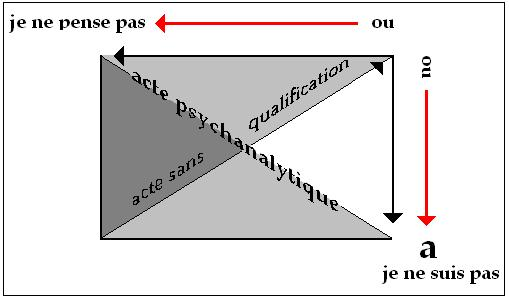

# Leçon 14 | 20 Mars 1968

<!-- source-url: http://staferla.free.fr/S15/S15 L'ACTE.docx -->
<!-- seminar: s15 -->
<!-- lesson: 14 -->

<!-- id: s15-14-0001 -->

> « *Tout homme est un animal, sauf à ce qu’il se n’homme* »*.*

<!-- id: s15-14-0002 -->

Je vous ai mis ça au tableau, histoire de vous mettre *en train* puisque je ne suis pas très *en train*, en réalité.

<!-- id: s15-14-0003 -->

Cette petite formule n’a pas la prétention d’être de la pensée. Il se peut que ça serve quand même de point d’accrochage, de pivot à un certain nombre d’entre vous qui ne comprendront rien par exemple à ce que je dirai aujourd’hui, ce n’est pas impensable. Ils ne comprendront rien mais ça ne les empêchera pas de rêver à quelque chose. Je ne suis pas en train de vous injurier, je ne pense pas que ce soit la généralité du cas, mais enfin, disons que c’est une moyenne !

<!-- id: s15-14-0004 -->

Le côté rêverie qui se produit toujours dans toute espèce d’énoncé à prétention pensatoire ou qu’on croit tel, il faut toujours en tenir compte et - pourquoi pas ? - lui donner un petit point d’accrochage.

<!-- id: s15-14-0005 -->

Supposez par exemple que mon enseignement, à savoir ce qui peut passer pour être pensé, n’ait…

<!-- id: s15-14-0006 -->

> comme c’est arrivé déjà à beaucoup de gens et d’une autre ampleur que moi …aucune suite. Il restera des petites choses comme ça. Alors là-dessus, il se produit quelque chose.

<!-- id: s15-14-0007 -->

Il y a dans le règne animal une sorte de faune très spéciale, ces espèces de petites bêtes de la classe des insectes, des êtres à élytres. Il y en a des quantités qui se nourrissent des cadavres, on appelle ça les escouades de la mort en médecine légale.

<!-- id: s15-14-0008 -->

Il y en a une dizaine de générations pour venir consommer ce qui reste d’un débris humain, quand je dis des générations, je veux dire que ce sont des espèces différentes qui viennent aux diverses étapes. C’est à peu près ce à quoi ressemble l’emploi d’un certain nombre d’activités universitaires autour de ces restes de pensée : des escouades de la mort.

<!-- id: s15-14-0009 -->

Il y en a déjà qui s’emploient, par exemple…

<!-- id: s15-14-0010 -->

> *sans attendre ni que je sois mort, ni qu’on ait vu le résultat des choses que j’ai, au cours de ces années, énoncées devant vous* …à doser à quel moment, dans ce qui constitue ce que j’ai rassemblé comme j’ai pu, avec un balai, sous le titre d’*Écrits*, je commence à parler vraiment de linguistique, à quel moment et jusqu’à quand ce que je dis recouvre ce qu’a dit JAKOBSON. Vous allez voir, ça va se développer.

<!-- id: s15-14-0011 -->

D’ailleurs je ne crois pas du tout qu’une pareille opération ressortisse à mes mérites. Je crois que c’est une opération assez dirigée, de la part de ceux que ce que je dis, intéresse directement et qui voudraient bien que les gens dont c’est l’emploi se mettent tout de suite à proliférer sur ce qu’on peut retenir de mes énoncés sous le titre de « *pensée* ». Ça leur donnera une petite anticipation de ce qu’ils espèrent, à savoir que ce que j’énonce, et qui n’est pas forcément de la pensée, soit sans conséquence, pour eux s’entend. Voilà de l’alimentation !

<!-- id: s15-14-0012 -->

Néanmoins, vous verrez que cela a un certain rapport avec ce que je vais vous dire aujourd’hui.

<!-- id: s15-14-0013 -->

Nous en sommes toujours, bien sûr, à *l’acte psychanalytique*. *Pourquoi*, en somme, est-ce que je parle de *l’acte psychanalytique* ?

<!-- id: s15-14-0014 -->

C’est pour des psychanalystes. Il n’y a vraiment qu’eux qui y soient impliqués. D’ailleurs tout est là.

<!-- id: s15-14-0015 -->

Aujourd’hui, je m’avance sur un terrain qui est évidemment peu fait pour un aussi large public, c’est à savoir en quoi l’acte psychanalytique peut opérer pour réaliser ce quelque chose que nous appellerons l’identification du psychanalyste.

<!-- id: s15-14-0016 -->

C’est une façon de prendre la question, qui a au moins cet intérêt, c’est d’être neuve. Je veux dire que, jusqu’à présent, rien n’a pu être articulé de sensé ni de solide sur ce qu’il en est de ce qui qualifie comme tel le psychanalyste.

<!-- id: s15-14-0017 -->

On parle bien sûr de règles, de procédés, de modes d’accès, mais ça ne dit toujours pas ce que c’est qu’un psychanalyste.

<!-- id: s15-14-0018 -->

Le fait que je parle de *l’acte psychanalytique*…

<!-- id: s15-14-0019 -->

> qui est ce dont en somme j’espère que puisse faire un pas ce qui s’appelle la qualification du *psychanalyste* …que *l’acte psychanalytique*, je sois amené à en parler devant un public qui n’est qu’en partie concerné comme celui-ci, c’est là quelque chose qui en soi soulève un problème, problème qui d’ailleurs n’est pas du tout insoluble puisque, en somme, je tiens une fois de plus à marquer ce qui justifie, non pas ce qui conditionne…

<!-- id: s15-14-0020 -->

> ce qui conditionne c’est une série d’effets de position sur lesquels justement, à l’intérieur de notre discours d’aujourd’hui, ce que nous pourrons pousser en avant va nous permettre peut-être de préciser quelque chose …mais enfin quel que soit le conditionnement, ce qui justifie que quand on parle de l’acte devant un public plus large que celui qu’il intéresse, à savoir proprement les psychanalystes, c’est évidemment ceci : c’est que *l’acte psychanalytique* a une particularité.

<!-- id: s15-14-0021 -->

Je pourrais me livrer à un griffonnage de plus sur le tableau pour montrer de quoi il retourne dans le fameux quadrangle, celui qui part de : « *Ou je ne pense pas ou je ne suis pas *» avec ce qu’il comporte du « *je ne pense pas* » qui est ici, et du « *je ne suis pas* » qui est ici.

<!-- id: s15-14-0022 -->

<!-- id: s15-14-0023 -->

Vous savez que *l’acte psychanalytique* se fait dans cet axe...

<!-- id: s15-14-0024 -->

avec pour aboutissement *cette éjection du (a)* qui vient incomber, en somme, à la charge du psychanalyste qui *a posé,* *a permis, a autorisé,* les conditions de l’acte, à ce prix qu’il vient lui-même à supporter cette fonction de *l’objet(a)*.

<!-- id: s15-14-0025 -->

...*l’acte psychanalytique* c’est évidemment ce qui donne ce support, ce qui autorise ce qui va être réalisé comme la tâche psychanalysante, et *c’est pour autant que le psychanalyste donne à cet acte son autorisation* que l’acte psychanalytique est réalisé.

<!-- id: s15-14-0026 -->

Or, c’est là quelque chose de tout à fait singulier que cet acte dont en quelque sorte le trajet doit être rempli par l’autre et, avec ce résultat au moins présumé que ce qui est à proprement parler acte, pour autant que nous pourrions être amenés à nous demander ce que c’est qu’un acte, ce n’est évidemment pas ni dans cette condition, ni *dans ce trajet tout à fait atypique*… qui devrait être dessiné au moins sur ce quadrangle …mais dans celui-là, c’est-à-dire pour autant que le sujet psychanalysant, pour lui, étant arrivé à cette réalisation qui est celle de *la castration*, -ϕ, c’est d’un accomplissement en retour vers le point inaugural :

<!-- id: s15-14-0027 -->

- celui dont à la vérité il n’est jamais parti,

<!-- id: s15-14-0028 -->

- celui qui est statutaire, celui du choix, du choix forcé, du choix aliénant entre le «* ou je ne suis pas ou je ne pense pas *» ...qui devrait par son acte accomplir ce quelque chose qui a été par lui enfin réalisé, à savoir ce qui le fait divisé comme sujet, autrement dit qu’il accomplisse un acte en sachant en connaissance de cause pourquoi cet acte ne le réalisera lui-même jamais pleinement comme sujet.

<!-- id: s15-14-0029 -->

*L’acte psychanalytique* donc, tel qu’il se présente, est de nature, parce qu’il introduit une autre dimension de cet acte qui n’agit pas par soi-même, si l’on peut dire, peut nous permettre d’apporter quelque lumière sur ce qu’il en est de l’autre, celui que j’ai dessiné à l’instant en travers, de *l’acte sans qualification*, car je ne vais pas l’appeler quand même « humain ».

<!-- id: s15-14-0030 -->

Je ne vais pas l’appeler « humain » pour toutes sortes de raisons, dont ce petit terme d’accrochage que je citais au début peut vous donner le soupçon, puisqu’il fonde l’homme en principe, ou plutôt qu’il le refonde, ou qu’il le refond chaque fois que l’acte en question, l’acte tout court, l’acte que je ne nomme pas, a lieu - ce qui n’arrive pas souvent.

<!-- id: s15-14-0031 -->

Là-dessus, naturellement, j’ai tout de même essayé de donner quelques définitions pour que l’on sache de quoi l’on parle, nommément que l’acte est un fait de signifiant…

<!-- id: s15-14-0032 -->

> c’est bien de là que nous sommes partis quand nous avons commencé à balbutier autour …un fait de signifiant par où prend place le retour de l’effet dit « *effet de sujet* » qui se produit de la parole, dans le langage bien sûr, retour de cet « *effet de sujet* » en tant qu’il est radicalement divisant.

<!-- id: s15-14-0033 -->

C’est là la nouveauté apportée comme un défi par la découverte psychanalytique qui pose comme essentiel que cet effet de sujet soit un effet de division. Cet effet de division, c’est pour autant qu’une fois réalisé, quelque chose peut en être le retour, qu’il peut y avoir ré-acte, que nous pouvons parler d’acte et que cet acte qu’est *l’acte psychanalytique* qui, lui, se pose d’une façon si singulière d’en être tout à fait différent en ce sens que rien n’impose qu’il se produise après ce qui, dans la psychanalyse, amène le sujet à être en position de pouvoir agir, rien n’implique que ce *(a)* désormais *isolé*…

<!-- id: s15-14-0034 -->

> de par l’action de l’autre qui l’a guidé dans sa psychanalyse,
>
> d’une psychanalyse dont l’acte a permis à la tâche de s’accomplir …rien n’explique que ce saut…

<!-- id: s15-14-0035 -->

> par quoi cet acte qui a permis la tâche réalisatrice, la tâche psychanalysante …*le psychanalysant* si l’on peut dire, *en assume quoi* ? Le programme.

<!-- id: s15-14-0036 -->

Au regard de l’acte…

<!-- id: s15-14-0037 -->

> c’est une petite parenthèse réflexive que je ferai là au début et qui est importante, qui se rapporte d’ailleurs aux mots par quoi j’ai commencé concernant l’avenir de toute pensée …toute pensée ordonnée se situe *dans un bivium* ou *à partir d’un bivium* qui de nos jours est particulièrement clair : ou bien elle rejette cet effet de sujet dont je parle, en le nouant une fois de plus à lui-même dans un moment qui se veut *originel*, c’est le sens qu’a eu historiquement le *cogito*, le *cogito* en est le modèle, et le modèle honnête si l’on peut dire : il est honnête parce qu’il se pose lui-même comme origine.

<!-- id: s15-14-0038 -->

Quand vous voyez quelqu’un commencer à parler du fantasme de l’origine[^108], vous pouvez savoir qu’il est malhonnête.

<!-- id: s15-14-0039 -->

Il n’y a de fantasme saisissable que *hic et nunc*, *ici et maintenant* : c’est ça l’origine du fantasme.

<!-- id: s15-14-0040 -->

Après ça nous pourrons en parler quand nous l’aurons trouvé là, quand nous sommes avec lui.

<!-- id: s15-14-0041 -->

Pour le *cogito*, *il ne s’est pas posé comme origine*, nulle part DESCARTES ne nous dit : « *À l’origine celui qui pense fait surgir l’être.* »

<!-- id: s15-14-0042 -->

Il dit : « *Je pense donc je suis.* » et à partir de là c’est une bonne chose de faite, il n’y a plus à s’en occuper. Il a complètement libéré l’entrée de la science qui ne s’occupera absolument plus jamais du sujet, si ce n’est bien sûr, à la limite obligée où elle le retrouve ce sujet, quand elle doit au bout d’un certain temps s’apercevoir de ce avec quoi elle opère, à savoir *l’appareil mathématique* et du même coup *l’appareil logique*.

<!-- id: s15-14-0043 -->

Elle fera donc tout, dans cet *appareil logique*, pour le *systématiser* sans avoir affaire au sujet, mais ce ne sera pas commode.

<!-- id: s15-14-0044 -->

À la vérité, ce ne sera qu’à ses frontières logiques que *l’effet de sujet continuera à se faire sentir, à se présentifier et à faire à la science quelques difficultés*. Mais pour le reste, en raison de cette démarche initiale du *cogito*, on peut dire qu’à *la science*, tout lui a été donné, et d’une façon en somme légitime, tout lui a été donné dans la main d’*un immense champ de succès*.

<!-- id: s15-14-0045 -->

Mais c’est en quelque sorte à ce prix que la science, sur le sujet de l’acte, n’a absolument rien à dire, elle n’en impose aucun, elle permet de faire beaucoup, pas tout ce qu’on veut : elle peut ce qu’elle peut, ce qu’elle ne peut pas, elle ne peut pas.

<!-- id: s15-14-0046 -->

Mais elle peut beaucoup. Elle peut beaucoup mais elle ne motive rien, ou plus exactement elle ne donne aucune expresse raison de rien faire. Elle ne se présente que comme tentation de faire, tentation irrésistible, il est vrai.

<!-- id: s15-14-0047 -->

Tout ce que nous pouvons faire avec ce que la science a conquis depuis trois siècles, ce n’est pas rien, et nous ne nous privons pas de le faire. Mais il n’est nullement dit qu’aucun acte ne sera à sa mesure. Là où il s’agit d’acte, où ça se décide, où on s’en sert en connaissance de cause pour des fins qui paraissent motivées, il s’agit d’un tout autre mode de pensée.

<!-- id: s15-14-0048 -->

*C’est l’autre partie du bivium* : là, *la pensée s’adonne dans la dimension de l’acte* et, pour cela, il suffit qu’elle touche à *l’effet de sujet*.

<!-- id: s15-14-0049 -->

Exemple : la remarque fondamentale à une doctrine qu’il est facile, je pense**,** pour vous de reconnaître, que le sujet ne se reconnaisse pas, c’est-à-dire soit aliéné dans l’ordre de production qui conditionne son travail, ceci en raison de *l’effet de sujet* qui s’appelle *exploitation*…

<!-- id: s15-14-0050 -->

> pas besoin d’ajouter « *de l’homme par l’homme* » parce que nous avons vu qu’il faut un peu se *méfier* de « *l’homme* »
>
> dans l’occasion, et puis chacun sait qu’on a pu tourner cet usage à quelques mots d’esprit plaisants …ceci en raison de *l’effet de sujet* donc, qui est au fondement de cette exploitation, voilà qui a des conséquences d’acte : on appelle ça la révolution.

<!-- id: s15-14-0051 -->

Et dans ces conséquences d’acte, la pensée a la plus grande difficulté à se reconnaître, comme vous le démontrent je pense, depuis que vous existez…

<!-- id: s15-14-0052 -->

> puisque c’était même, pour un certain nombre d’entre vous, commencé avant votre naissance …les difficultés qu’a eues, que continue d’avoir ce qu’on appelle l’*intelligentsia* avec l’ordre communiste.

<!-- id: s15-14-0053 -->

Toute pensée donc, de cette catégorie qui touche à *l’effet de sujet*, participe de l’acte. La formuler indique, si l’on peut dire, l’acte et sa référence. Seulement, tant que l’acte n’est pas mis en train, c’est une référence, bien sûr, difficile à soutenir, dans toute la mesure où elle n’est isolée qu’au terme, chacun sait ça. Toute pensée qui dans le passé a fait école…

<!-- id: s15-14-0054 -->

> les choses qui restent, comme ça, épinglées dans *les herbiers universitaires*, école stoïcienne par exemple …avait cette fin de l’acte. Ça tourne court quelquefois…

<!-- id: s15-14-0055 -->

> je veux dire que pour l’instant par exemple, dans le circuit à quoi j’ai fait allusion …*l’acte* qui de notre temps s’épingle du terme de *révolutionnaire*. L’issue n’est pas encore là.

<!-- id: s15-14-0056 -->

Ce n’est pas isolé ni isolable, cette référence à l’acte, mais enfin, *pour les* STOÏCIENS tels que je les ai évoqués tout à l’heure, le fait est que *ça a tourné court*, que - à un moment, *on n’a eu rien de plus à en tirer* que ce qu’on avait tiré de ceux qui s’étaient engagés dans cette voie de pensée. À partir de quoi *la nécrophagie* dont je parlais tout à l’heure peut commencer et, *Dieu merci*, elle ne peut pas non plus s’éterniser puisqu’il ne reste pas tellement de choses comme épaves, comme débris de cette pensée stoïcienne. Mais enfin ça occupe du monde !

<!-- id: s15-14-0057 -->

Ceci dit, revenons à notre *acte psychanalytique* et reprenons ce petit croisillon qui est exposé au tableau, dont j’ai maintes fois déjà fait la remarque :

<!-- id: s15-14-0058 -->

- que vous n’avez pas à y *donner de valeur privilégiée aux diagonales*,

<!-- id: s15-14-0059 -->

- que vous devez plutôt, pour vous en faire une juste idée, le voir comme une sorte de *tétraèdre en perspective*.

<!-- id: s15-14-0060 -->

Ça vous aidera à vous apercevoir *que la diagonale n’y a aucun privilège*. *L’acte psychanalytique* consiste essentiellement dans cette sorte d’*effet de sujet* qui opère en distribuant, si l’on peut dire, ce qui va en faire le support, à savoir le sujet divisé, le S, pour autant que c’est là l’acquis de *l’effet de sujet* au terme de la tâche psychanalysante.

<!-- id: s15-14-0061 -->

C’est la vérité qui par le sujet - *quel qu’il soit et sous quelque prétexte qu’il s’y soit engagé -* est conquise, c’est à savoir, par exemple, pour le sujet le plus banal, celui qui y vient à des fins d’être soulagé : voilà mon *symptôme*, j’en ai maintenant *la vérité*, je veux dire que c’est dans toute la mesure où ça n’est pas du tout ce qu’il en était de moi, c’est dans toute la mesure où il y a quelque chose d’irréductible dans cette position du sujet…

<!-- id: s15-14-0062 -->

> qui s’appelle en somme, et est fort nommable : l’impuissance à en savoir tout …que je suis là et que, Dieu merci, *le symptôme* qui révélait ce qui reste de masqué dans *l’effet de sujet* dont retentit un savoir, ce qu’il y a de masqué, j’en ai eu la levée, mais assurément non pas complète.

<!-- id: s15-14-0063 -->

Quelque chose *reste* d’*irréductiblement* limité dans ce savoir.

<!-- id: s15-14-0064 -->

C’est au prix - *puisque j’ai parlé de distribution* - de ceci : c’est que toute l’expérience a tourné autour de cet *objet(a)* dont l’analyste s’est fait le support, *l’objet(a)* en tant que c’est ce qui, de cette division du sujet est, a été et reste structuralement *la* *cause*.

<!-- id: s15-14-0065 -->

C’est dans la mesure où l’existence de cet *objet(a)* s’est démontrée dans la tâche psychanalysante…

<!-- id: s15-14-0066 -->

> Et comment ? Mais vous le savez tous : dans l’effet de transfert ! …c’est en tant que le partenaire est celui qui s’est trouvé remplir - de la structure instituée par l’acte - la fonction… que depuis que le sujet a joué comme effet de sujet, que pris dans la demande, qu’instaurant le désir, il s’est trouvé déterminé par ces fonctions que l’analyse a épinglées comme étant celles de l’objet nourricier : *du sein*, de l’objet excrémentiel : *du scybale*, de la fonction *du regard* et de celle *de la voix* …c’est en tant que c’est autour de ces fonctions, pour autant que dans la relation analytique elles ont été distribuées à celui qui en est le partenaire, le pivot, et pour tout dire : le support, comme j’ai dit la dernière fois : l’instrument, qu’a pu se réaliser l’essence de ce qu’il en est de la fonction du S, à savoir de *l’impuissance du savoir*.

<!-- id: s15-14-0067 -->

Est-ce que j’évoquerai là *la dimension analogique* qu’il y a, dans cette répartition, avec l’acte tragique ? Car on sent bien que, dans la tragédie, il y a quelque chose d’analogue, dans *la fiction tragique* telle qu’elle s’exprime dans une mythologie à laquelle il n’est pas du tout exclu que nous ne voyions des incidences tout à fait historiques, vécues, réelles, je veux dire que *le héros*...

<!-- id: s15-14-0068 -->

tout un chacun qui, dans l’acte, s’engage seul …est voué à cette destinée de n’être, en fin, que le *déchet* de sa propre entreprise, je n’ai nul besoin de donner des exemples, seul le niveau que j’ai appelé de *fiction* ou de *mythologie* suffit à en indiquer pleinement la structure.

<!-- id: s15-14-0069 -->

Mais, tout de même, ne l’oublions pas, ne confondons pas la fiction tragique…

<!-- id: s15-14-0070 -->

> je veux dire le mythe d’ŒDIPE, d’ANTIGONE par exemple …avec *ce qui est vraiment une acception* - la seule d’ailleurs valable, fondée - *de la tragédie*, à savoir : *la représentation de La Chose*.

<!-- id: s15-14-0071 -->

Dans *la représentation*, nous sommes évidemment plus près de cette *schize* telle qu’elle est supportée dans *la tâche psychanalysante*. Au terme de la psychanalyse on peut, *la division réalisée du sujet psychanalysant*, la supporter de la division qui, dans l’aire où pouvait se jouer la représentation tragique dans sa forme la plus pure, *nous pouvons l’identifier ce psychanalysant, au couple divisé* *et relatif du « spectateur » et du « chœur »*, *cependant que le héros*…

<!-- id: s15-14-0072 -->

> il n’y a pas besoin qu’il y en ait trente six, il n’y en a jamais qu’un seul …*le héros, c’est celui-là qui, sur la scène, n’est rien que la figure de déchet où se clôt toute tragédie* digne de ce nom.

<!-- id: s15-14-0073 -->

L’analogie structurale plane d’une façon tellement évidente que c’est la raison pour laquelle elle a été amenée massivement, si l’on peut dire, sous la plume de FREUD et pourquoi cette analogie hante, si l’on peut dire, toute l’idéologie analytique, seulement avec un effet de démesure qui confine au grotesque, et qui fait d’ailleurs l’incapacité totale où se révèle cette littérature qu’on appelle « *analytique* » de faire autre chose, autour de cette référence mythique, qu’une espèce de *redite* en rond, extraordinairement stérile, avec *de temps en temps* quand même le sentiment qu’il y a quelque chose là d’une division dont on ne voit pas où est la radicale insuffisance qui nous y rend inadéquats.

<!-- id: s15-14-0074 -->

Cela frappe certains. Ce n’est pas les pires que ça frappe. Mais ça donne des résultats qui ne peuvent vraiment pas aller beaucoup plus loin que le jappement. N’oublions pas *l’œdipe*, ni ce que c’est que *l’œdipe*, ni à quel point il est « *internement* », *intègrement* lié à la structure de toute notre expérience, et quand on a produit ce rappel, on n’a pas à aller beaucoup plus loin.

<!-- id: s15-14-0075 -->

C’est bien pour ça d’ailleurs que je ne considère pas que je fasse de tort à personne en m’étant juré de ne jamais reprendre le thème du *Nom du Père* dans lequel, saisi de je ne sais quel vertige, heureusement rabattu, je m’étais dit une fois que je m’engagerais pour le circuit d’une de mes années de séminaire. Les choses prises à ce niveau sont *hopeless*, alors que nous avons une voie autrement sûre à la tracer concernant *l’effet de sujet*, et qui a affaire à la logique.

<!-- id: s15-14-0076 -->

Si je vous ai amenés au carrefour de cet effet proprement logique qui est celui qu’a si bien défini la logique moderne sous le terme de la fonction des quantificateurs, c’est évidemment pour une raison qui est fort proche de ceci que je vous ai annoncé comme étant la question d’aujourd’hui, à savoir du rapport de *l’acte psychanalytique* avec quelque chose de l’ordre d’une prédication, c’est à savoir : qu’est-ce qu’il en est… de quoi pouvons-nous dire qu’il situe le psychanalyste ?

<!-- id: s15-14-0077 -->

Ne l’oublions pas, si c’est au terme d’une expérience de la division du sujet que quelque chose qui s’appelle *le psychanalyste* peut s’instaurer, nous ne pouvons nous fier à une pure et simple identification de terme, de celle qui est au principe de la définition du signifiant : « *Que tout signifiant représente un sujet pour un autre signifiant.* »

<!-- id: s15-14-0078 -->

Justement : le signifiant, quel qu’il soit, ne peut être tout ce qui représente le sujet.

<!-- id: s15-14-0079 -->

Justement - comme je vous l’ai montré la dernière fois - de ceci que dans la fonction que nous épinglons, tout relève d’une cause qui n’est autre que *l’objet(a)*, si cet *objet(a) chu dans l’intervalle* qui, si l’on peut dire, aliène la complémentarité, je vous l’ai rappelé la dernière fois, de *ce qu’il en est du sujet représenté par le signifiant* : du sujet S, avec le S quel qu’il soit, prédicat qui peut s’instituer au champ de l’Autre.

<!-- id: s15-14-0080 -->

Donc que ce qu’il en est, de par cet effet, du « *tout* » en tant qu’il s’énonce, intéresse tout autre chose que ce vers quoi, si je puis dire, *l’identification* ne se rend pas, à savoir vers la reconnaissance venue de l’Autre puisque c’est de cela qu’il s’agit : que dans rien de ce que nous pouvons *inscrire* de nous-mêmes au champ de l’Autre, nous ne pouvons nous reconnaître.

<!-- id: s15-14-0081 -->

Le « *tout* » ce qui nous représente, dans cet appel de la reconnaissance, pourrait avoir affaire avec ce vide, avec ce creux, avec ce *manque*. Or, c’est là ce qui n’est pas. C’est qu’au principe de l’institution de ce « *tout* » requis chaque fois que nous énonçons quoi que ce soit d’*universel*, *il y a autre chose que l’impossibilité qu’il masque, à savoir celle-là de se faire reconnaître*.

<!-- id: s15-14-0082 -->

Et ceci s’est avéré dans l’expérience analytique en ceci que j’articulerai d’une façon ramassée parce qu’elle est exemplaire : que le sexe n’est pas tout, car c’est cela la découverte de la psychanalyse. On a beau voir ressurgir des sortes de recueils de gens qu’on délègue à rassembler un certain nombre de textes sur ce qu’il en est, sur ce fameux champ si bizarrement préservé, réservé, qu’est la psychanalyse.

<!-- id: s15-14-0083 -->

On donne une bourse de recherche à un monsieur qui s’appelle BROWN[^109] et qui a écrit quelque chose de pas si mal : *Eros et Thanatos*, autrefois. Il en avait profité pour dire des choses assez sensées sur M. LUTHER, et comme c’était *au bénéfice de l’[Université wesleyenne](http://fr.wikipedia.org/wiki/Universit%C3%A9_wesleyenne)*, tout cela se justifiait assez bien.

<!-- id: s15-14-0084 -->

Mais enfin, ne connaissant plus de mesure à ces opérations de rassemblement, il publie quelque chose qui s’appelle

<!-- id: s15-14-0085 -->

*Le Corps d’amour* et qu’on nous commente d’une note nous parlant du pansexualisme freudien[^110]. Or, justement…

<!-- id: s15-14-0086 -->

> si ce que FREUD a dit signifie quelque chose, c’est bien sûr qu’il y a eu la référence à ce
>
> qu’on attendrait qui se produise de la conjonction sexuelle, à savoir une union, un « *tout* » …justement s’il y a quelque chose qui s’impose au terme de l’expérience, c’est que - au sens où je vous indique et où je le fais résonner pour vous - *le sexe n’est pas « tout »*.

<!-- id: s15-14-0087 -->

Le « *tout* » vient à sa place, ce qui ne veut pas dire du tout que cette place soit la place du « *tout* ».

<!-- id: s15-14-0088 -->

Le « *tout* » l’usurpe en faisant croire si je puis dire, que lui, le « *tout* », vient du sexe.

<!-- id: s15-14-0089 -->

C’est ainsi que la fonction de vérité change de valeur, si je puis m’exprimer ainsi, et que ce qui se trouve fort bien coller – ce qui est encourageant – avec certaines découvertes qui sont faites dans le champ de la logique, ce qui peut s’exprimer en ceci, nous fait toucher du doigt que le « *tout* », la fonction du « *tout* », le « *tout* » quantificateur, la fonction de l’universel, que le « *tout* » doit être conçu comme un déplacement de *la partie*.

<!-- id: s15-14-0090 -->

C’est pour autant que *l’objet(a)* seul motive et fait surgir la fonction du « *tout* » comme telle, que nous nous trouvons en logique soumis à cette catégorie du « *tout* », mais en même temps que s’expliquent un certain nombre de *singularités* qui l’isolent dans l’ensemble des *fonctionnements logiques* - je veux dire ce champ où règne *l’appareil quantificateur* - qui l’isolent en y faisant surgir des difficultés singulières, d’étranges paradoxes.

<!-- id: s15-14-0091 -->

Bien sûr, il y a tout intérêt à ce que, le plus possible d’entre vous - et je le dis aussi bien pour chacun que pour tous - aient une certaine culture logique. Je veux dire :

<!-- id: s15-14-0092 -->

- que personne ici n’a rien à perdre à aller se former à ce qui s’enseigne dans les endroits où c’est autour des champs déjà constitués du progrès de la logique présente…

<!-- id: s15-14-0093 -->

- que vous n’avez rien à perdre à aller très précisément vous y former pour entendre ce à quoi je m’essaie, pour dessiner une logique fonctionnant dans une zone intermédiaire, pour autant qu’elle n’a point encore été maniée d’une façon convenable.

<!-- id: s15-14-0094 -->

Vous ne perdez rien à saisir ce à quoi je fais allusion quand je dis qu’encore que la logique des quantificateurs soit arrivée à obtenir son statut propre et vraiment tout à fait rigoureux…

<!-- id: s15-14-0095 -->

> je veux dire ayant toute apparence *d’en exclure le sujet*,
>
> je veux dire d’être maniable au moyen des pures et simples règles qui relèvent d’un maniement de lettres …il n’en reste pas moins que, si vous comparez l’usage de cette logique des quantificateurs avec tel ou tel autre secteur, segment de *la logique*, tels qu’ils se définissent en divers termes, vous vous apercevrez qu’il est singulier, qu’alors que pour tous les autres appareils logiques, vous pouvez donner toujours un certain nombre d’interprétations…

<!-- id: s15-14-0096 -->

> géométrique par exemple, économique, conceptuelle, je veux dire que chacun de ces maniements des appareils
>
> logiques est tout à fait plurivalent quant à l’interprétation …il est tout à fait saisissant, au contraire, de voir que quelle que soit la rigueur à laquelle on a pu en fin de compte arriver à pousser la logique des quantificateurs, jamais vous n’arriverez à en soustraire ce *quelque chose* qui s’inscrit dans la structure grammaticale, je veux dire dans le langage ordinaire, et qui fait intervenir ces fonctions du « *tout* » et du « *quelque *».

<!-- id: s15-14-0097 -->

La chose a des conséquences, d’aucune d’entre elles n’a pu être mise en valeur qu’au niveau des logiciens, je veux dire là où l’on sait se servir de ce que c’est qu’une déduction, c’est à savoir que partout où nous soutiendrons un système, un appareil tel qu’il s’agisse de l’usage des quantificateurs, nous ne pourrons créer des algorithmes tels, qu’il suffise qu’il soit réglé d’avance que tout problème est purement et simplement soumis à l’usage d’une règle une fois fixée de calcul : que dès lors que nous sommes dans ce champ, nous serons toujours capables d’y faire surgir de *l’indécidable*.

<!-- id: s15-14-0098 -->

Étrange privilège. Pour ceux qui ici n’ont jamais entendu parler de *l’indécidable* je vais illustrer ce que je dis d’un petit exemple. Que veut dire *indécidable* ? Je m’excuse pour ceux à qui ce que je vais dire apparaîtra une rengaine rebattue.

<!-- id: s15-14-0099 -->

Je prends un exemple, il y en a beaucoup. Vous savez - ou vous ne savez pas - ce que c’est qu’[*un nombre parfait *](http://fr.wikipedia.org/wiki/Nombre_parfait) : c’est un nombre tel qu’il soit égal à la somme de ses diviseurs.

<!-- id: s15-14-0100 -->

Exemple : les diviseurs du nombre 6 sont 1, 2 et 3, 1+2+3 = 6. C’est également vrai pour 28.

<!-- id: s15-14-0101 -->

Il ne s’agit pas de nombres premiers, il s’agit des diviseurs, ce qui veut dire : étant donné un nombre, en combien de parts égales pouvez–vous le diviser ? Pour 28, cela donne 14, 7, 4, 2 et 1. Cela fait 28.

<!-- id: s15-14-0102 -->

Vous voyez que ces deux nombres sont des nombres pairs. On en connaît des tas comme ça. On ne connaît pas de nombre impair qui soit parfait. Cela ne veut pas dire qu’il n’en existe pas. L’important, c’est qu’on ne peut pas démontrer qu’il est impossible qu’il en existe. Voilà de *l’indécidable*. De *l’indécidable* dont le lien avec la structure, la fonction logique qui s’appelle celle des *quantificateurs* n’est pas ce qu’il est ici *mon rôle* de vous faire toucher, disons à la rigueur qu’on pourrait réserver ça pour *le séminaire fermé*. Je demanderai que quelqu’un s’y associe à moi dont c’est plus le métier que le mien de le faire.

<!-- id: s15-14-0103 -->

Mais ce privilège de la fonction des quantificateurs en tant qu’elle nous intéresse au plus haut point, vous allez tout de suite le voir, ce privilège …

<!-- id: s15-14-0104 -->

> je soulève - appelons ça provisoirement *l’hypothèse* …cette impasse, en tant qu’elle est – remarquez-le - *une impasse féconde*, car si nous avions le moindre espoir que tout peut être soumis à *un algorithme universel*, qu’en tout nous pouvons trancher sur la question de savoir si une proposition est vraie ou fausse, *c’est ça qui serait plutôt une fermeture* ...l’hypothèse que je soulève tient en ceci que ce privilège de la fonction de la quantification tient à ce qu’il en est de l’essence du « *tout* » et de sa relation à la présence de *l’objet(a)*.

<!-- id: s15-14-0105 -->

Il existe quelque chose qui fonctionne :

<!-- id: s15-14-0106 -->

- pour que tout sujet se croie « *tout* »,

<!-- id: s15-14-0107 -->

- pour que le sujet se croie « *tout* » sujet,

<!-- id: s15-14-0108 -->

- et par là même sujet de « *tout* »,

<!-- id: s15-14-0109 -->

- de ce fait même en droit de parler de tout.

<!-- id: s15-14-0110 -->

Or ce que donne l’expérience analytique est ceci : qu’il n’y a pas de sujet dont la totalité ne soit *illusion*, parce qu’elle ressortit à *l’objet(a)* en tant qu’élidé.

<!-- id: s15-14-0111 -->

Nous allons maintenant tâcher de l’illustrer, montrant en quoi ceci, de la façon la plus directe nous intéresse, comment correctement s’exprime ce qu’il en est de la dimension proprement *analytique*, sinon ceci : *tout savoir n’est pas conscient*.

<!-- id: s15-14-0112 -->

L’ambiguïté, la problématique, *la schize* fondamentale qu’introduit un « *pour tout...* » \[;\] et un « *il existe...* » \[:\] consiste en ceci, c’est qu’elle admet - mais du même coup met en question - ceci, que si nous disons : « *Il n’est pas vrai que pour tout…ce qui suit… il en est de façon telle ou telle.* » ceci implique qu’il est dit qu’il y a, de ce « *tout* », quelque chose qui « *ne*... *pas* », parce que *s’il n’est pas vrai que pour* « *tout* », \[alors\] *il y en a qui* « *ne*... *pas* ».

# En d’autres termes que, parce qu’une négation porte sur *l’universel*, quelque chose surgit de l’existence d’un *particulier* 

# et que, de même, parce que « *pas tout *» est affecté d’un « *ne*… *pas* », chose plus forte encore, *il y en a des* (comme on dit) *qui*..., faisant surgir une existence positive *particulière* d’une *double négation*, celle d’une vérité qui, retirée au « *tout* » de ne pas être, 

# en ferait surgir une existence *particulière*.

# Or, suffirait-il qu’il ne soit pas démontré que « *tout...* *quelque chose »,* pour qu’il existe quelque chose qui « *ne*... *pas* » ? 

<!-- id: s15-14-0113 -->

Vous le sentez bien, il y a là un écueil, *une question qui à elle toute seule suffit à rendre fort suspect cet usage de la négation*, en tant qu’elle suffirait, à elle toute seule, à assurer le lien, la cohérence, des fonctions réciproques de *l’universel* et du *particulier*.

<!-- id: s15-14-0114 -->

Pour ce qu’il en est du *savoir*, que du fait que « *tout savoir n’est pas conscient* », nous ne pouvons plus admettre comme fondamental que « *le savoir se sait lui-même* », est-ce là dire qu’il est correct de dire qu’il y a de l’inconscient ?

<!-- id: s15-14-0115 -->

C’est très précisément ce que, dans cet article recueilli dans mes *Écrits* qui s’appelle *Position de l’inconscient*, j’ai essayé de faire sentir en y employant ce que je pouvais faire alors, à savoir une petite parabole qui n’était autre qu’une façon d’imager sous une espèce que même si je me souviens bien *j’ai appelée*…

<!-- id: s15-14-0116 -->

> puisqu’il me plaît assez de jouer avec le mot *homme* …*« l’hommelette »*, et qui n’est autre que *l’objet(a)*.

<!-- id: s15-14-0117 -->

Bien sûr, ce pourra être l’occasion pour *un futur* *scholar* de s’imaginer qu’au moment où j’ai écrit mes *Position de l’inconscient* je n’avais pas une traître idée de la logique, comme si, bien sûr, ce qui constitue l’ordre de mes discours ne consistait pas justement à les faire adaptés pour un certain auditoire, qui ne l’est d’ailleurs pas entièrement, car on sait bien ce que sont capables d’accueillir les oreilles des psychanalystes, et de ne pas accueillir à un moment donné.

<!-- id: s15-14-0118 -->

Pour ce qu’il en est de la qualification, il y a bien longtemps que, pour tout ce qu’il en est du savoir, la réflexion constructive autour de l’ἐπιστήμη \[epistèmé\] a mis en cause ce qu’il en est du praticien quand il s’agit d’un savoir, autant au niveau de PLATON chaque fois qu’il s’agit d’assurer un savoir dans son statut, c’est la référence à l’artisan qui prévaut, et rien ne semble obvier à l’annonce que toute pratique humaine…

<!-- id: s15-14-0119 -->

> je dis « pratique » parce que ce n’est pas dire du tout, parce que nous faisons prévaloir l’acte,
>
> que nous en repoussons la référence …tout praticien suppose un certain savoir, si nous voulons nous avancer dans ce qu’il en est de l’ἐπιστήμη \[epistèmé\]. tout savoir de charpente, voilà qui, pour nous, définira le charpentier.

<!-- id: s15-14-0120 -->

*Ceci secrètement implique que la charpente se sait elle-même en tant qu’art…* je ne dis pas en tant que matière, bien entendu …ce qui prolonge pour nous, analystes, ceci, c’est que tout savoir de thérapeutique qualifie le thérapeute, ce qui implique, et d’une façon plus douteuse, que la thérapeutique se sait - ou se fait - elle-même.

<!-- id: s15-14-0121 -->

Or, s’il y a quelque chose que *le plus* - pardonnez-moi, je vais le dire ! - *instinctivement* repousse le psychanalyste, c’est que tout savoir de psychanalyse qualifie le psychanalyste, et ce n’est pas sans raison, très précisément en ceci, non pas bien sûr que nous en sachions plus par là sur ce qu’est le psychanalyste, mais que tout savoir de psychanalyse est tellement mis dans la suspension de ce qu’il en est de la référence de l’expérience à *l’objet(a)*, en tant qu’au terme il est radicalement exclu de toute subsistance de sujet, que le psychanalyste n’est nullement en droit de se poser comme faisant le bilan de l’expérience dont il n’est à proprement parler que le pivot et l’instrument.

<!-- id: s15-14-0122 -->

Tout savoir qui dépend là de cette fonction de *l’objet(a)* assurément n’assure rien, et justement de ne pouvoir répondre de sa totalité sinon en référence à cette instrumentation, certes impose qu’il n’y ait rien qui puisse se présenter comme « *tout* » de ce savoir, mais que justement cette absence, ce manque n’impose d’aucune façon qu’on puisse en déduire ni qu’il y ait, ni qu’il n’y ait pas, de psychanalyse.

<!-- id: s15-14-0123 -->

*La réflexion, le rebondissement de la négation au niveau du* « *tout* » n’implique nulle conséquence au niveau du *particulier*, que le statut du psychanalyste en tant que tel ne repose sur rien d’autre que ceci : qu’il s’offre à supporter, dans un certain *procès de savoir*, ce rôle d’objet de demande, de cause du désir, qui fait que le savoir obtenu ne peut être tenu que pour ce qu’il est : *réalisation signifiante* accointée à une *révélation de fantasme*.

<!-- id: s15-14-0124 -->

Si le « *pas tout* » que nous mettons dans ceci : « *pas tout savoir n’est conscient* » représente la non constitution du « *tout savoir* »… ceci, au niveau même où le savoir se nécessite …il n’est pas vrai qu’il existe forcément du savoir inconscient que nous pourrions *théorèmiser sur n’importe quel modèle logique*.

<!-- id: s15-14-0125 -->

Est-ce pour le psychanalyste que le psychanalysant est, à la fin de sa tâche, ce qu’il est ? Toute une façon d’exposer la théorie, parce qu’elle implique une façon de le penser, *met dans l’action psychanalytique ce facteur qui intervient comme parasite*.

<!-- id: s15-14-0126 -->

Le psychanalyste a le fin mot de ce qu’il faut en penser, c’est-à-dire :

<!-- id: s15-14-0127 -->

- que c’est lui qui a la pensée de toute l’affaire,

<!-- id: s15-14-0128 -->

- que le psychanalysant à la fin serait régularisé, ce qui implique qu’il pose en « être » une certaine conjonction subjective, qu’il se repose à nouveau d’un « *je ne pense pas* » renouvelé seulement de passer du restreint au généralisé.

# En est-il ainsi ? Jamais ! 

<!-- id: s15-14-0129 -->

Ce n’est pas une simple énigme que le psychanalyste, qui le sait mieux que personne par expérience, puisse se mettre à concevoir, sous cette forme de « *science fiction* » *- c’est le cas de le dire -* le fruit que lui-même en obtient.

<!-- id: s15-14-0130 -->

Est-ce donc dans l’ordre du « *pour soi* » que s’achève le trajet psychanalysant ?

<!-- id: s15-14-0131 -->

C’est ce qui n’est pas moins contredit par le principe même de l’inconscient, par quoi le sujet est condamné non seulement à rester divisé d’une pensée qui ne peut s’assumer d’aucun « *je suis* », qui pense, qui pose un *en soi* du « *je pense* », irréductible à rien qui le pense « *pour soi* », mais dont c’est justement *à la fin de la psychanalyse qu’il se réalise comme constitué de cette division*, cette division où tout signifiant, en tant qu’*il représene un sujet pour un autre signifiant*, comporte la possibilité de son inefficience, précisément à opérer cette *représentation*, de sa mise en défaut *au titre de représentant*.

<!-- id: s15-14-0132 -->

Il n’y a pas de « *psychanalysé* » : il y a un «* ayant été psychanalysant *», d’où ne résulte qu’un « *sujet averti* » de ce à quoi il ne saurait se penser comme constituant de toute action sienne. Pour concevoir ce qu’il doit en être de ce « *sujet averti* », nous n’avons aucun type encore existant. Il n’est jugeable qu’au regard d’un acte qui est à construire

<!-- id: s15-14-0133 -->

- comme celui où se réitérant, *la castration* s’instaure comme *passage à l’acte*,

<!-- id: s15-14-0134 -->

- de même que son complémentaire, *la tâche psychanalytique* elle-même, se réitère en s’annulant comme *sublimation*.

<!-- id: s15-14-0135 -->

Mais ceci ne nous dit rien du *statut du psychanalyste* car à vrai dire, si *son essence* est d’assumer la place où dans cette opération se situe *l’objet(a)*, quel est le statut possible d’un sujet qui se met dans cette position ?

<!-- id: s15-14-0136 -->

Le psychanalyste dans cette position peut n’avoir - de tout ce que je viens de développer, à savoir de ce qui la conditionne - pas la moindre idée, pas la moindre idée de la science par exemple, c’est même courant.

<!-- id: s15-14-0137 -->

À la vérité, il ne lui est même pas demandé de l’avoir, vu le champ qu’il occupe et *la fonction* qu’il a à y remplir.

<!-- id: s15-14-0138 -->

Du support de logique de la science, par contre, il aurait beaucoup à apprendre.

<!-- id: s15-14-0139 -->

Mais si j’ai fait référence à son propos à *des statuts*, quels qu’ils soient, *de praticien*, est-il exclu que dans aucun de ces statuts…

<!-- id: s15-14-0140 -->

> tels qu’ils sont pour nous évoqués depuis l’Antiquité, de la réflexion sur la science,
>
> mais aussi bien encore présents dans un certain nombre de champs …est-ce que pour lui n’est pas *de quelque ressort, de quelque valeur ce qui*, à la lumière sans doute et seulement de la psychanalyse, *peut être défini dans telle fonction de pratique comme « évidant »*, comme mettant en valeur *la présence de l’objet(a) *?

<!-- id: s15-14-0141 -->

*Pourquoi*, à la fin de l’année sur les *Problèmes cruciaux de la psychanalyse* [^111], *ai-je fait ici tellement état de la fonction de la perspective* ?

<!-- id: s15-14-0142 -->

Il semble que ce soit là *théorie*, opération qui n’intéresse que l’architecte, si ce n’est pour montrer que…

<!-- id: s15-14-0143 -->

> ne l’eût-il pas isolé lui-même depuis toujours, je veux dire depuis le temps où nous ne savons pas trop comment justifier *l’idéal* qui dirigeait par exemple ce qui nous est légué *des grammatismes* d’un VITRUVE[^112] …que ce dont il s’agit, ce qui domine ce que nous aurions tout à fait tort, vu la présence des idéaux, de réduire à une fonction utilitaire, de bâtisse par exemple.

<!-- id: s15-14-0144 -->

Ce qui domine, c’est une référence qui est celle que j’ai essayé de vous expliquer dans sa relation avec *l’effet de sujet* au moment où la perspective vient dans sa structure propre au niveau de DESARGUES[^113], c’est-à-dire où elle instaure cette autre définition de l’espace qui s’appelle *la géométrie projective*.

<!-- id: s15-14-0145 -->

Et cette mise en question de ce qui est le domaine même de la vision en tant qu’à un premier aspect, il semblerait qu’elle puisse être entièrement supportée par une opération de quadrillage mais qu’au contraire y apparaît cette structure fermée qui est celle à partir de laquelle j’ai pu essayer pour vous d’isoler, de définir…

<!-- id: s15-14-0146 -->

> entre tous les autres et parce qu’il est le plus négligé de la fonction psychanalytique …la fonction de *l’objet(a)* qui s’appelle *le regard*.

<!-- id: s15-14-0147 -->

Est-ce pour rien qu’au terme de cette même année, autour du tableau des *Ménines*, je vous ai fait un exposé, sans doute difficile, mais qu’il faut prendre *comme apologue*, et *comme exemple*, et *comme repère de conduite pour le psychanalyste  *?

<!-- id: s15-14-0148 -->

Car *ce qu’il en est de l’illusion du sujet supposé savoir* est toujours autour de ce qui s’admet si aisément de *tout le champ de la vision*.

<!-- id: s15-14-0149 -->

Si au contraire autour de cette œuvre exemplaire qu’est le tableau des *Ménines*, j’ai voulu vous montrer la fonction inscrite de ce qu’il en est du *regard* et de ce qu’elle a en elle-même à opérer d’une façon si subtile qu’elle est à la fois présente et voilée, c’est - comme je vous l’ai fait remarquer - *notre existence* même, à nous spectateurs, *qu’elle met en question*, la réduisant à n’être en quelque sorte plus qu’*ombre*, au regard de ce qui s’institue dans le champ du tableau, d’un ordre de représentation qui n’a à proprement parler rien à faire avec ce qu’aucun sujet peut se représenter.

<!-- id: s15-14-0150 -->

Est-ce que ce n’est pas là l’exemple et le modèle où quelque chose d’une discipline qui tient au plus vif de la position du psychanalyste pourrait s’exercer ?

<!-- id: s15-14-0151 -->

Est-ce que ce n’est pas le piège à quoi cède, dans cette singulière représentation fictive que j’essayais tout à l’heure de vous donner comme étant celle où le psychanalyste finit - au regard de son expérience qu’il appelle clinique - par s’arrêter ?

<!-- id: s15-14-0152 -->

Est-ce qu’il n’y pourrait pas trouver le modèle de *rappel*, de *signe*, qu’il ne saurait rien instituer du monde de son expérience sans qu’il doive, de toute nécessité, y présentifier - et comme telle - la fonction de son propre *regard* ?

<!-- id: s15-14-0153 -->

Assurément ce n’est là qu’une indication, mais une indication donnée, *comme je fais souvent à la fin de tel ou tel de mes discours,* très en avance, qui relève de ceci : que si dans la psychanalyse…

<!-- id: s15-14-0154 -->

> je veux dire dans l’opération située dans les quatre murs du cabinet où elle s’exerce …*tout est mis en jeu de l’objet(a)*, c’est *avec une très singulière réserve*, et qui n’est pas de hasard, *concernant ce qu’il en est du regard.*

<!-- id: s15-14-0155 -->

Et là, je voudrais indiquer avant de vous quitter aujourd’hui :

<!-- id: s15-14-0156 -->

- l’accent propre que prend ce qu’il en est de *l’objet(a)*,

<!-- id: s15-14-0157 -->

- d’une certaine *immunité à la négation* qui peut expliquer ce par quoi, au terme de la psychanalyse, le choix est fait qui porte à l’instauration de l’acte psychanalytique, c’est à savoir ce qu’il y a d’indéniable dans cet *objet(a)*.

<!-- id: s15-14-0158 -->

Observez la différence de cette *négation* quand elle porte, dans la logique prédicative, sur le « *non homme* », comme si ça existait, mais ça s’imagine, ça se supporte.

<!-- id: s15-14-0159 -->

- « *Je ne vois pas* », la négation tient, *quelque chose d’indistinct* - qu’il s’agisse d’un défaut de ma vue ou d’un défaut de l’éclairage - *motive la négation*.

<!-- id: s15-14-0160 -->

- Mais « *je ne regarde pas* », est-ce qu’à soi tout seul ça fait surgir plus d’objets complémentaires que n’importe quelle autre énonciation.

<!-- id: s15-14-0161 -->

Je veux dire, que je regarde *ceci* ou *cela* : « *je ne regarde pas* », c’est assurément qu’il y a là quelque chose d’indéniable, puisque je ne le regarde pas.

<!-- id: s15-14-0162 -->

Et la même chose dans *les quatre autres registres* de *l’objet(a)* qui s’incarneraient

<!-- id: s15-14-0163 -->

- dans un  « *je ne prends pas* » pour ce qu’il en est du sein, et nous savons ce que ça veut dire, l’appel que ça le réalise au niveau de l’anorexie mentale…

<!-- id: s15-14-0164 -->

- du « *je ne lâche pas* » et nous savons ce que ça veut dire au niveau de cette avarice structurante du désir.

<!-- id: s15-14-0165 -->

- Et *irai-je à évoquer*, au terme de ce que j’ai à vous dire aujourd’hui, ce que nous faisons entendre d’un « *je ne dis pas* » ? c’est en général entendu : « *je ne dis pas non* ». L’entendez-vous, vous-même ainsi : « *je ne dis pas* » ?

## Notes

[^108]: Allusion probable à J. Laplanche et J.B. Pontalis : « *Fantasme originaire, fantasme des origines, origine du fantasme* », *Les Temps Modernes*, n° 215, Paris, avril 1964.

[^109]: Norman O. Brown : « *Éros et Thanatos* », Paris, Juillard, 1960. « *Love’s Body* », New-York, Random House, 1966,

    « *Le Corps d’amour* », Paris, Les lettres nouvelles, Denoël, 1967.

[^110]: Voici un extrait de la troisième de couverture de cet ouvrage : « *Le livre se présente comme une série de brèves réflexions juxtaposées, d’où se dégage*

    *peu à peu la quête essentielle de l’auteur : cette vision utopique pansexuelle du monde, qui réconcilie Freud et Nietzsche, homme et nature, intelligence et instinct* ».

[^111]: En fait c’est dans le séminaire 1965-66 : *L’objet de la psychanalyse*, où il parle longuement du tableau « Les Ménines » de Velàzquez, que Lacan consacre

    plusieurs séances à la perspective : séances des 04-05, 11-05, 18-05, 25-05, 15-06-1966.

[^112]: Vitruve Marcus Pollio (vers –50) : [De architectura](http://www.bvh.univ-tours.fr/Consult/consult.asp?numtable=B372615206_2994&numfiche=131&mode=3&offset=0), seule approche théorique de l’architecture antique, fut abondamment utilisé et interprété par

    les architectes de la Renaissance. Cet ouvrage comprend 10 livres qui ont été traduits par Claude Perrault. [La première édition de 1673](http://gallica.bnf.fr/ark:/12148/bpt6k85660b.capture) a été rééditée

    par Balland, Les libraires associés, en 1965, avec une remarquable préface d’André Delmas.

[^113]: [Girard Desargues](http://fr.wikipedia.org/wiki/Girard_Desargues#.C5.92uvres_de_Desargues) (1593-1662), ingénieur et mathématicien français, connu par ses travaux sur la [perspective](http://gallica.bnf.fr/ark:/12148/bpt6k993793.capture) et la [géométrie projective](http://gallica.bnf.fr/ark:/12148/bpt6k993809.capture) des coniques.
