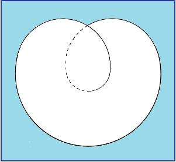

# Leçon 18 | 19 Juin 1968

<!-- source-url: http://staferla.free.fr/S15/S15 L'ACTE.docx -->
<!-- seminar: s15 -->
<!-- lesson: 18 -->

<!-- id: s15-18-0001 -->

[Conférence du mercredi 19 juin 1968](http://www.ecole-lacanienne.net/pictures/mynews/5634CFB898FE7EB394D5476585323802/1968-06-19.pdf) ([E.L.P.](http://www.ecole-lacanienne.net/fr/p/lacan))

<!-- id: s15-18-0002 -->

Je ne suis pas un truqueur. Je ne veux pas avertir que je dirai quelques mots d’adresse pour clore l’année présente, comme s’exprime le papier de l’École, pour vous faire ce qu’on appelle « *un séminaire* ».

<!-- id: s15-18-0003 -->

J’adresserai quelques mots plutôt de l’ordre de *la cérémonie*.

<!-- id: s15-18-0004 -->

J’ai fait cette année quelque part - si je me souviens bien - allusion au signe d’ouverture de l’année commençante dans les civilisations traditionnelles. Celui-là, c’est pour l’année scolaire qui se termine. Il peut rester un regret qu’après avoir ouvert un concept comme celui de *l’acte psychanalytique*, le sort ait voulu que vous n’ayez sur ce sujet pu apprendre que la moitié de ce que j’avais l’intention d’en dire.

<!-- id: s15-18-0005 -->

La moitié… à vrai dire un peu moins parce que la procédure d’entrée pour quelque chose d’aussi nouveau… jamais articulé comme dimension …que *l’acte psychanalytique*, ça a demandé en effet quelque temps d’ouverture. Les choses, pour tout dire, ne conservent pas *la même vitesse*, c’est plutôt quelque chose qui ressort à ce qui se passe quand un corps choit, est soumis à *la même force*.

<!-- id: s15-18-0006 -->

Au cours de sa chute, son mouvement - comme on dit - s’accélère, de sorte que vous n’aurez pas eu du tout la moitié de ce qu’il y avait à dire sur *l’acte psychanalytique*.

<!-- id: s15-18-0007 -->

Disons que vous en aurez eu un petit peu moins du quart. C’est bien regrettable par certains côtés car, à vrai dire, il n’est pas dans mes us de terminer plus tard et en quelque sorte par raccroc ce qui se trouve d’une façon quelconque, quelle qu’en soit la cause, interne ou externe, avoir été interrompu.

<!-- id: s15-18-0008 -->

À vrai dire, mon regret n’est pas sans s’accompagner par un autre côté de quelque satisfaction, car enfin dans ce cas là le discours n’a pas été interrompu par *n’importe quoi*, et de l’avoir été par quelque chose qui met en jeu, certainement à un niveau très *bébé*, mais qui met en jeu quand même quelque dimension qui n’est pas tout à fait sans rapport avec l’acte, eh bien mon Dieu ce n’est pas tellement insatisfaisant.

<!-- id: s15-18-0009 -->

Évidemment, il y a une petite discordance dans tout cela. *L’acte psychanalytique*, cette « *dissertation* » que je projetais était forgée *pour les psychanalystes* - comme on dit - *mûris par l’expérience*. Elle était destinée avant tout à leur permettre… et du même coup à permettre aux autres …une plus juste estime du poids qu’ils ont à soulever quand quelque chose précisément marque *une dimension de paradoxe*, d’antinomie interne, de profonde contradiction qui n’est pas sans permettre de concevoir la difficulté que représente pour eux d’en soutenir la charge.

<!-- id: s15-18-0010 -->

Il faut bien le dire, ça n’est pas ceux qui - cette charge - la connaissent mieux dans sa pratique, qui ont marqué pour ce que je disais le plus vif intérêt. À un certain niveau, je dois dire qu’ils se sont vraiment distingués par une absence qui n’était certes *point de hasard*.

<!-- id: s15-18-0011 -->

De même, puisqu’on y est, je vous raconterai incidemment une petite anecdote à laquelle j’ai déjà fait allusion, mais je vais tout à fait l’éclairer : une de ces personnes à qui j’envoyais galamment *un poulet* [^117] pour lui demander si cette absence était un acte, m’a répondu :

<!-- id: s15-18-0012 -->

- « *Qu’allez-vous penser ! Que nenni ! Ni un acte, ni un acte manqué. Il se trouve que cette année, j’ai pris à onze heures et demie rendez-vous pour un long travail (il s’agissait de se refaire faire la denture) avec le praticien adéquat, à onze heures et demie tous les mercredis* ».

<!-- id: s15-18-0013 -->

Ce n’est pas *un acte*, comme vous voyez, c’est *une pure rencontre* !

<!-- id: s15-18-0014 -->

Ceci tempère pour moi le regret que quelque chose puisse rester en quelque sorte en suspens dans ce que j’ai à transmettre à la communauté psychanalytique et tout à fait spécialement *à celle qui s’intitule du titre de mon école*. Par contre, une certaine dimension de l’acte qui a elle aussi son ambiguïté, qui n’est pas forcément faite d’actes manqués, malgré bien sûr qu’elle donne du fil à retordre à ceux qui aimeraient penser les choses en termes traditionnels de la politique, quand même, il s’est trouvé quelque chose, je l’ai dit à l’instant, que les « *bébés »* ont relevé un beau jour du titre d’acte et qui pourrait bien, comme ça, donner dans les années qui vont suivre à quelques gens du fil à retordre.

<!-- id: s15-18-0015 -->

En tout cas la question…

<!-- id: s15-18-0016 -->

> et c’est pour ça qu’aujourd’hui j’ai voulu vous adresser quelques mots …est justement de savoir si j’ai raison de trouver là comme une espèce de petite balance ou compensation, de me sentir en quelque sorte un tout petit peu allégé de ma propre charge.

<!-- id: s15-18-0017 -->

Car enfin, si c’est à propos de la psychanalyse, ou plus exactement sur le support qu’elle m’offrait et parce que ce support était le seul, qu’il n’était pas possible ailleurs de saisir *un certain nœud*…

<!-- id: s15-18-0018 -->

> ou si vous voulez une bulle, quelque chose de singulier, de pas repéré jusqu’alors …dans ce à quoi il n’est pas facile de donner une étiquette de nos jours…

<!-- id: s15-18-0019 -->

> étant donné qu’il y a un certain nombre de termes traditionnels qui s’en vont un tout petit peu à vau-l’eau : l’homme, la connaissance, la *connessence*, comme vous voudrez, ce n’est pas tout à fait de ça qu’il s’agit …ce certain nœud dont là-bas au crayon rouge j’ai pu aussi sur cette espèce de nœud-bulle…

<!-- id: s15-18-0020 -->

> que vous connaissez bien, c’est le fameux huit intérieur que j’ai fomenté déjà depuis quelque *huit ans* … inscrire  ces termes : *savoir, vérité, sujet, et le rapport à l’Autre,* voilà.

<!-- id: s15-18-0021 -->

Il n’y a pas de mot pour les mettre *ensemble tous les quatre*. Ces quatre termes sont pourtant devenus essentiels pour quelque chose qui est à venir, un avenir qui peut nous intéresser, nous autres qui sommes ici, *dans un amphithéâtre*, pas simplement pour faire de la *clamation* ni de la réclamation mais avec un souci de savoir justement, cet enseignement qui a manifesté je ne sais pas quoi d’insatisfaisant, nous pouvons peut–être avoir souci de ce que, à la suite de cette grande déchirure, de ce côté patent qu’il y a quelque chose de ce côté là qui ne va plus, que ce qui coiffait d’un terme qui n’est pas du tout de hasard : l’*Université*, ça s’autorise de l’*Univers,* c’est justement ici de ça qu’il s’agit.

<!-- id: s15-18-0022 -->

Est-ce que ça tient, l’Univers ? L’Univers a fait beaucoup de promesses, mais il n’est pas sûr qu’il les tienne.

<!-- id: s15-18-0023 -->

Il s’agit de savoir si quelque chose qui s’annonçait, qui était une espèce d’ouverture sur *la béance de l’univers*, *se soutiendra assez longtemps* pour qu’on en voie le fin mot. Cette question passe par ce que nous avons vu se manifester dans ces derniers mois, dans un endroit, comme ça, bizarrement permanent dans l’histoire. Nous avons vu se ranimer une fonction de lieu.

<!-- id: s15-18-0024 -->

C’est curieux. C’est essentiel. Peut-être qu’on n’aurait pas vu la chose se cristalliser si vivement s’il n’y avait pas eu un lieu où ils revenaient toujours pour se faire tabasser. Il ne faut pas vous figurer que ce qui s’ouvre, ce qui s’est ouvert comme question dans ce lieu, ce soit de notre tissu national le privilège.

<!-- id: s15-18-0025 -->

J’ai été - histoire de prendre l’air - passer deux jours à Rome où des choses semblables ne sont pas concevables simplement parce qu’à Rome *il n’y a pas de Quartier Latin*. Ce n’est pas un hasard ! C’est drôle mais enfin c’est comme ça.

<!-- id: s15-18-0026 -->

Peut-être qu’ils le sont tous \[latins\]. J’ai vu comme ça des choses qui m’ont bien plu. C’est plus facile de les repérer là-bas, ceux qui savent ce qu’ils font. Un petit groupe. Je n’en ai pas vu beaucoup mais je n’en aurais vu qu’un que ça suffirait.

<!-- id: s15-18-0027 -->

Ils s’appellent les *Oiseaux*, *Uccelli*. Comme je l’ai dit à quelques uns de mes familiers, *je suis en Italie* - à ma stupeur, il faut bien le dire : c’est le terme qu’on emploie, j’ai honte ! - *populaire*. Ça veut dire qu’ils savent mon nom. Ils ne savent bien sûr rien de ce que j’ai écrit ! Mais, c’est ça qui est curieux, ils savent que les *Écrits* existent.

<!-- id: s15-18-0028 -->

Il faut croire qu’ils n’en ont pas besoin, parce que les *Uccelli*, les *Oiseaux* en question, par exemple, sont capables d’actions comme celle-là qui, évidemment, a avec l’enseignement lacanien le rapport qu’ont les affiches des *Beaux-Arts* avec ce dont il s’agit *politiquement*, vraiment, mais ça veut dire qu’ils ont un rapport tout à fait direct.

<!-- id: s15-18-0029 -->

Quand *le Doyen de la Faculté de Rome, accompagné d’un représentant éminent de l’intelligence vaticane*, va leur faire à tous réunis…

<!-- id: s15-18-0030 -->

> parce qu’il y a des assemblées générales aussi là-bas, où on leur parle,
>
> on est pour le dialogue, du côté bien entendu où ça sert …alors les *Uccelli* viennent avec un de ces grands machins comme il y en a, quand on va dans des restaurants à la campagne, au centre d’une table ronde, c’est un énorme parapluie, ils se mettent tous dessous, à l’abri, disent-ils, du langage !

<!-- id: s15-18-0031 -->

J’espère que vous comprenez que ça me laisse un espoir. Ils n’ont pas encore lu les *Écrits* mais ils les liront !

<!-- id: s15-18-0032 -->

En ont-ils vraiment besoin puisqu’ils ont trouvé ça ? Après tout, ce n’est pas le théoricien qui *trouve* la voie, il l’explique. Évidemment, l’explication est utile pour trouver la suite du chemin. Mais, comme vous voyez, je leur fais confiance.

<!-- id: s15-18-0033 -->

Si j’ai écrit quelques petites choses qui auraient pu servir aux psychanalystes, *ça servira à d’autres* dont la place, la détermination est tout à fait précisée par un certain champ, le champ qui est cerné par *ce petit nœud* qui est fait d’une certaine façon de couper dans une certaine bulle extraordinairement purifiée par les antécédents de ce qui a abouti à cette aventure et qui est ce que je me suis efforcé de repérer devant vous comme étant le moment d’engendrement de la science.

<!-- id: s15-18-0034 -->

Donc cette année, à propos de *l’acte psychanalytique*, j’en étais au moment où j’allais vous montrer ce que comporte d’avoir à prendre place dans le registre du *sujet supposé savoir*…

<!-- id: s15-18-0035 -->

> et ceci justement quand on est psychanalyste, non pas qu’on soit le seul
>
> mais qu’on soit particulièrement bien placé pour en connaître la radicale division …en d’autres termes cette position inaugurale à *l’acte psychanalytique* qui consiste à jouer sur quelque chose que votre acte va démentir.

<!-- id: s15-18-0036 -->

C’est pour cela que j’avais réservé pendant des années, mis à l’abri, mis à l’écart le terme de *Verleugnung* qu’assurément FREUD a fait surgir à propos de tel moment exemplaire de la *Spaltung* du sujet. Je voulais le réserver, le faire vivre là où assurément il est poussé à son point le plus haut de pathétique, au niveau de l’analyste lui-même.

<!-- id: s15-18-0037 -->

À cause de ça, il a fallu que je subisse, pendant des années, le harcèlement de ces êtres qui suivent la trace de ce que j’apporte, pour tâcher de voir où est-ce qu’on pourrait bricoler un petit morceau où j’*achopperais*. Alors quand je parlais de *Verwerfung* qui est un terme extrêmement précis et qui situe parfaitement ce dont il s’agit quant à la psychose, « *on* » rappelait que ce serait beaucoup plus malin de se servir de *Verleugnung*. Enfin on trouve de tout cela des traces dans de pauvres conférences et médiocres articles.

<!-- id: s15-18-0038 -->

Le terme de *Verleugnung* eût pu prendre, si j’avais pu cette année \[1963-64\] vous parler comme il était prévu, sa place authentique et son poids plein. C’était le pas suivant à faire.

<!-- id: s15-18-0039 -->

Il y en avait d’autres que je ne peux même pas indiquer. Assurément, une des choses dont j’aurai été *le plus frappé*…

<!-- id: s15-18-0040 -->

> au cours d’une expérience d’enseignement sur lequel vous pourrez bien me permettre
>
> de jeter aujourd’hui un regard en arrière, et ceci justement dans ce tournant …c’est *la violence des choses* que j’ai pu me permettre de dire.

<!-- id: s15-18-0041 -->

Deux fois à Sainte-Anne par exemple, j’ai dit que la psychanalyse, c’était quelque chose qui avait ça au moins pour elle : que dans son champ - *quel privilège !* - *la canaillerie ne pouvait virer qu’à la bêtise.* Je l’ai répété deux années de suite comme ça, et je savais de quoi je parlais !

<!-- id: s15-18-0042 -->

Nous vivons dans une aire de civilisation où, comme on dit, la parole est libre, c’est-à-dire que *rien de ce que vous dites ne peut avoir de conséquence.* Vous pouvez dire n’importe quoi sur celui qui peut bien être à l’origine de *je ne sais quel meurtre indéchiffrable*, vous faites même une pièce de théâtre là-dessus : toute l’Amérique - *new-yorkaise, pas plus* - s’y presse. Jamais auparavant dans l’histoire une chose pareille n’eût été concevable sans qu’aussitôt on ferme la boîte. *Dans le pays de la liberté, on peut tout dire, puisque ça n’entraîne rien.*

<!-- id: s15-18-0043 -->

Il est assez curieux qu’à partir simplement du moment où quelques petits pavés se mettent à voler, pendant au moins un moment tout le monde ait le sentiment que toute la société pourrait s’en trouver intéressée de la façon la plus directe dans son confort quotidien et dans son avenir. On a même vu les psychanalystes s’interroger sur l’avenir du métier.

<!-- id: s15-18-0044 -->

À mes yeux, ils ont eu tort de s’interroger publiquement. Ils auraient mieux fait de garder ça pour eux, parce que quand même, les gens qui les ont vus s’interroger là-dessus, justement, alors qu’ils les interrogeaient sur tout autre chose, ça les a un peu fait marrer. Enfin on ne peut pas dire que la cote de la psychanalyse a monté !

<!-- id: s15-18-0045 -->

J’en veux au Général. Il m’a chopé un mot que depuis longtemps j’avais - *et ce n’était pas pour l’usage bien sûr qu’il en a fait -* « *la chienlit psychanalytique* ». Vous ne savez pas depuis combien d’années j’ai envie de donner *ça comme titre à mon séminaire*.

<!-- id: s15-18-0046 -->

C’est foutu maintenant ! Puis je vais vous dire, je ne regrette pas parce que je suis trop fatigué, c’est suffisamment *visible* comme ça, je n’ai pas besoin d’y ajouter un commentaire.

<!-- id: s15-18-0047 -->

Enfin ce serait une chose quand même que *j’aimerais bien*, tout le monde n’aimerait pas ça *mais moi j’aimerais bien :* l’enseignement de la psychanalyse à la *Faculté de Médecine*. Vous savez, il y a comme ça des types très remuants. Je ne sais pas quelle mouche les pique, qui se pressent pour être là, à cette place. Je parle de personnes de l’École Freudienne de Paris.

<!-- id: s15-18-0048 -->

Je sais bien qu’à la Faculté de Médecine, on connaît l’histoire des doctrines médicales, ça veut dire qu’on en a vu passer des choses de l’ordre - à nos yeux, avec le recul de l’histoire - de l’ordre de la mystification.

<!-- id: s15-18-0049 -->

Mais ça ne veut pas dire que la psychanalyse telle qu’elle est enseignée *là où elle est enseignée officiellement*…

<!-- id: s15-18-0050 -->

> on vous parle de *la libido* comme de quelque chose qui passe dans les vases communicants, comme s’exprimait, au début du temps où j’ai commencé à essayer de changer un peu ça, un personnage absolument incroyable : une hydraulique libidinale …enseigner la psychanalyse comme on l’enseigne, disons le mot : *à l’Institut*, ça serait formidable, surtout à l’époque où nous vivons, où quand même les *« enseignés »*, comme on dit, *se mettent à avoir quelque exigence*. Je trouve ça merveilleux.

<!-- id: s15-18-0051 -->

Qu’on voie ce qu’on peut faire d’un certain côté comme *enseignement de la psychanalyse*, après avoir fait ce petit tour d’horizon et vous avoir montré les espoirs de bon temps que la suite de ces choses réserve à certains. Vous me direz, bien sûr, que le personnage par exemple en question pourrait toujours se mettre *à enseigner du Lacan* ! Évidemment, ce serait mieux !

<!-- id: s15-18-0052 -->

Mais faudrait-il encore qu’il le puisse, parce qu’il y a un certain article paru dans les *Cahiers pour l’Analyse*[^118] sur *l’objet(a)* à propos duquel…

<!-- id: s15-18-0053 -->

> je regrette de le dire, ça va encore *choquer* quelques-uns de *mes plus proches* et plus chers *collègues* …ça n’a été qu’une longue petite fusée de rires chez ces damnés normaliens, comme par hasard.

<!-- id: s15-18-0054 -->

Moi-même, j’ai été forcé, dans une petite note discrète, quelque part, juste avant que paraissent mes *Écrits*, d’indiquer que, quel que soit le besoin qu’on a de travailler le marketing psychanalytique, il ne suffit pas de parler de *l’objet(a)* pour que ce soit tout à fait ça.

<!-- id: s15-18-0055 -->

En tout cas, je voudrais prendre les choses d’un peu plus haut et puisque j’ai préparé quelques mots… pas ceux-là, *je dois dire que je me suis laissé un peu aller… vu la chaleur, la familiarité, l’amitié que dégage cette ambiance*, à savoir ces figures dont il n’y a pas une que je ne reconnaisse pour l’avoir vue dans les débuts de cette année …puisque j’ai parlé de ces quatre termes, rappelons en… histoire pour ceux qui sont un peu dans la courte vue et qui ne se rendraient pas compte de l’importance tout à fait critique d’une certaine conjoncture …rappelons en les principales articulations.

<!-- id: s15-18-0056 -->

À savoir : d’abord *le savoir* car, en fin de compte, c’est tout de même assez curieux, du côté du savoir jusqu’à présent des classiques, qu’on soit sage, et une partie de la position sage est évidemment de se tenir tranquille. Que ce soit au niveau et comme on le dit très justement à un niveau privilégié de la transmission du savoir qu’il se passe tellement de choses, ça vaut peut-être la peine qu’on bénéficie d’un peu de recul dans le regard.

# Là il y a une fonction… naturellement, je m’excuse auprès des personnes qui sont ici - il y en a peu - qui viennent ici pour 

# la première fois, et qui viennent histoire de voir un peu ce que je pourrais raconter si on m’interrogeait sur « *les événements* ». 

<!-- id: s15-18-0057 -->

Je ne vais pas pouvoir faire la théorie de l’Autre, et c’est bien ça déjà qui rend très difficile un tel entretien, une interview.

<!-- id: s15-18-0058 -->

Il faudrait expliquer ce que c’est, l’Autre. Nous commençons par lui parce que c’est la clé. Donc, pour les personnes qui ignorent ce que c’est que l’Autre, je peux dire d’un côté que je l’ai défini strictement comme *un lieu* : «* le lieu où la parole vient prendre place *». *Ça ne se livre pas tout de suite, ça :* «* lieu où la parole vient prendre place *».

<!-- id: s15-18-0059 -->

Mais enfin c’est une fonction topologique tout à fait indispensable pour dégager la structure logique radicale dont il s’agit dans ce que j’ai appelé tout à l’heure *ce nœud* ou *cette bulle*, *ce creux* dans le monde à propos de quoi s’évoque cette vieille notion du sujet, *vieille notion du sujet qui n’est plus réductible à l’image du miroir* ni de quoi que ce soit de l’ordre d’un *reflet* omniprésent.

<!-- id: s15-18-0060 -->

Mais effectivement cette bulle est vagabonde encore grâce à quoi ce monde n’est plus à proprement à parler *un monde*.

<!-- id: s15-18-0061 -->

Cet Autre, il est là depuis un bout de temps, bien sûr. On ne l’avait pas vraiment dégagé parce que c’est une bonne place et qu’on y avait installé *quelque chose* qui y est encore pour la plupart d’entre vous, qui s’appelle Dieu : *Il vecchio con la barba !*

<!-- id: s15-18-0062 -->

Il est toujours là.

<!-- id: s15-18-0063 -->

*Les psychanalystes* n’ont vraiment pas ajouté grand-chose à la question de savoir - point essentiel - s’il existe *ou* s’il n’existe pas. Tant que ce « *ou* » sera maintenu, il sera toujours là. Néanmoins, *grâce à la bulle*, nous pouvons faire comme s’il n’était pas là.

<!-- id: s15-18-0064 -->

Nous pouvons traiter de sa place.

<!-- id: s15-18-0065 -->

À sa place, justement, il n’a jamais fait de doute que gîtait ce dont il s’agit quant au *savoir*. Tout *savoir* nous vient de l’Autre.

<!-- id: s15-18-0066 -->

Je ne parle pas de Dieu, je parle de l’Autre. Il y a toujours un Autre où est *la tradition, l’accumulation, le réservoir*.

<!-- id: s15-18-0067 -->

Sans doute *on soupçonnait* qu’il peut se passer des choses. On appelait ça « *la découverte* », ou même encore de ces variations dans l’éclairage, de ces façons de dispenser l’enseignement qui en changeaient, en quelque sorte, l’accent et le sens, ce qui justement a fait pendant un certain temps que l’enseignement, ça tenait encore.

<!-- id: s15-18-0068 -->

Est-ce que vous avez jamais aperçu que ce qui fait qu’un enseignement a une prise, c’est peut-être que justement dans une certaine façon de le redistribuer, il s’inscrit dans son dessin, dans son tracé, dans sa structure quelque chose qui n’est pas immédiatement dit, mais que c’est ça qui est entendu ?

<!-- id: s15-18-0069 -->

Pourquoi, après tout depuis un certain temps cette corde ne paraîtrait-elle pas un peu usée à ceux qui sont sur les bancs ?

<!-- id: s15-18-0070 -->

Je veux dire que ce qui n’est pas dit pour être entendu, il faudrait encore que ce soit quelque chose qui en vaille la peine et pas une simple hypocrisie par exemple, que c’est peut-être pour quelque chose au fait que ce soit au niveau des *Facultés des Lettres* ou encore des *Écoles d’Architecture* que ça ce soit mis *à flamber*.

<!-- id: s15-18-0071 -->

Dans ce rapport du sujet avec l’Autre, la psychanalyse apporte une dimension radicalement neuve.

<!-- id: s15-18-0072 -->

C’est plus que ce que j’ai appelé à l’instant, comme ça, « *une découverte* », *découverte* ça garde encore quelque chose d’*anecdotique*, c’est un profond remaniement de tout le rapport.

<!-- id: s15-18-0073 -->

Il y a un mot que j’ai fait rentrer ici il y a quelques années dans cette dialectique, c’est le mot « *vérité* ». Et puis à vrai dire avant de l’articuler précisément comme je l’ai fait ici un certain jour…

<!-- id: s15-18-0074 -->

> et comme en porte *la marque parfaitement logicisée* l’article qui s’appelle dans mes *Écrits *: *La vérité et la science* [^119] …j’avais donné à ce mot une autre fonction, dans un article qui s’appelle *La chose freudienne*[^120], où on peut lire ces termes :

<!-- id: s15-18-0075 -->

> « *Moi la vérité, je parle.* » \[p.409\].

<!-- id: s15-18-0076 -->

Qui est ce « *je* » qui parle ?

<!-- id: s15-18-0077 -->

Ce morceau - à la vérité : *une prosopopée*, un de ces jeux enthousiastes *-* il se trouve que je me suis permis de l’articuler pour le centenaire de FREUD, et à Vienne. C’était un cri plutôt de l’ordre de ce qu’un MÜNCH[^121], a si bien mis dans une gravure célèbre : cette bouche qui se tord où nous voyons surgir l’anéantissement sublime de tout un paysage.

<!-- id: s15-18-0078 -->

Il y a très longtemps, à Vienne, j’ai dit - spécialement là, où l’on n’avait point entendu depuis longtemps - le mot de *vérité* : c’est un mot très dangereux mis à part l’usage que l’on en fait quand on le châtre, à savoir dans les traités de logique.

<!-- id: s15-18-0079 -->

On sait depuis longtemps qu’on ne sait pas ce que cela veut dire. « *Qu’est-ce que la vérité ?* » \[Cf. Ponce Pilate\]

<!-- id: s15-18-0080 -->

C’est précisément la question qu’il ne faut pas poser. J’ai fait allusion à Lyon, quand j’y ai parlé en octobre dernier, à un certain morceau de CLAUDEL, très brillant, que je vous recommande. Je n’ai pas eu le temps d’en relever pour vous, avant de venir ici - je ne savais pas que j’en parlerai - les pages, mais vous le trouverez en cherchant bien dans la table des matières des proses de CLAUDEL[^122], en cherchant à Ponce PILATE naturellement.

<!-- id: s15-18-0081 -->

Il décrit, ce texte, tout ce qu’il arrive de malheur à ce bienveillant administrateur colonial pour avoir prononcé mal à propos cette question : « *Qu’est-ce que la vérité ?* ». Chez des gens pour l’instant qui se situent bien sûr dans cette zone futile de ces zèbres auxquels il est dangereux d’énoncer la vérité psychanalytique, qui donnent une application terrible à ces mots recueillis au tournant d’une de mes pages : « *Moi la vérité, je parle.* »

<!-- id: s15-18-0082 -->

Ils vont dire la *vérité* dans des endroits où on n’en a aucun besoin mais où elle porte. Il est très possible qu’une certaine chose qu’on avait réussie si bien à tamponner sous le nom de « *lutte des classes* » en devienne tout d’un coup quelque chose de tout à fait dangereux. Bien sûr, on peut compter sur de saines fonctions existant depuis toujours pour le maintien de ce dont il s’agit, à savoir de laisser les choses dans le champ du partage du pouvoir.

<!-- id: s15-18-0083 -->

Il faut bien le dire, les gens qui s’y connaissent un peu en fait de maniement de *la vérité*, ne sont pas aussi imprudents.

<!-- id: s15-18-0084 -->

Ils ont *la vérité*, mais ils enseignent : tout pouvoir vient de Dieu. Tout. Ça ne vous permet pas de dire que c’est seulement le pouvoir qui leur convient. Même le pouvoir qui est contre Dieu, il vient de Dieu, pour l’Église.

<!-- id: s15-18-0085 -->

DOSTOÏEVSKI avait très bien aperçu ça. Comme il croyait à *la vérité*, Dieu lui faisait *une peur bleue*. C’est pour ça qu’il a écrit *Le Grand Inquisiteur* [^123]. C’était la conjonction en somme prévue à l’avance de Rome et de Moscou. Je pense que quand même quelques-uns d’entre vous ont lu ça. Mais c’est quasiment fait, mes petits amis, et vous voyez bien que ce n’est pas si terrible que ça ! Quand on est dans l’ordre du pouvoir, tout s’arrange ! C’est bien pour ça qu’il est utile que la *vérité* soit quelque part, dans un coffre-fort. Le privilège de la révélation, ça, c’est le coffre-fort. Mais si vous prenez au sérieux *la prosopopée*

<!-- id: s15-18-0086 -->

« *Moi la vérité, je parle.* » ça peut avoir d’abord hélas pour celui qui se met dans cette voie, de grands inconvénients.

<!-- id: s15-18-0087 -->

Voyons quand même ce que nous, analystes, pouvons peut–être avoir apporté là-dessus de nouveau. Évidemment, notre champ est très limité. Il est au niveau de la *bulle*. La *bulle*, comment elle se définit ? Elle a une portée très limitée.

<!-- id: s15-18-0088 -->

Si, après tant d’années, après en avoir montré ce qui en est proprement *la structure*, *c’est maintenant de logique que je vous parle*, ce n’est pas un hasard : c’est parce que tout de même il est clair que ce savoir qui nous intéresse, nous, analystes, n’est proprement que *ce qui se dit*.

<!-- id: s15-18-0089 -->

Si je dis que *l’inconscient est structuré comme un langage*, c’est parce que cet inconscient qui nous intéresse est ce qui peut se dire et que se disant, il engendre le sujet. C’est parce que le sujet est une détermination de ce savoir, qu’il est ce qui court sous ce savoir, mais qu’il n’y court pas librement, qu’il y rencontre des butées. C’est en cela, et en rien d’autre, que nous avons affaire à un savoir. Qui dit le contraire est amené sur les voies que j’ai appelées tout à l’heure celles de *la mystification*.

<!-- id: s15-18-0090 -->

C’est parce que l’inconscient est la conséquence de ce qui a pu se cerner, qui a montré que ce rapport au discours a des conséquences beaucoup plus complexes que ce qu’on avait vu jusque-là, c’est nommément *que le sujet, d’être second par rapport au savoir, il apparaît qu’il ne dit pas tout ce qu’il sait*, point dont on ne se doutait pas, *même si depuis longtemps on soupçonnait qu’il ne sait pas tout ce qu’il dit.* Tel est le point qui a permis la constitution de *la bulle*, il réside très précisément en ceci qu’à ce propos nous apercevons comment se produit la dimension de *la vérité*.

<!-- id: s15-18-0091 -->

*La vérité* - c’est ce que nous apprend la psychanalyse - *elle gît au point où le sujet refuse de savoir : tout ce qui est rejeté du symbolique reparaît dans le réel*. Telle est la clé de ce qu’on appelle *le symptôme*. *Le symptôme*, c’est *ce nœud réel* où est la *vérité* du sujet.

<!-- id: s15-18-0092 -->

Au début - très tôt - de ces menus épisodes, je vous ai dit : « *Ils sont la vérité* ». « *Ils sont la vérité » ça ne veut pas dire qu’ils la disent*.

<!-- id: s15-18-0093 -->

*La vérité*, ce n’est pas quelque chose qui se sait comme ça, sans labeur. C’est même pour cela qu’elle prend ce corps qui s’appelle *le symptôme*, qu’elle démontre où est le gîte de ce qui s’appelle *vérité*. Alors, ce savoir refusé que vous venez chercher dans l’échange psychanalytique, est-ce que c’est *le savoir du psychanalyste* ? Illusion !

<!-- id: s15-18-0094 -->

Le psychanalyste sait peut-être quelque chose, il sait ça en tout cas concernant la nature de la *vérité*. Mais pour la suite, à savoir du *savoir refusé*, là il n’en sait pas lourd. C’est pour cela que l’enseignement de la psychanalyse prise au niveau de ce qui serait *substantiel*, apparaîtrait comme ce que ça est : *une pantalonnade*.

<!-- id: s15-18-0095 -->

La *libido* dont je vous parlais tout à l’heure par exemple, si ça veut dire ce que j’appelle le désir, il est vraiment assez piquant que ça ait été découvert, suivi à la trace chez le névrosé, c’est-à-dire celui dont le désir ne se soutient, que soutenu de fiction.

<!-- id: s15-18-0096 -->

Dire « *Ils sont la vérité* » n’est certes pas vous la livrer, ni à vous, ni à eux. Mais il a peut-être son poids que l’on sache, ce mécanisme d’un échange - échange étrange - qui est celui qui fait que ce qui est dit par le sujet - quoi que ce soit, qu’il le sache ou non - ne devient savoir que d’être reconnu par l’Autre. Et c’est là précisément d’ailleurs ce que veut dire la notion tout à fait primitive, taillée à la hache, qui s’appelle la censure. C’est l’Autre pendant longtemps, pendant les temps d’autorité, qui a toujours défini ce qui peut être dit et ce qui ne le peut pas.

<!-- id: s15-18-0097 -->

Mais il serait tout à fait vain de lier cela à des configurations dont l’expérience montre bien que puisqu’elles peuvent être caduques, elles l’étaient déjà quand elles fonctionnaient. C’est d’une façon structurale que ce n’est qu’au niveau de l’Autre :

<!-- id: s15-18-0098 -->

- que ce qui détermine le sujet s’articule en savoir,

<!-- id: s15-18-0099 -->

- *que l’énonciation* - qui est celle dont le sujet n’est pas du tout forcément celui qui parle - *que l’énonciation par l’Autre* se trouve désigner celui-là qui l’a dit.

<!-- id: s15-18-0100 -->

L’Autre a d’abord été celui qu’il est toujours quand l’analyste interprète, et qui dit au sujet : « vous *je* ( ce *j*e qui est *vous*), je dis : c’est ça ». Et il arrive que ça ait des conséquences. C’est cela qui s’appelle l’interprétation.

<!-- id: s15-18-0101 -->

Pendant un temps cet Autre qui était philosophe, a forgé, lui, le *sujet supposé savoir*. C’était déjà une tromperie comme il suffit d’ouvrir PLATON pour s’en apercevoir. Il lui faisait dire, au pauvre sujet, tout ce qu’il voulait qu’il dise.

<!-- id: s15-18-0102 -->

À la fin, le sujet a appris. Il a appris à dire tout seul :

<!-- id: s15-18-0103 -->

> « *Je dis : noir n’est pas blanc.* » par exemple.

<!-- id: s15-18-0104 -->

> « *Je dis : ou c’est vrai ou c’est faux.* »

<!-- id: s15-18-0105 -->

Mais le total de ce que je dis là est certainement vrai car ou c’est vrai ou c’est faux. Naturellement, c’est « *bébé* » comme le *Mouvement du 22 mars*. Ce n’est pas vrai que « *Ou c’est vrai ou c’est faux.* » Mais ça se soutient. Le sujet a appris à endosser d’un « *je dis* » quelque chose dont il se déclarait prêt à répondre dans un débat dont les règles étaient fixées à l’avance, et c’est cela qui s’appelle la logique.

<!-- id: s15-18-0106 -->

Chose étrange, c’est de ce qui s’est purifié de cette voie de l’isolement de l’articulation logique, du détachement du sujet de tout ce qui peut se passer entre lui et l’Autre…

<!-- id: s15-18-0107 -->

> et Dieu sait qu’il peut s’en passer des choses, jusques et y compris la prière …qu’est sortie la science, le savoir. Non pas n’importe quel savoir, un savoir pur qui n’a rien à faire avec le *réel*, ni du même coup avec *la vérité*, car le savoir de la science est, par rapport au *réel*, ce qu’on appelle en logique le complément d’un langage.

<!-- id: s15-18-0108 -->

Ça fonctionne à côté du *réel*. Mais sur le *réel*, ça mord. Ça introduit la bulle, c’est-à-dire après tout quelque chose qui, du point de vue de la connaissance, n’a pas beaucoup plus d’importance qu’un *gag*. Mais ça donne finalement la seule chose qui incarne après tout vraiment les lois de NEWTON, à savoir le premier *spoutnik*, qui est assurément le meilleur *gag* que nous ayons vu, puisque ça fout le monde en l’air, le *gag*…arine. Car qu’est-ce que ça a à faire avec le cosmos… en tant que nous avons avec lui un rapport …qu’on puisse se mettre à faire six fois le tour de la terre en vingt-quatre heures, d’une façon qui assurément dépassait tout à fait l’entendement de ceux qui croyaient que le mouvement, ça a un rapport avec l’effort ?

<!-- id: s15-18-0109 -->

Enfin la bulle a fait d’autres siennes depuis. Seulement il en reste un résidu, en quelque sorte. C’est que celui qui parle, n’est pas toujours capable de dire « je dis » comme le prouve…

<!-- id: s15-18-0110 -->

> c’est en ceci que nous sommes des témoins, nous, *psychanalystes* …que nous, *psychanalystes*, qui sommes capables de le lui dire, ce qu’il dit, nous sommes capables dans un petit nombre de cas, surtout s’ils y mettent énormément de bonne volonté, s’ils viennent chez nous énormément parler, il arrive ceci que nous leur interprétons quelque chose.

<!-- id: s15-18-0111 -->

Et qu’est-ce que c’est qu’interpréter quelque chose ? Nous ne leur interprétons jamais le monde, nous leur apportons comme ça un petit morceau de quelque chose qui a l’air d’être quelque chose qui aurait tenu sa place sans qu’ils le sachent dans leur discours. D’où est-ce que nous, analystes, nous tirons ça ?

<!-- id: s15-18-0112 -->

Il y a quelque chose sur quoi j’aurais aimé cette année vous faire méditer, ce sont *les paroles gelées de* RABELAIS [^124].

<!-- id: s15-18-0113 -->

À la vérité, comme beaucoup de choses, c’est déjà écrit il y a longtemps, mais personne ne s’en est aperçu.

<!-- id: s15-18-0114 -->

J’ai mis beaucoup l’accent sur un certain M. VALDEMAR décrit par POE[^125]. J’en ai fait un usage si l’on peut dire satirique.

<!-- id: s15-18-0115 -->

J’ai parlé à ce propos de quelque chose qui n’était rien d’autre que ce que je dénonçais ici une fois de plus, à savoir cette survivance quasi hypnotiseuse du discours freudien et des sociétés mortes qu’elle a l’air de maintenir parlantes.

<!-- id: s15-18-0116 -->

C’est un mythe qui va plus loin. Ce que déclenche l’interprétation n’est pas toujours bien net quant à ce dont il s’agit, si ce sont des réalités de vie ou de mort.

<!-- id: s15-18-0117 -->

Ce vers quoi, je vous aurais menés cette année, si j’eus pu parler de l’acte psychanalytique jusqu’au terme, ç’aurait été pour vous dire que ce n’est pas pour rien si je vous ai parlé du *désir du psychanalyste*, car il est impossible de tirer d’ailleurs que du *fantasme du psychanalyste*…

<!-- id: s15-18-0118 -->

> et c’est cela qui peut assurément donner un petit peu le frisson, mais nous n’en sommes pas à ça près
>
> par le temps qui court …que c’est du *fantasme du psychanalyste* à savoir de ce qu’il y a de plus opaque, de plus fermé, de plus autiste dans sa parole que vient le choc d’où se dégèle chez l’analysant la parole, et où vient avec insistance se multiplier cette *fonction de répétition* où nous pouvons lui permettre de saisir ce savoir dont il est le jouet. Ainsi se confirme que *la vérité* se fait savoir par l’Autre.

<!-- id: s15-18-0119 -->

Ceci justifie *que ce soit toujours ainsi* qu’elle soit sortie. Ce que nous savons de plus, c’est que c’est dans un rapport à l’Autre, qui n’a plus rien de mystique ni de transcendantal, que ceci se produit.

<!-- id: s15-18-0120 -->

<!-- id: s15-18-0121 -->

Et le nœud dont j’ai dessiné la courbe sur ce tableau, sous la forme de cette petite boucle qui est là…

<!-- id: s15-18-0122 -->

> et dont pour un rien vous verrez qu’elle pourrait se refermer de façon à n’apparaître plus
>
> que comme un cercle, se souder dans sa duplicité de boucle …c’est ce que nous donne l’expérience, à savoir que le *sujet supposé savoir*…

<!-- id: s15-18-0123 -->

> là où il est vraiment, c’est-à-dire non pas nous, l’analyste,
>
> mais en effet ce que nous supposons qu’il sait, ce sujet, ceci en tant qu’il est inconscient …se redouble avec ce sur quoi la pratique - cette pratique est un petit peu en rase-mottes - lui met en parallèle, à savoir ce « *sujet supposé demande* ». N’ai-je pas vu quelqu’un qui paraissait tout fier d’interroger un membre du *Mouvement du 22 mars* - ne le nommons pas - pour lui demander : « *Qu’est-ce que vous nous demandez, à nous, analystes ?* »

<!-- id: s15-18-0124 -->

J’ai écrit quelque part que l’analyste était ce personnage privilégié, assurément comique, qui, *avec de l’offre faisait de la demande.*

<!-- id: s15-18-0125 -->

Il est bien évident que là ça n’a pas marché, mais ça ne prouve pas que nous n’ayons rien à voir avec ce qui se passe à ce niveau. Ça veut dire qu’ils ne nous demandent rien. Et après !

<!-- id: s15-18-0126 -->

C’est justement l’erreur de l’analyste que de croire que ce où nous avons à intervenir - comme analystes - c’est au niveau de la demande, ce qui ne cesse pas de se théoriser, alors que ce dont il s’agit, c’est très précisément de cet intervalle entre *le « sujet supposé savoir » et « le sujet supposé demande »*, et en ceci que l’on connaît pourtant depuis longtemps : que *le sujet ne sait pas ce qu’il demande*.

<!-- id: s15-18-0127 -->

C’est ce qui permet qu’ensuite *il ne demande pas ce qu’il* *sait.* Cet intervalle, cette béance, cette *bande de Mœbius* pour la reconnaître là où elle est, dans ce petit nœud griffonné comme j’ai pu au tableau… à la vérité je n’y ai pas mis beaucoup de soin …c’est ce qu’on appelle ce *résidu*, cette distance, cette chose à quoi se réduit entièrement pour nous l’Autre, à savoir *l’objet(a)*.

<!-- id: s15-18-0128 -->

Ce rôle de *l’objet(a)* qui est de *manque* et de distance et non du tout de médiation, c’est sur cela que se pose, que s’impose cette vérité qui est la découverte, la découverte tangible - et puissent ceux qui l’auront touchée ne pas l’oublier - *qu’il n’y a pas de dialogue*, que le rapport du sujet à l’Autre est d’ordre essentiellement dissymétrique, que le dialogue est une duperie.

<!-- id: s15-18-0129 -->

C’est au niveau du sujet en tant que le sujet s’est purifié, que s’est instituée l’origine de la science.

<!-- id: s15-18-0130 -->

*Qu’au niveau de l’Autre, il n’y a jamais rien eu de plus vrai que la prophétie*.

<!-- id: s15-18-0131 -->

*C’est par contre au niveau de l’Autre que la science se totalise*, c’est-à-dire que par rapport au sujet, elle s’aliène complétement.

<!-- id: s15-18-0132 -->

Il s’agit de savoir où peut encore, au niveau du sujet, résider quelque chose qui soit justement de l’ordre de la prophétie.

## Notes

[^117]: Billet doux, ou missive quelconque.

[^118]: André Green : « *L’objet (a) de J. Lacan, sa logique et la théorie freudienne* » , pp. 15-37, in *Cahiers pour l’analyse* n°3 : Sur l’objet de la psychanalyse,

    Mai-Juin 1966, Paris, Éditions du Seuil.

[^119]: « *La science et la vérité* », Écrits p. 855.

[^120]: « *La Chose freudienne* », Écrits p. 401 ou t.1 p. 406.

[^121]: Edward Münch (1863-1944). « Le Cri » date de 1893.

[^122]: Paul Claudel : « *Le point de vue de Ponce Pilate* », *Figures et paraboles* - *Œuvres en prose*, Paris, Gallimard, Pléiade, 1965, p. 919.

[^123]: Fiodor Mikhaïlovitch Dostoïevski : [*Les frères Karamazov*](http://www.ebooksgratuits.com/pdf/dostoievski_freres_karamazov.pdf).

[^124]: François Rabelais, « Quart Livre » in Œuvres complètes, Paris, 1955, La Pléiade. On trouve dans l’Encyclopedia Universalis, vol. 13, 1973, p. 906

    le commentaire suivant : « *Dans le Quart Livre le sonore sera mis en conserve et gelé ; il ne dégèlera qu’au printemps suivant pour restituer le cliquetis des armes*

    *sur un champ de bataille horrifique du sonore de l’année précédente.* »

[^125]: Edgar Poe : « *La vérité sur le cas de M. Valdemar* », in [*Histoires extraordinaires*](http://www.ebooksgratuits.com/pdf/poe_histoires_extraordinaires.pdf), trad. de Charles Baudelaire, Paris, Flammarion, 1965.
