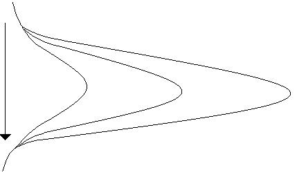
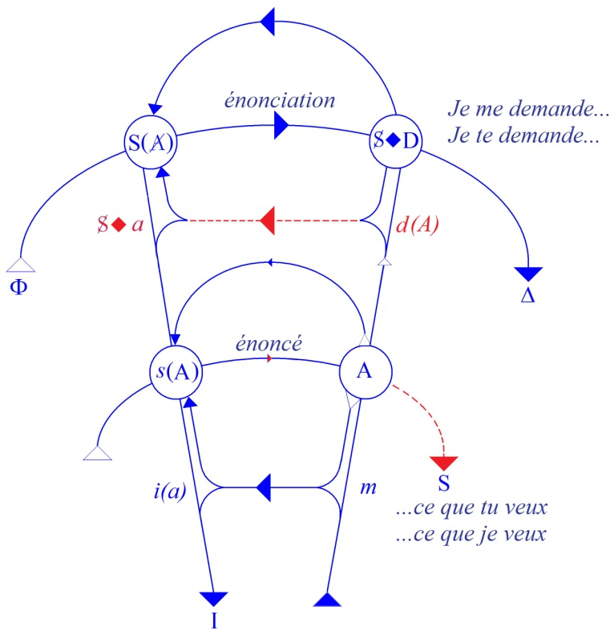

# Leçon 06 | 08 Janvier 1969

<!-- source-url: http://staferla.free.fr/S16/S16 D'UN AUTRE... .docx -->
<!-- seminar: s16 -->
<!-- lesson: 06 -->

<!-- id: s16-06-0001 -->

Je vous souhaite alors la bonne année, la bonne année 69, c’est un bon chiffre !

<!-- id: s16-06-0002 -->

Pour l’ouvrir, je vous signale qu’à telle occasion, je reçois toujours de quelque horizon un petit cadeau. Le dernier, celui à cette occasion-ci, c’est un petit article qui est paru dans le numéro du 1er Janvier de *La Nouvelle Revue Française* où il y a un article intitulé : « *Quelques traits du style de Jacques Lacan »* [^19].

<!-- id: s16-06-0003 -->

En effet - hein ! - mon style, c’est un problème ! Ce par quoi j’aurais pu commencer mes *Écrits,* c’est par un très vieil article que je n’ai jamais relu, qui était justement sur le problème du style. Peut-être que si je le relis, ça m’éclairera !

<!-- id: s16-06-0004 -->

En attendant, bien sûr, je suis le dernier à pouvoir en rendre compte, et mon Dieu, on ne voit pas pourquoi quelqu’un d’autre ne s’y essaierait pas. C’est ce qui s’est produit, tombant de la plume d’un professeur de linguistique et je n’ai pas à apprécier personnellement le résultat de ses efforts. Je vous en fais juge.

<!-- id: s16-06-0005 -->

En gros, j’ai plutôt eu l’écho que dans le contexte actuel…

<!-- id: s16-06-0006 -->

> où un soupçon est porté, enfin, dans quelques endroits retirés, sur la qualité générale de ce qui se dispense
>
> d’enseignement de la bouche des professeurs …on pense que ce n’était peut-être pas le moment de publier ça, ce n’est pas le moment le plus opportun.

<!-- id: s16-06-0007 -->

Enfin, il m’est revenu que certains n’ont pas trouvé ça très fort. Enfin, je vous le dis, je vous en fais juge. Quant à moi, je ne m’en plains pas ! Je vois mal que quelqu’un puisse y prendre la moindre idée de ce que j’ai répandu comme *enseignement*.

<!-- id: s16-06-0008 -->

Néanmoins il y a une pointe : j’aurais osé, paraît-il, écrire quelque part : « FREUD et moi ».

<!-- id: s16-06-0009 -->

Vous voyez ça - hein ? - *il ne se prend pas pour la queue d’une poêle* !

<!-- id: s16-06-0010 -->

Ça n’a peut-être pas tout à fait le sens que croit devoir lui donner l’indignation d’un auteur, mais ça montre bien dans quel champ de révérence, au moins dans certains domaines, on vit.

<!-- id: s16-06-0011 -->

Pourquoi, pour cet auteur qui avoue n’avoir pas la moindre idée de ce que FREUD a apporté, y a-t-il quelque chose de scandaleux de la part de quelqu’un qui a passé sa vie à s’en occuper, à dire « FREUD et moi » ?

<!-- id: s16-06-0012 -->

Je dirai plus, à retentir moi-même de cet attentat au degré du respect qui me serait là reproché, je n’ai pu faire autrement que de me souvenir de l’anecdote que j’ai citée ici, du temps où, en compagnie de « P’tit Louis », comme je l’évoquais, je me livrais sous la forme la plus difficile aux menues industries qui font vivre les populations côtières.

<!-- id: s16-06-0013 -->

Avec ces trois excellents types dont le nom m’est encore cher, il est arrivé que j’aie fait bien des choses sur lesquelles je passe, mais il m’est arrivé aussi d’avoir avec le dit « P’tit Louis » le dialogue suivant. C’était, comme je l’ai dit, à propos d’une boîte de conserve de sardines que nous venions de consommer et qui flottait aux abords du bateau, et P’tit Louis me dit ces paroles très simples : « *Hein, cette boîte, tu la vois parce que tu la regardes. Ben elle, elle a pas besoin de te voir pour te regarder.* »[^20].

<!-- id: s16-06-0014 -->

Le rapport de cette anecdote avec « FREUD et moi » laisse ouverte la question d’où, dans ce couple, je me place.

<!-- id: s16-06-0015 -->

Et bien rassurez-vous, je me place toujours *à la même place*, à la place où j’étais et où je reste encore vivant.

<!-- id: s16-06-0016 -->

FREUD n’a pas besoin de me voir pour qu’il me regarde. Autrement dit, *comme l’énonce un texte que j’ai déjà cité ici* : « *Un chien vivant vaut mieux que le discours d’un mort.*[^21]»

<!-- id: s16-06-0017 -->

Surtout quand celui-ci en est venu au degré qu’il a atteint de pourriture internationale.

<!-- id: s16-06-0018 -->

Ce que j’essaie de faire, c’est de rendre aux termes freudiens leur fonction en tant que ce dont il s’agit dans ces termes, c’est d’un renversement des principes mêmes du questionnement. Autrement dit… ce qui ne veut pas dire : « *dit la même chose* » …autrement dit ce qui y est engagé, c’est l’exigence minimale du passage à ce questionnement renouvelé.

<!-- id: s16-06-0019 -->

L’exigence minimale est celle-ci, il s’agit de faire des psychanalystes. Car ce questionnement, pour se poser, exige un replacement du sujet dans sa position *authentique*, et c’est pourquoi j’ai rappelé au début de cette année de quelle position il s’agit : c’est celle qui le met d’origine dans la dépendance du signifiant.

<!-- id: s16-06-0020 -->

Autour donc de cette exigence, de cette condition fondamentale, s’ordonne tout ce qui s’est affirmé de recevable jusqu’ici dont il y avait des éléments dans la première pratique de l’analyse où l’on a tenu compte assurément des *jeux de mots* et des *jeux de langage*. Et pour cause !

<!-- id: s16-06-0021 -->

Ce niveau-là, je l’ai simplement repris, *légalisé* dirai-je, en m’emparant de ce que fournissait la linguistique dans cette base qu’elle dégageait et qui s’appelle phonologie, jeu du phonème comme tel. Car il s’imposait vraiment de s’apercevoir que ce que FREUD avait frayé trouvait là tout simplement son statut, avec quelque retard, certes, mais évidemment moins de retard que le public en général ne pouvait avoir, et du même coup les psychanalystes.

<!-- id: s16-06-0022 -->

Ce n’est pas une raison pour s’en tenir là, et c’est pourquoi vous me voyez…

<!-- id: s16-06-0023 -->

> quelque soit par ailleurs le degré de compétence que j’ai montré précédemment
>
> dans cet usage de ce qui n’est, après tout, qu’une partie de la linguistique …poursuivre ce travail qui consiste à saisir partout où les disciplines déjà constituées en prêtent l’occasion …poursuivre cette recherche…

<!-- id: s16-06-0024 -->

> qui du niveau où il s’agissait vraiment d’une coïncidence, car c’est vraiment du matériel phonématique lui-même qu’il s’agit dans les jeux de l’inconscient …poursuivre au niveau où une autre discipline nous permet, entre ce statut du sujet et ce qu’elle développe, *de repérer un isomorphisme* qui est de l’abord, mais qui aussi bien peut se révéler recouvrir une identité d’étoffe, comme je l’ai déjà affirmé.

<!-- id: s16-06-0025 -->

Et quelle est cette discipline ? Je l’appellerai « *la pratique logicienne* », terme qui ne me semble pas mauvais pour désigner ce dont il s’agit exactement, car c’est d’un lieu où cette pratique s’exerce qu’elle trouve maintenant ce qui l’impose…

<!-- id: s16-06-0026 -->

> mais il n’est pas inconcevable qu’elle trouve à se porter ailleurs …le lieu où effectivement elle s’exerce…

<!-- id: s16-06-0027 -->

> où il s’est passé quelque chose qui a décollé *la logique* de la tradition où, au long des siècles, elle était restée enfermée …c’est le domaine mathématique.

<!-- id: s16-06-0028 -->

Il n’est certes pas de hasard, il était tout à fait prévisible, malheureusement après coup, que ce serait au niveau du discours mathématique que la pratique logicienne trouverait à s’exercer. Quoi de plus tentant en effet que ce lieu où le discours… j’entends discours démonstratif …semblait assis sur une entière autonomie, autonomie au regard de ce qui s’appelle expérience. Il semblait, il n’avait pu sembler que ce discours ne tenait que de lui-même sa certitude, à savoir des exigences de cohérence qu’il s’imposait. Qu’allons-nous dire de cette référence ?

<!-- id: s16-06-0029 -->

Allons-nous, cette logique qui s’est attachée au domaine mathématique, pour en donner une sorte d’image, l’y désigner comme un recès de ce qui ne serait soi-même, dans un certain mode de pensée pour la mathématique, qu’aussi quelque chose à l’écart, quoique soutenant le courant scientifique, quelque chose qui au regard d’un certain progrès serait ça et puis ça encore ?

<!-- id: s16-06-0030 -->

> 

<!-- id: s16-06-0031 -->

C’est une image, mais une image digne d’être exorcisée car nous allons voir qu’il ne s’agit de rien de pareil.

<!-- id: s16-06-0032 -->

C’est une occasion pour rappeler que le recours à l’image pour expliquer la métaphore est toujours faux.

<!-- id: s16-06-0033 -->

Toute domination de la métaphore par l’image doit être suspecte, le support en étant toujours *l’image spéculaire du corps*, *anthropomorphe*, laquelle est en défaut parce que…

<!-- id: s16-06-0034 -->

> c’est très simple à illustrer encore que ce ne soit qu’une illustration …*cette image masque simplement la fonction des orifices*.

<!-- id: s16-06-0035 -->

D’où la valeur d’apologue de mon pot troué sur lequel je vous ai quittés l’année dernière.

<!-- id: s16-06-0036 -->

Il est bien clair que de ce pot, dans le miroir on ne voit le trou que si l’on regarde au travers du dit trou.

<!-- id: s16-06-0037 -->

D’où la valeur retournée de cet ustensile que je n’ai - je vous l’ai rappelé aussi en vous quittant - mise en avant que pour vous indiquer ceci : que sous ses formes les plus simples, les plus primaires, ce que l’industrie humaine fabrique est fait à proprement parler pour masquer ce qu’il en est des vrais *effets de structure*.

<!-- id: s16-06-0038 -->

C’est en ce nom que je reviens - et ma digression est faite pour l’introduire - sur cette distinction expresse à rappeler que la forme n’est pas le formalisme : il arrive dans certains cas que même les linguistes…

<!-- id: s16-06-0039 -->

> je ne parle bien entendu pas de ceux qui ne savent pas ce qu’ils disent …fassent des petites erreurs là-dessus.

<!-- id: s16-06-0040 -->

L’auteur dont je parlais tout à l’heure… qui ne me donne aucune preuve de son expresse compétence …m’impute d’avoir parlé de HJELMSLEV : précisément c’est ce que je n’ai jamais fait.

<!-- id: s16-06-0041 -->

Par contre le nom de JAKOBSON, à ma vue…

<!-- id: s16-06-0042 -->

> car j’ai lu - comme il s’exprime lui-même - *en diagonale* son article …est remarquablement absent, ce qui lui évite sans doute d’avoir à juger si oui ou non est pertinent l’usage que j’ai fait des fonctions de la *métaphore* et de la *métonymie*.

<!-- id: s16-06-0043 -->

Pour revenir à ce point vif de la distinction de *la forme* et *du formalisme*, j’essaierai - car c’est ce qu’il faut d’abord - de l’illustrer de quelques formes. C’est bien nécessaire pour quiconque qui, comme l’est le psychanalyste, est engagé dans les coupures, qui pour atteindre un champ auquel le corps est exposé, aboutit bien à la chute de *quelque chose* qui a quelque forme.

<!-- id: s16-06-0044 -->

Néanmoins, je rappellerai…

<!-- id: s16-06-0045 -->

> pour toucher à une de ces images qu’isole, et l’on ne sait pas d’où, *l’expérience psychanalytique* …la coupe qui contient le lait, celle qu’évoque sa prise à l’envers sous le nom du sein, premier des *objets(a)*, cette coupe n’est pas la structure par où le sein s’affirme comme homologue au placage placentaire, car c’est là même, physiologiquement - et sans l’entrée en jeu du verbe - sa réalité.

<!-- id: s16-06-0046 -->

Seulement même pour le savoir…

<!-- id: s16-06-0047 -->

> ce que je viens de dire, à savoir avant qu’il s’implique – ce sein – dans la dialectique de *l’objet(a)* …même pour savoir ce qu’il est là, *j’entends physiologiquement*, *il faut avoir une zoologie assez avancée*, et ceci de par l’emploi *exprès* \- autrement ce n’est pas visible - d’une classification dont on aurait tort de minimiser les relations à la logique.

<!-- id: s16-06-0048 -->

On a reproché à la logique aristotélicienne d’avoir - avec son emploi des termes « *genre* », « *espèce* » - seulement collé à une pratique zoologique, l’existence des individus zoologiquement définis. Il faut être cohérent et, si l’on énonce cette remarque plus ou moins répréhensive, s’apercevoir qu’inversement cette zoologie implique elle-même une logique, fait de structure, et de structure logique bien sûr.

<!-- id: s16-06-0049 -->

Vous le voyez, c’est la frontière entre ce que déjà implique toute expérience explorative et ce qui va nous être mis en question de l’émergence du sujet.

<!-- id: s16-06-0050 -->

En mathématiques, le formalisme, dans sa fonction de coupure, sans doute se dégagera mieux.

<!-- id: s16-06-0051 -->

Et en effet, que voyons-nous de ce qu’il en est là de son usage ?

<!-- id: s16-06-0052 -->

Le formalisme en mathématique se caractérise ainsi : il est fondé sur l’essai de réduire ce discours que j’ai annoncé tout à l’heure, le discours mathématique, discours dont on a pu dire…

<!-- id: s16-06-0053 -->

> et non certes du dehors, on l’a dit du dehors aussi, c’était ce que disait KOJÈVE
>
> mais il ne faisait que le reprendre de la bouche de Bertrand RUSSELL …que « *ce discours n’a pas de sens et qu’on ne sait jamais si ce qu’on y dit est vrai* ».

<!-- id: s16-06-0054 -->

Formule extrême, paradoxale, et dont il vaut de rappeler que c’est celle, dans Bertrand RUSSELL, d’un des *initiateurs* de la formalisation logique de ce discours lui-même. Cette tentative de prendre ce discours et de le soumettre à cette épreuve que nous pourrions définir en somme en ces termes : y prendre l’assurance de ce qu’il paraît bien être, à savoir de fonctionner *sans le sujet*.

<!-- id: s16-06-0055 -->

Car enfin pour faire sentir, même à ceux qui n’y sont pas tout de suite, ce que je désigne là, qui donc irait jamais parler… quant à ce qui s’assure de construction mathématique …d’une incidence quelconque de ce qui ailleurs se détache comme « *l’observateur* » ?

<!-- id: s16-06-0056 -->

### *Pas trace là*, concevable, de ce qui s’appelle *erreur subjective*, même si c’est là qu’on peut donner les appareils qui permettent ailleurs de lui donner un sens mesurable. Ceci n’a rien à faire avec *le discours mathématique* lui-même : même quand il discourt de l’erreur subjective, c’est en des termes - j’entends les termes du discours - pour lesquels il n’y a pas de milieu :

<!-- id: s16-06-0057 -->

### *ils sont exacts, irréfutables, ou ils ne le sont pas*. Telle est du moins son exigence. Rien n’en sera reçu qui ne s’impose comme tel.

<!-- id: s16-06-0058 -->

*Il reste quand même qu’il y a le mathématicien*. *L’usage*, *la recherche de la formalisation* de ce discours consistent - *je l’ai dit à l’instant* - à s’assurer que même *le mathématicien* complètement *évaporé*, le discours tient tout seul. Ceci implique la construction d’un langage qui est très précisément celui qu’on appelle assez proprement dès lors - vous le voyez - logique mathématique.

<!-- id: s16-06-0059 -->

Il serait mieux de dire pratique de la logique, pratique logicienne sur le domaine mathématique, et la condition pour réaliser cette épreuve se présente sous une forme double et qui peut paraître antinomique.

<!-- id: s16-06-0060 -->

Ce langage sur un point ne semble pas avoir d’autre peine que de renforcer ce qu’il en est de ce *discours mathématique* tel que je viens de vous en rappeler le caractère, à savoir de raffiner sur son caractère « *sans équivoque* ».

<!-- id: s16-06-0061 -->

La seconde condition - et c’est en ceci qu’elle paraît antinomique - c’est que ce « *sans équivoque »* concerne quoi ?

<!-- id: s16-06-0062 -->

Toujours quelque chose que l’on peut appeler « *objet* », bien sûr pas n’importe lequel, et c’est pourquoi, dans tout essai d’étendre hors du champ de la *mathématique* cette nouvelle pratique logicienne…

<!-- id: s16-06-0063 -->

> pour illustrer ce que je veux dire, je parle du livre « *Word and Object »* de QUINE [^22] par exemple …quand il s’agit d’étendre au discours commun cette pratique, on se croit imposé de partir de ce qui s’appelle *langage-objet,* ce qui n’est rien que de satisfaire à cette condition d’un *langage sans équivoque*.

<!-- id: s16-06-0064 -->

Occasion d’ailleurs excellente de mettre en relief ce sur quoi j’ai toujours mis l’accent dès mon départ *à la référence au langage*, c’est qu’il est de la nature du discours, du discours fondamental, non seulement d’être équivoque, mais d’être essentiellement fait du glissement radical, essentiel sous tout discours, de la signification.

<!-- id: s16-06-0065 -->

*Première condition* donc, ai-je dit : être *sans équivoque*. Ce qui ne peut se référer qu’à un certain objet visé, bien sûr en mathématique : pas un objet comme les autres. Et c’est pourquoi dès que QUINE transfère le maniement de cette logique à l’étude du *discours commun*, il parlera de *langage « ob »*, s’arrêtant prudemment à la première syllabe !

<!-- id: s16-06-0066 -->

Mais d’autre part, la *condition seconde* est que ce langage doit être *pure écriture*, que rien de ce qui le concerne ne doit constituer que des interprétations. *Toute la structure* - j’entends ce qu’on pourrait attribuer à l’objet - *c’est elle qui fait cette écriture.*

<!-- id: s16-06-0067 -->

De cette formalisation, il n’est rien dès lors qui ne se pose comme interprétation : à l’équivoque néanmoins fondamentale du discours commun s’oppose ici la fonction de l’isomorphisme, à savoir ce qui constitue un certain nombre de domaines comme tombant sous le coup de la prise d’une seule et même formule écrite.

<!-- id: s16-06-0068 -->

*Quand on entre dans l’expérience de ce qui s’est construit ainsi, si l’on se donne un peu de peine* comme je n’ai pas cru indigne de moi de le faire, comme semblerait le supposer l’article évoqué tout à l’heure, et si l’on approche *le théorème de Gödel* par exemple…

<!-- id: s16-06-0069 -->

> et après tout c’est à la portée de chacun de vous, il suffirait d’acheter un bon livre ou d’aller dans les bons endroits, nous sommes dans le *pluridisciplinaire*, après tout c’est peut-être une exigence qui n’est pas sortie de rien du tout, c’est peut-être de s’apercevoir des ennuis qu’on éprouve à ce qu’on appelle improprement limitation mentale.

<!-- id: s16-06-0070 -->

Un tel théorème - d’ailleurs il y en a deux - vous énoncera qu’à propos du domaine du discours qui semble le plus assuré, à savoir le discours arithmétique…

<!-- id: s16-06-0071 -->

> « 2 *et* 2 *font* 4 », quand même, il n’y a rien sur quoi on soit mieux assis. Naturellement on n’en est pas resté là !
>
> Depuis le temps on s’est aperçu de bien des choses, mais qui en apparence ne sont que dans le strict développement de ce « 2 *et* 2 *font* 4 » …en d’autres termes, qu’à partir de là on tient un *discours* qui, selon toute apparence, est ce qu’on appelle *consistant*.

<!-- id: s16-06-0072 -->

Ce qui veut dire que quand vous y énoncez une *proposition*, vous pouvez dire « *oui* » ou « *non* »…

<!-- id: s16-06-0073 -->

- « *celle-là est recevable* », *est un théorème* - *comme on dit* - *du système*,

<!-- -->

<!-- id: s16-06-0074 -->

- « *celle-là ne l’est pas* » et *c’est sa négation qui l’est* à l’occasion, si l’on croit devoir prendre la peine de faire *théorème* de tout ce qui peut s’y poser comme *négatif*. …eh bien ceci implique que ce résultat est obtenu par la voie d’une série de procédés sur lesquels il n’est pas porté de doute, et qui s’appellent des démonstrations.

<!-- id: s16-06-0075 -->

Le progrès de cette *pratique logicienne* a permis d’assurer, mais seulement grâce à l’usage des procédés de formalisation, c’est-à-dire *en mettant sur deux colonnes*  si je puis dire :

<!-- id: s16-06-0076 -->

- ce qui s’énonce du discours premier de la mathématique,

<!-- id: s16-06-0077 -->

- et *cet autre discours*, soumis à cette *double condition *: de pourchasser l’équivoque, et de se réduire à une pure écriture.

<!-- id: s16-06-0078 -->

C’est à partir de là…

<!-- id: s16-06-0079 -->

> et seulement à partir de là, c’est-à-dire de quelque chose qui distingue le discours premier, celui dans lequel la mathématique a fait hardiment tous ces progrès et sans avoir, chose curieuse, à y revenir par époque, d’une façon qui ruine les acquis généralement reçus aux époques précédentes, par opposition à ce discours épinglé pour l’occasion, et très improprement à mon gré, du terme du métalangage…
>
> l’usage de ce langage formel appelé, lui, non moins improprement, langage,
>
> …car c’est de quelque chose qu’une pratique isole comme champ fermé dans ce qui est tout simplement le langage, le langage sans lequel le discours mathématique ne serait proprement pas énonçable …c’est à partir de là dis-je, que GÖDEL met en évidence que *dans ce système le plus sûr en apparence du domaine mathématique,* *celui du discours arithmétique*, *la consistance même*, supposée de ce discours, *implique ce qui le limite, c’est à savoir l’incomplétude*.

<!-- id: s16-06-0080 -->

À savoir qu’à partir même de l’hypothèse de la *consistance*, il apparaîtra quelque part une formule - et il suffit qu’il y en ait une pour qu’il y en ait bien d’autres - à laquelle il ne pourra pas, par les voies mêmes de la démonstration - reçue en tant que loi du système - être répondu ni oui ni non. *Premier temps, premier théorème*.

<!-- id: s16-06-0081 -->

*Deuxième temps, deuxième théorème*.

<!-- id: s16-06-0082 -->

Ici, il me faut abréger.

<!-- id: s16-06-0083 -->

Non seulement le système - j’entends : « système arithmétique » - ne peut lui-même donc assurer sa *consistance* qu’à en constituer son *incomplétude* même, mais il ne peut pas - je dis dans l’hypothèse même fondée de sa consistance - la démontrer, cette *consistance*, à l’intérieur de lui-même.

<!-- id: s16-06-0084 -->

J’ai pris un peu de peine à faire passer ici *quelque chose qui n’est point* assurément à proprement parler de ce qui est *de notre champ, j’entends le champ psychanalytique*, s’il est défini par je ne sais quelle appréhension *olfactive*, mais n’oublions pas qu’au moment même de vous dire qu’il n’est pas à proprement parler \[*de notre champ*\] de quoi la phrase impliquait que je finisse d’un autre sujet, vous voyez bien sur quoi je tombe : sur ce point vif, c’est à savoir qu’il n’est pas pensable de jouer dans *le champ psychanalytique*, qu’à donner son statut correct à ce qu’il en est du sujet.

<!-- id: s16-06-0085 -->

Que trouvons-nous à l’expérience de cette *logique mathématique* ?

<!-- id: s16-06-0086 -->

Quoi, sinon justement *ce résidu où se désigne la présence du sujet* ?

<!-- id: s16-06-0087 -->

Du moins n’est-ce pas ainsi qu’un mathématicien, lui-même un des plus grands certes : VON NEUMAN, semble l’impliquer à faire cette réflexion un peu imprudente que les *limitations*, j’entends : *logiquement tenables, il ne s’agit là de nulle antinomie*…

<!-- id: s16-06-0088 -->

> de nuls de ces jeux classiques de l’esprit qui permettent d’appréhender ceci que le terme « *obsolète* », par exemple,
>
> est un terme obsolète, et qu’à partir de là nous allons pouvoir spéculer sur « *les prédicats qui s’appliquent à eux-mêmes*
>
> *et ceux qui ne s’y appliquent pas* », avec tout ce que ça peut comporter comme paradoxe, il ne s’agit pas de cela …il s’agit de quelque chose qui construit une limite qui ne découvre rien sans doute, *que le discours mathématique* n’ait lui-même découvert puisque c’est sur ce champ de découverte qu’il met à l’épreuve une méthode qui lui permet de l’interroger sur ceci qui est tout de même essentiel, à savoir jusqu’où il peut rendre compte de lui-même, jusqu’où pourrait être dit atteinte sa coïncidence avec son propre contenu si ces termes avaient un sens, alors que c’est le domaine même où la notion de contenu vient à être à proprement parler vidée.

<!-- id: s16-06-0089 -->

Dire avec VON NEUMAN qu’après tout ceci est très bien puisque ceci témoigne que les mathématiciens sont encore là pour quelque chose, puisque c’est avec ce qui là se présente avec sa nécessité, son ἀνάγκη \[anankè\] propre, ses nécessités de détour, qu’ils auront bien leur rôle. C’est *parce qu’il y manque quelque chose* que le désir du mathématicien va venir en jeu.

<!-- id: s16-06-0090 -->

Et bien, je crois qu’ici même VON NEUMAN *va un peu plus loin*, à savoir que je crois que le terme de *résidu* est impropre, et que ce qui se révèle ici de *cette fonction* - que déjà sous plusieurs biais j’ai évoquée sous le titre de *l’impossible -* …*est d’une autre structure que celle à quoi nous avons affaire dans la chute de ce que j’ai appelé l’objet(a)*.

<!-- id: s16-06-0091 -->

Bien plus, je crois que ce qui se révèle ici de manque, pour n’être pas moins structural, révèle sans doute la présence du sujet, mais d’aucun autre sujet que celui qui a fait la coupure, celle qui sépare le dénommé « *métalangage »* d’un certain champ mathématique, à savoir tout simplement son discours, la coupure qui sépare ce langage d’un autre *langage isolé*, d’un *langage d’artifice* : du *langage formel*.

<!-- id: s16-06-0092 -->

En quoi cette opération - la coupure - n’est pas moins féconde pour autant puisqu’elle révèle des propriétés qui sont bien de l’étoffe même du discours mathématique en ceci qu’il s’agit des nombres entiers sur le statut desquels vous savez qu’on n’a pas fini et qu’on ne finira guère avant un certain temps d’épiloguer, mais sur lequel précisément, de savoir si ces nombres ont telle place ontologiquement ou pas, est une question totalement étrangère à l’expérience de discours en tant qu’elle opère avec eux et qu’elle peut faire cette opération double :

<!-- id: s16-06-0093 -->

1)  de se construire,

<!-- id: s16-06-0094 -->

2)  de se formaliser.

<!-- id: s16-06-0095 -->

Nous sommes loin, sans doute, au premier abord, de ce qui nous intéresse au centre, et je ne sais pas, vu le peu de temps qui me reste, comment je pourrais vous y ramener aujourd’hui. Néanmoins permettez-­moi de rapidement rappeler, brosser ceci que le point où nous en étions parvenus à la fin de notre dernière séance était ceci : *la vérité parle « je »*.

<!-- id: s16-06-0096 -->

Du « *je* », qu’en est-il ?

<!-- id: s16-06-0097 -->

Si le « *je* » est ici à distinguer strictement du sujet tel que vous voyez qu’on peut quelque part le réduire à la fonction de la coupure, impossible à distinguer de celle dite *trait unaire* en tant qu’elle isole une fonction de l’1 comme seulement unique, et seulement coupure dans la numération, le « *je* » n’en est pour autant nullement assuré, car nous pourrions en dire ceci : qu’il est et qu’il n’est pas, selon que comme sujet il opère, et qu’opérant comme sujet *il s’exile de la jouissance* qui pour autant n’est pas moins « *je* ».

<!-- id: s16-06-0098 -->

Et c’est ici qu’il faut que je vous rappelle en *ce graphe construit pour répondre très précisément au questionnement constituant de l’analyse* :

<!-- id: s16-06-0099 -->

<!-- id: s16-06-0100 -->

*ce qui gîte entre les deux lignes dites de l’énonciation et de l’énoncé*, c’est à savoir que recoupées par celle de la matérialité signifiante, par la chaîne différentielle élémentaire des phonèmes, elle nous a permis d’assurer ces quatre points de croisement dont le statut est donné en termes précisément d’écriture :

<!-- id: s16-06-0101 -->

- ici le S ◊ D,

<!-- id: s16-06-0102 -->

- ici le A : champ de l’Autre,

<!-- id: s16-06-0103 -->

- ici le petit *s*(A), à savoir la signification,

<!-- -->

<!-- id: s16-06-0104 -->

- et ici enfin le grand S(A), le signifiant de quelque chose maintes fois approché, jamais complètement élucidé, qui s’appelle le A barré.

<!-- id: s16-06-0105 -->

Vous savez qu’ici, homologue à la ligne de retour imaginaire qui intègre au champ de l’énoncé la relation narcissique, homologue dis-je, vous avez ici à mi-chemin incarné sous cette forme écrite ce qui s’impose au niveau de l’énonciation pure qui est ceci, à savoir : ce qui s’articule S ◊ D, S *barré poinçon de* D, qui veut dire *ici comme ailleurs, partout où je l’écris,* *demande.*

<!-- id: s16-06-0106 -->

*Demande *: pas n’importe laquelle, « *je me demande* » et écrivons ici sous cette forme « *ce que tu veux* », désir de l’Autre, dans cette entière ambiguïté qui permet encore d’écrire : « *je te demande … ce que je veux* », puisque *mon désir est le désir de l’Autre*.

<!-- id: s16-06-0107 -->

Nulle distinction ici, sinon induite par la fonction même de l’énonciation en tant qu’elle porte en soi son sens comme d’abord obscur, comme si toute énonciation, je l’ai déjà dit, la plus simple, n’évoque son sens que comme conséquence de son propre surgissement.

<!-- id: s16-06-0108 -->

« *Il pleut* » est *événement de discours*, dont il n’est que *secondaire* de savoir ce qu’il veut dire concernant la pluie.

<!-- id: s16-06-0109 -->

« *Il pleut* » dans tel contexte, n’importe qui est capable de l’évoquer. Il peut avoir les sens les plus divers.

<!-- id: s16-06-0110 -->

Ai-je besoin à ce propos d’évoquer que ça n’est pas partout que « *Sortez !* » sonne comme dans *Bajazet* [^23].

<!-- id: s16-06-0111 -->

S’il est quelque chose qui, de ce graphe, est plus important à repérer que ce discours qui l’accompagne, ce sont les *vecteurs de structure* tels qu’ils s’y présentent au niveau où le « *Tu* », comme dominant sur le « *Je* », comme le *tu-ant*, ai-je dit, au niveau du désir de l’Autre, les vecteurs qui convergent.

<!-- id: s16-06-0112 -->

C’est autour du désir de l’Autre que la demande du discours, du discours tel que nous l’ordonnons dans *l’expérien­ce analytique*, du discours précisément, qui sous son aspect qui se prétend *falla­cieusement neutre*, laisse ouvert sous sa pointe la plus aiguë l’accent de la *demande*.

<!-- id: s16-06-0113 -->

C’est de façon convergente autour du désir de l’Autre que tout ce qui est à la source… comme l’indique la flèche rétroactive …que tout ce qui est à la source converge vers le désir de l’Autre \[*d(A)*\].

<!-- id: s16-06-0114 -->

Le point qui comme support imaginaire, est le répondant de ce désir de l’Autre, ce que j’ai écrit depuis toujours sous la forme S ◊ *a*, c’est-à-dire *le fantasme*, là gît, mais couverte, cette fonction qui est le « *je* ».

<!-- id: s16-06-0115 -->

Le « *je* » en tant que contrairement au point de convergence qui s’appelle désir de l’Autre, c’est de façon divergente que ce « *je* » caché sous le S ◊ *a* se dirige sous la forme que précisément j’ai appelée au départ celle du vrai questionnement, du questionnement radical vers les deux points où gisent les éléments de la réponse, à savoir :

<!-- id: s16-06-0116 -->

- dans la ligne du haut S(A) : grand S, ce qui veut dire un signifiant, un signifiant de ceci que A est barré, et qui est précisément ce que j’ai pris - ce dont aussi je vous ai donné la peine d’avoir un support - pour concevoir ce qu’ici j’énonce, à savoir que ce champ de l’Autre n’assure pas, n’assure à aucun endroit, à aucun degré, la consistance du discours qui s’y articule, en aucun cas, même le plus sûr apparemment.

<!-- id: s16-06-0117 -->

- Et d’autre part ligne inférieure, une signification \[*s*(A)\] en tant qu’elle est foncièrement aliénée.

<!-- id: s16-06-0118 -->

Et c’est ici qu’il faut que vous vous aperceviez du sens de mon entrée dans cette année par la définition du *plus-de-jouir* et de son rapport avec tout ce qu’on peut appeler, au sens le plus radical *les moyens de production*, au niveau de la signification, si déjà le pot - comme je vous l’ai indiqué - n’est qu’appareil à masquer *les conséquences du discours*, je veux dire les conséquences majeures, à savoir *l’exclusion de la jouissance*.

<!-- id: s16-06-0119 -->

Vous voyez qu’ainsi est mis dans cette *Entzweiung -* le terme est hégelien - dans cette *division radicale* qui est celle même à quoi aboutit le discours de FREUD à la fin de sa vie, qui est division du « *je* » articulé comme tel, ce n’est rien de moins qu’entre ces deux termes, à savoir :

<!-- id: s16-06-0120 -->

- du champ où l’Autre en quelque sorte, en quelque imagination, qui fut longtemps celui des philosophes, pourrait répondre d’aucune vérité, et où précisément ceci s’annule par le seul examen des fonctions du langage, j’entends que nous savons y faire intervenir la fonction de la coupure qui répond « *non !* » au Dieu des philosophes,

<!-- id: s16-06-0121 -->

- et que d’autre part, sur un autre registre, celui en apparence où la jouissance l’attend, c’est là précisément qu’il est serf, et sous le mode même dont on a pu dire jusqu’ici qu’on pouvait reprocher à la psychanalyse de méconnaître les conditions dans lesquelles l’homme est soumis au social - comme on s’exprime - sans s’apercevoir qu’on se contredit, que le matérialisme dit historique n’a de sens qu’à précisément s’apercevoir que ce n’est pas de la structure sociale qu’il dépend puisque lui-même affirme que c’est des moyens de production, c’est-à-dire que de *ce avec quoi* on fabrique des choses qui trompent le *plus-de-jouir,* c’est-à-dire qui, *loin de pouvoir espérer remplir le champ de la jouissance*, ne sont même pas en état de suffire à ce qui - du fait de l’Autre - en est perdu.

<!-- id: s16-06-0122 -->

Je n’ai pu aller, mon Dieu, comme d’habitude, plus vite que mes propres violons. Néanmoins, je peux vous annoncer, là où la prochaine fois j’ai l’intention de reprendre. Je vous dirai que ce n’est pas vain que de la bouche du Dieu des Juifs, ce que j’ai retenu c’est : « *Je suis ce que « Je » est.* »

<!-- id: s16-06-0123 -->

C’est bien là qu’il est temps qu’enfin *quelque chose* se dissipe, *quelque chose* déjà dit en clair par un nommé PASCAL.

<!-- id: s16-06-0124 -->

Si vous voulez - peut-être cela vous aidera à entendre ce que je vous dirai la prochaine fois - lire un petit livre qui, chez Desclée de Brouwer, est paru sous le nom du « *Pari de Pascal »* par un M. Georges BRUNET[^24], qui sait admirablement bien ce qu’il dit. Comme vous l’avez vu tout à l’heure, ce n’est pas vrai de tous les professeurs !

<!-- id: s16-06-0125 -->

Mais lui, il le sait. Ce qu’il dit ne va pas loin d’ailleurs, mais au moins il sait ce qu’il dit.

<!-- id: s16-06-0126 -->

D’autre part c’est un débrouillage pour vous indispensable, de ce qu’il en est de *cette petite feuille de papier pliée en quatre* dont… comme je l’ai déjà dit, je me suis déjà exprimé là-dessus …on a fait les poches à PASCAL, PASCAL mort. Je parle beaucoup du Dieu mort, c’est probablement pour nous délivrer de bien d’autres rapports avec d’autres que j’ai évoqués tout à l’heure : *mes rapports avec* FREUD *mort, ça a un tout autre sens.*

<!-- id: s16-06-0127 -->

*Mais si vous voulez bien lire ce Pari de Pascal* de Georges BRUNET, au moins saurez-vous de quoi je parle, quand je parlerai de ce texte, qui en est à peine un « *quart* », comme vous le verrez, c’est une écriture qui se recouvre elle-même, qui s’embrouille, qui s’entrecroise, qui s’annote. On a fait un texte pour le plaisir - bien sûr ­- des professeurs. Ce plaisir est court, car ils n’en ont jamais absolument rien tiré.

<!-- id: s16-06-0128 -->

Il y a quelque chose qui est, par contre, tout à fait clair, et c’est par là que je commencerai la prochaine fois, c’est qu’il ne s’agit strictement de rien d’autre que justement du « *je* ». On passe son temps à se demander si Dieu existe, comme si même c’était une question. Dieu est, ça ne fait aucune espèce de doute, ça ne prouve absolument pas qu’il existe.

<!-- id: s16-06-0129 -->

La question ne se pose pas. Mais il faut savoir si « *je* » existe. Je pense pouvoir vous faire sentir que c’est autour de cette incertitude « *Est-ce que «je» existe ?* » que se joue le pari de PASCAL.

## Notes

[^19]: G. Mounin : « *Quelques traits du style de Jacques Lacan* », La Nouvelle Revue Française, N°193, 1-1-69, pp. 84-92

[^20]: Cf. Séminaire 1964 : « *Les fondements de la psychanalyse* », séance du 04-03-1964.

[^21]: Ecclésiaste, IX, 4 : « *Pour tous ceux qui vivent il y a de l'espérance ; et même un chien vivant vaut mieux qu'un lion mort.* »

[^22]: Willard Van Orman Quine : « *Le mot et la chose* », éd. Flammarion, 2010, Coll. Champs essais.

[^23]: Jean Racine : « [Bajazet](http://www.ebooksgratuits.com/ebooksfrance/racine_theatre_complet.pdf) », Flammarion, 1999, Coll. G.F.

[^24]: Georges Brunet : « *Le pari de Pascal* », Desclée de Brouwer, 1956.
