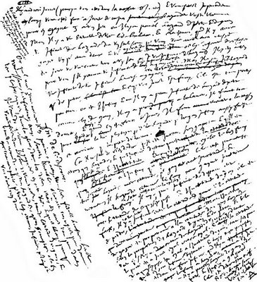

# Leçon 07 | 15 Janvier 1969

<!-- source-url: http://staferla.free.fr/S16/S16 D'UN AUTRE... .docx -->
<!-- seminar: s16 -->
<!-- lesson: 07 -->

<!-- id: s16-07-0001 -->

J’ai annoncé *la dernière fois* que je parlerai du *pari de Pascal*, c’est une responsabilité. J’ai appris même qu’il y avait des gens qui modifient leur horaire, enfin, qui venaient une fois de plus à Paris qu’ils n’auraient prévu pour savoir ce que j’en dirai. C’est vous dire si c’est lourd à porter pareille déclaration .

<!-- id: s16-07-0002 -->

Il est certain que je ne peux pas me mettre ici à vous rapporter, à faire un discours exhaustif sur tout ce qui s’est énoncé autour du *pari de Pascal*. Je suis forcé donc de supposer chez vous une certaine connaissance massive de ce dont il s’agit dans *le pari de Pascal*. Je ne peux pas, à proprement parler, le réénoncer parce que comme je vous l’ai dit déjà la dernière fois, ce n’est pas à proprement parler un énoncé qui se tienne. c’est même ce qui a étonné les gens, c’est que quelqu’un dont on a l’assurance qu’il était capable de quelque rigueur ait proposé quelque chose d’aussi intenable.

<!-- id: s16-07-0003 -->

Je pense avoir introduit assez - très juste assez - la dernière fois ce qui motive en gros l’usage que nous allons en faire.

<!-- id: s16-07-0004 -->

Mais enfin ne perdons pas notre temps à le rappeler, cet usage, vous allez bien le voir. Ce n’est pas la première fois d’ailleurs, que j’en parle. Un certain jour de Février 1966, je crois, j’ai déjà amené ce *pari*, et *très précisément* à propos de *l’objet(a)*.

<!-- id: s16-07-0005 -->

Vous verrez que nous allons aujourd’hui rester autour de cet objet. Déjà ceux qui se souviennent - peut-être y en a-t-il quelques-uns, j’en suis même sûr - de ce que j’en ai dit alors, voient bien de quoi il s’agit.

<!-- id: s16-07-0006 -->

Il s’est trouvé qu’on m’avait demandé d’aller en reparler en octobre 1967 à Yale, et j’ai eu si fort à faire avec des gens qui motivent cet effort d’enseignement, à savoir les psychanalystes, que j’ai manqué de parole à ces gens de Yale.

<!-- id: s16-07-0007 -->

Je n’ai su que bien après que cela avait fait une manière de petit scandale, c’est vrai, ce n’était pas très poli.

<!-- id: s16-07-0008 -->

Nous allons tâcher aujourd’hui de dire ce que j’aurais pu énoncer là-bas, sans qu’il y ait d’ailleurs plus de préparation que rien pour l’entendre. Mais, commençons tout à fait au ras du sol, comme si nous étions à Yale. Il s’agit de quoi ?

<!-- id: s16-07-0009 -->

En gros, vous avez dû entendre parler de quelque chose qui s’énonce et qui plusieurs fois s’écrit dans le texte de ce qu’on a réuni sous le titre de *Pensées, Pensées de Pascal*, et qui au départ a quelque chose déjà d’aussi scabreux que l’usage qu’on fait de ce qui s’appelle *le pari* lui-même. Vous le savez, ces *Pensées,* c’étaient des notes prises pour un *grand ouvrage*. Seulement, *l’ouvrage* n’était pas fait, alors on l’a fait à sa place. On a d’abord fait un *ouvrage* - c’est l’édition des Messieurs de Port-royal - ce n’est pas du tout un ouvrage mal fait, c’étaient des copains, et…

<!-- id: s16-07-0010 -->

> comme nous en témoigne un nommé FILLEAU DE LA CHAISE qui n’est pas à proprement parler une lumière
>
> mais qui est très lisible \[*Discours sur les pensées de Pascal*, éd. Bossard, 1922\] …PASCAL leur avait très bien expliqué ce qu’il voulait faire, et ils ont fait ce que PASCAL avait indiqué.

<!-- id: s16-07-0011 -->

Il n’en reste pas moins que *ça laissait tomber pas mal de choses* dans les énoncés écrits en notes aux fins de la construction de cet ouvrage. Alors d’autres se sont risqués à la reconstruction autrement. Et puis d’autres se sont dit : « *Puisqu’en somme à mesure qu’avance notre culture, nous nous apercevons que le discours, c’est pas une chose si simple que ça et qu’à le rassembler, eh bien, il y a de la perte.* »

<!-- id: s16-07-0012 -->

Alors on s’est mis à faire des *éditions* qu’on appelle « *critiques »*, mais qui prennent une portée tout à fait différente quand il s’agit d’un recueil de notes. Là encore, ça a été un peu coton. Nous avons plusieurs éditions, plusieurs façons de grouper ces liasses comme on dit : celle de TOURNEUR, celle de LAFUMA, celle de X, celle de Z.

<!-- id: s16-07-0013 -->

Cela ne simplifie pas les choses, mais ça les éclaire assurément, rassurez-vous.

<!-- id: s16-07-0014 -->

Pour *le pari*, c’est tout à fait à part. C’est un petit morceau de papier plié en quatre. C’était l’intérêt de ce que je vous recommandais, c’était de vous en apercevoir puisque dans ce livre il y a la reproduction du petit papier plié en quatre et puis un certain nombre de transcriptions.

<!-- id: s16-07-0015 -->

<!-- id: s16-07-0016 -->

Car ceci aussi pose un problème étant donné que ce sont des notes prises, cursives, avec des recoupages divers, une multitude de ratures, de paragraphes entiers écrits entre les lignes d’autres paragraphes, et puis une utilisation des marges avec des renvois, tout cela d’ailleurs assez précis et donnant ample matière à examen et à discours.

<!-- id: s16-07-0017 -->

Mais il y a une chose que nous pouvons tenir pour assurée, c’est que jamais PASCAL n’a prétendu faire tenir le pari debout.

<!-- id: s16-07-0018 -->

Ce petit papier devait pourtant lui tenir à cœur puisque tout indique qu’il l’avait dans sa poche, à la même place où j’ai pour l’instant le machin là, de cette chose qui ne sert à rien ! \[le micro\] En gros, vous avez entendu parler de quelque chose qui a cette sonorité : « *renoncer aux plaisirs *». Cette chose dite au pluriel s’est aussi répétée au pluriel. Et d’ailleurs chacun sait que cet acte serait au principe de quelque chose qu’on appellerait *la vie chrétienne*. C’est le bruit de fond, ça.

<!-- id: s16-07-0019 -->

À travers tout ce que nous énonce PASCAL, et d’autres autour de lui, au titre d’une éthique, ceci sonne au loin comme le bruit d’une cloche. Il s’agit de savoir si c’est un glas. En fait, ce n’est pas tellement un glas que ça. Ça a de temps en temps une petite tournure plus gaie. Je voudrais vous faire sentir que c’est le principe même sur lequel s’installe une certaine morale qu’on peut qualifier de la morale moderne. Pour faire entendre ce que je suis en train d’avancer, je vais faire quelques rappels de ce qu’il en est effectivement.

<!-- id: s16-07-0020 -->

Le réinvestissement - comme on dit - des bénéfices, qui est fondamental…

<!-- id: s16-07-0021 -->

> c’est ce qu’on appelle encore « *l’entreprise* », « *l’entreprise capitaliste* », pour la désigner en propres termes …ne met pas le moyen de production au service du plaisir. C’est même au point que toute une face de quelque chose qui se manifeste dans les marges, est par exemple *un effort*, *un effort* tout à fait timide, et qui ne s’imagine pas du tout voguer vers le succès mais plutôt jeter un doute sur ce qu’on peut appeler notre « *style de vie* ».

<!-- id: s16-07-0022 -->

Cet effort, nous l’appellerons *un effort de réhabilitation de la dépense*, et un nommé Georges BATAILLE… penseur en marge de ce qu’il en est de nos affaires …a cogité et produit là-dessus quelques ouvrages tout à fait lisibles mais qui ne sont pas pour autant voués à l’efficacité.

<!-- id: s16-07-0023 -->

Quand je dis que c’est *la morale moderne*, je veux dire par là - c’est un premier abord de la question - qu’à voir les choses *historiquement*, ceci répond à *une cassure*. De toute façon, il n’y a pas lieu de la minimiser. Cela ne veut pas dire non plus que, comme toute *cassure historique*, il faille s’y tenir pour saisir de quoi il s’agit, et ce n’est pas plus mal d’en marquer le temps.

<!-- id: s16-07-0024 -->

La recherche d’un bien-être - je ne peux pas énormément insister, parce que le temps nous est compté, bien sûr comme toujours, sur ce qui justifie l’emploi de ce terme, mais enfin tous ceux qui suivent, même de temps en temps, superficiellement ce que je dis doivent tout de même se souvenir de ce que j’ai rappelé à cet endroit de la distinction :

<!-- id: s16-07-0025 -->

- du *Wohl, das Wohl*, là où on se sent bien,

<!-- id: s16-07-0026 -->

- et de *das Gute *: du bien, en tant que KANT les distingue.

<!-- id: s16-07-0027 -->

Il est tout à fait clair que c’est là un des points vifs de ce que j’ai appelé tout à l’heure « *la cassure* ».

<!-- id: s16-07-0028 -->

Quelle que soit la justification des énoncés de KANT…

<!-- id: s16-07-0029 -->

> qu’il faille y trouver l’âme même de *l’éthique*, ou bien comme je l’ai fait, *l’éclairer de son rapport* avec SADE …c’est un fait de la pensée que ça se soit produit.

<!-- id: s16-07-0030 -->

Nous avons *depuis quelque temps* la notion que « *les faits de la pensée* » ont un arrière-plan, peut-être quelque chose déjà qui est de l’ordre de ce que j’ai rappelé, à savoir *la structure qui résulte d’un certain usage des moyens de production* qui est là-derrière, mais comme s’y avance ce que j’articule cette année, il y a peut–être eu d’autres façons de le prendre.

<!-- id: s16-07-0031 -->

En tous les cas, par ce « *bien-être* », je vise ce qui, *dans la tradition philosophique*, s’est appelé ἡδονή \[édoné\], *le plaisir*. Cet ἡδονή \[édoné\], tel qu’on s’en est servi, suppose que réponde au plaisir un certain rapport que nous appellerons rapport de *juste ton*, avec la nature dont nous - les hommes, ou les présumés tels - serions dans cette visée moins *les maîtres* que *les célébrants*.

<!-- id: s16-07-0032 -->

C’est bien là ce qui guide ceux qui disons, de toute antiquité, quand ils commencent, pour fonder la morale, à prendre ce repère que le plaisir doit tout de même nous guider dans cette voie, que c’est le maillon originel, en tout cas que ce dont il va s’agir, c’est plutôt de poser comme une question *pourquoi certains de ces plaisirs sortent de ce juste ton*.

<!-- id: s16-07-0033 -->

Il s’agit alors de *plaisirer* - si je puis dire - le plaisir lui-même, de trouver *le module* du juste ton au cœur de ce qu’il en est du plaisir, et de s’apercevoir de ce qui est en marge et qui paraît fonctionner d’une façon pervertie et néanmoins justifiable au regard de ce que le plaisir donne la mesure.

<!-- id: s16-07-0034 -->

Il est à remarquer quelque chose, c’est que c’est à juste titre qu’on peut dire que cette visée entraîne un *ascétisme*, un *ascétisme* auquel on peut donner son panonceau qui est celui-ci : « *pas trop de travail* ». Eh bien, jusqu’à un certain moment, ça n’a pas semblé faire un pli. Mais je pense tout de même, tous tant que vous êtes ici, que vous vous apercevez que nous ne sommes plus dans ce bain-là parce que nous, pour obtenir « *pas trop de travail* » il faut que nous en foutions un sacré coup !

<!-- id: s16-07-0035 -->

La grève, par exemple, qui ne consiste pas seulement à se croiser les bras mais aussi à crever de faim pendant ce temps-là. Jusqu’à un certain moment, on n’avait jamais eu besoin de recourir à des moyens comme ça.

<!-- id: s16-07-0036 -->

C’est ce qui montre bien qu’il y a quelque chose de changé pour qu’il faille faire tant d’efforts pour avoir « *pas trop de travail* ».

<!-- id: s16-07-0037 -->

Ça ne veut pas dire que nous soyons dans un contexte qui suit une pente naturelle. En d’autres termes, l’ascétisme du plaisir, c’était quelque chose qui avait à peine besoin d’être accentué pour autant que la morale fût fondée sur l’idée qu’il y avait quelque part un « *Bien* » et que c’est dans ce *Bien* que résidait la loi. Les choses semblaient être d’un seul tenant dans cette suite que je désigne.

<!-- id: s16-07-0038 -->

*Otium cum dignitate* [^25] règne dans [HORACE](http://fr.wikipedia.org/wiki/Horace), vous le savez…

<!-- id: s16-07-0039 -->

> ou vous ne le savez pas ! Tout le monde le savait au siècle dernier parce que tout le monde s’occupait d’Horace,
>
> mais grâce à la solide éducation que vous avez reçue au lycée, vous ne savez même pas ce que c’est qu’Horace ! …dans la nôtre, nous en sommes au point où bientôt « *otium »,* c’est-à-dire *la vie de loisir*...

<!-- id: s16-07-0040 -->

> naturellement pas nos loisirs qui sont des loisirs forcés : on vous donne des loisirs pour que vous alliez chercher un billet à la gare de Lyon, et puis *dare­ dare*, et puis il s’agit de le payer, et puis il s’agit de se transporter aux *sports d’hiver*. Là, pendant quinze jours, vous allez vous appliquer à un solide *pensum*, celui qui consiste à faire la queue au bas des téléskis, on n’est pas là pour rigoler ! Le type qui ne fait pas ça, qui ne va pas travailler aux loisirs, il est indigne ...« *otium »* pour l’instant est *cum indignitate*. Et plus ça ira, plus ça sera comme ça, sauf accident. Le refus du travail de nos jours, autrement dit ça relève d’un défi, il se pose et ne peut se poser que comme défi. Pardon d’insister encore.

<!-- id: s16-07-0041 -->

Saint THOMAS, pour autant qu’il réinjecte une pensée aristotélicienne formellement - je dis seulement formellement - dans le christianisme, ne peut ordonner…

<!-- id: s16-07-0042 -->

> encore lui Saint THOMAS qui peut vous sembler comme ça être de mine assez grise …il ne peut ordonner le « *Bien* », comme le « *Souverain Bien* », qu’en termes en fin de compte hédonistes.

<!-- id: s16-07-0043 -->

Bien sûr, il ne faut pas voir ça d’une façon *monolithique*, ne serait-ce que pour la raison que toutes sortes de maldonnes s’introduisent dans ces sortes de propositions qui étaient d’ores et déjà - pendant qu’elles régnaient - patentes, et il est certain que d’en suivre la trace et de voir comment les différents *directeurs d’âmes* s’en sont tirés impliquerait beaucoup d’efforts de discernement. Ce que j’ai voulu faire, c’est simplement ici rappeler où nous sommes axés du fait qu’assurément il y a eu à cet égard un déplacement radical et que pour nous les départs ne peuvent être bien évidemment que d’interroger *l’idéologie du plaisir* par ce qui nous rend quelque peu périmé tout ce qui l’a soutenue.

<!-- id: s16-07-0044 -->

Ceci en nous plaçant au niveau des moyens de production pour autant que pour nous ce sont eux qui en conditionnent réellement, de ce *plaisir*, la pratique. Il me semble que j’ai suffisamment indiqué déjà tout à l’heure comment on peut mettre sur une page :

<!-- id: s16-07-0045 -->

- d’un côté la publicité pour le bon usage des vacances, à savoir *l’hymne au soleil*,

<!-- id: s16-07-0046 -->

- et de l’autre côté *l’astreinte* aux conditions du téléski.

<!-- id: s16-07-0047 -->

Il suffirait d’y ajouter que tout ceci se passe tout à fait aux dépens du simple arrangement de la vie ordinaire et de ces chancres de sordidité au milieu desquels nous vivons, dans les grandes villes tout spécialement.

<!-- id: s16-07-0048 -->

C’est très important à rappeler pour s’apercevoir qu’en somme, l’usage que nous faisons dans la psychanalyse du *principe du plaisir* à partir du point où il se situe, où il règne, à savoir dans l’inconscient, ceci veut dire que le plaisir, que dis-je, sa notion même, sont aux catacombes et que la découverte de FREUD là-dessus fait office du visiteur du soir, de celui qui revient de loin pour trouver les étranges glissements qui se sont opérés pendant son absence.

<!-- id: s16-07-0049 -->

« *Savez-vous où je l’ai retrouvée* - semble-t-il nous dire - *cette fleur de notre âge, cette légèreté : le plaisir ?*

<!-- id: s16-07-0050 -->

*Maintenant il s’essouffle dans les souterrains : Acheronta -* dit Freud *- seulement occupé à empêcher que tout ne saute,* *à imposer une mesure à tous ces enragés, en y glissant quelque lapsus, parce que si ça tournait rond, où irions-nous ?* »

<!-- id: s16-07-0051 -->

Il y a là donc, dans ce *principe du plaisir* de FREUD, quelque chose comme ça, un pouvoir de rectification, de tempérament, de moindre tension comme il s’exprime. C’est comme une sorte de tisseuse invisible qui resterait veiller à ce qu’il n’y ait pas trop de chauffe au niveau des rouages. Quel rapport entre cela et ce plaisir souverain du farniente contemplatif que nous recueillons *dans les énoncés* d’ARISTOTE par exemple ?

<!-- id: s16-07-0052 -->

Ceci peut-être est de nature…

<!-- id: s16-07-0053 -->

> *si j’y reviens, ce n’est pas pour toujours tourner en rond* …à nous donner *un soupçon* qu’il y a peut-être tout de même là quelque ambiguïté, je veux dire un fantasme qu’il faut peut-être aussi nous garder de prendre trop au pied de la lettre, quoique bien sûr le fait qu’il nous arrive après tant de dérive, rende sans doute bien *précaire* d’apprécier ce qu’il en était en son temps.

<!-- id: s16-07-0054 -->

Ceci pour corriger ce qui, dans mon discours, jusqu’au point où j’en suis parvenu, pourrait sembler être référence au « *bon vieux temps* ». On sait qu’on y échappe difficilement, mais ce n’est pas une raison non plus pour ne pas marquer que nous ne lui donnons pas trop de *créance*. Quoi qu’il en soit, la figure du plaisir, même celle qui est chez FREUD, est frappée d’*une ambiguïté avouée*, celle justement de l’*Au-delà* - comme il l’a dit - *du principe du plaisir*.

<!-- id: s16-07-0055 -->

Nous n’allons pas ici nous étendre. Pour nous en acquitter nous dirons... FREUD écrit : « *La jouissance est masochiste dans son fond* ».

<!-- id: s16-07-0056 -->

Il est bien clair qu’il n’y a là que métaphore, puisque aussi bien *le masochisme* est quelque chose d’un niveau autrement organisé que cette tendance radicale. La jouissance se porterait…

<!-- id: s16-07-0057 -->

> nous dit FREUD quand il essaie d’élaborer ce qui d’abord n’est articulé que métaphoriquement …à rabaisser le seuil nécessaire au maintien de la vie, ce seuil que le *principe du plaisir* lui-même définit comme un *infimum*, c’est-à-­dire *le plus bas des hauts*, la plus basse tension nécessaire à ce maintien.

<!-- id: s16-07-0058 -->

Mais on peut tomber au-dessous encore, et c’est là que commence - et ne peut que s’exalter - *la douleur*, si vraiment ce mouvement, comme il nous le dit, tend vers la mort. Autrement dit, derrière le constat d’un phénomène…

<!-- id: s16-07-0059 -->

> dont nous pouvons le tenir pour lié à un certain contexte de pratique, à savoir l’inconscient …c’est un *phylum* d’une nature toute différente que FREUD ouvre avec cet « *Au-delà*… ».

<!-- id: s16-07-0060 -->

Sans doute est-il certain qu’ici l’*ambiguïté* - comme ce que je viens d’énoncer n’a pas manqué d’en préserver l’instance – qu’une certaine *ambiguïté* se profile entre :

<!-- id: s16-07-0061 -->

- cette *pulsion de mort* d’une part, *théorique,*

<!-- -->

<!-- id: s16-07-0062 -->

- et *un masochisme* qui n’est que *pratique* beaucoup plus astucieuse - mais de quoi ? - tout de même de cette *jouissance* en tant qu’elle n’est point identifiable à la règle du plaisir.

<!-- id: s16-07-0063 -->

Autrement dit, avec *notre expérience, l’expérience psychanalytique*, la jouissance, si vous me permettez ceci pour abréger, se colore. Il y a tout un arrière-fond, bien sûr, à cette référence. Il faudrait dire qu’au regard de l’espace avec ses trois dimensions, la couleur, si nous savions y faire, pourrait en ajouter sans doute une ou deux, peut-être trois… Car dès cette note, apercevez-vous à cette occasion que les Stoïciens, les Épicuriens, les doctrinaires du règne du plaisir, au regard de ce qui s’ouvre à nous comme interrogation, ça reste encore du noir et blanc ?

<!-- id: s16-07-0064 -->

J’ai essayé, depuis que j’ai introduit dans notre maniement cette fonction de la jouissance, d’indiquer qu’elle est rapport au corps essentiellement, mais non pas n’importe lequel. Ce rapport qui se fonde sur cette *exclusion en même temps inclusion* qui fait tout notre effort vers une topologie qui corrige les énoncés jusqu’ici reçus dans la psychanalyse, car il est clair qu’on ne parle que de ça à tous les stades…

<!-- id: s16-07-0065 -->

> rejet, formation du « *non-moi* », je ne vais pas tous les rappeler …mais fonction de ce qu’on appelle *incorporation* et qu’on traduit *introjection*, comme s’il s’agissait d’un rapport d’intérieur à extérieur et non pas d’une topologie beaucoup plus complexe.

<!-- id: s16-07-0066 -->

*L’idéologie analytique* en somme, telle qu’elle s’est exprimée jusqu’ici est d’une maladresse remarquable qui s’explique par ceci : *la non construction d’une topologie adéquate*. Ce qu’il faut saisir, c’est que cette topologie… je veux dire celle de la jouissance …elle est la topologie du sujet. C’est elle qui, à notre existence de sujet, *poursoit.*

<!-- id: s16-07-0067 -->

C’est un mot nouveau, qui m’est sorti comme ça, le verbe *poursoir.* Je ne vois pas pourquoi, depuis le temps qu’on parle de l’*en-soi* et du *pour-soi*, on ne pourrait pas faire des variations. C’est extraordinairement amusant. Par exemple vous pourriez écrire l’*en-soi* comme ça : « *anse-oie* » ou bien « *ensoie* ». Je vous en passe. Quand je suis tout seul, je m’amuse beaucoup !

<!-- id: s16-07-0068 -->

L’intérêt du verbe « *poursoir »,* c’est que tout de suite il trouve *des petits amis*, *pourvoir* *par exemple, ou bien* *surseoir*.

<!-- id: s16-07-0069 -->

Il faut modifier l’orthographe s’il est du côté de *surseoir* il faut l’écrire *pourseoit*.

<!-- id: s16-07-0070 -->

L’intérêt, c’est si ça aide à penser des choses et en particulier une dichoto­mie :

<!-- id: s16-07-0071 -->

- le sujet est-il, contre la jouissance, « *poursu »* ? En d’autres termes s’y éprouve-t-il ?

<!-- id: s16-07-0072 -->

> Mène-t-il son petit jeu dans l’affaire ? Est-il maître à la fin du compte ?

<!-- id: s16-07-0073 -->

- Ou est-il à la jouissance « *poursis »* ? Est-il en quelque sorte dans sa dépendance, esclave ?

<!-- id: s16-07-0074 -->

C’est une question qui a son intérêt, mais pour s’y avancer, il faut partir bien de ceci qu’en tout cas tout notre accès à la jouissance est commandé par la topologie du sujet, et ça, je vous assure que ça fait quelques difficultés au niveau des énoncés concernant la *jouissance*.

<!-- id: s16-07-0075 -->

Il m’arrive de parler avec des personnes pas forcément en vue mais très intelligentes. Il y a une certaine façon de penser que la jouissance pourrait s’assurer de cette conjonction impossible qui est celle que j’ai énoncée la dernière fois entre le discours et le langage formel qui est évidemment liée au mirage de ceci : *que tous les problèmes de la jouissance sont essentiellement liés à cette division du sujet*, *mais ce n’est pas parce que le sujet ne serait plus divisé qu’on retrouverait la jouissance.* Il faut à ça faire très attention.

<!-- id: s16-07-0076 -->

En d’autres termes, le sujet fait la structure de la jouissance, mais jusqu’à nouvel ordre, tout ce qu’on peut en espérer, ce sont des pratiques de récupération. Ceci veut dire que ce qu’il récupère n’a rien à faire avec la jouissance, mais avec sa perte.

<!-- id: s16-07-0077 -->

Il y a un nommé HEGEL qui s’est déjà posé, et fort bien, ces problèmes. Il n’écrivait pas « *pour-soi* » comme moi, et ceci n’est pas sans conséquences. La façon dont il construit l’aventure de la jouissance est certes, comme il convient, entièrement dominée par la *Phénoménologie de l’esprit,* c’est-à-dire du sujet. Mais l’erreur est, si je puis dire, initiale, et comme telle, elle ne peut que porter jusqu’à la fin de son énonciation ses conséquences.

<!-- id: s16-07-0078 -->

Il est très singulier qu’à faire partir cette *dialectique*, comme on s’exprime, des rapports *du maître et de l’esclave*, il ne soit pas manifeste…

<!-- id: s16-07-0079 -->

> et d’une façon tout à fait claire du fait même dont il part, à savoir la lutte à mort, de pur prestige insiste-t-il …qu’assurément ceci veut dire que *le maître a renoncé à la jouissance*. Et comme ce n’est pas pour autre chose que pour le salut de son corps que l’esclave accepte d’être dominé, on ne voit pas pourquoi, dans une telle perspective explicative, la jouissance ne lui reste pas sur les bras. *On ne peut tout de même pas à la fois manger son gâteau et le garder.*

<!-- id: s16-07-0080 -->

*Si le maître s’est engagé dans le risque au départ, c’est bien parce qu’il laisse à l’autre la jouissance.*

<!-- id: s16-07-0081 -->

Est-ce qu’il faut que j’indique, que je rappelle, que j’évoque à cette occasion ce que toute la littérature antique nous témoigne, à savoir que d’être esclave, ce n’était pas si embêtant que cela, ça vous dispensait en tout cas de beaucoup d’ennuis politiques. Pas de malentendu n’est-ce pas, je parle d’un *esclave mythique*, celui du départ de la phénoménologie de HEGEL.

<!-- id: s16-07-0082 -->

Et cet *esclave mythique*, il a ses répondants.

<!-- id: s16-07-0083 -->

Ce n’est pas pour rien que dans la comédie - ouvrez TÉRENCE [^26] - la jeune fille destinée au triomphe final du mariage avec l’aimable *fils à papa* est toujours *une esclave*. Pour que tout soit bien et pour se foutre de nous - car c’est la fonction de la comédie - il se trouve qu’elle est esclave mais tout de même de très bonne famille : c’est arrivé par accident !

<!-- id: s16-07-0084 -->

Et à la fin, tout se révèle. À ce moment-là, le *fils-à-papa* en a assez mis pour que décemment il ne puisse pas dire : « *Je ne joue plus ! Si j’avais su que c’était la fille du meilleur copain de papa, jamais je ne m’en serais occupé !* »

<!-- id: s16-07-0085 -->

Mais le sens de la comédie antique, c’est ça justement, c’est de nous désigner, quand il s’agit de la jouissance, que la fille du maître du lopin à côté, ce n’est pas elle la plus indiquée, elle a quelque chose comme ça d’un petit peu raide, elle est un peu trop liée à ce qui lui *attient de patrimoine*.

<!-- id: s16-07-0086 -->

Je vous demande pardon d’où ces *petites fables* nous entraînent, mais c’est pour dire que c’est d’un autre ordre, ce que l’évolution historique récupère en libérant les esclaves. Elle les libère - on ne sait pas de quoi – mais il y a une chose certaine, c’est :

<!-- id: s16-07-0087 -->

- qu’à toutes les étapes, elle les enchaîne,

<!-- id: s16-07-0088 -->

- à toutes les étapes de la récupération, elle les enchaîne au *plus-de-jouir* qui est…

<!-- id: s16-07-0089 -->

> comme je pense depuis le début de cette année l’avoir assez énoncé … « *autre chose* », c’est-à-dire ce *qui répond,* non pas à la jouissance, mais *à la perte de la jouissance* en tant que d’elle surgit ce qui devient la cause conjuguée du désir de savoir et cette animation, que j’ai récemment qualifiée de féroce, qui procède du *plus-de-jouir.*

<!-- id: s16-07-0090 -->

Tel est l’authentique mécanisme, et il importe de le rappeler au moment où tout de même nous allons parler de PASCAL, parce que PASCAL, comme nous tous, est un homme en son temps. Bien sûr que « *Le pari* » a à faire avec le fait que dans les mêmes années…

<!-- id: s16-07-0091 -->

> et sur ces points de petite histoire, faites-moi confiance, j’ai fait le tour de ce qui peut se lire, je vous signale simplement que mon ami GUILBAUD[^27] a fait là-dessus dans des revues…
>
> *je n’en ai que le « tiré à part » mais j’essaierai tout de même de savoir où vous pourriez les retrouver*
>
> …quelques courts, très courts petits articles qui sont tout à fait décisifs quant au rapport de *ce Pari*.
>
> Il n’est pas le seul d’ailleurs : dans le livre de BRUNET[^28], la chose est également traitée …la règle des partis[^29], c’est quelque chose sur lequel il faudrait *en dire long* pour vous en montrer l’importance dans le progrès de la théorie mathématique.

<!-- id: s16-07-0092 -->

Sachez simplement qu’il n’est rien de plus en pointe au regard de ce dont il s’agit pour nous, quand il s’agit du sujet.

<!-- id: s16-07-0093 -->

S’intéresser à ce qu’il en est de ce qu’on appelle *le jeu* en tant que c’est une pratique foncièrement définie par ceci qu’elle comporte un certain nombre de coups qui ont lieu à l’intérieur de certaines règles : rien n’isole d’une façon plus pure ce qu’il en est de nos rapports au signifiant.

<!-- id: s16-07-0094 -->

Ici en apparence, rien d’autre qui nous intéresse que la manipulation la plus gratuite dans l’ordre de la *combinaison*.

<!-- id: s16-07-0095 -->

Poser pourtant la question de ce qu’il en est des décisions à prendre dans ce champ du gratuit, est fait pour souligner que nulle part elle ne prend plus de force et de nécessité. C’est à cet égard que le pari qui en est fait - si nous nous apercevons que tout y manque des conditions recevables en un jeu - prend sa portée.

<!-- id: s16-07-0096 -->

Les *efforts* des auteurs *pour* en quelque sorte *le rationaliser* au regard de ce qui était en effet pour PASCAL - mais il devait bien être le premier à le savoir - la référence, et démontrer que ça ne colle pas, c’est cela qui fait le prix de la façon dont *le pari* est par PASCAL manié. Et là dans le texte de PASCAL…

<!-- id: s16-07-0097 -->

> et repris par les auteurs avec un mode à courte vue qui est bien là la chose la plus exemplaire et dont on peut dire qu’après tout les auteurs nous rendent le service de montrer comment s’installe l’impasse où ils s’obstinent …cette façon de mettre en valeur, au regard de cette décision, les rapports d’extension de l’enjeu, à savoir :

<!-- id: s16-07-0098 -->

- d’un côté une vie *à la jouissance* de laquelle *on renonce*, pour en faire tout à fait de la même façon que PASCAL le signale dans l’étude de ce qu’on appelle « *règle des partis* » : quand c’est dans le jeu c’est perdu, c’est le principe de « *la mise* »,

<!-- id: s16-07-0099 -->

- « *la mise* » de l’autre côté, de celui du partenaire, est ce que PASCAL articule : *une infinité de vies infiniment heureuses.*

<!-- id: s16-07-0100 -->

Je vous signale qu’ici un point s’ouvre de savoir si cette *infinité de vie* est à penser au singulier ou au pluriel.

<!-- id: s16-07-0101 -->

Une *infinité de vie*, au singulier, cela ne veut pas dire grand-chose si ce n’est de changer le sens qu’a dans ce contexte \- le contexte de « *la règle des partis* » - le mot *infinité*.

<!-- id: s16-07-0102 -->

Néanmoins nous sommes là livrés à l’ambiguïté du petit papier : Le mot « *heureuse* » n’est pas terminé, pourquoi le mot « *vie* » serait-il complet ? De l’ « *s* » qui pourrait aussi bien lui attenir la face numérale d’une comparaison qui est celle ici promue, à savoir : du rapport numéral entre les enjeux, avec quelque chose qui n’a pas d’autre nom que l’incertitude et qui est prise elle-même telle, numériquement, que PASCAL écrit :

<!-- id: s16-07-0103 -->

> « …*qu’au regard même d’un hasard de gain* - écrit-il - *on peut supposer une infinité de hasards de perte*… »

<!-- id: s16-07-0104 -->

Introduire donc comme numérique l’élément de hasard…

<!-- id: s16-07-0105 -->

> alors qu’il a été proprement exclu dans ce qu’il énonce de la règle des partis,
>
> qui comporte pour être énoncée l’égalité des hasards …montre bien qu’en tout cas, c’est sur le plan numérique que doit même être mesuré l’enjeu.

<!-- id: s16-07-0106 -->

J’insiste car dans ce petit papier…

<!-- id: s16-07-0107 -->

> qui n’est nullement une rédaction ni un état définitif, qui est une succession de *signes* d’écriture qui sont faits …il est aussi bien en d’autres points énoncé qu’à parier ce dont il s’agit - c’est­-à-dire l’incertitude fondamentale, à savoir : « *y a-t-il un partenaire ?* » - en d’autres points PASCAL énonce : « *Il y a une chance sur deux.* » À savoir Dieu existe ou n’existe pas, procédé dont, bien sûr, nous voyons assez l’intenable et qui n’a pas besoin d’être réfuté.

<!-- id: s16-07-0108 -->

Mais est-ce qu’on ne voit pas qu’en ceci tout réside précisément à ce niveau de l’incertitude ?

<!-- id: s16-07-0109 -->

Car il est bien clair que rien ne s’impose de ce calcul et qu’on peut toujours opposer à la proposition du pari :

<!-- id: s16-07-0110 -->

> « *Ce que j’ai, je le tiens, et avec cette vie j’ai déjà bien assez à faire.* »

<!-- id: s16-07-0111 -->

PASCAL en rajoute et il nous dit qu’elle n’est *rien*… mais qu’est-ce à dire ? Non pas *zéro*, car il n’y aurait ni jeu… *il n’y aurait pas de jeu parce qu’il n’y aurait pas de « mise »* …il dit qu’elle est « *un rien »*, *ce qui est une toute autre affaire car c’est très précisément de cela qu’il s’agit quand il s’agit du plus-de-jouir*.

<!-- id: s16-07-0112 -->

Et d’ailleurs s’il y a là quelque chose qui porte au plus vif, au plus radical notre passion de ce discours, c’est bien parce que c’est de cela qu’il s’agit.

<!-- id: s16-07-0113 -->

L’opposition sans doute tient toujours. Est-ce qu’à *miser* dans un tel jeu, je ne *gage* point trop ? Et c’est bien pour cela que PASCAL le laisse inscrit dans l’argumentation de son supposé *contradicteur, contradicteur* qui n’est pas ailleurs qu’en lui-même puisqu’il est le seul à connaître le contenu de *ce petit bout de papier*. Mais il lui répond :

<!-- id: s16-07-0114 -->

> « *Vous ne pouvez pas ne pas parier parce que vous êtes engagé.* »

<!-- id: s16-07-0115 -->

Et en quoi ?

<!-- id: s16-07-0116 -->

Vous n’êtes pas *engagé* du tout sauf si domine ceci : que vous avez à prendre une décision, c’est-à-dire ce qui dans le jeu, dans la *théorie du jeu* comme on dit de nos jours, qui n’est que la suite absolument directe de ce que PASCAL inaugure dans *La règle des partis* où la décision est une structure, et c’est parce qu’elle est réduite à une structure que nous pouvons la manipuler d’une façon entièrement scientifique.

<!-- id: s16-07-0117 -->

Seulement là, à ce niveau, si vous devez prendre une décision, quelle qu’elle soit des deux, si vous êtes engagé de toute façon, c’est à partir du moment où vous êtes interrogé de cette façon, et par PASCAL, c’est-à-dire au moment où vous vous autorisez d’être « *je* » dans ce discours. La véritable ambiguïté, la dichotomie n’est pas entre « *Dieu existe* » ou « *il n’existe pas* ».

<!-- id: s16-07-0118 -->

Que PASCAL le veuille ou non, ce problème devient d’une tout autre nature à partir du moment où il a affirmé : « *nous ne savons* - non pas si Dieu existe, mais - *ni si Dieu est, ni ce qu’il est* ».

<!-- id: s16-07-0119 -->

Et donc l’affaire concernant Dieu sera - *les contemporains l’ont parfaitement senti et l’ont articulé -* une affaire de fait, ce qui…

<!-- id: s16-07-0120 -->

> si vous vous rapportez à la définition que j’ai donnée du fait …est une affaire de discours : *il n’y a de fait qu’énoncé*. Et c’est pourquoi nous sommes entièrement livrés à la tradition du livre.

<!-- id: s16-07-0121 -->

Ce qui est en jeu dans le pari de PASCAL est ceci :

<!-- id: s16-07-0122 -->

- est-ce que « *je* » existe,

<!-- -->

<!-- id: s16-07-0123 -->

- ou si « *je* » n’existe pas, comme je vous l’ai déjà, au terme de mon précédent discours, énoncé.

<!-- id: s16-07-0124 -->

J’ai mis un temps…

<!-- id: s16-07-0125 -->

> *qui fut*, comme il arrive et peut-être comme j’en suis un peu trop coutumier, *trop de temps* …à introduire le vif de ce dont il s’agit, mais je crois que ces prémisses étaient indispensables.

<!-- id: s16-07-0126 -->

Ceci m’amène donc à faire, ici - pas spécialement opportunément - notre coupure d’aujourd’hui.

<!-- id: s16-07-0127 -->

Sachez seulement que si - contrairement à ce qu’on croit - le pari n’est pas sur *la promesse* mais sur *l’existence* de « *je* », quelque chose peut être déduit au­-delà du pari de PASCAL, à savoir si nous mettons à sa place *la fonction de la cause* telle qu’elle se place au niveau du sujet, à savoir *l’objet(a)*…

<!-- id: s16-07-0128 -->

> ce n’est pas la première fois que je l’aurai écrit ainsi : « l’*a-cause* » …c’est précisément en tant que tout *Le pari* a cette essence de réduire cette *chose* qui n’est tout de même pas *quelque chose* que nous puissions, comme ça, tenir dans le creux d’une main, à savoir notre vie, dont après tout nous pourrions avoir une tout autre appréhension, une tout autre *perspective* à savoir qu’elle nous comprend et sans limite, et que nous sommes là, *lieu de passage, phénomène*. Pourquoi la chose ne serait-elle pas soutenue ? Elle l’a été après tout.

<!-- id: s16-07-0129 -->

Que cette vie se réduise à ce *quelque chose* qui peut être ainsi mis en jeu, n’est-ce pas le signe que ce qui domine dans une certaine montée des rapports au savoir, c’est cette *a-cause*. Et c’est là que nous aurons dans nos pas suivants à mesurer ce qu’il résulte, au-delà de cette *a-cause*, d’un choix. Dire « *« je » existe* » a… au regard de ce rapport avec l’ *a-cause* …toute une suite de conséquences parfaitement et immédiatement formalisables. Je vous en ferai la prochaine fois le calcul.

<!-- id: s16-07-0130 -->

Et inversement, le fait même de pouvoir ainsi le *calculer*, l’autre position…

<!-- id: s16-07-0131 -->

> celle qui parle pour la recherche de ce qu’il en est d’un « *Je* » qui peut-être n’existe pas …va dans le sens de l’*a-cause*, dans le sens de ce à quoi PASCAL procède quand il invoque son *interlocuteur* à y *renoncer* : là pour nous prend son sens, la direction d’une recherche qui est expressément, pour ce qui est de la psychanalyse, la nôtre.

## Notes

[^25]: *Otium cum dignitate* (noble oisiveté) : expression de Cicéron à la louange des lettres, qui procurent à l'homme d'État retiré des affaires, un noble emploi

    de ses loisirs.

[^26]: Térence : « [*Heauton timorumenos*](http://remacle.org/bloodwolf/comediens/Terence/eautonfr.htm) » *Le bourreau de soi-même* (acte I, sc.1 : Chremes : « *Homo sum, humani nil a me alienum puto*. »)

    in *Théâtre complet*, Gallimard, 1990, Coll. Folio.

[^27]: G. Th. Guilbaud : mathématicien français, Institut Poincaré de la [MSH](http://www.annales.org/gc/2002/gc67-2002/guilbaud067-074.pdf), spécialisé dans les mathématiques des sciences humaines,

    Cf. « *Pour qu’on lise Pascal* » in Revue française de recherche opérationnelle 6ème année - 3e trimestre 1962 - n° 24 : pp195-198,

    [*La règle des partis et la ruine des joueurs*](http://archive.numdam.org/ARCHIVE/MSH/MSH_1964__9_/MSH_1964__9__3_0/MSH_1964__9__3_0.pdf), et « *Leçons d'à peu près »*, C. Bourgois, 1985. 

[^28]: Georges Brunet : « *Le pari de Pascal* », op. cit.

[^29]: Cf. Séminaire1965-66 : « *L’objet de la psychanalyse* », séance du 02-02-1966.
