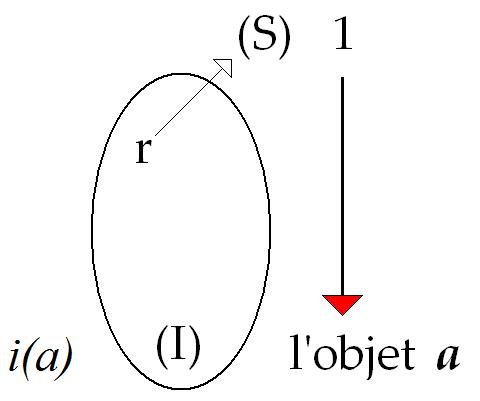
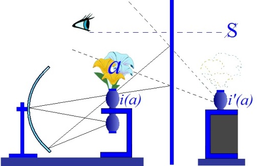

# Leçon 19 | 07 Mai 1969

<!-- source-url: http://staferla.free.fr/S16/S16 D'UN AUTRE... .docx -->
<!-- seminar: s16 -->
<!-- lesson: 19 -->

<!-- id: s16-19-0001 -->

« *L’angoisse*, ai-je dit dans un temps, *n’est pas sans objet* ». Ceci veut dire que ce *quelque chose,* qu’on appelle *objectif* à partir d’une certaine conception du sujet, qu’il y a *quelque chose* d’analogue à répondre à l’angoisse, *quelque chose* - c’est ainsi qu’on s’exprime dans la psychanalyse -  « *dont l’angoisse est signal dans le sujet* ».

<!-- id: s16-19-0002 -->

Voilà le sens de ce « *pas sans* » de la formule qui ne dévoile rien d’autre que : il ne manque pas ce terme, ce « *quelque chose d’analogue à l’objet* ». Mais ce « *pas sans* » ne le désigne pas, il présuppose seulement l’appui du fait du manque.

<!-- id: s16-19-0003 -->

Or *toute évocation du manque* suppose institué *un ordre symbolique* : plus qu’une Loi seulement, mais *une accumulation*, et encore *numérotée*, un rangement, je l’ai souligné en son temps.

<!-- id: s16-19-0004 -->

Si nous définissons le *réel* d’une sorte « *d’abolition pensée* » du matériel symbolique, *il ne peut jamais rien manquer*.

<!-- id: s16-19-0005 -->

L’animal, quel qu’il soit, qui crève en raison d’une suite d’effets physiologiques parfaitement adaptés…

<!-- id: s16-19-0006 -->

> dont le fait d’appeler ça effets de la faim par exemple est tout à fait exclu …c’est la fin de l’organisme en tant que soma. *Il ne manque de rien*. Il a assez de ressources en son périmètre d’organisme pour mesurer sa réduction dite mortelle. Le cadavre, c’est un *réel* aussi.

<!-- id: s16-19-0007 -->

Les effets par quoi l’organisme subsiste, c’est ce par quoi nous sommes forcés de concevoir l’*imaginaire* : quelque chose lui indique que tel élément de l’extérieur, du milieu, de l’*Umwelt* comme on dit est absorbable ou plus généralement propice à sa conservation. Cela veut dire que l’*Umwelt* est une sorte de halo, de double de l’organisme, et puis c’est tout. C’est ça qu’on appelle l’*imaginaire*. Tout un ordre de l’*Umwelt* est descriptible - certes - en termes d’adéquation, sans ça l’organisme ne subsisterait pas un instant.

<!-- id: s16-19-0008 -->

La catégorie de l’*imaginaire* implique en elle-même que cet *Umwelt* est capable de défaillance. Mais la défaillance, là non plus, n’est manque à rien. C’est le commencement d’une suite d’effets par où l’organisme se réduit, comme tout à l’heure, en emportant avec lui son *Umwelt.* Il meurt avec son mirage qui peut très bien être ce qu’on appelle, on ne sait pas trop pourquoi, *épiphénomène* de cette faim que j’évoquais tout à l’heure.

<!-- id: s16-19-0009 -->

Donc jusque là tout se réduit à un divers niveau de structuration du *réel*.

<!-- id: s16-19-0010 -->

Pour que le *fait du manque* apparaisse, il faut que se dise quelque part « *il n’y a pas le compte* ».

<!-- id: s16-19-0011 -->

Pour que « *quelque chose manque* », il faut qu’il y ait du *compté*.

<!-- id: s16-19-0012 -->

À partir du moment où il y a du *compté*, il y a aussi des effets du *compté* sur l’ordre de l’*image*.

<!-- id: s16-19-0013 -->

Ça, ce sont les premiers pas de l’ἐπιστήμη \[epistèmé\], de *la science*, *les premières copulations de l’acte de compter avec l’image*, c’est la reconnaissance d’un certain nombre d’harmonies, musicales par exemple : elles en donnent le type.

<!-- id: s16-19-0014 -->

C’est là que peuvent se constater des manques qui n’ont rien à faire avec ce qui, dans l’harmonie, se pose seulement comme intervalle. *Il y a des endroits où il n’y a pas le compte*. Toute la science que nous appellerons antique consiste à parier que ces endroits où il n’y a pas le compte se réduiront un jour aux yeux du sage, aux intervalles constitutifs d’une harmonie musicale.

<!-- id: s16-19-0015 -->

Il s’agit d’instaurer un ordre de l’Autre grâce à quoi *le réel prend statut de monde,* κόσμος \[cosmos\][^73], impliquant cette *harmonie*.

<!-- id: s16-19-0016 -->

La chose s’est faite ainsi dès lors qu’il y a eu au monde - en ce monde d’aventure et de concret qu’on appelle historique - des ἐμπόριον \[emporions\][^74], des *magasins* où tout est bien rangé.

<!-- id: s16-19-0017 -->

Les ἐμπόριον \[emporions\] et les empires - qui existent depuis un bout de temps, ce n’est pas nous qui les avons inventés - c’est la même chose. C’est la doublure et le support de cette conception de la science antique qui repose en somme sur ceci qui fut longtemps admis : que *savoir* et *pouvoir* c’est la même chose, pour la raison que celui qui sait compter peut répartir, qu’il distribue, et par définition celui qui distribue est juste.

<!-- id: s16-19-0018 -->

Tous les empires sont justes. S’il est venu là-dessus récemment quelque doute, ça doit avoir une raison.

<!-- id: s16-19-0019 -->

L’horizon de ce qui se passe là…

<!-- id: s16-19-0020 -->

> et c’est là l’excuse à ce discours public, à ce quelque chose que je continue
>
> malgré qu’il ne s’adresse en principe qu’aux psychanalystes …est ceci dont le temps témoigne par quelque chose dont les sages ne veulent pas voir ce qui déjà n’est plus du tout un *prodrome* [^75] mais une déchirure patente, c’est que *la discordance éclate entre savoir et pouvoir*.

<!-- id: s16-19-0021 -->

Il s’agit - c’est intéressant - pour que tout simplement les choses ne traînent pas longtemps dans cette discordance…

<!-- id: s16-19-0022 -->

> avec tout ce qu’elle comporte de bafouillages étranges, de redites, d’absurdes collisions …il s’agit de définir en quoi cette *disjonction* s’opère et de la dénommer ainsi, de ne pas penser qu’on va y *parer* avec je ne sais quelle façon épisodique de retourner la veste du pouvoir, de dire que tout s’arrange parce que c’est ceux qui jusqu’ici en étaient opprimés qui vont maintenant l’exercer, par exemple.

<!-- id: s16-19-0023 -->

Non certes que j’en écarte personnellement d’aucune façon l’échéance possible, mais qu’il me paraît sûr que ceci n’a de sens que pour autant que cela s’inscrit dans ce que je viens d’appeler « le virage essentiel »…

<!-- id: s16-19-0024 -->

> le seul de nature à changer le sens de tout ce qui s’ordonne comme *empire présumé*, fût-ce du savoir lui-même …c’est à savoir *cette disjonction du savoir et du pouvoir*.

<!-- id: s16-19-0025 -->

### Ceci, cette formule…

<!-- id: s16-19-0026 -->

> qui n’a qu’une valeur grossière, qui n’induit à proprement parler à rien,
>
> qui ne consiste en aucune *Weltanschauung,* présomption *utopique ou pas* d’une mutation poussée par on ne sait quoi …ceci doit être articulé et le peut être, en raison de ceci : non pas que FREUD en donne la saisie, renouvelant en *un système* qui serait quoi que ce soit de comparable à celui où a voulu se faire perdurer le mythe de *la conjonction du savoir et du pouvoir*, mais FREUD bien plus est lui-même ici le patient, celui qui de par sa parole, une parole de patient, témoigne de ce que j’inscris ici sous ce titre : *la disjonction du savoir et du pouvoir*.

<!-- id: s16-19-0027 -->

Il n’en témoigne pas seul. Il la lit dans les symptômes qui se produisent à un certain niveau du subjectif, et il essaye d’y parer, et précisément là où se lit que lui-même avec eux, ceux qui témoignent dans leur particularité de cette *disjonction du savoir* *et du pouvoir,* il est comme eux patient de cet effort, de ce travail, de ce dont témoignent en un point les effets que j’intitule de *la disjonction du savoir et du pouvoir*.

<!-- id: s16-19-0028 -->

Voici comment au point où, moi-même, je ne suis rien d’autre que la suite d’un tel discours…

<!-- id: s16-19-0029 -->

> où dans mon discours même je témoigne de ce à quoi conduit l’épreuve de cette disjonction, c’est-à-dire à rien
>
> qui la comble apparemment ni qui permette de l’espérer réduire jamais en *une norme*, en un κόσμος \[cosmos\] …c’est là le sens de ce que je m’essaie à poursuivre devant vous d’un discours qu’inaugure FREUD, et ce pourquoi j’ai commencé par une lecture attentive de ce dont témoigne ce discours, et pas seulement dans sa maîtrise, car très précisément c’est de ses insuffisances qu’il est le plus instructif.

<!-- id: s16-19-0030 -->

J’ai relu ce séminaire que je faisais en 1956-57 [^76], dérisoire distance de treize années qui, tout de même, me permet de mesurer quelque chose du chemin parcouru. Par qui ? Par quoi ? Par mon discours d’une part.

<!-- id: s16-19-0031 -->

Et puis d’un autre côté, par une sorte d’évidence, de manifestation du déchirement que ce discours désigne, qui bien entendu ne doit rien à ce discours lui-même, mais grâce à quoi peut-être, peut se témoigner qu’il y a un discours…

<!-- id: s16-19-0032 -->

> que je ne dirai certes pas à la page, disons pas trop à la traîne …de ce qui s’est produit.

<!-- id: s16-19-0033 -->

Ceci dit, en raison des lois qui vont pour être les lois régnantes, celles qu’on appelle du « *statut de l’Université* », il faut bien en effet que ce discours non seulement soit à la traîne mais soit forcé de toujours se reprendre au principe comme *nachträglich, après coup*, ceci en raison du fait que rien ne l’enregistre dans un renouvellement de forme qui serait celle où subsiste ce dont il s’agit des pas majeurs depuis un temps faits dans le savoir et tel qu’il se marque comme internement disjoint de tout effet de pouvoir.

<!-- id: s16-19-0034 -->

Nous repartons donc au principe et ce terme que j’ai produit - il ne l’*était pas* en 1956-57 - de *l’objet(a),* tandis que j’essayais de déchiffrer ce qui, si cette chose était maintenant publiée au-delà d’un résumé - d’ailleurs pas si mal fait - qui en fut donné dans le *Bulletin de Psychologie* sous le terme de *La relation d’objet et les structures freudiennes,* pourrait - s’il pouvait se faire de son côté sur le texte même de ce que pendant plus d’un trimestre je suis à la trace, de ce texte à lui tout seul si confondant par son aspect de labyrinthe, par son *attestation* d’une sorte d’épèlement, balbutiant, tournant en rond, et à vrai dire, dont l’issue : à part ceci que le « *petit Hans* » n’a plus peur des chevaux, et après ?

<!-- id: s16-19-0035 -->

Est-ce que c’est là l’intérêt d’une telle recherche de faire qu’un - ou mille autres petits bonshommes - soient délivrés de quelque chose d’embarrassant qu’on appelle une phobie ? L’expérience prouve que les phobies ne mettent pas beaucoup plus longtemps à guérir *spontanément* qu’avec une investigation telle que celle dont il s’agit en l’occasion, celle de son père, élève de FREUD et de FREUD lui-même.

<!-- id: s16-19-0036 -->

Ce qu’il faut à cette époque - il y a treize ans - que je souligne, que j’épèle, c’est de l’enjeu véritable dont il s’agit : de l’étude de la frontière, de la limite de ce qui se joue à chaque instant, qui va bien au-delà du cas, de la frontière, de la limite entre *l’imaginaire* et *le symbolique*, et que c’est là que tout se joue.

<!-- id: s16-19-0037 -->

J’y reviendrai peut-être de quelques traits au cours de ce qu’aujourd’hui j’énonce.

<!-- id: s16-19-0038 -->

Mais repartons du point où nous avons à fixer ce qu’il en est du jeu de ces trois ordres, *le réel, le symbolique et l’imaginaire* dans ce qui est en cause véritablement : ce point tournant où tous nous sommes les patients… quels que puissent être, à chacun, nos mésaventures et nos symptômes …à savoir ce que je désigne comme une certaine *disjonction du savoir au pouvoir*. Posons quelque part en un point… soyons grossiers, soyons sommaires …ce que j’ai appelé tout à l’heure *le réel*, dont il est tout à fait évident que, tel que je l’ai décrit, il intéresse.

<!-- id: s16-19-0039 -->

Je n’ai pas encore été le voir mais il y a - paraît-il - un film de Louis MALLE sur Calcutta. On y voit une très grande quantité de gens qui meurent de faim. C’est ça, le *réel*. Là où les gens meurent de faim, ils meurent de faim. Rien ne manque.

<!-- id: s16-19-0040 -->

On commence à parler de manque pourquoi ? Parce qu’ils ont fait partie d’un empire.

<!-- id: s16-19-0041 -->

Sans quoi, *paraît-il*, il n’y aurait même pas de Calcutta. Car c’est en raison, *paraît-il*… je ne suis pas *historien* assez pour le savoir mais je l’admets puisqu’on nous le dit …des nécessités de cet empire, qu’il y a une *agglomération* à cet endroit, sans les nécessités de cet empire, il n’y aurait pas eu d’*agglomération* à cet endroit.

<!-- id: s16-19-0042 -->

Les empires modernes laissent éclater leur part de manque justement en ceci que le savoir y a pris une certaine croissance, sans doute démesurée, aux effets de pouvoir. Il a aussi cette propriété, l’empire moderne : que partout où il étend son aile, cette *disjonction* vient aussi. Et c’est uniquement au nom de cela qu’on peut, de la famine aux Indes, faire un motif nous incitant à une *subversion* ou à une révision universelle, à quelque chose, *le Réel* quoi !

<!-- id: s16-19-0043 -->

*Pour qu’il y ait du symbolique, il faut qu’il se compte au moins* 1. Pendant longtemps, on a cru que *compter pouvait se réduire à l’Un :*

<!-- id: s16-19-0044 -->

- à l’*Un* du Dieu - il n’y en a qu’un -

<!-- id: s16-19-0045 -->

- à l’*Un* de l’Empire,

<!-- id: s16-19-0046 -->

- à l’*Un* de PROCLUS,

<!-- id: s16-19-0047 -->

- à l’*Un* de PLOTIN.

<!-- id: s16-19-0048 -->

C’est pourquoi il n’y a rien d’abusif à ce que nous symbolisions ici le champ du symbolique par ce *Un*.

<!-- id: s16-19-0049 -->

Ce qu’il faut saisir, c’est que bien sûr, ce *Un* qui n’est pas simple et dont vite - ça a été là tout le progrès - on s’est aperçu qu’il fonctionne comme 1 numérique, c’est-à-dire engendrant une infinité de successeurs, à condition qu’il y ait un 0…

<!-- id: s16-19-0050 -->

> ceci pour nous en tenir à l’exemplification de ce *symbolique*, par *un des systèmes* qui sont actuellement *les mieux établis* …il faut inscrire ceci : c’est que ce comptage…

<!-- id: s16-19-0051 -->

> quel qu’il soit, à quelque niveau de structure que nous le placions dans le *symbolique* …a ses effets dans l’*imaginaire*.

<!-- id: s16-19-0052 -->

Et ce qui s’institue, ce qui s’ordonne dans mon discours, à ceux qui le suivent de l’éprouver, c’est que ces effets du comptage *symbolique*, dans l’ordre que nous avons évoqué tout à l’heure de l’*imaginaire*, à savoir en ceci : que l’*imaginaire*, c’est l’ordre par quoi le *réel* d’un organisme - *c’est-à-dire un réel tout à fait situé* - se complète d’un *Umwelt* le comptage a - au niveau de l’*imaginaire* - cet effet d’y faire apparaître ce que j’appelle *l’objet(a)*.

<!-- id: s16-19-0053 -->

<!-- id: s16-19-0054 -->

Or chez l’être humain…

<!-- id: s16-19-0055 -->

> et sans que ceci fasse de lui, dans le domaine du vivant, une telle exception, …*une image* - comme chez bien d’autres animaux - y joue un rôle privilégié, c’est celle qui est *au principe* de cette dimension que nous appelons *le narcissisme*, c’est *l’image spéculaire*.

<!-- id: s16-19-0056 -->

Nous savons que ce n’est pas le privilège de l’homme, que chez bien d’autres animaux à certains niveaux de leur comportement, de ce qu’on appelle *éthologie*, mœurs animales, des images d’une structure apparemment équivalente, de la même sorte, privilégiées, exercent une fonction décisive sur ce qu’il est de l’organisme.

<!-- id: s16-19-0057 -->

Tout ce qui par la psychanalyse est observé, articulé comme moment des *rapports* entre *i(a)* et cet *objet(a)*, ceci est le point vif qui pour nous est d’*intérêt premier*, *r : i(a) /a*, pour estimer à sa valeur de *modèle* tout ce que nous livre au niveau des *symptômes* la psychanalyse, ceci en fonction de ce qu’il en est *patent en notre époque* *des effets de disjonction entre savoir et pouvoir*.

<!-- id: s16-19-0058 -->

J’ai donc d’abord défini *l’objet(a)* comme essentiellement fondé des *effets*, de ce qui se passe *au champ de l’Autre*…

<!-- id: s16-19-0059 -->

- *au champ du symbolique,*

<!-- id: s16-19-0060 -->

- *au champ du rangement,*

<!-- id: s16-19-0061 -->

- *au champ de l’ordre,*

<!-- id: s16-19-0062 -->

- *au champ du rêve de l’unité,* …de ces effets malicieux dans le champ de l’*imaginaire*.

<!-- id: s16-19-0063 -->

Observez que ceci implique *la structure même* du *champ de l’Autre* comme tel, comme j’ai essayé grâce à un schème, de vous le faire sentir dans plus d’une de mes précédentes leçons de cette année. Ce qui s’indique ici comme *effet* dans le champ de l’*imaginaire*, ce n’est rien d’autre que ceci : que ce champ de l’Autre est si je puis dire « *en forme de* A* »*.

<!-- id: s16-19-0064 -->

Au niveau de ce champ, ceci s’inscrit dans une topologie qui, à l’imager… car bien sûr ce n’est là qu’image intuitive …se présente comme le trouant.

<!-- id: s16-19-0065 -->

Le pas suivant…

<!-- id: s16-19-0066 -->

> celui que j’ai fait en énonçant d’une façon dont après tout il est frappant qu’à ce que je dise des choses comme ça, ça passe, ça rentre comme dans du beurre, ce qui prouve évidemment que les analystes n’ont pas une idée tellement sûre de ce à quoi ils peuvent tenir dans un tel champ …j’ai dit quelque chose de simple, c’est à savoir que faire retour de ces effets *petit(a)* dans l’*imaginaire* à l’Autre, le champ d’où ils partent, de rendre à CÉSAR - si je puis dire - ce qui est à CÉSAR …

<!-- id: s16-19-0067 -->

> comme a dit, vous le savez, un jour un petit malin, car il l’était, le bougre …que *c’était ça l’essence de la perversion* : *rendre (a) à celui de qui il provient, le grand Autre*.

<!-- id: s16-19-0068 -->

C’est une façon bien sûr un tout petit peu apologétique de présenter les choses.

<!-- id: s16-19-0069 -->

Ce qu’il s’agit de savoir, c’est ce qu’on peut en tirer. Si effectivement quelque chose qui soit le sujet, par quelque côté…

<!-- id: s16-19-0070 -->

> *car un effet du symbolique sur le champ de l’imaginaire, nous pouvons le considérer comme quelque chose d’encore problématique* …quelle place cela va-t-il prendre ?

<!-- id: s16-19-0071 -->

Mais ça touche au sujet, nous ne pouvons en douter, nous qui faisons du sujet quelque chose qui ne s’inscrit que d’une articulation, *un pied dehors un pied dedans,* du *champ de l’Autre*.

<!-- id: s16-19-0072 -->

Tâchons de la reconnaître, cette face de ce dont il s’agit concernant le sujet. Il y a de l’intérêt, il y a de l’importance à reconnaître ici ce qu’il en est d’un terme qu’a promu FREUD, celui qui avant moi a commencé de prendre la mesure d’une certaine *chambre* dont la *noirceur* est autrement moins facile à calibrer que celle que j’évoquais la dernière fois, celle qui a servi pendant plus de deux siècles au nom d’un modèle optique.

<!-- id: s16-19-0073 -->

Qu’il ait plusieurs fois fait le tour et dénommé de noms différents de mêmes choses qu’il se trouvait retrouver après son périple n’est pas pour nous étonner. FREUD a parlé beaucoup de l’amour, avec la distance qui convenait.

<!-- id: s16-19-0074 -->

Ce n’est pas parce que ça a monté à la tête de ceux qui l’ont suivi que nous n’avons pas à bien remettre les choses au niveau d’où il les a fait partir. Au niveau de l’amour, il a distingué :

<!-- id: s16-19-0075 -->

- la relation *anaclitique,*

<!-- id: s16-19-0076 -->

- et la relation *narcissique*.

<!-- id: s16-19-0077 -->

Comme il s’est trouvé qu’à d’autres endroits, il opposait l’investissement de l’objet à celui du corps propre, appelé dans cette occasion « *narcissique* », on a cru pouvoir édifier là-dessus je ne sais quoi du type *vases communicants* grâce à quoi c’est l’investissement de l’objet qui, à lui seul, prouvait qu’on est sorti de soi, qu’on a fait passer la substance libidinale là où il fallait. C’est là-dessus que repose cette élucubration qui est bien celle que j’ai mise cette année-là parce qu’elle était encore vivace, qui s’appelle *La relation d’objet*, avec tout ce mythe du *stade* prétendu *oblatif*, qualifié encore *génital*.

<!-- id: s16-19-0078 -->

Il me semble que ce que FREUD articule de l’anaclitisme, de l’appui pris au niveau de l’Autre, avec ce qu’il implique du développement d’une sorte de mythologie de la dépendance, comme si c’était de ça qu’il s’agissait, *l’anaclitisme* prend son statut, son vrai rapport, de définir proprement ce que je situe au niveau de la structure fondamentale de *la perversion*.

<!-- id: s16-19-0079 -->

C’est à savoir ce jeu par quoi le statut de l’Autre s’assure d’être couvert, d’être comblé, d’être masqué d’un certain jeu dit « *pervers* », du jeu du *(a)* et qui de ce fait en fait un stade, à prendre…

<!-- id: s16-19-0080 -->

> je dis discursivement si nous voulons donner une approximation logique
>
> de ce qui est en jeu dans toutes sortes d’effets qui nous intéressent …la relation anaclitique comme étant ici première.

<!-- id: s16-19-0081 -->

Et aussi bien c’est là le seul fondement par quoi peut se justifier toute une série de *nuées prétendues significatives* par quoi l’enfant regretterait son paradis dans je ne sais quel environnement physiologique maternel, qui à proprement parler n’a jamais existé sous cette forme d’idéal.

<!-- id: s16-19-0082 -->

C’est uniquement essentiellement comme un jeu de cet *objet* définissable comme *effet du symbolique dans l’imaginaire*, comme jeu de cet *imaginaire* au regard de quelque chose qui peut prétendre, à quelque titre, pendant un temps…

<!-- id: s16-19-0083 -->

> et à cet endroit la mère peut aussi bien jouer ce rôle
>
> que n’importe quoi d’autre, le père, une institution, voire une île déserte …c’est comme *jeu du a comme masque*, ce que j’ai appelé cette structure qui est la même chose que ce *a*, *l’en-forme de a* *de l’Autre*, c’est uniquement dans cette formule que peut se saisir ce qu’on peut appeler l’effet de masquage, l’effet d’aveuglement qui est précisément ce en quoi se comble toute relation anaclitique.

<!-- id: s16-19-0084 -->

À exprimer les choses sous cette forme, l’important ce n’est pas ce qu’elle dit car, comme vous pouvez le saisir, ce n’est pas facile d’accès, précisément sur le plan de ce qu’on appelle imagination.

<!-- id: s16-19-0085 -->

Car l’imagination vive…

<!-- id: s16-19-0086 -->

> celle où nous prenons, où nous recueillons ce que nous appelons avidement significations, diversement plaisantes …elle relève d’une toute autre sorte d’image, et combien moins obscure : *l’image spéculaire*, beaucoup moins obscure surtout depuis que nos miroirs sont clairs.

<!-- id: s16-19-0087 -->

On ne saura jamais - sauf à y réfléchir un tout petit peu - ce que nous devons à ce surgissement des miroirs clairs.

<!-- id: s16-19-0088 -->

Chaque fois que dans l’Antiquité - *et ça dure bien sûr encore au temps des Pères de l’Église -* vous voyez quelque chose qui s’indique comme en *un miroir*, ça veut dire tout le contraire de ce que c’est pour nous.

<!-- id: s16-19-0089 -->

*Leurs miroirs*, pour être de métal poli, donnaient des effets beaucoup plus *obscurs*, c’est peut-être ce qui a permis que subsiste si longtemps une vision *spéculaire* \[crépusculaire ?\] du monde. Le monde devait bien, comme à nous, leur paraître obscur, mais ça n’allait pas mal avec ce qu’on voyait dans le miroir. Ça a pu faire durer encore assez longtemps une idée du cosmos.

<!-- id: s16-19-0090 -->

Il suffisait simplement de perfectionner les miroirs. C’est parce que nous l’avons fait - et d’autres choses ensemble, précisément d’élucidation du *symbolique* - que les choses nous paraissent moins simples.

<!-- id: s16-19-0091 -->

Remarquons qu’en ceci nous n’avons pas avancé loin encore mais - puisqu’il s’agit du savoir - observons que de l’ordre de satisfaction rendue à l’Autre, par la voie de cette inclusion du *a*, *la nouveauté, celle que nous permet d’envisager l’expérience analytique,* c’est très précisément celle-ci : que - quel qu’il soit - celui qui peut se trouver en rôle, en posture de fonctionner comme cet Autre, *le grand Autre*, celui-là, il apparaît que depuis toujours, depuis qu’il fonctionne, *de ce qui se passe là il n’en a jamais rien su*.

<!-- id: s16-19-0092 -->

C’est ce que je me permets à quelque titre d’articuler de ci de là, en posant des questions insidieuses aux théologiens, du type de savoir par exemple : s’il est si sûr que Dieu croit en Dieu.

<!-- id: s16-19-0093 -->

Si c’est pensable, la question introduite comme fondamentale en toute démarche psychanalytique…

<!-- id: s16-19-0094 -->

> je crois l’avoir formulée dans la ligne de quelque chose qui, comme tous les prodromes,
>
> avait commencé de se dessiner dans un certain tournant philosophique …c’est que l’intéressant, d’une façon tout à fait vive, et ceci à mesure que progressent plus *les impasses où nous coince le savoir,* ce n’est pas de savoir ce que l’Autre sait, c’est de savoir ce qu’il veut, à savoir avec sa forme, sa forme « *en-forme de A* », qui s’ébauche tout à fait autrement que dans un miroir, mais par une exploration à peine effleurée d’ailleurs de la perversion, qui nous fait dire que cette *topologie* qui se dessine et que précise à de bien autres niveaux que des expériences pathologiques l’avancée du savoir :

<!-- id: s16-19-0095 -->

- *Qu’est-ce que ça veut ?*

<!-- id: s16-19-0096 -->

- *À quoi ça mène ?*

<!-- id: s16-19-0097 -->

Ce n’est pas tout à fait d’ailleurs la même chose. La question reste à l’étude.

<!-- id: s16-19-0098 -->

Si on se figure que même sur les perversions *la psychanalyse* clôt le cercle, qu’elle a trouvé le dernier mot…

<!-- id: s16-19-0099 -->

> même à user, d’une façon plus appliquée que je ne peux le faire ici-même …de la relation à *l’objet(a),* on se tromperait.

<!-- id: s16-19-0100 -->

L’important c’est de reprendre à titre de symptômes, et en quelque sorte nous éclairant sur ce qu’il en est des rapports du *sujet* à l’Autre, d’anciens thèmes qui ne se trouvent pas les mêmes à n’importe quelle époque, et si je n’ai pas pu ici faire place à l’Angelus SILESIUS du *Pèlerin Chérubinique* dont, dans un temps j’ai fait un tel usage…

<!-- id: s16-19-0101 -->

> dans ces années perdues dont je ne sais même pas si, quelque jour, quelqu’un fera la mesure du cheminement
>
> par lequel je pouvais mener au jour la suite précaire de ce discours …dont j’ai donc fait tellement d’usage : c’est à la lumière de cette *relation*, telle que je la définis et comme *anaclitique,* que pourraient être repris les hémistiches de son « *Pèlerin Cherubinique » :* ces *distiques* coupés, équilibrés en quatre membres dans lesquels se dessine l’identité propre de ce qui en lui lui, paraît le plus essentiel, impossible à saisir autrement que dans le terme de *l’objet(a)* et de Dieu même.

<!-- id: s16-19-0102 -->

Qu’il suffise de s’apercevoir que :

<!-- id: s16-19-0103 -->

- tout ce qui peut s’inscrire en fonction *d’ordre*, *de hiérarchie* et aussi bien *de partage*,

<!-- id: s16-19-0104 -->

- tout ce qui est de l’ordre de ce fait de l’échange, du transitivisme, de l’identification elle-même,

<!-- id: s16-19-0105 -->

- tout ceci participe de la bien différente relation que nous posons comme *spéculaire*,

<!-- id: s16-19-0106 -->

- tout ceci se rapporte au statut de *l’image du corps* en tant qu’elle se pose en un certain tournant de principe comme liée à ce quelque chose d’essentiel *dans l’économie libidinale* considéré comme étant *la maîtrise motrice du corps*.

<!-- id: s16-19-0107 -->

Ce n’est pas pour rien que les mêmes consonnes dans l’un et dans l’autre se retrouvent : « *maîtrise motrice* », tout est là. Et c’est ce par quoi est témoigné en toute occasion un comportement dit « *de bien* ».

<!-- id: s16-19-0108 -->

Grâce à cette maîtrise motrice, l’organisme qualifiable de ses rapports au *symbolique*, *l’homme en l’occasion* comme on l’appelle …se déplace sans jamais sortir d’une aire bien définie en ceci qu’elle interdit une région proprement centrale qui est celle de la jouissance. C’est par là que *l’image du corps* telle que je l’ordonne de *la relation narcissique* prend son importance.

<!-- id: s16-19-0109 -->

Si vous vous reportez au schéma que j’ai donné sous le titre de « *Remarques… »*

<!-- id: s16-19-0110 -->

> à quelques propositions d’un monsieur dont, grâce à moi, le nom subsistera

<!-- id: s16-19-0111 -->

<!-- id: s16-19-0112 -->

…vous y verrez que le rapport qui s’y désigne est très proprement ceci : que *du rapport qui s’établit du sujet au champ de l’Autre*, en tant que là je ne peux en image ne rien faire d’autre qu’homogène à l’espace commun, et c’est bien pour cela que *je fais là fonctionner l’Autre*…

<!-- id: s16-19-0113 -->

> et pourquoi pas puisque aussi bien il n’est pas soustrait à l’*imaginaire* …*comme un miroir* \[*plan*\], ceci à seule fin de pouvoir poser le deuxième terme, le signifiant…

<!-- id: s16-19-0114 -->

> auprès duquel se représente par un autre signifiant le sujet …s’y trouve pointé en un endroit qui n’est rien d’autre que ce qui se désigne ici par ce I énigmatique, celui d’où à lui se présente la conjonction dans un autre miroir, *la conjonction du a* \[*fleurs*\] *et de l’image du corps* \[*i(a) : image réelle du vase*\].

<!-- id: s16-19-0115 -->

C’est très précisément ceci qui désigne ce qui se passe au niveau de la phobie. Si nous prenons n’importe quelle observation de phobie, pour peu qu’elle témoigne d’un peu de sérieux, ce qui est le cas : on ne se paye pas le luxe de publier dans *la psychanalyse* une observation sans *une anamnèse* assez complète.

<!-- id: s16-19-0116 -->

Pour prendre par exemple dans le livre d’Hélène DEUTSCH sur *Les Névroses* [^77] les chapitres qui se rapportent à la phobie, que voyons-nous ? Par exemple, pour prendre n’importe lequel : quelqu’un auprès de qui elle a été appelée à intervenir au nom de ceci qu’il a eu à un moment la phobie des poules, que voyons-nous ?

<!-- id: s16-19-0117 -->

La chose est parfaitement articulée mais qui ne se révèle bien sûr, que d’un second temps d’exploration, c’est à savoir que dans l’époque d’avant le déchaînement du *symptôme*, *ces poules n’étaient assurément pas rien pour lui* : c’était les bêtes qu’il allait, en compagnie de la mère, soigner, et aussi bien faire aussi la cueillette des œufs.

<!-- id: s16-19-0118 -->

Tous les détails nous sont donnés, à savoir que, à la façon dont font en effet tous ceux qui ont la pratique de ces volailles, une palpation en quelque sorte extérieure du cloaque suffit à percevoir si l’œuf est là, prêt à venir, après quoi on n’a plus qu’à attendre. C’est bien en effet ce à quoi au plus haut point s’intéressait le petit x, le cas en question, c’est à savoir que quand il se faisait baigner par sa mère, il lui disait d’en faire autant sur son propre périnée.

<!-- id: s16-19-0119 -->

Comment ne pas reconnaître qu’ici, là-même, il se désigne comme *aspirant justement à fournir l’objet* de ce qui sans doute…

<!-- id: s16-19-0120 -->

> pour des raisons qui ne sont pas autrement approfondies mais qui sont là sensibles …faisait pour la mère *l’objet d’un intérêt tout à fait particulier*.

<!-- id: s16-19-0121 -->

Le premier temps, c’est bien évidemment : « *Puisque les œufs, ça t’intéresse, il faudrait que je t’en ponde.* »

<!-- id: s16-19-0122 -->

Mais aussi bien ce n’est pas pour rien que l’œuf ici prend tout son poids : s’il peut se faire que *l’objet(a)* soit ainsi intéressé, c’est bien en ce sens qu’il y a une face *démographique*, si je puis dire, des rapports entre les sujets qui implique qu’assez naturellement ce qui naît se trouve à la place d’un œuf.

<!-- id: s16-19-0123 -->

Je le répète, je n’évoque d’abord ce temps que pour livrer tout de suite le sens de ce dont il va s’agir quand la phobie se déclenche. Un frère aîné, sensiblement aîné d’ailleurs, plus fort que lui, un jour le saisit par derrière, et ce garçon…

<!-- id: s16-19-0124 -->

> qui sait parfaitement bien sûr tout ce qu’il en est de ce qui se passe dans la basse-cour …lui dit : « *Moi, je suis le coq et toi tu es la poule.* » Il se défend, s’insurge avec la plus grande vivacité et déclare :

<!-- id: s16-19-0125 -->

« *Je ne veux pas !* », « *I won’t be the hen !* »

<!-- id: s16-19-0126 -->

Remarquez que ce « *hen* » en anglais, ça a exactement la même prononciation avec l’esprit rude que le « n » du « un » dont je vous parlais tout à l’heure. Il ne veut pas être le « *hen* »… il y avait déjà un nommé ALAIN qui croyait avoir fait une grande trouvaille en disant que : « *penser, c’est dire non* »[^78].

<!-- id: s16-19-0127 -->

…il dit non. Pourquoi est-ce qu’il dit *non*…

<!-- id: s16-19-0128 -->

> alors que, le temps d’avant, il se trouvait si bien avec sa mère de pouvoir être pour elle, si je puis dire, une poule de plus, une poule de luxe, celle qui n’était pas dans la basse-cour …si ce n’est parce que là est intéressé le narcissisme, à savoir la rivalité avec le frère, le passage - comme il est bien prouvé - à une relation de pouvoir : l’autre le tient par la taille, par les hanches, l’immobilise et tant qu’il veut il le maintient dans une certaine position.

<!-- id: s16-19-0129 -->

Le virement, je ne dis pas le virage, de ce qui est investi dans une certaine signification d’un registre à l’autre, c’est là le point où achoppe la fonction précédente et où naît ceci que la poule va prendre désormais pour lui une fonction parfaitement *signifiante*, et plus du tout *imaginaire*, à savoir qu’elle lui fait peur.

<!-- id: s16-19-0130 -->

Le passage du champ de l’angoisse…

<!-- id: s16-19-0131 -->

> celui par lequel j’ai inauguré aujourd’hui mon discours, à savoir « *qu’il n’est pas sans objet* »,
>
> à condition qu’on voie que cet objet, c’est l’enjeu même du sujet …au champ du narcissisme, c’est celui où se dévoile la vraie fonction de la phobie qui est, à l’objet de l’angoisse, substituer un signifiant qui fait peur. Au regard de l’énigme de l’angoisse, la relation signalée de danger est rassurante.

<!-- id: s16-19-0132 -->

Aussi bien ce que l’expérience nous montre, c’est qu’à condition que se produise ce passage au champ de l’Autre, *le signifiant se présente* comme ce qu’il est au regard du narcissisme, à savoir *comme dévorant*.

<!-- id: s16-19-0133 -->

Et c’est bien là d’où s’origine l’espèce de prévalence que dans la théorie classique, a prise la pulsion orale.

<!-- id: s16-19-0134 -->

*Ce que je voulais aujourd’hui amorcer*, c’est proprement ceci : que c’est au niveau de *la phobie* que nous pouvons voir, non pas du tout quelque chose qui soit une *entité clinique*, mais en quelque sorte *une plaque tournante*, quelque chose dont, à l’élucider dans ses rapports avec ce vers quoi elle vire plus que communément, à savoir…

<!-- id: s16-19-0135 -->

- les deux grands ordres de la névrose : *hystérie* et *névrose obsessionnelle*,

<!-- id: s16-19-0136 -->

- mais aussi bien par la jonction qu’elle réalise avec la structure de *la perversion* …qu’elle nous éclaire, cette phobie, sur ce qu’il en est de toutes sortes de conséquences, et qui n’ont point besoin de se limiter à un sujet particulier pour être parfaitement perceptibles, puisqu’il ne s’agit pas de quelque chose qui soit isolable du point de vue clinique mais bien plutôt d’une figure cliniquement illustrée, d’une façon éclatante sans doute, mais en des contextes infiniment divers.

<!-- id: s16-19-0137 -->

C’est du point de cette phobie que nous réinterrogerons ce dont nous sommes partis aujourd’hui, *la disjonction du savoir et du pouvoir*.

## Notes

[^73]:   κόσμος \[cosmos\] : ordre, bon ordre, parure.

[^74]: ἐμπόριον \[emporions\] : comptoirs, entrepôts de commerce sortes de magasins où l’on vendait un peu de tout.

[^75]: Prodrome : fait qui présage un événement, qui constitue le début d’un événement.

[^76]: Séminaire 1956-57 : « *La relation d’objet* », Seuil, 1994.

[^77]:
    #  Hélène Deutsch : « La psychanalyse des névroses et autres essais », Payot, 1969.

[^78]: Émile Chartier, dit Alain : « *Propos sur les pouvoirs* », « *L'homme devant l'apparence* », 19 janvier 1924, n° 139.
