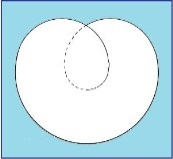
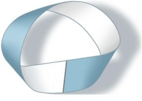
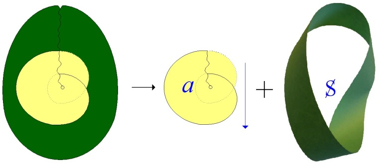
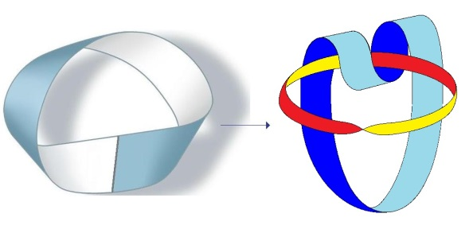

# Leçon 02 | 20 Novembre 1968

<!-- source-url: http://staferla.free.fr/S16/S16 D'UN AUTRE... .docx -->
<!-- seminar: s16 -->
<!-- lesson: 02 -->

<!-- id: s16-02-0001 -->

La dernière fois - ce qui était une *première -* j’ai donc fait référence à MARX.

<!-- id: s16-02-0002 -->

Dans une relation, que dans un premier temps j’ai présentée comme homologique… avec tout ce que ce terme comporte de réserves …j’ai introduit à côté, disons de la *plus-value…*

<!-- id: s16-02-0003 -->

> ce qu’on appelle, dans la langue originale - où cette notion bien sûr a été pour la première fois non pas nommée mais découverte dans sa fonction essentielle - *Mehrwert.* \[*Plus-value* en allemand\] Je l’ai écrit parce que Dieu sait ce qui arriverait si je ne faisais que le prononcer devant ce que j’ai comme auditoire - *et spécialement de psychanalystes, quand ils se recrutent parmi ce qu’on appelle - être de nature ou d’hérédité - des agents doubles -* bientôt on me dirait que c’est la « *mère verte* », (M.E.R.E.), que je retombe dans les sentiers battus. C’est avec ça que - avec mon « *ça parle* » -
>
> on réintègre le désir soi-disant obstiné du sujet de se retrouver bien au chaud dans le ventre maternel. …donc, à cette *plus-value* j’ai accroché, j’ai superposé, j’ai enduit à l’enve la notion de *plus de jouir*.

<!-- id: s16-02-0004 -->

Ça s’est dit comme ça dans la langue originale, ça s’est dit la dernière fois pour la première fois, c’est-à-dire en français.

<!-- id: s16-02-0005 -->

Pour la rendre à la langue d’où m’en est venue l’inspiration, je l’appellerai, pour peu qu’aucun germaniste dans cette assemblée ne s’y oppose : *Merhlust*.

<!-- id: s16-02-0006 -->

Bien sûr, je n’ai pas produit cette opération sans faire référence discrète… sous le mode où il m’arrive de le faire quelquefois …allusive, à celui dont - pourquoi pas ? - les recherches et la pensée m’y ont induit, à savoir : à ALTHUSSER.

<!-- id: s16-02-0007 -->

Naturellement, *selon l’usage*, dans les heures qui suivent, ça a fait du *pia-pia* dans les cafés où on se réunit… et combien n’en suis-je pas flatté, voire comblé …pour *discuter le bout de gras* sur ce qui s’était dit ici. À la vérité, ce qui peut se dire à cette occasion…

<!-- id: s16-02-0008 -->

> et que je ne dénie pas puisque c’est sur ce plan que j’ai introduit mon propos de la dernière fois …à savoir ce facteur, *le facteur poubellicant ou poubellicatoire*, comme vous voudrez l’appeler, du structuralisme, j’avais précisément fait allusion au fait qu’aux derniers échos, ALTHUSSER ne s’y trouvait pas si à l’aise.

<!-- id: s16-02-0009 -->

J’ai simplement rappelé que, *quoiqu’il en soit de ce qu’il avoue ou renie du structuralisme*, il semble bien à qui le lit, que son discours fait de MARX un *structuraliste*, et très spécialement en ceci qu’il souligne son sérieux. C’est là-dessus que je voudrais revenir, puisque aussi bien j’indique qu’on aurait tort de voir dans quelque humeur que ce soit mon ralliement à un drapeau.

<!-- id: s16-02-0010 -->

Ce qui est ici essentiel, à savoir que - comme je l’ai déjà souligné à d’autres occasions - *ce que j’énonce quand il s’agit de la structure*, je l’ai déjà dit : *c’est à prendre au sens de ce que c’est* - au moins pour moi - *le plus réel, le réel même*. Et quant j’ai dit, au temps où ici, au tableau, je dessinais, voire manipulais quelques-uns de ces schémas dont s’illustre ce qu’on appelle la *topologie,* je soulignais déjà que là il ne s’agit de *nulle métaphore*. De deux choses l’une :

<!-- id: s16-02-0011 -->

- ou ce dont nous parlons n’a aucune espèce d’existence,

<!-- id: s16-02-0012 -->

- ou, si le sujet en a une, j’entends telle que nous l’articulons, eh bien, il est exactement fait comme ça, à savoir exactement il est fait comme ces choses que j’inscrivais sur le tableau.

<!-- id: s16-02-0013 -->

 

<!-- id: s16-02-0014 -->

À condition bien entendu que vous sachiez que cette petite image…

<!-- id: s16-02-0015 -->

> qui est tout ce qu’on peut mettre en effet, pour le représenter, sur une page …que cette petite image évidemment n’est là que pour vous figurer certaines connexions qui sont celles qui ne peuvent pas s’imaginer mais qui peuvent par contre parfaitement bien s’écrire. La structure, c’est donc *réel*.

<!-- id: s16-02-0016 -->

Ça se détermine par convergence vers *une impossibilité*, en général. Mais c’est comme ça ! Et c’est parce que c’est *réel*.

<!-- id: s16-02-0017 -->

Alors il n’y aurait presque pas besoin de parler de la structure. Si là je parle, je parle de *la structure*, si j’en reparle aujourd’hui c’est parce qu’on m’y force, à cause des petits *pia-pia* dans les cafés ! Mais je ne devrais pas avoir besoin d’en parler puisque je la dis. Ce que je dis, ça pose la structure, parce que ça vise, comme je l’ai dit la dernière fois, *la cause* du discours lui-même.

<!-- id: s16-02-0018 -->

Implicitement - et comme tout un chacun qui enseigne - à vouloir remplir cette fonction, je défie en principe qu’on me réfute par un discours qui *motive* le discours *autrement* que ce que je viens de dire.

<!-- id: s16-02-0019 -->

Je le répète pour les sourds : c’est à savoir que *ce que ça vise, c’est la cause du discours lui-même*.

<!-- id: s16-02-0020 -->

Que quelqu’un motive le discours autrement : comme expression ou comme rapport à un contenu pour quoi on invente la forme, libre à lui ! Mais je remarque alors qu’*il est impensable* dans cette position *que vous inscriviez* à quelque titre que ce soit *la pratique de la psychanalyse*. J’entends : même pas comme charlatanisme. Entendez que *la psychanalyse* qu’ici j’indique, la question est de savoir si elle existe. C’est cela justement qui est en jeu.

<!-- id: s16-02-0021 -->

Mais d’autre part, il y a quelque chose par quoi elle s’affirme indiscutablement : elle est *symptôme* du point du temps où nous sommes parvenus, disons, dans ce mot provisoire que j’appellerai, comme ça, « *la civilisation* ». Pas de blague, hein ! Je ne suis pas en train de parler de la culture. C’est plus vaste ! C’est une question de convention d’ailleurs. La culture, nous essaierons de la situer dans l’usage actuel qu’on fait de ce terme à un certain niveau que nous appellerons commercial.

<!-- id: s16-02-0022 -->

Bon ! Revenons à mon discours.

<!-- id: s16-02-0023 -->

### Pour employer une métaphore là, qu’il m’est arrivé d’employer plusieurs fois pour faire sentir ce que j’entends par 

<!-- id: s16-02-0024 -->

### « *un discours qui vaille* », je le comparerai à *un trait de ciseaux* dans cette matière dont je parle quand je parle du *réel* du sujet. 

<!-- id: s16-02-0025 -->

Ce *trait de ciseaux dans ce que l’on appelle la structure*, c’est par là, à la façon dont ça tombe, qu’elle se révèle pour ce qu’elle est.

<!-- id: s16-02-0026 -->

Si l’on passe *le trait de ciseaux quelque part, des rapports changent* d’une telle façon que ce qui ne se voyait pas avant se voit après.

<!-- id: s16-02-0027 -->

<!-- id: s16-02-0028 -->

C’est ce que j’ai illustré en disant que ce n’est pas là métaphore, en vous rappelant que *le trait de ciseaux* dans la *bande de Mœbius* ça fait une bande qui n’a plus rien à faire avec ce qu’elle était précédemment, et que même - pour faire le pas suivant - on peut dire qu’à saisir cette transformation, on s’aperçoit que c’est *le trait de ciseaux* qui en lui-même est toute la bande, j’entends en tant qu’elle est, pour autant qu’elle est la *bande de Mœbius*.

<!-- id: s16-02-0029 -->

<!-- id: s16-02-0030 -->

Voilà un moyen de parler de la moindre métaphore.

<!-- id: s16-02-0031 -->

Autrement dit, dans *le principe*, appelez-le « *structuraliste »* ou non…

<!-- id: s16-02-0032 -->

> disons que ce n’est pas la peine de parler d’autre chose que du *réel* dans lequel *le discours* lui-même *a des conséquences* …appelez ça « *structuralisme »* ou pas, c’est ce que j’ai appelé la dernière fois la condition du sérieux.

<!-- id: s16-02-0033 -->

Elle est particulièrement exigible dans une technique dont c’est la prétention que le discours y ait des conséquences, puisque le patient ne se soumet d’une façon artificiellement définie à un certain discours réglé, *<u>que</u>* pour qu’il ait des conséquences.

<!-- id: s16-02-0034 -->

Rien ne prévaut contre ces remarques, même celles que l’on voit s’étaler dans des bouquins dont le texte est par ailleurs raclé de ce discours lui-même, pour dire que je néglige « *la dimension énergétique* » par exemple. *Des trucs comme ça*, je les laisse passer.

<!-- id: s16-02-0035 -->

Je les laisse passer quand il s’agit de *réponses polémiques*.

<!-- id: s16-02-0036 -->

Mais là, nous voici au vif du sujet puisque, comme je l’ai fait remarquer la dernière fois, à cette référence exaltante \- *surtout pour ceux qui ignorent même ce que ça veut dire -* à « *l’énergétique* », j’ai substitué *une référence*, que par les temps qui courent, on aurait du mal à suggérer qu’elle est moins *matérialiste :* une référence à l’économie, à l’économie politique.

<!-- id: s16-02-0037 -->

Mais ne dédaignons point l’énergétique en l’occasion. Pour qu’elle se rapportât à notre champ, si nous mettons ce que je viens de dire *en application*, il faudrait que le discours y ait des conséquences. Eh bien, justement, il en a.

<!-- id: s16-02-0038 -->

Je parle de *la vraie énergétique*, de là où elle se situe dans la science, de la physique.

<!-- id: s16-02-0039 -->

J’ai même dans un temps, et bien avant qu’on ne publie ces objections risibles*,* mis dans des cours - *que des intéressés ont pu parfaitement entendre puisqu’ils en ont fait usage par la suite dans leurs propres conférences -* j’ai justement souligné que l’énergétique n’est même pas concevable autrement que comme conséquence du discours.

<!-- id: s16-02-0040 -->

Ce n’est pas parce que c’est de la physique, qu’il n’est pas clair que, sans repérage signifiant des cotes et des niveaux par rapport auxquels peut s’estimer, s’évaluer, la fonction initiale du *travail* - entendu au sens de la physique - qu’il n’y a même pas probabilité de commencer à formuler ce qui s’appelle principe de toute énergétique au sens littéral de ce terme, c’est-à-dire la référence à une constante qui justement est ce qu’on appelle *énergie*, en rapport avec un système clos, qui est une autre hypothèse essentielle.

<!-- id: s16-02-0041 -->

*Qu’on puisse faire avec cela une physique, et qui fonctionne, c’est bien la preuve de ce qu’il en est d’un discours comme ayant des conséquences.* Ceci implique du même coup que la physique implique l’existence d’*un physicien*, et qui plus est pas n’importe lequel, *un physicien* qui ait un discours correct au sens où je viens de l’articuler. C’est-à-dire un discours qui vaille la peine d’être dit et qui ne soit pas seulement un «* battement de cœur *», ce que devient l’énergétique quand on l’applique à un usage aussi délirant et fumeux que celui qu’on fait de la notion de « *libido* » quand on y voit ce qu’on appelle une «* pulsion de vie *».

<!-- id: s16-02-0042 -->

Bref, dire que la physique ne va pas sans le physicien, n’est pas…

<!-- id: s16-02-0043 -->

> comme j’espère il ne se trouve nul l’entendant ici pour formuler l’objection,
>
> qui serait assez bouffonne à l’intérieur de ce que je viens d’énoncer …dire qu’il s’agit là d’un postulat idéaliste.

<!-- id: s16-02-0044 -->

Car ce que je suis en train de dire, c’est que c’est le discours de la physique qui détermine le physicien, non pas le contraire.

<!-- id: s16-02-0045 -->

C’est-à-dire qu’il n’y a jamais eu de *physiciens* véritables jusqu’à ce que ce discours prévale.

<!-- id: s16-02-0046 -->

Tel est le sens que je donne au discours recevable dans ce qu’on appelle la science.

<!-- id: s16-02-0047 -->

Seulement voilà, irrésistiblement, on s’imagine que l’argument *réaliste* c’est de faire allusion à ceci que…

<!-- id: s16-02-0048 -->

> que nous soyons là ou pas, nous et notre science, comme si notre science était nôtre,
>
> et comme si nous n’étions pas déterminés par elle …eh bien la nature, dit-on, est toujours là. Je n’en discute absolument pas : la nature est là.

<!-- id: s16-02-0049 -->

Ce par quoi *la physique* se distingue de *la nature*, c’est que *la physique* vaut qu’on en dise quelque chose, que le discours y a des conséquences. Dans *la nature*, comme chacun sait, et c’est même pourquoi on l’aime tant, aucun discours n’en a aucune !

<!-- id: s16-02-0050 -->

C’est ce qui différencie la nature de la physique. Être philosophe de la nature n’a jamais passé en aucun temps pour un certificat de matérialisme par exemple, de scientificité non plus.

<!-- id: s16-02-0051 -->

Mais reprenons, car ce n’est pas là que nous en sommes. Si la physique nous donne bien un modèle d’un discours qui vaille, les nécessités du nôtre doivent se reprendre de plus haut. Tout discours se présente comme gros de conséquences, mais obscures. Rien de ce que nous disons, en principe, n’est sans en impliquer. Néanmoins, nous ne savons pas lesquelles.

<!-- id: s16-02-0052 -->

Nous remarquons dans le langage…

<!-- id: s16-02-0053 -->

> car c’est au niveau du langage que je reprendrai les choses, et pour marquer bien les limites …une *syntaxe* telle que l’incarne un grand nombre de langues que, faute d’audace, on appelle les « *langues positives* ».

<!-- id: s16-02-0054 -->

Puisque j’y suis, et puisque je viens de vous faire une remarque qui, je pense, ne vous a point paru sans pertinence sur la nature, mais pourquoi, pourquoi nous gêner et ne pas les appeler *langues naturelles* ?

<!-- id: s16-02-0055 -->

On verra mieux ainsi ce que concerne la *linguistique* et ce qui permet de la situer dans le discours de la science.

<!-- id: s16-02-0056 -->

Il est tout à fait clair que même vis-à-vis du *langage*…

<!-- id: s16-02-0057 -->

> quelque prévalence que nous lui donnions parce qu’on l’oublie comme réalité naturelle …tout discours scientifique sur la langue se présente par *réduction de son matériel*. On met en valeur un fonctionnement où se saisissent des conséquences, je dirai plus : où se saisit la notion même de conséquence avec ses variétés du *nécessaire* ou du *contingent* par exemple. On opère donc un clivage discursif, et c’est ce qui permet de donner tout son prix à ce que d’abord j’affirme *qu’il n’y a pas de métalangage*, ce qui est vrai dans le champ du langage naturel.

<!-- id: s16-02-0058 -->

Mais dès lors que vous opérez cette *réduction du matériel*, c’est pourquoi ? Je viens de vous le dire : c’est pour mettre en valeur un fonctionnement où se saisissent des conséquences, et dès lors que vous saisissez ces conséquences, vous les articulez dans quelque chose que vous avez bien le droit de considérer comme métalangage, à ceci près que ce « méta » ne peut faire que confusion et que c’est pour ça que je préférerais dire que ce que fait surgir le détachement dans le discours de ce qu’il faut bien appeler par son nom, *la logique* - je n’indique ici rien de plus - est toujours conditionné par rien d’autre que par *une réduction de matériel*. Et j’illustre ici ce que je veux dire.

<!-- id: s16-02-0059 -->

*Réduction de matériel*, cela veut dire que *la logique commence à cette date précise dans l’histoire où, pour certains éléments du langage*… comme fonctionnant dans leur syntaxe naturelle …*quelqu’un* qui s’y entend, qui inaugure la logique, *substitue à certains de ces éléments du langage, une simple lettre*.

<!-- id: s16-02-0060 -->

C’est à partir du moment où, dans « si ceci, alors cela » vous introduisez un A et un B que la logique commence.

<!-- id: s16-02-0061 -->

Et c’est seulement à partir de là que, dans le langage, vous pouvez, sur l’usage de ce A et de ce B, poser un certain nombre d’axiomes et de lois de la discussion qui mériteront le titre d’articulation « *méta* » ou si vous préférez « *para-langagières* ».

<!-- id: s16-02-0062 -->

Donc :

<!-- id: s16-02-0063 -->

- pas plus que de physique qui s’étende *- comme la bonté de Dieu -* à toute la nature,

<!-- id: s16-02-0064 -->

- pas plus de logique qui enserre tout le langage.

<!-- id: s16-02-0065 -->

Il n’en reste pas moins - comme je l’ai dit - que :

<!-- id: s16-02-0066 -->

- ou c’est *délire*, *folie absurde* que de s’arrêter un instant…

<!-- id: s16-02-0067 -->

> c’est bien en effet toute l’apparence qu’on en a dans ces publications, la plupart …de s’arrêter à la psychanalyse,

<!-- id: s16-02-0068 -->

- ou bien ce qu’elle énonce c’est que tout ce que vous êtes, entendez jusqu’à ceci, en tant que « sentant »…

<!-- id: s16-02-0069 -->

> je n’ai pas dit seulement en tant que pensant, encore qu’après tout, il n’y a lieu d’avoir vis-à-vis de ce terme aucune répugnance, le fait de penser serait–il le privilège des *intellectuels intellectualistes* qui,
>
> comme chacun sait, sont le poison de ce bas monde, et de ce bas monde psychanalytique, bien entendu …tout ce que vous êtes en tant que « sentant », tombe sous le coup des conséquences du discours.

<!-- id: s16-02-0070 -->

*Même votre mort*, j’entends l’idée falote que vous en pouvez avoir n’est pas séparable de ce que vous puissiez la dire, et j’entends là non pas *la dire naïvement*. Même l’idée, que j’ai appelée « *falote »* parce qu’en effet *elle n’a pas pour vous grand poids*, que vous vous faites de votre mort n’est pas séparable du discours maximal que vous puissiez tramer à son propos.

<!-- id: s16-02-0071 -->

C’est bien pour cela que le sentiment que vous en avez n’est que falot. Je dirai même que naïvement, vous ne pouvez même pas commencer à la dire.

<!-- id: s16-02-0072 -->

Car ce à quoi ici je fais allusion, ce n’est pas du tout au fait que les primitifs sont naïfs, c’est pour ça qu’ils en parlent si drôlement. Que chez eux c’est toujours un truc, un empoisonnement, un sort jeté, un machin qui ne va pas quelque part, pour tout dire un accident, ça ne prouve pas du tout qu’ils en parlent naïvement. Si vous trouvez que c’est naïf, ça !

<!-- id: s16-02-0073 -->

C’est bien le contraire. Mais c’est justement pour ça que, eux aussi, ils tombent sous cette loi.

<!-- id: s16-02-0074 -->

Le sentiment qu’ils ont de leur mort n’est pas séparable de ce qu’ils peuvent en dire, ce qu’il fallait démontrer.

<!-- id: s16-02-0075 -->

Il y a une personne[^7], comme ça, tout à l’heure, parmi ceux qui pourraient ici un peu s’instruire et décrasser son bafouillage qui est sortie parce qu’elle trouve sans doute que je dis des banalités. Il faut croire qu’elles sont nécessaires à dire, sans ça pourquoi m’en donnerais-je la peine, après tout ce que je viens de dire sur le fait qu’un discours ait *des conséquences* ou pas.

<!-- id: s16-02-0076 -->

Il a eu en tout cas pour conséquence cette sortie qui est *signalétique*.

<!-- id: s16-02-0077 -->

### C’est bien pourquoi il serait essentiel que, dans la psychanalyse, nous ayons quelques esprits formés à ce qu’on appelle, 

<!-- id: s16-02-0078 -->

### je ne sais pourquoi *logique mathématique*, comme ça, par une vieille gêne : *comme s’il y en avait une autre. C’est la logique tout court* ! 

<!-- id: s16-02-0079 -->

### Il se trouve qu’elle a intéressé les mathématiques, c’est tout ce qui la distingue de la logique aristotélicienne qui, 

<!-- id: s16-02-0080 -->

### très évidemment, ne l’intéressait pas beaucoup, *la mathématique*. 

<!-- id: s16-02-0081 -->

C’est un progrès pour la logique qu’elle intéresse la mathématique, oui. Cette *logique mathématique* - pour dire les choses par leur nom - elle est tout à fait essentielle à votre existence dans le *réel*, *que vous le sachiez ou que vous ne le sachiez pas*.

<!-- id: s16-02-0082 -->

C’est justement parce que vous ne le savez pas beaucoup qu’il se passe des choses qui remuent de temps en temps, des choses toutes récentes. On attend que j’en parle, mais *j’en parlerai, j’en parlerai* !

<!-- id: s16-02-0083 -->

Tout dépend du temps que je vais mettre à dérouler ce que j’ai préparé pour vous aujourd’hui, et j’aimerais bien avoir une petite pointe, comme ça, à vous en donner avant de vous quitter, mais ça n’est pas sûr parce que je ne sais jamais bien… ce n’est jamais très minuté ce que je vous apporte.

<!-- id: s16-02-0084 -->

La question n’est pas là : *que vous le sachiez ou que vous ne le sachiez pas*. La question bizarre, c’est… évidemment je viens de faire allusion au fait, puisque j’ai dit « *que vous le sachiez ou que vous ne le sachiez pas* » …si ça a toujours été vrai que la logique mathématique ait ces conséquences quant à votre existence de sujet…

<!-- id: s16-02-0085 -->

> dont je viens de dire qu’elles sont là, *que vous le sachiez ou que vous ne le sachiez pas* …car alors la question se pose : *comment ça pouvait se faire avant que la logique, qu’on appelle mathématique, ne soit venue au jour* ?

<!-- id: s16-02-0086 -->

C’est la question de l’existence de Dieu.

<!-- id: s16-02-0087 -->

Je l’ai déjà fait remarquer mais je le répète - on ne saurait *trop* se répéter - est-ce que *la logique mathématique* était là, dans la comprenoire divine, avant que dans votre existence de sujet - il aurait été dès lors conditionné dès ce moment - vous en ayiez été d’ores et déjà affectés ? C’est un problème qui a toute son importance parce que c’est autour de là que prend effet cette avancée qu’un discours a des conséquences.

<!-- id: s16-02-0088 -->

C’est à savoir qu’il a fallu quelque chose déjà attenant aux effets du discours pour que naisse celui de *la logique mathématique,* et qu’en tout cas*…*

<!-- id: s16-02-0089 -->

> même si quelque chose pouvait déjà représenter dans une existence de sujet quelque chose
>
> que rétroactivement nous pouvons rattacher à quelques effet dans cette existence du discours de la logique …il est tout à fait clair, il doit être fermement tenu que ce ne sont pas les mêmes conséquences que depuis que ce discours, j’entends celui de la logique mathématique, a été proféré.

<!-- id: s16-02-0090 -->

Là se situent *le nécessaire* et *le contingent* dans le discours effectivement tenu. C’est bien là que je vois mal en quoi *la référence structurale méconnaîtrait la dimension de l’histoire*. Il s’agit simplement de savoir de laquelle on parle !

<!-- id: s16-02-0091 -->

L’histoire telle qu’elle est incluse dans *le matérialisme historique* me paraît strictement conforme aux exigences *structurales*.

<!-- id: s16-02-0092 -->

La *plus-value* était-elle là avant que « *le travail abstrait* »…

<!-- id: s16-02-0093 -->

> j’entends celui dont cette abstraction se dégage, j’entends comme moyenne sociale …ait résulté de quelque chose que nous appellerons…

<!-- id: s16-02-0094 -->

> je ne garantis pas l’exactitude du premier mot mais je veux dire un mot qui porte …*l’absolutisation du marché*.

<!-- id: s16-02-0095 -->

Il est plus que probable - et pour une bonne raison : c’est que nous avons pour cela introduit le *plus-de-jouir -* qu’on peut \- cette *absolutisation du marché* - considérer qu’elle n’est qu’une condition pour que la *plus-value* apparaisse dans le discours.

<!-- id: s16-02-0096 -->

Il a donc fallu ceci…

<!-- id: s16-02-0097 -->

> qui peut difficilement être séparé du développement de certains *effets de langage*,
>
> à savoir *l’absolutisation du marché* au point qu’il englobe le travail lui-même …pour que la plus-value se définisse en ceci :qu’en payant avec de l’argent ou pas… avec de l’argent puisque nous sommes dans le marché …le travail à son « *vrai prix* », telle que se définit dans le marché *la fonction de la valeur d’échange*, il y a de la *valeur non payée* dans ce qui apparaît comme *fruit du travail*, dans une *valeur d’usage*, dans ce qui est le vrai prix de ce fruit.

<!-- id: s16-02-0098 -->

Ce travail non payé…

<!-- id: s16-02-0099 -->

> quoique payé de façon *juste* par rapport à la *consistance* du marché, ceci dans le fonctionnement du sujet capitaliste …ce travail non payé, c’est *la plus-value*. C’est le fruit des *moyens d’articulation* qui constituent le discours capitaliste de la logique capitaliste. Sans doute, articulé ainsi ceci entraîne une *revendication* concernant la frustration du travailleur.

<!-- id: s16-02-0100 -->

Ceci entraîne une certaine position du « *je* » dans le système, quand ce « *je* » est à la place du travailleur, ce qui est le cas de plus en plus général.

<!-- id: s16-02-0101 -->

Que ça entraîne ça, c’est étrange, voilà ce qu’il faut dire, car il ne s’agit que des conséquences d’un discours parfaitement défini, dans lequel le travailleur s’inscrit lui–même en tant que travailleur, en tant que « *je* ». J’ai dit « *je* » ici, repérez que je n’ai pas dit *sujet*, alors que j’ai parlé du sujet capitaliste. Je vais lentement parce qu’après tout, j’y reviendrai, nous nous reverrons - *sauf, j’espère, ceux qui sortent dans le milieu -* et vous verrez que ça n’est pas pour rien que :

<!-- id: s16-02-0102 -->

- *là* je dis *sujet*,

<!-- id: s16-02-0103 -->

- et *là* je dis « *je* », parce que ça se retrouvera à un certain niveau, et *à un niveau qui devrait fonctionner depuis longtemps puisque c’est celui de mon graphe*. Il y a plus de dix ans que je l’ai construit devant un auditoire d’ânes : ils n’ont pas encore trouvé où était le « *je* » sur ce *graphe* !

<!-- id: s16-02-0104 -->

Alors il faudra bien que je leur explique. Pour leur expliquer, il faut que je prépare. Nous labourons. C’est du travail.

<!-- id: s16-02-0105 -->

Espérons que je pourrais vous dire avant la fin, comment le travail, pour nous - *au niveau de ce discours de l’enseignant -* se situe.

<!-- id: s16-02-0106 -->

Donc c’est étrange que ça entraîne l’idée de frustration, avec les revendications qui suivent, les petites reconstructions qu’on distingue sous le nom de « *révolution* ». C’est étrange et c’est intéressant. Mais je ne peux pas ne pas faire que dès maintenant, dans ce que j’articule en ce point précis, c’est la dimension conflictuelle qui est introduite.

<!-- id: s16-02-0107 -->

Il est difficile de la désigner autrement. J’ai dit que c’était étrange, et que c’est intéressant. Ça devrait au moins vous inciter à la reconnaître, non ! je la désignerai par ce mot étrange, non moins qu’intéressant mais étrange, qui est le mot de *vérité*.

<!-- id: s16-02-0108 -->

La *vérité* ça ne se saisit pas comme ça - hein ! - Je l’ai déjà bien sûr introduite, comme ça, une fois, dans sa jonction \- dont j’avais essayé de dessiner la topologie - dans sa jonction avec le savoir, parce qu’il est difficile de parler de quoi que ce soit en psychanalyse sans introduire cette jonction.

<!-- id: s16-02-0109 -->

Cela montre bien la prudence qu’il faut avoir, parce que Dieu sait ce qui, à ce propos, m’est revenu de sottises qui cavalent !

<!-- id: s16-02-0110 -->

Nous allons tâcher de nous en *approcher* d’un peu plus près et de voir comment la réalité capitaliste n’a pas de si mauvais rapports avec la science. Cela peut fonctionner comme ça, enfin, encore un certain temps, selon toute apparence, je dirai même qu’elle s’en accommode pas mal du tout.

<!-- id: s16-02-0111 -->

### J’ai parlé de *réalité*, n’est-ce pas ? Je n’ai pas parlé de *Réel*. J’ai parlé *de ce qui se construit sur le sujet capitaliste*, ce qui s’est engendré de la *revendication* fondamentalement insérée sur la reconnaissance - ou bien alors le discours de MARX n’a aucun sens -

<!-- id: s16-02-0112 -->

de ce qui s’appelle *la plus-value*. Ce qui est proprement *l’incidence scientifique dans l’ordre de quelque chose qui est de l’ordre du sujet*.

<!-- id: s16-02-0113 -->

Évidemment, à un certain niveau, ça ne s’accommode pas mal du tout avec la science : on nous envoie dans les orbes spatiales des objets tout à fait bien conformés autant qu’habitables. Mais il n’est pas sûr qu’au niveau le plus proche, celui d’où s’est engendrée la révolution et les formes politiques qu’elle engendre, quelque chose soit entièrement résolu sur le plan de cette frustration que nous avons désignée être le niveau d’une *vérité*.

<!-- id: s16-02-0114 -->

Sans doute le travailleur est le *lieu sacré* de cet élément conflictuel qui est *la vérité* du système, à savoir : qu’un savoir, qui se tient d’autant plus parfaitement qu’il est identique à son propre perçu dans l’être, se déchire quelque part.

<!-- id: s16-02-0115 -->

Alors faisons ce pas que nous permet le fait qu’il s’agit sans aucun doute de la même substance.

<!-- id: s16-02-0116 -->

Tâtons ce qu’il en est de *l’étoffe structurale*, et donnons notre coup de ciseaux.

<!-- id: s16-02-0117 -->

Il s’agit du savoir. C’est par rapport à lui, sous sa forme scientifique, que je viens prudemment apprécier ce qu’il en est dans des relations, dans les deux réalités qui s’opposent dans notre monde politique. Le savoir…

<!-- id: s16-02-0118 -->

> *quoique tout à l’heure j’ai paru en amorcer mon discours* …le savoir ce n’est pas le travail. Ça vaut du travail quelquefois, mais ça peut vous être donné sans.

<!-- id: s16-02-0119 -->

Le savoir, à l’extrême, c’est ce que nous appelons *le prix*. Le prix, ça s’incarne quelquefois dans de l’argent, mais le savoir aussi bien ! *Ça vaut de l’argent, et de plus en plus.* C’est ce qui devrait vous éclairer ! Le prix de quoi ? C’est clair : le prix de la *renonciation à la jouissance*. Originellement, c’est par là que nous commençons d’en savoir un petit bout.

<!-- id: s16-02-0120 -->

Pas besoin de *travail* pour cela. Ce n’est pas *parce que* le travail implique la renonciation à la jouissance que toute renonciation à la jouissance ne se fait que par le travail.

<!-- id: s16-02-0121 -->

Une illumination comme ça vous arrive pour peu que vous sachiez vous retenir, ou vous contenir, comme j’y ai fait allusion la dernière fois pour définir la pensée. Un petit temps d’arrêt : vous pouvez vous apercevoir par exemple, que *la femme ne vit pas seulement de pain mais aussi de votre castration*, ceci pour les mâles. Après ça, vous conduirez plus sûrement votre vie.

<!-- id: s16-02-0122 -->

C’est une valeur d’usage, ça !

<!-- id: s16-02-0123 -->

*Le savoir*, ça n’a rien à faire avec *le travail*. Mais pour que quelque chose s’éclaire dans cette affaire, il faut qu’il y ait un marché, *un marché du savoir*, *que le savoir devienne une marchandise*. Or, c’est là ce qui se précipite. Si on n’en avait pas l’idée, on devrait en avoir au moins une petite suggestion *à voir la forme que prennent les choses*, à voir l’air de foire que depuis quelque temps ça prenait dans l’Université par exemple.

<!-- id: s16-02-0124 -->

Il y a des choses comme ça, dont j’ai parlé incidemment sous d’autres angles : *il n’y a pas de propriété intellectuelle*, *par exemple*.

<!-- id: s16-02-0125 -->

*Ça ne veut pas dire qu’il n’y ait pas de vol*. C’est même comme ça qu’elle commence, la propriété. Tout cela est bien compliqué.

<!-- id: s16-02-0126 -->

Ça n’existe, bien sûr, que depuis qu’on paye les conférences faites à l’étranger[^8]…

<!-- id: s16-02-0127 -->

> je veux dire que c’est à l’étranger qu’on les paye, et voilà que même en France, ça commence …c’est à partir de ce moment-là qu’on peut décerner ce que j’ai appelé autrefois - dans un cercle intime – un « *prix haut-le-cœur* » à quiconque se démontre spécialement en vue dans cette sorte de spéculation.

<!-- id: s16-02-0128 -->

Mais tout ceci n’est qu’anecdote. *Le savoir devient marché pas du tout par l’effet de la corruption ni de l’imbécillité des hommes*.

<!-- id: s16-02-0129 -->

Comprenez par exemple que la Sorbonne, c’est bien connu que depuis longtemps, elle est le lieu élu de cette sorte de qualité négative, de cette sorte de faiblesse. On connaissait ça à tous les bouts de champ dans toute l’histoire :

<!-- id: s16-02-0130 -->

- au moment de RABELAIS, c’était déjà des salauds.

<!-- id: s16-02-0131 -->

- au moment des Jansénistes…

<!-- id: s16-02-0132 -->

Ça ne rate jamais, ils sont toujours du bon côté, c’est-à-dire du mauvais ! C’est pas ça le nouveau. C’est pas ça !

<!-- id: s16-02-0133 -->

J’ai cherché la racine de ce que l’on appelle ridiculement « *les événements* » : il n’y a pas le moindre *événement* dans cette affaire, mais ça je vous l’expliquerai une autre fois. *Le procès même par où s’unifie la science* en tant qu’elle prend son nœud d’un discours conséquent réduit tous les savoirs à un marché unique, et ceci, pour ce que nous interrogeons, est la référence nodale.

<!-- id: s16-02-0134 -->

C’est à partir de là que nous pouvons concevoir *qu’il y a quelque chose là aussi qui*, en tant que payé à son vrai prix de savoir selon les normes qui se constituent du marché de la science, *est pourtant obtenu pour rien*. C’est ce que j’ai appelé le *plus-de-jouir*.

<!-- id: s16-02-0135 -->

À partir du savoir…

<!-- id: s16-02-0136 -->

> ce qui n’est pas nouveau mais ce qui ne se révèle qu’à partir de *l’homogénéisation des savoirs* sur le marché …on aperçoit enfin que la jouissance s’ordonne et peut s’établir comme recherchée et perverse.

<!-- id: s16-02-0137 -->

Qu’est-ce qui donc, à cette occasion, représente le *Malaise de la civilisation*, comme on s’exprime ?

<!-- id: s16-02-0138 -->

C’est un *plus-de-jouir* obtenu de *la renonciation à la jouissance*, justement étant respecté le principe de la valeur du savoir.

<!-- id: s16-02-0139 -->

Le savoir est-il un bien ? Telle est la question qui se pose, parce que son corrélatif est celui-ci : « *Non licet omnibus -* comme je l’ai déjà dit *-* *adire Corynthum* [^9]* *»

<!-- id: s16-02-0140 -->

Tout le monde n’a point accès pour autant au *plus-de-jouir.*Qu’est-ce qui est donc en cette affaire payé ou pas ?

<!-- id: s16-02-0141 -->

Le travail, avons-nous vu plus haut. Mais dans ce registre, de quoi s’agit-il ? Ce que déjà j’ai pointé tout à l’heure, quant à ce qui surgit de conflictuel de la fonction de *la plus-value* nous met sur la voie, et c’est ce que déjà j’ai appelé *la vérité*.

<!-- id: s16-02-0142 -->

La façon dont chacun souffre dans son rapport à *la jouissance* pour autant qu’il ne s’y insère que par la fonction du *plus-de-jouir,* voilà le symptôme, et *le symptôme* en tant qu’il apparaît de ceci qu’il n’y ait plus qu’une vérité sociale moyenne, une vérité abstraite. Voilà ce qui résulte de ce qu’un savoir est toujours payé sans doute selon son vrai prix, mais au­-dessous de la valeur d’usage que cette *vérité* engendre toujours, pour d’autres que ceux qui sont dans le vrai.

<!-- id: s16-02-0143 -->

Voilà ce que comporte la fonction du *plus-de-jouir,* de la *Mehrlust,* cette *Mehrlust* qui se moque bien de nous, parce qu’on ne sait pas où elle niche. Voici pourquoi votre fille est muette, chers enfants ! C’est à savoir pourquoi, en Mai, ça a bardé. Une grande « *prise de parole* » comme s’est exprimé quelqu’un qui n’a pas dans mon champ une place négligeable.

<!-- id: s16-02-0144 -->

*Prise de parole* : je crois qu’on aurait tort de donner à cette *prise* une homologie avec *la prise d’une Bastille* quelconque.

<!-- id: s16-02-0145 -->

*Prise de tabac* ou *de came*, j’aimerais mieux. C’est que c’était positivement *la vérité* qui se manifestait en cette occasion.

<!-- id: s16-02-0146 -->

Une *vérité collective*, mais qu’il faut bien voir au sens où la grève…

<!-- id: s16-02-0147 -->

> qui ne consonnait avec cette *vérité*, pas mal du tout …est justement cette sorte de rapport qui soude le collectif au travail. C’est même le seul.

<!-- id: s16-02-0148 -->

Parce qu’on aurait tout à fait tort de croire qu’un type qui est dans une chaîne y travaille collectivement.

<!-- id: s16-02-0149 -->

C’est bien lui qui fait le boulot, quand même ! Dans la grève, la *vérité collective* du travail se manifeste, et ce que nous avons vu en Mai, c’était *la grève de la vérité*.

<!-- id: s16-02-0150 -->

Là aussi, le rapport à la *vérité* était évident. La *vérité* s’étalait sur les murs. Naturellement, il faut se souvenir à ce moment-là du rapport qu’heureusement j’avais bien pointé trois mois auparavant que la *vérité de la connerie* n’est pas sans poser la question de la *connerie de la* *vérité.* Il y a même des conneries qu’on aurait dit du discours de LACAN. Ça le reproduisait comme ça - c’était le hasard bien sûr - presque textuellement. Ceci tient évidemment à ceci que des choses extraites de leur contexte ça peut être des *vérités* mais ça n’exclue pas que ce soit des *conneries*.

<!-- id: s16-02-0151 -->

*C’est bien pour ça que ce que je préfère, c’est un discours sans paroles.*

<!-- id: s16-02-0152 -->

L’étrange, ça a été ce que l’on a vu d’une interrogation passionnée, de celle qui surgissait dans l’âme de ce que j’appellerai… je pense que vous verrez se profiler sa silhouette …le curé communiste, lui dont la bonté non plus n’a pas de limite dans la nature. Pour recevoir avec lui des propos moraux, on peut y compter, c’est des choses qui viennent avec l’âge.

<!-- id: s16-02-0153 -->

Il y en a un que *j’épingle* à jamais *du titre* de « *Mudger Muddle* »[^10]*.* C’est un nom que je lui donne, c’est de mon crû.

<!-- id: s16-02-0154 -->

Ça évoque le crocodile et la boue où il baigne, et le fait que, d’une larme délicate, il vous attire dans son monde bienfaisant.

<!-- id: s16-02-0155 -->

Je l’ai rencontré, *Mudger* \[boueux\] *Muddle* \[pagaille\]*,* sur le trottoir du boulevard Saint-Germain. Il m’a dit qu’il cherchait *la théorie marxiste* et qu’il était inondé - par quoi ? - par *le bonheur* que tout ça respirait.

<!-- id: s16-02-0156 -->

Mais il ne lui était pas venu à l’idée que le bonheur, ça peut provenir de *la grève de la vérité*. Qui n’en serait heureux, bien sûr ?

<!-- id: s16-02-0157 -->

Au poids qu’elle pèse sur nous à chaque instant de notre existence, nous pouvons *nous rendre compte* de ce que c’est que de n’avoir plus avec elle qu’un rapport collectif. Donc je ne porte nulle dépréciation dans ceci : que ces vérités qui s’étalaient sur les murs, ça faisait *con* quelquefois. Je vous l’ai dit, personne ne remarque qu’elles sont aussi dans mon discours.

<!-- id: s16-02-0158 -->

C’est parce que, dans le mien, ça fait peur. Mais sur les murs, ça faisait peur aussi. Et c’est bien là qu’elle ressort, c’est que tant de choses connes, ça fait une peur sans égale : quand la vérité collective sort, on sait que *tout le discours peut foutre le camp*.

<!-- id: s16-02-0159 -->

Voilà. C’est rentré un peu dans le rang. Mais ça couve. C’est pour ça que *les capitaux foutent le camp* .

<!-- id: s16-02-0160 -->

Eh bien, puisque je me suis risqué aujourd’hui à donner mon interprétation à moi de ce que l’on appelle « *les événements* » je voudrais vous dire : *ne croyez pas pour autant que ça arrête le processus*.

<!-- id: s16-02-0161 -->

Vous auriez tort de ne pas vous apercevoir que pour l’instant il n’est même pas question que ça s’arrête, ce que j’ai appelé le marché du savoir ! Et c’est vous-mêmes qui agirez pour qu’il s’établisse de plus en plus.

<!-- id: s16-02-0162 -->

L’apparition dans la réforme d’une notion comme celle de « *l’unité de valeur* », au niveau des petits papelards qu’on veut vous décerner, mais l’unité de valeur, c’est ça ! C’est le signe de ce que le savoir va devenir, de plus en plus dans ce champ, dans ce marché qu’on appelle l’Université.

<!-- id: s16-02-0163 -->

Alors bien sûr, ces choses doivent être suivies de très près pour simplement qu’on s’y repère de ce qu’il est bien évident que *la vérité* peut avoir là *des fonctions spasmodiques*, mais que ce n’est pas du tout ça qui règlera pour chacun votre existence de sujet.

<!-- id: s16-02-0164 -->

De ce que *la vérité* - je vous l’ai rappelé la dernière fois - *la vérité* - mon Dieu - dans un texte, j’ai été très gentil, je lui ai fait tenir les propos les plus intelligents que je pouvais lui attribuer, je les empruntais à ce que je dis *quand je ne dis pas la vérité*.

<!-- id: s16-02-0165 -->

Autrement dit : « *nul discours ne peut dire la vérité* ». Le discours qui tient, c’est celui qui peut tenir assez longtemps sans que vous ayez besoin de lui demander raison de sa vérité. Attendez, là au pied du mur, ceux qui pourront se présenter devant vous en vous disant : « *La psychanalyse, vous savez, hein, nous on n’en peut rien dire !* »

<!-- id: s16-02-0166 -->

Ce n’est pas le ton de ce que vous devez exiger si vous voulez maîtriser ce monde d’*une valeur* qui s’appelle *le savoir*.

<!-- id: s16-02-0167 -->

Si un discours se dérobe, vous n’avez qu’une chose à faire, lui demander raison : pourquoi ?

<!-- id: s16-02-0168 -->

Autrement dit, un discours qui ne s’articule pas de dire quelque chose est un discours de vanité. Ne croyez pas que le fait de dire que « *tout est vanité*... », qui est ce sur quoi je vous ai laissés la dernière fois, soit autre chose ici qu’un leurre sur lequel, comme je vous l’ai dit, j’ai voulu vous laisser partir *l’âme en paix* jusqu’à ce que, ce discours, je le reprenne.

<!-- id: s16-02-0169 -->

Et sur ce qu’il en est de ceux qui posent au principe une essentielle vanité de tout discours, c’est là que celui que je vous tiens aura la prochaine fois à nous reprendre ensemble.

## Notes

[^7]: François Perrier.

[^8]: Cf. Séminaire 1965-66 : « *L’objet de la psychanalyse* », séances des 23-03 et 30-03.

[^9]: Non licet omnibus adire Corynthum : il n'est pas permis à tout le monde d'aller à Corinthe. Au temps des Laïs et des Phryné (célèbres courtisanes)

    Corinthe était la ville des plaisirs coûteux et beaucoup devaient y renoncer moins par sagesse que par pauvreté. Aussi, disait-on : tout le monde ne peut

    aller à Corinthe.

[^10]: Lucien Goldmann.
