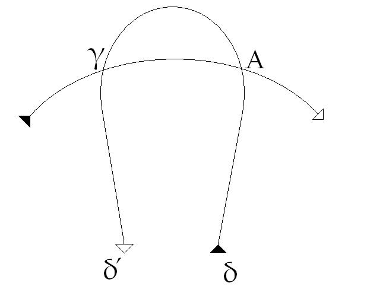
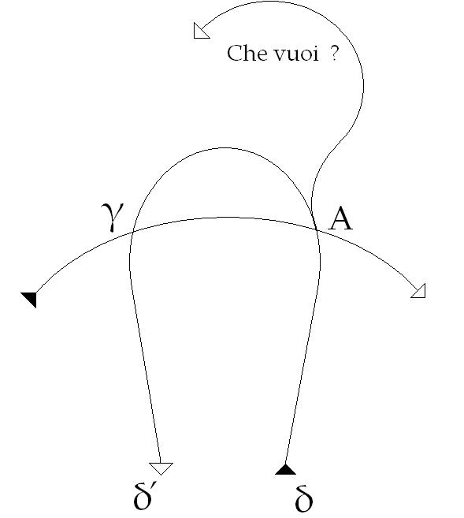
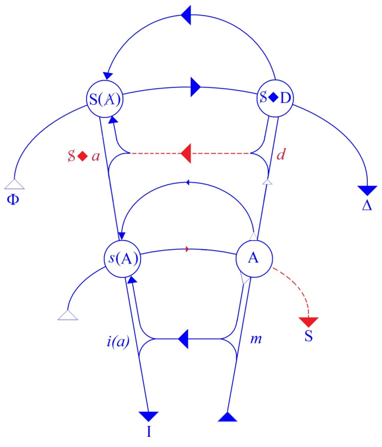
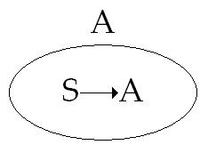
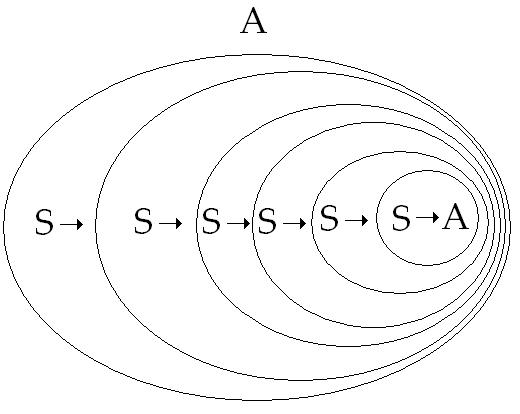
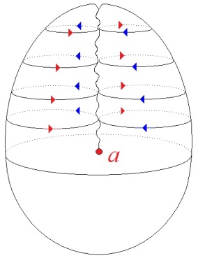
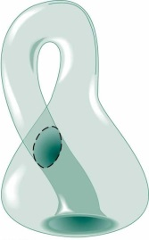

# Leçon 03 | 27 Novembre 1968

<!-- source-url: http://staferla.free.fr/S16/S16 D'UN AUTRE... .docx -->
<!-- seminar: s16 -->
<!-- lesson: 03 -->

<!-- id: s16-03-0001 -->

Nous sommes arrivés la dernière fois à un point qui commande que je vous donne aujourd’hui quelques éclaircissements que j’appellerai topologiques. Ce n’est pas là *chose nouvelle* à ce que je l’introduise ici, mais il convient que je la conjoigne avec ce que précisément j’ai introduit cette année sous cette forme qui désigne le rapport du savoir à *quelque chose*… certes, de plus mystérieux, de plus fondamental …à *quelque chose* dont c’est bien le danger *qu’il soit pris dans la fonction d’un fond par rapport au champ d’une forme* alors qu’il s’agit de bien autre chose : j’ai nommé *la jouissance*.

<!-- id: s16-03-0002 -->

*La jouissance* dont bien sûr il n’est que trop évident qu’elle fait la substance de tout ce dont nous parlons dans la psychanalyse. On sait bien par là qu’elle n’est pas informe : *la jouissance* a ici cette portée, qu’elle nous permet d’introduire cette fonction proprement structurale qui est celle du *plus-de-jouir.*

<!-- id: s16-03-0003 -->

Ce *plus-de-jouir* est apparu, dans mes derniers discours, en fonction d’homologie par rapport à *la plus-value* marxiste. « *Homologie* », c’est bien dire - et je l’ai souligné - que leur rapport n’est pas d’analogie, *il s’agit bien de la même chose*.

<!-- id: s16-03-0004 -->

Il s’agit bien de la même étoffe en tant que ce dont il s’agit, c’est *le trait de ciseaux du discours*. Me fais-je bien entendre ?

<!-- id: s16-03-0005 -->

S’il est bien vrai que ce qui est ici intéressé *dans le mien*, car ce rapport du *plus-de-jouir* à la *plus-value*, chacun qui suit depuis un temps suffisant ce que j’énonce voit autour de quelle fonction il tourne, ce rapport c’est la fonction de *l’objet(a)*.

<!-- id: s16-03-0006 -->

Cet *objet(a)*, si en un certain sens je l’ai inventé…

<!-- id: s16-03-0007 -->

> *comme on peut dire que ce que le discours de Marx invente - qu’est-ce à dire ? - c’est la trouvaille de la plus-value* …ce n’est pas dire, bien sûr, qu’il n’ait pas été, avant mon propre discours, approché, et c’est ce qu’on a appelé \[…\] mais de façon franchement insuffisante, aussi insuffisante qu’était la définition de *la plus-value* avant que la fasse apparaître dans sa rigueur le discours de MARX.

<!-- id: s16-03-0008 -->

Mais l’important n’est pas de souligner cette équivalence dans l’ordre de l’importance de la trouvaille.

<!-- id: s16-03-0009 -->

L’important est de poser la question de ce que nous pouvons penser du fait même de la trouvaille, si d’abord, je la définis comme *effet d’un discours*.

<!-- id: s16-03-0010 -->

Car il ne s’agit pas de *théorie* au sens où elle recouvrirait quelque chose qui à un moment donné deviendrait apparent. *L’objet(a)* est *effet du discours analytique*, et comme tel ce que j’en dis n’est que cet effet même. Est-ce à dire qu’il n’est qu’artifice créé par *le discours analytique* ? Là est le point que je désigne, qui est consistant avec le fond de la question telle que je la pose, quant à la fonction de l’analyste.

<!-- id: s16-03-0011 -->

Si l’analyste lui-même n’était pas cet *effet*, je dirais plus : ce *symptôme,* qui résulte d’une certaine incidence dans l’Histoire, impliquant transformation du rapport du *savoir* avec ce fond énigmatique de *la jouissance*, du rapport du *savoir* en tant qu’il est déterminant pour la position du sujet, il n’y aurait ni *discours analytique* ni bien sûr révélation de la fonction de *l’objet(a).*

<!-- id: s16-03-0012 -->

Mais la question de l’artifice, vous le voyez bien, se modifie, se suspend, trouve sa médiation dans ce fait que ce qui est découvert dans un *effet de discours* est déjà apparu comme *effet de discours* dans l’Histoire. Que *la psychanalyse* autrement dit, n’apparaît comme *symptôme* que pour autant qu’un tournant du savoir dans l’Histoire… je ne dis pas de l’histoire du savoir …qu’un tournant de l’incidence du savoir dans l’Histoire est déjà là qui a concentré, si je puis dire, pour nous l’offrir, pour la mettre à notre portée, cette fonction. Je parle de celle définie par *l’objet(a)*.

<!-- id: s16-03-0013 -->

Il est clair que personne, sauf une…

<!-- id: s16-03-0014 -->

> ma traductrice italienne dont je n’offenserai pas la modestie : du fait qu’elle a raté l’avion ce matin elle n’est pas là …qui s’est fort bien aperçue il y a quelque temps, de *l’identité de cette fonction de la plus-value et de l’objet(a). Pourquoi pas plus ?*

<!-- id: s16-03-0015 -->

Pas plus de personnes à l’avoir énoncée si tant est qu’il ait pu se faire que la chose *ne m’ait point été communiquée* ?

<!-- id: s16-03-0016 -->

Là est l’étrange. L’étrange qui assurément se tempère à saisir sur le vif comme je fais - c’est mon destin - la difficulté du progrès de ce discours analytique, la résistance qui s’accroît à mesure même qu’il se poursuit.

<!-- id: s16-03-0017 -->

Et pourtant, n’est-il pas singulier…

<!-- id: s16-03-0018 -->

> puisque aussi bien j’ai là un témoignage qui après tout prend sa valeur
>
> de provenir de quelqu’un qui est d’une génération des plus jeunes …n’est-il pas singulier de voir que par un *effet* qu’assurément je ne désignerai pas pour être celui de mon discours, mais pour être celui du progrès *de la difficulté croissante* qui s’engendre de ce que j’ai appelé cette « *absolutisation du marché du savoir* », je puisse toucher très fréquemment…

<!-- id: s16-03-0019 -->

> combien plus aisé, dans la génération qui vient, est mon échange …ceux dont après tout, par une petite expérience de calcul, *j’ai pu faire la moyenne d’âge, disons avec ceux qui ont vingt quatre ans.*

<!-- id: s16-03-0020 -->

Je n’irai pas dire qu’à *vingt quatre ans* tout le monde est lacanien, mais sûrement qu’en quelque sorte, rien de ce que j’ai pu rencontrer *dans le temps* - *comme on dit* - comme difficultés à *faire entendre ce discours*, ne se produit plus.

<!-- id: s16-03-0021 -->

Tout au moins pas à la même place que là où j’ai affaire à quiconque - je dis même n’étant point psychanalyste - approche seulement *les problèmes du savoir sous leur angle* le plus moderne, et disons a quelque ouverture sur le domaine *de la logique*… *Vous voulez que je parle un peu plus haut là-bas ? Vous me faites, là, un petit geste… bon !*

<!-- id: s16-03-0022 -->

Aussi, puisque c’est au niveau de cette génération qu’on se met… j’en ai des échos déjà, des fruits, des résultats …à étudier mes *Écrits,* et même à commencer de pondre ce que l’on appelle diplômes ou thèses, bref à se mettre à l’épreuve d’une transmission universitaire.

<!-- id: s16-03-0023 -->

J’ai pu récemment - et non pas du tout pour en être surpris - constater assurément la difficulté qu’ont ces jeunes auteurs à extraire de ces *Écrits* ce qu’on peut appeler *une formule*, qui soit *recevable et classable* dans ce qu’on leur offre comme tiroirs. Assurément, ce qui leur échappe le plus dans ce qui est là-dedans, c’est ce qui en fait le poids et l’essentiel.

<!-- id: s16-03-0024 -->

Ce qui sans douteretient ces lecteurs… que je suis toujours si étonné de savoir si nombreux …c’est *la dimension du travail* qui précisément s’y représente. Je veux dire que chacun d’eux, chacun de ces *Écrits,* représente quelque chose que j’ai eu à déplacer, à pousser, à charrier, dans l’ordre de cette dimension de résistance qui n’est point d’ordre individuel. Essentiellement, du fait que les générations déjà au temps où je commençais de parler, se recrutaient déjà à un niveau plus âgé, dans ce rapport en plein glissement au savoir, et se trouvaient - pour tout dire - formées de toutes les façons, sous un mode tel que rien, en soi, n’était plus difficile que de les situer au niveau de cette expérience annonciatrice, dénonciatrice, qu’est la psychanalyse.

<!-- id: s16-03-0025 -->

C’est bien pour cela que ce que j’essaie aujourd’hui d’articuler, je le fais dans un certain espoir que quelque chose se conjoigne qui soit de ce qui m’est offert dans l’attention des générations plus jeunes avec ce qui effectivement se présente comme un discours. Néanmoins, qu’on ne s’attende d’aucune façon que ce discours puisse se faire profession articulée d’une position de distance à l’endroit de ce qui s’opère vraiment dans ce progrès du discours analytique.

<!-- id: s16-03-0026 -->

Ce que j’énonce du sujet comme effet lui-même du discours rend absolument exclu que le mien se fasse système, alors que ce qui en fait la difficulté c’est d’indiquer, par son procès même, comment ce discours est lui-même commandé par une subordination du sujet…

<!-- id: s16-03-0027 -->

> du sujet psychanalytique dont je me fais ici support …par rapport à *ce qui le commande,* et qui tient à *tout le savoir*.

<!-- id: s16-03-0028 -->

Ma position, chacun le sait, est identique en plusieurs points où, sous le nom d’épistémologie, une question se pose qu’on pourrait en quelque sorte toujours définir par ceci : « *Qu’en est-il du désir qui soutient de la façon la plus cachée* *ce qu’est le discours apparemment le plus abstrait, disons le discours mathématique ?* »

<!-- id: s16-03-0029 -->

Pourtant la difficulté est d’un ordre tout différent au niveau où je dois me placer pour la raison que si le suspens peut être mis sur ce qui anime le discours mathématique, il est clair que chacune de ses opérations est faite pour boucher, élider et recoudre, suturer cette question à tout instant, et rappelez-vous ce qui, ici, en est apparu déjà, il y a quatre ans, sous la fonction de *la suture*. Alors qu’au contraire, *ce dont il s’agit dans le discours analytique c’est de donner sa présence pleine à cette fonction du sujet*, au contraire, retournant ce mouvement de réduction qui est dans le discours logique pour perpétuellement nous centrer sur les failles.

<!-- id: s16-03-0030 -->

Et ce d’une façon d’autant plus problématique qu’il ne nous est permis d’aucune façon de suppléer à ce qui est faille, sinon par artifice, et en indiquant bien ce que nous faisons à cet instant quand nous nous permettons de désigner ce *manque*, effet de la signifiance de *quelque chose* qui prétendant le signifier, ne saurait être *- par définition -* un signifiant.

<!-- id: s16-03-0031 -->

Si nous indiquons S(A) signifiant de A barré, c’est en quelque sorte pour indiquer ce manque, et comme je l’ai plusieurs fois articulé, *ce manque dans le signifiant*. Qu’est-ce à dire ? Qu’est-ce qui représente *ce manque dans le signifiant*, si aussi bien nous pouvons admettre que ce manque soit quelque chose de spécifique à notre destin d’égaré ?

<!-- id: s16-03-0032 -->

Là nous désignons le manque, il a toujours été le même, et s’il y a quelque chose qui nous met en rapport avec l’Histoire, c’est de concevoir combien, pendant tant de temps, les hommes ont pu y parer. Mais ce n’est pas *la question* que je suis aujourd’hui venu soulever devant vous. Bien au contraire, je vous l’ai dit, il s’agit *de topologie*.

<!-- id: s16-03-0033 -->

S’il y a une formule que j’ai répétée ces jours-ci, ces temps-ci avec insistance, c’est celle qui enracine la détermination du sujet en ceci : *qu’un signifiant le représente, le représente pour un autre signifiant*. Cette formule a l’avantage d’insérer dans une connexion la plus simple, la plus réduite - celle *d’un signifiant* 1 : S1*, à un signifiant* 2 : S2, S1 → S2.

<!-- id: s16-03-0034 -->

Ce de quoi il nous faut partir pour ne pas perdre, *ne plus pouvoir perdre un seul instant la dépendance du sujet.*

<!-- id: s16-03-0035 -->

Le rapport de ce *signifiant* 1 à ce *signifiant* 2, pour tous ceux…

<!-- id: s16-03-0036 -->

> et il n’est pas du tout rare de pouvoir l’espérer à partir d’un certain moment …pour tous ceux qui ont quelque *audition* de ce qu’il en est *en logique*, de ce qu’il en est proprement dans *la théorie des ensembles,* de ce qu’on appelle « *une paire ordonnée* », je ne puis ici qu’en donner l’indication quitte à ce que, sur telle demande qui me vienne, j’en donne plus tard *un commentaire*. Cette référence théorique est néanmoins importante à être ici attachée.

<!-- id: s16-03-0037 -->

Pourtant ceci que j’appelle *mon discours* ne date pas d’hier. Je veux dire que, comme je vous l’ai annoncé la dernière fois, il y a quelque chose au bord de quoi notre chemin nous mène, c’est ce qui déjà est construit au niveau même de l’expérience et je dirai : *du travail*, *du travail* qui consiste à faire rentrer dans mon discours, dans un « *je dis* » provoquant, ceux qui veulent bien franchir l’obstacle que rencontre ce seul fait que ce discours, à un moment, ait été commencé au sein d’une institution qui, comme telle, était faite pour le suspendre.

<!-- id: s16-03-0038 -->

Et ce discours, j’ai essayé de le situer, de le construire dans sa relation fondamentale au rapport du savoir dans quelque chose que certains de ceux qui ont pu ouvrir mon livre ont pu trouver à une certaine page[^11], designé sous le nom de « *graphe* ».

<!-- id: s16-03-0039 -->

Dix ans ! Dix ans déjà que cette opération a abouti à *sa venue au jour dans le séminaire de* 1957-58 sur *Les Formations de l’Inconscient.*

<!-- id: s16-03-0040 -->

Et pour bien marquer les choses dans le vif de ce dont il s’agit, je dirai que c’est par un commentaire du *Witz…*

<!-- id: s16-03-0041 -->

> du *mot d’esprit*, comme FREUD s’exprime, du *mot d’esprit* donc, dis-je …que cette construction a commencé.

<!-- id: s16-03-0042 -->

À la vérité, ce n’est pas à m’y reporter - à ce discours lui-même - que je me suis employé directement…

<!-- id: s16-03-0043 -->

> pour reprendre ici le point où je l’ai laissé la dernière fois …mais bien plutôt à quelque chose qui, il faut le dire : sans être parfait, et même sans témoigner de négligence singulière, a la portée pourtant de témoigner qu’à telle date dans le *Bulletin de Psychologie,* ce compte-rendu, ce résumé, a été imprimé.

<!-- id: s16-03-0044 -->

On peut y voir que dès cette époque, combien *préhistorique* par rapport à l’émergence comme telle de *l’objet(a)* qui n’était pas encore désigné…

<!-- id: s16-03-0045 -->

> à ce niveau qui suivait ce que j’avais fait l’année précédente sur *La relation d’objet* \[56-57\] …qui n’est pas désigné, mais bel et bien préfiguré, pour quiconque a entendu la suite, dans la fonction de *l’objet métonymique*.

<!-- id: s16-03-0046 -->

Les choses sont mises à leur place dès ce moment et chacun peut, sans avoir à recourir à des notes non publiées, en trouver ici témoignage dans ce compte-rendu des *Formations de l’Inconscient* qui recouvre, dans une première section, les leçons des 6, 13 et 20 Novembre 1957. Nous trouvons un premier dessin qui se présentait ainsi :

<!-- id: s16-03-0047 -->

<!-- id: s16-03-0048 -->

De la façon la plus claire, c’est ici en δ que part cette ligne pour aboutir ici à δ́.

<!-- id: s16-03-0049 -->

Que nous mettions le δ́ ou que nous ne le mettions pas, il est clair que…

<!-- id: s16-03-0050 -->

> à voir le dessin de cette courbe avec cette marque de *flèche* à l’extrémité et cette petite pyramide au départ …il n’est pas question de la faire partir d’ici pour aller en sens contraire. Qu’importe !

<!-- id: s16-03-0051 -->

À ce détail près, le témoignage de l’auteur du résumé garde son intérêt.

<!-- id: s16-03-0052 -->

Son intérêt surtout en ceci - dont il témoigne - :

<!-- id: s16-03-0053 -->

- que si - comme la chose est devenue banale - que si cette première ébauche du graphe a pour fonction d’inscrire quelque part ce qu’il en est d’*une unité de la chaîne signifiante*, c’est pour autant qu’elle ne trouve son achèvement que là où elle recoupe l’intention au futur-antérieur qui la détermine,

<!-- -->

<!-- id: s16-03-0054 -->

- que si quelque chose s’instaure, qui est *le vouloir dire*, disons que ce qui se déroulera du discours ne s’achèvera qu’à le rejoindre, autrement dit ne prend sa pleine portée que de la façon ici désignée, c’est-à-dire rétroactive.

<!-- id: s16-03-0055 -->

- Que c’est à partir de là qu’on peut faire une première lecture de ce rapport à un A pris comme Autre, *lieu du code*, à savoir de ce qu’il faut supposer déjà comme *trésor du langage* pour que puissent en être extraits, sous le sceau de l’intention, ces éléments qui viennent s’inscrire les uns après les autres pour se dérouler, à partir de là, sous la forme d’une série de S1, S2, S3... autrement dit d’*une phrase* qui ne se boucle que jusqu’à ce que quelque chose s’en soit réalisé fermement.

<!-- id: s16-03-0056 -->

Quoi serait plus naturel, ne serait-ce que d’une façon didactique, que d’avoir articulé alors…

<!-- id: s16-03-0057 -->

> et après tout, pourquoi moi-même ne tremblerais-je pas à présent quand je songe combien fut longue cette marche, de m’être laissé aller alors à une pareille faiblesse, Dieu merci, il n’en est rien. Je lis sous la plume du *scribe* d’alors qui, malgré ses négligences, n’en a pas moins fort bien retenu ici ce qui est essentiel : …« *Notre schéma représente non le signifiant et le signifié, mais deux états du signifiant* ».

<!-- id: s16-03-0058 -->

<!-- id: s16-03-0059 -->

### *Le circuit* \[γ → A\]…

<!-- id: s16-03-0060 -->

> je ne vous le répète pas comme il l’énonce puisqu’il l’énonce de travers mais c’est évidemment celui-ci …le circuit qui se désigne \[→ γ → A → \] « *représente la chaîne du signifiant en tant qu’elle reste perméable aux effets de la métaphore et de la métonymie, c’est pourquoi nous la tenons pour constituée au niveau des phonèmes* ».

<!-- id: s16-03-0061 -->

*La deuxième ligne* \[δ → δ’\]… c’est celle que vous voyez ici dessinée \[δ → δ’\], quelque embrouille qu’y introduise un mauvais repérage sur un schéma ici mal reproduit, je vous le dis, simplement au niveau près des désignations littérales : …*la deuxième ligne* représente *le cercle du discours*, discours commun *constitué par des sémantèmes*, qui - bien entendu - ne correspondent pas de façon univoque à du signifié mais sont définis par un emploi.

<!-- id: s16-03-0062 -->

Vous sentez bien combien ceci, au niveau où je l’édifie, peut être conditionné par la nécessité *de mettre en place*…

<!-- id: s16-03-0063 -->

> encore fallait-il s’apercevoir que c’était là l’accès le plus évident …*de mettre en place la formation de l’inconscient* en tant qu’elle peut produire à l’occasion le *Witz*, ce qu’il en est dans la formation du mot « *famillionnaire* ». Est-ce qu’il n’est pas évident que ceci ne peut se produire que pour autant que puisse se recouper, en une *interférence* précise, structuralement définissable :

<!-- id: s16-03-0064 -->

- *quelque chose* qui joue au niveau *des phonèmes*, \[→ γ → A →\]

<!-- id: s16-03-0065 -->

- avec *quelque chose* qui est *du cercle du discours* \[δ → A → γ → δ’\], du discours le plus commun ?

<!-- id: s16-03-0066 -->

Quand **H**irsch **H**YACINTHE…

<!-- id: s16-03-0067 -->

> dont il est essentiel qu’ici ce ne soit pas par **H**enri **H**EINE (autre **H**.**H**.) qu’il soit raconté …quand Hirsch HYACINTHE, parlant de Salomon ROTHSCHILD, dit qu’il l’a reçu d’une façon « *tout à fait familière* »…

<!-- id: s16-03-0068 -->

> *voilà ce qui vient : « familièrement », sur le cercle du discours* …vient à dire qu’il l’a reçu d’une façon « *famillionnaire* ».

<!-- id: s16-03-0069 -->

C’est-à-dire qu’il y inscrit, qu’il y fait entrer ces phonèmes supplémentaires, qu’il réalise cette formule impayable qui ne manque pas d’avoir pour quiconque sa portée, *cette familiarité qui*, comme quelque part s’exprime FREUD *ne manque pas d’avoir un arrière­ goût de millions* :

<!-- id: s16-03-0070 -->

- ceci n’est pas un trait d’esprit, personne ne rit si vous l’exprimez ainsi,

<!-- id: s16-03-0071 -->

- si vous l’exprimez, si ça apparaît, si cela perce, sous la forme « *famillionnaire* »*,* le rire ne manque pas.

<!-- id: s16-03-0072 -->

Pourquoi tout de même, ne manque-t-il pas ? Il ne manque pas, très précisément en ceci qu’*un sujet* y est intéressé.

<!-- id: s16-03-0073 -->

Quand il s’agit de savoir où le placer, et très évidemment nous ne pouvons ici - comme FREUD lui-même l’articule - que nous apercevoir que ce sujet est toujours fonctionnant dans un registre triple :

<!-- id: s16-03-0074 -->

- qu’il n’y a de *mot d’esprit* qu’au regard de *la présence d’un tiers*,

<!-- id: s16-03-0075 -->

- que *le mot d’esprit* ne tient pas comme tel, d’un interlocuteur à l’autre, à savoir au moment où Hirsch HYACINTHE raconte la chose au copain, mais où *celui-ci* l’aperçoit comme étant lui-même ailleurs, comme étant tout près d’aller le raconter à *un tiers autre*.

<!-- id: s16-03-0076 -->

Et effectivement cette triplicité se maintient quand ce tiers autre le répète, car pour qu’il porte sur celui à qui il va le raconter, c’est précisément en tant que Hirsch HYACINTHE ici reste seul et interroge de sa place ce qu’il en est de celui qui le raconte à celui vers qui le message se trouve reporté, à savoir le *nouvel auditeur*.

<!-- id: s16-03-0077 -->

Où est le point sensible de cette « *famillionnarité* », sinon très précisément en ceci qui échappera à chacun de ceux qui le transmettent, c’est à savoir cette *nouveauté du sujet* que je n’hésiterai pas, à l’occasion, à *transplanter* dans ce champ de la relation que j’ai fait intervenir, que j’ai introduit dans *notre discours* sous le terme du *sujet capitaliste* ?

<!-- id: s16-03-0078 -->

Quelle est la fonction de chacun de ceux qui passent entre les mailles du réseau de fer que constitue ceci…

<!-- id: s16-03-0079 -->

> qu’insuffisamment épingle la notion de l’exploitation de certains hommes par d’autres …tous ceux qui ne sont pas pris dans ces deux extrêmes de la chaîne, que sont-ils dans cette perspective, sinon *des employés* ?

<!-- id: s16-03-0080 -->

C’est en tant, précisément que chacun des interlocuteurs, sur le passage de cette douce rigolade du « *famillionnairement* » se sent, sans le savoir, intéressé comme employé - *ou comme vous voudrez : comme impliqué dans le secteur tertiaire -* que cela fait rire.

<!-- id: s16-03-0081 -->

Je veux dire qu’il n’est point indifférent que ce soit Henri HEINE qui nous dise qu’il l’a recueilli de la bouche de Hirsch HYACINTHE. Mais n’oublions pas qu’après tout si Hirsch HYACINTHE a existé, il est aussi la création de Henri HEINE. J’ai assez montré quelles ont pu être les relations de Henri HEINE avec la baronne BETTY, et que quiconque s’introduit de ce biais, dans ce quelque chose qui paraît seulement *une pointe, une saillie, un mot d’esprit*, s’il rit c’est en tant qu’intéressé à cette capture exercée par - non pas n’importe laquelle - une certaine forme de richesse, certains modes de son incidence dans une relation qui est celle, non pas seulement d’une oppression sociale, mais de l’intéressement du sujet dans le savoir qui commande toute sa position.

<!-- id: s16-03-0082 -->

Mais l’intérêt qu’il y a à rappeler cette structure, à rappeler que dès ce point, si c’est d’une façon rigoureuse que je distingue ici *le cercle du discours*, c’est bien pour montrer qu’ainsi se trouvait préparée la *vraie fonction* de ce qui *complète* cette première approximation de ce qu’il en est dans le discours.

<!-- id: s16-03-0083 -->

C’est à savoir que rien n’en saurait être articulé concernant la fonction du sujet si ce n’est à le doubler de ce qui semble…

<!-- id: s16-03-0084 -->

> *à un autre niveau uniquement en vertu des dimensions du papier* …se présenter comme l’*étage supérieur*, mais qui n’est là - *on pourrait aussi bien le décrire à l’envers -* qu’en tant qu’il est *appendu* précisément à *cette fonction du grand A* qui est celle que nous avons aujourd’hui à interroger.

<!-- id: s16-03-0085 -->

Nous l’interrogeons parce qu’il n’est pas une part du discours qui, d’elle-même, ne l’interroge.

<!-- id: s16-03-0086 -->

Je l’ai dit, de quelle façon si bien articulée, si bien mise en évidence par le discours analytique lui-même, dans la façon dont j’ai introduit l’hameçon puis-je dire, quand j’ai commencé de la dessiner ainsi :

<!-- id: s16-03-0087 -->

<!-- id: s16-03-0088 -->

brochant sur le graphe simplifié un point d’interrogation qui le surmonte et que j’ai appelé - d’une référence au *Diable amoureux* [^12] *–* « *Che vuoi ?* » Le « *Che ?* » veut dire : *que veut l’Autre ? Je me le demande*.

<!-- id: s16-03-0089 -->

C’est cette duplicité du rapport à l’Autre qui fait que nous avons ici dédoublé ce qui se présente comme *discours*… ou, disons­-le d’une façon plus épurée : *énon­ciation* …de ce qui se présente comme demande.

<!-- id: s16-03-0090 -->

D’une façon ici déjà parfai­tement indiquée, ce sujet barré S est mis dans une conjonction… *celle définie par ce que j’appelle provisoi­rement le poinçon* **◊** …avec *la demande* D, articulée comme telle, S **◊** D. C’est d’ailleurs ce dont ce texte \[« *Subversion du sujet* », in *Écrits*, p.805 (ou t.2 p.285)\] et ce relevé portent le témoignage que déjà, c’est bel et bien comme *demande* que cette ligne est constituée.

<!-- id: s16-03-0091 -->

<!-- id: s16-03-0092 -->

Si ici, ce qui s’y rapporte…

<!-- id: s16-03-0093 -->

> *comme homologue à la fonctions* *s*(A)*, c’est-à-dire à ce qui se produit comme effet de sujet dans l’énonciation* …ici donc, l’indice ou l’indication S(A) est maintenant ce que nous avons, *non pas* je dirai *à interpréter pour la première fois*, car je l’ai fait déjà sous plusieurs formes, mais à réinterroger dans la perspective qu’aujourd’hui nous introduisons.

<!-- id: s16-03-0094 -->

Il convient donc de repartir du point où le sujet se définit au niveau le plus bas de ce qui, ici, se présente en échelle comme étant *ce que représente un signifiant pour un autre signifiant*. Ce n’est pas seulement par la façon de superposer la fonction de l’*imaginaire* au *symbolique* qu’ici j’ai indiqué dans mon premier *schéma* la présence de l’*objet* \[*i(a)* image réelle\] - seulement appelé alors *objet métonymique -* pour le mettre en correspon­dance avec quelque chose qui en est *l’image* et *le reflet* en *m*, autrement dit le *moi*, l’*image de(a)* \[*i’(a)* image spéculaire \][^13].

<!-- id: s16-03-0095 -->

L’interrogation sur le désir de l’Autre est ici \[*d* \] le ressort d’*iden­tification imaginaire*, apparemment c’est pour cela que je le mets en rouge, et dont nous allons voir que lui aussi s’articule sous un mode *symbo­lique*.

<!-- id: s16-03-0096 -->

Ici, vous le savez, apparut pour la première fois *la formule du fantasme*, sous la forme de S *poinçon de (a) *: S **◊** *a*.

<!-- id: s16-03-0097 -->

S’il est, dès ce moment bien indiqué que cette chaîne qui rétroverse \[δ → A → γ → δ’\] est la chaîne du *signifiant*, c’est bien parce qu’ici \[A\] est déjà contenu le rapport du *signifiant* 1 \[S1\] à cette forme minimale que j’ai appelée la paire ordonnée \[S1 → S2\] à laquelle se limite l’énoncé : *du signifiant comme étant ce qui représente un sujet – un sujet pour quoi ? – pour un autre signifiant.*

<!-- id: s16-03-0098 -->

Cet autre signifiant \[S2\], dans cette connexion radicale, est très précisément ce qui représente *le savoir*.

<!-- id: s16-03-0099 -->

*Le savoir* donc, dans la première articulation de ce qu’il en est de la fonction du signifiant en tant qu’elle détermine le sujet *le savoir est ce terme opaque où vient,* *si je puis dire,* *se perdre le sujet* lui-même - *s’éteindre encore si vous voulez* - et c’est ce qui toujours représente la notion que j’ai soulignée de l’emploi du terme *fading.* Dans cette relation, dans cette genèse subjective, au départ *le savoir* se présente comme *ce terme où vient s’éteindre le sujet*.

<!-- id: s16-03-0100 -->

C’est là le sens de ce que FREUD désigne comme l’*Urverdrängung…*

<!-- id: s16-03-0101 -->

> ce prétendu *refoulement* qui est *dit*, expressément *formulé* comme n’en étant pas un,
>
> mais comme étant ce noyau déjà hors de portée du sujet, tout en étant savoir …c’est là ce que signifie la notion d’*Urverdrängung* pour autant qu’elle rend possible que toute une chaîne signifiante vienne la rejoindre, impliquant cette énigme, cette véritable *contradictio in adjecto*, qu’est le sujet comme inconscient.

<!-- id: s16-03-0102 -->

Nous avons donc dessiné ici… dès un temps précoce ou suffisamment tel …dans l’articulation de ce discours que je me trouve supporter dans l’expérience analytique nous avons déjà mis en question, mis en cause cette question de *qui peut dire* - *au niveau du discours, de la formation de l’Inconscient, du Witz à l’occasion* – *qui peut ici dire* « *Je dis* ».

<!-- id: s16-03-0103 -->

Car j’ai précisément distingué, et ceci dès l’origine de ce discours, *ce qu’il en est du discours et de la parole, et la formule-clé que j’ai inscrite cette année au premier de ces séminaires*, de ce qu’il en est *d’un discours sans paroles, essence* - ai-je dit - *de la théorie analytique*.

<!-- id: s16-03-0104 -->

C’est bien là pour vous rappeler que c’est dans ce joint que va se mettre en jeu, cette année, ce que nous avons à avancer : dans *D’un Autre à l’autre*, à qui avons-nous à laisser la parole ?

<!-- id: s16-03-0105 -->

Il ne s’agit point ici de la parole et je ne vous ai point encore montré…

<!-- id: s16-03-0106 -->

> si déjà pourtant je l’ai fait entrer en jeu en vous rappelant le discours que j’ai attribué à cette *personne insaisissable* essentiellement que j’ai appelée *La Vérité*, si je lui ai fait dire « *Moi la vérité, je parle.* »
>
> *c’est bien* - je l’ai souligné - *qu’il s’agit d’autre chose que de ce qu’elle dit* …je l’indique ici pour marquer qu’*elle est à l’arrière-plan, qu’elle nous attend quant à ce que nous avons à dire de la fonction du discours*.

<!-- id: s16-03-0107 -->

Reprenons-la maintenant et observons que dans ce dont il s’agit dans la chaîne du signifiant, toujours la même, c’est du rapport du signifiant à un autre signifiant. Contentons-nous…

<!-- id: s16-03-0108 -->

> c’est un artifice d’exposition - je n’ai point ici à le dissimuler - qui m’évite une introduction par la voie de *la théorie des ensembles* et le rappel, s’il fallait que je le fasse, il faudrait que je le fasse un tant soit peu articulé …du rappel de ce fait qu’au premier pas, cette théorie trébuche sur *un paradoxe*, celui qu’on appelle *le paradoxe de Russell*.

<!-- id: s16-03-0109 -->

C’est à savoir : que faire… dans une certaine définition qui est celle *des ensembles* …de ce qui est au plus près de la relation signifiante, une relation de connexion ?

<!-- id: s16-03-0110 -->

Rien d’autre n’est indiqué encore dans ce qu’articule la première définition de la fonction du signifiant, si ce n’est que le *signifiant* 1 \[S1\], dans un rapport…

<!-- id: s16-03-0111 -->

> que nous pouvons définir comme nous voulons, le terme le plus simple sera celui d’appartenance …rapport d’un signifiant à un autre signifiant \[S2\], dans ce rapport, avons-nous dit, il \[S1\] représente le sujet \[S1/S\].

<!-- id: s16-03-0112 -->

Cette connexion si simple et qui suffit à nous indiquer, si tant d’autres traits ne nous l’indiquaient pas, à nous indiquer que de la logique mathématique - comme maints linguistes s’en sont aperçus - c’est *la théorie des ensembles* qui se trouve le plus à portée d’en traiter - je ne dis pas de la formaliser - de traiter de cette connexion.

<!-- id: s16-03-0113 -->

Je vous rappelle, pour ceux qui en ont un petit peu entendu parler, que le premier pas qui se rencontre c’est qu’à cette seule condition de considérer comme *une classe* - et ceci même se démontre - tout élément d’une telle connexion en tant qu’on peut écrire qu’il ne s’appartient pas à lui-même, va entraîner un paradoxe.

<!-- id: s16-03-0114 -->

Je le répète, cette introduction - je ne fais ici qu’en indiquer la place - la développer nous ferait rebondir sur des énoncés encore bien plus singuliers. Peut-être, si le temps nous en est laissé, ou si nous le prenons ultérieurement, pourrons-­nous le faire. Je vais procéder autrement et, ne partant que de mon graphe, essayer de vous montrer d’une façon - elle - formelle, à quoi nous conduit ceci que nous prenons de la formule : « *Le signifiant ne représente le sujet que pour un autre signifiant.* » et si nous prenons les éléments que nous offre le graphe lui-même, au départ d’ici.

<!-- id: s16-03-0115 -->

C’est S, un signifiant que nous allons mettre ici :

<!-- id: s16-03-0116 -->

- si nous prenons comme autre signifiant celui-ci que constitue le grand A,

<!-- id: s16-03-0117 -->

- si nous avons appelé d’abord « A » le lieu, le trésor des signifiants,

<!-- -->

<!-- id: s16-03-0118 -->

- ne nous trouvons-nous pas en posture d’interroger la disposition suivante : qu’est-ce qu’il en est de poser comme signifiant de la relation elle-même, le même signifiant qui intervient dans la relation ?

<!-- id: s16-03-0119 -->

Autrement dit, s’il est important, comme je l’ai souligné, que dans cette définition du signifiant n’intervienne que l’altérité de l’autre signifiant, à quoi va nous conduire : est-il formalisable, d’une façon qui mène quelque part, d’épingler de ce signifiant même - « A » : altérité de l’Autre - ce qu’il en est de la relation S → A ?

<!-- id: s16-03-0120 -->

<!-- id: s16-03-0121 -->

Cette façon de poser le problème…

<!-- id: s16-03-0122 -->

> je le dis pour rassurer aussi ceux que cela peut inquiéter …n’est point du tout étrangère à ce qui constitue le départ d’un certain *phylum* [^14] de formalisation dans *la logique mathématique*.

<!-- id: s16-03-0123 -->

Ceci, à ce niveau, nécessiterait que je développe suffisamment la différence que constitue la définition de « *l’ensemble* » par rapport à « *la classe* ».

<!-- id: s16-03-0124 -->

La question est si bien posée au niveau de la logique mathématique qu’il est un point où il s’indique dans cette logique…

<!-- id: s16-03-0125 -->

> dont, plût au Ciel qu’elle nous concernât de plus près car les problèmes y sont résolus …c’est à savoir que « *la classe des ensembles qui se contiennent eux-mêmes* »…

<!-- id: s16-03-0126 -->

> vous en voyez là un exemple au moins indiqué sous la forme de cette inscription …cette « *classe* » n’existe pas.

<!-- id: s16-03-0127 -->

Mais nous avons autre chose à faire que de la logique mathématique. Notre rapport à l’Autre est un rapport plus brûlant et le fait de savoir si ce qui surgit du seul fait de *la demande,* que l’*Autre* contient déjà en quelque sorte tout ce autour de quoi elle s’articule s’il s’agissait seulement de discours, autrement dit s’il y avait un dialogue…

<!-- id: s16-03-0128 -->

> ce que très précisément, à la fin de l’année dernière, j’ai ici proféré qu’il n’y est pas ce *dialogue* …si donc cet Autre pouvait être conçu comme *le code* fermé, celui sur le clavier duquel il n’y a qu’à appuyer pour que le discours s’institue sans faille, pour que le discours puisse s’y totaliser, c’est ceci que, de cette façon rudimentaire et en quelque sorte en marge de la théorie des ensembles, j’interroge.

<!-- id: s16-03-0129 -->

J’aurais pu mettre à la place de ce S un petit *b*, comme cela, vous vous seriez aperçu qu’il s’agit du *b-a-ba* .

<!-- id: s16-03-0130 -->

Nous sommes au *b-a-ba* de la question et dès le *b-a-ba* vous allez voir comment elle se creuse et ceci *topologiquement*.

<!-- id: s16-03-0131 -->

*Si c’est ainsi que nous avons posé la question*, il est clair que ce qui est A, dans la paire ordonnée qui constitue cet ensemble, est pris pour identique au A qui le désigne. Nous allons donc écrire ainsi, rapport de S avec (S en rapport avec grand A), S → (S → A). Je substitue à ce A ce que ce A est, en tant qu’il est *le signifiant* de l’ensemble constitué par le rapport de S à A, rapport *de paire ordonnée*. Ceci est tout à fait usuel dans tout développement d’une *théorie des ensembles* dont le fondement même est ceci : que *tout élément est supposé pouvoir être ensemble de lui-même*.

<!-- id: s16-03-0132 -->

Vous voyez donc ce qui se produit : à partir de ce procès nous allons avoir une série de…

<!-- id: s16-03-0133 -->

> je ne sais pas ce que c’est que ces cercles que je dessine,
>
> ils nous ont servi à faire fonctionner l’ensemble et sa désignation comme telle …nous avons une répétition indéfinie du S sans que nous puissions à la fin jamais arrêter le recul, si je puis dire, du grand A.

<!-- id: s16-03-0134 -->

<!-- id: s16-03-0135 -->

Ne vous mettez pas dans la tête pourtant qu’il se réduit, qu’il s’évanouit, si je puis dire, spatialement, que d’aucune façon ici soit indiqué quelque chose qui constitue, qui soit de l’ordre d’une *réduction infinitésimale* d’une distance, ou de quelque passage à la limite. Il ne s’agit que de l’*insaisissabilité* - encore qu’il reste toujours le même - de ce A comme tel.

<!-- id: s16-03-0136 -->

Ce caractère *insaisissable* n’est sûrement pas pour nous surprendre puisque nous en avons fait de ce grand A *le lieu de l’Urverdrüngung,* il nous permet de voir précisément que ce que j’interrogeais tout à l’heure, à savoir ce qu’il en était ici du *signe* *circulaire* : c’est que dans la mesure où le grand A le fait ainsi se multiplier…

<!-- id: s16-03-0137 -->

> simplement de ce fait que nous pouvons l’écrire à l’extérieur et à l’intérieur …que ces cercles ne font qu’*indexer* cette identité.

<!-- id: s16-03-0138 -->

Autrement dit, que ce cercle, plus poussé dans un sens, de ce qui surgit de cette notation de dissymétrie reviendra toujours au dernier terme se conjoindre avec le cercle de départ, que cette fuite qui fait que c’est en son intérieur même qu’une enveloppe retrouve son dehors, c’est ce que - vous en sentez ou non la parenté - ce que nous avons dessiné dans une des années précédentes sous la forme topologique du plan projectif, et illustré, d’une façon matérialisée pour l’œil, par le *cross-cap*.

<!-- id: s16-03-0139 -->

<!-- id: s16-03-0140 -->

Que le grand A comme tel, ait en lui cette faille, qu’on ne puisse savoir ce qu’il contient, si ce n’est son propre signifiant, c’est là la question décisive où se pointe ce qu’il en est de *la faille du savoir*. Pour autant que c’est au lieu de l’Autre qu’est appendue la possibilité du sujet en tant qu’il se formule, il est des plus importants de savoir que ce qui le garantirait \- à savoir *le lieu de la Vérité -* est lui-même un lieu troué.

<!-- id: s16-03-0141 -->

En d’autres termes, ce que nous savons déjà d’une expérience fondamentale…

<!-- id: s16-03-0142 -->

> qui n’est point expérience de hasard, production caduque des prêtres …à savoir la question « *Dieu existe-t-il ?* »*,* nous nous apercevons que cette question ne prend son poids que de précisément reposer sur une structure plus fondamentale, c’est à savoir : *au lieu du savoir pouvons-nous dire qu’en quelque façon le savoir se sache lui-même ?*

<!-- id: s16-03-0143 -->

C’est toujours ainsi que j’ai essayé, pour ceux qui m’entendent, de déplacer cette question qui ne saurait faire que l’objet d’un pari de l’existence de Dieu, de la déplacer sur ceci qui peut s’articuler bel et bien, à savoir : de quelque façon que nous supportions *la fonction du savoir*, nous ne pouvons - fait d’expérience - la supporter qu’à l’articuler dans le signifiant.

<!-- id: s16-03-0144 -->

*Le savoir se sait-il lui-même ou de sa structure est-il béant* ?

<!-- id: s16-03-0145 -->

Ce cercle qui dessine cette forme que, plus simplement encore, je veux dire pour que vous vous y retrouviez, j’aurai pu…

<!-- id: s16-03-0146 -->

> étant donné ce caractère qu’a mon dessin d’être un cercle qui se retrouve lui–même, mais retourné, puisque le plus intérieur vient se conjoindre pour que sens puisse lui être donné d’index de la difficulté dont il s’agit …me référer dis-je, à la *bouteille de Klein*, dont j’ai assez fait - j’espère - de dessins ici, pour que quelques uns s’en souviennent.

<!-- id: s16-03-0147 -->

 

<!-- id: s16-03-0148 -->

Ce qui en apparaît - c’est quoi ? - c’est que *cette structure*…

<!-- id: s16-03-0149 -->

> et en tant que, vous le voyez, nous pouvons lui donner quelque support *imaginaire*,
>
> et c’est bien ce en quoi nous devons être particulièrement sobres …*cette structure n’est rien d’autre que l’objet(a)*. C’est justement *en ceci que l’objet(a) c’est le trou qui se désigne au niveau de l’Autre* comme tel, qui est mis en question pour nous dans sa relation au sujet.

<!-- id: s16-03-0150 -->

Car essayons maintenant, ce sujet, de le tenir, où il est représenté. Tâchons de l’extraire ce S, ce signifiant qui le représente, de l’ensemble constitué par *la paire ordonnée*. C’est là qu’il vous sera très simple de retomber sur un terrain connu : c’est *le paradoxe de Russell*. Que faisons­-nous ici, sinon extraire de l’ensemble A ceux des signifiants dont nous pouvons dire qu’ils ne se contiennent pas eux-mêmes.

<!-- id: s16-03-0151 -->

Il suffit…

<!-- id: s16-03-0152 -->

> et je vous laisse aller chercher dans les premières pages de n’importe quelle théorie, naïve ou pas, des ensembles …il suffit que vous vous y reportiez pour savoir que, de la même façon que c’est parfaitement illustré dans l’articulation du sophisme, la classe de tous les catalogues qui ne se contiennent pas eux-mêmes ne saurait d’aucune façon se situer sous forme d’ensemble pour la bonne raison qu’elle ne peut d’aucune façon se reconnaître dans les éléments déjà inscrits de *cet ensemble*.

<!-- id: s16-03-0153 -->

Elle en est distincte, j’ai déjà rebattu ce thème, il est courant, il est trivial. Il n’y a aucune façon d’inscrire dans un ensemble ce quelque chose que vous pourriez en extraire, en le désignant comme l’ensemble des éléments qui ne se contiennent pas eux-mêmes.

<!-- id: s16-03-0154 -->

Je ne vous en ferai pas ici au tableau étalage, il suffit simplement de ceci qu’il en résulte qu’à seulement poser la question de savoir si S est dans A…

<!-- id: s16-03-0155 -->

> *en tant que contrairement à lui, il ne part pas de ceci, que comme A, par rapport à lui-même, il se contient lui-même* …à seulement vouloir l’isoler, *vous ne savez* - faites-en l’épreuve - *où le loger* : *s’il est dehors il est dedans, s’il est dedans il est dehors.*

<!-- id: s16-03-0156 -->

En d’autres termes que d’aucune façon, pour tout discours qui se pose comme fondé essentiellement sur le rapport d’un signifiant à un autre signifiant, il est impossible de le totaliser comme discours, dans la mesure où ceci est dit et se pose comme question, que l’univers du discours…

<!-- id: s16-03-0157 -->

> je parle ici non pas du signifiant, mais de ce qui est articulé comme discours …sera toujours à extraire de quelque champ que ce soit qui prétend le totaliser.

<!-- id: s16-03-0158 -->

En d’autres termes, que ce que vous verrez se produire à l’inverse de ce schéma, c’est que, à mesure que vous vous interrogerez sur l’appartenance à l’ensemble d’un S quelconque d’abord posé comme dans cette relation, le S sera forcément exclu du *petit(a)* - j’ai dit « *petit(a) »*, je me suis trompé - le S sera forcément exclu du *grand A*.

<!-- id: s16-03-0159 -->

Et que le prochain S que vous interrogerez, qui est *celui qui se reproduit dans la relation* S(A) *que j’ai ici montrée, reproduite,* en sortira également. Qu’ils sortiront tous indéfiniment, donnant l’essence de ce qui est essentiellement métonymique dans la continuité de la chaîne signifiante. À savoir que tout élément signifiant s’extrait de toute totalité concevable.

<!-- id: s16-03-0160 -->

Ceci, je m’en excuse, pour finir, est sans doute un peu difficile, mais observez qu’à voir ce procès s’étaler de sorties successives d’enveloppes jamais infécondes, et ne pouvant non plus jamais s’englober, ce qui s’indique, c’est que ce qui est là tangible de la division du sujet, sort précisément de ce point…

<!-- id: s16-03-0161 -->

> *que dans une métaphore spatiale nous appelons trou, en tant que c’est la structure du cross-cap ou de la bouteille de Klein* …sort précisément de *ce centre où le (a) se pose comme absence*.

<!-- id: s16-03-0162 -->

Ceci est suffisant pour vous faire appréhender la suite de la conséquence que je poursuivrai, quant au *graphe*, et qui pourra prendre sa pleine portée quant à la place de l’interrogation analytique entre *la chaîne de la demande*, et *la chaîne de l’énonciation* :

<!-- id: s16-03-0163 -->

- entre *l’énonciation* dont *le sujet* ne *s’énonce* que comme « *il* »,

<!-- id: s16-03-0164 -->

- et entre ce qui apparaît non pas seulement de *la demande*, mais du rapport de *la demande* à la chaîne de *l’énonciation*, comme « *je* » et comme « *tu* ».

<!-- id: s16-03-0165 -->

C’est ce qui fera l’objet de notre prochaine rencontre.

## Notes

[^11]: Cf. *Écrits* : « *Subversion du sujet* », p.805 (ou t.2 p.285).

[^12]: Jacques Cazotte : « [Le diable amoureux](http://www.ebookslib.com/wp/sendbook.php?f=Acrobat&book=3360) », éd. J’ai Lu, Coll. Librio, 2005.

[^13]: Cf. *Écrits* pp. 673-83 : « *Remarque*... » (ou t.2 pp.150-60), et séminaire 1953-54 : « *Les écrits techniques de Freud* », séances des 24-03 et 31-03.

[^14]: Phylum, (biologie) : Lignée d'espèces issues toutes d'une même souche; les différentes formes revêtues par les ascendants d'une espèce.

    Latinisation moderne du grec ϕυ̃λον : « classe, espèce ».
