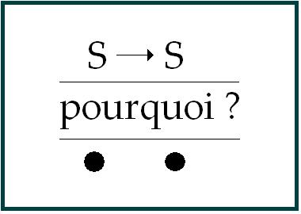
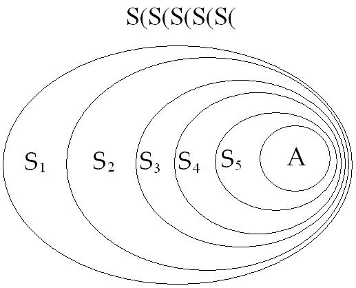
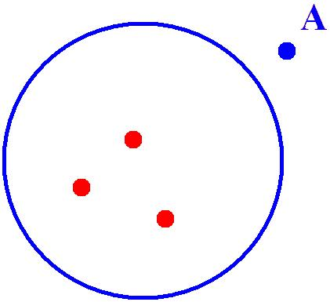
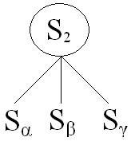
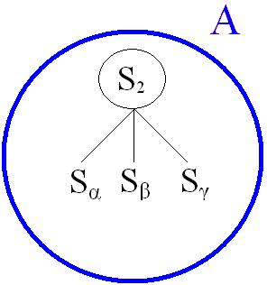
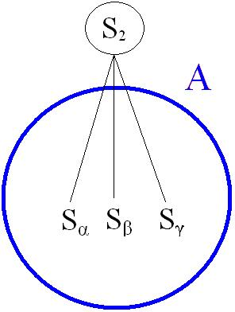

# Leçon 04 | 04 Décembre 1968

<!-- source-url: http://staferla.free.fr/S16/S16 D'UN AUTRE... .docx -->
<!-- seminar: s16 -->
<!-- lesson: 04 -->

<!-- id: s16-04-0001 -->

Entrons dans le vif parce que nous sommes en retard et reprenons en rappelant sur quoi, en somme, se centraient nos derniers propos, sur l’Autre en somme, sur ce que j’appelle *le grand Autre.* J’ai terminé en promouvant certains schémas, avertissant *- je pense, assez -* qu’ils n’étaient pas à prendre uniquement sur leur aspect plus ou moins fascinant, mais à rapporter à *une articulation logique*, celle proprement qui se compose de *ce rapport d’un signifiant à un autre signifiant*, S1 → S2, que j’ai essayé d’articuler pour en tirer les conséquences en partant de la fonction, élaborée dans *la théorie des ensembles*, de *la paire ordonnée*.

<!-- id: s16-04-0002 -->

Du moins est-ce sur ce fondement logique que j’ai essayé la dernière fois de vous faire sentir ce *quelque chose* qui a une pointe, une pointe autour de quoi tourne l’intérêt, l’intérêt pour tous j’espère, l’intérêt qu’il y a à ce que ceci s’articule bien : que l’Autre…

<!-- id: s16-04-0003 -->

> ce grand Autre,(A) dans sa fonction telle je l’ai déjà approchée …l’Autre n’enferme nul *savoir* dont il se puisse présumer- disons - qu’il soit un jour *absolu*. Voyez-vous, là je pointe les choses vers *le futur* alors que d’ordinaire j’articule vers *le passé* : *que cette référence à l’Autre est le support erroné du savoir comme déjà là*.

<!-- id: s16-04-0004 -->

Bon alors, ici je pointe…

<!-- id: s16-04-0005 -->

> parce que tout à l’heure nous allons avoir *à le redire* …je pointe l’usage que j’ai fait de *la fonction de la paire ordonnée* parce que j’ai eu - mon Dieu - quelque chose qui peut s’appeler le bonheur de recevoir - d’une main que je regrette anonyme - un petit « *poulet* » me posant la question de m’expliquer un peu plus sur l’usage qui, sans doute, à l’auteur de ce billet semble un peu précipité, sinon abusif - il ne va peut-être même pas jusque­ là - précipité disons, de *la paire ordonnée*.

<!-- id: s16-04-0006 -->

Je ne vais pas commencer par là, mais je prends date pour dire que tout à l’heure donc, j’y reviendrai.

<!-- id: s16-04-0007 -->

Que l’Autre soit ici mis en question, voilà qui importe extrêmement à la suite de notre discours. Il n’y a dans cet énoncé…

<!-- id: s16-04-0008 -->

> disons-le d’abord : cet énoncé que l’Autre n’enferme nul *savoir* qui soit - ni déjà là, ni à venir - dans un statut d’*absolu* …il n’y a dans cet énoncé rien de subversif.

<!-- id: s16-04-0009 -->

J’ai lu quelque chose récemment quelque part, en un point idéal qui d’ailleurs restera dans son coin, si je puis dire, le terme de *subversion du savoir*. Ce terme *subversion du savoir* était là - mon Dieu - avancé plus ou moins sous mon patronage : je le regrette, car à la vérité je n’ai absolument rien avancé de tel. Et *de tels glissements* ne peuvent être considérés que comme *très regrettables* et rentrer dans cette sorte d’usage de pacotille qu’on pourrait faire de morceaux, même pas bien détachés, de mon discours, de revissage de termes que mon discours précisément n’a jamais songé à rapprocher pour les faire fonctionner sur un marché qui ne serait pas du tout heureux s’il prenait la tournure de faire usage de *colonisation universitaire*.

<!-- id: s16-04-0010 -->

Pourquoi *le savoir* serait-il *subverti* de ne pouvoir être *absolu* ? Cette prétention, où qu’elle se montre, où qu’elle se soit montrée, il faut le dire, a toujours été risible. Risible justement, nous sommes là au niveau du vif de notre sujet, je veux dire que ce re-départ pris dans *le mot d’esprit* pour autant qu’il provoque le rire, *il provoque le rire justement, en somme, en tant qu’il est proprement accroché sur la faille inhérente au savoir.*

<!-- id: s16-04-0011 -->

Si vous me permettez une petite parenthèse, j’évoquerai le premier chapitre de la troisième partie du « *Capital »,* *« La Production de la Plus­-value absolue »* et le chapitre V sur « *Le travail et sa mise en valeur ».* C’est là je crois que se trouvent quelques pages, quelque chose dont - il faut bien le dire - je n’ai pas attendu les récentes recherches sur le structuralisme de MARX pour le repérer. Je veux dire que ce vieux volume que vous voyez là plus ou moins se détacher en morceaux, je me souviens du temps où je le lisais dans ce qui était mon véhicule d’alors, quand j’avais une vingtaine d’années, à savoir le métro, quand je me rendais à l’hôpital, et alors là, il y a quelque chose qui m’avait retenu et frappé.

<!-- id: s16-04-0012 -->

C’est à savoir comment MARX, au moment où cette *plus-value* il l’introduit…

<!-- id: s16-04-0013 -->

> il l’introduit un peu plus, un peu plus­-value, il ne l’introduisait pas : « *ni plus, ni value, je t’embrouille* » mais il l’introduit …et il l’introduit après un temps pris - un temps pris comme ça, l’air bonhomme - où il laisse la parole à l’intéressé, c’est-à-dire au capitaliste. Il lui laisse en quelque sorte justifier sa position par ce qui est alors le thème : le service en quelque sorte rendu de mettre à la disposition de cet homme…

<!-- id: s16-04-0014 -->

> qui n’a - mon Dieu - que son travail, et tout au plus un instrument rudimentaire, sa varlope …le tour et la fraiseuse grâce à quoi il va pouvoir faire des merveilles… échange de bons services et même loyaux.

<!-- id: s16-04-0015 -->

Tout un discours que MARX lui laisse prendre son temps pour le développer, et ce qu’il signale…

<!-- id: s16-04-0016 -->

> ce qui m’avait frappé alors, au temps de ces bonnes vieilles lectures …c’est qu’il pointe là que le capitaliste - personnage fantômal auquel il s’affronte - *le capitaliste rit*.

<!-- id: s16-04-0017 -->

C’est là un trait qui semble superflu. Il me paraît pourtant, il m’apparut dès lors que ce rire est proprement ce qui se rapporte à ce qu’à ce moment-là MARX dévoile, à savoir ce qu’il en est de l’essence de cette *plus- value*.

<!-- id: s16-04-0018 -->

« *Mon bon apôtre* - lui dit-il - *cause toujours, du service comme tu l’entends, si tu veux, de cette mise à la disposition de celui qui peut travailler, du moyen que tu te trouves détenir, mais ce dont il s’agit, c’est que ce travail, ce travail que tu vas payer pour ce qu’il fabrique avec ce tour* *et sa fraiseuse, tu ne lui payeras pas plus cher que ce qu’il ferait avec la varlope que j’ai évoquée tout à l’heure, c’est-à-dire ce qu’il s’assurerait* *par le moyen de sa varlope, à savoir sa subsistance.* »

<!-- id: s16-04-0019 -->

Ce qui est mis en relief au passage, et bien sûr *non noté*, de la conjonction du *rire* avec ce rapport…

<!-- id: s16-04-0020 -->

- ce rapport qui est là dans un plaidoyer qui n’a l’air de rien que du discours le plus honnête,

<!-- -->

<!-- id: s16-04-0021 -->

- ce rapport avec cette fonction radicalement éludée, dont déjà dans notre discours j’ai suffisamment indiqué le rapport propre avec cette *élision caractéristique* en tant qu’elle constitue proprement *l’objet(a)* …c’est là *toujours*…

<!-- id: s16-04-0022 -->

> je le dis de ne l’avoir pu, au temps où je commençais sur le *mot d’esprit* de construire *le graphe* …c’est là le rapport foncier autour de quoi tourne *toujours* le sursaut, le choc, l’« *un peu plus* », l’« *un peu moins* » dont je parlais tout à l’heure, le « *tour de passe-passe* », le « *passez muscade* », qui nous saisit au ventre dans l’effet du mot d’esprit.

<!-- id: s16-04-0023 -->

En somme, la fonction radicale, essentielle, de la relation qui se cache dans un certain rapport de la production au travail, est bien, comme vous le voyez… là comme ailleurs, en un autre point plus profond qui est celui où j’essaie de vous mener …autour du *plus de jouir* il y a quelque chose comme d’un *gag* foncier qui tient, à proprement parler, à ce joint où nous avons à enfoncer notre coin quand il s’agit de ce rapport qui joue dans *l’expérience de l’inconscient* dans sa fonction la plus générale.

<!-- id: s16-04-0024 -->

Ce n’est pas dire…

<!-- id: s16-04-0025 -->

> et là encore je vais reprendre quelque chose qui pourrait servir à des formules scabreuses …ce n’est pas dire qu’il puisse d’aucune façon y avoir théorie de l’inconscient de par là même. Faites-moi confiance, *ce n’est rien de tel à quoi je vise *: qu’il y ait théorie *de la pratique psychanalytique* : assurément, *de l’inconscient* : non. Sauf à vouloir faire verser ce qu’il en est de cette théorie de la pratique psychanalytique, qui de l’inconscient nous donne ce qui peut en être pris dans le champ de cette pratique, mais rien d’autre.

<!-- id: s16-04-0026 -->

Parler de théorie de l’inconscient, c’est vraiment ouvrir la porte à cette sorte de déviation bouffonne que j’espère barrer qui est celle qui s’est étalée déjà, de longues années, sous le terme de « *psychanalyse appliquée* », qui a permis toutes sortes d’abus, de l’appliquer précisément - à quoi ? - aux beaux-arts notamment ! Bref, je ne veux pas insister plus vers *cette forme* *de bascule ou de déversement sur le bord de la route analytique*, celle qui aboutit à un trou que je trouve déshonorant. Reprenons.

<!-- id: s16-04-0027 -->

L’Autre ne donne que l’étoffe du sujet, soit sa topologie ou ce par quoi le sujet introduit une subversion - certes - mais qui n’est pas seulement la sienne au sens où je l’ai épinglée quand j’ai parlé de *subversion du sujet*. *Subversion du sujet* par rapport à ce qu’on en a *énoncé* jusqu’alors, tel est bien ce que veut dire cette articulation dans le titre où je l’ai mise, mais la subversion dont il s’agit c’est celle que le sujet - certes - introduit, mais dont *se serre* le *Réel* qui, dans cette perspective, se définit comme *l’impossible*. Or, *il n’y a de sujet*, au point précis où il nous intéresse, *il n’y a de sujet que d’un dire*.

<!-- id: s16-04-0028 -->

Si je pose ces deux références : *celle au Réel* et *celle au dire* c’est bien pour marquer que c’est là que vous pouvez *vaciller* encore, et poser la question par exemple : si ce n’est pas là de toujours ce qui s’est imaginé du sujet. C’est bien aussi là qu’il vous faut saisir ce que le terme de sujet énonce, pour autant que de ce dire il est l’effet, la dépendance : *il n’y a de sujet que d’un dire*, c’est là ce que nous avons à *serrer* correctement pour n’en point détacher le sujet.

<!-- id: s16-04-0029 -->

Dire d’autre part que *le Réel c’est l’impossible*, c’est aussi énoncer que c’est seulement *ce serrage* le plus extrême du *dire* en tant que c’est l’*impossible* qu’il introduit et non simplement qu’il énonce. La faille reste sans aucun doute - pour certains - que ce sujet serait alors, en quelque sorte, sujet valant de ce discours, qu’il ne serait là que déploiement, chancre croissant au milieu du monde où se ferait cette jonction qui - ce sujet - tout de même le fait vivant.

<!-- id: s16-04-0030 -->

*Ce n’est pas n’importe quoi*, dans les choses*,* *qui fait sujet*. C’est là qu’il importe de reprendre les choses au point où nous ne versions pas dans la confusion au niveau de ce que nous disons, celle qui permettrait de *restaurer ce sujet comme sujet pensant*.

<!-- id: s16-04-0031 -->

Quelque *pathos* que ce soit - du signifiant j’entends, de par le signifiant - ce *pathos* ne fait pas sujet de lui-même.

<!-- id: s16-04-0032 -->

Ce que définit ce *pathos* c’est dans chaque cas, tout simplement, ce qu’on appelle un fait et c’est là que se situe l’écart où nous avons à interroger ce que produit notre expérience : *quelque chose d’autre*, et qui va bien plus loin, *que l’être qui parle* en tant que c’est l’homme dont il s’agit.

<!-- id: s16-04-0033 -->

L’effet du signifiant, plus d’une chose en est passible, tout ce qui est au monde qui ne devient proprement « fait » qu’à ce que le signifiant s’en articule : [*oncques*](http://www.cnrtl.fr/definition/oncques) *jamais ne vient quelque sujet qu’à ce que le fait soit dit*.

<!-- id: s16-04-0034 -->

*Entre ces deux frontières*, c’est là que nous avons à travailler.

<!-- id: s16-04-0035 -->

*Ce qui du « fait » ne peut se dire, est désigné - mais dans le dire - par son manque, et c’est cela la vérité*.

<!-- id: s16-04-0036 -->

C’est pourquoi *la vérité* toujours s’insinue…

<!-- id: s16-04-0037 -->

> *mais peut s’inscrire aussi de façon parfaitement calculée* …là où seulement elle a sa place : entre les lignes.

<!-- id: s16-04-0038 -->

*Sa substance à la vérité, est justement ce qui pâtit du signifiant.*

<!-- id: s16-04-0039 -->

Ça va loin. Ce qui en pâtit de sa nature. Disons, quand je dis que cela va loin, cela va justement fort loin dans la nature.

<!-- id: s16-04-0040 -->

Longtemps on sembla accepter ce que l’on appelait « *l’Esprit »*…

<!-- id: s16-04-0041 -->

> c’est une idée qui *a passé un tant soit peu*, rien ne passe jamais tant qu’on le croit d’ailleurs, enfin *elle a passé un peu* …de ce qu’il s’avère qu’il ne s’agit sous ce nom d’*Esprit*, jamais que du *signifiant* lui-même, ce qui évidemment met en porte-à-faux pas mal de la métaphysique. Sur les rapports de notre effort avec la métaphysique, sur ce qu’il en est d’une mise en question qui tend à n’en pas perdre tout bénéfice de son expérience, à la métaphysique, il en reste quelque chose, à savoir ceci qui est bien dans un certain nombre de points, de zones plus variées ou plus fournies qu’on ne le dirait au premier abord et de qualités fort diverses : il s’agit de savoir ce que ce qu’on appelle « *structuralisme* » a à opérer.

<!-- id: s16-04-0042 -->

La question est soulevée dans un recueil qui vient de paraître… j’en ai eu les prémices, je ne sais s’il est encore en circulation … « *Qu’est-ce que le structuralisme* [^15] *?* » que nous devons aux rappels battus auprès de certains par notre ami François WAHL.

<!-- id: s16-04-0043 -->

Je vous conseille de ne pas le manquer, il met un certain nombre de questions au point.

<!-- id: s16-04-0044 -->

Mais assurément, c’est dire qu’il est assez important de marquer notre distinction de la métaphysique. À la vérité, avant de la marquer il n’est pas inutile d’énoncer qu’il ne faut pas trop en croire de ce qui s’affiche comme désillusion.

<!-- id: s16-04-0045 -->

La désillusion de l’esprit n’est pas complet triomphe si elle soutient ailleurs la superstition qui désignerait dans une idéalité de la matière cette substance même, impassible, qu’on mettait d’abord dans l’esprit.

<!-- id: s16-04-0046 -->

Nous l’appelons superstition parce qu’après tout on peut bien faire sa généalogie. Il y a une tradition - *la tradition juive, curieusement* - où l’on peut bien mettre en relief ce qu’une certaine transcendance de la matière peut devoir esquisser, ce qui s’énonce dans les Écritures, singulièrement inaperçu bien entendu, mais tout à fait en clair concernant *la Corporéité de Dieu*.

<!-- id: s16-04-0047 -->

C’est des choses sur lesquelles nous ne pouvons pas aujourd’hui nous étendre. C’était un chapitre de mon séminaire sur *Le Nom du Père,* qui comme vous le savez… \[*geste d’une croix dans l’air*\] …sur lequel j’ai fait une croix, c’est le cas de le dire.

<!-- id: s16-04-0048 -->

Mais enfin, *cette superstition dite « matérialiste »* - *on a beau ajouter « vulgaire » cela ne change rien du tout -* elle mérite la cote d’amour dont elle bénéficie auprès de tous, pour ce qu’elle est bien ce qu’il y a eu de plus tolérant jusqu’à présent à *la pensée scientifique.* Mais faut pas croire que ça durera toujours. Il suffirait que la pensée scientifique donne un peu à souffrir de ce côté-là \- et ce n’est point impensable - pour que ça ne dure pas, la tolérance en question !

<!-- id: s16-04-0049 -->

Susceptibilité qu’on évoque déjà envers - mon Dieu - des remarques comme celle que je fis un jour devant un honorable membre de *l’Académie des Sciences de l’U.R.S.S.* : que « *cosmonaute* » me paraissait une mauvaise dénomination, parce qu’à la vérité, rien ne me paraissait moins cosmique que le trajet qui était son support.

<!-- id: s16-04-0050 -->

Une espèce de trouble, d’agitation pour un propos - mon Dieu - si gratuit, la résistance à proprement parler inconsidérée, qu’il n’est pas sûr, après tout - c’est tout ce que je voulais dire - que quoi que ce soit, que vous l’appeliez « *Dieu* » au sens de l’Autre, ou « *la Nature* », ce n’est pas *la même chose* mais c’est bien à un de ces deux côtés qu’il faudrait réserver, attribuer une connaissance préalable de la loi newtonienne, pour qu’on pût, à proprement parler, parler de *cosmos* et de *cosmonaute*.

<!-- id: s16-04-0051 -->

C’est là qu’on sent ce qui continue de s’abriter d’*ontologie métaphysique*, même dans les lieux les plus inattendus.

<!-- id: s16-04-0052 -->

Ce qui nous importe est ceci, qui justifie la règle dont s’instaure la pratique psychanalytique, tout bêtement, celle dite d’« *association libre* ». *Libre* ne veut rien dire d’autre que congédiant le sujet. *Congédier* le sujet c’est une opération, une opération qui n’est pas obligatoirement réussie, il ne suffit pas toujours de *donner congé* à quiconque pour qu’il s’en aille.

<!-- id: s16-04-0053 -->

Ce qui justifie cette règle c’est que la vérité, précisément, ne se dit pas par un sujet mais se souffre.

<!-- id: s16-04-0054 -->

Épinglons là quelque chose de ce que nous appellerons « l’infatuation phénoménologique ».

<!-- id: s16-04-0055 -->

J’ai déjà relevé un de ces menus monuments qui s’étalent dans un champ où les énoncés prennent volontiers « patente » de l’ignorance : *Essence de la Manifestation*[^16]*,* tel est le titre d’un livre combien bien accueilli dans le champ universitaire, dont après tout je n’ai point raison de dire l’auteur puisque je suis en train de le qualifier de fat.

<!-- id: s16-04-0056 -->

*Essence de sa manifestation à lui* en tout cas, à ce titre que la puissance avec laquelle à telle page est articulé que quelque chose nous est donné comme certitude, c’est que *la souffrance*, elle, *n’est rien d’autre que la souffrance*.

<!-- id: s16-04-0057 -->

Je sais, en effet cela vous fait quelque chose toujours quand on vous dit ça !

<!-- id: s16-04-0058 -->

*Il suffit d’avoir eu un mal de dent et n’avoir jamais lu Freud pour trouver cela assez convaincant.*

<!-- id: s16-04-0059 -->

Voilà après tout pourquoi on peut penser incidemment…

<!-- id: s16-04-0060 -->

> mais là vraiment je crois que je suis moi aussi un peu traditionnel …en quoi on peut rendre grâce à de tels « *pas de clercs* » - c’est le cas de le dire, de les appeler comme ça - de promouvoir, si on peut dire, l’«* à ne pas dire* » *pour qu’on puisse bien marquer la différence de ce qu’il y a à dire vraiment*.

<!-- id: s16-04-0061 -->

C’est un petit peu trop de justification donnée à l’erreur et c’est bien pourquoi je signale au passage qu’à dire ceci, je n’y adhère pas entièrement. Mais pour cela, mon Dieu, il faudrait que je rétablisse ce dont il s’agit dans une apologie des sophistes, et Dieu sait où cela nous entraînerait.

<!-- id: s16-04-0062 -->

Quoi qu’il en soit, la différence est ceci : si ce que nous faisons - nous analystes - opère, c’est justement de ceci que *la souffrance n’est pas la souffrance* et que pour *dire ce qu’il faut dire*, il faut dire « *la souffrance est un fait* ». Ça a l’air de dire *presque pareil*, mais ce n’est pas *du tout pareil*, tout au moins si vous avez bien entendu ce que je vous ai dit tout à l’heure de ce que c’est qu’un fait. \[Cf. supra : « *oncques jamais ne vient quelque sujet qu’à ce que le fait soit dit*. »\]

<!-- id: s16-04-0063 -->

Plutôt - soyons plus modeste - « *Il y a de la souffrance qui est fait* » c’est-à-dire qui recèle un *dire*. C’est par cette ambiguïté que se réfute qu’elle soit indépassable dans sa manifestation : que la souffrance peut être *symptôme*, ce qui veut dire *vérité*.

<!-- id: s16-04-0064 -->

*Je fais dire à la souffrance*, comme *j’ai fait dire à la vérité* dans une première approche - il faut tempérer les effets du discours - je leur ai fait dire - quoiqu’en des termes pour l’une ou l’autre modulés pas du même ton - « *je parle* »*.*

<!-- id: s16-04-0065 -->

Je l’évoque pour y être récemment revenu. Tâchons dans notre avance d’être plus rigoureux.

<!-- id: s16-04-0066 -->

La souffrance a son langage et c’est bien malheureux que n’importe qui puisse le dire sans savoir ce qu’il dit.

<!-- id: s16-04-0067 -->

Mais enfin, ça c’est précisément l’inconvénient de tout discours, c’est qu’à partir du moment où il s’énonce rigoureusement, comme *le vrai discours est un discours sans paroles* - comme je l’ai écrit cette année en frontispice - *n’importe qui* peut le répéter après que vous l’ayez tenu. Cela n’a pas plus de conséquences. Voilà un des côtés scabreux de la situation.

<!-- id: s16-04-0068 -->

Laissons donc de côté *la souffrance* et pour *la vérité* précisons ce que nous allons avoir dans la suite à focaliser.

<!-- id: s16-04-0069 -->

*La vérité, elle parle*, essentiellement *elle parle* « *je* ». Et vous voyez là définis deux champs limites :

<!-- id: s16-04-0070 -->

- celui où le sujet ne se repère que d’être *effet du signifiant*, celui où il y a *pathos du signifiant* sans aucun arrimage encore fait - dans notre discours - au sujet : le champ du fait,

<!-- id: s16-04-0071 -->

- et puis ce qui enfin nous intéresse et qui n’a même pas été effleuré ailleurs que sur le Sinaï, à savoir *ce qui parle* « *je* ».

<!-- id: s16-04-0072 -->

*Sur le Sinaï*, je m’excuse, il vient de me sortir d’entre les jambes. Je ne voulais pas me ruer sur *le Sinaï* mais puisqu’il vient de sortir il faut bien que je justifie pourquoi. Il y a un bout de temps, tout autour de cette petite faille de mon discours qui s’appelait *Le Nom du Père -* et qui reste béante - j’avais commencé d’interroger la traduction d’un certain… je ne prononce pas bien l’hébreu …אֶהְיֶה אֲשֶׁר אֶהְיֶה \[Eyé asher eyé\]. Je crois que ça se prononce *éyé acher éyé*. Ce que des métaphysiciens, les penseurs grecs, ont traduit par : « *Je suis celui qui est*. »

<!-- id: s16-04-0073 -->

Bien sûr, il leur fallait de l’être. Seulement, ça ne veut pas dire ça. Il y a des moyens termes, je parle de gens qui traduisent : «* Je suis celui qui suis.* », ça ne veut rien dire, mais ça a la bénédiction romaine. J’ai fait observer, je croyais qu’il fallait entendre :

<!-- id: s16-04-0074 -->

> «* Je suis ce que je suis.* »

<!-- id: s16-04-0075 -->

En effet, ça a tout au moins une valeur de coup de poing dans la figure. Vous me demandez mon nom, je réponds

<!-- id: s16-04-0076 -->

«* Je suis ce que je suis.* » et allez vous faire foutre. C’est bien ce que fait le peuple juif depuis ce temps.

<!-- id: s16-04-0077 -->

Puisque *le Sinaï* m’est ressorti à propos de *la vérité qui parle « je »*, *le Sinaï* - mais j’ai déjà repensé à la question - je ne croyais pas vous en parler aujourd’hui, mais enfin puisque c’est fait allons-y. Je crois qu’il faut traduire : «* Je suis ce que «  je » est.* »

<!-- id: s16-04-0078 -->

C’est pour ça que le Sinaï m’est ressorti comme ça. C’est pour vous illustrer ce que j’entends interroger autour de *ce qu’il en est du* « *je* », en tant que *la vérité parle « je »*. Naturellement, le bruit se répandrait à Paris, dans les petits cafés où se tiennent les *pia-pia-pia*, que - comme PASCAL - j’ai fait le choix « *du Dieu d’Abraham, d’Isaac et de Jacob* ».

<!-- id: s16-04-0079 -->

Que les âmes - de quelque côté qu’elles soient portées à accueillir cette nouvelle - remettent leurs mouvements dans le tiroir : *la vérité parle « je »*, mais la réciproque n’est pas vraie, tout ce qui parle « *je* » n’est pas la vérité, où irions-nous sans ça ?

<!-- id: s16-04-0080 -->

Ceci ne veut pas dire que ces propos soient là complètement superflus. Parce qu’entendez bien qu’en mettant en question la fonction de l’Autre - et sur le principe de sa topologie même - ce que j’ébranle…

<!-- id: s16-04-0081 -->

> ce n’est pas une trop grande prétention, c’est vraiment la question à l’ordre du jour …c’est proprement *ce que Pascal appelait* « *le Dieu des Philosophes* ».

<!-- id: s16-04-0082 -->

Or, cela, le mettre en question, c’est pas rien !

<!-- id: s16-04-0083 -->

Parce que tout de même, jusqu’à présent il a la vie dure, et sous le mode où tout à l’heure j’y ai fait allusion.

<!-- id: s16-04-0084 -->

Il reste tout de même bien présent à un tas de modes de transmission de ce savoir dont je vous dis qu’il n’est pas du tout subverti, même - *et bien plus encore* - à mettre en question cet Autre censé pouvoir le *totaliser*.

<!-- id: s16-04-0085 -->

C’était le sens de ce que j’ai abordé la dernière fois.

<!-- id: s16-04-0086 -->

Par contre, qu’il ait dit vrai ou non, l’autre Dieu…

<!-- id: s16-04-0087 -->

> dont il faut rendre hommage à notre PASCAL d’avoir vu qu’il n’a strictement rien à faire avec l’autre …celui qui dit « *Je suis ce que «  je » est.* », que cela se soit dit a eu quelques conséquences et je ne vois pas pourquoi, même sans y voir la moindre chance de vérité, nous ne nous éclairerions pas de certaines de ces conséquences pour savoir ce qu’il en est de *la vérité* en tant qu’elle parle « *je* ».

<!-- id: s16-04-0088 -->

Une petite chose intéressante par exemple, c’est de nous apercevoir que puisque *la vérité parle « je »* *et que la réponse s’y donne dans notre interprétation*, pour les psychanalystes c’est une occasion de noter que *de l’interprétation, nous n’en avons pas le privilège*. C’est quelque chose dont j’ai déjà parlé en son temps sous le titre *Le Désir et son interprétation* [^17].

<!-- id: s16-04-0089 -->

J’ai fait remarquer qu’à poser ainsi autour du « *je* » la question, nous devons…

<!-- id: s16-04-0090 -->

> ne fut­-ce que pour en prendre avertissement - voire ombrage …nous apercevoir que dès lors, l’*interprétation* doit être mieux cernée puisque *le prophétisme* ça n’est rien d’autre : parler « *je* » dans un certain sillage qui n’est pas celui de notre souffrance, c’est aussi de l’*interprétation*.

<!-- id: s16-04-0091 -->

Le sort de l’Autre est donc suspendu…

<!-- id: s16-04-0092 -->

- je ne dirai pas à la question,

<!-- id: s16-04-0093 -->

- je ne dirai pas à ma question …à la question que pose l’expérience psychanalytique.

<!-- id: s16-04-0094 -->

Le drame est que quel que soit le sort que lui réserve cette *mise en question*, ce que la même expérience démontre c’est que *c’est de son désir à l’Autre que je suis -* dans les deux sens merveilleusement homonymiques en français de ces deux mots – *que je suis la trace.* C’est d’ailleurs précisément en cela, qu’au sort de l’Autre je suis intéressé.

<!-- id: s16-04-0095 -->

Alors, il nous reste un quart d’heure et le petit mot que j’ai reçu commence ainsi : « *Mercredi dernier vous avez mis en rapport,sans préciser : « la paire ordonnée » et « un signifiant représente le sujet pour un autre signifiant ».* »* *

<!-- id: s16-04-0096 -->

C’est tout à fait vrai. C’est pour ça que - sans doute - mon correspondant a mis dessous une barre, et au­ dessous de la barre : «* pourquoi ? *» avec un point d’interrogation. En-dessous de «* pourquoi ? *» une autre barre, puis, marqué par deux gros points ou plus exactement deux petits cercles remplis de noir :

<!-- id: s16-04-0097 -->

> «* Quand la paire ordonnée est introduite en mathématique, il faut un coup de force pour la créer.* »

<!-- id: s16-04-0098 -->

<!-- id: s16-04-0099 -->

À ceci, je reconnais que la personne qui m’a envoyé ce papier sait ce qu’elle dit, c’est-à-dire qu’elle a au moins une ombre \- qui est probablement plus encore - d’instruction mathématique. C’est tout à fait vrai. On commence par articuler la fonction de ce que c’est qu’un ensemble et si on n’y introduit pas - en effet - *la fonction de la paire ordonnée* par cette sorte de *coup de force* qu’on appelle en logique *un axiome*, eh bien, il n’y a rien de plus à en faire que ce que vous avez d’abord défini comme ensemble. Entre parenthèses, ajoute-t-on : « *soit direct, soit indirect, l’ensemble a deux éléments. Le résultat de ce coup de force est de créer un signifiant* *qui remplace la coexistence de deux signifiants.* »*.*

<!-- id: s16-04-0100 -->

C’est tout à fait exact. Deuxième remarque : « *La paire ordonnée détermine ces deux composants, tandis que dans la formule « un signifiant représente le sujet* *pour un autre signifiant » il serait étonnant qu’un sujet détermine deux signifiants.* »

<!-- id: s16-04-0101 -->

Je n’ai plus qu’un quart d’heure et pourtant j’espère avoir le temps d’éclairer comme il faut - car ce n’est pas difficile - ce que j’ai énoncé la dernière fois, qui prouve que je ne l’ai pas suffisamment bien énoncé puisque quelqu’un, en ces termes - comme vous le voyez - des plus sérieux, m’interroge. Je vais donc écrire au tableau.

<!-- id: s16-04-0102 -->

À aucun moment je n’ai *subsumé* dans un sujet la coexistence de deux signifiants.

<!-- id: s16-04-0103 -->

Si j’introduis *la paire ordonnée* qui - comme le sait sûrement mon interlocuteur - s’écrit par exemple ainsi : \< S1, S2 \>.

<!-- id: s16-04-0104 -->

Ces deux signes…

<!-- id: s16-04-0105 -->

> qui se trouvent - par un bon hasard - être les deux morceaux de mon *poinçon* quand ils se rejoignent …ces deux signes ne servent dans l’occasion qu’à très précisément écrire que ceci est paire ordonnée.

<!-- id: s16-04-0106 -->

### La traduction sous forme d’*ensemble*…

<!-- id: s16-04-0107 -->

> je veux dire articulé dans le sens du bénéfice qu’on attend du coup de force en question …c’est de traduire ceci dans *un ensemble* dont *les deux éléments*…

<!-- id: s16-04-0108 -->

> *et les éléments dans un ensemble étant toujours eux-mêmes ensemble, vous voyez se répéter le signe de la parenthèse* …sont : {{S1},{S1,S2}}.

<!-- id: s16-04-0109 -->

Une paire ordonnée est un *ensemble* qui a deux éléments :

<!-- id: s16-04-0110 -->

- un *ensemble* formé du premier élément de la paire : {S1}

<!-- id: s16-04-0111 -->

- Le deuxième élément de cet *ensemble* est : {S1,S2}.

<!-- id: s16-04-0112 -->

Ce sont donc l’un et l’autre des *sous-ensembles* formés des deux éléments de la paire ordonnée.

<!-- id: s16-04-0113 -->

*Loin que le sujet ici d’aucune façon subsume les deux signifiants* en question, vous voyez - je suppose - combien il est aisé de dire :

<!-- id: s16-04-0114 -->

- que le signifiant, S1 ici, ne cesse de représenter le sujet comme ma définition - *le signifiant représente un sujet* *pour un autre signifiant* - l’articule,

<!-- id: s16-04-0115 -->

- cependant que le second sous-ensemble présentifie ce que mon correspondant appelle cette « *coexistence* », c’est-à-dire dans sa forme la plus large cette forme de relation qu’on peut appeler « *savoir* ».

<!-- id: s16-04-0116 -->

La question que je pose à ce propos et sous sa forme la plus radicale, si *un savoir* est concevable qui réunisse cette conjonction des deux *sous-ensembles* en un seul, d’une façon telle qu’ils puissent être sous le nom de A, du grand Autre, identiques à la conjonction telle qu’elle est ici articulée en *un savoir* des deux signifiants en question.

<!-- id: s16-04-0117 -->

C’est pourquoi après avoir épinglé du signifiant A, *un ensemble de* S, fait que je n’ai plus besoin de mettre 1,2…, puisque j’ai substitué à {S1 S2} : A, j’ai interrogé ce qui s’en suivait de la topologie de l’Autre.

<!-- id: s16-04-0118 -->

Et c’est à cette suite que je vous ai montré…

<!-- id: s16-04-0119 -->

> d’une façon certes trop figurée pour être logiquement pleinement satisfaisante, mais dont la nécessité
>
> de *figure* me permettait de vous dire que *cette suite de cercles* s’involuant d’une façon dissymétrique, c’est-à-dire maintenant toujours à mesure de leur plus grande apparente intériorité la subsistance de A …mais en tant que cette figuration suggérait une *topologie* qui est celle grâce à quoi le plus petit des cercles venait se conjoindre au plus grand sur cette figure.

<!-- id: s16-04-0120 -->

Et la topologie suggérée par une figuration semblable, en faire l’index de ceci : que le grand A …

<!-- id: s16-04-0121 -->

> si nous le définissons comme s’incluant possiblement, c’est-à-dire devenu *savoir absolu* …a cette conséquence singulière que ce qui représente le sujet ne s’y inscrit, ne s’y manifeste que sous la forme d’une répétition infinie, comme vous l’avez vu s’inscrire sous la forme de ce S, grand S, dans la série de parois du cercle où ils s’inscrivent indéfiniment.

<!-- id: s16-04-0122 -->

<!-- id: s16-04-0123 -->

*Le sujet* ainsi, *de ne s’inscrire que comme répétition de soi-même infinie, s’y inscrit* d’une façon telle qu’il est très précisément *exclu*…

<!-- id: s16-04-0124 -->

> *et non pas d’un rapport qui soit d’intérieur ni d’extérieur* …de ce qui est posé d’abord comme *savoir absolu*. Je veux dire qu’il y a là quelque chose qui rend compte, dans la structure logique, de ce que la théorie freudienne implique de fondamental dans le fait qu’originellement le sujet, au regard de ce qui le rapporte à quelque chute de la jouissance, ne saurait se manifester que comme répétition et *répétition inconsciente*.

<!-- id: s16-04-0125 -->

C’est donc une des limites autour de quoi s’articule le lien du maintien de la référence au *savoir absolu*, au *sujet supposé savoir,* comme nous l’appelons dans le transfert avec cet index de la nécessité répétitive qui en découle qu’est logiquement *l’objet petit(a)*, *l’objet petit(a)* en tant qu’ici l’index en est représenté par ces cercles concentriques.

<!-- id: s16-04-0126 -->

Par contre, ce sur quoi j’ai terminé la dernière fois est l’autre bout de l’interrogation que nous avons à poser au grand A, au grand Autre pour autant que nous lui imposerions la condition de ne pas se contenir lui-même.

<!-- id: s16-04-0127 -->

Le grand A ne contient que des S1, S2, S3… qui tous sont distincts de ce que grand A représente comme signifiant.

<!-- id: s16-04-0128 -->

Est-il possible que sous cette autre forme le sujet puisse se subsumer d’une façon qui, sans rejoindre l’ensemble ainsi défini comme « *univers du discours* », pourrait être sûr d’y rester inclus ?

<!-- id: s16-04-0129 -->

C’est le point sur lequel peut-être suis-je passé un peu vite et c’est pourquoi, pour terminer aujourd’hui, j’y reviens.

<!-- id: s16-04-0130 -->

<!-- id: s16-04-0131 -->

La définition d’un ensemble en tant qu’il joint des éléments, veut dire qu’est défini *ensemble* tout point à quoi plusieurs autres se rattachent…

<!-- id: s16-04-0132 -->

> je prends le point parce qu’il n’y a pas de façon plus sensible de figurer l’élément comme tel …ces *points* \[●\] par exemple sont, par rapport à celui-ci \[●\], éléments de l’ensemble que ce quatrième point \[●\] peut figurer à partir simplement du moment où nous le définissons comme élément.

<!-- id: s16-04-0133 -->

À l’intérieur donc, du grand Autre, où ne figurera aucun A comme élément, puis-je définir le sujet sous cette forme ultra simple qu’il est précisément constitué - ce qui semble être exhaustif - par tout signifiant en tant qu’il n’est pas élément de lui-même, c’est-à-dire que *ni* S1*, ni* S2*, ni* S3, ne sont *signifiants* semblables au *grand* A, que *grand* A est leur A*utre* à tous ?

<!-- id: s16-04-0134 -->

Vais-je, comme sujet du *dire*…

<!-- id: s16-04-0135 -->

> à simplement émettre cette proposition que S, un signifiant quelconque, Sq voulant dire quelconque,
>
> n’est pas élément de lui-même …vais-je pouvoir ainsi *rassembler* *quelque chose* qui sera ce point là \[●\], à savoir *l’ensemble qui conjoint tous les signifiants ainsi définis*, je l’ai dit, *par un dire* ?

<!-- id: s16-04-0136 -->

Ceci est essentiel pour vous à retenir pour la suite car ce « *par un dire* » autrement dit : proposition, ce autour de quoi il faut faire tourner d’abord la fonction du sujet pour en saisir la faille, car quelque usage que vous donniez ensuite à *une énonciation*, même son usage de demande, c’est d’avoir marqué ce que comme simple *dire* elle démontre de faille, que vous pourrez le plus correctement, dans la faille de la demande, cerner dans l’énonciation de la demande ce qu’il en est de la faille du désir.

<!-- id: s16-04-0137 -->

Le structuralisme c’est la logique partout. Ce qui veut dire, même au niveau où vous pouvez interroger le désir, et Dieu sait bien sûr qu’il y en a plus d’une façon :

<!-- id: s16-04-0138 -->

- il y a des types qui brament,

<!-- id: s16-04-0139 -->

- il y a des types qui clament,

<!-- id: s16-04-0140 -->

- des *typesses* qui drament hein ?

<!-- id: s16-04-0141 -->

Et ça vaut ! Simplement vous ne saurez jamais rien de ce que ça veut *dire* pour la simple raison que le désir *ça ne peut se dire*.

<!-- id: s16-04-0142 -->

Du *dire* il n’est que la *désinence* et c’est pourquoi cette *désinence* doit d’abord être serrée dans le pur *dire*, là où seul l’appareil logique peut en démontrer *la faille*.

<!-- id: s16-04-0143 -->

Or, il est clair que ce qui, ici, aurait le rôle du deuxième signifiant, par essence… ici je les ai appelés Sα, Sβ, Sγ …ce deuxième signifiant, le sujet en tant qu’il est *le sous-­ensemble* de tous les signifiants en tant qu’ils ne sont pas éléments d’eux–mêmes, en tant que A n’est pas A, qu’allons-nous pouvoir en dire ?

<!-- id: s16-04-0144 -->

Nous avons posé comme condition…

<!-- id: s16-04-0145 -->

> prenons ici pour être simple les lettres auxquelles vous êtes déjà le plus habitués …à savoir « *X n’est pas élément de X* » pour que quelque chose s’inscrive sous la rubrique de S2 : le sous-ensemble formé par ce signifiant auprès de qui va être représenté par tous les autres le sujet, c’est-à-dire justement celui qui le subsume comme sujet. Il faut pour que X, *quel qu’il soit*, soit *élément* de S2 ceci :

<!-- id: s16-04-0146 -->

- première condition, que X ne soit pas élément de X,

<!-- id: s16-04-0147 -->

- et *secundo*, nous prenons X comme élément de A, puisque le grand A les rassemble tous.

<!-- id: s16-04-0148 -->

Alors, que va-t-il en résulter ? Ce S2 est-il élément de lui-même ?

<!-- id: s16-04-0149 -->

S’il était élément de lui-même il ne répondrait pas à la façon dont nous avons construit le sous-­ensemble des éléments en tant qu’ils ne sont pas éléments d’eux-mêmes. *Il n’est donc pas élément de lui-même*, il n’est donc pas parmi ces Sα, Sβ, Sγ, il est là où je l’ai placé en tant qu’il n’est pas élément de lui-même :

<!-- id: s16-04-0150 -->

<!-- id: s16-04-0151 -->

S2 n’est pas élément de lui-même. C’est ce que j’écris là : S2 ∉ S2.

<!-- id: s16-04-0152 -->

Supposons qu’il soit - S2 - élément de grand A, qu’est-ce que cela veut dire ?

<!-- id: s16-04-0153 -->

<!-- id: s16-04-0154 -->

C’est que S2 est élément de S2 puisque tout ce qui n’est pas *élément de soi-même*, tout en étant élément de grand A, nous l’avons défini comme faisant partie, comme constituant le *sous-ensemble* défini par X élément de S2.

<!-- id: s16-04-0155 -->

Il faut donc écrire que S2 est élément de S2, ce que nous avons repoussé tout à l’heure puisque sa définition à ce *sous-ensemble*, c’est qu’il est composé d’éléments qui ne sont point éléments d’eux-mêmes. Qu’en résulte-t-il ?

<!-- id: s16-04-0156 -->

Pour ceux qui ne sont pas habitués à ces sortes de raisonnements pourtant simples, je le figure… encore que la figuration soit ici tout à fait puérile …c’est que S2 n’étant pas élément de grand A, ne peut être figuré qu’ici, c’est-à-dire en dehors :

<!-- id: s16-04-0157 -->

<!-- id: s16-04-0158 -->

Ce qui démontre que le sujet de quelque façon qu’il entende se subsumer :

<!-- id: s16-04-0159 -->

- soit d’une première position du *grand Autre* comme s’incluant lui-même,

<!-- id: s16-04-0160 -->

- soit dans le *grand Autre* à se limiter aux éléments qui ne sont point éléments d’eux-mêmes, implique quelque chose - qui quoi ? - …

<!-- id: s16-04-0161 -->

Comment allons-nous traduire cette extériorité où je vous ai posé *le signifiant du sous-ensemble*, à savoir S2 ?

<!-- id: s16-04-0162 -->

Ceci veut dire très précisément que le sujet, au dernier terme, ne saurait être universalisé, qu’il n’y a pas de proposition qui dise d’aucune sorte, même sous la forme de ceci que le signifiant n’est pas élément de soi-même, que ce que définit ceci soit une définition englobante par rapport au sujet.

<!-- id: s16-04-0163 -->

Et ceci aussi démontre non pas que le sujet n’est point inclus dans le champ de l’Autre, mais que ce qui peut être le point où il se signifie comme sujet, est un point disons entre guillemets « *extérieur* » à l’Autre, « *extérieur* » à *l’univers du discours*.

<!-- id: s16-04-0164 -->

Dire - comme je l’ai aussi entendu répéter en écho de mon articulation - qu’« *il n’y a pas d’univers du discours* », ce qui voudrait dire qu’il n’y a pas de discours du tout, il me semble que si je n’avais pas ici soutenu un discours assez serré, c’est très précisément ce dont vous n’auriez aucune espèce d’idée.

<!-- id: s16-04-0165 -->

Que ceci vous serve d’exemple et d’appui pour notre méthode et aussi de point d’attente pour ce que la prochaine fois \- 11 Décembre - j’espère, nous réussirons à pousser plus avant de cette articulation dans ce qui nous intéresse, *non pas seulement en tant que psychanalystes vous en êtes le point vivant, mais aussi en tant que psychanalysants vous êtes à sa recherche.*

## Notes

[^15]: François Wahl : « *Qu'est-ce que le structuralisme ?* » Seuil, 1968.

[^16]: Michel Henry : « *L’essence de la Manifestation* », PUF 1963, 2ème édition : 2003, Coll. Epiméthée.

[^17]: Séminaire 1958-59 (Sainte-Anne) : « *Le Désir et son interprétation* ».
