# Leçon 09 | 29 Janvier 1969

<!-- source-url: http://staferla.free.fr/S16/S16 D'UN AUTRE... .docx -->
<!-- seminar: s16 -->
<!-- lesson: 09 -->

<!-- id: s16-09-0001 -->

Je vous ai laissés la dernière fois - avancés assez fermement dans le champ du *pari de Pascal -* au point que ponctue ce que je viens d’écrire sur le tableau, à savoir à la remarque de l’*identité essentielle* de la série dont je vous ai dit que ce n’était que d’une façon tout à fait arbitraire que nous y placions un point de départ situé entre le *a* et le 1.

<!-- id: s16-09-0002 -->

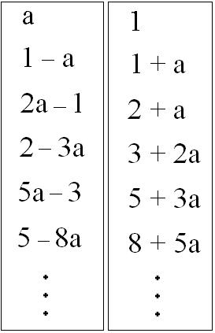

<!-- id: s16-09-0003 -->

Arbitraire prend son sens du même accent que donne à ce mot SAUSSURE quand il parle du *caractère arbitraire du signifiant*.

<!-- id: s16-09-0004 -->

Je veux dire qu’au point où nous avons placé la coupure entre une série décroissante à l’infini et une série croissante, de même nous n’avons de raison de situer ce point que d’écriture, à savoir qu’ici le 1 n’a d’autre fonction que celle *du trait, du trait unaire, du bâton, de la marque*.

<!-- id: s16-09-0005 -->

Seulement, si arbitraire que ce soit, il n’en reste pas moins que sans ce 1, ce *trait unaire*, il n’y aurait pas de série du tout.

<!-- id: s16-09-0006 -->

Tel est le sens qu’il faut donner à ce que dans SAUSSURE un auteur - sans doute hyper-compétent - déclare que je le trahis à plaisir : que sans cet arbitraire, le langage n’aurait, à proprement parler, aucun effet.

<!-- id: s16-09-0007 -->

Alors, cette série :

<!-- id: s16-09-0008 -->

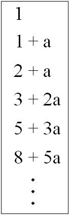

<!-- id: s16-09-0009 -->

qui se trouve être construite en ceci que *chacun de ses termes est produit par l’addition des deux termes qui le précèdent*, ce terme… \[2+a = 1+(1+a), 3+2a = (1+a)+(2+a), 5+3a = (3+2a)+(2+a),…\] …ce qui est dire la même chose que *dans l’autre sens, chacun est fait de la soustraction du plus petit des deux qui le suivent au plus grand.*

<!-- id: s16-09-0010 -->

\[1+a = (3+2a)–(2+a), 2+a = (5+3a)–(3+2a), 3+2a = (8+5a)–(5+3a),…\] …elle est aussi construite sur le principe que le rapport d’un de ses termes au suivant est égal au rapport de ce suivant, ainsi qu’il se produit à lui ajouter \[Un/Un+1 = Un+1/Un+1+Un (*sachant que* Un+Un+1 = Un+2)\] ce qui semble y ajouter *une condition seconde*.

<!-- id: s16-09-0011 -->

Poser que *a*, le terme dont je viens de parler, est égal au suivant : 1, dans son rapport à ce qui va le suivre encore, c’est–à–dire à l’addition de 1 et *a* \[ a = 1/ 1+a \] c’est ce qui *semble spécifier* cette série par une *double condition*.

<!-- id: s16-09-0012 -->

Or, c’est précisément là ce qui est erroné, comme le démontre ceci que si vous posez comme loi d’une série que chacun de ses termes soit formé de l’addition - sans doute la fonction de *l’addition* ici mériterait d’être spécifiée d’une façon plus rigoureuse mais comme il ne s’agit pas qu’ici, à ce propos, j’ai à m’étendre dans des considérations étendues sur ce qu’il en est de la théorie des groupes, nous nous en tiendrons à l’opération communément connue sous ce terme et qui est déjà, aussi bien, donnée au principe de ce que nous avons posé, au principe de cette série, la première, j’entends.

<!-- id: s16-09-0013 -->

Voici donc la série, il suffit pour la poser d’écrire que dans cette série :

<!-- id: s16-09-0014 -->

- que U0 sera égal à 1…

<!-- id: s16-09-0015 -->

- que U1 sera égal à 1, et ensuite…

<!-- id: s16-09-0016 -->

- que tout Un sera la somme de Un–1 et de Un–2.

<!-- id: s16-09-0017 -->

Cette série s’appelle la *série de Fibonacci* et vous voyez qu’elle est soumise à une condition unique.

<!-- id: s16-09-0018 -->

Ce qui va se produire dans cette série démontre qu’elle est essentiellement la même que la série posée d’abord, c’est à savoir que si vous opérez entre elles par n’importe quelle opération définie…

<!-- id: s16-09-0019 -->

> que vous *additionniez* par exemple terme à terme,
>
> que vous *les multipliiez* terme à terme aussi, par exemple, vous pouvez aussi prendre d’autres opérations …il en résultera une autre *série de Fibonacci*, c’est-à-dire que vous vous confirmerez que la loi de sa formation est exactement la même, à savoir : *qu’il suffit d’additionner deux de ses termes pour donner le terme suivant*.

<!-- id: s16-09-0020 -->

Que devient alors cette *proportion merveilleuse*, ce *a* qui *semble*, dans la série dont je suis parti, qu’on peut le *décorer* comme vous le savez de la fonction du *nombre d’or* qui *en effet* y apparaît, dès le départ sous la forme de ce *a* qui s’y manifeste de par la *position principielle* de *a* = 1 / 1 + *a*.

<!-- id: s16-09-0021 -->

Ce *petit(a)* ne nous manque pas dans la *série de Fibonacci* *quelconque*, \[ 1, 1, 2, 3, 5, 8, 13, 21, 34, 55, 89, 144, 233, 377, 610, 987, 1597, 2584, 4181, 6 765, 10 946 … \] pour la raison suivante, que si vous faites le rapport de chacun de ses termes au terme suivant, à savoir :

<!-- id: s16-09-0022 -->

- 1/1 d’abord, *que je n’ai pas écrit parce que cela ne veut rien dire* 1/1,

<!-- id: s16-09-0023 -->

- ensuite 1/2, puis 2/3, 3/5, 5/8, et ainsi de suite… …vous obtiendrez un résultat qui tend *assez vite*[^39] à inscrire les deux premières décimales, puis les trois, puis les quatre, puis les cinq, puis les six, du nombre qui correspond à ce *petit(a)*, dont peu importe qu’il s’écrive 0,618 et la suite, chose très facile à vérifier, nous savions déjà que *a* était *inférieur à l’unité*, et que l’important, c’est que nous voyons que ce *a*…

<!-- id: s16-09-0024 -->

> *et assez vite, dès qu’on s’éloigne du point de départ de la série de Fibonacci* …va s’inscrire comme *rapport d’un de ses termes au terme suivant*.

<!-- id: s16-09-0025 -->

Ceci pour démontrer qu’il n’y a dans le choix de *a*…

<!-- id: s16-09-0026 -->

> que nous avons fait précisément d’être placé devant le problème de commande figurée, ce qui se perd dans la position, dans le fait de poser le 1 inaugural réduit à sa fonction de *marque* …ce choix du *a -* lui - n’a rien d’arbitraire, pour ce qu’il est, de la même façon que la perte que nous visons…

<!-- id: s16-09-0027 -->

> celle qui, à l’horizon, à la visée de notre discours, constitue le *plus-­de-­jouir* …comme cette perte, le *a*…

<!-- id: s16-09-0028 -->

> rapport limite d’un terme de *la série de Fibonacci* à celui qui le suit …comme cette perte, le *a* n’est qu’un effet de la position du *trait unaire*.

<!-- id: s16-09-0029 -->

Au reste, si quelque chose est nécessaire à vous confirmer ceci, il suffit que vous regardiez la série décroissante telle que je l’ai inscrite - ou plutôt réinscrite, car je l’ai déjà inscrite la dernière fois à gauche - il vous suffit de voir comment elle est faite.

<!-- id: s16-09-0030 -->

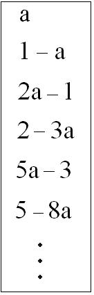

<!-- id: s16-09-0031 -->

La série des nombres qui constitue la série de FIBONACCI y apparaît d’une *façon alternante*, c’est à savoir :

<!-- id: s16-09-0032 -->

- qu’il y a ici *un a,* ici *deux a,* *trois a*, *cinq a*, *huit a,*

<!-- id: s16-09-0033 -->

- et que quant aux *entiers*, également ils alternent, 1, 2, 3, 5, 8, 13… : c’est d’une *façon alternante* que ce qui s’inscrit en *entiers* est à droite et puis à gauche *et ainsi de suite.*

<!-- id: s16-09-0034 -->

De même pour ce qu’il en est du nombre qui affecte le *a*. Mais comme vous le voyez, le *a* a toujours ici sur l’entier une avance, il est 1 ici, alors que l’entier ne sera 1 qu’au terme suivant et ainsi de suite. C’est pourquoi il change de place parce que, pour que se conserve un résultat positif - et c’est ce dont il s’agit dans cette série - pour que chacun de ses termes s’écrive d’une façon positive, il faut que passe alternativement d’un côté à l’autre *ce qui se numère en <u>entier</u>* et *ce qui se numère en <u>a</u>*.

<!-- id: s16-09-0035 -->

Or, comme vous le voyez, puisque *a* est inférieur à 1 et que nous savons d’autre part, en raison de la position de cette égalité première, qu’il va s’exprimer par une puissance croissante de *a*, le résultat de cette différence va devenir de plus en plus petit par rapport à quelque chose qu’il constitue comme *une limite*. C’est ce qu’on appelle *une série convergente*.

<!-- id: s16-09-0036 -->

Et convergente vers quoi ?

<!-- id: s16-09-0037 -->

Vers quelque chose qui n’est pas 1 mais, comme je vous l’ai montré la dernière fois :

<!-- id: s16-09-0038 -->

 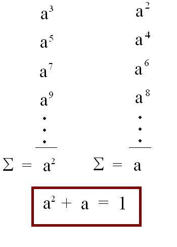

<!-- id: s16-09-0039 -->

par l’image du rabattement de ce a sur le 1, puis du *reste* qui était *a*2 sur le *a*, ce qui produit ici *a*3, le *a*3 étant rabattu, qui produit ici *a*4, le tout arrivant ici à une coupure qui réalise *a*2+*a* = 1.

<!-- id: s16-09-0040 -->

C’est en raison de ceci que la limite ici inscrite de *la série convergente* se place au niveau du 1+*a*, *égal lui-même* à 1/*a*.

<!-- id: s16-09-0041 -->

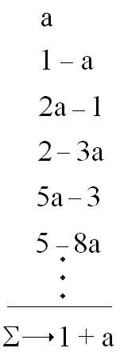

<!-- id: s16-09-0042 -->

Qu’est-ce à dire, qu’est*-­*ce que figure, à proprement parler, ce qui ici fonctionne ?

<!-- id: s16-09-0043 -->

La question de *comment* il est possible de figurer correctement ce qu’il en est d’une conjonction possible de *la division du sujet* pour autant qu’elle résulterait d’une retrouvaille du sujet ? Ici, point d’interrogation : ?

<!-- id: s16-09-0044 -->

De ce sujet qu’en est*-­*il ?

<!-- id: s16-09-0045 -->

- du *sujet absolu de la jouissance* et,

<!-- id: s16-09-0046 -->

- du *sujet qui s’engendre de ce* 1 *qui le marque*, à savoir du *point origine* de l’identification.

<!-- id: s16-09-0047 -->

La tentation est grande de poser l’écriture qui est celle du *Selbstbewusstsein* hégelien, à savoir : *que le sujet étant posé par ce* 1 *inaugural, n’y a qu’à se conjoindre à sa propre figure en tant que formalisée* [^40]* :* *le sujet du savoir est posé comme se sachant lui-­même.*

<!-- id: s16-09-0048 -->

Or, c’est précisément ici que la faute apparaît : s’il n’est pas vu que ceci ne peut être efficace qu’à poser le sujet ***su***, tel que nous le faisons dans le rapport d’un signifiant à un autre signifiant.

<!-- id: s16-09-0049 -->

Ce qui nous montre qu’ici c’est du *rapport* non pas de 1 à 1 mais du *rapport* de 1 à 2 qu’il s’agit, et que donc, à nul moment n’est supprimée la division originelle.

<!-- id: s16-09-0050 -->

Le rapport \[*de* 1 *à* 1\] ici simplement imité, ce n’est qu’à l’horizon d’une répétition infinie que nous pouvons l’envisager comme quelque chose qui réponde à ce rapport de 1 à 1, *sujet de la jouissance* par rapport au *sujet institué dans la marque* dont la différence reste irrémédiable puisque, si loin que vous poussiez l’opération que cette réduction engendre, vous trouverez toujours… d’un terme à l’autre et inscrit comme bilan de la perte …le rapport d’où vous partez, même s’il n’est point inscrit dans l’inscription originelle, à savoir : le rapport *a*.

<!-- id: s16-09-0051 -->

Ceci est d’autant plus significatif qu’il s’agit justement d’un rapport et non pas d’une simple différence qui, en quelque sorte, deviendrait de plus en plus négligeable au regard de la poursuite de votre opération.

<!-- id: s16-09-0052 -->

De sorte que si, comme c’est facile à vérifier, vous prenez cette opération dans le sens de la série croissante ici :

<!-- id: s16-09-0053 -->

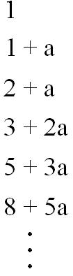

<!-- id: s16-09-0054 -->

*la différence des entiers*…

<!-- id: s16-09-0055 -->

> à savoir de ce qui s’inscrit en 1, fondement de l’identification subjective originelle …*et du nombre des a,* ira toujours en s’accroissant car ici, dans le sens de l’addition, c’est toujours du *rapport d’un nombre de a* *-* qui correspond au terme le plus petit - *à un nombre d’entiers* - qui correspond au terme le plus grand - *qu’il s’agit*.

<!-- id: s16-09-0056 -->

C’est*-­*à*-­*dire au regard, si je puis dire, d’une extension des entiers de sujet, pris au niveau de la masse, il y aura toujours un défaut plus grand d’unités *a*. *Il n’y aura pas du a pour tout le monde*. Prenez ceci \[*notez*\], je passe, j’y reviendrai peut*-­*être au niveau *d’une question apologue*.

<!-- id: s16-09-0057 -->

Ce qui nous importe assurément, ce qui va compter *dans notre sondage du pari de Pascal*, c’est ce qu’il advient dans le sens où \- d’une façon non moins infinie - le *a* peut être approché…

<!-- id: s16-09-0058 -->

> qui une fois de plus nous apparaît ce qui donne sous une forme analogique ce qu’il en est *des rapports du* 1 *au* 1 + *a* …à savoir ce *a* dans lequel, seul peut être saisi *ce qu’il en est de la jouissance par rapport à ce qui se crée de l’apparition d’une perte*.

<!-- id: s16-09-0059 -->

Qu’il me suffise d’ajouter ici ce trait, ou plus exactement à ce *pointage de la distance  *:

<!-- id: s16-09-0060 -->

- de ce qu’il en est de la solution hégelienne du *Selbstbewusstsein,*

<!-- -->

<!-- id: s16-09-0061 -->

- avec celle qu’un examen rigoureux de la fonction du signe nous livre chaque fois que réapparaît, d’une façon quelconque, que c’est dans un rapport de « 1 à 1 » que la solution peut se trouver.

<!-- id: s16-09-0062 -->

Je l’inscris ici d’une façon humoristique, c’est bien le cas de le dire :

<!-- id: s16-09-0063 -->

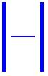\[1 à 1\]

<!-- id: s16-09-0064 -->

Posez*-­*vous la question de ce dont il s’agit : qu’est*-­*ce qui tend à donner cette image comme figure d’un idéal qui pourrait être un jour clos d’un *savoir absolu* ? Est*-­*ce là bien - à la façon de l’H que je viens de traduire *humoristiquement -* est*-­*ce bien :

<!-- id: s16-09-0065 -->

- l’H*omme*, *homo* - ou pourquoi pas…

<!-- id: s16-09-0066 -->

- l’H*ystérique* ?

<!-- id: s16-09-0067 -->

Car n’oublions pas que *c’est au niveau de l’identification névrotique*…

<!-- id: s16-09-0068 -->

> relisez le texte et de préférence en allemand, pour ne pas être obligé de recourir à ces choses pénibles à quoi nous devons au soin de quelques personnes zélées de n’avoir que ce recours quand nous ne voulons user que du français, du volume - torchon, il n’y a même pas de table des matières, enfin vous verrez si vous vous reportez à l’article congru, *[Psychologie collective et analyse du moi](http://www.textlog.de/sigmund-freud-massenpsychologie-ich-analyse.html),* au chapitre de *l’identification* …que c’est, des trois types d’identification énoncés par FREUD, à celui, médian…

<!-- id: s16-09-0069 -->

> qu’il insère à proprement parler dans le champ de la névrose …qu’apparaît, qu’est soulevée la question de l’*einziger Zug,* de ce *trait unaire* que j’en ai extrait.

<!-- id: s16-09-0070 -->

Si je le rappelle ici, c’est pour indiquer que dans la suite de mon discours j’aurai à y revenir car, très singulièrement, c’est dans la névrose dont effectivement nous avons pris notre départ qu’apparaît la forme la plus insaisissable…

<!-- id: s16-09-0071 -->

> *contrairement à ce que vous pouvez imaginer, et c’est pour vous permettre d’y parer qu’ici je l’annonce* …la forme la plus insaisissable de *l’objet(a)*.

<!-- id: s16-09-0072 -->

Revenons maintenant à notre *pari de Pascal* et à ce qui peut s’en inscrire.

<!-- id: s16-09-0073 -->

Les vétillages des philosophes semblent bien en effet nous faire perdre le majeur de sa *signification*.

<!-- id: s16-09-0074 -->

Ce n’est pourtant pas qu’on ait bien fait pour cela tous ses efforts, et y compris d’en inscrire les données à l’intérieur d’une matrice selon les formes où *s’inscrivent* présentement les résultats dits de la « *théorie des jeux* ».

<!-- id: s16-09-0075 -->

Dans cette forme on le met, si je puis dire « *en question* », vous allez voir combien *étrangement*, on prétend l’en *réfuter*.

<!-- id: s16-09-0076 -->

Voici, en effet, ce dont il s’agit.

<!-- id: s16-09-0077 -->

Observons bien que *le pari* est cohérent de la position suivante : « *Nous ne pouvons savoir ni si Dieu est, ni ce qu’il est*. »

<!-- id: s16-09-0078 -->

La division donc des cas qui résultent d’un pari engagé - sur quoi ? - sur un discours qui s’y rattache, à savoir une *promesse* qui lui est imputée, celle d’*une infinité de vies infiniment heureuses* grâce au fait que je parle et n’écris point.

<!-- id: s16-09-0079 -->

Ici, de ce que je parle en français, *vous ne pouvez savoir pas plus*…

<!-- id: s16-09-0080 -->

> je vous le fais remarquer, que sur le petit bout de papier de PASCAL qui est *tachygraphique* [^41] …si cette infinité de vies est au *singulier* ou au *pluriel*.

<!-- id: s16-09-0081 -->

Néanmoins, il est clair par toute la suite du discours de PASCAL que nous devons le prendre dans le sens d’une multiplication plurielle, puisque aussi bien il commence à arguer s’il vaudrait la peine de parier seulement pour avoir une 2ème vie, voire 3 et ainsi de suite. Il s’agit donc bien d’une infinité numérique.

<!-- id: s16-09-0082 -->

Voici donc ce qui est engagé : *quelque chose* - comme on l’a dit - dont nous disposons pour le jeu, c’est à savoir une *mise*.

<!-- id: s16-09-0083 -->

Cette *mise* figurons-là. C’est *légitime* à partir du moment où nous avons pu *nous*-*mêmes* nous avancer pour saisir ce qui est bien en cause dans la question, à savoir ce « *plus énigmatique* » qui nous fait être tous dans le champ d’un discours quel­conque, à savoir le *(a)*. C’est l’*enjeu*. Pourquoi nous l’inscrivons ici dans cette case, c’est ce que nous allons avoir à justifier :

<!-- id: s16-09-0084 -->

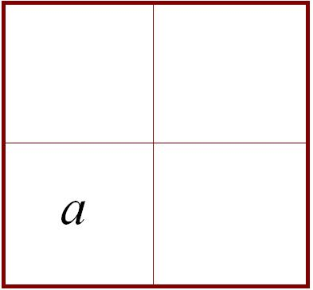

<!-- id: s16-09-0085 -->

C’est l’enjeu et d’autre part on a une infinité de vies, infiniment heureuses. De quoi s’agit-il ? Devons-nous l’imaginer comme ce support du foisonnement des *entiers* au foisonnement, toujours en retard d’ailleurs d’un terme, des *objets(a)* ?

<!-- id: s16-09-0086 -->

C’est une question qui *vaudrait la peine* qu’on l’évoque si, comme vous le voyez, elle n’entraînait déjà pas quelques difficultés. Mais assurément ce dont il s’agissait, c’est de la série croissante. \[1, 1+a , 2+a , 3+2a , 5+8a\]

<!-- id: s16-09-0087 -->

L’infini dont il s’agit est celui que PASCAL illustre…

<!-- id: s16-09-0088 -->

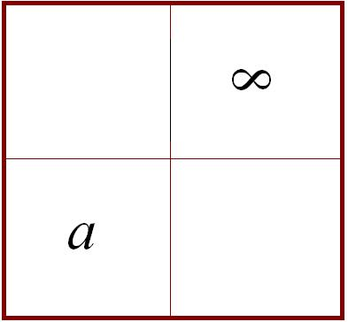

<!-- id: s16-09-0089 -->

…à figurer d’un signe analogue à celui qui est là l’infini des nombres entiers, car c’est seulement par rapport à lui que devient inefficient l’élément du départ, je veux dire neutre, que c’est à ce titre qu’il en devient 0 puisqu’il s’identifie à l’addition du 0 à *l’infini*, le résultat de l’addition ne pouvant se figurer que du signe qui désigne un des deux termes.

<!-- id: s16-09-0090 -->

Voici donc comment les choses se figurent :

<!-- id: s16-09-0091 -->

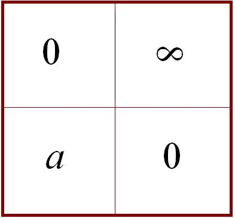

<!-- id: s16-09-0092 -->

Et si j’ai fait cette matrice c’est non pas qu’elle me paraisse suffisante mais qu’elle soit l’ordinaire à quoi l’on se tienne.

<!-- id: s16-09-0093 -->

C’est à savoir qu’on remarque que selon qu’existe ou non ce que nous figurons ici de la façon légitime par A, puisque c’est le champ d’un discours, selon que ce A est admissible ou rejetable, nous allons voir se figurer dans chacune de ces cases, qui n’ont pas ici plus d’importance que les matrices par où s’épingle, dans la théorie des jeux, une combinatoire.

<!-- id: s16-09-0094 -->

Si ce A doit être retenu tout de suite, nous avons 0 comme équivalence de ce *a*, ce qui ne représente rien d’autre que : un enjeu « *risqué* », au niveau d’une *théorie du jeu* doit être considéré comme perdu.

<!-- id: s16-09-0095 -->

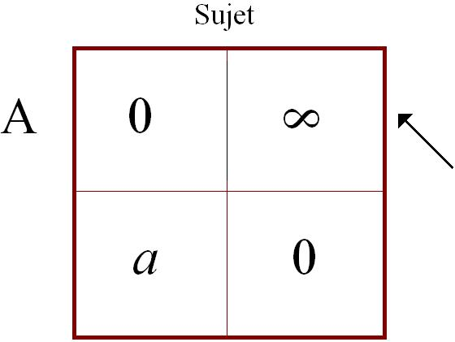

<!-- id: s16-09-0096 -->

Si nous voulons articuler en pari ce qu’il en est du *pari de Pascal* ce n’est nullement un sacrifice, c’est la loi même du jeu, il faut qu’il puisse y avoir ici 0. Si la promesse, de même n’est pas recevable \[si A est rejetable\] rien de ce qui se situe au-delà de la mort n’est plus tenable et nous-mêmes nous avons ici un 0, mais qui ne veut rien dire, si ce n’est que - là aussi - la mise de l’autre côté est perdue.

<!-- id: s16-09-0097 -->

<!-- id: s16-09-0098 -->

En fait, *dans le Pari de Pascal l’enjeu est identique à la promesse* : c’est parce que cette *promesse* est énoncée que nous pouvons construire cette matrice et dès lors qu’elle est construite, il est absolument clair que *la dissymétrie des enjeux* impose qu’effectivement, si la conduite du sujet ne se définit que par ce qui se détermine d’un épinglage signifiant, il n’y a pas de question. La difficulté ne commence, que de nous apercevoir que le sujet n’est nullement quelque chose que nous puissions encadrer, pas plus que tout à l’heure, du *rapport* de « 1 à 1 », de la conjonction d’un nombre de signifiants quelconque, mais de *l’effet de chute qui résulte de cette conjonction* et qui donne à notre *(a)*… ici inscrit dans la case de gauche inférieure …une liaison qui n’est nullement séparable de la construction de la matrice elle-même.

<!-- id: s16-09-0099 -->

C’est très précisément ce dont il s’agit dans le progrès qui s’engendre de la psychanalyse. C’est *cette liaison* qu’il s’agit d’étudier dans sa *conséquence* qui fait précisément le sujet *divisé*, c’est-à-dire non lié au simple établissement de cette matrice.Car dès lors apparaît évidemment tout à fait clair que ces 0 dans cette *matrice* ne sont eux–mêmes que fiction du fait qu’on peut poser une *matrice*, autrement dit, *écrire*. Car le 0 qui s’inscrit en bas c’est le 0 de départ, bien marqué par *l’axiomatisation de* [PÉANO](http://fr.wikipedia.org/wiki/Axiomes_de_Peano)[^42] comme nécessaire à ce que se produise *l’infini de la série des nombres naturels*. Sans l’infini, pas de 0 qui entre en ligne de compte. Parce que le 0 était là *essentiellement* pour le produire. C’est bien aussi d’une telle fiction - comme je vous le rappelais tout à l’heure - que le *(a)* est réduit au 0 quand PASCAL argumente :

<!-- id: s16-09-0100 -->

> « *Au reste, vous ne faites rien que de perdre zéro étant donné que les plaisirs de la vie*… c’est comme cela qu’il s’exprime

<!-- id: s16-09-0101 -->

> …*cela ne pèse pas lourd et spécialement pas au regard de l’infinité qui vous est ouverte.* »

<!-- id: s16-09-0102 -->

C’est très précisément faire usage d’une *liaison mathématique*, celle qui exprime en effet *qu’aucune unité, de quelque sorte qu’elle soit, additionnée à l’infini ne fera que laisser intact le signe de l’infini*.

<!-- id: s16-09-0103 -->

*À ceci près*, pourtant que je vous ai montré à plusieurs reprises qu’on ne saurait absolument dire *que nous ne savons pas si l’infini*…

<!-- id: s16-09-0104 -->

> comme PASCAL argumente pour l’opacifier d’une façon homologue à l’Être Divin …qu’on ne peut pas rigoureusement dire, qu’il est exclu qu’on puisse dire que l’addition d’une unité ne fera pas que nous ne puissions dire *s’il est pair ou impair* puisque, comme vous l’avez vu dans la série décroissante, ce sont toutes les opérations paires qui s’empileront les unes sur les autres et toutes les opérations impaires d’un autre côté, pour totaliser la somme infinie qui n’en reste pas moins réductible à un 1 d’un certain type, le 1 qui entre en conjonction avec le *a*.

<!-- id: s16-09-0105 -->

Vous sentez ici que je ne fais qu’indiquer au passage toutes sortes de points éclairés par les progrès de *la théorie mathématique* et qui, en quelque sorte, en font bouger le voile. Ce qu’il y a *sous ce voile* c’est très précisément ce qu’il en est vraiment de l’articulation de ce discours quel qu’il soit, y compris celui de ladite promesse, c’est qu’à négliger ce qu’il cache… à savoir son *effet de chute* et au niveau de la jouissance …on méconnaît la vraie nature de *l’objet(a)*.

<!-- id: s16-09-0106 -->

Or, ce que notre pratique - qui est pratique du discours et non pas autrement - nous montre, c’est qu’il convient de répartir autrement ce qu’il en est du pari si nous voulons lui donner son véritable sens.

<!-- id: s16-09-0107 -->

PASCAL *lui-même nous indique*…

<!-- id: s16-09-0108 -->

> c’est là ce qui fait l’embrouille auprès d’esprits - il faut le dire - qui semblent singulièrement peu préparés
>
> par une fonction professorale à la maîtrise de ce dont il s’agit quand il s’agit d’un discours … *« Vous êtes engagés », nous dit-il*.

<!-- id: s16-09-0109 -->

Qu’est-ce qui engage moins qu’une pareille matrice ? « *Vous êtes engagés* » qu’est-ce à dire, sinon que pour faire un jeu de mots, c’est le moment de l’entrée du « *je* » dans la question. Ce qui est engagé c’est « *je* ». S’il y a possibilité dans le jeu d’*engager* quoi que ce soit à perte, c’est que la perte est déjà là, que c’est bien pour cela que la mise en jeu on ne peut pas l’annuler.

<!-- id: s16-09-0110 -->

Alors ce que nous apprenons de la psychanalyse, c’est qu’il y a des effets que masque la pure et simple réduction du « je » à ce qui s’énonce. Et comment pouvons-nous, même un instant, quand il s’agit d’un jeu figuré sous la plume de PASCAL, négliger *la fonction de la grâce*, c’est-à­-dire du *désir de l’Autre*. Ne croyez pas qu’il peut aussi être venu dans l’esprit de PASCAL que même pour comprendre son pari aussi ridiculement figuré, *la grâce* était nécessaire.

<!-- id: s16-09-0111 -->

Je vous l’ai dit, dans toute figuration naïve *du rapport du sujet à la demande*, il y a en somme un « *que Ta volonté soit faite* » latent.

<!-- id: s16-09-0112 -->

C’est bien ce qui est mis en cause *quand cette volonté* qui est justement de n’être pas la nôtre *vient à faire défaut*.

<!-- id: s16-09-0113 -->

Autrement dit, ne traînons pas plus longtemps et passons à ce Dieu qui est bien celui, le seul en cause possible sous la plume de PASCAL, le fait de lui mettre les mêmes lettres ne changera rien à la différence, nous allons assez déjà le voir s’articuler dans la distribution du tableau en quoi nous verrons bien que cette distribution n’est pas différente de lui-même.

<!-- id: s16-09-0114 -->

<!-- id: s16-09-0115 -->

Appelons les choses crûment : Dieu existe.

<!-- id: s16-09-0116 -->

Pour un sujet supposé le savoir, alors le couple (0,∞) nous l’inscrivons maintenant dans un des carrés de la matrice.

<!-- id: s16-09-0117 -->

Je suis supposé le savoir mais il faut y ajouter quelque chose, que je sois pour.

<!-- id: s16-09-0118 -->

Et si, tout en étant supposé le savoir que Dieu existe, je suis contre, alors là le choix est entre le *a*, et…

<!-- id: s16-09-0119 -->

> c’est bien de cela qu’il s’agit tout au fil de la pensée qu’énonce PASCAL … « *je perds délibérément des infinités de vies infiniment heureuses* ». \[*a, – *∞\]

<!-- id: s16-09-0120 -->

Et puis, je suis supposé savoir que Dieu n’existe pas… Eh bien, pourquoi ne pas penser que le *(a)* je peux l’engager tout de même, le perdre, tout simplement.

<!-- id: s16-09-0121 -->

C’est d’autant plus possible qu’il est de sa nature d’être perte, car pour mesurer ce qu’il en est d’un jeu où ici c’est à un certain prix que je le garde, le prix de moins l’infini, il peut être légitime de se demander si cela en vaut la peine, de se donner tellement de mal pour le garder.

<!-- id: s16-09-0122 -->

S’il y en a qui le gardent au prix de la perte (–∞), figurez-vous qu’ils ont existé : des tas de gens qui balançaient le *a* sans avoir aucun souci de l’immortalité de l’âme. (*–a,* 0)C’est en général ce qu’on appelle des sages, des gens pépères \- pas seulement pères - pépères. Cela a beaucoup *rapport avec le père*, comme vous allez le voir.

<!-- id: s16-09-0123 -->

### Ici, vous avez ceux qui, au contraire, gardent le *a* et dorment sur leurs deux oreilles. 

<!-- id: s16-09-0124 -->

Quant au 0 d’après, ce qui frappe en cette *distribution* (*a,* 0) c’est la cohérence qui relève du *sujet supposé savoir.*

<!-- id: s16-09-0125 -->

Mais est-ce que ce n’est pas une cohérence faite un tant soit peu d’indifférence ?

<!-- id: s16-09-0126 -->

- « * Il est  *» je *parie* *<u>pour</u>*, mais je sais très bien qu’« * Il est  *».

<!-- id: s16-09-0127 -->

- « *Il n’est pas* », bien sûr je parie *<u>contre</u>*, mais ce n’est pas un pari, cela n’a rien à faire avec un pari tout cela .

<!-- id: s16-09-0128 -->

Dans la diagonale, vous avez des gens qui sont tellement assurés qu’il n’y a pas de pari du tout, ils suivent le vent de ce qu’ils savent, mais qu’est-ce que cela veut dire *savoir*, dans ces conditions ? Cela veut dire si peu de choses que même ceux qui ne savent rien peuvent en faire une unique case, à savoir que, quoiqu’il en soit…

<!-- id: s16-09-0129 -->

> et l’on me permettra de faire remarquer au passage que je n’extrapole nullement sur ce qui est,
>
> à cet égard, la tradition de FREUD, à savoir que je ne sors pas de mes plates-bandes …si vous consultez le volume que j’ai rappelé tout à l’heure, vous verrez que tout le temps FREUD fait cette remarque tranquille qu’en fin de compte, tout ce qu’il en est de la croyance du chrétien ne l’amène pas beaucoup à modifier tellement sa conduite par rapport à ceux qui ne le sont pas.

<!-- id: s16-09-0130 -->

C’est dans la position, si je puis dire, d’un sujet purifié que ce qui se passe là dans la diagonale de gauche se trouve pouvoir s’ordonner dans la petite matrice du haut.

<!-- id: s16-09-0131 -->

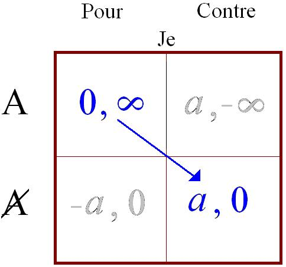→ 

<!-- id: s16-09-0132 -->

Mais ce qui est important, ce qui assurément nous montre quelque chose d’imprévu, c’est celui qui parie contre, sur le fondement de ce qu’il sait être et celui qui parie pour, tout comme s’il était, ce qu’il sait fort bien ne pas être.

<!-- id: s16-09-0133 -->

<!-- id: s16-09-0134 -->

Figurez-vous qu’ici cela devient tout à fait intéressant, à savoir que ce -∞ que vous voyez paraître *dans la case du haut à droite*, cela se traduit dans les petites scriptures de PASCAL par un nom qui s’appelle l’*enfer*. Seulement ceci suppose que soit mis à l’examen pourquoi la fonction du *a* a abouti à cette imagination des plus discutables : qu’il y ait un au-delà de la mort.

<!-- id: s16-09-0135 -->

Sans doute du fait de son glissement indéfini, *mathématique*, sous toute espèce de chaîne signifiante : où que vous en poursuiviez le dernier serrage, elle subsiste toujours intacte comme je l’ai déjà articulé au début de l’année dans un certain schéma des rapports de S et de *a*.

<!-- id: s16-09-0136 -->

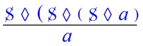

<!-- id: s16-09-0137 -->

Mais alors ceci peut nous induire à nous demander ce que veut dire le surgissement sous la forme d’un -∞ de *quelque chose* sur ce tableau. Est-ce qu’il n’est pas - ce *moins* - à traduire d’une façon plus homologue à sa fonction arithmétique à savoir que, quand il apparaît, la série des entiers se redouble, ce qui veut dire se divise.

<!-- id: s16-09-0138 -->

Il est là le signe de ce *quelque chose* qui me paraissait seul valable à rappeler à la fin de mon dernier discours, c’est qu’à prendre comme *objet(a)* et non pas autrement, ce qui est mis en jeu dans la renonciation proposée par PASCAL, il y a autant d’infini là où il a une limite que là où il n’en rencontre pas, ce jeu du *a*. De toutes façons, c’est un demi-infini que nous engageons ce qui vient à équilibrer singulièrement les chances dans la première matrice.

<!-- id: s16-09-0139 -->

Seulement il se peut bien qu’il faille retenir autrement ce qui se figure dans ce mythe dont PASCAL nous rappelle, que pour faire partie du dogme, il ne fait rien que témoigner que la miséricorde de Dieu est plus grande que sa justice puisqu’il extrait quelques élus alors qu’on devrait être tous en enfer.

<!-- id: s16-09-0140 -->

Cette proposition peut paraître scandaleuse, je m’en étonne puisqu’il est tout à fait clair et manifeste que cet enfer, on n’a jamais pu l’imaginer en dehors de ce qui nous arrive tous les jours. Je veux dire que nous y sommes déjà, que cette nécessité qui nous englobe à ne pouvoir qu’à un horizon dont il faudrait interroger la limite, réaliser le *solide* du *a*, que par une mesure indéfiniment répétée de ce qu’il en est de la *coupure* du *a*, est-ce que cela ne suffit pas à soi tout seul, à couper les bras des plus courageux.

<!-- id: s16-09-0141 -->

Seulement voilà : *on n’a pas le choix *! Notre désir c’est le désir de l’Autre, et selon que la grâce nous a manqué ou pas…

<!-- id: s16-09-0142 -->

> ce qui se joue au niveau de l’Autre, à savoir de tout ce qui nous a précédé
>
> dans ce discours qui a déterminé notre conception même …nous sommes déterminés ou non à la course d’étanchage de *l’objet(a)*.

<!-- id: s16-09-0143 -->

Alors reste la quatrième case, celle du bas :

<!-- id: s16-09-0144 -->

<!-- id: s16-09-0145 -->

Ce n’est pas pour rien que je me suis permis, aujourd’hui à leur propos, de sourire. Ils sont tout aussi nombreux, aussi bien répartis que ceux qui sont dans le champ du haut à droite. Je les ai appelés provisoirement « * les pépères* * *».

<!-- id: s16-09-0146 -->

On aurait tort pourtant de minimiser l’aisance de leurs déplacements, mais tout de même, ce que je voudrais vous faire remarquer c’est, en tout cas, que c’est là que nous, dans l’analyse, nous avons placé la bonne norme.

<!-- id: s16-09-0147 -->

Le *plus-de-jouir* est expressément modulé comme étranger à la question, si la question dont il s’agit dans ce que l’analyse peut promettre comme le retour à la norme, comment ne voit-on pas que cette norme s’y articule bel et bien comme la loi, la loi sur laquelle se fonde *le complexe d’Œdipe* et dont il est tout à fait clair, par quelque bout qu’on prenne ce mythe, que *la jouissance s’y distingue absolument de la loi*.

<!-- id: s16-09-0148 -->

*Jouir de la mère est interdit* dit-on, *et c’est ne pas aller assez loin*. Ce qui a des conséquences, c’est que le jouir de la mère est *interdit* : rien ne s’ordonne qu’à partir de cet énoncé premier comme il se voit bien dans la fable où jamais le sujet ŒDIPE n’a pensé…

<!-- id: s16-09-0149 -->

> Dieu sait à cause de quel divertissement, je veux dire de tout ce que répandait autour de lui
>
> de charme et probablement aussi de harcèlement, JOCASTE …pour que cela ne lui vienne même pas à l’idée, même quand les preuves commençaient à pleuvoir.

<!-- id: s16-09-0150 -->

Ce qui est interdit c’est le *jouir de la­ mère* et cela se confirme dans la formulation sous une autre forme…

<!-- id: s16-09-0151 -->

> il est indispensable de les rapprocher toutes pour saisir ce que FREUD articule …celle de *Totem et Tabou*.

<!-- id: s16-09-0152 -->

Le « *meurtre du père* » aveugle tous ces jeunes taureaux imbéciles que je vois graviter de temps en temps autour de moi dans des arènes ridicules. Le « *meurtre du père* » veut justement dire qu’on ne peut pas le tuer : *il est déjà mort depuis toujours*.

<!-- id: s16-09-0153 -->

C’est bien pour cela qu’il s’accroche *quelque chose de sensé* - *même dans des lieux où il est paradoxal de voir bramer « Dieu est mort » -* c’est qu’évidemment, à ne pas y penser, on risque de perdre une face des choses. Au départ, le père est mort.

<!-- id: s16-09-0154 -->

Seulement voilà, il reste le *Nom du père* et tout tourne autour de cela. Si la dernière fois c’est par là que j’ai commencé, c’est par là aussi que je finis. La vertu du *Nom du père*… cela je ne l’invente pas, je veux dire que ce n’est pas de mon cru dans FREUD c’est écrit : *la différence* – dit-il quelque part - *entre le champ de l’homme et celui, disons de l’animalité, consiste*…

<!-- id: s16-09-0155 -->

> où que ce soit, même quand cela ne se produit que sous des formes masquées, à savoir : quand on dit qu’il y en a certains qui n’ont pas l’idée de ce que c’est que le rôle du mâle dans la génération - pourquoi pas ? …ce qu’il démontre, je veux dire l’importance de cette *fonction du Nom du père,* c’est que ceux-là mêmes qui n’en ont pas l’idée inventent des « *esprits* » pour la remplir.

<!-- id: s16-09-0156 -->

Pour tout dire, la caractéristique est ceci, FREUD en un endroit très précis l’articule…

<!-- id: s16-09-0157 -->

> je ne vais pas passer mon temps à vous dire dans quelles pages et dans quelle édition puisque, maintenant, il y a des endroits où l’on fait des lectures freudiennes et il y a tout de même des gens compétents
>
> pour l’indiquer à ceux qui s’y intéressent …l’essence, pour tout dire, et *la fonction du père comme Nom*, comme pivot du discours, tient précisément en ceci qu’après tout, *on ne peut jamais savoir qui c’est qui est le père*. Allez toujours chercher, c’est une question de foi.

<!-- id: s16-09-0158 -->

Avec le progrès des sciences, on arrive dans certains cas à savoir qui il n’est pas, mais enfin il reste quand même un inconnu.

<!-- id: s16-09-0159 -->

Cette introduction, d’ailleurs, de la recherche biologique de la paternité, il est tout à fait sûr que cela peut n’être pas du tout sans incidence sur la fonction du *Nom du père*.

<!-- id: s16-09-0160 -->

Donc, c’est ici, au point où c’est justement de ne se *maintenir que symbolique*, qu’est le pivot autour de quoi tourne tout un champ de la subjectivité, nous avons à prendre l’autre face de ce qu’il en est du rapport à *la jouissance,* et pour tout dire à pouvoir nous avancer - ce qui est notre objet cette année - un peu plus loin dans ce qu’il en est

<!-- id: s16-09-0161 -->

- de *la transmission du Nom du père*,

<!-- id: s16-09-0162 -->

- à savoir ce qu’il en est de *la transmission de la castration*.

<!-- id: s16-09-0163 -->

Je terminerai aujourd’hui ici, comme d’habitude, au point où, *cahin caha*, on arrive et vous dis : à la prochaine fois.

## Notes

[^39]: On obtient 2/3 = 0.666, puis : 0.625, 0.615, 0.6190, 0.61764, 0.61818, 0.61797, 0.618055, 0.618025, 0.618037, 0.618032, 0.618034, 0.6180338, 0.618034, 0.6180339, 0.618033998, il faut arriver à 6765/10946 (20ème et 21ème termes) pour que les six premières décimales soient stables, soit *a* ≈ 0.618034.

[^40]: En tant que savoir (cf. le « *savoir absolu* » hegelien), en tant que structuré comme savoir par le signifiant, au « champ de l’Autre ».

[^41]: Tachygraphique : Système d'écriture rapide utilisant un alphabet conventionnel ou un système de signes tel la sténographie.

[^42]: Cf. Séminaire 1964-65 : « *Problèmes...*», séance du 27-01-65, l’exposé de Yves Duroux. L’axiomatique de Péano est décrite par cinq axiomes : 1) L'élément appelé zéro et noté : 0, est un entier naturel. 2) Tout entier naturel *n* a un unique successeur, noté *s*(*n*) ou *Sn*. 3) Aucun entier naturel n’a 0 pour successeur.

    4\) Deux entiers naturels ayant même successeur sont égaux. 5) Si un ensemble d'entiers naturels contient 0 et contient le successeur de chacun de ses éléments, alors cet ensemble est égal à N.
