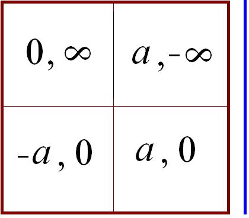
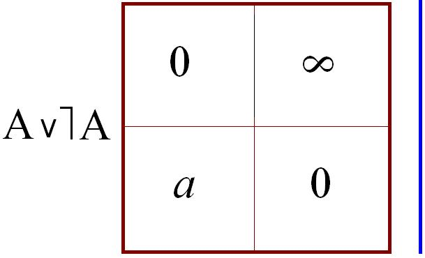
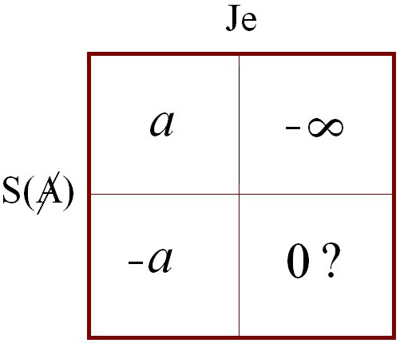
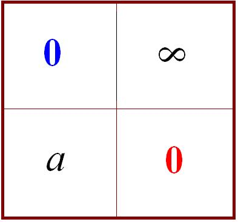
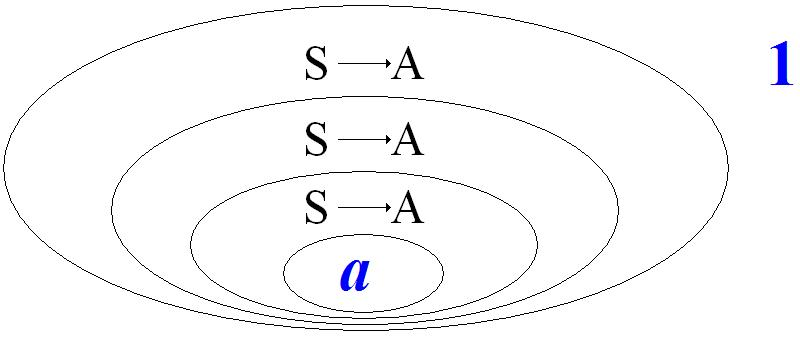
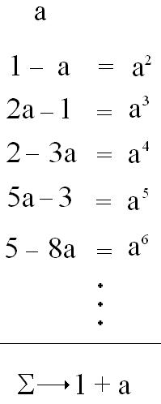

# Leçon 11 | 12 Février 1969

<!-- source-url: http://staferla.free.fr/S16/S16 D'UN AUTRE... .docx -->
<!-- seminar: s16 -->
<!-- lesson: 11 -->

<!-- id: s16-11-0001 -->

Bien ennuyé de tout ce qui se passe, hein ! Vous aussi, je pense. On ne peut quand même pas ne pas s’en apercevoir, puisque je suis en train de me demander si je suis ici pour faire mon truc de d’habitude ou pour faire de l’occupation !

<!-- id: s16-11-0002 -->

Enfin, des oreilles bienveillantes ont bien voulu entendre que certaines des choses que j’ai avancées nommément pendant mon avant­-dernier séminaire avaient quelque rapport avec une science… Qui sait ?

<!-- id: s16-11-0003 -->

Avec peut-être - non pas une nouvelle science - mais avec une mise au point de ce qu’il en est des conditions de la science.

<!-- id: s16-11-0004 -->

Aujourd’hui je sens…

<!-- id: s16-11-0005 -->

> pour toutes sortes de raisons, ne serait-ce que parce que nous approchons du Mardi-Gras, alors c’est *convenable* …que je vais tout doucement infléchir les choses. Je le sens, comme ça, d’après l’équilibre de ce que j’ai cogité ce matin avant de vous voir. Je vais m’infléchir un peu vers quelque chose que vous appellerez comme vous voudrez, mais plutôt d’une note morale.

<!-- id: s16-11-0006 -->

Comment est-ce d’ailleurs qu’on y échapperait, dans l’*aura*, dans la marge, dans les limites de ce par quoi j’ai abordé quelque chose qui est *le pari de Pascal*. Il est certain que nous ne pouvons pas méconnaître cette incidence, encore que, bien entendu, ce qui m’a inspiré de vous en parler, c’est que *le pari de Pascal* se tient à un certain joint, et ça, quand même, je vais le rappeler.

<!-- id: s16-11-0007 -->

Mais, comme ça, histoire d’introduire un peu les choses et de détendre - si peu… - l’atmosphère… je vous ai dit que nous approchions du Mardi-Gras …je m’en vais vous lire une lettre que j’ai reçue. Je ne vous dirai pas *qui me l’envoie*, ni même *de quelle ville*.[^43]

<!-- id: s16-11-0008 -->

> «* Cher Monsieur Lacan. On est étudiants et on a lu vos Écrits, presque tout. On y trouve pas mal de choses.*
>
> *Évidemment, ce n’est pas toujours d’un abord très aisé, mais ça mérite quand même nos félicitations*… »

<!-- id: s16-11-0009 -->

On ne m’en envoie pas tous les jours autant !

<!-- id: s16-11-0010 -->

« *On aimerait bien savoir comment il faut faire pour écrire des choses si difficiles*… »

<!-- id: s16-11-0011 -->

Je ne suis en train de me foutre de personne, et pas de ces gars que je trouve vraiment… Enfin, je vous dirai ce que j’en pense. Ils sont deux pour avoir écrit ça !

<!-- id: s16-11-0012 -->

> «... *ça nous servirait pour nos examens. On a bien une licence de philosophie, mais ça devient de plus en plus compliqué de surmonter la sélection. On pense qu’il vaut mieux ruser et étonner les profs plutôt que de persister dans une forme de discours platement terre*-*à*-*terre*... »

<!-- id: s16-11-0013 -->

Et ils ajoutent : « *…c’est le cas de le dire. Pourriez*-*vous nous indiquer quelques combines dans ce sens ?* »

<!-- id: s16-11-0014 -->

Moi ça me frappe, parce que je me dis que dans le fond, c’est ce que je suis en train de faire !

<!-- id: s16-11-0015 -->

> « *D’autre part, on voudrait vous demander encore quelque chose si ce n’est pas trop osé : est-ce que vous pourriez nous envoyer comme souvenir de vous un de vos jolis nœuds papillon ? Ça nous ferait plaisir. En vous remerciant d’avance, on vous dit au-revoir,*
>
> *Monsieur Lacan, et veuillez recevoir nos respectueux hommages* ».

<!-- id: s16-11-0016 -->

Je ne vais pas laisser traîner ça parce que… Ils ne sont pas très à la page : ils ne savent pas que je porte le col roulé depuis un certain temps ! Pour moi, ça fait écho, confirmation, résonance à quelque chose qui m’émeut quand j’entends de bonnes âmes moduler, comme ça, depuis les mois de Mai : « *Plus jamais comme avant* ». Je pense que *là où on en est*, c’est « *plus que jamais comme avant* ». Et après tout je suis bien loin, bien sûr, de limiter le phénomène à ce petit *flash* que cette lettre donne de ce qui est un coin de l’affaire.

<!-- id: s16-11-0017 -->

Évidemment, il y a bien d’autres choses en jeu. Seulement ce qui est frappant, c’est que d’un certain point de vue cette lettre, à mes yeux, peut très bien faire le bilan de la façon dont on m’a écouté, mais dans une zone qui n’est pas du tout aussi éloignée de moi que cette ville qui est quand même au-delà d’un très large périmètre.

<!-- id: s16-11-0018 -->

Comme vous voyez, *ils ne sont pas très à la page* ! Mais enfin, c’est une face de la façon dont est pris l’enseignement.

<!-- id: s16-11-0019 -->

Et puis je ne vois pas pourquoi on leur en voudrait des « *nœuds papillon* » parce qu’il y a quelqu’un qui a joué le rôle de pivot dans une certaine commission d’examen, comme ça, qui nous avait été délégué dans des temps lointains par une certaine Société britannique, qui avait mis ça comme un point tout à fait digne de tenir la balance avec le reste de mon *enseignement*.

<!-- id: s16-11-0020 -->

Je veux dire que c’était comme ça, il y avait ça dans un plateau et dans l’autre *mon nœud papillon*, c’est-à-dire l’*identification* qu’étaient censé réaliser à l’aide de cet accessoire ceux qui se présentaient alors comme *mes élèves*.

<!-- id: s16-11-0021 -->

Alors vous voyez que ça ne se limite pas au niveau des chers mignons, des gentils, des naïfs.

<!-- id: s16-11-0022 -->

Ils ne sont d’ailleurs pas si naïfs que ça, parce que, comme ils vous le disent, il faut peut-être ruser. On va y revenir.

<!-- id: s16-11-0023 -->

<!-- id: s16-11-0024 -->

Alors nous reprenons les choses où nous les avons un peu démontées, à savoir dans le tableau du pari, à gauche…

<!-- id: s16-11-0025 -->

> les lignes bleues sont faites pour montrer où s’arrêtent les limites de chacun de ces schémas,
>
> pour qu’ils ne chevauchent pas l’un sur l’autre, ni réellement, ni dans votre esprit …alors celui de gauche est celui dont j’ai cru devoir compléter la matrice dans laquelle, à l’imitation de ce qui se pratique dans la théorie des jeux, on pourrait schématiser ce qui s’est agité effectivement pendant tout un XIXème et même pendant tout un bon début de notre siècle autour du *pari de Pascal*, à savoir la façon de démontrer comment, en quelque sorte, PASCAL *essayait de nous flouer*.

<!-- id: s16-11-0026 -->

Je pense avoir suffisamment fait sentir, qu’en raison de la fonction des 0 qui ne font pas réellement partie des résultats d’un pari qui serait tenu contre un partenaire…

<!-- id: s16-11-0027 -->

> pour la raison que c’est précisément de l’existence du partenaire qu’il s’agit et que c’est sur elle qu’il s’agit de parier …dans ces conditions les deux lignes de possibilité qui s’offrent au parieur ne s’entrecroisent avec aucune ligne de possibilité qui appartiendrait à l’Autre, puisque de l’Autre on ne peut même point assurer l’existence.

<!-- id: s16-11-0028 -->

C’est donc tout à la fois sur l’*existence* ou la *non-existence* de l’Autre, sur ce que lui promet son existence et ce qui lui permet son inexistence, c’est là-dessus que porte le choix, et dans ce cas il est plausible - je dis : *il est plausible*, bien sûr si l’on a *l’esprit mathématique -* de parier, et de parier dans le sens que propose PASCAL.

<!-- id: s16-11-0029 -->

Seulement, on n’oubliera pas que j’ai introduit à ce stade de l’affaire…

<!-- id: s16-11-0030 -->

> pour ne pas bien sûr prêter à malentendu et croire qu’ici je me prête
>
> à quelque chose qui serait l’indication du bénéfice de cette solution …j’ai effectivement fait remarquer ceci…

<!-- id: s16-11-0031 -->

> et dans l’introduction même du rappel du *Pari* tel qu’il se présente,
>
> beaucoup moins tel qu’il est à travers la grille des discussions devenues classiques …j’ai fait remarquer qu’à ce niveau on peut aussi bien substituer au choix à faire sur le sujet de *l’existence de Dieu* cette remarque qu’aussi bien on remplirait la fonction - ce qui en changerait totalement le sens - cette remarque que ce dont il s’agit, ce dont il pourrait s’agir, c’est de *cette formulation radicale* qui est celle du *réel*, en tant que nous pouvons le concevoir…

<!-- id: s16-11-0032 -->

> et comme aussi bien nous le touchons à l’occasion du doigt …qu’il n’est pas concevable d’imaginer d’autre *limite* du savoir que *ce point de butée* où on n’a affaire qu’à ceci : à *quelque chose d’indicible* et qui « *ou bien est, ou bien n’est pas* ». Autrement dit quelque chose qui relève du « *pile ou face* ».

<!-- id: s16-11-0033 -->

Ceci était bien sûr pour vous mettre à l’accord de ce dont il s’agit de ne pas perdre la corde, à savoir que nous ne sommes pas en train de nous amuser, nous sommes en train d’essayer de donner des articulations telles que puissent jouer pour nous les plus importantes décisions qui soient à prendre. Il se trouve que l’époque marque de plus en plus que ces plus importantes décisions, en tant qu’elles pourraient être celles du psychanalyste, pourraient bien aussi coïncider avec celles qui *s’imposent* en un point clé de ce qu’il en est du corps social, à savoir l’administration du savoir, par exemple.

<!-- id: s16-11-0034 -->

Mais alors, encore que là-dessus il soit bien entendu que j’ai fait place nette, que je ne fais pas de *l’histoire* et que je ne vois pas pourquoi *un appareil aussi précis* - surtout si nous concevons bien à quel joint il se situe *-* que le pari de PASCAL aurait moins de ressources pour nous qu’il n’en a eu pour son auteur, et nous reviendrons bien sur cette question de la situation, d’autant mieux que nous allons la rééclairer maintenant. Ce n’est donc pas - vous allez le voir tout de suite - pour faire de l’histoire, à savoir comme je l’ai évoqué la dernière fois pour vous rappeler qu’au temps de PASCAL, la Révélation, ça existe ! Et j’ai bien mis l’accent sur ce dont il s’agit, avec ces deux étages :

<!-- id: s16-11-0035 -->

- la parole de l’Église,

<!-- id: s16-11-0036 -->

- et puis l’Écriture Sainte, et la fonction que l’Écriture Sainte joue pour PASCAL.

<!-- id: s16-11-0037 -->

Ce n’est évidemment pas pour vous rappeler que NEWTON *aussi*, qui avait pourtant d’autres chats à fouetter, a commis un gros bouquin - ma distraction étant la bibliophilie, il se trouve que je l’ai, c’est superbe - qui est un commentaire de l’*Apocalypse* et de *la prophétie de Daniel* [^44]**.** Il y a mis autant de soin…

<!-- id: s16-11-0038 -->

> *j’entends dans le calcul, dans la manipulation des chiffres pourtant combien problématiques*
>
> *que ceux dont il s’agit quand il s’agit de situer le règne de Nabuchodonosor par exemple* …que dans son étude des lois de la gravitation. À rappeler donc en marge, mais *ça ne nous fait ni chaud ni froid*.

<!-- id: s16-11-0039 -->

Ce dont il s’agit à ce stade, c’est de remarquer ceci, qu’au niveau où PASCAL nous propose donc son pari…

<!-- id: s16-11-0040 -->

> quelle que soit la pertinence de nos remarques sur ce qu’il en est au dernier terme …c’est à savoir que si pareil propos ne se conçoit qu’au moment où le savoir est né, qui est celui de la science, il n’en reste pas moins que pour lui, le pari repose sur ce que nous pouvons appeler « *la parole de l’Autre* », et la parole de l’Autre bien sûr conçue comme vérité.

<!-- id: s16-11-0041 -->

Alors, si je reprends les choses à ce point, c’est parce que certains n’ignorent pas, et aux autres je les en informe, il serait d’ailleurs facile, s’ils avaient fait comme mes charmants *correspondants*, s’ils avaient lu de mes *Écrits* presque tout, qu’ils soient informés de la fonction à la fois conjointe et disjointe que j’ai articulée dans celle d’une dialectique, comme distinguant, sinon opposant, *savoir* et *vérité*. C’est le dernier article que j’ai recueilli. Il a pour titre très précisément

<!-- id: s16-11-0042 -->

*La Science et la Vérité* [^45]*.* Et sur ce qui est de *la vérité*, chacun sait aussi que, dans un autre de ces articles qui s’appelle

<!-- id: s16-11-0043 -->

*La Chose freudienne* [^46]*,* j’ai écrit quelque chose qui pourrait certes s’entendre comme ceci : que sa propriété c’est qu’*elle parle*.

<!-- id: s16-11-0044 -->

Nous serions donc, ou plutôt moi, je serais dans un certain axe que - pourquoi pas ? - on pourrait dès lors qualifier d’obscurantiste puisqu’il rejoindrait ceci, à savoir que je viendrais donner un coup d’épaule à l’instillation de PASCAL, pour autant qu’il essaie de nous ramener au plan de la religion. Alors évidemment, *la vérité*, certes, *parle*, direz-vous.

<!-- id: s16-11-0045 -->

Mais évidemment c’est ce que vous diriez si vous n’avez rien compris à ce que je dis - ce qui n’est pas absolument exclu ! - car *je n’ai jamais dit cela*. J’ai fait dire à la vérité :

<!-- id: s16-11-0046 -->

> « *Moi la vérité, je parle* »

<!-- id: s16-11-0047 -->

Mais je ne lui ai pas fait dire : « *Moi, la vérité, je parle par exemple pour me dire comme vérité.* » ni : « *pour vous dire la vérité*. »

<!-- id: s16-11-0048 -->

Le fait qu’elle parle ne veut pas dire qu’elle dit *la vérité*. C’est *la vérité* : elle parle, quant à ce qu’elle dit, c’est vous qui avez à vous débrouiller avec ça. Ça peut vouloir dire - c’est ce que certains font : « *Cause toujours, c’est tout ce que tu sais faire*. »

<!-- id: s16-11-0049 -->

*La vérité*, je lui ai accordé, si j’ose dire, un peu plus. Je lui ai depuis, accordé qu’elle cause en effet, et pas simplement dans le sens auquel répond « *cause toujours* », qu’elle cause même à tour de bras. Je veux dire que dans ce même article, j’ai rappelé le mot de LÉNINE[^47] sur la théorie marxiste du social qui, dit-il : « *Elle triomphera parce qu’elle est vraie*. » mais pas forcément parce qu’elle *dit* *la vérité*. Ça s’applique là aussi.

<!-- id: s16-11-0050 -->

Naturellement, je ne vais pas m’appesantir, parce qu’il se dit qu’on cite mon nom…

<!-- id: s16-11-0051 -->

> je n’ai pas été y regarder, je dois dire, parce que je n’ai pas eu le temps …avec avantage dans l’*Humanité*, parce que soi-disant j’aurais commencé cette année comme ça, en sentant venir le vent, à faire une médiation entre FREUD et MARX. Dieu merci, comme j’étais grippé le dernier week-end, ça m’a donné tout d’un coup une stimulation pour ce qu’on appelle le travail, c’est-à-dire le remue-ménage.

<!-- id: s16-11-0052 -->

Je me suis mis à rebrasser l’effroyable quantité de *papier* à la destruction de laquelle il faudra que je veille pour le moment où je disparaîtrai, parce que Dieu sait ce qu’on en ferait autrement !

<!-- id: s16-11-0053 -->

Je me suis aperçu que j’ai parlé de MARX, de *la valeur d’usage*, de *la valeur d’échange*, de *la plus*-*value*.

<!-- id: s16-11-0054 -->

Je me suis aperçu pour tout dire que ma traductrice italienne…

<!-- id: s16-11-0055 -->

> *que j’ai montée en épingle quand j’ai sauté le pas*, pour faire cette sorte d’analogie entre *la plus*-*value* et *le plus*-*de­*-*jouir* *…*que ma traductrice italienne - ça s’est trouvé qu’elle était là, il y a deux ans - n’a eu aucun mérite à me dire qu’en somme c’est *la plus-value,* parce que j’ai déjà tellement parlé de MARX à propos d’un certain nombre d’articulations *fondamentales* autour de ce dont il s’agit dans la psychanalyse, que je me demande ce que j’ai apporté de nouveau, sauf ce nom *Mehrlust, plus-de-jouir* en analogue au *Merhwert* \[*plus-value*\]*.*

<!-- id: s16-11-0056 -->

Tout ceci pour indiquer d’ailleurs aussi bien que par ces points radicaux, bien sûr ils ne se développent absolument pas sur le même champ. Mais puisque nous en sommes à l’évocation de LÉNINE, il n’est pas plus mauvais de rappeler donc que ce dont il s’agit à propos de la théorie marxiste, pour autant qu’elle concerne une vérité, c’est ce qu’elle énonce en effet qui est ceci : que la vérité du capitalisme, c’est le prolétariat. C’est vrai !

<!-- id: s16-11-0057 -->

Seulement c’est de ça même que ressort la suite et la portée de nos remarques sur ce qu’il en est de *la fonction de la vérité*, c’est que la conséquence révolutionnaire de cette vérité…

<!-- id: s16-11-0058 -->

> cette vérité d’où part la théorie marxiste, bien sûr elle va un tout petit peu plus loin
>
> puisque ce dont elle fait la théorie, c’est précisément le *capitalisme* …la conséquence révolutionnaire c’est que *la théorie part en effet de cette vérité, à savoir que le prolétariat c’est la vérité du capitalisme*.

<!-- id: s16-11-0059 -->

### Le prolétariat, ça veut dire quoi ? Ça veut dire que le travail est radicalisé au niveau de la marchandise pure et simple. 

<!-- id: s16-11-0060 -->

Ce qui veut dire bien sûr que ça réduit au même taux le travailleur lui-même. Seulement dès que le travailleur, du fait de la théorie, apprend à « *se savoir* » comme tel, on peut dire que par ce pas, il trouve les voies d’un statut \- appelez ça comme vous voudrez - de savant :

<!-- id: s16-11-0061 -->

- Il n’est plus prolétaire, si je puis dire, *an* *sich* \[*en soi*\],

<!-- id: s16-11-0062 -->

- il n’est plus pure et simple vérité, il est *für sich* \[*pour soi*\],

<!-- id: s16-11-0063 -->

- il est ce qu’on appelle *conscience de classe*.

<!-- id: s16-11-0064 -->

- Il peut même du même coup devenir la conscience de classe du parti où on ne dit plus jamais la vérité.

<!-- id: s16-11-0065 -->

Je ne suis pas en train de faire de la satire. Je suis en train de rappeler :

<!-- id: s16-11-0066 -->

- que des évidences - c’est en ça que c’est soulageant - ne relèvent nullement du scandale qu’on en fait quand on ne comprend rien à rien,

<!-- id: s16-11-0067 -->

- ou que si on a une théorie correcte de ce qu’il en est du savoir et de la vérité, il n’y a rien de plus facile à attendre,

<!-- id: s16-11-0068 -->

- qu’en particulier on ne voit pas pourquoi on s’étonnerait que c’est du rapport le plus *leniniellement* défini à la vérité que découle toute cette *lénification* dans laquelle baigne l’appareil !

<!-- id: s16-11-0069 -->

Si vous vous mettiez dans la boule qu’il n’y a rien de plus lénifiant que les durs, vous rappelleriez comme ça une vérité déjà connue depuis bien longtemps. Et puis vraiment est-ce que ça, on ne le sait pas depuis longtemps, depuis toujours ?

<!-- id: s16-11-0070 -->

Si on n’était pas depuis quelque temps - et je vous dirai pourquoi - si persuadé que « *le christianisme ce n’est pas la vérité* » on aurait pu se rappeler tout de même que pendant un certain temps, et qui n’est pas mince, il l’a été et que ce dont il a donné la preuve, c’est *qu’autour de toute vérité qui prétend parler comme telle, un clergé prospère qui est obligatoirement menteur.*

<!-- id: s16-11-0071 -->

Alors je me demande pourquoi on tombe de son haut à propos du fonctionnement des gouvernements socialistes !

<!-- id: s16-11-0072 -->

Irai-je à dire que la perle du mensonge est la sécrétion de la vérité ? Ça assainirait un peu l’atmosphère.

<!-- id: s16-11-0073 -->

### Atmosphère d’ailleurs qui n’existe que du fait d’*un certain type de crétinisation* dont il faut bien que je dise le nom tout de suite puisqu’au terme de ce que nous avons à dire aujourd’hui, j’aurai à le *réépingler* quelque part dans un de ces petits carrés : 

<!-- id: s16-11-0074 -->

c’est ce qu’on appelle *le progressisme*. J’essaierai bien sûr de vous donner une meilleure définition que cette référence à ses effets de scandale, je veux dire de produire des âmes scandalisées.

<!-- id: s16-11-0075 -->

Ces choses devraient être aérées depuis longtemps par la lecture de HEGEL, la loi du cœur et le délire de la présomption. Mais, à la façon de toutes les choses un peu rigoureuses quand elles sortent, bien sûr personne ne songe à s’en souvenir au moment qui convient. C’est pourquoi j’ai mis en exergue au début de mon discours de cette année quelque chose qui veut dire que « *Ce que je préfère, c’est un discours sans paroles* ». Alors ce dont il s’agit…

<!-- id: s16-11-0076 -->

> ce qui pourrait être ici en question si on voulait, comme on dit,
>
> lécher le plat au point où nous pouvons en profiter, en mettant le petit doigt …c’est de s’apercevoir que ces choses n’ont pas de si mauvais effets que ça, *puisque quand je dis que le service du champ de la vérité* - le service en tant que tel, *service qu’on ne demande à personne, il faut avoir la vocation -* entraîne nécessairement au mensonge, je veux aussi faire remarquer ceci - parce qu’il faut être juste - c’est que ça fait énormément travailler !

<!-- id: s16-11-0077 -->

Moi, j’adore ça - quand c’est les autres, bien entendu, *qui travaillent* ! - c’est pour ça que je me régale de la lecture de bon nombre d’auteurs ecclésiastiques dont j’admire ce qu’il leur a fallu de patience et d’érudition pour charrier tant de citations qui me viennent au point juste où ça me sert à quelque chose. Il en est de même pour les auteurs de *l’église communiste*. Ils sont aussi d’excellents travailleurs. J’ai beau comme ça, pour certains, dans la vie courante, ne pas pouvoir les supporter plus que dans les contacts personnels avec les curés, ça n’empêche pas qu’ils sont capables de faire de *très beaux travaux* et que je me régale quand je lis un certain d’entre eux sur *Le Dieu caché* [^48]*,* par exemple.

<!-- id: s16-11-0078 -->

Ça ne me rend pas l’auteur plus fréquentable...

<!-- id: s16-11-0079 -->

Donc en somme le fruit de ce qu’il en est après tout quand même, pour le savoir n’est pas du tout à négliger, puisqu’on s’occupe un petit peu trop de la vérité et qu’on en est si empêtré qu’on en vient à mentir. La seule véritable question… puisque j’ai dit que là j’irai jusqu’aux limites …ce n’est pas du tout que ça ait ces conséquences, puisque vous voyez qu’après tout c’est une forme de sélection d’élites, c’est pourquoi ça ramasse aussi - dans un champ comme dans l’autre - tant de débiles mentaux, voilà, c’est la limite !

<!-- id: s16-11-0080 -->

C’est la limite, mais ne croyez pas que c’est simplement pour m’amuser, pour faire comme ça une petite nasarde à des groupes dont on ne sait pas après tout pourquoi ils devraient être plus préservés que les autres de la présence des débiles mentaux. C’est parce que nous, analystes, nous pouvons peut-être là-dessus amorcer quelque chose qui est justement très important. Là, je vous renvoie à la clé apportée en douce par notre chère Maud… Maud MANNONI pour ceux qui ne savent pas qui c’est …le rapport des débiles mentaux avec la configuration qui nous intéresse, qui nous, analystes, évidemment brûle tout à fait au niveau de la vérité. C’est même pour ça que nous savons - plus que d’autres - nous tenir à carreau.

<!-- id: s16-11-0081 -->

Même nos mensonges - bien sûr à quoi on est forcé - sont moins *impudents* que les autres, moins *impudents* mais plus *péteux*, il faut le dire. Il y en a quand même qui, dans ce rapport, gardent quelque vivacité et précisément les travaux que j’évoque sur le sujet de ce qui tout d’un coup se met à flotter dans la débilité mentale, dont je dois dire quant à moi, que je me suis habitué assez bien.

<!-- id: s16-11-0082 -->

Dans les premiers temps de mon expérience, j’étais dans l’admiration de voir ce que je recueillais de brassées de fleurs, de fleurs de vérité quand par inadvertance j’avais pris en psychanalyse ce que FREUD - comme il a eu tort - semblait devoir en écarter, à savoir un débile mental. Il n’y a pas de psychanalyse, je dois dire, qui marche mieux, si on entend par là la joie du psychanalyste, ce n’est peut-être pas tout à fait *uniquement* ce qu’on peut d’une psychanalyse attendre, mais enfin il est clair, que pour qu’il recèle des vérités…

<!-- id: s16-11-0083 -->

> *que précisément il fait sortir à l’état de perles, des perles uniques, puisque jusqu’ici je n’évoquais ce terme qu’à propos du mensonge* …il faut tout de même que chez le débile mental, tout ne soit pas si débile que ça. Et si c’était…

<!-- id: s16-11-0084 -->

> *vous comprendrez mieux ce que je veux dire si vous savez vous reporter aux bons auteurs, c’est-à-dire à* Maud MANNONI …un petit rusé, le débile mental ?

<!-- id: s16-11-0085 -->

C’était une idée qui était déjà venue à certains.

<!-- id: s16-11-0086 -->

Il y a un nommé DOSTOÏEVSKI qui a appelé *L’idiot* un des personnages qui se conduisent le plus merveilleusement, quelque champ social qu’il traverse et dans quelque situation d’embarras qu’il puisse se fourrer.

<!-- id: s16-11-0087 -->

J’évoque HEGEL quelquefois, ce n’est pas une raison pour ne pas le refaire. « *La ruse de la raison* », nous dit HEGEL, ça je dois dire que c’est quelque chose dont je me suis toujours méfié. Quant à moi, *j’ai vu très fréquemment la raison couillonnée* !

<!-- id: s16-11-0088 -->

Mais réussir dans une de ses ruses : je dois dire que, de mon vivant, je n’ai pas vu ça. Peut-être que HEGEL le voyait.

<!-- id: s16-11-0089 -->

Il vivait dans les petites cours d’Allemagne où il y a beaucoup de débiles mentaux et à la vérité, c’est peut-être là qu’il prenait ses sources. Mais quant à la ruse dont il peut s’agir *chez ces simples d’esprit* - dont ce n’est pas pour rien que quelqu’un qui savait ce qu’il disait les a baptisés d’« heureux » - je laisse la question ouverte et j’en termine avec ce simple rappel, très nécessaire et très salubre, dans le contexte où nous vivons, à rappeler.

<!-- id: s16-11-0090 -->

Ce que je voudrais maintenant, c’est reprendre au niveau où je vous avais laissés la dernière fois, à savoir dans la matrice qui s’isole de ceci : qu’il ne s’agit plus de savoir ce qu’on joue, à un jeu où après tout ce que veut dire *le pari de Pascal*, c’est que vous ne pouvez, à ce jeu-là y jouer d’une façon correcte que si vous êtes *indifférent*, à savoir que c’est dans la mesure où ça ne fait aucun doute que l’enjeu…

<!-- id: s16-11-0091 -->

> l’infini en tant qu’il est à droite, du côté de l’existence de Dieu

<!-- id: s16-11-0092 -->

<!-- id: s16-11-0093 -->

…est un enjeu autrement intéressant que cette espèce de chose dont je ne sais même pas bien ce que c’est et qu’on représente comme quoi ? Après tout, à lire PASCAL, ça revient à dire :

<!-- id: s16-11-0094 -->

- toutes les malhonnêtetés qu’à suivre les commandements de Dieu vous ne ferez pas,

<!-- id: s16-11-0095 -->

- et à suivre les commandements de l’Église, quelques petites incommodités supplémentaires, nommément dans les rapports au bénitier et à quelques autres accessoires.

<!-- id: s16-11-0096 -->

C’est une position d’indifférence, en fin de compte, au regard de ce qu’il en est et ceci atteint à proprement parler d’autant plus aisément au niveau du pari tel que le présente PASCAL qu’après tout, ce Dieu…

<!-- id: s16-11-0097 -->

> il nous le souligne et ça vaut le coup de l’avoir de sa plume …ce Dieu, « *nous ne savons ni ce qu’il est, ni s’il est* ».

<!-- id: s16-11-0098 -->

C’est en ça que nous pouvons prendre PASCAL et c’est là, à savoir qu’*il y a là une négation absolument fabuleuse*, car après tout, dans les siècles précédents, *l’argument ontologique* - je ne vais pas me laisser entraîner mais au yeux de tous les esprits censés \- et nous ferions bien d’en prendre de la graine - *avait son poids*.

<!-- id: s16-11-0099 -->

Ça revenait à rien, qu’à dire ce que je suis moi aussi en train de vous enseigner, à savoir qu’il y a un trou dans le discours, il y a quelque part un endroit où nous ne sommes pas foutus de mettre le signifiant qu’il faut pour que tout le reste tienne.

<!-- id: s16-11-0100 -->

Il avait cru que le signifiant Dieu, ça pouvait coller. En fait, ça colle au niveau de quelque chose, dont après tout c’est une question de savoir si ce n’est pas une forme de débilité mentale, à savoir la philosophie.

<!-- id: s16-11-0101 -->

Il est en général reçu - j’entends chez les athées - que l’Être Suprême a un sens. VOLTAIRE, qui passe généralement pour un petit malin, y tenait dur comme fer. Il considérait DIDEROT… Qui avait une nette avance, une bonne longueur sur lui et qui se voit dans tout ce qu’il a écrit. C’est probablement aussi pour ça que *presque tout ce que* DIDEROT *a écrit* *de vraiment important n’a paru que posthume*, et puis qu’au total ça en fait beaucoup moins gros que dans le cas de VOLTAIRE.

<!-- id: s16-11-0102 -->

DIDEROT avait, lui, déjà entrevu que la question est celle du manque quelque part, et très précisément en tant que le nommer c’est y fourrer un bouchon, rien de plus.

<!-- id: s16-11-0103 -->

Il n’en reste pas moins qu’au niveau de PASCAL, nous sommes au point du joint, au point du saut où quelqu’un ose dire ce qui a été là depuis toujours, c’est comme tout à l’heure, c’est « *Plus que jamais comme avant* », seulement il y a un moment où ça se sépare, ça doit se savoir qu’il dit : « *le Dieu d’Abraham, d’Isaac et de Jacob ça n’a rien à faire avec le Dieu des philosophes* », autrement dit : *c’est un qui parle*, je vous prie d’y faire attention.

<!-- id: s16-11-0104 -->

Mais il a cette originalité que *son nom est imprononçable*, de sorte que c’est ainsi que la question s’ouvre. C’est pour ça, chose curieuse, que c’est par un fils d’Israël - un nommé FREUD - que nous nous trouvons voir pour la première fois…

<!-- id: s16-11-0105 -->

> véritablement au centre du champ, pas seulement du savoir, mais de ce pour quoi le savoir nous tient
>
> aux tripes et même, si vous voulez, par les couilles …que là est évoqué à proprement parler le *Nom du Père* et le *tralala* de mythes qu’il trimballe, car si j’avais pu vous faire mon année sur le *Nom du Père*, je vous aurais fait part aussi du résultat de mes recherches *statistiques* : c’est fou ce que, même chez les Pères de l’Église, cette histoire du Père, on en parle peu.

<!-- id: s16-11-0106 -->

Je ne parle pas de la tradition hébraïque, où très évidemment elle est partout en filigrane, et aussi bien sûr, si elle peut y être en filigrane, c’est parce qu’elle est très voilée. C’est pour ça que, dans le premier séminaire, celui après lequel j’ai clos la boutique cette année-là, j’avais commencé par parler du sacrifice d’ISAAC, notant que le sacrificateur, c’est ABRAHAM.

<!-- id: s16-11-0107 -->

C’est évidemment des choses qu’il y aurait tout intérêt à développer, mais qu’en raison du changement de *configuration*, de contexte et même d’auditoire, il y a en effet fort peu de chances que j’y puisse jamais revenir.

<!-- id: s16-11-0108 -->

Néanmoins, une toute petite remarque, parce qu’il y a des mots qui sont très à la mode.

<!-- id: s16-11-0109 -->

De temps en temps, je pose des questions comme ça : *est-ce que Dieu croit en Dieu*, par exemple ?

<!-- id: s16-11-0110 -->

Je vais vous en poser une : si, au dernier moment, Dieu n’avait pas retenu le bras d’ABRAHAM, en d’autres termes si ABRAHAM s’était un peu trop pressé et avait égorgé Isaac, ...c’est-y ce qu’on appelle un génocide ou pas ? On parle beaucoup pour l’instant du génocide, et le fait d’épingler le *lieu d’une vérité* sur ce qu’il en est de la *fonction* du génocide, spécialement concernant l’origine du peuple juif, je trouve que ce jalon mérite d’être noté. En tout cas ce qui est certain, *comme je l’ai souligné dans cette première conférence* \[20-11-1963\], c’est qu’à la suspension de ce génocide a correspondu l’égorgement d’un certain bélier qui est tout à fait clairement là au titre d’ancêtre totémique.

<!-- id: s16-11-0111 -->

Alors nous voilà au niveau du second temps, celui qui se dégage à prendre ce qu’il en est quand il n’y a plus l’*indifférence*, c’est-à-dire l’acte initial de ce qu’il en est dans le jeu. Ce qui est dans le jeu, PASCAL le tranche : je l’ai déjà perdu, ou bien je ne joue pas du tout. C’est ce que veut dire chacun des deux zéros qui sont là dans la figure centrale.

<!-- id: s16-11-0112 -->

<!-- id: s16-11-0113 -->

Ils ne sont que des indices de « *la mise* », d’une part, ou du « *pas de mise* » de l’autre :

<!-- id: s16-11-0114 -->

<!-- id: s16-11-0115 -->

Seulement tout ça ne tient que si la mise - comme dit PASCAL d’ailleurs - est tenue pour ne valoir *rien*.

<!-- id: s16-11-0116 -->

Et d’une certaine façon, c’est vrai : *l’objet(a) n’a aucune valeur d’usage. Ça n’a pas de valeur d’échange non plus*, ce que j’ai déjà énoncé.

<!-- id: s16-11-0117 -->

Seulement ceci, ce qui était en question dans *la mise,* dès qu’on s’est aperçu de quelle façon ça fonctionne, et ce pour autant que la psychanalyse est ce qui nous a permis de faire un pas dans la structure du désir : c’est pour autant que *le (a) est ce qui anime tout ce qui est en jeu dans le rapport de l’homme à la parole,* précisément qu’un joueur…

<!-- id: s16-11-0118 -->

> mais un autre joueur que celui dont parle PASCAL, à savoir celui-là même dont, parce qu’il sentait quand même quelque chose, même si contre l’apparence son système est boiteux : HEGEL …a *compris*, à savoir qu’il n’y a d’autre jeu que de *risquer le tout pour le tout*, que c’est même ça qui s’appelle « *agir »* tout court.

<!-- id: s16-11-0119 -->

Il a appelé ça « *la lutte à mort de pur prestige* ». C’est précisément ce que *la psychanalyse* permet de rectifier. Il s’agit de bien plus que la vie dont nous ne savons somme toute pas grand-chose de ce que c’est. Nous en savons si peu que nous n’y tenons pas tellement que ça, comme ça se voit tous les jours pour peu qu’on soit psychiatre ou simplement qu’on ait vingt ans.

<!-- id: s16-11-0120 -->

Il s’agit de ce qui se passe quand quelque chose d’autre, qui n’a jamais été dénommé… et qui ne l’est pas plus encore parce que je l’appelle *(a)* *…*est ce qui est *en jeu*, et ça n’a de sens précisément que quand c’est mis *en jeu* avec à l’opposé, ce qui n’est rien d’autre que *l’idée même de mesure, la mesure par essence,* qui n’a rien à faire avec Dieu mais qui est en quelque sorte la condition de la pensée.

<!-- id: s16-11-0121 -->

Dès que je pense à quelque chose, de quelque façon que je le nomme, ça revient à l’appeler l’Univers, c’est-à-dire *Un*.

<!-- id: s16-11-0122 -->

Dieu merci, *la pensée* a eu assez à fourmiller à l’intérieur de cette condition pour s’apercevoir que l’*Un* *ça ne se fait pas tout seul*, et ce dont il s’agit, c’est de savoir le rapport que ça a avec ce « *Je* ». Ce que décrit le fait que, dans le second tableau :

<!-- id: s16-11-0123 -->

>  il y ait un *(a)* d’une part :

<!-- id: s16-11-0124 -->

- qui n’est plus le *(a)* *abandonné* au sort du jeu : *la mise,*

<!-- id: s16-11-0125 -->

- qui est le *(a)* en tant que c’est *moi qui me représente*,

<!-- id: s16-11-0126 -->

- *que là je joue contre, et contre précisément la fermeture de cet univers qui sera Un s’il veut, mais que moi je suis (a) en plus.*

<!-- id: s16-11-0127 -->

Ce Dieu indéracinable qui n’a d’autre fondement quand on le regarde de près, que d’être la foi faite à cet univers du discours qui n’est certes pas rien, parce que si vous vous imaginez que je suis en train de vous faire de la philosophie, il va falloir que je vous raconte un apologue, il faut mettre dans les coins des *grosses figures* pour faire comprendre ce qu’on veut dire.

<!-- id: s16-11-0128 -->

Vous savez que l’ère moderne a commencé comme d’autres, c’est pour ça qu’elle mérite d’être appelée moderne, parce que sans ça - comme dit Alphonse ALLAIS - qu’est-ce qu’on était moderne au moyen-âge ! Si l’ère moderne a un sens, c’est à certains *franchissements* dont un a été celui-ci : *le mythe de l’île déserte*. J’aurais aussi bien pu en partir que du pari de PASCAL.

<!-- id: s16-11-0129 -->

Ça continue toujours à nous tracasser. Qu’est-ce que vous emporteriez avec vous comme bouquin dans une île déserte ?

<!-- id: s16-11-0130 -->

Ah ! Ce que ça doit être amusant, une pile de *La Pléiade*, ce qu’on se marrerait derrière des crevettes abandonnées, quelque part, à la lecture de la Pléiade, ça doit être passionnant ! Ça a pourtant un sens.

<!-- id: s16-11-0131 -->

Et, pour l’illustrer, je vais vous donner ma réponse. Frémissez un instant : « *Qu’est-ce qu’il emporterait, lui, dans une île déserte, en tant que bouquin ?* »

<!-- id: s16-11-0132 -->

Ben répondez!

<!-- id: s16-11-0133 -->

*X – La Bible.*

<!-- id: s16-11-0134 -->

LACAN

<!-- id: s16-11-0135 -->

La Bible, naturellement… Je m’en balance ! Qu’est-ce que vous voulez que j’en foute *sur une île déserte* !

<!-- id: s16-11-0136 -->

Sur une île déserte, j’emporterais le « *Bloch et Von Warburg »*. J’espère tout de même que vous savez tous ce que c’est, ce n’est pas la première fois que j’en parle. Le *Bloch et Von Warburg* s’intitule, d’une façon qui prête à malentendu bien sûr, « *Dictionnaire étymologique de la langue française* ».

<!-- id: s16-11-0137 -->

*« Étymologique* », ça ne veut pas dire en particulier qu’on vous donne le sens des mots à partir de la pensée qui a procédé à leur création, ça veut dire qu’à propos de chaque mot, on vous fait un petit épinglage avec les dates, de leurs formes et de leurs emplois au cours de l’histoire. Ceci a une valeur tellement éclairante, foisonnante, qu’à soi tout seul en effet, *on peut se passer de tout le monde*, on voit à quel point *le langage, c’est à soi tout seul une compagnie*.

<!-- id: s16-11-0138 -->

Il est extraordinairement curieux que Daniel DEFOE…

<!-- id: s16-11-0139 -->

> pour prendre celui qui n’a pas inventé l’île déserte, celui qui l’a inventée, c’est Balthazar GRACIÁN,
>
> qui était quelqu’un d’une autre classe, il était Jésuite et pas menteur par ­dessus le marché, c’est dans le *Criticon*,
>
> où le héros, de retour de je ne sais pas où sur l’Atlantique, passe un certain temps sur une île déserte,
>
> ce qui pour lui a au moins l’avantage de le mettre à l’abri des femmes …il est extraordinaire que Daniel DEFOE ne se soit pas aperçu de ce que ROBINSON n’avait pas à attendre VENDREDI, que déjà dans le seul fait qu’il était un être parlant et qu’il connaissait parfaitement son langage, à savoir la langue anglaise, c’était un élément absolument aussi essentiel pour sa survie dans l’île que son rapport avec quelques menues broutilles naturelles dont il était arrivé à se faire cahute et ravitaillement.

<!-- id: s16-11-0140 -->

Quoi qu’il en soit de ce dont il s’agit dans ce monde qui est celui *des signifiants*, je ne peux faire mieux aujourd’hui \- avec le temps qui avance - que de redessiner ce que j’ai donné ici dans les premiers termes que j’ai avancés, à savoir ceux auxquels nous permet de donner quelque rigueur le moment où nous sommes de la logique mathématique, et en partant de la définition du signifiant comme étant « *ce qui représente un sujet pour un autre signifiant* », ce signifiant dis-je, est « *autre* », ce qui veut dire simplement qu’il est signifiant.

<!-- id: s16-11-0141 -->

Car ce qui caractérise, ce qui fonde, le signifiant, ce n’est absolument pas quoi que ce soit qui lui soit attaché comme sens en tant que tel, c’est sa *différence*, c’est-à-dire non pas quelque chose qui lui est collé à lui et qui permettrait de l’identifier, mais le fait que tous les autres soient différents de lui : sa différence réside dans les autres.

<!-- id: s16-11-0142 -->

C’est pour ça que ceci constitue un pas - mais un pas inaugural - de se demander si de cet Autre :

<!-- id: s16-11-0143 -->

- on peut faire une classe,

<!-- id: s16-11-0144 -->

- on peut faire un sac, et…

<!-- id: s16-11-0145 -->

- on peut faire, pour tout dire, ce qu’il en est de ce fameux *Un*.

<!-- id: s16-11-0146 -->

Car alors, comme je l’ai dessiné déjà :

<!-- id: s16-11-0147 -->

<!-- id: s16-11-0148 -->

Si le A est *Un*, il faut qu’il inclue ce S en tant qu’il est *représentant du sujet* - auprès de quoi ? - auprès de A.

<!-- id: s16-11-0149 -->

Et ce A, pour être le même que celui que vous venez de voir ici, vous le voyez, il se trouve être ce qu’il est, prédicat en tant que le *Un* dont il s’agit n’est plus *le trait unaire* \[1\] mais le *Un unifiant* qui définit *le champ de l’Autre*.

<!-- id: s16-11-0150 -->

Autrement dit, vous verrez se reproduire indéfiniment ceci, avec ici *quelque chose* qui ne trouve jamais son nom à moins que vous ne le lui donniez de façon arbitraire, et que c’est précisément pour dire qu’il n’a pas de nom qui le nomme que je le désigne de la lettre la plus discrète, la lettre *a* . Qu’est-ce à dire ? Où et quand se produit *ce procès* qui est *un procès de choix* ?

<!-- id: s16-11-0151 -->

C’est très précisément quant au regard de l’*Un*, le jeu dont il s’agit en tant qu’il joue vraiment, non pas *jocus* : jeu - ici de paroles - mais *ludus*, comme on l’oublie, de son origine latine, dont il y a à dire bien des choses mais qu’assurément ceci comporte ce *jeu mortel* dont j’ai parlé tout à l’heure, et que cela varie des *jeux rituels* que la Rome avait hérité des Étrusques…

<!-- id: s16-11-0152 -->

> le mot très probablement lui-même est étrusque d’origine …jusqu’aux *jeux du cirque*, ni plus ni moins, et quelque chose d’autre encore, que je vous signalerai quand le temps sera venu.

<!-- id: s16-11-0153 -->

C’est pour autant que dans ce jeu quelque chose est, qui à l’endroit du 1 se pose comme l’interrogeant : sur ce qu’il devient lui, le 1, quand moi, *a*, je lui manque.Et en ce point où je lui manque si je me repose une nouvelle fois comme « *je* », ce sera pour l’interroger sur ce qui résulte de ce que j’ai posé ce manque.

<!-- id: s16-11-0154 -->

C’est là où vous aurez la suite que j’ai déjà écrite comme la suite décroissante :

<!-- id: s16-11-0155 -->

 

<!-- id: s16-11-0156 -->

Celle qui va vers une limite, dans la série que je ne sais pas autrement comment qualifier, la série qui se résume de la double condition qui n’en est qu’une :

<!-- id: s16-11-0157 -->

- d’être la *série de Fibonacci*,

<!-- id: s16-11-0158 -->

- et d’autre part de s’imposer comme ici loi uniforme ce qui se produit de la *série de Fibonacci*, quelle qu’elle soit, à savoir le rapport du 1 au *a*.

<!-- id: s16-11-0159 -->

Cette suite, j’en ai déjà écrit les résultats dans cette ligne qui se poursuit à l’infini, et vous ai signalé le total de ce qui, de la valeur de ces différents termes, s’impose à mesure que vous la poursuivez vers les formules d’ordre décroissant qui aboutissent à une limite, aboutit - si vous êtes parti du retrait de *a* - à quelque chose qui, en totalisant les puissances paires et les puissances impaires de a réalise facilement comme leur total le 1. Il n’en reste pas moins que jusqu’au terme, ce qui définit *le rapport d’un de ces termes au suivant* - c’est-à-dire sa vraie différence - *c’est toujours*, et d’une façon qui ne décroît pas mais qui est strictement égale - *la fonction a*.

<!-- id: s16-11-0160 -->

Ce que démontre l’énoncé écrit, formulé de cette chaîne décroissante, c’est que - quelle que soit l’apparence liée à la schématisation - c’est toujours du *même cercle* qu’il s’agit, et que ce *cercle*, en tant que nous le fondons, mais d’une façon choisie, arbitraire, c’est par un acte que nous posons cet Autre, en tant que champ du discours, c’est-à-dire ce dont nous prenons soin d’éloigner toute existence divine, c’est par un acte purement arbitraire, schématique et signifiant que nous le définissons comme *Un*, c’est-à-dire foi - en quoi ? - foi en notre pensée.

<!-- id: s16-11-0161 -->

Alors que nous savons fort bien que cette pensée ne subsiste que de l’articulation signifiante, en tant que déjà elle se donne dans ce monde indéfini du langage, qu’allons-nous donc faire et que faisons-nous dans l’ordre logique de ce resserrement où nous essayons de faire apparaître dans ce « tout » le *a* comme *reste*, que faisons-nous sinon rien de plus que…

<!-- id: s16-11-0162 -->

> à l’avoir lâché, à l’avoir perdu, à avoir joué sans le savoir à je ne sais quel « *qui perd gagne* » …parvenir à rien d’autre qu’à identifier au *a* ce qu’il en est de l’Autre lui-même, c’est à savoir à trouver dans le *a* l’essence du *Un* supposé de la pensée, c’est-à-dire à déterminer la pensée elle-même comme étant l’effet, je dis plus : *l’ombre* de ce qu’il en est de la fonction de *l’objet(a)*.

<!-- id: s16-11-0163 -->

Le *a* au point où ici il nous apparaît, mérite d’être appelé la cause, certes, mais spécifiée dans son essence comme une cause privilégiée, et joue un admirable sens que nous donne justement « *le jeu* », le jeu du langage dans sa forme matérielle, appelons-le, comme je l’ai déjà appelé plus d’une fois au tableau, l’« *a-cause* ». Aussi bien en français cela ne sonnera-t-il pas de façon détonante pour la raison qu’il existe l’expression « *à cause de* ». *En a-t-on bien vu toujours les résonances ?*

<!-- id: s16-11-0164 -->

« *à cause de* » est-ce que ça constitue l’aveu que cet « *à cause de* » n’est qu’une « *acause* ». Chaque langue là-dessus a son prix.

<!-- id: s16-11-0165 -->

Et l’espagnol dit « *por l’amor* ». On pourrait en tirer aisément le même effet.

<!-- id: s16-11-0166 -->

Mais ceci, à quoi m’arrête la limite du temps qui nous est imposé chaque fois, me fait devoir vous annoncer que le confirme - et le confirmant, le complète - l’épreuve inverse, c’est-à-dire celle tenant au champ, à la visée, à la carrière dans laquelle s’est engagé pour nous le rapport au savoir : celui non pas d’interroger le *Un*, en tant qu’au départ j’y mets ce manque et qu’alors je trouve à ce qu’il s’identifie à ce manque lui-même, mais d’interroger ce 1 à ce que ce *a* je le lui ajoute : 1 + *a*. 1 + *a*, telle est la première forme, celle de la ligne du haut telle que je l’ai écrite dans la matrice de droite.

<!-- id: s16-11-0167 -->

Que donne le 1 + *a* quand c’est dans son champ que s’engage l’interrogation radicale du savoir ?

<!-- id: s16-11-0168 -->

Le savoir ajouté au monde en tant que, disons il peut, armé de cette formule, de cette banderole liminaire, le transformer.

<!-- id: s16-11-0169 -->

Quelle en est *la suite logique*, interrogée à la façon dont je l’ai fait au niveau des progressives différences ?

<!-- id: s16-11-0170 -->

C’est ce qui nous permettra peut-être d’éclairer plus radicalement ce qu’il en est de la fonction du *a*, que le corrélatif en soit ce - ∞ où il est facile d’entrevoir bien des choses. Cette *chose* dont longtemps se sont illusionnés les auteurs…

<!-- id: s16-11-0171 -->

> et non pas à n’importe quelle époque, précisément au temps où l’argument ontologique
>
> avait un sens, à savoir que ce qui manque au désir, c’est à proprement parler l’infini …peut-être en dirons-nous quelque chose qui lui donne un autre statut.

<!-- id: s16-11-0172 -->

<!-- id: s16-11-0173 -->

Observez encore que la 4ème case de la matrice de droite, ce 0 se trouve, de la façon dont je l’ai articulé par le schéma intitulé du rapport S au A, bien présenter ce en quoi il se distingue radicalement de ce qu’il est sur le premier schéma, à savoir « *la mise* » ou au contraire l’*indifférence*.

<!-- id: s16-11-0174 -->

Il représente bel et bien le trou dont nous aurons, dans un troisième temps, à démontrer à quoi il correspond dans l’analyse, et ce qui - dans ce trou même - s’origine.

## Notes

[^43]: Cf. « *[Lettre à Roger Dextre et Jean-Paul Sauzede](http://www.ecole-lacanienne.net/pictures/mynews/5634CFB898FE7EB394D5476585323802/1969-02-12.pdf) *» in « *Pas tout Lacan* », référencée 1969-02-12, [E.L.P.](http://www.ecole-lacanienne.net/fr/p/lacan/m/nouvelles/paris-7/stenotypies-version-j-l-seminaire-xv-l-acte-psychanalytique-1967-1968-84)

[^44]: Isaac Newton : « [*Interprétation des prophéties*](http://www.newtonproject.sussex.ac.uk/prism.php?id=74) » in « *Écrits sur la religion* », Gallimard, coll. Tel, 1996.

[^45]: « *La Science et la Vérité* », in Écrits, p.855 (ou t.2 p.335).

[^46]: « *La Chose freudienne* », in Écrits, p.408 (ou t.2 p.406).

[^47]: Lénine **:** Les trois sources et les trois parties constitutives du marxisme. «  *La doctrine de Marx est toute-puissante, parce qu'elle est juste.*

    *Elle est harmonieuse et complète ; elle donne aux hommes une conception cohérente du monde, inconciliable avec toute superstition, avec toute*

    *réaction, avec toute défense de l'oppression bourgeoise. Elle est le successeur légitime de tout ce que l'humanité a créé de meilleur au XIXème siècle :*

    *la philosophie allemande, l'économie politique anglaise et le socialisme français. C'est à ces trois sources, à ces trois parties constitutives du marxisme,*

    *que nous nous arrêterons brièvement.* » Cf. Séminaire 1965-66 : « L’objet... », séance du 01-12-65.

[^48]: Lucien Goldman : « *Le Dieu caché* » (1955), Gallimard, Coll. Tel, 1996.
