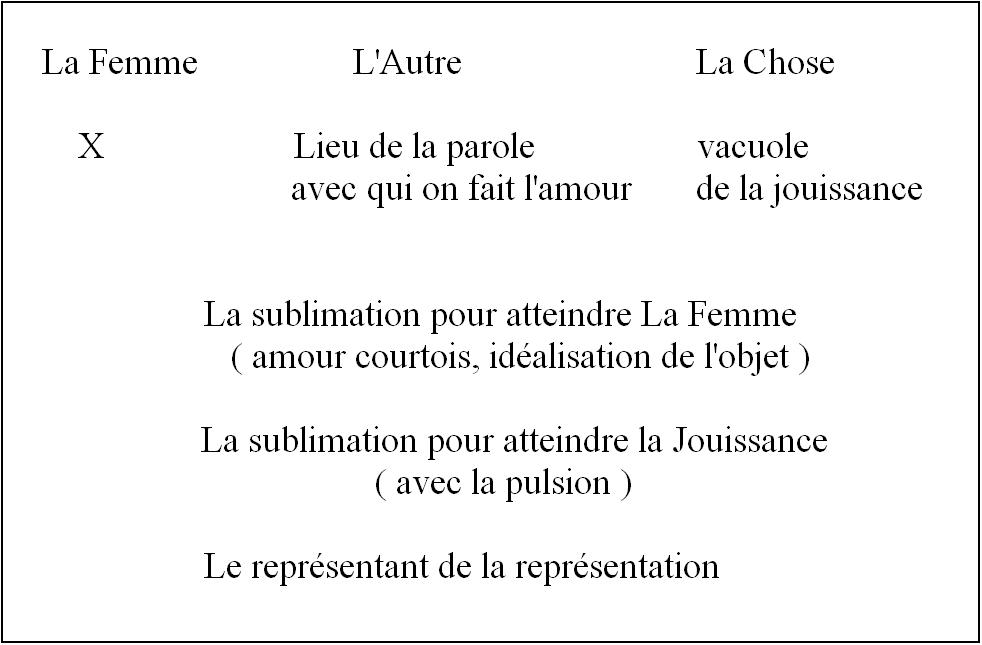
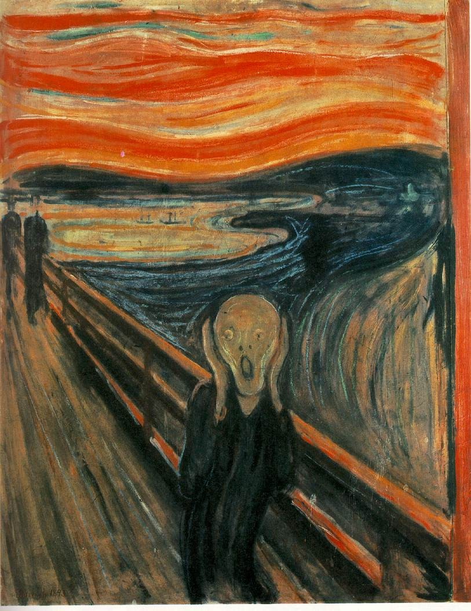
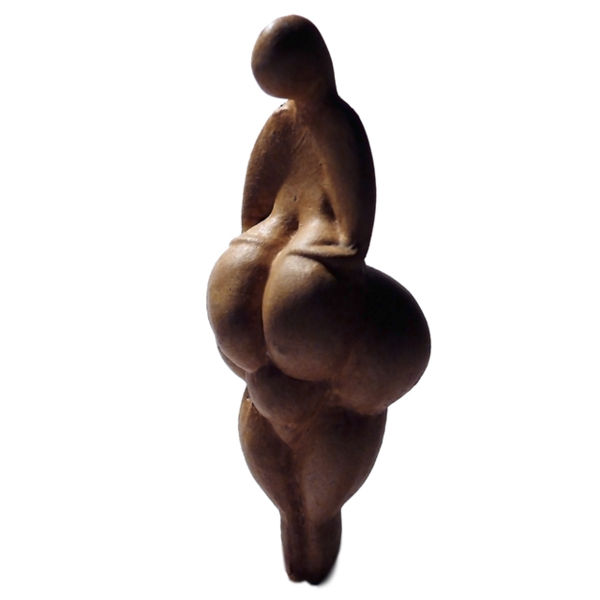
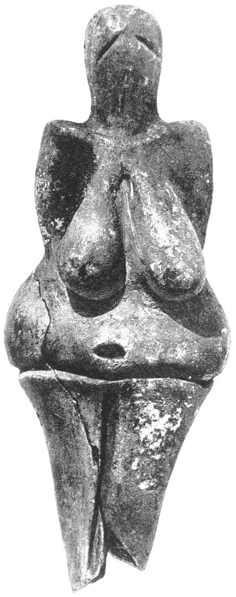
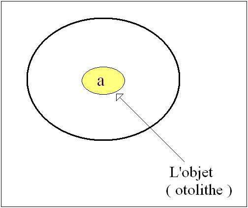

# Leçon 14 | 12 Mars 1969

<!-- source-url: http://staferla.free.fr/S16/S16 D'UN AUTRE... .docx -->
<!-- seminar: s16 -->
<!-- lesson: 14 -->

<!-- id: s16-14-0001 -->

<!-- id: s16-14-0002 -->

J’ai mis quelques petits mots au tableau pour que ça vous serve à accrocher quelques-uns des propos que je tiendrai aujourd’hui devant vous. En fait, depuis le temps, ça devrait vous suffire ! Je veux dire qu’à partir de ces points d’accrochage que figurent dans les premières lignes les *points d’interrogation*, je devrais pouvoir passer la parole au moins à certains d’entre vous pour qu’ils fassent à ma place ce travail hebdomadaire qui consiste dans le forage de ce discours.

<!-- id: s16-14-0003 -->

À la vérité, ce ne serait pas mal qu’on me relaye, je veux dire que…

<!-- id: s16-14-0004 -->

> comme cela s’est fait d’ailleurs quelques-unes des années précédentes …il y en ait qui veuillent bien se dévouer pour pousser plus loin un certain nombre d’objets subsistant, de choses déjà imprimées dont la mise au point ne serait pas vaine après un certain laps de temps.

<!-- id: s16-14-0005 -->

Il est bien évident en effet que le fait… que dans ce que j’énonce, il y ait des temps, des niveaux, surtout si l’on songe au point d’où il m’a fallu partir pour d’abord marteler ce point qui était pourtant bien visible sans que je m’en mêle, à savoir que *l’inconscient* - j’entends l’inconscient dont parle FREUD - *est structuré comme un langage*, ce qui est visible à l’œil nu, *pas besoin de mes lunettes pour le voir, mais enfin il l’a fallu*.

<!-- id: s16-14-0006 -->

Quelqu’un d’amical me disait récemment que la lecture de FREUD, en somme c’est trop facile, qu’on peut le lire sans y voir que du feu. Après tout pourquoi pas puisqu’à tout prendre, *ceci a été bien prouvé par les faits*, et la première chose massive, celle dont il importait de se dépêtrer d’abord, n’avait même pas - grâce à une suite de configurations qu’on peut appeler « *l’opération de vulgarisation* » - été aperçue. N’empêche qu’il a fallu du temps pour que je le fasse passer, et encore dans le cercle qui à cet endroit était le plus averti pour s’en apercevoir.

<!-- id: s16-14-0007 -->

Grâce à tous ces retards, il arrive des choses dont je ne peux pas dire - loin de là - qu’elles soient pour moi décourageantes.

<!-- id: s16-14-0008 -->

Il arrive par exemple qu’un M. Gilles DELEUZE, continuant son travail, sorte sous la forme de ses thèses, *deux livres capitaux* dont le premier nous intéresse au premier plan. Je pense qu’à son seul titre « *Différence et répétition »,* vous pourrez voir qu’il doit avoir quelque rapport avec mon discours, ce dont certes il est le premier averti. Et puisque comme ça, sans désemparer, j’ai la bonne surprise de voir apparaître sur mon bureau *un livre qu’il nous donne en surplus*…

<!-- id: s16-14-0009 -->

> *vraie surprise d’ailleurs car il ne me l’a nullement annoncé la dernière fois que je l’ai vu après le passage de ses deux thèses* …qui s’appelle « *Logique du sens ».*

<!-- id: s16-14-0010 -->

Il ne serait tout de même pas vain que quelqu’un - par exemple d’entre vous - se saisît d’une partie de ce livre…

<!-- id: s16-14-0011 -->

> je ne dis pas tout entier car c’est un gros morceau, mais enfin il est fait comme doit être fait un livre,
>
> à savoir que *chacun* de ses chapitres implique l’*ensemble* …de sorte qu’en en prenant une part bien choisie, ce ne serait pas mal de s’apercevoir que lui, dans son bonheur, il a pu prendre le temps d’articuler, de rassembler dans un seul texte non seulement ce qu’il en est au cœur de ce que mon discours a énoncé.Et il n’est point douteux que ce discours est au cœur de ses livres puisqu’il y est avoué comme tel et que « *le séminaire sur la lettre volée »* en forme en quelque sorte le pas d’entrée, en définit le seuil.

<!-- id: s16-14-0012 -->

Mais enfin lui, il a pu avoir le temps de toutes ces choses…

<!-- id: s16-14-0013 -->

> qui pour moi, ont nourri mon discours, l’ont aidé, lui ont donné à l’occasion son appareil …telles que la logique des Stoïciens par exemple : il se permet, il peut en montrer la place de soutènement essentielle, il peut le faire avec cette suprême élégance dont il a le secret, c’est-à-dire profitant des travaux de tous ceux qui ont éclairé ce difficile point de la doctrine stoïcienne, *difficile* parce qu’aussi bien elle ne nous est léguée que de morceaux épars, de témoignages étrangers avec lesquels nous sommes forcés de *reconstituer*, en quelque sorte *par des lumières rasantes*, quel en fut effectivement le relief, relief d’une pensée qui n’était pas seulement une philosophie

<!-- id: s16-14-0014 -->

- *mais une pratique,*

<!-- id: s16-14-0015 -->

- *mais une éthique,*

<!-- id: s16-14-0016 -->

- *mais une façon de se tenir dans l’ordre des choses.*

<!-- id: s16-14-0017 -->

C’est aussi bien pourquoi par exemple le fait de trouver à telle page - page 289 - quelque chose, le seul point sur lequel… dans ce livre où je suis maintes fois évoqué …il indique qu’il se sépare d’une doctrine qui serait la mienne, du moins - dit-il - si un certain « *Rapport* »…

<!-- id: s16-14-0018 -->

> *qui à un moment tournant de mon enseignement a porté devant la communauté psychiatrique réunie l’essentiel de ma doctrine sur l’inconscient* …celui de « *deux excellents travailleurs* » qui furent LAPLANCHE et LECLAIRE, comment sur ce point à s’en tenir, dit-il, il fait cette réserve mais il n’hésite pas, bien sûr, étant donné la grande pertinence qu’a dans l’ensemble ce *Rapport* , à m’y rapporter aussi quelque chose qu’il semble impliquer, à savoir ce qu’il appelle, ce qu’il traduit : « *la plurivocité des éléments signifiants au niveau de l’inconscient* » ou plus exactement ce qui s’exprime dans telle formule qu’à relire ce rapport…

<!-- id: s16-14-0019 -->

> puisque j’y avais l’attention attirée par cette remarque de DELEUZE …« *la possibilité de tous les sens, y est-il écrit, se produit à partir de cette véritable identité du signifiant et du signifié* » qui, comme peut-être certains d’entre vous s’en souviennent, résulte d’une certaine façon de manipuler un peu au-delà de la façon dont je l’avais fait la fonction métaphorique et de faire fonctionner le S… rejeté au-dessous de la limite, de la barre, par l’effet métaphorique d’une substitution …de faire jouer ce S conjoint à lui-même, comme représentant l’essence de la relation en cause et jouant comme tel au niveau de l’inconscient.

<!-- id: s16-14-0020 -->

Assurément, c’est là un point que je laisserai d’autant plus volontiers aux auteurs qui, dans ce remarquable *Rapport* , me représentaient, que c’est en effet ce qui résulte d’une certaine manipulation par eux de ce que j’avais énoncé jusqu’alors.

<!-- id: s16-14-0021 -->

*Si quelqu’un voulait s’employer à - là - entrer dans le détail*…

<!-- id: s16-14-0022 -->

> ce qu’assurément l’excès des devoirs de ma marche qui est destinée
>
> par nature à ne pas pouvoir s’arrêter étant donné qu’elle doit être encore longue …*si quelqu’un était capable*…

<!-- id: s16-14-0023 -->

> en rapprochant ce qu’énonce DELEUZE dans l’ensemble de cet ouvrage de ce qui est ici avancé
>
> non absolument sans pertinence mais assurément d’une façon qui représente une faille, d’établir pourquoi
>
> c’est une faille, de serrer d’une façon précise ce qu’il a pu y avoir là de fautif, et ce qui rend cette faute cohérente, très précisément de ce qui dans ce rapport joue autour de ce sur quoi j’ai insisté à plusieurs reprises les années précédentes, à savoir ce qu’il y a d’essentiel dans une *juste traduction*, ce qui revient à dire dans une *juste désarticulation* de la fonction dite *du Vortellungsrepräsentanz et de son incidence au regard de l’inconscient effectif* …*si quelqu’un voulait bien se proposer pour mettre au point ceci*…

<!-- id: s16-14-0024 -->

> qui aurait l’avantage, comme il est toujours nécessaire, de permettre, et à l’occasion d’une façon publique, que ceux qui se réfèrent à mon enseignement et qui, bien entendu, le complètent, le nourrissent, l’accompagnent, de ce qui a pu en être énoncé d’une façon qu’ils complètent, et quelquefois d’une façon clarifiante, les travaux de mes élèves …qu’il soit quand même mis au point ce qui, dans tel ou tel de ce travail ne convient pas entièrement à traduire non pas je dirai *ce qui était à ce moment l’axe de ce que j’énonçais* mais de *ce que la suite a démontré pour en être l’axe véritable*.

<!-- id: s16-14-0025 -->

En attendant qu’une telle bonne volonté se propose, je souligne que l’article auquel je fais allusion « *L’Inconscient, une étude psychanalytique »* a été publié, d’ailleurs on ne sait trop pourquoi, dans les *Temps Modernes* de Juillet 1961, c’est-à-dire sensiblement après que ce rapport ait été énoncé à *un congrès dit de Bonneval*, celui auquel se rapporte ce que j’ai moi-même apporté d’une rédaction aussi elle-même très postérieure dans mes *Écrits* sous le titre *« Position de l’Inconscient »*.

<!-- id: s16-14-0026 -->

Je passe à l’ordre du jour et je poursuis mon propos de la dernière fois et dans l’axe de ce que je vous ai annoncé qui serait à l’ordre du jour aujourd’hui qui est ceci : la sublimation.

<!-- id: s16-14-0027 -->

La dernière fois, j’ai mis en relief et pointé deux choses : qu’il s’agissait, au titre de FREUD…

<!-- id: s16-14-0028 -->

> il y a bien entendu beaucoup d’autres passages à citer mais celui-ci est capital, il est dans [l’*Introduction au Narcissisme*](http://staferla.free.fr/Freud/FREUD%20Gesammelte%20Werke.pdf)

<!-- id: s16-14-0029 -->

- d’abord de *la relation d’idéalisation* *am Objekt, à l’objet*,

<!-- id: s16-14-0030 -->

- et d’autre part du fait que *la sublimation se rattache essentiellement au sort, à l’avatar, au Schicksal des pulsions*, qu’elle en est de ces *avatars*, celle qui par FREUD est énoncée dans *l’article* qui a ce titre « *Trieb und Triebschicksal (Pulsions et leurs avatars) »,* qu’elle en est le 4*ème*, et que ce 4*ème* se caractérise par ceci qu’elle se fait *mit dem Trieb *: «* avec la pulsion* ».

<!-- id: s16-14-0031 -->

Ce terme « *avec* » qu’il est si saisissant de retrouver ici sous la plume de FREUD, au moins pour ceux qui m’ont dans le passé, entendu marteler cet « *avec* » à plusieurs reprises et notamment à reprendre la formule d’ARISTOTE : « *Il ne faut pas dire que l’âme pense mais que l’homme pense avec son âme* [^60] »

<!-- id: s16-14-0032 -->

*Quelque chose* se satisfait « *avec* » la pulsion. Qu’est-ce que c’est, quand d’autre part FREUD nous dit que cette pulsion…

<!-- id: s16-14-0033 -->

> *qu’il nous démonte, de ces quatre termes démontés, c’est là la formule que j’ai toujours soulignée comme essentielle à la pulsion* …c’est un montage de ces quatre termes :

<!-- id: s16-14-0034 -->

- *la source : Quelle,*

<!-- id: s16-14-0035 -->

- *le Drang : la poussée,*

<!-- id: s16-14-0036 -->

- *l’objet : Objekt,*

<!-- id: s16-14-0037 -->

- *et le but : Ziel,*

<!-- id: s16-14-0038 -->

La pulsion trouverait à satisfaire quoi ? C’est ce qui est aujourd’hui en question. Très précisément en ceci :

<!-- id: s16-14-0039 -->

- qu’elle est inhibée quant au but \[zielgehemmt\],

<!-- id: s16-14-0040 -->

- qu’elle *élide* ce qu’il en est du but sexuel.

<!-- id: s16-14-0041 -->

*Il ne suffit tout de même pas de traduire* cela en un fait assurément courant…

<!-- id: s16-14-0042 -->

> *qu’à ainsi imaginer que c’est aux dépens de leur satisfaction sexuelle* que les auteurs, quels qu’ils soient, dont nous apprécions les œuvres, dont les œuvres prennent *valeur sociale* - car c’est là le terme dont FREUD lui-même accentue la chose - qu’il y a là je ne sais quelle substitution obscure …il ne suffit pas de s’en tenir là pour donner sa portée à ce que FREUD a énoncé.

<!-- id: s16-14-0043 -->

C’est bien pourquoi les prémisses, les temps que j’ai mis à aborder ce sujet en articulant expressément dans nos deux dernières rencontres que la sexualité…

<!-- id: s16-14-0044 -->

> au regard de ce qui nous intéresse du champ psychanalytique …constitue certes un horizon, mais que son essence est bien plus loin encore - ai-je articulé - ni son savoir, ni sa pratique, je parle de celle de la sexualité, n’en sont pour autant ni éclairés, ni modifiés.

<!-- id: s16-14-0045 -->

C’est là que je voudrais ramener encore votre attention en un temps où les choses certes, sur le plan biologique, vont un tant soit peu à se dérider : tout ce que nous découvrons au niveau des structures régulatrices prend parfois, avec nos énoncés sur le fonctionnement du langage, d’étranges isomorphismes.

<!-- id: s16-14-0046 -->

Il est assurément plus que prudent de ne pas rester, au regard du sexe, à des schémas grossiers. Si on s’approche avec un peu d’attention des travaux d’un François JACOB sur ce qu’on appelle *le bactériographe* et tout ce qu’une technique expérimentale rigoureuse permet de commencer d’apercevoir de ce qu’il en est des jeux de la matière vivante, il vous viendra peut-être à l’idée qu’avant même qu’il soit question de sexe, ça copule vachement là-dedans !

<!-- id: s16-14-0047 -->

C’est pourquoi peut-être il n’est pas sans rapport qu’à un autre bout du champ, celui qui est le nôtre et qui n’a certes pas son mot à dire au sujet de la biologie, on s’aperçoive aussi que c’est un petit peu plus compliqué que ça de parler du sexe, et que par exemple il conviendrait de ne pas confondre ce qu’il en est du *rapport* - ce terme étant pris dans un sens logique - de la *relation* qui fonde *la fonction conjointe* de deux sexes.

<!-- id: s16-14-0048 -->

Ça semble comme ça aller de soi - hein ? - qu’il n’y en ait que deux ! Pourquoi il n’y en aurait pas trois ou plus ?

<!-- id: s16-14-0049 -->

Il n’y a pas ici la moindre allusion aux usages *batifolants* qui ont été faits de ce terme de « *troisième sexe* » par exemple…

<!-- id: s16-14-0050 -->

> livre particulièrement remarquable, je le dis entre parenthèses, par l’irresponsabilité dont il témoigne …*biologiquement*, pourquoi en effet n’y en aurait-il pas *trois* ?

<!-- id: s16-14-0051 -->

Le fait qu’il y en ait deux constitue certes une des assises fondamentales de la réalité, et dont il conviendrait de s’apercevoir jusqu’où vont les incidences logiques parce que, par un curieux retour, chaque fois que nous avons affaire au nombre deux, voilà, au moins dans notre mental, le sexe qui fait sa rentrée par une petite porte, ceci d’autant plus facilement que, du sexe, on ne sait rien. Petite indication comme ça qu’il y a un chromosome de plus quelque part.

<!-- id: s16-14-0052 -->

Il est assez curieux d’ailleurs qu’on ne puisse jamais dire à l’avance pour une espèce, de quel côté, mâle ou femelle, *ce chromosome de surplus, ce chromosome disjoint*, dissymétrique, on va le trouver. Alors on ferait mieux de faire attention qu’énoncer quelque chose sur le rapport sexuel, ça n’a rien à faire avec ce qui s’y substitue complètement - et spécialement dans la psychanalyse - à savoir les phénomènes d’identification avec *un type* dit, pour l’occasion, *mâle* ou *femelle*.

<!-- id: s16-14-0053 -->

Ceci dit, malgré l’apparence, ce que la psychanalyse démontre c’est justement que même cette identification avec un *type* n’est pas si aisée que cela, et que dans l’ensemble c’est avec une très grande maladresse qu’on arrive à en énoncer quelque chose : *position*, dit-on, *masculine* ou *position féminine*, bien vite on glisse, on parle de *position homosexuelle*.

<!-- id: s16-14-0054 -->

La moindre des choses, c’est d’être un tant soit peu frappé que chaque fois que FREUD veut donner un énoncé précis, il avoue lui-même qu’il est tout à fait impossible de s’en remettre à cette opposition « *mâle ou femelle* », et que c’est celle « *actif ou passif* » qu’il lui substitue. Ce serait intéressant de poser la question de savoir si l’un quelconque des deux termes - masculinité : « *mâlité* » ou « *femellité* » : féminité - est une qualification recevable en tant que prédicat.

<!-- id: s16-14-0055 -->

Est–ce qu’on peut dire « *tous les mâles* », est-ce que ça peut même être énoncé dans une manipulation naïve des qualificatifs. Pourquoi une proposition aristotélicienne ne s’habiliterait-elle pas ainsi : « *Tous les mâles de la création* » par exemple ?

<!-- id: s16-14-0056 -->

C’est une question qui comporterait ceci : « *Est*-*ce que tous les non*-*mâles, ça voudrait dire les femelles ?* »

<!-- id: s16-14-0057 -->

Les abîmes qu’ouvre un tel recours confiant au principe de contradiction, pourraient peut-être aussi être pris dans l’autre sens et nous faire nous interroger - comme déjà j’en annonçai tout à l’heure la démarche - sur ce que le recours au *principe de contradiction* lui-même peut contenir d’implications sexuelles.

<!-- id: s16-14-0058 -->

Bien sûr, il y a d’autres modes que celui du *oui* ou du *non* qui entrent en jeu dans ces *fantasmes* issus de l’improbable abord du rapport sexuel. C’est celui de la polarité par exemple du couple sexuel, ceci au nom d’une vision plus microscopique, de ces filaments qui se produisent au moment que - la fécondation de l’œuf s’étant produite - quelque chose s’établit comme un champ entre les deux *noyaux*, champ qu’il faudrait concevoir moins comme une espèce de champ de gradation que comme un champ comportant selon l’approche des deux pôles une bi-vectorialité croissante et décroissante.

<!-- id: s16-14-0059 -->

Est-ce que, pour être ainsi supporté par cette image du champ si fondamentale en d’autres domaines, *celui de l’électromagnétique* par exemple, ça doit nous suffire à penser que le sexe et son rapport fondamental, c’est de cet ordre-là : deux pôles, quelque chose qui s’organise, une trame d’ordre sphérique, entre les deux ?

<!-- id: s16-14-0060 -->

Bien sûr, si on commence à se poser la question, on s’aperçoit que les fondements ne sont peut-être pas si évidents que ça, que si nous avons des formes qui favorisent un tel support, il y a bien d’autres questions qui peuvent être soulevées des effets *de dominance, d’influence, de répulsion*, voire *de rupture* qui sont peut-être bien de nature à nous inciter à remettre en question ce qui, je le dis, n’est possible à mettre en question bien sûr qu’à partir du moment où on s’est aperçu de ce que ça a de directeur comme indiscuté, comme *naïf* comme on dit.

<!-- id: s16-14-0061 -->

En tout cas, il est très nécessaire, quand on parle de la *Fortpflanzung* par exemple, de ce qu’on ferait, parlant de la finalité du sexe, à savoir la *reproduction*, de voir que ce n’est pas simplement au niveau de…

<!-- id: s16-14-0062 -->

> quand deux personnes couchent ensemble il arrive de temps en temps un petit bébé …que c’est ça qui donne *l’image* de ce qu’il en est *du sexe*.

<!-- id: s16-14-0063 -->

Si j’ai commencé par partir des effets de la copulation sexuelle au niveau cellulaire, c’est bien évidemment pour indiquer qu’il s’agit moins du tiers produit que de la réactivation dans la conjonction sexuelle d’une production fondamentale qui est celle de la forme cellulaire elle-même qui, stimulée par cette passe, devient capable de reproduire quelque chose qui est en son sein même, à savoir son arrangement.

<!-- id: s16-14-0064 -->

Faisons donc attention à ces contaminations qui nous rendent si aisé de faire se recouvrir une fonction dont peut-être tout *l’essentiel* nous échappe avec la position :

<!-- id: s16-14-0065 -->

- *du + ou du* **–** *en mathématiques*,

<!-- id: s16-14-0066 -->

- voire celle *du* 1 *ou du* 0 *dans la logique*.

<!-- id: s16-14-0067 -->

Et ceci d’autant plus que, si je puis dire, la logique freudienne nous met justement bien au point de ceci qu’elle ne saurait fonctionner en termes *polaires* et que tout ce qu’elle a introduit comme logique du sexe ressortit à un seul terme qui est vraiment son terme original, à savoir :

<!-- id: s16-14-0068 -->

- la connotation d’un manque,

<!-- id: s16-14-0069 -->

- un *moins* essentiel qui s’appelle la castration sans laquelle, à son niveau en tant que son niveau est d’ordre logique, rien ne saurait fonctionner.

<!-- id: s16-14-0070 -->

Toute la normativité s’organise pour l’homme comme pour la femme autour de la passation d’un manque.

<!-- id: s16-14-0071 -->

Voilà ce que nous voyons au niveau de la structuration logique telle qu’elle découle de l’expérience freudienne.

<!-- id: s16-14-0072 -->

Je dois ici rappeler que ce que j’ai développé longuement dans une année que j’ai évoquée à l’une de nos dernières rencontres sous le titre de *L*’*Éthique de la Psychanalyse* articule que la dialectique même du *plaisir*, à savoir ce qu’elle comporte d’un niveau de stimulation à la fois recherché et évité, une juste limite d’un seuil, implique la centralité d’une zone interdite, disons, parce que le plaisir y serait trop intense, que cette centralité, c’est là ce que je désigne comme le champ de *la jouissance*.

<!-- id: s16-14-0073 -->

*La jouissance* elle-même se définissant comme étant tout ce qui relève de la distribution du plaisir dans le corps.

<!-- id: s16-14-0074 -->

Cette distribution, sa limite intime, voilà ce qui conditionne ce qu’en son temps et avec bien sûr plus de mots, plus d’illustrations qu’ici je ne peux le faire, ce que j’ai avancé, j’ai désigné comme *vacuole*, comme cet interdit au centre qui constitue en somme ce qui nous est le plus prochain, tout en nous étant extérieur.

<!-- id: s16-14-0075 -->

Il faudrait faire le mot « *extime* » pour désigner ce dont il s’agit. À cette époque, je tirais de textes de FREUD… je n’ai pas le temps de m’étendre sur lesquels …la mise en fonction - sous sa plume - de ce terme que j’ai relevé, d’autant plus saisissant qu’il se distingue de tout ce qu’il a pu énoncer concernant « *les choses* » - « *les choses* » sont toujours « *Sachen* » pour lui - là, il dit « *das Ding* ».

<!-- id: s16-14-0076 -->

Je ne vais pas ici reprendre, car là encore je n’ai pas le temps, quel accent j’ai mis sur ce « *das Ding* ».

<!-- id: s16-14-0077 -->

Tout ce que je peux dire ou rappeler, c’est que FREUD l’introduit par la fonction du *Nebenmensch*.

<!-- id: s16-14-0078 -->

Cet homme le plus proche, cet homme ambigu de ce qu’on ne sache pas le situer, qu’est-il donc ce « *prochain* » qui résonne dans les textes évangéliques au nom de la formule : « *Aime ton prochain comme toi–même* ». Où le saisir ?

<!-- id: s16-14-0079 -->

Où y a-t-il, hors de ce centre de moi-même que je ne puis pas aimer, quelque chose qui me soit plus *prochain* ?

<!-- id: s16-14-0080 -->

C’est aussi bien ce que FREUD, au moment où, forcé en quelque sorte de sa nécessité par des voies déductives, il ne peut le caractériser autrement que par quelque chose d’absolument primaire qu’il appelle « le cri ». C’est dans cette extériorité jaculatoire que ce quelque chose s’identifie, par quoi ce qui m’est le plus intime est justement ce que je suis contraint de ne pouvoir reconnaître qu’au dehors. C’est bien pourquoi ce cri n’a pas besoin d’être émis pour être un cri.

<!-- id: s16-14-0081 -->

J’ai démontré dans cette gravure magnifique qui s’appelle *le Cri,* de MÜNCH, que rien ne convient mieux à sa valeur d’expression que le fait qu’il se situe dans ce paysage calme, avec pas loin sur la route deux personnes qui s’éloignent et qui ne se retournent même pas, de la bouche tordue de *l’être féminin* qui au premier plan, ce cri, le représente, il est d’essence qu’il ne sorte rien que le *silence absolu*.

<!-- id: s16-14-0082 -->

C’est du *silence* que centre ce cri que surgit la présence de l’être le plus proche, de l’être attendu - d’autant plus qu’il est *toujours déjà là -* le prochain, qui n’a aucune *Erscheinung* sauf dans les actes des saints.

<!-- id: s16-14-0083 -->

<!-- id: s16-14-0084 -->

*Ce prochain est-ce ce que j’ai appelé l’Autre, qui me sert à faire fonctionner la présence de l’articulation signifiante dans l’inconscient ?* *Certainement pas !* *Le prochain, c’est l’imminence intolérable de la jouissance. L’Autre n’en est que le terre-plein nettoyé*.

<!-- id: s16-14-0085 -->

Je peux tout de même dire ces choses-là rapidement, comme ça, depuis le temps que je vous articule la définition de l’Autre : C’est justement ça, *c’est un terrain nettoyé de la jouissance*.

<!-- id: s16-14-0086 -->

C’est au niveau de l’Autre que ceux qui s’en donneront la peine pourront situer ce qui, dans le livre de DELEUZE, s’intitule avec une rigueur et une correction admirables, et comme *distinct*, et comme *d’accord* avec tout ce que la pensée moderne des logiciens permet de définir de ce qui s’appelle *les événements*, la mise en scène, et tout le carrousel lié à l’existence du langage.

<!-- id: s16-14-0087 -->

C’est là, dans l’Autre, qu’est l’inconscient structuré comme un langage. La question pour l’instant n’est pas de savoir *comment* et *par qui* a pu se faire ce nettoyage, il faut commencer d’abord par le reconnaître.

<!-- id: s16-14-0088 -->

Peut-être qu’après on pourra dire des choses sensées. Seulement c’est très important de le définir ainsi parce qu’il n’y a qu’à partir de là qu’on peut même concevoir ce qui dans FREUD est parfaitement exprimé, ce que j’exprimais dans deux termes que je crois importants à accentuer :

<!-- id: s16-14-0089 -->

- *la formalisation* d’une part,

<!-- id: s16-14-0090 -->

- *l’impassibilité* d’autre part.

<!-- id: s16-14-0091 -->

De quoi ? Du *désir* !

<!-- id: s16-14-0092 -->

Car c’est ce que FREUD exprime, c’est la dernière phrase de la *Traumdeutung*, le *désir* dont il s’agit, le *désir inconscient*, c’est d’une façon impassible qu’il se maintient dans sa stabilité, transmettant les exigences de ce que FREUD appelle \- à tort ou à raison - le passé. Ce n’est pas parce qu’il y a *Vergänglichkeit* que cela doit tout de suite nous faire verser dans des pensées de bonnes ou mauvaises *impressions*, de névrose traumatique du petit enfant qui dure toujours en chacun de nous, et autres lieux communs, certes non inutilisables. Mais ce qui est essentiel, *c’est cette permanence, cette constance*, et du fait même : qu’est-ce que ça veut dire cette *impassibilité du désir*, complètement donc réductible au *formel*.

<!-- id: s16-14-0093 -->

Alors à quel niveau ça se situe, le rapport sexuel, pour ce que nous pourrions en formuler ? C’est le sens de la question telle qu’elle est écrite aux premières lignes sur ce tableau : *La Femme*, *l’Autre* - lieu du désir qui glisse sous toute parole, intact, impassible - ou bien *La Chose*, le *lieu de la jouissance* ?

<!-- id: s16-14-0094 -->

Alors bien sûr, c’est bien le moment de vous rappeler que ce que je vous ai dit : «  *il n’y a pas de rapport sexuel* » s’il y a un point où ça s’affirme - et tranquillement dans l’analyse - c’est que *La Femme*, on ne sait pas ce que c’est : inconnue dans la boîte ! Sinon - Dieu merci - par des *représentations*, parce que bien sûr, depuis toujours on ne l’a jamais connue que comme ça.

<!-- id: s16-14-0095 -->

Si la psychanalyse met justement quelque chose en valeur, c’est que c’est par un, ou des *représentants de la représentation*.

<!-- id: s16-14-0096 -->

C’est bien là le cas de mettre en valeur la fonction de ce terme que FREUD introduit à propros du refoulement, il ne s’agit pas de savoir pour l’instant si les femmes sont refoulées, il s’agit de savoir si *La Femme* l’est comme telle, et bien sûr ailleurs, et pourquoi pas en elle-même, bien sûr. Ce discours n’est pas androcentrique.

<!-- id: s16-14-0097 -->

*La Femme* dans son essence, si c’est quelque chose - et nous n’en savons rien - elle est tout aussi refoulée pour la femme que pour l’homme, et elle l’est doublement :

<!-- id: s16-14-0098 -->

- d’abord en ceci que le *représentant de sa représentation* est perdu, on ne sait pas ce que c’est que *La Femme*,

<!-- id: s16-14-0099 -->

- et ensuite que ce *représentant*, si on le récupère, est l’objet d’une *Verneinung,* car qu’est-ce d’autre qu’on puisse lui attribuer comme caractère que de *ne pas avoir* ce que précisément il n’a jamais été question qu’elle ait.

<!-- id: s16-14-0100 -->

Pourtant il n’y a que sous cet angle que, dans la logique freudienne, apparaît la femme :

<!-- id: s16-14-0101 -->

- un représentant inadéquat, à côté *le phallus*,

<!-- id: s16-14-0102 -->

- et puis la négation qu’elle l’ait, …c’est-à-dire *la réaffirmation de sa solidarité avec ce truc* qui est peut-être bien son représentant mais *qui n’a avec elle aucun rapport*.

<!-- id: s16-14-0103 -->

Alors ça devrait nous donner à soi tout seul une petite leçon de logique et voir que ce qui manque à l’ensemble de cette logique, c’est précisément le signifiant sexuel. Quand vous lirez DELEUZE… il y en a peut-être *quelques-uns* qui se donneront ce mal …vous vous y romprez à des choses que la fréquentation hebdomadaire de mes discours n’ont apparemment pas suffi à vous rendre familières, *sinon j’aurais plus de productions de ce style à lire*, c’est *que l’essentiel* - est-il dit quelque part - *du structuralisme,* si ce mot a un sens, seulement comme on lui a donné un sens au niveau comme ça de tout un forum, je ne vois pas pourquoi je m’en ferais le privilège …l’essentiel c’est à la fois :

<!-- id: s16-14-0104 -->

- *ce blanc, ce manque dans la chaîne signifiante,*

<!-- id: s16-14-0105 -->

- *avec ce qu’il en résulte d’objets errants dans la chaîne signifiée*.

<!-- id: s16-14-0106 -->

Alors *l’objet errant*, là, par exemple c’est une jolie petite baudruche soufflée, un petit ballon avec dessus des yeux peints et puis une petite moustache. Ne croyez pas que ce soit l’homme. C’est écrit, c’est la femme, puisque cette femme insaisissable, c’est quand même comme ça qu’on la voit circuler tous les jours. C’est ce qui même nous permet d’avoir un certain sens du relatif au regard de ce fait que ça pourrait ne pas être comme ça.

<!-- id: s16-14-0107 -->

Dans une époque moins logicienne, quand nous remontons dans la préhistoire…

<!-- id: s16-14-0108 -->

> là où peut-être il n’y avait pas encore de *complexe d’Œdipe* …on nous fait des petites statuettes de femmes…

<!-- id: s16-14-0109 -->

> *qui devaient être quand même précieuses, pour qu’on les ait encore retrouvées, il fallait tout de même les serrer dans des coins* …qui avaient une forme comme ça :

<!-- id: s16-14-0110 -->

<!-- id: s16-14-0111 -->

Ici plus du tout de petite baudruche, d’yeux ni de moustache, ici de formidables fesses et… bon, c’est comme ça que se compose une *Vénus préhistorique*. Je ne l’ai pas très bien dessinée mais c’était pour vous donner une impression.

<!-- id: s16-14-0112 -->

C’était moins andromorphe. Ça ne veut pas du tout dire ce que s’imaginent les paléontologues, ça ne veut pas du tout dire qu’elles étaient comme ça. Le *représentant de la représentation* était autrement que pour nous. Il n’était pas un ballon ou deux.

<!-- id: s16-14-0113 -->

Et vous vous rappelez aussi *[Les mamelles de Tiresias](http://fr.wikisource.org/wiki/Les_Mamelles_de_Tir%C3%A9sias/Acte_premier) *:

<!-- id: s16-14-0114 -->

> « *Envolez-vous, oiseaux de ma faiblesse…* ».

<!-- id: s16-14-0115 -->

Le *représentant de la représentation* était assurément comme ça.

<!-- id: s16-14-0116 -->

Ça vous prouve que selon les âges, le *représentant de la représentation* peut différer.

<!-- id: s16-14-0117 -->

Alors, sur ces prémisses, nous pouvons maintenant un peu nous avancer sur ce qu’il en est de *la sublimation* dont je vous ai assez dit tout à l’heure comment FREUD l’articule pour n’avoir pas à le répéter, *zielgehemmt, idéalisation* de l’objet, et opérant *avec la pulsion*. FREUD prend un certain nombre de portes par où ça peut se produire. Les plus simples sont évidemment les *Reaktionsbildung.* Si nous savons où est la barrière, à savoir du côté de la jouissance, il est bien clair qu’on peut l’imaginer, la classer, ce qui pour autant d’ailleurs ne l’éclaire pas, parmi les *Reaktionsbildun,* les formations de réactions à l’approche de la jouissance. Mais ça ne suffit pas encore à nous expliquer comment ça décroche.

<!-- id: s16-14-0118 -->

Or FREUD nous indique dans une petite note, une phrase qui la termine, qu’il y a en dehors de tous les abords qu’il définit comme possibles à *la sublimation*, d’autres et de tout à fait simples. Simplement il ne les dit pas.

<!-- id: s16-14-0119 -->

Peut-être avait-il quelque peine à les penser, en fonction de ceci après tout que s’il nous a donné les éléments qu’on appelle intuitifs ou encore beaucoup plus improprement naïfs dans la logique mathématique de ce qui fait notre matière logique, ce n’est pas pour autant qu’il s’en soit tout à fait aperçu lui–même qu’elle prêtait à formalisation.

<!-- id: s16-14-0120 -->

On sublime, nous dit-il, *avec les pulsions*. D’autre part, qu’est-ce que nous savons ? D’où viennent ces pulsions ?

<!-- id: s16-14-0121 -->

De l’horizon de la sexualité. Pas le moins du monde éclairci jusqu’à présent du fait qu’elles comportent une satisfaction sexuelle. Mais ce qu’on nous dit, c’est que leur *jouissance* est liée à la sexualité.

<!-- id: s16-14-0122 -->

Il n’est pas mauvais à ce niveau que nous ayons commencé d’abord par poser que *de la sexualité nous ne savons rien*.

<!-- id: s16-14-0123 -->

Par contre ce que nous avons articulé et que *j’ai articulé*, c’est que dans la pulsion intervient ce qu’on appelle en topologie une *structure de bord*, que c’est la seule façon d’expliquer certains de ses traits, à savoir que ce qui fonctionne, c’est essentiellement quelque chose de toujours caractérisé grossièrement par des orifices et où se retrouve la *structure de bord*.

<!-- id: s16-14-0124 -->

Car seule cette *structure de bord* prise au sens mathématique nous permet d’amorcer une compréhension de ce que FREUD n’articule pas moins au niveau du *Drang*, de la poussée, à savoir de la constance du flux que ce bord conditionne.

<!-- id: s16-14-0125 -->

J’ai mis là-dessus une note, je l’ai encore améliorée dans la dernière édition, me référant à ce qui, dans la théorie vectorielle se définit comme flux rotationnel.

<!-- id: s16-14-0126 -->

La pulsion, pour tout dire, à soi toute seule, désigne la conjonction de la logique et de la corporéité.

<!-- id: s16-14-0127 -->

L’énigme est plutôt ceci : comme *jouissance de bord*, comment a-t-elle pu être appelée à *l’équivalence de la jouissance sexuelle* ?

<!-- id: s16-14-0128 -->

Si vous avez quand même un peu d’imagination…

<!-- id: s16-14-0129 -->

> je veux dire de possibilité de relier ce que vous cogitez quelque part du côté de vos circonvolutions avec votre expérience certainement évidemment accessoire et toujours entre deux portes …vous pourriez quand même dire :

<!-- id: s16-14-0130 -->

> « *Au niveau de la jouissance sexuelle, il s’agit plutôt de tumescence par exemple, et puis d’orgasme…*
>
> *Qu’est*-*ce que ça a à faire avec des fonctions de bord ?* »

<!-- id: s16-14-0131 -->

S’il n’y avait pas de configuration de *vacuole*, de *trou* propre à la *jouissance*, à ce quelque chose d’insupportable pour ce qui est réglé essentiellement comme tension tempérée, vous ne verriez rien dans le sexuel qui soit analogue à ce que j’appelle dans la pulsion « *une structure de bord »*. Ici le bord est constitué par *une sorte de logistique de la défense*. Si cette *logistique de la défense*, on ne savait pas qu’après tout elle se rencontre à tous les tournants, même dans la pratique sexuelle, et justement dans la mesure où cette pratique est autre chose que ce qui se fait à la va-vite avec comme ça de vagues petites épaves directrices qui vous restent du vocabulaire freudien à propos de « *la jouissance de la femme* », peut-être quelque chose commencerait à vous intéresser d’une façon plus proche, plus collante, plus directe, à ce qu’il en est, non pas du rapport sexuel sur lequel vous ne pouvez pas dire grand­ chose, mais sur ce qu’il en est du maniement de la jouissance sexuelle.

<!-- id: s16-14-0132 -->

Toutes les énigmes qui apparaissent - on ne sait pas pourquoi - quand on étudie la sexualité féminine, l’*énigme* que représente aux yeux de certains la sensibilité de la paroi vaginale et le fait en quelque sorte, je ne dis pas *insituable* mais *limitrophe* de la jouissance féminine est quelque chose qui trouverait bien plus aisément à s’accorder de *la topologie* que nous essayons d’approcher ici. Mais ce n’est pas notre sujet dans son détail.

<!-- id: s16-14-0133 -->

L’important est ce que j’avance, que quelque chose ici ressemble à *La Chose* et cette *Chose* que j’ai fait parler en son temps sous le titre de *La Chose freudienne*, c’est bien pour ça que nous lui donnons des traits de femme quand dans le mythe nous l’appelons *La Vérité*. Seulement ce qu’il ne faut pas oublier - c’est là le sens de ces lignes au tableau - c’est que *La Chose*, elle, assurément n’est pas sexuée. C’est probablement ce qui permet que nous fassions l’amour avec elle, sans avoir la moindre idée de ce que c’est que *la Femme* comme chose sexuée.

<!-- id: s16-14-0134 -->

Alors ça nous permettra peut-être d’introduire, étant donné l’heure, les deux directions sous lesquelles peut s’étudier *la sublimation*. Si j’ai pris soin dans mon séminaire sur *L’éthique* de faire une part grande à « *l’amour courtois* », c’est parce que ça nous permettait d’introduire ceci : c’est que *la sublimation concerne la femme dans le rapport de l’amour,* *au prix de la constituer au niveau de La Chose*.

<!-- id: s16-14-0135 -->

Il faut, hélas, parce que je ne referai pas tout ceci cette année, que vous vous reportiez - mais je m’efforcerai que vous en ayez assez vite le texte - à la longue étude que j’ai faite alors de « *l’amour courtois* » \[séminaire 1958-59 : « L’éthique »\] pour donner à ceci sa portée. C’est très éclairant, et ce sera très avantageusement relu à la lumière des formules que je peux enfin donner maintenant dans leur absoluité.

<!-- id: s16-14-0136 -->

Le rituel de l’approche, les stades de *gradus* si je puis dire, vers une jouissance ménagée, mais aussi bien presque sacralisée, voilà quelque chose dont ce n’est pas un des côtés les moins amusants de l’affaire quand on l’approche et l’étudie, que de voir la maladresse - je ne peux pas la dire touchante, elle est simplement répugnante - avec laquelle les gens qui sont dans les lieux où se concentre le tout-venant de ces textes, qui bien sûr n’intéressent plus personne, ces gens qui sont irréductiblement professeurs…

<!-- id: s16-14-0137 -->

> c’est-à-dire vivant dans des conditions que nous connaissons tous quand nous allons leur faire visite et dont je dirai que le symbole majeur a été donné très joliment par Anatole FRANCE sous le titre *Le Mannequin d’osier* - il aurait fallu que je vous fasse un autre dessin : pour le mannequin d’osier, ça serait dans le sens inverse ! …cette espèce de stupeur, d’ahurissement qui les saisit :

<!-- id: s16-14-0138 -->

« *Et puis, mon Dieu, comment ces gens qui, à cette époque*-*là, la nuit du Moyen*-*Age, étaient si peu raffinés*…

<!-- id: s16-14-0139 -->

> vous pensez, ils étaient moins raffinés que le Professeur en question et sa *bobonne* ! …*comment est-ce que ces gens avaient pu imaginer des hommages si exaltés, qu’est*-*ce que c’est que tout ça, toutes ces femmes que nous chantent* *les poètes, elles ont toutes, toutes le même caractère…* »

<!-- id: s16-14-0140 -->

Évidemment qu’elles ont toutes le même caractère, c’est aussi un *représentant de la représentation*, elles sont comme les Vénus préhistoriques, elles ont toutes le même caractère. Ça ne veut pas dire que ces femmes n’existaient pas, ni que les poètes ne leur faisaient pas l’amour en fonction de leurs mérites ! Il y a bien d’autres choses encore qui les stupéfiaient, y compris l’accent mis sur l’épreuve, la cruauté, mille autres choses de cette espèce. Je me suis bien amusé pendant deux mois et demi \[séances du 20-01-1960 au 30-03-1960\], et j’espère ceux qui m’écoutaient alors… J’essaierai de remettre ça au propre d’une façon qui se transmette.

<!-- id: s16-14-0141 -->

En tout cas c’est un hommage, enfin c’est ce qui nous en reste, rendu par la poésie à ce qui est à son principe, à savoir le désir sexuel, la tentative, autrement dit, de dépasser ce qu’il en est - quoi qu’on en dise dans le texte de FREUD - de l’amour accessible, en dehors de *techniques spéciales*, à savoir de rester toujours étroitement narcissique.

<!-- id: s16-14-0142 -->

Seulement il y a l’autre versant, le rapport de *la sublimation* à ce qu’on appelle *l’œuvre d’art*. Quand FREUD nous dit que *la sublimation* donne la satisfaction de la pulsion, et ceci dans une production dont après tout la caractéristique de l’estime que lui donne le social est tout à fait inexpliquée.

<!-- id: s16-14-0143 -->

Pourquoi diable, alors que nous avons tellement de soucis, si ce n’est bien sûr l’hypothèse du divertissement, à savoir que c’est justement pour ne pas nous occuper des soucis qui sont beaucoup plus importants que nous prenons goût à quelques-unes des choses qui sont déversées à la portée de nos bourses sous la forme de romans, tableaux, poésies et nouvelles. La chose prise sous ce jour paraît sans issue.

<!-- id: s16-14-0144 -->

Néanmoins je ne vous ferai pas - de ce que j’introduirai la prochaine fois - une entrée trop rapide. Le rapport de *la sublimation* avec *la jouissance* - puisque c’est de cela qu’il s’agit - en tant qu’elle est jouissance sexuelle, ne peut s’expliquer que par littéralement ce que j’appellerai « *l’anatomie de la vacuole* ». C’est pourquoi j’ai fait à droite le tracé de ce quelque chose de cerné qui la représente, la vacuole.

<!-- id: s16-14-0145 -->

<!-- id: s16-14-0146 -->

Un instant imaginez-vous cette vacuole comme étant ce qu’a d’appareil auditif un de ces animalcules qu’on appelle, je ne sais pas pourquoi, primitifs - rien n’est plus primitif qu’autre chose - mais prenez une *daphnie*, ça ressemble à une minuscule crevette, mais en beaucoup plus simple, ça se trouve dans tous les cours d’eau.

<!-- id: s16-14-0147 -->

La daphnie, dans je ne sais quoi dont on peut dire qui lui sert d’organe auditif mais en même temps vestibulaire, c’est-à-dire équilibratoire, a ce qu’on appelle *un otolithe*… si je sais tout ça, c’est parce que j’ai regardé les comptes rendus : c’est l’article d’un psychanalyste, je vous dirai lequel la prochaine fois, qui a attiré là-­dessus mon attention. Ça devient très amusant si, à la place de l’otolithe, vous mettez un petit bout de fer et qu’après vous jouez avec des aimants autour. Ça la fait jouir ! Naturellement on peut le présumer aux attitudes diversement extraordinaires qu’elle peut prendre. Tout à fait un homme dans sa vie morale !

<!-- id: s16-14-0148 -->

Voilà ce que je veux vous indiquer en introduction à la prochaine fois : c’est que *l’objet(a)* joue ce rôle par rapport à *la vacuole*, autrement dit il est ce qui chatouille *das Ding* par l’intérieur. Voilà.

<!-- id: s16-14-0149 -->

C’est ce qui fait le mérite essentiel de tout ce qu’on appelle *œuvre d’art*. Néanmoins la chose mérite d’être détaillée.

<!-- id: s16-14-0150 -->

Et comme *l’objet(a)* a plus d’une forme, comme l’énonce expressément FREUD en disant dans son analyse de la pulsion, que l’objet ça peut être très variable, ça valse …néanmoins nous sommes arrivés à en énoncer quatre, entre :

<!-- id: s16-14-0151 -->

- *l’objet oral*,

<!-- id: s16-14-0152 -->

- *l’objet anal*,

<!-- id: s16-14-0153 -->

- *l’objet* si vous voulez *scoptophilique,*

<!-- id: s16-14-0154 -->

- et *l’objet sado*-*masochique* quel est-il, celui-là ?

<!-- id: s16-14-0155 -->

Disons qu’à propos de celui-là, la prochaine fois vous réserve des surprises.

## Notes

[^60]: [Aristote : « *De l’âme* »](http://remacle.org/bloodwolf/philosophes/Aristote/tableame.htm), I, 4, 408b, 14/15, Paris, Les Belles Lettres, 1966. « *Mieux vaudrait sans doute ne pas dire que l’âme a pitié, apprend ou pense,*

    *mais plutôt l’homme par son âme...* ». Cf. Séminaires : *L’Acte... *:13-03-68, *Les fondements... *:12-02-64.
