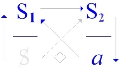
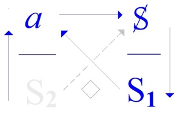
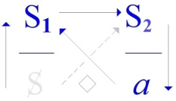
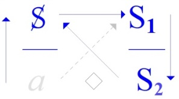

# Leçon 01 | 26 Novembre 1969 Université Paris I, Panthéon-Sorbonne

<!-- source-url: http://staferla.free.fr/S17/S17 L'ENVERS.docx -->
<!-- seminar: s17 -->
<!-- lesson: 01 -->

<!-- id: s17-01-0001 -->

Permettez-moi, mes chers amis, une fois de plus, d’interroger cette *assistance*, en tous les sens du terme, que vous m’apportez, et notam­ment aujourd’hui, en me suivant tous dans un 3ème - pour certains d’entre vous - dans un 3ème de mes déplacements.

<!-- id: s17-01-0002 -->

Avant de reprendre cette interrogation, tout de même, je ne puis moins faire que de préciser - pour en remercier qui de droit - comment je suis ici. C’est au titre d’un prêt, que la *Faculté de Droit* veut bien faire à un certain nombre de mes collègues des *Hautes Études* auxquels elle a bien voulu m’adjoindre. Que la *Faculté de Droit*, et particulièrement ses plus hautes autorités, notam­ment M. le Doyen, en soient ici par moi - et, je pense, avec votre assenti­ment - remerciées.

<!-- id: s17-01-0003 -->

Comme peut-être l’affiche vous l’a appris, je ne parlerai ici...

<!-- id: s17-01-0004 -->

> non certes que le lieu ne me soit offert tous les mercredis ...je ne parlerai ici que le 2ème et le 3ème mercredi de chaque mois, me libérant par là, aux fins d’autres offices sans doute, les autres mercredis.

<!-- id: s17-01-0005 -->

Et notamment je crois pouvoir annoncer que le premier de ces mercredis du mois, au moins pour une part...

<!-- id: s17-01-0006 -->

> c’est-à-dire un mois sur deux, et donc je commencerai le mois prochain, le mois de Décembre ...les premiers mercredis de Décembre, de Février, d’Avril et de Juin, c’est à Vincennes que j’irai porter...

<!-- id: s17-01-0007 -->

> non pas mon séminaire, comme il fut annoncé d’une façon erronée ...mais ce qu’en contraste et pour bien souligner qu’il s’agit d’autre chose, j’ai pris soin de nommer « *quatre impromptus »,* auxquels j’ai donné un titre humoristique dont vous prendrez connaissance sur les lieux où il est déjà affiché.

<!-- id: s17-01-0008 -->

Puisque, comme vous le voyez, il me plaît de laisser en suspens telle ou telle indication, j’en profite très vite pour libérer ici un scrupule qui m’est resté d’une sorte d’accueil que j’ai fait, en somme à la réflexion, peu aimable, non pas que je l’aie voulu tel, mais il se trouva ainsi de fait : un jour, une personne...

<!-- id: s17-01-0009 -->

> qui est peut-être ici et sans doute ne se signa­lera pas ...m’abordait dans la rue au moment que je montais, que je prenais pied dans un taxi.

<!-- id: s17-01-0010 -->

Elle arrêta pour ça son vélomoteur, pour me dire :

<!-- id: s17-01-0011 -->

- *Est-ce que c’est vous, le docteur Lacan ?*

<!-- id: s17-01-0012 -->

- *Que oui,* lui dis-je, *et pourquoi ?*

<!-- id: s17-01-0013 -->

- *Est-ce que vous reprenez votre séminaire ?*

<!-- id: s17-01-0014 -->

- *Mais oui, bientôt.*

<!-- id: s17-01-0015 -->

- *Et où ?*

<!-- id: s17-01-0016 -->

Et là, sans doute que j’avais pour cela mes raisons, elle voudra bien m’en croire, je lui répondis :

<!-- id: s17-01-0017 -->

- *Vous le verrez.*

<!-- -->

<!-- id: s17-01-0018 -->

-

<!-- id: s17-01-0019 -->

- À la suite de quoi elle partit sur son petit vélomoteur, qu’elle avait décroché avec une telle prestesse que j’en restais à la fois interdit et chargé de remords \[Rires\]. C’est ce remords que j’ai voulu aujourd’hui exprimer en lui présentant mes excuses,

<!-- id: s17-01-0020 -->

- si elle est là, pour qu’elle me pardonne.

<!-- id: s17-01-0021 -->

À la vérité, c’est assurément une occasion de remarquer que ce n’est jamais un excès, en quelque façon que ce soit, par l’excès de quelqu’un d’autre qu’on se montre, au moins apparemment, excédé.

<!-- id: s17-01-0022 -->

C’est toujours parce que cet excès vient coïncider avec un excès à vous.

<!-- id: s17-01-0023 -->

C’est parce que moi, j’étais déjà sur ce point dans un certain état qui représentait un excès de préoccupation, que sans doute je me suis manifesté ainsi d’une façon que j’ai trouvée très vite intempestive.

<!-- id: s17-01-0024 -->

Eh bien entrons - sur ce - dans ce qu’il va en être de ce que nous apportons cette année.

<!-- id: s17-01-0025 -->

« *La Psychanalyse à l’envers »,* ai-je cru devoir intituler ce séminaire.

<!-- id: s17-01-0026 -->

Ne croyez pas que ce titre doive quoi que ce soit à l’actualité qui se croirait en passe de *mettre un certain nombre de lieux à l’envers*.

<!-- id: s17-01-0027 -->

Je n’en donnerai pour preuve que ceci : c’est que dans un texte qui est daté de 1966, et nommé­ment dans une de *ces introductions*...

<!-- id: s17-01-0028 -->

> que j’ai faites, au moment du recueil de mes « *Écrits »* ...une de ces introductions qui scandent ce recueil, qui s’appelle « *De nos antécédents »*... ça se trouve, si mon souvenir est bon et si je l’ai bien noté, à la page 68 ...je fais très précisément allusion, ou plus exactement je caractérise, ce qu’il en a été du « *discours »*, comme je m’exprime, d’une reprise - dis-je - du projet freudien à l’envers. C’est écrit donc bien avant les événe­ments.

<!-- id: s17-01-0029 -->

Qu’est-ce à dire ?

<!-- id: s17-01-0030 -->

Il m’est arrivé l’année dernière, en tout cas avec beaucoup d’insistance, de distinguer ce qu’il en est du *discours*, comme une struc­ture nécessaire de quelque chose qui dépasse de beaucoup la parole, toujours plus ou moins occasionnelle.

<!-- id: s17-01-0031 -->

« *Ce que je préfère* - ai-je dit, et même affiché un jour - *c’est un discours sans parole »* [^1].

<!-- id: s17-01-0032 -->

C’est qu’à la vérité, sans paroles, il peut fort bien subsister.

<!-- id: s17-01-0033 -->

Il subsiste dans certaines relations fondamentales qui littéralement ne sauraient subsister sans *le langage*, sans l’instauration par l’instrument du langage d’un certain nombre de relations stables, à l’intérieur desquelles peut certes s’inscrire quelque chose qui va bien plus loin, qui est bien plus large, que ce qu’il en est des énonciations effectives.

<!-- id: s17-01-0034 -->

Nul besoin de ces *énonciations* pour que notre conduite, pour que nos actes éventuellement, s’inscrivent du cadre de certains énoncés primordiaux.

<!-- id: s17-01-0035 -->

S’il n’en était pas ainsi, qu’en serait-il de ce que nous retrouvons dans *l’expérience,* et spécialement *analytique*...

<!-- id: s17-01-0036 -->

> celle-ci ne s’évoquant en ce joint que pour l’avoir précisément désignée *...*qu’en serait-il de ce qui se retrouve pour nous sous l’aspect du *surmoi* ?

<!-- id: s17-01-0037 -->

Il est *des structures*, nous ne saurions les désigner autrement pour caractériser ce qui est dégageable de cet « *en forme de*… » sur lequel l’année dernière je me suis permis de mettre l’accent d’un emploi parti­culier, ce qu’il en était de ce qui se passe de par *la relation fondamentale*, celle que je définis : *d’un signifiant à un autre signifiant*.

<!-- id: s17-01-0038 -->

<!-- id: s17-01-0039 -->

Voilà la relation fondamentale, celle que je désigne pour être d’*<u>où</u>* résulte l’émer­gence de ceci, que nous appelons le *sujet*, ceci de par *le signifiant* qui en l’occasion fonctionne comme le *représentant* - *ce sujet* - *auprès d’un autre signifiant*.

<!-- id: s17-01-0040 -->

Qu’en est-il, comment situer cette *forme fondamentale*, cette *forme* que si vous voulez bien, sans plus attendre, nous allons cette année écrire, non plus - comme je le disais l’année dernière - *comme l’extériorité du signi­fiant* **S1**, celui d’où part notre définition du discours tel que nous allons l’accentuer en ce premier pas.

<!-- id: s17-01-0041 -->

<!-- id: s17-01-0042 -->

Je mets donc *le signifiant* **S1** pour manifester ce qui résulte de son rapport avec ce cercle dont je ne mets ici que *la trace*.

<!-- id: s17-01-0043 -->

J’avais marqué ici le sigle du A, le champ du grand Autre, mais simplifions.

<!-- id: s17-01-0044 -->

Nous considérons, désignée par le signe **S2**, la batterie des signifiants, de ceux qui sont déjà là.

<!-- id: s17-01-0045 -->

Car au point d’origine où nous nous plaçons pour fixer ce qu’il en est du discours, du discours conçu comme statut de l’énoncé, S1 est celui qui est à voir comme intervenant, intervenant sur ce qu’il en est d’une batterie de signifiants que nous n’avons aucun droit, jamais, de tenir pour dispersée, pour ne formant pas déjà le réseau de ce qui s’appelle *un savoir*.

<!-- id: s17-01-0046 -->

Ce qui se pose d’abord...

<!-- id: s17-01-0047 -->

de ce moment où S1 *vient représenter quelque chose*, par son intervention dans le champ défini, au point où nous sommes ...comme le champ déjà structuré d’un savoir, ce qui est son *supposé* - ὑποχείμενον \[upokeimenon\] - c’est *le sujet* en tant qu’il représente ce trait spécifique, à distinguer de ce qu’il en est de l’individu vivant, et qui assurément en est le lieu, le point de marque, mais qui bien sûr n’est pas de l’ordre, de l’ordre de ce que le sujet fait entrer de par le statut du *savoir*.

<!-- id: s17-01-0048 -->

Sans doute est-ce là, autour du mot *savoir,* *le point d’ambiguïté* sur lequel nous avons aujourd’hui *à bien accentuer* ce qui d’ores et déjà, par plusieurs chemins, sentiers, occasions de lumière, traits de flash, ce à quoi je pense avoir rendu vos oreilles sensibles.

<!-- id: s17-01-0049 -->

Il m’est arrivé l’année dernière...

<!-- id: s17-01-0050 -->

> noterai-je pour ceux qui en ont pris note, pour ceux à qui peut-­être ça trotte encore dans la tête ...il m’est arrivé l’année dernière d’appeler *ce savoir *: « *La jouissance de l’Autre *».

<!-- id: s17-01-0051 -->

C’est une drôle d’affaire, une formulation qui à vrai dire n’a jamais encore été proférée.

<!-- id: s17-01-0052 -->

Elle n’est plus neuve,

<!-- id: s17-01-0053 -->

- puisque j’ai pu, déjà l’année dernière, lui donner devant vous sa vraisemblance suffisante,

<!-- id: s17-01-0054 -->

- puisque j’ai pu en tenir le propos sans soulever de spéciales contestations.

<!-- id: s17-01-0055 -->

C’est là un des points de rendez-vous que j’annonçais pour cette année.

<!-- id: s17-01-0056 -->

Complétons d’abord ce qui fut d’abord à 2 pieds :

<!-- id: s17-01-0057 -->

<!-- id: s17-01-0058 -->

puis à 3 :

<!-- id: s17-01-0059 -->

<!-- id: s17-01-0060 -->

don­nons-lui son 4ème :

<!-- id: s17-01-0061 -->

<!-- id: s17-01-0062 -->

Celui-là, j’y ai depuis, je pense, assez insisté, et spécialement l’an dernier, puisque l’année dernière le séminaire était fait pour ça : « *D’un Autre à L’autre »,* l’intitulais-je. Cet *autre*, le petit, avec son grand L, son L de notoriété, c’était ce que nous désignions...

<!-- id: s17-01-0063 -->

> à ce niveau qui est d’algèbre, qui est de structure signifiante ...c’est ce que nous désignons comme *l’objet(a).*

<!-- id: s17-01-0064 -->

À ce niveau de structure signifiante, nous n’avons à connaître que de la façon dont ça opère.

<!-- id: s17-01-0065 -->

À ce niveau de structure signifiante nous avons liberté de *voir ce que ça fait*...

<!-- id: s17-01-0066 -->

si nous écrivons ces choses, ...*à donner à tout le système* « *un quart de tour »*.

<!-- id: s17-01-0067 -->

Ce fameux « *quart de tour »* dont je parle depuis assez longtemps...

<!-- id: s17-01-0068 -->

> en bien d’autres occasions, notamment depuis la parution de ce que j’ai écrit sous le titre de *Kant avec Sade...*pour qu’on puisse penser que peut-être un jour, on verrait que ça ne se limite pas au fait du schéma dit « Z », mais qu’il y a à ce « *quart de tour »* d’autres raisons que ce pur accident de représenta­tion imaginaire.

<!-- id: s17-01-0069 -->

Voilà un exemple :

<!-- id: s17-01-0070 -->

 

<!-- id: s17-01-0071 -->

À bien prendre les choses, s’il apparaît fondé que la chaîne, la succession de ce qu’il en est des lettres de cet algèbre, ne peut pas être dérangée, si vous vous livrez à cette opération que j’ai appelée « *quart de tour »* nous n’obtiendrons pas plus de 4 structures, dont celle qui est ici écrite à gauche nous montre en quelque sorte *le départ*.

<!-- id: s17-01-0072 -->

Il est très facile de produire vite, sur le papier, les deux qui restent.

<!-- id: s17-01-0073 -->

   

<!-- id: s17-01-0074 -->

Cela n’est pas *<u>que</u>* pour spécifier un appareil qui n’a absolument rien d’*imposé*, comme on dirait de certaines perspectives, rien d’abstrait d’aucune réalité. Bien au contraire, c’est d’ores et déjà inscrit dans ce qui fonctionne comme cette *réalité* dont je parlais tout à l’heure, du dis­cours qui est déjà au monde et qui le soutient, à tout le moins celui que nous connaissons.

<!-- id: s17-01-0075 -->

*C’est là* - pas seulement déjà inscrit : faisant partie de ses arches - *que cette chaîne symbolique*…­ peu importe bien sûr, la forme des lettres où nous l’inscrivons pour peu qu’elles soient distinctes ...*que quelque chose y manifeste une relation constante*.

<!-- id: s17-01-0076 -->

*Telle est cette for­me*, en tant qu’elle dit que c’est au point, à l’instant même où le **S1**...

<!-- id: s17-01-0077 -->

c’est la suite de ce que développera ici notre discours, qui nous dira quel sens il convient de donner à ce moment là ...c’est au moment où ce **S1** intervient dans le champ déjà constitué des autres signifiants...

<!-- id: s17-01-0078 -->

en tant qu’ils s’articulent déjà entre eux comme tels ...qu’à intervenir auprès d’un autre \[signifiant\] de ce système, surgit ceci : **S**, qui est ce que nous avons appelé *le sujet* comme *divisé*.

<!-- id: s17-01-0079 -->

Mais nous avons accentué de toujours que de ce trajet sort quelque chose de défini comme *une perte*, et que c’est cela que désigne *<u>la lettre</u>* qui se lit comme étant *l’objet(<u>a</u>).*

<!-- id: s17-01-0080 -->

Bien sûr nous n’avons pas été sans désigner le point d’où nous extrayons cette fonction de *l’objet perdu* : du discours de Freud, sur le sens spéci­fique de *la répétition* chez l’être parlant.

<!-- id: s17-01-0081 -->

Car ce n’est point de n’importe quel effet biologique de mémoire qu’il s’agit dans *la répétition*.

<!-- id: s17-01-0082 -->

*La répétition* a un certain rapport avec ce qui, de ce sujet et de ce savoir, est la limite qui s’appelle *la jouissance*.

<!-- id: s17-01-0083 -->

C’est pourquoi c’est d’une articulation logique qu’il s’agit dans la for­mule : « *Le savoir est la jouissance de l’Autre* ».

<!-- id: s17-01-0084 -->

De l’Autre, bien entendu pour autant...

<!-- id: s17-01-0085 -->

> car il n’est nul Autre ...pour autant que *l’a fait surgir* *comme <u>champ</u>* *l’intervention du signifiant*.

<!-- id: s17-01-0086 -->

Sans doute me direz-vous que là, en somme, nous tournons toujours en rond :

<!-- id: s17-01-0087 -->

- *le signifiant, l’Autre, le savoir,*

<!-- id: s17-01-0088 -->

- *le signifiant, l’Autre, le savoir*...

<!-- id: s17-01-0089 -->

Et c’est bien là que le terme de *jouissance* nous permet de mon­trer *le point d’insertion* de l’appareil, et sans doute...

<!-- id: s17-01-0090 -->

sortant de ce qu’il en est authentiquement de ce qui est reconnaissable comme *savoir* ...de nous rapporter aux limites, à l’hors-champ, celui que la parole de Freud ose affronter, quand de tout ce que celle-ci articule résulte - résulte quoi ? - non le savoir, mais la *confusion*, car de la *confusion,* elle \[*la parole de Freud*\] nous a porté à tirer réflexion et, puisqu’il s’agit des *limites,* à sortir du système.

<!-- id: s17-01-0091 -->

En sortir en vertu de quoi ? D’une soif de sens ?

<!-- id: s17-01-0092 -->

Comme si le système en avait besoin ! Il n’a aucun besoin, le système !

<!-- id: s17-01-0093 -->

Et nous, *êtres de faiblesse*, tels que nous nous retrouverons dans le cours de cette année à tous les tournants, *nous avons besoin de sens*.

<!-- id: s17-01-0094 -->

Eh bien, en voilà un.

<!-- id: s17-01-0095 -->

*C’est peut-être pas le vrai*, mais ce qu’il y a de certain c’est que nous allons voir aussi qu’il y a beaucoup de « *c’est peut-être pas le vrai* », dont l’insis­tance nous suggère proprement *la démission* \[*lapsus*\]... *la dimension de la vérité*.

<!-- id: s17-01-0096 -->

Eh bien, remarquons l’ambiguïté même qu’a prise, dans la stupidité psychana­lytique, le mot *Trieb*, pour autant qu’au lieu de s’appliquer à saisir comment s’arti­cule cette catégorie...

<!-- id: s17-01-0097 -->

sans doute qui n’est pas sans ancêtre, je veux dire qui n’est pas sans « déjà emploi », et qui remonte loin, jusqu’à Kant ...du mot *Trieb*.

<!-- id: s17-01-0098 -->

Mais tout de même, ce à quoi ça sert dans le discours analytique mériterait bien que l’on ne se pré­cipite pas pour le traduire trop vite, trop vite par le mot « *instinct* ».

<!-- id: s17-01-0099 -->

Mais quand même, ce n’est pas sans raison que se produisent ces glissements.

<!-- id: s17-01-0100 -->

Et après tout, quoique depuis long­temps nous insistions sur le caractère aberrant de cette traduction, nous sommes en droit pourtant d’en tirer profit, non certes pour consacrer - et surtout à ce propos - la notion d’*instinct*, mais pour rappeler ce qui du discours de Freud la rend habitable, et pour tâcher simplement - ce discours - de le faire habiter autrement.

<!-- id: s17-01-0101 -->

Populairement, l’idée de l’instinct est bien l’idée d’un savoir, d’un savoir dont on n’est pas capable de dire ce que ça veut dire, mais qui est censé - et non sans titre - avoir pour résultat que la vie subsiste.

<!-- id: s17-01-0102 -->

Si nous donnons un sens à ce que Freud énonce du *principe du plaisir* comme essentiel au fonctionnement de *la vie*, d’être celui où se maintient *la tension la plus basse*, est-ce que ce n’est pas dire ce que la suite de son discours démontre comme lui être imposé, imposée par le développement - de quoi ? - d’une expérience, de l’expérience analytique, en tant qu’elle est structure de discours.

<!-- id: s17-01-0103 -->

Car n’oublions pas que ce n’est pas à considérer le comportement des gens qu’on invente *la pulsion de mort*.

<!-- id: s17-01-0104 -->

*La pulsion de mort*, nous l’avons ici, là où il se passe quelque chose entre vous et ce que je dis.

<!-- id: s17-01-0105 -->

Je dis : « *ce que je dis »*, je ne parle pas de ce que je suis. À quoi bon, puis­qu’en somme ça se voit grâce à votre assistance.

<!-- id: s17-01-0106 -->

Ce n’est pas qu’elle parle en ma faveur \[*Rires*\]... Elle parle quelquefois, et le plus souvent, *à ma place*.

<!-- id: s17-01-0107 -->

Ce qui justifie, quoi qu’il en soit, qu’ici je dise quelque chose, c’est ce que j’appellerai « *l’essence de cette manifestation* » qu’ont été - successives - les diverses assistances que j’ai attirées selon les lieux d’où je parlais.

<!-- id: s17-01-0108 -->

> \[1) Hôpital Sainte-Anne, Paris XIVème ,
>
> 2\) École Normale Supérieure, rue d’Ulm, Paris Vème,
>
> 3\) et actuellement Université Paris I, Panthéon-Sorbonne, Paris Vème\]

<!-- id: s17-01-0109 -->

Je tenais beaucoup à embrancher quelque part...

<!-- id: s17-01-0110 -->

> parce que aujourd’hui m’en semblait le jour, aujourd’hui où je suis dans un lieu de mieux \[*i.e. un lieu de plus*\] ...de faire remarquer que ce *lieu* a toujours eu son poids pour *faire le style* de ce que j’ai appelé « *cette manifestation* ».

<!-- id: s17-01-0111 -->

*Manifestation*, c’est dire quelque chose, dont aussi je ne veux pas laisser passer l’occasion de dire qu’elle a rapport avec le sens courant du terme « *interprétation »*. Ce que j’ai dit par, pour, et dans, votre assistance, est à chacun des temps que je vous avais définis comme lieux géographiques, toujours déjà interprété.

<!-- id: s17-01-0112 -->

J’y reviendrai, parce que ça aura à prendre place dans « *les petits quadripodes* *tournants* dont je commence aujourd’hui de faire usage. Mais pour ne pas vous laisser complètement dans le vide, j’indique que si j’avais à interpréter, je veux dire à épingler comme interprétation...

<!-- id: s17-01-0113 -->

> ceci qui va dans le sens contraire à *l’interprétation analytique*,
>
> ceci qui fait bien sentir combien *l’interprétation analytique* est elle-même à rebours du sens commun du terme interpréter,

<!-- id: s17-01-0114 -->

- ...qu’à épingler donc *l’interprétation* de ce que je disais à Sainte-Anne par exemple,

<!-- id: s17-01-0115 -->

- je dirais que le plus sensible, la corde qui vibrait vraiment, c’était *la rigolade*.

<!-- id: s17-01-0116 -->

Le personnage le plus exemplaire de cette audience...

<!-- id: s17-01-0117 -->

> qui était médicale sans doute, mais enfin il y avait aussi quelques assistants qui ne l’étaient pas ...était celui qui brochait mon discours d’une sorte de jet continu de *gags*.

<!-- id: s17-01-0118 -->

C’est cela que je prendrai pour le plus caractéristique de ce qui fut pendant dix ans l’essence de ma manifestation.

<!-- id: s17-01-0119 -->

*Les choses n’ont commencé à s’aigrir que du jour* - et c’est une preuve de plus - *où j’ai consacré un tri­mestre à* *l’analyse du* *mot d’esprit*. \[*Rires*\]

<!-- id: s17-01-0120 -->

Je ne peux pas longtemps aller dans ce sens, c’est une grande parenthèse, mais il faut bien que j’y ajoute les caractéristiques de *l’interprétation*, là, de l’endroit où vous m’avez quitté la dernière fois, comme ça, c’est absolument magnifique en lettres initiales \[E. N. S.\], ça tourne autour de *l’étant* \[« *ens* » latin\].

<!-- id: s17-01-0121 -->

Il faut toujours savoir profiter des *équivoques litté­rales*, surtout que c’est très important, c’est les 3 *premières lettres* du mot *enseigner*. C’est là qu’on s’est aperçu que ce que je disais était un enseignement.

<!-- id: s17-01-0122 -->

*Avant ça n’en était pas un*, *de toute évidence* c’était même pas admis, les professeurs et spécialement les médecins étaient fort inquiets.

<!-- id: s17-01-0123 -->

Le fait que ce n’était pas du tout médical laissait un fort doute sur le fait que ce fût digne du titre d’enseignement, jusqu’au jour où on a vu des petits gars...

<!-- id: s17-01-0124 -->

> vous savez, là, ceux des « *Cahiers pour l’analyse »* ...où on a vu des petits gars formés dans *un coin*, comme je l’avais dit depuis bien longtemps avant, justement au temps des *gags*, *ce coin* où par effet de formation on ne sait rien, mais on l’enseigne admirablement.

<!-- id: s17-01-0125 -->

Qu’ils aient interprété ce que je disais comme ça, a bien un sens : c’est une autre interprétation.

<!-- id: s17-01-0126 -->

L’interprétation analytique...

<!-- id: s17-01-0127 -->

Naturellement, on ne sait pas ce qui va arriver ici \[Université Paris I, Panthéon-Sorbonne, Paris Vème\].

<!-- id: s17-01-0128 -->

Je ne sais pas s’il viendra des étudiants en droit, mais à la vérité ce serait capital, mais vraiment capital.

<!-- id: s17-01-0129 -->

C’est probablement le temps de beaucoup le plus important des trois, puisque ce dont il s’agit cette année, c’est de prendre la psychana­lyse *à l’envers*.

<!-- id: s17-01-0130 -->

C’est peut-être justement lui donner *son statut*, au sens du terme qu’on appelle *juridique*, ça en tout cas ça a sûrement toujours eu affaire, et au dernier point, avec la structure du discours.

<!-- id: s17-01-0131 -->

Si le droit c’est pas ça, si c’est pas là qu’on touche comment *le discours* struc­ture le monde réel, où ça sera ?

<!-- id: s17-01-0132 -->

C’est pour ça que nous ne sommes pas plus mal ici qu’ailleurs, ce n’est donc pas simplement pour des raisons de commodité que j’en ai accepté l’aubaine, que ça vous fait *dans vos périples le moindre dérangement*, au moins pour ceux qui étaient habitués à *l’autre côté.*

<!-- id: s17-01-0133 -->

\[L’Université Paris I : place du Panthéon, et l’E.N.S. : rue d’Ulm, sont proches\].

<!-- id: s17-01-0134 -->

Il y a une chose : je ne suis pas très sûr que pour le parking ce soit très commode, mais enfin vous avez tout de même encore la rue d’Ulm. Reprenons.

<!-- id: s17-01-0135 -->

Nous étions arrivés à notre « *instinct* » et à notre savoir comme situés en somme, de ce que Bichat définit de la vie : «* La vie*...

<!-- id: s17-01-0136 -->

...dit-il, et c’est la définition la plus profonde, elle n’est pas du tout « *prudhommesque* » si vous voyez de près - ...*est l’ensemble des forces qui résistent à la mort. »*

<!-- id: s17-01-0137 -->

Lisez ce que dit Freud de ce qu’il en est de la résistance de la vie, à « *la pente vers le Nir­vâna* », comme on a désigné autrement *la pulsion de mort* au moment où il l’introduit.

<!-- id: s17-01-0138 -->

Sans doute se présentifie-t-il au sein de l’expérience analy­tique...

<!-- id: s17-01-0139 -->

d’une expérience de *discours* ...cette pente au retour à l’ina­nimé. Freud va jusque-là.

<!-- id: s17-01-0140 -->

Mais ce qu’il en est, dit-il, qui fait la subsistance de cette bulle...

<!-- id: s17-01-0141 -->

vraiment l’image s’impose à l’audition de ces pages ...c’est que la vie n’y retourne que par des chemins, toujours les mêmes, qu’elle a une fois bien tracés.

<!-- id: s17-01-0142 -->

Qu’est-ce, sinon le vrai sens donné à ce que nous trouvons dans la notion *d’instinct*, d’implication d’un *savoir* ?

<!-- id: s17-01-0143 -->

Ce sentier-là, ce chemin-là, on le connaît, c’est le savoir ancestral.

<!-- id: s17-01-0144 -->

Et ce savoir, qu’est-ce que c’est ?

<!-- id: s17-01-0145 -->

Si nous n’oublions pas le point où Freud...

<!-- id: s17-01-0146 -->

> au-delà du *principe de plaisir*, du *principe de réalité* ...introduit ce qu’il appelle lui-même « *Au-delà du principe du plaisir »* qui n’en est pas pour autant renversé.

<!-- id: s17-01-0147 -->

La preuve c’est très précisément que *le savoir* c’est ce qui fait que la vie s’arrête *à une certaine limite vers la jouissance*.

<!-- id: s17-01-0148 -->

Le chemin vers la mort...

<!-- id: s17-01-0149 -->

c’est de cela qu’il s’agit, c’est un discours sur le masochisme ...le chemin vers la mort n’est rien d’autre que ce qu’on appelle *la jouissance*.

<!-- id: s17-01-0150 -->

Ce rapport primitif du *savoir* à *la jouissance*, c’est là que vient s’insérer ce qui surgit...

<!-- id: s17-01-0151 -->

au moment où l’appareil apparaît ...de ce qu’il en est du *signifiant*.

<!-- id: s17-01-0152 -->

Il est concevable dès lors que ce surgissement du signifiant, nous en relions la fonction.

<!-- id: s17-01-0153 -->

Ça suffit ! Qu’avons-nous besoin de tout expliquer ? Et l’ori­gine du langage, pourquoi pas !

<!-- id: s17-01-0154 -->

Chacun sait que pour structurer correc­tement un *savoir*, il est besoin de renoncer à la question des origines, et que ce que nous faisons ici, je vous l’ai dit, *est au regard de ce que nous avons à développer cette année*, c’est-à-dire *une structure*.

<!-- id: s17-01-0155 -->

Ce que nous faisons en articulant ceci est superflu, vaine recherche de sens, déjà. Tenons compte de ce que nous sommes.

<!-- id: s17-01-0156 -->

C’est au joint d’une *jouissance* ...

<!-- id: s17-01-0157 -->

> et non pas de n’importe laquelle, sans doute doit-elle rester opaque ...c’est au joint d’une *jouissance* privilégiée entre toutes, non pas d’être la jouissance sexuelle puisque *ce que cette jouissance désigne* d’être au joint, je le disais à l’instant, c’est *la perte de la jouissance sexuelle*, c’est *la castration*.

<!-- id: s17-01-0158 -->

C’est en rapport au joint avec la jouissance sexuelle que surgit dans la fable, la fable freudienne de la répétition, l’engendrement de ceci qui est radical, et donne corps à un schéma articulé littéralement : c’est pour autant

<!-- id: s17-01-0159 -->

- que **S1** ayant surgi, premier temps,

<!-- id: s17-01-0160 -->

- se répète auprès de **S2**,

<!-- id: s17-01-0161 -->

- d’où surgit - dans l’entrée en rapport \[*i.e. le « rapport »* S1→ S2 \] - *le sujet*, que *quelque chose représente une certaine perte*, dont il vaut d’avoir fait cet effort vers le sens pour comprendre *l’ambiguïté*.

<!-- id: s17-01-0162 -->

Ce n’est pas pour rien que ce même « *objet »*...

<!-- id: s17-01-0163 -->

> que d’autre part j’avais désigné comme celui autour de quoi en somme
>
> s’organise dans l’analyse toute la dialec­tique de la frustration ...ce même « *objet »* l’année dernière aussi, je l’ai appelé le « *plus-de-jouir ».*

<!-- id: s17-01-0164 -->

Ceci veut dire que *la perte de l’objet,* c’est aussi la béance, le trou ouvert *à* quelque chose, dont on ne sait s’il est la représentation *du manque à jouir*, qui se situe du *procès du savoir,* en tant que là, il prend un tout autre accent, *d’être dès lors savoir scandé du signifiant*.

<!-- id: s17-01-0165 -->

Est-ce même le même ?

<!-- id: s17-01-0166 -->

Le rapport à *la jouissance* *s’accentue* soudain de cette fonction encore virtuelle qui s’appelle celle du *désir*.

<!-- id: s17-01-0167 -->

Aussi bien est-ce pour cela-même que j’articule « *plus-de-jouir »* ce qui ici apparaît, non pas d’un forçage ou d’une transgression...

<!-- id: s17-01-0168 -->

Qu’on tarisse un petit peu, je vous en prie, autour de ce cafouillage !

<!-- id: s17-01-0169 -->

Si l’analyse montre quelque chose...

<!-- id: s17-01-0170 -->

j’invoque ici ceux qui y ont un peu d’autre âme que celle dont on pourrait dire, comme Barrès le dit du cadavre, qu’elle bafouille ...c’est très précisé­ment ceci : qu’on ne transgresse rien :

<!-- id: s17-01-0171 -->

- se faufiler n’est pas transgresser,

<!-- id: s17-01-0172 -->

- voir une porte entrouverte, ce n’est pas la franchir.

<!-- id: s17-01-0173 -->

Nous aurons l’occa­sion de retrouver ce que je suis en train d’introduire.

<!-- id: s17-01-0174 -->

Ce n’est pas ici *transgression* mais bien plutôt *irruption*, *chute dans le champ* de quelque chose qui est de l’ordre *de la jouissance* : un *boni*.

<!-- id: s17-01-0175 -->

<!-- id: s17-01-0176 -->

Eh bien, même ça, c’est peut-être ça qu’il faut *payer*.

<!-- id: s17-01-0177 -->

C’est pour ça que l’année dernière, c’est à propos de ce *plus-de-jouir* que je vous ai dit : dans Marx, le *(a)* qui est là, est reconnu comme fonctionnant...

<!-- id: s17-01-0178 -->

> au niveau qui s’articule du discours analytique, pas d’un autre ...reconnu comme *plus-de-jouir*.

<!-- id: s17-01-0179 -->

C’est ça que Marx découvre comme ce qui passe véritablement au niveau de *la plus-value*.

<!-- id: s17-01-0180 -->

Car bien entendu, ce n’est pas Marx qui a inventé* la plus-value*, mais seule­ment, avant lui, personne ne savait quelle place ça avait : la même place ambiguë qui est celle que je viens de dire, du travail en trop, du *plus-de-travail*.

<!-- id: s17-01-0181 -->

*Qu’est-ce que ça paye* - dit-il - *sinon justement de la jouis­sance* dont il faut bien qu’elle aille quelque part ?

<!-- id: s17-01-0182 -->

Ce qu’il y a de troublant, c’est que si on la paye, on l’a, et qu’à partir de là, il n’est plus très urgent de la gaspiller, mais que si on la gaspille, alors ça a toutes sortes de conséquences.

<!-- id: s17-01-0183 -->

Laissons pour l’instant la chose en suspens.

<!-- id: s17-01-0184 -->

Que suis-je en train de faire ?

<!-- id: s17-01-0185 -->

Je commence à vous faire admettre, sim­plement à l’avoir situé, que cet *appareil à* 4 *pattes*, avec 4 posi­tions, peut servir à définir 4 *discours radicaux*.

<!-- id: s17-01-0186 -->

Il n’est pas de hasard que ce soit sa forme que je vous ai donnée comme 1ère :

<!-- id: s17-01-0187 -->

<!-- id: s17-01-0188 -->

\[*disc*ours M\]

<!-- id: s17-01-0189 -->

Mais rien ne dit que je n’aurais pu partir de toute autre, de celle-ci qui est à gauche par exemple :

<!-- id: s17-01-0190 -->

<!-- id: s17-01-0191 -->

Il est un fait, déterminé par des raisons his­toriques, qui fait que cette première forme \[*disc*. M\], celle qui s’énonce à partir de *ce signi­fiant qui représente un sujet auprès d’un autre signifiant,* elle a de l’impor­tance parce que c’est elle qui...

<!-- id: s17-01-0192 -->

> dans ce que nous allons énoncer cette année ...va s’épingler entre toutes, entre les 4, comme étant l’arti­culation du *discours du Maître*.

<!-- id: s17-01-0193 -->

Le *discours du Maître*, je pense qu’il est inutile de vous rapporter son importance historique, puisque quand même, dans l’ensemble vous êtes recrutés sur ce tamis qu’on appelle universitaire, et que de ce fait vous n’êtes pas sans savoir que la philosophie ne parle que de ça.

<!-- id: s17-01-0194 -->

Avant même qu’elle ne parle que de ça, c’est-à-dire qu’elle l’appelle par son nom...

<!-- id: s17-01-0195 -->

> point saillant chez Hegel, tout spécialement illustré par lui ...il était déjà manifeste que c’était dans le champ, au niveau du *discours du Maître,* qu’était apparu quelque chose qui quand même nous concerne, nous concerne quant au discours, quelle que soit son ambiguïté, et qui s’appelle *la philosophie*.

<!-- id: s17-01-0196 -->

Alors je ne sais pas jusqu’où je vais pouvoir porter ce que j’ai aujourd’hui à vous épingler, à vous pointer, je vous rappelle qu’il ne faut pas traîner si nous voulons faire le tour des *quatre discours* en question.

<!-- id: s17-01-0197 -->

Comment s’appellent les autres ?

<!-- id: s17-01-0198 -->

Je vous le dirai tout de suite - pour­quoi pas ? - ne serait-ce que pour vous allécher.

<!-- id: s17-01-0199 -->

  

<!-- id: s17-01-0200 -->

*Discours de l’Hystérique ? Discours Analytique*

<!-- id: s17-01-0201 -->

Celui-là de gauche c’est *le discours de l’hystérique*. Ça se voit pas tout de suite hein ?\[*Rires*\]

<!-- id: s17-01-0202 -->

Ça se voit pas tout de suite, mais je l’expliquerai.

<!-- id: s17-01-0203 -->

Et puis les deux autres :

<!-- id: s17-01-0204 -->

- il y en a un qui est *le discours de l’analyste*,

<!-- id: s17-01-0205 -->

- et puis l’autre, non décidément je vous dirai pas qui c’est... \[*Rires*\] je vous le dirai pas parce que cela prêterait simplement, à être dit aujourd’hui comme ça, à trop de malentendus. Mais enfin vous verrez, c’est un discours tout à fait d’actualité.

<!-- id: s17-01-0206 -->

Bon, eh bien reprenons le *discours du Maître*.

<!-- id: s17-01-0207 -->

Pour autant qu’il faut que j’assoie ce qu’il en est de la désignation de l’appareil algébrique présent, comme donnant la structure du *discours du Maître*.

<!-- id: s17-01-0208 -->

<!-- id: s17-01-0209 -->

*Là* \[**S1**\], disons pour aller plus vite, *le signifiant,* la fonction de signifiant sur quoi s’appuie l’essence du maître.

<!-- id: s17-01-0210 -->

Vous vous sou­venez peut-être d’un autre côté, sur quoi j’ai mis l’accent l’année dernière à plu­sieurs reprises : que le champ propre de l’esclave *c’est le savoir* \[**S2**\].

<!-- id: s17-01-0211 -->

Il ne fait aucun doute, à lire les témoignages que nous avons de l’ère antique, en tout cas du discours qui se tenait sur cette vie...

<!-- id: s17-01-0212 -->

> lisez là-dessus « *La* *Politique »* d’Aristote ...ce que j’avance de l’esclave, comme caractérisé par être celui qui est *le sup­port du savoir*, ne fait aucun doute.

<!-- id: s17-01-0213 -->

Ce qui définit la position de l’esclave pour autant que dans l’ère antique il n’est pas, comme notre moderne esclave, *une classe* simplement, il est *une fonction* inscrite dans la famille. Quand Aristote parle de l’esclave, il est tout autant dans la famille, et plus encore dans l’État, et il l’est parce qu’il est celui qui a un *savoir-faire*.

<!-- id: s17-01-0214 -->

C’est très important, parce qu’avant de savoir *si le savoir <u>se</u> sait*, si l’on peut fonder un sujet sur la perspective d’un savoir totalement transparent en lui-même, il faut savoir éponger le registre de ce qui d’origine est *savoir-faire*.

<!-- id: s17-01-0215 -->

Or ce qui se passe, ce qui se passe sous nos yeux, et qui donne son sens...

<!-- id: s17-01-0216 -->

> un pre­mier sens, vous en aurez d’autres ...à la philosophie, nous en avons tout à fait heureusement, grâce à Platon, une trace.

<!-- id: s17-01-0217 -->

Et il est très essentiel de s’en souvenir pour situer, pour mettre à sa place, qu’après tout si quelque chose a un sens dans ce qui nous travaille, ça ne peut être que de *mettre les choses à leur place* \[*Cf.* 1ère *déf. du Réel* : « *ce qui revient toujours à la même place* »\].

<!-- id: s17-01-0218 -->

Ce que la philosophie désigne dans toute son évolution c’est ceci : le vol, le rapt, la soustraction à l’esclave de son savoir, par l’opération du *Maître*.

<!-- id: s17-01-0219 -->

Il suffit d’avoir un petit peu de pratique...

<!-- id: s17-01-0220 -->

> et Dieu sait si depuis 16 ans je fais effort pour que ceux qui m’écoutent la prennent, cette pratique ...un peu de pratique des dialo­gues de Platon pour s’en apercevoir.

<!-- id: s17-01-0221 -->

Qu’est-ce que cherchent ce que j’appellerai à cette occasion *les deux faces du savoir* :

<!-- id: s17-01-0222 -->

- ce savoir-faire si parent du savoir animal,

<!-- id: s17-01-0223 -->

- mais qui chez l’esclave n’est absolument pas dépourvu - bien sûr - de cet appareil qui en fait un réseau langagier - bien sûr - des plus articulés.

<!-- id: s17-01-0224 -->

Parce qu’il s’agit de cela - la seconde couche, l’appareil articulé - de s’apercevoir que ça, ça peut se trans­mettre, ce qui veut dire se transmettre de la poche de l’esclave à celle du Maître, si tant est qu’à cette époque on eût des poches !

<!-- id: s17-01-0225 -->

Et tout l’effort de dégagement de ce qui s’appelle l’επιστήμη \[épistémè\] ...

<!-- id: s17-01-0226 -->

c’est un drôle de mot, je ne sais si vous y avez jamais bien réfléchi : « *se mettre en bonne position »,* comme « *Vorstellung »*, c’est le même ...il s’agit de trouver la position pour que le savoir devienne savoir de Maître.

<!-- id: s17-01-0227 -->

La fonction de l’επιστήμη \[épistémè\] en tant que savoir transmissible elle est spécifiée comme telle...

<!-- id: s17-01-0228 -->

> reportez-vous aux dialogues de Platon ...elle est tout entière empruntée toujours aux recours aux techniques artisanales, c’est-à-dire *serves*.

<!-- id: s17-01-0229 -->

Ce dont il s’agit, c’est d’en extraire l’essence pour qu’il devienne savoir de Maître.

<!-- id: s17-01-0230 -->

Et puis ça se redouble naturellement d’un petit choc en retour, qui est tout à fait, comment dirais-je...

<!-- id: s17-01-0231 -->

ce qu’on appelle un *lapsus*, n’est-ce pas, un *retour du refoulé*.

<!-- id: s17-01-0232 -->

Mais - dit tel ou tel...

<!-- id: s17-01-0233 -->

> enfin que ce soit Callimaque ou un autre... enfin qu’est-ce que je dis là, reportez-vous au *Ménon,*
>
> là au moment où il s’agit de la √2 - n’est-ce pas - et de son incommensurable. ...il y en a un qui dit : « *Voyons, l’esclave, mais qu’il vienne, le cher petit, il sait*. »

<!-- id: s17-01-0234 -->

On lui pose des questions, des questions de Maître bien sûr, et comme l’esclave répond naturel­lement aux questions ce que les questions déjà dictent comme réponses, on trouve là sous cette espèce de forme de démission, de dérision, de mode de bafouer le person­nage qui est là retourné sur la poêle, on montre bien que le sérieux, la visée, c’est ceci : c’est que l’esclave sait, et qu’à ne l’avouer que dans ce biais de dérision, se cache ce dont il s’agit là : c’est de *ravir à l’esclave sa fonction au niveau du savoir*.

<!-- id: s17-01-0235 -->

Et cela, pour donner son sens à ce que je viens d’énoncer, il faudrait bien sûr...

<!-- id: s17-01-0236 -->

mais ce sera notre pas de la prochaine fois ...voir comment s’articule *la position de l’esclave*...

<!-- id: s17-01-0237 -->

et c’est ce que j’ai déjà amorcé de dire l’année dernière ...*au regard de la jouissance*.

<!-- id: s17-01-0238 -->

Ce n’était qu’un mythe, un mythe pittoresque, mais chacun sait que ce qui est intéressant, c’est ce qui là dedans dément ce qui se dit ordi­nairement, à savoir que *la jouissance* c’est le privilège du Maître.

<!-- id: s17-01-0239 -->

Bref, c’est du *statut du Maître* qu’il s’agit en l’occasion.

<!-- id: s17-01-0240 -->

Ce que je voulais dans mon introduction, c’est seulement vous dire à quel point profondément nous intéresse ce statut...

<!-- id: s17-01-0241 -->

dont il vaut, il vaut de garder l’énoncia­tion pour un prochain pas ...combien il nous intéresse quand ce qui se voit, ce qui dévoile, ce qui du même coup se réduit à un coin du paysage, c’est *la fonction de la philoso­phie*.

<!-- id: s17-01-0242 -->

Ceci étant, vu l’espace, et l’espace plus court cette année que d’autres, que je me suis donné, sans doute ne puis-je le développer. Ça n’a aucune importance : que quelqu’un reprenne ce thème et en fasse ce qu’il voudra.

<!-- id: s17-01-0243 -->

La philosophie dans sa fonction historique est cette extraction, cette trahison, qui presse le savoir de l’esclave pour en obtenir sa transmutation comme *savoir de Maître*.

<!-- id: s17-01-0244 -->

Est-ce à dire que ce que nous voyons surgir comme *science* pour nous dominer soit le fruit de l’opération ?

<!-- id: s17-01-0245 -->

Là encore aussi, loin qu’il faille se préci­piter, nous constatons au contraire qu’il n’en est rien.

<!-- id: s17-01-0246 -->

C’est à savoir que toute cette sagesse, cette επιστήμη \[épistémè\] faite de tous les recours à toutes les dichotomies, n’ont abouti qu’à un *savoir* qu’on peut à proprement parler désigner du terme qui servait à Aristote lui-­même à caractériser le savoir de Maître : *un savoir théorique*.

<!-- id: s17-01-0247 -->

Non pas bien sûr au sens faible que nous donnons à ce mot, mais au sens accentué que le mot θεωρία \[théôria\] a dans Aristote, et que, chose singulière, ce n’est que du jour...

<!-- id: s17-01-0248 -->

> j’y reviens car pour mon discours c’est le point vif, un point-pivot, un point essentiel ...c’est du jour où, d’un mouvement de renonciation à ce savoir, si je puis dire mal acquis, quelqu’un, du rapport strict de **S1** à **S2**, a extrait pour la première fois comme telle, *la fonction du sujet*.

<!-- id: s17-01-0249 -->

J’ai nommé Descartes, tel que bien entendu je crois pouvoir vous l’articuler - non sans accord - avec au moins une part importante de ceux qui s’en sont occupés.

<!-- id: s17-01-0250 -->

La distinction du temps où surgit le virage de cette tentative de passation *du savoir de l’esclave au Maître*, et de son redépart, que ne motive qu’une certaine façon de poser dans la structure toute fonction possible de *l’énoncé*, en tant que seule l’articulation du signifiant la sup­porte, voilà un petit exemple des aperçus, des éclairs, que le type de travail que je vous propose cette année, peut vous apporter.

<!-- id: s17-01-0251 -->

Ne croyez pas que cela s’arrête là, bien sûr.

<!-- id: s17-01-0252 -->

Car ce que je dis, ce que j’ai avancé qui, je pense, à partir du moment où on le montre, présente au moins son caractère de dessillement d’une évidence : *qui peut nier que la philosophie ait jamais été autre chose qu’une entreprise fascina­toire au bénéfice du Maître*, à partir du moment où on le dit ?

<!-- id: s17-01-0253 -->

Nous y reviendrons bien sûr.

<!-- id: s17-01-0254 -->

À l’autre terme nous avons le discours de Hegel, et son énormité dite du «* savoir absolu »*.

<!-- id: s17-01-0255 -->

Que peut bien vouloir dire le *savoir absolu*, si nous partons de la définition que je me suis permis de rappeler comme principielle, pour ce qui est de notre démarche, concer­nant *le savoir* ?

<!-- id: s17-01-0256 -->

C’est peut-être de là que nous partirons la prochaine fois, ça sera au moins un de nos départs.

<!-- id: s17-01-0257 -->

L’autre est ceci, il n’est pas moindre, il est énorme et tout spécialement salubre à cause des énormités, des énormités véritablement accablantes qu’on entend des psychanalystes concernant ce qu’il en est du *désir* : s’il y a quelque chose que la psychanalyse devrait nous forcer de main­tenir *mordicus*, c’est que *le désir de savoir* ça n’a aucun rapport avec le savoir.

<!-- id: s17-01-0258 -->

Nous nous payions du mot lubrique de « *la transgression* ».

<!-- id: s17-01-0259 -->

La distinction radicale, qui a les dernières conséquences du point de vue de la pédagogie, que *le désir de savoir* ce n’est pas ce qui conduit au *savoir*.

<!-- id: s17-01-0260 -->

C’est une chose qui - enfin je pense - permettra de motiver à plus ou moins long délai, *le discours* lui-même.

<!-- id: s17-01-0261 -->

Mais en fin de compte il y a une question à se poser : *le Maître*...

<!-- id: s17-01-0262 -->

le Maître qui opère cette opéra­tion là de déplacement, appelez ça comme vous voudrez, le virage bancaire du savoir de l’esclave ...est-ce qu’il a envie de savoir, est-ce qu’il a le désir de savoir ?

<!-- id: s17-01-0263 -->

Parce que nous avons vu en général, jusqu’à une époque récente...

<!-- id: s17-01-0264 -->

> cela se voit de moins en moins, un vrai Maître ...qu’il ne désire rien savoir du tout, il désire que ça marche.

<!-- id: s17-01-0265 -->

Et pourquoi est-ce qu’il voudrait-il savoir ?

<!-- id: s17-01-0266 -->

Il y a des choses plus amusantes que ça.

<!-- id: s17-01-0267 -->

Alors la question est de savoir comment le philosophe est arrivé à lui inspirer le désir de savoir.

<!-- id: s17-01-0268 -->

C’est là-dessus que je vous laisse.

<!-- id: s17-01-0269 -->

C’est une petite provocation.

<!-- id: s17-01-0270 -->

S’il y en a qui le trouvent d’ici la prochaine fois, ils me le diront.

## Notes

[^1]: Cf. Séminaire 1968-69 : *D’un Autre à l’autre*, séance du 13-11 : « *L’essence de la théorie psychanalytique est un discours sans parole* ».
