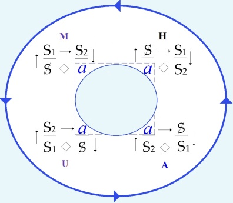
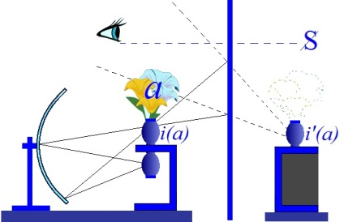

# Leçon 04 | 21 Janvier 1970

<!-- source-url: http://staferla.free.fr/S17/S17 L'ENVERS.docx -->
<!-- seminar: s17 -->
<!-- lesson: 04 -->

<!-- id: s17-04-0001 -->

   

<!-- id: s17-04-0002 -->

*Discours du Maître Discours de l’Hystérique Discours Universitaire Discours analytique*

<!-- id: s17-04-0003 -->

<!-- id: s17-04-0004 -->

Que *le discours analytique*...

<!-- id: s17-04-0005 -->

au niveau de structure où nous tentons cette année de l’articuler, boucle le tournis des trois autres, respectivement dénommés - je le rappelle pour ceux qui viennent ici sporadique­ment - dénommés

<!-- id: s17-04-0006 -->

- du *discours du Maître*,

<!-- id: s17-04-0007 -->

- de *celui de l’Hystérique,* que j’ai mis au milieu aujourd’hui,

<!-- id: s17-04-0008 -->

- enfin *du discours* qui bien ici nous intéresse à un haut degré, puisqu’il s’agit *du discours* situé comme *Universitaire...*que ce *discours analytique* boucle ce que je viens d’appeler le décalage en quart de cercle dont se structurent les 3 autres, ça ne veut pas dire qu’il les résout, qu’il per­mette de passer à « *l’envers* », ça ne résout rien : l’envers n’explique nul endroit.

<!-- id: s17-04-0009 -->

C’est d’un rapport de *« trame »*, de *« texte »*, qu’il s’agit, de *« tissu »* si vous voulez.

<!-- id: s17-04-0010 -->

Il n’en reste pas moins que ce tissu a un relief, et qu’il attrape quelque chose, certes pas « *tout* », bien sûr, puisque de ce mot...

<!-- id: s17-04-0011 -->

> qui n’a d’existence que de langage ...le langage montre la limite précisément : que même au monde du discours, rien n’est « *tout* », comme je dis, ou mieux si vous voulez : que le « *tout* » comme tel se réfute, s’appuie même de devoir être réduit dans son emploi.

<!-- id: s17-04-0012 -->

Ceci pour nous introduire à ce qui aujourd’hui fera l’objet d’une approche tout à fait essentielle, à cette fin de démonstration de ce que c’est qu’un *envers*.

<!-- id: s17-04-0013 -->

« *En<u>vers</u>* » assone avec « *<u>vér</u>ité* »*, <u>en vér</u>ité* il y a quelque qui chose mérite d’être appuyé de ce départ.

<!-- id: s17-04-0014 -->

Ce n’est pas un mot aisé à manier hors de là : en logique, en logique propositionnelle, où l’on en fait une valeur, une valeur réduite à l’inscription, au maniement d’un symbole, ordinairement le grand V, son initiale.

<!-- id: s17-04-0015 -->

Nous le verrons, cet usage est très particulièrement dépourvu d’espoir, c’est bien ce qu’il a de salubre.

<!-- id: s17-04-0016 -->

Néanmoins partout ailleurs et nommément chez les analystes - je dois le dire, et pour cause - les analystes femmes, il provoque un curieux frémissement, de l’ordre de celui qui les pousse depuis quelque temps, à confondre *la vérité analytique* avec *la révolution*.

<!-- id: s17-04-0017 -->

J’ai déjà dit l’ambiguïté de ce terme, qui aussi bien peut vouloir dire « *révolution* » dans l’emploi qu’il a dans la mécanique céleste, à savoir « *retour au départ »*. C’est bien par certains côtés ce que *le discours analytique*, comme je l’ai dit tout d’abord, peut accomplir au regard de trois autres ordres \[H, U, M\], situant trois autres structures.

<!-- id: s17-04-0018 -->

C’est bien pourquoi c’est aux femmes...

<!-- id: s17-04-0019 -->

puisque ce n’est pas *par hasard*, qu’elles sont moins enfermées que leurs partenaires dans *ce cycle des discours* : l’homme, le mâle, le viril, tel que nous le connaissons, est une *création de discours*, rien - tout au moins de ce qui s’en analyse, ne peut se définir autrement, bien sûr on ne peut en dire autant de la femme, néanmoins aucun dialogue n’est possible qu’à se situer au niveau du discours, ...c’est pourquoi, avant de frémir, *la femme qu’anime la vertu révolu­tionnaire de l’analyse* pourrait se dire que bien plus que « *l’homme »*, elle a à bénéficier de ce que nous appellerons « *une certaine culture du discours* ».

<!-- id: s17-04-0020 -->

<!-- id: s17-04-0021 -->

> *Discours du Maître Discours de l’Hystérique Discours Universitaire*

<!-- id: s17-04-0022 -->

Ce n’est pas qu’elle n’y a pas de don, bien au contraire : quand elle s’en anime, elle devient dans ce cycle un guide éminent.

<!-- id: s17-04-0023 -->

C’est ce qui définit *l’hystérique*, et c’est pourquoi au tableau, rompant l’ordre de ce que j’y écris d’habitude, je l’y ai placée *au centre*.

<!-- id: s17-04-0024 -->

Il est clair pourtant que ce n’est pas par hasard que le mot « *vérité »* pro­voque chez elle ce particulier *frémissement*.

<!-- id: s17-04-0025 -->

Seulement *la vérité* n’est pas, même dans notre contexte, d’un accès facile.

<!-- id: s17-04-0026 -->

Comme certains oiseaux...

<!-- id: s17-04-0027 -->

> de ceux dont on me parlait quand j’étais petit ...comme certains oiseaux, ça ne s’attrape qu’à ce qu’on lui mette *du sel sur la queue*.

<!-- id: s17-04-0028 -->

Et bien sûr, ce n’est pas facile.

<!-- id: s17-04-0029 -->

Mon premier livre de lecture avait pour premier texte une histoire qui s’intitulait*...*

<!-- id: s17-04-0030 -->

> c’était vrai, c’est de cela qu’il parlait -

<!-- id: s17-04-0031 -->

... « *Histoire d’une moitié de poulet ».*

<!-- id: s17-04-0032 -->

Ce n’est pas un oiseau plus facile à attraper que les autres, quand la condition est de lui mettre du sel sur la queue.

<!-- id: s17-04-0033 -->

Ce que j’enseigne, après tout, depuis que j’articule quelque chose de la psychana­lyse, pourrait bien s’intituler « *Histoire d’une moitié de sujet ».*

<!-- id: s17-04-0034 -->

Où est le vrai du rapport entre

<!-- id: s17-04-0035 -->

- *cette histoire d’une moitié de poulet,*

<!-- id: s17-04-0036 -->

- *et l’histoire d’une moitié de sujet ?*

<!-- id: s17-04-0037 -->

On peut le prendre sous deux angles :

<!-- id: s17-04-0038 -->

- *l’histoire*, ma première lecture, a déterminé *le déve­loppement de ma pensée*, comme on dirait dans une thèse universitaire,

<!-- id: s17-04-0039 -->

- et puis *la structure*, à savoir l’histoire de la moitié de poulet, pouvait bien représenter pour l’auteur qui l’avait écrite quelque chose où se reflétait je ne sais quel pressentiment, non pas de la *sychanalise* comme on dit dans

<!-- id: s17-04-0040 -->

*Le Paysan de Paris* [^8], mais de ce qu’il en est du *sujet*.

<!-- id: s17-04-0041 -->

Ce qu’il y a de certain c’est qu’il y avait aussi une image. Dans l’image, *la moitié de poulet était* de profil du bon côté.

<!-- id: s17-04-0042 -->

On ne voyait pas l’autre, la coupe, celle où elle était probablement, puisqu’on voyait sur sa face droite : sans cœur mais pas sans *foie*, dans les deux sens du mot. \[*Rires*\]

<!-- id: s17-04-0043 -->

# Qu’est-ce que cela veut dire ? 

# C’est que *la vérité* est cachée, mais elle n’est peut-être qu’*absence*. 

# Ça arrangerait tout si c’était ça : on n’aurait qu’à bien savoir tout ce qu’il y a à savoir. 

# Et après tout pourquoi pas : quand on dit quelque chose, il n’y a pas besoin d’ajouter que c’est vrai. 

# Autour de là tourne toute une problématique du jugement. 

# Vous savez bien que M. Frege pose l’assertion sous la forme d’un trait hori­zontal, 

# et la distingue de ce qu’il en est quand on affirme que c’est vrai,  

# d’y mettre un trait vertical à l’extrémité gauche : ça devient alors l’affirmation.

<!-- id: s17-04-0044 -->

Seulement, qu’est-ce qui est *vrai* ? Ben mon Dieu, c’est ce qui s’est *dit*. Et ce qui s’est dit, c’est *la phrase*.

<!-- id: s17-04-0045 -->

Mais la phrase, il n’y a pas moyen de la faire supporter d’autre chose que *du signifiant*, en tant qu’il ne concerne pas l’objet, à moins que, comme un logicien dont j’avan­cerai tout à l’heure l’extrémisme, vous ne posiez qu’il n’y a d’*objet* que de *pseudo-objet*.

<!-- id: s17-04-0046 -->

Pour nous, nous nous en tenons à ceci *que le signifiant ne concerne pas l’objet mais le sens*.

<!-- id: s17-04-0047 -->

Comme sujet de la phrase il n’y a que *le sens*.

<!-- id: s17-04-0048 -->

D’où cette dialectique d’où nous sommes partis, que nous appelons le « *pas de sens* » avec toute l’ambiguïté du mot « *pas* », celui qui commence au « *non-sens*  » forgé par Husserl : « *le vert est un pour* ».

<!-- id: s17-04-0049 -->

Ce qui peut très bien avoir un sens s’il s’agit par exemple d’un vote, avec des boules vertes et des boules rouges.

<!-- id: s17-04-0050 -->

Seulement ce qui nous emmène par ce que ce qu’il en est de l’*être,* tient au *sens*, et que *ce qui a le plus d’être*...

<!-- id: s17-04-0051 -->

...eh bien dans cette voie, c’est dans cette voie en tout cas qu’on a franchi ce *« pas de sens »* de penser que *ce qui a le plus d’être ne peut pas ne pas exister*.

<!-- id: s17-04-0052 -->

*Le sens -* si je puis dire - *a charge d’être*, il n’a même pas d’autre sens.

<!-- id: s17-04-0053 -->

Seulement, on s’est aperçu depuis un certain temps que ça ne suffit pas à faire le poids, le poids justement de l’existence.

<!-- id: s17-04-0054 -->

Chose curieuse, du « *non-sens »* ça le fait, le poids, ça prend à l’estomac, et particulèrement c’est là le pas franchi par Freud, d’avoir montré que c’est ce qu’a d’exemplaire *le mot d’esprit*, le mot « sans queue ni tête ».

<!-- id: s17-04-0055 -->

Ça ne rend pas plus facile de lui mettre du sel sur la queue juste­ment : *la vérité s’envole*, la vérité s’envole au moment même où vous ne vouliez plus la saisir. D’ailleurs, puisqu’elle n’avait pas de queue, comment auriez-vous pu ?

<!-- id: s17-04-0056 -->

*Sidération et lumière* \[Cf. Freud :*Verblüffung* et *Erleuchtung*\].

<!-- id: s17-04-0057 -->

Comme vous vous en souvenez, une petite histoire, assez plate d’ail­leurs, de répliques sur le Veau d’or [^9], peut suffire à le réveiller, ce veau qui dort debout. On voit alors qu’il est, si je puis dire, *d’or dur.*

<!-- id: s17-04-0058 -->

Entre « *Le dur désir de durer* » d’Éluard, et *le désir de dormir* qui est bien la plus grande énigme, sans qu’on semble s’en aviser, que Freud avance dans le mécanisme du rêve, car ne l’oublions pas : « *Wunsch zu schlafen* » dit-il...

<!-- id: s17-04-0059 -->

> il n’a pas dit « *schlafen Bedürfnis » *: *« besoin de dormir »*, ce n’est pas de cela qu’il s’agit, ...c’est le « *Wunsch zu schlafen »* qui détermine l’opération du rêve.

<!-- id: s17-04-0060 -->

Il est curieux qu’il complète cette indication de ceci: *qu’un rêve qui réveille* c’est juste au moment où *le rêve pourrait lâcher la vérité.*

<!-- id: s17-04-0061 -->

De sorte qu’on ne se réveille que pour continuer à rêver, à rêver dans le réel, pour être plus exact : dans la réalité.

<!-- id: s17-04-0062 -->

Tout cela ça frappe, ça frappe d’un certain manque de sens. La vérité, comme le naturel, revient au galop, un galop tel - même - qu’à peine elle traverse notre champ, qu’elle est déjà repartie de l’autre côté.

# L’*absence* dont je parlais tout à l’heure, elle a - en français - produit une curieuse contamination : 

# si vous prenez le « *sans* », *s.a.n.s.*, censé venir du latin « *sine »...* 

# ce qui est bien peu probable puisque sa forme première était quelque chose comme *s.e.n.z.* 

# ...nous nous apercevons que l’*absentia,* à l’ablatif, employé dans les textes juridiques, 

# est d’où provient cet « s » qui, le « *sans* » - *s.a.n.s.* - le termine.

<!-- id: s17-04-0063 -->

«* Sans queue ni tête *» nous l’avons, ce petit mot, déjà produit depuis le début de ce que nous énonçons aujourd’hui.

<!-- id: s17-04-0064 -->

Mais alors quoi : *sans, sans* et puis *sans, eh ! puissant !*

<!-- id: s17-04-0065 -->

N’est-ce pas d’une puissance qu’il s’agit, toute autre que cette « *en puissance* » d’une virtualité imaginaire, qui n’est puissance que d’être trompeuse, mais bien plutôt sur ce qu’il y a d’*être* dans le *sens*, qui est à prendre autrement que d’être *sens plein*, qui est bien plutôt ce qui - à l’*être* - lui échappe, comme il arrive dans *le mot,* justement dit « *d’esprit »*, comme aussi bien nous le savons, cela se passe toujours dans l’*acte*.

<!-- id: s17-04-0066 -->

L’acte, quel qu’il soit, c’est ce qui lui échappe qui est important.

<!-- id: s17-04-0067 -->

C’est bien aussi le pas franchi par l’analyse, dans l’introduction de «* l’acte manqué *» comme tel, qui est après tout le seul dont nous sachions qu’à coup sûr, c’est toujours *un acte réussi*.

<!-- id: s17-04-0068 -->

Il y a là autour, tout un jeu, jeu de litote dont j’ai essayé de montrer le poids et l’accent dans ce que j’appelle le « *pas sans* »:

<!-- id: s17-04-0069 -->

- l’angoisse, elle n’est *pas sans* objet,

<!-- id: s17-04-0070 -->

- nous ne sommes *pas sans* un rapport avec la vérité.

<!-- id: s17-04-0071 -->

Mais est-il sûr que nous devions la trouver « *intus » *: à l’intérieur, pour­quoi pas à côté: *Heimlich-unheimlich *?

<!-- id: s17-04-0072 -->

Chacun a pu, de la lecture de Freud, retenir ce que recèle l’ambiguïté de ce terme qui précisément accentue \- de n’être pas à l’intérieur et pourtant de l’évoquer - tout ce qui est l’étrange.

<!-- id: s17-04-0073 -->

Là-dessus, les langues varient étrangement elles-mêmes.

<!-- id: s17-04-0074 -->

Vous êtes-vous aperçu que « *homeliness »* en anglais, ça veut dire « *sans façon »* ?

<!-- id: s17-04-0075 -->

C’est bien pourtant le même mot que *Heimlichkeit*.

<!-- id: s17-04-0076 -->

Ça n’a pas tout à fait le même accent.

<!-- id: s17-04-0077 -->

C’est bien pourquoi aussi « *sinnlos »* se traduit en anglais par « *meaningless »*, c’est-à-dire pas le même mot, qui pour traduire « *Unsinn »* nous donnera « *non­-sense ».*

<!-- id: s17-04-0078 -->

Chacun sait que l’ambiguïté des racines en anglais prête à de singuliers évitements.

<!-- id: s17-04-0079 -->

Par contre l’anglais - curieusement et d’une façon quasi unique - appellera « *without »*, le « *sans »  *: « *avec... étant dehors* ».

<!-- id: s17-04-0080 -->

*La vérité* semble bien en effet nous être étrangère, j’entends notre propre vérité.

<!-- id: s17-04-0081 -->

Elle est *avec* nous sans doute, mais sans qu’elle nous concerne tellement qu’on veut bien le dire.

<!-- id: s17-04-0082 -->

Tout ce qu’on peut dire - c’est ce que je disais tout à l’heure - c’est que nous ne sommes *pas sans* elle, litote de ceci en somme : qu’à être à sa portée, eh bien, nous nous en passerions bien. D’où nous passons du « *sans* » au « *pas-sans* » et de là au « *s’en passer* ».

<!-- id: s17-04-0083 -->

Je vais ici faire un petit saut, comme ça, et aller à l’auteur qui a articulé le plus fortement ce qui résulte de ceci qui consiste comme entreprise, à poser qu’il n’y a de vérité qu’inscrite en quelque proposition, à essayer d’articuler ce qui du savoir comme tel...

<!-- id: s17-04-0084 -->

> le savoir étant constitué d’un fondement de pro­position ...ce qui du savoir en toute rigueur, peut fonctionner comme vérité, ce qui, de quoi que ce soit qui se propose, peut être dit *vrai* et soutenu comme tel.

<!-- id: s17-04-0085 -->

Il s’agit d’un nommé Wittgenstein.

<!-- id: s17-04-0086 -->

Puis-je le dire facile à lire ? Sûrement, essayez.

<!-- id: s17-04-0087 -->

Si vous savez vous contenter de vous déplacer dans un monde qui est strictement celui d’une cogitation, sans y chercher aucun fruit, ce qui est votre mauvaise habitude : vous tenez beaucoup à cueillir des pommes sous un pommier, même à les ramasser par terre, tout vaut mieux pour vous que de ne pas ramasser de pommes.

<!-- id: s17-04-0088 -->

L’habitation, un certain temps, sous un pommier dont les ramures, peuvent suffire à capter très étroitement votre attention, pour peu que vous vous y obligiez, aura tout de même ceci de caractéris­tique, que vous ne pourrez rien en tirer, si ce n’est l’affirmation que rien d’autre ne peut être dit *vrai* que la conformité à une structure...

<!-- id: s17-04-0089 -->

que je ne situerai même pas - à me mettre un instant hors de l’ombre de ce pommier - comme « *logique »* ...non, comme proprement l’auteur l’affirme : « *grammaticale »*.

<!-- id: s17-04-0090 -->

Laquelle constitue pour cet auteur, ce qu’il identifie au monde : la *structure grammaticale*, voilà ce qui est *le monde*.

<!-- id: s17-04-0091 -->

Il n’y a en somme de vrai qu’une proposition composée comprenant la tota­lité des faits qui constituent le monde.

<!-- id: s17-04-0092 -->

Si nous choisissons, dans l’ensemble, à y introduire l’élément de néga­tion qui permet de l’articuler, nous aurons bien sûr tout un ensemble de règles à dégager qui constituent une logique.

<!-- id: s17-04-0093 -->

Mais « *l’ensemble »* est, nous dit-il, tautolo­gique, c’est-à-dire aussi bête que ceci :

<!-- id: s17-04-0094 -->

- que quoi que ce soit que vous énon­ciez, c’est « *ou bien « vrai » ou bien « faux »* »,

<!-- id: s17-04-0095 -->

- et qu’énoncer que ceci est « *ou bien « vrai » ou bien « faux »* » c’est forcément vrai, mais aussi *ceci annule le sens*.

<!-- id: s17-04-0096 -->

Tout ce que je vous ai dit, conclut-il à la proposition 6-54 - puisqu’il les numérote – tout ce que je viens d’énoncer ici est à propre­ment parler *Unsinn*, c’est-à-dire annule le sens.

<!-- id: s17-04-0097 -->

Rien ne peut se dire qui ne soit tautologique.

<!-- id: s17-04-0098 -->

Ce dont il s’agit, après être passé dans la longue circulation d’énoncés dont je vous prie de croire que, que chacun est extrêmement attachant, c’est que le lecteur ait sur­monté de tout ce qui vient de se dire pour conclure : qu’il n’y a rien d’autre de dicible, mais que tout ce qui peut se dire n’est que *non-sens*.

<!-- id: s17-04-0099 -->

J’ai été peut-être un peu vite pour vous résumer le « *Tractatus logico-philo­sophicus »* de Wittgenstein.

<!-- id: s17-04-0100 -->

Ajoutons cette remarque seulement : que rien ne peut se dire que de vain, mais vrai, qu’à la condition de partir sur l’idée...

<!-- id: s17-04-0101 -->

> sur la démarche qui est celle de Wittgenstein ...que *le vrai* est un attribut de « *la* *proposition crue »*.

<!-- id: s17-04-0102 -->

J’appelle « *proposition crue »* celle qu’ailleurs on mettra entre guillemets, chez un Quine par exemple, c’est-à-dire où l’on distingue *l’énoncé* de *l’énonciation*, ce qui est une opération que...

<!-- id: s17-04-0103 -->

> pour avoir construit mon graphe précisément sur son fondement ...je n’hésite pas pour autant à déclarer arbitraire.

<!-- id: s17-04-0104 -->

Car il est clair qu’il est soutenable...

<!-- id: s17-04-0105 -->

> comme c’est la position de Wittgenstein ...de dire qu’il n’y a à ajouter nul signe d’affirmation à ce qui est assertion pure et simple.

<!-- id: s17-04-0106 -->

L’assertion s’annonce comme vérité.

<!-- id: s17-04-0107 -->

Comment dès lors sortir de ce qu’il en est des conclusions de Wittgenstein, sinon à le suivre là même où il est entraîné, à savoir vers la proposition élémentaire, dont la notation comme vraie ou fausse est celle qui doit de toute façon assurer...

<!-- id: s17-04-0108 -->

> quelle qu’elle soit, qu’elle soit vraie ou fausse ...la vérité de la proposition composée. Quels que soient les faits du monde, je dirais plus, quel que soit ce que nous en énonçons, *la tautologie de la totalité du discours*, c’est cela qui fait le monde.

<!-- id: s17-04-0109 -->

Prenons la proposition la plus réduite, j’entends *grammaticalement*, ce n’est pas pour rien que déjà les stoïciens y avaient pris appui, pour l’introduire dans la forme la plus simple de l’implication. Je n’irai même pas jusque-là, je n’en prendrai que le 1er membre. Puisque, comme vous le savez, une implication est une relation entre deux propositions, « *Il fait jour* » c’est bien le minimum :

<!-- id: s17-04-0110 -->

- « *Il* » : au neutre,

<!-- id: s17-04-0111 -->

- « *Il fait* » : *cela fait*, à l’occa­sion c’est le même sens.

<!-- id: s17-04-0112 -->

Aussi bien Wittgenstein ne soutient le monde que de faits...

<!-- id: s17-04-0113 -->

- nulle chose, si ce n’est soutenue d’une trame de faits,

<!-- id: s17-04-0114 -->

- nulle chose - au reste - qu*’*inaccessible, ...seul le fait s’*articule*.

<!-- id: s17-04-0115 -->

Ce « *fait »* - qu’il fasse jour - n’est « *fait »* que de ce que ça se soit *dit*. Le vrai ne dépend...

<!-- id: s17-04-0116 -->

c’est là qu’il me faut réintroduire la dimension que j’en sépare arbitrairement ...le vrai ne dépend que de mon énonciation, à savoir si je l’énonce à propos.

<!-- id: s17-04-0117 -->

Le vrai n’est pas interne à la proposition, où ne s’annonce que le *fait*, le factice du langage.

<!-- id: s17-04-0118 -->

C’est vrai que c’est un fait, un fait que constitue que je le dise, à l’occasion pendant que c’est vrai.

<!-- id: s17-04-0119 -->

Mais que ce soit *vrai* n’est pas un fait, si je n’ajoute pas expressément qu’au reste, c’est *vrai*.

<!-- id: s17-04-0120 -->

Mais comme le fait remarquer très bien Wittgenstein, justement c’est superflu que je l’y ajoute, que c(est vrai. Seulement voilà : ce que j’ai à dire à la place de ce superflu, c’est qu’il faut que j’aie une raison vraiment de le dire, qui va s’expliquer par la suite.

<!-- id: s17-04-0121 -->

Justement, je ne le dis pas que j’ai une raison, je continue la suite, à savoir ma déduction, et j’intègre « *Il fait jour* » ...

<!-- id: s17-04-0122 -->

> peut-être à titre de fallace, même si c’est vrai ...à mon incitation, qui peut être d’en profiter pour faire croire à quelqu’un qu’il verra clair sur mes intentions.

<!-- id: s17-04-0123 -->

La bêtise, si je puis m’exprimer ainsi, c’est d’isoler le factice d’« *Il fait jour* ».

<!-- id: s17-04-0124 -->

C’est une bêtise prodigieusement féconde car il en ressort un appui, et très précisément celui-ci : de ce qui résulte qu’on pousse jusqu’à ses dernières conséquences ce dont j’ai pris appui moi-même, à savoir *qu’il n’y a pas de méta-langage*.

<!-- id: s17-04-0125 -->

Il n’y a pas d’autre métalangage que toutes les formes de *la canaillerie*, si par là nous désignons ces curieuses opérations qui se déduisent de ceci : « *Que le désir de l’homme, c’est le désir de l’Autre* ».

<!-- id: s17-04-0126 -->

Que toute cette *canaillerie* repose sur ceci : de vouloir être l’Autre - j’entends le grand Autre - de quelqu’un, là où se dessinent les figures où son désir sera capté.

<!-- id: s17-04-0127 -->

*Aussi bien cette opération wittgensteinienne n’est-elle rien qu’une extraordinaire parade*, *qu’une détection de la canaillerie philoso­phique.*

<!-- id: s17-04-0128 -->

*Il n’y a de sens que du désir,*...

<!-- id: s17-04-0129 -->

voilà ce qu’on peut dire après avoir lu Wittgenstein ...*de vérité que de ce qu’il cache - le dit désir - de son manque, pour faire mine de rien de ce qu’il trouve.*

<!-- id: s17-04-0130 -->

Et sous nulle lumière plus certaine n’apparaît ce qui résulte de ce que les logiciens depuis toujours, à seulement nous éblouir de l’air de paradoxe qu’a ce qu’on a appelé « *l’implication matérielle »*...

<!-- id: s17-04-0131 -->

> vous savez ce que c’est, on ne l’a appelée « *matérielle »* que récemment : c’est *l’implication* tout court ...on l’a appelée *matérielle* récemment, parce que tout d’un coup, on s’est frotté les yeux, et qu’on commence à comprendre ce qu’il y a d’énor­mité dans ce qu’il en est de l’implication, je parle de celle que tel stoïcien a soutenue.

<!-- id: s17-04-0132 -->

C’est à savoir, que légitimes sont les trois implications certes :

<!-- id: s17-04-0133 -->

- que le faux implique le faux,

<!-- id: s17-04-0134 -->

- le vrai implique le vrai,

<!-- id: s17-04-0135 -->

- mais qu’il n’est nulle­ment à écarter que *le faux n’implique le vrai*, puisque au total ce dont il s’agit c’est ce qui s’implique, et que si ce qui s’implique est *vrai*, eh bien l’ensemble de *l’implication* l’est aussi.

<!-- id: s17-04-0136 -->

Seulement, cela veut dire quelque chose ! Pourquoi ne pourrions-nous pas, décalant légèrement le mot « *implique* », nous apercevoir de ce qu’a de saillant ceci, ceci qu’on savait très bien au Moyen Âge : « *ex falso sequitur quodlibet* »[^10] que le faux comporte aussi bien le vrai à l’occasion, veut aussi bien dire que le vrai *suit* - lui - de n’importe quoi.

<!-- id: s17-04-0137 -->

Mais que si par contre nous repoussons que le vrai comporte le faux, qu’il peut avoir une suite fausse...

<!-- id: s17-04-0138 -->

> car c’est là ce que nous repoussons,
>
> faute de quoi il n’y aurait aucune articulation possible de la logique propositionnelle ...nous aboutissons à ce curieux constat :

<!-- id: s17-04-0139 -->

- que le vrai a donc une généalogie,

<!-- id: s17-04-0140 -->

- qu’il remonte toujours à un premier vrai d’où il ne saurait plus déchoir.

<!-- id: s17-04-0141 -->

C’est là une indication si étrange, si contestée par toute notre vie, notre vie j’entends de sujet, qu’à soi tout seul il suffirait à mettre en question que *la vérité* puisse d’aucune façon être isolée comme attribut, attribut de quoi que ce soit qui puisse s’articuler en savoir.

<!-- id: s17-04-0142 -->

L’opération donc analytique, est quelque chose qui se distingue de s’avancer dans ce champ, d’une façon distincte de ce que j’appellerais « *incarnée* » dans le discours de Wittgenstein, à savoir une *férocité psychotique*, auprès de laquelle « *le rasoir d’Occam* » bien connu...

<!-- id: s17-04-0143 -->

où s’énonce que nous ne saurions admettre aucune notion logique que nécessaire ...n’est rien.

<!-- id: s17-04-0144 -->

*La vérité* - nous repartons au principe - est certes inséparable des effets de langage pris comme tels.

<!-- id: s17-04-0145 -->

Nulle *vérité,* certes, ne saurait se localiser que du champ où cela s’énonce, où cela s’énonce comme ça peut.

<!-- id: s17-04-0146 -->

Donc il est vrai  « *Qu’il n’y a pas de vrai sans faux* ». Au moins dans son principe, ceci est *vrai*.

<!-- id: s17-04-0147 -->

Mais « qu’il n’y a pas de vrai sans faux » \[lapsus\], je vous demande pardon : « *Qu’il n’y ait pas de faux sans vrai* » cela est faux.

<!-- id: s17-04-0148 -->

Je veux dire que le vrai ne se trouve que hors de toute proposition.

<!-- id: s17-04-0149 -->

Dire que *la vérité* est inséparable des effets de langage pris comme tels, c’est y inclure l’inconscient.

# Avancer, par contre...

# comme je le rappelais la dernière fois

# ...que l’inconscient est la condition du langage, prend ici son sens, de vouloir que du langage un sens absolu réponde, 

# et comme l’a inscrit autrefois, l’un des auteurs de ce discours sur « *L’Inconscien »t,* sous-titré « *étude psychana­lytique »*[^11], 

# c’est à mettre sous une barre, d’ailleurs arbitrairement traitée au regard de ce que j’en ai fait, cette superposition d’un S - par une barre - sur lui-même, cette désignation d’un signifiant, dont le sens serait absolu.

<!-- id: s17-04-0150 -->

Où s’indique ceci, très facile à reconnaître, car il n’y a qu’un signifiant qui puisse répondre à cette place, c’est le « *Je *», le* « Je »* en tant qu’il est transcendantal, mais aussi bien qu’il est illusoire.

<!-- id: s17-04-0151 -->

C’est là l’opération racine dernière, celle dont s’assure irré­ductiblement justement, et c’est ce qui montre que ce n’est pas un hasard, ce que je désigne de l’articulation du *discours universi­taire*.

<!-- id: s17-04-0152 -->

Le *Je transcendantal* c’est celui que quiconque, à énoncer *un savoir* d’une certaine façon, recèle comme *vérité* le **S1**, le  « *Je » du* *Maître.*

<!-- id: s17-04-0153 -->

Le « *Je* » identique à lui-même, c’est très précisément ceci dont se consti­tue le **S1** de l’*impératif pur*, c’est-à-dire très précisément celui où le « *Je* » se dérobe, car l’impératif est tou­jours à la deuxième personne.

<!-- id: s17-04-0154 -->

Mais le mythe du « *Je idéal »*, du « *Je qui maîtrise »*, du « *Je *» *par où* au moins *quelque chose est identique à soi-même...*

<!-- id: s17-04-0155 -->

> à savoir *l’énonciateur* ...est très précisément ce que *le discours universitaire* ne peut éliminer de la place où se trouve sa vérité.

<!-- id: s17-04-0156 -->

Bien sûr nulle philosophie n’y est réductible. De tout énoncé universitaire d’une philosophie quelconque...

<!-- id: s17-04-0157 -->

> fût-ce celle qu’à la rigueur on pourrait épingler comme lui étant la plus opposée,
>
> à savoir - si c’était de la philosophie - le discours de Lacan ...irréductiblement surgit la « *Je-cratie* ».

<!-- id: s17-04-0158 -->

Pour les philosophes, la question a toujours été beaucoup plus souple et pathétique.

<!-- id: s17-04-0159 -->

Souvenez-vous de quoi il s’agit, tous l’avouent plus ou moins, et certains d’entre eux, les plus lucides, en clair : *ils veulent sauver la vérité*.

<!-- id: s17-04-0160 -->

Ceci a entraîné l’un d’eux, ma foi fort loin pour refuser - comme Wittgenstein - d’aboutir à ceci : *qu’à en faire la règle et le fondement du savoir,* *il n’y a plus rien à dire*, rien en tout cas qui la concerne comme telle, pour éviter ce roc, ce roc où assurément l’auteur a ceci de proche de la position de l’analyste, qu’il s’élimine complètement de son discours.

<!-- id: s17-04-0161 -->

J’ai parlé tout à l’heure de *psychose*.

<!-- id: s17-04-0162 -->

C’est un tel point de concurrence du discours le plus sûr, avec je ne sais quoi de frappant qui s’indique comme *psychose*, à simplement en ressentir l’effet, qu’il est remarquable qu’une université, comme l’Université anglaise spécialement, ait fait sa place, place en quelque sorte « *à part* », c’est bien le cas de le dire.

<!-- id: s17-04-0163 -->

*Place d’isolement*, à quoi l’auteur collaborait parfaitement lui-même, si bien que de temps en temps se retirant dans une petite maison de campagne, pour revenir et poursuivre cet implacable discours, dont on peut dire que même celui des *« Principia mathematica »* de Russell s’en trouve *controuvé* [^12], celui-là ne voulait pas *sauver la vérité* : « *Rien ne peut s’en dire* », qu’il disait.

<!-- id: s17-04-0164 -->

Ce qui n’est pas sûr, puisqu’aussi bien avec elle, nous avons affaire tous les jours.

<!-- id: s17-04-0165 -->

Mais comment est-ce que Freud définit la position psycho­tique dans une lettre que j’ai maintes fois citée ?

<!-- id: s17-04-0166 -->

Précisément de ceci qu’il appelle l’« *unglauben » *: ne rien vouloir savoir du coin où il s’agit *de la vérité*.

<!-- id: s17-04-0167 -->

Chose étrange, la chose est pour l’universitaire si pathétique qu’on peut dire que le discours de Politzer

<!-- id: s17-04-0168 -->

« *Du fondement de la psychologie concrète »* [^13], à quoi l’a incité l’approche de l’analyse, en est un exemple fascinant.

<!-- id: s17-04-0169 -->

Tout se commande de cet effort pour sortir : il sent bien qu’il y a là quelque rampe par quoi, du *discours universitaire* qui l’a formé de pied en cap, il pourrait émerger.

<!-- id: s17-04-0170 -->

Il faut lire ce petit ouvrage réédité en livre de poche sans que je sache - à ma connaissance – que rien puisse prouver que l’auteur lui-même eût approuvé cette réédition : chacun sait le drame qu’a été pour lui l’accable­ment des fleurs sous lequel a été couvert *ce qui d’abord se pose comme cri de révolte*.

<!-- id: s17-04-0171 -->

Des pages cinglantes sur ce qu’il en est de la psychologie, de la psychologie spécialement universitaire, sont *étrangement* suivies d’une démarche, où certes on peut dire que l’essentiel de ce qui lui a fait saisir que c’était là barre à sortir, espoir pour lui d’émerger de cette psychologie, c’est qu’il ait mis l’accent sur ceci...

<!-- id: s17-04-0172 -->

> ce que personne n’avait fait à son époque ...que l’essentiel de la méthode, de la méthode freudienne pour aborder ce qu’il en est des formations de l’inconscient, c’est de se fier au récit : l’accent mis sur ce fait de langage, d’où tout, à vrai dire, eût pu partir.

<!-- id: s17-04-0173 -->

On n’ira pas jusqu’à dire qu’à l’époque...

<!-- id: s17-04-0174 -->

> ça c’est de la petite histoire ...qu’à l’époque il n’était pas question que quelqu’un...

<!-- id: s17-04-0175 -->

> fût-il « *caïman* »[^14] de l’École Normale ...ait la moindre idée de ce qu’est la linguistique, mais tout de même : d’avoir approché que c’est là le ressort, le ressort qui donne espoir à ce qu’il appelle étrangement « *psychologie concrète »*, il est singulier...

<!-- id: s17-04-0176 -->

Il faut lire ce petit livre ! S’il le fallait je le lirai avec vous : j’en ferai ici, un jour, matière d’un autre entretien, mais j’ai assez de choses à dire pour n’avoir pas non plus à m’attarder à quelque chose, dont chacun d’entre vous peut voir l’étrangeté significative de ceci : c’est comment - et ceci se suit pas à pas - c’est à vouloir sortir du discours universitaire, qu’implacablement on y rentre.

<!-- id: s17-04-0177 -->

Car qu’est-ce qu’il fera comme objection aux énoncés...

<!-- id: s17-04-0178 -->

> je parle : à la termino­logie, des mécanismes qu’avance Freud dans son progrès théorique ...sinon qu’à s’énoncer autour de faits isolables, d’abstractions formelles comme il s’exprime confusément, il laisse échapper ce qui pour lui est l’essentiel de l’exigible en matière de psychologie : c’est que tout fait psychique ne soit énonçable qu’à préserver ce qu’il appelle « *l’acte du Je* », et mieux encore, la continuité - c’est ce qui est écrit - « *la continuité du Je* ».

<!-- id: s17-04-0179 -->

Terme qui sans doute a permis au rapporteur dont je parlais tout à l’heure, qui introduit cette petite référence à Politzer, histoire comme ça d’amadouer ce qu’il pouvait alors avoir comme auditoire, ça fait toujours bien quand on a de temps en temps un universitaire, qui s’est montré par ailleurs un héros, quelle bonne occasion quand même de le produire.

<!-- id: s17-04-0180 -->

Mais ça ne suffit pas si l’on en profite au lieu de pouvoir en démontrer l’irréductible du discours universi­taire, par rapport à l’analyse elle-même, dans cette sorte de lutte singulière dont ce livre témoigne.

<!-- id: s17-04-0181 -->

Car il ne peut pas ne pas sentir combien en fait, la pratique analytique est tout près de ce quelque chose qu’idéalement il dessine comme tout à fait hors du champ de tout ce qui s’est fait jusque-là comme *psychologie*.

<!-- id: s17-04-0182 -->

Mais sans pouvoir faire autrement que retomber sur cette exigence du « *Je* ».

<!-- id: s17-04-0183 -->

Non certes que moi-même j’y voie quelque chose qui soit irréduc­tible.

<!-- id: s17-04-0184 -->

Le rapporteur en question[^15] s’en débarrasse en quelque sorte trop aisément à dire *que l’inconscient ne s’articule pas en première personne*.

<!-- id: s17-04-0185 -->

Et de s’armer pour cela, de tel ou tel de mes énoncés, sur le fait que le message, le message du sujet, il le reçoit de l’Autre sous sa forme inversée. Ce n’est certes pas là raison suffisante.

<!-- id: s17-04-0186 -->

Ailleurs j’ai bien dit que la vérité « *parle* *Je* » : « *Moi la vérité, je parle*. »[^16].

<!-- id: s17-04-0187 -->

Seulement, ce qui ne vient à l’idée ni de l’auteur en question, ni de Politzer, c’est que le « *Je* » dont il s’agit peut-être est innombrable, qu’il n’y a besoin ni de continuité du « *Je* » pour qu’il multiplie ses actes.

<!-- id: s17-04-0188 -->

Mais laissons, ce n’est pas là l’essentiel.

<!-- id: s17-04-0189 -->

En face de cet usage des *propositions*, n’allons-nous pas, avant de nous quitter, présentifier ceci : « *Un enfant est battu »* [^17].

<!-- id: s17-04-0190 -->

C’est bien une *proposi­tion* qui fait tout ce fantasme.

<!-- id: s17-04-0191 -->

Pouvons-nous l’affecter de quoi que ce soit qui se désigne du terme de vrai ou de faux ?

<!-- id: s17-04-0192 -->

C’est là...

<!-- id: s17-04-0193 -->

en ce cas, exemplaire de ce qui ne peut être éliminé d’aucune défini­tion de *la proposition* ...que nous saisissons ceci : que cette proposition a effet - de quoi ? - *de se sou­tenir* *d’un sujet,* sans doute, mais - comme Freud aussitôt l’ana­lyse - *divisé par la jouissance*.

<!-- id: s17-04-0194 -->

Divisé, je veux dire qu’aussi bien celui qui l’énonce, est cet enfant qui *wird, verdit, verdoie,* d’être *battu*, *geschlagen*.

<!-- id: s17-04-0195 -->

Mais jouons un peu plus : cet enfant qui *verdit battu*, il *badine vertu,* ce sont *les malheurs du* « *vers-tu* », celui qui le frappe, et qui n’est pas nommé, de quelque façon que la phrase s’énonce.

<!-- id: s17-04-0196 -->

*Ce « Tu me bats » est cette moitié du sujet* dont la formule fait sa liaison à la jouissance.

<!-- id: s17-04-0197 -->

*Il reçoit*, certes, *son propre message sous une forme inversée* : ça veut dire, *sa propre jouissance sous la forme de la jouissance de l’Autre*, et c’est bien de cela qu’il s’agit quand *le fantasme* se trouve rejoindre *l’image du père*, conjointe à ce qui d’abord est un autre enfant.

<!-- id: s17-04-0198 -->

C’est que le père *jouisse de le battre* qui ici met l’accent du sens, celui aussi de cette vérité qui est à moitié.

<!-- id: s17-04-0199 -->

Car aussi bien, celui qui à l’autre moitié - au *sujet* de l’enfant - s’identifie, n’était pas cet enfant, sauf comme dit Freud, à ce qu’on reconstitue le stade intermédiaire...

<!-- id: s17-04-0200 -->

> jamais d’ailleurs d’aucune façon par le souvenir, *substantialisé* ...où c’est lui en effet, c’est lui qui de cette phrase fait le support de son fantasme, qui est l’enfant battu.

<!-- id: s17-04-0201 -->

Nous voici reconduits à ceci, de fait : qu’un corps peut être sans figure, car le père ou *l’Autre* quel qu’il soit...

<!-- id: s17-04-0202 -->

> qui ici joue le rôle, la fonction, *donne la place de la jouissance...*il n’est point même nommé.

<!-- id: s17-04-0203 -->

*Dieu sans figure*, c’est bien le cas, mais néanmoins pas saisissable, sinon en tant que corps.

<!-- id: s17-04-0204 -->

*Qu’est-ce qui a un corps et qui n’existe pas ? Réponse : le grand Autre.*

<!-- id: s17-04-0205 -->

Et si nous y croyons à ce grand Autre, il a un corps, inéliminable de la substance de celui qui a dit « *Je suis ce que Je suis* », ce qui est une tout autre forme de tautologie.

<!-- id: s17-04-0206 -->

Et c’est en cela...

<!-- id: s17-04-0207 -->

permettez-moi, avant de vous quitter, de l’avancer ...que j’énoncerai ceci, qui est tellement éclatant dans *l’histoire* qu’à vrai dire on s’étonne que ceci ne soit pas plus suffisamment... ne soit pas suffisamment accentué, ou même ne le soit nullement : c’est que *les matérialistes*, comme l’expérience l’a prouvé...

<!-- id: s17-04-0208 -->

je parle au moment de leur plus récente érup­tion historique au XVIIIème siècle ...sont les seuls croyants authentiques ; leur dieu est la matière.

<!-- id: s17-04-0209 -->

Eh bien oui, pourquoi pas ? Ça se tient mieux que toutes les autres façons de le fonder.

<!-- id: s17-04-0210 -->

Seulement, à nous autres, ceci ne suffit pas parce que nous avons jus­tement des besoins logiques, si vous me permettez ce terme, parce que nous sommes des *êtres* nés du *plus de jouir*, résultats de l’emploi du langage.

<!-- id: s17-04-0211 -->

Quand je dis « *l’emploi du langage* », je ne veux pas dire que nous l’employons : c’est nous qui sommes ses employés, *le langage nous emploie, et c’est par là que ça jouit*.

<!-- id: s17-04-0212 -->

Et c’est pour ça que la seule chance de l’existence de Dieu, c’est qu’« *Il* »...

<!-- id: s17-04-0213 -->

« *Il* » avec un grand « *I* »

<!-- id: s17-04-0214 -->

...« *Il* » jouisse, c’est qu’« *Il* » soit *la jouissance*.

<!-- id: s17-04-0215 -->

Et c’est pour ça qu’au plus intelligent des matérialistes, à savoir à Sade, pour lui il est bien clair que ce qui est la visée de la mort ça n’est nullement l’inanimé : lisez les propos de Saint-Fond vers le milieu de *« Juliette »,* et vous verrez ce dont il s’agit.

<!-- id: s17-04-0216 -->

S’il dit que la mort ne constitue rien d’autre que la col­laboration invincible à l’opération naturelle, c’est que bien entendu, après la mort, mais *tout* reste pour lui animé, animé du désir de *jouissance*, de *jouissance* de ce qu’il peut bien aussi appeler « *Nature »*, et dont il est évident à tout le contexte qu’il s’agit *de la jouissance* \- de quoi ? - d’un être unique qui n’a qu’à dire : *« Je suis ce que Je suis* ».

<!-- id: s17-04-0217 -->

Et ceci pourquoi donc ?

<!-- id: s17-04-0218 -->

Comment le sent-il si bien ?

<!-- id: s17-04-0219 -->

C’est là que joue ceci : qu’en apparence il est *sadique,* c’est qu’il refuse d’être ce qu’il est, et ce qu’il énonce qu’il est.

<!-- id: s17-04-0220 -->

À faire cet appel furieux à un *être* donné à la *Nature*, dans son opération meurtrière d’où toujours renais­sent des formes, qu’est-ce qu’il fait sinon voir *son impuissance à être autre chose que l’instrument de cette jouissance divine*. Cela, c’est le Sade *théoricien*.

<!-- id: s17-04-0221 -->

Pourquoi il est *théoricien*, j’aurai peut-être le temps, à la dernière minute - comme je le fais d’habitude - de vous le dire.

<!-- id: s17-04-0222 -->

*Le praticien*, c’est autre chose.

<!-- id: s17-04-0223 -->

*Le praticien,* comme vous le savez par *un certain nombre d’histoires* dont aussi bien d’ailleurs nous avons de sa plume le témoi­gnage, *le praticien* est simplement masochiste.

<!-- id: s17-04-0224 -->

C’est la seule position astucieuse et pratique quand il s’agit de *la jouis­sance*, car *s’épuiser à être l’instrument de Dieu*, c’est éreintant !

<!-- id: s17-04-0225 -->

Au lieu que *le maso­chiste*, lui, est un délicat humoriste.

<!-- id: s17-04-0226 -->

Il n’a pas besoin de Dieu pour ça, son laquais lui suffit.

<!-- id: s17-04-0227 -->

Il prend son pied de jouir dans des limites, d’ailleurs sages, naturellement, et comme tout bon *masochiste*...

<!-- id: s17-04-0228 -->

comme ça se voit, il suffit de les lire ...il se marre : c’est un Maître humoriste.

<!-- id: s17-04-0229 -->

Alors pourquoi est-ce que diable Sade est-il théoricien ?

<!-- id: s17-04-0230 -->

Pourquoi ce souhait épuisant, car il est tout à fait hors de la portée de sa main, et c’est écrit, désigné comme tel : ces particules où s’en vont les fragments de vies qui certains, déchirés, déchi­quetés, démembrés après les actes imaginés les plus extraordinaires, il faudrait vraiment, pour en venir à bout, les frapper d’une *seconde mort*.

<!-- id: s17-04-0231 -->

À la portée de qui est-elle ?

<!-- id: s17-04-0232 -->

Bien sûr elle est à notre portée, j’ai énoncé cela depuis longtemps à propos d’*Antigone*.

<!-- id: s17-04-0233 -->

Seulement je suis psychanalyste, je puis m’apercevoir que *la seconde mort est avant la première*, et non après comme le rêve Sade.

<!-- id: s17-04-0234 -->

Sade est théoricien. Et pourquoi ? Parce qu’il aime *la vérité*, ce n’est pas qu’il veuille la sauver : il l’aime !

<!-- id: s17-04-0235 -->

Ce qui prouve qu’il l’aime c’est ça : qu’il la refuse, qu’il n’a pas l’air de s’apercevoir qu’à décréter mort ce Dieu, il L’exalte, qu’il témoigne pour Lui de ceci : que lui, Sade, n’arrive à la jouissance que par les petits moyens dont je parlais tout à l’heure.

<!-- id: s17-04-0236 -->

Qu’est-ce que ça peut vouloir dire, que ce soit *d’aimer la vérité*, qu’*on tombe ainsi dans un système* tellement *évidemment symptomatique ?* Mais c’est *<u>ici</u>* qu’une chose *<u>se désigne</u>* : c’est *<u>qu’à se poser comme résidu de l’effet de langage</u>*...

<!-- id: s17-04-0237 -->

> comme *<u>ceci qui fait que du jouir, l’effet de langage n’arrache</u>*
>
> *<u>que ce</u>* que la dernière fois j’énonçais de l’entropie d’un *« <u>plus de jouir</u> »* ...*<u>est ce qu’on ne voit pas la vérité comme</u>* en dehors, en dehors du discours ?

<!-- id: s17-04-0238 -->

Mais quoi, c’est *<u>la sœur de cette jouissance interdite</u>*.

<!-- id: s17-04-0239 -->

Je dis « *c’est la sœur* », elle n’est parente qu’en ceci, que si les structures logiques les plus radicales, bien effectivement se rattachent à ce pédicule arraché de la jouissance, inversement la question se pose : de quel *jouir* répondent ces conquêtes que nous faisons de notre temps dans la logique, et qui s’appellent... ceci, par exemple : qu’il n’est de consistance d’un système logique, si faible soit-il, comme on dit, qu’à désigner sa force des faits d’incomplétude, où se marque sa limite. Cette façon dont s’avère *déhis­cent* le fondement lui-même logique, à quelle jouissance répond-il ?

<!-- id: s17-04-0240 -->

Autrement dit, qu’est-ce ici que *la vérité* ?

<!-- id: s17-04-0241 -->

Ce n’est pas vainement, ni au hasard, que je désigne de ce rapport de « *sorora* » la position de *la vérité* au regard de *la jouissance*. Nous aurons à le développer, à l’énoncer dans *le discours de l’hystérique*.

<!-- id: s17-04-0242 -->

Singulièrement, tout récemment...

<!-- id: s17-04-0243 -->

> cette chose que tout le monde savait ...quelqu’un a été faire une conférence aux Amériques pour dire que Freud avait ce qu’on appelle publiquement, pudiquement, *une affaire*, « *an affair* », avec sa belle-sœur.

<!-- id: s17-04-0244 -->

Et après ?

<!-- id: s17-04-0245 -->

Il y a longtemps qu’on savait la place de Mina Bernays dans les préoccupations de Freud.

<!-- id: s17-04-0246 -->

Appuyer cela de quelques ragots jungiens ne change rien à *l’affair-e.* \[*Rires*\]

<!-- id: s17-04-0247 -->

Mais cette position de la belle-sœur, est-ce que ce n’est pas pour cela...

<!-- id: s17-04-0248 -->

> je vous laisserai sur cette question ...est-ce que ce n’est pas pour cela que Sade, dont chacun sait combien l’interdit œdipien l’avait... comme le disent depuis toujours les théoriciens de l’amour courtois : « *il n’y a pas d’amour dans le mariage* » ...séparé de sa femme, est-ce que ce n’est pas à cause de sa belle-sœur que Sade aimait, aimait tant *la vérité* ?

## Notes

[^8]: Louis Aragon : *Le Paysan de Paris*, Gallimard (1926), Collection Blanche.

[^9]: Cf. séminaire 1957-58 : « *Les formations de l’inconscient* », séance du 20-11-1957.

[^10]: « *ex falso sequitur quodlibet »* : « *Du faux découle ce que l’on veut* » Cf. Séminaire 1967-68 : « *L’Acte analytique* », séance du 28-02-68.

[^11]: J. Laplanche : « *L’Inconscient, une étude psychana­lytique* ».

[^12]: Controuvé : démenti, infirmé...

[^13]: Georges Politzer : *Critique des fondements de la psychologie* (1928), réédition PUF , coll. Quadrige 2003.

[^14]: Un « *caïman* » est un agrégé-préparateur, c’est-à-dire un enseignant titulaire de l’agrégation du secondaire et dont l’enseignement consiste

    essentiellement à préparer les élèves et les auditeurs libres, à l’agrégation. Ce sont habituellement de jeunes chercheurs. Par extension,

    plus particulièrement dans les études littéraires, un caïman est tout enseignant de l’É.N.S.

[^15]: Jean Laplanche : Rapport aux journées de Bonneval de 1960, (cf. séance du 14-01-1970).

[^16]: Jacques Lacan : *Écrits* , Paris , Seuil , 1966, p.409.

[^17]: S. Freud, G.W., XII, p. 197. *Contribution à l’étude de la genèse des perversions sexuelles, On bat un enfant*, Revue française de psychanalyse, Tome VI, n° 3-4,

    Paris, Denoël et Steele, 1933. *Résultats, idées, problèmes*, t.1, Paris, PUF 1998.
