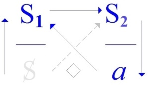
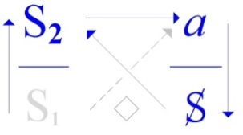

# Leçon 05 | 11 Février 1970

<!-- source-url: http://staferla.free.fr/S17/S17 L'ENVERS.docx -->
<!-- seminar: s17 -->
<!-- lesson: 05 -->

<!-- id: s17-05-0001 -->

Nous allons avancer, et pour éviter peut-être un malentendu, entre autres, je voudrais vous donner cette règle de première approximation : la référence d’un discours c’est ce qu’il avoue vouloir *maîtriser*, ça suffit à le classer justement dans la parenté du *discours du Maître*.

<!-- id: s17-05-0002 -->

Et c’est bien la difficulté de celui que j’essaie de rapprocher autant que je peux du *discours de l’analyste* : il doit se trouver à l’opposé de toute volonté, au moins avouée, de maîtrise.

<!-- id: s17-05-0003 -->

Je dis *au moins avouée,* non pas qu’il ait à la dissimuler, après tout il est facile de redéraper toujours dans *le discours de la maîtrise*.

<!-- id: s17-05-0004 -->

À vrai dire nous partons de là dans ce qui est enseignement, *du dis­cours de la conscience* qui s’est repris, qui se reprend tous les jours, indéfi­niment. Quelqu’un de très proche de moi - bien sûr dans la psychiatrie, quelqu’un de mes meilleurs amis – lui a redonné sa meilleure touche : discours de la synthèse, discours de la conscience qui maîtrise.

<!-- id: s17-05-0005 -->

C’est à lui que je répondais dans certains propos que j’ai tenus il y a un bout de temps sur « *La causalité psychique* », propos qui sont là pour témoigner que bien avant de prendre en main *le discours analytique*, enfin j’avais déjà quel­que orientation, quand je lui disais à peu près ceci :

<!-- id: s17-05-0006 -->

> « *Comment peut-il se faire autrement que d’appréhender toute cette activité psychique,*
>
> *comment peut-il se faire de l’appréhender autrement que comme un rêve,*
>
> *quand on entend mille et mille fois en cours de journée cette chaîne bâtarde de destin et d’inertie,*
>
> *de coups de dés et de stupeur, de faux succès et de rencontres méconnues, qui font le texte courant d’une vie humaine ?* »[^18]

<!-- id: s17-05-0007 -->

Ne vous attendez donc à rien d’autre de plus subversif en mon discours que de ne pas prétendre à la solution.

<!-- id: s17-05-0008 -->

Néanmoins, il est clair que rien n’est plus brûlant que ce qui du dis­cours fait référence à *la jouissance*.

<!-- id: s17-05-0009 -->

*Le discours* y touche sans cesse de ce qu’il s’y origine, il l’émeut à nouveau dès qu’il s’essaie à retourner à cette origine, et c’est en cela qu’il conteste tout apaisement.

<!-- id: s17-05-0010 -->

Freud tient un discours étrange, il faut le dire, le plus contraire à la cohérence, à la consistance d’un discours.

<!-- id: s17-05-0011 -->

Le sujet du discours ne se sait pas en tant que sujet tenant le discours.

<!-- id: s17-05-0012 -->

*Qu’il ne sache pas ce qu’il dit*, passe encore, on y a toujours suppléé.

<!-- id: s17-05-0013 -->

*Mais* ce que Freud dit, c’est qu’*il ne sait pas <u>qui</u> le dit*.

<!-- id: s17-05-0014 -->

*Le savoir*...

<!-- id: s17-05-0015 -->

car *le savoir*, je pense y avoir déjà assez insisté pour que ça vous entre dans la tête ...*le savoir est chose qui se dit*, qui est dite.

<!-- id: s17-05-0016 -->

Eh bien*, le savoir parle tout seul, voilà l’inconscient*.

<!-- id: s17-05-0017 -->

C’est là qu’il aurait dû être attaqué par ce que l’on appelle, plus ou moins diffusément, la *phénoménologie*.

<!-- id: s17-05-0018 -->

Il ne suffisait pas, pour contre­dire Freud, de rappeler que le savoir se sait ineffablement, il fallait porter l’attaque sur ceci : c’est que Freud met l’accent sur ce que n’importe qui peut savoir, c’est que le savoir *s’égrène*, que le savoir *s’énumère*, *se détaille*, et c’est ça qui ne va pas tout seul, c’est que *ce qui se dit, le chapelet, personne ne le dit, il se déroule tout seul*.

<!-- id: s17-05-0019 -->

Si vous me permettez, c’était par là que je voulais commencer, par cet aphorisme. Vous allez voir pourquoi j’y ai reculé.

<!-- id: s17-05-0020 -->

J’ai fait comme d’habitude, heu­reusement cette fois-ci, je l’ai fait avant midi trente et une qu’il est, de façon à ne pas retarder cette fois la fin de notre rencontre.

<!-- id: s17-05-0021 -->

Ce par quoi je voulais commencer, si je commençais comme j’en ai toujours envie, de façon abrupte...

<!-- id: s17-05-0022 -->

c’est parce que j’en ai envie que je ne le fais pas, je vous apprivoise, je vous évite les chocs ...l’aphorisme est ceci, qui j’espère, va vous frapper par son évi­dence, parce que c’est à cause de ça que Freud...

<!-- id: s17-05-0023 -->

malgré les protestations qui ont accueilli, il faut bien le dire, son entrée dans le monde du commerce des idées ...ce qui s’est imposé, *c’est que Freud ne déconne pas*. \[*Rires*\]

<!-- id: s17-05-0024 -->

C’est ça qui a imposé cette sorte, comme ça, de préséance qu’il a à notre époque.

<!-- id: s17-05-0025 -->

C’est probablement autour de ça aussi qu’il y en a un autre dont on sait que malgré tout, il survit assez bien.

<!-- id: s17-05-0026 -->

L’un et l’autre, Freud et Marx, ce qui les caractérise, c’est qu’*ils ne déconnent pas*.

<!-- id: s17-05-0027 -->

Ça se remarque à ceci : c’est que c’est à les contredire, on risque toujours qu’on glisse assez bien dans le déconnement.

<!-- id: s17-05-0028 -->

Ils désordonnent le dis­cours de ceux qui veulent les accrocher, ils le figent très fréquemment en une sorte de *récursion académique, conformiste, retardataire*, irréducti­blement. Plût au Ciel que ces contradicteurs, si j’ose dire, déconnassent, ils don­neraient ses suites à Freud, ils seraient dans un certain ordre, celui de ce dont après tout il est question.

<!-- id: s17-05-0029 -->

Car après tout on se demande pourquoi on qualifie, comme ça, de temps en temps, untel ou untel, de « *con »*.

<!-- id: s17-05-0030 -->

Est-ce que c’est si dévalorisant ?

<!-- id: s17-05-0031 -->

Vous avez pas remarqué que quand on dit que quelqu’un *est un con*, cela veut dire plutôt qu’il est un *pas si con* ?

<!-- id: s17-05-0032 -->

Ce qui déprime, c’est qu’on sait pas très bien en quoi il a affaire à *la jouissance*, c’est pour cette raison qu’on l’appelle comme ça.

<!-- id: s17-05-0033 -->

C’est aussi ce qui fait le mérite du discours de Freud : justement, lui est à la hau­teur.

<!-- id: s17-05-0034 -->

Il est à la hauteur d’un discours qui se tient aussi près qu’il est pos­sible de ce qui se rapporte à *la jouissance*, enfin aussi près qu’il est possible jusqu’à lui.

<!-- id: s17-05-0035 -->

C’est pas commode, c’est pas commode de se situer en ce point où le discours émerge, voire - quand il y retourne - achoppe aux environs de *la jouissance*.

<!-- id: s17-05-0036 -->

Évidemment là-dessus Freud parfois se dérobe, nous abandonne, il abandonne la question autour de *la jouissance féminine*.

<!-- id: s17-05-0037 -->

Aux dernières nouvelles M. Gillespie...

<!-- id: s17-05-0038 -->

> personnage éminent à s’être distingué par toutes sortes d’opérations de marchandage
>
> entre les différents courants qui ont parcouru l’analyse dans ces cinquante dernières années ...marque je ne sais quelle allégresse dans le dernier numéro paru de l’*International Journal of Psycho-Analysis*, une allégresse singulière quand au fait, au fait que grâce à un cer­tain nombre d’expériences qui se seraient poursuivies à l’université de Washington sur l’orgasme vaginal, une vive lumière serait projetée \[*Rires*\] sur ce qui faisait débat, de savoir de la primauté, ou non, dans le développe­ment de la femme, d’une jouissance d’abord réduite à l’équivalent de *la jouissance mâle*. Ces travaux d’un nommé Masters et d’un autre, Johnson sont, à vrai dire, non sans intérêt.

<!-- id: s17-05-0039 -->

Mais quand j’y vois figurer...

<!-- id: s17-05-0040 -->

je dois dire que c’est sans avoir pu me reporter directe­ment au texte, mais à travers certaines citations ...que l’orgasme majeur, en tant qu’il serait celui de la femme, ressortit à *« la personnalité totale »*, je me demande ce en quoi l’emploi d’appareils cinématographiques...

<!-- id: s17-05-0041 -->

> et recueillant les images en couleurs \[*Rires*\], mis à l’intérieur d’un appendice qui est là pour représenter le pénis introduit, et qui donc de l’intérieur ainsi saisit ce qui se passe sur la paroi qui à son intro­duction l’entoure ...je me demande comment peut être saisi par cet appareil le point de vue de « *la personnalité totale* ». \[*Rires*\]

<!-- id: s17-05-0042 -->

C’est peut-être fort intéressant, bien sûr, comme accompagnement, à étudier en marge de ce que le discours de Freud nous permet d’avancer, mais c’est bien là ce qui donne son sens au mot « *déconner »,* comme *déchanter *: vous savez ce que c’est que le *déchant*, c’est quelque chose qui s’écrit comme ça, à côté, en marge du *plain-chant*, ça peut se chanter aussi, ça peut faire un accompagnement, mais enfin ce n’est pas tout à fait ce que l’on attend du *plain-chant.*

<!-- id: s17-05-0043 -->

Et alors c’est pour ça qu’il y a tant de déchant, qu’il faut bien ici rappeler dans son relief brutal ce quelque chose qui ressort de ce que je pourrais appeler « *la tenta­tive de* *réduction économique »* que Freud donne à son discours sur *la jouissance*.

<!-- id: s17-05-0044 -->

Ce n’est pas sans raison qu’il le marque ainsi, vous allez voir l’effet que ça fait quand on l’énonce en direct.

<!-- id: s17-05-0045 -->

Mais c’est ce que j’ai cru aujour­d’hui ici devoir faire, sous une forme qui j’espère vous frappera, encore qu’elle ne vous apprenne rien, sinon le juste ton de ce que Freud découvre.

<!-- id: s17-05-0046 -->

Nous n’allons pas parler de *la jouissance* comme ça.

<!-- id: s17-05-0047 -->

Je vous en ai déjà assez dit pour que vous sachiez que *la jouissance* c’est « *le tonneau des Danaïdes* », et qu’une fois qu’on y entre, on ne sait pas jusqu’où ça va : ça commence à *la chatouille* et ça finit par *la* *flambée à l’essence*. Ça, c’est toujours *la jouissance*.

<!-- id: s17-05-0048 -->

Je prendrai les choses par un autre facteur, dont on ne peut pas dire qu’il soit absent du *discours analytique*.

<!-- id: s17-05-0049 -->

Si vous lisez, enfin le... le véritable *corpus* anniversaire que constitue ce numéro, et dont on conçoit que les auteurs se félicitent de la soli­dité révélée par ces 50 années.

<!-- id: s17-05-0050 -->

C’est que je vous prie d’en faire l’épreuve : prenez de ces 50 ans n’importe quel numéro, vous ne saurez jamais de quand il date, et il dit toujours la même chose. C’est toujours aussi insipide, et comme l’analyse conserve, *c’est toujours aussi les mêmes auteurs* \[*Rires*\]. Simplement, avec la fatigue, ils ont réduit de temps en temps leur collaboration : il y en a un qui s’exprime en une page.

<!-- id: s17-05-0051 -->

Et ils se félicitent qu’en somme, ces 50 ans aient bien confirmé ces vérités premières :

<!-- id: s17-05-0052 -->

- que le ressort de l’analyse, c’est la bonté,

<!-- id: s17-05-0053 -->

- et que ce qui est mis heureusement particulièrement en évidence depuis ces années, avec l’efface­ment progressif du discours de Freud, c’est la solidité et la gloire d’une découverte, qu’on appelle l’« *autonomous ego* », à savoir l’*ego* à l’abri des conflits.

<!-- id: s17-05-0054 -->

Voilà ce qui résulte de 50 années d’expérience, par la vertu de l’injection de trois psychanalystes - qui avaient fleuri à Berlin - dans la société américaine où ce discours d’un *ego* solidement autonome était sans doute prometteur de résultats alléchants.

<!-- id: s17-05-0055 -->

Pour un retour au *discours du Maître* en effet, on ne peut mieux faire.

<!-- id: s17-05-0056 -->

Ça nous donne l’idée des incidences en retour, si l’on peut dire « *rétrogressives »*, de toute espèce de tentative de transgression, comme tout de même fut en un temps l’analyse.

<!-- id: s17-05-0057 -->

Alors nous allons dire les choses d’une certaine façon, et puisque vous le trouverez au détour facilement de telle ou telle page, puisque je vous dis que c’est aussi un des thèmes courants de la propagande analytique, vous le trouverez ici en anglais, ça s’appelle « *happiness* », nous appelons ça en français « *le bonheur* ».

<!-- id: s17-05-0058 -->

Le bonheur, à moins de le définir d’une façon assez triste, à savoir que c’est d’être comme tout le monde...

<!-- id: s17-05-0059 -->

ce à quoi, après tout pourrait bien se résoudre l’« *autonomous ego* » ...le bonheur, il faut bien le dire, personne ne sait ce que c’est.

<!-- id: s17-05-0060 -->

Mais si nous en croyons Saint-Just...

<!-- id: s17-05-0061 -->

Saint-Just qui l’a dit lui-même ...le bonheur est depuis cette époque, celle de Saint-Just, est devenu un facteur de la politique[^19].

<!-- id: s17-05-0062 -->

Alors essayons ici de donner corps à cette notion par - aussi - un énoncé abrupt, dont je vous prie de prendre acte qu’il est central de la théorie freudienne : *il n’y a de bonheur que du phallus*.

<!-- id: s17-05-0063 -->

Freud l’écrit sous toutes sortes de formes, et l’écrit même de la façon naïve qui consiste à dire que rien ne peut être approché d’une jouissance plus parfaite que celle de l’orgasme masculin.

<!-- id: s17-05-0064 -->

Seulement là où l’accent est mis par la théorie freudienne, c’est qu’*il n’y a que le phallus à être heureux, pas le porteur dudit* \[*Rires*\].

<!-- id: s17-05-0065 -->

Même quand...

<!-- id: s17-05-0066 -->

non pas par oblativité on peut le dire, mais en désespoir de cause ...il le porte, le susdit, au sein d’une partenaire supposée se désoler de n’en être pas porteuse elle-même.

<!-- id: s17-05-0067 -->

Voilà ce que nous enseigne positivement l’expérience psychanalytique : *le porteur dudit,* comme je m’exprime, s’escrime à faire accepter par sa partenaire cette *privation*, au nom de quoi tous ses efforts d’*amour*, de *menus soins* et de *tendres services* sont vains, puisqu’il ravive ladite bles­sure de la *privation*.

<!-- id: s17-05-0068 -->

Cette blessure donc, ne peut être en quelque sorte compensée par la satisfaction que le porteur aurait de l’apaiser, que bien au contraire, bien certainement, elle est ravivée de sa présence même, de la présence de ce dont le regret cause cette blessure.

<!-- id: s17-05-0069 -->

C’est là très exactement ce que nous a révélé ce que Freud a su extraire du discours de l’hystérique.

<!-- id: s17-05-0070 -->

C’est à partir de là que se conçoit que l’hystérique symbolise cette insatisfaction première, que sa promotion du désir insatisfait, celle sur laquelle j’ai insisté, que j’ai mis en valeur en m’appuyant sur l’exemple minimal, à savoir ce que j’ai commenté dans cet écrit qui reste sous le titre de « *Direction de la cure et les principes de son pouvoir »,* le rêve - qu’on s’en souvienne - dit de « *La belle bouchère* »...

<!-- id: s17-05-0071 -->

De la belle bouchère et de son baiseur de mari qui, lui, est un vrai con en or, \[*rires*\] moyennant quoi il faut qu’elle lui montre qu’elle ne tient pas à ce dont il veut la combler de surcroît, ce qui veut dire que ça n’arrangera rien quant à l’essentiel, malgré que cet essentiel, elle l’ait. Voilà !

<!-- id: s17-05-0072 -->

Ce qu’elle ne voit pas, elle, parce qu’elle a aussi ses limites à son petit horizon, c’est que ça serait - cet essentiel de son mari - à le laisser à une autre qu’elle trouverait, elle, le *plus de jouir*, car c’est bien ce dont il s’agit dans le rêve.

<!-- id: s17-05-0073 -->

Elle ne le voit pas dans le rêve, c’est tout ce qu’on peut dire.

<!-- id: s17-05-0074 -->

Il y en a d’autres qui le voient.

<!-- id: s17-05-0075 -->

Parce que Dora, c’est ce qu’elle fait.

<!-- id: s17-05-0076 -->

Elle *bouche*, par l’adoration de l’objet de désir qu’est devenue à son horizon la femme...

<!-- id: s17-05-0077 -->

> par cette femme dont elle s’enveloppe, celle qui dans l’observation s’appelle Mme K
>
> et qu’elle adore sous la figure de cette Madone de Dresde qu’elle va contempler ...elle *bouche*, par cette adoration, sa revendication pénienne.

<!-- id: s17-05-0078 -->

C’est tout ce qui me permet de dire que la belle bouchère ne voit pas qu’en fin de compte, comme Dora, elle serait heureuse - très précisément cet objet - à le laisser à une autre.

<!-- id: s17-05-0079 -->

Ce sont des indications, il y a d’autres solutions.

<!-- id: s17-05-0080 -->

Si j’indique celle-là, c’est parce qu’elle est la plus scandaleuse.

<!-- id: s17-05-0081 -->

Il y a bien d’autres raffinements dans la façon de substituer à cette jouissance dont l’appareil...

<!-- id: s17-05-0082 -->

qui est celui du social, ...à cette jouissance dont l’appareil qui aboutit au complexe d’Œdipe, fait justement d’être la seule qui donnerait le bonheur : justement à cause de cela, cette *jouissance* est exclue. C’est proprement la significa­tion du *complexe d’Œdipe*.

<!-- id: s17-05-0083 -->

C’est bien pourquoi ce qui intéresse dans l’investigation analytique, c’est comment *quelque chose, dont nous avons défini l’origine d’une tout autre source que de la jouissance phal­lique*, *celle située*, celle si l’on peut dire « *quadrillée »* de la fonction *du plus-de-jouir,* comme elle est apportée, cette fonction du *plus-de-jouir,* en *suppléance* de l’interdit de la jouissance phallique.

<!-- id: s17-05-0084 -->

Je ne fais ici que rappeler des faits éclatants du discours freudien que j’ai mis maintes fois en valeur, et que je désire insérer ici dans leurs rap­ports de configuration, non pas centrale, mais connexe, à la situation que j’essaie de donner des rapports du discours à la jouissance.

<!-- id: s17-05-0085 -->

C’est en cela que je les rappelle et que je veux y mettre un accent - si vous voulez bien - de plus, destiné à changer, en quelque sorte, ce que pour vous peut traîner d’*aura* l’idée que le discours freudien se centre sur cette donnée biologique de la sexualité.

<!-- id: s17-05-0086 -->

Je prendrai ici ma mesure, c’est quelque chose dont il faut bien vous avouer que je n’ai pas fait la découverte il y a bien longtemps, de ceci...

<!-- id: s17-05-0087 -->

et que c’est toujours les choses les plus visibles, celles qui s’étalent, qu’on voit le moins, ...je me suis tout à coup demandé : « *Mais comment est-ce qu’on dit en grec, le sexe ?* ».

<!-- id: s17-05-0088 -->

Le pire c’est que je n’avais pas de dictionnaire français-grec, d’ail­leurs il n’y en a pas. Enfin il y en a des petits, des moches.

<!-- id: s17-05-0089 -->

Mais enfin, il faut reconnaître que j’avais trouvé γένος \[génos\], qui bien sûr n’a rien à faire avec le sexe, puisque ça veut dire un tas d’autres choses, *la race*, enfin c’était la ligne, c’était *la lignée*, c’est *l’engendrement*, c’est *la reproduction*.

<!-- id: s17-05-0090 -->

Et puis un autre mot m’est venu à l’horizon, mais dont les connotations sont certes bien autres, φύσης \[phusis\]*, la nature*.

<!-- id: s17-05-0091 -->

Mais c’est pas ça du tout que nous disons, ça n’a pas du tout cet accent, quand nous disons *le sexe.*

<!-- id: s17-05-0092 -->

Cette répartition des êtres vivants, tout ça en - d’une part d’entre eux - en deux classes, avec tout ce dont on s’aperçoit que ça comporte, très proba­blement l’irruption de *la mort*, puisque les autres - mon Dieu - n’ont pas l’air de tellement mourir que ça, ceux qui sont pas sexués.

<!-- id: s17-05-0093 -->

Le relief, bien sûr, c’est pas du tout cette référence biologique, c’est bien ce qui montre que... qu’il faut être très, très prudent avant de penser que c’est un rappel, non seulement d’un organicisme quelconque, mais même d’une référence à la biologie, qui met en avant la fonction du sexe dans le discours freudien.

<!-- id: s17-05-0094 -->

C’est là qu’on s’aperçoit que *sexe,* avec l’accent qu’il a pour nous, et l’ordre d’emploi, la diffusion significative, *c’est sexus.*

<!-- id: s17-05-0095 -->

Et quand on dit « *par rapport au grec* », il faudrait poursuivre l’enquête dans d’autres langues positives, mais en latin ça se rattache - mais très nettement - à « *secare* ».

<!-- id: s17-05-0096 -->

Dans le *sexus* latin, il y a - impliqué - ce que j’ai mis d’abord en évidence, à savoir que c’est autour du *phallus* que tout le jeu tourne, et justement en tant que « *le phallus* », et uniquement pour ça...

<!-- id: s17-05-0097 -->

car bien entendu il n’y a pas que le *phallus* dans les relations ...dans les rapports sexuels.

<!-- id: s17-05-0098 -->

Seulement, ce qu’il a de privilégié cet organe, c’est qu’on peut en quelque sorte bien *isoler sa jouissance*.

<!-- id: s17-05-0099 -->

Il est pensable comme *exclu*, pour dire des mots violents, n’est-ce pas, je ne vais pas vous noyer ça dans le symbolisme.

<!-- id: s17-05-0100 -->

Il a justement cette propriété que nous pouvons considérer d’ailleurs...

<!-- id: s17-05-0101 -->

dans l’ensemble du champ de ce qui constitue les appareils sexuels ...comme très locale, très exceptionnelle.

<!-- id: s17-05-0102 -->

Il n’y a pas un très grand nombre d’animaux chez qui l’organe, l’organe décisif de la copulation, est quelque chose d’aussi bien isolable dans ses fonctions de *tumescence* et de *détumes­cence*, déterminant une courbe dite « orgasmique », parfaitement définis­sable : une fois que c’est fini, c’est fini.

<!-- id: s17-05-0103 -->

« *Post coitum animal triste* », a déjà dit Galien[^20] \[*Rires*\]. C’est pas forcé, d’ailleurs !

<!-- id: s17-05-0104 -->

Mais ça marque bien, enfin que... qu’il se sent frustré, quoi !

<!-- id: s17-05-0105 -->

Il y a quelque chose là-dedans qui ne le concerne pas.

<!-- id: s17-05-0106 -->

Il peut prendre les choses autrement, il peut trouver ça très gai, mais enfin Horace trouvait que c’était plutôt triste, et cela prouve qu’il avait encore gardé quelques illusions sur les rapports à la φύσης \[phusis\] grecque, au bourgeon que constituerait le désir sexuel.

<!-- id: s17-05-0107 -->

Alors voilà qui met les choses à leur place, de voir que c’est tout de même ainsi que Freud présente les choses, et que s’il y a quelque chose dans la biologie qui pourrait faire écho...

<!-- id: s17-05-0108 -->

vague ressemblance, nullement racine, à cette position, comme nous allons l’indiquer maintenant, racines de discours ...s’il y a quelque chose qui, pour faire « *bye-bye »* au domaine de la biologie, nous donnerait enfin une idée, comme ça, approximative, de ce que ça représente ce fait que tout se joue autour de cet enjeu :

<!-- id: s17-05-0109 -->

- que l’un n’a pas,

<!-- id: s17-05-0110 -->

- et dont l’autre ne sait que faire, ce serait à peu près ce qui se produit un peu chez certaines espèces animales.

<!-- id: s17-05-0111 -->

J’ai vu tout récemment, et c’est pour ça que je vous en parle, de très jolis poissons, enfin monstrueux comme doit l’être un poisson

<!-- id: s17-05-0112 -->

- où la femelle a à peu près de cette taille-là,

<!-- id: s17-05-0113 -->

- et où le mâle est... \[*Lacan fait un geste indiquant, entre le pouce et l’index*\].

<!-- id: s17-05-0114 -->

Il vient s’accrocher à son ventre, et il s’accroche si bien, jusqu’au point que ses tissus sont indiscernables : on peut pas, même au microscope, voir où commencent les tissus de l’un, les tissus de l’autre.

<!-- id: s17-05-0115 -->

Il est là, accroché par la bouche comme ça, et de là il remplit, enfin si on peut dire, ses fonctions de mâle.

<!-- id: s17-05-0116 -->

Il n’est pas impensable en effet que ça simplifie beaucoup le problème, ça simplifie le problème des rapports sexuels quand le mâle se réduit à ce qui, à peu près, reste au bout d’un certain temps dans cette petite poche animale, à savoir principalement les testicules.

<!-- id: s17-05-0117 -->

À la fin il est fatigué, il résorbe son cœur, son foie, il n’y a plus rien de tout ça, il est là suspendu, à la bonne place.

<!-- id: s17-05-0118 -->

La question est d’articuler ce qu’il en est de cette exclusion phallique dans le grand jeu humain de notre tradition, qui est celui du *désir*. Le désir n’a pas de rapport immédiatement proxime avec ce champ.

<!-- id: s17-05-0119 -->

Notre tradition le pose pour ce qu’il est : l’*éros*, la présentification du manque.

<!-- id: s17-05-0120 -->

Et c’est là aussi qu’on peut demander : comment peut-on *désirer* quoi que ce soit ? Qu’est-ce qui manque ?

<!-- id: s17-05-0121 -->

Il y a quelqu’un, un jour, qui a dit : « *Mais ne vous fatiguez pas, rien ne manque, regardez les lis des champs, ils ne tissent ni ils ne filent,* *c’est eux qui sont à leur place dans le Royaume des cieux.* »[^21]

<!-- id: s17-05-0122 -->

Il est évident que pour tenir ces propos de véritable défi, il fallait vrai­ment être celui-là même qui s’identifiait à la négation de cette harmonie.

<!-- id: s17-05-0123 -->

C’est tout au moins ainsi qu’on l’a compris, interprété, quand on l’a qualifié du « *Verbe* ».

<!-- id: s17-05-0124 -->

Il fallait qu’il fût « *le Verbe* » lui-même pour qu’il puisse à ce point nier l’évidence.

<!-- id: s17-05-0125 -->

Enfin, c’est l’idée qu’on s’en est faite.

<!-- id: s17-05-0126 -->

Lui n’en disait pas tant. Il disait, si l’on en croit l’un de ses disciples : « *Je suis la Voie, la Vérité, la Vie.* »

<!-- id: s17-05-0127 -->

Mais qu’on en ait fait « *le Verbe* », c’est bien là où se marque que les gens savaient tout de même à peu près ce qu’ils disaient quand ils pensaient qu’il n’y avait que « *le Verbe* » à pouvoir à ce point se désavouer.

<!-- id: s17-05-0128 -->

C’est vrai que le lis des champs, nous pouvons bien l’imaginer comme un corps tout entier livré à la jouissance.

<!-- id: s17-05-0129 -->

Chaque étape de sa croissance identique à une sensation sans forme. Jouissance de la plante.

<!-- id: s17-05-0130 -->

Rien en tout cas ne permet de lui échapper. C’est peut-être une douleur infinie d’*être une plante*.

<!-- id: s17-05-0131 -->

Enfin, personne ne s’amuse à rêver à ça, sauf moi.

<!-- id: s17-05-0132 -->

Il n’en est pas de même pour l’animal, qui a ce que nous interprétons comme une « économie » : la possibilité de se mouvoir pour obtenir sur­tout *le moins de jouissance*.

<!-- id: s17-05-0133 -->

C’est ce qu’on appelle le « *principe du plaisir »* : ne restons pas là où on jouit, parce que Dieu sait où ça peut mener, je vous l’ai déjà dit tout à l’heure.

<!-- id: s17-05-0134 -->

Or, il y a cette chose : que la jouissance tout de même nous en savons les moyens.

<!-- id: s17-05-0135 -->

Je vous ai parlé tout à l’heure de la chatouille et de la gril­lade. Là, on sait comment faire.

<!-- id: s17-05-0136 -->

C’est même ça, le savoir : personne, en principe, n’a envie d’en user trop loin, et quand même ça tente !

<!-- id: s17-05-0137 -->

C’est même ça dont Freud a fait la découverte justement vers 1920, et c’est là, en quelque sorte, le point de rebroussement de sa découverte.

<!-- id: s17-05-0138 -->

C’est quand, après avoir épelé l’inconscient, dont je défie qu’on dise que ça puisse être autre chose que la remarque : « *qu’il y a un savoir parfaite­ment articulé dont, à proprement, aucun sujet n’est responsable* ».

<!-- id: s17-05-0139 -->

Et que quand un sujet vient à rencontrer, à toucher, il se trouve...

<!-- id: s17-05-0140 -->

il se trouve lui qui parle, qui tout d’un coup rencontre ce savoir auquel il ne s’attendait pas ...il se trouve, ma foi, bien dérouté.

<!-- id: s17-05-0141 -->

C’était la première trouvaille.

<!-- id: s17-05-0142 -->

Et que ça ait conduit nécessairement à ceci, que Freud leur a dit aux sujets :

<!-- id: s17-05-0143 -->

> « *parlez, parlez donc, faites donc comme les hystériques, on va bien voir quel est le savoir que vous rencontrez,*
>
> *et la façon dont vous, vous y êtes aspiré, ou au contraire dont vous le repoussez, on va voir ce qui se passe* », ...c’est là qu’il a fait cette découverte, celle qu’il appelle de « *l’au-delà du principe du plaisir* ».

<!-- id: s17-05-0144 -->

C’est ceci : *c’est que l’essentiel*...

<!-- id: s17-05-0145 -->

*l’essentiel* de ce qui détermine ce à quoi on a affaire dans l’exploration de l’*inconscient...c’est la répétition*.

<!-- id: s17-05-0146 -->

Que *la répétition* ça ne veut pas dire : *ce qu’on a fini on le recommence*, comme la digestion ou quelque autre fonction physiologique.

<!-- id: s17-05-0147 -->

*La répétition c’est une dénotation*, dénotation précise *d’un trait* que j’ai dégagé du texte de Freud *comme identique au trait unaire*, au « *petit bâton »*, à l’élément de l’écriture, *d’un trait en tant qu’il commémore une irruption de la jouissance.*

<!-- id: s17-05-0148 -->

Voilà pourquoi il est concevable que le plaisir soit violé dans sa règle et son principe, pourquoi il cède au *déplaisir*...

<!-- id: s17-05-0149 -->

il n’y a rien d’autre à dire, pas la douleur forcément ...au *déplaisir* qui ne veut rien dire que *la jouissance*.

<!-- id: s17-05-0150 -->

C’est ici que l’insertion *de la génération, du génital, du génésique*, dans *le désir*, se montre tout à fait distincte de la maturité sexuelle. Parler de sexualisation prématurée a certes son intérêt, encore qu’il faille bien dire que ce qu’on appelle chez l’homme la première poussée sexuelle soit à cet égard très évidemment ce qu’on dit, à savoir : prématurée.

<!-- id: s17-05-0151 -->

Qu’à côté de ce fait qu’elle puisse impliquer en effet « *jeu de jouissance »*, il n’en reste pas moins que ce qui va introduire la section entre la libido et la nature, eh bien ce n’est pas seulement l’auto-érotisme organique.

<!-- id: s17-05-0152 -->

Il y a d’autres animaux que les hommes qui sont capables de se chatouiller...

<!-- id: s17-05-0153 -->

les hommes, ça ne les a pas menés à une élaboration du désir bien avancée ...les singes.

<!-- id: s17-05-0154 -->

Par contre : la faveur trouvée en fonction du *discours*.

<!-- id: s17-05-0155 -->

Il ne s’agit pas seulement de parler des interdits, mais simplement d’une dominance de la femme en tant que mère, et mère *qui* *dit*, mère *à qui l’on demande*, mère *qui ordonne*, et qui institue du même coup cette dépendance du petit homme.

<!-- id: s17-05-0156 -->

La femme donne à la jouissance d’oser *le masque de la répétition*.

<!-- id: s17-05-0157 -->

La femme ici se présente en ce qu’elle est, comme institution de la *mascarade*, elle apprend à son petit à parader, le porte vers le *plus de jouir*, parce qu’elle plonge ses racines - elle, la femme, comme la fleur - dans la jouissance elle-même.

<!-- id: s17-05-0158 -->

Les moyens de *la jouissance* sont ouverts, au principe de ceci : qu’il ait renoncé à *la jouissance close*, et étrangère à la mère.

<!-- id: s17-05-0159 -->

C’est là pourquoi doit venir s’insérer la vaste connivence sociale qui inverse ce que nous pouvons appeler au naturel : la différence des sexes, en sexualisation de la différence organique.

<!-- id: s17-05-0160 -->

Ce renversement implique le commun dénominateur de l’exclusion de l’organe spécifiquement mâle.

<!-- id: s17-05-0161 -->

Le mâle dès lors *est* et *n’est pas* ce qu’il est, au regard de la jouissance.

<!-- id: s17-05-0162 -->

Et de là aussi, la femme se produit comme objet, justement de n’être pas ce qu’il est :

<!-- id: s17-05-0163 -->

- d’une part : différence sexuelle,

<!-- id: s17-05-0164 -->

- et d’autre part d’être ce à quoi il renonce comme jouissance. ­

<!-- id: s17-05-0165 -->

Voilà. Ces rappels sont tout à fait essentiels à faire, au moment où, à parler de *L’envers de la psychanalyse*, la question se pose de la place de la psychanalyse dans le politique.

<!-- id: s17-05-0166 -->

L’intrusion dans le politique ne peut se faire qu’à reconnaître qu’il n’y a de discours...

<!-- id: s17-05-0167 -->

et pas seulement l’analytique ...de discours que de *la jouissance*, tout au moins quand on en espère le travail de la vérité.

<!-- id: s17-05-0168 -->

La caractérisation du *discours du Maître* comme comportant une vérité cachée ne veut pas dire qu’il se cache, qu’il se planque, le *discours du Maître*. Le mot « *caché* » en français a ses vertus étymologiques : il vient de *coactus*, du verbe *coactare*, *coactitare*, *coactitacare*... cela veut dire qu’il y a quelque chose qui est comprimé, qui est comme une surimpression, quelque chose qui demande à être déplié pour être lisible.

<!-- id: s17-05-0169 -->

Il est clair que sa vérité lui est cachée, qu’un certain Hegel a articulé qu’elle lui est livrée, la vérité, par le travail de l’esclave. Seulement voilà, c’est un *discours de Maître*, ce discours de Hegel, qui repose sur la substitution de l’État au Maître par le long chemin de la culture, pour aboutir au *savoir absolu.*

<!-- id: s17-05-0170 -->

Il paraît bien avoir été définitivement réfuté par quelques trou­vailles qui sont celles de Marx, auxquelles...

<!-- id: s17-05-0171 -->

je ne suis pas là pour le commenter ...je ne donnerai pas ici d’appendice, mais simplement montrerai à quel point, *du belvédère psychanalytique*, nous sommes à l’aise *pour mettre en doute* ceci d’abord : que le travail engendre un *savoir absolu* à l’horizon, ni même aucun savoir.

<!-- id: s17-05-0172 -->

J’ai déjà avancé ça devant vous, je ne peux pas ici le reprendre, mais c’est un des axes où je vous prie de vous situer pour saisir ce qu’il en est de la subversion analytique.

<!-- id: s17-05-0173 -->

Si le travail \[lapsus\]... Si le *savoir est moyen de la jouissance*, le travail est autre chose.

<!-- id: s17-05-0174 -->

Même s’il est accompli par ceux qui ont le savoir, ce qu’il engendre ce peut certes être *la vérité*, mais nul travail n’a jamais engendré un savoir.

<!-- id: s17-05-0175 -->

Quelque chose y objecte, qui est celui que donne une observation plus serrée de ce qu’il en est dans notre culture des rapports du *discours du Maître* à quelque chose qui a surgi, qui est celui d’où est reparti l’examen de ce qui, du point de vue de Hegel, s’enroulait autour de ce discours : l’évitement de la *jouissance absolue*, en tant qu’elle est déterminée par ceci qu’à fixer l’enfant à la mère, la connivence sociale la fait le siège élu des interdits.

<!-- id: s17-05-0176 -->

D’autre part, la formalisation d’un savoir qui rend toute vérité problé­matique, est-ce que ce n’est pas ce qui nous suggère que quelque chose...

<!-- id: s17-05-0177 -->

> plutôt que ce qu’on nous indique d’un progrès survenu par le travail de l’esclave,
>
> *comme si dans sa condition il y avait eu le moindre progrès*, bien au contraire ...que quelque chose peut nous donner l’idée plutôt d’un transfert, d’une spoliation, de ce qui en était au départ de ce savoir inscrit, recelé, dans le monde de l’esclave, mais auprès de quoi c’est *le discours du Maître* qui avait à s’imposer.

<!-- id: s17-05-0178 -->

Qui avait à s’imposer, mais aussi de ce fait, rentrant dans le mécanisme de son assertion répétée, d’y appréhender *la perte* de sa propre entrée dans le discours, voir surgir pour tout dire, cet *objet(a)* que nous avons épinglé du « *plus de jouir »*.

<!-- id: s17-05-0179 -->

C’est cela en somme - cela, pas plus - que le Maître avait à faire payer à l’esclave, seul possesseur des moyens de la jouissance, il se contentait de cette petite dîme, d’un *plus de jouir*, dont après tout rien n’indique que l’esclave fût en lui-même malheureux de le donner.

<!-- id: s17-05-0180 -->

Il en est tout autre chose de ce qui se trouve à l’horizon de la montée du sujet-Maître dans une vérité qui s’affirme de son égalité à soi-même, de cette « *je-cratie* » dont je parlais une fois, et qui est, semble-t-il, l’essence de toute affirmation dans la culture qui a vu fleurir entre toutes ce *discours du Maître*.

<!-- id: s17-05-0181 -->

Cette soustraction à l’esclave de son *savoir*, qui est - à la voir de plus près - toute l’histoire de cette dialectique dont Hegel suit les étapes pas à pas, chose singulière, sans avoir vu où elle menait, certes, et pour cause : il était encore dans le champ de la découverte newtonienne, il n’avait pas vu naître la thermodynamique.

<!-- id: s17-05-0182 -->

Peut-être alors, s’il avait pu se mettre au dos des formules, qui pour la première fois uni­fièrent *ce champ* ainsi désigné *de la thermodynamique*, aurait-il pu y reconnaître ceci, *du règne pur du signifiant*, du signifiant répété à deux niveaux, **S1,S1** encore :

<!-- id: s17-05-0183 -->

- le 1er **S1** c’est la digue,

<!-- id: s17-05-0184 -->

- le 2nd **S1** c’est en dessous : le bassin qui la reçoit et qui fait tourner une turbine.

<!-- id: s17-05-0185 -->

Il n’y a pas d’autre sens à *la conservation de l’énergie* que cette marque d’une instrumentation qui signifie le pouvoir du Maître.

<!-- id: s17-05-0186 -->

*Ce qui est recueilli dans la chute*, ceci d’autant *doit être conservé*, c’est la 1ère des lois \[1er *principe de la thermodynamique : conservation de l’énergie*\].

<!-- id: s17-05-0187 -->

Il y a *quelque chose*, malheureusement, dans l’intervalle qui disparaît, plus exactement ne se prête pas au retour, à la remise en état du point de départ : c’est *le principe* dit « *de Carnot-Clausius* », encore qu’un certain Mayer y ait beaucoup contribué. \[2nd *principe de la thermodynamique : entropie, dégradation de l’énergie*\].

<!-- id: s17-05-0188 -->

L’*analogie*, l’*analogie* d’un tel *savoir* avec un discours qui dans son essence donne la primauté à tout ce qui est du départ et de la fin, en négligeant tout ce qui dans un intervalle peut être de quelque chose qui relève d’un savoir.

<!-- id: s17-05-0189 -->

Cette mise à l’horizon du monde nouveau, de ces pures vérités numériques, de ce qui est comptable, est-ce que ceci à soi tout seul ne signifie pas bien autre chose que la montée en jeu d’un *savoir absolu* ?

<!-- id: s17-05-0190 -->

N’est-ce pas l’idéal même d’une formalisation où plus rien ne compte...

<!-- id: s17-05-0191 -->

> car l’énergie n’est rien d’autre que ce qui se compte,
>
> ce qui, si vous manipulez d’une certaine façon les formules, se trouve toujours faire le même total ...ce qu’ici ce glissement, ce *quart de tour* \[*anti-horaire*\] qui fait que c’est à la place du Maître \[**S1**\] que s’instaure une articulation éminemment nouvelle \[**S2 → *a***\], complètement réductible formellement à du *savoir*.

<!-- id: s17-05-0192 -->

À *la place* de l’esclave \[**S2**\] s’est mis, non pas quelque chose qui d’aucune façon s’insérerait dans l’ordre de ce savoir, mais qui en est bien plutôt *le produit* \[***a***\].

<!-- id: s17-05-0193 -->

 → 

<!-- id: s17-05-0194 -->

> (*quart de tour anti-horaire*)

<!-- id: s17-05-0195 -->

Ce que Marx dénonce, dénonce de ce procès de spoliation...

<!-- id: s17-05-0196 -->

> sans se rendre compte que c’est dans *le savoir* même qu’en est le secret ...comme la réduction du travailleur lui-même à n’être plus rien lui-même que valeur \[*d’échange *: *le travail comme marchandise*\] : le *plus de jouir* passé un étage au dessus, n’est rien d’autre que ce rapport où quelque chose qui n’est plus « *plus de jouir »,* mais s’inscrit simplement comme *valeur,* à inscrire ou à déduire de la totalité de ce qui s’accumule, ce qui s’accumule d’une nature essentiel­lement transformée, le travailleur n’est qu’*unité de valeur*.

<!-- id: s17-05-0197 -->

Avis à ceux pour qui ce terme évoque un écho...

<!-- id: s17-05-0198 -->

C’est bien ce que que Marx dénonce dans la *plus-value*, ces spoliations de la jouis­sance.

<!-- id: s17-05-0199 -->

Pourtant cette *plus-value* c’est le mémorial du *plus de jouir*, un équivalent du *plus de jouir*.

<!-- id: s17-05-0200 -->

La société des consommateurs prend son sens de ceci, que ce qui en fait « *l’élément* »...

<!-- id: s17-05-0201 -->

> l’élément entre guillemets qu’on qualifie d’« *humain* » ...*à ceux-là* est donné l’équivalent homogène \[*équivalent général : la monnaie*\] de n’importe quel *plus de jouir* qui est le produit de notre industrie, un *plus de jouir en toc* pour tout dire.

<!-- id: s17-05-0202 -->

Aussi bien, ça peut prendre : *on peut faire semblant de plus de jouir*, ça retient encore beaucoup de monde.

<!-- id: s17-05-0203 -->

Si je voulais vous donner matière à rêver, où s’amorce ce procès dont notre science est le statut, je vous dirais, puisque après tout j’en ai refait récemment la lecture, de vous amuser au *Satiricon.*

<!-- id: s17-05-0204 -->

Moi je trouve pas mauvais ce qu’il en a fait Fellini.

<!-- id: s17-05-0205 -->

Il a fait une faute d’orthographe en écrivant « *Satyricon »*, c’est ce qui ne lui sera jamais pardonné, il n’y a pas de « *y* », mais enfin à part ça c’est pas mal...

<!-- id: s17-05-0206 -->

C’est moins bien que le texte*...*

<!-- id: s17-05-0207 -->

*C’est moins bien que le texte* parce que dans le texte on est sérieux, on ne s’arrête pas à des images et qu’on voit de quoi il retourne. Pour tout dire, c’est un bon exemple pour faire la différence de ce qu’il en est du Maître et du riche.

<!-- id: s17-05-0208 -->

Ce qu’il y a de merveilleux, n’est-ce pas, dans les discours...

<!-- id: s17-05-0209 -->

dans les discours quels qu’ils soient, fût-ce les plus révolutionnaires ...c’est qu’ils ne disent jamais les choses en cru, comme je viens d’essayer, comme ça, un petit peu... enfin j’ai fait ce que j’ai pu.

<!-- id: s17-05-0210 -->

Depuis le temps qu’il y a des économistes, nous voyons à quel point cela a de l’intérêt pour nous analystes, parce que s’il y a quelque chose qui est à faire dans l’analyse, c’est l’institution de cet *autre* champ énergétique, qui nécessiterait d’*autres* structures.

<!-- id: s17-05-0211 -->

Vous pouvez unifier tant que vous voulez - enfin si vous êtes Maxwell - *le champ de la thermodynamique et de l’électromagnétique* , quand même vous rencontrez un os à propos du gravitationnel, et c’est assez curieux parce que c’est avec le gravitationnel que tout le monde a commencé, mais enfin qu’importe...

<!-- id: s17-05-0212 -->

Pour ce qui est du champ de la jouissance...

<!-- id: s17-05-0213 -->

> hélas qu’on n’appellera jamais - car je n’aurai sûrement pas le temps,
>
> même d’en ébau­cher les bases - qu’on n’appellera jamais « *le champ lacanien* » ...pour ce qui est du champ de la jouissance il y a des remarques à faire.

<!-- id: s17-05-0214 -->

Eh bien, il est très curieux que dans un tas d’auteurs dans lesquels je mets de temps en temps mon nez, il y en a un même qui s’appelle, enfin qu’on apelle du nom de Smith, qui a écrit quelque chose comme ça qui s’appelle, n’est-ce pas, « *La Richesse des nations ».*

<!-- id: s17-05-0215 -->

Et puis, et puis on ouvre le livre, et alors on voit que dans les économistes il est pas le seul, ils sont tous là à se casser la tête, Malthus, Ricardo et les autres : *la richesse des nations*, qu’est-ce que c’est ?

<!-- id: s17-05-0216 -->

Et alors on est là à essayer de définir ce que c’est

<!-- id: s17-05-0217 -->

- *la valeur d’usage*, ça doit bien compter quand même,

<!-- id: s17-05-0218 -->

- et *la valeur d’échange*, parce que c’est pas Marx qui a inventé tout ça, ...on est bien embarrassé.

<!-- id: s17-05-0219 -->

Il est extraordinaire que... que personne, que personne alors pour le coup n’ait, même un instant, je ne dis pas pour s’y arrêter, fait cette remarque que la richesse, eh bien c’est la propriété du riche...

<!-- id: s17-05-0220 -->

> comme la psychanalyse - je l’ai dit un jour - c’est fait par le psychanalyste,
>
> c’est sa principale caractéris­tique : il faut partir du psychanalyste ...pourquoi, à propos de la richesse, on ne partirait pas du riche ?

<!-- id: s17-05-0221 -->

Alors là, là intervient peut-être, et puis parce qu’il faut que j’aille vite, il faut que je m’arrête exactement dans deux minutes, pour des raisons, comme ça, de cours... Je vais quand même vous dire quelque chose qui ressort, comme ça d’une expérience qui n’est pas spécia­lement d’analyste, une chose que tout le monde peut faire.

<!-- id: s17-05-0222 -->

Le riche - c’est très important - a une propriété.

<!-- id: s17-05-0223 -->

Il achète, il achète tout en somme, enfin il achète beaucoup.

<!-- id: s17-05-0224 -->

Je voudrais bien que vous méditiez sur ceci : c’est qu’il ne paie pas.

<!-- id: s17-05-0225 -->

On s’imagine qu’il paye, pour des raisons comptables qui tiennent à la transformation du « *plus de jouir »* en « *plus-value »*.

<!-- id: s17-05-0226 -->

D’abord, chacun sait que la *plus-value*, il se l’additionne très régulièrement.

<!-- id: s17-05-0227 -->

Il n’y a pas de cir­culation du *plus de jouir*, et très nommément, il y a une chose qu’il ne paye jamais, c’est le savoir.

<!-- id: s17-05-0228 -->

Car il n’y a pas que la dimension de l’*entropie* dans ce qui se passe du côté du « *plus de jouir »*, il y a quelque chose dont quelqu’un s’est aperçu, c’est *que le savoir ça implique l’équivalence entre cette entropie et une information*.

<!-- id: s17-05-0229 -->

Bien sûr c’est pas pareil, ce n’est pas aussi simple que M. Brillouin[^22] le dit, mais tout de même, ce qu’il faut voir c’est que *le riche n’est un Maître*...

<!-- id: s17-05-0230 -->

> et c’est ce que je vous prie d’aller voir dans le « *Satiricon »* ...*que parce qu’il s’est racheté*.

<!-- id: s17-05-0231 -->

Les Maîtres dont il s’agit à l’horizon du monde antique, ne sont pas des hommes d’affaires.

<!-- id: s17-05-0232 -->

Voyez comme Aristote en parle : ça lui répugne.

<!-- id: s17-05-0233 -->

Par contre, quand un esclave s’est racheté, il n’est un Maître qu’en ceci : qu’il commence à tout risquer.

<!-- id: s17-05-0234 -->

C’est bien ainsi qu’un personnage, qui n’est autre que Trimalcion lui-même, s’exprime dans le *Satiricon.*

<!-- id: s17-05-0235 -->

Qu’à partir du moment où il est riche, pourquoi est-ce qu’il peut tout acheter sans payer ?

<!-- id: s17-05-0236 -->

C’est que lui n’a rien à faire avec *la jouissance*, que ce n’est pas ça qu’il répète : il répète son rachat.

<!-- id: s17-05-0237 -->

Il rachète tout, ou plutôt tout ce qui se présente, il le rachète.

<!-- id: s17-05-0238 -->

Il est bien fait pour être chrétien.

<!-- id: s17-05-0239 -->

Il est par destina­tion *le racheté*.

<!-- id: s17-05-0240 -->

Et pourquoi est-ce qu’on se laisse acheter par le riche ?

<!-- id: s17-05-0241 -->

On se laisse acheter par le riche parce que ce qu’il vous donne participe de son essence de riche.

<!-- id: s17-05-0242 -->

Savoir qu’à acheter à un riche, à une nation développée, vous croyez simplement...

<!-- id: s17-05-0243 -->

c’est ça le sens de *la richesse des nations* ...que vous allez participer du niveau d’une nation riche.

<!-- id: s17-05-0244 -->

Seulement, dans cette affaire ce que vous perdez, c’est votre savoir, qui vous donnait à vous, votre statut.

<!-- id: s17-05-0245 -->

Ce savoir, le riche se l’acquiert par-dessus le marché.

<!-- id: s17-05-0246 -->

Simplement, justement, il ne le paye pas.

<!-- id: s17-05-0247 -->

Eh bien, nous sommes arrivés aujourd’hui à la limite, à la limite de ce que je peux dire avant d’évacuer cette salle.

<!-- id: s17-05-0248 -->

Je voulais introduire ceci : de ce qui peut arriver de la promotion, au niveau où joue la fonc­tion du riche, *celle pour qui le savoir n’est qu’appareil d’exploitation*, ce qui peut arriver de la reprise de voix de ce qu’il en est du *plus de jouir*, du *(a)*.

<!-- id: s17-05-0249 -->

C’est là, ce dont la fonction de l’analyste donne en quelque sorte quelque chose comme l’*aurore*.

<!-- id: s17-05-0250 -->

J’essaierai de vous expliquer la prochaine fois ce qui en est l’essence.

<!-- id: s17-05-0251 -->

L’essence n’est sûrement pas de refaire de cet élément, un élément de maîtrise.

<!-- id: s17-05-0252 -->

Puisque, comme je vous l’expliquerai, tout tourne autour de l’insuccès.

## Notes

[^18]: *Écrits :* « *Propos sur la causalité psychique »,* p.160 (Congrès de Bonneval, 28 Septembre 1946) :

    « *Vraiment toute cette « activité psychique » m'apparaît alors comme un rêve, et ce peut-il être le rêve d'un médecin qui mille et dix mille fois a pu entendre se dérouler à son oreille*

    *cette chaîne bâtarde de destin et d'inertie, de coups de dés et de stupeur, de faux succès et de rencontres méconnues, qui fait le texte courant d'une vie humaine ?* »

[^19]: Saint-Just : « *le bonheur est devenu un facteur de la politique* \[...\] *il ne saurait y avoir de satisfaction d’aucun hors de la satisfaction de tous*... ».

[^20]: Claude Galien : *L'âme et ses passions*, Belles lettres, 1995. « *post coïtum omne animal triste est, sive gallus et mulier* »,

    > « *après le coït tous les animaux sont tristes, sauf le coq et la femme.*)

[^21]: Évangile selon Luc, XII-27 : « *Considérez les lis, comme ils ne filent ni ne tissent. Or, je vous le dis, Salomon lui-même, dans toute sa gloire, n'a pas été vêtu comme l'un d'eux.* »

[^22]:
    #  Léon Brillouin : « *La Science et la théorie de l’information »* (1959), éd. Jacques Gabay, 2000.
