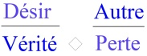
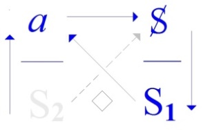
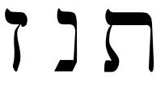

# Leçon 07 | 11 Mars 1970

<!-- source-url: http://staferla.free.fr/S17/S17 L'ENVERS.docx -->
<!-- seminar: s17 -->
<!-- lesson: 07 -->

<!-- id: s17-07-0001 -->

Ce qui est remarquable dans la formulation que je vais essayer de vous donner du *discours de l’analyse* en le repérant de ce à quoi, par toutes sortes de traces, il se manifeste à première vue déjà apparenté, à savoir le *discours du Maître,* c’est disons plutôt de ce que *la vérité du discours du Maître* est masquée, que l’analyse prend son importance.

<!-- id: s17-07-0002 -->

  

<!-- id: s17-07-0003 -->

> *Discours du Maître* *Discours analytique*

<!-- id: s17-07-0004 -->

Dans les 4 places où se situent les éléments articulatoires \[**S1,S2,S**, ***a***\], sur les­quels je fonde *la consistance* qui peut surgir de la mise en rapport de ces *discours*, il est clair que la place que j’ai désignée comme étant celle de *la vérité,* ne se distingue qu’à approcher ce qu’il en est du fonctionnement *de ce qui vient de l’articulation à cette place*.

<!-- id: s17-07-0005 -->

Ceci ne lui est pas particulier, on peut en dire autant pour toutes les autres.

<!-- id: s17-07-0006 -->

Exemple, puisque bien sûr cette localisation, qui consistait jusqu’ici à désigner ces places comme « *l’en haut et à droite* », ou « *l’en haut et à gauche* » et ainsi de suite, ne saurait bien entendu nous satisfaire.

<!-- id: s17-07-0007 -->

C’est d’un niveau d’équivalence dans le fonc­tionnement, par exemple de ceci qui s’écrirait ainsi : ce qu’est le **S1** *dans le discours du Maître,* en tant qu’il *peut être dit congruent* ou *équivaloir* à ce qui vient fonctionner du **S2** dans *le discours* que j’ai qualifié...

<!-- id: s17-07-0008 -->

> pour fixer les idées si je puis dire, ou tout au moins fixer l’accommodation mentale, ...*du discours Universitaire* : **S1**(M) ≈ **S2**(U).

<!-- id: s17-07-0009 -->

Cette *place* sera dite fonctionner comme *place d’ordre*, ou si vous voulez, *de commandement*.

<!-- id: s17-07-0010 -->

C’est la place de *la vérité*, en tant qu’elle lui est...

<!-- id: s17-07-0011 -->

> dans mes divers petits schémas dits « *à quatre pattes* » ...sous-jacente, qui pose bien son problème et qui, de ne pouvoir s’occuper au niveau du *discours du Maître* que de ce S barré : **S,** qu’à vrai dire, au 1er abord rien ne nécessite, car *qu’est-ce qui*, d’un 1er temps, *ne se pose pas tranquillement comme identique à soi-même*.

<!-- id: s17-07-0012 -->

Nous dirons que c’est là le principe du dis­cours...

<!-- id: s17-07-0013 -->

non pas maîtrisé, mais écrivons le « *Maître-isé* » ...du discours en tant que *fait* Maître, c’est de se croire *univoque*.

<!-- id: s17-07-0014 -->

Assurément *c’est là le pas de la psychanalyse, de nous faire poser que le sujet n’est pas univoque*.

<!-- id: s17-07-0015 -->

La formule exemplaire...

<!-- id: s17-07-0016 -->

> dont - au moment, il y a 2 ans - où j’essayais d’articuler *L’acte psychanalytique* [^25],
>
> trajet qui, resté en panne, ne sera - comme d’autres - jamais repris ...la formule donc, per­cutante, que j’ai formulée de l’«* ou je ne pense pas, ou je ne suis pas *» alternative, est bien là ce qui assurément d’être seulement amené, fait figure, et assez résonnante, dès qu’il s’agit du *dis­cours du Maître*.

<!-- id: s17-07-0017 -->

Encore pour la justifier faut-il que nous la produisions d’ailleurs, où seulement elle est évidente.

<!-- id: s17-07-0018 -->

Il faut qu’elle se produise elle-même à la place dominante, et ce dans le *discours de l’hystérique*, pour qu’il soit en effet bien sûr que le sujet est placé devant ce « *vel* » qui s’exprime de « *ou je ne pense pas, ou je ne suis pas *» :

<!-- id: s17-07-0019 -->

- *là où je pense*, je ne me reconnais pas, *je ne suis pas*, c’est l’inconscient,

<!-- id: s17-07-0020 -->

- *là où je suis*, il est trop clair que *je m’égare*.

<!-- id: s17-07-0021 -->

À la vérité, présenter les choses ainsi ne laisse pas voir, plus exactement *montre* que si ceci est resté si longtemps *obscur* au niveau du *discours du Maître*, c’est précisément *d’être à une place qui*, de sa structure même, *masquait cette division du sujet*.

<!-- id: s17-07-0022 -->

Ne vous ai-je pas dit en effet ce qu’il en est de tout *dire* possible à la place de *la vérité* ?

<!-- id: s17-07-0023 -->

*La vérité,* vous dis-je, *ne saurait s’énoncer que d’un mi-dire, et le modèle je vous l’ai donné dans l’énigme,* *car c’est bien ainsi que tou­jours elle se présente à nous.*

<!-- id: s17-07-0024 -->

Non pas certes à l’état de question : *l’énigme* est quelque chose qui nous presse de répondre au titre d’un danger mortel.

<!-- id: s17-07-0025 -->

*La vérité n’est une question* - comme on le sait depuis longtemps - *que pour les administrateurs*.

<!-- id: s17-07-0026 -->

« *Qu’est-ce que la vérité ?* », on sait par qui[^26] cela a été une bonne fois éminemment prononcé,

<!-- id: s17-07-0027 -->

- mais autre chose est cette forme du *mi-dire* à quoi se contraint *la vérité*,

<!-- id: s17-07-0028 -->

- autre chose cette *division du sujet* qui en profite pour se masquer.

<!-- id: s17-07-0029 -->

Car *la division du sujet* c’est bien autre chose :

<!-- id: s17-07-0030 -->

- si « *où il n’est pas, il pense* »,

<!-- id: s17-07-0031 -->

- si « *où il ne pense pas, il est *», ...c’est bien qu’il est dans les deux endroits, et même - dirais-je - que cette formule de la *Spaltung* est impropre.

<!-- id: s17-07-0032 -->

Le sujet participe du *réel* en ceci justement qu’il est *impossible* apparemment...

<!-- id: s17-07-0033 -->

ou pour mieux dire, si je devais employer une figure, au reste qui ne vient là pas par hasard ...je dirais de lui comme de *l’électron* : là où il se propose à nous, à la jonction de *la théorie ondulatoire* et de *la théorie cor­pusculaire*, et où ce que nous sommes forcés d’admettre c’est que c’est bien en tant que le même qu’il passe par deux trous distants, et en même temps. L’ordre donc de ce que nous figurons par la *Spaltung* du sujet est autre que celui qui, comme de la vérité, ne se figure qu’à s’énoncer dans un *mi-dire*.

<!-- id: s17-07-0034 -->

Ici apparaît quelque chose d’important à souligner, car à la vérité chacune de nos formules...

<!-- id: s17-07-0035 -->

> celle dont se situe un discours a, bien entendu, de cette *ambiva­lence* même - comme nous reprendrons
>
> le mot en un autre sens - par quoi la vérité ne se figure que d’un *mi-dire* …chacune de ces formules prend des sens singulièrement opposés.

<!-- id: s17-07-0036 -->

Est-il bon, est-il mauvais, ce discours que j’épingle intentionnellement du *discours Universitaire *?

<!-- id: s17-07-0037 -->

Parce qu’en quelque sorte c’est le *discours Universitaire * qui montre, qui montre par où il peut pécher, c’est aussi bien dans sa dis­position fondamentale celui qui montre ce dont s’assure le *discours de la science*.

<!-- id: s17-07-0038 -->

 

<!-- id: s17-07-0039 -->

> *Discours Universitaire*

<!-- id: s17-07-0040 -->

Car repérez-y le **S2** tel qu’il tient la *place* en effet *dominante du discours* U, comme nous l’écrivons.

<!-- id: s17-07-0041 -->

C’est bien en tant, vous ai-je dit, que c’est à la place de l’ordre, du commandement, à la place premièrement tenue par le Maître, qu’est venu *le savoir*.

<!-- id: s17-07-0042 -->

Et s’il se fait que rien d’autre - au niveau de sa *vérité -* n’est *que le signifiant-Maître* \[**S1**\] comme tel, en tant qu’il opère pour porter l’ordre du Maître.

<!-- id: s17-07-0043 -->

C’est bien là de quoi relève ceci, qu’*après un temps d’hésitation...*

<!-- id: s17-07-0044 -->

peut-on dire, chez les esprits qui y pensaient ...*après un temps d’hésitation* dont nous avons la marque par exemple au niveau de Gauss, dont nous voyons à ses carnets que les énoncés qu’a avancés un temps plus tard un Riemann, Gauss - qui les avait approchés - avait pris le parti de ne pas les livrer : « *On ne va pas plus loin* »...

<!-- id: s17-07-0045 -->

Et pourquoi jeter en circulation ce savoir...

<!-- id: s17-07-0046 -->

> même de pure logique ...s’il semble qu’à partir de lui beaucoup d’un certain statut de repos, peut être ébranlé ?

<!-- id: s17-07-0047 -->

Il est clair que nous n’en sommes plus là, et que ceci tient au « *progrès* » même, à cette bascule que je décris « *d’un quart de tour »* qui fait venir *un savoir* \[**S2**\] en quelque sorte dénaturé, de sa localisation primitive au niveau de l’esclave \[Disc. M\], d’être devenu pur *savoir du Maître*, et régi par son commandement \[Disc. U\].

<!-- id: s17-07-0048 -->

 →  

<!-- id: s17-07-0049 -->

*Discours du Maître Discours Universitaire*

<!-- id: s17-07-0050 -->

Qui, à la vérité, à notre époque, un instant peut même songer à arrêter ce mouve­ment d’articulation *du discours de la science* \[*cf. Gauss*\] au nom de *quoi que ce soit* qui puisse en arriver ?

<!-- id: s17-07-0051 -->

Déjà les choses - mon Dieu - sont là, elles ont montré où on va : de structures moléculaires en *fission atomique*.

<!-- id: s17-07-0052 -->

Qui un instant, peut même penser que puisse s’arrêter ce qui, du *jeu des signes*, de *renversement de contenus* en *changement de places combinatoires*, solli­cite la tentative théorique de se mettre à l’épreuve du réel, de la façon qui - en révélant l’*impossible* - en fait jaillir une nouvelle puissance ?

<!-- id: s17-07-0053 -->

Il est impossible de ne pas obéir au commandement qui est là, à la place de ce qui est *la vérité* de la science : « *Continue. Marche. Continue à toujours plus savoir* ».

<!-- id: s17-07-0054 -->

Très précisément de ceci et de ce que *ce signe* \[**S1**\] du Maître occupe cette place, toute question de ce que peut voiler ce *signe*...

<!-- id: s17-07-0055 -->

le **S1** du commandement « *Continue à savoir* », de ce que ce signe, d’occuper cette place, contient d’énigme ...de ce que c’est *ce signe* qui occupe cette place toute question sur *la vérité* en est à proprement parler *écrasée*.

<!-- id: s17-07-0056 -->

Seulement ce qui fait énigme, c’est que dans le champ de *ces sciences* qui osent elles-mêmes s’intituler de «* sciences humaines *», nous voyons bien que le commandement « *Continue à savoir* » fait un peu de remue-ménage.

<!-- id: s17-07-0057 -->

 

<!-- id: s17-07-0058 -->

Parce que, comme dans tous les autres petits carrés ou *schémas à quatre pattes*, c’est toujours celui qui est ici \[**Autre**\] qui travaille, et pour faire jaillir la vérité, car c’est le sens du travail. S’il ne travaillait pas, celui qui est à cette place, quel qu’il soit :

<!-- id: s17-07-0059 -->

- dans le *discours du Maître* \[*disc*. M\] c’est la place de l’esclave,

<!-- id: s17-07-0060 -->

- dans le *discours de la Science* \[*disc*. **U**\] c’est celui de l’*a*-étudiant \[*a* *comme* **Autre**\] ...on pourrait jouer avec ce mot, peut-être cela renouvellerait-il un peu la question.

<!-- id: s17-07-0061 -->

Tout à l’heure, nous le voyions astreint à « *continuer à savoir* » sur le plan de la science physique.

<!-- id: s17-07-0062 -->

Sur le plan des *sciences humaines*, nous le voyons en tant que *quelque chose* pour lequel il faudrait peut-être un mot, je ne sais pas encore si c’est celui-là le bon, mais moi, comme ça, d’approche, d’instinct, de sono­rité : « *astudé* ».

<!-- id: s17-07-0063 -->

Si je fais entrer ce mot là dans le vocabulaire, j’aurais plus de chance que quand je voulais qu’on change le nom de la serpillière, « *astudé* » a plus de raisons d’être. Au niveau des *sciences humaines*, l’étudiant se sent « *astudé* ».

<!-- id: s17-07-0064 -->

Il est « *astudé* » parce que, comme tout travailleur...

<!-- id: s17-07-0065 -->

> repérez-vous sur les autres petits cadres ...il a à produire quelque chose...

<!-- id: s17-07-0066 -->

Quelque chose dont à la vérité, il arrive que mon discours suscite des réponses qui ont un rapport avec lui.

<!-- id: s17-07-0067 -->

C’est rare, mais de temps en temps ça me fait plaisir.

<!-- id: s17-07-0068 -->

Quand je suis arrivé à *l’École Normale* \[*rue d’Ulm*\], il s’est trouvé que des jeunes gens se sont mis à discourir sur le *sujet de la science*.

<!-- id: s17-07-0069 -->

À la vérité j’en avais fait l’objet du premier de mes séminaires de l’année 1965.

<!-- id: s17-07-0070 -->

C’était pertinent « *le sujet de la science* », mais il est clair que ça ne va pas tout seul.

<!-- id: s17-07-0071 -->

Ils se sont fait taper sur les doigts, et on leur a expliqué que « *le sujet de la science* », ça n’existait pas.

<!-- id: s17-07-0072 -->

Et au point vif où ils avaient cru le faire surgir, à savoir dans *le rap­port du* **0** *au* **1** dans le discours de Frege, on leur a démontré que les progrès de la logique mathématique avaient permis de réduire complè­tement, pas de suturer, d’évaporer *le sujet de la science*.

<!-- id: s17-07-0073 -->

Le malaise des « *astudés* » n’est pourtant pas sans rapport avec ceci, qu’ils sont quand même priés de constituer avec leur peau *le sujet de la science*, ce qui...

<!-- id: s17-07-0074 -->

> comme ça, aux dernières nouvelles ...dans la zone des « *sciences humaines* », semble présenter quelques difficultés.

<!-- id: s17-07-0075 -->

Et c’est ainsi que pour une science si bien assise d’un côté, et si évidemment conquérante de l’autre...

<!-- id: s17-07-0076 -->

> assez con­quérante pour se qualifier d’« *humaine »*,
>
> sans doute parce qu’elle prend les hommes pour *humus* \[*disc.* H, U, M\] ...eh bien il se passe des choses, il se passe des choses qui en somme nous font retomber sur nos pieds, et nous font toucher qu’au niveau de *la vérité*, le fait d’y substituer le pur et simple commandement, celui du Maître... « celui du Maître » : ne croyez pas que le Maître soit toujours là, c’est le commandement qui reste ...l’impératif catégorique « *Continue à savoir* », il n’y a plus besoin qu’il y ait personne là, nous sommes tous « embarqués », comme dit Pascal, dans *le discours de la science*.

<!-- id: s17-07-0077 -->

Ben il reste que quand même le *mi-dire* se trouve justifié de ceci : qu’il appert que sur *le sujet* des « *sciences humaines* », *il n’y a rien qui tienne debout*.

<!-- id: s17-07-0078 -->

Vous auriez bien tort de croire...

<!-- id: s17-07-0079 -->

car après tout on ne sait pas dans quelle petite cervelle arriérée pourrait surgir ceci que mes propos impliqueraient ...qu’on freinerait cette science, qu’à tout prendre, à revenir à l’attitude­ de Gauss il y aurait peut-être un espoir de salut.

<!-- id: s17-07-0080 -->

Ces sortes d’imputations...

<!-- id: s17-07-0081 -->

qui à la vérité seraient très justement qualifiées de réactionnaires ...il faut tout de même bien que je les pointe, parce qu’il n’est pas impensable que dans des zones...

<!-- id: s17-07-0082 -->

> qu’à la vérité je ne pense pas être très porté à fréquenter à l’endroit où je parle ...on pourrait en déduire \[cela\], de ce dont je suis en train de parler...

<!-- id: s17-07-0083 -->

Et ce dont aussi il faudrait bien se pénétrer, c’est que dans quoi que ce soit que j’articule d’une certaine visée de clarification, il n’y a pas la moindre idée de « *progrès* », au sens où ce terme impliquerait une solution heureuse.

<!-- id: s17-07-0084 -->

Ce que *la vérité*, quand elle surgit, a de résolutif, ça peut être de temps en temps heureux, et dans d’autres cas désastreux.

<!-- id: s17-07-0085 -->

On ne voit pas pourquoi *la vérité*, elle serait forcément toujours bénéfique.

<!-- id: s17-07-0086 -->

Il faut vraiment avoir le diable au corps pour s’imaginer une chose pareille, quand tout démontre le contraire.

<!-- id: s17-07-0087 -->

<!-- id: s17-07-0088 -->

*Discours analytique*

<!-- id: s17-07-0089 -->

Bref il est sûr que dans la position dite de l’*analyste*, à savoir quand c’est *l’objet(a)* lui-même qui se trouve...

<!-- id: s17-07-0090 -->

dans des cas d’ailleurs improbables, y a-t-il même *un* analyste qui le sait ?

<!-- id: s17-07-0091 -->

...mais on peut théoriquement poser que quand c’est *l’objet(a)* lui-même qui vient à la place du commandement \[*Disc. Analytique*\], que c’est bien comme identique à *l’objet(a),* de ce qui pour le sujet se présente comme la cause du *désir de savoir*, quand *il s’offre comme point de mire* à cette opération insensée : *une psycha­nalyse*, en tant qu’elle s’engage sur la trace du *désir de savoir.*

<!-- id: s17-07-0092 -->

Je vous ai dit au départ que ce « *désir de savoir* », ça n’allait pas tout seul.

<!-- id: s17-07-0093 -->

La *« pulsion épistémologique »* comme ils ont inventé de le dénommer, il s’agi­rait de voir d’où elle peut surgir.

<!-- id: s17-07-0094 -->

Comme je l’ai fait remarquer, ce n’est pas le Maître qui aurait inventé ça tout seul, il faut que quelqu’un le lui ait imposé.

<!-- id: s17-07-0095 -->

Comme le psychanalyste - mon Dieu - n’est pas évi­dent de toujours. Et en plus ce n’est plus lui qui le suscite \[*ce désir de savoir*\], *il s’offre comme point de mire* pour quiconque est mordu par ce *désir particulière­ment problématique.*

<!-- id: s17-07-0096 -->

Nous y reviendrons.

<!-- id: s17-07-0097 -->

En attendant, tâchons de bien pointer ce qu’il en est de ce qui dans la structure dite du *discours de l’analyste * en tant que vous le voyez ici :

<!-- id: s17-07-0098 -->

<!-- id: s17-07-0099 -->

*Discours analytique*

<!-- id: s17-07-0100 -->

Il dit au sujet : « *Allez-y, dites* - comme on dit - *tout ce qui vous passe par la tête, si divisé que ce soit, si manifeste­ment que cela démontre*

<!-- id: s17-07-0101 -->

> *qu’ou bien vous ne pensez pas, ou bien vous n’êtes rien du tout, ça peut aller, ce que vous produirez sera toujours recevable* ».

<!-- id: s17-07-0102 -->

Étrange... étrange pour des raisons que nous aurons à ponctuer mais que nous pouvons dès maintenant esquisser en ceci : que vous avez pu voir que s’il y a une liaison très forte, une relation fondamentale, à la ligne supérieure de la structure \- pour nous exprimer rapide­ment - celle qui fait le lien du *discours du Maître* à l’esclave \[**S1→ S2**\],

<!-- id: s17-07-0103 -->

- moyennant quoi - *Hegel dixit -* l’esclave, avec le temps lui démontrera sa vérité,

<!-- id: s17-07-0104 -->

- moyennant quoi aussi - *Marx dixit -* il se sera occupé tout ce temps à fomenter son *plus de jouir*.

<!-- id: s17-07-0105 -->

<!-- id: s17-07-0106 -->

Pourquoi ce *plus de jouir* le lui doit-il au Maître ?

<!-- id: s17-07-0107 -->

C’est là bien sûr ce qui est masqué.

<!-- id: s17-07-0108 -->

Ce qui est masqué au niveau de Marx, c’est que le Maître...

<!-- id: s17-07-0109 -->

> à qui c’est dû ce *plus de jouir* ...le Maître a renoncé à tout*, à la jouissance* d’abord puis­qu’*il s’est exposé à la mort*, et qu’il reste bien fixé dans cette position.

<!-- id: s17-07-0110 -->

Dans l’articulation hégélienne c’est clair :

<!-- id: s17-07-0111 -->

- sans doute il a privé l’esclave de la disposition de son corps,

<!-- id: s17-07-0112 -->

- mais - *c’est un rien !* - à lui il lui a laissé la jouis­sance.

<!-- id: s17-07-0113 -->

Alors si le Maître, dans tout ça, fait un petit effort pour que tout marche, c’est-à-dire donne l’ordre, il est clair...

<!-- id: s17-07-0114 -->

> ça je pense vous l’avoir bien expliqué en son temps,
>
> mais je le reprends parce qu’on ne saurait trop répéter les choses importantes ...que c’est comme ça que la jouissance est revenu à portée du Maître pour manifester son exigence.

<!-- id: s17-07-0115 -->

À simplement remplir sa fonction de Maître : il y perd quelque chose, ce *quelque chose de perdu* c’est par là au moins que quelque chose de *la jouissance* doit lui être *rendu* : précisément ce « *plus de jouir »*.

<!-- id: s17-07-0116 -->

Si avec le temps, par cet acharnement qui est le sien de se castrer, il n’avait pas comp­tabilisé ce *« plus de jouir »*, s’il n’en avait pas fait la *plus-value*, en d’autres termes s’il n’avait pas fondé le capitalisme, Marx se serait aperçu que *la plus-value c’est le « plus de jouir »*.

<!-- id: s17-07-0117 -->

Mais tout ceci bien sûr n’empêche pas que le capitalisme est fondé, et que la fonction de *la plus-value* est tout à fait pertinemment désignée dans ses conséquences ravageantes.

<!-- id: s17-07-0118 -->

Néan­moins, pour en venir à bout il faudrait peut-être savoir quel est au moins le premier temps de son articulation.

<!-- id: s17-07-0119 -->

Parce que, ce n’est pas parce qu’on *nationa­lise*...

<!-- id: s17-07-0120 -->

> au niveau du « *socialisme d’un seul pays »* ...*les moyens de produc­tion*, qu’on en a fini pour autant avec *la plus-value*, si on ne sait pas ce que c’est.

<!-- id: s17-07-0121 -->

Alors donc ce *plus de jouir*, ce *plus de jouir* aussi nous montre qu’au niveau du *discours du Maître,* puisque c’est tout de même bien là qu’il se situe

<!-- id: s17-07-0122 -->

- il n’y a pas de rapport entre ce qui, plus ou moins, va devenir *cause du désir* \[*a*\] d’un type comme le Maître qui, comme d’habi­tude, bien sûr n’y comprend rien,

<!-- id: s17-07-0123 -->

- il n’y a pas de rapport entre ça, et ce qui constitue *la vérité*.

<!-- id: s17-07-0124 -->

<!-- id: s17-07-0125 -->

Car ici dans la partie, l’étage au-dessous du schéma à quatre, il y a une barrière \[◊\].

<!-- id: s17-07-0126 -->

Et le fait qu’au niveau du *discours du Maître*, la barrière, la barrière est tout à fait tout de suite à la portée de la main de nommer : c’est *la jouissance* tout simplement, en tant qu’elle est interdite, qu’elle est interdite dans son fond.

<!-- id: s17-07-0127 -->

On en prend des lichettes de la jouissance \[*a* **◊ S** : *formule du fantasme*\].

<!-- id: s17-07-0128 -->

\[*Le « produit » *(*a*)*, ne peut atteindre la jouissance interdite* (**S**), *et en frôlant le bord du trou (*◊*), par la relance phallique* (*a* → **S1**) *n’en prend que « des lichettes de la jouissance »*\]

<!-- id: s17-07-0129 -->

*Cf. « Encore », 16 janvier 1973, le « ça tombe » de Newton, pour la gravitation :* \]

<!-- id: s17-07-0130 -->

Pour aller jusqu’au bout, je vous ai déjà dit comment ça s’incarne, pas besoin de réagiter les fantasmes morti­fères.

<!-- id: s17-07-0131 -->

Ce qui est intéressant dans cette formule comme définissante du *discours du Maître*, c’est de voir qu’*il est le seul à rendre impossible cette sorte d’articulation que nous avons pointée ailleurs comme le fantasme*, en tant qu’il est relation du *a* avec **S** *la division du sujet* \[***a* ◊ S** \].

<!-- id: s17-07-0132 -->

*Le discours du Maître* en son départ fondamental, exclut le fan­tasme.

<!-- id: s17-07-0133 -->

C’est bien, à la vérité, ce qui le rend dans son fondement tout à fait aveugle.

<!-- id: s17-07-0134 -->

 ↔ 

<!-- id: s17-07-0135 -->

*Discours du Maître Discours analytique*

<!-- id: s17-07-0136 -->

Nous verrons que c’est le fait qu’*ailleurs*...

<!-- id: s17-07-0137 -->

> tout à fait spécialement : *dans le discours analytique, il s’étale sur une ligne horizontale, et d’une façon tout à fait équilibrée* ...que le fan­tasme peut sortir, nous en dit un peu plus sur ce qu’il en est du fondement du *discours du Maître*.

<!-- id: s17-07-0138 -->

Quoi qu’il en soit, pour reprendre les choses au niveau du *discours de l’analyste*, constatons que c’est *le savoir*, à savoir toute *l’articulation du* S2 existante, tout ce qu’on peut savoir, qui est mis - *dans* *ma façon d’écrire*, je ne dis pas *dans le* *réel* - à la place dite de *la vérité*.

<!-- id: s17-07-0139 -->

C’est-à-dire que *« ce qui peut savoir » est, dans le discours de l’analyste, prié de fonctionner au registre de la vérité*.

<!-- id: s17-07-0140 -->

Qu’est-ce que ça peut bien vouloir dire ?

<!-- id: s17-07-0141 -->

Nous sentons que ça nous intéresse.

<!-- id: s17-07-0142 -->

Et pour prendre les choses...

<!-- id: s17-07-0143 -->

> c’est pas pour rien que j’ai fait ce détour ...au niveau de l’actualité : la mauvaise tolérance, disons une certaine *galopade* qu’a prise *le savoir* sous la forme dite de « *la science »*, de *la science moderne*, peut peut-être simplement...

<!-- id: s17-07-0144 -->

> sans toujours que nous y comprenions beaucoup plus loin que le bout de notre nez ...nous faire sentir qu’assurément si *quelque part* nous avons une chance que *cela prenne un sens* « *le savoir interrogé en fonction de vérité »,* ça doit être, tout au moins si nous faisons confiance à notre petit « *tourniquet* » - ça doit être là \[*discours* A\] que ça prend son sens.

<!-- id: s17-07-0145 -->

Voyez vous - ça je vous le dis en passant - par exemple c’est ce qui me justifie...

<!-- id: s17-07-0146 -->

c’est tout à fait en passant, nous allons voir où nous allons aller, mais en passant, comme ça ...c’est ce qui me justifie par exemple à dire que, puisque qu’une fois on m’a en quelque sorte, enfin... fermé le clapet, là au moment où j’allais parler du *Nom du Père*, j’en parlerai plus jamais !

<!-- id: s17-07-0147 -->

Ça a l’air comme ça, ça a l’air taquin, pas gentil, en quelque sorte. Qui sait ?

<!-- id: s17-07-0148 -->

Il y a même de ces gens, vous savez : *les fanatiques de la science* : «* Continue à savoir ! Comment donc, tu dois dire ce que tu sais du Nom du Père ! *»

<!-- id: s17-07-0149 -->

Je ne dirai pas ce que je sais du *Nom du Père* parce que justement, moi je ne fais pas partie du *discours universitaire*.

<!-- id: s17-07-0150 -->

Je suis un *a* *d’analyste* \[*Rires*\], *une pierre rejetée* d’avance, même si dans mes analyses je deviens *la pierre d’angle*, dès que je me lève de mon fauteuil, j’ai le droit d’aller me promener \[*Rires*\].

<!-- id: s17-07-0151 -->

Parce que ça se renverse : « *la pierre rejetée qui devient pierre d’angle »* [^27], ça peut être aussi inversement : on peut dire que *la pierre d’angle* elle peut aller se promener, non ? \[*Rires*\]

<!-- id: s17-07-0152 -->

C’est même comme ça que, peut-être, j’aurai une chance que les choses changent : si la pierre d’angle s’en allait, tout l’édifice se foutrait par terre ! Il y en a que ça tente ! Enfin, ne plaisantons pas. \[*Rires*\]

<!-- id: s17-07-0153 -->

Mais simplement je ne vois pas pourquoi je par­lerais du *Nom du Père*, puisque de toutes façons *là où il se place*, c’est au niveau où *le savoir fait fonction de vérité*, et que là nous sommes à propre­ment parler condamnés à ce que...

<!-- id: s17-07-0154 -->

même sur ce point encore flou pour nous du rapport du *savoir* avec *la vérité* ...ce n’est que d’*un mi-dire,* sachons-le, que nous pouvons énoncer quoi que ce soit.

<!-- id: s17-07-0155 -->

Je ne sais pas si vous sentez bien la portée de ça.

<!-- id: s17-07-0156 -->

Ça veut dire que si nous disons quelque chose d’une façon, dans cet ordre, en ce champ, il va y avoir une autre partie qui, *de ce dire même*, devient absolument irré­ductible, tout à fait obscure.

<!-- id: s17-07-0157 -->

De sorte qu’en somme il y a un certain arbitraire, il y a un choix qui peut se faire sur ce qu’il s’agit d’*éclairer*.

<!-- id: s17-07-0158 -->

En sorte que si je ne parle pas du *Nom du Père*, ça me permettra de parler d’autre chose.

<!-- id: s17-07-0159 -->

Ça ne sera pas sans rapport avec *la vérité* mais c’est pas comme pour le sujet, ça sera pas la même. Bon, ceci est une parenthèse.

<!-- id: s17-07-0160 -->

Ce que nous constatons de ce qu’il advient du *savoir* à la place de *la vérité*, je veux dire dans *le discours de l’analyste,* je pense que vous n’avez pas attendu ce que je vais dire mainte­nant pour que ça vienne.

<!-- id: s17-07-0161 -->

Vous devez quand même vous rap­peler que ce qui vient là, ça a un nom : c’est le *mythe*.

<!-- id: s17-07-0162 -->

Parce que, on n’a pas attendu que le *discours du Maître* se soit plei­nement développé pour montrer son fin mot dans le *discours du capita­liste,* avec cette curieuse copulation avec la science, on n’a pas attendu ça, ça s’est toujours vu, en tout cas c’est le tout de ce que nous voyons quand il s’agit de *la vérité*, la vérité première tout au moins.

<!-- id: s17-07-0163 -->

C’est celle qui, quand même, nous intéresse un peu...

<!-- id: s17-07-0164 -->

quoique la science nous y ait fait renoncer en nous donnant seulement son impératif : « *Continue à savoir* », mais dans un certain champ, mais - chose curieuse - dans un champ qui a, avec ce qui te concerne, toi bon­homme, *une certaine discordance* ...oui, eh ben c’est occupé par le *mythe*.

<!-- id: s17-07-0165 -->

Voilà, on en a fait une branche de la linguistique.

<!-- id: s17-07-0166 -->

Je veux dire que c’est ce qu’on dit de plus sérieux sur le mythe, c’est en partant de la linguistique.

<!-- id: s17-07-0167 -->

Je ne saurais bien sûr que vous recommander, dans « *Anthropologie structurale »*[^28]*...*

<!-- id: s17-07-0168 -->

recueil fait d’articles par mon ami Claude Lévi-Strauss ...de vous reporter au chapitre 11 « *La Structure des mythes » *: vous y verrez évidem­ment énoncée la même chose que ce que je vous dis, à savoir que *la vérité ne se supporte que d’un mi-dire*.

<!-- id: s17-07-0169 -->

Le premier examen sérieux qu’on fait de « *ces grosses unités »* comme il les appelle, car ce sont des "*mythèmes,* c’est évidemment ceci, que je ne lui impute pas, je vais lire textuelle­ment ce qu’il écrit : « *L’impossibilité de mettre en connexion des groupes de relations*...

<!-- id: s17-07-0170 -->

Il s’agit de « *paquets de relations »*, n’est-ce pas, comme il définit les mythes ...*est surmontée (ou plus exactement remplacée) par l’affirmation que deux relations contradictoires entre elles sont identiques,* *dans la mesure où chacune est, comme l’autre* - comme l’autre ! - *contradictoire avec soi.* » \[Plon p. 239, ou Pocket p. 248\]

<!-- id: s17-07-0171 -->

Bref, que le *mi-dire* est la loi même, interne, de toute espèce *d’énonciation de la vérité,* et que ce qui l’incarne le mieux c’est *le mythe.*

<!-- id: s17-07-0172 -->

On peut quand même pas se déclarer tout à fait satisfait que nous en soyons encore là. Bref !

<!-- id: s17-07-0173 -->

*Parce que le mythe, le mythe typique, le mythe central*, comme vous le savez quand même, *du discours psychanalytique, c’est le mythe* d’Œdipe.

<!-- id: s17-07-0174 -->

Je pense que vous pouvez tous répondre à cette question.

<!-- id: s17-07-0175 -->

C’est bien amusant - hein ? - l’effet qu’a fait l’usage du mythe d’Œdipe chez des gens qui étaient occupés des mythes, depuis un bon bout de temps quand même, on n’avait pas attendu mon cher ami Claude Lévi-Strauss qui y a apporté une clarté exemplaire, pour s’intéresser très vivement à la fonc­tion du mythe.

<!-- id: s17-07-0176 -->

Dans les milieux où on sait ce que c’est qu’un mythe, même si on ne le *définit* pas forcément comme je viens, moi, d’essayer de vous le situer, quoique ce soit difficilement admissible, même pour l’opé­rateur le plus obtus, de ne pas voir que tout ce qu’il peut dire du mythe, c’est ça, c’est que *la vérité* se montre dans une alternance de choses stricte­ment opposées, qu’il faut faire tourner autour l’une de l’autre.

<!-- id: s17-07-0177 -->

Enfin, quoi que ce soit qu’on ait construit depuis que le monde est monde, jusque et y compris tout ce que vous voudrez, même des mythes comme ça, supérieurs, très élaborés : le Yin et le Yang.

<!-- id: s17-07-0178 -->

Enfin, on peut beaucoup déconner, vous comprenez autour du mythe, parce que c’est juste­ment le champ du déconnage, et le déconnage, comme je vous l’ai dit depuis toujours, c’est *la vérité*. C’est identique.

<!-- id: s17-07-0179 -->

*La vérité*, ça permet de tout dire.

<!-- id: s17-07-0180 -->

Tout est vrai, à condition que vous excluiez le contraire.

<!-- id: s17-07-0181 -->

Seulement ça joue quand même un rôle que ce soit comme ça.

<!-- id: s17-07-0182 -->

Alors le mythe, le mythe d’Œdipe tel que Freud le fait fonctionner...

<!-- id: s17-07-0183 -->

> je peux vous le dire pour ceux qui ne le savent pas *...les mythographes* ça les fait plutôt rigoler. Ils trouvent ça absolument mal venu.

<!-- id: s17-07-0184 -->

Pourquoi ce privilège donné à ce mythe ?

<!-- id: s17-07-0185 -->

Enfin la 1ère étude sérieuse qu’on peut en faire montre qu’il est d’ailleurs beaucoup plus compliqué.

<!-- id: s17-07-0186 -->

D’ailleurs *comme par hasard*, Claude Lévi-Strauss, qui ne se refuse pas à l’épreuve, dans le même article nous énonce le mythe d’Œdipe complet : on peut voir qu’il s’agit de tout à fait autre chose que de savoir si on va baiser ou non sa maman.

<!-- id: s17-07-0187 -->

Il est quand même curieux, peu après par exemple, qu’un mythographe tout à fait bien...

<!-- id: s17-07-0188 -->

qualifié comme tel, enfin de la bonne école, de la bonne veine, qui commence à Boas et qui justement est venue confluer vers Lévi-Strauss ...un nommé Kroeber[^29], après avoir écrit, enfin un livre incendiaire sur « *Totem et Tabou »,* vingt ans après ait quand même écrit quelque chose...

<!-- id: s17-07-0189 -->

> enfin ça le taquinait, ça le tracassait d’en avoir dit comme ça pis que pendre, surtout qu’il a vu
>
> que ça se répandait, à savoir que le moindre étudiant croyait pouvoir faire *chorus*, ça il n’a pas pu le supporter ...alors il a fait remarquer que quand même ça devait bien avoir sa raison d’être, qu’il y avait quelque chose, il pouvait pas dire quoi, ce mythe d’Œdipe, enfin il y avait là un os.

<!-- id: s17-07-0190 -->

Il n’en dit pas plus d’ailleurs, mais enfin après la critique qu’il a faite de ce livre *Totem et Tabou...*

<!-- id: s17-07-0191 -->

*Totem et Tabou,* dont il faut tout de même bien dire que, il faudrait...

<!-- id: s17-07-0192 -->

je sais pas moi si vous voulez que je le fasse cette année ...étudier sa composition, qui est une des choses les plus tordues qu’on puisse imaginer !

<!-- id: s17-07-0193 -->

C’est tout de même pas parce que je prêche le retour à Freud, que je ne peux pas dire que *Totem et Tabou,* c’est tordu.

<!-- id: s17-07-0194 -->

C’est même pour ça qu’il faut retourner à Freud : c’est pour s’apercevoir que si c’est tordu comme ça, étant donné que c’était quand même un gars qui savait écrire et penser, ça devait avoir une raison d’être.

<!-- id: s17-07-0195 -->

Je ne vais pas ajouter « *Moïse* *et le monothéisme n’en parlons pas* », parce qu’au contraire on va en parler.

<!-- id: s17-07-0196 -->

Tout ceci pour vous dire que tout ça, tout de même je mets les choses en ordre : j’allais pas commencer par faire des choses comme ça, une espèce de chemin damé...

<!-- id: s17-07-0197 -->

> enfin que je fais bien sûr moi-même tout entier : personne ne m’a aidé ...pour qu’on sache ce que c’est que « *Les formations de l’incons­cient* [^30]» par exemple, ou « *La relation d’objet* », alors mainte­nant on croirait simplement que je fais des galipettes autour de Freud : c’est pas tout à fait de ça qu’il s’agit.

<!-- id: s17-07-0198 -->

Oui, tâchons tout de même d’entraver un petit peu quelque chose de ce qu’il en est *du mythe d’Œdipe*, *du mythe d’Œdipe dans Freud.* Je n’en finirai pas avec lui aujourd’hui, et puis comme vous voyez, *je ne me presse pas*, je vois pas pourquoi moi je me fatiguerais ! Je parle avec vous comme ça, comme ça me vient, et puis on va voir jusqu’où, cahin-caha on peut en arriver.

<!-- id: s17-07-0199 -->

Je vais commencer, comme ça par... par la fin, pour vous donner tout de suite ma visée, parce que je vois pas pourquoi j’abattrais pas mes cartes.

<!-- id: s17-07-0200 -->

C’est pas comme ça que je comptais tout à fait vous en parler, mais au moins ça sera, ça sera clair.

<!-- id: s17-07-0201 -->

Je ne suis pas du tout en train de dire que l’Œdipe ça ne sert à rien, ni que ça n’a aucun rapport avec ce que nous faisons.

<!-- id: s17-07-0202 -->

Ça ne sert à rien aux psychanalystes, ça c’est vrai !

<!-- id: s17-07-0203 -->

Mais comme les psychanalystes ne sont pas sûrement des psychanalystes, ça ne prouve rien.

<!-- id: s17-07-0204 -->

De plus en plus les psychanalystes s’engagent dans quelque chose qui est effectivement excessive­ment important, à savoir le *rôle de la mère*, et ces choses - mon Dieu - mais enfin j’ai commencé déjà de les aborder.

<!-- id: s17-07-0205 -->

Le *rôle de la mère*, c’est le « *béguin* » de la mère.

<!-- id: s17-07-0206 -->

C’est absolument capital, parce que le « *béguin* » de la mère c’est pas quelque chose qu’on peut supporter comme ça, enfin, et que ça vous soit indifférent. Ça entraîne toujours des dégâts. N’est-ce pas, hein ?

<!-- id: s17-07-0207 -->

Un grand croco­dile comme ça - hein ? - dans la bouche duquel vous êtes, c’est ça la mère, non ?

<!-- id: s17-07-0208 -->

On ne sait pas ce qui peut lui prendre, tout d’un coup comme ça, de le refermer son clapet.

<!-- id: s17-07-0209 -->

C’est ça, *le désir de la mère*.

<!-- id: s17-07-0210 -->

Alors j’ai essayé d’expliquer que ce qu’il y avait ras­surant c’est qu’il y avait un os...

<!-- id: s17-07-0211 -->

> comme ça je vous dis des choses simples\[*Rires*\] ...il y avait quelque chose qui était ras­surant - j’improvise *un peu* \[*Rires*\] - un rouleau comme ça, bien dur, en pierre, qui est là en puissance au niveau du clapet, ça retient, ça coince: c’est ce qu’on appelle le *phallus*, le rouleau qui vous met à l’abri si tout d’un coup ça se referme.

<!-- id: s17-07-0212 -->

Ça c’est des choses que j’ai exposées dans son temps, comme ça, parce que c’était un temps où je par­lais à des gens qu’il fallait ménager : c’était des psychanalystes !

<!-- id: s17-07-0213 -->

Il fallait leur dire des choses grosses comme ça pour qu’ils les comprennent.

<!-- id: s17-07-0214 -->

D’ailleurs, ils ne comprenaient pas tous. \[*Rires*\]

<!-- id: s17-07-0215 -->

Alors j’ai parlé à ce niveau là de *la métaphore paternelle*.

<!-- id: s17-07-0216 -->

J’ai introduit... je n’ai jamais parlé du *complexe d’Œdipe* que sous cette forme.

<!-- id: s17-07-0217 -->

Ça devait être quand même un peu suggestif.

<!-- id: s17-07-0218 -->

*Si je dis que c’est la métaphore paternelle*, alors que quand même, tout de même, *c’est pas comme ça que Freud nous présente les choses* ! Surtout qu’il tient *beaucoup* à ce que ça se soit passé, cette sacrée histoire du meurtre du père de la horde, vous savez là, cette pitrerie darwinienne : le père de la horde, comme s’il y en avait jamais eu *la moindre trace du père de la horde,* on a vu *des orangs-outangs* \[*Rires*\], *mais le père de la horde humaine on n’en a jamais vu la moindre trace !*

<!-- id: s17-07-0219 -->

En tous cas Freud tient à ce que ça soit réel, hein ça, ça il y tient !

<!-- id: s17-07-0220 -->

Il a écrit tout *Totem et Tabou* pour dire ça, que ça s’est forcément passé et que c’est de là que tout a démarré, à savoir tous nos emmerdements, y compris celui d’être psychanalyste...

<!-- id: s17-07-0221 -->

C’est frappant ! En tous les cas quelqu’un aurait dû, sur cette *métaphore paternelle*, s’exciter un peu, à savoir : faire...

<!-- id: s17-07-0222 -->

moi, ce que j’ai toujours beaucoup désiré, enfin quand j’ai indiqué un petit trou comme ça, une petite voie ...que quelqu’un s’avance, *me fasse la trace* quand je commence à montrer un petit chemin, comme ça : *puisse-t-il m’avoir devancé* !

<!-- id: s17-07-0223 -->

Enfin, quoi que ce soit...

<!-- id: s17-07-0224 -->

Quoi qu’il en soit ça ne s’est pas produit.

<!-- id: s17-07-0225 -->

Alors la question de l’Œdipe est intacte.

<!-- id: s17-07-0226 -->

Alors je vais vous faire quelques remarques préliminaires, parce que vous le voyez je... il faut vraiment bien marteler la chose, parce que ça ne s’escamote pas, cette histoire.

<!-- id: s17-07-0227 -->

Il y a une chose comme ça dans la pratique analytique qui est tout de même ce à quoi nous sommes vraiment rompus, formés, c’est cette histoire de « *contenu manifeste »* et de « *contenu latent »*, hein ? Ça, c’est l’expérience.

<!-- id: s17-07-0228 -->

Par exemple, pour l’analysant, l’analysant qui est là, son savoir c’est le contenu latent : on est là pour arriver à ce qu’il *sache* tout ce qu’il ne *sait pas* tout en le *sachant*. C’est ça, l’inconscient.

<!-- id: s17-07-0229 -->

Est-ce que c’est maintenant que je dois vous faire cette remarque, qui quand même pourrait être utile, n’est-ce pas, à quelques psychanalystes : que pour le psychanalyste, *le contenu latent il est là* de l’autre côté \[*en* **S1**\] :

<!-- id: s17-07-0230 -->

<!-- id: s17-07-0231 -->

Pour lui, le *contenu latent*, c’est l’interpréta­tion qu’il va faire, en tant qu’elle est,

<!-- id: s17-07-0232 -->

- non pas ce savoir que nous décou­vrons chez le sujet,

<!-- id: s17-07-0233 -->

- mais ce qui s’y ajoute pour lui donner un sens.

<!-- id: s17-07-0234 -->

Laissons de côté pour l’instant ce *contenu manifeste* et ce *contenu latent*, sauf à retenir les termes.

# Qu’est-ce que c’est qu’*un mythe* ? 

# Ne répondez pas tous à la fois : « *c’est un contenu manifeste ! »* 

# S’il y a quelque chose dont on peut dire que c’est *un contenu manifeste*, c’est le mythe ! 

# Ça ne suffit pas à le définir, nous l’avons défini tout à l’heure autre­ment.

<!-- id: s17-07-0235 -->

Mais enfin il est clair que si l’on peut mettre un mythe en fiches, comme Claude Lévi-Strauss en propose la technique, en fiches comme ça qu’on va empiler, et puis on va voir comment ça vire comme combinaison de 2 mythes qui sont exactement l’un par rapport à l’autre comme quelque chose comme *mes petits machins* qui se tournent d’*un quart de tour*.

<!-- id: s17-07-0236 -->

Et puis ça a des résultats.

<!-- id: s17-07-0237 -->

En tous les cas *c’est comme mes petits machins c’est manifeste*, c’est pas *latent* mes petites lettres au tableau.

<!-- id: s17-07-0238 -->

Alors, qu’est-ce que ça fait là ?

<!-- id: s17-07-0239 -->

Le contenu manifeste, il faut le mettre à l’épreuve.

<!-- id: s17-07-0240 -->

Nous allons voir en le mettant à l’épreuve, que c’est pas si manifeste que ça.

<!-- id: s17-07-0241 -->

Racontons - procédons comme ça, j’y vais comme je peux - racontons le… l’historiole.

<!-- id: s17-07-0242 -->

Car ce n’est pas du tout traité comme un mythe *le complexe d’Œdipe* tel que nous le raconte Freud.

<!-- id: s17-07-0243 -->

Quand il se réfère à Sophocle, c’est l’historiole de Sophocle moins - vous allez le voir - son tragique.

<!-- id: s17-07-0244 -->

C’est-à-dire qu’il se limite à ceci, que ce que révèle la pièce de Sophocle c’est ceci : c’est qu’on couche avec sa mère quand on a tué son père.

<!-- id: s17-07-0245 -->

Le meurtre du père est jouissance de la mère, à entendre *aux sens objectif et subjectif* : on jouit de la mère et la mère jouit, c’est lié. Qu’Œdipe ne sache absolument pas qu’il a tué son père, ni non plus qu’il fasse jouir sa mère, ou qu’il en jouisse, ça change rien à la question, puisque justement­ : *le bel exemple de l’inconscient *!

<!-- id: s17-07-0246 -->

Je pense que j’ai assez dénoncé depuis longtemps l’ambiguïté qu’il y a dans l’usage du terme « *inconscient »*

<!-- id: s17-07-0247 -->

- comme *substantif*, c’est quelque chose qui a en effet un support, n’est-ce pas : *le représentant* refoulé *de la représentation*,

<!-- id: s17-07-0248 -->

- et puis *inconscient* au sens *adjectif*, à savoir : « *c’te pauvre Œdipe c’était un inconscient* ».

<!-- id: s17-07-0249 -->

Il y a là une équivoque, c’est le moins qu’on puisse dire.

<!-- id: s17-07-0250 -->

Enfin quoi qu’il en soit, si ceci ne nous gêne pas, il faudrait quand même voir ce que les choses veulent dire.

<!-- id: s17-07-0251 -->

Il y a donc ce mythe d’Œdipe, emprunté à Sophocle.

<!-- id: s17-07-0252 -->

Et puis il y a l’histoire à dormir debout là, dont je vous parlais tout à l’heure : le meurtre du père de la horde primitive, où c’est assez curieux que le résultat soit exactement le contraire, à savoir, on le tue le vieux papa là, qui les avait toutes pour lui.

<!-- id: s17-07-0253 -->

Ce qui est déjà fabuleux, pourquoi les aurait-il toutes pour lui, alors qu’il y a d’autres gars quand même, qui eux aussi peuvent peut-être avoir leur petite idée.

<!-- id: s17-07-0254 -->

Quand même, on part de là.

<!-- id: s17-07-0255 -->

La conséquence...

<!-- id: s17-07-0256 -->

alors là, c’est quand même tout à fait autre chose que le mythe d’Œdipe ...la conséquence, pour avoir tué là le vieux, le vieil *orang*, il se passe deux choses dont je mets une entre parenthèses, car elle est fabuleuse : ils se découvrent frères !

<!-- id: s17-07-0257 -->

Enfin, si cela peut nous donner quelques idées sur ce qu’il en est de la fraternité \[*Rires*\], je vous donne ça comme ça, comme une petite idée en passant parce que peut-être que d’ici qu’on se sépare cette année, on aura le temps d’y revenir, enfin.

<!-- id: s17-07-0258 -->

Cette énergie que nous avons à être tous frères, prouve bien évidem­ment que nous ne le sommes pas.

<!-- id: s17-07-0259 -->

Même avec notre *frère consanguin*, rien ne nous prouve que nous sommes son frère, nous pouvons avoir un lot de chromosomes complètement opposés.

<!-- id: s17-07-0260 -->

Alors cet acharnement à *la fra­ternité*...

<!-- id: s17-07-0261 -->

> sans compter le reste, *la liberté* et *l’égalité* \[*Rires*\] ...c’est quelque chose de gratiné, dont il conviendrait quand même qu’on aperçoive de ce que ça recouvre.

<!-- id: s17-07-0262 -->

Je ne connais qu’une seule origine de la fraternité - je parle humaine, toujours l’*humus* \[H,U,M - *us*\]- c’est la ségrégation.

<!-- id: s17-07-0263 -->

Nous sommes bien entendu à une époque où la ségrégation : *pouah !*

<!-- id: s17-07-0264 -->

Il n’y a plus de ségrégation nulle part, c’est inouï !

<!-- id: s17-07-0265 -->

C’est inouï, enfin... quand on lit les journaux.

<!-- id: s17-07-0266 -->

Simplement la société comme on l’appelle...

<!-- id: s17-07-0267 -->

> enfin moi je veux pas l’appeler *humaine* justement, je réserve mes termes,
>
> je fais attention à ce que je dis, je ne suis pas un homme de gauche \[*Rires*\] ...*je constate que tout ce qui existe est fondé sur la ségrégation, et au pre­mier terme, la fraternité*.

<!-- id: s17-07-0268 -->

Aucune autre fraternité ne se conçoit même, *n’a le moindre fonde­ment*, comme je viens de vous le dire, *le moindre fondement scientifique*, si ce n’est parce qu’on est isolé ensemble, isolé du reste, par quelque chose dont il s’agit de savoir la fonction, et pourquoi c’est comme ça.

<!-- id: s17-07-0269 -->

Mais enfin, que ce soit comme ça, ça saute aux yeux, et à force de faire comme si c’était pas vrai, ça doit avoir quand même quelques inconvénients.

<!-- id: s17-07-0270 -->

C’est du *mi-dire*, ce que je vous dis là !

<!-- id: s17-07-0271 -->

Je ne vous dis pas pourquoi c’est comme ça.

<!-- id: s17-07-0272 -->

D’abord parce que si je dis ça, je ne peux pas le dire pourquoi c’est comme ça. Voilà un exemple...

<!-- id: s17-07-0273 -->

Enfin, quoi qu’il en soit ils se découvrent frères.

<!-- id: s17-07-0274 -->

On se demande au nom de quelle ségrégation.

<!-- id: s17-07-0275 -->

Il faut dire que pour le mythe ça fait plutôt faible.

<!-- id: s17-07-0276 -->

Et puis deuxièmement, ils décident tous d’un seul cœur, qu’on ne touchera pas aux *petites mamans*.

<!-- id: s17-07-0277 -->

Parce qu’il y en a plus d’une, en plus.

<!-- id: s17-07-0278 -->

Ils pourraient s’échanger, puisque le vieux père là, il les a toutes : ils pourraient coucher avec la maman du frère justement, puisqu’ils ne sont frères que par le père. Enfin, jamais personne ne semble s’être avisé de cette curieuse chose : à quel point le « *Totem et Tabou »* n’a rien à faire avec l’usage courant de la réfé­rence sophocléenne.

<!-- id: s17-07-0279 -->

Le comble du comble c’est le « *Moïse... »*.

<!-- id: s17-07-0280 -->

Pourquoi faut-il que Moïse ait été tué ?

<!-- id: s17-07-0281 -->

Il nous l’explique, le plus fort !

<!-- id: s17-07-0282 -->

C’est pour qu’il revienne dans les prophètes !

<!-- id: s17-07-0283 -->

Par la voie sans doute du refoulement, comme ça de la transmission mnésique à travers les chromosomes, il faut bien l’admettre.

<!-- id: s17-07-0284 -->

Ça, je dois dire que la remarque qu’un imbécile comme Jones[^31] fait, qu’il \[Freud\] *ne semble ne pas avoir lu* Darwin, est juste.

<!-- id: s17-07-0285 -->

Il l’a pourtant lu puisque c’est sur Darwin qu’il se fonde pour faire le coup de « *Totem et Tabou »*.

<!-- id: s17-07-0286 -->

Enfin, il est bien certain que ce n’est quand même pas pour rien que « *Moïse et le monothéisme »* c’est comme le reste de tout ce qu’écrit Freud : c’est absolument fascinant !

<!-- id: s17-07-0287 -->

On peut se dire, comme ça, si vous êtes un libre esprit, que ça n’a ni queue ni tête.

<!-- id: s17-07-0288 -->

Enfin on en reparlera.

<!-- id: s17-07-0289 -->

Ce qu’il y a de certain c’est que tout de même, ce dont il s’agit avec les prophètes, c’est pas de quelque chose qui ait quoi que ce soit à faire, cette fois-ci, avec *la jouissance*.

<!-- id: s17-07-0290 -->

Je dois vous dire que...

<!-- id: s17-07-0291 -->

et puis je vous le signale en même temps - qui sait : quelqu’un pourrait bien me rendre service *...*je dois vous dire que je me suis mis en quête de quelque chose qui sert de petite chevillette à ce que Freud nous énonce, à savoir de l’œuvre du nommé Sellin parue en 1922 : « *Mose und seine Bedeutung für die israelitisch­jüdische Religionsgeschichte ».*

<!-- id: s17-07-0292 -->

C’est pas un inconnu ce Sellin, dont je me suis procuré « *Die* *Zwölf Propheten ».*

<!-- id: s17-07-0293 -->

Il commence par « *Osée »*.

<!-- id: s17-07-0294 -->

C’est un petit \[Prophète\], un petit mais un osé, si osé que - paraît-il – c’est chez lui qu’on trouve trace de ce qui aurait été le meurtre de Moïse.

<!-- id: s17-07-0295 -->

Je dois vous dire que je n’ai pas attendu de lire le Sellin pour avoir lu « *Osée »,* mais que j’ai jamais pu, de toute ma vie, me procurer ce livre, enfin que je commence à en devenir enragé et que je remue l’Europe entière pour l’avoir.

<!-- id: s17-07-0296 -->

Il n’est pas à la Bibliothèque natio­nale, il n’est pas à l’Alliance israélite…etc. universelle.

<!-- id: s17-07-0297 -->

Enfin, c’est très difficile à trouver.

<!-- id: s17-07-0298 -->

Je pense tout de même arriver à mettre la main dessus, enfin si quelqu’un de vous l’avait dans sa poche, il pourrait me l’apporter à la fin de la séance, je le lui rendrais. \[*Rires*\]

<!-- id: s17-07-0299 -->

En tous les cas, dans « *Osée »* il y a une chose en effet tout à fait claire, c’est inouï ce texte d’« *Osée »*.

<!-- id: s17-07-0300 -->

Je ne sais pas combien de personnes il y a ici à lire la Bible, je ne peux pas vous dire que j’aie été élevé dans la Bible, parce que je suis d’origine catholique \[*Rires*\], je le regrette. Mais enfin, je ne le regrette pas, en ce sens que quand je la lis maintenant - enfin « *maintenant* » : ça fait un bon bout de temps - ça me fait un effet fou !

<!-- id: s17-07-0301 -->

Enfin, ce délire familial, ces adjura­tions de Yahvé à son peuple, qui se contredisent d’une ligne à l’autre, c’est quelque chose à vous tourner la tête. Il y a une chose certaine, c’est qu’on voit bien de quoi il s’agit : tous les rapports avec la femme sont « *Znout* » comme ils disent, enfin « *hors de la loi »*, à savoir, c’est un « *zaïn* », un « *noun* » et un « *tav* », c’est comme ça que ça s’écrit.

<!-- id: s17-07-0302 -->

Voilà, je vous l’écris en très belles lettres, je ne vous l’écris pas en cursive :

<!-- id: s17-07-0303 -->

<!-- id: s17-07-0304 -->

C’est « *prostitution* ».

<!-- id: s17-07-0305 -->

Même s’adressant à *Osée*, il ne s’agit que de ça : tout son peuple s’est définiti­vement prostitué, et la prostitution c’est à peu près tout ce qui l’entoure, à savoir très probablement une époque, *un contexte* disons, où il y avait ce que *le discours analytique*...

<!-- id: s17-07-0306 -->

> quand nous explorons *le discours du Maître* ...découvre : qu’il n’y a pas de *rapport sexuel*, je vous l’ai déjà exprimé fortement.

<!-- id: s17-07-0307 -->

On a bien l’idée que notre *peuple élu* se trouvait dans un bain où c’était différent, il y avait des *rapports sexuels*, et c’est probablement ça que Yahvé appelle la prostitution.

<!-- id: s17-07-0308 -->

En tous les cas il est bien clair que si c’est l’esprit de Moïse qui nous revient là, il ne s’agit pas précisément d’un meurtre qui a engendré l’accès à la jouissance.

<!-- id: s17-07-0309 -->

Il faut quand même voir les choses comme elles sont, car au milieu de tout ça, tout ça est si fascinant que jamais personne n’a semblé...

<!-- id: s17-07-0310 -->

Enfin, ça aurait semblé sans doute trop immédiat, trop bête, de faire cette objec­tion.

<!-- id: s17-07-0311 -->

En plus c’est pas une objection : nous sommes en plein dans le sujet, simplement ce qui est très remarquable :

<!-- id: s17-07-0312 -->

- premièrement c’est que les prophètes, en fin de compte ne parlent jamais de Moïse. Il y a une de mes meilleures élèves qui m’en a fait la remarque, il faut dire qu’elle est protestante ! Si bien qu’elle savait ces versets depuis plus longtemps que moi,

<!-- id: s17-07-0313 -->

- mais surtout ils parlent… ils ne parlent absolument pas de cette chose qui, pour Freud, semble la clé, à savoir que le Dieu de Moïse est le même Dieu que celui d’Akhenaton, à savoir *un Dieu qui serait Un*.

<!-- id: s17-07-0314 -->

Vous le savez, loin qu’il en soit ainsi, Yahvé parle tout le temps des autres dieux, il dit simplement qu’il ne faut pas avoir de relations avec eux, mais il ne dit pas qu’ils n’existent pas.

<!-- id: s17-07-0315 -->

Il dit qu’il ne faut pas se pré­cipiter vers les idoles, mais après tout, même pas les idoles qui le représentent, lui, et c’était certainement le cas du Veau d’or. Ils attendaient un Dieu, ils ont fait un Veau d’or, ça a été tout naturel.

<!-- id: s17-07-0316 -->

Alors là nous voyons là qu’il y a une tout autre relation, qui est une relation à *la vérité*.

<!-- id: s17-07-0317 -->

Je vous ai déjà dit que *la vérité est la petite sœur de la jouissance*, il faudra y revenir.

<!-- id: s17-07-0318 -->

Ce qu’il y a de certain, c’est que ce qui est complètement élidé dans le grossier schéma : *meurtre du père - jouissance de la mère,* c’est le ressort tragique, à savoir que c’est certes du meurtre du père qu’Œdipe trouve l’accès libre auprès de Jocaste, mais ce pourquoi elle lui est donnée, ceci à l’acclamation populaire...

<!-- id: s17-07-0319 -->

Jocaste, qui comme je vous l’ai dit en savait un bout, parce que les femmes ne sont pas comme ça sans avoir des petits renseignements : il y avait là un serviteur qui avait assisté à toute l’affaire, ce serait tout de même curieux que ce serviteur, qu’on retrouve à la fin, et qui est quand même rentré au palais, n’ait pas dit à Jocaste: «* *C’est celui qui a bousillé ton mari ».

<!-- id: s17-07-0320 -->

Enfin, quoi qu’il en soit, ce n’est pas l’important.

<!-- id: s17-07-0321 -->

L’important est qu’Œdipe a été admis près de Jocaste parce qu’il avait triomphé d’une épreuve de vérité.

<!-- id: s17-07-0322 -->

Nous reviendrons sur cette énigme de la sphinge.

<!-- id: s17-07-0323 -->

Et puis si « *Œdipe »* se finit très mal*...*

<!-- id: s17-07-0324 -->

on verra ce que veut dire « *se* *finit très mal* », et jusqu’à quel point ça s’appelle « *très mal finir »* ...c’est parce qu’il a absolument voulu savoir *la vérité*.

<!-- id: s17-07-0325 -->

C’est là que nous voyons qu’il n’est pas tout à fait possible d’aborder sérieusement cette référence, la *référence freudienne*, sans faire intervenir, entre le meurtre et la jouissance, cette *dimension de la vérité*.

<!-- id: s17-07-0326 -->

Voilà, voilà où je pourrais vous en laisser aujourd’hui.

<!-- id: s17-07-0327 -->

Ce qui est clair c’est que...

<!-- id: s17-07-0328 -->

> simplement à voir comment Freud articule ce mythe fondamental,
>
> qu’il est véritablement abusif de mettre sous la même acco­lade qu’Œdipe :
>
> qu’est-ce que Moïse - *foutre de nom de Dieu, c’est le cas de le dire !* - a à faire avec Œdipe et *le père de la horde primitive* ? ...c’est qu’il doit bien y avoir là-dedans quelque chose qui tient du « *contenu manifeste »* et du « *contenu latent »*, que pour tout dire, et pour conclure aujourd’hui, je vous dirai que ce que nous nous proposons, c’est de l’analyse du «* complexe d’Œdipe *» comme étant *un rêve de Freud*.

## Notes

[^25]: Séminaire 1967-68 : « *L’Acte analytique* ».

[^26]: Ponce Pilate, lors du procès de Jésus, décontenancé par les réponses de son prisonnier , (se) pose cette question. Cf. Nouveau Testament, Jean, 18, 37 :

    *« Pilate dit* : *« Qu’est-ce que la vérité ? » »*

[^27]: « *Psaumes* », 118 – 22 : « *La pierre qu’ont rejetée ceux qui bâtissaient, Est devenue la principale *: *la pierre d’angle.*

[^28]: Claude Lévi-Strauss : « *Anthropologie structurale* », Plon(1958), ou Pocket n°7(1974).

[^29]: Alfred Louis Kroeber : *Totem and Taboo, an ethnologic psychoanalysis*, in *The Nature of Culture*, University of Chicago Press, 1952, p. 301-309.

[^30]: *Les formations de l’incons­cient*, Séminaire 1957-58, Paris, Seuil 1998. *La relation d’objet* , Séminaire 1956-57, Paris, Seuil 1994.

     

[^31]: Ernest Jones : « *La vie et l’œuvre de Sigmund Freud* », Paris, PUF, 2006.
