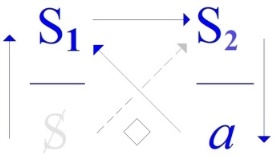
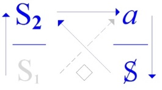
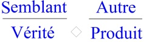
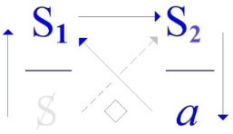
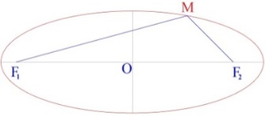

# Leçon 09 | 09 Avril 1970

<!-- source-url: http://staferla.free.fr/S17/S17 L'ENVERS.docx -->
<!-- seminar: s17 -->
<!-- lesson: 09 -->

<!-- id: s17-09-0001 -->

Je ne sais pas ce que vous avez fait pendant ce temps qui nous a séparés, j’espère en tous cas que vous en avez profité d’une façon quelconque.

<!-- id: s17-09-0002 -->

Pour moi, j’ai fait la trouvaille...

<!-- id: s17-09-0003 -->

je le signale à la personne qui a si gentiment voulu se signaler à moi d’être une *astudée* de Sorbonne, je lui signale que j’ai trouvé, ...j’ai fait venir de Copenhague le Sellin dont je vous ai parlé : *s.e.l.l.i.n*, c’est à savoir ce petit livre de 1922, qui aussi bien par après a porté de la plume de Sellin quelques rejets, et qui est ce livre autour de quoi Freud fait tourner son assurance que Moïse a été « tudé ».

<!-- id: s17-09-0004 -->

Bien sûr, l’intérêt de l’avoir...

<!-- id: s17-09-0005 -->

Je ne sache pas que...

<!-- id: s17-09-0006 -->

à part Jones et peut-être un ou deux autres ...beaucoup de psychanalystes s’y soient inté­ressés. Il est clair [que ce](file:///C:\Users\ALAIN\LACAN%20séminaires\que.ee) Sellin dans son texte mérite d’être examiné, examiné en ceci que Freud a considéré qu’il faisait le poids, si je puis dire.

<!-- id: s17-09-0007 -->

C’est bien là-dessus naturellement qu’il convient de me suivre pour mettre à l’épreuve cette considération.

<!-- id: s17-09-0008 -->

Ceci me semble dans la ligne de ce que j’avance cette année de *l’envers de la psychanalyse*, mais comme il n’y a qu’environ cinq jours que j’ai ce livre, écrit dans un allemand fort corsé, beaucoup moins aéré que ce à quoi nous habituent les textes de Freud, vous concevrez que, malgré l’aide qu’ont bien voulu me donner pour ça un certain nombre de rabbins, grands et petits...

<!-- id: s17-09-0009 -->

enfin bon, il n’y a pas de petits rabbins, il y a des juifs ...eh bien je ne sois pas prêt encore aujourd’hui à vous en faire un compte-rendu, au moins qui me satisfasse.

<!-- id: s17-09-0010 -->

D’autre part, il se trouve que j’ai été sollicité…

<!-- id: s17-09-0011 -->

> ça, je dois dire que ce n’est pas la première fois, c’est extensible cette sollicitation ...de répondre à la radio - Belge pour la nommer - et ce par un homme qui, à vrai dire, s’est attiré mon estime,

<!-- id: s17-09-0012 -->

M. Georgin pour le nommer, s’est attiré mon estime de m’avoir remis un long texte, qui au moins donne cette preuve que lui, contrairement à bien d’autres, il a lu mes *Écrits* !

<!-- id: s17-09-0013 -->

Il en a - mon Dieu - tiré ce qu’il a pu \[*Rires*\], mais ce n’est pas rien à tout prendre, et véritablement, en fait j’en ai été plutôt flatté ! Ça n’est pas certes, pour me donner plus de penchant à cet exercice qui consiste à se faire enregistrer à la radio.

<!-- id: s17-09-0014 -->

Ça perd toujours beaucoup de temps.

<!-- id: s17-09-0015 -->

Néanmoins, comme il semble qu’il ait aménagé les choses pour que ça se passe de la façon la plus courte, j’y céderai peut-être.

<!-- id: s17-09-0016 -->

Celui qui ne va peut-être pas y céder, par contre, c’est lui, étant donné que pour répondre à ses questions, dont je vais vous donner trois exemples, je n’ai cru pouvoir mieux faire que non pas de me livrer à l’inspiration du moment, à *ce frayage* que je fais ici chaque fois que je suis en face de vous en somme, mais nourri d’abondantes notes, et qui passe - mon Dieu - parce que vous me voyez en proie à *ce frayage*.

<!-- id: s17-09-0017 -->

C’est même peut-être la seule chose qui justifie votre présence ici.

<!-- id: s17-09-0018 -->

C’est un oiseau ? \[*Rires,* à propos d’un sifflotement que l’on entend à l’extérieur\]

<!-- id: s17-09-0019 -->

Les conditions quand même sont évidemment différentes quand vous parlez pour *quelques dizaines de mille -* qui sait, voire centaines - *d’auditeurs* et auprès desquels *le texte*, abrupt de se présenter sans le support de la personne, peut causer d’autres effets.

<!-- id: s17-09-0020 -->

Néanmoins je me refuserai en tout cas à donner autre chose que ces textes déjà écrits.

<!-- id: s17-09-0021 -->

C’est faire donc à cette condition grande confiance car, vous le verrez, les questions qui me sont posées sont forcément de l’intervalle

<!-- id: s17-09-0022 -->

- de ce qu’il se produit une articulation construite,

<!-- id: s17-09-0023 -->

- et ce qu’en attend ce que j’appellerai « *une conscience commune »*, et une *conscience commune* ça veut dire aussi une série de formules communes, ce langage que déjà les Anciens, enfin les Grecs, avaient appelé dans leur langue : la κοινή \[koïné\].

<!-- id: s17-09-0024 -->

Oui, je vais pas dire ça tout de suite en français, le transcrire directement : « *la couinée* », ça couine !

<!-- id: s17-09-0025 -->

Je ne méprise pas du tout *la couinée*, simplement je crois qu’elle n’est pas défavorable à ce qu’on y produise quelques effets de précipitation, à y introduire justement *le discours le plus abrupt qu’il soit*. Voilà.

<!-- id: s17-09-0026 -->

C’est pourquoi aujourd’hui c’est pas seulement pour me suppléer dans l’effort...

<!-- id: s17-09-0027 -->

ça me sera, croyez-le, un effort beaucoup plus grand de vous lire ces textes que de procéder comme je fais d’habitude ...je vais vous faire part de mes réponses à trois de ces questions.

<!-- id: s17-09-0028 -->

C’est pour ne pas tarder que je vais vous articuler la première qui est celle-ci : « *Dans les Écrits - dit-on - vous affirmez que Freud anticipe, sans s’en rendre compte,* *les recherches de Saussure et celles du Cercle de Prague. Pouvez-vous vous expliquer sur ce point ?* »

<!-- id: s17-09-0029 -->

C’est ce que je fais donc, non pas « *à l’improvisade »*, comme je vous en ai prévenu, en répondant que : « *Votre question me surprend -* dis-je *- d’emporter une pertinence qui tranche sur les prétentions à l’entretien que j’ai à écarter,* *c’est même une pertinence redoublée, à deux degrés plutôt.*

<!-- id: s17-09-0030 -->

*Vous me prouvez avoir lu mes Écrits, ce qu’ap­paremment on ne tient pas pour nécessaire à obtenir de m’entendre.*

<!-- id: s17-09-0031 -->

*Vous y choisissez une remarque qui implique l’existence d’un autre mode d’information que la médiation de masses.*

<!-- id: s17-09-0032 -->

*Que* F*reud* *anticipe* S*aussure* *n’implique pas qu’un bruit soit passé du premier au second.*

<!-- id: s17-09-0033 -->

*De sorte qu’à me citer, vous me faites répondre avant que j’en décide, c’est ce que j’appelle* *me surprendre* ».

<!-- id: s17-09-0034 -->

*Partons du terme d’arrivée :* *Saussure et le Cercle de Prague produisent une linguistique qui n’a rien de commun avec ce qui avant s’est couvert de ce nom,* *retrouvât-elle ses clés entre les mains des Stoïciens, mais qu’en fai­saient-ils !*

<!-- id: s17-09-0035 -->

*La linguistique, avec Saussure et le Cercle de Prague, s’institue d’une coupure, qui est la barre posée entre le signifiant et le signifié,* *pour qu’y prévale la différence dont le signifiant se constitue absolument, mais aussi bien s’ordonne d’une autonomie* *qui n’a rien à envier aux effets de cristal, dans le système du phonème par exemple, qui en est le premier succès de décou­verte.*

<!-- id: s17-09-0036 -->

*On pense étendre ce succès à tout le réseau du symbolique en n’admettant de sens qu’à ce que le réseau en réponde,*

<!-- id: s17-09-0037 -->

- *et de l’incidence d’un effet : oui,*

<!-- id: s17-09-0038 -->

- *d’un contenu : non.*

<!-- id: s17-09-0039 -->

*C’est la gageure qui se soutient de la coupure inaugurale.*

<!-- id: s17-09-0040 -->

*Le signifié sera ou ne sera pas, scientifiquement pensable, selon que tiendra ou non, un champ de signifiant,* *qui, de son matériel même, se distingue d’aucun champ physique par la science obtenu.*

<!-- id: s17-09-0041 -->

*Ceci implique une exclusion métaphysique à prendre comme fait de désêtre.*

<!-- id: s17-09-0042 -->

*Aucune signification ne sera désormais tenue pour aller de soi, qu’il fasse clair quand il fait jour par exemple, où les Stoïciens nous ont devancés,* *mais j’ai déjà interrogé : à quelle fin ?*

<!-- id: s17-09-0043 -->

*Dussé-je aller à négliger certaines reprises de mot, je dirai « sémiotique » toute discipline qui part du signe pris pour objet,* *et pour marquer que c’est là ce qui faisait obstacle à la saisie comme telle du signifiant.*

<!-- id: s17-09-0044 -->

*Le signe suppose le quelqu’un à qui il fait signe de quelque chose.*

<!-- id: s17-09-0045 -->

*C’est le « quelqu’un » dont l’ombre a occulté l’entrée dans la linguistique.*

<!-- id: s17-09-0046 -->

*Appelez ce « quelqu’un » comme vous voudrez ce sera toujours une sottise.*

<!-- id: s17-09-0047 -->

*Le signe suffit à ce que ce quelqu’un se fasse du langage, appropriation comme d’un simple outil.*

<!-- id: s17-09-0048 -->

*De l’abstraction, le langage n’est plus que support, comme de la discussion : moyen, avec tous les progrès de la critique, que dis-je, de la pensée à la clé.*

<!-- id: s17-09-0049 -->

*Il me faudrait anticiper -* reprenant le mot de moi à moi *- sur ce que je compte introduire sous la graphie de l’« achose » :* *L apostrophe, a, c, h, o, etc., pour faire sentir en quel effet prend position la linguistique : ce n’est pas un progrès, une régression plutôt.*

<!-- id: s17-09-0050 -->

*C’est ce dont nous avons besoin contre l’unité d’obscurantisme, qui déjà se soude aux fins de prévenir l’« achose ».*

<!-- id: s17-09-0051 -->

*Personne ne semble reconnaître autour de quoi l’unité se fait, et qu’au temps du « quelqu’un » qui y recueillait la « signature des choses* [^40] *» :* *« signatura rerum », on ne présumait pas assez de la bêtise cultivée pour oser inscrire le langage au registre de « la communication ».*

<!-- id: s17-09-0052 -->

*Le retour à « la communication » protège - si j’ose dire - les arrières de ce que périme la linguistique, en y couvrant le ridicule* *qui souvent ne se décèle que de l’a posteriori, c’est à savoir ce qui dans l’occultation du langage, ne faisait figure que de mythe à s’appeler « télépathie ».*

<!-- id: s17-09-0053 -->

*Enfant perdu, mendigot de la pensée, que ce qui se targuait de la transmission sans discours,* *il arrive pourtant - ce mythe - à captiver Freud qui n’y démasque pas le roi de cette cour des miracles dont il annonce le nettoyage.*

<!-- id: s17-09-0054 -->

*Miracles, c’est bien le cas de le dire, quand tous remonte à celui, premier à s’opérer de ce que l’on « télépatisse » du même bois dont on pactise.*

<!-- id: s17-09-0055 -->

*Contrat social, en somme, effusion communicative des promesses du dialogue.*

<!-- id: s17-09-0056 -->

*Quoi ? « Tout homme -* qui ne sait ce que c’est ? *- est mortel » *: *ah, sympathisons d’être mis dans la même boîte !*

<!-- id: s17-09-0057 -->

*Parlons de « tout » - c’est le cas de le dire ! - de « tout » ensemble, sauf de ce qui habite la tête du syllogiste à mettre Socrate dans le coup,* *car de là il ressort que sans doute la mort est administrée - comme le reste - et par et pour les hommes,* *mais sans qu’ils soient du même coté, pour ce qui est de la télépathie que véhicule une télégraphie,* *dont le sujet ne cesse pas d’embarrasser chaque fois qu’on vient à ce carrefour.*

<!-- id: s17-09-0058 -->

*Que ce sujet soit peu communicable, doit bien déterminer de ce dont la linguistique prend force.*

<!-- id: s17-09-0059 -->

*Et jusqu’à mettre le poète - oui le poète ! - dans son sac.*

<!-- id: s17-09-0060 -->

*Car le poète se produit d’être...*

<!-- id: s17-09-0061 -->

*qu’on me permette de traduire celui qui le démontre, mon ami Jakobson...mangé des vers, qui trouvent entre eux leur arrangement, sans se soucier - c’est manifeste - de ce que le poète en a su.*

<!-- id: s17-09-0062 -->

*D’où la constance, chez Platon, de l’ostracisme dont il frappe le poète en sa « République »,* *et de la vive curiosité qu’il montre dans le « Cratyle » pour ces petites bêtes qui paraissent être les mots, à n’en faire qu’à leur tête.*

<!-- id: s17-09-0063 -->

*On voit combien le formalisme était précieux à soutenir les premiers pas de la linguistique.*

<!-- id: s17-09-0064 -->

*Mais c’est tout de même de trébuchements dans les pas du langage, dans ce qu’on appelle « la parole », qu’elle a pris son élan.*

<!-- id: s17-09-0065 -->

*Que le sujet ne soit pas ce qui sache ce qu’il dit, quand bel et bien se dit quelque chose par la bouche où on le loge, certes,* *mais aussi bien dans les balourdises d’une conduite qu’on met à son compte, dans la cervelle dont il ne s’aide qu’à ce qu’elle dorme,* *cet organe s’avérant ne tenir sa portée subjective que de ce qu’il règle le sommeil, voilà ce que Freud dévoile comme l’inconscient.*

<!-- id: s17-09-0066 -->

*Car mon passage en ce monde, au nom de Lacan, aura consisté à articuler que c’est ça et que ce n’est rien d’autre.*

<!-- id: s17-09-0067 -->

*N’importe-qui peut s’en assurer maintenant, rien qu’à me lire.*

<!-- id: s17-09-0068 -->

*N’importe-qui, donc, qui opère selon ces règles, à psychanalyser doit s’y tenir, sauf à le payer de choir dans la bêtise.*

<!-- id: s17-09-0069 -->

*Dès lors, à énoncer que Freud anticipe la linguistique, je ne dis moi que ce qui s’impose, et qui est la formule que je libère maintenant :* *« l’inconscient est la condition de la linguistique ».*

<!-- id: s17-09-0070 -->

*Sans l’éruption de l’inconscient, pas moyen que la linguistique sorte du jour douteux* *dont l’Université, au nom des sciences humaines, fait encore éclipse à la science.*

<!-- id: s17-09-0071 -->

*Couronnée à Kiev par les soins de [Baudouin de Courtenay](http://fr.wikipedia.org/wiki/Jan_Niecis%C5%82aw_Baudouin_de_Courtenay), elle y fût sans doute restée.*

<!-- id: s17-09-0072 -->

*Mais l’Université n’a pas dit son dernier mot, elle va de ça, faire sujet de thèse...*

<!-- id: s17-09-0073 -->

*« Influence sur le génie de Raymond de Saussure* \[*lapsus* : *Ferdinand de Saussure*\] *du génie de Freud »,...démontrer d’où vient au premier, le vent du second, avant qu’existât la radio !*

<!-- id: s17-09-0074 -->

*C’est faire comme si elle ne s’en était pas passée de toujours pour assourdir autant.*

<!-- id: s17-09-0075 -->

*Et pourquoi Saussure se serait-il rendu compte - pour emprunter les termes de votre citation,* dis-je à M. Georgin *- mieux que Freud lui-même,* *de ce que Freud anticipait, notamment la métaphore et la métonymie lacaniennes, lieux où Saussure « genuit »* \[*« engendre »*\] *Jakobson ?*

<!-- id: s17-09-0076 -->

*Si Saussure ne sort pas des  « Anagrammes... »* [^41] *qu’il déchiffre dans la poésie sa­turnienne, c’est qu’il en sait la portée vraie.*

<!-- id: s17-09-0077 -->

*La canaillerie ne le rend pas bête*... *c’est parce qu’il n’est pas analyste.*

<!-- id: s17-09-0078 -->

*Dans cette position, par contre, les mauvais procédés dont s’habille l’infatuation universitaire ne vous ratent pas leur homme,* *il y a là comme un espoir, et le jettent droit dans une bourde comme de dire que « l’inconscient est la condition du langage »,* *quand il s’agit de se faire « auteur » aux dépens de ce que j’ai dit, voire seriné aux intéressés,* *à savoir que « le langage est la condition de l’inconscient ».*

<!-- id: s17-09-0079 -->

*Je ris encore du procédé devenu là stéréotype, au point que deux autres...*

<!-- id: s17-09-0080 -->

*mais pour l’usage interne d’une Société que sa bâtardise universitaire a tuée...ont osé définir le passage à l’acte et l’acting-out très exactement des termes que je leur avais proposés pour les opposer l’un à l’autre,* *mais simplement à inverser ce que j’attribuais à chacun, façon - pensaient-ils - de s’approprier ce que personne n’avais su en articuler avant.*

<!-- id: s17-09-0081 -->

*Si je défaillais maintenant, je ne laisserais d’œuvre que ces rebuts choisis de mon enseignement dont j’ai fait butée à « l’information »,* *dont c’est tout dire qu’elle le diffuse.*

<!-- id: s17-09-0082 -->

*Ce que j’ai énoncé, dans un discours confidentiel, n’en a pas moins déplacé l’audition commune,* *au point de m’amener un auditoire qui m’en témoigne d’être stable en son énormité.*

<!-- id: s17-09-0083 -->

*Je me souviens de la gêne dont m’inter­rogeait un garçon qui avait assisté à la production de ma « Dialectique du désir et subversion du sujet »* *devant un public fait de gens du « Parti », le seul, parmi lesquels il s’était égaré comme marxiste.*

<!-- id: s17-09-0084 -->

*J’ai gentiment - gentil, gentil comme je suis toujours - pointé, à la suite de ce rebut, dans mes Écrits, l’ahurissement qui y fit réponse :* *« Croyez-vous donc* - me disait-il *- qu’il suffise que vous ayez dit quelque chose,* *inscrit des lettres au tableau noir pour en attendre un résultat ? »*

<!-- id: s17-09-0085 -->

*Un tel exercice a porté pourtant, j’en ai eu la preuve au titre seul d’un rebut qui lui fit un droit pour mon livre,* *les fonds de la « Fondation Ford » qui motivait cette réunion d’avoir à les éponger s’étant impensablement asséchés du même coup.*

<!-- id: s17-09-0086 -->

*L’effet, qui se propage n’est pas de « communication » de la parole - c’est à votre adresse ceci - mais de déplacement du discours.*

<!-- id: s17-09-0087 -->

*Freud incompris, fût-ce de lui-même, d’avoir voulu se faire entendre, est moins servi par ses disciples que par cette propagation.*

<!-- id: s17-09-0088 -->

*Celle sans quoi les convulsions de l’histoire res­tent énigme,* *comme les mois de mai dont se déroutent ceux qui s’emploient à les prendre serfs d’un « sens » dont la dialectique se présente comme dérision. »*

<!-- id: s17-09-0089 -->

Voilà !

<!-- id: s17-09-0090 -->

Si vous n’êtes pas fatigués, je vais vous énoncer ce que j’ai répondu à la 2ème question qui se formule ainsi, \- vous verrez qu’elle est importante - « *La linguistique, la psychologie et l’ethnologie ont en commun la notion de structure. À partir de cette notion* - m’interroge M. Georgin - *ne peut-on imaginer l’énoncé d’un champ commun qui réunira un jour psychanalyse, ethno­logie et linguistique ?* »

<!-- id: s17-09-0091 -->

Je réponds, et je pense que *cette réponse* a plus d’importance que la 1ère, *impressionniste,* à laquelle je me suis livré. Je réponds ceci : *« Structure » est le mot dont s’indique l’entrée en jeu de l’effet du langage,* *à partir de ceci, que c’est « pétition de principe » que d’en faire une fonction individuelle ou collective,* *soit qui serait l’appui d’un supposé dans l’exis­tence qui...*

<!-- id: s17-09-0092 -->

*quel qu’il soit, « moi » ou organisme adapté de connaissance...implique le « quelqu’un » dont je parlais tout à l’heure.*

<!-- id: s17-09-0093 -->

*Fonction par où, donc, quelqu’un se représente, si l’on peut dire, les relations qui font le **réel**, ce dernier terme étant posé d’une catégorie lacanienne.*

<!-- id: s17-09-0094 -->

*C’est au contraire de la présence déjà dans la réalité...*

<!-- id: s17-09-0095 -->

*laquelle n’est pas « catégorique », mais « donné »* ...*de la présence,*

<!-- id: s17-09-0096 -->

- *non des relations au premier plan,*

<!-- id: s17-09-0097 -->

- *mais des formules de la relation, qui prennent corps dans le langage,* *que nous partons pour en suivre l’effet, qui est proprement la structure.*

<!-- id: s17-09-0098 -->

*C’est ainsi qu’un discours peut dominer la réalité sans supposer consensus de quiconque,* *car c’est lui qui détermine la différence, à faire barrière entre « sujet des énoncés » et « sujet de l’énonciation ».*

<!-- id: s17-09-0099 -->

*Rien de plus exempt d’idéalisme, nul besoin - d’autre part - de parquer les structuralistes,* *à moins de vouloir leur faire endosser l’héritage du pourrissement couvert - je ne dis pas causé - par l’existentialisme.*

<!-- id: s17-09-0100 -->

*N’importe qui a à se repérer de la structure, en tout cas s’en trouvera bien.*

<!-- id: s17-09-0101 -->

*Pressentez ici ma réponse à la réunion*...

<!-- id: s17-09-0102 -->

> *vous vous rappelez : « psychanalyse, ethnologie et je ne sais pas quoi*... *la linguistique »* ...*à la réunion que vous me proposez.*

<!-- id: s17-09-0103 -->

*Nota : le particulier de la langue est ce par quoi la structure tombe sous « l’effet de cristal » dit plus haut.*

<!-- id: s17-09-0104 -->

*Le qualifier, ce particulier, d’« arbitraire » est lapsus que Saussure a commis de ce qu’à contrecœur certes,* *mais par là d’autant plus offert au trébuchement, il l’a pris à partir de ce discours universitaire,* *dont je montre que le recel c’est justement ce signifiant* \[**S1**\] *qui domine le discours du Maître, le si­gnifiant de l’arbitraire.*

<!-- id: s17-09-0105 -->

 

<!-- id: s17-09-0106 -->

*Discours du Maître Discours Universitaire*

<!-- id: s17-09-0107 -->

*On voit que parler de « corps » n’est pas - quand il s’agit de « symbolique » - une métaphore,* *car ledit corps se trouve, pour le corps pris au sens naïf, une déterminante.*

<!-- id: s17-09-0108 -->

*Le premier* \[*corps*\] *fait le second* \[*le « symbolique » comme « corps »*\] *de s’y incorporer.*

<!-- id: s17-09-0109 -->

*D’où l’incorporel qui reste marquer le premier du temps d’après son incorpora­tion.*

<!-- id: s17-09-0110 -->

*Rendons justice aux Stoïciens d’avoir su de ce terme : l’Incorporel, signer en quoi le symbolique tient au corps.*

<!-- id: s17-09-0111 -->

*Incorporels sont ce que je vais dire, à savoir : la fonction,*

<!-- id: s17-09-0112 -->

- *non pas celle du sujet,*

<!-- id: s17-09-0113 -->

- *mais celle qui fait réalité de la mathématique,*

<!-- id: s17-09-0114 -->

- *l’application de même effet à faire réalité de la topologie,*

<!-- id: s17-09-0115 -->

- *ou l’analyse en un sens large, pour la logique.*

<!-- id: s17-09-0116 -->

*Mais c’est incorporée que la struc­ture fait l’affect, ni plus ni moins,* *« affect » seulement à prendre de ce qui de l’être s’articule, n’y ayant qu’être de fait, soit d’être dit quelque part.*

<!-- id: s17-09-0117 -->

*Par quoi s’avère, que du corps il est second qu’il soit mort ou vif.*

<!-- id: s17-09-0118 -->

*Qui ne sait le point critique dont nous datons, dans l’homme, l’être parlant* : *la sépulture, soit où d’une espèce s’affirme, qu’au contraire d’aucune autre, le corps mort y garde ce qui au vivant donnait le caractère corps.*

<!-- id: s17-09-0119 -->

*« Corpse », reste, qui ne devient charogne, le corps qu’habitait la parole, que le langage « corpsifiait ».*

<!-- id: s17-09-0120 -->

*La zoologie peut partir de la prétention de l’individu à faire l’être du vivant,* *mais c’est pour qu’il en rabatte, à seulement qu’elle le poursuive au niveau du polypier.*

<!-- id: s17-09-0121 -->

*Le corps - à le prendre au sérieux - est d’abord ce qui peut porter la marque propre à le ranger dans une suite de signifiants.*

<!-- id: s17-09-0122 -->

*Dès cette marque il est support de la relation, non éventuelle mais nécessaire, car c’est encore la supporter que de s’y soustraire.*

<!-- id: s17-09-0123 -->

*D’avant toute date, « moins-Un » désigne le lieu dit de l’Autre (avec le sigle du grand A) par Lacan.*

<!-- id: s17-09-0124 -->

*De « l’Un-en-Moins », le lit est fait à l’intrusion qui avance de l’extrusion, c’est le signifiant même.*

<!-- id: s17-09-0125 -->

*Ainsi ne va pas toute chair.*

<!-- id: s17-09-0126 -->

*Des seules qu’empreint le signe à les négativer, montent - de ce que corps s’en séparent - les nuées,* *eaux supérieures de leur jouissance, lourdes de foudre à redistri­buer corps et chair.*

<!-- id: s17-09-0127 -->

*Répartition peut-être moins comptable,* *mais dont on ne semble pas remarquer que la sépulture antique y figure cet « ensemble » même, dont s’articule notre plus moderne logique.*

<!-- id: s17-09-0128 -->

*L’ensemble vide des ossements est l’élément irréductible dont s’ordonnent - autres éléments - les instruments de la jouissance, colliers, gobelets, armes : plus de sous-éléments à énumérer la jouissance, qu’à la faire rentrer dans le corps.*

<!-- id: s17-09-0129 -->

*Ai-je animé la structure ?*

<!-- id: s17-09-0130 -->

*Assez, je pense, pour - des domaines qu’elle unirait à la psychanalyse - annoncer que rien n’y destine les deux que vous dites, spécialement.*

<!-- id: s17-09-0131 -->

*La linguistique peut définir le matériel de la psychanalyse, voire l’appa­reil de son opération.*

<!-- id: s17-09-0132 -->

*Elle laisse en blanc d’où se produit ce qui la rend effective,* *soit ce dont, à l’articuler comme l’acte psychanalytique, je pensais éclairer plus d’un autre acte.*

<!-- id: s17-09-0133 -->

*Un domaine ne se domine que d’un opérateur.*

<!-- id: s17-09-0134 -->

*L’inconscient peut être, comme je le disais, la condition de la linguistique, ceci ne donne à la linguistique pas la moindre prise sur lui.*

<!-- id: s17-09-0135 -->

*J’ai pu l’éprouver de la contribution que j’avais demandée au plus grand des linguistes français pour en illustrer le départ d’une revue de ma façon,* *que de ce fait j’eusse voulu plus spécifiée dans son titre, « La Psychanalyse » qu’elle s’appelait, pour le rappeler à ceux qui en ont fait bon marché.*

<!-- id: s17-09-0136 -->

*De cette demande au linguiste, j’avais espéré un pas dans le problème des mots antithétiques, dont on pense bien que je ne m’étonne pas que Freud* *l’ait introduit. Si le linguiste ne peut faire mieux - comme il parut - que de formuler que le bon aise du signifié exige un choix dans l’antithèse,* *ceci doit donner aux gens qui, de parler l’Arabe, ont beaucoup à faire avec de tels mots, autant de mal qu’à répondre à une montée de fourmilière.*

<!-- id: s17-09-0137 -->

*Il n’y a pas moindre barrière du coté de l’ethnologie.*

<!-- id: s17-09-0138 -->

*Un enquêteur qui laisserait son informatrice indigène, lui conter fleurette de ses rêves,* *se fera rappeler à l’ordre s’il les met au compte de ce qu’on appelle le terrain.*

<!-- id: s17-09-0139 -->

*Et le censeur - ce faisant - comme ils l’appellent, ne me paraîtra pas - fût-il Lévi-Strauss lui-même - marquer mépris de mes plates-bandes.*

<!-- id: s17-09-0140 -->

*Où irait le terrain s’il se détrempait d’inconscient ?*

<!-- id: s17-09-0141 -->

*Ça lui ferait - quoi qu’on en rêve - nul effet de forage, mais flaque de notre cru.*

<!-- id: s17-09-0142 -->

*Car une enquête qui se limite - c’est sa définition - au recueil d’un savoir, c’est d’un savoir de notre tonneau que nous la nourririons.*

<!-- id: s17-09-0143 -->

*D’une psychanalyse elle-même, qu’on n’attende pas de recenser les mythes qui ont conditionné un sujet de ce qu’il ait grandi au Togo ou au Paraguay.*

<!-- id: s17-09-0144 -->

*Car la psychanalyse - cela je vous l’ai déjà fait remarquer ici - s’opère du discours qui la conditionne,* *et que je définis cette année, à la prendre par son envers.*

<!-- id: s17-09-0145 -->

*On obtiendra - ce, de cela même - pas d’autre mythe que ce qui en reste en notre discours* : *l’Œdipe freudien.*

<!-- id: s17-09-0146 -->

*Du matériel dont se fait l’analyse du mythe, écoutons Lévi-Strauss énoncer qu’il est intraduisible, ceci à bien l’enten­dre, car ce qu’il dit littéralement, c’est que peu importe en quelle langue ils sont recueillis : ils seront toujours d’eux-mêmes analysables de se théoriser des « grosses unités »...*

<!-- id: s17-09-0147 -->

*c’est le terme de Lévi-Strauss...dont une mythologisation définitive les articulera.*

<!-- id: s17-09-0148 -->

*On saisit là le mirage d’un « niveau commun » avec ce que j’appellerais « l’universalité du discours psychanalytique », mais...*

<!-- id: s17-09-0149 -->

*et du fait de qui le démontre, Lévi-Strauss en l’occasion...sans que l’illusion s’en pro­duise, car ce n’est pas d’un jeu de mythèmes qu’opère la psychanalyse.*

<!-- id: s17-09-0150 -->

*Qu’elle ne puisse se passer que dans une langue particulière, qu’on appelle une langue positive...*

<!-- id: s17-09-0151 -->

> *fût-ce même à jouer en cours d’analyse de la traduction...y fait garantie « qu’il n’y a pas de métalangage », selon ma formule.*

<!-- id: s17-09-0152 -->

*L’effet de langage ne s’y produit que du cristal linguistique.*

<!-- id: s17-09-0153 -->

*Son universalité n’est que la topologie retrouvée, de ce qu’un discours s’y déplace, ce discours spécifié de ce que la mythologie s’y réduise à l’extrême.*

<!-- id: s17-09-0154 -->

*Ajouterai-je que le mythe, dans l’articulation de Lévi-Strauss ...*

<!-- id: s17-09-0155 -->

*soit la seule forme ethnologique à motiver votre question - dis-je à Georgin - la réunion...que le mythe donc, dans cette seule articulation, refuse tout ce que j’ai promu de « L’instance de la lettre dans l’inconscient ».*

<!-- id: s17-09-0156 -->

*Il n’opère, le mythe, ni de métaphore, ni même d’aucune métonymie *:

<!-- id: s17-09-0157 -->

- *il ne condense pas : il explique,*

<!-- id: s17-09-0158 -->

- *il ne déplace pas : il loge, même à changer l’ordre des tentes.*

<!-- id: s17-09-0159 -->

*Il ne joue qu’à combiner ses unités lourdes, où le complément à assurer la présence du couple, démontre le poids d’un savoir.*

<!-- id: s17-09-0160 -->

*Ce savoir est justement ce que ruine l’apparition de sa structure.*

<!-- id: s17-09-0161 -->

*Ainsi dans la psychanalyse - parce qu’aussi bien dans l’inconscient - l’homme, de la femme ne sait rien, ni la femme de l’homme.*

<!-- id: s17-09-0162 -->

*Au phallus se résume le point de mythe dont le sexuel est impliqué dans la passion du signifiant.*

<!-- id: s17-09-0163 -->

*Que ce point paraisse ailleurs se multiplier, voilà ce qui fascine spécialement l’universitaire dans le discours duquel ce point fait défaut.*

<!-- id: s17-09-0164 -->

*D’où procède le recrutement des novices de l’ethnologie.*

<!-- id: s17-09-0165 -->

*Où se marque un effet d’humour - noir bien sûr - à se peindre de faveurs de secteur.*

<!-- id: s17-09-0166 -->

*Ah ! Faute d’une université qui serait ethnie, allons d’une ethnie faire une université.*

<!-- id: s17-09-0167 -->

*D’où la gageure de cette pêche qui définit le terrain comme le lieu où faire « écrit » d’un savoir dont l’essence est de ne pas se transmettre par écrit. Désespérant de voir jamais la dernière classe, recréons la première, l’écho de savoir qu’il y a dans la classification.*

<!-- id: s17-09-0168 -->

*« Le professeur ne revient qu’à l’aube… » dirai-je en contrepoint de Hegel.*

<!-- id: s17-09-0169 -->

*Vous savez... l’histoire de la chouette et du crépuscule* [^42]*...*

<!-- id: s17-09-0170 -->

*Je garderai même distance, à dire la mienne, à la structure : au nom de ce que votre question met en jeu de la psychanalyse.*

<!-- id: s17-09-0171 -->

*D’abord que, sous prétexte que j’ai défini le signifiant comme ne l’a osé personne, on ne s’imagine pas que « le signe » ne soit pas mon affaire !*

<!-- id: s17-09-0172 -->

*Bien au contraire c’est la première, ce sera aussi la dernière. Mais il y fallait ce détour.*

<!-- id: s17-09-0173 -->

*Ce que j’ai dénoncé d’une sémiotique implicite, dont seul le désarroi aurait permis la linguistique,* *n’empêche pas qu’il faille la refaire, et de ce même nom, puisqu’en fait c’est de celle à faire qu’à l’ancienne nous le reportons.*

<!-- id: s17-09-0174 -->

*Si « le signifiant représente un sujet... » -* dit Lacan, <u>pas un signifié</u> *- et « pour un autre signifiant... » -* insistons : <u>pas pour un autre sujet</u> - *alors comment peut-il tomber au signe qui de mémoire de logicien, représente quelque chose pour quelqu’un ?*

<!-- id: s17-09-0175 -->

*C’est au bouddhiste que je pense, à vouloir animer ma question cruciale, celle que je viens de poser, la chute du signifiant au signe,* *je l’animerai du : « pas de fumée sans feu ».*

<!-- id: s17-09-0176 -->

*Psychanalyste, c’est du signe que je suis averti. S’il me signale le quelque chose que j’ai à traiter, je sais...*

<!-- id: s17-09-0177 -->

> *d’avoir - à la logique du signifiant - trouvé à rompre le leurre du signe,...que ce quelque chose est la division du sujet,* *laquelle division tient à ce que l’Autre soit ce qui fait le signifiant, par quoi il ne saurait représenter un sujet qu’à n’être « Un » que de l’Autre.*

<!-- id: s17-09-0178 -->

*Cette division répercute les avatars de l’assaut qui - telle quelle, cette division - l’a affrontée au savoir du sexuel, traumatiquement,* *de ce que cet assaut soit à l’avance condamné à l’échec, pour la raison que j’ai dite *: *que le signifiant n’est pas propre à donner corps à une formule qui soit du rapport sexuel.*

<!-- id: s17-09-0179 -->

*D’où mon énonciation : « il n’y a pas de rapport sexuel », sous-entendu* : *formulable dans la structure.*

<!-- id: s17-09-0180 -->

*Ce quelque chose où le psychana­lyste, interprétant, fait intrusion de signifiant,*

<!-- id: s17-09-0181 -->

- *certes je m’exténue depuis vingt ans à ce qu’il ne le prenne pas pour une « chose », puisque c’est « faille », et de structure.*

<!-- id: s17-09-0182 -->

- *Mais qu’il veuille en faire « quelqu’un » est la même chose, puisque ça va à la personnalité « en personne totale », comme à l’occasion chante l’ordure.*

<!-- id: s17-09-0183 -->

*Le moindre souvenir de l’inconscient exige pourtant de maintenir à cette place le « quelque deux »,* *avec ce supplément de Freud *: *qu’il ne saurait satisfaire à aucune autre réunion que celle, logique, qui s’inscrit « ou l’Un, ou l’autre ».*

<!-- id: s17-09-0184 -->

*Qu’il en soit ainsi du « départ »* \[*départir, départage*\] *dont le signifiant vire au signe, où trouver maintenant le quelqu’un qu’il faut lui procurer d’urgence ?*

<!-- id: s17-09-0185 -->

*C’est le « hic »* \[*ici*\] *qui ne se fait « nunc »* \[*maintenant*\] *qu’à être psychanalyste, mais aussi lacanien.*

<!-- id: s17-09-0186 -->

*Chacun sait que bientôt tout le monde le sera, mon audience en fait prodrome* [^43]*, donc les psychanalystes aussi.*

<!-- id: s17-09-0187 -->

*Y suffirait la montée au zénith social de l’objet dit, par moi, « petit(a) »,* *par l’effet d’angoisse que provoque l’évidement* \[*du a*\] *dont le produit notre discours, de manquer à sa production* \[ Fig. 1*le disc. A ne « produit » que des* **S**1 \].

<!-- id: s17-09-0188 -->

  

<!-- id: s17-09-0189 -->

> *Fig.* 1 *Fig.* 2

<!-- id: s17-09-0190 -->

*Que ce soit d’une telle chute que le signifiant tombe au signe,* \[Fig 2 : **S**1 → **S2** → ↓*a* ...\] *l’évidence est faite chez nous, de ce que, quand on n’y sait plus à quel saint se vouer, autrement dit qu’il n’y a plus de signifiant à frire...*

<!-- id: s17-09-0191 -->

*c’est ce que le saint fournit, vous le savez...on y achète n’importe quoi, une bagnole notamment, à quoi faire signe d’intelligence, si l’on peut dire, de son ennui* \[*anagramme d’« unien »*\], *soit de l’affect du désir d’Autre chose, avec un grand A.*

<!-- id: s17-09-0192 -->

*Ça ne dit rien du « petit(a) » parce qu’il n’est déductible qu’à la mesure de la psychanalyse de chacun,* *ce qui explique que peu de psychanalystes le manient bien, même à le tenir de mon séminaire.*

<!-- id: s17-09-0193 -->

*Je parlerai donc en parabole, c’est-à-dire pour dérouter.*

<!-- id: s17-09-0194 -->

*À regarder de plus près le « pas de fumée... » si j’ose dire, peut-être franchira-t-on celui de s’apercevoir que c’est au feu que ce « pas » fait signe.*

<!-- id: s17-09-0195 -->

*De quoi il fait signe est conforme à notre structure puisque depuis Prométhée : *

<!-- id: s17-09-0196 -->

- *une fumée est plutôt le signe* \[*a*\],

<!-- id: s17-09-0197 -->

- *de ce sujet* \[**S**\],

<!-- id: s17-09-0198 -->

- *que représente une allumette, premier signifiant* \[**S1**\],

<!-- id: s17-09-0199 -->

- *pour sa boîte, le second* \[**S2**\], *et qu’à Ulysse abordant un rivage inconnu, une fumée au premier chef laisse présumer que ce n’est pas une île déserte.*

<!-- id: s17-09-0200 -->

*Notre fumée est donc le signe... pourquoi pas du fumeur ?*

<!-- id: s17-09-0201 -->

*Mais allons-y du « producteur de feu » : ce sera plus matérialiste et dialectique à souhait.*

<!-- id: s17-09-0202 -->

*Qu’Ulysse pourtant donne le « quelqu’un » est mis en doute à rappeler qu’aussi bien il n’est « personne »* \[οὔτις : outis\].

<!-- id: s17-09-0203 -->

*Il est en tout cas personne à ce que s’y trompe une fate polyphémie* [^44].

<!-- id: s17-09-0204 -->

*Mais l’évidence que ce ne soit pas pour faire signe à Ulysse que les fumeurs campent, nous suggère plus de rigueur au principe du signe.*

<!-- id: s17-09-0205 -->

*Car elle nous fait sentir, comme au passage, que ce qui pêche à voir le monde comme « phénomène »* \[*le signe* « *fait noumène* »\] , *c’est que le noumène, de ne pouvoir dès lors faire signe qu’au* νούς \[nouss\]*...* \[*le « noumène » nous mène au « nouss »*\]

<!-- id: s17-09-0206 -->

> *soit au « suprême quelqu’un », signe d’intelligence toujours,...démontre de quelle pau­vreté procède la vôtre, à supposer que tout fait signe* : *c’est « le quelqu’un de quelque part », « de nulle part », qui doit <u>tout</u> manigancer.*

<!-- id: s17-09-0207 -->

*Que ça nous aide à mettre le « pas de fumée sans feu » au même pas que le « pas de prière sans dieu », pour qu’on entende ce qui change.*

<!-- id: s17-09-0208 -->

*Il est curieux que les incendies de forêt ne montrent pas le quelqu’un auquel le sommeil imprudent du fumeur s’adresse.*

<!-- id: s17-09-0209 -->

*Et qu’il faille la joie phallique, l’urination primitive dont l’homme - dit la psychanalyse - répond au feu, pour mettre sur la voie de ce* *« qu’il y ait, Horatio, au ciel et sur la terre, d’autres matières à faire sujet que les objets qu’imagine votre connaissance... ».* \[*Hamlet*\]

<!-- id: s17-09-0210 -->

*Les produits par exemple à la qualité desquels - dans la perspective marxiste de la plus-value - les producteurs - plutôt qu’au Maître –* *pourraient demander compte de l’exploitation qu’ils su­bissent. Quand on reconnaitra la sorte de plus de jouir qui fait dire « ça, c’est quelqu’un ! »,* *on sera sur la voie d’une matière dialectique peut-être plus propice que la chair à Parti, bien connue à se faire le baby-sitter de l’histoire.*

<!-- id: s17-09-0211 -->

*Ce pourrait être le psychanalyste si sa passe était éclairée.*

<!-- id: s17-09-0212 -->

Voilà ce que je réponds à la deuxième question.

<!-- id: s17-09-0213 -->

Il y en a une troisième qui est celle-ci : «* L’une des articulations possibles entre psychanalyse et linguistique ne serait-elle pas le privilège accordé à la métaphore* *et à la métonymie, par Jakobson sur le plan linguistique, et par vous sur le plan psychanalytique ? *»

<!-- id: s17-09-0214 -->

Je ne vous lirai pas la réponse que j’ai faite à cette question parce qu’elle est d’autant plus impertinente qu’elle m’emmerde.

<!-- id: s17-09-0215 -->

Il y a eu assez de bafouillage sur le fait que j’ai emprunté ou non *la métaphore* et *la métonymie* à Jakobson.

<!-- id: s17-09-0216 -->

Quand je les ai sorties, je croyais quand même que parmi mes auditeurs, il y en avait quelques-uns qui savaient ce que c’était Jakobson !

<!-- id: s17-09-0217 -->

Ils ne l’ont découvert que dans les quinze jours parce que je l’ai dit au sortir de mon truc.

<!-- id: s17-09-0218 -->

Seulement, là on m’a dit : « *voilà bien Lacan, il ne cite pas Jakobson* ».

<!-- id: s17-09-0219 -->

Après quoi, ils ont lu Jakobson et ils se sont aperçus que j’avais d’autant moins de raisons de citer Jakobson que je disais quelque chose de tout à fait différent.

<!-- id: s17-09-0220 -->

Et là ils ont dit : « *Ah, mais il bouscule Jakobson, il le distord !* »

<!-- id: s17-09-0221 -->

Bon, enfin tout ça, c’est des anecdotes !

<!-- id: s17-09-0222 -->

Question IV : « *Vous dites que la découverte de l’inconscient aboutit à une seconde révolution copernicienne*.

<!-- id: s17-09-0223 -->

Ça - hein ? - ça vous chavire le cœur... \[*Rires*\]

<!-- id: s17-09-0224 -->

*En quoi l’inconscient est-il une notion-clé qui subvertit toute théorie de la connaissance ?* »

<!-- id: s17-09-0225 -->

Eh bien on y va, et puis après ça on se quittera.

<!-- id: s17-09-0226 -->

*Votre question va à chatouiller les espoirs, teintés de « fais-moi peur »* \[*Rires*\]*, qu’inspire le sens dévolu à notre époque au mot « révolution ».*

<!-- id: s17-09-0227 -->

*On pourrait noter son passage, à ce mot, à une fonction surmoïque dans la politique, à un rôle d’Idéal dans le palmarès de la pensée.*

<!-- id: s17-09-0228 -->

*Je note que ce n’est pas moi* \[*mais Freud*\] *qui joue ici de ces résonnances dont seule - je le dis - la coupure structurelle peut combattre l’amortissement,* *je parle des résonnances, je dis que la cou­pure structurelle, seule, peut donner plein sens au mot révolution.*

<!-- id: s17-09-0229 -->

*Pourquoi ne pas partir de l’ironie qu’il y a à mettre de la révolution au compte des révolutions célestes qui n’en donnent pas tout à fait la note ?*

<!-- id: s17-09-0230 -->

*Qu’y a-t-il de révolutionnaire dans le recentrement du soleil autour du monde solaire ?*

<!-- id: s17-09-0231 -->

*Après tout, à entendre ce que j’articule cette année d’un discours du Maître, on peut y trouver que celui-ci y clôt fort bien sa révolution,* *laquelle, par la boucle prise de la science, de l’*επιστήμε \[épistèmé\] *que je démontre être sa visée,* *revient à son départ d’un signifiant-maître absolu qui s’y figure du soleil.*

<!-- id: s17-09-0232 -->

<!-- id: s17-09-0233 -->

*Dans la conscience commune, l’idée que ça tourne autour, voilà l’héliocentrisme.*

<!-- id: s17-09-0234 -->

*Ce que j’adore, c’est que Gloria a fait tout à l’heure une faute de frappe, car elle a tapé ça ce matin, elle a écrit : l’hégocentrisme, h.é.g.o.,* *je trou­ve ça sublime ! Et il implique que ça tourne rond, sans qu’il y ait plus à y regarder.*

<!-- id: s17-09-0235 -->

*Mettrai-je au compte de Galilée, l’insolence politique du Roi-Soleil ?*

<!-- id: s17-09-0236 -->

*Les Anciens, par contre, ont trouvé l’usage en quelque sorte dialec­tique,* *à quoi prêtent les apparences qui résultent de la bascule de la terre sur l’écliptique.*

<!-- id: s17-09-0237 -->

*Les images de lumière et d’ombre sont là propices à un discours articulé.*

<!-- id: s17-09-0238 -->

*J’en mettrais en opposition, à l’héliocentrisme, un photo­centrisme comme beaucoup moins asservissant.*

<!-- id: s17-09-0239 -->

*La métaphore que Freud prend de Copernic...*

<!-- id: s17-09-0240 -->

*et à la connoter lui, si vous vous souvenez de son texte, plutôt d’un effet de chute que de subversion,...vise en fait à atteindre le centrisme lui-même, exactement la prétention reçue d’une psychologie qu’on peut d’autant mieux dire inentamée* *à son époque qu’elle l’est toujours à la nôtre : la prétention de la conscience à vouloir recenser ce dont elle dispose au registre de la représentation.*

<!-- id: s17-09-0241 -->

*Il est clair à le lire que cette figure d’englobement parfaitement insouciante dirions-nous, des exigences d’une topologie,* *pour simplement qu’elle l’ignore, est ce qui est visé dans la métaphore.*

<!-- id: s17-09-0242 -->

*C’est à approfondir celle-ci, qu’on rencontre sa pertinence, et c’est en cela que je la reprends.*

<!-- id: s17-09-0243 -->

*Car l’histoire, prise au texte où la révolution copernicienne, s’inscrit, démontre que ce n’est pas le changement de centre qui fait son nerf,* *au point qu’entre parenthèses, c’était pour Copernic lui-même le cadet de ses soucis.*

<!-- id: s17-09-0244 -->

*Ce autour de quoi tourne...*

<!-- id: s17-09-0245 -->

*mais justement c’est le mot à ne pas employer...autour de quoi gravite l’effet d’une connaissance en voie de se repérer comme imaginaire, c’est nettement...*

<!-- id: s17-09-0246 -->

*on le lit, à faire avec Koyré, de l’approche de Kepler, le journal...de se dépêtrer de l’idée que la forme circulaire, d’être la plus parfaite, peut seule convenir à l’affection du corps céleste.*

<!-- id: s17-09-0247 -->

*Introduire en effet la trajectoire elliptique, c’est faire qu’elle vise à rapprocher du foyer* \[**F1**\] *occupé par le corps-maître,* *mais aussi bien de l’autre* \[*foyer* **F2**\]*, vide autant qu’obscur, dont elle se ralentit.*

<!-- id: s17-09-0248 -->

 

<!-- id: s17-09-0249 -->

*Voilà où gît l’importance de Galilée, non pas dans cette ellipse, qui ne semble pas l’avoir tellement retenu,* *mais en tout cas ailleurs que dans l’échauffourée de son procès, dont j’ai indiqué tout à l’heure que l’enjeu est ambigu, sinon pas le parti à y prendre.*

<!-- id: s17-09-0250 -->

*Son importance est dans les premiers pas qu’il fait faire à la recherche sur « la chute des corps » dont va s’éclairer cette ellipse.*

<!-- id: s17-09-0251 -->

*Ce que je veux dire, c’est que s’il y a quelque chose dans l’histoire, à illustrer, de la façon la plus opaque d’ailleurs,* *la définition que j’ai donnée de la struc­ture, c’est la formule qu’enfin Newton met à la clé de cette chute des corps,* \[**F = m1. m2/d2**\] *en expliquant par elle définitivement le chemin des astres.*

<!-- id: s17-09-0252 -->

*Car c’est aussi la présence en tout point du réel, autrement dit en chaque élément de masse,* *de la formule prise en elle-même de l’attraction, soit une équation du second degré.*

<!-- id: s17-09-0253 -->

*Car c’est ça que nous avons réussi à étouffer, à ne plus y penser, à foutre en l’air la surprise et le scandale qu’attestent les contemporains de Newton,* *de ce que chaque point du monde soit averti à chaque instant des masses en jeu pour l’attirer aussi loin que ce monde s’étend.*

<!-- id: s17-09-0254 -->

*Faut-il ici rappeler que le champ de gravitation se distingue par sa faiblesse des autres champs, électromagnétique par exemple,* *mis en jeu par la physique, et qu’il résiste en outre à l’idéal, presque réalisé pourtant, de l’unification du champ.*

<!-- id: s17-09-0255 -->

*Quoi qu’il en soit du retour d’« esthétique transcendantale »...*

<!-- id: s17-09-0256 -->

*j’entends ces termes au sens de Kant...que constitue la rectification einsteinienne...*

<!-- id: s17-09-0257 -->

*dans son étoffe *: *courbure de l’espace,* *et dans sa justification *: *nécessité d’une transmission que la vitesse limitée de la lumière ne permet pas d’annuler...il reste que la révolution newtonienne s’est affirmée d’être impensable, c’est ce qu’admet Newton lui-même de l’« hypotheses non fingo »,* *et qu’elle confirme ma formule que « l’impossible, c’est le Réel »*

<!-- id: s17-09-0258 -->

*Inutile de souligner que dans le LEM alunissant, c’est de la même formule, cette fois réalisée en appareil, qu’il s’agit.*

<!-- id: s17-09-0259 -->

*D’où je souligne l’acosmisme de la réalité présente.*

<!-- id: s17-09-0260 -->

*Tout cela, nulle­ment pour dire que Newton soit à mettre au chef du structuralisme, ni même au compte de la structure,* *mais d’abord que notre science se trouve, dans le champ des « exactes », déjà articulée de ce dont le problème se pose dans le champ des « conjecturales ».*

<!-- id: s17-09-0261 -->

*Pour souligner ensuite la forme qu’on peut dire inéducable qui, dans la théorie de la connaissance, se spécifie de la psychologie.*

<!-- id: s17-09-0262 -->

*Car si comme on le prétend, Kant se motive d’une prétendue cosmologie à rénover d’après Newton,* *comment se fait-il que rien ne s’y articule de ce que Newton produit de la formule de la relation comme intruse dans le réel ?*

<!-- id: s17-09-0263 -->

*La chose-en-soi, par contre, celle qu’il faut à Kant,* *c’est tout bonnement rien d’autre que la psychologie, qui là s’énonce, tout comme de Wolf, voire de Lambert.*

<!-- id: s17-09-0264 -->

*Ainsi de même sera le « moi autonome » ramené bille en tête par la clique de New-York, en dépit de la révolution freudienne.*

<!-- id: s17-09-0265 -->

*Éclairons notre lanterne sur ce moi et cette psychologie : la chose-en-soi, c’est la connaissance que le monde a de soi-même.*

<!-- id: s17-09-0266 -->

*Il n’est pas étonnant que les formes de cette connaissance, se définissent comme « a priori », puisque ce monde, il est, de ce fait, total.*

<!-- id: s17-09-0267 -->

*Mais qu’ont-elles à faire, ces formes, avec l’équation de Newton, et ce qui s’en déduit comme accélération ?*

<!-- id: s17-09-0268 -->

*Rien d’étonnant à ce que la « Raison pure » ou « pratique », soient hors d’état ici, d’en remontrer plus qu’elles ne sont comme organe,* *à ce titre comme le reste, aussi intrinsèquement spécularisées, que peut l’être un solide quand il est de révolution,* *soit relevant d’une géométrie intuitive et pas révolutionnaire du tout.*

<!-- id: s17-09-0269 -->

*Je remarque ici que la révolution, de quelque grand R que l’ait pourvue la française,* *serait pourtant à présent réduite à ce qu’elle est pour Chateaubriand : retour au maître, icelle, la grande, la nôtre, ne faisant que précipiter* *pour un historien - Tocqueville - digne de ce nom, les idéologies de l’Ancien Régime,* *voire pour un autre - Taine - une folie bonne pour un internement précautionneux jusqu’à ce qu’elle se calme.*

<!-- id: s17-09-0270 -->

*Sans parler de la débauche rhétorique censée la disqualifier.*

<!-- id: s17-09-0271 -->

*Il en serait ainsi si Marx ne lui avait donné ses titres de structure, à la motiver du discours du capitaliste, avec la découverte qu’il comporte,* *de la plus-value comme forclose dans ce discours, mais animant de ce fait la conscience de classe,* *soit permettant l’œuvre politique dont Lénine fait le passage à l’acte.*

<!-- id: s17-09-0272 -->

*C’est en quoi mon analyse de Freud réitère Copernic d’un autre biais que de métaphore.*

<!-- id: s17-09-0273 -->

*Freud dans l’inconscient découvre l’incidence d’un savoir, tel qu’à échapper à la conscience, d’être hors prise de son recensement,* *il ne s’en dénote pas moins d’être proprement articulé, structuré - dis-je - comme un langage, impensable autrement en les effets dont il se marque,* *mais aussi bien, n’impliquant pas quoi que ce soit qui s’y connaisse, au double sens :*

<!-- id: s17-09-0274 -->

- *de s’y connaître comme s’y connaît l’artisan, complice d’une nature à quoi il naît en même temps qu’elle,*

<!-- id: s17-09-0275 -->

- *et de s’y reconnaître à la façon dont la conscience fait croire qu’il n’est pas de savoir qui ne se sache être sachant.*

<!-- id: s17-09-0276 -->

*Tel est ce savoir dit « incons­cient », dont ce semble - sans qu’aussitôt je le sanctionne - qu’une fois de plus, c’est l’impossible qui le rejette dans le réel. S’il existe, il suffit à disqualifier l’illusion d’une connaissance simple, non sans qu’elle subsiste, mais comme mirage contredit.*

<!-- id: s17-09-0277 -->

*Connaissance est fonction de nature *: *qui ici ne se sait que d’une dénaturation produite en rapport avec ce savoir, par une suite de rétorsions,* *les premières affectant celui-ci - ce savoir - d’y produire des refoulements de signifiants la figure négative - éminemment -* *s’y ajoutant la condition de représentabilité à quoi, tout matériel qu’il soit, le fait de signifiant répugne ?*

<!-- id: s17-09-0278 -->

*Cependant qu’en revient - rétorsion expressément arti­culée, et c’est ce qui fait sa valeur - le démenti...*

<!-- id: s17-09-0279 -->

*je souligne le terme, qui y répond dans Freud : Verleugnung...le démenti qu’apporte l’inconscient de ce qui pourrait, de ses effets que je viens de dire, s’interpréter d’un sens.*

<!-- id: s17-09-0280 -->

*Par quoi l’inconscient ne jubile que du non-sens, du « nonsense »* \[*en anglais* \] *exactement, plus loin il ne prend part à la nature qu’à éviter sa rencontre.*

<!-- id: s17-09-0281 -->

*Je ne rappelle que pour mémoire et pour les ignorants, ces « bateaux » lacaniens,* *qui me doivent d’être inscrits sous la rubrique des Formations de l’inconscient.*

<!-- id: s17-09-0282 -->

*Et je le souligne pour dire qu’ici je n’ai pas articulé les névroses.*

<!-- id: s17-09-0283 -->

*S’il faut que je les complète, ces bateaux, c’est à ce que soit rejeté ce jeu de l’insistance du savoir inconscient à partir d’un sujet concevable,* *d’en prononcer ce que Freud appelle « le verdict »...*

<!-- id: s17-09-0284 -->

> *rappelez-vous ses termes : jugement qui rejette et condamne,...que comme je le dis : « forclos du symbolique, ce savoir reparaît dans le réel de l’hallucination ».*

<!-- id: s17-09-0285 -->

*C’est à fixer ces termes correctement que j’ai dû, des années, me rouler aux pieds de ceux dont c’était l’expérience quotidienne,* *sans les arracher à des rêves pour eux assez repré­sentables pour qu’ils continuent à dormir.*

<!-- id: s17-09-0286 -->

*Il suffisait que, soucieux d’un réveil éventuel, ils crussent à ma réalité pour qu’ils me rejetassent de ces délices symboliques.*

<!-- id: s17-09-0287 -->

*D’où revenu dans le réel de l’E.N.S.* \[rue d’Ulm, Paris 5ème\]*, « Ens », de l’« étant » donc...*

<!-- id: s17-09-0288 -->

> *vous pouvez écrire ça avec un « g », si vous voulez...de l’étang de l’École Normale Supérieure, je m’entendis dès le premier jour réellement sommé de déclarer quel « être » j’accordais à tout ça.*

<!-- id: s17-09-0289 -->

*Je répondis que la question me paraissait impropre, que je ne me croyais pas redevable à l’endroit de mes auditeurs d’aucune ontologie.*

<!-- id: s17-09-0290 -->

*C’est qu’à les rompre à ma logie je faisais l’honteux de son onto. J’ai toute onto, toute onto bue depuis longtemps* \[*Rires*\]*, mes réponses ici en témoignent.*

<!-- id: s17-09-0291 -->

*Je n’irai pas par quatre chemins, ni par forêts à cacher l’arbre :* *« L’être ne naît que de la faille que produit l’étant de se dire. »*

<!-- id: s17-09-0292 -->

*Formule qui relègue l’auteur à mettre l’acte en son moyen.*

<!-- id: s17-09-0293 -->

*Il faut alors à cet étant le temps de se dire.*

<!-- id: s17-09-0294 -->

*Ce « faut du temps » est proprement ce par quoi l’être nous sollicite en l’inconscient.*

<!-- id: s17-09-0295 -->

### *C’est bien de l’être que répond chaque fois qu’« il faudra le temps ».*

<!-- id: s17-09-0296 -->

### *Mais entendez *: *je joue décidément du cristal de ma langue pour réfracter le signifiant, pour décomposer le sujet.*

<!-- id: s17-09-0297 -->

### *« Y faudra le temps » : c’est du français que je vous cause - hein ? - j’espère... pas du chagrin.*

<!-- id: s17-09-0298 -->

*Ce qui « faudra » du « faut du temps » dit « la faille » dont je suis parti.*

<!-- id: s17-09-0299 -->

*C’est sur le terme « ce qui faudra » que je joue. Et bien que l’usage dans une grammaire...*

<!-- id: s17-09-0300 -->

> *faite pour prévenir les belges de leurs « belgicismes », c’est un livre que j’estime beaucoup...n’en soit pas recommandé - de ce « faudra » - il y est reconnu.*

<!-- id: s17-09-0301 -->

*La grammaire autrement faudrait à ses devoirs.*

<!-- id: s17-09-0302 -->

*Si « peu s’en faut » qu’elle en soit là, vous touchez de ce « peu » la preuve que c’est bien du manque qu’en français le « falloir » passe à la nécessité.*

<!-- id: s17-09-0303 -->

*Cependant que l’« estuet »...*

<!-- id: s17-09-0304 -->

*car ça se disait comme ça* : *« est opus », « est opus temporis » dans l’occasion...*

<!-- id: s17-09-0305 -->

*...que l’« estuet » est parti - si je puis dire - à la dérive de l’estuaire du vieux français.*

<!-- id: s17-09-0306 -->

*Inversement ce « falloir » retourne à la faille - pas par hasard - de la modalité subjonctive, à la défaillance : « à moins qu’il faille… ».*

<!-- id: s17-09-0307 -->

*À quel niveau, pour l’articulation de l’inconscient, trouver l’attache du dire à l’être ? Assurément, ce qui du temps lui fait étoffe* *n’est pas d’un cours imaginaire, mais disons qu’elle soit textile, faite de nœuds qui ne veulent « dire » que des trous qui s’y trouvent.*

<!-- id: s17-09-0308 -->

*Ce niveau n’a pas d’« en-soi », sinon ce qui « en choît » de masochisme. *

<!-- id: s17-09-0309 -->

*C’est précisément ce que le psychanalyste relaie, de le reléguer d’un « quelqu’un », qui va supporter le « faut du temps »,* *aussi longtemps qu’il faudra pour qu’à se dire, l’étant fasse être quelque chose.*

<!-- id: s17-09-0310 -->

*On sait que j’ai voulu - quelques mois* [^45] *- introduire l’énormité de l’acte psychanalytique.*

<!-- id: s17-09-0311 -->

*Ce « quelqu’un » par le psychanalyste relevé, est ce dont l’être à venir se détermine, selon la façon dont « quelqu’un » définit la voie du vrai.*

<!-- id: s17-09-0312 -->

*Ce fut le fait des Stoïciens, non sans cohérence...*

<!-- id: s17-09-0313 -->

*Non, je vous demande pardon, j’en ai sauté - je suis fatigué - j’ai sauté un petit paragraphe...*

<!-- id: s17-09-0314 -->

*Il n’y a qu’un savoir à faire la médiation du vrai, c’est la logique qui n’a démarré du bon pas, qu’à faire du vrai et du faux de purs signifiants,* *des lettres V, F, ou comme on dit encore *: *des valeurs. Ce fut le fait des Stoïciens, non sans cohérence avec la morale d’un masochisme politisé.*

<!-- id: s17-09-0315 -->

*Les refus de la mécanique grecque ont barré l’accès à la logique mathématique d’où seulement a pu s’édifier un vrai de pure texture.*

<!-- id: s17-09-0316 -->

*C’est pourquoi les Stoïciens purent être harcelés par les Sceptiques, dont la critique ne se soutient - paradoxa­lement –* *que de la supposition d’un vrai de nature, même s’ils le tiennent pour inaccessible.*

<!-- id: s17-09-0317 -->

*C’est justement ce que l’expérience psychanalytique réfute :* *chacun en apprenant que le vrai de nature se résume à la jouissance que permet le vrai de texture.*

<!-- id: s17-09-0318 -->

*L’intervalle dont quelqu’un joue à y intervenir, dans la psychanalyse, n’est figurable que de la distance de l’écrit à la parole.*

<!-- id: s17-09-0319 -->

*Ce n’est que de l’écrit qu’a pu se sustenter une logique, la logique dite mathématique, dont les Sceptiques auraient la surprise de constater* *qu’elle obtient l’assurance irréfutable du vrai sur des assertions aussi peu vides que, par exemple :*

<!-- id: s17-09-0320 -->

- *un système défini comme de l’ordre de l’arithmétique n’obtient la consistance d’obtenir toujours départage du vrai et du faux, qu’à se confirmer d’être incomplet, soit d’exiger l’indémontrable de formules qui se vérifient ailleurs…*

<!-- id: s17-09-0321 -->

- *ou encore : cet indémontrable relève d’autre part d’une démonstration qui en décide indépendamment de sa vérité,*

<!-- id: s17-09-0322 -->

- *ou encore : il y a un indécidable qui s’articule de ce que l’indémontra­ble ne saurait être même décidé.*

<!-- id: s17-09-0323 -->

*Les coupures du texte articulatoire de l’inconscient doivent être reconnues d’une telle structure, à savoir de ce qu’elles le laissent <u>tomber</u>.*

<!-- id: s17-09-0324 -->

*Car voici qu’une fois de plus je vais du « cristal de la langue » tirer parti, à remarquer que ce « chu »,* *d’être « falsus » du latin, lie le faux...*

<!-- id: s17-09-0325 -->

*certes, fort distinct en son sens d’opposé au vrai...à notre « faut du temps » et à son « faillir », parce qu’il est le participe passé de « fallere »* *dont les deux verbes « faillir » et « falloir » proviennent chacun de son détour.*

<!-- id: s17-09-0326 -->

*Et observez que je ne fais inter­venir l’étymologie qu’en soutien de l’effet de cristal homophonique.*

<!-- id: s17-09-0327 -->

*C’est aussi que la dimension du faux a à se corriger quand il s’agit de l’interpré­tation.*

<!-- id: s17-09-0328 -->

*C’est justement d’être « falsa », même pas bien tombée, qu’une interprétation opère de ce que l’être soit à côté.*

<!-- id: s17-09-0329 -->

*Ne pas oublier que dans la psychanalyse le falsus est causal de l’être en procès de vérification.*

<!-- id: s17-09-0330 -->

*Freud sans doute, à son époque, n’avait pas à connaître plus en ce champ que l’appui de Brentano,* *ce qui est parfaitement repérable, quoique discret, dans un texte comme celui de la Verneinung.*

<!-- id: s17-09-0331 -->

*Il suffirait à indiquer où le « quelqu’un » fait le poids du coté de l’analyste, même si je ne forçais pas la voie enfin, à sa pureté de ludion logique.*

<!-- id: s17-09-0332 -->

*Mais s’y ajoute chez Freud ce trait que je crois décisif, la foi unique qu’il faisait à ces Juifs,* *dont par ailleurs il repoussait - ce qu’il faut bien noter de sa désignation « d’aversion » - l’occultisme.*

<!-- id: s17-09-0333 -->

*Cette foi unique leur était faite de ne pas faillir au séisme de la vérité.*

<!-- id: s17-09-0334 -->

*Pourquoi eux et pas d’autres, sinon de ce que le Juif - et Freud y a fini comme eux - c’est celui qui, de tous les siècles à partir du retour de Babylone, où qu’il soit allé a su lire, et que le Midrasch est sa voie - le Midrasch, c’est ce que je vais vous dire.*

<!-- id: s17-09-0335 -->

*Pour avoir le livre du style le plus historique, le plus anti-mythique qui soit : la Bible,* *le peuple hébreu l’interroge du pied de chacune de ses lettres, et de celles-ci seulement...*

<!-- id: s17-09-0336 -->

> *d’une inflexion de désinence, d’un jeu d’interversion, d’un voisinage même pas tenu pour préconçu,...interroge le Livre par exemple sur ce qu’il n’a pu dire de l’enfance de Moïse.*

<!-- id: s17-09-0337 -->

*Pourquoi dans cet intervalle, où Freud si bien a vu jouer le faux, lui fallut-il pousser la mort du père,* *et ne pas se contenter - autre effet de cristal - seulement de la faux du temps ?*

<!-- id: s17-09-0338 -->

\[Le texte - lu par Lacan en Juin 1970 à la RTB belge - des réponses (ici 3 seulement sur 7) aux questions de Robert Georgin, a été publié sous le titre Radiophonie dans *Scilicet* 2/3, Seuil, 1970. *[Il est disponible ici au format « mp3](http://www.ubu.com/sound/lacan.html) »* sur UBUWEB\]

## Notes

[^40]: Jacob Bœhme : « *De la signature des choses* » (*De signatura rerum*), éd. Grasset, 1995, Coll. Les Écritures Sacrées.

[^41]: Cf. Jean Starobinski  : « *Les mots sous les mots* », Gallimard 1971.

    Francis Gandon  : « *De dangereux édifices* », éd. Peeters 2002.

[^42]: G.W.F. Hegel : « *Ce n’est qu’au début du crépuscule que la chouette de Minerve prend son envol* », *Préface* des *Principes de la Philosophie du Droit*, Gallimard, 1989, p. 45.

[^43]: Prodrome : signe avant-coureur d'un malaise, d'une maladie. Fait qui présage un événement, qui en constitue le début.

[^44]: Sur Polyphème Cf. Homère : « *L’Odyssée* ». Ovide : « [*Les Métamorphoses*](http://www.ebooksgratuits.com/pdf/ovide_metamorphoses.pdf) *, Idylle de Théocrite* ». Luis de Gongora : « *Fable de Polyphème et Galatée* », Paris,

    éd. L’escampette, 2005.

[^45]: Séminaire 1967-68 : « *L’acte analytique* ».
