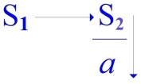
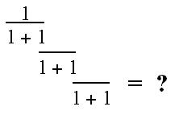
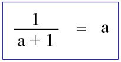
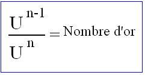
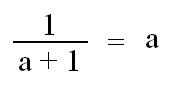
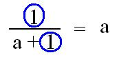

# Leçon 11 | 20 Mai 1970

<!-- source-url: http://staferla.free.fr/S17/S17 L'ENVERS.docx -->
<!-- seminar: s17 -->
<!-- lesson: 11 -->

<!-- id: s17-11-0001 -->

Voilà, il a passé beaucoup d’eau sous le pont depuis notre dernière rencontre, je parle de celle qui s’est passée ici en Avril.

<!-- id: s17-11-0002 -->

Je ne parle pas de la toute dernière qui s’est passée ailleurs, au moins pour certains...

<!-- id: s17-11-0003 -->

je veux dire cette sorte d’échange que nous avons été amenés à faire sur les marches du Panthéon.

<!-- id: s17-11-0004 -->

À la vérité, comme ça avec le recul de huit jours, je trouve que ce qui s’y est échangé de propos, n’était pas d’un mauvais niveau puisqu’en somme ça m’a permis de rappeler un certain nombre de points, qui sans doute...

<!-- id: s17-11-0005 -->

> puisqu’on me posait la ques­tion et que cette question n’était pas du tout inepte ...méritaient d’être précisés.

<!-- id: s17-11-0006 -->

Mon premier sentiment tout de suite après, quand j’étais avec quelqu’un qui me raccompagnait, a été pourtant d’une certaine inadéquation.

<!-- id: s17-11-0007 -->

Même les meilleurs de ceux qui ont parlé...

<!-- id: s17-11-0008 -->

> et à la vérité aucun n’était sans être justifié dans ses ques­tions ...même les meilleurs, au premier temps, m’ont paru être un peu à la traîne, à la traîne de quelque chose qui me semble se refléter dans ceci que...

<!-- id: s17-11-0009 -->

> au moins dans cette sorte d’interpellation familière qui n’était pas encore des questions, ...j’étais situé comme ça d’un certain nombre de références qui ne sont certes pas toutes à refuser puisqu’aussi bien la première était celle à Gorgias, dont soi-disant j’o­pérerais ici je ne sais quelle répétition. Pourquoi pas ?

<!-- id: s17-11-0010 -->

L’inconvénient, c’est que dans la bouche de la personne qui évoquait ce personnage, dont nous pouvons maintenant mal mesurer l’efficacité, Gorgias était malgré tout quelqu’un appartenant à *l’histoire de la pensée.* C’est bien là qu’est, si je puis dire, le recul, et qui me paraît fâcheux, celui en somme qui unifie sous ce terme une sorte d’échantillonnage, de prise de distance à l’égard de tel ou tel, qu’on réunit sous cette boucle, sous cette accolade, de « *fonction de la pensée* ».

<!-- id: s17-11-0011 -->

Il me semble qu’il n’y a rien qui soit moins homogène, si je puis m’exprimer ainsi, rien qui permette de définir une espèce, dans ceux qui, à quelque titre qu’on se les imagine comme repré­sentant la pensée, ont ordonné *une fonction* , qui serait justement d’une espèce.

<!-- id: s17-11-0012 -->

La pensée n’est pas une catégorie, je dirai presque que *c’est un affect*.

<!-- id: s17-11-0013 -->

Encore ne serait-ce pas pour dire que c’est le plus fondamental, sous cet angle, de l’affect.

<!-- id: s17-11-0014 -->

Qu’il n’y en ait qu’un, c’est ce qui constitue à proprement parler une certaine position, nouvelle à être introduite dans le monde, et dont je dis qu’il est le fait de ce *quelque chose* dont je vous donne un schéma porté au tableau noir, quand je parle du *discours psychanalytique*.

<!-- id: s17-11-0015 -->

<!-- id: s17-11-0016 -->

À la vérité, porter au tableau noir est quelque chose de distinct, que d’en *parler*.

<!-- id: s17-11-0017 -->

##### Quelqu’un...

<!-- id: s17-11-0018 -->

##### je me souviens, à Vincennes, alors que j’y paraissais pour la fois

<!-- id: s17-11-0019 -->

##### qui ne s’est pas reproduite depuis, mais qui, je l’ai dit, se reproduira

<!-- id: s17-11-0020 -->

##### ...quelqu’un a cru devoir me crier que... y avait des choses réelles qui occupaient vraiment l’assemblée,

<!-- id: s17-11-0021 -->

##### c’est à savoir tel ou tel point qu’on me rappelait, à savoir qu’on se tabassait à tel endroit,

<!-- id: s17-11-0022 -->

##### plus ou moins loin du lieu où nous étions réunis, que c’est à ça qu’il fallait penser,

<!-- id: s17-11-0023 -->

##### le tableau noir ça n’avait rien à faire avec ce *réel*.

<!-- id: s17-11-0024 -->

##### C’est là qu’est *l’erreur*, et j’irai à dire que s’il y a une chance de *saisir quelque chose* qui s’appelle le *réel*,

<!-- id: s17-11-0025 -->

##### ce n’est pas ailleurs qu’au tableau noir, et que même ce que je peux avoir à en commenter, ce qui prend forme de parole,

<!-- id: s17-11-0026 -->

##### n’a rapport qu’à ce qui *s’écrit* au tableau noir.

<!-- id: s17-11-0027 -->

C’est un fait, qui est démontré de ce fait, de ce factice, qu’est la science, dont on aurait tout à fait tort de n’inscrire l’émergence que d’une coction philosophique : « *métaphysique »* peut-être plus que « *physique » *: que notre physique scientifique mérite d’être qualifiée de métaphysique, c’est ce qui serait à préciser.

<!-- id: s17-11-0028 -->

Et le préciser me semble possible précisément de ce point qui est le *dis­cours psychanalytique,* en ceci qu’il énonce qu’à partir de ce discours, *d’affect il n’y en a qu’un*, à savoir le produit de la prise de l’être parlant dans un discours, *en tant que ce discours le détermine comme objet*.

<!-- id: s17-11-0029 -->

C’est très certainement de là que prend *sa valeur exemplaire* *le cogito cartésien,* à condition bien sûr qu’on l’examine qu’on le revoit. C’est ce que peut-être, une fois de plus et rapidement, j’aurai aujourd’hui à faire.

<!-- id: s17-11-0030 -->

Cet affect par quoi l’être parlant, d’un discours se trouve déterminé comme *objet*, ce qu’il faut dire c’est que *cet objet n’est pas nommable*.

<!-- id: s17-11-0031 -->

Si j’essaie de le nommer comme « *plus de jouir »*, ce n’est là qu’appareil de nomenclature.

<!-- id: s17-11-0032 -->

*Quel objet est fait de cet effet* d’un certain discours ?

<!-- id: s17-11-0033 -->

*Cet objet* nous n’en savons rien, sinon qu’il *est cause du désir*, c’est-à-dire à propre­ment parler que *<u>c’est comme manque à être qu’il se manifeste</u>*.

<!-- id: s17-11-0034 -->

<!-- id: s17-11-0035 -->

*Ce n’est donc rien d’étant qui est ainsi déterminé*.

<!-- id: s17-11-0036 -->

Ce sur quoi porte *l’effet de tel discours* peut bien être un *étant* qu’on appellera par exemple *l’homme* ou bien *un vivant*, on ajoutera *sexué* et *mortel* et l’on s’avancera hardiment à penser que c’est là ce sur quoi porte le discours de la psychanalyse, sous prétexte qu’il s’y agit tout le temps du sexe et de la mort.

<!-- id: s17-11-0037 -->

Mais d’où nous partons, s’il est effectif que c’est au niveau de quelque chose qui se révèle d’abord, et comme premier fait, pour « *structuré comme un langage »*, nous n’en sommes pas là.

<!-- id: s17-11-0038 -->

*Ce n’est de nul étant qu’il s’agit dans l’effet du lan­gage*, dans ceci qu’il ne s’agit que d’un *être parlant *:

<!-- id: s17-11-0039 -->

- nous ne sommes pas au niveau de *l’étant* au départ,

<!-- id: s17-11-0040 -->

- mais au niveau de *l’être*.

<!-- id: s17-11-0041 -->

Encore est-ce là...

<!-- id: s17-11-0042 -->

pour qu’il nous faille nous garder d’un mirage, à savoir que « *l’être »* ainsi soit posé, ...c’est *là* que l’erreur nous guette d’une assimilation avec tout ce qui s’est ordonné comme dialectique, à savoir d’une première opposition de *l’être et du néant*.

<!-- id: s17-11-0043 -->

Cet effet - mettons maintenant ici *les guillemets* - «* d’être *», son 1er *affect* n’apparaît qu’au niveau de *ce qui se fait* *cause du désir*, de ce que nous cernons, de ce premier effet d’appareil : *ce qu’il en est de l’analyste*, de *l’analyste* sans doute comme place, comme position que j’essaie de cerner de ces petites lettres au tableau noir.

<!-- id: s17-11-0044 -->

C’est que *c’est là qu’il se pose* : *il se pose comme cause du désir*.

<!-- id: s17-11-0045 -->

Position éminemment inédite, sinon paradoxale, et dont il est certain qu’une pratique l’entérine, dont l’importance peut se mesurer d’être repérée à ce qui est son rapport fondamental, non de distance, ni de survol, mais proprement initiée par ce qui se désigne comme *discours du Maître*.

<!-- id: s17-11-0046 -->

C’est à savoir qu’il y a quelque chose qui se présentifie, de par le fait que c’est du *dis­cours* que dépend toute détermination de sujet, donc de pensée.

<!-- id: s17-11-0047 -->

C’est que dans ce discours surgit en effet... qu’il y a ce moment dont il serait bien faux de croire que c’est au niveau d’un risque...

<!-- id: s17-11-0048 -->

ce risque malgré tout mythique, trace de mythe encore à rester dans la phéno­ménologie hégélienne ...qui fait que ce Maître ne serait rien que celui - quoi ? - *qui est le plus fort* ?

<!-- id: s17-11-0049 -->

Ce n’est certes pas cela qu’inscrit Hegel. « *La lutte de pur prestige au risque de la mort* » appartient encore au règne de l’*imaginaire*.

<!-- id: s17-11-0050 -->

Ce qui fait le Maître c’est ceci : c’est ce que j’ai appelé en d’autres termes « *le cristal de la langue* ».

<!-- id: s17-11-0051 -->

Pourquoi ne pas utiliser ce qui en français peut se désigner sous l’homonymie de « *m apostrophe être* » : *m’être, m’être à moi-même* ? C’est de là que surgit *le signifiant-m’être,* dont je vous laisse le deuxième terme à écrire comme vous le préférerez.

<!-- id: s17-11-0052 -->

Pour commencer d’articuler comment ce signifiant unique opère de sa relation avec ce qui est là déjà, déjà articulé, de sorte que nous ne pouvons le concevoir que d’une présence du signifiant déjà là, je dirais, de toujours.

<!-- id: s17-11-0053 -->

Car si ce signifiant unique...

<!-- id: s17-11-0054 -->

> le signifiant du *Maître,* à écrire comme vous voulez ...s’articule à quelque chose d’une pratique, qui est celle qu’il ordonne, cette pratique est déjà tissée, tramée, de ce qui, pas encore certes, ne s’en dégage, à savoir l’articula­tion signifiante qui est au principe de tout savoir, ne pût-il d’abord être abordé qu’en savoir-faire.

<!-- id: s17-11-0055 -->

La trace de cette présence première de ce savoir, nous la trouvons même là où déjà elle est loin, d’avoir été justement longuement trafiquée dans ce qu’on appelle *la tradition philosophique,* justement de l’embrayage du *signi­fiant du Maître* sur ce savoir.

<!-- id: s17-11-0056 -->

N’oublions pas que quand Descartes pose son « *Je pense, donc je suis* », c’est d’avoir soutenu un temps son « *Je pense* » - de quoi ? - d’une mise en question, d’une *mise en doute* *de ce savoir* que j’appelle « *trafiqué* », de ce savoir déjà longuement élaboré de l’immixtion du Maître.

<!-- id: s17-11-0057 -->

Que pouvons-nous dire de l’actuelle science qui nous permette de nous repérer ?

<!-- id: s17-11-0058 -->

Si vous voulez dans trois étages, trois étages que je n’évoque ici que par faiblesse didactique, de ce que je ne suis pas sûr après tout que vous colliez à mes phrases :

<!-- id: s17-11-0059 -->

- *la science*,

<!-- id: s17-11-0060 -->

- derrière : *la philosophie*,

<!-- id: s17-11-0061 -->

- et au-delà : *quelque chose* dont nous avons la notion ne serait-ce que par les anathèmes bibliques.

<!-- id: s17-11-0062 -->

Si longuement j’ai fait place au texte d’*Osée* cette année...

<!-- id: s17-11-0063 -->

à propos de ce que Freud en tire d’après Sellin ...le bénéfice le meilleur n’est peut-être pas...

<!-- id: s17-11-0064 -->

quoiqu’il existe aussi de ce côté ...de *la mise en question* de ce qu’il en est, dans la théorie psychanalytique, de ce que j’ai appelé ce *résidu de mythe* qui s’appelle *le complexe d’Œdipe*.

<!-- id: s17-11-0065 -->

Assurément, s’il fallait quelque chose pour ici présentifier je ne sais quel océan d’un savoir mythique réglant...

<!-- id: s17-11-0066 -->

et comment savoir comment si c’était harmonieux ou pas ...la vie des hommes, ce que Yahvé maudit...

<!-- id: s17-11-0067 -->

> de ce que j’ai appelé « sa féroce ignorance » ...du terme de « prostitution ».

<!-- id: s17-11-0068 -->

C’est là biais suffisant à mes yeux, et sûrement meilleur que la réfé­rence commune aux fruits de l’ethnographie, qui recèle en elle-même je ne sais quelle confusion, d’adhérer en quelque sorte comme naturel à ce qui est recueilli.

<!-- id: s17-11-0069 -->

Recueilli comment ? *Recueilli par écrit* !

<!-- id: s17-11-0070 -->

C’est-à-dire détaillé, extrait, faussé à jamais du prétendu *terrain* dont on prétend le dégager.

<!-- id: s17-11-0071 -->

Ce n’est certes pas pour dire que ces savoirs mythiques pouvaient en dire plus long, ni mieux, de ce qui est l’essence du rapport sexuel.

<!-- id: s17-11-0072 -->

Ce que la *psychanalyse* démontre et ce en quoi elle nous présentifie le sexe, la mort comme sa dépen­dance...

<!-- id: s17-11-0073 -->

encore là ne sommes-nous sûrs de rien, si ce n’est de cette appré­hension massive *du lien de la différence sexuelle à la mort* ...si *la psychanalyse* nous le présentifie - c’est quoi ? - c’est de démontrer de façon que je ne dirai pas *vive*, mais seulement articulée, que de la prise dans le discours de cet *être*...

<!-- id: s17-11-0074 -->

quel qu’il soit, c’est-à-dire qu’il n’est même pas *être* ...en tout cas ce qui se démontre, c’est que nulle part n’apparaît d’articulation qui exprime *le rapport sexuel*, si ce n’est de *façons complexes*, dont on ne peut même pas dire qu’elle soit médiée, qu’il y ait de *medii* ou de *media*, comme vous voudrez, qui sont,

<!-- id: s17-11-0075 -->

- l’un, cet *effet réel* que j’appelle *le plus de jouir*, qui est le *petit(a)*. Ce que l’expérience nous indique c’est que *ce n’est qu’à ce que ce petit(a) se substitue à la femme, que l’homme la désire*.

<!-- id: s17-11-0076 -->

- Qu’inver­sement, ce à quoi la femme a affaire - si tant est que nous puissions en parler - c’est proprement à cette jouissance qui est la sienne, et qui quelque part se représente d’une toute-puissance de l’homme, qui est précisément ce par quoi l’homme s’articulant, s’articulant comme Maître, se trouve être en défaut.

<!-- id: s17-11-0077 -->

C’est de là qu’il faut partir dans l’expérience analytique, c’est que ce qui pourrait être appelé *l’homme* c’est-à-dire *le mâle*, en tant qu’*être parlant,* ceci proprement disparaît, s’évanouit, de l’effet même du discours et du *discours du Maître...*

<!-- id: s17-11-0078 -->

> écrivez-le comme vous voudrez ...de ne s’inscrire qu’en castration, qui de fait est proprement à définir comme *privation de la femme*, de la femme en tant qu’elle se réaliserait dans un signifiant congru.

<!-- id: s17-11-0079 -->

*La privation de la femme* : tel est, exprimé en terme de défaut du discours, ce que veut dire la castration.

<!-- id: s17-11-0080 -->

C’est bien parce que ce n’est pas pensable que - comme truchement - l’ordre parlant institue ce désir - constitué comme *impossible -* qui fait de l’objet féminin privilégié : la mère, en tant qu’elle est interdite.

<!-- id: s17-11-0081 -->

C’est l’habillage ordonné du fait fondamental qu’il n’y a pas de place possible dans une *union mythique* qui serait définie comme *sexuelle entre l’homme et la femme.*

<!-- id: s17-11-0082 -->

C’est bien là que ce que nous appréhendons dans le *discours psychana­lytique*, c’est que *l’Un unifiant*, *l’Un-tout*, n’est pas ce dont il s’agit dans *l’identification*.

<!-- id: s17-11-0083 -->

*L’identification*-pivot, *l’identification majeure, c’est le trait unaire*, c’est l’être marqué **1**.

<!-- id: s17-11-0084 -->

En tant qu’avant toute promotion d’aucun étant, du fait d’un **1** singulier, de ce qui porte la marque, et que dès ce moment, l’effet de langage se pose et le pre­mier affect.

<!-- id: s17-11-0085 -->

C’est ceci que rappellent les formules ici que j’ai inscrites au tableau.

<!-- id: s17-11-0086 -->

Quelque part s’isole ce quelque chose que *le cogito s*eulement marque, du *trait unaire* lui aussi, qu’on peut supposer au « *Je pense* » pour dire « *donc je suis* ».

<!-- id: s17-11-0087 -->

C’est déjà marquer ici *l’effet de division*, d’un « *je suis* » qui élide « *Je suis marqué du* **1** », car bien sûr Descartes s’inscrit bien sûr dans une tradition *scolastique*, il s’en dégage par un tour d’acrobatie, qui n’est pas du tout à dédaigner comme procédé d’émergence.

<!-- id: s17-11-0088 -->

C’est en fonction de cette *position première* du « *Je suis* », d’ailleurs, que peut seulement s’écrire le « *Je pense* ».

<!-- id: s17-11-0089 -->

Il y a longtemps, vous vous souvenez comment je l’écris : « *Je pense* : *« donc je suis* ». C’est une pensée ce « *donc je suis.* »

<!-- id: s17-11-0090 -->

Il se supporte infiniment mieux de porter sa caractéristique de *savoir*, qui ne va pas au-delà du « *je suis* » marqué du 1, du singulier, de l’unique, - de quoi ? - de cet effet qui est « *Je* *pense* ».

<!-- id: s17-11-0091 -->

Mais là encore, il y a une erreur de ponctuation : l’*ergo...*

<!-- id: s17-11-0092 -->

> il y a longtemps que j’ai exprimée ainsi l’*ergo* qui n’est rien d’autre que l’*ego* en jeu ...est à mettre *du côté du cogito *: le «* je pense *: *‘donc Je suis’* »» voilà qui donne sa vraie portée à la formule, la cause, l’*ergo* est «* pensée *».

<!-- id: s17-11-0093 -->

Là est le départ à prendre de *l’effet* de ce dont il s’agit dans l’ordre le plus simple, dont *l’effet de langage* s’exerce au niveau du surgissement du *trait unaire*.

<!-- id: s17-11-0094 -->

Le *trait unaire*, certes n’est jamais seul, donc le fait qu’il se répète...

<!-- id: s17-11-0095 -->

> qu’il se répète à n’être *jamais le même* ...est proprement l’ordre même, celui dont il s’agit de ce que le langage soit présent, présent et déjà là, déjà efficace.

<!-- id: s17-11-0096 -->

La première de nos règles est de ne point interroger sur l’origine du langage, ne serait-ce que parce qu’elle se démontre suffisamment de ses effets.

<!-- id: s17-11-0097 -->

Plus nous poussons loin *ses effets*, plus cette origine émerge.

<!-- id: s17-11-0098 -->

L’effet du langage est rétroactif précisément en ceci que c’est à mesure de son développement qu’il manifeste ce qu’il est à proprement parler de *manque à être*.

<!-- id: s17-11-0099 -->

####### Aussi bien je ne ferai qu’indiquer au passage - nous avons aujourd’hui plus loin à pousser - qu’à seulement l’écrire ainsi :

<!-- id: s17-11-0100 -->

<!-- id: s17-11-0101 -->

et à y faire jouer sous sa forme la plus stricte ce qui dès l’origine d’un usage rigoureux du *symbolique* se manifeste dans la tradition grecque, à savoir au niveau des mathématiques, au niveau de ce qui dans Euclide, référence fondamentale, définition première jamais donnée avant lui, je veux dire dans ce qui nous reste d’écrit.

<!-- id: s17-11-0102 -->

Bien sûr qui sait d’où il emprunte sa très stricte définition de la proportion, celle qui seule donne au niveau du Vème Livre \- si je me souviens bien - le seul vrai fondement de la *démonstration géométrique*, terme ambigu, qui à toujours mettre en avant ces éléments intuitifs qu’il y a dans la figure, nous laisse méconnaître que très formellement dans Euclide, l’exigence est de *démonstration symbolique*, d’ordres groupés des inégalités et des égalités, qui seuls peuvent permettre d’une façon non approximative mais proprement démonstrative, à la proportion de s’assurer, et dans ce terme qui est ce qu’il désigne λόγος \[logos\] c’est le sens de *proportion*.

<!-- id: s17-11-0103 -->

Il est curieux, il est intéressant, il est représentatif qu’il ait fallu attendre *la série de Fibon­nacci,* pour que ce qui est donné dans une appréhension de cette *proportion* qui s’appelle « *moyenne proportionnelle »,* et qui est celle même que je réécris là, dont vous savez que j’ai fait usage quand j’ai parlé de *D’un Autre à l’autre* [^47].

<!-- id: s17-11-0104 -->

 

<!-- id: s17-11-0105 -->

Que je me suis servi de cette « *moyenne proportionnelle »,* qu’encore un romantisme continue d’appeler « *le nombre d’or »* et se perd à retrouver à la surface de tout ce qui a pu se peindre ou se crayonner à travers les âges, comme s’il n’était pas certain que tout ceci n’est que...

<!-- id: s17-11-0106 -->

pour le voir, il n’est que d’ouvrir un ouvrage d’esthétique qui fait état de cette référence ...que si on peut l’y plaquer ce n’est sûrement pas que le peintre en a dessiné par avance les diagonales, et qu’en effet il y a je ne sais quoi d’un accord intuitif qui fait que tou­jours, enfin c’est ce qui chante le mieux.

<!-- id: s17-11-0107 -->

Il y a tout de même autre chose qui est ceci dont il vous sera facile à prendre chacun de ces termes :

<!-- id: s17-11-0108 -->

<!-- id: s17-11-0109 -->

Prenez-les si vous voulez comme ça, commencez de les calculer par le bas, vous verrez vite  que vous avez d’abord à faire à 1/2, que quand vous arrivez là vous avez affaire à 2/3, qu’en­suite vous avez affaire à 3/5, et que pour tout dire la proportion dont il s’agit, sera dans cette *suite* que constitue *la série de Fibonacci* : 1, 2, 3, 5… à savoir, *chacun des termes étant la somme des deux précédents* comme je vous l’ai fait remarquer en son temps, qu’à pousser suffi­samment loin la série, cette relation de deux termes que nous écrirons Un-1 + Un ou plus exactement Un-1/ Un, Un étant constitué de la somme de Un-2 et de Un-1, cet Un-1/ Un sera égal à cette *proportion* en effet *idéale* qui s’appelle la « *moyenne proportionnelle »* ou encore le « *nombre d’or »*.

<!-- id: s17-11-0110 -->

D’où il résulte...

<!-- id: s17-11-0111 -->

qu’à prendre cette *proportion* comme image de ce qu’il en est de l’affect en tant qu’il y a répétition de ce «* je suis* 1* *» à la lire ...d’où résulte rétroactivement ce qui le cause l’affect, cet affect nous pouvons l’écrire momentanément égal à *a* et nous saurons que c’est le même *a* que nous retrouvons au niveau de l’effet.

<!-- id: s17-11-0112 -->

L’effet de la répétition du **1**, c’est ce *a* en tant qu’en somme au niveau de ce qui ici se désigne d’une barre :

<!-- id: s17-11-0113 -->

<!-- id: s17-11-0114 -->

la barre n’étant précisément que ceci : qu’il y a quelque chose à passer pour que le 1 *affecte*, *c’est cette barre en somme qui est égale à* *a*.

<!-- id: s17-11-0115 -->

Nul étonnement au fait que nous ne puissions légitimement l’écrire au-dessous de la barre comme ce qui est l’effet ici pensé, renversé de faire surgir la cause.

<!-- id: s17-11-0116 -->

C’est dans le premier effet que surgit *la cause comme cause pensée*.

<!-- id: s17-11-0117 -->

C’est bien ce qui nous motive, à trouver dans ce premier tâtonnement de l’u­sage des mathématiques, quelque chose qui n’a pour nous d’intérêt que d’être arti­culation plus sûre de ce qu’il en est *de l’effet de discours*.

<!-- id: s17-11-0118 -->

C’est au niveau de *la cause*, en tant qu’elle surgit comme *pensée reflet de l’effet,* c’est au niveau de cette cause que nous touchons l’ordre initial de ce qu’il en est du « *manque à être »,* en ceci que l’être ne s’affirme que de *la marque* d’abord *du* **1,** et que tout le reste est rêve ensuite, et notamment celle du *Un* en tant qu’il englobe, en tant qu’ici il pourrait réunir quoi que ce soit, si ce n’est précisément cette confrontation, cette adjonction de cette pensée de la cause, à quelque chose qui est la première répétition du **1** :

<!-- id: s17-11-0119 -->

<!-- id: s17-11-0120 -->

À savoir cette *répétition* qui déjà coûte, qui institue au niveau du *a,* la dette au langage, à ce quelque chose qui est à payer à celui qui introduit son signe, à ce quelque chose qui d’une nomenclature qui essaie de lui donner son poids historique, l’intitule d’ici...

<!-- id: s17-11-0121 -->

ce n’est pas à proprement parler ce cette année, mais disons pour vous de cette année ...du terme de *Mehrlust*.

<!-- id: s17-11-0122 -->

Remarquez que s’il y a quelque chose à reproduire ici de cette infinie arti­culation, il va de soi qu’à ce que ce *a* soit le même ici et là, *la répétition de la formule* ne peut être, bien entendu,

<!-- id: s17-11-0123 -->

- non pas de *l’infinie répétition*, comme ne manquent jamais d’en faire la faute les *phénoménologistes*, de *la répétition* du « *je pense* » à* *l’intérieur du « *je pense* »,

<!-- id: s17-11-0124 -->

- mais seulement ceci : que le «* je pense *» - s’il est effet - ne peut se remplacer que du «* je suis *».

<!-- id: s17-11-0125 -->

«* Je pense donc je suis *», «* je suis celui gui pense, donc je suis *» et ceci indéfiniment où vous remarquerez que le *a* s’éloigne toujours dans une série qui reproduit exactement le même ordre des 1 tels qu’ils sont ici déployés à droite :

<!-- id: s17-11-0126 -->

<!-- id: s17-11-0127 -->

À ceci près qu’au dernier terme il y aura un *petit(a)*, un *petit(a)* - remarquez-le, chose singulière – dont il suffit qu’il subsiste aussi loin que vous le portiez dans la descente, pour que l’égalité soit la même dans la formule ici inscrite, à savoir que la proportion multiple et répétée s’égale - au total – au résultat du *petit(a)*.

<!-- id: s17-11-0128 -->

En quoi se marque que cette série en somme ne fait rien d’autre, si je ne me trompe, que de marquer l’ordre de séries convergentes dont les inter­valles sont les plus grands d’être constants, à savoir toujours *petit(a)*.

<!-- id: s17-11-0129 -->

<!-- id: s17-11-0130 -->

Ceci, à la vérité, n’est d’une certaine façon qu’articulation locale qui elle, certes, ne prétend pas trancher d’une proportion fixe et mesurer ce qu’il en est de l’effectivité de la manifestation la plus primaire du *nombre*, à savoir *du trait unaire*.

<!-- id: s17-11-0131 -->

Elle est faite seulement pour rappeler ceci que *la science* telle que nous l’avons maintenant, si je puis dire, sur les bras, je veux dire présente en notre monde d’une façon qui dépasse de beaucoup tout ce qui peut se spéculer d’un *effet de connaissance*.

<!-- id: s17-11-0132 -->

Car il ne faudrait tout de même pas oublier ceci :

<!-- id: s17-11-0133 -->

- c’est que la caractéristique de notre science n’est pas d’avoir introduit une meilleure, plus étendue, connaissance du monde,

<!-- id: s17-11-0134 -->

- mais d’avoir fait surgir au monde des choses qui n’y existaient d’aucune façon, au niveau de notre perception.

<!-- id: s17-11-0135 -->

À savoir de tout ce qu’on essaye d’ordonner autour d’une genèse mythique sous le prétexte que telle ou telle *méditation philosophique* se serait longuement arrêtée autour de ceci : de savoir ce qui garantit la perception de n’être pas illusoire.

<!-- id: s17-11-0136 -->

Ce n’est pas de là que la science est sortie.

<!-- id: s17-11-0137 -->

La science est sortie de ce qui était dans l’œuf, dans les démonstrations euclidiennes, encore celles-ci restant très suspectes de comporter encore cet attachement à la *figure* qui prend prétexte de son évidence.

<!-- id: s17-11-0138 -->

Toute l’évolution de la mathématique grecque nous prouve que c’est précisément à ceux qui montent au zénith la manipulation du nombre comme tel, voyez la méthode d’exhaustion qui est celle qui, dans Archimède déjà, préfigure ce qui va aboutir à l’essentiel, et qui pour nous est la structure en l’occasion, à savoir le « *calculus* », *le calcul infinitésimal* dont il n’y a pas besoin d’attendre Leibniz, qui au reste s’y montre de sa première touche d’une certaine maladresse, et qui déjà s’amorce bien avant, à seulement reproduire l’exploit d’Archimède sur la parabole, au niveau de Cavalieri : nous sommes au XVIIème siècle, mais déjà bien avant Leibniz.

<!-- id: s17-11-0139 -->

De cela, qu’est-ce qu’il résulte ?

<!-- id: s17-11-0140 -->

De la science dont vous pouvez dire sans doute que le «* Nihil fuerit in intellectu non prius fuerit in sensu *»[^48], qu’est-ce que ça prouve ?

<!-- id: s17-11-0141 -->

Le *sensus* n’a rien à faire, comme on le sait tout de même, avec la perception.

<!-- id: s17-11-0142 -->

Le *sensus* n’est là qu’en manière de *ce quelque chose qui peut se compter*, et que le fait de compter dissout rapidement, puisque ce qu’il en est de notre *sensus*...

<!-- id: s17-11-0143 -->

> à le prendre par exemple au niveau de l’oreille ou de l’œil ...aboutit à une numération de vibrations, et que c’est bien pour autant que nous nous sommes...

<!-- id: s17-11-0144 -->

> grâce à ce jeu, à ce jeu du nombre ...que nous nous sommes mis à produire bel et bien des vibrations qui n’avaient rien à faire *ni avec nos sens ni avec notre perception*, que le monde, le monde qui était présumé être le nôtre de toujours, est maintenant, ce même monde *peuplé*...

<!-- id: s17-11-0145 -->

> comme je le disais l’autre jour sur les marches du Panthéon ...*peuplé,* à la place même où nous sommes, d’un nombre considérable, et s’entrecroisant sans que vous en ayez le moindre soupçon, de ce *quelque chose* qui s’appelle *des ondes* et qui ne sont tout de même pas à négliger comme manifestation, présence, exis­tence de *quelque chose* qui est la science et qui tout de même nécessiterait qu’à parler autour de notre terre d’atmosphère où de stratosphère...

<!-- id: s17-11-0146 -->

> ou de tout ce qu’il vous plaira de *sphériser* aussi loin que nous pouvons appréhender des particules ...de tenir compte aussi, et de nos jours, à notre époque allant bien au-delà, de ce *quelque chose* qui est l’effet de quoi ?

<!-- id: s17-11-0147 -->

Moins *d’un savoir* qui aurait progressé de son propre filtrage, de sa critique, comme on dit, mais de cet élan hardi vers *quelque chose* qui est ce à quoi *par un artifice*, et sans doute *un artifice* au niveau de Descartes...

<!-- id: s17-11-0148 -->

> d’autres en choisiront d’autres ...l’artifice d’en *remettre à Dieu la garantie de la vérité *: s’il y a une vérité, qu’il s’en charge, nous la prenons à sa valeur faciale.

<!-- id: s17-11-0149 -->

Et *par ce seul jeu* d’une vérité, non pas abstraite, mais purement logique,

<!-- id: s17-11-0150 -->

- *par ce seul jeu* d’une combinatoire stricte et soumise simplement à ceci qu’il faut que toujours en soit pointées sous le nom d’axiome, les règles,

<!-- id: s17-11-0151 -->

- *par ce seul jeu* d’une vérité formalisée, ...voilà que se construit une science qui n’a plus rien à faire avec les présupposés de ce que depuis toujours impliquait l’idée de connaissance, à savoir cette polarisation duelle, cette unification idéale, qui serait imaginée de ce qu’est la connaissance, et où on peut toujours trouver... et de quelque nom qu’on les habille, εἶδος, ὔλη \[eidos, oulé\] par exemple ...le reflet, l’image - d’ailleurs toujours ambiguë - de deux principes, *le principe mâle* et *le principe femelle*.

<!-- id: s17-11-0152 -->

Que ce dont il s’agit comme espace où se déploient les créations de la science, nous ne puissions dès lors le qualifier que de *l’insubstance*, de *l’a-chose* (*l apostrophe*), c’est bien le fait qui change du tout au tout le sens de notre matérialisme.

<!-- id: s17-11-0153 -->

C’est la plus vieille figure de l’infatuation du maître - « *écrivez-le comme vous voudrez* » - *que l’homme s’imagine former la femme*.

<!-- id: s17-11-0154 -->

Je pense que vous avez tous assez d’expérience pour avoir rencontré cette histoire comique à tel ou tel tournant de votre vie !

<!-- id: s17-11-0155 -->

La forme, la substance – « *appelez-le comme vous voudrez* » encore - le contenu : ce mythe est très précisément ce dont une pensée scientifique doit se dégager.

<!-- id: s17-11-0156 -->

Et s’il m’est permis ici d’avancer d’un *soc de charrue* un peu rude, simplement, comment dirai-je, pour bien exprimer ma pensée...

<!-- id: s17-11-0157 -->

> ce qui veut dire bien sûr que je déchoie à faire comme si j’en avais une, car ce n’est précisément pas de ça
>
> qu’il s’agit, mais comme chacun sait, c’est la pensée qui se communique par le malenten­du, bien entendu ...alors faisons de *la communication* et disons que ce en quoi consiste cette version, cette conversion, par quoi la science à la fois s’avère comme distincte de toute « *théorie de la connaissance* », ce qui ne veut rien dire parce qu’il n’y a justement qu’à la lumière de l’appareil...

<!-- id: s17-11-0158 -->

> pour autant que nous pouvons l’appréhender ...de la science, que nous pouvons fonder ce qu’il en était des erreurs des butées, des confusions qui ne manquaient pas en effet de se présenter dans ce qui s’articulait comme « connaissance » avec cette sous-jacence qu’il y avait là deux principes à scinder :

<!-- id: s17-11-0159 -->

- l’un qui forme,

<!-- id: s17-11-0160 -->

- et l’autre qui est formé, car précisément s’il y a quelque chose que la science nous fait toucher du doigt... et aussi bien dont se conforte le fait que dans *l’expérience analytique* nous en trouvions l’écho ...c’est que... si vous voulez et pour m’exprimer de *ces grands termes approximatifs*, quand je parle du *principe mâle* par exemple ...l’effet de l’incidence du discours est que c’est en tant qu’être parlant qu’il est sommé d’avoir à rendre raison de son « *essence* », entre *guillemets* ironiques.

<!-- id: s17-11-0161 -->

C’est très précisément de *l’affect* qu’il en suit, de cet *effet de discours*, c’est à savoir que c’est très proprement en tant qu’il reçoit cet effet féminisant qu’est le *petit(a)* - et seulement par là – qu’il reconnaît ce qui le fait, à savoir *la cause de son désir*.

<!-- id: s17-11-0162 -->

Inversement, au niveau du principe prétendu « *naturel »* dont ce n’est pas pour rien que depuis toujours il se symbolise

<!-- id: s17-11-0163 -->

> au mauvais sens du mot ...d’une référence femelle, c’est au contraire de *l’insubstance*, comme je l’ai dit tout à l’heure, que *ce vide*, dont assurément le *quelque chose* dont il s’agit, si nous voulons, très à distance, très lointainement, lui donner *l’horizon de la femme*, c’est dans ce que de jouissance *informée* précisément, *sans forme*, qu’il s’agit, que nous pouvons trouver la place, la place où vient s’édifier dans l’« *opère-soi* » de la science...

<!-- id: s17-11-0164 -->

> car ce « *je perçois* » prétendu originel doit être remplacé par un *opère-soi* ...c’est en tant que la science ne se réfère qu’à une articula­tion \[*signifiante*\], ne se prend *que de l’ordre signifiant,* qu’elle se construit de *quelque chose* dont il n’y avait rien avant.

<!-- id: s17-11-0165 -->

C’est très précisément là ce qui est important à saisir, si nous voulons comprendre quelque chose à ce qu’il en est - de quoi ? - de l’oubli de cet effet même, à savoir que tous tant que nous sommes, à mesure que le champ s’étend de ce qui la science fait être fonction du *discours du Maître*, nous ne savons pas jusqu’à quel point, pour la raison que nous n’avons jamais su, à aucun point, que nous étions chacun et d’abord déterminés comme *objet(a).*

<!-- id: s17-11-0166 -->

Je parlais tout à l’heure, pour le rappeler, de *ces sphères* dont précisément l’extension de la science...

<!-- id: s17-11-0167 -->

qui, chose curieuse, se trouve aussi très, très, opératoire à déterminer ce qui est l’*étant* ...entoure la terre d’une suite de zones qu’elle qualifie de ce qu’elle peut.

<!-- id: s17-11-0168 -->

Pourquoi ne pas faire la part aussi du lieu où se situent ces fabrications...

<!-- id: s17-11-0169 -->

> là encore j’accentue trop ce que je veux dire ...ces fabrications de la science, si elles ne sont rien d’autre que *l’effet d’une vérité formalisée*, comment allons-nous l’appeler ?

<!-- id: s17-11-0170 -->

Je ne peux pas vous dire que je suis forcément très fier de ce que j’avance en l’occasion.

<!-- id: s17-11-0171 -->

Je pense qu’il est utile - vous allez voir pourquoi - de poser cette question qui, elle, n’est pas de nomenclature, car il s’agit bien de la place bel et bien occupée, par quoi ?

<!-- id: s17-11-0172 -->

Soyons grossier, j’ai parlé tout à l’heure des ondes, eh bien c’est de ça qu’il s’agit :

<!-- id: s17-11-0173 -->

- *ondes hertziennes* ou autres,

<!-- id: s17-11-0174 -->

- *ondes dont aucune phénoménologie de la perception* [^49] ne nous a jamais donné la moindre idée et où elle ne nous aurait certainement jamais conduits.

<!-- id: s17-11-0175 -->

Voyons ça ! Certainement pas *la noosphère*, vous voyez ça - hein ? - *la noosphère*, ça serait peuplé de *noumènes*.

<!-- id: s17-11-0176 -->

S’il y a bien quelque chose qui dans l’occasion passe au 25ème arrière-plan de tout ce qui peut nous intéresser, c’est bien ça.

<!-- id: s17-11-0177 -->

Si on appelait ça - mais vous pouvez trouver mieux... - *l’aléthosphère* en nous servant, de l’ἀλήθεια \[alèthéia\], façon qui, j’en conviens, n’a rien d’émotionnellement philosophique.

<!-- id: s17-11-0178 -->

Ne perdons pas les pédales, *l’aléthosphère* ça s’enregistre : si vous avez ici un micro vous vous branchez sur *l’aléthosphère*.

<!-- id: s17-11-0179 -->

Ce qu’il y a d’épatant, c’est que si vous êtes dans un petit véhicule qui vous emmène vers Mars, vous pourrez toujours vous brancher sur *l’aléthosphère*. Et même il est absolument clair et manifeste que ce que j’ai déjà désigné comme ce surprenant effet de structure qui fait que ces deux ou trois personnes sont allées se balader sur la lune, croyez bien que pour ce qui est de l’exploit, ça n’est certainement pas pour rien qu’ils restaient toujours dans *l’aléthosphère*.

<!-- id: s17-11-0180 -->

Même ceux auxquels il est arrivé au dernier moment, au dernier temps, quelques menus ennuis, ils s’en seraient peut-être probablement beaucoup moins bien tirés...

<!-- id: s17-11-0181 -->

> je ne parle même pas de leurs rapports avec leurs petites machines ...ils s’en seraient bien tirés tout seuls peut-être, mais du fait qu’ils étaient tout le temps accompagnés de ce *petit(a)* de la voix humaine simplement : après tout ils pouvaient se permettre de ne dire que des conneries, par exemple que tout allait bien \[*Rires*\] quand tout allait mal ! Mais qu’importe !

<!-- id: s17-11-0182 -->

Ce qui importe c’est qu’ils restent dans *l’aléthosphère* en tant que ceci...

<!-- id: s17-11-0183 -->

il faut tout de même - le temps où nous sommes - nous apercevoir de tout ça, toutes ces choses qui la peuplent.

<!-- id: s17-11-0184 -->

Et puisque je viens de vous parler de *l’aléthosphère*, ça va nous faire introduire un autre mot.

<!-- id: s17-11-0185 -->

*L’aléthosphère* c’est beau à dire, c’est parce que nous supposons que ce que j’ai appelé *cette vérité formalisée*, elle a déjà suffisamment statut de *vérité* au niveau où elle opère, où elle *opère-soi*, mais au niveau de l’opéré, de ce qui se promène, elle n’est pas du tout dévoilée, la vérité.

<!-- id: s17-11-0186 -->

La preuve, c’est que cette voix humaine avec son effet comme ça de vous soutenir le périnée - si je puis m’exprimer ainsi – elle ne dévoile pas du tout *sa vérité*, elle. Alors, nous appellerons ça à l’aide de l’[*aoriste*](http://fr.wikipedia.org/wiki/Aoriste) du même verbe, dont un célèbre philosophe a rappelé que l’ἀλήθεια \[alèthéia\] ça en venait...

<!-- id: s17-11-0187 -->

> parce qu’après tout il n’y a que les philosophes pour s’aviser de choses pareilles,
>
> les philosophes et puis peut-être les linguistes ...on va appeler ça des *« lathouses ».* \[*Rires*\]

<!-- id: s17-11-0188 -->

Le monde est de plus en plus peuplé de *lathouses*. Ça a l’air de vous amuser, alors je vais vous l’*écrire*.

<!-- id: s17-11-0189 -->

Vous remarquerez que j’aurai pu appeler ça des *lathousies*, ça aurait fait jeu avec l’οὐσία \[oussia\] car ça participe de l’οὐσία \[oussia\] avec tout ce qu’il y a d’ambigu dans l’οὐσία \[oussia\] :

<!-- id: s17-11-0190 -->

- l’οὐσία \[oussia\] c’est pas *l’Au­tre*,

<!-- id: s17-11-0191 -->

- c’est pas *l’étant*,

<!-- id: s17-11-0192 -->

- c’est entre les deux.

<!-- id: s17-11-0193 -->

- Ce n’est pas tout à fait *l’être* non plus, mais enfin ça en approche fort.

<!-- id: s17-11-0194 -->

Pour ce qui est de l’insubstance féminine, j’irais bien jusqu’à la *parousie*.

<!-- id: s17-11-0195 -->

Mais pour les menus *objets petit(a)* que vous allez rencontrer en sortant, là sur le pavé, à tous les coins de rue, derrière toutes les vitrines, dans ce *foisonnement* de ces objets faits pour causer votre désir, pour autant que c’est la science qui nous gouverne, pensez-les comme « *lathouses* ».

<!-- id: s17-11-0196 -->

Je m’aperçois sur le tard...

<!-- id: s17-11-0197 -->

parce que « *lathouse* » il n’y a pas longtemps que je l’ai inventé que *ça rime avec ventouse*. Il y a du vent dedans, beaucoup de vent, le vent de la voix humaine !

<!-- id: s17-11-0198 -->

C’est assez comique de trouver ça au bout du rendez-vous, alors que si l’homme avait moins pratiqué le tru­chement de Dieu, pour croire qu’il s’unit avec la femme, il y a peut-être longtemps qu’on aurait trouvé ces « *lathouses* » !

<!-- id: s17-11-0199 -->

Quoiqu’il en soit, l’heure s’étant avancée, après tout ce petit surgissement fait pour faire que vous ne soyez pas tranquilles, pas tranquilles sur vos rapports avec la « *lathouse* », sur le fait qu’il est bien certain que chacun a affaire avec deux ou trois de cette espèce là, au moins.

<!-- id: s17-11-0200 -->

Car la vérité, c’est que la *lathouse* n’a pas du tout de raison de se limiter dans sa multiplication.

<!-- id: s17-11-0201 -->

L’important, c’est de savoir ce qui arrive quand on se met vraiment *en rapport* avec la *lathouse* comme telle.

<!-- id: s17-11-0202 -->

Le psycha­nalyste idéal, ce serait celui qui dirait qu’il commet cet acte absolument radical, et dont le moins qu’on puisse dire c’est qu’à le voir faire c’est angoissant.

<!-- id: s17-11-0203 -->

Un jour où il s’agissait de me monnayer, j’ai essayé d’avancer quel­ques petites choses, ça faisait partie de la cérémonie : pendant qu’on me monnayait, on voulait bien faire semblant de s’intéresser à ce que je pouvais avoir à dire sur la formation du psychanalyste, j’ai avancé...

<!-- id: s17-11-0204 -->

> bien sûr dans une indifférence absolue puisqu’on était occupé par ce qui se passait dans les couloirs ...j’ai avancé qu’il n’y a pas de raison qu’une psychanalyse cause de l’angoisse, puisque c’est à ça qu’on a affaire, et qu’ il est bien certain que s’il y a la *lathouse*, ça montre que *l’angoisse* - et c’est de là que je suis parti - *elle n’est pas sans objet*, qu’une meilleure approche de la *lathouse* doit un tout petit peu nous calmer.

<!-- id: s17-11-0205 -->

Mais se mettre en position telle qu’il y ait quelqu’un dont vous vous êtes occupé, à propos de son an­goisse, qui veuille en venir à occuper cette même position que vous tenez, ou que vous ne tenez pas, ou que vous tenez à peine.

<!-- id: s17-11-0206 -->

Savoir *comment vous la tenez* et *comment vous ne la tenez pas* et *pourquoi vous la tenez* et *pourquoi vous ne la tenez pas*, ça sera l’objet de notre prochaine rencontre.

<!-- id: s17-11-0207 -->

Ce sera l’objet de notre prochaine rencontre dont je vais quand même vous dire le titre, ce sera sur les rapports - tou­jours à supporter des mêmes petits schèmes - de *l’impuissance* à *l’impossibilité*.

<!-- id: s17-11-0208 -->

Il est clair qu’il est tout à fait impossible de tenir la position de la « *lathouse* ».

<!-- id: s17-11-0209 -->

Seulement il n’y a pas que ça qui est *impossible*, il y a d’autres choses encore, à condition de donner un sens strict au mot « *impossible* », c’est-à-dire de ne le déterminer que du niveau de notre vérité *formalisée*, à savoir, *qu’en tout champ formalisé de la vérité, il y a des vérités qu’on ne peut pas démontrer* \[*Cf. théorèmes d’incertitude de Gödel*\].

<!-- id: s17-11-0210 -->

Au niveau de cet *impossible* c’est là, vous le savez, que je définis ce qui est *réel*.

<!-- id: s17-11-0211 -->

S’il est *réel* qu’il y ait l’analyste c’est justement parce que c’est *impossible*.

<!-- id: s17-11-0212 -->

Ça fait partie de *la position de la « lathouse* ».

<!-- id: s17-11-0213 -->

L’ennui, c’est que pour être dans la position de la « *lathouse* », il faut vraiment avoir cerné que c’est *impossible*.

<!-- id: s17-11-0214 -->

C’est pour ça qu’on aime tellement mieux mettre l’accent sur « *l’impuissance »,* qui existe aussi mais qui est autre chose, que je vous montrerai, et qui est à une autre place que l’impossibilité.

<!-- id: s17-11-0215 -->

C’est pour ça... je sais qu’il y a ici quelques personnes qui *s’affectent* de temps en temps de me voir, comme on dit...

<!-- id: s17-11-0216 -->

> enfin je ne sais pas comme on dit ...*invectiver*, *interpeler*, *vociférer* contre les analystes.

<!-- id: s17-11-0217 -->

Ce sont des jeunes personnes, qui ne sont pas analystes, elles ne se rendent pas compte que c’est quelque chose de *gentil* que je fais là, c’est *des petits signes de reconnaissance* que je leur fais.

<!-- id: s17-11-0218 -->

Je veux dire que tout de même, je ne veux pas les mettre à trop rude épreuve, et quand je fais des allusions à leur impuissance - qui est également la mienne – ça veut dire qu’à ce niveau-là on est tous frères, et qu’on n’a qu’à se dépêtrer comme on peut.

<!-- id: s17-11-0219 -->

Ça les apprivoise, avant que je leur parle de l’impossibilité de la position de l’analyste...

## Notes

[^47]: Séminaire 1968-69 : « *D’un Autre à l’autre* », Seuil , Paris, 2006. Spécialement les séances des 22-01 et 29-01-1969.

[^48]: « *N*ihil *est in intellectu* *quod non prius fuerit in sensu »*. Il n’est rien dans la pensée qui n’ait d’abord été dans les sens. (attribué à Aristote).

[^49]: Cf. Maurice Merleau-Ponty : « *Phénoménologie de la perception*  », Gallimard, Paris, 1945.
